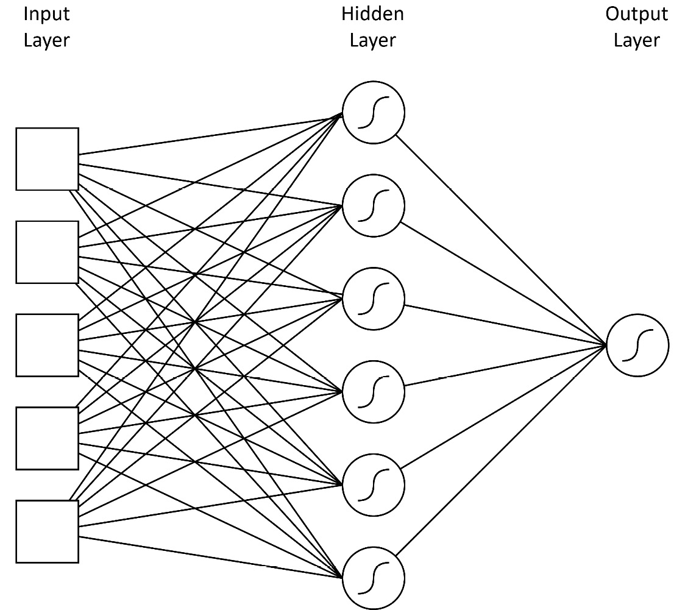

# 比较 LightGBM、XGBoost 和深度学习

上一章介绍了用于构建**梯度提升决策树（GBDTs**）的 LightGBM。在本章中，我们将 LightGBM 与两种用于建模表格数据的其他方法进行比较：XGBoost，另一个用于构建梯度提升树的库，以及**深度神经网络（DNNs**），一种最先进的机器学习技术。

我们在两个数据集上比较了 LightGBM、XGBoost 和 DNNs，重点关注复杂性、数据集准备、模型性能和训练时间。

本章面向高级读者，需要一些对深度学习的了解。然而，本章的主要目的不是详细了解 XGBoost 或 DNNs（这两种技术都不会在后续章节中使用）。相反，到本章结束时，你应该对 LightGBM 在机器学习领域中的竞争力有所了解。

主要内容包括：

+   XGBoost 概述

+   深度学习和 TabTransformers

+   比较 LightGBM、XGBoost 和 TabTransformers

# 技术要求

本章包括示例和代码片段，说明如何在 Python 中训练 LightGBM、XGBoost 和 TabTransformer 模型。完整的示例和设置本章所需环境的说明可在[`github.com/PacktPublishing/Practical-Machine-Learning-with-LightGBM-and-Python/tree/main/chapter-4`](https://github.com/PacktPublishing/Practical-Machine-Learning-with-LightGBM-and-Python/tree/main/chapter-4)找到。

# XGBoost 概述

**XGBoost**，即**极端梯度提升**，是一个广受欢迎的开源梯度提升库，其目标和功能与 LightGBM 类似。XGBoost 比 LightGBM 更早，由陈天奇开发，并于 2014 年首次发布*[1]*。

在其核心，XGBoost 实现了梯度提升决策树（GBDTs），并支持高效地构建它们。XGBoost 的一些主要特性如下：

+   **正则化**：XGBoost 结合了 L1 和 L2 正则化，以避免过拟合

+   **稀疏性感知**：XGBoost 高效地处理稀疏数据和缺失值，在训练过程中自动学习最佳插补策略

+   **并行化**：该库采用并行和分布式计算技术同时训练多个树，显著减少了训练时间

+   **提前停止**：如果模型性能没有显著提高，XGBoost 提供了一个选项来停止训练过程，从而提高性能并防止过拟合

+   **跨平台兼容性**：XGBoost 支持多种编程语言，包括 Python、R、Java 和 Scala，使其能够服务于多样化的用户群体

多年来，由于 XGBoost 支持各种应用以及库的易用性和效率，它在机器学习社区中获得了广泛的认可。

## 比较 XGBoost 和 LightGBM

XGBoost 和 LightGBM 在功能上有很多重叠。两个库都实现了 GBDTs 和 DART，并支持构建随机森林。它们都有类似的避免过拟合、处理缺失值和自动处理稀疏数据的技术。

然而，XGBoost 和 LightGBM 之间的一些差异如下：

+   **树增长策略**：XGBoost 采用按层级的树增长方法，即逐层构建树，而 LightGBM 使用按叶子的树增长策略，专注于通过选择具有最高 delta 损失的叶子来增长树。这种增长策略的差异通常使得 LightGBM 在大型数据集上运行更快。

+   **速度和可扩展性**：LightGBM 在设计上更注重内存使用和计算效率，使其成为大规模数据集或训练时间至关重要的场景下的更好选择。然而，这种速度优势有时可能会以模型预测中更高的方差为代价。

+   **处理分类特征**：LightGBM 内置了对分类特征的支持，这意味着它可以直接处理它们，而无需进行 one-hot 编码或其他预处理技术。另一方面，XGBoost 要求用户在将特征输入模型之前对分类特征进行预处理。

+   **早期停止**：XGBoost 提供了一个选项，如果模型性能没有显著改进，则停止训练过程。LightGBM 没有内置此功能，尽管可以通过回调手动实现，如前几章所示。

总结来说，LightGBM 和 XGBoost 提供了类似的功能。LightGBM 在具有许多特征的大型数据集上表现更好，而 XGBoost 可能在小型或中型数据集上提供更稳定和准确的结果。

## Python XGBoost 示例

XGBoost 提供了一个基于 scikit-learn 的接口来构建模型。以下示例展示了如何在 Forest Cover 数据集上使用 XGBoost：

```py
from xgboost import XGBClassifier
...
dataset = datasets.fetch_covtype()
X_train, X_test, y_train, y_test = train_test_split(
    dataset.data, dataset.target, random_state=179
    )
y_train = y_train - 1
y_test = y_test – 1
xgb = XGBClassifier(
    n_estimators=150, max_leaves=120, learning_rate=0.09
    )
xgb = xgb.fit(X_train, y_train)
f1_score(y_test, xgb.predict(X_test), average="macro")
```

在这个阶段，scikit-learn 的接口应该对你来说已经很熟悉了。前面的代码显示 XGBoost 支持与训练基于 LightGBM 模型时使用的类似超参数。完整的参数列表可在[`xgboost.readthedocs.io/en/stable/parameter.xhtml`](https://xgboost.readthedocs.io/en/stable/parameter.xhtml)找到。

XGBoost 作为 LightGBM 的直接替代品，是另一个梯度提升库。在下一节中，我们将探讨深度学习，这是一种完全不同但极其流行的学习技术，以及它与梯度提升在表格学习问题上的比较。

# 深度学习和 TabTransformers

我们现在来看一种使用深度学习解决基于表格的数据问题的方法。近年来，由于基于深度学习的模型性能出色，深度学习获得了巨大的普及。基于深度学习的技术，如 AlphaZero、Stable Diffusion 和 GPT 系列语言模型，在游戏、艺术生成和基于语言推理方面实现了人类或超人类的性能。

## 深度学习是什么？

**深度学习**是更广泛的机器学习领域中人工神经网络的一个子领域。人工神经网络是数学上模拟人脑的，由相互连接的节点层（或生物学术语中的“神经元”）组成，这些节点处理和传输信息。

简单的人工神经网络只包含几个层。深度学习中的“深度”一词指的是使用具有许多更多层的神经网络，每个层可能包含数千个神经元。这些层以层次结构组织，*输入*层在底部，*输出*层在顶部，*隐藏*层在中间。每个层在数据通过网络时提取和细化特征，使模型能够学习复杂的模式和表示。

下面的图展示了名为多层感知器的简单神经网络，它具有一个隐藏层。



图 4.1 – 具有一个隐藏层和输出层的多层感知器。层之间是完全连接的

每个神经元从其他神经元接收输入，执行数学运算，然后将结果传递给下一层的神经元。

数学运算涉及两个主要步骤 – 加权求和和激活函数：

1.  **加权求和**: 神经元接收输入（输入数据或前一个神经元的输出），将每个输入与其对应的权重相乘，然后将它们相加。通常还会添加一个偏差项到加权和中，以更好地控制神经元的输出。从数学上讲，这可以表示如下：

    z j = ∑ i (w ij x i) + b j

    在这里，x i 代表神经元的所有输入，w ij 是与第 i 个输入相关的权重，b j 是神经元的偏差。

1.  **激活函数**: 加权求和随后通过一个激活函数，确定神经元的输出。激活函数的目的是将非线性引入数学运算中。非线性使得神经网络能够模拟输入和输出之间的非线性关系，因此能够模拟复杂关系。存在各种激活函数，如**sigmoid**（对数函数）、**双曲正切**（**tanh**）和**修正线性单元**（**ReLU**），每个都有其自身的特性和用例。这可以表示为：

    a j = σ( z j)

    其中，a j 是神经元输出，σ 是激活函数。

结合这两个步骤，神经网络中的神经元处理输入数据，使网络能够学习和建模复杂模式。

神经网络通过调整与神经元相关的权重进行训练。算法可以概括如下：

1.  权重被初始化为小的随机值。

1.  执行**前向传播**：对于批次中的每个示例，将输入特征传递通过整个网络（在每个神经元计算总和和激活）以在输出层产生预测。

1.  然后通过比较批次中每个示例的实际输出和输出来计算损失。像 GBDTs 一样，损失函数必须是可微分的，标准损失函数包括均方误差（MSE）和交叉熵损失。

1.  **反向传播**被执行：使用微积分链式法则计算损失函数相对于权重的梯度。这个过程从输出层开始，反向通过网络进行。

1.  然后使用梯度下降或其现代变体（如 Adam）根据反向传播的梯度更新权重。

1.  该过程会重复进行一定数量的 epoch（每个 epoch 遍历整个数据集）以最小化损失函数。

神经网络的一个独特属性是，神经网络已被证明是**通用函数逼近器**。深度神经网络（DNNs）具有理论上的能力，在给定足够的隐藏神经元和适当的激活函数的情况下，可以将任何连续函数逼近到所需的精度水平。这一属性基于**通用逼近定理**，该定理已被证明适用于各种类型的神经网络。

这意味着神经网络可以学会表示输入和输出数据之间的复杂关系，无论这些关系多么复杂或非线性。这种能力是神经网络，尤其是 DNNs，成功解决不同领域广泛问题的一个原因。然而，这种保证是理论上的。在实践中，找到正确的网络架构、超参数和训练技术以实现所需的逼近水平可能具有挑战性。这个过程通常需要实验、专业知识和巨大的计算资源。

### 深度学习的优缺点

考虑到 DNNs 的能力，我们可能会认为它们应该是我们解决所有机器学习问题的首选。使用 DNNs 的主要优势在于它们在非常复杂的领域中的高精度：在广泛复杂任务、自然语言处理、生成式 AI、图像识别和语音识别等领域的当前最先进性能都是通过 DNNs 实现的，这得益于它们在大数据集中学习复杂和隐藏模式的能力。

另一个优点是自动特征提取。有了正确的架构，DNN 可以自动提取复杂或高阶特征，减轻了数据科学家进行特征工程的需求。

最后，深度神经网络（DNNs）还可以进行迁移学习：预先训练的深度学习模型可以在较小的数据集上进行微调，以完成特定任务，利用初始训练期间获得的知识。迁移学习可以显著减少新任务的训练时间和数据需求。

然而，深度学习并非解决所有机器学习问题的万能药。使用 DNNs 的一些缺点包括以下内容：

+   **计算资源**：深度学习模型在训练时通常需要大量的计算能力和内存，尤其是在处理大型数据集和复杂架构时。

+   **大型数据集**：DNNs 在大型数据集上进行训练时通常表现良好，但它们在小型数据集上的性能可能会下降。当数据集过小时，DNN 会对训练数据进行过度拟合，无法泛化到未见过的数据。

+   **可解释性**：由于 DNNs 具有复杂的架构和大量参数，它们通常被视为“黑盒”。这种复杂性使得理解模型如何做出决策变得困难，这可能对需要透明度或合规性应用造成担忧。

+   **超参数调整**：DNNs 涉及许多超参数，如网络架构、学习率和激活函数。结合较长的训练时间和资源需求，找到这些超参数的最佳组合可能既昂贵又耗时。

## 介绍 TabTransformers

我们希望将深度学习应用于表格数据，因为大多数实际机器学习问题都有表格数据。为此，我们使用一种新的深度学习架构，称为**TabTransformer**：一种专门设计用于处理表格数据的深度神经网络模型。

与 DNNs 的 GPT 系列类似，TabTransformer 基于 Vaswani 等人最初提出的 transformer 架构*[2]*。TabTransformer 将 transformer 架构调整为有效地处理表格数据，为这类数据提供了其他机器学习模型（如决策树和梯度提升机）的替代方案*[3]*。

![图 4.2 – 在 Keras 中实现的 TabTransformer 架构[3]](img/B16690_04_02.jpg)

图 4.2 – 在 Keras 中实现的 TabTransformer 架构[3]

TabTransformer 的模型架构如图*图 4*.2 所示。使用 TabTransformer，表格数据中的每个特征都被视为一个标记，类似于在自然语言处理中如何将单词视为标记。该模型应用自注意力机制来学习输入数据中特征之间的复杂交互和依赖关系。标记嵌入和注意力机制允许模型捕捉特征之间的全局和局部关系。

TabTransformer 模型有几个关键组件：标记嵌入、位置编码、Transformer 层、池化和输出层。标记嵌入将每个特征值转换为连续向量表示，并通过位置编码结合位置信息。

在*图 4**.2*中展示的层中移动，我们可以看到分类特征和数值特征是分开的。

分类特征首先通过嵌入层进行处理，如 Keras 中的`layers.Embedding`实现，然后传递到 Transformer 块。可以实施可变数量的 Transformer 块（使用超参数设置），但每个块都包含一个`layers.MultiHeadAttention`层和一个带有`Dropout`的`layers.Dense`层。输出值在通过注意力和密集层后相加并归一化。

由于它们的性能，Transformer 前馈层在我们的实现中使用了**高斯误差线性单元**（**GELU**）激活函数。然而，也可能使用其他激活函数*[5]*。

数值特征通过一个归一化层（归一化数值输入范围）传递，然后与 Transformer 的输出连接。

连接的结果通过一个`Dropout`层。我们的实现使用**缩放指数线性单元**（**SELU**），这导致激活自我归一化*[6]*。

最后，MLP 块的输出传递到损失函数，其实现取决于学习问题（分类或回归）。

TabTransformers 的实现和训练比梯度提升树复杂得多。与其他深度神经网络（DNNs）一样，TabTransformers 比梯度提升树需要更多的数据准备和计算能力。

除了 TabTransformers 之外，本节还介绍了深度学习及其优缺点。在下一节中，我们将通过一个实际例子比较不同的方法，包括与 TabTransformers 一起工作的复杂性。

# 比较 LightGBM、XGBoost 和 TabTransformers

在本节中，我们比较了 LightGBM、XGBoost 和 TabTransformers 在两个不同数据集上的性能。我们还探讨了针对不平衡类别、缺失值和分类数据的数据准备技术。

## 预测人口普查收入

我们使用的第一个数据集是人口普查收入数据集，该数据集根据教育、婚姻状况、职业等属性预测个人收入是否会超过$50,000*[4]*。该数据集有 48,842 个实例，正如我们将看到的，一些缺失值和不平衡的类别。

数据集可以从以下 URL 获取：[`archive.ics.uci.edu/ml/machine-learning-databases/adult/adult.data`](https://archive.ics.uci.edu/ml/machine-learning-databases/adult/adult.data)。数据已经被分为训练集和测试集。一旦加载，我们就可以采样数据：

```py
train_data.sample(5)[["age", "education", "marital_status", "hours_per_week", "income_bracket"]]
```

选择列的数据样本在 *表 4.1* 中显示。

|  | **年龄** | **教育程度** | **婚姻状况** | **每周工作小时数** | **收入区间** |
| --- | --- | --- | --- | --- | --- |
| 12390 | 34 | 部分大学 | 从未结婚 | 40 | <=50K |
| 20169 | 41 | 专科-学术 | 已婚平民配偶 | 45 | >50K |
| 17134 | 35 | 博士 | 从未结婚 | 60 | >50K |
| 23452 | 49 | 高中毕业 | 已婚平民配偶 | 40 | >50K |
| 22372 | 31 | 高中毕业 | 分居 | 45 | <=50K |

表 4.1 – 来自人口普查收入数据集的样本数据

*表 4.1* 显示我们拥有混合的数据类型：一些特征是数值型，而其他是文本型。值得注意的是，数据集中的一些列是**分类特征**：基于字符串的特征，具有一组固定的值。接下来，我们看看如何对这些特征进行编码以用于机器学习。

### 编码分类特征

大多数机器学习算法需要将基于字符串的特征编码为数字；在某些情况下，这可以自动完成。我们在*第六章**，使用 LightGBM 解决现实世界的数据科学问题*中讨论了 LightGBM 的自动编码。在这个例子中，我们编码特征以了解这意味着什么。

我们需要将每个分类值映射到一个唯一的数字；因此，我们首先为每个特征构建一个所有值的词汇表：

```py
CATEGORICAL_FEATURES_WITH_VOCABULARY = {
    "workclass": sort_none_last(list(train_data["workclass"].unique())),
    "education": sort_none_last(list(train_data["education"].unique())),
    "marital_status": sort_none_last(list(train_data["marital_status"].unique())),
    "occupation": sort_none_last(list(train_data["occupation"].unique())),
    "relationship": sort_none_last(list(train_data["relationship"].unique())),
    "race": sort_none_last(list(train_data["race"].unique())),
    "gender": sort_none_last(list(train_data["gender"].unique())),
    "native_country": sort_none_last(list(train_data["native_country"].unique())),
    "income_bracket": sort_none_last(list(train_data["income_bracket"].unique())),
}
```

以下代码提取了每列的唯一值到一个列表中，并对列表进行了排序，将`null`值放在最后。当使用 pandas DataFrame 时，明确地为分类列设置数据类型为`category`也是很有用的：

```py
for c in CATEGORICAL_FEATURES_WITH_VOCABULARY.keys():
    for dataset in [train_data, test_data]:
        dataset[c] = dataset[c].astype('category')
        dataset[c] = dataset[c].astype('category')
```

使用我们的词汇表，我们现在可以更新每列的值，用表示其类别的数字来表示（使用词汇表列表中的索引作为数值）：

```py
def map_to_index(val, vocab):
    if val is None:
        return None
    return vocab.index(val)
for dataset in (train_data, test_data):
    for feature, vocab in CATEGORICAL_FEATURES_WITH_VOCABULARY.items():
        dataset[feature] = dataset[feature].map(lambda val: map_to_index(val, vocab))
```

结果是一个 DataFrame，其中所有特征现在都是数值型的：

|  | **年龄** | **教育程度** | **婚姻状况** | **每周工作小时数** | **收入区间** |
| --- | --- | --- | --- | --- | --- |
| 18545 | 37 | 11 | 2 | 40 | 0 |
| 26110 | 51 | 14 | 0 | 60 | 1 |
| 21905 | 36 | 11 | 5 | 32 | 0 |
| 1496 | 32 | 1 | 0 | 43 | 1 |
| 3148 | 47 | 15 | 2 | 40 | 0 |

表 4.2 – 来自人口普查收入数据集的编码分类数据

我们现在已将分类特征编码，可以继续进行进一步的数据清理。

### 缺失值和重复值

我们需要检查缺失值、重复值和异常值。我们可以使用以下代码：

```py
train_data.isnull().sum()
train_data.drop_duplicates(inplace=True)
train_data.describe()
```

我们删除了重复数据，并查看`describe`的输出显示没有显著的异常值。然而，数据集中存在**缺失值**。LightGBM 和 XGBoost 可以自动处理缺失值，这是基于树的算法的一个显著优势。然而，对于 TabTransformers，我们需要实现特定的逻辑来处理缺失值，正如我们接下来将要看到的。

### 数据不平衡

该数据集也存在偏差：每个类别的示例数量不平衡。我们可以使用以下代码计算偏差：

```py
counts = np.bincount(train_data["income_bracket"])
class_weight = {
    0: counts[0] / train_data.shape[0],
    1: counts[1] / train_data.shape[0]
}
```

输出显示大约 75%/25%的偏斜倾向负类（`0`）。处理不平衡类（如果我们有二元类）的最简单方法之一是比负类更加强调正类。因此，在计算损失时，错过正类的预测有更大的影响。

LightGBM 和 XGBoost 都通过`scale_pos_weight`参数支持这一点，其计算方法如下：

```py
scale_pos_weight = class_weight[0]/class_weight[1]
```

### 训练 LightGBM 和 XGBoost 模型

数据清理和准备就绪后，我们现在可以训练我们的模型。训练 LightGBM 和 XGBoost 模型很简单。对于 LightGBM，我们有以下内容：

```py
model = lgb.LGBMClassifier(force_row_wise=True, boosting_type="gbdt", scale_pos_weight=scale_pos_weight)
model = model.fit(X_train, y_train)
```

对于 XGBoost，我们可以运行以下代码：

```py
model = xgb.XGBClassifier(scale_pos_weight=scale_pos_weight)
model = model.fit(X_train, y_train)
```

上述代码突出了使用这两个库的简单性。

### 训练 TabTransformer 模型

现在，我们将构建一个 TabTransformer 模型。我们将使用**TensorFlow 的 Keras**根据示例代码定义模型：[`keras.io/examples/structured_data/tabtransformer/`](https://keras.io/examples/structured_data/tabtransformer/)。

我们的数据集准备保持基本相同，有两个关键区别：我们不编码分类特征，并且必须显式处理缺失值。

我们不编码分类特征，因为 Keras 提供了一个特殊的层来执行字符串查找并将其转换为数值。然而，我们仍然必须提供词汇表。以下代码说明了创建查找层的示例：

```py
lookup = layers.StringLookup(
                vocabulary=vocabulary,
                mask_token=None,
                num_oov_indices=0,
                output_mode="int",
            )
```

`num_oov_indices`参数设置为`0`，这意味着如果没有设置`mask_token`参数为`None`，则不使用任何索引，因为我们没有对任何字符串输入进行掩码。

我们需要为数据集中的每一列提供一个默认值来处理缺失值。我们的策略是用默认字符串值`NA`替换字符串值，对于数值列，我们使用统计平均值来填充缺失值。以下代码创建了一个默认值列表：

```py
train_data_description = train_data.describe()
COLUMN_DEFAULTS = [
    train_data_description[feature_name]["mean"] if feature_name in NUMERIC_FEATURE_NAMES else ["NA"]
    for feature_name in HEADERS
]
```

实现 TabTransformer 模型的 Keras 代码大约有 100 行长，可在我们的 GitHub 仓库中找到：[`github.com/PacktPublishing/Practical-Machine-Learning-with-LightGBM-and-Python/blob/main/chapter-4/tabtransformer-census-income.ipynb`](https://github.com/PacktPublishing/Practical-Machine-Learning-with-LightGBM-and-Python/blob/main/chapter-4/tabtransformer-census-income.ipynb)。

以下代码设置了我们可以用于 TabTransformer 模型的梯度优化器和数据：

```py
optimizer = tfa.optimizers.AdamW(
    learning_rate=learning_rate,
    weight_decay=weight_decay
)
model.compile(
    optimizer=optimizer,
    loss=keras.losses.BinaryCrossentropy(),
    metrics=[keras.metrics.BinaryAccuracy(name="accuracy"),
             f1_metric,
             precision_metric,
             recall_metric],
)
train_dataset = get_dataset_from_csv(
    train_data_file, batch_size, shuffle=True
)
validation_dataset = get_dataset_from_csv(
    test_data_file, batch_size
)
```

我们使用带有权重衰减*[7]*的`AdamW`优化器以及二元交叉熵损失函数来拟合二元分类问题。然后我们可以使用以下代码来训练和评估我们的模型：

```py
callback = keras.callbacks.EarlyStopping(
    monitor='loss', patience=3
)
history = model.fit(
    train_dataset,
    epochs=num_epochs,
    validation_data=validation_dataset,
    class_weight=class_weight,
    callbacks=[callback]
)
model.evaluate(validation_dataset, verbose=0)
```

我们还通过 Keras 回调添加了提前停止，耐心为`3`个 epoch。在训练和验证过程中，我们跟踪准确率和 F1 分数。

训练时间显著长于任何梯度提升框架，并且需要 GPU（在 CPU 上训练在技术上可行，但需要不寻常的时间）。

我们现在可以查看三种算法在人口普查收入数据集上的结果。

### 结果

使用前一章中讨论的网格搜索技术对所有三种算法进行了参数优化。对于两种提升算法，优化了学习率、bin 大小和树的数量。对于 TabTransformer，必须优化参数和架构的各个方面。在参数方面，优化了学习率、权重衰减和 dropout 率，而在架构方面，必须选择 transformer 块的数量和隐藏层（在 MLP 中）的数量。优化后的参数可在源代码中找到。

下表显示了算法的验证集结果。

| **模型** | **训练时间** | **准确率** | **F1 分数** |
| --- | --- | --- | --- |
| LightGBM GBDT | **1.05s** | **84.46%** | 0.71 |
| XGBoost GBDT | 5.5s | 84.44% | **0.72** |
| TabTransformer | 113.63s | 77.00% | 0.64 |

表 4.3 – 在人口普查收入数据集上训练三种模型的结果

XGBoost 和 LightGBM 在数据集上的表现相似，达到了 84% 的准确率和 0.7 的 F1 分数。TabTransformer 模型的表现较差，准确率和 F1 分数都较低。

关于训练时间，LightGBM 比其他方法快得多。LightGBM 模型的训练速度比 XGBoost 快 5.23 倍，比 TabTransformer 快 108.22 倍。TabTransformer 在一个 8 核 P4000 GPU 上训练了 15 个 epoch。

为了进行另一个比较点，并说明当没有分类特征时 TabTransformer 架构如何进行适配，我们使用三种算法解决第二个问题。

## 检测信用卡欺诈

我们的第二个任务是检测信用卡交易数据集中的欺诈交易*[8]*。数据集可在 [`www.kaggle.com/datasets/mlg-ulb/creditcardfraud`](https://www.kaggle.com/datasets/mlg-ulb/creditcardfraud) 获取。该任务是一个二元分类问题，训练数据中的交易被标记为非欺诈（`0`）和欺诈（`1`）。数据集仅包含已匿名化的数值特征，以保护机密性。值得注意的是，数据集高度不平衡，欺诈交易仅占数据的 0.17%。

### 训练 LightGBM 和 XGBoost 模型

由于所有值都是数值型，对于梯度提升模型，所需的数据准备非常少。为了抵消数据集中的不平衡，我们再次计算`scale_pos_weight`并将其作为参数传递给模型。我们对 LightGBM 和 XGBoost 模型进行网格搜索和交叉验证，以找到良好的超参数。对于 LightGBM，尝试了 DART 和 GBDT 模型，DART 表现更好。与人口普查收入数据集不同，信用卡数据集没有预先分成训练集和测试集。因此，我们应用五折交叉验证来衡量未见数据的表现。以下代码训练了 LightGBM 模型，XGBoost 的代码非常相似：

```py
model = lgb.LGBMClassifier(force_row_wise=True, boosting_type="dart", learning_rate=0.0023, max_bin=384, n_estimators=300, scale_pos_weight=scale_pos_weight, verbose=-1)
scores = cross_val_score(model, X, y, scoring="f1_macro")
print(f"Mean F1-score: {scores.mean()}")
```

LightGBM 和 XGBoost 的结果以及 TabTransformer 的结果都显示在*表 4.4*中。

### 训练 TabTransformer 模型

没有分类特征时，TabTransformer 架构可以显著简化。让我们看看*图 4*.2 所示的架构。我们可以看到，嵌入层和注意力层不再需要。实际上，*模型简化为常规的多层感知器（MLP）*（由于根本不使用注意力层，所以仍然称模型为 transformer 是不诚实的）。

除了移除不必要的层之外，架构和过程的其他部分与人口普查收入问题相同。再次使用`AdamW`作为优化器，我们对模型的超参数和隐藏层数量进行网格搜索优化。与梯度提升模型一样，执行五折交叉验证来衡量性能。

### 结果

虽然接下来也会报告准确率，但重要的是要注意，在数据不平衡的情况下，它不是一个好的性能指标。在数据集中，99.82%的样本属于一个类别，一个只预测该类别的模型将具有 99.82%的准确率，并且完全无意义。F1 分数不受类别不平衡的影响，在数据不平衡的数据集中仍然是分类性能的好指标。以下表格显示了所有三个算法的五折交叉验证结果。

| **模型** | **训练时间** | **准确率** | **F1 分数** |
| --- | --- | --- | --- |
| LightGBM GBDT | **113 秒** | **99.88%** | 0.80 |
| XGBoost GBDT | 351 秒 | 98.41% | **0.82** |
| TabTransformer | 528.59 秒 | 93.37% | 0.05 |

表 4.4 – 在信用卡欺诈数据集上训练三个模型的结果。训练时间包括五折交叉验证

XGBoost 和 LightGBM 在数据集上的表现非常相似，分别获得 F1 分数为 0.82 和 0.80。DNN 在处理这个问题上表现显著不佳，即使使用类权重来补偿不平衡的数据集，F1 分数也只有 0.05。

在深度神经网络（DNN）中调试性能问题非常棘手。由于构建和训练 DNN 模型复杂性和不透明性，微小的变化都可能产生重大影响。

可能导致性能不佳的原因包括以下几方面：

+   **模型架构不足**：这是最可能的原因。架构不适合该问题。需要进一步实验以改进架构、层的大小，甚至神经网络的类型。

+   **训练不足**：模型可能训练时间不够长。增加训练轮数可以提高性能。然而，在我们的实验中，损失在 10 个轮次后停滞（尽管训练继续到 15 轮）。

+   `BinaryCrossentropy` 损失函数与类别权重。然而，可以尝试更高级的损失函数，例如焦点损失，*[9]*。

在训练和验证时间方面，与人口普查收入数据集的情况类似。LightGBM 模型训练和验证的速度显著快于其他方法：比 XGBoost 快 3.1 倍，比 DNN 快 4.62 倍。

# 摘要

在本章中，我们讨论了两种可能用于解决表格学习问题的额外算法：XGBoost，另一个梯度提升框架，以及 TabTransformer，一种深度学习方法。

我们展示了如何在两个数据集上设置和训练 XGBoost 模型和 TabTransformer，以及如何为基于树和神经网络的模型编码分类特征。这两个数据集也具有不平衡的类别，我们在训练过程中必须对此进行补偿。

我们发现 LightGBM 和 XGBoost 产生了类似准确度的模型，但 LightGBM 训练模型的速度更快，效率更高。我们还看到了训练深度神经网络（DNN）的复杂性以及在这些问题上的表现不佳。深度学习是一种极其强大的技术，但在处理表格数据集时，基于树的算法通常更适用。

在下一章中，我们将重点介绍使用名为**Optuna**的框架进行更有效的 LightGBM 参数优化。

# 参考文献

| *[**1]* | *陈 T. 和 Guestrin C., “XGBoost，” 在第 22 届 ACM SIGKDD 国际知识发现和数据挖掘会议论文集中，2016.* |
| --- | --- |
| *[**2]* | *瓦斯瓦尼 A., 沙泽尔 N., 帕尔玛 N., 乌斯克雷特 J., 琼斯 L., 戈麦斯 A. N., 凯撒 L. 和 波罗斯库欣 I., 注意力即一切，2017.* |
| *[**3]* | *黄 X., 克坦 A., Cvitkovic M., 和 Karnin Z., TabTransformer：使用上下文嵌入进行表格数据建模，2020.* |
| *[**4]* | *贝克尔 R., Adult，UCI 机器学习库，1996.* |
| *[**5]* | *亨德里斯克 D. 和 吉姆佩尔 K., 高斯误差线性单元（GELUs），2020.* |
| *[**6]* | *克拉姆鲍尔 G., 优特纳 T., 梅尔 A. 和 高切尔瑞特 S., 自归一化神经网络，2017.* |
| *[**7]* | *洛什奇洛夫 I. 和 胡特 R., 解耦权重衰减正则化，2019.* |
| *[**8]* | *达洛佐洛 A., 凯伦 C., 约翰逊 R. 和 博特姆皮 G., “使用欠采样校准不平衡分类的概率，” 2015.* |
| *[**9]* | *T.-Y. 林，P. 戈亚尔，R. 吉里斯，K. 何和 P. 多拉尔，密集目标检测的 Focal Loss，2018.* |

# 第二部分：使用 LightGBM 的实用机器学习

第二部分深入探讨了支撑实用机器学习工程的复杂过程，从通过名为**Optuna**的框架进行高效的超参数优化开始。然后，我们将过渡到对数据科学生命周期的全面探索，展示了从问题定义和数据处理到实际数据科学建模应用的严谨步骤。本部分的结尾，焦点将转向自动化机器学习，重点关注 FLAML 库，该库旨在简化并简化模型选择和调整。在整个部分中，结合案例研究和实际操作示例，将提供一条清晰的路线图，以充分利用这些高级工具的潜力，强调效率和优化的主题。

本部分将包括以下章节：

+   *第五章**，使用 Optuna 进行 LightGBM 参数优化*

+   *第六章**，使用 LightGBM 解决现实世界的数据科学问题*

+   *第七章**，使用 LightGBM 和 FLAML 进行 AutoML*
