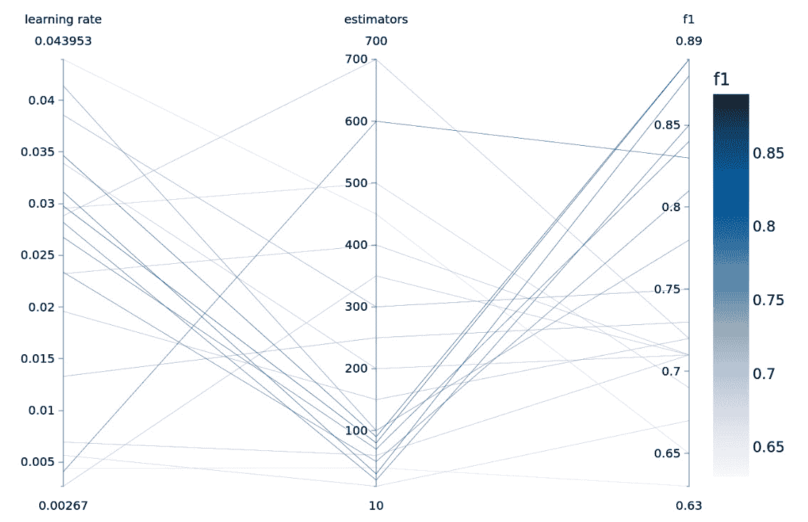
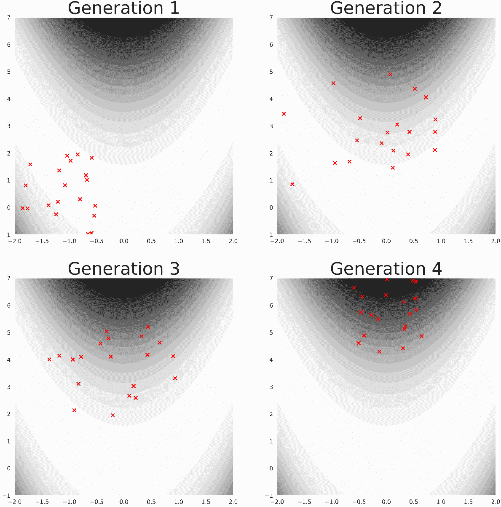
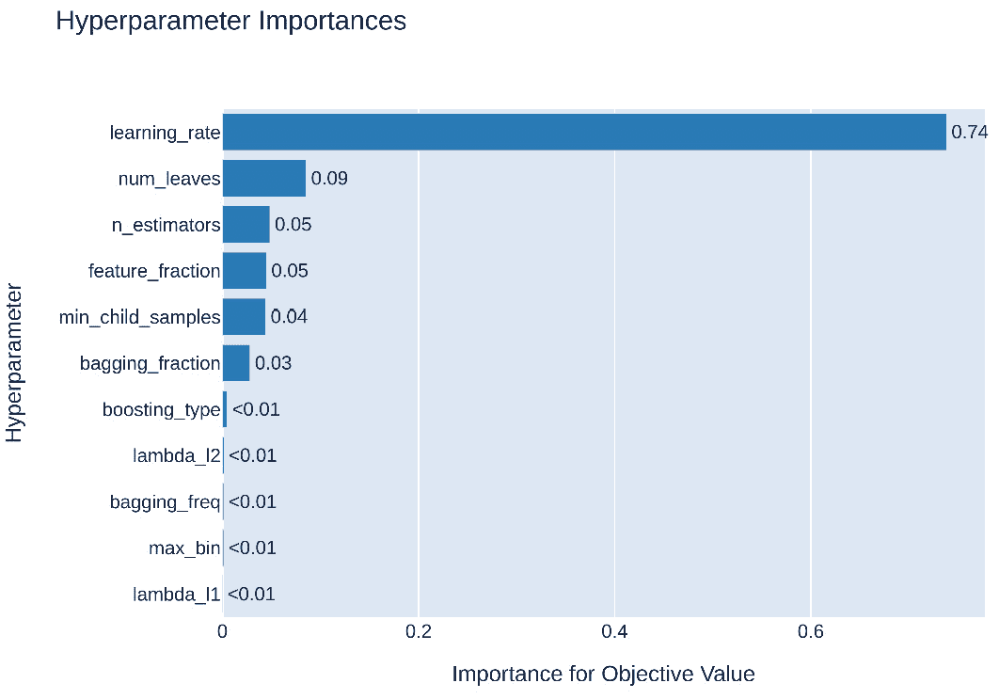
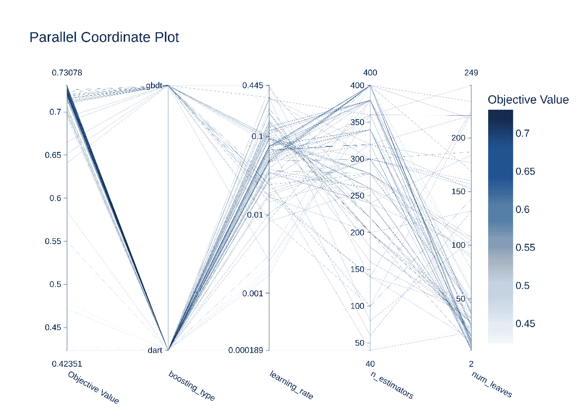
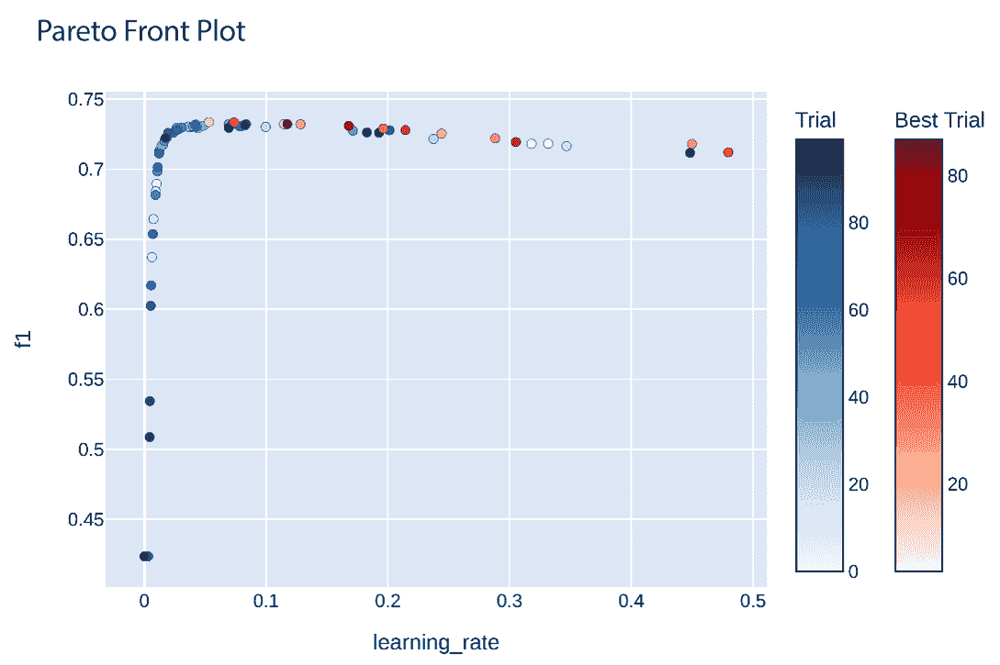

# 5

# 使用 Optuna 进行 LightGBM 参数优化

前几章讨论了 LightGBM 的超参数及其对构建模型的影响。构建新模型时的一个基本问题是找到最佳超参数以实现最佳性能。

本章重点介绍使用名为 Optuna 的框架进行参数优化过程。讨论了不同的优化算法以及超参数空间的剪枝。一个实际示例展示了如何将 Optuna 应用于寻找 LightGBM 的最佳参数。还展示了 Optuna 的高级用例。

本章的主要内容包括以下内容：

+   Optuna 和优化算法

+   使用 Optuna 优化 LightGBM

# 技术要求

本章包括示例和代码片段，说明如何使用 Optuna 对 LightGBM 进行参数优化研究。完整的示例和设置本章所需环境的说明可在 [`github.com/PacktPublishing/Practical-Machine-Learning-with-LightGBM-and-Python/tree/main/chapter-5`](https://github.com/PacktPublishing/Practical-Machine-Learning-with-LightGBM-and-Python/tree/main/chapter-5) 获取。

# Optuna 和优化算法

前几章的示例表明，为问题选择最佳超参数对于解决机器学习问题至关重要。超参数对算法的性能和泛化能力有显著影响。最佳参数也特定于所使用的模型和要解决的问题。

其他复杂超参数优化的因素如下：

+   **成本**：对于每一组独特的超参数集合（可能有很多），必须执行整个训练过程，通常包括交叉验证。这非常耗时且计算成本高昂。

+   **高维搜索空间**：每个参数可以有一个广泛的潜在值范围，使得测试每个值变得不可能。

+   **参数交互**：单独优化每个参数通常是不可能的，因为某些参数的值会与其他参数的值相互作用。一个很好的例子是 LightGBM 中的学习率和估计器的数量：更少的估计器需要更大的学习率，反之亦然。这种现象在 *图 5.1* 中显示。



图 5.1 – 一个并行坐标图，显示了学习率和估计器数量之间的参数交互：拥有更多估计器需要更低的 learning rate，反之亦然

*图 5.1*使用一种称为**平行坐标图**的技术来可视化参数交互。平行坐标图是一种用于表示高维数据的可视化工具，因此对于可视化超参数优化的结果特别有用。每个维度（在此上下文中，指超参数）被描绘为一条垂直轴，平行排列。每个轴的范围反映了超参数可以假设的值的范围。每个超参数的配置都被描绘为一条穿过所有这些轴的线，每个轴上的交点表示给定配置中该超参数的值。线条还可以根据性能指标，如验证准确率，进行着色编码，以区分哪些超参数组合产生更好的结果。

平行坐标图之美在于它们能够展示多个超参数之间的关系及其对性能的累积影响，例如*图 5.1*中所示的超参数交互。观察线条的聚类或颜色相似性，我们可以了解超参数之间的趋势和复杂的相互依赖关系。这种可视化多维模式的能力有助于数据科学家确定哪些超参数值或组合最有利于模型性能的最优化。

由于超参数优化的挑战和复杂性，寻找最佳参数的直观方法是手动优化。在手动优化中，人类从业者根据直观理解和经验选择参数。使用这些参数训练模型，然后重复此过程，直到找到令人满意的参数。手动优化易于实现，但由于过程中涉及人类，因此非常耗时。人类的直觉也可能出错，并且很容易错过好的参数组合。

注意

寻找最佳参数的过程通常被称为**参数研究**。研究中测试的每个配置（参数组合）被称为**试验**。

在前几章的示例中，我们迄今为止使用的方法是**网格搜索**。使用网格搜索，我们设置一个参数网格，包括每个参数和潜在值的范围，并彻底测试每个可能的组合以找到最佳值。

网格搜索很好地解决了参数交互问题：由于每个可能的组合都进行了测试，每个交互都被考虑在内。

然而，使用网格搜索的缺点是成本。由于我们彻底测试了每个参数组合，试验次数迅速变得难以承受，尤其是在添加更多参数的情况下。例如，考虑以下网格：

```py
params = {"learning_rate": [0.001, 0.01, 0.1],
          "num_leaves": [10, 20, 50, 100],
          "num_estimators": [100, 200, 500]}
```

对此网格进行的优化研究需要 36 次试验。仅添加一个具有两个可能值的额外参数就会将研究成本翻倍。

需要的是一个算法和框架，能够在有限的试验次数内智能地优化我们控制的参数。为此目的，存在几个框架，包括用于调整机器学习模型的 Python 库 SHERPA；另一个用于在复杂搜索空间中进行参数优化的 Python 库 Hyperopt；以及专门针对 Keras 的工具 Talos。然而，在下一节以及本章的其余部分，我们将探讨**Optuna**，这是一个旨在自动化调整机器学习模型的框架。

## 介绍 Optuna

Optuna 是一个开源的**超参数优化**（**HPO**）框架，旨在自动化寻找机器学习模型的最佳超参数 ([`optuna.org/`](https://optuna.org/))。它用 Python 编写，可以轻松集成到各种机器学习库中，包括 LightGBM。

Optuna 提供了高效的优化算法，以更有效地搜索超参数空间。除了优化算法之外，Optuna 还提供了剪枝策略，通过剪枝表现不佳的试验来节省计算资源和时间。

除了优化和剪枝算法之外，Optuna 还提供了一个易于使用的 API，用于定义参数类型（整数、浮点或分类），创建和自动化可恢复的优化研究，以及可视化优化运行的结果。在本章的后面部分，我们将看到如何实际使用该 API。

## 优化算法

Optuna 提供了几个高效的优化算法。在本节中，我们重点关注两种可用的算法：**树结构帕累托估计器**（**TPE**）和**协方差矩阵自适应进化策略**（**CMA-ES**）算法。

### TPE

要理解 TPE，我们首先必须知道什么是帕累托估计器。

帕累托估计器，或**核密度估计器**（**KDE**），是一种用于估计一组数据点概率分布的技术。它是一种非参数方法，这意味着它不假设数据有任何特定的潜在分布。相反，它试图根据观察到的数据点“学习”分布。

假设你有一组数据点，并想知道数据是如何分布的。一种方法是在每个数据点上放置小的“山丘”（核函数）。这些“山丘”可以有不同的形状，例如高斯（钟形）或均匀（箱形）。任何点的“山丘”高度代表新数据点落在该位置的可能性。帕累托估计器通过将这些“山丘”相加来创建一个平滑的地形，代表数据的估计概率分布。

在 TPE 的情况下，我们关心的数据点是参数组合，概率分布是一组参数被认为是“好”或“坏”的可能性 [1]，[2]。

TPE 首先采样一些随机组合的超参数，并评估每个组合的模型性能。基于这些初步结果，TPE 将超参数组合分为两组：`良好`（那些导致更好性能的组合）和`不良`（那些导致更差性能的组合）：

+   l(x)：`良好`配置的概率密度函数

+   g(x) : `不良`配置的概率密度函数

TPE 随后使用 Parzen 估计技术估计`良好`和`不良`两组超参数组合的概率分布。

在概率分布估计可用的情况下，TPE 计算超参数配置的**期望改进**（**EI**）。EI 可以计算为两个密度之间的比率：l(x) _ g(x)。每次试验，算法都会采样新的超参数配置，以最大化 EI。

TPE 中的树结构来源于算法在超参数搜索空间内处理参数交互的能力，其中特定超参数的相关性取决于其他超参数的值。为了处理这种情况，TPE 构建了一个层次结构，捕捉不同超参数之间的关系，并相应地调整采样过程。

总结来说，TPE 估计`良好`和`不良`参数的分布，并利用它们通过最大化新试验的期望改进来寻找最佳参数。由于 TPE 可以近似分布并以最优方式（非穷举方式）搜索更好的参数，因此它具有成本效益。TPE 还可以处理参数交互。

Optuna 提供的另一种算法是 CMA-ES 算法，我们将在下文中讨论。

### CMA-ES

CMA-ES 是另一种可以用来寻找最佳超参数的优化算法[3]。与 TPE 相比，CMA-ES 非常适合涉及连续变量以及搜索空间非线性且非凸的情况。

CMA-ES 是**进化算法**（**EA**）的一个例子。EA 是一种受自然进化过程启发的优化算法。它通过模拟自然界通过选择、繁殖、突变和遗传进化物种的方式，旨在找到问题的最佳解决方案。进化算法从候选解决方案的种群开始，并在每一代中修改候选方案以更接近最佳解决方案。这种代际过程在*图 5.2*中展示。



图 5.2 – 一个二维图示，展示了候选解（红色 x 标记）随着每一代后续演变，以逼近全局最优解（位于每个景观的顶部和中心）。在 CMA-ES 的上下文中，每个候选解代表一组超参数值的组合，算法的性能决定了最优解。

CMA-ES 的进化过程的核心是协方差矩阵。协方差矩阵是一个表示变量对（在 CMA-ES 的情况下，是超参数）之间协方差的正方形、对称矩阵，提供了它们之间关系的洞察。矩阵的对角元素代表单个变量的方差，而矩阵的非对角元素代表变量对的协方差。当存在正协方差时，它表示变量通常在同一方向上移动，要么增加要么减少。相反，负协方差指向一种关系，其中一个变量上升时，另一个变量倾向于下降，反之亦然。协方差为零表示变量之间没有线性关系。

当优化超参数时，CMA-ES 应用以下进化原则：

1.  在超参数搜索空间内，初始化平均值和协方差矩阵。

1.  重复进化过程：

    1.  使用平均值和协方差矩阵从搜索空间生成候选解。每个候选解代表一组超参数值的组合。

    1.  评估候选解的适应度。**适应度**指的是候选解的质量或它解决优化问题的程度。在 CMA-ES 中，这意味着使用候选超参数在数据集上训练模型，并在验证集上评估性能。

    1.  从种群中选择最佳候选解。

    1.  从最佳候选解更新平均值和协方差矩阵。

    1.  重复进行试验，直到达到最大试验次数或种群适应度不再提高。

CMA-ES 在复杂搜索空间中表现良好，并智能地采样搜索空间，由协方差矩阵引导。当超参数搜索空间复杂且非线性，或者验证数据的评估有噪声（例如，当指标是一个不一致的性能指标）时，这很有益。

TPE 和 CMA-ES 都解决了超参数优化相关的问题：两种算法都有效地搜索高维搜索空间。两种算法都捕捉参数交互。两种算法都让我们对成本有了控制：我们可以决定我们的优化预算，并将搜索限制在那个范围内。

TPE 和 CMA-ES 之间的主要区别在于它们整体的方法。TPE 是一个具有顺序搜索策略的概率模型，与基于群体的 CMA-ES 相比，CMA-ES 会并行评估解决方案。这通常意味着 TPE 在搜索中更具探索性，而 CMA-ES 通过群体控制机制平衡探索和利用。然而，TPE 通常比 CMA-ES 更有效率，尤其是在参数数量较少的情况下。

Optuna 为剪枝无效试验的搜索过程提供了进一步的优化。接下来，我们将讨论一些剪枝策略。

## 剪枝策略

剪枝策略是指通过剪枝这些试验来避免在无望的试验上浪费优化时间的方法。剪枝与模型训练过程同步发生：在训练过程中检查验证误差，如果算法表现不佳，则停止训练。这样，剪枝类似于*早期停止*。

### 中值剪枝

Optuna 提供了多种剪枝策略，其中最简单的一种是**中值剪枝**。在中值剪枝中，每个试验在 *n* 步之后报告一个中间结果。然后取中间结果的平均值，并停止任何在相同步骤中低于先前试验中值的结果。

### 连续减半和 Hyperband

一种更复杂的策略被称为**连续减半**[4]。它采取了一种更全局的方法，并将相同的小预算的训练步骤分配给所有试验。连续减半然后迭代进行：在每个迭代中，评估每个试验的性能，并选择候选者中的上半部分进入下一轮，而下半部分被剪枝。下一轮的训练预算加倍，然后重复此过程。这样，优化预算被花在最有希望的候选者上。因此，一小部分优化预算被用于消除表现不佳的候选者，而更多的资源被用于寻找最佳参数。

**Hyperband** 是另一种剪枝技术，它通过结合随机搜索和多括号资源分配策略来扩展连续减半[5]。虽然连续减半通过迭代剪枝表现不佳的候选配置并分配更多资源给剩余的有希望的配置，从而有效地缩小候选配置集，但它依赖于一个固定的初始配置集和单一的资源分配方案。

Hyperband 而是使用多区间资源分配策略，将总计算预算分成几个区间，每个区间代表不同级别的资源分配。在每个区间内，应用连续减半来迭代消除表现不佳的配置，并将更多资源分配给剩余的有希望的配置。在每个区间的开始，使用随机搜索采样一个新的超参数配置集，这允许 Hyperband 更广泛地探索超参数空间并降低错过良好配置的风险。这种并发过程使 Hyperband 能够在搜索过程中自适应地平衡探索和利用，最终导致更高效和有效的超参数调整。

Optuna 对优化算法及其相应的剪枝策略进行了实证研究[`github.com`](https://github.com/optuna/optuna/wiki/Benchmarks-with-Kurobako)/optuna/optuna/wiki/Benchmarks-with-Kurobako)。*实证研究表明，Hyperband 是最佳的 TPE 或 CMA-ES 优化策略*。

本节概述了 Optuna 所使用的理论和算法，重点关注 TPE、CMA-ES 和高级剪枝策略。在下一节中，我们将实际应用 Optuna 到一个与 LightGBM 相关的机器学习问题上。

# 使用 Optuna 优化 LightGBM

我们将使用分类示例来演示如何应用 Optuna。我们将要建模的问题是为电信提供商预测客户流失（*是*/*否*）。数据集可以从[`github.com/IBM/telco-customer-churn-on-icp4d/tree/master/data`](https://github.com/IBM/telco-customer-churn-on-icp4d/tree/master/data)获取。数据描述了每个客户使用提供商可用的数据——例如，性别、客户是否支付互联网服务费、是否有无纸化账单、是否支付技术支持费以及他们的月度费用。数据包括数值和分类特征。数据已经过清洗且平衡，这使我们能够专注于参数优化研究。

我们首先定义参数研究的目标。`objective` 函数为每个试验调用一次。在这种情况下，我们希望在数据上训练一个 LightGBM 模型并计算 F1 分数。Optuna 将一个 `trial` 对象传递给 `objective` 函数，我们可以使用它来设置特定试验的参数。以下是一个示例代码片段，展示了如何定义带有参数的 `objective` 函数：

```py
def objective(trial):
        boosting_type = trial.suggest_categorical(
            "boosting_type", ["dart", "gbdt"])
        lambda_l1= trial.suggest_float(
            'lambda_l1', 1e-8, 10.0, log=True),
...
        min_child_samples= trial.suggest_int(
            'min_child_samples', 5, 100),
        learning_rate = trial.suggest_float(
            "learning_rate", 0.0001, 0.5, log=True),
        max_bin = trial.suggest_int(
            "max_bin", 128, 512, 32)
        n_estimators =  trial.suggest_int(
            "n_estimators", 40, 400, 20)
```

在这里，我们可以看到我们如何使用 `trial` 提供的方法来设置超参数。对于每个参数，优化算法在指定的范围内建议一个值。我们可以使用 `trial.suggest_categorical` 建议分类变量（如 `boosting` 类型所示），并分别使用 `suggest_int` 和 `suggest_float` 建议整数和浮点参数。在建议浮点数或整数时，指定一个范围，可选地还可以指定步长：

```py
n_estimators =  trial.suggest_int(
            name="n_estimators", low=40, high=400, step=20)
```

设置步长意味着优化算法不会在范围内建议任何任意值，而是将建议限制在上下限之间的步长（40, 60, 80, 100, …, 400）。

我们还可以选择通过为数值参数传递 `log=True` 来对可能值的范围进行对数缩放。对数缩放参数范围的效果是，在范围的下限附近测试更多的值，而在上限附近（对数地）测试较少的值。对数缩放特别适合学习率，因为我们希望关注较小的值，并通过指数增加测试值直到上限。

要在训练 LightGBM 模型时应用剪枝，Optuna 提供了一个专门定制的回调函数，该回调函数与优化过程集成：

```py
pruning_callback = optuna.integration.LightGBMPruningCallback(trial, "binary")
```

在创建回调函数时，我们必须指定一个错误度量标准，在我们的情况下，我们为二进制错误指定 `"binary"`。

在设置好超参数后，我们可以像平常一样拟合，传递参数和回调函数：

```py
model = lgb.LGBMClassifier(
    force_row_wise=True,
    boosting_type=boosting_type,
    n_estimators=n_estimators,
    lambda_l1=lambda_l1,
    lambda_l2=lambda_l2,
    num_leaves=num_leaves,
    feature_fraction=feature_fraction,
    bagging_fraction=bagging_fraction,
    bagging_freq=bagging_freq,
    min_child_samples=min_child_samples,
    learning_rate=learning_rate,
    max_bin=max_bin,
    callbacks=[pruning_callback],
    verbose=-1)
scores = cross_val_score(model, X, y, scoring="f1_macro")
return scores.mean()
```

我们使用五折交叉验证和 F1 宏分数作为评分标准来训练模型。最后，`objective` 函数返回 F1 分数的平均值作为试验评估。

我们已经准备好使用定义的 `objective` 函数开始一个优化研究。我们创建一个采样器、剪枝器和研究本身，然后调用 `optimize` 并传递我们的 `objective` 函数：

```py
sampler = optuna.samplers.TPESampler()
pruner = optuna.pruners.HyperbandPruner(
    min_resource=10, max_resource=400, reduction_factor=3)
study = optuna.create_study(
    direction='maximize', sampler=sampler,
    pruner=pruner
)
study.optimize(objective(), n_trials=100, gc_after_trial=True, n_jobs=-1)
```

我们使用 TPE 优化算法作为采样器，与 Hyperband 剪枝一起使用。Hyperband 剪枝器指定的最小和最大资源控制了每个试验训练的最小和最大迭代次数（或估计器）。在应用剪枝时，缩减因子控制每个减半回合中提升的试验数量。

通过指定优化方向（`maximize` 或 `minimize`）来创建研究。在这里，我们正在优化 F1 分数，因此我们希望最大化这个值。

我们随后调用 `study.optimize` 并设置我们的优化预算：`n_trials=100`。我们还执行了一个内存优化设置，`gc_after_trial=True`。执行 `n_jobs=-1` 将并行运行与 CPU 核心数量相同的试验。

在运行优化后，我们可以通过调用以下代码来获取最佳试验和参数：

```py
print(study.best_trial)
```

上述示例展示了如何有效地将 Optuna 应用于寻找 LightGBM 超参数。接下来，我们将探讨 Optuna 框架的一些高级特性。

## 高级 Optuna 特性

当优化大型机器学习问题的超参数时，优化过程可能需要持续数天或数周。在这些情况下，保存优化研究并在以后恢复它有助于防止数据丢失或将研究迁移到不同的机器之间。

### 保存和恢复优化研究

Optuna 支持两种方式来保存和恢复优化研究：**内存中**和使用**远程**数据库（**RDB**）。

当在内存中运行研究时，可以应用标准的 Python 序列化对象的方法。例如，可以使用`joblib`或`pickle`。我们使用`joblib`来保存研究：

```py
joblib.dump(study, "lgbm-optuna-study.pkl")
```

为了恢复和继续研究，我们需要反序列化`study`对象并继续优化：

```py
study = joblib.load("lgbm-optuna-study.pkl")
study.optimize(objective(), n_trials=20, gc_after_trial=True, n_jobs=-1)
```

运行研究在内存中的替代方法是使用关系数据库。当使用关系数据库时，研究的中间（试验）和最终结果将持久化在 SQL 数据库后端。RDB 可以托管在单独的机器上。可以使用 SQLAlchemy 支持的任何 SQL 数据库（https://docs.sqlalchemy.org/en/20/core/engines.xhtml#database-urls）。

在我们的示例中，我们使用 SQLite 数据库作为关系数据库（RDB）：

```py
study_name = "lgbm-tpe-rdb-study"
storage_name = f"sqlite:///{study_name}.db"
study = optuna.create_study(
    study_name=study_name,
    storage=storage_name,
    load_if_exists=False,
    sampler=sampler,
    pruner=pruner)
```

Optuna 管理着与关系数据库（RDB）的连接和结果的持久化。在设置连接后，优化可以像往常一样进行。

从 RDB 后端恢复研究很简单；我们指定相同的`storage`并将`load_if_exists`设置为`True`：

```py
study = optuna.create_study(study_name=study_name, storage=storage_name, load_if_exists=True)
```

### 理解参数影响

在许多情况下，在解决特定问题时更好地理解超参数的影响也是很有价值的。例如，`n_estimators`参数直接影响到模型的计算复杂度。如果我们知道该参数不太重要，我们可以选择较小的值来提高我们模型的运行时性能。Optuna 提供了几种可视化方法，以深入了解研究的结果并洞察超参数。

一种直接的可视化方法可以绘制每个参数的*重要性*：每个参数对训练结果的影响程度。我们可以创建一个重要性图如下：

```py
fig = optuna.visualization.plot_param_importances(study)
fig.show()
```

我们研究的参数重要性图如下所示：



图 5.3 – 一个参数重要性图，显示了每个超参数对目标值（F1 分数）的重要性

在*图 5.3*中，我们可以看到学习率是影响试验成功最关键的参数。叶子和估计器的数量紧随其后。利用这些信息，我们可能会决定在未来的研究中更加重视寻找最优的学习率。

我们创建一个并行坐标图如下，指定它应包含的参数。该图帮助我们可视化超参数之间的交互：

```py
fig = optuna.visualization.plot_parallel_coordinate(study, params=["boosting_type", "feature_fraction", "learning_rate", "n_estimators"])
fig.show()
```

这里是生成的图表：



图 5.4 – 我们研究的并行坐标图。每条水平线是单个试验的配置。较暗的线条表示更成功的试验（更高的 F1 分数）

并行坐标图显示，最佳试验都使用了 DART 作为提升类型，学习率略低于 0.1，并且有超过 200 个估计器。我们还可以直观地看到一些参数交互：GBDT 模型与略高的学习率相关。当估计器数量很多时，所需的叶子节点数量就很少，因为拥有许多估计器和大量叶子节点会导致过拟合。

### 多目标优化

在之前显示的优化研究中，我们关注单一优化目标：最大化我们的 F1 分数。然而，在某些情况下，我们希望优化两个可能相互竞争的目标。例如，假设我们想要创建尽可能小的 GBDT（梯度提升决策树）（最少的叶子节点）同时获得良好的 F1 分数。减少叶子节点数量可能会对我们的性能产生负面影响，因此存在权衡。

Optuna 通过使用`objective`函数并指定优化方向来支持解决这类问题。

例如，考虑学习率和性能之间的权衡。我们希望尽可能快地训练我们的模型，这需要一个高的学习率。然而，我们知道使用小的学习率和多次迭代可以达到最佳性能。

我们可以使用 Optuna 来优化这种权衡。我们定义一个新的`objective`函数，将所有其他参数固定为之前找到的最佳值。我们返回两个评估结果：学习和交叉验证的 F1 分数。我们希望最大化这两个值：

```py
def moo_objective(trial):
    learning_rate = trial.suggest_float("learning_rate", 0.0001, 0.5, log=True),
    model = lgb.LGBMClassifier(
        force_row_wise=True,
        boosting_type='gbdt',
        n_estimators=200,
        num_leaves=6,
        bagging_freq=7,
        learning_rate=learning_rate,
        max_bin=320,
    )
    scores = cross_val_score(model, X, y, scoring="f1_macro")
    return learning_rate[0], scores.mean()
```

当调用`optimize`时，我们为两个评估的优化设置方向：

```py
study = optuna.create_study(directions=["maximize", "maximize"])
study.optimize(moo_objective, n_trials=100)
```

在执行 MOO（多目标优化）时，并不总是存在一个最佳结果：目标之间往往存在权衡。因此，我们希望可视化研究结果以探索权衡并选择在两个目标上都能表现良好的参数值。这种可视化称为**帕累托前沿**，可以按以下方式创建：



图 5.5 – 显示 MOO 研究帕累托前沿的散点图

如*图 5.5*所示，如果学习率太低，F1 分数会很差，而当学习率达到 0.01 时，F1 分数会迅速提升。F1 分数在 0.12 时达到峰值，随着学习率的增加而缓慢下降。我们现在有了必要的信息来决定我们的权衡：我们可以选择更高的学习率以加快训练速度，牺牲最小的分类性能。

# 摘要

本章介绍了 Optuna 作为 HPO 的框架。我们讨论了寻找最佳超参数的问题以及如何使用 HPO 算法高效地找到合适的参数。

我们讨论了 Optuna 中可用的两种优化算法：TPE 和 CMA-ES。这两种算法都允许用户为优化设置一个特定的预算（要执行的试验次数）并在约束条件下寻找合适的参数。此外，我们还讨论了剪枝无望的优化试验以节省额外资源和时间。讨论了中值剪枝以及更复杂但有效的连续减半和 Hyperband 剪枝技术。

然后，我们继续展示如何在实际示例中执行 LightGBM 的 HPO 研究。我们还展示了 Optuna 的高级功能，这些功能可用于保存和恢复研究，了解参数的影响，并执行 MOO。

下一章重点介绍使用 LightGBM 的两个案例研究，其中详细讨论并应用了数据科学流程。

# 参考文献

| *[**1]* | *J. Bergstra, R. Bardenet, Y. Bengio 和 B. Kégl, “超参数优化的算法，”载于神经信息处理系统进展，2011 年。* |
| --- | --- |
| *[**2]* | *J. Bergstra, D. Yamins 和 D. Cox, “使模型搜索成为一门科学：视觉架构在数百维度的超参数优化，”载于第 30 届国际机器学习会议论文集，亚特兰大，2013 年。* |
| *[**3]* | *N. Hansen 和 A. Ostermeier, “在进化策略中调整任意正态变异分布：协方差矩阵调整，”载于 IEEE 国际进化计算会议论文集，1996 年。* |
| *[**4]* | *K. Jamieson 和 A. Talwalkar, 非随机最佳臂识别和超参数优化，2015 年。* |
| *[**5]* | *L. Li, K. Jamieson, G. DeSalvo, A. Rostamizadeh 和 A. Talwalkar, Hyperband：一种基于 Bandit 的新的超参数优化方法，2018 年。* |
