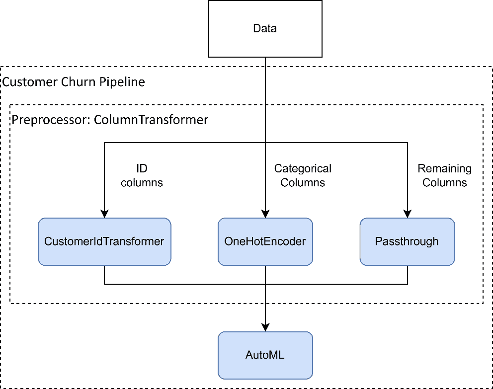

# 使用 LightGBM 的机器学习流程和 MLOps

本章将重点从数据科学和建模问题转移到为我们的机器学习解决方案构建生产服务。我们介绍了机器学习流程的概念，这是一种处理数据并构建确保一致性和正确性的模型的系统方法。

我们还介绍了 MLOps 的概念，这是一种结合 DevOps 和 ML 的实践，旨在解决部署和维护生产级 ML 系统的需求。

本章包括使用 scikit-learn 构建机器学习流程的示例，封装数据处理、模型构建和调整。我们展示了如何将流程包装在 Web API 中，暴露一个安全的预测端点。最后，我们还探讨了系统的容器化和部署到 Google Cloud。

本章的主要内容包括以下几方面：

+   机器学习流程

+   MLOps 概述

+   部署客户流失的机器学习流程

# 技术要求

本章包括创建 scikit-learn 流程、训练 LightGBM 模型和构建 FastAPI 应用的示例。设置环境的要求可以在[`github.com/PacktPublishing/Practical-Machine-Learning-with-LightGBM-and-Python/tree/main/chapter-8`](https://github.com/PacktPublishing/Practical-Machine-Learning-with-LightGBM-and-Python/tree/main/chapter-8)的完整代码示例旁边找到。

# 介绍机器学习流程

在*第六章*《使用 LightGBM 解决现实世界数据科学问题》中，我们详细概述了数据科学生命周期，其中包括训练 ML 模型的各种步骤。如果我们只关注训练模型所需的步骤，给定已经收集的数据，那么这些步骤如下：

1.  数据清洗和准备

1.  特征工程

1.  模型训练和调整

1.  模型评估

1.  模型部署

在之前的案例研究中，我们在处理 Jupyter 笔记本时手动应用了这些步骤。然而，如果我们把背景转移到长期机器学习项目中，会发生什么呢？如果我们需要在有新数据可用时重复该过程，我们就必须遵循相同的程序来成功构建模型。

同样，当我们想要使用模型对新数据进行评分时，我们必须每次都正确地应用这些步骤，并使用正确的参数和配置。

从某种意义上说，这些步骤形成了一个数据处理流程：数据进入流程，完成时产生一个可部署的模型。

形式上，机器学习流程是一个系统化和自动化的过程，指导机器学习项目的流程。它涉及几个相互关联的阶段，封装了之前列出的步骤。

机器学习管道旨在确保这些任务是有结构的、可重复的且高效的，从而更容易管理复杂的机器学习任务。当处理大型数据集或当将原始数据转换为机器学习模型可用的输入步骤复杂且必须频繁重复时，例如在生产环境中，管道特别有益。

管道中涉及的步骤具有一定的灵活性：根据管道的使用方式，步骤可以添加或删除。一些管道包括数据收集步骤，从各种数据源或数据库中提取数据，并为机器学习建模准备数据。

许多机器学习服务和框架提供功能和方法来实现机器学习管道。Scikit-learn 通过其`Pipeline`类提供此功能，我们将在下一节中探讨。

## Scikit-learn 管道

Scikit-learn 提供`Pipeline`类作为实现机器学习管道的工具。`Pipeline`类提供了一个统一的接口来执行一系列与数据和模型相关的任务。管道依赖于 scikit-learn 的标准`fit`和`transform`接口来实现操作的链式调用。每个管道由任意数量的中间步骤组成，这些步骤必须是`transforms`。一个转换必须实现`fit`和`transform`，`Pipeline`类依次对每个转换进行操作，首先将数据传递给`fit`，然后传递给`transform`。最后的步骤，通常涉及将模型拟合到数据上，只需要实现`fit`方法。转换通常是预处理步骤，用于转换或增强数据。

使用 scikit-learn 管道的主要优势是确保工作流程被清晰地实现，并且是可重复的。这有助于避免常见的错误，例如在预处理步骤中将测试数据的统计信息泄露到训练模型中。通过在管道中包含预处理步骤，我们确保在训练期间以及当模型用于预测新数据时，应用相同的步骤。

此外，scikit-learn 管道可以与模型选择和超参数调整工具结合使用，例如网格搜索和交叉验证。我们可以通过定义预处理步骤和最终估计器的参数网格来使用网格搜索自动选择整个管道中最佳参数。这可以显著简化代码并减少复杂机器学习工作流程中的错误。FLAML 等工具也具备与 scikit-learn 管道的集成功能。

例如，可以创建一个简单的管道如下：

```py
from sklearn.pipeline import Pipeline
from sklearn.preprocessing import StandardScaler
from sklearn.linear_model import LinearRegression
pipeline = Pipeline(
    [
        ('scaler', StandardScaler()),
        ('linear', LinearRegression())
    ]
)
```

在这里，该流程由两个步骤组成：一个缩放步骤，用于标准化数据，以及一个最终步骤，用于拟合线性回归模型。

scikit-learn 的`Pipeline`的强大之处在于它可以像使用任何其他估计器或模型一样使用：

```py
pipeline.fit(X_train, y_train)
pipeline.predict(X_train, y_train)
```

这为我们提供了一个统一的接口，用于封装在管道中的所有步骤，并使可重复性变得简单。此外，我们可以像其他 scikit-learn 模型一样导出管道，以便部署管道及其封装的所有步骤：

```py
import joblib
joblib.dump(pipeline, "linear_pipeline.pkl")
```

我们将在下一节中展示更多使用 scikit-learn 管道的示例。

尽管我们花费了大量时间解决与数据处理、构建和调整模型相关的问题，但我们还没有深入探讨模型训练后的情况。正是在这里，MLOps 的世界发挥了作用。下一节将提供详细的概述。

# 理解 MLOps

**机器学习运维**（**MLOps**）是一种将机器学习和系统运维领域融合的实践。它旨在标准化和简化机器学习模型开发和部署的生命周期，从而提高业务环境中机器学习解决方案的效率和效果。在许多方面，MLOps 可以被视为对将机器学习投入运营所面临的挑战的回应，将 DevOps 原则引入机器学习世界。

MLOps 旨在将数据科学家（他们通常专注于模型创建、实验和评估）和运维专业人员（他们处理部署、监控和维护）聚集在一起。目标是促进这些团队之间的更好协作，从而实现更快、更稳健的模型部署。

MLOps 的重要性通过机器学习系统所提出的独特挑战得到了强调。与传统的软件系统相比，机器学习系统更加动态且难以预测，这可能导致在可靠性、鲁棒性方面出现潜在挑战，尤其是在快速变化的生产环境中。

MLOps 的核心目标是通过自动化机器学习管道来加速机器学习生命周期，从而促进更快地进行实验和部署。这通过自动化多个阶段来实现，包括数据预处理、特征工程、模型训练、模型验证和部署。MLOps 的另一个关键方面是确保可重复性。鉴于机器学习模型的动态特性，精确复制结果可能具有挑战性，尤其是在使用新数据进行模型重新训练时。MLOps 强调代码、数据和模型配置版本控制的重要性，这确保了每个实验都可以精确重现，这对于调试和审计至关重要。

**监控**也是 MLOps 的一个关键部分。一旦模型部署，*监控其性能和持续验证其预测至关重要*。MLOps 强调需要强大的监控工具，这些工具可以跟踪模型性能、输入数据质量和其他关键指标。这些指标中的异常可能表明模型需要重新训练或调试。

MLOps 还鼓励使用稳健的 ML 测试实践。ML 测试包括传统的软件测试实践，如单元测试和集成测试，但也包括更多 ML 特定的测试，如验证模型预测的统计属性。

MLOps 还侧重于管理和扩展 ML 部署。在现实世界中，ML 模型可能需要每秒处理数千甚至数百万个预测。在这里，容器化和无服务器计算平台等 DevOps 实践发挥作用，以促进部署和扩展自动化。

重要的是要注意 MLOps 如何融入更广泛的软件生态系统。就像 DevOps 在软件工程中弥合了开发和运维之间的差距一样，MLOps 旨在为 ML 做同样的事情。通过促进共同理解和责任，MLOps 可以导致更成功的 ML 项目。

MLOps 是一个快速发展的领域，随着更多企业采用 ML，其重要性日益增加。通过将 DevOps 的原则应用于 ML 的独特挑战，MLOps 提供了一个从初始实验到稳健、可扩展部署的端到端 ML 生命周期的框架。MLOps 强调标准化、自动化、可重复性、监控、测试和协作，以实现高吞吐量的 ML 系统。

现在，我们将通过一个实际示例来查看使用 scikit-learn 创建 ML 管道并将其部署在 REST API 背后的情况。

# 部署客户流失的 ML 管道

在我们的实际示例中，我们将使用我们在*第五章*中使用的电信(**telco**)客户流失数据集，即*使用 Optuna 进行 LightGBM 参数优化*。该数据集包含每个客户的描述性信息（例如性别、账单信息和费用），以及客户是否已离开电信提供商（流失为*是*或*否*）。我们的任务是构建一个分类模型来预测流失。

此外，我们希望将模型部署在 REST API 后面，以便它可以集成到一个更广泛的软件系统中。REST API 应该有一个端点，用于对传递给 API 的数据进行预测。

我们将使用**FastAPI**，一个现代、高性能的 Python 网络框架来构建我们的 API。最后，我们将使用 Docker 将我们的模型和 API 部署到 Google Cloud Platform。

## 使用 scikit-learn 构建 ML 管道

我们将首先使用 scikit-learn 的`Pipeline`工具集构建一个 ML 管道。我们的管道应该封装数据清洗和特征工程步骤，然后构建和调整适当的模型。

我们将评估两种建模算法：LightGBM 和随机森林，因此，无需对数据进行任何缩放或归一化。然而，数据集为每个客户都有一个唯一的标识符，即`customerID`，我们需要将其删除。

此外，数据集包括数值和分类特征，我们必须对分类特征实现独热编码。

### 管道预处理步骤

要在 scikit-learn 管道中执行这些步骤，我们将使用 `ColumnTransformer`。`ColumnTransformer` 是一个仅对数据集的子集列操作的 `Pipeline` 转换器。转换器接受一个元组列表，形式为 (`name, transformer, columns`)。它将子转换器应用于指定的列，并将结果连接起来，使得所有结果特征都成为同一个结果集的一部分。

例如，考虑以下 DataFrame 和 `ColumnTransformer`：

```py
df = pd.DataFrame({
    "price": [29.99, 99.99, 19.99],
    "description": ["Luxury goods", "Outdoor goods",
        "Sports equipment"],
})
ct = ColumnTransformer(
    [("scaling", MinMaxScaler(), ["price"]),
     ("vectorize", TfidfVectorizer(), "description")])
transformed = ct.fit_transform(df)
```

这里，我们有一个包含两列的 DataFrame：`price` 和 `description`。创建了一个包含两个子转换器的列转换器：一个缩放转换器和向量器。缩放转换器仅对 `price` 列应用最小-最大缩放。向量器仅对 `description` 列应用 TF-IDF 向量化。当调用 `fit_transform` 时，返回一个 *单个* 数组，包含缩放后的价格列和表示词向量的列。

注意

**TF-IDF**，或**词频-逆文档频率**，只是从文本中提取特征的一种方式。分析和提取文本特征，以及自然语言处理，是机器学习中的一个广泛领域，我们在这里不会深入探讨。我们鼓励您进一步阅读有关该主题的内容，请参阅[`scikit-learn.org/stable/modules/feature_extraction.xhtml#text-feature-extraction`](https://scikit-learn.org/stable/modules/feature_extraction.xhtml#text-feature-extraction)。

我们可以将 Customer Churn 数据集的预处理设置为一个单独的 `ColumnTransformer`。我们首先定义两个单独的转换器，`id_transformer` 和 `encode_transformer`，它们应用于 ID 列和分类特征：

```py
id_transformer = (
    "customer_id",
    CustomerIdTransformer(id_columns),
    id_columns
)
encode_transformer = (
    "encoder",
    OneHotEncoder(sparse_output=False),
    categorical_features
)
```

然后将单独的转换器组合成 `ColumnTransformer`：

```py
preprocessor = ColumnTransformer(
    transformers=[
        id_transformer,
        encode_transformer,
    ],
    remainder='passthrough'
)
```

`ColumnTransformer` 使用 `remainder='passthrough'` 参数定义。`remainder` 参数指定了 `ColumnTransformer` 不转换的列的处理方式。默认情况下，这些列会被删除，但我们需要将它们原样传递，以便包含在数据集中。

编码转换器创建并应用 `OneHotEncoder` 到分类特征上。

为了说明目的，我们创建了一个自定义的转换器类来维护 ID 列的列表，并在转换过程中从数据中删除它们。

类在这里展示：

```py
class CustomerIdTransformer(BaseEstimator, TransformerMixin):
    def __init__(self, id_columns):
        self.id_columns = id_columns
    def fit(self, X, y=None):
        return self
    def transform(self, X, y=None):
        return X.drop(columns=self.id_columns, axis=1)
```

如我们所见，该类扩展了 scikit-learn 基础类 `BaseEstimator` 和 `TransformerMixin`，并且必须实现 `fit` 和 `transform` 方法。实现这些方法也使其适合作为管道中的转换器。如果需要，实现 `fit` 是可选的；在我们的情况下，`fit` 过程中没有任何操作。我们的转换步骤会删除相关列。

注意

在管道中封装删除无关列（在这种情况下，ID 列）的功能很重要。当将管道部署到生产使用时，我们期望在做出预测时将这些列传递给管道。作为管道的一部分删除它们简化了模型消费者对管道的使用，并减少了用户出错的机会。

这完成了预处理所需的转换，我们现在可以继续下一步：拟合和调整模型。

### 管道建模步骤

对于管道建模部分，我们将使用 FLAML。我们也将利用这个机会展示如何将参数传递给管道内的步骤。首先，我们定义我们的 AutoML 模型的设置：

```py
automl_settings = {
    "time_budget": 120,
    "metric": "accuracy",
    "task": "classification",
    "estimator_list": ["lgbm", "rf"],
    "custom_hp": {
        "n_estimators": {
            "domain": flaml.tune.uniform(20, 500)
        }
    },
    "verbose": -1
}
```

上述代码设置了我们的时间预算、优化指标和分类任务，并将估计器限制在 LightGBM 和随机森林模型。最后，我们通过指定 `n_estimators` 应该在 20 到 500 之间均匀采样来自定义搜索空间。

管道需要将构成步骤的参数以步骤名称和双下划线为前缀。我们可以在管道中设置一个字典，将这些参数传递给 AutoML 类：

```py
pipeline_settings = {
    f"automl__{key}": value for key, value in
        automl_settings.items()
}
```

在这里，`automl` 是管道中步骤的名称。因此，例如，时间预算和指标的参数分别设置为 `automl__time_budget: 120` 和 `automl__metric:` `accuracy`。

最后，我们可以添加 FLAML 的 AutoML 估计器：

```py
automl = flaml.AutoML()
pipeline = Pipeline(
    steps=[("preprocessor", preprocessor),
           ("automl", automl)]
)
```

以下图显示了最终的管道：



图 8.1 – 客户流失预测的最终 ML 管道

*图 8**.1* 显示了一个由两个子转换器组成的 *ColumnTransformer*，它们将数据输入到 AutoML 估计器中。

### 模型训练和验证

现在我们已经准备好将管道拟合到我们的数据中，传递我们之前设置的管道设置。管道支持标准的 scikit-learn API，因此我们可以调用管道本身：

```py
pipeline.fit(X, y, **pipeline_settings)
```

运行 `fit` 执行所有预处理步骤，然后将数据传递给 AutoML 建模和调整。单个 `Pipeline` 对象展示了 ML 管道的强大功能：包括训练和调整后的模型在内的整个端到端过程被封装并便携，我们可以像使用单个模型一样使用管道。例如，以下代码对训练数据执行 F1 分数：

```py
print(f"F1: {f1_score(pipeline.predict(X), y,
    pos_label='Yes')}")
```

要导出管道，我们使用 `joblib` 将模型序列化到文件中：

```py
joblib.dump(pipeline, "churn_pipeline.pkl")
```

导出管道允许我们在生产代码中重新实例化并使用它。接下来，我们将探讨为我们的模型构建 API。

在这个阶段，我们的管道（它封装了预处理、训练、优化和验证）已经定义，我们准备将其部署到系统中。我们将通过用 FastAPI 包装我们的模型来实现这一点。

## 使用 FastAPI 构建 ML API

现在我们将探讨围绕我们的流水线构建 REST API，使流水线的消费者可以通过 Web 请求获取预测。为模型构建 Web API 也简化了与其他系统和服务的集成，并且是微服务架构中集成标准的方法。

要构建 API，我们使用 Python 库 FastAPI。

### FastAPI

FastAPI 是一个现代、高性能的 Web 框架，用于使用 Python 3.6+构建 API。它从头开始设计，易于使用并支持高性能的 API 开发。FastAPI 的关键特性是其速度和易用性，使其成为开发健壮、生产就绪 API 的绝佳选择。FastAPI 广泛采用 Python 的类型检查，有助于在开发过程中早期捕获错误。它还使用这些类型提示来提供数据验证、序列化和文档，减少了开发者需要编写的样板代码。

FastAPI 的性能是其定义性的特征之一。它与 Node.js 相当，并且比传统的 Python 框架快得多。这种速度是通过其使用 Starlette 进行 Web 部分和 Pydantic 进行数据部分，以及其非阻塞特性来实现的，这使得它适合处理大量并发请求。

FastAPI 提供了自动交互式 API 文档，这在开发复杂 API 时是一个很大的优势。使用 FastAPI，开发者可以通过 Swagger UI 访问自动生成的交互式 API 文档。Swagger UI 还提供了与 REST 资源交互的功能，无需编写代码或使用外部工具。这一特性使 FastAPI 非常适用于开发者，并加速了开发过程。

FastAPI 还支持行业标准的安全协议，如 OAuth2，并提供工具以简化实现。FastAPI 的大部分工具都依赖于其依赖注入系统，允许开发者高效地管理依赖项和处理共享资源。

FastAPI 因其易用性和高性能，非常适合构建用于机器学习模型的 Web API 和微服务，这使得机器学习工程师可以专注于生产机器学习部署的其他众多问题。

### 使用 FastAPI 进行构建

要使用 FastAPI 创建 REST API，我们可以创建一个新的 Python 脚本并实例化 FastAPI 实例。实例启动后，我们可以从文件中加载我们的模型：

```py
app = FastAPI()
model = joblib.load("churn_pipeline.pkl")
```

在应用程序启动时加载模型会增加启动时间，但确保 API 在应用程序启动完成后即可准备就绪以处理请求。

接下来，我们需要实现一个 REST 端点以进行预测。我们的端点接受输入数据，并以 JSON 格式返回预测。输入 JSON 是一个 JSON 对象的数组，如下所示：

```py
[
  {
    "customerID": "1580-BMCMR",
    ...
    "MonthlyCharges": 87.3,
    "TotalCharges": "1637.3"
  },
  {
    "customerID": "4304-XUMGI",
    ...
    "MonthlyCharges": 75.15,
    "TotalCharges": "3822.45"
  }
]
```

使用 FastAPI，我们通过创建一个接受输入数据作为参数的函数来实现 REST 端点。FastAPI 将前面的 JSON 结构序列化为 Python 字典列表。因此，我们的函数签名实现如下：

```py
@app.post('/predict')
def predict_instances(
        instances: list[dict[str, str]]
):
```

我们使用 FastAPI 的`post`装饰器装饰该函数，指定端点路径（`'/predict'`）。

为了对模型进行实际预测，我们将字典转换为 DataFrame 并执行预测：

```py
instance_frame = pd.DataFrame(instances)
predictions = model.predict_proba(instance_frame)
```

我们使用`predict_proba`来获取每个类（是或否）的概率，因为我们希望将此附加信息发送给我们的 API 消费者。在预测的同时返回概率是一种推荐的做法，因为这使 API 消费者在使用预测时拥有更多的控制权。API 消费者可以根据预测的使用方式来决定什么概率阈值对于他们的应用程序来说是足够的。

为了以 JSON 格式返回结果，我们构建一个字典，然后 FastAPI 将其序列化为 JSON。我们使用 NumPy 的`argmax`来获取最高概率的索引以确定预测的类别，并使用`amax`来获取最高的概率本身：

```py
results = {}
for i, row in enumerate(predictions):
    prediction = model.classes_[np.argmax(row)]
    probability = np.amax(row)
    results[i] = {"prediction": prediction,
        "probability": probability}
return results
```

前面的代码为输入列表中的每个数据实例生成一个`prediction`对象，使用列表中的位置作为索引。当端点被调用时，将返回以下 JSON：

```py
{
  "0": {
    "prediction": "Yes",
    "probability": 0.9758797243307111
  },
  "1": {
    "prediction": "No",
    "probability": 0.8896770039274629
  },
  "2": {
    "prediction": "No",
    "probability": 0.9149225087944103
  }
}
```

我们现在已经构建了 API 端点的核心。然而，我们还得注意非功能性关注点，例如安全性。通常，机器学习工程师会忽视诸如安全性或性能等方面的内容，而只关注机器学习相关的问题。我们不应犯这样的错误，必须确保我们给予这些关注点必要的关注。

### 保护 API

为了保护我们的端点，我们将使用 HTTP 基本认证。我们使用预置的用户名和密码，这些我们从环境中读取。这允许我们在部署期间安全地传递这些凭证到应用程序中，避免了硬编码凭证等陷阱。我们的端点还需要增强以接受用户的凭证。HTTP 基本认证凭证作为 HTTP 头发送。

我们可以按以下方式实现。我们首先为 FastAPI 设置安全措施并从环境中读取凭证：

```py
security = HTTPBasic()
USER = bytes(os.getenv("CHURN_USER"), "utf-8")
PASSWORD = bytes(os.getenv("CHURN_PASSWORD"), "utf-8")
```

然后，我们在`endpoint`函数中添加以下内容：

```py
@app.post('/predict')
def predict_instances(
        credentials: Annotated[HTTPBasicCredentials,
            Depends(security)],
        instances: list[dict[str, str]]
):
    authenticate(credentials.username.encode("utf-8"),
        credentials.password.encode("utf-8"))
```

`authenticate`函数验证接收到的凭证是否与我们从环境中获取的 API 凭证匹配。我们可以使用 Python 的 secrets 库来进行验证：

```py
def authenticate(username: bytes, password: bytes):
    valid_user = secrets.compare_digest(
        username, USER
    )
    valid_password = secrets.compare_digest(
        password, PASSWORD
    )
    if not (valid_user and valid_password):
        raise HTTPException(
            status_code=status.HTTP_401_UNAUTHORIZED,
            detail="Incorrect username or password",
            headers={"WWW-Authenticate": "Basic"},
        )
    return username
```

如果凭证无效，我们将抛出一个带有 HTTP 状态码`401`的异常，表示消费者未授权。

我们的 API 端点现在已完全实现、安全并准备好部署。为了部署我们的 API，我们将使用 Docker 进行容器化。

## 容器化我们的 API

我们可以使用以下 Dockerfile 为我们的 API 构建一个 Docker 容器：

```py
FROM python:3.10-slim
RUN apt-get update && apt-get install -y --no-install-recommends apt-utils
RUN apt-get -y install curl
RUN apt-get install libgomp1
WORKDIR /usr/src/app
COPY requirements.txt ./
RUN pip install --no-cache-dir -r requirements.txt
COPY . .
CMD [ "uvicorn", "telco_churn_api:app", "--host", "0.0.0.0", "--port", "8080" ]
```

Dockerfile 非常简单：我们从一个基于 Python 3.10 的基础镜像开始，安装 LightGBM 需要的某些操作系统依赖项（`libgomp1`）。然后我们设置 FastAPI 应用程序：我们复制 Python 的`requirements`文件，安装所有依赖项，然后复制必要的源文件（使用`COPY . .`）。

最后，我们运行一个监听所有地址的端口`8080`的 Uvicorn 服务器。Uvicorn 是 Python 的 ASGI 网络服务器实现，支持异步 I/O，显著提高了网络服务器的吞吐量。我们绑定到端口`8080`，这是我们的部署平台默认的端口。

我们可以使用以下命令构建和运行 Docker 镜像，传递用户名和密码环境变量：

```py
docker build . -t churn_api:latest
docker run --rm -it -e CHURN_USER=***** -e CHURN_PASSWORD=*********** -p 8080:8080 churn_api:latest
```

API 现在应该可以在你的本地主机上通过端口`8080`访问，并受到你在环境变量中提供的凭证的保护。

在我们的应用程序容器化后，我们就可以将应用程序部署到任何支持容器的平台。对于 churn 应用程序，我们将将其部署到 Google Cloud Platform。

## 将 LightGBM 部署到 Google Cloud

我们将利用**Google Cloud Run**平台将我们的应用程序部署到 Google Cloud Platform。

Google Cloud Run 是一个无服务器平台，允许你在不担心基础设施管理的情况下开发和运行应用程序。Cloud Run 允许开发者在一个安全、可扩展、零运维的环境中运行他们的应用程序。Cloud Run 是完全管理的，这意味着所有基础设施（如服务器和负载均衡器）都被抽象化，使用户能够专注于运行他们的应用程序。Cloud Run 还支持完全自动扩展，运行中的容器数量会自动增加以响应增加的负载。Cloud Run 也非常经济高效，因为你只有在容器运行并处理请求时才会被收费。

要使用 Cloud Run，你需要一个 Google Cloud 账户，并需要创建一个 Google Cloud 项目，启用计费，并设置和初始化**Google Cloud CLI**。以下资源将指导你完成这些步骤：

+   [`console.cloud.google.com/getting-started`](https://console.cloud.google.com/getting-started)

+   [`cloud.google.com/resource-manager/docs/creating-managing-projects`](https://cloud.google.com/resource-manager/docs/creating-managing-projects)

+   [`cloud.google.com/sdk/docs/install`](https://cloud.google.com/sdk/docs/install)

+   [`cloud.google.com/sdk/docs/initializing`](https://cloud.google.com/sdk/docs/initializing)

一旦完成 Google Cloud 的设置，我们就可以使用 CLI 部署我们的 API。这可以通过单个命令完成：

```py
gcloud run deploy --set-env-vars CHURN_USER=*****,CHURN_PASSWORD=***********
```

运行命令会提示你输入服务名称和部署服务所在的区域。我们还会设置用于安全凭证所需的环境变量。对于部署，Cloud Run 会为你创建 Cloud Build，它会自动构建和存储 Docker 容器，然后将其部署到 Cloud Run。

一旦 Cloud Run 命令完成，我们就部署了一个安全、可扩展的 RESTful Web API，该 API 为我们客户的流失 ML 管道提供服务。

# 摘要

本章介绍了 ML 管道，说明了其在实现 ML 解决方案时的一致性、正确性和可移植性的优势。

对新兴的 MLOps 领域进行了概述，这是一个结合 DevOps 和 ML 以实现经过测试、可扩展、安全且可观察的生产 ML 系统的实践。

此外，我们还讨论了 scikit-learn 的`Pipeline`类，这是一个使用熟悉的 scikit-learn API 实现 ML 管道的工具集。

还提供了一个实现客户流失 ML 管道的端到端示例。我们展示了如何创建一个 scikit-learn 管道，该管道执行预处理、建模和调优，并且可以导出用于软件系统。然后，我们使用 FastAPI 构建了一个安全的 RESTful Web API，该 API 提供了一个从我们的客户流失管道获取预测的端点。最后，我们使用 Cloud Run 服务将我们的 API 部署到 Google Cloud Platform。

尽管我们的部署是安全的且完全可扩展的，Cloud Run 提供了可观察性、指标和日志，但我们的部署没有解决一些 ML 特定的方面：模型漂移、模型性能监控和重新训练。

在下一章中，我们将探讨一个专门的 ML 云服务——AWS SageMaker，它提供了一个针对特定平台构建和托管基于云的 ML 管道的解决方案。
