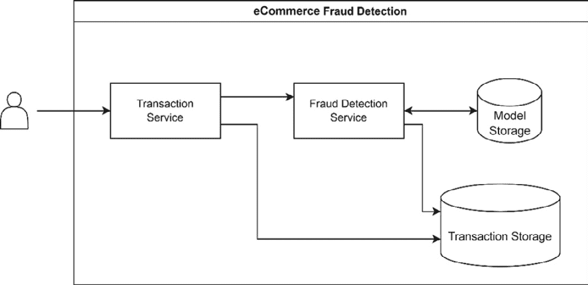
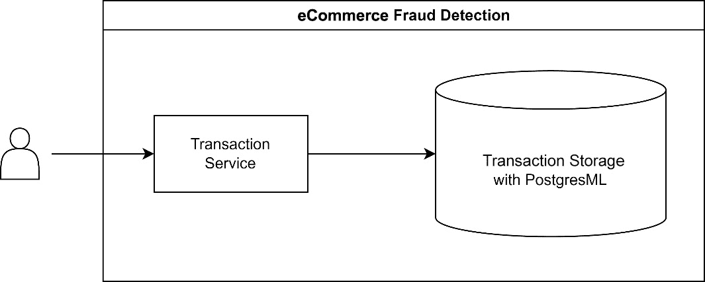
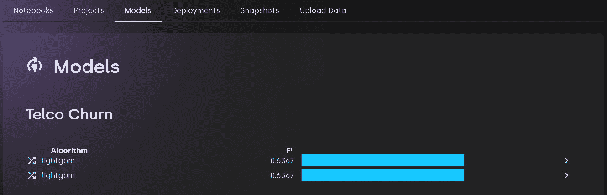
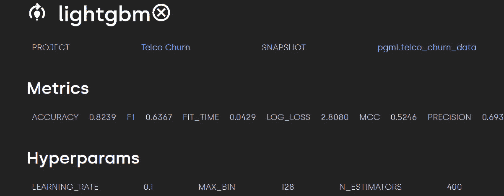

# 10

# 使用 PostgresML 的 LightGBM 模型

在本章中，我们将探讨一个独特的 MLOps 平台，称为**PostgresML**。PostgresML 是一个 Postgres 数据库扩展，允许您使用 SQL 训练和部署机器学习模型。

PostgresML 和 SQL 与我们在本书中使用的 scikit-learn 编程风格有显著的不同。然而，正如我们在本章中将要看到的，在数据库级别进行机器学习模型开发和部署，在数据移动需求和推理延迟方面具有显著优势。

本章的主要内容包括以下几方面：

+   PostgresML 概述

+   开始使用 PostgresML

+   使用 PostgresML 和 LightGBM 的客户流失案例研究

# 技术要求

本章包括使用 PostgresML 的实际示例。我们将使用 Docker 来设置 PostgresML 环境，并建议运行示例。本章的代码可在[`github.com/PacktPublishing/Practical-Machine-Learning-with-LightGBM-and-Python/tree/main/chapter-10`](https://github.com/PacktPublishing/Practical-Machine-Learning-with-LightGBM-and-Python/tree/main/chapter-10)找到。

# 介绍 PostgresML

PostgresML([`postgresml.org/`](https://postgresml.org/))是 Postgres 的一个扩展，允许从业者在一个 Postgres 数据库上实现整个机器学习生命周期，用于文本和表格数据。

PostgresML 利用 SQL 作为训练模型、创建部署和进行预测的接口。使用 SQL 意味着模型和数据操作可以无缝结合，并自然地融入 Postgres 数据库数据工程环境中。

拥有一个共享的数据和机器学习平台有许多优势。正如我们在上一章中看到的，使用 SageMaker，在数据移动方面花费了大量的努力。这在机器学习环境中是一个常见问题，其中数据，尤其是事务数据，存在于生产数据库中，需要创建复杂的数据工程工作流程来从生产源提取数据，将数据转换为机器学习使用，并将数据加载到机器学习平台可访问的存储中（例如 SageMaker 的 S3）。

通过将数据存储与机器学习平台相结合，PostgresML 消除了在平台之间移动数据的需求，节省了大量的时间、努力、存储，并可能节省出口成本。

此外，从实时交易数据建模意味着训练数据始终是最新的（直接从记录系统中读取），而不是在刷新后受到限制。这消除了由于处理过时数据或 ETL 作业错误转换或加载数据而产生的错误。

## 延迟和往返次数

模型部署的典型模式，我们在前面的章节中已经展示过，是将模型部署在 Web API 后面。在微服务术语中，模型部署只是另一个服务，可以由其他服务组成以实现整体系统目标。

作为网络服务部署具有几个优点。首先，当使用如 REST 这样的网络标准进行网络调用时，与其他系统的互操作性简单直接。其次，它允许您独立部署模型代码，与系统其他部分隔离，提供弹性和独立扩展。

然而，将模型作为独立服务部署也有显著的缺点：延迟和网络往返次数。

让我们考虑一个电子商务的例子。在电子商务环境中，一个常见的机器学习问题是欺诈检测。以下是简单电子商务系统的一个系统架构图：



图 10.1 – 简化的电子商务系统架构，说明了功能服务（交易）与机器学习驱动服务（欺诈检测）之间的交互

考虑到*图 10.1*中的架构，新交易的流程如下：

1.  交易被发送到交易服务。

1.  交易服务使用新交易的详细信息调用欺诈检测服务。

1.  欺诈检测服务接收新交易，从模型存储中加载相关模型（如果需要），从交易存储中加载历史数据，并将预测结果发送给交易服务。

1.  交易服务接收欺诈预测，并存储带有相关分类的交易。

在此工作流程上可能存在一些变体。然而，由于交易和欺诈检测服务的分离，处理一笔新交易需要多次网络往返。进行欺诈预测还需要从交易存储中获取历史数据以供模型使用。

网络调用延迟和往返次数给交易增加了显著的开销。如果目标是实现低延迟或实时系统，则需要更复杂的架构组件——例如，为模型和交易数据提供缓存以及更高吞吐量的网络服务。

使用 PostgresML，架构可以简化如下：



图 10.2 – 使用 PostgresML 将机器学习服务与数据存储相结合，允许更简单的系统设计

虽然这个例子过于简化，但重点是，在服务导向架构中使用独立模型服务利用机器学习模型的整体过程中，会添加显著的开销。

通过 PostgresML，我们可以消除单独模型存储的需求，以及加载模型的额外开销，并且更重要的是，将数据存储调用和预测合并为数据存储层上的单个调用，中间没有网络开销。PostgresML 的基准测试发现，在云环境中，简化的架构将性能提高了 40 倍[1]。

然而，这种架构也有缺点。首先，数据库现在是一个单点故障。如果数据库不可用，所有模型和预测能力也将不可用。其次，该架构将数据存储和机器学习建模与推理的关注点混合在一起。根据用例，训练和部署机器学习模型与提供 SQL 查询和存储数据相比，有不同的服务器基础设施需求。关注点的混合可能迫使你在一项或另一项责任上做出妥协，或者显著增加数据库基础设施成本以支持所有用例。

在本节中，我们介绍了 PostgresML，并在概念层面上解释了将我们的数据存储和机器学习服务结合起来的优势。现在，我们将探讨实际设置和开始使用 PostgresML，以及一些基本功能。

# 开始使用 PostgresML

当然，PostgresML 依赖于已安装的 PostgreSQL。PostgresML 需要 PostgreSQL 11，同时也支持更新的版本。PostgresML 还需要在您的系统上安装 Python 3.7+。支持 ARM 和 Intel/AMD 架构。

注意

本节概述了开始使用 PostgresML 及其在撰写时的功能所需的步骤和依赖项。对于最新信息，请查看官方[网站：https://postg](https://postgresml.org/)resml.org/。运行 PostgresML 最简单的方法是使用 Docker。更多信息，请参阅*使用 Docker 快速入门*文档：[`postgresml.org/docs/guides/setup/quick_start_with_docker`](https://postgresml.org/docs/guides/setup/quick_start_with_docker)。

该扩展可以使用官方包工具（如 APT）安装，或者从源代码编译。一旦所有依赖项和扩展都已安装，必须更新`postgresql.conf`以加载 PostgresML 库，并且必须重新启动数据库服务器：

```py
shared_preload_libraries = 'pgml,pg_stat_statements'
sudo service postgresql restart
```

安装 PostgresML 后，必须在您计划使用的数据库中创建扩展。这可以通过常规的 PostgreSQL 方式在 SQL 控制台中完成：

```py
CREATE EXTENSION pgml;
```

检查安装，如下所示：

```py
SELECT pgml.version();
```

## 训练模型

现在，让我们看看 PostgresML 提供的功能。如介绍中所述，PostgresML 有一个 SQL API。以下代码示例应在 SQL 控制台中运行。

训练模型的扩展函数如下：

```py
pgml.train(
    project_name TEXT,
    task TEXT DEFAULT NULL,
    relation_name TEXT DEFAULT NULL,
    y_column_name TEXT DEFAULT NULL,
    algorithm TEXT DEFAULT 'linear',
    hyperparams JSONB DEFAULT '{}'::JSONB,
    search TEXT DEFAULT NULL,
    search_params JSONB DEFAULT '{}'::JSONB,
    search_args JSONB DEFAULT '{}'::JSONB,
    preprocess JSONB DEFAULT '{}'::JSONB,
    test_size REAL DEFAULT 0.25,
    test_sampling TEXT DEFAULT 'random'
)
```

我们需要提供`project_name`作为第一个参数。PostgresML 将模型和部署组织到项目中，项目通过其名称唯一标识。

接下来，我们指定模型的`任务`：分类或回归。`relation_name`和`y_column_name`设置训练运行所需的数据。关系是定义数据的数据表或视图，Y 列的名称指定关系中的目标列。

这些是训练所需的唯一参数。训练线性模型（默认）可以如下进行：

```py
SELECT * FROM pgml.train(
    project_name => 'Regression Project',
    task => 'regression',
    relation_name => pgml.diabetes',
    y_column_name => 'target'
);
```

当调用`pgml.train`时，PostgresML 将数据复制到`pgml`模式中：这确保所有训练运行都是可重复的，并允许使用不同的算法或参数但相同的数据重新运行训练。`relation_name`和`task`也仅在项目第一次进行训练时需要。要为项目训练第二个模型，我们可以简化训练调用如下：

```py
SELECT * FROM pgml.train(
    'Regression Project ',
    algorithm => 'lightgbm'
);
```

当调用此代码时，将在相同的数据上训练一个 LightGBM 回归模型。

算法参数设置要使用的学习算法。PostgresML 支持各种算法，包括 LightGBM、XGBoost、scikit-learn 的随机森林和额外树，**支持向量机**（**SVMs**）、线性模型以及如 K-means 聚类的无监督算法。

默认情况下，25%的数据用作测试集，测试数据是随机选择的。这可以通过`test_size`和`test_sampling`参数进行控制。替代测试采样方法从第一行或最后一行选择数据。

### 超参数优化

PostgresML 支持执行`搜索`：网格搜索和随机搜索。要设置 HPO 的超参数范围，使用带有`search_params`参数的 JSON 对象。使用`search_args`指定 HPO 参数。以下是一个示例：

```py
SELECT * FROM pgml.train('Regression Project',
                algorithm => 'lightgbm',
                search => 'random',
                search_args => '{"n_iter": 100 }',
                search_params => '{
                        "learning_rate": [0.001, 0.1, 0.5],
                        "n_estimators": [20, 100, 200]
                }'
);
```

### 预处理

PostgresML 还支持在训练模型时执行某些类型的预处理。与训练数据和配置一样，预处理也存储在项目中，因此可以在使用模型进行预测时应用相同的预处理。

关于预处理，PostgresML 支持对分类变量进行编码、填充缺失值和对数值进行缩放。预处理规则使用 JSON 对象通过`preprocess`参数设置，如下所示：

```py
SELECT pgml.train(
…
preprocess => '{
        "model": {"encode": {"ordinal": ["Ford", "Kia",
            "Volkswagen"]}}
        "price": {"impute": "mean", scale: "standard"}
        "fuel_economy": {"scale": "standard"}
    }'
);
```

在这里，我们对模型特征应用了序数编码。或者，PostgresML 还支持独热编码和目标编码。我们还使用价格的平均值导入缺失值（如列中的`NULL`所示），并对价格和燃油经济性特征应用了标准（正态）缩放。

## 部署和预测

训练后，PostgresML 会自动在测试集上计算适当的指标，包括 R²、F1 分数、精确度、召回率、`ROC_AUC`、准确率和对数损失。如果模型的键指标（回归的 R²和分类的 F1）比当前部署的模型有所提高，PostgresML 将在训练后自动部署模型。

然而，也可以使用`pgml.deploy`函数手动管理项目的部署：

```py
pgml.deploy(
    project_name TEXT,
    strategy TEXT DEFAULT 'best_score',
    algorithm TEXT DEFAULT NULL
)
```

PostgresML 支持的部署策略有`best_score`，它立即部署具有最佳关键指标的模型；`most_recent`，它部署最近训练的模型；以及`rollback`，它将当前部署回滚到之前部署的模型。

部署模型后，可以使用`pgml.predict`函数进行预测：

```py
pgml.predict (
    project_name TEXT,
    features REAL[]
)
```

`pgml.predict`函数接受项目名称和预测特征。特征可以是数组或复合类型。

## PostgresML 仪表板

PostgresML 提供了一个基于 Web 的仪表板，以便更方便地访问 PostgresML 的功能。仪表板是独立于 PostgreSQL 部署的，不是管理或充分利用 PostgresML 功能所必需的，因为所有功能也可以通过 SQL 查询访问。

仪表板提供了访问项目、模型、部署和数据快照的列表。有关训练模型的更多详细信息也可以在仪表板中找到，包括超参数设置和训练指标：



图 10.3 – 显示已训练模型列表的 PostgresML 仪表板

除了提供项目、模型和部署的视图外，仪表板还允许创建 SQL 笔记本，类似于 Jupyter 笔记本。这些 SQL 笔记本提供了一个简单的界面，用于与 PostgresML 交互，如果另一个 SQL 控制台不可用的话。

这就结束了我们关于开始使用 PostgresML 的部分。接下来，我们将查看一个从头到尾的案例研究，即训练和部署 PostgresML 模型。

# 案例研究 – 使用 PostgresML 进行客户流失分析

让我们回顾一下电信提供商的客户流失问题。提醒一下，数据集包括客户及其与电信提供商相关的账户和成本信息。

## 数据加载和预处理

在现实世界的设置中，我们的数据通常已经存在于 PostgreSQL 数据库中。然而，在我们的示例中，我们将从加载数据开始。首先，我们必须创建数据加载到的表：

```py
CREATE TABLE pgml.telco_churn
(
    customerid       VARCHAR(100),
    gender           VARCHAR(100),
    seniorcitizen    BOOLEAN,
    partner          VARCHAR(10),
    dependents       VARCHAR(10),
    tenure           REAL,
...
    monthlycharges   VARCHAR(50),
    totalcharges     VARCHAR(50),
    churn            VARCHAR(10)
);
```

注意，在我们的表结构中，对于一些列，类型可能不符合我们的预期：例如，月度和总费用应该是实数值。我们将在预处理阶段解决这个问题。

接下来，我们可以将我们的 CSV 数据加载到表中。PostgreSQL 提供了一个`COPY`语句来完成此目的：

```py
COPY pgml.telco_churn (customerid,
                       gender,
                       seniorcitizen,
                       partner,
...
                       streamingtv,
                       streamingmovies,
                       contract,
                       paperlessbilling,
                       paymentmethod,
                       monthlycharges,
                       totalcharges,
                       churn
    ) FROM '/tmp/telco-churn.csv'
    DELIMITER ','
    CSV HEADER;
```

执行此语句将读取 CSV 文件并将数据添加到我们的表中。

注意

如果你在一个 Docker 容器中运行 PostgresML（推荐以开始使用），必须首先将 CSV 文件复制到容器运行时。可以使用以下命令完成此操作（替换为你自己的容器名称）：

`docker cp` `telco/telco-churn.csv postgresml-postgres-1:/tmp/telco-churn.csv`。

数据加载后，我们可以进行预处理。我们分三步进行：在表中直接清理数据，创建一个将数据强制转换为适当类型的表视图，并使用 PostgresML 的预处理功能：

```py
UPDATE pgml.telco_churn
SET totalcharges = NULL
WHERE totalcharges = ' ';
```

我们必须将总费用中的空文本值替换为`NULL`，以便 PostgresML 稍后填充这些值：

```py
CREATE VIEW pgml.telco_churn_data AS
SELECT gender,
       seniorcitizen,
       CAST(CASE partner
                WHEN 'Yes' THEN true
                WHEN 'No' THEN false
           END AS BOOLEAN) AS partner,
...
       CAST(monthlycharges AS REAL),
       CAST(totalcharges AS REAL),
       CAST(CASE churn
                WHEN 'Yes' THEN true
                WHEN 'No' THEN false
           END AS BOOLEAN) AS churn
FROM pgml.telco_churn;
```

我们首先创建一个视图来准备训练数据。值得注意的是，执行了两种类型转换：具有`Yes`/`No`值的特征被映射到布尔类型，我们将月度和总费用转换为`REAL`类型（在将文本值映射到`NULL`之后）。我们还从视图中排除了`CustomerId`，因为这不能用于训练。

## 训练和超参数优化

我们可以按照以下方式训练我们的 LightGBM 模型：

```py
SELECT *
FROM pgml.train('Telco Churn',
                task => 'classification',
                relation_name => 'pgml.telco_churn_data',
                y_column_name => 'churn',
                algorithm => 'lightgbm',
                preprocess => '{"totalcharges": {"impute": "mean"} }',
                search => 'random',
                search_args => '{"n_iter": 500 }',
                search_params => '{
                        "num_leaves": [2, 4, 8, 16, 32, 64]
                }'
    );
```

我们将视图设置为我们的关系，其中 churn 列是我们的目标特征。对于预处理，我们使用平均值来请求 PostgresML 为`totalcharges`特征填充缺失值。

我们还使用随机搜索的 500 次迭代和指定的搜索参数范围来设置超参数优化。

完成训练后，我们将在仪表板中看到我们的训练和部署好的模型：



图 10.4 – 在 PostgresML 仪表板中看到的训练好的 LightGBM 模型

仪表板显示了我们的模型指标和最佳性能的超参数。我们的模型实现了 F1 分数为 0.6367 和准确度为 0.8239。

如果仪表板不可用，可以使用以下 SQL 查询检索相同的信息：

```py
SELECT metrics, hyperparams
FROM pgml.models m
LEFT OUTER JOIN pgml.projects p on p.id = m.project_id
WHERE p.name = 'Telco Churn';
```

训练完成后，我们的模型将自动部署并准备好进行预测。

## 预测

我们可以使用复合类型作为特征数据手动进行预测。这可以按照以下方式完成：

```py
SELECT pgml.predict(
               'Telco Churn',
               ROW (
                   CAST('Male' AS VARCHAR(30)),
                   1,
...
                   CAST('Electronic check' AS VARCHAR(30)),
                   CAST(20.25 AS REAL),
                   CAST(4107.25 AS REAL)
                   )
           ) AS prediction;
```

我们使用 PostgreSQL 的`ROW`表达式来设置数据，将字面量转换为模型正确的类型。

然而，利用 PostgresML 模型更常见的方式是将预测纳入常规业务查询中。例如，在这里，我们已从原始客户数据表中选择了所有数据，并使用`pgml.predict`函数为每一行添加了预测：

```py
SELECT *,
       pgml.predict(
               'Telco Churn',
               ROW (
                   gender,
                   seniorcitizen,
…
                   paymentmethod,
                   CAST(monthlycharges AS REAL),
                   CAST(totalcharges AS REAL)
                   )
           ) AS prediction
FROM pgml.telco_churn;
```

与手动调用预测函数类似，我们使用`ROW`表达式将数据传递给`pgml.predict`函数，但选择数据来自表。

这也清楚地说明了使用 PostgresML 的优势：ML 模型的消费者可以在单个网络调用中，以最小的开销，在同一个业务事务中查询新的客户数据并获取预测。

# 摘要

本章提供了 PostgresML 的概述，这是一个独特的 MLOps 平台，允许在现有的 PostgreSQL 数据库上通过 SQL 查询训练和调用模型。

我们讨论了该平台在简化支持机器学习的景观以及降低面向服务架构中的开销和网络延迟方面的优势。提供了核心功能和 API 的概述。

本章以一个利用 PostgresML 解决分类问题的实际例子结束，展示了如何训练 LightGBM 模型，执行超参数优化，部署它，并在几个 SQL 查询中利用它进行预测。

在下一章中，我们将探讨使用 LightGBM 的分布式和基于 GPU 的学习。

# 参考文献

| *[**1]* | *PostgresML 比 Python HTTP 微服务快 8-40 倍，[在线]. 可在* [*https://postgresml.org/blog/postgresml-is-8x-faster-than-python-http-microservices*](https://postgresml.org/blog/postgresml-is-8x-faster-than-python-http-microservices)*找到。* |
| --- | --- |
