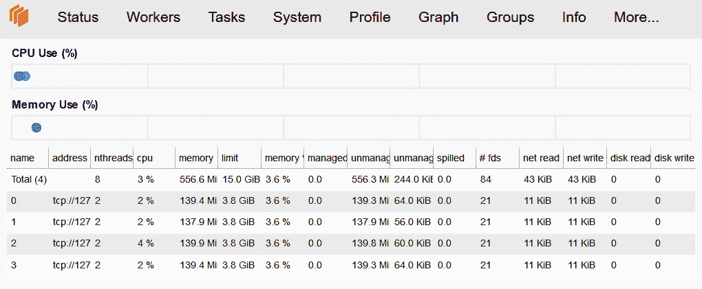
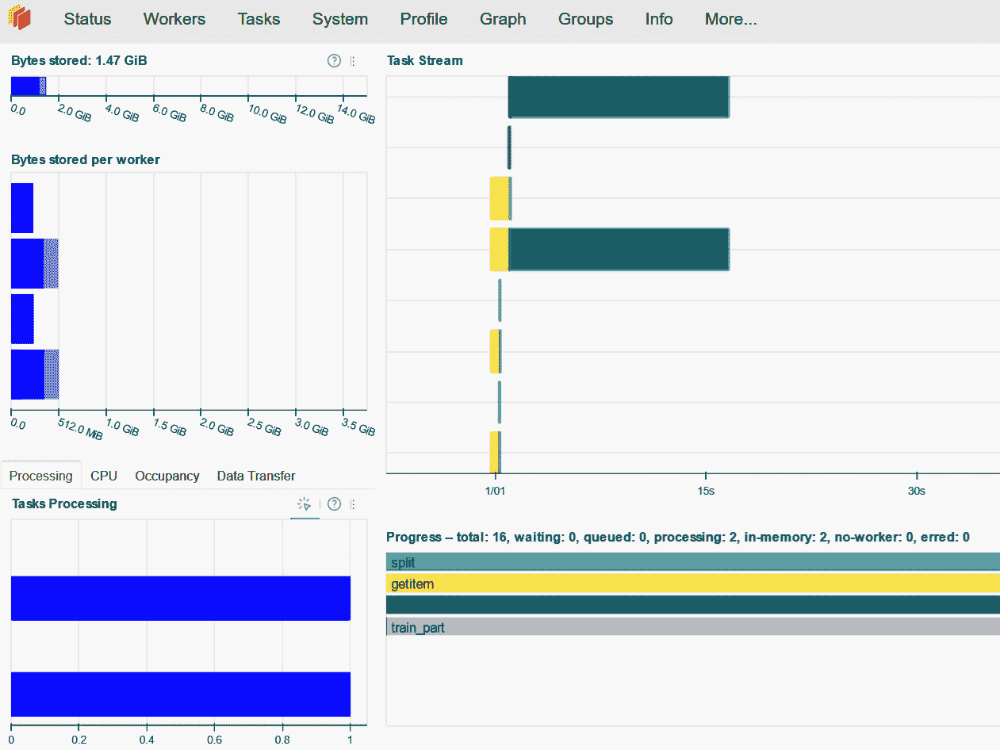
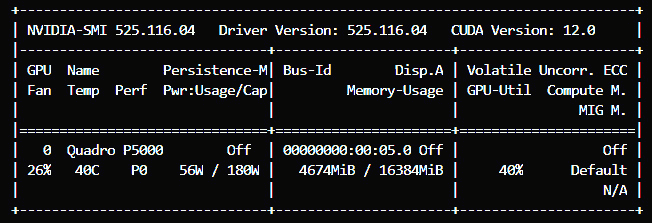

# 11

# 基于 LightGBM 的分布式和 GPU 学习

本章探讨了在分布式计算集群和 GPU 上训练 LightGBM 模型。分布式计算可以显著加快训练工作负载，并允许训练比单台机器上可用的内存大得多的数据集。我们将探讨利用 Dask 进行分布式计算以及 LightGBM 对基于 GPU 的训练的支持。

本章涵盖的主题如下：

+   使用 LightGBM 和 Dask 进行分布式学习

+   LightGBM 的 GPU 训练

# 技术要求

本章包括在分布式计算集群和 GPU 上训练和运行 LightGBM 模型的示例。运行这些示例需要 Dask 环境和 GPU。完整的代码示例可在 [`github.com/PacktPublishing/Practical-Machine-Learning-with-LightGBM-and-Python/tree/main/chapter-11`](https://github.com/PacktPublishing/Practical-Machine-Learning-with-LightGBM-and-Python/tree/main/chapter-11) 找到。

# 使用 LightGBM 和 Dask 进行分布式学习

Dask 是一个开源的 Python 分布式计算库。它旨在无缝集成到现有的 Python 库和工具中，包括 scikit-learn 和 LightGBM。本节探讨了使用 Dask 运行 LightGBM 的分布式训练工作负载。

Dask ([`www.dask.org/`](https://www.dask.org/)) 允许您在单台机器和多台机器上设置集群。在单台机器上运行 Dask 是默认设置，无需设置。然而，在单机集群（或调度器）上运行的工作负载可以轻松地使用分布式调度器运行。

Dask 提供了许多运行分布式集群的方法，包括与 Kubernetes、MPI 集成，或自动配置到超大规模平台（如 AWS 或 Google Cloud Platform）中。

当在单台机器上运行时，Dask 仍然将工作负载分布在多个线程上，这可以显著加快工作负载。

Dask 提供了集群管理实用类，可以轻松设置集群。可以按以下方式运行本地集群：

```py
cluster = LocalCluster(n_workers=4, threads_per_worker=2)
client = Client(cluster)
```

上述代码创建了一个包含四个工作者的本地集群，每个工作者配置为运行两个线程。集群在 localhost 上运行，默认情况下调度器在端口 `8786` 上运行。可以通过参数配置主机 IP 和端口。除了运行调度器外，Dask 还启动了一个使用 Bokeh ([`docs.bokeh.org/en/latest/`](https://docs.bokeh.org/en/latest/)) 实现的诊断仪表板。默认情况下，仪表板在端口 `8787` 上运行。我们可以检查 **工作者** 页面以查看运行集群的状态，如图 *图 11*.1* 所示。



图 11.1 – 显示四个运行工作者的 Dask 诊断仪表板，每个工作者都有一些技术统计数据

集群启动并运行后，我们可以准备数据以在分布式集群上使用。

Dask 提供了自己实现的数据帧，称为 Dask DataFrame。Dask DataFrame 由许多较小的 pandas DataFrame 组成，这些 DataFrame 根据索引分割。每个部分可以存储在磁盘上或通过网络分布式，这使得可以处理比单个机器内存能容纳的更大的数据集。在 Dask DataFrame 上执行的操作会自动分布到 pandas DataFrame 上。

注意

当你的数据集适合 RAM 时，建议使用标准的 pandas DataFrame 而不是 Dask DataFrame。

我们可以通过加载 CSV 文件来创建一个 Dask DataFrame。请注意，CSV 文件可能位于 S3 或 HDFS 上，并且可能非常大。以下代码从一个 CSV 文件创建一个 Dask DataFrame：

```py
import dask.dataframe as dd
df = dd.read_csv("covtype/covtype.csv", blocksize="64MB")
```

在这里，我们也指定了加载 CSV 文件时的块大小。块大小设置了数据集被分割成的块的大小，并使我们能够对单个 DataFrame 部分的内存进行细粒度控制。当调用 `df.shape` 时，我们得到一个有趣的结果：

```py
df.shape
# (Delayed('int-a0031d1f-945d-42b4-af29-ea5e40148f3f'), 55)
```

列数以数字的形式返回。然而，当我们查看行数时，我们得到了一个名为 `Delayed` 的包装类。这表明尽管我们已经创建了 DataFrame，但数据并未加载到内存中。相反，Dask 在使用数据的工人上按需加载数据。我们可以强制 Dask 计算行数如下：

```py
df.shape[0].compute()
# 581012
```

在 DataFrame 中有了可用数据后，我们可以为训练准备它。我们使用 `dask_ml` 中的 `train_test_split` 函数将我们的数据分割成训练集和测试集：

```py
X = df.iloc[:, :-1]
y = df.iloc[:, -1]
X_train, X_test, y_train, y_test = dask_ml.model_selection.train_test_split(X, y)
```

尽管来自 `dask_ml` 的函数与 scikit-learn 的 `train_test_split` 功能相似，但 Dask 版本保持了底层 Dask DataFrame 的分布式特性。

我们现在已设置好集群，并准备好了训练数据。我们现在可以开始训练我们的 LightGBM 模型了。

LightGBM 库团队提供了并维护了每个可用的学习算法的 Dask 版本：`DaskLGBMRegressor`、`DaskLGBMClassifier` 和 `DaskLGBMRanker`。这些是围绕标准 LightGBM scikit-learn 接口包装的，并增加了指定要使用的 Dask 集群客户端的功能。

当 LightGBM 在 Dask 集群上运行时，每个 Dask 工作器对应一个 LightGBM 工作器。LightGBM 将单个工作器上的所有数据分区连接成一个单一的数据集，并且每个 LightGBM 工作器独立使用本地数据集。

然后，每个 LightGBM 工作器协同工作以训练单个 LightGBM 模型，使用 Dask 集群进行通信。当执行数据并行训练（如 Dask 的情况）时，LightGBM 使用 **Reduce-Scatter** 策略：

1.  在直方图构建阶段，每个工作器为不同的非重叠特征构建直方图。然后，执行一个 **Reduce-Scatter** 操作：每个工作器将其直方图的一部分与每个其他工作器共享。

1.  在 **Reduce-Scatter** 之后，每个工作器都有一个特征子集的完整直方图，然后为这些特征找到最佳分割。

1.  最后，执行一个收集操作：每个工作器将其最佳分割与所有其他工作器共享，因此所有工作器都拥有所有最佳分割。

选择最佳特征分割，并根据此对数据进行分区。

幸运的是，分布式算法的复杂性对我们来说是隐藏的，训练代码与我们所熟悉的 scikit-learn 训练代码相同：

```py
dask_model = lgb.DaskLGBMClassifier(n_estimators=200, client=client)
dask_model.fit(X_train, y_train)
```

运行前面的代码训练 LightGBM 模型，我们可以通过检查 Dask 仪表板的 **状态** 页面来查看进度，如图 *图 11**.2* 所示。



图 11.2 – 当 LightGBM 模型正在训练时的 Dask 仪表板状态页面

Dask LightGBM 模型可以使用 **Pickle** 或 **joblib** 完全序列化，并且我们可以按以下方式将模型保存到磁盘：

```py
with open("dask-model.pkl", "wb") as f:
        pickle.dump(dask_model, f)
```

可以通过调用模型的 `predict` 方法来进行预测。请注意，Dask 模型期望一个 Dask DataFrame 或数组：

```py
predictions = dask_model.predict(X_test)
```

与获取 Dask DataFrame 的形状类似，预测操作也是延迟的，仅在需要时计算。我们可以使用 `compute` 来获取预测值：

```py
predictions.compute()
```

这就结束了我们对利用 Dask 进行 LightGBM 分布式训练的探讨。有了 Dask，LightGBM 可以在单个服务器的计算能力之外的巨大数据集上训练模型。Dask 随着您的需求扩展，因此您可以从您的本地笔记本电脑开始，随着数据量的增长，转移到高性能计算环境或云基础设施。此外，如前所述，Dask 设计得可以与现有的 Python 库（如 pandas、NumPy 和 scikit-learn）和谐工作，为数据科学家提供了一个熟悉的环境，同时扩展了这些工具的功能。

接下来，我们将探讨在需要使用 GPU 训练大型模型时如何加快 LightGBM 的训练速度。

# LightGBM 的 GPU 训练

LightGBM 库原生支持在 GPU 上训练模型 [*1*]。支持两种 GPU 平台：通过 OpenCL 和 CUDA 的 GPU。利用 OpenCL 通过 GPU 提供了对最广泛的 GPU 范围的支持（包括 AMD GPU），并且比在 CPU 上运行模型要快得多。然而，如果您有可用的 NVIDIA GPU，CUDA 平台提供了最快的运行时间。

## 设置 LightGBM 以支持 GPU

设置您的环境以使用 GPU 可能会有些棘手，但我们将在此回顾核心步骤。

注意

这里讨论的 GPU 设置步骤提供的是设置您环境的指南和概述。这里列出的库和驱动程序的精确版本号可能已过时，建议您查阅官方文档以获取最新版本：[`lightgbm.readthedocs.io/en/latest/GPU-Tutorial.xhtml`](https://lightgbm.readthedocs.io/en/latest/GPU-Tutorial.xhtml)。

为了使用 GPU，我们必须从源代码*编译和构建 LightGBM 库*。以下说明假设是在 Ubuntu Linux 构建环境中；其他平台的步骤类似。在我们能够构建库之前，我们必须安装一些依赖项。

重要的是，首先，为你的环境安装 GPU 驱动程序。如果你有 NVIDIA GPU，也要安装 CUDA。有关安装说明，可从相应供应商网站获取：

+   [`docs.nvidia.com/cuda/`](https://docs.nvidia.com/cuda/)

+   https://www.amd.com/en/support

接下来，我们需要安装 OpenCL 头文件：

```py
sudo apt install --no-install-recommends
sudo apt install --no-install-recommends nvidia-opencl-dev opencl-headers
```

最后，安装库的构建依赖项：

```py
sudo apt install --no-install-recommends git cmake build-essential libboost-dev libboost-system-dev libboost-filesystem-dev
```

现在，我们已经准备好编译具有 GPU 支持的 LightGBM 库。克隆存储库并构建库，设置`USE_GPU`标志：

```py
git clone --recursive https://github.com/microsoft/LightGBM
cd LightGBM
mkdir build
cd build
cmake -DUSE_GPU=1 ..
make -j$(nproc)
cd ..
```

如*第二章*中所述，*集成学习 – Bagging 和 Boosting，* LightGBM 是一个具有 Python 接口的 C++库。根据前面的说明，我们已经构建了具有 GPU 支持的库，但我们必须构建和安装 Python 包，以便从 Python（包括 scikit-learn API）使用该库：

```py
cd python-package/
python setup.py install --user --precompile
```

## 在 GPU 上运行 LightGBM

在 GPU 上运行训练代码很简单。我们将设备参数设置为`gpu`或`cuda`：

```py
model = lgb.LGBMClassifier(
        n_estimators=150,
        device="cuda",
        is_enable_sparse=False
)
model = model.fit(X_train, y_train)
```

如前述代码所示，我们通过将`is_enable_sparse`设置为`False`来关闭 LightGBM 的稀疏矩阵优化。LightGBM 的稀疏特性在 GPU 设备上不受支持。此外，根据你的数据集，你可能会收到以下警告，指出`multi_logloss`未实现：

```py
Metric multi_logloss is not implemented in cuda version. Fall back to evaluation on CPU.
```

值得注意的是，这里执行的回退操作仅用于评估，而不是训练；训练仍然在 GPU 上执行。我们可以通过检查`nvidia-smi`（针对 NVIDIA GPU）来验证是否使用了 GPU：



图 11.3 – 当 LightGBM 正在训练时 nvidia-smi 的输出（如图所示，GPU 利用率达到 40%）

实现的速度提升取决于你的 GPU。在 Forest Cover 数据集上，训练时间从 171 秒减少到 11 秒（速度提升了 15 倍），进行了 150 次迭代。

使用 GPU 带来的巨大性能提升在执行参数调整时特别有用。我们可以使用 Optuna 等基于 GPU 的训练来显著加速对最优参数的搜索。所需做的只是将模型训练移动到`objective`函数中的 GPU 设备。在定义目标函数时，我们按照常规指定我们的 Optuna 参数范围：

```py
def objective(trial):
        lambda_l1 = trial.suggest_float(
                'lambda_l1', 1e-8, 10.0, log=True),
        lambda_l2 = trial.suggest_float(
                'lambda_l2', 1e-8, 10.0, log=True),
...
```

然后，我们使用 Optuna 参数创建模型，并确保指定设备为`cuda`（或`gpu`）：

```py
model = lgb.LGBMClassifier(
    force_row_wise=True,
    boosting_type=boosting_type,
    n_estimators=n_estimators,
    lambda_l1=lambda_l1,
    lambda_l2=lambda_l2,
...
    learning_rate=learning_rate,
    max_bin=max_bin,
    device="cuda")
```

目标函数的最后部分是返回交叉验证的分数：

```py
scores = cross_val_score(model, X_train, y_train, scoring="f1_macro")
return scores.mean()
```

然后，我们可以像平常一样运行参数研究：

```py
sampler = optuna.samplers.TPESampler()
pruner = optuna.pruners.HyperbandPruner(
        min_resource=10, max_resource=400, reduction_factor=3)
study = optuna.create_study(
        direction='maximize', sampler=sampler,
        pruner=pruner
)
study.optimize(objective(), n_trials=10, gc_after_trial=True, n_jobs=1)
```

重要的是，我们还在这里将`n_jobs`参数设置为`1`，因为利用 GPU 运行并行作业可能会引起不必要的竞争和开销。

在使用 GPU 进行训练以获得最佳性能时，有一些值得注意的最佳实践：

+   总是验证 GPU 是否正在使用。即使设置了`device=gpu`，如果 GPU 不可用，LightGBM 会回退到 CPU 训练。一个检查的好方法是使用如`nvidia-smi`之类的工具，如之前所示，或者将训练时间与参考基准进行比较。

+   使用更小的`max_bin`大小。大型数据集减少了较小`max_bin`大小的影响，而更少的 bins 有助于 GPU 上的训练。同样，如果你的 GPU 支持，可以使用单精度浮点数以增加性能。

+   GPU 训练最适合大型密集数据集。数据需要移动到 GPU 的 VRAM 中进行训练，如果数据集太小，移动数据涉及的开销就太显著了。

+   避免对特征列进行 one-hot 编码，因为这会导致稀疏特征矩阵，这在 GPU 上表现不佳。

这部分内容总结了如何使用 LightGBM 与 GPU 结合。尽管设置可能更复杂，但由于 GPU 能够同时处理数千个线程，因此 GPU 提供了显著的训练速度提升，尤其是在处理大型数据集时，能够实现高效的并行处理。GPU 的巨大并行性对于 LightGBM 中的基于直方图的算法尤其有益，使得如构建直方图等操作更加高效和有效。

# 摘要

在本章中，我们讨论了两种使用 LightGBM 加速计算的方法。第一种是使用 Python 库 Dask 在多台机器上进行大规模分布式训练。我们展示了如何设置 Dask 集群，如何使用 Dask DataFrame 将数据分发到集群，以及如何在集群上运行 LightGBM。

第二种，我们还探讨了如何利用 GPU 与 LightGBM 结合。值得注意的是，GPU 设置很复杂，但一旦可用，就能实现显著的加速。我们还讨论了在 GPU 上训练 LightGBM 模型的一些最佳实践。

# 参考文献

| *[**1**] | *张华，史思，和蔡家驹，大型树提升的 GPU 加速，2017.* |
| --- | --- |
