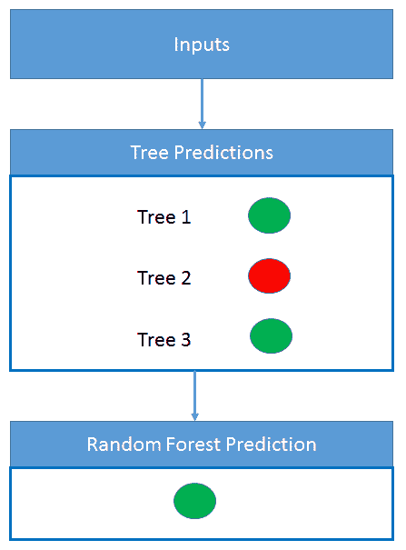

# 监督学习和无监督学习算法

在上一章中，我们了解了机器学习的各个方面，并介绍了机器学习算法的分类方法。在本章中，我们将进一步探讨机器学习算法，并尝试理解监督学习和无监督学习算法。这种分类基于算法的学习机制，是最流行的。

在本章中，我们将涵盖以下主题：

+   以详细实际案例的形式介绍监督学习算法，以帮助理解其原理和指导原则

+   关键的监督学习算法及其应用领域：

    +   朴素贝叶斯

    +   决策树

    +   线性回归

    +   逻辑回归

    +   支持向量机

    +   随机森林

+   以详细实际案例的形式介绍无监督学习算法，以帮助理解它

+   关键的无监督学习算法及其应用领域：

    +   聚类算法

    +   关联规则映射

+   对不同移动 SDK 和工具的广泛概述，这些工具可用于在移动设备上实现这些算法

# 监督学习算法简介

让我们来看看简单的日常生活中的监督学习。一位父亲要求他们的 15 岁儿子去商店买一些蔬菜。他们给他一份蔬菜清单，比如说甜菜、胡萝卜、豆类和番茄，他们希望他去买。他去了商店，能够根据母亲提供的清单识别出蔬菜，并将它们放入购物车中，然后去结账。这是怎么做到的？

简单。父亲通过提供每种蔬菜的实例来为儿子提供了足够的训练，这使他具备了足够的蔬菜知识。儿子使用他获得的知识来选择正确的蔬菜。他使用蔬菜的各种属性来确定蔬菜的正确类别标签，在这种情况下，是蔬菜的名称。以下表格给出了列表中蔬菜的一些属性，通过这些属性，儿子能够识别出类别标签，即蔬菜名称：

| **蔬菜名称 = 类别标签** | **胡萝卜** | **甜菜** | **豆类** | **番茄** |
| --- | --- | --- | --- | --- |
| 属性 1 = 颜色 | 橙色 | 粉色 | 绿色 | 红色 |
| 属性 2 = 形状 | 圆锥形 | 圆形 | 棒状 | 圆形 |
| 属性 3 = 纹理 | 硬 | 硬 | 软 | 软且多汁 |
| 属性 4 = 大小 | 10 厘米长 | 3 厘米半径 | 10 厘米长 | 3 厘米半径 |
| 属性 5 = 味道 | 甜 | 甜 | 平淡 | 甜酸 |

我们刚刚介绍了监督学习。我们将此活动与机器学习的关键步骤联系起来：

+   **定义机器学习问题**：根据在蔬菜的不同属性上已经获得的经验和训练，从商店中所有类别的蔬菜中购买正确的蔬菜类别。

+   **准备/收集数据并训练模型**：15 岁的儿子已经接受了关于所有蔬菜的充分知识训练。他对所见所吃的各种蔬菜及其属性和特征的知识，构成了该问题的历史训练数据，对于模型——15 岁的儿子来说。

+   **评估模型**：儿子被要求从商店购买一些蔬菜。这是提供给他的测试集，用于评估模型。模型现在的任务是根据提供的列表识别商店中蔬菜的正确类别标签。

在某些情况下，识别和购买正确蔬菜时可能会出现错误。例如，儿子可能会购买双豆（豆类的一种变种）而不是普通豆子。这可能是由于他缺乏足够的关于豆子和双豆之间区别特征的训练。如果出现这样的错误，家长会重新用新的蔬菜类型对他进行训练，以便下次他不会犯同样的错误。

因此，我们看到了监督机器学习问题的基本概念和功能。现在让我们深入了解监督学习的细节。

# 深入了解监督学习算法

假设有预测属性，*x1*，*x2*，... *xn*，以及一个目标属性，`y`，对于给定的数据集。那么，监督学习就是机器学习任务，寻找一个预测函数，它接受来自数据集的预测属性和目标属性作为输入，并且能够将预测属性映射到目标属性，对于当前不在训练数据集中的未见数据，以最小的误差进行映射。

用于得出预测函数的数据集中的数据被称为**训练数据**，它由一组训练示例组成，每个示例包含一个输入对象，`x`（通常是向量），以及一个期望的输出值，`Y`。监督学习算法分析训练数据，并产生一个推断函数，该函数将输入映射到输出，也可以用于映射新的、未见的数据示例：

*Y = f(X) + error*

整个算法类别被称为**监督学习**，因为在这里我们考虑了学习和输出变量。所以，通过提供训练数据中所有实例的输入以及预期的输出，学习是监督算法。

监督算法既有预测属性又有目标函数。数据集中的预测属性是那些被认为可以预测目标函数的项。目标函数是机器学习的目标。这通常需要预测属性，可能还有一些其他计算功能，并且通常会输出一个单一的数值。

一旦我们定义了一个需要监督学习的适当机器学习问题，下一步就是选择解决该问题的机器学习算法。这是一个最困难的任务，因为存在大量的学习算法，从其中选择最合适的一个是一个噩梦。

彼得·多明戈斯教授提供了一个简单的参考架构 ([`homes.cs.washington.edu/~pedrod/papers/cacm12.pdf`](https://homes.cs.washington.edu/~pedrod/papers/cacm12.pdf))，基于此架构，我们可以使用三个对于任何机器学习算法都至关重要的关键组件来进行算法选择，如下所示：

+   **表示**：模型被表示的方式，以便计算机可以理解。这也可以被视为模型将在其中起作用的假设空间。

+   **评估**：对于每个算法或模型，都需要一个评估或评分函数来确定哪个表现更好。评分函数会因算法类型的不同而不同。

+   **优化**：一种在模型中搜索最高评分的方法。优化技术的选择对于学习者的效率至关重要，并且有助于确定如果评估函数有多个最优解时产生的模型。

监督学习问题可以进一步分为回归和分类问题：

+   **分类**：当输出变量是一个类别，例如绿色或红色，或者好或坏时。

+   **回归**：当输出变量是一个实数值，例如美元或重量时。

在本节中，我们将通过易于理解的示例介绍以下监督学习算法：

+   Naive Bayes

+   决策树

+   线性回归

+   逻辑回归

+   支持向量机

+   随机森林

# Naive Bayes

Naive Bayes 是一种强大的分类算法，基于贝叶斯定理的原理实现。它假设数据集中考虑的特征变量之间不存在依赖关系。

贝叶斯定理描述了基于先前关于可能与事件相关的事件条件的知识来描述事件的概率。例如，如果癌症与年龄相关，那么，使用贝叶斯定理，一个人的年龄可以用来更准确地评估他们患癌症的概率，与不知道这个人年龄的情况下评估癌症概率相比。

朴素贝叶斯分类器假设一个特定特征在类别中的存在与任何其他特征的存在无关。例如，一个蔬菜如果它是橙色的、锥形的，并且大约三英寸长，就可以被认为是胡萝卜。该算法之所以被称为朴素，是因为它独立地考虑所有这些属性来贡献这个蔬菜是胡萝卜的概率。通常，特征不是独立的，但朴素贝叶斯在预测时将它们视为独立。

让我们看看朴素贝叶斯算法的实际应用。假设我们有一些新闻源，我们想要将这些新闻源分类为文化事件和非文化事件。让我们考虑以下句子：

+   *戏剧性事件进行得很顺利——文化事件*

+   *这个良好的公共集会有大量人群——非文化事件*

+   *音乐展示很棒——文化事件*

+   *戏剧性事件吸引了大量人群——文化事件*

+   *政治辩论非常有信息量——非文化事件*

当我们使用贝叶斯定理时，我们只想使用概率来计算句子是否属于文化事件或非文化事件。

就像胡萝卜的情况一样，我们有颜色、形状和大小的特征，我们将它们都视为独立特征来决定所考虑的蔬菜是否是胡萝卜。

同样，为了确定一个新闻源是否与文化事件相关，我们取一个句子，然后从句子中考虑每个词作为一个独立的特征。

贝叶斯定理指出 *p(A|B) = p(B|A). P(A)/ P(B)*，其中 *P(文化事件|戏剧性展示良好) = P(戏剧性展示良好|文化事件).P(文化事件)/P(戏剧性展示良好)*。

我们可以忽略分母，因为我们正在确定文化类别和非文化类别中哪个标签有更高的概率。文化事件和非文化事件的分母将是整个数据集，因此是相同的。

*P(戏剧性展示良好)* 无法找到，因为这个句子在训练数据中没有出现。所以这就是朴素贝叶斯定理真正发挥作用的地方：

*P(戏剧性展示良好) = P(戏剧).P(展示).P(良好)*

*P(戏剧性展示良好/文化事件) = P(戏剧|文化事件).P(展示|文化事件)|P(良好|文化事件)*

现在很容易计算这些并确定新的新闻源是否是文化新闻源或政治新闻源：

*P(文化事件) = 3/5 (在总共 5 个句子中有 3 个)*

*P(非文化事件) = 2/5*

*P(戏剧/文化事件) = 计算戏剧在文化事件标签中出现的次数 **= 2/13 (戏剧在文化事件标签的总词数中出现 2 次)*

*P(展示/文化事件) = 1/13*

*P(良好/文化事件) =1/13*

有各种技术，如去除停用词、词干提取、n-gram 和 TF-IDF，可以使文本分类的特征识别更加有效。我们将在接下来的章节中介绍其中的一些。

这里是最终的计算总结：

| **词** | **P(word | 文化事件)** | **P(word | 非文化事件)** |
| --- | --- | --- | --- | --- |
| 戏剧性 | 2/13 | 0 |
| 显示 | 1/13 | 0 |
| 好 | 1/13 | 1/13 |

现在，我们只需将概率相乘，看看哪个更大，然后将句子拟合到那个标签类别中。

因此，我们可以从表中知道，该标签将属于文化事件类别，因为当个体概率相乘时，这将导致更大的产品。

这些例子为我们介绍了朴素贝叶斯定理，它可以应用于以下领域：

+   文本分类

+   邮件过滤

+   文档分类

+   社交媒体中的情感分析

+   根据体裁对新闻文章进行分类

# 决策树

决策树算法用于根据某些条件做出决策。决策树是倒置的，其根在顶部*.*

让我们以一个组织的为例，其特征集包括某些软件产品及其属性——构建产品的耗时 *T*，构建产品的努力 *E*，以及构建产品的成本 *C*。需要决定这些产品是在公司内部构建还是直接从公司外部购买。

现在，让我们看看如何创建这个决策树。以下图表中，黑色粗体文本代表条件/内部节点，根据这个节点，树分为分支/边。分支的末端不再分裂的是决策/叶子节点。

决策树在项目管理、项目管理和风险规划中使用。让我们看看一个实际例子。以下图表显示了组织用于决定其哪些软件需要内部构建或直接从外部购买产品的决策树。在做出决定之前需要考虑各种决策点，这可以表示为树的形式。三个特征，成本、努力和进度参数，被考虑用于决定**购买**或**构建**：

上述树被称为**分类树**，因为目标是根据购买或构建来对产品性质进行分类。**回归树**以相同的方式表示，只是它们预测连续值，例如房屋的价格。通常，决策树算法被称为**CART**或**分类和回归树**。

决策树可以应用于以下领域：

+   风险识别

+   贷款处理

+   选举结果预测

+   流程优化

+   可选定价

# 线性回归

回归分析 线性回归是一种统计分析方法，它寻找变量之间的关系。它帮助我们理解输入和输出数值变量之间的关系。

在此方法中，确定因变量非常重要。例如，房屋的价值（因变量）根据房屋的大小而变化；也就是说，其面积是多少平方英尺（自变量）。房屋的价值根据其位置而变化。线性回归技术可用于预测。

当响应是连续变量时，使用线性回归。以下图表清楚地显示了单变量线性回归的工作原理。房屋的价格根据其大小而变化，并在以下图表中表示：

线性回归可以应用于以下领域：

+   营销

+   定价

+   推广

+   分析消费者行为

# 逻辑回归

逻辑回归是一种分类算法，最适合预测的输出是二元类型——真或假、男或女、赢或输等。二元类型意味着只有两种可能的结果。

逻辑回归之所以称为逻辑回归，是因为算法中使用了 S 形函数。

对数函数或对数曲线是一种常见的 S 形（S 形曲线），由以下方程表示：

S 形曲线在此处展示。它是一条 S 形曲线：

此曲线的有限极限如下：

+   当*x*趋近于*−∞*时的*0*

+   当*x*趋近于*+∞*时的*1*

当*x=0*时，S 形函数的输出为*0.5*。

因此，如果输出大于*0.5*，我们可以将结果分类为 1（或**是**），如果小于*0.5*，我们可以将其分类为 0（或**否**）。例如：如果输出为*0.65*，从概率的角度来看，它可以解释为—*今天下雨的概率是 65%。*

因此，S 形函数的输出不仅可以用作是/否的分类，还可以用来确定是/否的概率。它可以应用于以下领域：

+   图像分割和分类

+   地理图像处理

+   手写识别

+   医疗保健，用于疾病预测和基因分析

+   预测在预期有二元结果的各种领域

# 支持向量机

**支持向量机**（**SVM**）是一种监督机器学习算法，可用于分类和回归。SVMs 更常用于分类。

给定一些数据点，每个数据点属于两个二进制类别之一，目标是决定新的数据点将属于哪个类别。我们需要将数据点可视化为一个 p 维向量，并确定我们是否可以用一个(p-1)维超平面将两个这样的数据点分开。

可能存在许多超平面可以分离这样的数据点，而这个算法将帮助我们找到提供最大分离的最佳超平面。这个超平面被称为**最大间隔超平面**，而这个分类器被称为**最大间隔分类器**。我们可以将分离超平面的概念扩展到几乎分离类别的超平面，使用所谓的**软间隔**。最大间隔分类器对不可分情况的一般化称为**支持向量分类器**。

让我们来看第一个例子。在这个例子中，有一个超平面将红色点和蓝色点分开：

但想象一下，如果点分布如下——我们将如何识别将红色点和蓝色点分开的超平面：

解决方案是使用支持向量机（SVM）来识别超平面。它可以执行变换以识别用于分类的两个类别之间的超平面。它将引入一个新的特征，*z*，其值为*z=x²+y²*。让我们用*x*和*z*轴绘制图形，并识别用于分类的超平面：

现在我们已经了解了支持向量机（SVM）的基本概念，让我们看看它可以在哪些领域应用：

+   人脸检测

+   图像分类

+   生物信息学

+   地球和环境科学

+   遗传学

+   蛋白质研究

+   手写识别

# 随机森林

我们已经看到了决策树是什么。在理解了决策树之后，让我们来看看随机森林。随机森林将许多决策树组合成一个单一模型。单个决策树（或人类）做出的预测可能并不准确，但结合起来，平均而言，预测将更接近目标。

下面的图示展示了一个随机森林，其中包含多个树，每棵树都在进行预测：

随机森林是由许多决策树组合而成的，因此，从森林中的所有树中获得多个视角以到达最终期望的结果/预测的可能性更大。如果只考虑单个决策树进行预测，用于预测的信息就较少。但在随机森林中，当涉及许多树时，信息来源是多样化和广泛的。与决策树不同，随机森林没有偏差，因为它们不依赖于单一来源。

下面的图示展示了随机森林的概念：

随机森林可以应用于以下领域：

+   风险识别

+   贷款处理

+   选举结果预测

+   流程优化

+   可选定价

# 无监督学习算法简介

考虑一个场景，孩子被给了一袋大小、颜色、形状各异且由不同材料制成的珠子。我们让孩子随意处理整个珠子袋。

根据孩子的兴趣，他们可以做很多事情：

+   根据大小将珠子分类

+   根据形状将珠子分类

+   根据颜色和形状的组合将珠子分类

+   根据材料、颜色和形状的组合将珠子分类

可能性是无限的。然而，没有任何先前教导的孩子能够通过手头的珠子并揭示出他们不需要任何先前知识的模式。他们纯粹是基于手头的珠子，即手头的数据来发现模式的。我们刚刚接触到了无监督机器学习！

我们将把前面的活动与机器学习的关键步骤联系起来：

1.  **定义机器学习问题**：从给定的珠子袋中揭示珠子的隐藏模式。

1.  **准备/收集数据和训练模型**：孩子打开装满珠子的袋子，了解袋子里有什么。他们发现不同珠子的属性：

    +   颜色

    +   形状

    +   大小

    +   材料

1.  **评估模型**：如果给孩子一组新的珠子，他们将如何根据他们之前的聚类珠子经验对这些珠子进行聚类？

在分组珠子时可能存在需要纠正/修复的错误，以防止它们在未来再次发生。

因此，现在我们已经了解了无监督机器学习的基本概念和函数，让我们深入了解无监督学习的细节。

# 深入了解无监督学习算法

无监督机器学习处理的是未标记的数据——也就是说，尚未分类或归类的数据，并据此得出结论/模式。

这些类别从未标记、未分类或未归类的测试数据中学习。无监督学习不是响应反馈，而是识别数据中的共性，并根据每份数据中这种共性的存在与否做出反应。

传递给学习算法的输入是无标签的，因此没有直接的方法来评估算法产生的输出结构的准确性。这是无监督学习与监督学习区别的一个特征。

无监督算法具有预测属性，但**没有**目标函数。

没有目标函数意味着什么？考虑以下情况：

+   探索数据中的自然分组。

+   学习关联规则，然后检查它们是否有任何用处。

这里有一些经典的例子：

+   执行市场篮子分析，然后优化货架分配和摆放

+   级联或相关机械故障

+   超出已知类别的人口统计分组

+   规划产品捆绑优惠

在本节中，我们将通过易于理解的示例介绍以下无监督学习算法：

+   聚类算法

+   关联规则映射

**主成分分析**（PCA）和**奇异值分解**（SVD）如果您想深入了解这些概念，可能也会很有兴趣。

# 聚类算法

聚类算法的作用是将数据集聚类成有用的组。聚类的目标是创建数据点的组，使得不同簇中的点不相似，而簇内的点相似。

对于聚类算法能够工作，有两个基本要素：

+   **相似度函数**：这决定了我们如何决定两个点相似。

+   **聚类方法**：这是观察到的用于达到簇的方法。

需要有一个机制来确定点之间的相似性，基于此，它们可以被分类为相似或不相似。存在各种相似度度量。以下是一些：

+   **欧几里得**：

+   **余弦**：

+   **KL 散度**：

# 聚类方法

一旦我们知道了相似度度量，接下来就需要选择聚类方法。我们将介绍两种聚类方法：

+   层次聚类方法

+   K-means 聚类

# 层次聚类方法

聚类层次聚类是来自统计学领域的一个经典聚类算法。它涉及迭代合并两个最相似的组，最初这些组包含单个元素。算法的名称指的是其工作方式，因为它以聚合或自下而上的方式创建层次结果，即通过将较小的组合并成较大的组。

这是用于文档聚类的这种聚类方法的高级算法。

1.  通用聚合过程（Salton, G: *《自动文本处理：计算机对信息的转换、分析和检索》*，*Addison-Wesley*，1989）通过迭代产生嵌套簇。

1.  计算所有成对文档之间的相似度系数

1.  将每份*n*文档放入一个自己的类别中

1.  将两个最相似的簇合并成一个：

    +   用新的簇替换这两个簇

    +   重新计算关于新聚类的簇间相似度得分

    +   如果簇半径大于 maxsize，则阻止进一步合并

1.  重复前面的步骤，直到只剩*k*个簇（注意：*k*可能等于*1*）

# K-means 聚类

此 K 均值聚类算法的目的是在数据中找到 K 个组，每个组都有相似的数据点。该算法通过迭代地根据提供的特征将每个数据点分配到*K*个组中的一个。数据点根据特征相似性进行聚类。

K 值在算法开始时随机分配，通过改变 K 值可以获得不同的结果变体。一旦选择了 K 值并启动了算法的活动序列，如以下各点所示，我们发现有两个主要步骤会不断重复，直到簇中不再有变化的空间。

重复的两个主要步骤如下所示：*步骤 2*和*步骤 3*：

+   **步骤 2**：将数据集中的数据点分配到 K 个簇中的任何一个。这是通过计算数据点到簇质心的距离来完成的。如指定，我们可以使用我们之前讨论的任何距离函数来进行这个计算。

+   **步骤 3**：在这里再次发生质心的重新校准。这是通过取分配给该质心簇的所有数据点的平均值来完成的。

算法的最终输出是具有相似数据点的 K 个簇：

1.  选择 *k-seeds d(k[i],kj) > d[min]*

1.  根据最小距离分配点到簇：

1.  计算新的簇质心：

1.  将点重新分配到簇（如*步骤 2*）

1.  迭代直到没有点改变簇。

下面是一些聚类算法被使用的领域：

+   城市规划

+   地震研究

+   保险

+   营销

+   医学，用于分析抗菌活性和医学成像

+   犯罪分析

+   机器人学，用于异常检测和自然语言处理

# 关联规则学习算法

关联规则挖掘对于分类的非数值数据更有用。关联规则挖掘主要关注在一系列物品中寻找频繁共现的关联。有时它也被称为**市场篮子分析**。

在购物篮中，目标是确定哪些物品经常一起出现。这显示了从随机抽样方法中很难找到的相关性。这个经典的例子是著名的啤酒和尿布关联，这在数据挖掘书籍中经常被提及。场景是这样的：去商店买尿布的男性也倾向于买啤酒。这个场景很难通过随机抽样直观或确定。

另一个例子是在 2004 年由沃尔玛发现的，当时一系列飓风横扫佛罗里达州。沃尔玛想知道在飓风来临前购物者通常会购买什么。他们发现有一个特定商品的销售量在正常购物日增加了七倍；这个商品不是瓶装水、电池、啤酒、手电筒、发电机或我们可能想象到的任何常见物品。这个商品是**草莓泡芙**！可以设想许多原因来解释为什么这是飓风来临前最想要的产品——泡芙不需要冷藏，不需要烹饪，它们是独立包装的，保质期长，它们是零食，也是早餐食品，孩子们喜欢它们，我们也喜欢它们，理由还有很多。尽管有这些明显的理由，这仍然是一个巨大的惊喜！

在挖掘关联时，以下内容可能有用：

+   搜索非数值项的罕见和异常共现关联。

+   如果数据是时间序列数据，在数据挖掘实验中引入时间延迟的影响，看看相关性的强度是否会在更晚的时间达到峰值。

市场篮子分析可以应用于以下领域：

+   零售管理

+   店铺管理

+   库存管理

+   美国国家航空航天局和环境影响研究

+   医疗诊断

# 摘要

在本章中，我们通过一个简单的例子了解了什么是监督学习，并深入探讨了监督学习的概念。我们通过实际例子和它们的应用领域，逐一介绍了各种监督学习算法，然后我们开始通过简单的例子介绍无监督学习。我们也涵盖了无监督学习的概念，然后通过实际例子和它们的应用领域，逐一介绍了各种无监督学习算法。

在随后的章节中，我们将通过使用本章介绍的一些监督学习和无监督学习算法来解决移动机器学习问题。我们还将向您介绍移动机器学习 SDK，这些 SDK 将用于实现移动机器学习解决方案。

# 参考文献

+   彼得罗·多明戈博士的论文——[`homes.cs.washington.edu/~pedrod/papers/cacm12.pdf`](https://homes.cs.washington.edu/~pedrod/papers/cacm12.pdf)，[ ](https://homes.cs.washington.edu/~pedrod/papers/cacm12.pdf)总结了机器学习研究人员和实践者学到的十二个关键教训，包括要避免的陷阱、要关注的重要问题和该领域常见问题的答案。
