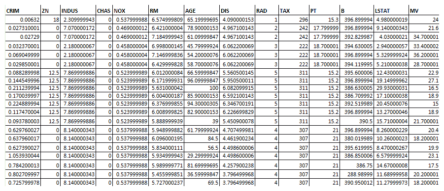
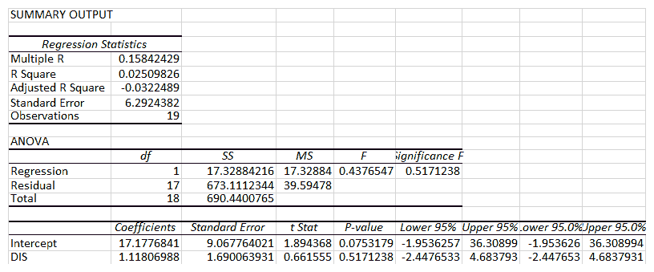
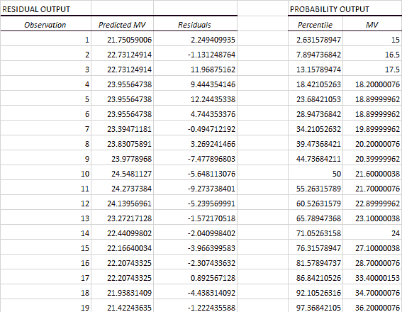
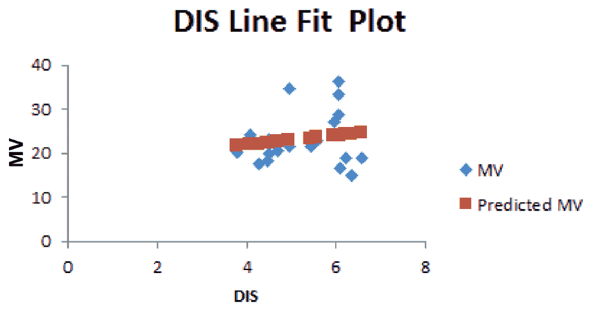
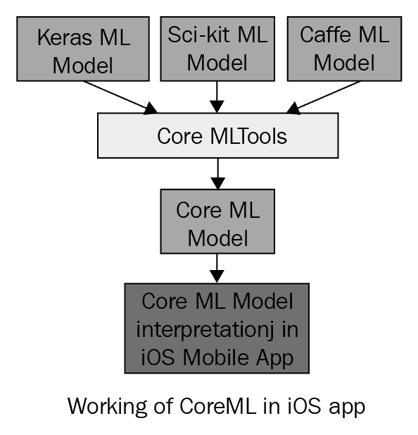
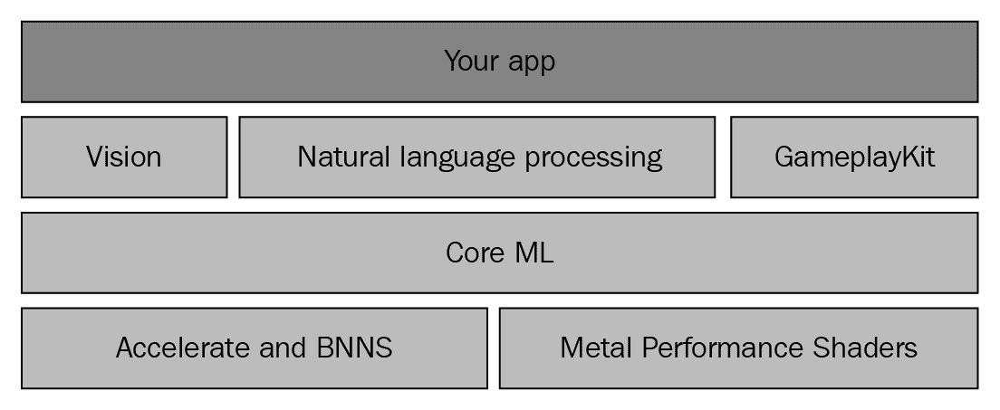
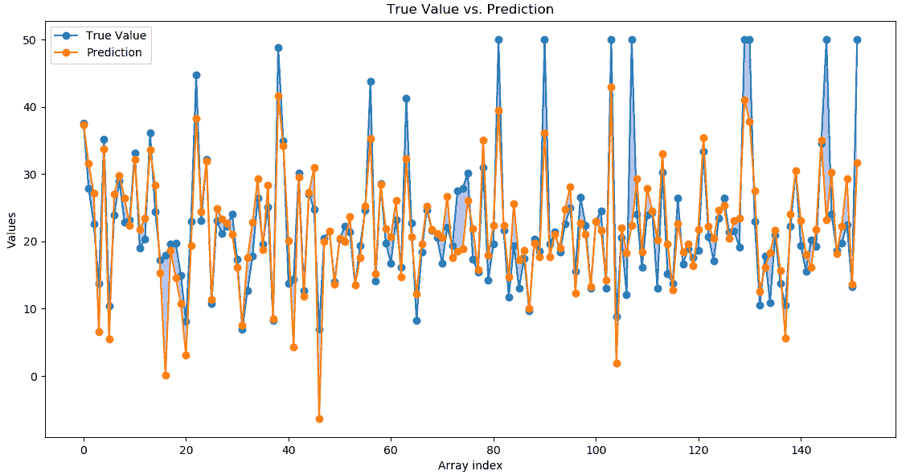
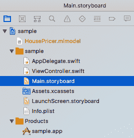
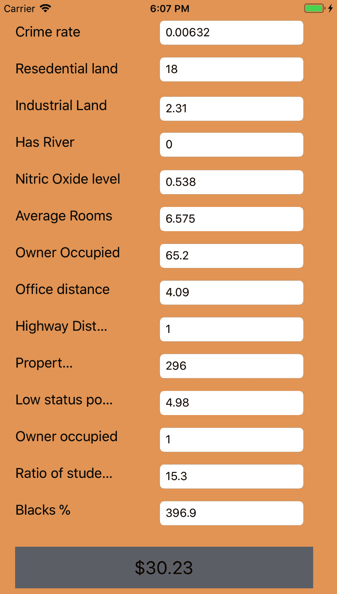

# 在 iOS 中使用 Core ML 进行回归

本章将为您提供一个关于回归算法的概述，以及 Core ML 基础知识的洞察，并介绍如何利用回归算法创建机器学习程序，并使用 iOS 中的 Core ML 预测一组相关住房数据的房价。

正如我们在第一章，“移动机器学习简介”中看到的，任何机器学习程序都有四个阶段。我们将看到在四个阶段中我们将要涵盖的内容，以及我们将使用什么工具来解决潜在的机器学习问题。

**问题定义**：提供某个区域的住房信息，我们想要预测该区域房屋的中位数价值。

本章我们将涵盖以下主题：

+   理解什么是回归以及如何将其应用于解决 ML 问题

+   使用样本数据集和 Excel 理解回归

+   理解 Core ML 的基础知识

+   使用 Core ML 中的回归解决问题：

    +   技术要求

    +   如何使用 scikit-learn 创建模型文件

    +   测试模型

    +   理解如何将 scikit-learn 模型导入 Core ML 项目

    +   编写 iOS 移动应用程序，并在其中使用 scikit-learn 模型进行房价预测

# 回归简介

回归分析是数据统计分析的基本方法。它是一种统计方法，有助于找出变量之间的关系。它基本上用于理解输入和输出数值变量之间的关系。我们首先应确定因变量，它将根据自变量的值而变化。例如，房屋的价值（因变量）根据房屋的平方英尺（自变量）而变化。回归分析对于预测非常有用。

在一个简单的回归问题（一个*x*和一个*y*），模型的形态如下：

*y = A + B*x*

在高维空间中，当我们有多个输入(*x*)时，这条线被称为**平面**或**超平面**。

在我们的例子中，我们根据可能影响该特定区域数据价格的各个参数预测房屋价格。

在解决回归问题时需要考虑的一些重要点包括：

+   预测结果应为一个数值量。

+   输入变量可以是实值或离散值。

+   如果有多个输入变量，则称为**多元回归问题**。

+   当输入变量按时间顺序排列时，回归问题被称为**时间序列预测问题**。

+   回归不应与分类混淆。分类是预测离散类标签的任务，而回归是预测连续量的任务。

能够学习回归预测模型的算法被称为**回归算法**。

# 线性回归

在本节中，我们将通过一个具体的详细示例来尝试理解线性回归。我们还将使用相同的示例数据集来处理 iOS Core ML 示例。

# 数据集

我们将使用波士顿数据集来解决回归问题。这个数据集包含了美国人口普查局收集的有关马萨诸塞州波士顿地区住房的信息。它是从 StatLib 存档（[`lib.stat.cmu.edu/datasets/boston`](http://lib.stat.cmu.edu/datasets/boston)）获得的，并在文献中被广泛用作算法的基准。该数据集规模较小，只有 506 个案例。

# 数据集命名

这个数据集的名称很简单，叫**波士顿**。它有两个照片任务：现在，需要预测一氧化二氮的水平；价格，需要预测房屋的中位数价值。

关于数据集的其他细节如下：

+   **来源**：波士顿住房数据来源于自然。

+   **用途**：此数据集可用于评估。

+   **案例数量**：该数据集包含总共 506 个案例。

+   **顺序**：案例的顺序是神秘的。

+   **变量**：数据集中的每个案例有 14 个属性。它们如下：

    +   **CRIM**：城镇的人均犯罪率

    +   **ZN**：超过 25,000 平方英尺地块的住宅用地比例

    +   **INDUS**：城镇非零售商业地块的比例

    +   **CHAS**：查尔斯河虚拟变量（如果地块边界是河流则为 1，否则为 0）

    +   **NOX**：一氧化氮浓度（每千万分之一）

    +   **RM**：每套住宅的平均房间数

    +   **AGE**：1940 年之前建造的业主自住单元的比例

    +   **DIS**：到五个波士顿就业中心的加权距离

    +   **RAD**：通往放射状高速公路的可达性指数

    +   **TAX**：每 10,000 美元的全值财产税税率

    +   **PTRATIO**：城镇的师生比例

    +   **B**：`1000(Bk - 0.63)²`，其中`Bk`是城镇的黑人比例

    +   **LSTAT**：人口中低阶层百分比

    +   **MEDV**：业主自住房屋的中位数价值（单位为 1000 美元）

我们将尝试使用 Excel 对数据集进行简单线性回归和多变量回归，并了解其细节。我们将仅考虑从波士顿数据集的 506 个样本数据空间中以下 20 个数据元素进行分析：



现在，我们可以使用 Excel 中提供的数据分析选项，尝试仅考虑依赖变量`DIS`来预测`MV`。在数据分析中，选择`回归`，并将`MV`作为`Y`值，`DIS`作为`X`值。这是一个只有一个依赖变量来预测输出的简单回归。以下是 Excel 生成的输出：



以 `DIS` 作为因变量的 `MV` 预测的线性回归方程将是 *Y = 1.11X + 17.17* (`DIS` 的 `DIS` 系数 + 截距值)：

*R2 =0.0250*

现在，我们可以看到分析所考虑的 20 个数据样本的 `MV` 预测输出：



预测 `DIS` 作为因变量的 `MV` 的输出图表如下：



现在，我们了解了线性回归如何对一个单一的自变量进行工作。同样地，我们可以有任意数量的自变量，通过将它们包括为 *X1*、*X2*、*X3*、... *XN*。

在我们的数据集中，总共有 14 个变量，我们可以让 `MV` 依赖于剩余的所有 13 个变量，并以之前为单个变量指定的方式创建回归方程。

现在我们已经了解了如何使用 Excel 对波士顿数据集进行回归，我们将使用 Core ML 进行相同的操作。在继续在 Core ML 中实现之前，我们必须了解 Core ML 是什么，并查看 Core ML 的基础知识。

# 理解 Core ML 的基础知识

Core ML 允许 iOS 移动应用程序在移动设备上本地运行机器学习模型。它使开发者能够将各种机器学习模型类型集成到移动应用程序中。开发者不需要广泛的机器学习或深度学习知识，就可以使用 Core ML 编写机器学习移动应用程序。他们只需要知道如何将 ML 模型包含到移动应用中，就像其他资源一样，并在移动应用程序中使用它。数据科学家或机器学习专家可以使用他们熟悉的任何技术创建 ML 模型，例如 Keras、scikit-learn 等。Core ML 提供了工具，可以将使用其他工具（tensor、scikit-learn 等）创建的 ML 数据模型转换为 Core ML 所要求的格式。

这种转换为 Core ML 模型发生在应用程序开发阶段。当应用程序被使用时，不会实时发生转换。转换是通过使用 `coremltools` Python 库来完成的。当应用程序反序列化 Core ML 模型时，它成为一个具有 `prediction` 方法的对象。Core ML 并非真正用于训练，而是用于运行预训练模型。

Core ML 支持广泛的深度学习能力，支持超过 30 层。深度学习中的层实际上表示数据经过转换的层数。它还支持标准模型：树集成、SVM 和线性模型。它建立在低级技术如 Metal 之上。Core ML 无缝利用 CPU 和 GPU 以提供最大性能和效率。它能够根据任务的强度在 CPU 和 GPU 之间切换。由于 Core ML 允许机器学习在设备上本地运行，因此数据不需要离开设备进行分析。

使用 Core ML，我们可以将训练好的机器学习模型集成到我们的应用程序中：



训练好的模型是将机器学习算法应用于一组训练数据的结果。该模型根据新的输入数据进行预测。例如，在一个地区的房价历史数据上训练的模型，在给出卧室和浴室数量时，可能能够预测房屋的价格。

Core ML 针对设备上的性能进行了优化，这最小化了内存占用和功耗。严格在设备上运行确保了用户数据的隐私，并保证在网络连接不可用时，我们的应用程序仍然功能齐全且响应迅速。

Core ML 是特定领域框架和功能的基础。Core ML 支持**Vision**进行图像分析、**Foundation**进行**自然语言处理**，以及**Gameplaykit**评估学习决策树。**Core ML**本身建立在低级原语如**Accelerate**和**BNNS**以及**Metal Performance Shaders**之上：



准备使用 Core ML 编写 ML 程序的 iOS 开发者需要了解以下基本步骤：

1.  在 iOS 之外创建模型。这可以通过 scikit-learn、TensorFlow 或开发者感到舒适的任何其他方式完成。创建机器学习模型文件。为了创建机器学习模型文件，他们需要了解之前讨论过的机器学习的四个关键阶段。

1.  一旦模型构建、测试并准备好使用，就需要将该模型转换为与 Core ML 兼容的格式。Core ML 工具实际上可以帮助将使用任何工具创建的模型文件转换为 Core ML 要求的格式（`.mlmodel`文件格式）。

1.  一旦创建了 Core ML 特定的模型文件，就可以将其导入 iOS 程序中，并使用 Core ML 提供的 API 与模型文件交互，以提取 iOS 应用程序可能需要的信息，基本上是将`.mlmodel`文件导入 Xcode 项目的`resources`文件夹中。

Core ML 的最大优势是它极其简单易用。只需几行代码就可以帮助集成一个完整的 ML 模型。Core ML 只能帮助将预训练的 ML 模型集成到应用程序中。无法进行模型训练。

# 使用 Core ML 中的回归解决问题

本节将详细介绍创建回归模型和使用 iOS 移动应用程序中的回归模型。它将提供创建 iOS 回归 ML 应用程序以解决定义的问题所涉及的各个步骤的详细说明。

# 技术要求

需要在开发者机器上安装以下软件：

+   Python

+   Mac 环境下的 Xcode

本章的练习程序可以从我们的 GitHub 仓库下载，地址为[`github.com/PacktPublishing/Machine-Learning-for-Mobile/tree/master/housing%20price%20prediction`](https://github.com/PacktPublishing/Machine-Learning-for-Mobile/tree/master/housing%20price%20prediction)。

在下面的程序中，我们将使用`pandas`、`numpy`和`scikit-learn`来创建模型。因此，请使用以下命令从命令提示符/终端使用`pip`包管理器安装这些包：

```py
pip install scikit-learn
pip install numpy
pip install pandas
```

为了将创建的模型转换为 Core ML 格式，我们需要使用 Apple 提供的 Core ML `scikit-learn` Python 转换器：

```py
pip install -U coremltools
```

# 如何使用 scikit-learn 创建模型文件

本节将解释我们将如何使用`scikit-learn`创建线性回归模型文件，并将其转换为与 Core ML 兼容的`.mlmodel`文件。我们将使用波士顿数据集来创建模型。以下是一个简单的 Python 程序，它使用`scikit-learn`和波士顿数据集创建了一个简单的线性回归模型。然后，Core ML 工具将其转换为与 Core ML 兼容的模型文件。让我们详细地过一遍这个程序。

首先，我们需要导入程序所需的所需包：

```py
# importing required packages
 import numpy as np
```

前面的行导入 NumPy 包。NumPy 是 Python 科学计算的基础包。它包含一个强大的 N 维数组对象。这个`numpy`数组将在这个程序中用于存储具有 14 个维度的数据集：

```py
import pandas as pd
 from pandas.core import series
```

前面的行导入`pandas`包，这是一个开源的 BSD 许可库，为 Python 编程语言提供高性能、易于使用的数据结构和数据分析工具。使用 pandas，我们可以创建一个数据框。你可以假设一个`pandas`数据框就像一个 Excel 电子表格，其中每个工作表都有标题和数据：

```py
import coremltools
 from coremltools.converters.sklearn import _linear_regression
```

前面的行导入了我们在这个程序中使用的线性回归模型的 Core ML Tools 转换包。Core ML Tools 是一个用于创建、检查和测试`.mlmodel`格式模型的 Python 包。特别是，它可以用于以下操作：

+   将现有模型从流行的机器学习工具（包括`Keras`、`Caffe`、`scikit-learn`、`libsvm`和`XGBoost`）转换为`.mlmodel`格式

+   通过简单的 API 以`.mlmodel`格式表达模型

+   使用`.mlmodel`进行预测（在选定平台用于测试目的）：

```py
from sklearn import datasets, linear_model
 from sklearn.metrics import mean_squared_error, r2_score
```

前一行导入`sklearn`包。数据集用于导入`sklearn`包中的内置数据集。在这个程序中，我们使用的是在上一节中解释的波士顿房价数据集。`linear_model`包用于访问线性回归函数，而`metrics`包用于计算我们模型的测试指标，如均方误差：

```py
boston = datasets.load_boston()
```

前一行是从`sklearn`数据集包中加载波士顿数据集：

```py
 bos = pd.DataFrame(boston.data)
```

现在，从整个数据集中，我们需要提取数据：

```py

 bos.columns = boston.feature_names
```

获取列名，即数据的标题：

```py
bos['price'] = boston.target
```

现在，让我们定义我们想要预测的目标列。定义为目标的列将是预测的那个列：

```py
 x = bos.drop('price', axis=1)
```

一旦我们定义了目标列，我们将从目标列中删除数据，使其变为`x`：

```py
 y = bos.price
```

由于我们定义价格为目标列，`y`是数据集中的价格列：

```py
 X_train,X_test,Y_train,Y_test = sklearn.model_selection.train_test_split(x,y,test_size=0.3,random_state=5)
```

然后，我们根据 70/30 的规则将数据分为训练数据和测试数据：

```py
 lm = sklearn.linear_model.LinearRegression() 
```

一旦我们有了训练数据和测试数据，我们就可以初始化一个线性回归对象：

```py
 lm.fit(X_train, Y_train)
```

使用初始化的线性回归对象，我们只需将训练数据和测试数据输入到回归模型中：

```py
Y_pred = lm.predict(X_test)
```

前一行预测了目标：

```py
mse = sklearn.metrics.mean_squared_error(Y_test, Y_pred)
print(mse);
```

前一行将计算拟合模型和预测结果中的均方误差。

由于回归预测模型预测一个数量，因此模型的技能必须以那些预测中的误差来报告。

评估回归预测模型技能的方法有很多，但最常见的是计算**均方根误差**（**RMSE**）。

例如，如果一个回归预测模型做出了两个预测，一个是*1.5*（预期值为*1.0*），另一个是 3.3（预期值为*3.0*），那么*RMSE*将如下所示：

| 1 | *RMSE = sqrt(average(error²))* |
| --- | --- |
| 2 | *RMSE = sqrt(((1.0 - 1.5)² + (3.0 - 3.3)²) / 2)* |
| 3 | *RMSE = sqrt((0.25 + 0.09) / 2)* |
| 4 | *RMSE = sqrt(0.17)* |
| 5 | *RMSE = 0.412* |

*RMSE*的一个好处是误差得分的单位与预测值相同：

```py
 model = coremltools.converters.sklearn.convert(
     sk_obj=lm,input_features=boston.feature_names,
     output_feature_names='price')
```

在前一行中，我们将拟合模型转换为 Core ML 格式。基本上，这是创建`.mlmodel`文件的行。我们还在指定输入和输出列名：

```py
 model.save('HousePricer.mlmodel')
```

在前一行中，我们将模型保存到磁盘。这可以在我们的 iOS 程序中稍后使用。

# 运行和测试模型

当`scikit-learn`创建的模型在转换为 Core ML 格式之前独立执行和测试时，发现了以下方差和均方误差：

+   准备好的模型的均方误差为 `30.703232`

+   方差分数为 `0.68`

+   进程以退出代码 `0` 完成

以下图表展示了预测值与实际值之间的关系：



# 将模型导入 iOS 项目

以下是在 Xcode 项目中导入并用于预测的 `.mlmodel` 文件的工程结构：



`ViewCcontroller.swift` 文件是使用创建的模型文件的地方，并在移动应用程序中执行房价预测。

`housePricer.mlmodel` 文件是使用 `scikit-learn` 创建并使用 Core ML 转换工具转换为 ML 模型文件的模型文件。此文件包含在 iOS Xcode 项目的 `resources` 文件夹中。

# 编写 iOS 应用程序

本节提供了使用 `.mlmodel` 格式的模型进行房价预测的 `Swift` 代码的详细信息：

```py
//  ViewController.swift
import UIKit
import CoreML
class ViewController: UIViewController {
    let model = HousePricer()
```

这一行是为了初始化我们已导入项目的模型类。以下行定义了与文本字段交互的出口/变量：

```py
 @IBOutlet weak var crim: UITextField!
    @IBOutlet weak var zn: UITextField!
    @IBOutlet weak var price: UILabel!
    @IBOutlet weak var b: UITextField!
    @IBOutlet weak var ptratio: UITextField!
    @IBOutlet weak var medv: UITextField!
    @IBOutlet weak var lstat: UITextField!
    @IBOutlet weak var rad: UITextField!
    @IBOutlet weak var tax: UITextField!
    @IBOutlet weak var dis: UITextField!
    @IBOutlet weak var age: UITextField!
    @IBOutlet weak var rm: UITextField!
    @IBOutlet weak var nox: UITextField!
    @IBOutlet weak var chas: UITextField!
    @IBOutlet weak var indus: UITextField!
    override func didReceiveMemoryWarning() {
        super.didReceiveMemoryWarning()
        // Dispose of any resources that can be recreated.
    }
    override func viewDidLoad() {
        super.viewDidLoad();
        updated(rad);
    }
    @IBAction func updated(_ sender: Any) {
        guard let modeloutput = try? model.prediction(CRIM: Double(crim.text!)!, ZN: Double(zn.text!)!, INDUS: Double(indus.text!)!, CHAS: Double(chas.text!)!, NOX: Double(nox.text!)!, RM: Double(rm.text!)!, AGE: Double(age.text!)!, DIS: Double(dis.text!)!, RAD: Double(rad.text!)!, TAX: Double(tax.text!)!, PTRATIO: Double(ptratio.text!)!, B: Double(b.text!)!, LSTAT: Double(lstat.text!)!) else {
            fatalError("unexpected runtime error")
     }
        price.text = "$" + String(format: "%.2f",modeloutput.price);
    }
}
```

之前的功能被添加为所有之前文本字段的 `onchange` 监听器。在这里，我们使用之前创建的模型对象，并预测文本字段中给定值的房价。

# 运行 iOS 应用程序

创建的 Xcode 项目在模拟器中执行，以下是我们得到的样本：



# 进一步阅读

通过访问其官方网站 [`developer.apple.com/documentation/coreml`](https://developer.apple.com/documentation/coreml)，我们可以更深入地了解 Core ML 和它提供的服务。

# 摘要

在本章中，我们涵盖了以下主题：

+   **线性回归**：理解算法并在波士顿房价数据集上使用电子表格实现它。

+   **Core ML**：我们探讨了 Core ML 的高级细节以及它提供的各种功能。

+   **使用 Core ML 实现的线性回归示例应用**：我们使用了波士顿房价数据集，并使用 Core ML 在 iOS 移动应用程序中实现了线性回归模型，并在移动应用程序中查看结果。
