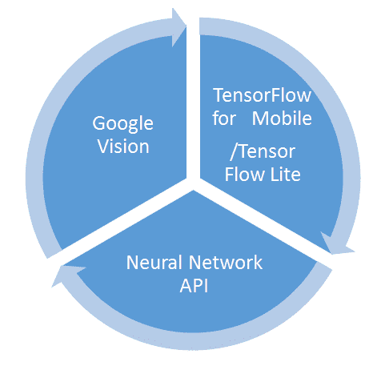
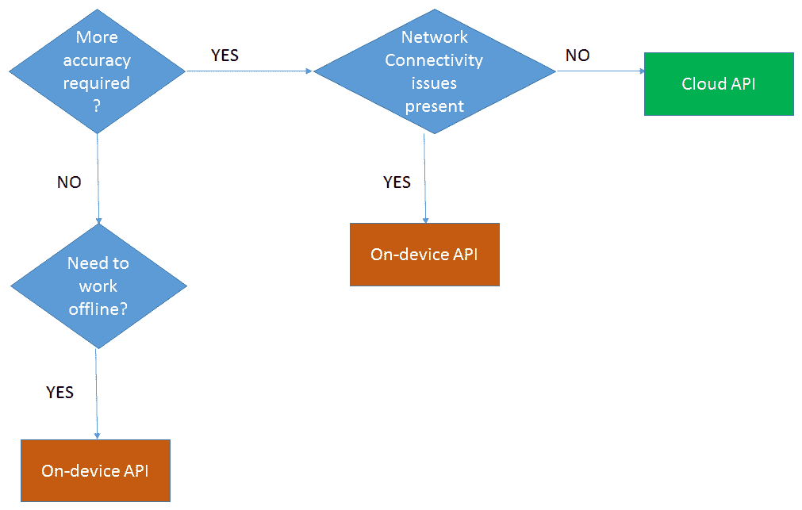
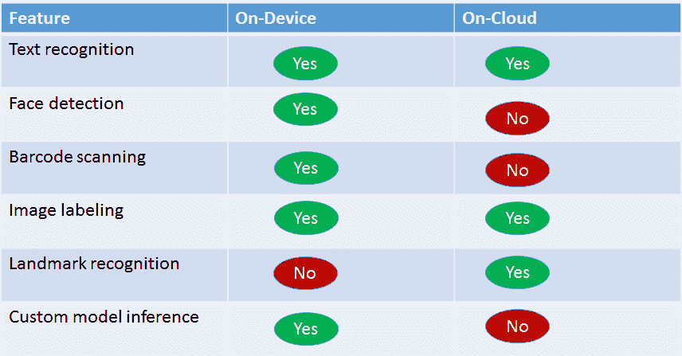
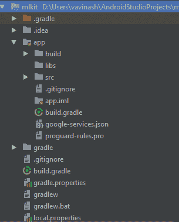
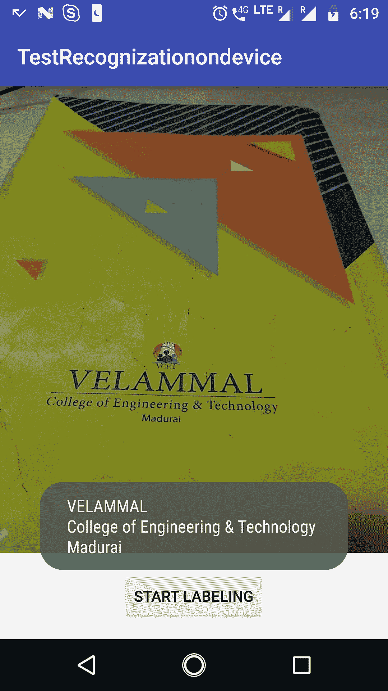
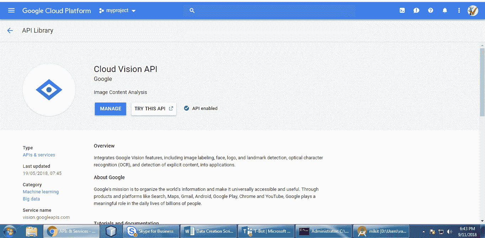
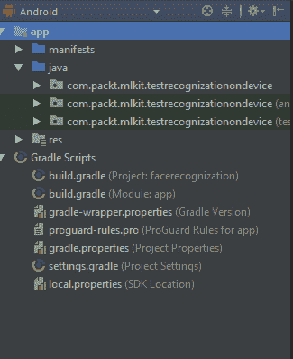
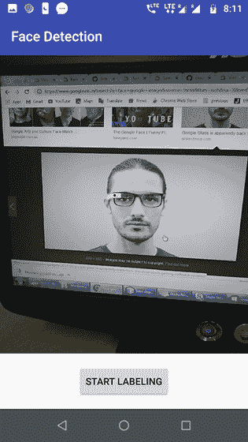
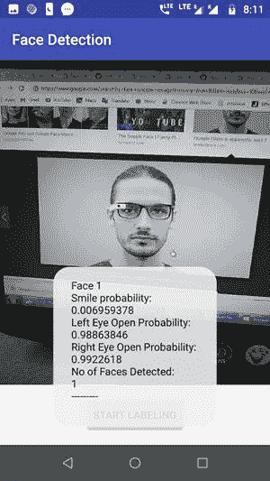

# ML Kit SDK

在本章中，我们将讨论由 Firebase 在 2018 年 Google I/O 大会上宣布的 ML Kit。此 SDK 将 Google 的移动机器学习产品打包在一个统一的框架下。

移动应用开发者可能希望在他们的移动应用中实现需要机器学习功能的功能。然而，他们可能没有机器学习概念和算法的知识，不知道在哪种场景下使用哪种算法，如何构建模型，训练模型等等。

ML Kit 通过识别移动设备上下文中所有潜在的机器学习用例，并提供现成的 API 来解决这个问题。如果将这些正确的输入传递给它们，就会接收到所需输出，无需进一步编码。

此外，此套件还允许将输入传递到离线工作的设备端 API，或者传递到托管在云端的在线 API。

更重要的是，ML Kit 还为具有机器学习专业知识的开发者提供了选项，允许他们使用 TensorFlow/TensorFlow Lite 构建自己的模型，并将它们导入应用程序中，然后使用 ML Kit API 调用它们。

ML Kit 还提供了其他有用的功能，例如模型升级和监控能力（如果与 Firebase 托管）。

我们在本章中将涵盖以下主题：

+   ML Kit 及其功能

+   使用 ML Kit 设备端 API 创建图像标注示例

+   使用 ML Kit 云 API 创建相同的示例

+   创建人脸检测应用

# 理解 ML Kit

ML Kit 包含了 Google 在移动设备上提供的所有现有机器学习产品。它将 Google Cloud Vision API、TensorFlow Lite 和 Android Neural Networks API 捆绑在一个 SDK 中，如下所示：



ML Kit 使开发者能够以非常简单的方式在 Android 和 iOS 应用中利用机器学习。推理可以通过调用设备端或云端的 API 来完成。

设备端 API 的优势在于它们完全离线工作，并且更安全，因为没有数据被发送到云端。相比之下，云 API 确实需要网络连接，并将数据发送到设备外，但允许更高的精度。

ML Kit 提供了覆盖以下机器学习场景的 API，这些场景可能被移动应用开发者所需要：

+   图像标注

+   文本识别

+   地标检测

+   人脸检测

+   条形码扫描

所有这些 API 都是使用复杂的机器学习算法实现的。然而，这些细节都被封装了。移动开发者不需要深入了解用于实现这些 API 的算法细节；他们需要做的只是将所需数据传递给 SDK，然后根据使用的 ML Kit 部分，将接收到正确的输出。

如果提供的 API 没有涵盖特定的用例，你可以构建自己的 TensorFlow Lite 模型。ML Kit 将帮助托管该模型，并将其服务于你的移动应用程序。

由于 Firebase ML Kit 提供设备上和云上的功能，开发者可以根据具体问题提出创新的解决方案，利用其中之一或两者。他们需要知道的是，设备上的 API 速度快，可以离线工作，而云 API 利用 Google Cloud 平台提供更高准确度的预测。

以下图表描述了在决定使用设备上或云上的 API 时需要考虑的问题：



# ML Kit API

并非 ML Kit 提供的所有 API 都支持设备上和云上模式。以下表格显示了每种模式下支持哪些 API：



让我们看看每个 API 的详细信息。

# 文本识别

ML Kit 的文本识别 API 通过使用移动设备摄像头帮助识别任何基于拉丁字母的语言中的文本。它们既可以在设备上使用，也可以在云上使用。

设备上的 API 允许识别稀疏文本或图像中存在的文本。云 API 执行相同的操作，但还允许识别大量文本，如文档中的文本。云 API 还支持比设备 API 能够识别的更多语言。

这些 API 的可能用例包括在图像中识别文本、扫描可能嵌入在图像中的字符，或自动化繁琐的数据输入。

# 人脸检测

ML Kit 的人脸检测 API 允许在图像或视频中检测人脸。一旦检测到人脸，我们可以应用以下改进：

+   **地标检测**：确定人脸内的特定兴趣点（地标），如眼睛

+   **分类**：根据某些特征（如眼睛是睁开还是闭合）对脸部进行分类

+   **人脸追踪**：识别和追踪视频不同帧中的同一人脸（在不同位置）

人脸检测只能在设备上实时进行。在移动设备应用程序中可能有多种用例，其中摄像头捕捉图像并根据地标或分类进行操作，以生成自拍、头像等。

# 条形码扫描

ML Kit 的条形码扫描 API 有助于读取使用大多数标准条形码格式编码的数据。它支持线性格式，如 Codabar、Code 39、Code 93、Code 128、EAN-8、EAN-13、ITF、UPC-A 或 UPC-E，以及二维格式，如 Aztec、Data Matrix、PDF417 或 QR 码。

该 API 可以识别和扫描无论其方向如何的条形码。任何存储为条形码的有序数据都可以被识别。

# 图像标签

ML Kit 的图像标注 API 帮助识别图像中的实体。对于此实体识别，无需提供任何其他元数据信息。图像标注可以深入了解图像内容。ML Kit API 提供了图像中的实体，并为每个实体提供置信度分数。

图像标注既可在设备上使用，也可在云端使用，区别在于支持的标签数量。设备端 API 支持大约 400 个标签，而基于云的 API 支持多达 10,000 个。

# 地标识别

ML Kit 的地标识别 API 帮助识别图像中的知名地标。

当此 API 以图像作为输入时，将提供图像中找到的地标，包括地理坐标和区域信息。同时还会返回地标的知识图谱实体 ID。此 ID 是一个字符串，唯一标识已识别的地标。

# 自定义模型推理

如果提供的现成 API 不足以满足您的用例，ML Kit 还提供了创建您自己的自定义模型并通过 ML Kit 部署它的选项。

# 使用 Firebase 在设备上创建文本识别应用

要开始使用 ML Kit，您需要登录您的 Google 账户，激活您的 Firebase 账户，并创建一个 Firebase 项目。按照以下步骤操作：

+   前往 [`firebase.google.com/`](https://firebase.google.com/)

+   登录您的 Google 账户，如果您尚未登录。

+   在菜单栏中点击“转到控制台”。

+   点击“添加项目”以创建项目并打开它。

现在打开 Android Studio，创建一个带有空活动的项目。记下您在创建项目时给出的应用包名——例如，`com.packt.mlkit.textrecognizationondevice`。

接下来，转到 Firebase 控制台。在项目概览菜单中，点击“添加应用”并输入所需信息。它将提供一个 JSON 文件供您下载。将此文件添加到 Android Studio 项目视图中的项目应用文件夹中，如图所示：



接下来，将以下代码行添加到清单文件中：

```py
<uses-feature android:name="android.hardware.camera2.full" /<
<uses-permission android:name="android.permission.CAMERA" /<
<uses-permission android:name="android.permission.INTERNET" /<
<uses-permission android:name="android.permission.WRITE_EXTERNAL_STORAGE" /<
<uses-permission android:name="android.permission.READ_EXTERNAL_STORAGE" /<
```

我们需要这些权限使我们的应用能够运行。下一行告诉 Firebase 依赖项从 Google 服务器下载**文本识别**（**OCR**）模型，并将其保存在设备上进行推理：

```py
<meta-data
   android:name="com.google.firebase.ml.vision.DEPENDENCIES"
    android:value="ocr" /<
```

整个清单文件将如下所示：

```py
<?xml version="1.0" encoding="utf-8"?<
<manifest xmlns:android="http://schemas.android.com/apk/res/android"
    package="com.packt.mlkit.testrecognizationondevice"<

    <uses-feature android:name="android.hardware.camera2.full" /<
    <uses-permission android:name="android.permission.CAMERA" /<
    <uses-permission android:name="android.permission.INTERNET" /<
    <uses-permission android:name="android.permission.WRITE_EXTERNAL_STORAGE" /<
    <uses-permission android:name="android.permission.READ_EXTERNAL_STORAGE" /<
    <application
        android:allowBackup="true"
        android:icon="@mipmap/ic_launcher"
        android:label="@string/app_name"
        android:roundIcon="@mipmap/ic_launcher_round"
        android:supportsRtl="true"
        android:theme="@style/AppTheme"<

        <meta-data
            android:name="com.google.firebase.ml.vision.DEPENDENCIES"
            android:value="ocr" /<

        <activity android:name=".MainActivity"<
            <intent-filter<
                <action android:name="android.intent.action.MAIN" /<

                <category android:name="android.intent.category.LAUNCHER" /<
            </intent-filter<
        </activity<
    </application<

</manifest<
```

现在，我们需要将 Firebase 依赖项添加到项目中。为此，我们需要在项目的 `build.gradle` 文件中添加以下行：

```py
buildscript {

    repositories {
        google()
        jcenter()
    }
    dependencies {
        classpath 'com.android.tools.build:gradle:3.1.4' //this version will defer dependeds on your environment.
        classpath 'com.google.gms:google-services:4.0.1'

        // NOTE: Do not place your application dependencies here; they belong
        // in the individual module build.gradle files
    }
}
```

然后打开模块应用 `build.gradle` 文件，并添加以下依赖项：

```py
implementation 'com.google.firebase:firebase-ml-vision:17.0.0'
implementation 'com.google.firebase:firebase-core:16.0.3'
```

还需要在文件的底部添加以下行：

```py
apply plugin: 'com.google.gms.google-services'
```

现在，在您的布局文件中，编写以下 `.xml` 代码以定义元素：

```py
<?xml version="1.0" encoding="utf-8"?<
<RelativeLayout 

    android:layout_width="match_parent"
    android:layout_height="match_parent"
    tools:context="(main activity)"< <!-- Here your fully qualified main activity class name will come. --<

    <TextureView
        android:id="@+id/preview"
        android:layout_width="match_parent"
        android:layout_height="wrap_content"
        android:layout_above="@id/btn_takepic"
        android:layout_alignParentTop="true"/<

    <Button
        android:id="@+id/btn_takepic"
        android:layout_width="wrap_content"
        android:layout_height="wrap_content"
        android:layout_alignParentBottom="true"
        android:layout_centerHorizontal="true"
        android:layout_marginBottom="16dp"
        android:layout_marginTop="16dp"
        android:text="Start Labeling"
        /<
</RelativeLayout<
```

现在，是时候编写您应用程序的主活动类了。

请从 Packt Github 仓库下载应用程序代码：[`github.com/PacktPublishing/Machine-Learning-for-Mobile/tree/master/mlkit`](https://github.com/PacktPublishing/Machine-Learning-for-Mobile/tree/master/mlkit)。

我们假设你已经熟悉 Android——因此，我们将使用 Firebase 功能讨论代码：

```py
import com.google.firebase.FirebaseApp;
import com.google.firebase.ml.vision.FirebaseVision;
import com.google.firebase.ml.vision.common.FirebaseVisionImage;
import com.google.firebase.ml.vision.text.FirebaseVisionTextRecognizer;
import com.google.firebase.ml.vision.text.*;
```

上一行代码将导入 firebase 库。

```py
private FirebaseVisionTextRecognizer textRecognizer;
```

上一行将声明 firebase 文本识别器。

```py
FirebaseApp fapp= FirebaseApp.initializeApp(getBaseContext());
```

上一行将初始化 Firebase 应用程序上下文。

```py
        textRecognizer = FirebaseVision.getInstance().getOnDeviceTextRecognizer();
```

上一行将获取设备上的文本识别器。

```py
       takePictureButton.setOnClickListener(new View.OnClickListener() {
            @Override
            public void onClick(View v) {
                takePicture();
                //In this function we are having the code to decode the characters in the picture
            }
        });
    }
```

上一段代码片段为拍照按钮注册了点击事件监听器。

```py
Bitmap bmp = BitmapFactory.decodeByteArray(bytes,0,bytes.length);
```

从字节数组创建位图。

```py
FirebaseVisionImage firebase_image = FirebaseVisionImage.fromBitmap(bmp);
```

上一行创建了一个 firebase 图像对象以传递给识别器。

```py
 textRecognizer.processImage(firebase_image)
```

上一行将创建的图像对象传递给识别器进行处理。

```py
.addOnSuccessListener(new OnSuccessListener<FirebaseVisionText<() {
                                    @Override
                                    public void onSuccess(FirebaseVisionText result) {
//On receiving the results displaying to the user.                                       Toast.makeText(getApplicationContext(),result.getText(),Toast.LENGTH_LONG).show();
                                    }
                                })
```

上一段代码块将添加 on-success 监听器。它将接收一个 firebase 视觉文本对象，然后将其以`Toast`消息的形式显示给用户。

```py
.addOnFailureListener(
            new OnFailureListener() {
                @Override
                public void onFailure(@NonNull Exception e) 
                    {
                        Toast.makeText(getApplicationContext(),"Unable to read the text",Toast.LENGTH_LONG).show();
                    }
                  });
```

上一段代码块将添加`on-failure`监听器。它将接收一个异常对象，然后将其转换为以`Toast`消息形式显示给用户的错误信息。

当你运行上一行代码时，你将在设备上得到以下输出：



注意，在安装此应用时，你必须连接到互联网，因为 Firebase 需要将模型下载到你的设备上。

# 使用 Firebase 云端 API 创建文本识别应用

在本节中，我们将把设备上的应用转换为云端应用。区别在于设备上的应用会下载模型并存储在设备上。这允许有更低的推理时间，使得应用能够快速做出预测。

相比之下，基于云的应用会将图像上传到 Google 服务器，这意味着推理将在那里进行。如果你没有连接到互联网，则不会工作。

在这种情况下，为什么使用基于云的模型？因为设备上的模型空间和处理硬件有限，而 Google 的服务器是可扩展的。Google 的云端文本识别模型也能够解码多种语言。

要开始，你需要一个 Google Cloud 订阅。按照以下步骤操作：

+   前往你的 Firebase 项目控制台。

+   在左侧菜单中，你会看到你目前处于 Spark 计划（免费层）。

+   点击“升级”，并按照说明升级到 Blaze 计划，这是按需付费。

+   你需要提供信用卡或支付详情以供验证——这些将不会自动收费。

+   一旦你订阅，你将每月免费获得 1,000 次 Cloud Vision API 请求

只有当你拥有升级的 Blaze 计划而不是免费层账户时，才能尝试此程序。以下是创建升级账户的步骤，请按照步骤操作以尝试提供的程序。

默认情况下，Cloud Vision 未为您的项目启用。要启用它，您需要访问以下链接：[`console.cloud.google.com/apis/library/vision.googleapis.com/?authuser=0`](https://console.cloud.google.com/apis/library/vision.googleapis.com/?authuser=0)。在顶部菜单下拉菜单中，选择包含您在上一节中添加的 Android 应用的 Firebase 项目。

点击启用以启用此功能。页面将看起来像以下截图：



现在回到您的代码，并做出以下更改。

您可以在我们的 Packt Github 仓库中找到应用程序代码：[`github.com/PacktPublishing/Machine-Learning-for-Mobile/tree/master/Testrecognizationoncloud`](https://github.com/PacktPublishing/Machine-Learning-for-Mobile/tree/master/Testrecognizationoncloud)。

除了主活动之外的所有其他文件都没有变化。

变更如下：

```py
import com.google.firebase.FirebaseApp;
import com.google.firebase.ml.vision.FirebaseVision;
import com.google.firebase.ml.vision.common.FirebaseVisionImage;
import com.google.firebase.ml.vision.document.FirebaseVisionDocumentText;
import com.google.firebase.ml.vision.document.FirebaseVisionDocumentTextRecognizer; 
```

现在，我们需要将前面的包作为依赖项导入。

```py
 private FirebaseVisionDocumentTextRecognizer textRecognizer;
```

上一段代码将声明文档文本识别器。

```py
textRecognizer = FirebaseVision.getInstance().getCloudDocumentTextRecognizer();
```

上一段代码实例化并分配了云文本识别器。

```py
       takePictureButton.setOnClickListener(new View.OnClickListener() {
            @Override
            public void onClick(View v) {
                takePicture();
                //In this function we are having the code to decode the characters in the picture
            }
        });
    }
```

上一段代码为拍照按钮注册了 on-click-event 监听器。

```py
Bitmap bmp = BitmapFactory.decodeByteArray(bytes,0,bytes.length);
```

上一行从字节数组创建了一个位图。

```py
FirebaseVisionImage firebase_image = FirebaseVisionImage.fromBitmap(bmp);
```

上一行创建了一个 firebase 图像对象以传递给识别器。

```py
 textRecognizer.processImage(firebase_image)
```

上一行将创建的图像对象传递给识别器进行处理。

```py
.addOnSuccessListener(new OnSuccessListener<FirebaseVisionDocumentText<() {
                                    @Override
                                    public void onSuccess(FirebaseVisionDocumentText result) {
                                        Toast.makeText(getApplicationContext(),result.getText(),Toast.LENGTH_LONG).show();
                                    }
                                })
```

上一段代码块将添加 on-success 监听器。它将接收一个 FirebaseVision 文档文本对象，该对象随后以`Toast`消息的形式显示给用户。

```py
.addOnFailureListener(
            new OnFailureListener() {
                @Override
                public void onFailure(@NonNull Exception e) 
                    {
                        Toast.makeText(getApplicationContext(),"Unable to read the text",Toast.LENGTH_LONG).show();
                    }
                  });
```

上一段代码块将添加 on-failure 监听器。它将接收一个异常对象，随后以`Toast`消息的形式向用户显示错误信息。

```py
Once you run the code with the internet-connected device , you will get the same output as before, but from the cloud.
```

# 使用 ML Kit 进行人脸检测

现在，我们将尝试了解如何使用 ML Kit 进行人脸检测。之前作为 Mobile Vision API 一部分的人脸检测现在已移动到 ML Kit。

# 人脸检测概念

Google 开发者页面将人脸检测定义为在视觉媒体（数字图像或视频）中自动定位和检测人类面部的过程。检测到的面部以关联的位置、大小和方向报告。面部被检测到后，我们可以搜索面部中存在的地标，如眼睛和鼻子。

在我们继续使用 ML Kit 进行编程人脸检测之前，以下是一些重要术语，我们需要理解：

+   **人脸朝向**：检测不同角度的人脸。

+   **人脸识别**：确定两个面部是否属于同一个人。

+   **人脸追踪**：指在视频中检测人脸。

+   **地标**：指人脸内的一个兴趣点。这对应于人脸上的显著特征，如右眼、左眼和鼻基底。

+   **分类**：确定面部特征的存在，例如眼睛是睁开还是闭合，或者面部是微笑还是严肃。

# 使用 ML Kit 进行面部检测的示例解决方案

现在打开 Android Studio，创建一个带有空活动的项目。记下您在创建项目时给出的应用程序包名——例如，`com.packt.mlkit.facerecognization`。

在这里，我们将修改文本识别代码以预测面部信息。因此，我们不会更改包名和其他内容。只是代码更改。项目结构与之前显示的相同：



是时候编写我们应用程序的主活动类了。首先，我们需要从 Packt GitHub 仓库下载应用程序代码，网址为[`github.com/PacktPublishing/Machine-Learning-for-Mobile/tree/master/facerecognization`](https://github.com/PacktPublishing/Machine-Learning-for-Mobile/tree/master/facerecognization)，然后在 Android Studio 中打开项目。

然后，我们将添加以下代码行到 Gradle 依赖项中。打开模块 app 的`build.gradle`文件，并添加以下依赖项：

```py
implementation 'com.google.android.gms:play-services-vision:11.4.0'
implementation 'com.android.support.constraint:constraint-layout:1.0.2'
```

现在，我们将添加导入语句以使用面部检测：

```py
import com.google.android.gms.vision.Frame;
import com.google.android.gms.vision.face.Face;
import com.google.android.gms.vision.face.FaceDetector;
```

以下语句将声明`FaceDetector`对象：

```py
private FaceDetector detector;
```

现在，我们将创建一个对象并将其分配给声明的检测器：

```py
detector = new FaceDetector.Builder(getApplicationContext())
 .setTrackingEnabled(false)
 .setLandmarkType(FaceDetector.ALL_LANDMARKS)
 .setClassificationType(FaceDetector.ALL_CLASSIFICATIONS)
 .build();
```

我们声明了一个字符串对象，用于将预测消息保存给用户：

```py
String scanResults = "";
```

在这里，我们将检查检测器是否可操作；我们还有一个从相机获取的 bitmap 对象：

```py
if (detector.isOperational() && bmp != null) {
```

然后，我们创建一个 frame 对象，这是`FaceDetector`类检测方法需要预测面部信息：

```py
Frame frame = new Frame.Builder().setBitmap(bmp).build();SparseArray<Face> faces = detector.detect(frame);
```

一旦成功检测到，它将返回面部对象数组。以下代码将每个`nface`对象的信息附加到我们的结果字符串中：

```py
for (int index = 0; index < faces.size(); ++index) {
    Face face = faces.valueAt(index);
    scanResults += "Face " + (index + 1) + "\n";
    scanResults += "Smile probability:" + "\n" ;
    scanResults += String.valueOf(face.getIsSmilingProbability()) + "\n";          scanResults += "Left Eye Open Probability: " + "\n";
    scanResults += String.valueOf(face.getIsLeftEyeOpenProbability()) + "\n";
    scanResults += "Right Eye Open Probability: " + "\n";
    scanResults += String.valueOf(face.getIsRightEyeOpenProbability()) + "\n";
}
```

如果没有返回面部，则将显示以下错误信息：

```py
if (faces.size() == 0) {
    scanResults += "Scan Failed: Found nothing to scan";
 } 
```

如果面部大小不是`0`，这意味着它已经通过了`for`循环，将面部信息附加到我们的结果文本中。现在我们将添加面部总数并结束结果字符串：

```py
else {
    scanResults += "No of Faces Detected: " + "\n";
    scanResults += String.valueOf(faces.size()) + 
   \n";
    scanResults += "---------" + "\n";
}
```

如果检测器不可操作，则错误信息将以以下方式显示给用户：

```py
else {
    scanResults += "Could not set up the detector!";
}
```

最后，以下代码将向读者展示结果：

```py
Toast.makeText(getApplicationContext(),scanResults,Toast.LENGTH_LONG).show();
```

# 运行应用程序

现在是时候运行应用程序了。为此，您需要通过手机中的 USB 调试选项将您的手机连接到桌面，并安装应用程序：



运行应用程序后，您将得到以下输出：



# 摘要

在本章中，我们讨论了 Firebase 在 Google I/O 2018 上宣布的 ML Kit SDK。我们涵盖了 ML Kit 提供的不同 API，例如图像标签、文本识别、地标检测等。然后我们使用设备端 API 创建了一个文本识别应用，接着又使用云端 API。我们还通过对文本识别应用进行微小修改创建了一个面部检测应用。在下一章中，我们将学习垃圾邮件分类器，并构建一个 iOS 上的此类分类器的示例实现。
