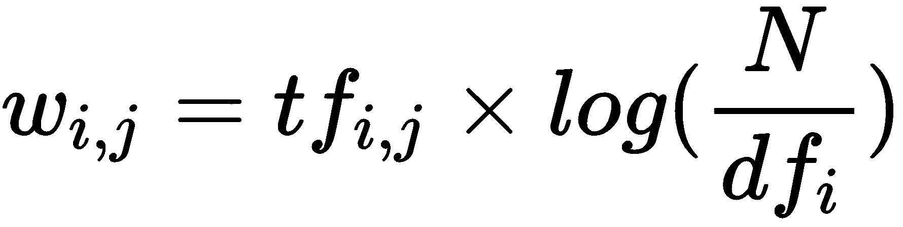
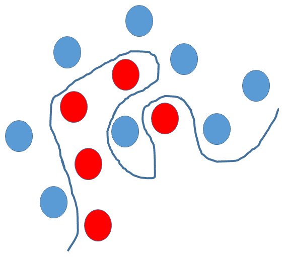
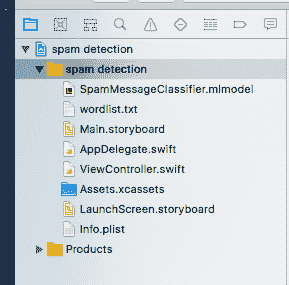
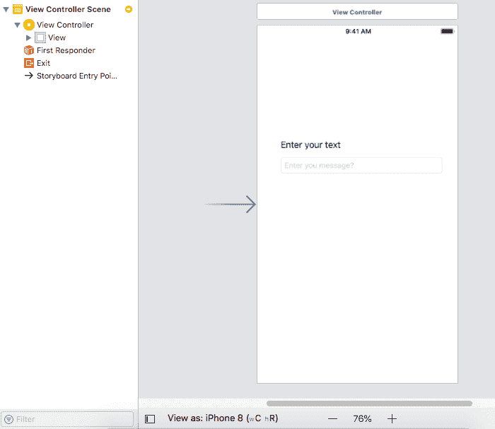
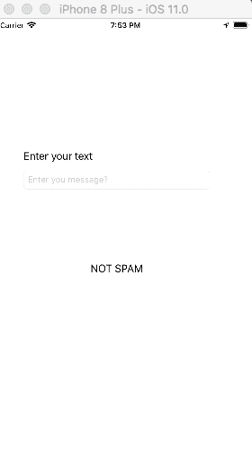

# 垃圾邮件检测

本章将为您提供一个关于自然语言处理（NLP）的概述，并讨论如何将 NLP 与机器学习相结合，以提供解决方案。然后，本章将探讨一个利用 NLP 和线性 SVM 分类模型进行垃圾邮件检测的真实世界用例。程序将作为 iOS 的 Core ML 移动应用程序实现。

为了在机器学习算法中处理文本，我们将探讨将在文本数据上使用的各种 NLP 技术，以便使其准备好用于学习算法。一旦文本准备好，我们将看到如何使用线性 SVM 模型对其进行分类。

**问题定义**：提供了大量短信消息数据，这些消息需要被分类为垃圾邮件或非垃圾邮件。

在本章中，我们将涵盖以下主题：

+   理解自然语言处理（NLP）

+   理解线性 SVM 算法

+   使用 Core ML 中的线性 SVM 解决该问题：

    +   技术要求

    +   如何使用 scikit-learn 创建模型文件

    +   测试模型

    +   将 scikit-learn 模型导入 Core ML 项目

    +   使用 scikit-learn 模型编写 iOS 移动应用程序，并对其进行垃圾邮件检测

# 理解自然语言处理（NLP）

自然语言处理（NLP）是一个庞大的主题，本书的范围并不包括对这个主题的详细探讨。然而，在本节中，我们将探讨 NLP 的高级细节，并尝试理解使用 NLP 准备和处理文本数据所需的关键概念，以便使其准备好由机器学习算法进行预测。

# 介绍自然语言处理（NLP）

每天都会产生大量非结构化文本数据。社交媒体、如 Twitter 和 Facebook 的网站，以及如 WhatsApp 的通讯应用，每天都会产生大量的这种非结构化数据——更不用说博客、新闻文章、产品评论、服务评论、广告、电子邮件和短信产生的数据量了。所以，总结来说，存在大量的数据（以 TB 为单位）。

然而，由于以下原因，计算机无法从这些数据中获得任何洞察力，并直接根据这些洞察力执行特定操作，因为这些数据量巨大：

+   数据是非结构化的

+   没有预处理，数据无法直接理解

+   这些数据不能以未经处理的形式直接输入到任何机器学习算法中

为了使这些数据更有意义并从中提取信息，我们使用自然语言处理（NLP）。专注于人类语言与计算机之间交互的研究领域被称为**自然语言处理（NLP**）。NLP 是数据科学的一个分支，与计算语言学密切相关。它涉及计算机科学——分析、理解和从基于人类自然语言的数据（通常是文本、语音等非结构化数据）中提取信息。

通过 NLP，计算机可以分析和从人类语言中提取意义，并执行许多有用的事情。通过利用 NLP，可以完成许多复杂任务，例如自动总结大量文档、翻译、不同大量非结构化数据之间的关系提取、情感分析和语音识别。

为了让计算机理解和分析人类语言，我们需要以更结构化的方式分析句子并理解其核心。在任何句子中，我们需要理解三个核心内容：

+   **语义信息**：这关系到句子的含义。这是句子中单词的具体含义，例如，*风筝飞翔*。在这里，我们不知道风筝是人造的还是鸟类的。

+   **句法信息**：这关系到句子的结构。这是句子中单词的具体句法含义。*Sreeja 用糖果看到了 Geetha*。在这里，我们不确定谁有糖果：Sreeja 还是 Geetha？

+   **语用信息（上下文）**：这关系到句子的上下文（语言或非语言）。这是句子中单词使用的具体上下文。例如，*他在外面*在棒球和医疗保健的上下文中是不同的。

然而，计算机不能像人类那样分析和识别句子。因此，有一个明确的方法可以使计算机执行文本处理。以下是该练习涉及的主要步骤：

1.  **预处理**：这一步涉及从句子中移除所有噪声，以便只保留对句子上下文至关重要的信息供下一步使用。例如，语言停用词（“噪声”），如*是*、*这*或*一个*，可以从句子中移除以进行进一步处理。在处理句子时，人脑不会考虑语言中存在的噪声。同样，计算机可以接收无噪声文本以进行进一步处理。

1.  **特征工程**：为了计算机能够处理预处理后的文本，它需要了解句子的关键特征。这是通过特征工程步骤实现的。

1.  **NLP 处理**：将人类语言转换为特征矩阵后，计算机可以执行 NLP 处理，这可能是分类、情感分析或文本匹配。

现在，让我们尝试理解在每个步骤中将要执行的高级活动。

# 文本预处理技术

在我们处理文本之前，它需要先进行预处理。预处理将涉及以下内容：

+   从考虑的文本中移除噪声

+   标准化句子

+   标准化句子

根据需求，可能会有额外的步骤，例如语法检查或拼写检查。

# 移除噪声

句子中出现的任何可能不与数据上下文相关的文本都可以称为噪声。

例如，这可以包括语言停用词（在语言中常用词汇 – *is*、*am*、*the*、*of*和*in*）、URL 或链接、社交媒体实体（提及、标签）、以及标点符号。

为了从句子中去除噪声，一般的方法是维护一个噪声词字典，然后迭代考虑的句子中的标记与该字典进行对比，并移除匹配的停用词。噪声词字典会频繁更新以覆盖所有可能的噪声。

# 规范化

句子中单词的差异被转换为规范化的形式。句子中的单词可能有所不同，如*sing*、*singer*、*sang*或*singing*，但它们或多或少都能适应相同的上下文，并且可以被标准化。

有不同的方法来规范化句子：

+   **词干提取**：从单词中去除后缀（如*ing*、*ly*、*es*、*s*）的基本基于规则的过程。

+   **词形还原**：识别单词词根的更复杂的过程。它涉及一个更复杂的过程来验证语义和句法。

# 标准化

此步骤涉及标准化句子，以确保它只包含来自标准语言字典的标记，而不包含任何其他内容，如标签、俚语词汇等。所有这些都在此步骤中被移除。

# 特征工程

现在文本已经被处理，下一步是将文本中的特征排列好，以便它们可以被输入到任何机器学习算法中执行分类、聚类等操作。有各种方法将文本转换为特征矩阵，我们将在本节中介绍其中一些。

# 实体提取

在这里，从句子中提取出用于 NLP 处理的关键实体。**命名实体识别**（NER）是其中一种方法，其中的实体可以是地点、人物或纪念碑等命名实体。

# 主题建模

这是另一种方法，从文本语料库中识别主题。主题可以是单个单词、单词模式或共现单词序列。根据主题中的单词数量，这些可以被称为**N-gram**。因此，基于上下文和重复性，可以使用双词和三词作为特征。

# 词袋模型

词袋模型是对文本的表示，描述了文档中单词的出现情况。它涉及已知单词的表示和已知单词在文档中的出现度量的计算。该模型更侧重于文档中已知单词的出现，而不是单词的顺序或文档中单词的结构。

# 统计工程

文本数据也可以使用各种技术表示为数值。对于大量文本文档，**词频-逆文档频率**（TF-IDF）是此类中的重要技术。

# TF–IDF

TF-IDF 是一种加权模型，它基于文档中单词的出现次数将文本文档转换为向量模型，而不考虑文档中文本的确切顺序。

让我们考虑一组 N 个文本文档和任意一个文档 D。然后，我们定义以下内容。

# TF

这衡量了一个术语在文档中出现的频率。由于每个文档的长度不同，一个术语可能在长文档中比在短文档中出现得更频繁。因此，TF 通常会被除以文档长度以进行归一化：

*TF(t) = (文档 D 中术语 t 出现的次数)/(文档中的总词数 N)*.

# 逆文档频率 (IDF)

这衡量了一个术语对于语料库的重要性。在计算 TF 时，所有术语都被视为同等重要。然而，通常认为停用词出现得更频繁，但就 NLP 而言，它们的重要性较低。因此，有必要降低常见术语的重要性，提高罕见术语的重要性，这就是 IDF，其计算如下：

*IDF(t) = log_e(文档总数/包含术语 t 的文档数)*

# TF-IDF

TF-IDF 公式给出了一个术语在语料库（文档列表）中的相对重要性，其公式如下：



其中：

+   *tf*[*i,j*] = *i* 在 *j* 中的出现次数

+   *df[i]* = 包含 *i* 的文档数

+   *N* = 文档总数

考虑一个包含 1,000 个单词的文档，其中单词“rat”出现了 3 次。那么“rat”的**词频**（**TF**）就是 (3/1000=) 0.003。现在，在 10,000 个文档中，单词“cat”出现在其中的 1,000 个。因此，**逆文档频率**（**IDF**）计算为 log(10000/1000) = 1。因此，TF-IDF 权重是这些数量的乘积，即 0.003 * 1 = 0.12。

文本语料库中的单词或特征也可以组织成特征向量，以便于将其输入到 NLP 处理的下一步。

# 对文本进行分类/聚类

最后一步是实际使用特征工程矩阵或词向量进行分类或聚类。我们可以使用任何分类算法并将特征向量输入以执行分类或聚类。

与执行聚类类似，可以使用不同的相似度度量，例如余弦距离或 Levenshtein 距离。

# 理解线性 SVM 算法

在 第二章 “监督和非监督学习算法”中，我们介绍了 SVM 算法，现在我们已经了解了 SVM 模型的工作原理。线性支持向量机或线性 SVM 是一种线性分类器，它试图找到一个具有最大边缘的超平面，将输入空间分割成两个区域。

超平面是平面的推广。在一维中，超平面被称为**点**。在二维中，它是一条线。在三维中，它是一个平面。在更多维度中，你可以称之为超平面。

正如我们所见，SVM 的目标是识别一个试图找到最大间隔的超平面，将输入空间分成两个区域。如果输入空间是线性可分的，那么很容易将它们分开。然而，在现实生活中，我们发现输入空间非常非线性：



在前面的场景中，SVM 可以通过所谓的**核技巧**帮助我们分离红色和蓝色球，核技巧是使用线性分类器来解决非线性问题的方法。

核函数应用于每个数据实例，将原始的非线性观测映射到一个更高维的空间，在这个空间中它们变得可分离。

最受欢迎的核函数如下：

+   线性核

+   多项式核

+   RBF（高斯）核

+   字符串核

线性核通常被推荐用于文本分类，因为大多数文本分类问题都需要将文本分类为两类。在我们的例子中，我们还想将短信消息分类为垃圾邮件和非垃圾邮件。

# 在 Core ML 中使用线性 SVM 解决问题

在本节中，我们将探讨如何使用本章中介绍的所有概念来解决垃圾邮件检测问题。

我们将选取一些短信消息并尝试将它们分类为垃圾邮件或非垃圾邮件。这是一个分类问题，我们将使用线性 SVM 算法来完成这个任务，考虑到使用此算法进行文本分类的优势。

我们将使用 NLP 技术将数据-SMS 消息转换为特征向量，以输入到线性 SVM 算法中。我们将使用 scikit-learn 的 vectorizer 方法将短信消息转换为 TF-IDF 向量，该向量可以输入到线性 SVM 模型中，以执行短信垃圾邮件检测（将短信分类为垃圾邮件和非垃圾邮件）。

# 关于数据

我们用于创建检测垃圾邮件模型的数据来自[`www.dt.fee.unicamp.br/~tiago/smsspamcollection/`](http://www.dt.fee.unicamp.br/~tiago/smsspamcollection/)，其中包含 747 个垃圾邮件样本，以及 4,827 条非垃圾邮件。

这些消息来自不同的来源，并标记为垃圾邮件和非垃圾邮件的类别。如果你在记事本或任何文本编辑器中打开下载的文件，它将具有以下格式：

```py
ham   What you doing?how are you?
ham   Ok lar... Joking wif u oni...
 ham   dun say so early hor... U c already then say...
 ham   MY NO. IN LUTON 0125698789 RING ME IF UR AROUND! H*
 ham   Siva is in hostel aha:-.
 ham   Cos i was out shopping with darren jus now n i called him 2 ask wat present he wan lor. Then he started guessing who i was wif n he finally guessed darren lor.
 spam  FreeMsg: Txt: CALL to No: 86888 & claim your reward of 3 hours talk time to use from your phone now! ubscribe6GBP/ mnth inc 3hrs 16 stop?txtStop
 spam  Sunshine Quiz! Win a super Sony DVD recorder if you can name the capital of Australia? Text MQUIZ to 82277\. B
 spam  URGENT! Your Mobile No 07808726822 was awarded a L2,000 Bonus Caller Prize on 02/09/03! This is our 2nd attempt to contact YOU! Call 0871-872-9758 BOX95QU
```

在前面的示例中，我们可以看到每一行都以类别名称开头，后面跟着实际的消息。

# 技术要求

要创建一个将消息分类为垃圾邮件或非垃圾邮件的模型，我们需要一个能够做到这一点的库。在这里，我们选择了 scikit-Learn。

要编写这个应用，你需要在你的桌面电脑上安装 Python3+版本，并且必须在你的 Mac 机器上安装 Xcode 9+。如果你没有这些之一，请查阅本书的附录来学习如何获取它们。一旦你在你的机器上安装了 Python，执行以下命令以获取所需的包：

```py
pip install scikit-learn pip install numpy pip install coremltools pip install pandas
```

使用前面的代码，我们安装了 scikit-learn 以获取访问算法的权限，以及 NumPy，因为 scikit-learn 需要它，还有 pandas（*pandas*是一个开源的 BSD 许可库，为 Python 编程提供高性能、易于使用的数据结构和数据分析工具）来从文件中读取模型和 core-ML 工具来生成 Core ML 模型文件。

现在，下载`SMSSpamCollection.txt`，一个从上一节中提到的模型链接的纯文本文件，并将其下载到你的磁盘上，然后放入你的`project`文件夹中。

# 使用 Scikit Learn 创建模型文件

在你的项目文件夹中，创建一个包含以下代码的 python 文件来创建一个模型文件：

```py
# importing required packages
import numpy as np
import pandas as pd
# Reading in and parsing data
raw_data = open('SMSSpamCollection.txt', 'r')
sms_data = []
for line in raw_data:
    split_line = line.split("\t")
    sms_data.append(split_line)

#Splitting data into messages and labels and training and test in y we are having labels and x with the message text

sms_data = np.array(sms_data)
X = sms_data[:, 1]
y = sms_data[:, 0]

#Build a LinearSVC model
from sklearn.feature_extraction.text import TfidfVectorizer
from sklearn.svm import LinearSVC

#Build tf-idf vector representation of data
vectorizer = TfidfVectorizer()

# converting the message text as vector
vectorized_text = vectorizer.fit_transform(X)

text_clf = LinearSVC()
# fitting the model
text_clf = text_clf.fit(vectorized_text, y)
```

测试拟合的模型，我们可以添加以下代码：

```py
print text_clf.predict(vectorizer.transform(["""XXXMobileMovieClub: To use your credit, click the WAP link in the next txt message or click here>> http://wap. xxxmobilemovieclub.com?n=QJKGIGHJJGCBL"""]))
```

执行前面的程序后，它将显示给定的消息是垃圾邮件还是非垃圾邮件。

# 将 scikit-learn 模型转换为 Core ML 模型

在上一节中，我们创建了我们的模型来将消息分类为垃圾邮件和非垃圾邮件。现在，让我们将其转换为 Core ML 模型，以便我们可以在 iOS 应用中使用它。

要创建 Core ML 模型，将以下行添加到前面的代码中并运行它们。这将创建一个`.mlmodel`文件：

```py
# importing the library
import coremltools

# convert to fitted model in to coreml model
coreml_model = coremltools.converters.sklearn.convert(text_clf, "message", "spam_or_not")

#set parameters of the model
coreml_model.short_description = "Classify whether message is spam or not"
coreml_model.input_description["message"] = "TFIDF of message to be classified"
coreml_model.output_description["spam_or_not"] = "Whether message is spam or not"

#save the model
coreml_model.save("SpamMessageClassifier.mlmodel")
```

现在，你可以获取生成的`SpamMessageClassifier.mlmodel`文件，并在你的 Xcode 中使用它。

# 编写 iOS 应用

你可以在我们的 GitHub 仓库中获取 iOS 项目的代码（[`github.com/PacktPublishing/Machine-Learning-for-Mobile`](https://github.com/PacktPublishing/Machine-Learning-for-Mobile)）。一旦你下载了项目并在 Xcode 中打开它，你将找到以下目录结构：



在这里，我想向你解释一些重要的文件。Main. Storyboard 包含了应用的 UI 设计：



这里，我们有两个标签，一个按钮和一个文本框。两个标签是一个标题标签和一个结果标签。按钮用于提交输入并获取结果。我们还有一个文本框来输入消息。在这里，主要处理是在`controller.swift`视图中编写的：

```py
//common imports
import UIKit
import CoreML

class ViewController: UIViewController {
    //binding to the UI elements
    @IBOutlet weak var messageTextField: UITextField!
    @IBOutlet weak var messageLabel: UILabel!
    @IBOutlet weak var spamLabel: UILabel!

// This function will take the text from the user input and convert it in to a vector format which our model requires using the wordslist.txt file and the SMSSpamCollection.txt file that we have downloaded.
    func tfidf(sms: String) -> MLMultiArray{
        //get path for files
        let wordsFile = Bundle.main.path(forResource: "wordlist", ofType: "txt")
        let smsFile = Bundle.main.path(forResource: "SMSSpamCollection", ofType: "txt")
        do {
            //read words file
            let wordsFileText = try String(contentsOfFile: wordsFile!, encoding: String.Encoding.utf8)
            var wordsData = wordsFileText.components(separatedBy: .newlines)
            wordsData.removeLast() // Trailing newline.
            //read spam collection file
            let smsFileText = try String(contentsOfFile: smsFile!, encoding: String.Encoding.utf8)
            var smsData = smsFileText.components(separatedBy: .newlines)
            smsData.removeLast() // Trailing newline.
            let wordsInMessage = sms.split(separator: " ")
            //create a multi-dimensional array
            let vectorized = try MLMultiArray(shape: [NSNumber(integerLiteral: wordsData.count)], dataType: MLMultiArrayDataType.double)
            for i in 0..<wordsData.count{
                let word = wordsData[i]
                if sms.contains(word){
                    var wordCount = 0
                    for substr in wordsInMessage{
                        if substr.elementsEqual(word){
                            wordCount += 1
                        }
                    }
                    let tf = Double(wordCount) / Double(wordsInMessage.count)
                    var docCount = 0
                    for sms in smsData{
                        if sms.contains(word) {
                            docCount += 1
                        }
                    }
                    let idf = log(Double(smsData.count) / Double(docCount))
                    vectorized[i] = NSNumber(value: tf * idf)
                } else {
                    vectorized[i] = 0.0
                }
            }
            return vectorized
        } catch {
            return MLMultiArray()
        }
    }
    override func viewDidLoad() {
        super.viewDidLoad()
        // Do any additional setup after loading the view, typically from a nib.
    }
//This function will call when you click the predict button
    @IBAction func predictSpam(_ sender: UIButton) {
        let enteredMessage =  messageTextField.text!
// checking and handling empty message.
        if (enteredMessage != ""){
            spamLabel.text = ""
        }
// Calling the preceding function to convert the text to vector
        let vec = tfidf(sms: enteredMessage)
        do {
// Passing input to the our model to get the prediction results.
            let prediction = try SpamMessageClassifier().prediction(message: vec).spam_or_not
            print (prediction)
            if (prediction == "spam"){
                spamLabel.text = "SPAM!"
            }

// Our model is having ham as label for not spam messages so our model will send the label as ham. Hence we are converting to Not Spam for displaying purpose
           else if(prediction == "ham"){
                spamLabel.text = "NOT SPAM"
            }
        }
        catch{
                // catching the exception
            spamLabel.text = "No Prediction"
        }
    }
}
```

当你在 Xcode 的模拟器中运行应用时，它将生成以下结果：



# 摘要

在本章中，我们探讨了众多内容，例如，从高层次理解自然语言处理（NLP）。NLP 涉及多个步骤，例如文本预处理，以及执行这些步骤的技术，如特征工程和执行特征工程以及特征向量分类或聚类的方 法。我们还研究了线性 SVM 算法，其中我们详细介绍了 SVM 算法、核函数以及它如何更适用于文本分类。

我们使用线性 SVM 在 Core ML 中解决了我们的问题，并且我们还看到了一个使用我们在 scikit learn 中开发的线性 SVM 算法模型并转换为 Core ML 模型进行垃圾邮件检测的实际示例。我们使用转换后的 Core ML 模型编写了一个 iOS 应用程序。

在下一章中，我们将介绍另一个机器学习框架 Fritz，它试图解决我们在模型部署和升级中常见的各种问题，以及在不同移动操作系统平台间统一处理机器学习模型的方法。
