# Fritz

我们在前面章节中已经了解了由 Google 提供的移动机器学习 SDK——TensorFlow for mobile 和 Apple 的 Core ML，并对它们有了很好的理解。我们研究了这些产品的基本架构，它们提供的关键特性，并且尝试使用这些 SDK 进行了一些任务/程序的实践。基于我们对移动机器学习框架和工具的探索，我们将能够识别出一些导致移动机器学习部署及其后续维护和支持困难的差距。让我为您列举几个：

+   一旦我们创建了机器学习模型并将其导入到 Android 或 iOS 应用程序中，如果需要对导入到移动应用程序中的模型进行任何更改，您认为这种更改将如何实施并升级到正在部署和使用的应用程序？如何在不需要在移动应用程序商店（App Store 或 Play Store）重新部署应用程序的情况下更新/升级模型？

+   一旦机器学习模型在野外投入使用，并且被用户在野外使用，我们如何监控模型在实时用户场景中的性能和用法？

+   此外，您可能已经体验过，在 iOS 和 Android 中使用机器学习模型的过程和机制并不相同。同样，将使用各种机器学习框架（如 TensorFlow 和 scikit-learn）创建的机器学习模型与 TensorFlow Lite 和 Core ML 兼容的机制也不同。没有共同的流程和用法模式供开发者遵循，以跨框架创建和使用这些模型。我们觉得，如果有一个通用的方法来使用来自不同供应商的机器学习模型，并且使用相同的过程和机制，那么事情将会简单得多。

Fritz 平台已经尝试回答在机器学习模型使用和部署中观察到的所有之前提到的差距。作为机器学习平台，Fritz 试图提供解决方案，以简化移动应用程序中机器学习模型的使用和部署。它是一个带有现成机器学习功能的移动机器学习平台，并提供导入和使用自定义 ML 模型（TensorFlow for mobile 和 Core ML 模型）的选项。

因此，在本章中，我们将详细探讨以下内容：

+   理解 Fritz 移动机器学习平台，其特性及其优势。

+   探索 Fritz 并使用我们已创建的 Core ML 回归模型来实现一个 iOS 移动应用程序。

+   探索 Fritz 并使用我们在第三章中创建的示例 Android 模型来实现一个 Android 移动应用程序，即使用 TensorFlow for mobile 实现的*iOS 上的随机森林*。

# Fritz 简介

Fritz 是一个免费的全端平台，使我们能够轻松创建机器学习驱动的移动应用程序。它是一个支持设备端机器学习的平台，即它有助于创建可以在移动设备上完全运行的移动机器学习应用程序。它支持 iOS 和 Android 平台。

# 预构建的 ML 模型

Fritz 提供了可以直接在移动应用程序中使用的内置 ML 模型。以下是 Fritz 支持的两种重要模型：

+   **目标检测**：您可以在图像或实时视频的每一帧中识别感兴趣的对象。这有助于您了解图像中的对象以及它们在图像中的位置。目标检测功能完全在设备上做出预测，并且不需要互联网连接*.*

+   **图像标注**：您可以在图像或实时视频的每一帧中识别内容。这也完全离线工作，不需要互联网连接。

# 使用自定义模型的能力

Fritz 为我们提供了将用于 Core ML、TensorFlow 移动和 TensorFlow Lite 的模型导入移动应用程序的能力，并提供可以直接与这些模型交互的 API。

# 模型管理

Fritz 的主要优势在于它能够实时进行 ML 模型管理和升级：

+   它为我们提供了升级部署到现场机器学习模型的能力，即它允许开发者升级或更改 ML 模型，而无需进行应用程序升级和在移动应用程序商店中重新部署。

+   它为我们提供了监控部署到现场机器学习模型性能的设施。

+   它有助于部署、分析和机器学习模型管理。

# 使用 Fritz 的动手示例

在本节中，我们将尝试使用 Fritz 以及我们使用 Core ML 和 TensorFlow 移动为 iOS 和 Android 创建的模型，并使用 Fritz 构建 iOS 和 Android 移动应用程序。此外，我们还将了解如何使用 Fritz 内置的模型，例如目标检测和图像标注。

# 在 Android 应用程序中使用 Fritz 的现有 TensorFlow 移动模型

在本节中，我们将了解如何使用 Fritz 工具包在 Android 移动应用程序中利用我们已创建的 TensorFlow 移动模型。我们将使用我们用 TensorFlow 移动创建的示例模型来进行求和操作 *(a+b)*。我们将详细介绍实现此目标所需的详细步骤。

# 在 Fritz 上注册

为了使用 Fritz，您必须在 Fritz 网络门户上注册账户：

1.  前往 [`fritz.ai/`](https://fritz.ai/)

1.  在顶部菜单中点击登录

1.  点击创建账户

1.  输入您的详细信息并提交

1.  在 Fritz 中创建一个新的项目

一旦您拥有账户，请使用您的凭证登录，然后执行以下步骤：

1.  点击“添加新项目”按钮

1.  输入项目名称和组织

1.  点击提交

# 上传模型文件 (.pb 或 .tflite)

1.  点击左侧菜单中的自定义模型

1.  给模型命名并添加描述

1.  上传模型文件

1.  点击创建模型文件按钮

一旦上传，模型页面将看起来像这样：


这里，我们使用的是在第三章中创建的相同模型，*iOS 上的随机森林*：TensorFlow for Android。GitHub URL 是[`github.com/PacktPublishing/Machine-Learning-for-Mobile/blob/master/tensorflow%20simple/tensor/frozen_tfdroid.pb`](https://github.com/PacktPublishing/Machine-Learning-for-Mobile/blob/master/tensorflow%20simple/tensor/frozen_tfdroid.pb)。

# 设置 Android 并注册应用

我们已经创建了一个项目并向其中添加了一个模型。让我们看看如何在 Android 项目中使用这个模型。现在，我将向您展示如何将我们在第三章中看到的 TensorFlow 简单示例，*iOS 上的随机森林*，转换为 fritz 格式。要继续，请在该示例中打开 Android studio。

如果您没有它，您可以从[`github.com/PacktPublishing/Machine-Learning-for-Mobile/tree/master/tensorflow%20simple`](https://github.com/PacktPublishing/Machine-Learning-for-Mobile/tree/master/tensorflow%20simple)下载。在给定的路径中，TensorFlow 示例是 Android 项目，在 Android studio 中打开它。

# 添加 Fritz 的 TFMobile 库

在本节中，我们将把这个项目转换成一个由 Fritz 管理的项目。在模型页面，点击 SDK 说明按钮。它将打开一个对话框，显示集成信息，如下所示：

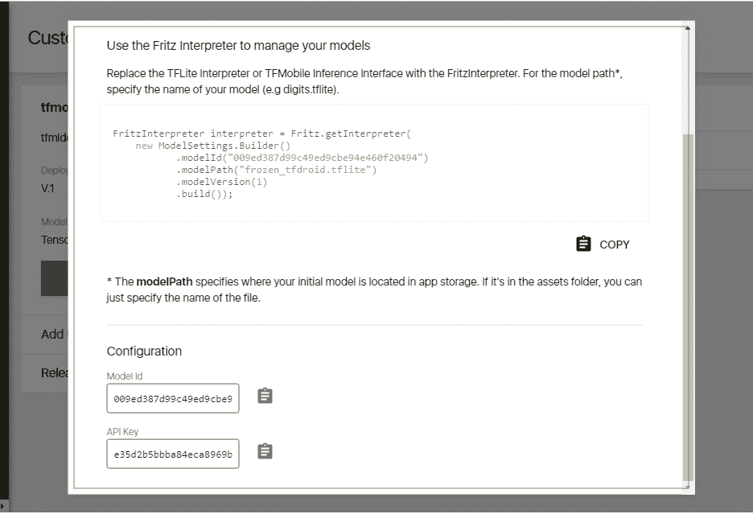

在这里，您将找到 API 密钥，它是项目唯一的，模型 ID，它对您上传的每个模型都不同，以及创建解释器的代码。

# 向项目中添加依赖项

为了访问 Fritz 解释器，您需要向项目中添加依赖项。为此，打开您的模块 app 的`build.gradle`文件。您需要添加一个指向 Fritz Maven 仓库的仓库条目。为此，添加以下行：

```py
repositories {
    maven { url "https://raw.github.com/fritzlabs/fritz-repository/master" }
}
```

现在添加 Fritz 依赖项：

```py
dependencies {
    implementation fileTree(dir: 'libs', include: ['*.jar'])
    implementation 'com.android.support:appcompat-v7:27.1.0'
    implementation 'com.android.support.constraint:constraint-layout:1.1.2'
    implementation 'ai.fritz:core:1.0.0'
    implementation 'ai.fritz:custom-model-tfmobile:1.0.0'
    implementation 'com.stripe:stripe-android:6.1.2'
}
```

使用前面的代码，我们已经添加了 Fritz 核心库和`tfmobile`库。Fritz 核心库是必需的，用于与 fritz 云服务器通信以下载版本管理的模型文件。`tfmobile`库也是必需的，因为我们正在使用 TensorFlow 移动模型，并且我们需要 TensorFlow 库来进行推理。

# 在您的 AndroidManifest 中注册 FritzJob 服务

我已经提到，当您的应用在 fritz 云服务器上部署时，您的应用将下载模型文件。为此，Fritz 实现了一个名为`FritzJob`的服务，它将在后台运行。当它发现您的 Web 控制台中部署了新的模型时，当设备连接到 Wi-Fi 时，它将尝试下载。

要登录你的云账户，你的应用需要一些凭证。为此，fritz 提供了一个 API 密钥。为了启用此功能，我们需要在你的 Android 清单 XML 文件中添加一个元条目，如下所示：

```py
<meta-data android:name="fritz_api_key" android:value="6265ed5e7e334a97bbc750a09305cb19" />
```

你需要替换的 fritz API 密钥值，应替换为你从浏览器中点击 SDK INSTRUCTIONS 时获取的你的 API 密钥。

我们还需要声明 Fritz 作业，如下所示：

```py
<service
    android:name="ai.fritz.core.FritzJob"
    android:exported="true"
    android:permission="android.permission.BIND_JOB_SERVICE" />
```

由于我们的应用需要通过 Wi-Fi 连接到云服务器，我们需要提及该互联网访问权限：

```py
<uses-permission android:name="android.permission.INTERNET"/>
```

现在，我的整个清单文件将看起来像这样：

```py
<?xml version="1.0" encoding="utf-8"?>
<manifest xmlns:android="http://schemas.android.com/apk/res/android"
    package="org.packt.fritz.samplefritzapp">

    <uses-permission android:name="android.permission.INTERNET"/>

    <application
        android:allowBackup="true"
        android:icon="@mipmap/ic_launcher"
        android:label="@string/app_name"
        android:roundIcon="@mipmap/ic_launcher_round"
        android:supportsRtl="true"
        android:theme="@style/AppTheme">
        <activity android:name=".MainActivity">
            <intent-filter>
                <action android:name="android.intent.action.MAIN" />

               <category android:name="android.intent.category.LAUNCHER" />
            </intent-filter>
        </activity>
        <meta-data android:name="fritz_api_key" android:value="6265ed5e7e334a97bbc750a09305cb19" />
        <service
            android:name="ai.fritz.core.FritzJob"
            android:exported="true"
            android:permission="android.permission.BIND_JOB_SERVICE" />
    </application>

</manifest>
```

# 将 TensorFlowInferenceInterface 类替换为 Fritz 解释器

打开你的应用的主活动并做出以下更改：

```py
package org.packt.fritz.samplefritzapp;

import android.os.Bundle;
import android.support.v7.app.AppCompatActivity;
import android.view.View;
import android.widget.Button;
import android.widget.EditText;
import android.widget.TextView;
import android.widget.Toast;

import org.tensorflow.contrib.android.TensorFlowInferenceInterface;

import ai.fritz.core.*;
import ai.fritz.customtfmobile.*;
```

在前面的`import`语句中，我们已添加了对 Fritz 核心库和 Fritz 自定义模型库的导入，并且我们还在使用 Google 的`TensorflowInfereceInterface`：

```py
public class MainActivity extends AppCompatActivity {

private TensorFlowInferenceInterface inferenceInterface;

 static {
System.loadLibrary("tensorflow_inference");
 }
```

在前面的行中，我们已声明了 TensorFlow 推理接口并加载了`tensorflow_inference`库，这是可选的。这可以通过 Fritz 本身隐式完成：

```py
 @Override
 protected void onCreate(Bundle savedInstanceState) {
        super.onCreate(savedInstanceState);
 setContentView(R.layout.activity_main);
 Fritz.configure(this);
```

在前面的行中，我们已经配置了 fritz 服务并将其与你的应用链接。在这里，它将验证应用包名是否已添加到你的 Fritz 控制台。

要这样做，你需要在 Fritz 网络控制台中项目左侧菜单中点击项目设置。

然后，点击将 Android 应用添加到你的项目中，它将打开一个对话框，如下所示：

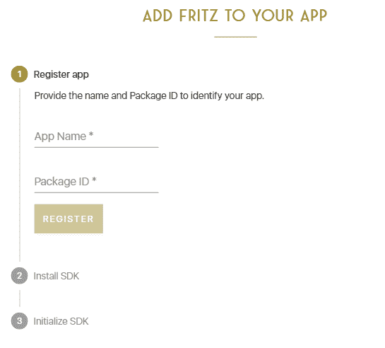

在这里，你需要给你的应用起一个名字，用于识别目的。然后你需要从你的 Android 清单文件中获取包名，并在`Package ID`文本字段中输入它。

这个特定的信息你可以从你的清单文件中的清单标签中获取，如下所示：

```py
<?xml version="1.0" encoding="utf-8"?>
<manifest xmlns:android="http://schemas.android.com/apk/res/android"
    package="org.packt.fritz.samplefritzapp">
```

一旦注册，回到我们的代码：

```py
 try {

FritzTFMobileInterpreter interpreter = FritzTFMobileInterpreter.create(this.getApplicationContext(),
 new ModelSettings.Builder()
.modelId("2a83207a32334fceaa29498f57cbd9ae")
.modelPath("ab2.pb")
.modelVersion(1)
.build());
```

这里，我们正在为我们的 Fritz 模型创建一个对象。第一个参数是应用程序上下文对象，第二个参数是模型信息对象。

在模型设置中，我们将提供模型 ID，这可以从你点击 Fritz 网络控制台中模型页面的 SDK 说明时显示的对话框中获取。

另一个重要的事情是模型路径。这是你的模型文件名，你将其放置在`assets`文件夹中：

```py
 inferenceInterface = interpreter.getInferenceInterface();
```

在前面的行中，我们正在获取 TensorFlow 推理接口对象并将其分配给全局声明的变量：

```py
 final Button button = (Button) findViewById(R.id.button);

 button.setOnClickListener(new View.OnClickListener() {
 public void onClick(View v) {

 final EditText editNum1 = (EditText) findViewById(R.id.editNum1);
 final EditText editNum2 = (EditText) findViewById(R.id.editNum2);

 float num1 = Float.parseFloat(editNum1.getText().toString());
 float num2 = Float.parseFloat(editNum2.getText().toString());

 long[] i = {1};

 int[] a = {Math.round(num1)};
 int[] b = {Math.round(num2)};

 inferenceInterface.feed("a", a, i);
 inferenceInterface.feed("b", b, i);

 inferenceInterface.run(new String[]{"c"});

 int[] c = {0};
 inferenceInterface.fetch("c", c);

 final TextView textViewR = (TextView) findViewById(R.id.txtViewResult);
 textViewR.setText(Integer.toString(c[0]));
 }
});
 }
 catch (Exception ex)
{
Toast.makeText(this.getApplicationContext(),ex.toString(),Toast.LENGTH_LONG).show();

 }

}

}
```

在前面的代码块中，我们已注册了一个事件监听器，它将在用户点击运行按钮时执行推理。

# 构建和运行应用

要查看结果，连接一个设备并运行项目。它将显示如下结果：

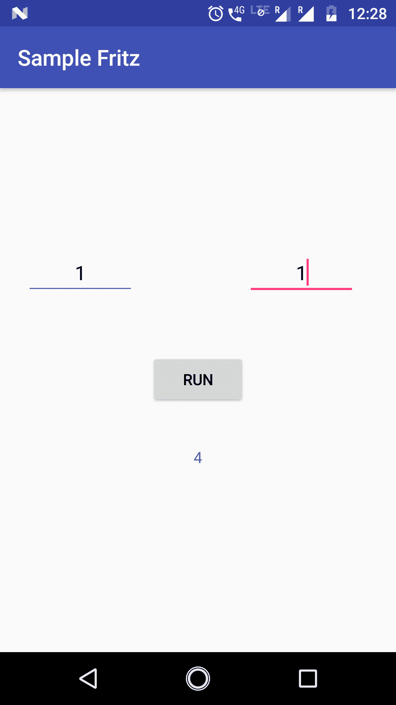

# 部署模型的新版本

Fritz 的真实力量在于自动下载修订后的模型文件。在这里，我们将演示这一点。

到目前为止，我们已经上传了我们的旧*(a+b)*^(*2*)模型并执行了推理。现在，我们将将其更新到*(a+b)*^(*3*)并检查我们的应用是否自动下载了修订后的模型。

为了做到这一点，我们需要创建*(a+b)*³模型。首先，我们需要回顾第四章下的*创建和保存模型*部分，即*Android 中的 TensorFlow Mobile*，在那里我们创建了*(a+b)²*模型。我们将进行一个小改动，将这个模型转换：

```py

import tensorflow as tf

a = tf.placeholder(tf.int32, name='a')  # input
b = tf.placeholder(tf.int32, name='b')  # input
times = tf.Variable(name="times", dtype=tf.int32, initial_value=3)
c = tf.pow(tf.add(a, b), times, name="c")

saver = tf.train.Saver()
init_op = tf.global_variables_initializer()
with tf.Session() as sess:
    sess.run(init_op)

    tf.train.write_graph(sess.graph_def, '.', 'tfdroid.pbtxt')
    sess.run(tf.assign(name="times", value=3, ref=times))
    # save the graph

    # save a checkpoint file, which will store the above assignment
    saver.save(sess, './tfdroid.ckpt')
```

在前面的程序中，我们唯一做的改动是`times`变量的值，现在它是`3`。这将导致(a+b)乘以三，得到*(a+b)³*。请参阅第四章，*Android 中的 TensorFlow Mobile*，以获取有关如何运行和生成`.pb`扩展模型文件的说明。

一旦你得到`frozen_tfdroid.pb`文件，你可以从 Fritz 模型页面的 Web 控制台中上传此文件，如图所示：

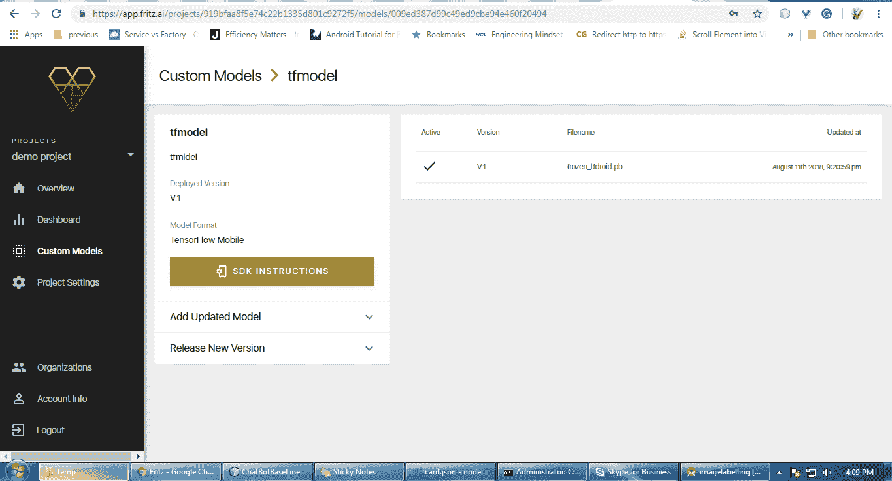

展开添加更新模型面板并上传生成的模型。它将在右侧表格中添加为版本 2：

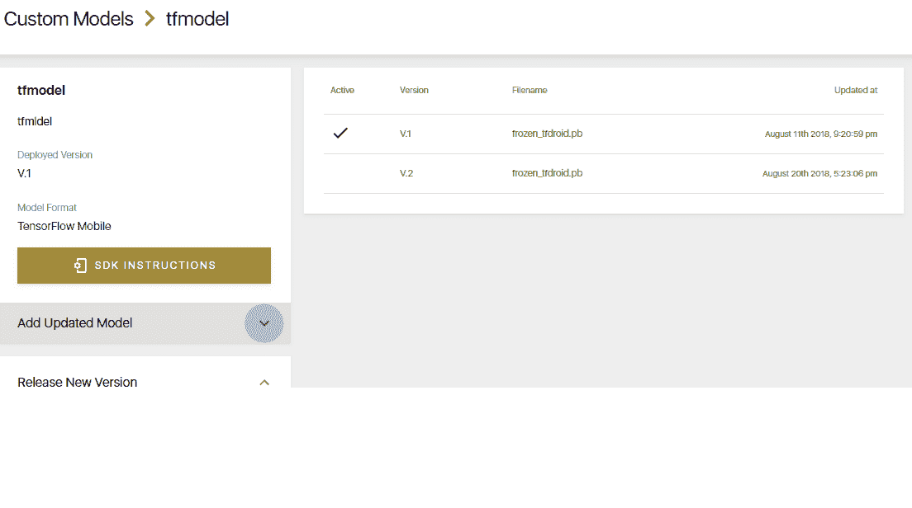

现在你已经上传了模型的修订版，但尚未发布。要这样做，你需要展开“发布新版本”面板并发布所需的版本。

一旦你这样做，所有安装了你的应用的移动设备在通过 WiFi 网络获取互联网连接时，都会下载已发布的模型。

这里是我连接到我的 WiFi 路由器并重新启动应用时得到的结果：

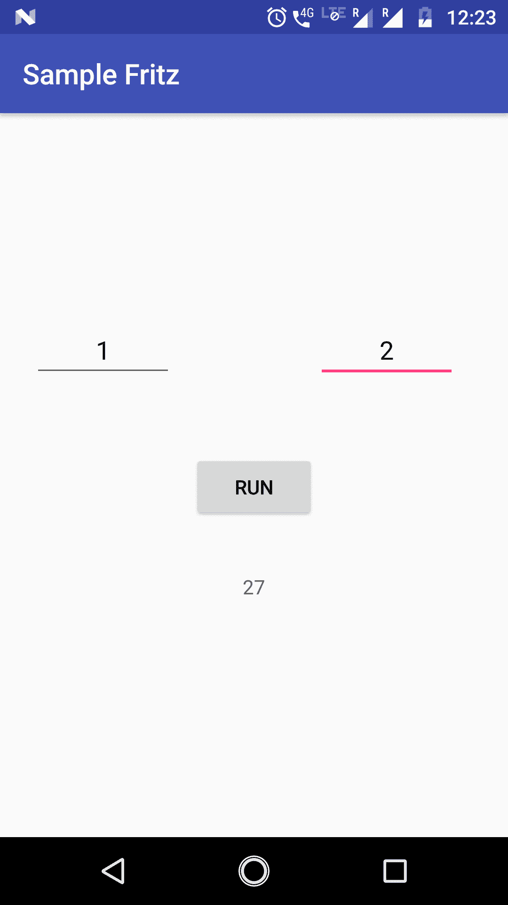

# 使用 fritz 预构建模型创建 android 应用

Fritz 为 iOS 和 Android 都提供了两个预构建模型：

+   图像标记

+   目标检测

在本节中，我们将了解如何在你的 Android 应用中使用图像标记模型。

要这样做，你需要在 Fritz 中创建一个项目；请参阅*使用 Fritz 在 Android 应用程序中使用现有的 TensorFlow Mobile 模型*部分中给出的步骤。

现在，打开 Android Studio 并创建一个带有空活动文件和布局文件的空项目。

# 向项目中添加依赖项

为了访问前面对话框中显示的 fritz 解释器，你需要向你的项目中添加依赖项。为此，打开你的模块应用的`build.gradle`文件。

你需要添加一个指向 fritz Maven 仓库的仓库条目。为此，添加以下行：

```py
repositories {
    maven { url "https://raw.github.com/fritzlabs/fritz-repository/master" }
}
```

现在，添加 fritz 依赖项：

```py
dependencies {
    implementation fileTree(dir: 'libs', include: ['*.jar'])
    implementation 'com.android.support:appcompat-v7:26.1.0'
    implementation 'com.android.support.constraint:constraint-layout:1.1.2'
    implementation 'ai.fritz:core:1.0.1'
    implementation 'ai.fritz:vision-label-model:1.0.1'

}
```

在前面的行中，我们已经添加了 fritz 核心库和 fritz 视觉库用于标记。为了与 fritz 云服务器通信并下载版本管理所需模型文件，fritz 核心库是必需的。

Fritz 视觉库用于标记将下载所需的库，例如 TensorFlow Mobile 和视觉依赖项。

# 在你的 Android 清单中注册 Fritz JobService

我已经提到，当你的应用在 Fritz 云服务器上部署时，它将下载模型文件。为此，Fritz 实现了一个名为`FritzJob`的服务。此服务将在后台运行，当它在你网络控制台中找到新部署的模型时，当设备通过 WiFi 网络连接时，它将尝试下载。

为了登录你的云账户，你的应用需要一些凭证。为此，Fritz 提供了一个 API 密钥。为了启用此功能，我们需要在你的 Android 清单 XML 文件中添加一个元条目，如下所示：

```py
<meta-data
    android:name="fritz_api_key"
    android:value="e35d2b5bbba84eca8969b7d6acac1fb7" />
```

你需要将 Fritz API 密钥的值替换为你从浏览器中点击`SDK INSTRUCTIONS`时的上一个对话框中获得的你的密钥。

我们需要声明 Fritz 作业，如下所示：

```py
<service
    android:name="ai.fritz.core.FritzJob"
    android:exported="true"
    android:permission="android.permission.BIND_JOB_SERVICE" />
```

由于我们的应用需要通过 WiFi 连接到云服务器，因此我们需要提及该互联网访问权限：

```py
<uses-permission android:name="android.permission.INTERNET"/>
```

我们还需要添加以下行：

```py
<uses-sdk android:minSdkVersion="21" android:targetSdkVersion="21" />
<uses-feature android:name="android.hardware.camera2.full" />
<uses-permission android:name="android.permission.CAMERA" />

```

在 Android 中，相机处理机制已更改为`camera2`包，上一行指定了要使用哪个`camera2`功能。要了解更多信息，请查看[`developer.android.com/reference/android/hardware/camera2/CameraCharacteristics#INFO_SUPPORTED_HARDWARE_LEVEL`](https://developer.android.com/reference/android/hardware/camera2/CameraCharacteristics#INFO_SUPPORTED_HARDWARE_LEVEL)。因此，为了访问相机，我们还需要添加相机权限。

现在，我的整个清单文件将看起来像这样：

```py
<?xml version="1.0" encoding="utf-8"?>
<manifest xmlns:android="http://schemas.android.com/apk/res/android"
    package="com.example.avinaas.imagelabelling">

    <uses-sdk android:minSdkVersion="21" android:targetSdkVersion="21" />
    <uses-feature android:name="android.hardware.camera2.full" />
    <uses-permission android:name="android.permission.CAMERA" />
    <uses-permission android:name="android.permission.INTERNET" />

    <application
        android:allowBackup="true"
        android:icon="@mipmap/ic_launcher"
        android:label="@string/app_name"
        android:roundIcon="@mipmap/ic_launcher_round"
        android:supportsRtl="true"
        android:theme="@style/AppTheme">
        <activity android:name=".MainActivity">
            <intent-filter>
                <action android:name="android.intent.action.MAIN" />

                <category android:name="android.intent.category.LAUNCHER" />
            </intent-filter>
        </activity>
        <meta-data
            android:name="fritz_api_key"
            android:value="e35d2b5bbba84eca8969b7d6acac1fb7" />
        <service
            android:name="ai.fritz.core.FritzJob"
            android:exported="true"
            android:permission="android.permission.BIND_JOB_SERVICE" />
    </application>

</manifest>
```

# 创建应用布局和组件

在你的`activity_main.xml`文件中，该文件位于你的`assets/layouts`文件夹中，你需要输入以下代码：

```py
<?xml version="1.0" encoding="utf-8"?>
<RelativeLayout xmlns:android="http://schemas.android.com/apk/res/android"
    xmlns:tools="http://schemas.android.com/tools"
    android:layout_width="match_parent"
    android:layout_height="match_parent"
    tools:context="com.example.avinaas.imagelabelling.MainActivity">

<TextureView
    android:id="@+id/preview"
    android:layout_width="match_parent"
    android:layout_height="wrap_content"
    android:layout_above="@id/btn_takepic"
    android:layout_alignParentTop="true"/>

    <Button
        android:id="@+id/btn_takepic"
        android:layout_width="wrap_content"
        android:layout_height="wrap_content"
        android:layout_alignParentBottom="true"
        android:layout_centerHorizontal="true"
        android:layout_marginBottom="16dp"
        android:layout_marginTop="16dp"
        android:text="Start Labeling"
        />
</RelativeLayout>

```

在前面的 XML 工具中，上下文值需要根据你的主活动进行更改。

在前面的 XML 中，我们添加了一个按钮来接收事件，以及一个纹理视图，它作为相机流的占位符。

前面布局的设计视图将看起来像这样：

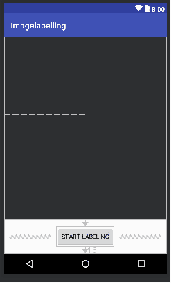

# 编写应用代码

此应用的代码可以在你的 GitHub 仓库中找到，地址为[`github.com/PacktPublishing/Machine-Learning-for-Mobile/tree/master/Fritz/imagelabelling/imagelabelling`](https://github.com/PacktPublishing/Machine-Learning-for-Mobile/tree/master/Fritz/imagelabelling/imagelabelling)。

下载代码后，在 Android Studio 中打开它，你可以在`MainActivity.java`中找到代码。

为了解释整个代码，可能更多地涉及 Android 代码。在这里，你可以找到对重要代码块的解释：

```py
Fritz.configure(this.getApplicationContext());
```

在`oncreate`生命周期方法中的上一行将初始化 Fritz 框架：

```py
options = new FritzVisionLabelPredictorOptions.Builder()
        .confidenceThreshold(0.3f)
        .build();
```

上一行将创建标签预测器的配置选项：

```py
visionPredictor = FritzVisionLabelPredictor.getInstance(this.getApplicationContext(), options);
```

创建预测器的实例：

```py
Bitmap bmp = BitmapFactory.decodeFile(file.getPath());
```

获取保存到文件中的图像并将其转换为位图：

```py
FritzVisionImage img = FritzVisionImage.fromBitmap(bmp);
List<FritzVisionLabel> labels = visionPredictor.predict(img);
```

将位图图像转换为 Fritz 视觉图像，并将该图像对象提供给预测器的`predict`方法，该方法反过来返回预测标签列表：

```py
String output="";

for(FritzVisionLabel lab: labels)
{
    output = output + lab.getText()+"\t Confidence: "+ lab.getConfidence();
}

if(output.trim().length()==0)
{
    output = "Unable to predict.";
}
Toast.makeText(MainActivity.this, output, Toast.LENGTH_LONG).show();
```

由于预测器返回了一个`Fritzvisionlabel`对象的列表，我们需要对其进行解码并展示给用户。前面的代码在“Toast”消息中向用户展示了内容和置信度百分比。

一旦运行应用程序，从摄像头捕获的图像帧将在我们布局中创建的纹理视图中显示。

一旦你点击“开始标注”按钮，它将保存图像到磁盘并将相同的图像输入到`Fritzvisionlabel`预测器。一旦你恢复预测结果，你将对其进行解释并以`Toast`消息的形式展示给用户。

要使前面的应用程序工作，我们需要将此应用程序添加到你的 Fritz 项目中。

要这样做，请点击 Fritz 网络控制台中左侧菜单中的“项目设置”。

然后，点击“将 Android 应用程序添加到项目”并会打开一个对话框，如下所示：

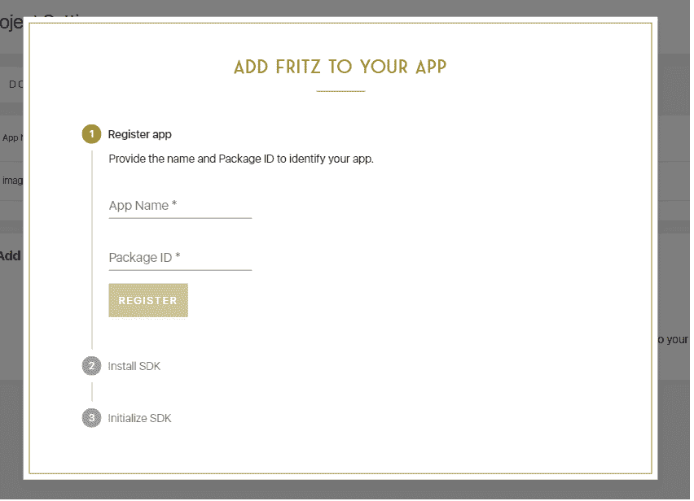

在这里，你需要给你的应用程序命名，以便于识别。然后你需要从你的 Android 清单文件中获取包名并将其输入到“包 ID”文本字段中。

这可以通过以下方式从你的清单文件中的 manifest 标签获得：

```py
<?xml version="1.0" encoding="utf-8"?>
<manifest xmlns:android="http://schemas.android.com/apk/res/android"
    package="com.example.avinaas.imagelabelling">
```

一旦注册了应用程序，你可以通过将 Android 设备连接到你的 PC 并启用 USB 调试选项来运行和查看结果。

确保你禁用了 Android Studio 中的“Instant run”选项。这可以通过文件菜单中的设置选项完成。

一旦应用程序成功运行，结果将如下所示：

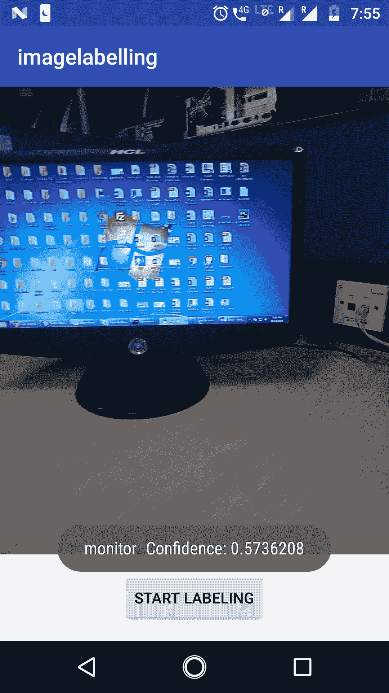

# 使用 Fritz 在 iOS 应用程序中使用现有的 Core ML 模型

在本节中，我们将了解如何使用 Fritz 工具包在 iOS 移动应用程序中利用我们已创建的 Core ML 模型。我们将使用 Core ML 和`Boston`数据集创建的`HousePricer.mlmodel`，并使用线性回归算法进行房价预测。我们将详细说明实现此目标所需的步骤。

为了此目的，请从 Packt GitHub 上的线性回归示例源代码下载房价预测，链接为[`github.com/PacktPublishing/Machine-Learning-for-Mobile/tree/master/housing%20price%20prediction/sample`](https://github.com/PacktPublishing/Machine-Learning-for-Mobile/tree/master/housing%20price%20prediction/sample)。

# 在 Fritz 中注册

为了使用 Fritz，你必须在 Fritz 网络门户中注册一个账户：

1.  前往[`fritz.ai/`](https://fritz.ai/)。

1.  点击顶部菜单中的“登录”

1.  点击“创建账户”

1.  输入你的详细信息并提交

# 在 Fritz 中创建新项目

一旦你有了账户，请使用你的凭证登录并执行以下步骤：

1.  点击“添加新项目”按钮

1.  输入项目名称和组织

1.  点击“提交”

# 上传模型文件 (.pb 或 .tflite)

以下是将模型文件上传的步骤：

1.  在左侧菜单中点击“自定义模型”

1.  输入模型名称和描述

1.  上传在运行 Python 程序后生成的第一个线性回归章节中的模型文件 (`HousePricer.mlmodel`)

您可以在下载目录中找到此文件：[`github.com/PacktPublishing/Machine-Learning-for-Mobile/tree/master/housing%20price%20prediction/sample/sample`](https://github.com/PacktPublishing/Machine-Learning-for-Mobile/tree/master/housing%20price%20prediction/sample/sample)。

1.  点击“创建模型文件”按钮

一旦上传，模型页面将看起来像这样：

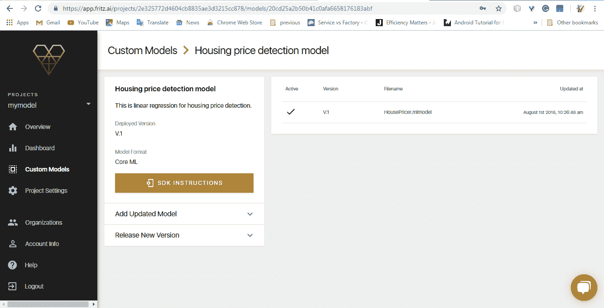

# 创建 Xcode 项目

现在，打开您在 Xcode 中下载的项目。项目将看起来像这样。

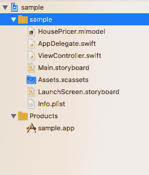

# 安装 Fritz 依赖项

要安装 Fritz 依赖项，从 Fritz 下载您的模型 pod 文件。为此，您需要将您的 iOS 项目添加到您的 fritz 项目中。您可以从 fritz 控制台的项目设置页面这样做。

在项目设置页面中，点击“添加 iOS 项目”按钮。然后填写对话框，其中包含您在 Xcode 中打开应用程序时显示的应用程序名称。填写此信息时，请使用从构建设置中获取的捆绑 ID，如图所示：

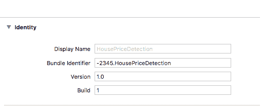

然后，您将被允许下载 `Fritz-info.plist` 文件。将此文件添加到 Xcode 中的项目文件夹中，如图所示：

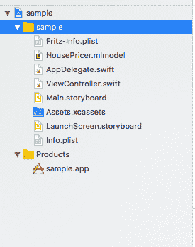

之后，您需要关闭 Xcode，从终端导航到您的项目文件夹，并依次执行以下命令：

```py
$ pod init
$ pod 'Fritz'
$ pod install
```

这为您创建了一个 `.xcworkspace` 文件，用于您的应用程序。使用此文件进行所有未来的应用程序开发。

现在关闭您的 Xcode 应用程序，并使用此文件重新打开项目。

# 添加代码

在 fritz 控制台中打开您的模型控制台。它将有一个按钮 - SDK 指令，点击此按钮将打开如下截图所示的对话框。如图所示，创建一个具有所示文件名的新的文件，并将代码粘贴/写入其中：

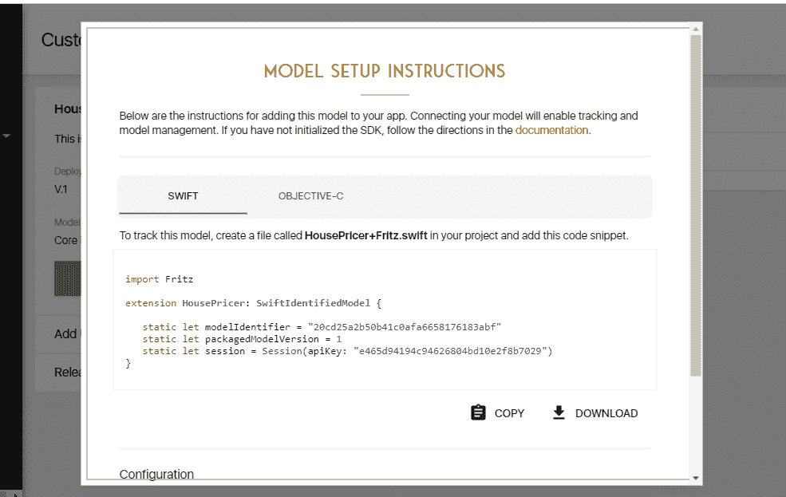

现在，一旦添加了此文件，您需要打开 `AppDelegate.swift` 并进行以下修改：

+   首先，添加一个新的导入语句

+   导入 `Fritz`

+   现在在应用程序代理类中：

```py
      func application(_application : UIApplication, 
      didFinishLaunchingWithOptions launchOptions: 
      [UIApplication.LauncgOptionsKey: Any])
```

替换之前的方法定义，如图所示：

```py
func application(_ application: UIApplication,
didFinishLaunchingWithOptions launchOptions: [UIApplication.LaunchOptionsKey: Any]?)
-> Bool {
FritzCore.configure()
return true
}
```

# 构建、运行 iOS 移动应用程序

与我们构建 iOS 移动应用程序的方式类似，在模拟器中构建和运行项目，它将给出以下结果：

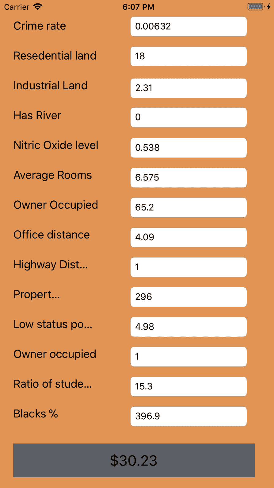

# 摘要

在本章中，我们学习了 Fritz，这是一个端到端平台，使我们能够创建机器学习应用。我们还探讨了预构建的 ML 模型以及如何在 Fritz 中使用自定义模型。接着，我们研究了如何在 iOS 和 Android 中实现 Fritz 到 Core ML 的迁移。最后，我们使用 Fritz 库创建了两个应用：一个使用预构建的 fritz 模型，另一个使用 iOS 的 Core ML 模型。在下一章中，我们将学习神经网络及其在移动应用和机器学习中的用途。
