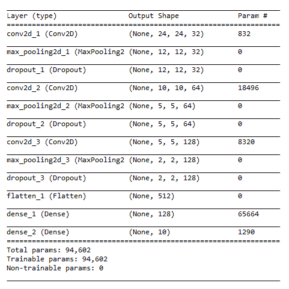

# 移动设备上的神经网络

在第二章“监督学习和无监督学习算法”中，当我们向您介绍 TensorFlow、其组件以及其工作原理时，我们简要地谈到了**卷积神经网络**（**CNNs**）以及它们是如何工作的。在本章中，我们将深入探讨神经网络的基本概念。我们将探讨机器学习和神经网络之间的相似性和差异。

我们还将讨论在移动设备上执行深度学习算法的一些挑战。我们将简要介绍适用于移动设备的各种深度学习和神经网络 SDK。在本章的末尾，我们将创建一个有趣的作业，该作业将利用 TensorFlow 和 Core ML。

在本章中，我们将介绍以下主题：

+   创建 TensorFlow 图像识别模型

+   将 TensorFlow 模型转换为 Core ML 模型

+   创建一个利用 Core ML 模型的 iOS 移动应用程序

+   Keras 简介

+   创建一个手写数字识别解决方案

在本章中，我们将实现本书中我们已经讨论过的所有主要主题。在继续之前，请确保你已经阅读了本书的所有前几章。

# 神经网络简介

神经网络是一个基于人类大脑神经元操作的硬件和/或软件系统。神经网络的设计灵感来源于人脑及其功能。让我们了解人脑的设计。神经元是大脑的基本工作单元。它是一种专门细胞，可以传递信息到其他神经细胞。大脑由大约 100,000,000,000 个神经元组成。神经元的主要功能是处理和传输信息。

# 神经元的通信步骤

神经元通信遵循四个步骤：

+   神经元从外部环境或其他神经元接收信息。

+   神经元整合或处理来自所有输入的信息，并确定是否发送输出信号。这种整合在时间（输入的持续时间和输入之间的时间）和空间（神经元表面）上都会发生。

+   神经元以高速在其长度上传播信号。

+   神经元将这个电信号转换为化学信号，并将其传输到另一个神经元或到肌肉或腺体等效应器。

为了更好地理解神经元——人类大脑的基本构建块——是如何工作的，请查看[`www.biologyreference.com/Mo-Nu/Neuron.html#ixzz5ZD78t97u`](http://www.biologyreference.com/Mo-Nu/Neuron.html#ixzz5ZD78t97u)。

现在，谈到人工神经网络中的神经元，这些神经元的职能是接收一些输入并产生输出。

# 激活函数

为了明确分类，神经元是一个占位符函数，它接收输入，通过在输入上应用函数来处理这些输入，并产生输出。任何简单的函数都可以放入定义的占位符中：


在神经元中使用的函数通常被称为激活函数。在人体中，有三种类型的神经元：感觉神经元、运动神经元和中间神经元。在人工世界中，激活函数可能会创建神经元的不同能力和功能。

这里有一些常用的激活函数：

+   步进

+   Sigmoid

+   tanh

+   ReLU-Rectified

+   线性单元（主要用于深度学习）

详细介绍每个函数的细节超出了本书的范围。然而，如果您想进一步研究神经网络，了解这些函数及其复杂性将是有益的。

# 神经元的排列

让我们看看人体中神经元的排列。一个典型的神经元有几个树突，通常以极其分支的方式排列，以便与其他许多神经元建立联系。人体中的神经元也按层排列。这些层的数量因身体和大脑的不同部位而异，但通常在三层到六层之间。

在人工世界中，这些神经元也按层排列。以下图表将帮助您了解神经元的组织结构：


网络最左侧的层被称为**输入层**，最右侧的层被称为**输出层**。神经元的中层被称为**隐藏层**，因为其值在训练集中未被观察到。

在这个示例神经网络中，有三个输入、三个隐藏单元和一个输出单元。任何神经网络都将至少有一个输入层和一个输出层。隐藏层的数量可以变化。

每个隐藏层中使用的激活函数可以相同网络中的不同。这意味着同一网络中隐藏层 1 的激活函数和隐藏层 2 的 b 激活函数可以不同。

# 神经网络类型

神经网络根据隐藏层的数量和每层使用的激活函数而有所不同。以下是一些常见的神经网络类型：

+   **深度神经网络**：具有多个隐藏层的网络。

+   **CNN**：常用于与计算机视觉相关的学习问题。CNN 隐藏层使用卷积函数作为激活函数。

+   **循环神经网络**：常用于与自然语言处理相关的问题。

当前在移动设备神经网络改进领域的研究/项目包括以下内容：

+   MobileNet

+   MobileNet V2

+   MNasNet—在移动设备上实现强化学习

# 图像识别解决方案

想象你和朋友们去了一家餐厅。假设你是一个健身狂热者，尽管你来到派对是为了享受自助餐，但作为一个健身狂热者，你很注意卡路里，不想过量。

现在想象一下，你有一个移动应用程序可以救你于水火之中：它拍摄食物的照片，识别其成分，并计算食物的卡路里值！你可以拍摄每一道菜并计算其卡路里值，然后决定是否将其放在你的盘子里。此外，这个应用程序会不断学习你拍摄的不同菜肴，并在这个领域继续学习和精通，以便它能很好地照顾你的健康。

我能看到你眼中的光芒。是的，这是我们本章想要尝试的移动应用程序。我们还想利用 TensorFlow 和 Core ML 来完成这项活动。我们将执行以下步骤来创建我们刚才讨论的应用程序：

1.  创建 TensorFlow 图像识别模型

1.  将其转换为`.ml`模型文件

1.  创建一个 iOS/SWIFT 应用程序来使用该模型

我们将在接下来的章节中详细讲解这些步骤。

# 创建 TensorFlow 图像识别模型

TensorFlow 是一个开源软件库，用于在一系列任务中进行数据流编程。它是一个符号数学库，也用于机器学习应用，如神经网络。它被用于谷歌的研究和生产，经常取代其封闭源代码的前身 DistBelief。TensorFlow 是由谷歌大脑团队为谷歌内部使用而开发的。它于 2015 年 11 月 9 日以 Apache 2.0 开源许可证发布。

TensorFlow 是跨平台的。它几乎在所有设备上运行：GPU 和 CPU，包括移动和嵌入式平台，甚至**张量处理单元**（**TPUs**），这是专门用于执行张量数学的硬件。

# TensorFlow 做什么？

为了简化，让我们假设你想要两个数字。现在，如果你想在常规编程语言中编写程序，比如 Python，你会使用以下代码：

*a = 1*

*b = 2*

*print(a+b)*

如果你运行程序，你将看到输出为*3*，然后你将在`tensorflow`上看到相同的实现：

```py
import tensorflow as tf
x = tf.constant(35, name='x')
y = tf.Variable(x + 5, name='y')
model = tf.global_variables_initializer()
with tf.Session() as session:
    session.run(model)
    print(session.run(y))
```

让我解释一下前面的代码。首先，我们创建了一个名为`x`的常量，将其加 5，并将其存储在另一个变量/节点`y`中。如果你现在能看到`y`的输出控制台，你会找到节点的定义，但不是 40 的值。

在这里，你正在定义图的节点及其相应的操作。一旦初始化变量并创建和获取图的会话/实例，你就可以使用图。

以下图表将帮助你理解这个概念：


在 TensorFlow 中，我们将使用所有常量、占位符和变量来创建节点定义和链接，这将创建一个图，这与面向对象编程中的类概念类似。将图视为一个类，节点视为数据成员，`tf.globalvariableinitilizer()` 视为调用静态方法来初始化常量和变量，而 `session.run()` 视为调用类的构造函数。

# 重新训练模型

要创建一个图像分类器，我们需要经历很多事情，编写很多代码。为了保持简单，我们将向您展示如何使用 Google Code Lab 提供的代码来创建它。以下内容摘自 Google 的 Code Lab 教程。

这是通过卷积神经网络（CNNs）实现的。解释所有这些内容超出了本书的范围。我们在本章的引言中简要探讨了 CNN。然而，与海洋相比，这非常少。更多信息，感兴趣的读者可以查看 [`colah.github.io/posts/2014-07-Conv-Nets-Modular/`](https://colah.github.io/posts/2014-07-Conv-Nets-Modular/)。

让我们看看我们有多容易在 `tensorflow` 中创建一个图像分类器。要开始，我们需要安装 anaconda，然后运行以下命令：

```py
conda create -n tensorflow pip python=3.6
```

一旦运行前面的命令，你会得到以下提示：


输入 `y` 以继续。一旦命令成功执行，你会看到以下屏幕：


输入 `activate` 项目。一旦项目被激活，你会看到这样的提示：

```py
(project) D:\Users\vavinas>
```

然后，输入以下命令：

```py
pip install tensorflow
```

使用以下命令来验证已安装的包：

```py
pip list
```

它必须产生以下结果。如果你在你的机器上看不到这些包中的某些，请重新安装它们：


现在，我们已经成功安装了 `tensorflow` 及其依赖项。让我们从 Google Code Labs 获取进行分类的代码。为此，请确保你的机器上已安装 Git。有多种安装方法，但最简单的方法是通过 `npm`。

要检查 Git 是否已正确安装，在打开的命令提示符中输入 `git`。你会看到该命令的所有可用选项。如果它提示为 `invalid command`，请尝试正确安装它。现在，让我们执行克隆存储库的命令：

```py
 git clone https://github.com/googlecodelabs/tensorflow-for-poets-2
```

完成后，使用以下命令进入 `tensorflow-for-poets-2`：

```py
cd tensorflow-for-poets-2
```

以下文件夹包含所有必需的脚本，用于训练图像识别模型。如果你检查 `tf_file` 文件夹，它将是空的。在这里，我们将使用这个文件夹来保存训练图像，并使用脚本文件夹中的脚本训练模型。

要输入图像，您首先需要下载图像。在我们的示例中，我们使用带有四个类别标签的食品图像。您可以从我们的 Git 仓库下载它，`project/food_photos`，然后将该文件夹粘贴到`tf_files`。如果您无法执行此命令，请使用 Internet Explorer 打开文件夹，然后从`tensorflow-for-poets-2/tf_files`文件中下载。

将文件提取为平面文件，如下所示：


现在，我们将使用以下脚本重新训练模型。执行以下命令：

```py
python -m scripts.retrain \
  --bottleneck_dir=tf_files/bottlenecks \
  --how_many_training_steps=500 \
  --model_dir=tf_files/models/ \
  --summaries_dir=tf_files/training_summaries/ mobilenet_0.50_224  \
  --output_graph=tf_files/retrained_graph.pb \
  --output_labels=tf_files/retrained_labels.txt \
  --architecture=mobilenet_0.50_224  \
  --image_dir=tf_files/food_photos
```

之前的 Python 脚本用于重新训练一个具有许多参数的模型，但我们将只使用和讨论几个重要的参数，如下所示：

+   `bottleneck_dir`：这些文件将被保存到 bottlenecks/目录下。

+   `how_many_training_steps`：这将是一个低于 4,000 的数字。更高的数字将使您的模型具有更高的精度，但需要太长时间来构建，并且模型文件会变得太大。

+   `model_dir`：这告诉我们模型应该保存的位置。

+   `summaries_dir`：包含训练摘要。

+   `output_graph`：输出图的保存位置。这是我们将在移动设备上使用的模型。

+   `output_labels`：这是包含类别标签的文件。通常，图像的类别标签是文件夹名称。

+   `architecture`：这告诉我们应该使用哪种架构。在这里，我们使用的是具有 0.50 相对模型大小和 244 图像大小的 mobilenet 模型。

+   `image_dir`：输入图像目录，在这种情况下，`food_photos`。

执行前面的命令将给出以下输出：


# 关于瓶颈

在这里，我们将尝试理解重新训练过程是如何工作的。我们使用的 ImageNet 模型由许多堆叠在一起的层组成。这些层已经过预训练，并且已经拥有足够的信息，有助于图像分类。我们试图做的只是训练最后一层，`final_training_ops`，当所有之前的层重新训练它们已经训练的状态时。

以下截图来自 TensorBoard。您可以在浏览器中打开 TensorBoard 来更好地查看它。您可以在“Graphs”标签下找到它：


在前面的图中，左侧的 softmax 节点是原始模型的输出层。softmax 右侧的所有节点都是由重新训练脚本添加的。

注意，这只有在重新训练脚本完成生成**瓶颈**文件后才会生效。

瓶颈是指位于最终输出层之前，执行分类的层。瓶颈并不暗示其传统意义上的减缓整个过程的含义。我们使用瓶颈这个术语，因为接近输出时，表示比网络主体部分更加紧凑。

每个图像在训练过程中被多次使用。计算每个图像瓶颈后面的层需要花费大量的时间。由于这些网络的底层没有被修改，它们的输出可以被缓存并重用。现在，你手中有了 TensorFlow 重新训练的模型。让我们使用以下命令测试我们刚刚训练的模型：

```py
python -m scripts.label_image \
    --graph=tf_files/retrained_graph.pb  \
    --image=tf_files\food_photos\pizza\1.jpg
```

执行前面的代码块将给出食物图像所属的类别。现在，让我们进行下一个任务：将`tensorflow`模型转换为 Core ML 格式。

# 将 TensorFlow 模型转换为 Core ML 模型

TensorFlow 团队开发了一个用于将 TensorFlow 中创建的模型转换为 Core ML 的包，这最终用于 iOS 应用。要使用此包，你必须有安装了 Python 3.6 和 TensorFlow 的 macOS。使用此包，我们可以将 TensorFlow 模型文件（`.pb`）转换为 Core ML 格式（`.mlmodel`）。首先，你需要执行以下命令：

```py
Pip install tfcoreml
```

一旦安装，请在你的 Python 文件中写下以下代码，将其命名为`inspect.py`并保存：

```py
import tensorflow as tf
from tensorflow.core.framework import graph_pb2
import time
import operator
import sys

def inspect(model_pb, output_txt_file):
    graph_def = graph_pb2.GraphDef()
    with open(model_pb, "rb") as f:
        graph_def.ParseFromString(f.read())

    tf.import_graph_def(graph_def)

    sess = tf.Session()
    OPS = sess.graph.get_operations()

    ops_dict = {}

    sys.stdout = open(output_txt_file, 'w')
    for i, op in enumerate(OPS):
        print('---------------------------------------------------------------------------------------------------------------------------------------------')
        print("{}: op name = {}, op type = ( {} ), inputs = {}, outputs = {}".format(i, op.name, op.type, ", ".join([x.name for x in op.inputs]), ", ".join([x.name for x in op.outputs])))
        print('@input shapes:')
        for x in op.inputs:
            print("name = {} : {}".format(x.name, x.get_shape()))
        print('@output shapes:')
        for x in op.outputs:
            print("name = {} : {}".format(x.name, x.get_shape()))
        if op.type in ops_dict:
            ops_dict[op.type] += 1
        else:
            ops_dict[op.type] = 1

    print('---------------------------------------------------------------------------------------------------------------------------------------------')
    sorted_ops_count = sorted(ops_dict.items(), key=operator.itemgetter(1))
    print('OPS counts:')
    for i in sorted_ops_count:
        print("{} : {}".format(i[0], i[1]))

if __name__ == "__main__":
    """
    Write a summary of the frozen TF graph to a text file.
    Summary includes op name, type, input and output names and shapes.

    Arguments
    ----------
    - path to the frozen .pb graph
    - path to the output .txt file where the summary is written

    Usage
    ----------
    python inspect_pb.py frozen.pb text_file.txt

    """
    if len(sys.argv) != 3:
        raise ValueError("Script expects two arguments. " +
              "Usage: python inspect_pb.py /path/to/the/frozen.pb /path/to/the/output/text/file.txt")
    inspect(sys.argv[1], sys.argv[2])
```

前面的代码将模型文件作为输入参数，并将所有操作和输入/输出节点名称及其描述保存在我们提供的输入文本文件中。要运行此命令，请输入以下命令：

```py
Python inspect.py retrained_graph.pb summeries.txt
```

在这个命令中，你正在执行之前保存的`inspect.py`代码。这也会输入从上一节获得的图文件以及你想要保存摘要的文本文件路径。

执行此命令后，`summaries.txt`将创建包含所有摘要的文件，如上图所示。这些将被添加到该文件中：


在这个文件中，你可以看到所有操作、输入和输出名称及其形状；你还可以看到整体操作符：


文件末尾，你会找到结束节点的定义；在我们的例子中，如下所示：


在这里，你可以看到结束节点操作类型是`Softmax`，它将产生的输出将存储在`final_result:0`名称中。现在，查看以下用于生成相应 Core ML 模型的代码块：


让我们详细理解前面的代码块。你必须已经注意到我们在第一行导入了`tfcoreml`包，然后使用了它的**convert**函数。以下是其参数：

+   `Tf_model_path`：你在上一节中生成的（`.pb`）文件路径，*将 TensorFlow 模型转换为 Core ML 模型*。

+   `Mlmodel_path`：你想要生成模型的输出模型文件路径。

+   `Output_feature_names`：在这里，我们将获得从之前由我们的模型检查代码生成的文本文件中获得的输出变量名称。

+   `Image_input_names`：您想要为图像输入指定的名称。在 Core ML/iOS 中，这将是一个图像缓冲区。

+   `Class_labels`：这是在训练步骤中您将获得的文件。

一旦运行前面的代码，您将在您的目录中看到生成的`converted``.mlmodel`文件。您可以将它导入到 Xcode 项目中并使用它。

# 编写 iOS 移动应用程序

在本节中，我们将创建一个应用程序，利用我们创建的图像识别模型，通过您的 iOS 移动摄像头预测图像。

首先，您需要一个运行 Xcode 版本 9+的 Mac PC。从 Git 仓库下载源代码（Xcode 项目），然后导航到项目文件夹。在 Xcode 中打开`recognition.xcodeproj`图像。以下截图显示了项目的文件夹结构：


我们将要查看的主要文件是`con``troller.swift`。它包含以下代码：

```py
import UIKit class ViewController: UIViewController {
 @IBOutlet weak var pictureImageView :UIImageView! @IBOutlet weak var titleLabel :UILabel!
```

这些是主 Storyboard 中图像视图控件和标题标签控件的输出：

```py
private var model : converted = converted()
```

这是当我们添加上一节中创建的`core-ml`文件时生成的模型实例：

```py
 var content : [ String : String ] = [ "cheeseburger" : "A cheeseburger is a hamburger topped with cheese. Traditionally, the slice of cheese is placed on top of the meat patty, but the burger can include many variations in structure, ingredients, and composition.\nIt has 303 calories per 100 grams.", "carbonara" : "Carbonara is an Italian pasta dish from Rome made with egg, hard cheese, guanciale, and pepper. The recipe is not fixed by a specific type of hard cheese or pasta. The cheese is usually Pecorino Romano.", "meat loaf" : "Meatloaf is a dish of ground meat mixed with other ingredients and formed into a loaf shape, then baked or smoked. The shape is created by either cooking it in a loaf pan, or forming it by hand on a flat pan.\nIt has 149 calories / 100 grams", "pizza" : "Pizza is a traditional Italian dish consisting of a yeasted flatbread typically topped with tomato sauce and cheese and baked in an oven. It can also be topped with additional vegetables, meats, and condiments, and can be made without cheese.\nIt has 285 calories / 100 grams" *]*
```

我们硬编码了要显示在标题标签中的内容，以对应于我们训练的相应类标签：

```py
 let images = ["burger.jpg","pizza.png", "pasta.jpg","meatloaf.png"]
```

这些是我们添加到项目中的图像；它们将作为我们的预测应用程序的输入：

```py
 var index = 0 override func viewDidLoad() {
 super.viewDidLoad() nextImage() } @IBAction func nextButtonPressed() { nextImage() } func nextImage() { defer { index = index < images.count - 1 ? index + 1 : 0 }        let filename = images[index]
 guard let img = UIImage(named: filename) else { self.titleLabel.text = "Failed to load image \(filename)" return } self.pictureImageView.image = img let resizedImage = img.resizeTo(size: CGSize(width: 224, height: 224)) guard let buffer = resizedImage.toBuffer() else { self.titleLabel.text = "Failed to make buffer from image \(filename)" return }
```

由于我们使用 224 像素的图像训练了我们的模型，因此我们也在调整输入图像的大小，并将其转换为图像缓冲区，这是我们想要提供给预测方法的：

```py
 do { let prediction = try self.model.prediction(input: MymodelInput(input__0: buffer))
```

在这里，我们输入图像并获取预测结果：

```py
 if content.keys.contains(prediction.classLabel) { self.titleLabel.text = content[prediction.classLabel] } else { self.titleLabel.text = prediction.classLabel; }
```

在前面的代码中，根据类标签，我们向用户显示内容：

```py
 } catch let error { self.titleLabel.text = error.localizedDescription } } }
```

这完成了应用程序的创建。现在，我们将执行应用程序以找到以下图像作为输出：


点击“下一步”以找到我们的下一张图像：


# 手写数字识别解决方案

之前，我们创建了一个应用程序，帮助我们了解使用移动设备上的 TensorFlow 模型实现的神经网络图像识别程序的实现。现在，我们将创建另一个应用程序，使用神经网络和 Keras 的概念来实现手写数字的图像识别程序。在本节中，我们将创建一个用于移动设备上的手写数字识别解决方案的应用程序。然后，我们将此 Keras 模型转换为 Core ML 模型，并使用它来构建 iOS 移动应用程序。让我们先向您介绍 Keras。

# Keras 简介

Keras 是一个高级神经网络 API，用 Python 编写，能够在 TensorFlow、CNTK 或 Theano 之上运行。它旨在使快速实验成为可能。

这里是一些 Keras 的关键用途：

+   允许轻松快速地进行原型设计（通过用户友好性、模块化和可扩展性）

+   支持卷积网络和循环网络，以及两者的组合

+   在 CPU 和 GPU 上无缝运行

Keras 的设计基于以下原则：

+   用户友好性

+   模块化

+   易于扩展

+   兼容 Python

要了解更多关于 Keras 的信息，请查看[`keras.io/`](https://keras.io/)。

# 安装 Keras

正如我们已经讨论过的，Keras 没有自己的后端系统。因为它运行在 TensorFlow、CNTK 或 Theano 之上，我们需要安装其中之一——个人推荐 TensorFlow。

我们需要使用`pip`包管理器安装`h5py`库，以便将 Keras 模型保存到磁盘上：

```py
pip install tensorflow
pip install keras
pip install h5py
```

之前的命令将安装创建模型所需的基本库。

# 解决问题

在本节中，我们将看到神经网络的实际实现。我们将定义问题陈述，然后理解我们将用于解决问题的数据集，接着在 Keras 中创建模型以解决问题。一旦在 Keras 中创建了模型，我们将将其转换为与 Core ML 兼容的模型。这个 Core ML 模型将被导入 iOS 应用程序中，并编写一个程序来使用这个模型并解释手写数字。

# 定义问题陈述

我们将通过在 iOS 移动应用程序中实现的机器学习模型来解决识别手写数字的问题。第一步是拥有用于模型训练和测试的手写数字数据库。

MNIST 数字数据集([`yann.lecun.com/exdb/mnist/`](http://yann.lecun.com/exdb/mnist/))提供了一个手写数字数据库，包含 60,000 个训练示例和 10,000 个测试示例。它是 MNIST 中更大集合的一个子集。这些数字已经被尺寸归一化，并放置在固定大小的图像中。这是一个很好的数据库，对于想要在真实世界数据上学习技术和模式识别方法，同时尽量减少预处理和格式化工作的人来说非常有用。

在解决这个问题之前，我们将花一些时间来理解问题，看看神经网络可以在哪里提供帮助。我们可以将识别手写数字的问题分解成两个子问题。假设我们被给了一个手写的数字，如下所示：


首先，我们需要将包含许多数字的图像分解成一系列单独的图像，每个图像包含一个单独的数字。例如，我们希望将这个图像分解成七个单独的图像，如下所示：


对于人类来说，数字可以很容易地分开，但对于机器来说，完成这个简单的任务却非常具有挑战性。一旦数字被分开，程序需要分类每个单独的数字。例如，我们希望我们的程序能够识别第一个数字是**5**。

我们现在试图专注于问题的第二部分：识别单个数字并对它们进行分类。我们将使用神经网络来解决识别单个手写数字的问题。

我们可以使用一个具有 10 个神经元的输出层的 3 层神经网络来解决此问题。输入层和隐藏层是处理发生的地方。在输出层，根据激活的神经元，我们可以轻松推断出识别的数字。神经元 0 到 9 分别识别一个数字。

# 问题解决方案

问题解决方案包括以下关键步骤：

1.  准备数据

1.  定义模型

1.  训练和拟合模型

1.  将训练好的 Keras 模型转换为 Core ML 模型

1.  编写 iOS 移动应用程序

现在，让我们逐个步骤进行，看看在每个步骤中我们需要做什么。

# 准备数据

第一个活动是数据准备。首先，让我们导入所有必需的库。如我们之前讨论的，我们将使用 MNIST 数据库作为手写数字数据集：

```py
from __future__ import print_function
from matplotlib import pyplot as plt
import keras
from keras.datasets import mnist
```

`mnist` 是包含手写数字数据库的数据集，因此我们需要按照以下方式导入它：

```py
from keras.models import Sequential
```

上述代码从 Keras 导入了 `Sequential` 模型类型。这只是一个神经网络层的线性堆叠：

```py
from keras.layers import Dense, Dropout, Flatten
```

现在，我们需要从 Keras 导入核心层。这些是在几乎任何神经网络中使用的层：

```py
from keras.layers import Conv2D, MaxPooling2D
```

从 Keras 导入 CNN 层。这些是卷积层，将帮助我们有效地在图像数据上训练：

```py
from keras.utils import np_utils
```

导入 Utils。这将帮助我们稍后进行数据转换：

```py
from keras import backend as K 
import coremltools
```

`coremltools` 将帮助我们将 Keras 模型转换为 Core ML 模型：

```py
(x_train, y_train), (x_val, y_val) = mnist.load_data()
```

将预洗牌的 MNIST 数据加载到训练集和测试集中：

```py
# Inspect x data
print('x_train shape: ', x_train.shape)
print(x_train.shape[0], 'training samples')
print('x_val shape: ', x_val.shape)
print(x_val.shape[0], 'validation samples')
print('First x sample\n', x_train[0])
```

如果运行上述代码，它将显示 X、Y 的形状，以及 X 的第一条记录。

因此，我们的训练集中有 60,000 个样本，每个图像都是 28 x 28 像素。我们可以通过在 `matplotlib` 中绘制第一个样本来确认这一点：


```py
plt.imshow(x_train[0])
```

此语句将使用 `matplotlib` 库绘制 `x_train` 的第一条记录，将给出以下输出：


以下行将打印 `y_train` 的形状和 `y_train` 中的前 10 个元素：

```py
print('y_train shape: ', y_train.shape)
print('First 10 y_train elements:', y_train[:10])
```

以下代码将找到图像的输入形状。MNIST 图像数据值是 `uint8` 类型，范围在 *[0, 255]*，但 Keras 需要范围在 *[0, 1]* 的 `float32` 类型的值：

```py
img_rows, img_cols = x_train.shape[1], x_train.shape[2]
num_classes = 10

# Set input_shape for channels_first or channels_last
if K.image_data_format() == 'channels_first': 
x_train = x_train.reshape(x_train.shape[0], 1, img_rows, img_cols)
x_val = x_val.reshape(x_val.shape[0], 1, img_rows, img_cols)
input_shape = (1, img_rows, img_cols)
else: 
    x_train = x_train.reshape(x_train.shape[0], img_rows, img_cols, 1)
    x_val = x_val.reshape(x_val.shape[0], img_rows, img_cols, 1)
    input_shape = (img_rows, img_cols, 1)                     

print('x_train shape:', x_train.shape)
# x_train shape: (60000, 28, 28, 1)
print('x_val shape:', x_val.shape)
# x_val shape: (10000, 28, 28, 1)
print('input_shape:', input_shape)
```

使用以下代码，我们将数据类型转换为与 Keras 中定义的数据类型兼容：

```py
x_train = x_train.astype('float32')
x_val = x_val.astype('float32')
x_train /= 255
x_val /= 255
```

现在，`y` 中有一个包含 60,000 个元素的向量。让我们将其转换为 60,000 x 10 的数组，如下所示：

```py
y_train = np_utils.to_categorical(y_train, num_classes)
y_val = np_utils.to_categorical(y_val, num_classes)
print('New y_train shape: ', y_train.shape)
# (60000, 10)
print('New y_train shape: ', y_train.shape)
# (60000, 10)
print('First 10 y_train elements, reshaped:\n', y_train[:10])
```

现在，`y_train` 将看起来像这样：


在前面的数组中，我们可以发现对于数字的存在，相应的位置将被填充为 1——所有其他位置都将填充为 0。对于第一条记录，我们可以理解预测的数字是 5，因为从 0 开始的第 6 个位置被填充了 1。

现在数据准备已完成，我们需要定义模型的架构。

# 定义模型的架构

数据准备完成后，下一步是定义模型并创建它，所以让我们创建模型：

```py
model_m = Sequential()
```

前一行将创建一个顺序模型，该模型将以它们排列的顺序处理层。有两种方法可以构建 Keras 模型，顺序和功能：

+   **顺序 API**：这允许我们逐层创建模型。通过这种方式，我们无法创建共享层的模型或具有多个输入或输出的模型。

+   **功能 API**：这允许我们创建比顺序模型更复杂、可以具有复杂连接层的模型——你可以从任何层连接到任何其他层：

```py
model_m.add(Conv2D(32, (5, 5), input_shape=(1,28,28), activation='relu'))
```

输入形状参数应该是 `1` 个样本的形状。在这种情况下，它与每个数字图像的 (深度，宽度，高度) 相同，即 `(1, 28, 28)`。

但其他参数代表什么？它们分别对应要使用的卷积滤波器的数量、每个卷积核的行数和每个卷积核的列数：

```py
model_m.add(MaxPooling2D(pool_size=(2, 2)))
```

`MaxPooling2D` 是通过在上一层滑动一个 2 x 2 的池化滤波器并取 2 x 2 滤波器中 4 个值的最大值来减少我们模型中参数数量的方法：

```py
model_m.add(Dropout(0.5))
```

这是一个用于正则化我们的模型以防止过拟合的方法：

```py
model_m.add(Conv2D(64, (3, 3), activation='relu'))
model_m.add(MaxPooling2D(pool_size=(2, 2)))
model_m.add(Dropout(0.2))
model_m.add(Conv2D(128, (1, 1), activation='relu'))
model_m.add(MaxPooling2D(pool_size=(2, 2)))
model_m.add(Dropout(0.2))
model_m.add(Flatten())
model_m.add(Dense(128, activation='relu'))
model_m.add(Dense(num_classes, activation='softmax'))
print(model_m.summary())
```

一旦运行前面的代码行，模型架构的层的名称将在控制台中打印出来：



# 编译和调整模型

下一步是编译和训练模型。我们通过一系列迭代将模型放入训练阶段。Epochs 决定了训练阶段中模型要进行的迭代次数。权重将被传递到模型中定义的层。足够的 Epochs 将提供更高的准确率和最小的损失。在这里，我们使用 10 个 Epochs。

Keras 具有回调机制，该机制将在模型的每次训练迭代期间被调用，即在每个 Epoch 结束时。在回调方法中，我们保存该 Epoch 计算出的权重：

```py
callbacks_list = [
    keras.callbacks.ModelCheckpoint(
        filepath='best_model.{epoch:02d}-{val_loss:.2f}.h5',
        monitor='val_loss', save_best_only=True),
    keras.callbacks.EarlyStopping(monitor='acc', patience=1)]
```

现在，使用以下代码编译模型：

```py
model_m.compile(loss='categorical_crossentropy',optimizer='adam', metrics=['accuracy'])
```

`categorical_crossentropy` 损失函数衡量 CNN 计算出的概率分布与标签的真实分布之间的距离。

一个 `optimizer` 是一种随机梯度下降算法，它试图通过跟随正确的速度的梯度来最小化损失函数。`accuracy` 是正确分类的图像的比例——这是训练和测试期间最常监控的指标：

```py
# Hyper-parameters
batch_size = 200
epochs = 10
```

现在，使用以下代码拟合模型：

```py
# Enable validation to use ModelCheckpoint and EarlyStopping callbacks.model_m.fit(
    x_train, y_train, batch_size=batch_size, epochs=epochs,    callbacks=callbacks_list, validation_data=(x_val, y_val), verbose=1)
```

一旦程序执行完成，你将在运行目录中找到名为`best_model.01-0.15.h5`的文件。这表示`best_model.{epoch number}-{loss value}.h5`。

这是为给定数据集创建和训练的 Keras 模型。

# 将 Keras 模型转换为 Core ML 模型

现在 Keras 模型已经创建，下一步是将 Keras 模型转换为 Core ML 模型。对于第一个参数，使用笔记本文件夹中最新的`.h5`文件的文件名：

```py
output_labels = ['0', '1', '2', '3', '4', '5', '6', '7', '8', '9']
coreml_mnist = coremltools.converters.keras.convert(
    'best_model.10-0.04.h5', input_names=['image'], output_names=['output'],    class_labels=output_labels, image_input_names='image')
coreml_mnist.save("minsit_classifier.mlmodel")
```

一旦成功运行代码，你将在你的目录中找到创建的`minsit_classifer.mlmodel`文件。我们将使用这个文件来创建一个 iOS 移动应用程序以检测数字。

# 创建 iOS 移动应用程序

现在，我们将创建 iOS 应用程序。你可以从我们的 Packt GitHub 仓库的`ImageClassificationwithVisionandCoreML`文件夹中下载代码。

在 Xcode9+中打开项目；项目结构将如下所示：


如果你打开设计师中的`main.storyboard`，你会看到以下 UI：


大多数代码是常见的 iOS 代码。查看以下代码片段，它对我们特别感兴趣，并包括手写数字预测代码：

```py
lazy var classificationRequest: VNCoreMLRequest = {
        // Load the ML model through its generated class and create a Vision request for it.
        do {
            let model = try VNCoreMLModel(for: MNISTClassifier().model)
            return VNCoreMLRequest(model: model, completionHandler: self.handleClassification)
        } catch {
            fatalError("can't load Vision ML model: \(error)")
        }
    }()
    func handleClassification(request: VNRequest, error: Error?) {
        guard let observations = request.results as? [VNClassificationObservation]
            else { fatalError("unexpected result type from VNCoreMLRequest") }
        guard let best = observations.first
            else { fatalError("can't get best result") }        DispatchQueue.main.async {
            self.classificationLabel.text = "Classification: \"\(best.identifier)\" Confidence: \(best.confidence)"
        }
    }
```

它在底部包含两个按钮：一个用于从手机中选择图像，另一个选项用于拍照。请注意，如果你在模拟器中运行此应用程序，相机将无法工作。

你可以在模拟器中构建和运行应用程序。一旦应用程序在模拟器中成功打开，将手写数字 6 的图像拖拽到模拟器中的 example image 文件夹中–这将保存文件到模拟器的内存中。

返回应用程序并选择保存在设备内存中的拖拽图像。它将显示以下输出：


# 摘要

在本章中，我们介绍了神经网络的概念及其在移动机器学习领域的应用。我们创建了一个应用程序，使用 TensorFlow 和 Core ML 在 iOS 和 Xcode 中识别图像。我们还探讨了 Keras 深度学习框架。我们尝试使用 Keras 中的神经网络解决手写数字识别问题。我们构建了 Keras 机器学习模型来解决这个问题。然后，我们使用 Core ML 转换工具将此模型转换为 Core ML 模型。我们使用这个 Core ML 模型在 iOS 移动应用程序中执行手写数字识别。

在下一章中，我们将学习如何在 Android 中使用 Google Cloud Vision 标签检测技术。
