# MSA 和机器学习在企业系统中的重要性

在当今的市场中，竞争从未如此激烈，用户对 IT 系统的需求不断增长。为了能够跟上客户需求和市场需求，IT 系统需要更短的**上市时间**（**TTM**）的需求从未如此重要，所有这些都推动了敏捷部署和简化开发流程的需求，以及尽可能多地利用代码重用的需求。

**微服务架构**（**MSA**）解决了这些担忧，并试图在保持高效、稳定的系统运行的同时，提供更具竞争力、更可靠、更快速部署和更新的交付。

在本章中，我们将更深入地了解微服务如何帮助构建现代、灵活、可扩展和具有弹性的企业系统。本章将介绍 MSA 中的关键概念，并讨论常见的企业系统架构，每种架构如何与 MSA 不同，为什么它们不同，以及当你选择一种或多种架构而不是其他架构时，你将获得或失去什么。

在我们介绍本章时，我们将涵盖以下领域：

+   MSA 是什么以及为什么

+   MSA 与单体企业系统对比

+   服务驱动架构、**事件驱动架构**（**EDA**），以及如何在 MSA 中融入这些架构

+   部署和运营 MSA 企业系统面临的挑战

+   为什么在构建 MSA 时采用**DevOps**很重要

# 为什么是微服务？优势和劣势

微服务通常与 MSA 相提并论。MSA 指的是从一组较小的应用程序中构建复杂系统的方式，其中每个应用程序都是为了特定的有限范围的功能而设计的。这些小型应用程序（或服务，或微服务）是独立开发的，并且可以独立部署。

每个微服务都有一个 API 接口，用于与其他系统中的微服务通信。所有这些独立的微服务组织在一起，形成了更大的系统功能。

为了理解微服务的价值以及设计 MSA 时面临的挑战，了解微服务之间如何通信和交互至关重要。

微服务可以以线性或非线性的方式相互通信。在线性微服务管道中，每个微服务与其他微服务通信，以顺序方式在整个系统中处理数据。输入始终传递给第一个微服务，输出始终由系统中的最后一个微服务生成：

图 1.1：线性微服务管道

实际上，然而，大多数现有系统都是使用非线性微服务管道构建的。在非线性微服务管道中，数据分布在系统中的不同功能中。你可以将输入传递给系统中的任何功能，输出也可以由系统中的任何功能生成。因此，你可以有多个具有多个输入的管道，服务于多个功能并产生多个输出：

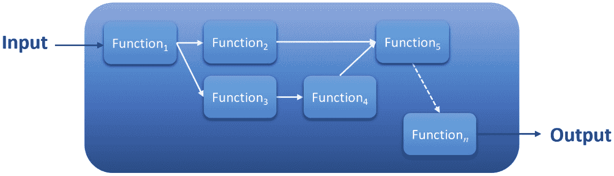

图 1.2：非线性微服务管道

考虑以下典型电子商务系统中简化的订单履行流程图。**下单**过程中的每个功能都代表一个微服务。一旦客户下单，就会触发一个 API 调用到**添加/更新客户信息**微服务，以保存该客户的信息或在需要时更新它。这个微服务的唯一职责就是：根据从 API 调用者接收到的数据输入来管理客户信息。

同时还会向流程中的**验证付款**部分发出另一个 API 调用。调用将根据 API 调用的付款类型被引导到**处理 PayPal 付款**或**处理信用卡付款**微服务。注意这里如何将付款验证过程分解为两个不同的微服务——每个都是针对特定的付款功能专门设计和开发的。这使得这些微服务具有灵活性和可移植性，可以在系统或另一个系统中的其他部分使用，如果需要的话。

在处理完付款后，会同时触发系统中的其他微服务的 API 调用以履行订单：

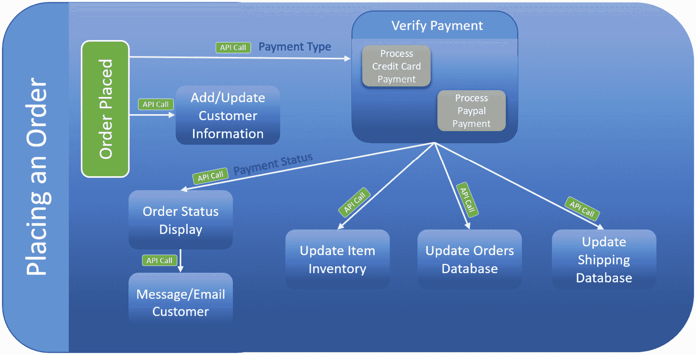

图 1.3：非线性微服务管道示例——客户订单

订单下单示例展示了如何模块化和灵活地设计 MSA 企业系统。我们经常使用这个例子来展示在设计、部署和运营 MSA 企业系统时可能面临的某些优势和挑战。

我们必须探讨使用 MSA 构建企业系统的优缺点，以帮助决定 MSA 是否是您组织更好的选择。

注意，以下列出的某些优势在其他情况下也可能被视为劣势（反之亦然）。

## 微服务的优势

实施 MSA（微服务架构）具有一定的显著价值。以下是我们认为适用于当今市场的部分优势。

### 自主性

微服务最大的优点之一是它们的自主性——这是 MSA（Microservices Architecture，微服务架构）其他许多优点的基石。由于它们的自主性，微服务拥有自己的技术栈，这意味着每个系统服务都可以使用与任何其他系统服务完全不同的工具、库、框架或编程语言进行开发，但它们可以顺利地相互集成。

微服务可以在系统中的任何其他应用程序之外独立开发和测试，这使得每个微服务都可以拥有自己的生命周期，包括**质量保证**（**QA**）、变更管理、升级、更新等，这反过来又极大地减少了应用程序的依赖性。

### 可移植性

微服务的自主性使得它们可以在不同的平台、操作系统和系统中移植，所有这些都与这些服务编写的编程语言无关。

### 重用

当重用微服务时，您不需要重新发明轮子。由于它们的自主性，微服务可以在不添加额外编码、更改或测试的情况下重用。每个服务可以根据需要重用，这极大地增加了系统的灵活性和可扩展性，显著减少了开发时间、成本和部署时间，并减少了系统的 TTM。

### 松散耦合、高度模块化、灵活和可扩展

微服务是 MSA 企业系统的主要构建块。每个块都与系统中的其他块松散耦合。就像乐高积木一样，这些块组织在一起的方式可以形成一个复杂的、针对特定业务解决方案的企业 MSA 系统。

以下图示展示了我们可以如何使用多个微服务构建三个不同的系统示例。

该图显示了九个服务，其中七个服务以这种方式组织，以便重用和构建三个不同的系统——系统**A**、系统**B**和系统**C**。这展示了松散耦合如何使 MSA（Microservices Architecture，微服务架构）具有灵活性，以至于你可以重用每个服务来构建不同的系统功能。

您可以在现有的微服务基础上，通过添加最少量的开发工作来构建系统，这些微服务可以是第三方购买的，也可以是之前内部开发的。这极大地促进了系统的快速开发、新功能的发布、极短的 TTM（Time To Market，上市时间），以及可靠、灵活且更加稳定的即时更新和升级。所有这些都有助于**业务连续性**（**BC**）并使企业系统具有更高的可扩展性：

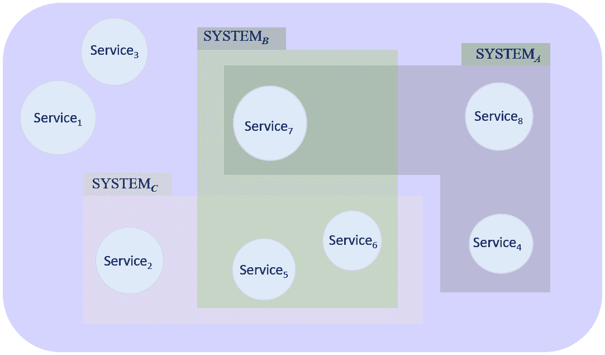

图 1.4：微服务的灵活性和模块化

### 短暂的发布周期和 TTM

由于我们之前提到的单个和独立的服务特性，微服务的部署变得更容易、更快。自动化可以在减少服务测试和部署时间方面发挥重要作用，正如我们将在本章后面讨论的那样。

### 故障容错和故障隔离

每个微服务都有自己的独立故障域。一个微服务的故障将被限制在该微服务内部，因此更容易进行故障排除，修复速度更快，并能更快地将系统恢复到完全运行状态。

考虑我们之前提到的订单履行示例；即使**消息/电子邮件客户**微服务（例如）出现任何故障，系统仍然可以正常工作。由于故障的性质和小的故障域，将很容易确定故障的位置以及如何修复它。因此，**平均修复时间**（**MTTR**）显著降低，BC 得到极大提升。

架构师有时能够构建具有高度内嵌容错能力的系统，以防止这些故障的发生，或者在主微服务检测到故障时，有其他备用微服务可以接管。正如我们稍后将会看到的，本书的一个主要目标就是能够设计出足够智能的系统，以提供所需的高弹性。

然而，软件架构师必须牢记的是，在 MSA 中系统组件过多时，可能出现的问题也越多。因此，架构师和开发者必须具备坚实的回退和错误处理能力，以管理系统的弹性。

不同微服务之间的通信，例如，可能因为任何原因简单地超时；这可能是一个网络问题、服务器问题，或者在接收微服务或系统中开发的事件处理机制中 API 调用过多，从而压倒这个系统组件并导致故障或响应延迟。

系统中有许多数据流和数据处理的点都需要同步。如果系统没有妥善处理单个故障，可能会导致系统级联故障，并相应地可能导致整个系统的故障。

故障容错的设计方式将大大影响系统性能和可靠性。

### 可靠性和单一责任原则（SRP）

如果你来自编程世界，你可能对**面向对象编程**（**OOP**）中的 SRP 很熟悉：*一个类应该只有一个，且只有一个，改变的理由*。系统中的每个对象、类或函数都应该只负责系统的那个功能，因此一旦该类开发完成，它应该只因为最初创建它的原因而改变。这个原则是提高 MSA 中系统可靠性和 BC 的主要驱动力之一。

在开发 MSA 企业系统的初期阶段，以及从头开始开发新微服务的阶段，MSA 企业系统可能尚未完全测试或成熟，可靠性仍在建立中。当系统成熟时，对单个微服务的更改最小——如果有的话——因此微服务的代码可靠性更高，操作更稳定，故障域被限制，容错性高，因此系统的可靠性比具有单体架构的类似系统要高得多。可靠性高度依赖于系统的设计、开发和部署效果。

### 降低系统开发和运营成本

重新使用微服务在很大程度上减少了将系统投入运行所需的开发努力和时间。您可以重新使用的微服务越多，开发时间和成本就越低。

微服务不需要从头开始开发；您可以购买已经开发好的微服务，并将其集成到您的 MSA 企业系统中，从而显著缩短开发时间。

当这些微服务稳定成熟时，可靠性更高，平均修复时间（MTTR）更短，因此系统故障更低，业务连续性（BC）更高。所有这些因素都可以在减少开发成本、运营成本和**总拥有成本**（**TCO**）方面发挥重要作用。

自动化和运营编排非常适合微服务；这有助于敏捷开发，也可以显著降低运营成本。

## 微服务的缺点

在考虑在您的组织中采用 MSA 之前，需要考虑微服务带来的一系列挑战。好消息是，许多这些挑战——如果不是全部——都可以有效地解决，最终形成一个强大的 MSA 企业系统。

这里提到了微服务的一些挑战，我们将在本章后面讨论一些帮助解决这些挑战的方法。

### 复杂性

MSA 系统包含许多必须协同工作并相互通信以形成整体解决方案的组件。在大多数情况下，系统的微服务是用不同的框架、编程语言和数据结构构建的。

微服务之间的通信必须完美同步，系统才能正常运作。接口调用有时可能会压倒微服务本身或整个系统，因此，系统架构师和开发者必须持续寻找有效处理接口调用的机制，并尽可能消除依赖。

设计系统以处理调用负载、数据流和数据同步，以及其运营方面，可能是一个非常艰巨的过程，并创造出难以忽视的复杂层次。

复杂性是实现和运行 MSA 企业系统的主要权衡因素之一。

### 初始成本

MSA 系统通常需要大量的资源来处理每个微服务的个体处理需求、微服务之间的高度通信，以及开发这些微服务的不同开发和预演环境。

如果这些微服务是从零开始开发的，那么构建 MSA 系统的初始成本就会过高。你必须考虑到许多个体开发环境、许多需要开发和测试的微服务，以及执行所有这些任务并整合所有这些组件的不同团队的成本。所有这些都增加了初始系统开发成本。

### 紧密 API 控制

每个微服务都有自己的 API 调用，以便能够与系统中的其他微服务集成。API 命令参考集的任何变化——例如任何 API 调用参数的更新、废弃的 API 或返回值的变化——可能需要更改其他微服务处理从和到更新微服务的数据流的方式。这可能会带来真正的挑战。

开发者必须维护向后兼容性（有时这可能是一个很大的限制）或者更改系统中与更新后的微服务交互的每个其他组件的 API 调用代码。

因此，系统架构师和开发者必须对 API 更改保持非常严格的控制，以维护系统稳定性。

### 数据结构控制和一致性

企业系统中拥有独立应用程序的缺点是，每个微服务都必须维护自己的数据结构，这给在整个系统中维护数据一致性带来了挑战。

如果我们以客户订单履行为例，**添加/更新客户信息**微服务应该有自己的数据库，完全独立于系统中的任何其他数据库。同样，**更新商品库存**微服务应该是负责商品信息数据库的微服务，**更新订单数据库**微服务应该拥有订单数据库，等等。

现在的挑战是，发货数据库需要与客户信息数据库保持同步，订单数据库必须包含一些客户信息。此外，**消息/电子邮件客户**微服务必须有一种方式来访问客户信息（或通过 API 调用接收客户信息），等等。在一个更大的系统中，保持不同微服务之间数据一致性的过程变得复杂。微服务越多，数据同步就越复杂。

再次强调，在设计和发展一个系统时，考虑到所有这些工作，又给系统架构师和开发者带来了额外的负担。

### 性能

正如我们之前提到的，微服务必须相互通信以执行整个系统功能。这种通信、数据流、错误处理和容错设计——以及其他许多因素——容易受到网络延迟、网络拥塞、网络错误、应用程序数据处理时间、数据库处理时间和数据同步问题的影响。所有这些因素都极大地影响了系统性能。

性能是采用和运行 MSA 企业系统时的另一个主要权衡因素。

### 安全性

由于微服务的自主性和它们松散的耦合，MSA 要正常工作，不同服务之间必须进行大量的数据交换。这种数据流、每个微服务内的数据存储、数据处理、API 调用本身以及事务日志都显著增加了系统的攻击面，并引发了相当大的安全担忧。

### 组织文化

MSA 中的每个微服务都有自己的开发周期，因此有自己的架构师、开发者、测试员以及整个开发和发布周期团队，所有这些都是为了维护微服务的主要目标：它们的自主性。

MSA 企业系统是由大量微服务和用于管理不同系统组件之间交互的机制构建的。因此，开发者必须具备系统运营知识，而运营团队则需要具备开发知识。

测试 MSA 系统中将遇到的如此复杂的分布式环境，变成了一项非常艰巨的过程，需要一套不同的专业知识。

传统的组织结构，如一个专注于开发的大团队，一个仅进行基本测试的 QA 团队等，对于 MSA 的结构和运营方式来说已经不再足够。

敏捷开发和 DevOps 方法非常适合微服务开发。你需要敏捷流程来帮助维护 MSA 承诺的快速开发和发布周期。你需要 DevOps 团队，他们非常熟悉设计应用程序本身及其在大图景中的位置，测试应用程序，测试其在整个系统中的功能，发布周期以及发布后如何监控应用程序。

所有这些都要求文化转变和重大的组织转型，以实现 DevOps 和敏捷开发。

重要提示

我们很少看到由于技术限制而导致 MSA 采用失败的情况；相反，MSA 采用失败几乎总是由于未能将组织的文化转向真正的 DevOps 和敏捷文化。

## 利益大于弊端

你现在需要回答的主要问题是：构建 MSA 是否值得？在当前的组织文化下，我们能否实现它？组织需要多长时间才能转型并准备好采用 MSA？我们是否有等待的奢侈？我们能否同时进行组织转型和 MSA 企业系统的构建？我们是否有必要的新组织结构所需资源和能力？成本是否是一个问题，我是否有足够的预算来覆盖这些费用？

首先，如果你计划构建一个大型企业系统，并且你有启动这个项目的预算和必要的资源，那么以 MSA 的方式构建系统无疑是值得的。所有初始成本和时间投入最终都将由拥有 MSA 系统带来的长期成本和时间节省效益所抵消。

尽管如此，你仍然是最好回答所有这些先前问题的人。采用 MSA（微服务架构）具有压倒性和令人信服的优势，但我们已经看到，这并不是一项简单的任务；因此，一个组织是否愿意走这条路，只有它自己才能回答。

现在我们已经知道了部署 MSA 的优势以及 MSA 采用带来的挑战，我们将现在讨论不同的企业架构风格，它们是什么，以及它们之间的区别。

# 松散耦合与紧密耦合的单体系统

早期的传统应用程序大多使用单体架构构建，其中整个应用程序是一个庞大的代码库。所有系统组件和功能都紧密耦合在一起，以提供业务解决方案。

如以下图所示，系统功能都是同一代码的一部分，与集中式治理紧密耦合。每个系统功能都必须在应用程序的同一框架内开发。

然而，在 MSA 系统中，每个功能都保持了自己的匿名性——即与去中心化治理松散耦合，赋予每个团队使用其首选技术栈、工具、框架和编程语言的能力：

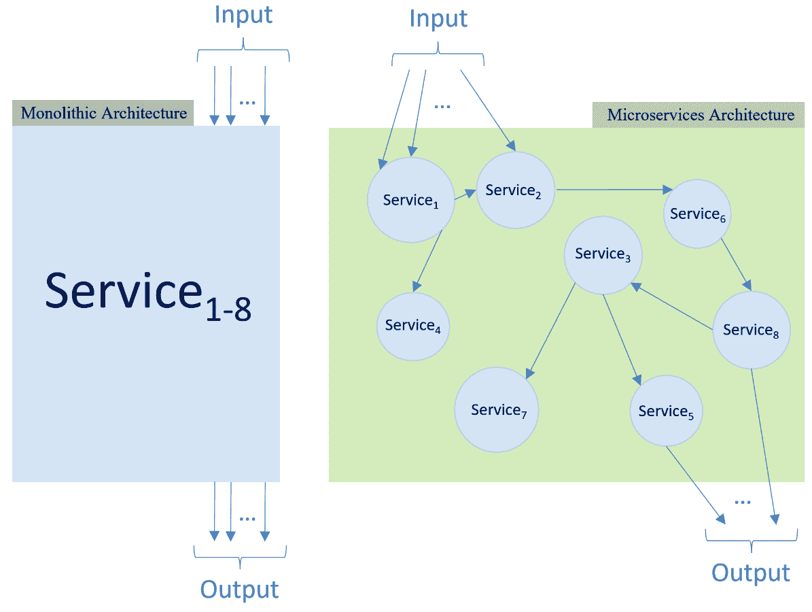

图 1.5：单体架构与微服务系统对比

在单体架构的应用程序中，所有功能都被封装在应用程序本身中。在 MSA 中，这些功能是分别开发、打包和部署的。因此，我们可以在多个地点的本地基础设施、公共云或混合云模式下在本地和云之间运行这些服务。

在单体系统中，由于紧密耦合，同步不同的系统功能变化是开发和运营的噩梦。如果某个应用程序（无论什么原因）变得不稳定，它可能会使整个系统失败，而将系统恢复到稳定状态则变得非常痛苦。

然而，在微服务的情况下，由于每个微服务都是松散耦合的，更改和故障排除仅限于特定的微服务，只要微服务接口没有改变。

在单体架构的情况下，一大块代码很难管理和维护。它也难以理解，尤其是在大型组织中，多个开发者共同工作。

在许多情况下，例如员工流动，例如，开发者可能需要调试他人的代码，当应用程序是用一大块代码编写时，事情往往变得复杂，难以追踪和理解，也难以逆向工程和修复。代码维护成为一个严重的问题，而在微服务的情况下，这庞大的代码行被分解成更小的代码块，更容易阅读、理解、调试和修复，完全独立于系统的其他组件。

当单体架构需要代码更改时，对代码部分的单个更改可能需要更改应用程序的许多其他部分，因此，更改更新可能需要整个应用程序的重写和重新编译。

我们还可以将不同的应用程序一起打包到工作流程中，形成一个特定的服务，如之前在*图 1*中所示。4。

将复杂的应用程序分解成多个模块或微服务，每个在整个生态系统中执行特定功能，以实现更好的可扩展性、更高的可移植性和更高效的开发和运营，这是常识。

对于小型、简单和短期存在的系统，单体应用程序可能更适合您的组织，更容易设计和部署，开发成本更低，发布速度更快。随着业务需求的增长，MSA 成为一种更好的长期方法。

由于单体系统是紧密耦合的，不同系统功能之间不需要 API 通信；这显著降低了系统的安全面，降低了系统安全风险，并提高了系统的整体性能。

将单体和 MSA 之间的部署差异想象成经济型汽车和波音 787 之间的差异。汽车是更好的、更便宜、更快的工具，用于在相距 50 英里的两个城市之间旅行，无需在登机前在机场经历的安全检查。然而，随着距离的增加，开车变得更为麻烦。在 5000 英里时，波音 787 可能成为到达目的地的更好、更便宜、更快的途径，你可能会愿意忍受登机前必须经历的安全检查的麻烦。

以下是对单体和微服务应用程序的比较总结：

|  | **单体** | **MSA** |
| --- | --- | --- |
| 架构 | 高度自主。系统功能被分割成独立松散耦合的小代码块。 | 无自主性。系统功能全部紧密耦合成一个大的代码块。 |
| 可移植性 | 高度可移植 | 可移植性非常有限 |
| 可复用性 | 高度可复用 | 复用代码的能力非常有限 |
| 模块化和可扩展性 | 高度模块化和可扩展 | 模块化有限，难以扩展 |
| 初始 TTM | 高度依赖于单个系统服务的准备情况。代码复用越多，TTM 越短。如果系统微服务是从零开始设计和开发的，那么对于单体架构，TTM 通常会更长。 | 长期 TTM，尤其是在大型系统中。小型和简单系统中的 TTM 较短。 |
| 发布周期 | 非常短的发布周期，部署更改和补丁更新非常快 | 长期且通常非常耗时的发布周期和补丁更新 |
| 初始成本 | 通常较高。取决于系统大小。初始成本通过运营成本节省来抵消。 | 通常较低。在大型企业系统中，初始规模会更高。 |
| 运营成本 | 低。易于维护和操作。 | 高。难以维护和操作。 |
| 复杂性 | 高 | 低 |
| API 控制 | 高 | 低 |
| 数据结构一致性 | 去中心化数据库，因此数据一致性更难维护 | 集中式数据库，因此更容易在整个系统中维护数据一致性 |
| 性能 | 通常较低 | 通常较高 |
| 安全性 | 存在许多安全担忧 | 安全担忧较低 |
| 组织采纳 | 采纳难度取决于组织结构。需要采纳敏捷开发和 DevOps。可能需要进行组织转型，并且可能需要很长时间才能实现。 | 采纳容易。需要的组织转型最小——如果有的话。 |
| 容错性 | 通常较高 | 通常较低 |

表 1.1：单体系统和 MSA 系统之间差异的总结

在本节中，我们讨论了单体系统的不同方面；接下来，我们将介绍服务驱动架构和 EDA，以及如何在 MSA 中结合这些架构风格来解决之前讨论的一些 MSA 挑战。

# 服务驱动、EDA 和 MSA 混合模型架构

人们经常混淆微服务架构（MSA）和**服务驱动架构**（又称**面向服务架构**或**SOA**）。这两种架构类型都试图将单体架构系统分解成更小的服务。然而，在 MSA 中，系统服务的分解非常细粒度，将系统分解成非常精细的专业独立服务。在 SOA 中，系统服务的分解则是以领域级别为粗粒度。

所有领域，如以下图所示，共享相同的集中式数据库，并且实际上可能共享其他资源，从而在 MSA 中不存在的某些层面上产生耦合和系统依赖。数据存储是这两种架构风格的关键区别：

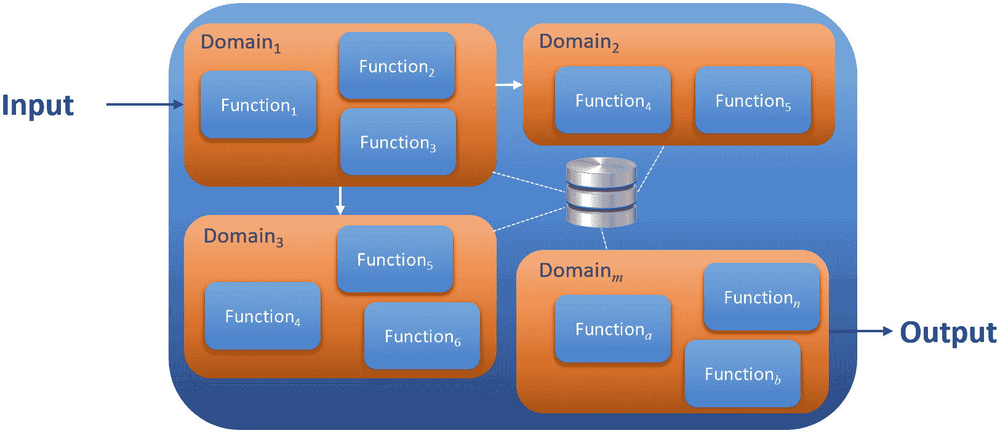

图 1.6：SOA 架构拆分为功能域

在前面讨论的简化 MSA 客户订单示例中，有八个不同的微服务。在 SOA 中类似的实现可能会将这些微服务构建在一起，并在单个域中紧密耦合。系统中的其他域可能是购物车处理、目录浏览和推荐等。

SOA 具有整体的企业视角，而在微服务中，开发关注的是功能本身，完全独立于微服务打算使用的企业系统。

EDA（事件驱动架构）是另一种广泛采用的架构风格。虽然 MSA（微服务架构）主要关注功能，而 SOA（面向服务架构）强调领域，EDA 则专注于系统事件。

EDA 通常与另一种主要系统架构（如 SOA 或 MSA）相辅相成。在 EDA 中，服务在其主要架构（MSA 或 SOA）确定的粒度级别上解耦，然后通过基于事件的事务相互通信。在我们的订单处理示例中，这些事件可能是**订单创建**、**订单取消**、**订单发货**等等。

为了在整个企业系统中维护事件同步和数据一致性，这些事件必须由消息代理处理。消息代理的唯一责任是确保将这些事件传递到系统中的不同服务。因此，它必须高度可用、高度响应、容错和可扩展，并且必须能够在高负载下运行。

当在 MSA 企业系统中采用 EDA 时，该情况下的消息代理将处理事件、API 调用以及 API 调用的响应。

当特定服务宕机或负载过重时，消息代理必须能够排队消息，并在该服务可用时传递该消息。

## ACID 事务

任何具有某种形式数据存储的系统都必须确保数据的完整性、可靠性和一致性。在 MSA 中，系统在工作流事务中存储和消费数据，并且为了确保整个 MSA 系统的完整性和可靠性，系统内部存储的数据必须符合称为**原子性、一致性、隔离性和持久性**（**ACID**）的某些原则：

+   **原子性**：全部或无操作事务。要么工作流中的所有事务都成功执行并提交，要么它们全部失败并取消。

+   **一致性**：任何服务中的数据更改都必须在整个系统中保持其完整性，或者被取消。

+   **隔离性**：每个数据事务都有其主权，不应影响或被系统中的其他事务影响。

+   **耐用性**：已提交的事务永久不变，即使在系统故障的情况下也是如此。

## Saga 模式

MSA 中的一个主要挑战是分布式事务，其中数据流跨越了系统中的多个微服务。这种跨服务的数据流会带来违反微服务自治的风险。数据必须在微服务本身内进行管理，完全隔离于系统中的任何其他服务。 

如果你再次查看我们的订单放置示例，你会发现客户数据（或其一部分）跨越了示例中的不同微服务，这可能会在 MSA 中创建不希望的依赖关系，并且应该不惜一切代价避免。

如果因为任何原因，**更新项目库存**服务失败，或者服务恰好报告说该商品不再可用怎么办？在这种情况下，系统需要回滚并更新所有单个服务的数据库，以确保工作流程的 ACID 事务。

**saga 模式**管理事务的整个工作流程。它将特定过程中执行的所有事务集合视为工作流程，并确保在该工作流程中的所有这些事务要么成功执行并提交，要么在因任何原因导致工作流程中断的情况下回滚，以维护系统中的数据一致性。

saga 参与者服务将包含工作流程中的**本地事务**部分。本地事务是在服务内部执行的事务，并在执行时产生一个事件来触发工作流程中的下一个本地事务。这些事务必须遵守 ACID 原则。如果这些本地事务中的任何一个失败，saga 服务将启动一系列**补偿事务**来回滚工作流程中已执行的本地事务引起的任何更改。

每个本地事务都应该有相应的补偿事务来执行，以回滚由本地事务引起的操作，如下面的图所示：

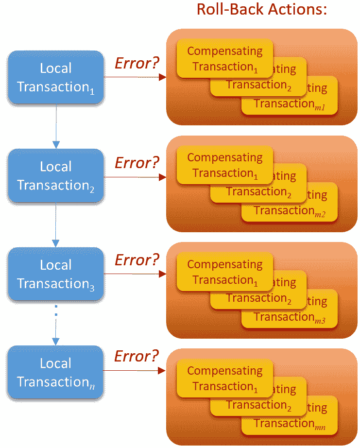

图 1.7：本地和补偿事务的处理

在 saga 服务中协调事务工作流程有两种方式：**编排**和**编排**。

在编排中，saga 参与者服务无需集中管理器即可交换事件。就像在 EDA 中一样，需要一个消息代理来处理服务之间的事件交换，如下面的图所示：

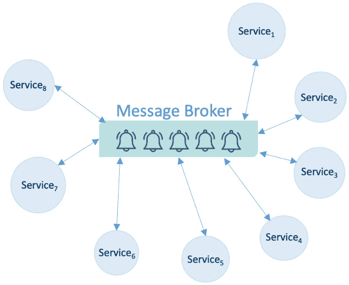

图 1.8：saga 服务中的编排

在编排中，引入了一个叙事模式集中控制器：一个**编排器**。工作流程在编排器中配置，编排器向每个叙事参与者服务发送请求，确定需要在哪个服务上执行本地事务，接收来自叙事参与者服务的事件，检查每个请求的状态，并通过执行必要的补偿事务来处理任何本地事务失败，如图下所示：

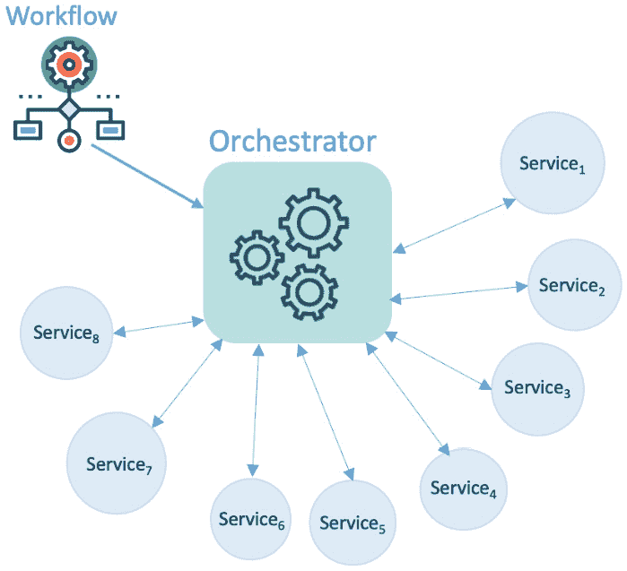

图 1.9：在叙事服务中的编排

编排器成为企业系统的“大脑”，是执行特定系统工作流程所需采取的所有步骤的唯一来源。因此，编排器必须以高度弹性和高度可用性的方式实现。

## 命令查询责任分离（CQRS）

在传统系统中，尤其是在单体应用中，通常会在后端部署一个公共的关系型数据库，并由前端应用程序访问。这个集中式数据库通过**创建-读取-更新-删除**（**CRUD**）操作进行访问。

在现代架构中，尤其是在应用规模扩大的情况下，这种传统实现会带来问题。由于在数据库上处理多个 CRUD 请求，表连接创建的可能性很高，从而导致数据库锁定。表锁定引入了延迟和资源竞争，并极大地影响了整体系统性能。

复杂查询有大量的表连接，可能会锁定表，直到查询完成并且数据库解锁表，阻止对它们的任何写入或更新操作。数据库读取操作通常比写入操作多出数倍，在重交易系统中，问题可能会成倍增加。

你可以在这里看到 CRUD 和 CQRS 模式的对比：

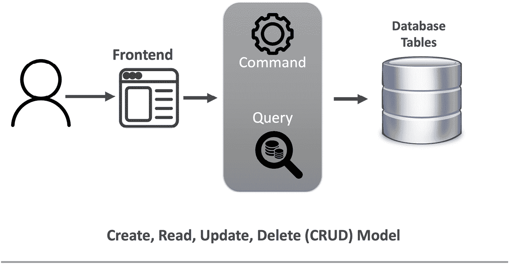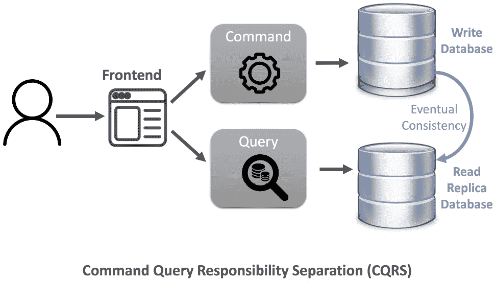

图 1.10：CRUD 与 CQRS 模式对比

使用 CQRS，你只需简单地将一个对象分成两个对象。因此，而不是在一个对象上同时进行命令和查询，我们将该对象分成两个对象——一个用于命令，一个用于查询。命令是一种改变对象状态的操作，而查询不会改变系统的状态，而是返回一个结果。

在我们的情况下，这里的对象是系统数据库，而这个数据库的分离可以是物理的也可以是逻辑的。尽管对于 CQRS 来说，拥有两个物理数据库是一种最佳实践，但你仍然可以使用相同的物理数据库来处理命令和查询。例如，你可以将数据库分成两个逻辑视图——一个用于命令，一个用于查询。

在 CQRS 中使用两个物理数据库时，会从主数据库创建一个副本。当然，副本需要与主数据库同步以保持数据一致性。同步可以通过实现 EDA（事件驱动架构）来完成，其中消息代理处理所有系统事件。副本订阅消息代理，每当主数据库向消息代理发布事件时，副本数据库将同步该特定更改。

主数据库实际更改的确切时间和该更改反映在副本中的时间之间会有延迟；在这段时间内，两个数据库不是 100%一致的，但最终会一致。在 CQRS 中，这种同步称为最终一致性同步。

在 MSA 中应用 CQRS 设计时，数据库处理延迟大大降低，因此各个服务之间的通信性能得到显著提升，从而提高了整体系统的性能。

在 MSA 中使用的数据库可以是任何类型，具体取决于该特定服务在 MSA 中的业务案例。它可能非常可能是**关系数据库**（**RDB**）、文档数据库、图数据库等等。NoSQL 数据库也是一个很好的选择。

我们之前已经从设计和架构的角度讨论了 MSA。运营 MSA 系统是整个组织在成功交付业务流程时必须考虑的另一个方面。在下一节中，我们将讨论 DevOps，它如何融入 MSA 生命周期，以及为什么它对于成功采用和运营 MSA 至关重要。

# MSA 中的 DevOps

DevOps 围绕软件开发和发布周期中的一系列操作指南。传统的开发工程师不再生活在他们封闭的环境中，所有焦点都是将功能规格转换为代码；相反，他们应该对应用程序有端到端的认识。

DevOps 工程师将负责监督、理解并参与整个管道，从整个应用程序计划开始，将业务功能转换为代码，构建应用程序，测试它，发布它，监控其操作，并返回必要的反馈以进行增强和更新。

这并不一定意味着 DevOps 工程师将负责所有开发和运营任务细节。应用程序团队中的个人责任可能会有所不同，以确保应用程序的**持续集成和持续部署**（**CI/CD**）管道的顺畅：

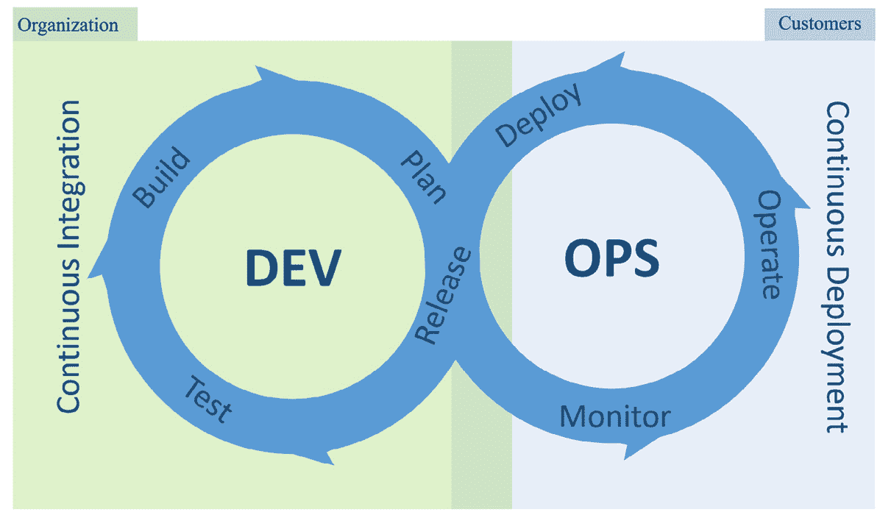

图 1.11：DevOps CI/CD 管道

DevOps 的主要目标之一是加快 CI/CD 管道的速度；这就是为什么在 DevOps 中非常重视自动化。自动化对于高效执行管道是必不可少的。

自动化可以在每个步骤中提供帮助。在 DevOps 中，许多作为您的质量保证计划一部分的测试用例都是自动化的，这显著加快了质量保证过程。您的应用程序的发布管理和监控也是自动化的，以提供高可见性、持续学习和在需要时快速修复。所有这些都将帮助组织提高生产力、可预测性和可扩展性。

DevOps 是对应用开发和管理的整体视角。它不仅仅是为开发团队或运维团队采用的功能；相反，整个组织都应该采用它。因此，组织结构以及组织的愿景和目标与从传统软件开发方式转变所需的程序和功能变化相一致是至关重要的。

只为了给您一个关于传统和 DevOps 模型在应用开发和发布周期方面差异的概览，请查看以下比较表格：

|  | **传统** | **DevOps** |
| --- | --- | --- |
| 规划 | 数月由于应用程序规模大且不同应用程序组件之间紧密耦合，规划时间较长 | 天到几周由于应用程序被分解成小型独立松散耦合的服务，规划时间非常短 |
| 开发 | 数月 | 天到几周，在补丁和修复的情况下甚至更短 |
| 测试 | 周到数月主要是手动密集型的质量保证用例测试，有时可能会危及测试结果的可信度 | 天主要是自动化的质量保证用例执行，为应用程序带来高可靠性 |
| 发布、部署 | 天通常需要大量手动工作，更容易受到人为错误的影响 | 小时主要是自动化的 |
| 运营、监控 | 指标报告主要是手动提取和分析 | 指标自动监控和分析，甚至可以在几秒钟内解决问题。此外，**机器学习**（**ML**）工具可以进一步优化操作。 |

表 1.2：传统运维风格与 DevOps 对比

在传统的开发环境中，您需要编写、维护和更改一大块代码。由于代码量很大，发布周期长是正常的，只有在需要主要更改或高严重性修复时，才可行地部署补丁或新版本，如下面的图所示：

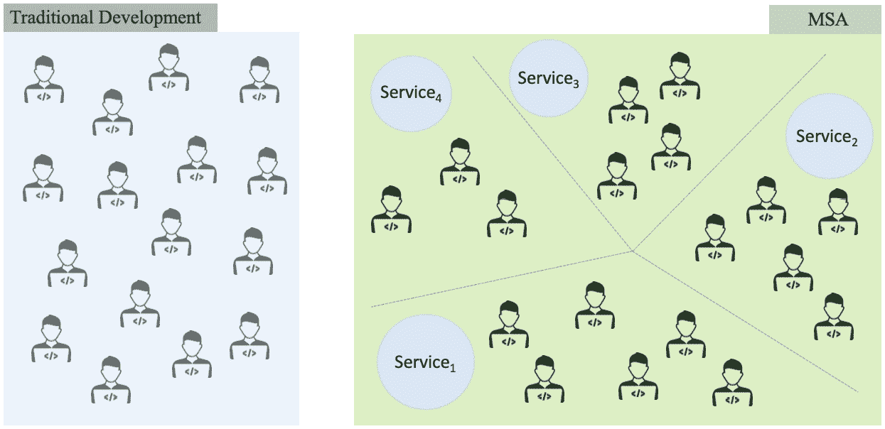

图 1.12：传统开发环境与 MSA DevOps 对比

在 MSA 中，团队根据不功能的应用程序进行划分。那块大代码被拆分成一系列更小的代码（微服务），由于团队独立工作，每个团队专注于特定的微服务，因此开发和发布周期要短得多。

类似地，在 DevOps 中，应用程序被分解成更小的部分以实现 CI/CD 管道，这使得 DevOps 成为适合 MSA 的完美模型。

## 为什么是 ML？

在您的 MSA 企业系统中使用 ML 工具和算法可以进一步增强和加速您的 DevOps CI/CD 管道。有了 ML，您可以在测试中找到模式，监控管道的阶段，自动分析故障可能发生的地方，并在可能的情况下提出解决方案或自动修复操作问题。

ML 可以大大缩短您的 MSA 企业系统的 TTM（Time to Market），并使其更加智能、自我修复、弹性好、易于支持。

在本书中，我们将讨论机器学习（ML）的两个方面：首先，我们将详细解释如何将 CI/CD 管道智能添加到您的 MSA 企业系统中，其次，我们将探讨如何考虑 MSA 构建一个 ML 企业系统：

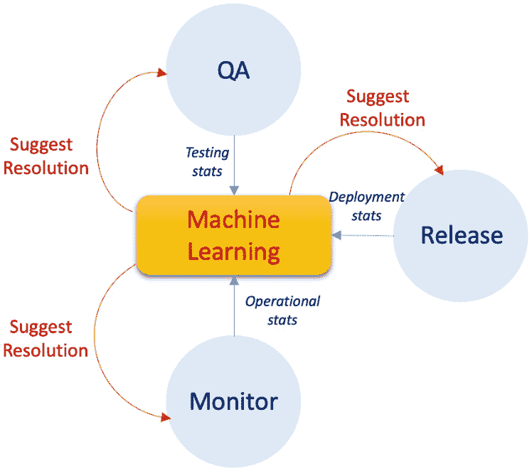

图 1.13：在 CI/CD 管道中使用 ML

# 摘要

在本章中，我们介绍了 MSA 的概念以及 MSA 与传统的单体架构的不同之处。到目前为止，您也应该对 MSA 的优势以及组织在采用 MSA 时可能遇到的挑战有清晰的理解。

我们还涵盖了设计 MSA 时需要考虑的关键概念，如 ACID、saga 模式以及 CQRS。所有这些概念对于克服同步挑战和保持微服务匿名性都是必不可少的。

我们现在理解了 DevOps 的基本知识以及为什么它在 MSA 设计、部署和运营中很重要，以及 ML 在 MSA 企业系统中的集成如何有助于增强系统运营。

在下一章中，我们将介绍组织从运行传统的单体系统过渡到 MSA 系统时追求的常见方法。我们将讨论如何将现有系统分解成服务，这些服务构成了新的 MSA 企业系统。
