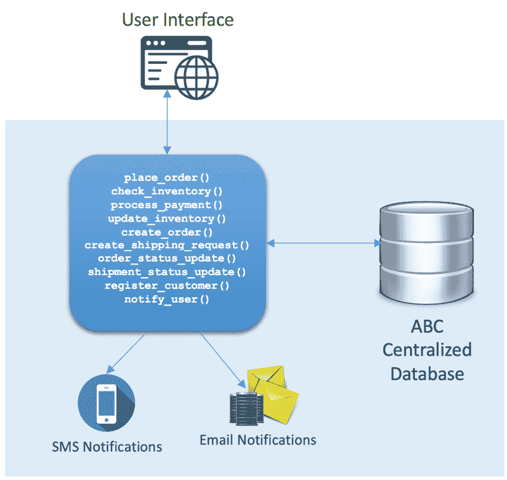
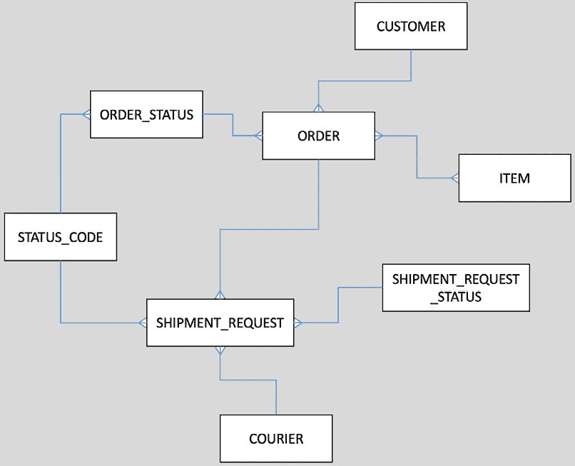
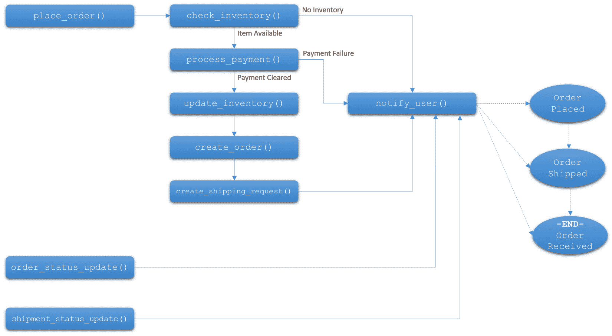
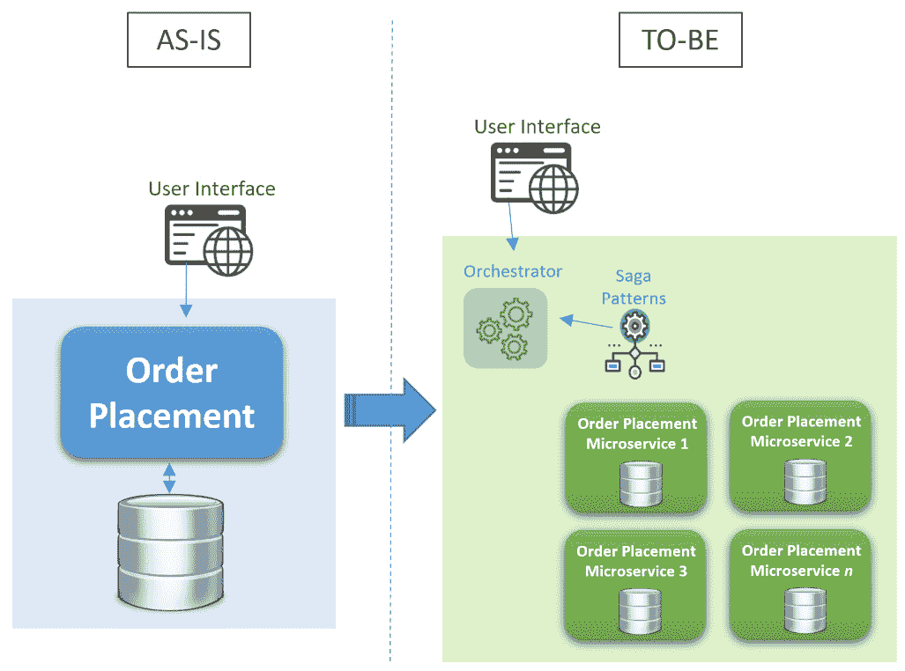
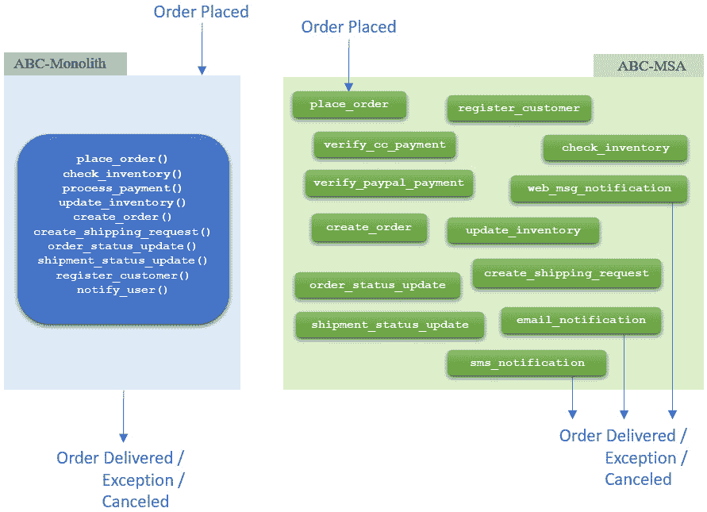
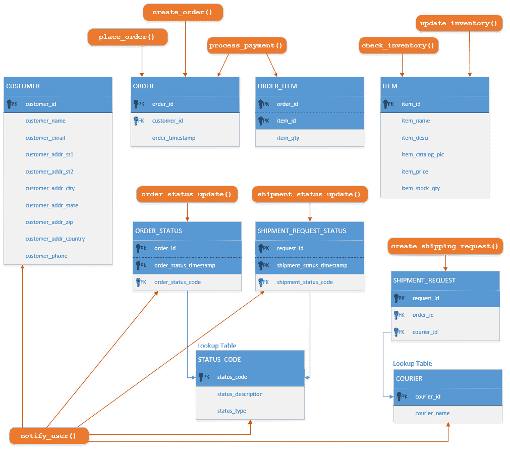
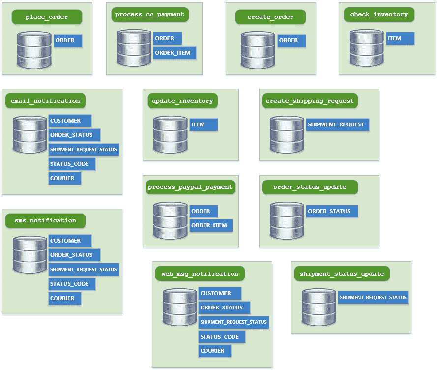
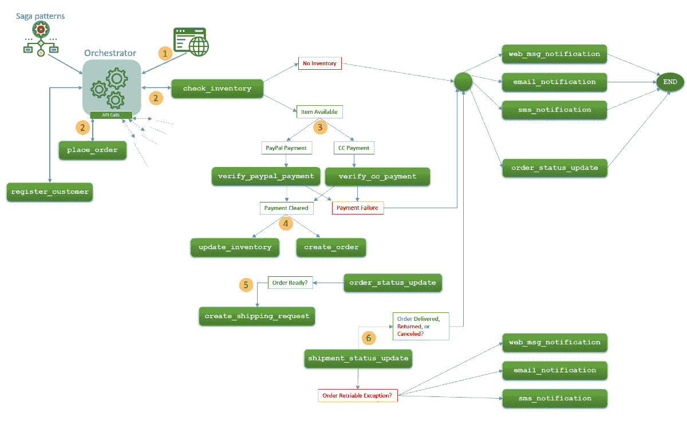
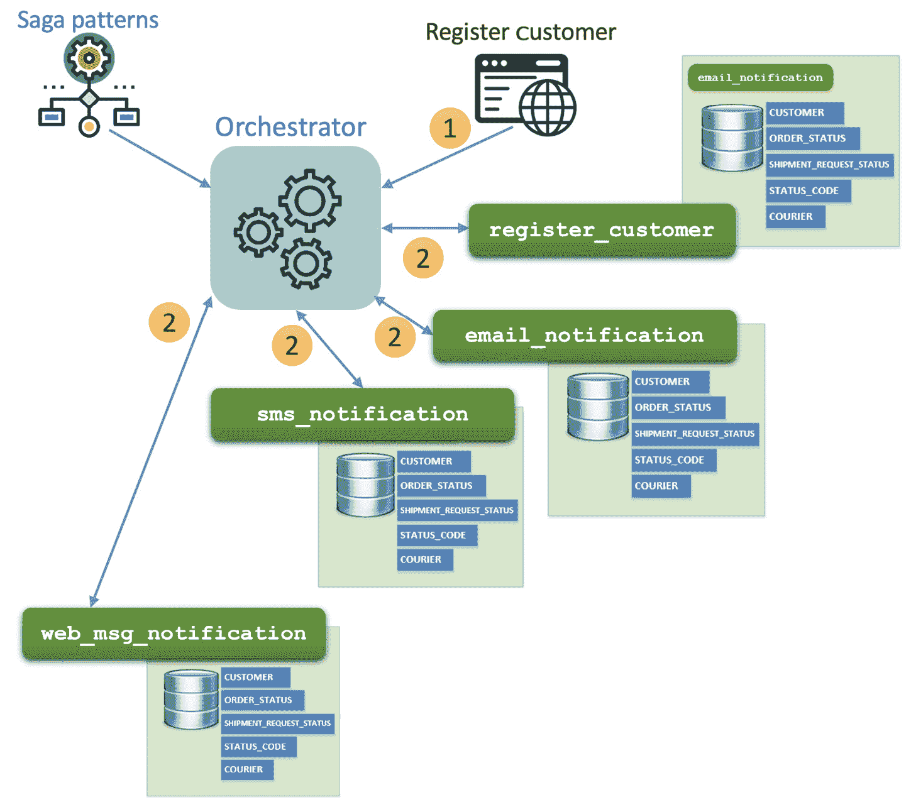
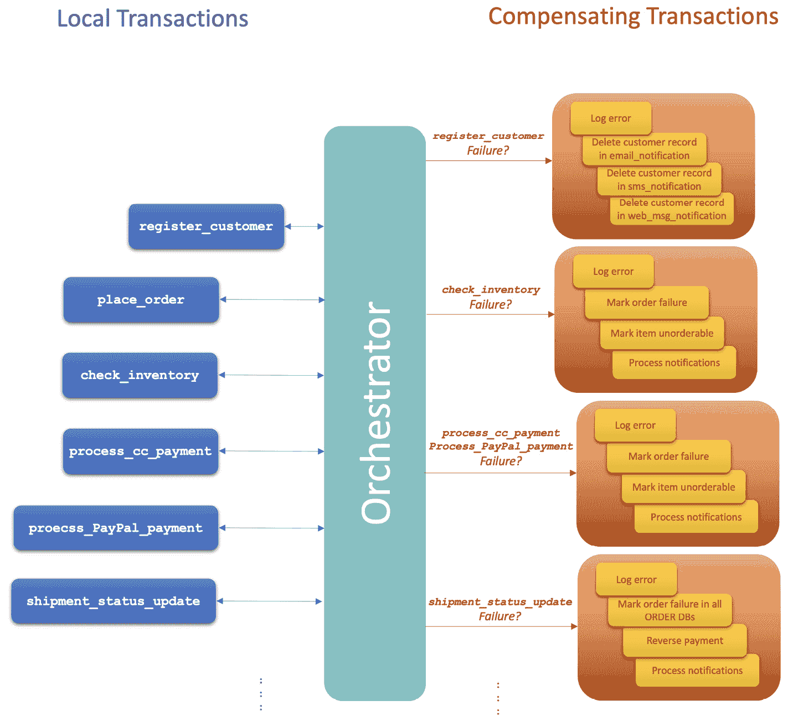

# 重构单体

现在我们已经决定 MSA 是我们组织正确的架构风格，接下来是什么？

在 Kong Inc.最近发布的报告《2022 年 API 与微服务连接性报告》中，75%的组织缺乏创新和技术采用。

对一个能够快速响应客户和市场需求的 IT 系统的需求从未如此之高。单体应用程序无法再应对快速的市场更新和需求。这就是组织寻求更新其 IT 系统以保持业务运营的主要原因之一。

MSA 是灵活和可靠的企业系统的主要推动者。因此，从单体架构过渡到 MSA 对于现代化组织的 IT 系统变得至关重要。

在本章中，我们将讨论如何将现有运行中的单体应用程序的业务需求分解为微服务，以及过渡到 MSA 应用程序所需的步骤。

在我们浏览本章内容时，我们将涵盖以下领域：

+   识别系统的微服务

+   ABC 单体

+   功能分解

+   数据分解

+   请求分解

# 识别系统的微服务

不论是现有系统的棕色地带还是绿色地带企业系统实施，我们仍然需要尽可能细致地将业务需求分解为基本功能。这将有助于我们识别每个微服务并将其成功集成到我们的企业系统中。

在现有系统中，业务和系统需求已经被识别和实现。然而，根据新的业务标准、变化和要求，它们可能需要被重新审视和更新。

将您的应用程序重构为简单服务的目标是形成高度细粒度的功能，这些功能最终将被构建（或获取）为微服务。您很可能在从单体系统中提取的一些功能之外，在新的 MSA 中添加新功能。

因此，我们将迁移过程分为以下高级步骤：

1.  定义待 MSA 系统和构建该 MSA 所需的功能。

1.  确定在当前单体系统中哪些现有功能将在新的 MSA 中重用，并作为微服务实现。

1.  确定现有要重用的功能和需要达到待 MSA 系统所需的功能之间的差异。这些是新 MSA 系统中要实现的新功能。

1.  从步骤 3 中确定的功能列表中，确定哪些功能将作为内部微服务开发，哪些可以通过第三方获取。

使用以功能驱动的分解方法来分解单体是一个好的起点；然而，仅使用这种方法是不够的。由于数据存储在单体中是集中的，因此在维护微服务的自主性时，数据依赖仍然是一个很大的问题。

单体中不同功能之间的交互是另一个关注点。我们需要调查函数调用是如何被处理和处理的，这些功能之间共享了什么数据，以及返回了什么数据。

在重构过程中检查单体系统的功能、数据和函数调用（请求）对于维护微服务的自治性和实现期望的粒度级别至关重要。

重要注意事项

请记住，在整个单体分解过程中，我们必须维护微服务的自治原则。过多的微服务会导致 **Nano-service 反模式** 效应，而微服务过少则仍然会使你的系统面临与单体系统相同的问题。

Nano-service 反模式对大多数系统的操作产生了过多的期望，这反过来又可能进一步复杂化你的 MSA 系统，并导致稳定性降低、可靠性下降和其他系统性能问题。

重要注意事项

作为一般规则，应用 **共同封闭原则**，即由于相同原因而更改的微服务最好打包在单个微服务中。

为了更好地解释单体向 MSA 的转换过程，在接下来的章节中，我们将设计一个简单的假设单体系统，使用已经提到的系统分解三个阶段来分解系统，构建不同的微服务，然后将它们组织起来构建 MSA。

# ABC 单块

ABC 是一个简化的假设产品订购单体系统，专门用于演示将单体应用程序重构为 MSA 所需的过程和步骤。我们将在这本书中使用这个 ABC 系统来演示如何应用概念和方法的一些示例。

请注意，我们仅为了演示目的而将 ABC-Monolith 系统组合在一起，我们的目标不是讨论如何更好地设计或结构化 ABC-Monolith。我们更关注 ABC-Monolith 系统重构的过程本身。

在 ABC-Monolith 中，用户可以从现有的产品目录下订单并跟踪订单的运输状态。为了简化，所有销售均为最终销售，产品不能退货。

系统将能够处理订单支付，为订单分配运输快递，并跟踪所有订单和运输更新。

下面的图显示了 ABC-Monolith 的高级架构。用户门户用于将项目添加到购物车，然后将订单详情发送到 ABC-Monolith。ABC-Monolith 有不同的紧密耦合功能与集中式数据库，所有这些都是为了处理从支付到交付的订单。在整个订单履行过程中，用户会收到所有订单和运输更新的通知。

图 2.1：ABC-Monolith 架构

为了进一步了解单体，我们将通过讨论现有单体的函数、单体数据库结构和订单放置过程的流程来回顾系统的当前状态。我们将通过比较当前状态和预期状态来结束本节。

## ABC-Monolith 的当前函数

首先理解单体中实现了哪些当前函数以及它们在整体系统中的作用是至关重要的。以下表格列出了我们稍后需要在系统重构中考虑的系统函数：

| 函数 | 描述 |
| --- | --- |
| `place_order()` | 创建包含所有订单信息的记录，并将订单标记为“待处理”，等待订单放置过程的其余部分。 |
| `check_inventory()` | 检查已放置订单中项目的可用性。 |
| `process_payment()` | 验证订单总金额的支付。如果支付未完成，将返回错误代码。 |
| `update_inventory()` | 一旦订单得到验证并且支付成功处理，应相应地更新项目库存。 |
| `create_order()` | 订单现在已成功处理；是时候更改订单状态并启动订单准备过程（包装等）。 |
| `create_shipping_request()` | 启动订单运输请求，并通知快递员有可运输的订单。 |
| `order_status_update()` | 一个用于更新订单状态并记录任何更改（如准备、运输、异常、已接收等）的函数。 |
| `shipment_status_update()` | 一个用于更新运输状态并记录任何更改（如待取货、已取货、在途中、异常、已接收等）的函数。 |
| `notify_user()` | 通知用户任何关于已放置订单的更改或更新。 |
| `register_customer()` | 一个使用全名、地址、电话和其他详细信息创建客户记录信息的函数。 |

表 2.1：ABC-Monolith 函数列表

在前面的表中，我们专注于描述函数本身的作用，而不考虑参数传递的方式或返回值。

## ABC-Monolith 的数据库

单体中识别的所有函数都共享一个集中式数据库。以下是被函数访问的数据库表：

| 数据库表 | 描述 |
| --- | --- |
| `CUSTOMER` | 存储所有客户信息的表，如姓名、电子邮件和电话。 |
| `ITEM` | 产品信息在目录中。产品信息包括产品名称、价格和库存数量。 |
| `ORDER` | 订单信息。 |
| `ORDER_ITEM` | `ORDER`和`ITEM`表之间多对多关系规范化的表。 |
| `ORDER_STATUS` | 每个已放置订单的状态，并参考`status_code`。 |
| `STATUS_CODE` | 订单和运输状态代码的查找表。 |
| `COURIER` | 运输快递信息，包括快递名称、联系方式等。 |
| `SHIPMENT_REQUEST` | 订单放置的所有运输请求列表。 |
| `SHIPMENT_REQUEST_STATUS` | 每个运输请求的状态，包含对`status_code`的引用。 |

表 2.2：ABC-Monolith 数据库表列表

下面的内容是 ABC 的**实体关系图**（**ERD**）。请注意，我们需要创建**ORDER_ITEM**规范化表来分解**ORDER**和**ITEM**表之间的多对多关系：

图 2.2：ABC-Monolith 的实体关系图

请记住，单体应用中的一些功能需要完全的读写访问特定表，并访问表中所有字段，而其他一些功能只需要访问表中的特定字段。这些信息在系统重构中非常重要。

在下一节中，我们将讨论工作流程以识别 ABC-Monolith 的当前状态（As-Is）并确定我们如何过渡到待实现状态（To-Be）。除了工作流程信息外，功能数据库访问需求将帮助我们重构单体数据库，将其分解为每个微服务的独立 MSA 数据库。

## 这是 ABC 的工作流程和当前功能调用

我们目前已知在单体应用中使用了哪些功能以及单体数据库的结构是如何组织的。下一步是检查订单放置的工作流程：

图 2.3：ABC-Monolith 的功能请求/工作流程

如前所述的工作流程图所示，各个功能都是顺序执行的。由于这是一个紧密耦合的系统，预期不会有同步问题，因此不需要编排。

然而，当我们朝着 ABC-MSA 迈进时，服务的解耦产生了在特定顺序中管理这些服务执行的需要。

下面的图中展示了 ABC 的当前状态（As-Is）和待实现状态（To-Be）。在当前状态（As-Is）中不需要集中管理；然而，在待实现状态中引入了一个编排器组件来管理服务之间的流程。

在待实现状态下，每个单独的服务都有一个专门的数据库，如图所示。相反，在当前状态（As-Is）中，数据库是集中的。

图 2.4：ABC 的当前状态（As-Is）和待实现状态（To-Be）

既然我们已经了解了当前的 ABC-Monolith 是如何组织的，以及当前状态（As-Is）和待实现状态（To-Be）是什么，那么现在是时候开始 ABC-Monolith 的重构过程，以转化为 ABC-MSA。

我们将分三个阶段重构单体应用。首先，我们将分解单体功能并将这些功能映射到微服务上。然后，我们将分解数据以查看如何设计各个数据库。最后，从单体应用的工作流程中，我们将分析功能请求，并据此构建我们的 MSA 叙事。

# 功能分解

重构 ABC 单体应用的第一步是根据我们之前确定的应用系统功能创建微服务。这是现有功能和微服务之间的一种直接映射。

关键点在于，仅通过单独查看每个函数，而不考虑任何函数调用或数据连接，你在函数分解中需要尽可能细化。

乍一看，`notify_user()` 函数对于一个微服务来说做了太多事情，包括显示网络用户消息状态/更新，通过电子邮件通知用户，以及/或者通过短信通知用户。每个这些功能都可以有自己的规则、设计、问题和关注点。从微服务架构（MSA）的角度来看，将 `notify_user()` 函数拆分为三个函数是一个更好的方法，以实现关注点的分离。

因此，我们将 `notify_user()` 函数拆分为一个处理网络消息和通知的函数，一个处理电子邮件通知的函数，以及一个处理短信消息通知的函数：

+   `web_msg_notification()`

+   `email_notification()`

+   `sms_notification()`

同样，`process_payment()` 函数也可以拆分为两个不同的、更细粒度的函数，一个用于处理直接信用卡支付，另一个用于处理 PayPal 支付：

+   `verify_cc_payment()`

+   `verify_paypal_payment()`

以下图表显示了 ABC-Monolith 目前的拆分情况。我们还没有研究系统函数之间是如何相互作用的。函数交互和整体订单履行的流程将在稍后的阶段处理。

图 2.5：ABC-Monolith 功能分解

在这一点上，我们对目前的粒度水平感到满意，并准备检查数据库表是如何被访问的，以查看是否需要进一步的分解。

# 数据分解

在这个阶段，我们需要查看每个函数是如何访问数据库的，以及访问了哪些表，甚至数据库表的哪些部分。

以下图表显示了 ABC-Monolith 函数访问数据库的哪些部分。确切知道哪个函数访问了哪些表以及为什么是至关重要的。这将帮助我们识别数据库依赖关系，以便稍后消除这些依赖关系，并将集中的 ABC-Monolith 数据库拆分为单独的数据存储，每个数据存储都专门用于每个微服务。

图 2.6：ABC-Monolith 数据库访问

我们仍然受限于微服务自治规则。在图表和这个重构阶段中具有挑战性的部分是共享的表。在两个微服务之间共享一个表会创建违反自治规则的耦合。另一方面，在多个微服务中创建表的多个副本将导致严重的数据一致性问题。那么，我们如何解决这个难题呢？

例如，记住`ORDER`表，它在 ABC-MSA 系统的`place_order()`、`create_order()`和`process_payment()`服务中。对于`check_inventory()`、`update_inventory()`等，采取类似的方法。

因此，考虑到叙事模式，让我们重新审视前面图表中显示的 ABC-Monolith 数据库访问，为 ABC-MSA 系统中的服务构建一个新的数据库访问图表。

协调数据事务有两种方式，即协调和编排。在协调中，ABC-MSA 叙事参与者服务将不得不自行协调数据事务。在编排中，一个集中的编排器执行协调过程并处理所有工作流事务。

当然，我们可以选择任何一种协调方法，但在我们这个例子中，我们会认为编排比协调提供了更好的解耦模型。因此，为了保持我们的例子简单，我们将使用编排来构建我们的 ABC-MSA 叙事模式。

下面的图表显示了 ABC-MSA 服务数据库访问。如图所示，系统中已经复制了一些数据库表。在下一节中，我们将使用叙事模式来维护复制表之间的数据一致性。

图 2.7：ABC-MSA 数据库访问

我们注意到在其他服务中，例如`notify_user()`函数可能根本不是一个好主意。在这些不同的服务之间，你应该只看到小的数据库访问相似性，而不是完全相同的数据库。在现实场景中，我们最好将这三个服务合并成一个最初的服务。

类似地，在现实场景中，`process_payment()`函数可能被映射到包含整体清除支付的单个服务，无论它是信用卡、PayPal 还是任何其他支付形式。为了演示目的，我们将`notify_user()`和`process_payment()`分别拆分为三个和两个不同的服务。

到目前为止，我们已经能够从 ABC-Monolith 函数构建 ABC-MSA 的微服务，识别单体中的数据访问，并将单体分解为独立的微服务，每个微服务都有自己的数据库。在下一节中，我们将更多地关注如何通过查看新 ABC-MSA 系统中服务请求的编排来确保微服务的隔离和关注点分离。

# 请求分解

ABC-Monolith 功能请求流程已经确定并显示在 *图 1**.3* 中。我们现在将看到这个流程在 ABC-MSA 中是如何工作的。

在 ABC-MSA 中，sagas 是在集中式协调器中编程和配置的。协调器将根据定义的工作流程以同步或异步的方式对 sagas 中的每个服务发起单独的 API 调用，并等待每个 API 调用的响应，以确定接下来要发起的其他 API 调用以及如何进行。

下面的图示显示了 ABC-MSA 中工作流程的形态。请注意，我们场景中的所有 API 调用都是从协调器发起的。如您从序列号中看到的那样，有一些 API 调用是并行发起的，而在其他情况下，协调器根据从先前执行的服务收到的响应来决定下一步的行动。

图 2.8：ABC-MSA 工作流程

ABC-MSA 工作流程图中的用户从网页界面启动订单履行过程，这将从协调器启动工作流程。协调器同时启动 **place_order** 和 **check_inventory** 服务。**place_order** 创建带有所有信息的订单，并将其状态标记为 **pending**，等待工作流程的其余部分处理。

**check_inventory** 服务检查已订购项目的库存，并根据项目是否可用发送 **true** 或 **false** 的响应。如果任何订购的项目不可用，则触发 **web_msg_notification**、**email_notification** 和 **sms_notification** 服务。

现在，这里有一个挑战：所有三个通知服务都需要访问 `CUSTOMER` 数据库以获取客户姓名、电子邮件地址、电话号码等。但是，为所有三个服务使用一个数据库会创建不希望的耦合，这会违反微服务自治原则。正如我们之前讨论的，我们应该在所有服务中创建该 `CUSTOMER` 数据库的副本，以避免服务耦合。但我们如何做到这一点呢？

图 2.9：在 MSA 中维护数据库一致性

`CUSTOMER` 数据库在编辑、创建或删除记录时主要由 `CUSTOMER` 数据库管理。

协调器需要等待来自所有四个服务的成功确认，`CUSTOMER` 数据库失败？你最终会得到数据不一致，这可能会成为以后的一个严重问题。

因此，所有参与 sagas 的本地事务都需要有一组补偿事务，以确保在执行事务过程中出现任何故障时能够回滚。在我们的示例中，协调器需要撤销对其他所有服务的 `CUSTOMER` 数据库的更新。

下面的图示展示了如何使用叙事模式回滚更新`CUSTOMER`数据库的失败。

图 2.10：为注册新客户信息和下订单进行补偿事务

# 摘要

在本章中，我们能够回顾将单体架构重构为微服务架构（MSA）的主要步骤，包括必要的步骤、需要考虑的主要事项以及实现的方法。简化的 ABC 单体系统是一个很好的例子；然而，随着系统变得更加复杂，工作流程变得更加复杂，数据和处理同步的挑战开始出现。

在*第一章*中，我们简要讨论了面临的挑战以及应用的方法来克服这些挑战。在下一章中，我们将开始将这种方法应用到我们试图重构的 ABC 系统上。

在下一章中，我们将讨论如何进一步维护微服务的自主性和 MSA 的稳定性，克服一些其他操作挑战，以及 API 网关、编排器和微服务聚合器的作用。
