# 机器学习系统设计

在上一章中，我们深入探讨了不同的机器学习概念以及创建这些模型所使用的包和库。利用这些信息，我们将开始讨论构建机器学习管道时的设计过程以及大多数机器学习管道中找到的不同组件。

在本章中，我们将涵盖以下领域：

+   机器学习系统组件

+   适配和转换接口

+   训练和提供接口

+   **编排**

# 机器学习系统组件

构建一个健壮的机器学习系统需要许多组成部分。从收集数据到将模型部署给用户，每个部分都在保持系统动态和可扩展性方面发挥着至关重要的作用。在这里，我们将简要讨论机器学习系统生命周期中的不同阶段以及它们所起的作用。这些阶段可以根据模型或应用进行编辑。

大多数机器学习系统包括以下阶段，其中一些阶段取决于业务需求：

+   **数据收集**

+   **数据预处理**

+   **模型训练**

+   **模型测试**

+   **模型提供**

实际上，构建机器学习系统的大部分时间都花在了数据上。这是决定你系统有效性的关键要素，因为模型依赖于训练期间使用的训练数据。就像人体一样，如果你给模型提供差的数据或数据不足，它将输出差的结果。

数据的第一部分是收集过程。理解应用和任务的目的是有助于决定如何收集数据以及收集哪些数据。然后我们确定我们想要预测的目标值，例如房屋价格或某种疾病的发病率。这些目标值可以是显式收集或隐式收集。当我们可以直接确定我们试图捕捉的变量的值时，目标变量是显式的，而隐式目标值是通过使用上下文数据来确定目标值。

根据任务的不同，我们通常将数据存储在数据库中（用于元数据或表格数据）如 MySQL 或云存储（用于图像、视频或音频）如 Amazon S3：

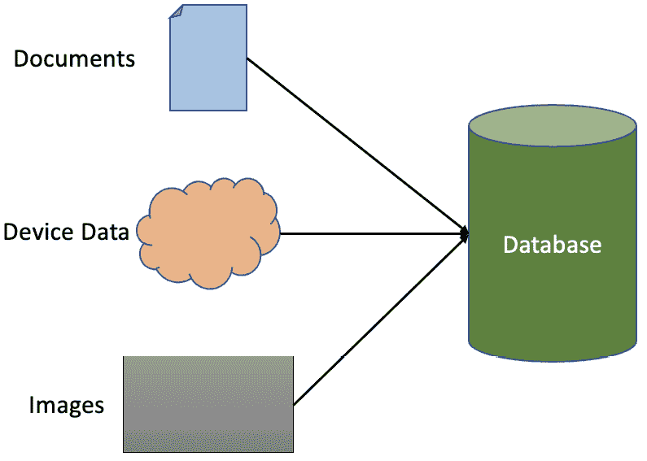

图 5.1：数据收集

一旦我们设置了持续的数据收集，我们必须制定一个数据清洗和处理的程序。我们收集的并非所有数据都是完美的。你总会发现缺失数据和某些异常值，这些可能会对我们的模型产生负面影响。无论你的模型多么直观，它都会在垃圾数据上表现不佳。

处理不干净数据的一些做法包括移除异常值、标准化某些特征，或者根据你收集的数据量来填补缺失数据。一旦数据通过了清理过程，下一步就是特征选择/工程过程。

当你的模型试图在其数据中找到关系时，理解你的数据包含的不同特征起着重要作用。**探索性数据分析**（**EDA**）是在理解你收集的数据及其结构时常用的过程。这有助于确定在模型中使用哪些特征。正如我们之前在*第四章*中提到的，当我们向模型中包含更多特征时，这允许它们映射到更复杂的问题。然而，添加过多的特征可能导致过拟合，因此研究对你模型最重要的特征非常重要。

虽然大多数机器学习模型可以在数据中找到模式和关系，但理解你收集的数据的最佳方式是通过解决你试图解决的问题的任务领域的专家。领域专家可以提供关于在创建模型时应关注哪些特征的最好见解。一些无监督机器学习模型，如 PCA 和 t-SNE，可以分组并找到为你的模型提供最有价值信息的特征。

重要提示

了解你试图解决的问题的领域知识是理解你的数据并确定用于训练机器学习模型的特征的最有效方式。

一旦你设置了收集和清理数据的流程，下一步就是创建和训练你的模型。多亏了大多数机器学习库，你可以导入预构建的模型，甚至可以使用已经训练好的模型的权重来应用于你自己的模型。在这里，常见的做法是使用不同的模型和技术来查看哪种能产生最佳结果，然后你可以从中选择最佳模型，并开始通过更新超参数来微调它。这个过程可能需要时间，具体取决于你使用的数据量。

测试你的模型是系统管道中的关键要素。根据应用的不同，一个糟糕的模型可能会对你的业务产生负面影响，并给你的用户带来糟糕的体验。为了避免这种情况，你需要确定模型要达到生产就绪状态所需满足的不同指标和阈值。如果模型无法满足这些期望，那么你需要回过头来理解模型的弱点，并在再次训练之前解决它们。

在对模型进行测试并获得稳定的结果后，你现在可以将模型部署到用户应用程序中。这因应用而异。从那时起，整个过程可以从开始处重新开始，即新数据被插入并遵循机器学习管道，以便根据用户行为动态增长：

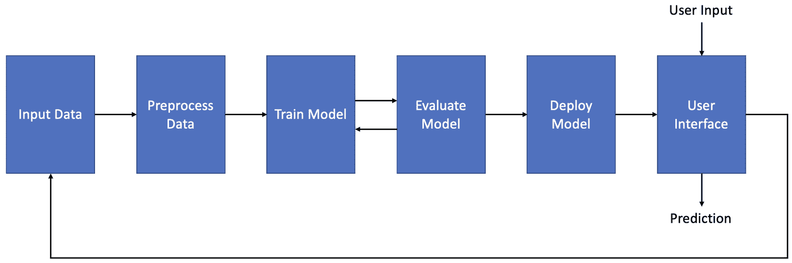

图 5.2：机器学习管道

在接下来的章节中，我们将探讨构成我们机器学习管道的不同接口的细节。

# 拟合和转换接口

现在我们已经了解了整个管道过程，我们将详细探讨构成机器学习系统的不同接口。大多数系统包括以下接口：

+   **拟合**

+   **转换**

+   **训练**

+   **服务**

当涉及到数据和创建模型时，我们会遇到拟合和转换接口。我们将首先查看转换接口。

## 转换

转换接口是将收集到的数据预处理的过程，以便模型能够正确训练并提取有意义的信息。

我们收集的数据通常会有缺失值或异常值，这可能会在我们的模型中引入偏差。为了消除这种偏差，我们可以应用某些技术来帮助消除数据中的偏斜，并产生有意义的机器学习模型。以下我们将学习的一些技术可以分为以下三种类型的转换：

+   **缩放**

+   **裁剪**

+   **对数**

对数转换是我们能应用到数据上的最常见和简单的转换技术。很多时候，我们的数据会偏向一个方向，这可能会引入偏差。为了帮助减轻这种偏斜分布，我们可以简单地应用对数函数到我们的数据上，这将使我们的数据更接近正态分布，从而使数据更加平衡。

我们可以通过以下代码执行这种转换：

```py
import numpy as np
dataframe_log = np.log(dataframe["House Price"])
```

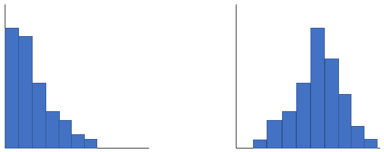

图 5.3：对偏斜数据进行对数转换

一旦应用了对数转换，我们就可以开始查看其他转换。我们可以使用的第二种转换是截断转换。我们使数据更符合正态分布的程度越高，效果越好，但我们可能会遇到可以扭曲数据的异常值。为了帮助减少异常值对我们数据的影响，我们可以应用分位数函数。人们最常用的分位数范围是 0.05 和 0.95 百分位数。这意味着任何低于 0.05 百分位数的数据将被四舍五入到下限，而任何高于 0.95 百分位数的数据将被四舍五入到上限。这使我们能够在减少异常值对模型影响的同时保留大部分数据。上下限也可以根据数据的分布进行修改。

此转换可以使用以下代码执行：

```py
from sklearn.preprocessing import QuantileTransformer
quantile = QuantileTransformer(output_distribution='normal', random_state=0)
x_clipped = quantile.fit_transform("House Price")
```

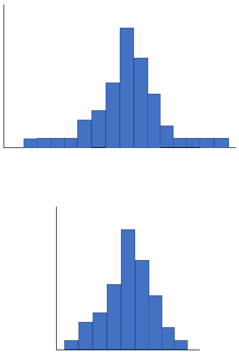

图 5.4：数据上的截断转换

最后一个主要转换技术是缩放转换。很多时候，我们收集的数据具有不同类型的指标和值，这可能会扭曲我们的数据并混淆我们的模型。例如，一个特征衡量公司的收入以百万为单位，而另一个特征衡量员工数量以千为单位，当使用这些特征来训练模型时，这种差异可能会使一个特征比另一个特征更受重视。为了防止这些问题，我们可以应用缩放转换，这些转换可以是以下类型：

+   **MinMax**

+   **Standard**

+   **Max Abs**

+   **Robust**

+   **单位向量**

MinMax 缩放器是最简单的缩放转换。当数据没有扭曲时，它效果最好。这种转换将数据缩放到 0 到 1 之间。可以使用以下公式进行计算：

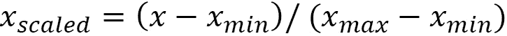

我们可以使用以下代码执行此缩放转换：

```py
from sklearn.preprocessing import MinMaxScaler
scaler = MinMaxScaler()
x_scaled = scaler.fit_transform("House Price")
```

MaxAbs 缩放器与 MinMax 类似，但它不是将数据缩放到 0 到 1 之间，而是将数据缩放到-1 到 1 之间。可以使用以下公式进行计算：

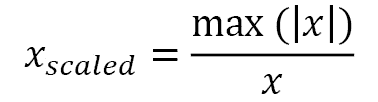

我们可以使用以下代码执行此缩放转换：

```py
from sklearn.preprocessing import MaxAbsScaler
scaler = MaxAbsScaler()
x_scaled = scaler.fit_transform("House Price")
```

标准缩放器是另一种流行的缩放转换。与 MinMax 缩放器不同，它不是使用最小值和最大值，而是将数据缩放到均值是 0，标准差是 1。这种缩放器基于数据呈正态分布的假设。可以使用以下公式进行计算：

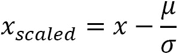

我们可以使用以下代码执行此缩放转换：

```py
from sklearn.preprocessing import StandardScaler
scaler = StandardScaler()
x_scaled = scaler.fit_transform("House Price")
```

MinMax、MaxAbs 和 Standard 缩放器虽然功能强大，但可能会受到异常值和偏斜分布的影响。为了解决这个问题，我们可以使用 Robust 缩放器。而不是使用均值或最大值，这个缩放器通过从数据中移除中位数，然后使用四分位距缩放数据来工作。可以使用以下公式进行计算：

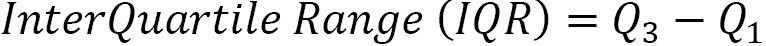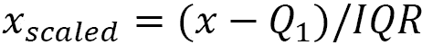

我们可以使用以下代码执行这种缩放转换：

```py
from sklearn.preprocessing import RobustScalar
scaler = RobustScalar()
x_scaled = scaler.fit_transform("House Price")
```

最后，我们有单位向量标量，也称为归一化器。虽然其他标量函数是基于列工作的，但这个标量是基于行进行归一化的。它使用 MinMax 标量公式，将正值转换为 0 到 1 之间，负值转换为-1 到 1 之间。执行这种缩放有两种方式：

+   L1 范数 – 列中的值被转换，使得行中它们绝对值的和等于 1

+   L2 范数 – 列中的值被平方并相加，使得行中它们绝对值的和等于 1

我们可以使用以下代码执行这种缩放转换：

```py
from sklearn.preprocessing import Normalizer
scaler = Normalizer()
x_scaled = scaler.fit_transform("House Price")
```

还有许多其他的缩放和转换技术，但这些都是最常用的，因为它们提供稳定和一致的结果。

重要提示

大部分开发过程发生在转换阶段。了解数据的结构和分布有助于决定你将在数据上执行哪些转换方法。无论你的模型多么先进，结构不良的数据都会产生弱模型。

## 拟合

现在，我们将查看拟合接口。这个接口指的是创建将在训练中使用的机器学习模型的过程。凭借今天的技术，创建用于机器学习管道训练的模型不需要太多的工作或努力。已经有预构建的模型可以导入和使用，适用于任何类型的应用。

这里有一个使用 scikit-learn 库创建 KNN 分类模型的小例子。

首先，我们导入所有必需的库：

```py
from sklearn.model_selection import train_test_split
from sklearn.preprocessing import StandardScaler
from sklearn.neighbors import KneighborsClassifier
from sklearn.datasets import load_iris
```

然后，我们导入数据，将数据分为训练和测试批次，并应用标准标量转换：

```py
iris = load_iris()
X = iris.data
y = iris.target
X_train, X_test, y_train, y_test = train_test_split(X, y, test_size=0.30)
scaler = StandardScaler()
scaler.fit(X_train)
X_train = scaler.transform(X_train)
X_test = scaler.transform(X_test)
```

然后，我们初始化一个 k = `3`的 KNN 模型，并在该模型上进行训练：

```py
classifier = KNeighborsClassifier(n_neighbors=3)
classifier.fit(X_train, y_train)
```

使用拟合接口的主要工作是设置将在机器学习管道的训练阶段使用的模型。由于导入多个预构建模型很简单，因此通常的做法是导入多种类型的机器学习模型，并一次性训练所有这些模型。这样，我们能够测试不同类型的模型，并确定哪一种表现最好。一旦我们决定使用哪种模型，我们就可以开始尝试不同的超参数，以进一步微调我们的模型。

# 训练和提供接口

转换和拟合接口负责准备数据和设置我们的机器学习模型以供管道使用。现在我们已经预处理了数据，我们需要开始考虑如何开始实际的训练过程，并将我们的训练模型部署给客户使用。

## 训练

现在我们已经预处理了数据并创建了模型，我们可以开始训练过程。这个阶段可能会因训练数据的品质或训练过程中使用的模型类型而有所不同。

一旦我们预处理了数据，我们需要将数据集分为训练集和测试集。这样做是为了防止过拟合。我们需要模型能够泛化数据，而使用所有数据进行训练将违背初衷。

常见的做法是将数据分为 70%的训练集和 30%的测试集。这样，模型就有足够的数据来学习关系，并使用测试数据来自我纠正训练过程。

有一种更稳健的数据分割方法，称为**K-Fold 交叉验证**。这种方法在可能没有足够训练数据的情况下效果最好。为了执行这个过程，我们将数据分成*k*个子集，然后我们在除了一个以外的所有子集上训练。然后我们迭代这个过程，选择一个新的子集作为测试数据。最后，我们通过平均每个迭代的指标来衡量模型的性能。这样，我们可以使用所有数据来训练和测试，而不会遗漏任何可能对学习数据有用的重要特征。

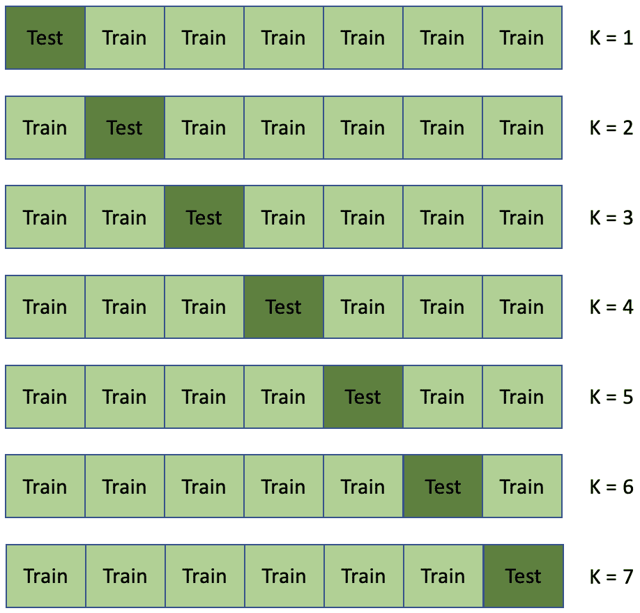

图 5.5：K-Cross Validation

一旦我们分割了数据，接下来就是实际的训练部分。这部分就像设置用于训练模型的函数一样简单。这部分取决于你使用的库类型以及它提供的不同 API。

我们可以使用 scikit-learn 库创建一个简单的例子：

```py
from sklearn.datasets import load_diabetes
from sklearn.model_selection import train_test_split
from sklearn.linear_model import LinearRegression
from sklearn import metrics
diabetes = load_diabetes()
features = diabetes.data
target = diabetes.target
x_train, x_test, y_train, y_test = train_test_split(features, target, test_size=0.3, random_state=1)
linear_regression = LinearRegression()
linear_regression.fit(features, target)
y_pred = linear_regression.predict(x_test)
print("Linear Regression model MSE:", metrics.mean_squared_error(y_test, y_pred))
```

训练完模型后，你必须衡量其性能。为了防止性能差的模型被部署给用户，通常的做法是衡量某些指标并设置某些阈值，只有当模型达到这些阈值时，才被认为适合生产。

根据你创建的模型类型，某些指标需要被评估。例如，回归模型通常会查看以下指标：

+   **平均绝对** **误差** (**MAE**)

+   **均方** **误差** (**MSE**)

+   **均方根** **误差** (**RMSE**)

+   **决定系数** (**R2**)

对于分类模型，你需要监控以下指标以确定模型的强度：

+   准确率

+   精确率和召回率

+   F1 分数

+   **受试者工作特征曲线下面积** (**AUROC**)

在确定适用于你正在训练的模型的阈值时，拥有领域知识非常有帮助。在某些情况下，例如癌症检测模型，避免假阴性很重要，因此需要为模型可以自信使用的阈值设定更严格的限制。

重要提示

在部署模型之前，你需要确保模型适用于生产。设置模型需要通过的指标阈值是部署前验证模型的基本方法。如果模型未能通过这些标准，那么应该有一个流程来重新进行数据转换和模型训练阶段，直到它能够通过阈值。

## 服务

当涉及到服务我们的模型时，这取决于用户的需求，是开放的且灵活的。在大多数情况下，我们将模型部署到以下两种系统之一：

+   **模型服务**，即我们将模型作为 API 部署

+   **模型嵌入**，即我们直接将模型部署到应用程序或设备中

模型嵌入是部署模型最简单的方式。你创建一个包含你的模型的二进制文件，并将该文件嵌入到你的应用程序代码中。这种简单性在做出预测时提供了最佳的性能，但这也带来了代价。因为你直接将文件嵌入到应用程序中，所以很难扩展你的模型，因为你每次更新模型时都必须重新创建和重新上传文件。因此，这不被视为推荐的做法。

模型服务是当今市场上最常用的方法。应用程序和模型之间的这种分离使得开发者可以轻松地维护和更新模型，而无需更改应用程序本身。你只需创建一个用户可以访问以进行调用和预测的 API 服务。由于这种分离，你可以持续更新模型，而无需重新部署整个应用程序。

模型服务的一种替代方法是创建一个包含模型二进制文件的微服务，其他应用程序可以访问：

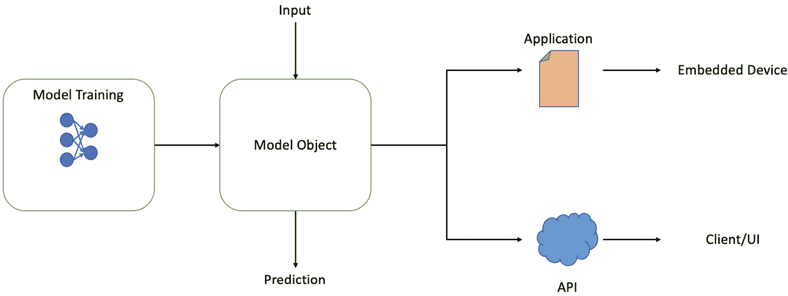

图 5.6：服务机器学习模型

更直观的一种方法是你创建自己的包或库，其中包括你训练的所有模型。这样，你可以通过允许多个应用程序访问你创建的不同模型来有效地进行扩展。

我们迄今为止所看到的一切都是构建简单机器学习管道所需的内容。虽然这对大多数应用来说都是可行的，但要实现动态性和健壮性，我们需要考虑编排以及它能为支持更高级的应用和问题提供什么。

# 编排

现在我们已经了解了不同的接口以及它们在机器学习管道中的作用，下一步是了解如何将所有这些整合成一个无缝的系统。为了理解整个系统，我们首先必须了解自动化和编排。

**自动化**指的是自动化小型或简单任务的过程，例如将文件上传到服务器或部署应用程序，而不需要人工干预。我们不必让人员执行这些重复性任务，而是可以编程我们的系统来处理这些简单任务，从而减少浪费的时间和资源。

由于管道的线性特性，这对大多数系统都很有用。这突出了自动化常见的局限性——缺乏灵活性。今天的大多数系统需要更动态的过程才能适应某些应用程序和流程，而自动化本身是不够的：

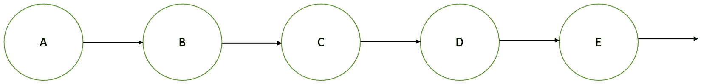

图 5.7：线性系统管道

这就是编排发挥作用的地方。“编排”是指配置和协调自动化任务以创建整个工作流程。我们可以根据一组特定的规则创建一个系统来执行某些工作或任务。由于用户决定系统需要针对某些情况采取哪些行动，因此创建一个全面编排工作流程需要一些规划和理解。

一个简单的例子是将应用程序部署给用户。系统中可能包含许多动态部分，例如以下内容：

+   连接到服务器

+   将特定文件上传到特定服务器

+   处理用户请求

+   在数据库中存储数据或日志

假设最近部署了更改后，应用程序出现了关键错误，这可能会使应用程序崩溃。系统管理员可以设置恢复和恢复系统的规则，例如回滚到稳定版本。由于系统能够自我恢复，开发者可以花更多的时间在开发上，而不是在恢复时处理开销。

根据某些结果，可能不需要执行所有任务。可能需要执行备份操作，或者系统需要通过不同的路径来维持稳定的工作流程。这样，系统可以适应其环境并自我维持，而无需太多的人工干预：

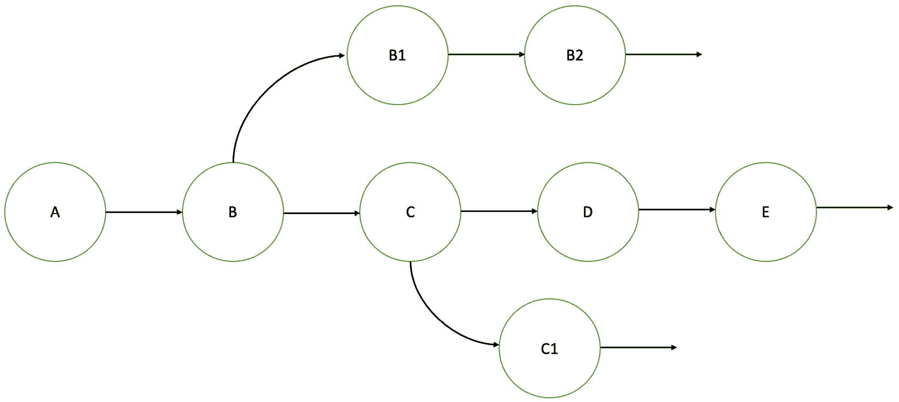

图 5.8：动态系统管道（编排）

机器学习系统中可以自动化的不同任务如下：

+   收集和预处理数据

+   训练机器学习模型

+   对训练好的模型进行测试和诊断以评估其性能

+   提供机器学习模型服务

+   监控生产中的模型

使用这些自动化任务，系统管理员需要编排管道的阶段，使其动态且可持续。以下组件有助于创建一个健壮的系统：

+   **调度**：系统必须能够调度并单独运行管道中的不同自动化任务，同时保持系统依赖性。

+   **CI/CD 测试**：模型训练完成后，对模型进行自动测试以衡量其性能是至关重要的。如果模型未能通过某些指标，你必须从头开始重复训练过程，以解决模型的弱点；否则，它不能部署到生产环境中。

+   **部署**：根据您将模型部署到生产环境的位置，设置自动化流程可以帮助减少部署时间，同时保持模型的更新版本。

+   **监控**：在部署模型后，持续监控模型在生产环境中的性能，以保持模型的健康状态，防止其退化。这将为我们提供何时需要更新我们的管道或模型以保持效率的指示。

重要提示

了解您的业务需求以及您的模型如何工作，可以帮助您更好地规划您的机器学习管道。设置备份阶段以解决系统中的一些潜在问题，可以使系统更具动态性和适应行业需求的能力。

# 摘要

在本章中，我们探讨了构成机器学习管道的不同关键组件。

从那里，我们详细研究了构成组件的接口。我们从转换接口开始，它负责管道的数据方面。它接收数据并应用不同类型的数据转换，使我们能够保持干净和稳定的数据，这些数据我们可以在后续的机器学习模型中使用。

在转换阶段之后，我们开始在 fit 接口中创建我们的模型。在这里，我们可以使用库和包提供的预构建模型来初始化我们的模型。由于创建模型的简便性，测试不同类型的模型以查看哪种模型基于我们的数据表现最佳是一种良好的实践。

一旦我们创建了模型，我们就可以开始模型的实际训练。我们需要将数据分成训练集和测试集，以便我们的模型理解数据中的关系。然后，我们可以测量模型中的不同指标，以验证模型的表现。

一旦我们对模型的性能感到满意，我们就可以开始将我们的应用程序部署到生产环境中。部署我们的模型主要有两种方式，无论是将其嵌入到我们的应用程序中，还是作为服务供我们的客户使用。

最后，我们将所有内容整合起来，了解了机器学习中的编排包含哪些内容。我们学习了在编排机器学习管道时需要考虑哪些概念，以及如何保持系统动态和稳健，以跟上日常需求。

随着时间的推移和数据的变化，我们调整和维护我们的模型以应对现实世界中可能出现的某些情况变得尤为重要。在下一章中，我们将探讨当我们的数据开始发生变化和转移时，我们如何维护我们的机器学习模型。
