# 6

# 稳定机器学习系统

在最后两章中，我们介绍了机器学习的不同概念以及我们如何创建一个综合的机器学习系统管道，该管道可以工作并适应我们的需求。

虽然我们的管道可以满足我们的期望，但在面对系统可能难以自我调整的外部因素时，对我们来说，能够维持我们的系统是非常重要的。

在本章中，我们将讨论数据集变化的现象以及我们如何优化我们的机器学习系统来帮助解决这些问题，同时保持其功能目标，而无需从头开始重建我们的系统。

我们将介绍以下概念：

+   机器学习参数化和数据集变化

+   数据集变化的原因

+   识别数据集变化

+   处理和稳定数据集变化

# 机器学习参数化和数据集变化

维护我们的机器学习模型是创建一个健壮模型的重要组成部分。随着时间的推移，我们的数据开始根据我们的环境发生变化和移动，尽管大多数模型可以检测和自我修复，但有时需要人为干预来引导它们回到正确的轨道。

在本节中，我们将简要介绍两个主要概念，这些概念将帮助我们了解它们对我们模型的影响：

+   **参数化**

+   **数据集变化**

我们机器学习模型的表示由某些规格定义，这些规格有助于定义我们模型的学习过程。这些包括以下内容：

+   **参数**

+   **超参数**

我们首先来看参数。这些规格在模型内部。在训练过程中，这些参数在模型试图学习输入特征与目标值之间的映射关系时被更新和学习。

大多数情况下，这些参数被设置为初始值为零或随机值。随着训练过程的进行，这些值通过优化方法（如梯度下降）不断更新。在训练过程结束时，这些值的最终权重构成了模型本身。这些权重甚至可以用于其他模型，特别是那些具有相似应用场景的模型。

参数的一些例子包括以下内容：

+   人工神经网络中的节点权重和偏置值

+   线性和逻辑回归模型的系数

+   聚类模型的聚类中心

虽然参数在确定模型性能方面起着核心作用，但由于模型本身更新权重，它们大多不受我们的控制。这导致我们转向超参数。

超参数是控制我们机器学习模型学习过程的参数，反过来，它又影响模型学习的输出权重。这些值从开始设置并保持在整个学习过程中固定。

作为用户，我们决定在训练过程中为我们的模型设置哪些初始值。因此，找出哪些值能产生最佳结果需要时间和经验。测试和训练多个超参数变体以查看哪个表现最佳需要付出努力。

存在许多超参数，每个模型都有其独特的超参数集，用户可以修改。这些超参数可能包括以下内容：

+   训练集和测试集之间的分割比例

+   优化算法中使用的学习率

+   优化算法的选择

+   批大小

+   迭代次数或周期数

+   隐藏层的数量

+   每个隐藏层中的节点数量

+   成本或损失函数的选择

+   激活函数的选择

+   需要调整的聚类数量 ![img/Formula_06_001.png]

由于可能有许多超参数需要调整，以及许多不同的组合需要尝试，逐一测试这些变化可能会非常耗时。正如上一章所讨论的，在我们的流程中有一个部分自动化这个过程，通过运行具有不同超参数组合的多个模型来加速测试过程并找到最优的超参数组合，这可能是有用的。

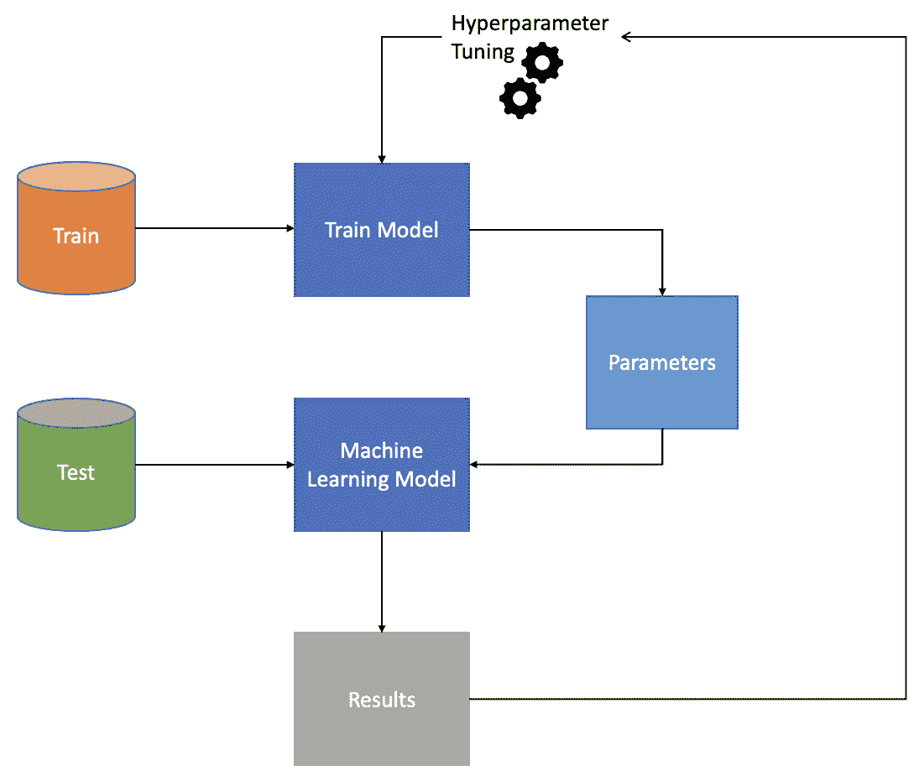

图 6.1：超参数和参数调整

可能存在调整我们的参数和超参数不足以防止我们的模型退化的情况。

例如，假设我们创建了一个模型准确率为 85%的机器学习模型。这个模型在一段时间内继续表现良好。然后我们开始看到我们的模型准确率下降，直到变得无法使用，因为模型无法正确预测我们收集的新测试数据。

在分析我们的模型时，我们可以开始看到我们的训练数据并不反映我们最近收集的测试数据。在这里，我们可以看到我们的训练和测试数据集的数据分布之间存在变化。

在我们着手解决数据集变化问题之前，我们首先必须了解数据集变化的背景、它们是如何发生的，以及我们如何调整我们的机器学习系统以帮助防止数据集变化影响我们的模型。

机器学习系统是在假设训练集和测试集之间的数据分布相似的情况下构建的。由于现实世界不断变化，新的数据分布出现，训练集和测试集之间可能存在显著差异。

训练集和测试集之间数据分布的主要差异被认为是数据集变化。这种剧烈的差异最终会降低模型性能，因为模型偏向于训练集，无法适应测试集：

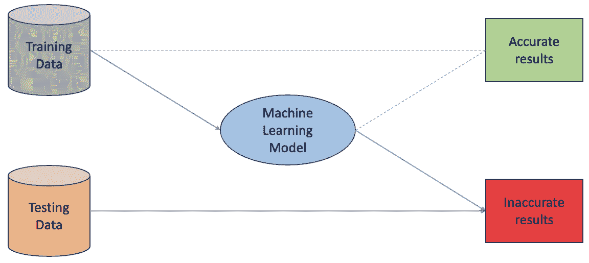

图 6.2：由于数据集变化导致的机器学习模型结果

这种情况的一些例子包括消费者习惯的变化、社会经济变化或全球影响，如大流行。这些事件可以严重影响我们收集和观察到的数据，进而影响我们模型的性能。

重要提示

首先，尝试调整你的机器学习模型的超参数，看看新学习的参数是否能显著提高你的模型。如果你仍然遇到主要问题，那么最好分析数据，看看是否发生了数据集偏移。

# 数据集偏移的原因

现在我们已经了解了数据集偏移是什么，我们可以开始调查数据集偏移的不同原因。虽然数据集偏移可能发生的原因有很多，但我们可以将它们分为两类：

+   **样本选择偏差**

+   **非平稳环境**

样本选择偏差在标签或收集用于模型的训练数据时是显而易见的，存在偏差或问题。收集有偏差的数据会导致训练集的非均匀样本选择。这种偏差本质上无法代表实际的样本分布。

非平稳环境是数据集偏移的另一个原因——我们将在本章后面进一步详细讨论不同类型。假设我们有一个包含一组输入特征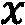，目标或输出变量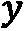的模型。从那里，我们还可以定义先验概率为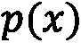，条件概率为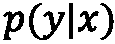，联合分布为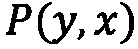。这种数据集偏移是由时间或空间变化引起的，定义为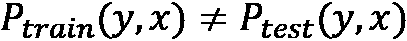，这非常反映现实世界的运作方式。

这种因果效应可能导致不同类型的偏移：

+   对于  问题，非平稳环境可以改变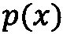 或 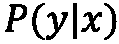，给我们带来协变量或概念上的偏移

+   对于  问题，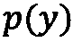 或  的变化可以给我们提供先验概率或概念上的转变

在下一节中，我们将探讨不同类型的偏移以及我们如何识别它们。

# 识别数据集偏移

在研究了数据集偏移的不同原因之后，我们可以开始将某些偏移分类到不同的组中，这有助于我们轻松识别我们正在处理的数据集偏移类型。

在我们可能遇到的不同数据集偏移中，我们可以将数据偏移分为以下类别：

+   **协变量偏移**

+   **先验概率偏移**

+   **概念偏移**

我们首先将研究协变量偏移。这是最常见的数据集偏移，因为协变量偏移发生在训练或测试数据的输入特征之一或多个的分布发生变化时。尽管发生了变化，但目标值保持不变。

从数学的角度来看，这种数据集偏移只发生在 X > Y 问题中。每当输入分布，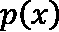，在训练集和测试集之间发生变化，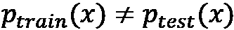，但训练集和测试集的条件概率保持不变，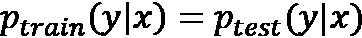，这将会导致协变量偏移。

例如，我们可以创建一个模型来预测某个城市员工的薪水。假设你的训练集中大多数员工是年轻人。随着时间的推移，员工会变老。如果你尝试预测老员工的薪水，你会开始看到显著的误差。这是由于模型对主要由年轻人组成的训练集存在严重偏差，无法找到老年员工之间的关系。

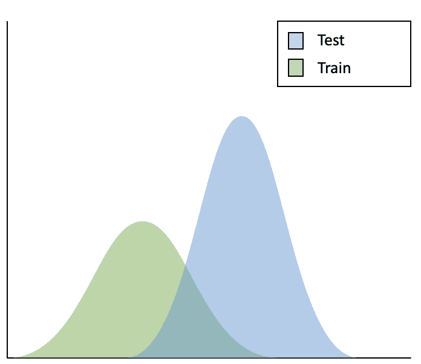

图 6.3：协变量数据集偏移

接下来，我们将探讨先验概率偏移，也称为标签偏移。这与协变量偏移相反，因为这种偏移发生在给定输出分布发生变化，但输入分布保持不变的情况下。

从数学的角度来看，这种情况只发生在 Y -> X 问题中。当先验概率发生变化时，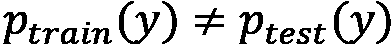，但条件概率保持不变，，就会发生先验概率偏移：

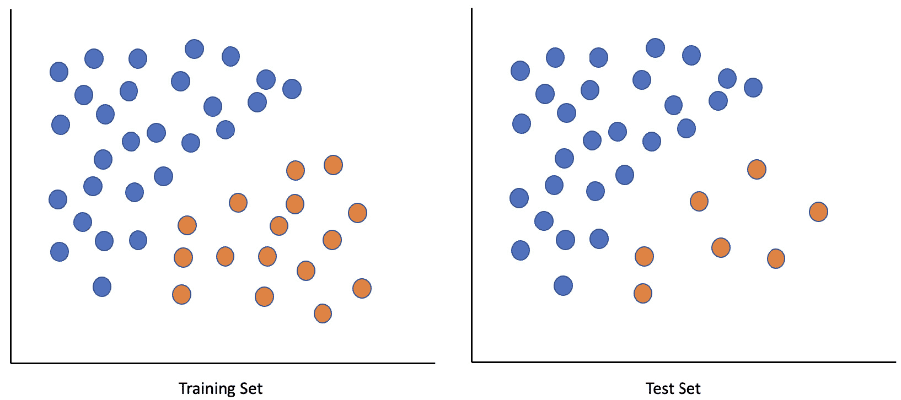

图 6.4：先验概率偏移

最后，我们将讨论概念偏移，也称为概念漂移。这种偏移发生在训练数据的分布保持不变，但给定训练数据的输出条件分布发生变化时。

从数学的角度来看，这种情况可以在 X -> Y 或 Y -> X 问题中发生：

+   对于 X -> Y 问题，这种情况发生在输入变量的先验概率在训练集和测试集中保持不变时，(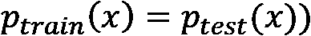，但条件概率发生变化，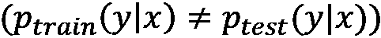）。

+   对于 Y -> X 问题，这种情况发生在目标变量的先验概率在训练集和测试集中保持不变时，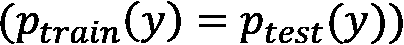，但条件概率发生变化，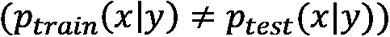。

例如，由于经济原因，一个用户的购买行为受到影响，但我们的训练数据和测试数据中都没有包含关于经济表现的任何信息。因此，我们模型的性能将下降。

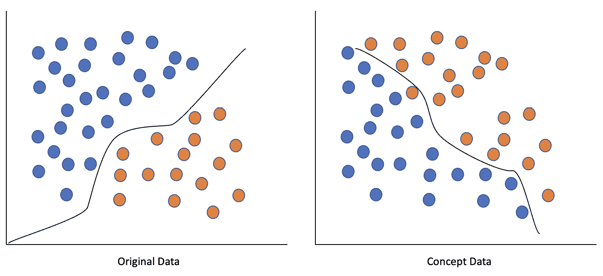

图 6.5：概念偏移

这可能是一个棘手的数据集偏移，因为分布偏移与我们训练的数据无关，而是与我们的模型可能没有的外部信息有关。大多数情况下，这些数据集偏移是周期性的和/或季节性的。

重要提示

可视化你的数据并计算与你的数据相关的不同概率是帮助确定和识别你所处理的数据集偏移的最佳方式。从那里，你可以决定你将如何解决你的数据集偏移。

当涉及到识别大多数数据集偏移时，我们可以遵循一个过程来帮助我们。它包括以下步骤：

+   数据预处理

+   在各自的训练和测试集上创建随机样本

+   将随机样本合并成一个数据集

+   使用一个特征一次创建一个模型，同时使用原始值作为输出值

+   在测试集上预测并计算**曲线下面积-接收者操作特征** **曲线**（**AUC-ROC**）

+   如果 AUC-ROC 大于某个特定阈值，例如，80%，我们可以将数据分类为经历了数据集偏移

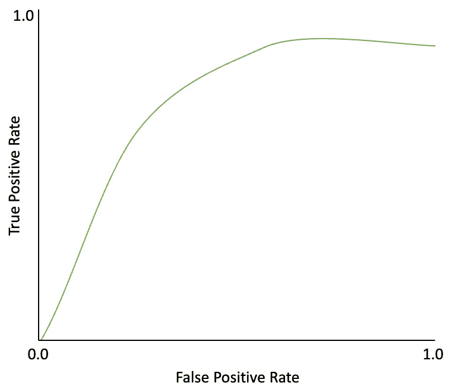

图 6.6：AUC-ROC 图示例（接近 1 的值表示模型强大）

# 处理和稳定数据集偏移

现在我们已经建立了识别不同类型数据集偏移的方法，我们可以讨论解决这些偏移和稳定我们的机器学习模型的不同方式。

尽管有许多方法可以解决数据集偏移，但我们将关注三种主要方法。它们包括以下内容：

+   **特征丢弃**

+   **对抗搜索**

+   **密度** **比率估计**

我们首先将查看特征丢弃。这是调整数据集偏移的最简单形式。当我们确定哪些特征被分类为漂移时，我们可以简单地从机器学习模型中丢弃它们。我们还可以定义一个简单的规则，即任何漂移值大于某个特定阈值（例如，80%）的特征都可以被丢弃：

图 6.7：特征丢弃过程

虽然这是一个简单的变化，但这需要仔细考虑。如果在训练你的机器学习模型时认为这个特征很重要，那么重新考虑这个特征是否需要被丢弃是值得的。此外，如果你的大多数特征都通过了被丢弃的阈值，你可能需要重新审视你的整体数据，并在解决数据集偏移时考虑不同的方法。

接下来，我们将探讨对抗搜索。这是一种需要训练二元分类器来预测样本数据是否在训练或测试数据集中的技术。然后我们可以评估分类器的性能，以确定是否发生了数据集偏移。如果我们的分类器性能接近随机猜测（约 50%），我们可以自信地确定我们的训练和测试数据集分布是一致的。另一方面，如果我们的分类器表现优于随机猜测，那么这表明训练和测试数据集的分布之间存在不一致。

对抗搜索可以分为三个部分：

1.  从原始数据集中，我们将移除目标值列，并用一个新列来表示数据的来源（训练 = 0 和测试 = 1）。

1.  我们将使用新的数据集创建和训练新的分类器。分类器的输出是样本数据属于测试数据集的概率。

1.  最后，我们可以观察结果并衡量分类器的性能。如果我们的分类器性能接近 50%，那么这表明模型无法区分数据是来自训练集还是测试集。这可以告诉我们训练和测试数据集之间的数据分布是一致的。另一方面，如果我们的性能接近 100%，那么模型有足够的信心找到训练和测试数据集之间的差异，这表明训练和测试数据集的分布存在重大差异。

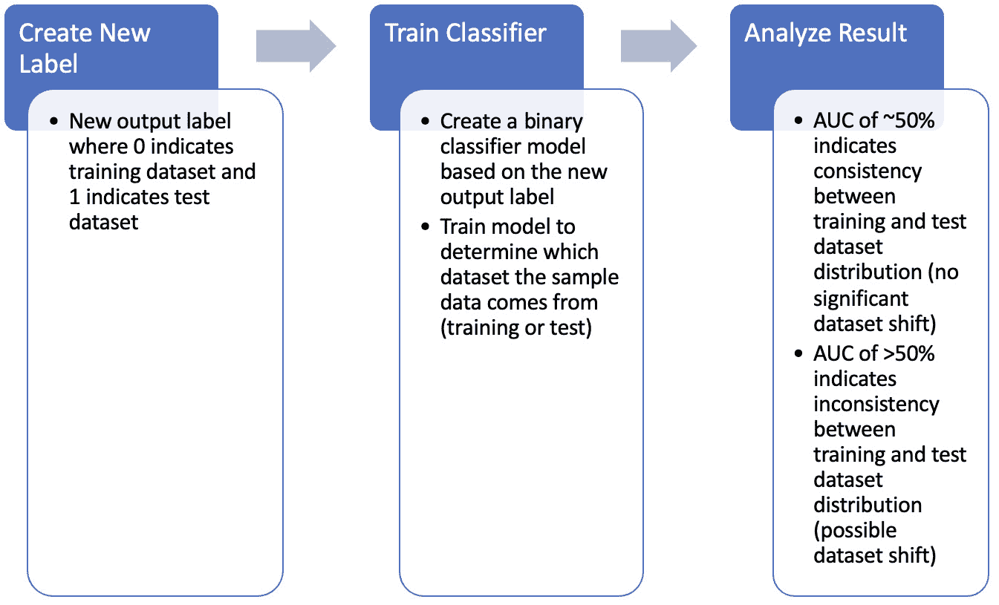

图 6.8：对抗搜索过程

使用对抗搜索，我们可以建立三种方法来解决我们遇到的数据集偏移问题：

+   使用结果，我们可以将它们用作训练过程的样本权重。权重对应于数据分布的性质。在实际情况中分布相似的数据将被分配更大的权重，而分布不一致的数据将被分配更低的权重。这将有助于模型强调代表它试图学习的真实分布的实际数据。

+   我们可以使用仅排名靠前的对抗验证结果。而不是减轻测试数据集中不一致样本的权重，我们可以完全删除它们。

+   除了排名靠前的对抗验证结果外，所有数据都用于训练。这种方法通过使用所有数据而不是丢弃特征来解决可能由第二种方法引起的问题。在训练过程中使用 K 折交叉验证时，我们可以将一些数据纳入每个折的训练数据中，而不是丢弃不重要的数据。这样可以帮助我们在使用所有数据的同时保持一致性。

解决数据集偏移的最终方法被称为密度比估计法。这种方法仍在研究之中，并不是解决数据集偏移的常用方法。

采用这种方法，我们首先分别估计训练集和测试集的数据集密度。一旦我们完成了这个步骤，我们就会通过计算训练集和测试集估计密度的比率来估计数据集的重要性。使用这个密度比率，我们可以将其用作训练数据集中每个数据条目的权重。

这种方法不受青睐且仍在研究中的原因是它计算成本高昂，尤其是对于高维数据集。即便如此，它对解决数据集偏移的改进微乎其微，不值得追求这种方法。

重要提示

特征删除是解决数据集偏移最简单、最直接的方法。在考虑使用对抗搜索方法之前，考虑使用这种方法，因为虽然这种方法有效，但它可能比较复杂，可能需要更多的努力和资源来帮助减轻数据集偏移的影响。

# 摘要

在本章中，我们讨论了数据集偏移的一般概念以及它们如何对我们机器学习模型产生负面影响。

从那里，我们进一步深入研究了导致这些数据集偏移发生的原因以及数据集偏移可能展现的不同特征。利用这些特征，我们可以更好地识别数据集偏移的类型——是协变量偏移、先验概率偏移还是概念偏移。

一旦我们能够分析我们的数据并识别数据集偏移的类型，我们就研究了不同的方法来帮助我们处理和稳定这些数据集偏移，以便我们能够维持我们的机器学习模型。我们回顾了一些技术，如特征搜索、对抗搜索和密度比估计，这些技术可以帮助我们在处理数据集偏移时。

使用这些过程和方法，我们可以防止我们的模型遭受在现实世界中发生的常见数据集偏移，并持续维护我们的机器学习模型。

现在我们已经对机器学习和如何维护一个健壮的模型有了牢固的理解，我们可以开始研究如何将我们的机器学习模型集成到我们的**微服务架构**（**MSA**）中。
