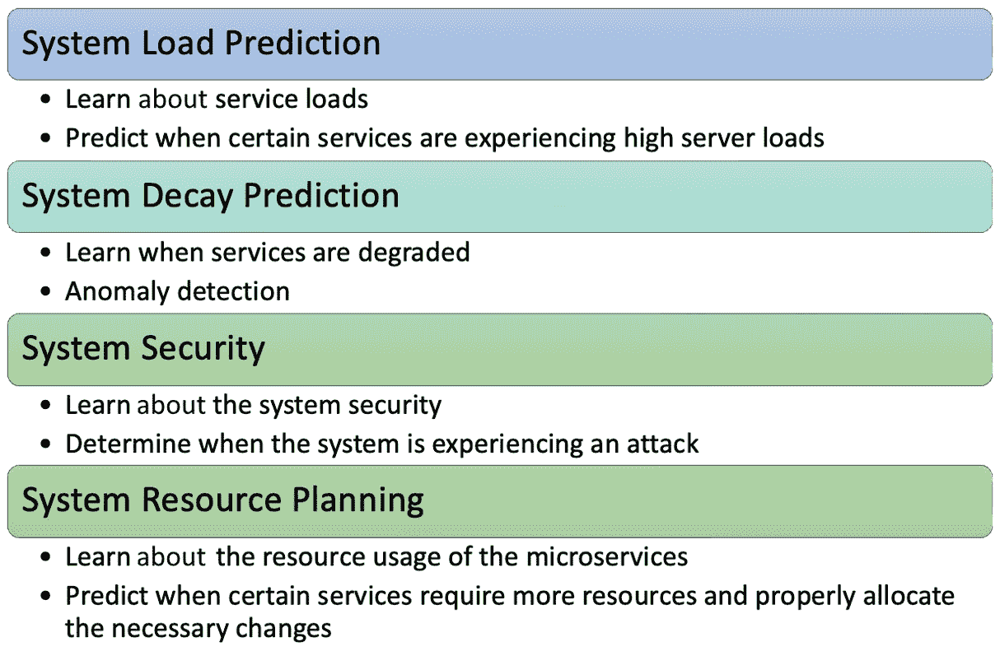
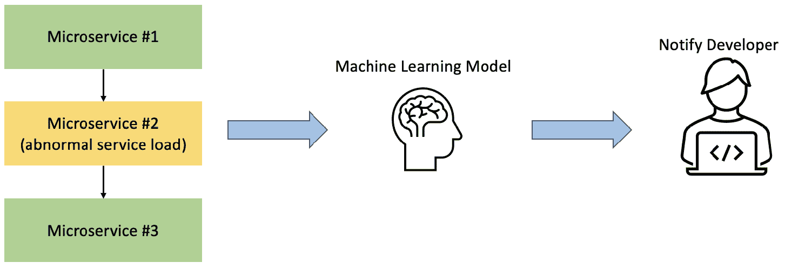
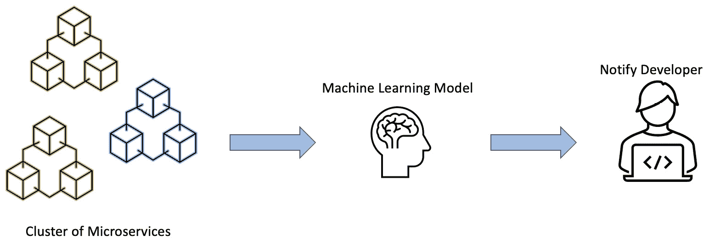

# 7

# 机器学习和深度学习如何帮助 MSA 企业系统

在前面的章节中，我们分析了人工智能、机器学习和深度学习的不同一般概念，以及它们如何用于特定的应用和用例。从那里，我们探讨了如何创建端到端的机器学习系统管道，以及它在建立稳健系统时带来的优势。最后，我们考察了我们的机器学习模型如何随着时间的推移通过数据变化而退化，以及我们如何识别和解决这些问题。

对机器学习的基本原理有牢固的理解后，我们现在可以开始探索机器学习在我们**微服务架构**（**MSA**）企业中的应用场景。在本章中，我们将讨论在将机器学习集成到 MSA 企业系统中时，我们将提出的不同概念，以建立一个智能的 MSA。

# 机器学习 MSA 企业系统用例

在 MSA 企业系统中添加机器学习的空间很广，可以适用于许多用例。我们可以利用机器学习解决 MSA 中可能遇到的不同类型的问题，例如以下内容：

+   **系统负载预测**：这将确定何时服务经历高于正常水平的负载，并触发措施以防止系统因服务器负载过重而退化。

+   **系统退化预测**：类似于系统负载预测，这将监控微服务并尝试预测和确定 MSA 企业中的异常，使用户能够采取行动，防止某些问题出现并对性能产生负面影响。

+   **系统安全**：在网络安全时代，能够保护您的 MSA 系统免受针对性攻击至关重要。通过研究您的 MSA 系统行为，模型可以预测和检测可能影响您系统的攻击。

+   **系统资源规划**：随着系统的发展和演变，能够正确分配资源并适应系统需求是建立 MSA 企业系统时的关键部分。利用机器学习，我们可以学习哪些服务需要更多资源，以及我们需要扩展多少才能有效地分配所需资源。

图 7.1：MSA 中机器学习的用例

尽管 MSA 企业系统中还有许多其他机器学习的用例，但大多数用例都归入这四个类别。在开始实施不同的模型之前，我们首先需要了解不同的案例以及我们如何解决这些问题。

我们可以从查看系统负载预测开始。这是我们在处理服务时经常会遇到的一个常见问题。与资源分配给每个微服务的单体系统相比，MSA 具有优势，这允许更容易的维护和可扩展性。然而，正如前几章所讨论的，在 MSA 中，一个微服务可能会经历高负载，从而导致级联效应，失败扩展到其他微服务。

使用智能 MSA，我们可以使用不同的特征，如响应时间，来训练模型，学习 MSA 系统的模式。类似于微服务熔断器，这个模型将能够迅速确定微服务是否正在经历高负载，并在问题变得太晚并开始对其他微服务产生负面影响之前解决它。

图 7.2：系统负载预测模型

就像系统负载预测模型一样，我们可以构建一个模型来寻找 MSA 中的异常，这些异常可能导致服务衰减。我们不仅关注特定微服务的服务负载，还可以研究整个 MSA 以及它在更大规模上运作的不同模式。

某些系统在特定的时间和时期可能会经历不同的系统负载和错误。例如，我们的服务可能在假期和季节性事件等特定时期遇到请求激增，用户数量可能急剧增加。允许模型学习和理解 MSA 及其随时间如何运作，可以使模型更好地检测异常并防止误报。

此外，我们不仅监控单独的微服务，还可以评估微服务集群以及它们与整个 MSA 的交互。这样，我们可以识别出可能在我们的 MSA 中出现的某些瓶颈和错误。

图 7.3：系统衰减预测模型

机器学习在安全领域蓬勃发展。随着更高级的攻击和方法，用户保护他们的系统变得至关重要。机器学习使用户能够创建强大的模型，这些模型可以在攻击甚至影响他们的系统之前进行分析和预测，MSA 也不例外。

**拒绝服务**（**DoS**）是一种旨在阻止用户访问某些服务的网络攻击。随着技术的进步，这些攻击变得越来越复杂。利用机器学习，我们可以训练我们的模型了解我们的 MSA 并模拟 DoS 攻击，以便它能够确定我们的 MSA 是否受到攻击。有了这个，我们可以通知安全团队或部署对策来对抗某些攻击并维护我们 MSA 的完整性。

图 7.4：系统安全模型

自愈过程的一部分包括在 MSA 开始增长和扩展时为某些微服务分配资源。经过一段时间，你可能会经历用户增长，结果，你的微服务的请求量会增加。一个模型可能错误地识别问题并提供不会解决核心问题的解决方案。

因此，构建一个高级模型，它可以跟踪 MSA 的逐渐增长并确定何时某些服务需要更多资源，可能是系统自愈过程的关键部分。该模型的成功实施可以大大提高系统的可靠性，因为它可以更有效地合理和高效地分配资源。

图 7.5：系统资源规划模型

重要提示

我们可以在我们的 MSA 中使用的不同类型的模型不是互斥的。将不同的用例组合起来构建一个更智能的 MSA 是可能的，也是常见的。了解你的 MSA 如何运行以及确定它可能存在的不同弱点，使用户更容易确定要采用哪些模型。

在某些用例中，由于问题的性质，某些模型可能比其他模型工作得更好。现在我们已经研究了我们可以将机器学习应用于我们的 MSA 的不同概念，我们可以在下一节开始深入探讨我们可以用来构建我们的机器学习模型的不同的实现和模型。

# 使用模式分析机器学习增强系统支持性和问题解决时间（TTR）

在我们开始使我们的 MSA 智能化之前，我们必须首先通过利用机器学习模型来学习我们服务的性能的常见趋势和模式，来了解我们的系统性能。从那里，我们可以建立一个基线，作为其他高级模型使用的参考。

如*第四章*所述，当我们有一个标记的测试集时，可以发生监督学习。在我们的案例中，我们主要可以使用监督学习，因为我们可以在 MSA 中轻松捕获我们服务的响应时间，并将其用作我们的数据标签。

从那里，我们有各种各样的技术可以用来创建我们的机器学习模型。为了简单起见，我们可以使用线性回归模型来预测特定微服务的预期响应时间。使用这个输出，我们可以设计一个系统，其中我们可以配置一个阈值，如果我们检测到我们的 MSA 将达到一定的响应时间，我们可以通知开发者或启动一个程序来在问题发生之前解决它。

如果我们回顾*第六章*，我们讨论了数据漂移及其对我们模型的影响。由于用户数量增加或季节性事件，MSA 随着时间的推移而增长和扩展是很常见的。因此，我们可能会看到我们的 MSA 响应时间和指标的增长。这可能会错误地触发一个警报，通知我们异常的响应时间，而实际上，它准确地描述了 MSA 的正常行为。

因此，持续收集数据并训练我们的模型以适应预期的变化，使其能够学习系统的增长方式并正确识别不常见于我们 MSA 的变化，这一点非常重要。

图 7.6：性能基线系统流程

虽然这个系统对于简单问题已经足够，但我们可以将这个模型输出与其他高级模型结合，创建一个更完整的端到端系统，其中我们可以了解 MSA 的健康状况并做出更好的决策。在下一节中，我们将讨论如何使用深度学习来实现我们系统的自我修复。

重要提示

从一个简单的模型开始，例如线性回归模型，是很重要的。一旦概念验证成功，你就可以通过结合更高级的模型和技术来改进你的系统。

# 使用深度学习实现系统自我修复

现在我们已经确定了系统的基线，我们可以利用这一点来创造一个更智能的 MSA，其中我们可以检测异常并执行系统自我修复。这样，我们可以在问题出现之前更加主动地解决问题，节省成本和时间。

**异常检测**是识别系统或服务中可能发生的任何异常事件或趋势的有效方法。例如，我们可以使用异常检测来确定信用卡欺诈。我们可以使用用户的购买趋势，并根据这些信息确定用户何时成为信用卡欺诈的受害者。

类似于信用卡欺诈检测，我们可以将我们的异常检测应用于我们的 MSA。在我们探讨可以用来实现异常检测的不同模型之前，让我们首先了解不同类型的异常：

+   **点异常**：当某个数据点与其他数据点相差甚远时，这种情况发生

+   **上下文异常**：当数据因数据上下文的原因不符合一般数据趋势时，数据被视为此类

+   **集体异常**：当一组相关数据实例相对于整个数据集出现异常时

图 7.7：异常数据

异常检测模型可以通过以下方式完成：

+   **监督** **异常检测**

+   **无监督** **异常检测**

我们可以用于无监督学习的一个常见模型是**自动编码器**。如*第四章*中提到的，自动编码器是由编码器和解码器组成的神经网络。自动编码器的一般目的是将数据压缩到与 PCA 类似的一个较低维度。这样，它能够学习不同数据特征之间的相关性和模式。一旦它学会了模式，它可以将压缩后的数据传递给解码器，解码器尝试使用编码器阶段学到的知识“重建”原始数据。

当专家研究数据以确定对于特定的 MSA，哪些响应时间被认为是异常时，我们可以利用机器学习来帮助我们找到即使是经验丰富的开发者可能也难以看到的模式和关系。

使用学到的参数，我们可以在我们的监督回归模型中使用它，以在检测异常时实现更准确的结果，并防止假阳性发生。

图 7.8：使用深度学习的自我修复

重要提示

标记用于监督式机器学习问题中的数据可能需要花费时间和金钱。你可以利用无监督机器学习模型来帮助你预测和标记你的未标记数据。从那里，你可以将新标记的数据输入到你的监督式机器学习问题中，从而利用无监督学习。记住新标记的数据，并确保它不会对你的监督式机器学习问题产生负面影响。

这些是我们可以利用机器学习和深度学习创建智能 MSA 的一些方法，它可以检测系统中的异常并迅速反应。这些用例可以根据用户的需求和他们的 MSA 的需求，通过使用不同的模型和技术进行调整和增强。

# 摘要

本章讨论了如何在我们的 MSA 中实现机器学习和深度学习。

我们首先探讨了机器学习如何用于构建智能 MSA 的不同用例。这些用例可以分为四个类别：

+   系统负载预测

+   系统衰减预测

+   系统安全

+   系统资源规划

我们讨论了每个类别及其在创建智能 MSA 时扮演的角色。

从那里，我们开始探讨使用监督机器学习来创建一个模式分析模型，它可以学习我们的 MSA 并创建一个性能基线模型。使用这个模型，我们可以确定我们的微服务性能是否异常。然后我们可以根据阈值执行操作，或者使用这个基线构建一个更高级的模型。

除了我们的监督机器学习模型外，我们还可以使用深度学习来创建更复杂的模型，例如自动编码器，以在我们的 MSA 中找到异常。通过结合这两种模型，我们可以创建一套基于某些预测的规则来执行，例如我们的 MSA 可以在最小人工干预下自我修复。这使我们能够在修复和调试我们的 MSA 时节省时间和金钱。

在接下来的章节中，我们将把迄今为止所学的内容应用到实践中，并开始使用实际示例和集成机器学习来构建我们自己的简单智能 MSA。

# 第三部分：在 MSA 系统中部署机器学习的实用指南

本书最后一部分将把迄今为止所涵盖的内容生动地呈现出来。它将逐步引导你通过设计和发展一个智能的**微服务架构**（**MSA**）系统，包括实际可导入用于实际用例的动手示例和实际代码。本部分将深入理解如何将 DevOps 流程应用于构建和运行智能企业 MSA 系统，从最初开始到运营和维护。

本部分从容器、Docker 的基本知识开始，以及如何安装和运行 Docker 容器。我们还将通过构建一个简单项目来获得处理容器间数据流的手动经验。此外，本章还将涵盖构建特定用途 AI 的实用指南以及如何将 AI 服务注入 MSA 系统。

本部分深入探讨 DevOps 在企业 MSA 系统中的应用，重点关注组织结构对齐以及 DevOps 如何影响 MSA 及其运营。我们将学习如何在项目生命周期中应用 DevOps，从开始到运营、变更管理和维护。

本部分还涵盖了如何识别和最小化系统依赖，应用**质量保证**（**QA**）测试策略，构建微服务和 MSA 测试用例，以及部署系统更改和热更新。本节还将提供如何克服系统依赖和有效应用测试策略的实用示例。

总之，本书的最后一部分将为您提供如何设计、开发和维护智能企业 MSA 系统的全面指南，重点关注实践、动手经验和实际用例。到本部分结束时，我们将具备构建自己的智能 MSA 系统并迈向实现更好的业务成果、运营绩效和业务连续性的第一步所需的技能和知识。

本部分包括以下章节：

+   *第八章**，DevOps 在构建智能 MSA 系统中的作用*

+   *第九章**，使用 Docker 容器构建 MSA*

+   *第十章**，构建智能 MSA 系统*

+   *第十一章**，管理新系统的部署——绿地与棕地对比*

+   *第十二章**，部署、测试和运营智能 MSA 系统*

第三部分：在 MSA 系统中部署机器学习的实用指南
