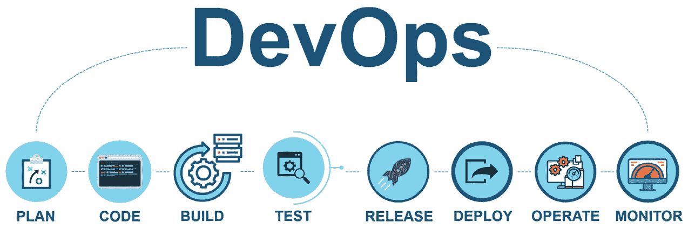
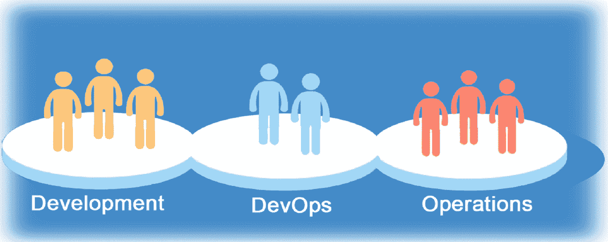
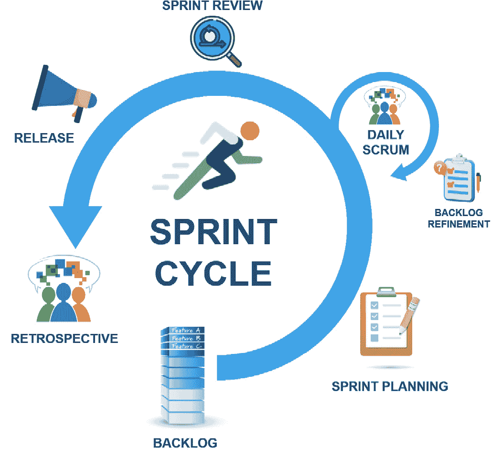
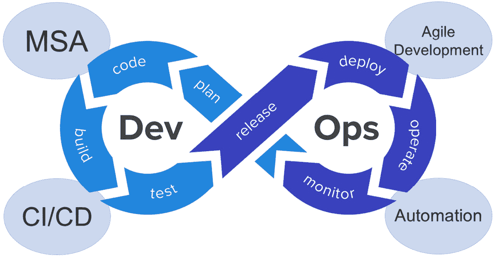
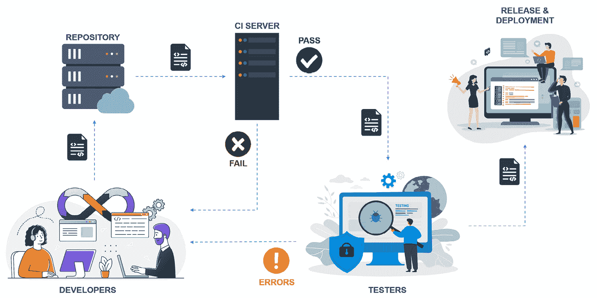

# DevOps 在构建智能 MSA 企业系统中的作用

在前面的章节中，我们介绍了 MSA 是什么，以及 MSA 相对于单体架构的优势。然后，我们通过示例讨论了如何将单体应用程序重构为 MSA，接着又讨论了不同的模式和技巧来增强 MSA 系统的性能。

我们还讨论了不同的机器学习和深度学习算法，通过实际案例展示了如何优化它们，以及这些机器学习和深度学习算法如何有助于进一步增强 MSA 系统的稳定性、弹性和可支持性，以便构建“智能 MSA”或“智能 MSA”系统。

在接下来的几章中，我们将进一步增强我们的 ABC-MSA 系统，并尝试通过一些实际安装和代码示例应用到目前为止所学到的知识。然而，在我们这样做之前，我们需要在本章中讨论 DevOps 的不同概念，以及如何将 DevOps 流程应用于构建和运行 MSA 系统。

在*第一章*中，我们简要介绍了 MSA 中的 DevOps。在本章中，我们将扩展这个主题，深入探讨 DevOps 在构建智能 MSA 中的作用。

本章涵盖了以下主题：

+   DevOps 与组织结构对齐

+   企业 MSA 系统运维中的 DevOps 流程

+   从一开始就将 DevOps 应用于运维和维护

# DevOps 与组织结构对齐

在传统的软件开发组织中，软件交付流程已经成熟，并且是根据该传统组织的结构构建的。通常，我们有一个业务团队定义核心业务规范和需求，随后是另一组架构师团队构建系统的结构。在传统的软件模型中，我们还有设计工程师编写功能规范，一个负责编写代码的开发团队，一个负责测试代码质量的 QA 团队，然后是发布团队、发布后的运维团队、支持团队等等。

图 8.1：传统开发结构

在传统的软件发布周期中，所有这些团队都参与其中，大多数是团队之间的顺序交接，存在隔阂、依赖关系，跨沟通问题，以及在过程中可能出现的推诿责任，发布周期可能需要数周或数月才能完成。对于 MSA 来说，这是不可接受的。

重要提示

MSA 的整个目的在于简化、加速和优化软件的发布和更新。将传统方法应用于 MSA 系统开发根本不起作用，也违背了最初采用 MSA 的目的。

## DevOps

DevOps 是现代软件开发组织中采用的主要流程之一，旨在帮助简化发布流程并优化它，以便组织每天可以无任何服务中断地进行多次无缝发布更新。

DevOps 是一组流程的组合，允许您将应用程序从开发到运营平稳过渡。企业需要专门的、定义明确的 DevOps 流程来管理他们的解决方案开发、托管和运营。

DevOps 团队的主要需求是实现工程技术在管理应用程序操作中的应用。虽然这听起来很简单，但运营团队会执行许多日常和随机活动。简化这些任务是采用 DevOps 的最大挑战。

图 8.2：以 DevOps 方式共同工作的团队

开发团队的主要责任是构建应用程序。然而，他们还需要关注应用程序的其他方面，例如应用程序性能、使用分析、代码质量、活动日志和解决代码级别的错误。

另一方面，运营团队面临着完全不同的问题。他们的关注点包括管理应用程序的可用性，通过更高的可扩展性确保性能，并改进解决方案生态系统、资源分配和整体系统分析。DevOps 流程处理所有参与方的所有这些关注点。

图 8.3：DevOps 生命周期

*图 8.3* 与我们之前在 *图 1.11* 中讨论的内容相似。这里新增的一点是，**计划**阶段是定义软件路线图并将其分解为主要需求，称为**史诗**。这些史诗被分解为一系列短端用户需求，称为**用户故事**。更多相关信息将在下一节中介绍。

好吧，那么，如果一个组织要采用 MSA，他们应该接受 DevOps 文化。简单，对吧？并不完全是这样！

在传统的组织结构中采用 DevOps 文化将会有许多不匹配，这肯定会阻碍 DevOps 周期。您的发布周期效率将取决于周期中最慢的过程。软件开发组织本身必须转变其文化以与 DevOps 保持一致，而不是相反。许多其他方法和技术也需要作为新 DevOps 转变的一部分被采用。组织结构本身可能也需要调整以适应新的 DevOps 方法。

## DevOps 团队结构

建立 DevOps 团队是组织转型的第一步。然而，如果不考虑现有的组织结构和组织如何与现有开发周期保持一致，你不能期望拥有一个完整的 DevOps 团队。

在现有的传统组织中，让开发和运维团队能够合理运作的过渡阶段是必不可少的。随着组织结构现代化以适应新的文化，传统的开发和运维团队将逐渐转变为真正的 DevOps 结构。

在组织转型场景中，推荐的方法之一是建立一个小的 DevOps 团队，作为现有开发团队和运维团队之间的桥梁。在这个特定情况下，DevOps 团队的主要目标是跨职能地在开发和运维团队之间进行协调，映射交付成果，逐渐使两个团队熟悉新的方法论，并在两个团队中开始应用基本的 DevOps 方法论，以便他们可以在未来实现统一。

图 8.4：在组织转型期间，DevOps 团队作为开发和运维之间的桥梁

团队沟通、协作、活力、信任以及对整个开发周期的深入了解对于新 DevOps 团队的成功至关重要。因此，你必须识别出能够推动 DevOps 团队前进的正确技能和人员。这些技能可能包括但不限于编码技能、掌握 DevOps 和**持续集成/持续开发**（**CI/CD**）工具，以及自动化。

随着组织结构和团队成熟，并对新方法论更加熟悉，将旧的 Dev、旧的 Ops 和过渡期的 DevOps 团队合并为一个单一的新的 DevOps 团队变得至关重要。在过渡阶段停留时间过长可能会比使用传统开发周期来开发 MSA 系统造成更多的干扰。

DevOps 团队的大小可以从 3 名工程师小到 12 名工程师，这取决于组织的规模、现有结构和投入的组织转型努力。通常，3 到 12 人之间的数量是理想的。拥有一个更大的团队可能会带来更多挑战而不是好处，并开始对团队的整体表现产生负面影响。

以逐步的方式进行转型过程，从基础设施编码开始，包括基础设施供应自动化、源代码版本控制、基础设施监控、代码构建自动化、部署自动化、测试编排、云服务管理等等。

我们现在知道，在采用 DevOps 时，组织结构的相关性和重要性。我们仍需要了解一些其他细节，这些细节将补充 DevOps，以便实现我们开发一个高效、高质量、上市时间短且更新无缝的 MSA 系统的目标。

在下一节中，我们将检查在开发 MSA 系统时需要考虑的其他一些因素。

# 企业 MSA 系统操作中的 DevOps 流程

微服务开发是一个快速的过程，需要所有其他开发过程以相同的速度运行。从 MSA 系统的开发一开始，就需要源代码管理和配置管理来为 DevOps 团队提供正确的支持。这随后是在开发环境中的代码扫描和单元测试编排。

在不同的团队成员之间应用特定的标准方法和最佳实践对于管理开发周期的效率和快速节奏至关重要。以下将讨论**敏捷开发方法**是什么以及它如何帮助 DevOps 操作，以及自动化在 DevOps 中的重要性。

## 开发敏捷方法

定义和实现 DevOps 流程与采用能够完全支持和利用 DevOps 力量的开发方法密不可分。尽管在您的组织中应用 DevOps 方法有多种方式，但敏捷方法是最佳选择。

敏捷开发方法将主要需求分解为可消费的小变化——故事和史诗。这些小而可消费的增量帮助团队在整个从开始到结束处理项目的旅程中实现短期胜利。

如*图 8.5*所示，敏捷团队成员定期会面，通常是每周或每两周，以规划、定义和同意史诗和故事。然后，将这些需求放入待办事项列表中，直到下一次敏捷团队会议，团队成员将努力从待办事项列表中交付需求：

图 8.5：敏捷开发中的冲刺周期

在敏捷开发中，每周或每两周定期召开的会议被称为**冲刺规划会议**，而开发人员在处理待办事项之间的这段时间被称为**冲刺**。

为了让团队成员检查每个定义好的史诗和故事的状态，他们通常每天都会开会检查冲刺待办事项列表，并细化需要细化的任何内容，以确保及时交付。这种每日会议被称为**每日站会**。

敏捷团队在冲刺周期内处理不断演变的故事和要求。

为了快速、低成本地交付高质量的产品，敏捷团队应用以下原则：

+   没有阻碍日终活动的时间，例如构建和部署最新代码

+   对最新代码的质量和功能质量的即时反馈

+   对开发团队日常活动的严格控制、精确监控和持续改进

+   对接受新故事、发布开发故事和缓解风险的决策速度更快

+   与测试人员、最终用户和客户的反馈循环缩短

+   定期审查和反思开发和交付流程

遵循敏捷宣言并遵循所有敏捷原则的开发团队应始终寻找从其流程模型中移除不必要障碍的方法。

开发方法论的敏捷方法可以应用于开发和交付所有类型的软件项目；然而，它更适合于基于微服务的应用程序的开发。重要的是要考虑微服务的范围和结构，以便与敏捷和 DevOps 实践相一致。

敏捷和 DevOps 流程最重要的支柱之一是使用按需、基于需求的资源。这通常通过使用基于云的基础设施来实现。开发微服务的敏捷团队所需的所有资源都需要及时、正确数量或足够容量地提供。云基础设施最适合这些需求。资源可以根据需求和需求进行扩展和缩减。

在 DevOps 周期中需要的按需云工作负载不一定部署在组织的私有基础设施上；它们可能非常可能通过公共云提供商部署，或者以混合云的方式部署。

## 自动化

随着 IT 基础设施的复杂性和 MSA 采用率的增加，以及对敏捷开发周期和短时间上市的需求，简化基础设施管理流程的需求成为任何组织最紧迫的需求。管理 MSA 基础设施、DevOps、CI/CD 和敏捷开发的一个很大部分是自动化。

自动化给现代组织带来了巨大的好处。其中一些好处包括但不限于以下内容：

+   **更优的人力资源利用**：有了自动化，员工可以专注于其他可能无法自动化的活动，从而优化组织的人力资源使用，更好地在其他项目上进行扩展，并根据可用的和所需的技能集分配责任。

+   **更快的上市时间和更好的业务敏捷性**：自动化流程无疑可以节省大量时间，这些时间原本会被手动重复工作和潜在的依赖性所消耗。在自动化实施的情况下，一项可能传统上需要几天才能完成的工作可以在几分钟内完成。

+   **更高的可靠性和更大的业务连续性**：复杂和耗时的任务简化为简单的按键或鼠标点击。相应地，人为错误显著减少，运营可靠性大幅提高。

+   **更好的合规性**：合规性可以集成到自动化工具中，以最小的努力提供更好的政策执行。合规性包括行业合规性、最佳实践和组织标准。行业标准可能包括**通用数据保护条例**（**GDPR**）、**支付卡行业数据安全标准**（**PCI DSS**）、**健康保险可携带性和问责法案**（**HIPAA**）和**计算机安全保护评估矩阵**（**SCSEM**）。

自动化常用于快速和高品质的应用交付。DevOps 是帮助自动化开发交付各个阶段的关键过程。实际上，DevOps 是一种文化，帮助组织避免重复的、耗时的人工步骤和努力。DevOps 范围内有各种工具、框架和流程，这些都是成功自动化所必需的。

DevOps 和 MSA 操作中的大多数挑战都无法手动解决——因此，在 DevOps 和 MSA 中自动化需求极高。从微服务开发到部署在生产环境中的每个交付环节都需要自动化。

图 8.6：DevOps 的四个支柱

从本质上讲，现代企业系统开发需要 DevOps 来应对组织动态和不断增长的需求，而 DevOps 在很大程度上依赖于四个支柱：**MSA**、**敏捷开发**、**CI/CD**和**自动化**。如图所示，这四个支柱在 DevOps 成功中起着重要作用，因此，在现代企业系统开发的成功中也起着重要作用。

此外，正如我们将在本章后面讨论的，人工智能应用非常难以手动测试和管理，自动化在管理人工智能应用的整个 DevOps 周期中起着至关重要的作用。

# 从一开始就将 DevOps 应用于运维和维护

微服务部署的每一步都需要相应的 DevOps 步骤。微服务开发过程与 DevOps 过程的结合有助于赋予开发和运维团队权力。以下是对 DevOps 过程不同方面的详细探讨。

## 源代码版本控制

在微服务上工作的敏捷团队需要实施特定的版本控制。对于每个微服务，需要仔细定义版本控制的三个方面：

+   版本控制工具（如 Git、SVN、CVS 和 Mercurial）的设置和管理。

+   应用程序的版本格式和命名规范，例如表示应用程序版本的格式、主要更改版本、次要更改版本以及构建或补丁号——例如，版本 2.3.11.7。

+   源代码的分支策略。这对于由多个团队分别开发不同微服务的微服务开发来说至关重要。团队需要为每个微服务创建单独的仓库，并为每个主要或次要增强创建不同的分支。

## 配置管理和一切作为代码

配置管理是一种系统性地管理跨各种环境变化的实践，以确保系统的功能和性能处于最佳状态。这包括开发、测试、部署和运行 MSA 系统组件所需的所有环境。

在 MSA 企业系统中，有如此多的动态部分，确定哪些系统部分需要维护和管理其配置至关重要。一旦确定了这些部分，它们的配置就需要得到控制并定期审计，以保持整个 MSA 系统的整体健康。

随着 DevOps 流程的成熟以及 MSA 系统组件的成熟，手动管理和配置变得越来越复杂，自动化对于顺利和成功地进行配置管理变得至关重要。

配置管理工具可以自动且无缝地管理系统组件的不同方面。这些工具在运行时以及任何时候根据需要做出调整，并按照应用程序的版本、更改类型和系统负载进行操作。

DevOps 的一个目标是将开发以及部署的所有方面进行编码化，包括基础设施和配置。整个环境可以从头开始构建，并使用**基础设施即代码**（**IaaC**）和**配置即代码**（**CaaC**）快速部署。

IaaC 和 CaaC 是配置管理的必要组件。两者通常都是描述性文件，通常用 Ansible、Terraform、Puppet、Chef 或 CloudFormation 等语言编写。

使用 IaaC 和 CaaC，DevOps 团队可以轻松地为不同目的启动新的工作负载。例如，可以根据测试用例配置工作负载，指定每个工作负载的属性，并控制与主要工作负载参数的偏差。

## CI/CD

如前文在*第一章*中指出的，CI/CD 是 DevOps 的一个组成部分，在发布 MSA 系统更新中扮演着最重要的角色。CI/CD 确保代码立即且定期构建并推送到 CI/CD 管道，以便快速测试和反馈。

如以下 CI/CD 管道图所示，开发者主要专注于处理冲刺待办事项，并将代码更新推送到团队仓库，然后从那里下载到 CI 服务器。

图 8.7：CI/CD 管道和流程

CI 服务器会自动对代码运行预设的测试用例，然后在通过所有测试用例后推送代码到测试人员。如果任何自动化测试失败，代码不会继续沿着管道前进，并将所有测试失败的错误报告发送回开发者。

与传统的开发周期相比，在传统开发周期中，开发者可能要在代码提交测试后几天或几周后才能得知代码的测试结果，而在 CI/CD 中，开发者将在几分钟内收到代码问题的报告。这种对代码错误的早期可见性给了开发者立即在编写原始代码的同时修复这些错误的机会。因此，他们可以持续改进代码以进行发布和部署。

当代码成功通过所有 CI 服务器测试后，DevOps 团队测试人员将进一步测试代码。如果未发现错误，测试人员将代码推送到发布和部署，或者将其退回以进行进一步的修复和改进。

这个 CI/CD 管道使开发者能够频繁地进行代码合并；进行单元测试、集成测试、代码扫描和冒烟测试；每天多次发布和部署——这在传统的开发周期中几乎是不可能的。

DevOps 团队需要确定一个可以管理整个 CI/CD 管道的工具。DevOps 有助于添加钩子和步骤，以在代码构建和部署期间执行额外的活动，包括外部可执行文件和脚本。一些最常见和广泛使用的 CI/CD 工具包括 Jenkins、Bamboo 和 CircleCI。

## 代码质量保证

确保代码质量，无论是从编码标准还是安全漏洞的角度来看，都是 DevOps 中的重要活动之一。这还包括确保应用程序本身业务逻辑的准确性。

代码质量涉及到代码的静态和动态分析概念。代码的静态分析在代码执行之前进行。它的目的是揭示代码异味、脏代码、易受攻击的库、代码中的恶意漏洞以及违反代码标准或最佳实践。

动态代码分析在应用程序执行期间或之后进行。它的目的是揭示由于负载、意外输入或一般意外运行条件导致的运行时错误。

许多工具可以帮助在 CI/CD 中执行代码扫描。这些工具包括但不限于 SonarQube、Fortify SCA 和 Raxis。

重要提示

测试 AI 应用程序比测试常规应用程序更具挑战性。AI 应用程序的某些方面在常规应用程序中不存在。

AI 应用是非确定性的——它们在实际情况下会如何表现有些不确定。因此，在 AI 应用测试期间期望特定的结果可能并不可行。完全有可能发生的情况是，正在测试的应用在相同的输入或测试标准下产生不同的结果。

大多数 AI 应用的质量与其训练数据质量相当，这使得 AI 应用容易受到训练数据偏差或无意识偏差的影响。例如，假设你正在编写一个 AI 模块来预测美国任何地区的房价，但你的训练数据 90%来自一个特定州内的特定地区。你的 AI 模型将相应地偏向于 90%训练数据来源的地区，因此测试 AI 应用可能需要针对训练数据进行测试。这在房价预测案例中可能听起来很简单，但在更复杂的情况下，你如何理解其他训练数据呢？

假设尽管存在所有这些训练数据挑战及其非确定性行为，我们仍然可以准确地测试 AI/深度学习（DL）应用。AI/深度学习应用不断学习、训练和改变其行为，因此当代码在生产环境中运行时，应用已经在学习和改变其行为。一天或几天前完成的测试可能已经不再有效。

当然，有方法可以克服所有这些挑战。首先，你需要对训练数据进行整理和验证。你可能需要执行自动和手动任务来验证训练数据，包括检查数据偏差、数据倾斜、分布水平等。

我们还需要测试 AI 算法以及回归模型对不同测试数据集的表现。模型的方差和均方误差也需要被检查和分析。

目前市场上已有 AI 应用测试工具，并且每天都在增加。这些工具的质量在不断提高，并且可以为 DevOps 团队提供巨大的帮助。AI 测试工具通常根据所使用的 AI 算法进行专门化。不同的 AI 测试工具的例子包括但不限于 Applitools、Sauce Labs 和 Testim。

## 监控

随着 DevOps 的出现，标准监控已升级为持续监控，并涵盖了整个开发周期，从规划到部署和运营。

监控涵盖了 DevOps 流程的不同方面以及整个应用程序开发、测试、部署和发布所需的组件，以及发布后的运营。这包括基础设施监控和应用程序本身。

基础设施监控包括本地基础设施、虚拟云环境、网络、通信和安全。另一方面，应用程序监控涉及性能、可伸缩性、可用性和可靠性。资源监控包括在物理或虚拟工作负载内部和外部多个 Pod 副本中管理和分配资源。

DevOps 监控帮助团队成员响应 DevOps 预发布或发布周期中出现的任何运营问题，从而使 DevOps 团队能够在 CI/CD 管道中纠正、调整并做出任何必要的更改。

理想情况下，监控警报会触发自动操作，尝试响应和修复已检测到的问题。然而，知道这并不总是可能的，通常需要手动干预。监控有助于 DevOps 团队将测试用例向开发周期的早期阶段转移，从而提高应用程序质量并减少开发周期晚期的运营问题。

如前所述的*第七章*中讨论的 AI 算法，以及我们将在本书后面给出更多示例，可以检测任何应用程序行为异常，并自动尝试自我修复，以防止应用程序操作中断。

在 DevOps 监控方面，有许多针对特定环境的工具可用，包括 Nagios、Prometheus、Splunk、Dynatrace 以及适用于 AWS 云环境的 AWS CloudWatch。

## 灾难管理

灾难管理是 DevOps 流程中的重要部分，但往往被忽视。在大多数情况下，应用程序恢复被视为部署过程的扩展部分。在云中，它通常被视为配置应用程序托管区域和区域以配置可用性的一个分支，而不是一个全面的环境挑战。

在微服务的情况下，识别灾难比避免、减轻或管理它更具挑战性。幸运的是，CI/CD 环境本身可以被利用来测试和模拟灾难场景。此外，利用外部仓库可以恢复到特定的版本号。

尽管如此，在不同的地理位置设置一组完全独立的副本环境，设置自动故障转移和中间的负载均衡器，可以成为维护业务连续性和不间断的 CI/CD 管道的绝佳方式。

使用 IaaC 和 CaaC 工具来自动化恢复，在发生中断的情况下，可以在最短的时间内将应用程序和系统恢复在线，这非常有帮助。

你仍然需要定义一个事件响应手册作为 DevOps 的一部分。这个手册应包括在每个场景中应执行的具体计划。例如，对自然灾害的响应可能与对数据泄露事件的响应不同。该手册需要包含不同的场景以及需要采取的角色和程序列表，以防止或最小化系统中断或数据丢失。

# 摘要

为了实现 MSA 系统创建的目标，需要与开发 MSA 系统相结合的一定方法。在本章中，我们讨论了在开发 MSA 系统时需要采纳的一些最关键实践：敏捷开发方法、DevOps 流程和实践，以及 CI/CD 管道管理。

我们还讨论了建立 DevOps 团队来管理微服务的重要性。我们提供了在构建我们的 MSA 系统时应用和管理 DevOps 的工具示例。

在下一章中，我们将迈出构建智能 MSA 系统的第一步。我们将讨论 Docker，它是什么，以及为什么它相关。我们还将使用 Docker 创建隔离和独立的虚拟环境，然后将这些环境（或容器）连接起来，以提供我们 MSA 系统的一个简单功能部分。
