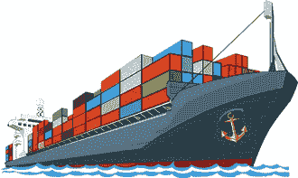
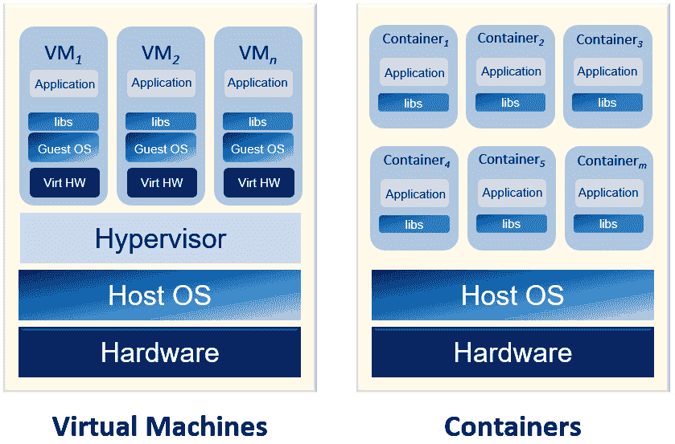
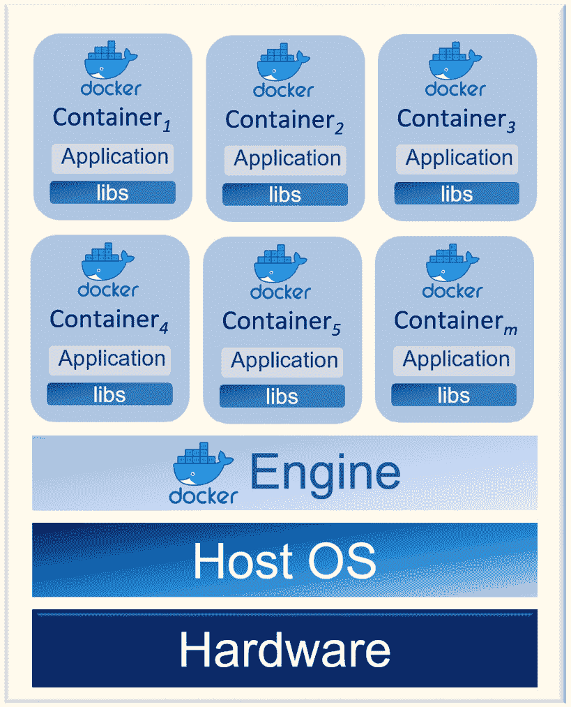
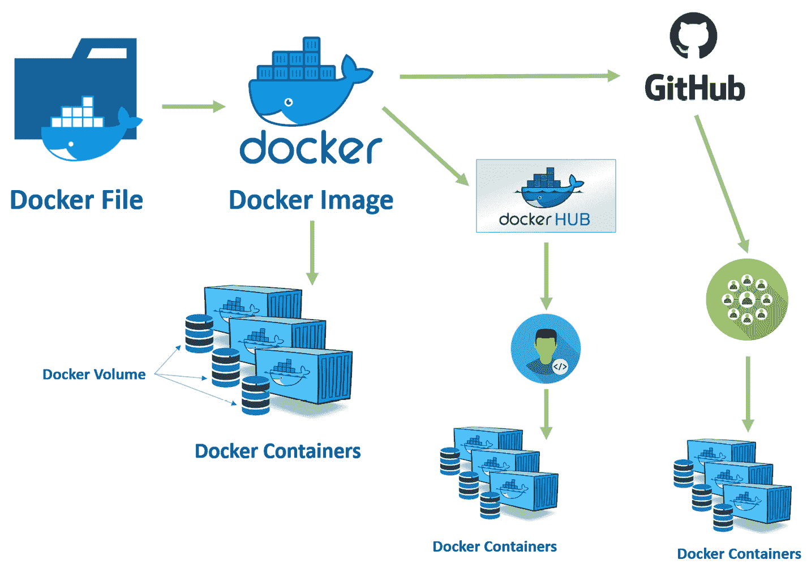
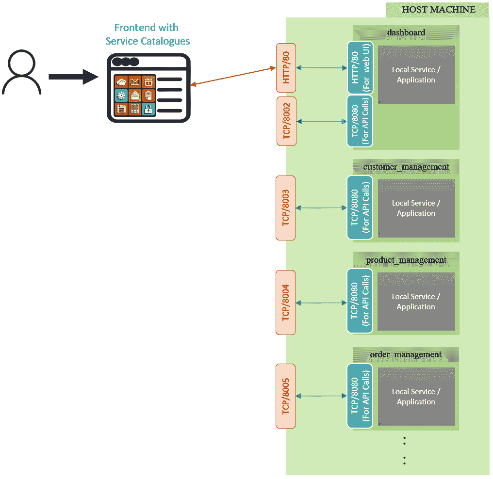
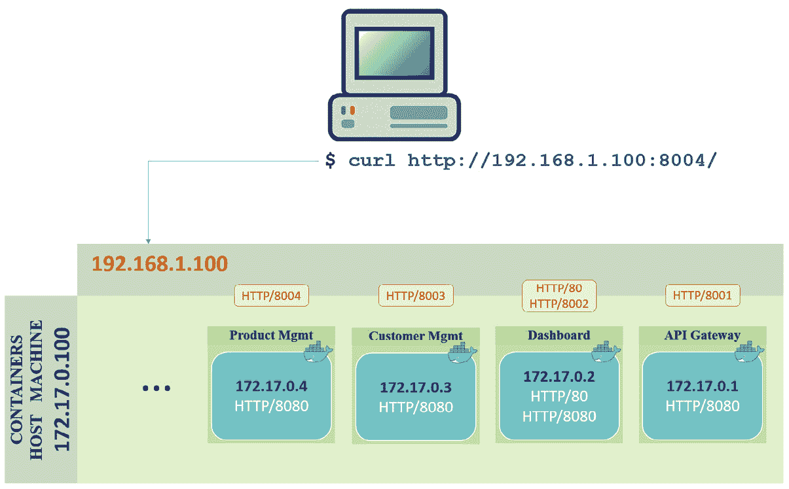

# 使用 Docker 容器构建 MSA

在上一章中，我们讨论了如何应用构建和运行 MSA 系统的 DevOps 流程，以及将组织结构与 DevOps 对齐的重要性。

我们还强调了在整个 MSA 项目生命周期以及 CI/CD 运作中拥抱自动化和适应敏捷开发方法的重要性。

本章将介绍什么是 **容器**，如何安装容器，如何使用它们，以及如何处理容器之间的数据流以构建一个简单的项目。我们将使用 **Docker** 作为我们的平台，因为它是目前该领域最受欢迎和最广泛使用的平台之一。

本章将涵盖以下主题：

+   容器究竟是什么，为什么要使用它们？

+   安装 Docker

+   创建 ABC-MSA 容器

+   ABC-MSA 微服务间通信

# 容器究竟是什么，为什么要使用它们？

容器被定义为一种操作系统级别的虚拟化实体，通过将不同的有限计算资源组合成一个自包含的执行环境来创建。

如以下集装箱船的图所示，容器是自包含的单元，独立于船上的任何其他容器。船是用于携带和运输容器的引擎：



图 9.1：一艘集装箱船

类似地，容器化的想法是在操作系统级别创建虚拟化。这意味着，在内核内部，你可以将不同的物理机器资源、应用程序和 I/O 功能组合成一个自包含的执行环境。这些自包含的资源形成一个单独的容器，因此得名容器。**容器引擎**与前面示例中的船只类似，其中容器引擎用于携带、运行和运输容器。

容器已经存在很长时间了，可以追溯到 Unix 的 **chroot** 在 1970 年代后期和 1980 年代初期，以及在我们甚至了解到今天我们称之为 **虚拟机管理程序** 之前。虚拟机管理程序是一个组件，它使我们能够启动 **虚拟** **机器**（**VMs**）。

Unix 的 chroot 在 1990 年代后期演变为 Linux 容器，或我们称之为 **LXC**，然后在 2000 年代初演变为 **Solaris Zones**。这些概念随着时间的推移从 **cgroups**（最初由 Google 开发）和 **namespaces**（由 IBM 开发）发展到我们今天看到的容器引擎，如 Docker、**Rkt**、**CRI-O**、**Containers**、Microsoft **Hyper-V** 容器等。

尽管容器和虚拟机之间存在相似之处，但两者仍然有一些基本的不同之处。

如以下图所示，容器共享宿主操作系统的同一内核，但隔离并限制分配的资源，给我们带来了一种类似于虚拟机的感觉，但在资源方面要轻得多：



图 9.2：虚拟机与容器

在虚拟机管理程序虚拟化中，每个虚拟机都将拥有自己的虚拟硬件和自己的客户操作系统。除此之外，虚拟机管理程序中还有大量的仿真。因此，每个虚拟机需要的资源比容器需要的资源要多得多。资源包括 CPU 周期、内存、存储等。此外，你可能会在多个虚拟机上部署相同的客户操作系统，以便虚拟机能够提供所需的功能，从而产生更多的开销和资源浪费。

*图 9**.2* 展示了部署在宿主操作系统之上的虚拟机管理程序。然而，更常见的虚拟机管理程序虚拟化模型是在硬件上直接部署裸机虚拟机管理程序。在两种情况下，开销仍然比部署容器要高得多。

容器的轻量级特性使得公司能够在数据中心运行比虚拟机更多的虚拟化环境。由于容器比虚拟机更有效地共享资源，并且数据中心有有限的物理资源，容器在很大程度上增加了数据中心基础设施的容量，这意味着容器在托管应用程序方面成为一个更好的选择，尤其是在我们的 MSA 案例中。

容器性能是另一个需要考虑的因素。与虚拟机管理程序虚拟化环境相反，容器中的 I/O 虚拟驱动程序通信、硬件仿真和资源开销都极小。因此，容器通常比虚拟机表现更好。容器的启动时间只需 1-3 秒，而虚拟机则需要几分钟。

在容器上运行的应用程序可以直接与硬件交互和访问。在虚拟机管理程序虚拟化的情况下，应用程序和虚拟机之间始终有一个虚拟机管理程序（除非启用了虚拟机管理程序绕过，这有其自身的限制）。

使用容器，你可以在一个可重复使用且完全可移植到任何其他平台的环境中打包应用程序及其所有依赖项。这是容器最重要的特性之一。开发者可以在他们的开发服务器上开发应用程序，将其发送到测试环境，然后是预生产和生产，而无需担心可移植性和依赖性问题。

重要提示

由于所有上述原因，微服务最流行的部署模型是每个服务一个容器的模型。这就是 MSA 的每个微服务都部署在运行特定应用程序的专用容器上。

容器和虚拟机之间的另一个重要区别是安全性。由于容器使用相同的内核，多个容器可能会在容器边界之外访问相同的内核子系统。这意味着容器可以访问同一物理主机上运行的另一个容器。例如，一个具有 root 访问权限的单个应用程序可以访问任何其他容器的数据。

有许多方法可以加强容器安全性，但没有任何这些技术可以帮助容器达到虚拟机的完全隔离安全性。

当然，在某些情况下，使用虚拟机可能比使用容器更好。或者在某些场景中，虚拟机和容器的混合部署模式可能是最合适的。这完全取决于您在组织中部署的使用案例、应用程序或系统。

在需要完全工作负载隔离的多租户环境中，使用虚拟机会是一个更好的选择。或者，如果您正在尝试构建一个用于托管关键知识产权、高度机密数据或应用程序的研发环境，也需要完全的工作负载隔离。因此，在这种情况下，使用虚拟机将是更好的选择。

对于我们的 MSA 示例，我们需要一个非常轻量级、快速启动、高度可移植且高性能的虚拟化环境来构建我们的 MSA 系统。因此，在我们的场景中，使用容器，采用每个微服务一个容器的部署模式，是更好的选择。MSA 系统中的每个微服务都会部署在其自己的容器中，并拥有自己的开发团队、开发周期、质量保证周期、更新、运行生命周期和发布周期。

以下表格总结了容器和虚拟机管理程序之间的区别：

|  | **容器** | **虚拟机管理程序** |
| --- | --- | --- |
| 资源使用和开销 | 轻量级，请减少开销，并更高效地使用资源 | 高开销和资源密集型 |
| 容器和应用程序大小 | 平均 5-20 MB | 以 MB 或 GB 为单位衡量 |
| 性能 | 高性能 | 性能较低 |
| 可扩展性 | 容易扩展/高横向扩展 | 扩展难度较大且消耗资源 |
| 启动时间 | 非常短的启动时间（1-3 秒） | 启动时间以分钟计 |
| 可移植性 | 系统无关性和高度可移植性 | 可移植性有限 |
| DevOps 和 CI/CD 适用性 | 使 DevOps 更加敏捷，CI/CD 流程更加顺畅 | 可能会减慢 CI/CD 操作 |
| 主机硬件访问 | 应用程序直接访问硬件 | 无法直接访问硬件 |
| 安全性 | 安全性较低；共享相同的内核 | 安全性更高；每个虚拟机都有自己的操作系统内核 |

表 9.1：容器和虚拟机管理程序的区别

尽管我们在选择容器引擎时有许多选项，但 Docker 是目前使用最广泛的引擎，以至于 Docker 今天与容器同义。这就是我们选择在本书中使用 Docker 作为容器引擎的主要原因。

Docker 也非常适合敏捷的 DevOps 和 CI/CD 操作。在 CI/CD 环境中，从构建 Docker 镜像到其在生产环境中启动并运行的总时间通常在 1-5 分钟之间：



图 9.3：Docker Engine 容器虚拟化

*图 9**.3*显示了在宿主操作系统上安装的 Docker Engine，以实现微服务或应用程序的一般容器化。

Docker 本身可能不足以管理所有的 CI/CD 操作。组织通常通过使用**Kubernetes**或**Marathon**等集群技术来补充 Docker，以便在您的系统运行的集群中平滑地部署、管理和操作容器。然而，在本书中，我们将专注于 Docker 本身以及如何使用 Docker 构建我们的 MSA 系统。

此外，为了移动、测试和部署容器，我们需要有一个仓库来保存这些容器，并能够将它们移动到不同的环境。许多工具可以帮助我们完成这项工作，其中**Docker Hub**和**GitHub**是两个最常用的仓库。对于我们的项目，我们将使用 GitHub 作为我们的项目仓库。

到目前为止，我们已经介绍了容器是什么，容器与 VM 之间的区别，以及为什么我们更倾向于在 MSA 中使用容器。在下一节中，我们将解释 Docker 的不同组件，如何安装 Docker，以及如何与 Docker 的组件一起工作来创建系统的微服务。

# 安装 Docker

我们将从这个节开始，先谈谈 Docker 的安装。然后，我们将介绍 Docker 的主要组件，每个组件的目的，以及这些组件是如何相互关联的。本节将帮助我们为后续的 ABC-MSA 演示项目准备环境。

重要提示

为了最大限度地提高您的动手学习体验，您需要遵循我们所有的动手安装步骤。但在我们深入这一节之前，请确保您有一个物理或虚拟主机可用于 Docker 安装演示。可以使用虚拟化软件（如 VirtualBox 或 VMWare）创建虚拟主机。

虽然您可以在 Windows 或 Mac 上安装 Docker，但在我们的演示中，我们将使用 Ubuntu Server 22.x Linux 环境来安装 Docker**社区版**（**CE**）。我们建议您使用类似的环境，以便能够跟随我们的安装步骤。

## Docker Engine 安装

现在我们已经了解了 Docker 的主要组件，让我们退一步，学习如何安装 Docker 并为 ABC-MSA 系统创建不同的 Docker 镜像。

安装 Docker 引擎的最佳方式是遵循 Docker Docs 中的官方安装指南，网址为 [`docs.docker.com/engine/install/`](https://docs.docker.com/engine/install/)。从列表中选择你的服务器系统平台安装指南。

你可能还希望在你的工作站上安装 Docker Desktop。Docker Desktop 可以从之前提到的安装指南中下载。

安装完成后，通过运行以下命令来验证 Docker 的功能：

```py
$ docker --version
Docker version 20.10.18, build b40c2f6
$
```

然后，

```py
$ docker run hello-world
Hello from Docker!
This message shows that your installation appears to be working correctly.
:
:
```

你可能需要 root 权限才能成功执行 Docker 命令。

现在我们已经安装了 Docker，让我们来回顾 Docker 的主要组件以及如何使用它们。

## Docker 组件

Docker 有四个主要组件：Docker 文件、Docker 镜像、Docker 容器和 Docker 卷。以下是这些组件的简要描述。

### Docker 文件

Docker 文件是一个文本文件，它作为一个清单，描述了如何构建 Docker 镜像。Docker 文件指定了用于创建 Docker 镜像的基础镜像。例如，如果你打算使用最新的 Ubuntu 版本作为你的基础 Linux 镜像，你会在 Docker 文件的顶部指定以下行：

```py
FROM ubuntu
```

注意 `ubuntu` 没有指定任何版本号，这将指示 Docker 拉取该基础镜像的最新版本。例如，如果你希望使用 CentOS 7.0 版本，你必须在该基础镜像上指定版本号，如下所示：

```py
FROM centos:7
```

特定的镜像标签可以在 Docker Hub 上找到。Docker Hub 是一个公共仓库，存储了许多免费 Docker 官方镜像，供 Docker 用户重用。其中许多镜像包括 Linux、Windows、Node.js、Redis、Postgres 或其他关系型数据库镜像。

在指定了基础操作系统镜像之后，你可以使用 `RUN` 命令来运行你希望在 Docker 镜像创建过程中执行的命令。这些是常规的 shell 命令，通常用于下载和安装将在你的 Docker 镜像中使用的软件包和库。

Docker 文件必须命名为 `Dockerfile`，Docker 才能使用它。以下是一个简单的 Dockerfile 示例：


图 9.4：Docker 文件（Dockerfile）示例

之前示例中的 Dockerfile 执行以下操作：

1.  使用 Ubuntu 22.10 版本作为基础镜像，在稍后创建的容器上运行。

1.  获取最新的软件包列表。

1.  安装 Python 3 和 PIP Python 包管理器。

1.  安装了一个名为 Ansible 的软件包（Ansible 是一个自动化工具）。

### Docker 镜像

一旦你完成了 Dockerfile 的编写，你需要将其保存为 `Dockerfile`，以便能够使用它来创建 Docker 镜像。

Docker 镜像是一个二进制文件，它作为一个模板，包含了一组关于如何创建 Docker 容器的指令。

请注意，Docker 镜像可以是 Dockerfile 创建的，正如我们在这里解释的，也可以从公共或私有仓库（如 Docker Hub 或 GitHub）下载。

要构建 Docker 镜像，请使用以下命令，同时指向`Dockerfile`的位置。以下示例假设 Dockerfile 位于用户的家目录中：

```py
$ docker build –t packt_demo_image ~/
```

上述命令将构建一个名为`packt_demo_image`的镜像。这个镜像将用于稍后根据 Dockerfile 中定义的规范创建容器。

`-t`选项表示`tty`，它将一个终端附加到容器。

要验证您的镜像已创建，请使用以下命令：

```py
$ docker image ls
```

您可以将`-a`选项添加到上一个命令的末尾，以显示在主机机器上创建的所有镜像。

在 CI/CD 操作中，构建的镜像通常被共享在公共或私有仓库中，以便项目团队使用，在某些情况下甚至对公众开放。

### Docker 容器

最后一步是根据您创建的 Docker 镜像（或从镜像仓库拉取的镜像）运行容器。要运行容器，请使用以下命令：

```py
$ docker run packt_demo_image
```

要验证容器正在运行，请使用以下命令：

```py
$ docker container ls
```

上述命令将只显示正在运行的容器。要显示主机机器上的其他容器，请将`-a`选项添加到命令的末尾。

您也可以使用上述命令的旧版本来验证容器正在运行：

```py
$ docker ps
```

下图显示了所有四个 Docker 组件之间的关系，并总结了运行容器的整个过程。首先，我们创建一个 Dockerfile。然后，我们使用该文件创建 Docker 镜像。Docker 镜像可以用来在本地创建 Docker 容器（s），或者首先上传到私有或公共仓库，其他人可以从那里下载并创建他们的 Docker 容器（s）：



图 9.5：Docker 组件

Docker 容器有自己的生命周期——它们可以运行特定的任务，而不考虑它们之前的状态，一旦特定任务完成，Docker 容器就会自动终止。

在其他情况下，容器需要知道它们之前的状态。如果是这样，它们需要持久化以在终止后保留容器数据。这时，Docker 卷就变得非常有用。接下来，我们将讨论什么是 Docker 卷以及如何创建它。

### Docker 卷

Docker 卷是 Docker 容器可以附加的一种存储形式。容器通过附加卷来读取和写入持久数据，这对于容器的功能是必要的。

为了更详细地说明，考虑 Customer Management 微服务（`customer_management`）的 Docker 容器。如果您需要在 `customer_management` 容器中创建新客户，您需要更新该容器中安装的本地数据存储。如果容器不是持久的，一旦容器终止，容器内部创建或更改的所有数据都将丢失。

为了避免这个问题，我们需要创建一个 Docker 卷并将容器附加到该卷。然后容器本身可以运行并更新其卷中需要更新的任何数据，然后终止。当它下次启动时，它会以最后一次终止前的所有状态和数据实例化。

要为 `customer_management` 容器创建 Docker 卷，例如，请使用以下命令：

```py
$ docker volume create customer_management_volume
```

以下命令将列出我们主机机器上创建的所有卷并验证我们刚刚创建的卷：

```py
$ docker volume ls
```

一旦我们创建了卷，Docker 将在主机机器上挂载一个本地驱动器空间以保留容器的数据及其挂载的文件系统。

要显示有关卷的更多详细信息，包括卷的名称、本地主机和容器的目标挂载位置，以及卷的创建日期和时间，请使用 `docker volume inspect` 或 `docker inspect` 命令，如下所示：

```py
$ docker volume inspect customer_management_volume
[
    {
        "CreatedAt": "2022-10-14T22:24:46Z",
        "Driver": "local",
        "Labels": {},
        "Mountpoint": "/var/lib/docker/volumes/customer_management_volume/_data",
        "Name": "customer_management_volume",
        "Options": {},
        "Scope": "local"
    }
]
```

假设我们之前创建了 `packt_demo_image` 镜像，要创建持久的 `customer_management` 容器，我们需要使用 `docker volume inspect` 命令的输出中显示的挂载点将容器附加到我们刚刚创建的卷。以下命令将创建容器，将卷附加到容器，然后运行容器：

```py
$ docker run -itd --mount source=customer_management_volume,target=/app_data --name customer_management_container packt_demo_image
```

`docker run` 命令中的 `it` 选项用于交互式 `tty` 模式，而 `d` 选项用于在后台运行容器。

`/app_data` 是容器内的一个绝对路径，挂载到本地主机的挂载点。从前面的检查数据中可以看出，`/var/lib/docker/volumes/customer_management_volume/_data` 挂载点映射到容器中的 `/app_data`。

要验证容器正在运行，请使用以下命令：

```py
$ docker container ls
```

如果容器因任何原因终止，请在上一条命令的末尾使用 `-a` 选项来显示主机上可用的容器。您可以使用 `docker container start` 或 `docker container stop` 命令，后跟容器名称，来运行或终止在主机上构建的任何可用容器。

现在我们已经安装了 Docker 引擎并了解了 Docker 的不同组件，我们将介绍如何创建主要的 ABC-MSA 容器作为微服务，并提供一个示例说明这些微服务如何相互通信。

# 创建 ABC-MSA 容器

在我们的 ABC-MSA 系统中，我们采用每个微服务一个容器的策略。因此，我们需要确定我们将构建的主要容器，我们 ABC-MSA 系统中每个容器所需的组件，然后构建必要的 Dockerfile(s)来使用。

我们使用**Flask**构建我们的微服务应用程序。Flask 是一个**Web 服务器网关接口**（**WSGI**）微框架，它使应用程序能够以简单、灵活和可扩展的方式响应 API 调用。我们不会在本书中讨论我们的应用程序代码，但代码可在我们的 GitHub 上找到，并提供详细的文档供您参考。

在本节中，我们将解释我们如何构建 ABC-MSA 的 Dockerfile(s)、镜像和微服务，我们将如何开始在容器中监听 API 调用，以及系统微服务如何相互通信。

为了演示目的，我们将在容器中使用 HTTP/8080 端口来监听 HTTP API 请求。生产环境应使用 HTTPS/443，并考虑使用`tomcat`服务器来处理所有 Web 连接。

以下只是完整系统容器设置的其中一部分。所有 ABC-MSA 系统创建的文件和 Docker 镜像都可以在我们的 GitHub 仓库[`github.com/PacktPublishing/Machine-Learning-in-Microservices`](https://github.com/PacktPublishing/Machine-Learning-in-Microservices)中找到。

## ABC-MSA 容器

以下是之前为我们的 ABC-MSA 系统识别出的服务：

1.  API 网关

1.  前端 Web 仪表板界面

1.  客户管理

1.  产品管理

1.  订单管理

1.  库存管理

1.  快递管理

1.  发货管理

1.  付款授权

1.  通知管理

1.  聚合器： “已订购产品数量”

1.  管理和编排

我们可以从头开始编写和构建这些服务中的每一个，但好消息是，我们不必这样做。Docker Hub 提供了一个丰富的库，其中包含许多我们可以利用来构建微服务的 Docker 镜像。Docker Hub 可以通过[`hub.docker.com/`](https://hub.docker.com/)访问。

我们不会逐一介绍这些服务。相反，我们将关注那些提供不同开发和部署方法的服务。其中一些服务已经可以通过 Docker Hub 获得，还有一些其他的服务类似，所以举一个这些服务的例子就足够了。尽管如此，所有项目文件都将在这个书籍的 GitHub 仓库中提供。

### API 网关

许多开源和商业 API 网关可以从不同的互联网仓库中获取，包括 Tyk、API Umbrella、WSO2、Apiman、Kong 和 Fusio 等，仅举几例。我们将在 ABC-MSA 系统中使用 Tyk，因为它易于使用，具有包括身份验证和服务发现在内的全面功能，并且是完全开源的产品，没有任何功能限制。

要安装 Tyk Docker 容器，只需遵循[`tyk.io/docs/tyk-oss/ce-docker/`](https://tyk.io/docs/tyk-oss/ce-docker/)中的说明。

默认情况下，Tyk API 网关监听 TCP 端口 `8080`。要验证您的安装，请使用 `curl` 命令向 Tyk 发出 API 调试请求，如下所示：

```py
$ curl localhost:8080/hello
{"status":"pass","version":"4.1.0","description":"Tyk GW"}
```

如果 Tyk 已成功安装并在您的主机上运行，您应该会得到一个字典输出，显示 Tyk 的状态和当前版本，如前一个命令输出所示。

您还可以使用以下命令验证 Tyk Docker 镜像和容器是否已成功创建：

```py
$ docker images
REPOSITORY                              TAG            IMAGE ID       CREATED         SIZE
redis                                   6.2.7-alpine   48822f443672   3 days ago      25.5MB
docker.tyk.io/tyk-gateway/tyk-gateway   v4.1.0         0c21a95236de   8 weeks ago     341MB
hello-world                             latest         feb5d9fea6a5   12 months ago   13.3kB
$
$ docker container ls
CONTAINER ID   IMAGE                                          COMMAND                   CREATED          STATUS          PORTS                                        NAMES
ac3ac1802647   docker.tyk.io/tyk-gateway/tyk-gateway:v4.1.0    "/opt/tyk-gateway/ty…"   54 minutes ago   Up 54 minutes    0.0.0.0:8080->8080/tcp, :::8080->8080/tcp   tyk-gateway-docker_tyk-gateway_1
9e0f1ecfb148   redis:6.2.7-alpine                             "docker-entrypoint.s…"   54 minutes ago   Up 54 minutes   0.0.0.0:6379->6379/tcp, :::6379->6379/tcp   tyk-gateway-docker_tyk-redis_1
```

我们可以在前一个命令输出中看到 `tyk` 镜像的详细信息，以及正在运行的容器和它监听哪个端口。我们还可以看到一个 Redis 镜像和容器。这是因为 Redis 是 Tyk 的先决条件，并且包含在 Tyk 安装包中。

### 以客户管理微服务为例

在构建和部署容器方面，客户管理、产品管理、订单管理、库存管理、快递管理、发货管理、支付授权和通知管理微服务在本质上都是相似的。在本节中，我们将学习如何创建一个可以用来创建系统微服务的镜像。我们选择了客户管理微服务作为示例。

如前所述，为了使这些微服务能够与 API 网关或 ABC-MSA 系统中的任何其他组件进行通信，我们需要安装并运行 Flask，监听运行容器中的 HTTP/8080 端口。

我们还需要一个内部数据存储库，以便我们的应用程序使用和管理。由于我们的代码将用 Python 编写，因此我们还需要安装 Python。所有这些必需的组件以及一些基本依赖包都需要在我们的 Dockerfile 中指定。

现在，我们需要编写创建微服务镜像所需的 Dockerfile，我们将使用该镜像创建微服务容器。每个 ABC-MSA 容器都应该有自己的开发周期，并可以使用我们讨论过的 CI/CD 循环部署，或者手动上传到团队仓库。

以下是为创建客户管理镜像所需的 Dockerfile 的示例：

```py
# Docker File for "customer_management" microservice
FROM ubuntu
# Install some dependencies/packages
RUN apt-get install -y apt-transport-https
RUN apt-get update
RUN apt-get install -y net-tools mysql-server python3 pip git build-essential curl wget vim software-properties-common;
# Install OpenJDK
RUN apt-get update && \
    apt-get install -y default-jdk
ENV JAVA_HOME /usr/lib/jvm/java-11-openjdk-amd64/
# Install Flask to run our application and respond to API calls
RUN pip install -U flask
# Expose port TCP/8080 to listen the container's application/flask API calls
EXPOSE 8080
# Create the /app_data directory and make it the working directory in the container
RUN mkdir /app_data
WORKDIR /app_data
ENV PATH $PATH:/app_data
# Download the microservice app code from GitHub repo
ENV GIT_DISCOVERY_ACROSS_FILESYSTEM 1
RUN git config --global init.defaultBranch main
RUN git init
RUN git remote add origin https://github.com/mohameosam/abc_msa.git
RUN git config core.sparseCheckout true
RUN echo "/microservices/customer_management/" > /app_data/.git/info/sparse-checkout
RUN git pull origin main
# Initialize the flask app
ENV FLASK_APP /app_data/microservices/customer_management/customer_management_ms.py
# Specify a mount point in the container
VOLUME /app_data
# Start mysql & flask services and available bash sheel
RUN chmod +x /app_data/microservices/customer_management/start_services
CMD /app_data/microservices/customer_management/start_services && bash
```

上述 Dockerfile 指定了客户管理 Docker 镜像应该是什么样子。以下是对文件中每一行将执行的操作的一些见解：

1.  指定 Ubuntu 作为将在客户管理容器中使用的 Linux 操作系统。

1.  安装一些必需的软件包：

    +   MySQL（我们的应用程序所需的）

    +   Python（我们的应用程序所需的）

    +   pip（用于安装 Flask）

    +   其余的是一些用于故障排除的其他工具（可选）。

1.  安装 Flask（我们的应用程序所需的）。

1.  为 Flask 暴露 TCP/HTTP 端口 `8080` 以监听 API 调用。

1.  在容器中创建一个工作目录，作为保存容器数据的挂载点。

1.  从我们的 GitHub 仓库下载客户管理应用程序代码。

1.  设置一个环境变量，让 Flask 知道在响应 API 调用时将使用哪个应用程序。

1.  使用我们下载的`start_services`shell 脚本在容器中启动 Flask 和 MySQL。

`start_services`shell 脚本包含以下命令：

```py
flask run -h 0.0.0.0 -p 8080 &
usermod -d /var/lib/mysql/ mysql
service mysql start
```

第一行使 Flask 能够监听所有主机网络接口上的端口`8080`。这在开发和测试环境中是可以的。然而，在生产环境中，Flask 应该只可在 localhost `127.0.0.1`网络接口上可用，以限制 API 访问到本地环境。此外，为了更好的安全性，API 调用应使用 HTTPS/443 端口。

假设 Dockerfile 已放置在当前用户主目录中，我们现在需要从 Dockerfile 创建我们的客户管理微服务/容器：

```py
$ docker build -t abc_msa_customer_management ~/
```

Docker 将花费几分钟时间来完成镜像的创建。一旦所有 Dockerfile 步骤都已完成，你应该会在`docker build`命令输出的最后一行看到以下命令：

```py
Successfully tagged abc_msa_customer_management:latest
```

这表示操作已成功完成。现在，我们可以使用`docker image ls`命令来验证`abc_msa_customer_management`镜像是否已成功创建。

最后一步是创建容器。由于应用程序将配置和更新 MySQL 数据库，我们需要创建一个持久容器以保留所有更改。

与我们之前解释的类似，我们将使用`docker run`命令来创建客户管理容器，如下所示：

```py
$ docker run -itd -p 8003:8080 --mount source=customer_management_volume,target=/app_data --name customer_management_container abc_msa_customer_management
```

`p`选项用于“发布”并将容器监听的端口与主机机器监听的端口进行映射。因此，主机机器将监听端口`8003`以处理容器的 HTTP/8080 请求。

我们选择了 8003 来标准化主机监听容器 API 调用请求的方式。

请记住，每个容器都有一个与主机 TCP 栈不同的 TCP 栈。因此，TCP HTTP/8080 端口仅在容器内部是本地的，但在特定容器的环境之外，该 TCP HTTP/8080 端口与任何其他容器或主机机器上可用的 TCP HTTP/8080 端口不同。

要从`customer_management`容器外部访问该端口，您需要将`customer_management`容器的 TCP HTTP/8080 端口映射到主机机器上的一个特定端口。

由于我们需要将之前识别出的 12 个容器中的每个容器的本地 TCP HTTP/8080 端口进行映射，我们决定遵循一个特定的模式。将主机机器上的 TCP/80nn 端口映射到每个容器的本地 TCP HTTP/8080 端口。在这里，nn 是容器的编号。

*图 9**.6*展示了 ABC-MSA 容器的一些 TCP HTTP/8080 端口如何在主机机器上进行映射。

我们不必在单个主机上运行所有容器。系统容器可以根据许多因素分散在不同的主机上，例如容器上运行的服务/应用程序的重要性、系统的设计、所需的总体冗余度等：



图 9.6：容器本地端口映射到主机机器的 TCP 栈

现在，使用以下命令验证容器是否正在运行：

```py
$ docker container ls
```

以下命令将允许您使用 root 权限（命令中指定的用户 ID 为 `0`）连接到容器的 `bash` shell：

```py
$ docker exec -u 0 -it customer_management_container bash
```

对于客户管理微服务，这就是全部内容。以同样的方式，我们可以创建 ABC-MSA 的其余容器。我们只需确保为其他微服务的容器和卷使用适当的对应名称，并将它们映射到主机机器上的正确 TCP/80nn 端口号。

### 前端 Web 仪表板界面

仪表板是用户界面（**UI**）交互的主要组件，并与提供给用户的所有服务进行交互。在我们的 ABC-MSA 示例中，我们创建了一个简单的购物车应用程序，用户可以在购物车中放置产品并下订单。

仪表板容器的构建方式与 `customer_management` 容器相同，如前节所示。两者之间的主要区别是我们需要在仪表板微服务上添加额外的 Web 服务器，以及容器上需要暴露的端口。仪表板的 Dockerfile 应相应地进行更改。

就像我们构建的所有容器一样，该容器的本地 TCP 端口用于监听 API 调用是 TCP HTTP/8080，而在 `dashboard` 容器的情况下，主机映射的 TCP 端口应该是 TCP/8002。

仪表板容器仍然需要监听 HTTP/80 以处理用户 Web UI 请求。除非主机机器在 HTTP/80 端口上运行另一个应用程序或网页，否则我们应该可以使用该端口。

现在，我们需要将主机机器上的 HTTP/80 端口映射，如下面的 `docker` `run` 命令所示：

```py
$ docker run -itd -p 8002:8080 -p 80:80 \
--mount source=dashboard_volume,target=/app_data \
--name dashboard_container abc_msa_dashboard
```

此命令具有一个额外的 `p` 选项，用于将容器上的 HTTP/80 端口映射到主机机器上的 HTTP/80 端口。`abc_msa_dashboard` 是仪表板微服务镜像。

## 管理您的系统容器

如您在先前的示例中所见，`docker run` 命令可能会变得冗长且混乱。**Docker Compose** 帮助我们管理容器的部署。使用 Docker Compose，管理容器的部署、更改部署参数、将所有系统容器包含在一个 YAML 文件中，以及指定容器的部署顺序和依赖关系都变得容易得多。

以下是一个示例 YAML 文件，用于初始化三个 ABC-MSA 容器，就像我们之前使用 `docker run` 命令所做的那样，但以更组织化和结构化的 YAML 方式：

```py
# Docker Compose File abc_msa.yaml
version: "3.9"
services:
  customer_management_container:
    image: abc_msa_customer_management
    ports:
      - "8003:8080"
    volumes:
      - customer_management_volume:/app_data
  product_management_container:
    image: abc_msa_product_management
    ports:
      - "8004:8080"
    volumes:
      - product_management_volume:/app_data
  dashboard:
    image: abc_msa_dashboard
    ports:
      - "8002:8080"
      - "80:80"
    volumes:
      - dashboard_volume:/app_data
    depends_on:
      - customer_management_container
      - product_management_container
volumes:
  customer_management_volume:
  product_management_volume:
  dashboard_volume:
```

以下命令运行 Docker Compose `.yaml` 文件：

```py
$ docker-compose -f abc_msa.yaml up &
```

`f` 选项用于指定 YAML 文件的名称，而 `&` 选项用于在 shell 的后台运行容器。

在本节中，我们向您展示了如何创建一些 ABC-MSA 图像和容器。ABC-MSA 容器现在可以直接相互通信，或者，正如我们将在本书后面展示的，通过 API 网关进行通信。

在下一节中，我们将学习如何使用我们创建的容器，如何向它们发出 API 调用，以及我们应该期待什么响应。

# ABC-MSA 微服务间通信

在本节中，我们将学习如何从容器中暴露 API 以及容器如何与 API 消费者进行通信。

每个容器的微服务应用程序代码都可在 GitHub 上的 ABC-MSA 项目中找到。我们建议您将代码下载到本地测试环境中，以便在遵循本节中将要介绍的步骤时获得一些实践经验。

容器之间相互通信主要有两种方式。一种是通过在 **Docker 网络** 中使用容器的名称，另一种是通过使用容器的 IP 地址和 TCP 端口。以下是一些您需要了解的细节，以便能够配置您的容器以相互通信。

## Docker 网络

当我们在同一主机上运行容器时，容器可以使用容器名称在同一主机上进行通信，而无需指定容器的 IP 地址或监听端口。

仅使用容器名称的概念在程序上非常有用，尤其是在这些 IP 地址动态变化的情况下。名称通常是确定的，并且仅通过指定 Docker 的容器名称，您就可以避免在开始与目标容器通信之前，必须应用不同层级的系统操作来了解容器的 TCP/IP 详细信息。

然而，要仅通过名称启用容器通信，有一些先决条件：

+   与其他容器进行通信的容器都需要在同一主机上。

+   我们需要在主机上创建一个 Docker 网络。

+   当使用 `docker run` 命令运行容器或通过在 `docker-compose` YAML 文件中指定容器的实例化详细信息时，我们需要将容器附加到创建的 Docker 网络上。

以下命令在主机机器上创建一个 Docker 网络，可用于我们的 ABC-MSA 系统的微服务间通信：

```py
$ docker network create abc_msa_network
```

以下命令列出了主机机器上配置的 Docker 网络：

```py
$ docker network ls
```

现在，使用 `docker run` 命令中的 `--network` 选项将 ABC-MSA 容器附加到 `abc_msa_network` 网络，如下例所示：

```py
$ docker run -itd -p 8003:8080 \
--network abc_msa_network --mount \
source=customer_management_volume,target=/app_data \
--name customer_management_container abc_msa_customer_management
```

在许多情况下，使用 Docker 网络非常有用。然而，由于我们正在设计 ABC-MSA 系统，使得容器可以独立于其主机位置运行，我们将使用容器的 IP/TCP 通信。

在下一节中，我们将解释 ABC-MSA 微服务如何使用 TCP/IP 进行通信，并介绍一些测试通信和数据交换的示例。

## 容器/微服务之间的 TCP/IP 通信

到目前为止，我们已经安装了 Docker，构建了我们的 Docker 镜像和卷，并启动了所有微服务的容器。现在，是时候了解这些容器如何相互交互了。

在容器的主机上运行 Docker 后，主机会自动创建一个虚拟 IP 网络并为该主机上运行的每个 Docker 容器分配一个 IP 地址。这个虚拟 IP 网络仅限于运行容器的宿主机内部，并且无法从宿主机外部访问。

容器的主机至少携带两个 IP 地址。有一个内部 IP 地址是 Docker 网络内部的，并且只能在 Docker 网络内部识别。然后，还有一个外部 IP 地址，通常由组织网络中的 **动态主机配置协议**（**DHCP**）服务器分配。外部 IP 地址对于容器主机与外部世界的通信是必要的。

容器主机的内部 Docker 网络对网络中的任何其他主机都是不可见的。因此，对于外部主机要与容器主机的特定容器通信，它需要使用容器主机的外部 IP 地址。

在众多其他信息中，要获取分配的 IP 地址，以及系统中特定容器的内部和外部监听端口，请使用 `docker inspect` 命令，后跟容器的名称。

我们的下图展示了我们的演示设置：



图 9.7：ABC-MSA 容器通信

如您所见，主机机的内部 IP 地址是 172.17.0.100，外部 IP 地址是 192.168.1.100。容器的主机正在监听容器映射的端口（`8001` 到 `8012`），如前所述。

如果网络中的其他主机想要向 ABC-MSA 容器之一发送 API 调用，那么外部主机需要将请求发送到容器主机的外部 IP 地址，即 192.168.1.100，使用它想要通信的容器的映射端口。

为了进一步说明，前面的图和下面的示例展示了外部主机测试产品管理容器 API 响应的情况：

```py
$ curl http://192.168.1.100:8004/
<!DOCTYPE html>
<head>
   <title>PRODUCT MANAGEMENT Microservice</title>
</head>
<body>
   <h3>Product Management Microservice Part of ABC-MSA System</h3>
</body>
```

ABC-MSA API 调用返回一个 JSON 变量，以便更容易地处理数据。我们为 ABC-MSA 微服务构建的一个 API 是 `service_info`。`service_info` API 调用的一个示例如下：

```py
$ curl http://192.168.1.100:8004/api?func=service_info
{"service_name": "product_management", "service_descr": "ABC-MSA Product Management"}
```

如果你是在 Docker 网络（172.17.0.0）内部进行内部通信，你可以直接与容器的 IP 和监听端口进行通信。从 API 网关 shell 对产品管理容器执行相同的`curl`测试将看起来像这样：

```py
$ curl http://172.17.0.4:8080/api?func=service_info
{"service_name": "product_management", "service_descr": "ABC-MSA Product Management"}
```

了解如何发送 API 请求和处理 API 响应对于开发你的 MSA 系统至关重要。请参考本书 GitHub 仓库中的 ABC-MSA 代码，以了解 API 调用在整个系统中是如何发出和处理的示例。

# 摘要

在本章中，我们介绍了容器这一概念，它们是什么，以及它们与虚拟机有何不同。然后，我们使用 Docker 作为目前最受欢迎的容器平台之一进行了操作。我们向您展示了如何安装 Docker 和创建 Dockerfile、Docker 镜像、Docker 卷和 Docker 容器。

然后，我们通过构建一些 ABC-MSA 微服务并使用实际示例应用了所有这些概念。我们构建了容器，并展示了微服务之间是如何相互通信的。

在下一章中，我们将专注于在 MSA 系统中构建 AI 微服务。我们将讨论一些在 MSA 系统中应考虑和实施的最重要的人工智能/机器学习/深度学习算法，以及这些算法如何帮助系统的整体稳定性、性能和支持性。
