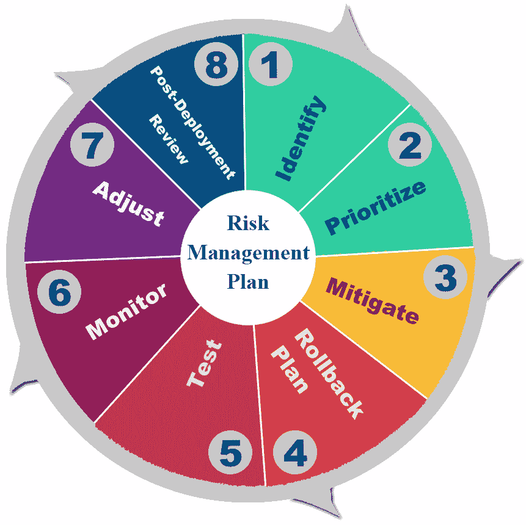
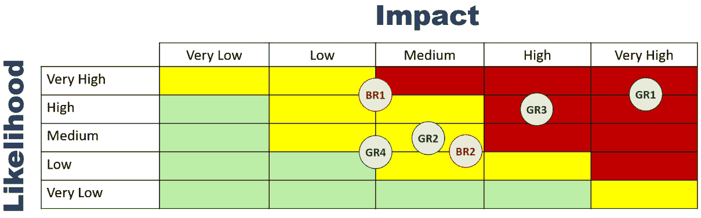
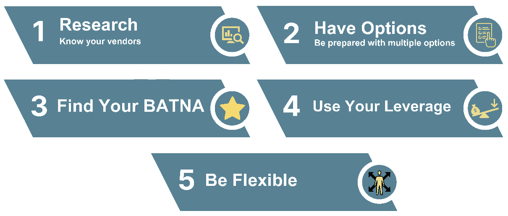

# 11

# 管理新系统的部署 – 绿色地带与棕色地带

在前面的章节中，我们讨论了构建 MSA 系统以及将 AI 算法集成以形成一个智能 MSA。我们涵盖了概念、技术和方法，并伴随着实例。

在本章中，我们将讨论不同的**绿色地带**和**棕色地带**部署考虑因素，以及以最小的操作中断顺利部署新的智能 MSA 系统的方法，以保持整体系统稳定性和业务连续性。

我们还将探讨如何克服一般的部署挑战，特别是在现有系统正在生产的棕色地带部署中，并实施一个成功有效的迁移计划，以实现新的智能 MSA 系统的迁移。

本章将涵盖以下主题：

+   部署策略

+   绿色地带与棕色地带部署

+   克服部署挑战

# 部署策略

组织在部署新系统时利用各种技术来最小化停机时间，并确保部署的顺利和成功。组织遵循的一些最常用的部署策略包括重建、斜坡、蓝/绿、金丝雀、A/B 测试和影子部署：

+   **重建部署**是一种简单直接的方法，涉及一次性替换整个基础设施，类似于我们在*第三章*中讨论的**大爆炸迁移**。这种方法最适合小型和简单系统；然而，这也意味着在部署过程中系统将完全离线，这可能导致显著的中断时间。

+   **斜坡部署**与我们在*第三章*中讨论的**滴答式迁移**类似。斜坡部署允许在部署过程中现有系统保持在线状态。新系统逐步上线，流量逐步路由到它，使得在整个部署过程中，两个系统都能对用户可用。尽管这种方法在小企业和简单系统中可能有效，但对于更大、更复杂的系统来说，这种方法是理想的，因为它可以最大限度地减少停机时间。

+   **蓝/绿部署**是一种技术，涉及维护两个相同的生产环境，分别称为“蓝”和“绿”，并将流量路由到其中一个。这允许在新的部署版本中遇到任何操作问题时进行无缝切换。这种方法最适合关键任务系统，因为它确保在任何给定时间都有可用的系统供用户使用。

+   **金丝雀部署**是一种技术，它涉及在新系统和现有系统并行部署，并将一小部分流量路由到新系统。这允许在完全推出之前，使用实际的生产流量对新系统进行测试。如果新系统中出现问题，可以根据遇到的问题类型重新评估推出；然后，在解决问题期间，可以恢复先前的系统。这种方法通常用于部署需要高可用性的关键系统更改。

+   **A/B 测试部署**是另一种方法，它涉及同时运行旧系统和新系统，但使用不同的用户子集进行测试，以确定哪个表现更好。这种方法最适合测试新系统功能或服务。

+   在**影子部署**中，新系统被部署以与现有系统并行运行。然后，旧系统的实时生产流量被重定向到新系统，以测试新发布的功能、系统在负载下的稳定性，或全面测试新系统。这种方法最适合在大型组织中部署的大型系统。

以下是对所有先前部署策略的比较总结：

|  | **持续在线** | **生产流量测试** | **成本** | **复杂性** |
| --- | --- | --- | --- | --- |
| 重建 | 否 | 否 | 低 | 低 |
| 逐步 | 是 | 否 | 低 | 低 |
| 蓝绿 | 是 | 否 | 高 | 中等 |
| 金丝雀 | 是 | 是 | 低 | 中等 |
| A/B 测试 | 是 | 是 | 低 | 高 |
| 影子 | 是 | 是 | 高 | 高 |

表 11.1：不同部署策略的比较

这些策略各有优缺点，没有哪一个适合所有情况。组织必须根据其具体需求和正在部署的更改的性质选择适当的策略。

正在被升级或替换的现有系统的复杂性、设计，以及其年龄、运行状况和所使用的技术堆栈，在确定部署策略方面发挥着重要作用。在下一节中，我们将讨论绿地和棕地部署及其对确定部署方法和计划的具体影响。

# 绿地与棕地部署

我们的智能 MSA 系统已准备好部署，我们现在需要详细考虑我们拥有的或需要获取的基础设施，以便在生产中部署系统。

我们需要解决的一些主要问题如下：

+   运行智能 MSA 系统所需的哪些基础设施细节？

+   我们是否有部署和高效运行系统所需的硬件和软件资源？

+   我们能否利用现有的基础设施和应用来部署新系统？

+   需要的基础设施与我们现有的基础设施之间的差异是什么，我们如何填补这个差距？

组织当前的基础设施设置和现有系统（如果有）在回答所有上述问题中起着至关重要的作用——也就是说，新系统是在绿色地带还是棕色地带环境中部署。

绿色地带部署是指从头开始构建和部署新的系统或基础设施，没有任何先前的系统或基础设施。因此，我们必须在没有重大限制、依赖性、集成工作或兼容性问题的前提下构建和运行新系统。

相反，棕色地带部署是指在新系统或基础设施已部署且现有系统在位的地点部署新系统或基础设施的过程。该地点可能具有现有的基础设施，如服务器、应用程序、网络组件等，这些可能被重用于部署新系统。

简而言之，绿色地带部署是从头开始的新起点，而棕色地带部署涉及在现有系统或基础设施之上构建，并可能处理一些集成问题、兼容性担忧和资源限制。

不论是绿色地带还是棕色地带部署，通常由组织的具体情况和组织的业务流程执行方式决定。尽管如此，了解每种部署类型的优缺点对于准确规划仍然很重要。

重要提示

如果成本节约是组织的主要关注点，我们应该尽可能多地利用现有的棕色地带基础设施组件。然而，我们需要以不会对已部署系统的效率、可靠性或功能产生负面影响的方式重用现有组件。

以下是在评估这两种部署类型时需要考虑的一些因素。

## 灵活性

因为在绿色地带（greenfield）部署中，我们是从头开始的，这给了我们设计、实施和优化新系统以适应组织特定需求的自由，而不受任何依赖组件或现有生产系统的限制。

相反，在棕色地带（brownfield）中，我们在设计或部署新系统的任何部分之前，必须始终考虑到已经运行的系统和它们的依赖性。这本身就可以限制新系统的部署、定制或优化。

## 可扩展性

与棕色地带相比，绿色地带的实施提供了更高的可扩展性，因为在绿色地带的实施中，我们部署新的基础设施而没有任何可能限制新系统设计或定制的现有约束。

这种缺乏限制给了架构师和系统设计师选择设计系统的自由，以便系统可以扩展，而无需考虑可能阻碍系统功能或扩展的底层技术或现有设备。

然而，在棕色场地的案例中，现有的基础设施可能包含遗留系统，这些系统在可能的情况下可能会部分或全部重用。重用遗留系统的不同部分可能会阻碍新系统的可扩展性。

此外，遗留系统通常比现代系统占用更多的物理空间，并且功耗更高，这给整个系统的可扩展性增加了更多限制。

话虽如此，随着我们部署新系统并逐步更新现有基础设施，我们将使用最新的技术和现代系统，这将释放物理空间并降低电力需求。这反过来将帮助我们最终更好地扩展系统。

## 技术栈

在绿色场地的部署中，我们有利用最新技术、应用程序和工具的自由，这可以在许多其他事情中增强性能、安全性和能力，并延长系统的整体使用寿命。

在棕色场地环境中，遗留系统使用较旧的技术、硬件、工具和系统，这可能会对系统的可支持性、功能、可扩展性以及未来的扩展和集成引入限制。

## 集成

如在其他比较方面的解释所述，在绿色场地环境中，系统的所有组件都是新的，并且是从一开始就设计和构建来无缝协同工作的。因此，集成根本不是问题。

然而，在棕色场地的部署中，将新系统与现有的 IT 基础设施集成可能会具有挑战性，因为这两个系统可能不完全兼容。可能需要集成努力，以便旧的和新的组件能够协同工作，即使如此，新的混合系统也可能后来提供运营挑战，这可能导致不可预见的技术故障。

## 成本

从采购和资本支出（CAPEX）的角度来看，从头开始构建新系统的成本高于从重用和新建组件的混合中构建系统。

要设置新系统，需要一定程度的专长，这可能不在内部可用。将系统启动并运行所需的努力和专长肯定会有相关的成本。然而，可以争辩说，这种成本可以通过整合新旧组件所需的努力和专长来轻松抵消。可能需要不同的努力和不同的专长，但成本相似。

当谈到运营支出（OPEX）时，在绿色场地的部署中，我们需要考虑新部署的技术和系统的培训成本，以及由于缺乏新系统实际操作经验可能导致的潜在运营错误。在棕色场地的部署中，这些培训成本通常较低。

在绿色场地的部署中，由于新系统和技术的通常目标是优化电力使用，因此电力消耗通常较低。

另一个重要的运营成本（OPEX）考虑因素是棕色地带实施中的潜在**技术债务**。技术债务是组织为了使系统上线而采取的捷径。换句话说，这涉及到在部署期间采取临时措施来解决集成或运营问题，并实现短期结果，这些结果在长期可能是灾难性的。

## 市场投放时间

市场投放时间是部署中的一个有趣方面，可以朝两个方向发展。一般来说，在绿地环境中部署一个系统比与已经存在的运行良好的系统集成要花费更长的时间，就像在棕色地带环境中那样。但这将高度依赖于现有系统的复杂程度。

如果我们在一个显著老旧或复杂且无序的基础设施上部署我们的新系统，我们可以认为从头开始部署一个全新的系统比尝试成功集成两个系统要简单得多，也能节省时间。

## 风险

这是部署中可以双方辩论的另一个方面。

由于缺乏对新基础设施、新技术、新系统、新工具和新应用的经验，系统操作失误的可能性更大，解决问题的耗时也可能更长。相比之下，如果没有备份系统，如果新系统未能按预期运行，将没有回退选项。

但再次强调，如果棕色地带环境中的旧系统过于复杂或无序，由于集成复杂性、潜在的技术债务、旧的不受支持的组件等因素，棕色地带部署的风险会更高。

## 员工入职

已经使用现有系统的公司对其工作原理有更好的理解，对其操作和潜在问题的洞察力也更强，这可以使部署过程和系统操作更加顺畅。

在绿地部署中，在员工开始熟悉系统细节之前，需要培训和积累经验。

## 用户接受度

新系统的用户接受度可能需要适应新的日常任务执行方式，内部和可能的外部业务运营方式的转变，以及组织如何处理内部和外部客户。这种转变可能需要改变组织文化，这可能会对系统的成功实施构成重大挑战，并在部署后揭示运营不足。

在棕色地带环境中，更新后的系统功能可能对用户来说是渐进的或相对透明的，这使得用户接受度比在绿地部署中部署一个全新的系统要容易得多和快得多。成功的逐步用户接受度有助于揭示潜在的设计、实施和运营缺陷，这些缺陷可以迅速解决和修复。

在任何情况下，都需要用户培训，但在绿地部署中，培训比棕地案例更为复杂和耗时。

下表总结了部署中绿地和棕地方面的比较：

|  | **绿地** | **棕地** |
| --- | --- | --- |
| 灵活性 | 高 | 低 |
| 可扩展性 | 高 | 低 |
| 技术栈 | 灵活且优化 | 受限 |
| 集成 | 最小到无 | 需要大量努力 |
| 成本 | 初始投资成本高但运营成本较好 | 初始投资成本较低但运营成本较高 |
| 市场时间 | 通常更长 | 通常更短 |
| 风险 | 通常更高 | 通常更低 |
| 员工入职 | 过程更长 | 时间更短 |
| 用户接受度 | 慢 | 快 |

表 11.2：绿地与棕地

在本节中，我们讨论了绿地和棕地部署之间的主要区别，每个环境的优缺点，需要考虑的因素以及原因。

在下一节中，我们将讨论如何克服两种环境中的部署挑战以及每种情况下的部署最佳实践。

# 克服部署挑战

我们现在已经了解了绿地和棕地环境中系统部署的不同方面，以及系统设计和实施过程中可能出现的几个挑战。在本节中，我们将介绍一些概念、策略和方法，以减轻这些挑战，确保系统部署顺利且成功。

我们应该以一个具备项目、部署和项目管理以及供应商管理方面多样技能和经验的稳固项目团队开始我们的部署项目。

在缺乏内部经验的情况下，可能需要通过第三方将一个或多个项目经验领域外包。合作伙伴可能包括系统集成商、设备供应商和增值经销商。

这个经验丰富的团队将帮助进行彻底的规划和研究，以便能够理解组织的具体需求、潜在风险、当地法规以及任何必要的合规需求。

遵守行业和当地法规是项目的一个基本部分。除了项目的技术方面和技术之外，例如处理信用卡的系统将需要具有 PCI 合规性和规则经验的团队成员。例如，在美国部署的医疗系统可能需要具有 HIPAA 合规性需求经验的成员，等等。

项目管理对于建立清晰的团队沟通和协作至关重要。项目经理帮助跟踪项目过程、变更和需求，并确保在整个项目周期内满足时间表和目标。项目经理还确保所有利益相关者在项目的不同阶段都得到适当的告知和参与。

项目管理风格或方法的类型取决于组织本身、时间表以及实施细节和技术部署。无论是瀑布、敏捷、Scrum 还是其他，项目经理必须与团队一起决定。

解决部署挑战是项目周期内追求的任务。我们在这里关注项目周期的这一方面，特别是关于绿色地带和棕色地带部署。

在任何部署活动之前，对部署风险的全面了解是必要的。因此，制定一个明确的部署风险计划至关重要，以便能够识别风险并减轻每个风险，以确保部署成功。

下图说明了我们部署周期的风险管理流程。该流程应从识别风险、确定避免或最小化风险的方法、制定缓解计划开始，并持续测试、监控和审查部署，以更新缓解计划，以应对实施过程中出现的新风险或挑战：

图 11.1：克服部署挑战的主要步骤

在以下小节中，我们将讨论风险管理计划的主要活动和每个阶段如何与我们的部署活动相关。 

## 识别部署风险

为了解决部署挑战，我们首先识别我们在部署系统时可能遇到的风险。在绿色地带环境中，我们之前识别出的风险如下。**绿色地带风险**被称为**GR**：

+   **GR1**：高资本支出

+   **GR2**：部署时间

+   **GR3**：由于缺乏培训和经验丰富的员工，系统故障

+   **GR4**：用户采用缓慢或不足

在棕色地带环境中，我们之前识别出的风险如下。**棕色地带风险**被称为**BR**：

+   **BR1**：由于可能低灵活性和可扩展性以及一些重用的遗留技术，系统功能限制

+   **BR2**：高运营成本

既然我们已经识别出潜在的风险，现在是时候根据它们发生的可能性和对项目可能产生的影响来优先排序它们。这将帮助我们计算**风险暴露**并有效地规划和分配适当的资源。

## 优先排序风险

风险暴露是风险概率乘以该风险对部署项目的影响。风险暴露越高，减轻该风险的优先级应该越高。

*图 11**.2* 展示了之前识别出的风险的彩色编码风险暴露矩阵。请注意，由于各种因素，如项目复杂性和组织需求、现有系统的稳定性和复杂性、项目要求、预算、时间表等，组织之间的风险暴露水平可能会有很大差异：

图 11.2：风险暴露矩阵

我们总是从风险缓解图的右上角到左下角进行优先级排序。红色区域，其中风险和可能性为中等至高，是我们需要开始分配资源的地方。接下来是黄色区域，然后是绿色区域。

因此，我们应该从绿色地带风险#1（GR1）开始，即如何缓解高资本支出风险，然后是 GR3，我们缺乏部署新系统的经验人员，然后是 GR2，新系统部署时间可能成为问题，最后通过解决 GR4 来结束绿色地带风险的缓解，我们可能面临新系统缓慢的用户采用。

对于棕色地带风险缓解，我们首先从棕色地带风险#1（BR1）开始，因为它在矩阵的红色区域有更高的暴露度，然后进行 BR2。

风险并非总是可以避免的。风险往往无法避免。在风险消除不可能的情况下，缓解计划必须解决如何至少将风险降低到可管理的水平。

许多组织选择忽略低/非常低可能性和低/非常低影响的风险。在这种情况下缓解风险的过程可能非常昂贵，甚至比风险本身更具风险性。

## 制定和实施风险缓解计划

我们需要制定一个缓解计划来管理已确定的风险。该计划应包括为缓解或消除风险而采取的具体行动，涉及的资源，以及风险发生时的应急措施。

我们还需要根据每个风险的计算暴露度来确定我们的风险缓解策略。正如我们将在接下来的几个子节中看到的，这些策略可以包括实施操作保障措施，使用额外的系统组件采取额外措施，在部署前测试系统，培训系统用户和管理员以确保他们能够有效地使用新系统，以及在出现任何意外部署问题时制定回滚计划。

让我们将所有这些应用到我们的部署项目的已确定风险中。

### GR1 - 高资本支出风险

当面对高资本支出风险时，我们需要关注几个方面——首先，项目预算，其次，系统和项目需求，第三，如何使用有效的谈判技巧来获取成功满足所有系统需求的必要基础设施。

当然，有时预算和时间限制成为获取所有需求清单项目的障碍。因此，优先考虑你的需求很重要，尤其是如果你有严格的预算限制。

目标是获取能够满足我们所有愿望清单要求的基础设施；然而，在某个时候，我们可能需要为了满足我们的预算而放弃系统的一些理想功能。这就是我们的谈判技能变得至关重要的地方。我们的谈判技能越强，成功部署新系统并在预算内满足所有要求的可能性就越大。

回顾一些重要的谈判技巧对我们实现目标是有用的。

首先，对可能参与提供基础设施资产的所有供应商进行彻底的研究。这包括每个潜在供应商的技术和业务优势与劣势、他们的标价、他们的部署和运营支持的质量水平、他们的产品路线图以及他们的未来业务展望。

然后，我们可以从我们的供应商研究中提出多个选项。拥有多个选项在我们与供应商的谈判阶段提供了更多的灵活性和议价能力。

在所有可用的选项中，拥有一个明确的**谈判协议的最佳替代方案**（BATNA）是至关重要的。BATNA 意味着如果谈判失败且与基础设施供应商没有达成协议，我们可以实现的最佳选择。这是在谈判没有按照我们最初与特定供应商的计划进行时，我们可以依赖的备选方案。

在谈判过程中拥有一个明确且定义良好的 BATNA 对于展示强大的议价能力至关重要。BATNA 让供应商感受到，如果他们不关闭基础设施收购交易，他们可能会错失多少。

BATNA 还有助于我们了解何时应该从谈判中退出，如果供应商不愿意用可用的预算满足我们的基础设施需求。这关乎我们可用的替代方案以及选择或未选择特定供应商的后果。

较大且声誉良好的组织可以利用杠杆。杠杆是指利用你的声誉、市场地位或市场规模来影响谈判结果的能力。杠杆在与供应商达成良好交易时可以非常有效。供应商通常努力在大组织中站稳脚跟，以创建客户参考或作为从该特定交易中创造更多业务的方式。

话虽如此，在谈判过程中展示一定程度的灵活性是至关重要的。灵活性将展示我们愿意妥协的意愿，并可能促成与供应商之间强大而健康的长期业务关系：

图 11.3：谈判策略

*图 11**.3* 总结了你可以遵循的谈判策略，以最小化因基础设施成本和整体项目资本支出（CAPEX）超支的风险。

另一种减轻 CAPEX 风险的有效方法是使用云服务提供商来部署您的新基础设施，尤其是在项目的初始测试和调整阶段。

使用容器化和虚拟化来构建新的工作负载是帮助减少资本支出风险（CAPEX）的另一种方式。然而，这样做可能会引入一些运营支出（OPEX）和其他类型的部署风险，尤其是如果工作人员在云环境部署方面的培训不足。

### GR2 – 部署时间风险

在部署新项目时，尤其是涉及新技术、技术和概念的项目，不能忽视可能落后于进度表的风险。整个项目周期总是伴随着一个学习曲线。

此外，潜在的频繁变更和范围蔓延也需要考虑。这进一步强调了从一开始就组建一支熟练团队的重要性。

一支高技能和受过良好训练的项目团队将有助于最小化范围蔓延和时间延迟风险。在没有内部领域专家的情况下，聘请外部方作为系统集成商并为团队制定充分的培训计划，在管理时间延迟风险时变得至关重要。

除了团队技能之外，还可能有其他因素会影响项目时间表和范围蔓延风险。作为我们的风险缓解计划的一部分，我们需要考虑所有这些因素，并确保它们得到控制，从而控制它们相关的风险。

MSA 系统可能非常复杂且部署负担沉重。系统越复杂，预测和管理部署时间表就越困难。

在棕色地带，新系统的部署往往取决于现有系统的可用性和运行稳定性。此外，将新系统与现有系统集成可以增加另一个复杂层次和时间消耗的任务，所有这些都可能延长整体部署时间表。

为了减轻复杂性对整体风险的影响，一种方法是避免大规模和一次性变更。相反，通过将部署分解成多个简单阶段和阶段来逐步进行。遵循著名的爱因斯坦规则，“*一切都应该尽可能简单，但不能过于简单*”。尽可能简化，但不要以牺牲系统的功能或可靠性为代价。

虽然彻底测试对于确保新系统的可靠性和符合组织需求是必要的，但在复杂项目中，过度分析和过度测试经常发生。这个过程可能会显著延迟系统部署。

解决测试延迟因素的一种方法是在生产环境中以**有限可用性**（**LA**）的方式运行系统，一个测试版，或者某种形式的预发布期。这种 LA 方法将帮助我们将真实用户流量应用于系统，同时我们专注于在将系统过渡到全面生产之前，根据需要监控和进行系统更改。

### GR3 和 GR4 – 系统故障风险和用户采用风险

用户采用程度可能高度依赖于任何新的**用户界面/用户体验**（**UI/UX**）变化或增加的复杂性。假设系统 UI/UX 设计良好，系统故障和缓慢的用户采用风险也取决于项目团队和运营团队的经验，以及用户对在该系统上工作的熟悉程度。

为了使经验和用户熟悉度风险正常化，重要的是首先在项目开始时就包括一个稳固的 UI/UX 设计团队，然后通过确保项目赞助者和高管的大力支持来采用自上而下的方法。

自上而下的方法将有助于采用组织在采用新系统进行业务运营时所需的过程和变化，以实现文化转变。这种承诺还可以帮助强制实施针对系统用户和项目团队的培训计划。这种培训可以显著帮助弥合项目团队现有经验与所需经验之间的差距。

### BR1 – 系统能力限制

由于我们正在部署新系统，同时使用了一些在现有系统中使用的较旧组件，我们可能会遇到集成兼容性问题、较旧硬件和软件功能的限制，以及在流量、数据负载或存储方面的扩展限制。

此外，具有遗留组件的系统可能会比预期更快过时。这可能导致不再可用的软件和硬件组件，或者发布商停止支持的通知，这将缩短新系统的使用寿命。

当系统组件不再受支持时，供应商无法再提供部件更换或软件更新，甚至无法协助解决在不受支持的组件上出现的任何运营问题。这可能会严重影响系统的可靠性，并危及组织的业务连续性。

为了减轻系统能力限制的风险，我们必须对每个重用的遗留系统组件的供应商产品图有清晰的可见性和理解，以及对组件依赖性的清晰可见。这种理解将帮助我们评估该组件对部署的系统的可扩展性水平、未来运营可靠性和稳定性的影响。

### BR2 – 高运营成本

正如我们之前解释的，整合新旧系统可能会引入许多部署和运营挑战，这会使系统变得更加复杂，并引入技术债务、高维护成本和高运营成本，以保持系统平稳运行。

安全性也是棕色地带部署中的一个主要关注点。技术债务，以及新旧组件的混合，可能会引入现有基础设施中不存在的安全漏洞，这可能导致昂贵的数据损坏、数据丢失、数据恢复、安全漏洞和不可逆转的声誉损害。

为了减轻这些风险，组织在部署之前应该彻底评估现有系统每个可重用组件的影响，并进行清晰的成本效益分析。

此外，在数据丢失或损坏的情况下，制定一个强大的灾难恢复和备份计划对于减轻一些运营成本风险至关重要。

所有上述风险示例及其缓解策略都应作为开发的风险缓解计划的一部分进行彻底讨论，包括逐步指南和文档。

如果发生任何这些风险，尤其是在棕色地带的情况下，即现有系统可能已经运行的情况下，应立即执行全面的回滚计划。回滚计划是克服部署挑战的下一步。以下小节将带我们了解回滚计划是什么以及它包含的内容。

## 回滚计划

记住墨菲定律，它指出“*任何可能出错的事情都会出错*”？

我们多久会创建一个坚实且精心制作的实施或迁移计划，期望系统平稳过渡，但在计划执行过程中却遭遇意外和奇怪的行为？

这里有一个经验法则，那就是在部署过程中任何事都可能出错。我们做了足够的规划和预防措施以确保不出错，但不幸的是，事情并不总是如我们所愿。我们可能仍然会忽略某些事情，系统错误可能会被触发，设备故障可能会发生，等等。

因此，制定回滚计划是维持业务连续性的必要条件。我们应该以包含明确的步骤和程序的方式制定计划，以便在更改之前将系统恢复到初始状态，并快速恢复正常运营。

如前所述，采用分阶段部署方法可以帮助快速回滚仅部分更改，这有助于我们避免浪费资源、宝贵的更改窗口时间和部署过程中投入的努力，以及开发部署计划。

## 测试、监控和调整

克服部署挑战的下一步是测试和验证系统需求与功能，以确保其满足性能、功能和操作要求。

当项目团队面临时间压力时，往往会将系统安全置于系统功能之上。数据安全和数据保护如果被忽视，可能会严重影响项目的整体部署和可靠性，尤其是对于处理关键用户数据并必须遵守某些法规和合规法案的系统，如 PCI 或 HIPAA。

因此，测试计划必须有一个专门针对系统安全和合规性测试的部分。聘请该领域的专业公司有助于最大限度地降低数据泄露或其他安全事件的风险。

随着我们逐渐将测试和生产负载应用到系统中，测试计划应该能够确保部署的系统具有可扩展性和足够的灵活性，以适应不断变化的需求和需求。这在棕色场部署期间的测试计划中是一个关键方面，因为与现有系统的集成可能会阻碍整体系统的能力。

然后，我们需要在整个项目期间持续和仔细地监控和审查已识别的风险，以确保风险缓解计划有效，并且任何新的风险都能得到及时识别和处理。

任何新识别的风险都必须通过项目变更管理流程纳入缓解计划。新识别的风险和缓解策略需要通知所有利益相关者，包括项目团队、组织的管理层和系统用户。

## 部署后和预生产审查

一旦部署完成，系统将投入运行，经过测试，并以预生产或 LA 模式运行。在关闭部署项目之前，我们需要评估我们风险管理计划的有效性，确定任何需要改进的领域，并记录我们的发现结果。然后，这些结果可以整合到同一项目部署工作中，或者结束现有部署，并为此启动一个新项目。

部署后评估将确保新系统的持续稳定性、性能和可靠性。

在棕色场中，我们可能会采用双模方法运行，其中两个系统同时运行并服务于用户，但以不同的方式和不同的级别。在这种情况下，我们需要考虑为每个系统建立特定的角色和责任矩阵。这有助于简化操作并提高系统的可支持性。

# 摘要

在本章中，我们介绍了绿色场和棕色场部署，以及它们之间的区别、优缺点、部署过程中的风险细节以及每个部署案例中每个风险的特定情况。

我们还提供了与绿色场和棕色场部署相关的风险示例，以及缓解这些风险的策略，以更好地理解成功部署新系统所涉及到的挑战。

本章讨论的主题作为对我们将在下一章学习内容的介绍。在下一章中，我们将应用本章所学的一些知识，并讨论测试、监控和更新我们新的 ABC-智能 MSA 系统的方法。
