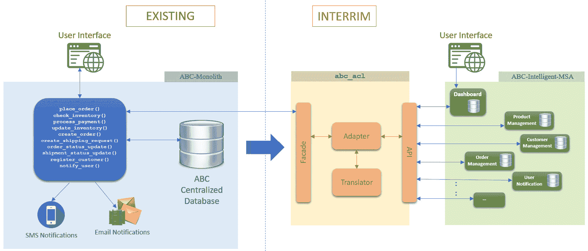
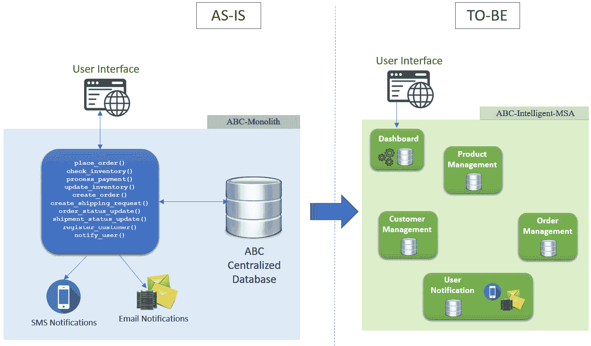
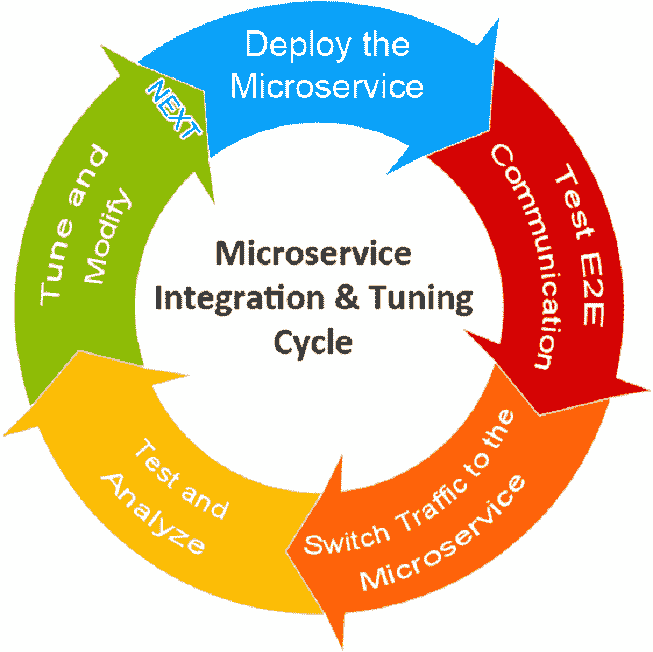
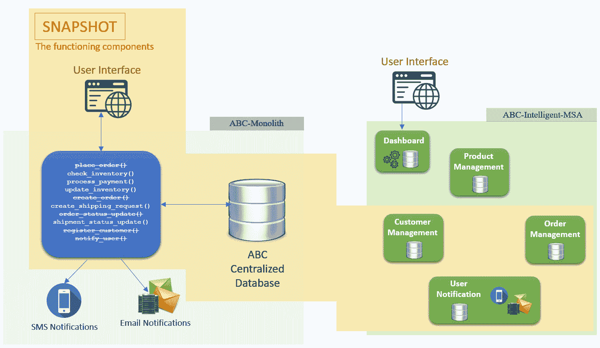

# 第十二章：部署、测试和运营智能 MSA 企业系统

在前面的章节中，我们详细讨论了微服务、单体架构、每种架构的优缺点、如何过渡到 MSA 以及如何使用 AI 服务使 MSA 系统更智能。我们还在 *第十一章* 中讨论了部署 MSA 系统的一些最佳实践。

在本章的最后，我们将整合整本书中涵盖的所有主题和概念，以了解我们如何通过实际和实用的示例应用我们所学的知识。

在我们深入细节之前，我们需要首先了解我们现有的系统是什么。

显然，每个组织都是不同的，并且有不同的部署需求、标准和依赖关系。一些组织将在绿地（全新环境）部署，而另一些组织将在棕地（现有环境）部署。为了向您详细介绍部署、测试和操作智能 MSA 系统的详细实际示例和步骤，我们将假设一个具有现有单体架构系统的棕地环境。

我们有时会以我们的 ABC-Monolith 作为现有系统的例子来阐述本章中涵盖的概念。在本章中，我们将涵盖以下主题：

+   克服部署依赖关系

+   部署 MSA 系统

+   测试和调整 MSA 系统

+   部署后的审查

# 克服系统依赖关系

在部署我们在 *第十章* 中构建的 ABC-Intelligent-MSA 系统之前，首先决定我们的部署策略是什么非常重要。根据需求、成本、复杂性和我们在 *第十一章* 中讨论的部署策略的优缺点，我们相信 ABC 系统的最佳部署策略将是渐增部署和金丝雀部署策略的混合。

这种部署策略将使我们能够在部署新的 ABC-Intelligent-MSA 系统的同时保持 ABC-Monolith 系统在线并服务用户，不间断地运行。我们将逐步用 ABC-Intelligent-MSA 系统中的相应微服务替换 ABC-Monolith 中的旧组件。这可以通过将流量从旧组件路由到 ABC-Intelligent-MSA 系统的微服务来实现。

虽然这种涓流式方法比其他部署方法具有更低的成本、更低的复杂性和更低的风险，但我们仍然需要仔细研究新旧组件之间的不兼容性、依赖关系和适当的集成。

此外，我们还需要评估我们的基础设施和现有系统 ABC-Monolith 的哪些组件可以在新的架构中重用，如果有的话。

## 可重用的 ABC-Monolith 组件和依赖关系

我们无法想到一个具体的 ABC-Monolith 代码库组件可以未经修改直接重用。所有的 ABC-Monolith 组件都必须从头开始重写或者进行不同程度的修改，以便与 ABC-Intelligent-MSA 系统兼容。

我们知道可以重用的 ABC-Monolith 和现有基础设施组件包括业务逻辑本身、服务器基础设施、操作系统、虚拟化基础设施、数据存储、网络基础设施、现有的监控和网络管理工具，以及一些软件和数据库许可。尽管如此，即使这些组件也可能需要更新或升级，以便执行新系统的功能。

在我们之前章节中列出的系统安装、命令行和代码示例中，我们使用了最新的 Ubuntu、Python 和数据库版本。然而，在实际情况下，情况可能并非如此；我们可能会在较旧的操作系统上运行单体应用程序，并且使用较旧的 Python 和/或数据库版本。

这些情况可能会导致旧组件和新组件之间产生一些不兼容性。例如，较旧的 Python 版本可能有一些已弃用的函数，在新 MSA 代码库中不再有效，因此，需要对现有系统进行一些更新或升级。此外，可能不同的技术栈也可能产生更多的依赖。

为了最小化这些依赖，我们宁愿在具有自己环境（包括自己的数据存储和自己的技术栈）的独立服务器或虚拟基础设施上部署新的系统组件。新的环境将有一个容器引擎，它将携带我们所有的 ABC-Intelligent-MSA 微服务。

重要的是要注意，每个系统都是不同的，可重用和非可重用的组件将根据现有的单体系统而有所不同。对现有系统组件进行彻底的分析和评估是必要的，以确定在迁移到微服务架构时可以和不能重用哪些组件。

## 缓解 ABC-Intelligent-MSA 部署风险

在*第十一章*中讨论的一些风险与我们的场景相关。然而，我们仍然需要确定哪些资本支出风险是适用的，检查与部署时间、潜在的服务中断和运营成本相关的风险，并采取具体措施来缓解这些风险。

由于我们在实现中是在虚拟化基础设施之上使用容器，因此资本支出风险显著降低。只要现有基础设施有足够的存储和工作负载容量来吸收新的 ABC 系统，我们就是安全的。如果需要额外的基础设施资源，我们可能需要考虑一些容量规划和升级，以便在部署期间和部署后运行系统。

采用渐进式迁移方法给我们提供了快速赶上新部署技术中涉及的学习曲线的机会，这反过来有助于缓解系统故障风险和部署延迟。

逐步部署策略也有助于缓解其他 OPEX 风险。正如我们将在本章讨论的，在部署过程中，我们可以测试和监控新部署组件的性能，识别和解决任何问题，并在将所有流量重定向到这些新组件之前进行必要的调整。

另一种缓解 OPEX 风险的方法是通过建立一个结构化和透明的变更管理流程来建立一个强大的变更管理流程。这包括创建明确的指南，说明如何提出、评估、批准和实施变更，以及向相关利益相关者传达变更。

变更管理过程的一部分是回滚计划。如果特定的技术更改失败，回滚计划对于将系统恢复到操作状态至关重要。以下是我们需要考虑的步骤，以构建一个成功的回滚计划：

1.  指定一些变更检查点，在这些检查点可能需要回滚。在我们的例子中，如果使用 ACL，ACL 将在将任何流量切换到新微服务之前部署。在变更期间（以及将一些测试流量切换到 ABC-Intelligent-MSA 之后），一些好的检查点示例如下：

    1.  测试 ABC-Monolith 和 ACL 之间的支付验证通信

    1.  测试 ACL 如何处理请求

    1.  测试 ACL 和 ABC-Intelligent-MSA 系统之间的通信

    1.  测试整体端到端请求的处理方式以及它们是否按预期处理

测试和排除 ACL、单体和 MSA 之间通信的常见 Docker 和 Linux 命令包括以下内容：

+   `curl`，用于模拟对 ACL 或特定微服务的 API 调用

+   `netstat`，用于检查特定服务是否正在积极监听连接，监听端口是什么，以及是否存在任何活动连接

+   `docker inspect`，用于返回特定微服务的配置、状态和网络设置的详细 JSON 信息

+   `docker log`，用于查看运行容器的日志

1.  为每个先前指定的检查点制定一个逆转变化的计划。

1.  在可能的情况下，在测试或预生产环境中测试回滚计划，以确保其可行性和完整性。

1.  了解在每个指定的检查点，回滚计划需要完全执行的时间，并在您的变更中为其分配合理的时间。

1.  在变更期间监控系统，并根据需要做出调整。

1.  变更后进行事后分析，特别是在变更失败的情况下。

1.  如果执行回滚计划，团队需要在事后分析变更失败的原因以及回滚计划的有效性。他们需要在安排下一次变更之前对部署和回滚计划进行必要的调整。

到目前为止，我们应该对部署依赖关系和风险有清晰的理解，并能够确定缓解它们的方法。我们现在准备好创建一个部署计划，并以最小化停机时间和保持业务连续性的方式执行它。

在下一节中，我们将构建在运行中的 ABC-Monolith 系统存在的情况下 ABC-Intelligent-MSA 系统的部署计划。

# MSA 系统的部署

在*第九章*和*第十章*中，我们详细讨论了如何为 ABC-Intelligent-MSA 系统安装 Docker、容器和其他组件。这个安装主要是在实验室环境中完成的，没有特别考虑环境中的任何现有系统。我们基本上只是在模拟现实生活中的开发或预发布环境。

在本节中，我们将重点关注如何将我们构建的 ABC-Intelligent-MSA 系统逐步迁移到已经运行 ABC-Monolith 系统的 brownfield 生产环境中。目标是逐步提升 ABC-Intelligent-MSA 系统的运行能力，直到系统能够承载全部现有流量，然后完全淘汰旧的 ABC-Monolith 系统。所有操作都应尽量减少运营中断。

到目前为止，我们仍在生产中运行 ABC-Monolith，ABC-Intelligent-MSA 运行在预发布环境中。以下是与执行步骤详细分解的部署计划。

## 防腐层

我们的 ABC-Monolith 和 ABC-Intelligent-MSA 系统使用相同类型的 RESTful API 和相同的 JSON 数据格式。此外，我们的演示系统并不复杂，不足以证明 ACL 的必要性。因此，在我们的迁移中我们不需要 ACL。然而，我们还是在演示中开发了一个 ACL，以防你决定尝试它。

如果你感兴趣尝试 ACL，你需要做的第一步是启动 ACL。ACL 将充当缓冲区并处理 ABC-Monolith 和 ABC-Intelligent-MSA 系统之间的通信。



图 12.1：使用 ACL 进行部署

ACL 通常是针对组织特定情况、旧系统和新的 MSA 系统定制的特定代码。我们为 ABC 系统构建了`abc_acl` ACL。`abc_acl`代码可以在我们的 GitHub 仓库中找到。

在单独的主机或虚拟工作负载上部署所有新组件，包括`abc_acl`，会更有意义。然而，在我们的实验室示例中，为了简化，我们是在运行 ABC-Monolith 的主机上构建新系统的容器。

我们将**门面**、**适配器**和**翻译器**组件作为一个整体构建到 ACL 中，作为一个微服务的一部分。门面是为了与 ABC-Monolith 接口而创建的，适配器是为了与 ABC-Intelligent-MSA 接口，而翻译器用于输入/输出数据格式映射。由于我们在单体和 MSA 系统中使用相同的数据格式，翻译器代码不做任何处理，仅用作占位符。

我们可以像在*第九章*和*第十章*中处理其他微服务一样设置并启动`abc_acl`微服务，使用`docker build`命令从 Dockerfile 构建`abc_acl_image`镜像，然后使用`docker run`命令创建`abc_acl_container`容器，如下所示：

```py
$ docker build -t abc_msa_customer_management ~/
```

一旦镜像成功创建，使用以下命令运行容器，并开始在主机的 IP 上监听 TCP/8020 端口：

```py
$ docker run -itd -p 8020:8080 --name abc_acl_container abc_acl_image
```

现在 ACL 正在运行，在将任何流量路由到它之前，是时候对其进行测试了。我们可以使用与之前章节中相同的方式使用 shell `curl`命令，或者我们可以使用一些 ACL 内置的 API 工具来验证连接。

以下是在主机机器上发出的`curl`命令，以确保 ACL 正在成功运行：

```py
$ curl http://192.168.1.100:8020/
<!DOCTYPE html>
<head>
   <title>The Anti-Corruption Layer Microservice</title>
</head>
<body>
   <p>This is the ACL Microservice Part of ABC System. This ACL is used as part of the process of migrating ABC-Monolith to the new system, ABC-Intelligent-MSA </p>
</body>
```

以下是一个测试 ACL 的另一种方式的示例——更具体地说，是测试 ACL 与 ABC-Monolith 和 ABC-Intelligent-MSA 系统之间的通信：

```py
$ curl http://192.168.1.100:8020/api?func=test_com
{"monolith_com_test": "Communication SUCCESSFUL", "msa_com_test": "Communication SUCCESSFUL"}
```

第一个`curl`命令确保 ACL 正在监听来自 ABC-Monolith 和 ABC-Intelligent-MSA 的 API 调用，而第二个`curl`命令确保 ACL 可以成功与这两个系统通信。

ACL 操作现在已验证；在下一小节中，我们将开始将 MSA 服务从预发布（或实验室）环境迁移到运行旧单体系统的实际生产环境。

## 集成 MSA 系统的服务

现在 ACL 已经启动并成功测试，我们准备开始将特定流量切换到 ABC-Intelligent-MSA 的特定部分。然而，由于在我们的演示示例中 ACL 实际上并不需要，我们将使用单体和 MSA 系统之间的直接交互。

请注意，根据现有的单体结构、设计和系统代码库，这个过程可能非常简单，也可能非常复杂。我们的部署策略需要在对单体系统进行一些代码更改后，才能将部分流量路由到新的 MSA。

因此，在某些系统中，我们完全可以在预发布环境中对 MSA 进行彻底测试，然后将 MSA 置于 LA 阶段，让部分生产流量通过系统进行更深入的测试。一旦我们对新的 MSA 系统的性能感到满意，我们就可以开始转发整个生产流量，并最终关闭旧的单体系统。

*图 12**.2* 展示了迁移前后的高级视图。在迁移过程中，我们将 ABC-Monolith 的一个特定功能路由到 ABC-Intelligent-MSA 中的一个微服务。该微服务应该能够替换 ABC-Monolith 系统中相应的功能。在测试该部分迁移的操作后，我们然后迁移另一个单体功能的流量，然后是另一个，以此类推，直到我们将所有 ABC-Monolith 功能迁移到 ABC-Intelligent-MSA 系统中。



图 12.2：我们的当前位置和目标位置的高级视图

我们可以从一个简单的微服务，如`abc_msa_notify_user_container`开始。我们可以通过将函数的代码替换为对`abc_msa_notify_user_container`的 API 调用，来路由目的地为 ABC-Monolith 中`notify_user()`函数的流量。所有用户流量仍然会通过 ABC-Monolith，但所有用户通知都将通过 ABC-Intelligent-MSA 处理。

同样地，`abc_msa_customer_management_container`应该替换 ABC-Monolith 中的`register_customer()`函数，以及`place_order()`和`order_status_update()`函数等。

随着系统的稳定，我们逐渐迁移到其他 MSA 服务。该迁移周期在*图 12**.3*中显示。

通过遵循迁移周期，最终，所有 ABC-Monolith 功能都将被 ABC-Intelligent-MSA 系统中的微服务所取代。



图 12.3：微服务集成测试和调整周期

*图 12**.4* 展示了在迁移过程中的系统状态快照。在图中，我们已经成功迁移了**通知管理**、**客户管理**和**订单管理**微服务，但其他任何微服务尚未迁移。



图 12.4：迁移过程中的系统快照

在单体功能迁移期间，密切监控系统，并在必要时使用回滚计划。一旦最后一个 ABC-Monolith 功能迁移到新系统，我们将在 ABC-Intelligent-MSA 系统上运行一个端到端测试，以确保系统正常运行且独立于 ABC-Monolith。

在测试过程中，测试所有微服务日志和统计信息是至关重要的。在迁移过程中，我们需要在每个步骤都建立正式的测试流程。测试过程将在下一节中更详细地描述。

保持两个系统运行一段时间，以防出现一些未预见的问题，并始终准备好应急计划。

最后一步是关闭单体。如果迁移步骤被正确遵循和测试，用户流量和系统操作不应受到影响。然而，复杂的系统可能有一个或多个组件仍在处理流量。为了避免这种情况下的业务中断，最好在维护窗口期间关闭单体，以便迁移团队能够分析任何意外问题并制定解决这些问题的计划。

在本节中，我们使用我们的 ABC 系统，通过 ACL 和直接单体到微服务的途径解释了 MSA 系统的部署过程。我们涵盖了需要采取的步骤、需要注意的事项以及如何以最小的系统中断尽可能使过渡到新系统变得顺利。

在下一节中，我们将介绍在每次微服务迁移后应计划并遵循的正式测试方法，以确保系统的可靠性和稳定性。

# 测试和调整 MSA 系统

在部署微服务之前，应该对每个微服务应用正式的测试或质量保证流程，以防止部署和生产过程中的错误。

在将 MSA 系统微服务部署到生产环境之前，需要对这些微服务执行一些测试。首先，测试微服务本身作为一个独立单元，在将其集成到 ABC 系统的任何部分之前——我们称之为**单元测试**。其次，测试该微服务集成到 ABC-Intelligent-MSA 系统中——我们称之为**集成测试**。第三，测试微服务在 ABC-Monolith 和 ABC-Intelligent-MSA 系统之间的操作混合期间的功能。

每次部署新的微服务时，测试 ABC 系统功能对于确保成功迁移和系统能够正确运行并承受应用流量负载和用户请求至关重要。

构建结构化的测试用例是测试过程中的重要部分。测试用例是一系列步骤，描述了如何测试系统的一个特定功能或功能。这些测试用例应该定义清晰、易于理解，并覆盖所有可能的场景。

创建测试用例应包括以下主要步骤：

1.  确定系统的需求和我们要测试的功能或功能。

1.  编写一个描述测试该功能或功能的步骤的测试用例。

1.  在测试用例中，指定运行测试所需的任何先决条件。

1.  根据测试用例的预期结果确定通过/失败标准。

1.  运行测试用例，并将测试结果与预期结果进行比较。根据通过/失败标准，记录测试结果为简单的 PASS 或 FAIL。

以下是对**通知管理**微服务的简单测试用例示例。该测试用例验证微服务是否实际上向注册用户的手机号码发送短信通知。还应编写另一个测试用例来测试微服务的电子邮件*发送*功能。我们可以为每个单独的微服务编写所需数量的测试用例，以及针对系统功能整体的测试用例。

| **测试** **用例详情** |
| --- |
| 标题 | ABC-Intelligent-MSA 通知管理微服务短信功能 |
| ID | 002912 |
| 描述 | 确保微服务实际上正在向指定的手机号码发送短信通知 |
| 需求 | 访问短信网关。 |
| 测试设置 | 能够访问接收测试电话+1 (555) 555-5555。能够访问 Ubuntu 测试环境。验证短信网关访问。 |
| 流程 | 确保运行`abc_msa_notify_user_container`容器，或者按照以下步骤启动它：`docker container start abc_msa_notify_user_container` 发出以下 shell `curl`命令：`curl http://192.168.1.100:8010/api?func=send_sms&num=15555555555&msg=order+received` |
| 测试类型 | 单元测试 |
| 通过/失败标准 | 如果你在测试电话上收到“order received”的消息，则测试用例通过 |

表 12.1 – ABC-Intelligent-MSA 中通知管理的示例测试用例

测试 ABC-Intelligent-MSA 系统的 AI 服务可能更具挑战性，传统的测试用例方法可能不足以满足需求。测试系统的 AI 部分需要多层次的测试方法，包括将微服务本身单独测试（单元测试）、集成测试、功能测试、性能测试、数据验证测试以及人工在环测试。通过将这些方法结合起来构建测试用例，我们可以确保系统的 AI 组件按预期工作，并做出准确的预测和决策。

在本节中，我们讨论了构建结构化测试过程的重要性，并在我们的系统测试过程中构建了一个测试用例示例。我们讨论了如何创建测试用例以及识别需求和预期结果。

在下一节中，我们将讨论在 ABC-Intelligent-MSA 系统部署完成后进行部署后审查的重要性。本节还将涵盖不同的部署后审查类型，包括用户反馈审查。

# 部署后审查

ABC-Intelligent-MSA 系统目前正在运行，但它还没有运行足够长的时间来保证其在典型流量模式和负载下的稳定性和弹性。部署后审查对于确保 ABC 系统部署的成功和合规性，以及增强其功能性和整体用户满意度至关重要。

在部署后审查期间，我们需要密切监控系统，寻找可能发生的任何错误、缺陷或任何其他操作问题。然后，我们需要提出解决系统问题的建议，并对系统进行必要的改进，以确保系统满足其创建时的用户需求。

我们需要对系统中构建的 AI 服务进行特殊监控，以确保它们按预期运行，并持续改进自身和系统的整体操作。仔细查看我们在*第十章*中讨论的 AI 服务日志，对于确保系统的稳定性和性能提升至关重要。

以下是在进行部署后审查时需要考虑的一些方面和标准。

## 检查新系统的性能

我们首先定义性能指标，这将帮助我们为系统创建一个基线，以便了解系统在响应时间、用户交互、网络流量等方面的预期表现。我们可以使用互联网上可用的工具或我们在*第十章*中讨论过的`ms_perfmon.py`来衡量新系统的性能，并将其与单体性能进行比较。

旧系统和新系统性能之间的差异将高度依赖于两种情况下使用的设计、架构、操作标准和基础设施。

## 识别和修复系统缺陷

这与之前讨论的测试和调整过程有关，以及这个过程应该如何进行。在此需要指出的是，在部署后，识别系统缺陷还不是 QA 过程的一部分，直到它们首先在组织的缺陷跟踪系统中被记录。

我们在这里讨论的是监控系统操作方面，并确保系统的适当可支持性。支持过程可能会导致在系统部署后记录特定问题。稍后，需要对客户支持案例及其严重程度进行彻底调查，以解决和修复这些问题。

通过收集客户反馈，我们还可以识别系统问题，正如我们将在下一部分讨论的那样，以及从系统部署后进行的各种审计流程的结果中识别问题。

## 合规性

定期对系统进行维护和更新，以保持其平稳运行。如在第*第八章*中简要讨论的，相当一部分合规可以通过自动化或商业工具来完成。这些工具将帮助审计系统以符合不同类型的合规性，如 GDPR、PCI、HIPAA、SCSEM 等。组织必须遵守的具体合规性将取决于组织的业务本身、系统的性质以及它所服务的流程和用户。

首先确定适用于新系统的相关法规和标准。这可能包括数据隐私法规、行业特定标准以及网络安全标准。

按照我们在上一章中描述的方式，进行风险评估，以确定任何潜在的违规领域及其相关风险。这可能涉及审查系统设计、架构和数据处理的流程。然后，制定缓解计划以减轻确定的风险。

确保组织的员工充分了解合规性、其重要性以及在此方面的个人角色和责任。保持员工培训是确保组织遵守特定规则、法规和特定行业合规性的另一个方面。

合规流程不是一次性的，组织必须定期进行审计以维持合规性。审计可能包括定期运行特定的自动化审计工具，以及通过检查系统日志、数据检查、物理和数字安全检查等方式进行手动系统审计。

## 系统维护和更新

就像你的预防性汽车维护一样，定期进行系统维护和更新对于确保系统平稳运行，避免突然的意外故障至关重要。

通过规划、准备、测试、实施、监控、记录流程以及采取主动角色，我们可以确保我们新部署的系统按预期运行，并能够最大限度地减少运营中断。以下是在维护计划中需要考虑的几点：

1.  制定一个定期的维护计划。这对于成功和可靠的运营是必不可少的。这包括确定系统哪些部分需要更新，需要执行哪些维护活动以及频率，优先考虑维护任务，并确定所需的资源。

1.  确保您已经制定了定期的系统备份计划，并在任何维护工作之前进行更新。这在任何工作失误发生时恢复系统到原始状态非常重要。

1.  在实际应用更新或更改之前，测试任何计划的工作。在实验室或预演环境中彻底测试更改，以确保其按预期运行。

1.  在更新部署后监控系统。这包括监控性能指标、运行自动化检查、检查用户反馈和检查系统日志。

1.  更新您的文档以反映变更，并记录维护和更新结果。这些文档将有助于确保维护和更新过程在未来可重复使用，并在未来可能发生任何问题时帮助解决问题。

在开始时，维护计划可能不如您期望的那么完美，但随着系统生命周期中的重复执行，该流程最终将得到非常精确的优化。

## 用户满意度

监控和提升用户满意度有时在部署任何新 IT 系统的成功中会被低估。通过收集系统内部和外部客户的反馈，分析这些反馈，优先考虑变更，实施变更，监控进度，并持续改进，我们可以确保系统满足客户需求。

以下是在部署后确保高客户满意度的四步周期：


图 12.5：四步客户满意度周期

1.  监控我们客户满意度的第一步是收集系统用户的反馈。反馈可以通过调查、直接客户互动和访问、电话交谈等方式收集。

1.  分析收集到的反馈，以识别常见的投诉、常见模式和可能在系统测试阶段未涵盖的具体用例。这将帮助我们了解系统的优势以及我们需要改进的领域。

1.  优先考虑从收集到的反馈中决定的任何系统变更。这部分应对客户满意度产生最大影响。它将向客户表明您正在解决他们的关注点，回应他们的请求，有时甚至主动满足客户需求。

1.  按优先级实施变更。从影响最大、努力最低的变更开始，类似于我们在*第十一章*“风险缓解”部分和*图 11**.2*中讨论的内容。

我们需要持续收集客户反馈，以定期监控客户满意度进展。这将确保正在实施的变化能够产生预期的客户满意度效果。

四步流程将有助于持续满足客户需求并相应地提高客户满意度。该流程还有助于不断改进系统功能、支持性、可靠性和稳定性，以增强整体用户体验。

在本节中，我们介绍了部署后审查过程，审查时需要考虑的不同方面和活动，以及这对于 ABC-Intelligent-MSA 系统整体成功运作的重要性。

# 摘要

在本章中，我们讨论了成功部署新系统所涉及的各个步骤。我们讨论了克服系统部署依赖性的重要性，构建结构化测试用例的重要性，以及测试和调整系统的步骤。

通过遵循本章中概述的步骤，组织可以确保其 MSA 系统的成功部署，包括克服依赖性，在过渡阶段与单体系统集成，测试和调整系统，以及进行部署后审查。本章最后强调了遵循客户满意度循环和让客户参与新系统操作适应过程的重要性。
