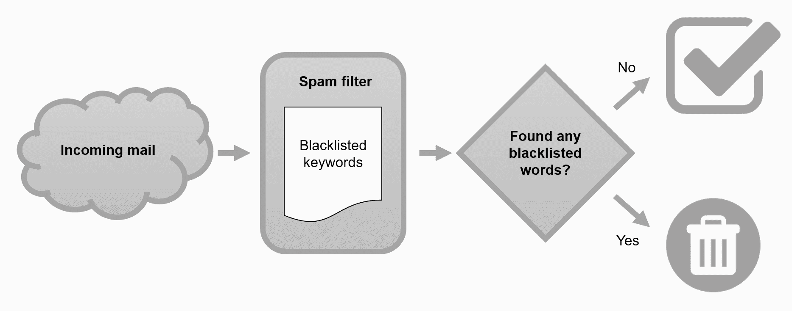
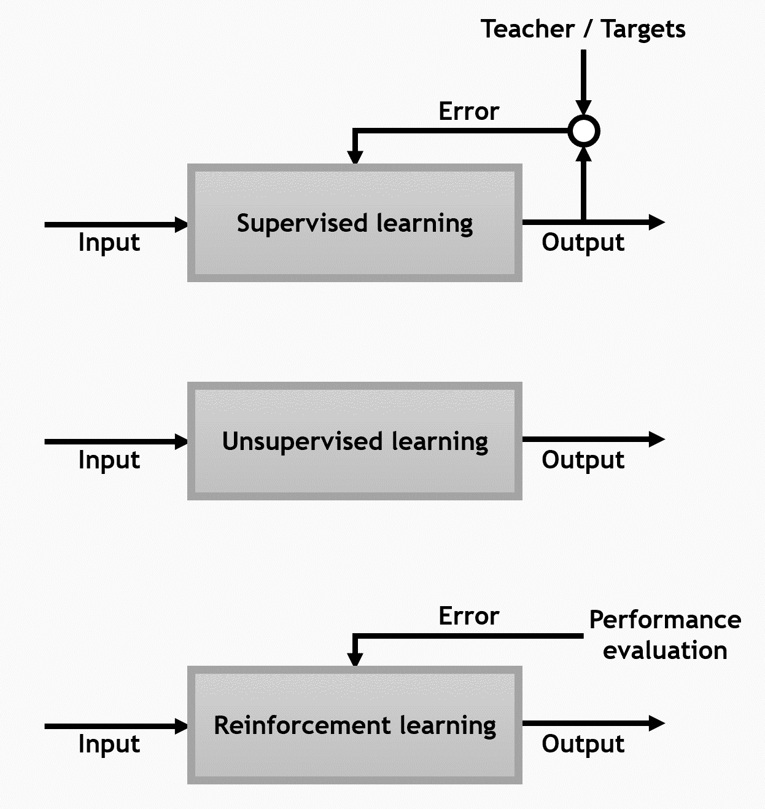

# 机器学习初体验

因此，您已经决定进入机器学习领域。这太棒了！

现在，机器学习无处不在——从保护我们的电子邮件，到自动在照片中标记我们的朋友，再到预测我们喜欢什么电影。作为一种人工智能形式，机器学习使计算机能够通过经验学习；使用过去收集的数据对未来做出预测。此外，计算机视觉是当今机器学习最令人兴奋的应用领域之一，深度学习和卷积神经网络推动了自动驾驶汽车和谷歌 DeepMind 等创新系统的发展。

然而，不必担心；您提供的应用程序不需要如此大规模或改变世界 ...

# 技术要求

您可以参考以下链接中本章的代码：[`github.com/PacktPublishing/Machine-Learning-for-OpenCV-Second-Edition/tree/master/Chapter01`](https://github.com/PacktPublishing/Machine-Learning-for-OpenCV-Second-Edition/tree/master/Chapter01)。

以下是软件和硬件要求的简要总结：

+   OpenCV 版本 4.1.x（4.1.0 或 4.1.1 都可以正常工作）。

+   Python 版本 3.6（任何 3.x 版本的 Python 都可以）。

+   Anaconda Python 3 用于安装 Python 和所需的模块。

+   您可以使用任何操作系统——macOS、Windows 和基于 Linux 的操作系统——使用这本书。我们建议您的系统至少有 4 GB 的 RAM。

+   您不需要 GPU 就可以运行本书提供的代码。

# 开始学习机器学习

机器学习已经存在至少 60 年了。它起源于对人工智能的追求，早期的机器学习系统通过推断手编的 `if...else` 规则来处理数据和做出决策。想象一下一个垃圾邮件过滤器，其任务是解析传入的电子邮件并将不需要的消息移动到垃圾邮件文件夹，如下面的图中所示：



我们可以制定一个黑名单，其中包含一些单词，每当它们出现在消息中时，就会将电子邮件标记为垃圾邮件。这是一个简单的手编专家系统示例。（我们将在第七章实现垃圾邮件...中构建一个更智能的系统。）

# 机器学习可以解决的问题

大多数机器学习问题属于以下三个主要类别之一：

+   在监督学习中，我们有一个被称为数据点标签的东西。现在，这可以是图像中捕获的对象的类别，围绕脸部的一个边界框，图像中的数字，或者任何其他东西。想象一下，这是一个既教书又告诉你问题正确答案的老师。现在，学生可以尝试设计一个模型或方程，它考虑了所有问题和它们的正确答案，并找出有（或没有）正确答案的问题的答案。用于学习模型的输入数据称为**训练数据**，而用于测试过程/模型的输入数据称为**测试数据**。这些预测有两种类型，比如识别带有正确动物的新照片（称为**分类**问题）或为其他二手车分配准确的售价（称为**回归**问题）。现在不要担心这看起来有点超出你的理解——我们将在整本书中详细阐述。

+   在无监督学习中，数据点没有与之关联的标签(第八章，*使用无监督学习发现隐藏结构*)。想象一下，就像一个课堂上，讲师给你一个乱糟糟的拼图，然后让你自己想办法解决问题。在这里，最常见的结果是**聚类**，它包含具有相似特性的对象。它还可以以不同的方式查看高维数据（复杂数据），使其看起来更简单。

+   强化学习是关于在问题中最大化奖励。所以，如果老师给你糖果作为每个正确答案的奖励，并惩罚每个错误答案，他/她通过让你增加获得糖果的次数而不是受到惩罚的次数来强化概念。

以下图表展示了这三个主要类别：



现在我们已经涵盖了主要机器学习类别，让我们来看看一些在本书的旅程中非常有用的 Python 概念。

# 开始使用 Python

由于 Python 拥有大量用于数据加载、数据可视化、统计、图像处理和自然语言处理等过程的开源库，它已成为许多数据科学和机器学习应用的通用语言。使用 Python 的主要优势是能够直接与代码交互，使用终端或其他工具，如**Jupyter Notebook**，我们将在稍后探讨。

如果你主要使用 C++与 OpenCV 结合，我强烈建议你切换到 Python，至少为了学习这本书的目的。这个决定并不是出于恶意！恰恰相反：我做了我应得的 C/C++编程——特别是...

# 开始使用 OpenCV

既然我相信您是 OpenCV 的热情用户，我可能不需要说服您 OpenCV 的强大功能。

OpenCV 是为了为计算机视觉应用提供通用基础设施而构建的，已经成为了一套既经典又最先进的计算机视觉和机器学习算法的综合集。根据其自己的文档，OpenCV 拥有超过 47,000 人的用户社区，下载量超过七百万次。这相当令人印象深刻！作为一个开源项目，研究人员、企业和政府部门很容易利用和修改现有的代码。

话虽如此，随着最近机器学习热潮的兴起，许多开源机器学习库作为其中的一部分出现，它们提供了比 OpenCV 更多的功能。一个突出的例子是**scikit-learn**，它提供了一系列最先进的机器学习算法以及丰富的在线教程和代码片段。由于 OpenCV 主要是为了提供计算机视觉算法而开发的，它的机器学习功能仅限于一个名为 `ml` 的单个模块。正如我们将在本书中看到的那样，OpenCV 仍然提供了一些最先进的算法，但有时在功能上略有不足。在这些罕见的情况下，我们不会重新发明轮子，而会简单地使用 scikit-learn 来满足我们的需求。

最后但同样重要的是，使用 Python Anaconda 发行版安装 OpenCV 实际上就像我们在以下章节中将看到的那样，只需要一行命令。

如果您是希望构建实时应用的更高级用户，OpenCV 的算法对此任务进行了很好的优化，Python 提供了多种方法来加快必要的计算速度（例如，使用 **Cython** 或并行处理库如 **joblib** 或 **dask**）。

# 安装

在我们开始之前，让我们确保我们已经安装了所有必要的工具和库，以创建一个完全功能的数据科学环境。在从 GitHub 下载本书的最新代码后，我们将安装以下软件：

+   基于 Python 3.6 或更高版本的 Python Anaconda 发行版

+   OpenCV 4.1

+   一些支持性包

不想安装任何东西？您也可以访问 [`mybinder.org/v2/gh/PacktPublishing/Machine-Learning-for-OpenCV-Second-Edition/master`](https://mybinder.org/v2/gh/PacktPublishing/Machine-Learning-for-OpenCV-Second-Edition/master)，在那里您将找到一个交互式、可执行的环境中的所有本书代码，并且 100%免费和开源，这要归功于**Binder**项目。

# 获取本书的最新代码

您可以从 GitHub 获取本书的最新代码：[`github.com/PacktPublishing/Machine-Learning-for-OpenCV-Second-Edition`](https://github.com/PacktPublishing/Machine-Learning-for-OpenCV-Second-Edition)。您可以选择下载一个 `.zip` 包（适用于初学者）或使用 Git 克隆仓库（适用于中级用户）。

Git 是一个版本控制系统，它允许您跟踪文件中的更改，并与他人协作编写代码。此外，网络平台 GitHub 使得人们可以在公共服务器上轻松地将他们的代码与您共享。随着我对代码的改进，您可以轻松地更新您的本地副本，提交错误报告或建议代码更改。

如果您选择使用 git，第一步是确保它已安装（[`git-scm.com/downloads`](https://git-scm.com/downloads)）。

然后，打开终端（或在 Windows 上称为命令提示符）：

+   在 Windows 10 上，右键单击开始菜单按钮，然后选择命令提示符。

+   在 macOS X 上，按 *Cmd* + *Space* 打开 spotlight 搜索，然后输入 `terminal`，然后按 *Enter*。

+   在 Ubuntu、Linux/Unix 和其他系统上，按 *Ctrl + Alt + T*。在 Red Hat 上，右键单击桌面，然后从菜单中选择打开终端。

导航到您想要下载代码的目录：

```py
cd Desktop
```

然后，您可以通过输入以下命令来获取最新代码的本地副本：

```py
git clone https://github.com/PacktPublishing/Machine-Learning-for-OpenCV-Second-Edition.git
```

这将在名为 `OpenCV-ML` 的文件夹中下载最新的代码。

一段时间后，代码可能会在线上更改。在这种情况下，您可以通过在 `OpenCV-ML` 目录中运行以下命令来更新您的本地副本：

```py
git pull origin master
```

# 熟悉 Python 的 Anaconda 发行版

**Anaconda** 是由 Continuum Analytics 开发的一个免费的 Python 发行版，专为科学计算而设计。它适用于 Windows、Linux 和 macOS X 平台，并且免费，即使是商业用途。然而，最好的是它附带了一些预安装的包，这些包对于数据科学、数学和工程至关重要。这些包包括以下内容：

+   **NumPy**：Python 中科学计算的基本包，提供了多维数组、高级数学函数和伪随机数生成器的功能

+   **SciPy**：Python 中用于科学计算的函数集合，提供了高级线性代数例程，...

# 在 conda 环境中安装 OpenCV

我们将执行以下步骤来安装 OpenCV：

1.  在终端中，导航到您下载以下代码的目录：

```py
$ cd Desktop/OpenCV-ML
```

1.  然后，运行以下命令以创建一个基于 Python 3.6 的 conda 环境，这将一次性安装 `environment.yml` 文件中列出的所有必要包（该文件可在 GitHub 仓库中找到）：

```py
$ conda create env -f environment.yml
```

1.  您还可以查看以下 `environment.yml` 文件：

```py
name: OpenCV-ML
channels:
  - conda-forge
dependencies:
  - python==3.6
  - numpy==1.15.4
  - scipy==1.1.0
  - scikit-learn==0.20.1
  - matplotlib
  - jupyter==1.0
  - notebook==5.7.4
  - pandas==0.23.4
  - theano
  - keras==2.2.4
  - mkl-service==1.1.2
  - pip
  - pip:
    - opencv-contrib-python==4.1.0.25
```

注意，环境的名称将是 `OpenCV-ML`。此代码将使用 `conda-forge` 通道下载所有基于 `conda` 的依赖项，并使用 `pip` 安装 `OpenCV 4.0（包括 opencv_contrib）`。

1.  要激活环境，请根据您的平台输入以下命令之一：

```py
$ source activate OpenCV-ML  # on Linux / Mac OS X
$ activate OpenCV-ML         # on Windows
```

1.  当我们关闭终端时，会话将被注销——因此，下次我们打开新的终端时，我们必须再次运行此最后一个命令。我们也可以手动注销环境：

```py
$ source deactivate  # on Linux / Mac OS X
$ deactivate         # on Windows
```

完成了！让我们验证所有这些安装是否成功。

# 验证安装

仔细检查我们的安装是个好主意。当我们的终端仍然打开时，我们开始运行 IPython，这是一个用于运行 Python 命令的交互式外壳：

```py
$ ipython
```

接下来，确保你正在运行（至少）Python 3.6 而不是 Python 2.7。你可能会在 IPython 的欢迎信息中看到版本号。如果没有，你可以运行以下命令：

```py
In [1]: import sys...     print(sys.version)        3.6.0 | packaged by conda-forge | (default, Feb 9 2017, 14:36:55) [GCC 4.8.2 20140120 (Red Hat 4.8.2-15)]
```

现在尝试以下方式导入 OpenCV：

```py
In [2]: import cv2
```

你不应该收到任何错误信息。然后，尝试找出版本号，如下所示：

```py
In [3]: cv2.__version__Out[3]: '4.0.0'
```

确保 OpenCV 的版本...

# 一窥 OpenCV 的 ml 模块

从 OpenCV 3.1 版本开始，所有与机器学习相关的函数在 OpenCV 中都被归类到了`ml`模块。对于 C++ API 来说，这种情况已经持续了一段时间。你可以通过显示`ml`模块中的所有函数来一窥未来：

```py
In [4]: dir(cv2.ml)
Out[4]: ['ANN_MLP_ANNEAL',
 'ANN_MLP_BACKPROP',
 'ANN_MLP_GAUSSIAN',
 'ANN_MLP_IDENTITY',
 'ANN_MLP_LEAKYRELU',
 'ANN_MLP_NO_INPUT_SCALE',
 'ANN_MLP_NO_OUTPUT_SCALE',
 ...
 '__spec__']
```

如果你安装了较旧的 OpenCV 版本，`ml`模块可能不存在。例如，k 最近邻算法（我们将在第三章，*监督学习的第一步)*曾经被称为`cv2.KNearest()`，但现在被称为`cv2.ml.KNearest_create()`。为了避免在整个书中产生混淆，我建议使用 OpenCV 4.0。

这一切看起来都很好，但你现在可能想知道为什么你应该学习机器学习，以及它的应用是什么？让我们在下一节回答这个问题。

# 机器学习应用

机器学习、人工智能、深度学习和数据科学是四个我认为将会改变我们看待事物方式的术语。让我们看看我能否说服你为什么我相信这一点。

从让计算机学习如何玩围棋并击败该游戏的全球冠军，到仅通过查看他们的脑部 CT 扫描来检测一个人是否有肿瘤，机器学习在每一个领域都留下了它的印记。我参与的一个项目是使用机器学习来确定热电厂锅炉水冷壁管的剩余使用寿命。所提出的解决方案通过使用...成功节省了大量资金。

# OpenCV 4.0 的新特性有哪些？

因此，我们来到了第一章的最后一节。我会尽量简短并直截了当，因为作为读者，你可以安全地跳过这一部分。我们讨论的主题是**OpenCV 4.0**。

OpenCV 4.0 是 OpenCV 团队经过三年半的辛勤工作和错误修复的结果，并于 2018 年 11 月最终发布。在本节中，我们将探讨 OpenCV 4.0 的一些主要变化和新特性：

+   随着 OpenCV 4.0 的发布，OpenCV 正式成为了一个 C++11 库。这意味着当你尝试编译 OpenCV 4.0 时，你必须确保你的系统中有一个符合 C++11 的编译器。

+   在上一点的延续中，许多 C API 已被移除。受影响的模块包括视频 IO 模块（`videoio`）、目标检测模块（`objdetect`）等。XML、YAML 和 JSON 的文件 IO 也移除了 C API。

+   OpenCV 4.0 在 DNN 模块（深度学习模块）方面也有很多改进。ONNX 支持已被添加。**Intel OpenVINO**也在新的 OpenCV 版本中留下了它的足迹。我们将在后面的章节中更详细地探讨这一点。

+   OpenCL 加速已经在 AMD 和 NVIDIA GPU 上得到修复。

+   OpenCV Graph API 也已添加，这是一个用于图像处理和其他操作的高效引擎。

+   正如每次 OpenCV 发布一样，有很多变化都是为了提高性能。一些新功能，如 QR 码检测和解码，也被添加进来。

简而言之，OpenCV 4.0 中有很多变化，它们都有各自的用途。例如，ONNX 支持有助于模型在各种语言和框架之间的可移植性，OpenCL 减少了计算机视觉应用的运行时间，Graph API 有助于提高应用的效率，而 OpenVINO 工具包利用 Intel 处理器和模型库来提供高效的深度学习模型。我们将在后面的章节中主要关注 OpenVINO 工具包和 DLDT，以及加速计算机视觉应用。但是，我也应该在这里指出，OpenCV 3.4.4 和 OpenCV 4.0.0 都在以高速修改以修复错误。所以，如果你打算在任何应用中使用它们中的任何一个，请准备好修改你的代码和安装以包含所做的更改。同样，OpenCV 4.0.1 和 OpenCV 3.4.5 也在其前辈发布后的几个月内推出。

# 摘要

在本章中，我们从高抽象层次讨论了机器学习：它是什么，为什么它很重要，以及它可以解决哪些类型的问题。我们了解到机器学习问题分为三种类型：监督学习、无监督学习和强化学习。我们讨论了监督学习的突出地位，以及这个领域可以进一步分为两个子领域：分类和回归。分类模型使我们能够将对象分类到已知的类别中（例如，将动物分类为猫和狗），而回归分析可以用来预测目标变量的连续结果（例如，二手车的销售价格）。

我们还学习了如何使用...来设置数据科学环境。
