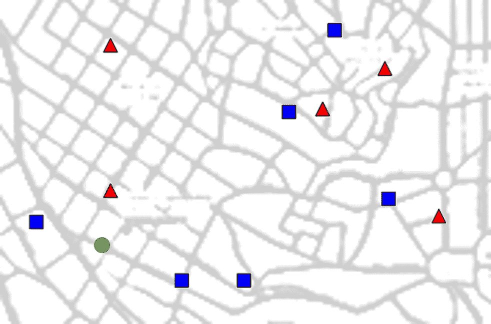
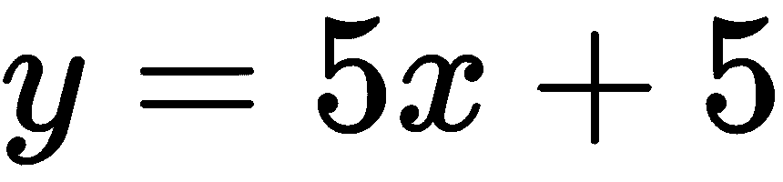
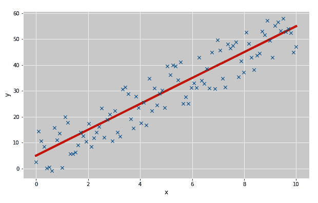
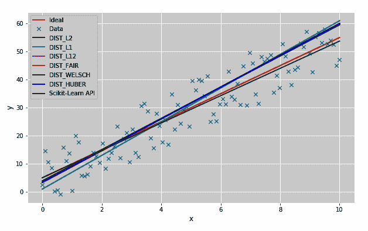
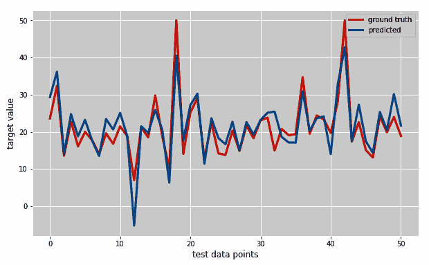
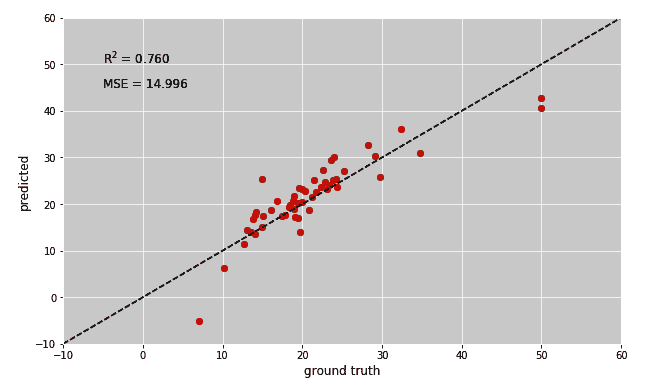
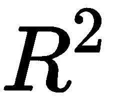
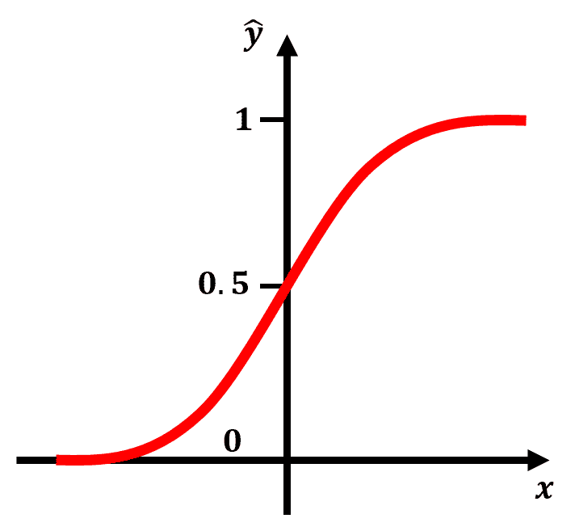
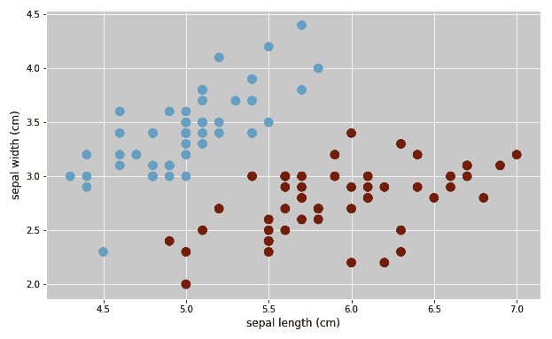

# 第三章：监督学习的第一步

这就是您一直等待的时刻，不是吗？

我们已经涵盖了所有的基础——我们有一个运行的 Python 环境，我们已经安装了 OpenCV，并且我们知道如何在 Python 中处理数据。现在，是时候构建我们的第一个机器学习系统了！还有什么比专注于最常见且最成功的机器学习类型之一：**监督学习**更好的开始方式呢？

从上一章，我们已经知道监督学习主要是通过使用与之相关的标签来学习训练数据中的规律性，以便我们可以预测一些新的、从未见过的测试数据的标签。在本章中，我们想要深入一点，学习如何将我们的理论知识 ...

# 技术要求

您可以在此链接中找到本章的代码：[`github.com/PacktPublishing/Machine-Learning-for-OpenCV-Second-Edition/tree/master/Chapter03`](https://github.com/PacktPublishing/Machine-Learning-for-OpenCV-Second-Edition/tree/master/Chapter03)。

以下是对软件和硬件要求的全球性总结：

+   您需要 OpenCV 版本 4.1.x（4.1.0 或 4.1.1 都可以正常工作）。

+   您需要 Python 版本 3.6（任何 Python 3.x 版本都可以）。

+   您需要 Anaconda Python 3 来安装 Python 和所需的模块。

+   您可以使用任何操作系统——macOS、Windows 和基于 Linux 的操作系统——与本书一起使用。我们建议您的系统至少有 4 GB RAM。

+   您不需要 GPU 就可以运行本书提供的代码。

# 理解监督学习

我们之前已经确定，监督学习的目标始终是预测数据的标签（或目标值）。然而，根据这些标签的性质，监督学习可以有两种不同的形式：

+   **分类**：当我们使用数据来预测类别时，监督学习被称为**分类**。一个很好的例子是我们试图预测一张图片是否包含猫或狗。在这里，数据的标签是分类的，要么是猫，要么是狗，但永远不会是类别的混合。例如，一张图片要么包含猫，要么包含狗，永远不会是 50%猫和 50%狗（在你问之前，不，这里我们不考虑卡通角色猫狗的图片），我们的工作 ...

# 在 OpenCV 中查看监督学习

如果我们不能将其付诸实践，仅仅知道如何进行监督学习是没有用的。幸运的是，OpenCV 为其所有的统计学习模型提供了一个相当直观的接口，这包括所有监督学习模型。

在 OpenCV 中，每个机器学习模型都源自`cv::ml::StatModel`基类。这听起来很复杂，意思是说，如果我们想在 OpenCV 中使用机器学习模型，我们必须提供`StatModel`告诉我们的所有功能。这包括一个用于训练模型的方法（称为`train`）和一个用于衡量模型性能的方法（称为`calcError`）。

在**面向对象编程**（**OOP**）中，我们主要处理对象或类。一个对象由几个函数组成，称为**方法**，以及变量，称为**成员**或**属性**。您可以在 Python 中了解更多关于 OOP 的信息，请参阅[`docs.python.org/3/tutorial/classes.html`](https://docs.python.org/3/tutorial/classes.html)。

由于这种软件组织方式，在 OpenCV 中设置机器学习模型总是遵循相同的逻辑，我们稍后会看到：

+   **初始化**：我们通过名称调用模型以创建一个空的模型实例。

+   **设置参数**：如果模型需要一些参数，我们可以通过 setter 方法来设置它们，这些方法对于每个模型可能都不同。例如，对于 k-NN 算法要工作，我们需要指定其 open 参数，*k*（我们稍后会了解到）。

+   **训练模型**：每个模型都必须提供一个名为`train`的方法，用于将模型拟合到某些数据。

+   **预测新标签**：每个模型都必须提供一个名为`predict`的方法，用于预测新数据的标签。

+   **评分模型**：每个模型都必须提供一个名为`calcError`的方法，用于衡量性能。这种计算对于每个模型可能都不同。

由于 OpenCV 是一个庞大且由社区驱动的项目，并非每个算法都像我们作为用户期望的那样遵循这些规则。例如，k-NN 算法的大部分工作都在`findNearest`方法中完成，尽管`predict`仍然有效。我们将确保在处理不同示例时指出这些差异。

由于我们将偶尔使用 scikit-learn 来实现 OpenCV 不提供的某些机器学习算法，因此指出 scikit-learn 中的学习算法几乎遵循相同的逻辑是值得的。最显著的区别是，scikit-learn 在初始化步骤中设置所有必需的模型参数。此外，它调用训练函数`fit`而不是`train`，以及评分函数`score`而不是`calcError`。

# 使用评分函数衡量模型性能

构建机器学习系统最重要的部分之一是找到一种方法来衡量模型预测的质量。在现实场景中，模型很少能完全正确。从前面的章节中，我们知道我们应该使用测试集的数据来评估我们的模型。但这是如何实现的呢？

简短但不太有帮助的回答是，这取决于模型。人们已经想出了各种各样的评分函数，可以用来评估在所有可能的场景下训练好的模型。好消息是，其中许多实际上是 scikit-learn 的`metrics`模块的一部分。

让我们快速看一下一些最重要的评分函数。...

# 使用准确度、精确度和召回率评分分类器

在一个只有两个不同类别标签的二分类任务中，有几种不同的方式来衡量分类性能。以下是一些常见的指标：

+   `accuracy_score`：准确度计算测试集中被正确预测的数据点的数量，并以测试集大小的分数形式返回该数量。坚持将图片分类为猫或狗的例子，准确度表示被正确分类为包含猫或狗的图片的比例。这是分类器的最基本评分函数。

+   `precision_score`：精确度描述了分类器不将包含狗的图片标记为猫的能力。换句话说，在测试集中，分类器认为包含猫的所有图片中，精确度是实际包含猫的图片的比例。

+   `recall_score`：召回率（或灵敏度）描述了分类器检索所有包含猫的图片的能力。换句话说，在测试集中所有猫的图片中，召回率是正确识别为猫的图片的比例。

假设我们有一些`ground truth`（根据我们拥有的数据集是正确的）类别标签，这些标签要么是零，要么是一。我们可以使用 NumPy 的随机数生成器随机生成它们。显然，这意味着，每次我们重新运行代码时，都会生成新的随机数据点。然而，为了本书的目的，这并不太有帮助，因为我希望你能运行代码并总是得到和我一样的结果。实现这一点的一个好方法是将随机数生成器的种子固定。这将确保每次运行脚本时生成器都以相同的方式初始化：

1.  我们可以使用以下代码来设置随机数生成器的种子：

```py
In [1]: import numpy as np
In [2]: np.random.seed(42)
```

1.  然后，我们可以通过在范围`(0,2)`中随机选择整数来生成五个随机标签，这些标签要么是零，要么是一：

```py
In [3]: y_true = np.random.randint(0, 2, size=5)
...     y_true
Out[3]: array([0, 1, 0, 0, 0])
```

在文献中，这两个类别有时也被称为**正类**（所有具有类别标签`1`的数据点）和**负类**（所有其他数据点）。

让我们假设我们有一个试图预测前面提到的类别标签的分类器。为了辩论的目的，让我们假设这个分类器不是很聪明，总是预测标签`1`。我们可以通过硬编码预测标签来模拟这种行为：

```py
In [4]: y_pred = np.ones(5, dtype=np.int32)
...     y_pred
Out[4]: array([1, 1, 1, 1, 1], dtype=int32)
```

我们的预测准确度是多少？

如前所述，准确率计算测试集中被正确预测的数据点的数量，并将其作为测试集大小的分数返回。我们只正确预测了第二个数据点（其中真实标签是`1`）。在其他所有情况下，真实标签是`0`，但我们预测了`1`。因此，我们的准确率应该是 1/5 或 0.2。

一个简单的准确率度量实现可能只是将所有预测类别标签与真实类别标签匹配的实例相加：

```py
In [5]: test_set_size = len(y_true)
In [6]: predict_correct = np.sum(y_true == y_pred)
In [7]: predict_correct / test_set_size
Out[7]: 0.2
```

一个更智能且更方便的实现由 scikit-learn 的`metrics`模块提供：

```py
In [8]: from sklearn import metrics
In [9]: metrics.accuracy_score(y_true, y_pred)
Out[9]: 0.2
```

这并不太难，对吧？然而，要理解精确度和召回率，我们需要对 I 型错误和 II 型错误有一个一般性的理解。让我们回忆一下，具有类别标签`1`的数据点通常被称为正例，而具有类别标签`0`（或-1）的数据点通常被称为负例。然后，对特定数据点的分类可能有四种可能的结局，如下面的混淆矩阵所示：

|  | **是否真正为正** | **是否真正为负** |
| --- | --- | --- |
| **预测为正** | 真阳性 | 假阳性 |
| **预测为负** | 假阴性 | 真阴性 |

让我们分解一下。如果一个数据点是真正正的，并且我们预测了正的，我们就完全做对了！在这种情况下，结果被称为**真阳性**。如果我们认为数据点是正的，但实际上它是负的，我们就错误地预测了正的（因此有这个术语，**假阳性**）。类似地，如果我们认为数据点是负的，但实际上它是正的，我们就错误地预测了负的（假阴性）。最后，如果我们预测了负的，而数据点确实是负的，我们就找到了一个**真阴性**。

在统计假设检验中，假阳性也被称为**I 型错误**，而假阴性也被称为**II 型错误**。

让我们快速计算这四个指标在我们的模拟数据上。我们有一个真阳性，其中真实标签是`1`，我们预测了`1`：

```py
In [10]: truly_a_positive = (y_true == 1)
In [11]: predicted_a_positive = (y_pred == 1)
In [12]: true_positive = np.sum(predicted_a_positive * truly_a_positive )
...      true_positive
Out[12]: 1
```

同样，假阳性是指我们预测了`1`，但`ground truth`实际上是`0`：

```py
In [13]: false_positive = np.sum((y_pred == 1) * (y_true == 0))
...      false_positive
Out[13]: 4
```

我相信到现在你已经掌握了这个。但我们真的需要做数学运算来了解预测的负数吗？我们不太智能的分类器从未预测`0`，所以`(y_pred == 0)`永远不会为真：

```py
In [14]: false_negative = np.sum((y_pred == 0) * (y_true == 1))
...      false_negative
Out[14]: 0
In [15]: true_negative = np.sum((y_pred == 0) * (y_true == 0))
...      true_negative
Out[15]: 0
```

让我们再绘制一下混淆矩阵：

|  | **是否真正为正** | **是否真正为负** |
| --- | --- | --- |
| **预测为正** | 1 | 4 |
| **预测为负** | 0 | 0 |

为了确保我们一切都做得正确，让我们再次计算准确率。准确率应该是真阳性数加上真阴性数（即我们做对的一切）除以数据点的总数：

```py
In [16]: accuracy = (true_positive + true_negative) / test_set_size
...      accuracy
Out[16]: 0.2
```

成功！精确度就是真阳性数除以所有真预测数：

```py
In [17]: precision = true_positive / (true_positive + false_positive)
...      precision
Out[17]: 0.2
```

结果表明，在我们的情况下，精确度并不比准确度更好。让我们用 scikit-learn 来检查我们的数学计算：

```py
In [18]: metrics.precision_score(y_true, y_pred)
Out[18]: 0.2
```

最后，`recall`表示我们正确分类为正例的所有正例的比例：

```py
In [19]: recall = true_positive / (true_positive + false_negative)
...      recall
Out[19]: 1.0
In [20]: metrics.recall_score(y_true, y_pred)
Out[20]: 1.0
```

完美回忆！但是，回到我们的模拟数据，应该很清楚，这个出色的召回分数只是运气。由于我们的模拟数据集中只有一个`1`标签，而且我们恰好正确地分类了它，所以我们得到了完美的召回分数。这意味着我们的分类器是完美的吗？不是的！但我们已经找到了三个有用的指标，它们似乎衡量了我们分类性能的互补方面。

# 使用均方误差、解释方差和 R 平方评分回归器

当涉及到回归模型时，我们之前提到的指标不再适用。毕竟，我们现在预测的是连续的输出值，而不是不同的分类标签。幸运的是，scikit-learn 提供了一些其他有用的评分函数：

+   `mean_squared_error`：回归问题中最常用的误差指标是测量训练集中每个数据点的预测值与真实目标值之间的平方误差，然后对所有数据点进行平均。

+   `explained_variance_score`：一个更复杂的指标是衡量模型在多大程度上可以解释测试数据的变异或分散程度。通常，解释的...

# 使用分类模型预测类别标签

拥有这些工具在手，我们现在可以开始处理我们的第一个真正的分类示例。

考虑一下 Randomville 这个小城镇，这里的人们疯狂地喜爱他们的两支运动队，Randomville Reds 和 Randomville Blues。Reds 队历史悠久，深受人们喜爱。然而，后来一位外地百万富翁出现了，他买下了 Reds 队的最佳射手，并组建了一支新队，Blues 队。让大多数 Reds 球迷不满的是，这位最佳射手最终带着 Blues 队赢得了冠军头衔。多年后，他回到了 Reds 队，尽管一些球迷因为他的早期职业选择而对他怀恨在心。但无论如何，你可以理解为什么 Reds 队的球迷并不一定和 Blues 队的球迷相处融洽。事实上，这两个球迷群体如此分裂，以至于他们甚至从不住在隔壁。我甚至听说过红队球迷在蓝队球迷搬进来后故意搬走的故事。这是真的！

无论如何，我们刚搬到这个城镇，正试图挨家挨户地推销一些 Blues 队的商品。然而，时不时地我们会遇到一个狂热的 Reds 球迷，他们对我们卖 Blues 队的商品大喊大叫，并把我们赶出自己的草坪。真不友好！避免这些房子，只访问 Blues 队的球迷，会轻松得多，也能更好地利用我们的时间。

我们有信心学会预测 Reds 球迷的居住地，于是开始记录我们的遭遇。如果我们经过一个 Reds 球迷的家，我们在手头的城镇地图上画一个红色三角形；否则，我们画一个蓝色正方形。过了一段时间，我们就能很好地了解每个人的居住地：



然而，现在，我们来到地图上标记为绿色圆圈的房屋。我们应该敲门吗？我们试图找到一些线索，了解他们更喜欢哪个球队（也许是在后门廊上挂着的球队旗帜），但我们什么也没看到。我们怎么知道敲门是否安全呢？

这个愚蠢的例子所说明的正是监督学习算法可以解决的问题。我们有一系列观察结果（房屋、位置和颜色），构成了我们的训练数据。我们可以使用这些数据从经验中学习，以便当我们面对预测新房屋颜色的任务时，我们可以做出明智的估计。

正如我们之前提到的，红队球迷对他们的球队非常热情，所以他们绝不会搬到蓝队球迷的隔壁。我们难道不能利用这些信息，查看所有相邻的房屋，以了解新房子里住的是哪种球迷吗？

这正是 k-NN 算法会做的事情。

# 理解 k-NN 算法

k-NN 算法可以说是最简单的机器学习算法之一。原因在于我们基本上只需要存储训练数据集。然后，为了预测一个新的数据点，我们只需要在训练数据集中找到最近的数据点：它的最近邻。

简而言之，k-NN 算法认为一个数据点很可能属于与其邻居相同的类别。想想看：如果我们的邻居是红队球迷，我们可能也是红队球迷；否则，我们早就搬走了。对蓝队也是如此。

当然，一些社区可能要复杂一些。在这种情况下，我们不仅会考虑我们的最近邻（当*k=1*时），而是...

# 在 OpenCV 中实现 k-NN

使用 OpenCV，我们可以通过`cv2.ml.KNearest_create()`函数轻松创建 k-NN 模型。构建模型涉及以下步骤：

1.  生成一些训练数据。

1.  为给定的数字*k*创建一个 k-NN 对象。

1.  找到我们想要分类的新数据点的*k*个最近邻。

1.  通过多数投票为新数据点分配类别标签。

1.  绘制结果。

我们首先导入所有必要的模块：OpenCV 用于 k-NN 算法，NumPy 用于数据处理，Matplotlib 用于绘图。如果你在一个 Jupyter Notebook 中工作，别忘了调用`%matplotlib inline`魔法：

```py
In [1]: import numpy as np
...     import cv2
...     import matplotlib.pyplot as plt
...     %matplotlib inline
In [2]: plt.style.use('ggplot')
```

# 生成训练数据

第一步是生成一些训练数据。为此，我们将使用 NumPy 的随机数生成器。正如前文所述，我们将固定随机数生成器的种子，以便重新运行脚本时总是生成相同的值：

```py
In [3]: np.random.seed(42)
```

好的，现在让我们开始吧。我们的训练数据应该是什么样子呢？

在前面的例子中，每个数据点都是城镇地图上的一个房子。每个数据点有两个特征（即，它在城镇地图上的位置*x*和*y*坐标）和一个类别标签（即，如果住在这里的是蓝球队球迷，则显示蓝色方块；如果是红队球迷，则显示红色三角形）。

因此，单个数据点的特征可以表示为 ...

# 训练分类器

与所有其他机器学习函数一样，k-NN 分类器是 OpenCV 3.1 的`ml`模块的一部分。我们可以使用以下命令创建一个新的分类器：

```py
In [15]: knn = cv2.ml.KNearest_create()
```

在 OpenCV 的旧版本中，此函数可能被称为`cv2.KNearest()`。

然后，我们将我们的训练数据传递给`train`方法：

```py
In [16]: knn.train(train_data, cv2.ml.ROW_SAMPLE, labels)
Out[16]: True
```

在这里，我们必须告诉`knn`我们的数据是一个*N x 2*的数组（即，每一行是一个数据点）。成功后，该函数返回`True`。

# 预测新数据点的标签

`knn`提供的另一个非常有用的方法是`findNearest`。它可以用来根据新数据点的最近邻预测其标签。

多亏了我们的`generate_data`函数，生成新的数据点实际上非常简单！我们可以将新的数据点视为大小为`1`的数据集：

```py
In [17]: newcomer, _ = generate_data(1)...      newcomerOut[17]: array([[91., 59.]], dtype=float32)
```

我们的功能还会返回一个随机标签，但我们对此不感兴趣。相反，我们想使用我们的训练分类器来预测它！我们可以告诉 Python 忽略一个输出值（下划线`_`）。

让我们再次看看我们的城镇地图。我们将像之前一样绘制训练集，但 ...

# 使用回归模型预测连续结果

现在，让我们将注意力转向一个回归问题。我相信你现在可以倒背如流，回归完全是关于预测连续结果，而不是预测离散的类别标签。

# 理解线性回归

最简单的回归模型称为**线性回归**。线性回归背后的思想是用特征的线性组合来描述目标变量（例如波士顿房价——回想一下我们在第一章，“机器学习的味道”中研究的各种数据集）。 

为了保持简单，让我们只关注两个特征。假设我们想使用两个特征来预测明天的股票价格：今天的股票价格和昨天的股票价格。我们将今天的股票价格表示为第一个特征，*f[1]*，将昨天的股票价格表示为*f[2]*。那么，线性回归的目标就是学习两个权重系数，*w[1]*和*w[2]*，以便我们可以按照以下方式预测明天的股票价格：

这里，  是

# OpenCV 中的线性回归

在尝试在真实数据集上使用线性回归之前，让我们了解如何使用`cv2.fitLine`函数将线拟合到二维或三维点集：

1.  让我们从生成一些点开始。我们将通过向位于线上的点添加噪声来生成它们！：

```py
In [1]: import cv2
...     import numpy as np
...     import matplotlib.pyplot as plt
...     from sklearn import linear_model
...     from sklearn.model_selection import train_test_split
...     plt.style.use('ggplot')
...     %matplotlib inline
In [2]: x = np.linspace(0,10,100)
...     y_hat = x*5+5
...     np.random.seed(42)
...     y = x*5 + 20*(np.random.rand(x.size) - 0.5)+5
```

1.  我们还可以使用以下代码可视化这些点：

```py
In [3]: plt.figure(figsize=(10, 6))
...     plt.plot(x, y_hat, linewidth=4)
...     plt.plot(x,y,'x')
...     plt.xlabel('x')
...     plt.ylabel('y')
```

这给出了以下图表，其中红色线是真实函数：



1.  接下来，我们将点分为训练集和测试集。在这里，我们将数据分为 70:30 的比例，这意味着，70%的点将用于训练，30%用于测试：

```py
In [4]: x_train, x_test, y_train, y_test = train_test_split(x,y,test_size=0.3,random_state=42)
```

1.  现在，让我们使用`cv2.fitLine`将一条线拟合到这个二维点集。这个函数接受以下参数：

    +   `points`：这是需要拟合直线的点的集合。

    +   `distType`：这是 M-估计器使用的距离。

    +   `param`：这是数值参数（C），在某种类型的距离中使用。我们将将其保持为 0，以便选择最佳值。

    +   `reps`：这是原点到直线的距离的精度。"0.01"是`reps`的一个很好的默认值。

    +   `aeps`：这是角度的精度。"0.01"是`aeps`的一个很好的默认值。

更多信息，请参阅[文档](https://docs.opencv.org/4.0.0/d3/dc0/group__imgproc__shape.html#gaf849da1fdafa67ee84b1e9a23b93f91f)。

1.  让我们看看使用不同的距离类型选项会得到什么样的结果：

```py
In [5]: distTypeOptions = [cv2.DIST_L2,\
...                 cv2.DIST_L1,\
...                 cv2.DIST_L12,\
...                 cv2.DIST_FAIR,\
...                 cv2.DIST_WELSCH,\
...                 cv2.DIST_HUBER]

In [6]: distTypeLabels = ['DIST_L2',\
...                 'DIST_L1',\
...                 'DIST_L12',\
...                 'DIST_FAIR',\
...                 'DIST_WELSCH',\
...                 'DIST_HUBER']

In [7]: colors = ['g','c','m','y','k','b']
In [8]: points = np.array([(xi,yi) for xi,yi in zip(x_train,y_train)])
```

1.  我们还将使用 scikit-learn 的`LinearRegression`来拟合训练点，然后使用`predict`函数预测它们的*y*-值：

```py
In [9]: linreg = linear_model.LinearRegression()
In [10]: linreg.fit(x_train.reshape(-1,1),y_train.reshape(-1,1))
Out[10]:LinearRegression(copy_X=True, fit_intercept=True, n_jobs=None,normalize=False)
In [11]: y_sklearn = linreg.predict(x.reshape(-1,1))
In [12]: y_sklearn = list(y_sklearn.reshape(1,-1)[0])
```

1.  我们使用`reshape(-1,1)`和`reshape(1,-1)`将 NumPy 数组转换为列向量，然后再将其转换回行向量：

```py
In [13]: plt.figure(figsize=(10, 6))
...      plt.plot(x, y_hat,linewidth=2,label='Ideal')
...      plt.plot(x,y,'x',label='Data')

...      for i in range(len(colors)):
...          distType = distTypeOptions[i]
...          distTypeLabel = distTypeLabels[i]
...          c = colors[i]

...          [vxl, vyl, xl, yl] = cv2.fitLine(np.array(points, dtype=np.int32), distType, 0, 0.01, 0.01)
...          y_cv = [vyl[0]/vxl[0] * (xi - xl[0]) + yl[0] for xi in x]
...          plt.plot(x,y_cv,c=c,linewidth=2,label=distTypeLabel)

...      plt.plot(x,list(y_sklearn),c='0.5',\
linewidth=2,label='Scikit-Learn API')
...      plt.xlabel('x')
...      plt.ylabel('y')
...      plt.legend(loc='upper left')
```

这段前面（且相当长）的代码的唯一目的就是创建一个可以用来比较使用不同距离度量获得的结果的图表。

让我们看看这个图：



如我们清楚地看到，scikit-learn 的`LinearRegression`模型比 OpenCV 的`fitLine`函数表现要好得多。现在，让我们使用 scikit-learn 的 API 来预测波士顿房价。

# 使用线性回归预测波士顿房价

为了更好地理解线性回归，我们想要构建一个简单的模型，该模型可以应用于最著名的机器学习数据集之一：**波士顿房价数据集**。在这里，目标是使用诸如犯罪率、财产税率、到就业中心的距离和高速公路可及性等信息来预测 20 世纪 70 年代几个波士顿地区的房价。

# 加载数据集

我们可以再次感谢 scikit-learn 为我们提供了轻松访问数据集的方式。我们首先导入所有必要的模块，就像我们之前做的那样：

```py
In [14]: from sklearn import datasets
...      from sklearn import metrics
```

加载数据集只需要一行代码：

```py
In [15]: boston = datasets.load_boston()
```

`boston`对象的结构与前面命令中讨论的`iris`对象相同。我们可以在`'DESCR'`中获取更多关于数据集的信息，在`'data'`中找到所有数据，在`'feature_names'`中找到所有特征名称，在`'filename'`中找到波士顿 CSV 数据集的物理位置，在`'target'`中找到所有目标值：

```py
In [16]: dir(boston)
Out[16]: ['DESCR', 'data', 'feature_names', 'filename', 'target']
```

该数据集包含总共`506`个数据点，每个点都有`13`个特征：

```py
In [17]: boston.data.shape
Out[17]: (506, 13)
```

当然，我们只有一个目标值，那就是房价：

```py
In [18]: boston.target.shape
Out[18]: (506,)
```

# 训练模型

现在让我们创建一个`LinearRegression`模型，然后将在训练集上对其进行训练：

```py
In [19]: linreg = linear_model.LinearRegression()
```

在前面的命令中，我们想要将数据分为训练集和测试集。我们可以自由地按照我们的意愿进行分割，但通常保留 10%到 30%用于测试是个好主意。在这里，我们选择 10%，使用`test_size`参数：

```py
In [20]: X_train, X_test, y_train, y_test = train_test_split(...            boston.data, boston.target, test_size=0.1,...            random_state=42...      )
```

在 scikit-learn 中，`train`函数被称为`fit`，但除此之外的行为与 OpenCV 中的完全相同：

```py
In [21]: linreg.fit(X_train, y_train)Out[21]: LinearRegression(copy_X=True, fit_intercept=True, ...
```

# 测试模型

为了测试模型的泛化性能，我们在测试数据上计算均方误差：

```py
In [24]: y_pred = linreg.predict(X_test)
In [25]: metrics.mean_squared_error(y_test, y_pred)
Out[25]: 14.995852876582541
```

我们注意到，测试集上的均方误差比训练集略低。这是一个好消息，因为我们主要关心测试误差。然而，从这些数字中很难理解模型真正有多好。也许绘制数据会更清楚：

```py
In [26]: plt.figure(figsize=(10, 6))
...      plt.plot(y_test, linewidth=3, label='ground truth')
...      plt.plot(y_pred, linewidth=3, label='predicted')
...      plt.legend(loc='best')
...      plt.xlabel('test data points')
...      plt.ylabel('target value')
Out[26]: <matplotlib.text.Text at 0x7ff46783c7b8>
```

这将生成以下图表：



这更有意义！在这里，我们可以看到所有测试样本的`ground truth`房价用红色表示，我们的预测房价用蓝色表示。如果你问我，这已经很接近了。不过，值得注意的是，模型对于极高或极低的房价往往偏离最大，例如数据点的峰值**12**、**18**和**42**。我们可以通过计算 R 平方来形式化我们能够解释的数据中的方差量：

```py
In [27]: plt.figure(figsize=(10, 6))
...      plt.plot(y_test, y_pred, 'o')
...      plt.plot([-10, 60], [-10, 60], 'k--')
...      plt.axis([-10, 60, -10, 60])
...      plt.xlabel('ground truth')
...      plt.ylabel('predicted')
```

这将在*x*轴上绘制`ground truth`价格，即`y_test`，并在*y*轴上绘制我们的预测值，即`y_pred`。我们还会绘制一条参考线（使用黑色虚线`'k--'`），很快我们就会看到。但我们还希望在文本框中显示 R²分数和均方误差：

```py
...      scorestr = r'R$²$ = %.3f' % linreg.score(X_test, y_test)
...      errstr = 'MSE = %.3f' % metrics.mean_squared_error(y_test, y_pred)
...      plt.text(-5, 50, scorestr, fontsize=12)
...      plt.text(-5, 45, errstr, fontsize=12)
Out[27]: <matplotlib.text.Text at 0x7ff4642d0400>
```

这将生成以下图表，这是一种专业绘制模型拟合的方法：



如果我们的模型是完美的，那么所有数据点都会位于虚线对角线上，因为`y_pred`将始终等于`y_true`。与对角线偏离表示模型犯了错误，或者数据中存在模型无法解释的方差。实际上，表明我们能够解释数据中的 76%的散点，均方误差为 14.996。这些都是我们可以用来比较线性回归模型和一些更复杂模型的性能指标。

# 应用 Lasso 和岭回归

机器学习中一个常见的问题是，一个算法可能在训练集上表现得非常好，但当应用到未见过的数据上时，会犯很多错误。你可以看到这有多麻烦，因为我们通常最感兴趣的是模型如何泛化到新数据。一些算法（如决策树）比其他算法更容易出现这种现象，但即使是线性回归也可能受到影响。

这种现象也被称为**过拟合**，我们将在第五章使用决策树进行医疗诊断和第十一章使用超参数调整选择合适的模型中详细讨论。

减少过拟合的常见技术被称为**正则化**，它涉及...

# 使用逻辑回归对菊花物种进行分类

世界上机器学习领域另一个著名的数据集被称为菊花数据集。菊花数据集包含来自三种不同物种（Setosa、Versicolor 和 Viriginica）的 150 朵菊花测量值。这些测量值包括花瓣和萼片的长度和宽度，所有测量值都以厘米为单位。

我们的目标是构建一个机器学习模型，该模型可以学习这些已知物种的菊花花径测量值，以便我们可以预测新菊花的物种。

# 理解逻辑回归

在我们开始本节之前，我要发出警告——尽管名为逻辑回归，但实际上它是一个分类模型，特别是当你有两个类别时。它得名于它使用的**逻辑函数**（或 Sigmoid 函数），它将任何实值输入*x*转换为介于**0**和**1**之间的预测输出值*ŷ*，如下面的图所示：



将*ŷ*四舍五入到最接近的整数实际上将输入分类为属于类别**0**或**1**。

当然，我们的大部分问题通常有多个输入或特征值，*x*。例如，菊花数据集提供了总共...

# 加载训练数据

菊花数据集包含在 scikit-learn 中。我们首先加载所有必要的模块，就像我们之前的例子一样：

```py
In [1]: import numpy as np
...     import cv2
...     from sklearn import datasets
...     from sklearn import model_selection
...     from sklearn import metrics
...     import matplotlib.pyplot as plt
...     %matplotlib inline
In [2]: plt.style.use('ggplot')
```

然后加载数据集只需一行代码：

```py
In [3]: iris = datasets.load_iris()
```

此函数返回一个我们称为`iris`的字典，其中包含许多不同的字段：

```py
In [4]: dir(iris)
Out[4]: ['DESCR', 'data', 'feature_names', 'filename', 'target', 'target_names']
```

在这里，所有数据点都包含在`'data'`中。有`150`个数据点，每个数据点都有`4`个特征值：

```py
In [5]: iris.data.shape
Out[5]: (150, 4)
```

这四个特征对应于之前提到的萼片和花瓣尺寸：

```py
In [6]: iris.feature_names
Out[6]: ['sepal length (cm)',
         'sepal width (cm)',
         'petal length (cm)',
         'petal width (cm)']
```

对于每个数据点，我们都有一个存储在`target`中的类别标签：

```py
In [7]: iris.target.shape
Out[7]: (150,)
```

我们还可以检查类别标签，发现总共有三个类别：

```py
In [8]: np.unique(iris.target)
Out[8]: array([0, 1, 2])
```

# 将其转换为二分类问题

为了简化问题，我们目前只想关注一个二分类问题，其中我们只有两个类别。最简单的方法是丢弃属于特定类别（例如类别标签 2）的所有数据点，通过选择不属于类别`2`的所有行来实现：

```py
In [9]: idx = iris.target != 2...     data = iris.data[idx].astype(np.float32)...     target = iris.target[idx].astype(np.float32)
```

接下来，让我们检查数据。

# 检查数据

在开始设置模型之前，总是先查看数据是一个好主意。我们之前在城镇地图示例中这样做过，所以这里也重复一下。使用 Matplotlib，我们创建一个**散点图**，其中每个数据点的颜色对应于类别标签：

```py
In [10]: plt.scatter(data[:, 0], data[:, 1], c=target,  
                     cmap=plt.cm.Paired, s=100)
...      plt.xlabel(iris.feature_names[0])
...      plt.ylabel(iris.feature_names[1])
Out[10]: <matplotlib.text.Text at 0x23bb5e03eb8>
```

为了使绘图更简单，我们限制自己只使用前两个特征（`iris.feature_names[0]`代表花萼长度，`iris.feature_names[1]`代表花萼宽度）。我们可以在下面的图中看到类别的良好分离：



上一张图显示了 Iris 数据集前两个特征的绘图。

# 将数据分为训练集和测试集

在上一章中，我们了解到保持训练数据和测试数据分离是至关重要的。我们可以使用 scikit-learn 的许多辅助函数之一轻松地分割数据：

```py
In [11]: X_train, X_test, y_train, y_test = model_selection.train_test_split(...            data, target, test_size=0.1, random_state=42...      )
```

在这里，我们希望将数据分为 90%的训练数据和 10%的测试数据，我们通过`test_size=0.1`来指定。通过检查返回的参数，我们注意到我们最终得到了恰好`90`个训练数据点和`10`个测试数据点：

```py
In [12]: X_train.shape, y_train.shapeOut[12]: ((90, 4), (90,))In [13]: X_test.shape, y_test.shapeOut[13]: ((10, 4), (10,))
```

# 训练分类器

创建逻辑回归分类器涉及的过程几乎与设置 k-NN 相同：

```py
In [14]: lr = cv2.ml.LogisticRegression_create()
```

然后我们必须指定所需的训练方法。在这里，我们可以选择`cv2.ml.LogisticRegression_BATCH`或`cv2.ml.LogisticRegression_MINI_BATCH`。目前，我们只需要知道我们希望在每次数据点之后更新模型，这可以通过以下代码实现：

```py
In [15]: lr.setTrainMethod(cv2.ml.LogisticRegression_MINI_BATCH)
...      lr.setMiniBatchSize(1)
```

我们还希望指定算法在终止前应该运行的迭代次数：

```py
In [16]: lr.setIterations(100)
```

然后，我们可以调用对象的`train`方法（与之前完全相同），在成功时将返回`True`：

```py
In [17]: lr.train(X_train, cv2.ml.ROW_SAMPLE, y_train)
Out[17]: True
```

正如我们刚才看到的，训练阶段的目标是找到一组权重，这些权重可以将特征值最佳地转换为输出标签。一个数据点由其四个特征值（*f[0]*、*f[1]*、*f[2]*和*f[3]*）给出。由于我们有四个特征，我们也应该得到四个权重，以便*x = w[0] f[0] + w[1] f[1] + w[2] f[2] + w[3] f[3]*，并且*ŷ=σ(x)*。然而，正如之前讨论的，算法添加了一个额外的权重，它充当偏移或偏差，因此*x = w[0] f[0] + w[1] f[1] + w[2] f[2] + w[3] f[3] + w[4]*。我们可以如下检索这些权重：

```py
In [18]: lr.get_learnt_thetas()
Out[18]: array([[-0.04090132, -0.01910266, -0.16340332, 0.28743777, 0.11909772]], dtype=float32)
```

这意味着逻辑函数的输入是*x = -0.0409 f[0] - 0.0191 f[1] - 0.163 f[2] + 0.287 f[3] + 0.119*。然后，当我们输入一个属于类别 1 的新数据点（*f[0]*、*f[1]*、*f[2]*、*f[3]*）时，输出*ŷ=σ(x)*应该接近 1。但这实际上效果如何呢？

# 测试分类器

让我们亲自计算训练集上的准确率分数来验证：

```py
In [19]: ret, y_pred = lr.predict(X_train)In [20]: metrics.accuracy_score(y_train, y_pred)Out[20]: 1.0
```

完美分数！然而，这仅仅意味着模型能够完美地**记忆**训练数据集。这并不意味着模型能够对新的、未见过的数据点进行分类。为此，我们需要检查测试数据集：

```py
In [21]: ret, y_pred = lr.predict(X_test)...      metrics.accuracy_score(y_test, y_pred)Out[21]: 1.0
```

幸运的是，我们又得到了一个满分！现在我们可以确信，我们构建的模型确实是出色的。

# 摘要

在本章中，我们覆盖了相当多的内容，不是吗？

简而言之，我们学习了关于不同监督学习算法的很多知识，如何将它们应用于真实数据集，以及如何在 OpenCV 中实现一切。我们介绍了分类算法，如 k-NN 和逻辑回归，并讨论了它们如何被用来预测两个或更多离散类别标签。我们还介绍了线性回归的各种变体（如 Lasso 回归和岭回归），并讨论了它们如何被用来预测连续变量。最后但同样重要的是，我们熟悉了机器学习历史上的两个经典数据集：Iris 和 Boston。

在接下来的章节中，我们将更深入地探讨这些主题，并探索一些这些概念可以发挥作用的更有趣的例子。

但首先，我们需要讨论机器学习中的另一个重要主题，即特征工程。通常，数据不会以整洁的格式出现，我们有责任以有意义的方式表示数据。因此，下一章将讨论如何表示特征和工程数据。
