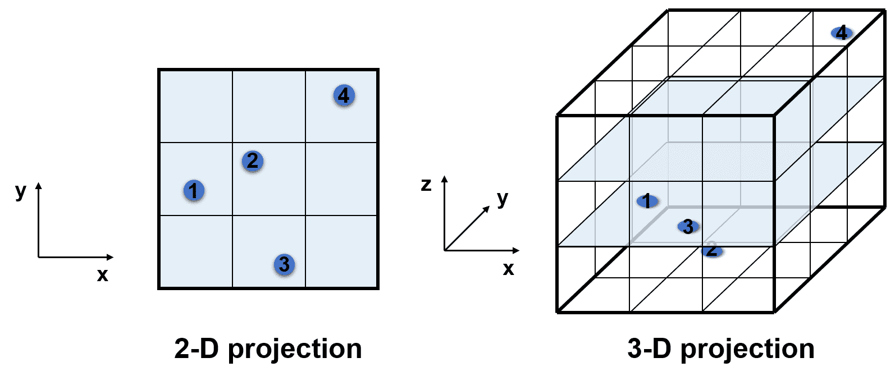
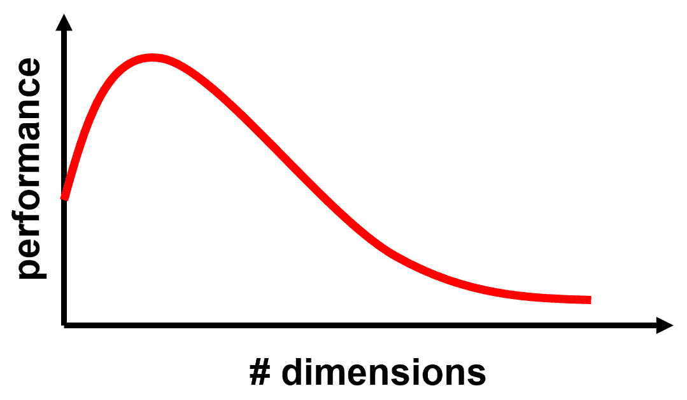
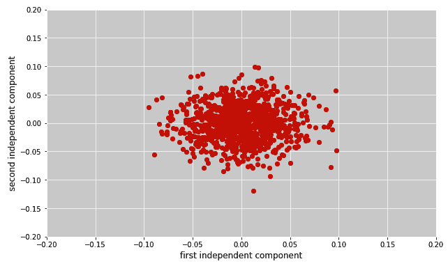
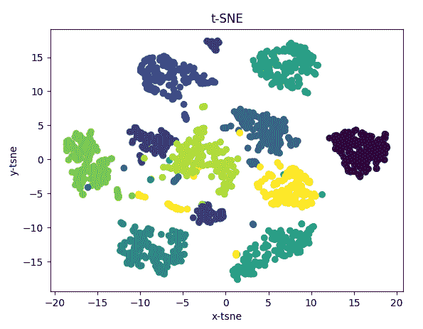
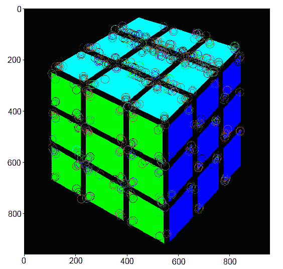

# 表示数据和特征工程

在上一章中，我们构建了我们第一个监督学习模型，并将其应用于一些经典数据集，如**Iris**和**Boston**数据集。然而，在现实世界中，数据很少以整洁的`<n_samples x n_features>`**特征矩阵**的形式出现，这是预包装数据库的一部分。相反，我们的责任是找到一种有意义的表示数据的方法。寻找最佳数据表示方式的过程被称为**特征工程**，这是数据科学家和试图解决现实世界问题的机器学习从业者的一项主要任务。

我知道您更愿意直接跳到结尾，构建人类有史以来最深的神经网络。 ...

# 技术要求

您可以从以下链接中获取本章的代码：[`github.com/PacktPublishing/Machine-Learning-for-OpenCV-Second-Edition/tree/master/Chapter04`](https://github.com/PacktPublishing/Machine-Learning-for-OpenCV-Second-Edition/tree/master/Chapter04)。

这里是软件和硬件要求的一个总结：

+   您将需要 OpenCV 版本 4.1.x（4.1.0 或 4.1.1 都可以正常工作）。

+   您将需要 Python 版本 3.6（任何 Python 3.x 版本都可以）。

+   您需要 Anaconda Python 3 来安装 Python 和所需的模块。

+   您可以使用任何操作系统——macOS、Windows 以及基于 Linux 的操作系统，配合本书使用。我们建议您的系统至少有 4GB RAM。

+   您不需要拥有 GPU 来运行本书提供的代码。

# 理解特征工程

信不信由你，一个机器学习系统能够学习的好坏主要取决于训练数据的质量。尽管每个学习算法都有其优势和劣势，但性能的差异通常归结于数据准备或表示的方式。因此，特征工程可以理解为一种**数据表示**的工具。机器学习算法试图从样本数据中学习解决问题的解决方案，而特征工程则问：使用什么最佳表示的样本数据来学习解决问题的解决方案？

记住，在前几章中，我们讨论了整个机器学习流程。在那里，我们已经提到了特征提取，但我们也 ...

# 数据预处理

我们在处理数据方面越有纪律，最终可能获得的结果就越好。这个程序的第一步被称为**数据预处理**，它至少有三种不同的风味：

+   **数据格式化**：数据可能不是我们能够工作的格式；例如，数据可能以专有文件格式提供，而我们最喜欢的机器学习算法无法理解。

+   **数据清洗**：数据可能包含无效或缺失条目，需要清理或删除。

+   **数据采样**：数据可能远远超出了我们特定目的的需求，迫使我们智能地采样数据。

一旦数据预处理完成，我们就可以准备进行实际的特征工程：将预处理后的数据转换以适应我们特定的机器学习算法。这一步通常涉及以下三种可能过程之一或多个：

+   **缩放**：某些机器学习算法通常要求数据在公共范围内，例如具有零均值和单位方差。缩放是将所有特征（可能具有不同的物理单位）带入一个共同值范围的过程。

+   **分解**：数据集通常具有比我们能够处理更多的特征。特征分解是将数据压缩成更少但高度信息丰富的数据组件的过程。

+   **聚合**：有时，可以将多个特征组合成一个更有意义的单一特征。例如，数据库可能包含每个用户登录基于网络的系统的日期和时间。根据任务的不同，这些数据可能通过简单地计算每个用户的登录次数来更好地表示。

让我们更详细地看看这些过程。

# 标准化特征

**标准化**指的是将数据缩放到具有零均值和单位方差的过程。这对于广泛的机器学习算法来说是一个常见的要求，如果单个特征不满足这一要求，这些算法可能会表现不佳。我们可以通过从每个数据点中减去所有数据的平均值（*μ*）并除以数据的方差（*σ*）来手动标准化我们的数据；也就是说，对于每个特征*x*，我们会计算*(x - μ) / σ*。

或者，scikit-learn 在其`preprocessing`模块中提供了一个直接实现此过程的简单方法。

让我们考虑一个 3 x 3 的数据矩阵，`X`，代表三个数据点（行）以及每个数据点三个任意选择的特征值（列）：...

# 归一化特征

与标准化类似，归一化是缩放单个样本以具有单位范数的过程。我确信你知道范数代表向量的长度，并且可以以不同的方式定义。我们在上一章讨论了其中的两种：L1 范数（或曼哈顿距离）和 L2 范数（或欧几里得距离）。

在 scikit-learn 中，我们可以使用`normalize`函数来对数据矩阵`X`进行归一化，并通过`norm`关键字指定`l1`范数：

```py
In [5]: X_normalized_l1 = preprocessing.normalize(X, norm='l1')
...     X_normalized_l1
Out[5]: array([[ 0.2, -0.4, 0.4],
               [ 1\. , 0\. , 0\. ],
               [ 0\. , 0.5, -0.5]])
```

同样，可以通过指定`norm='l2'`来计算 L2 范数：

```py
In [6]: X_normalized_l2 = preprocessing.normalize(X, norm='l2')
...     X_normalized_l2
Out[6]: array([[ 0.33333333, -0.66666667, 0.66666667],
               [ 1\. , 0\. , 0\. ],
               [ 0\. , 0.70710678, -0.70710678]])
```

# 特征缩放到一个范围

缩放特征到零均值和单位方差的一个替代方法是让特征位于给定的最小值和最大值之间。通常，这些值是零和一，这样每个特征的绝对最大值就被缩放为单位大小。在 scikit-learn 中，这可以通过使用`MinMaxScaler`实现：

```py
In [7]: min_max_scaler = preprocessing.MinMaxScaler()...     X_min_max = min_max_scaler.fit_transform(X)...     X_min_maxOut[7]: array([[ 0.33333333, 0\. , 1\. ],               [ 1\. , 0.66666667, 0.33333333],               [ 0\. , 1\. , 0\. ]])
```

默认情况下，数据将被缩放到 0 和 1 之间。我们可以通过向`MinMaxScaler`构造函数传递一个关键字参数`feature_range`来指定不同的范围：

```py
In [8]: min_max_scaler = preprocessing.MinMaxScaler(feature_range ...
```

# 二值化特征

最后，我们可能不太关心数据的精确特征值。相反，我们可能只想知道一个特征是否存在。通过阈值处理特征值可以实现数据的二值化。让我们快速回顾一下我们的特征矩阵`X`：

```py
In [9]: X
Out[9]: array([[ 1., -2., 2.],
               [ 3., 0., 0.],
               [ 0., 1., -1.]])
```

假设这些数字代表我们银行账户中的数千美元。如果账户中有超过 0.5 千美元，我们将其视为富人，用 1 表示。否则，我们用 0 表示。这类似于使用`threshold=0.5`对数据进行阈值处理：

```py
In [10]: binarizer = preprocessing.Binarizer(threshold=0.5)
...      X_binarized = binarizer.transform(X)
...      X_binarized
Out[10]: array([[ 1., 0., 1.],
                [ 1., 0., 0.],
                [ 0., 1., 0.]])
```

结果是一个由全 1 和全 0 组成的矩阵。

# 处理缺失数据

在特征工程中，另一个常见的要求是处理缺失数据。例如，我们可能有一个看起来像这样的数据集：

```py
In [11]: from numpy import nan...      X = np.array([[ nan, 0,   3 ],...                    [ 2,   9,  -8 ],...                    [ 1,   nan, 1 ],...                    [ 5,   2,   4 ],...                    [ 7,   6,  -3 ]])
```

大多数机器学习算法都无法处理**非数字**（Python 中的`nan`）值。因此，我们首先必须用一些适当的填充值替换所有`nan`值。这被称为缺失值的**插补**。

scikit-learn 提供了三种不同的策略来插补缺失值：

+   `mean`: 使用矩阵指定轴上的平均值替换所有`nan`值（默认：*axis = 0*）

+   `median`: 使用...

# 理解降维

数据集通常具有比我们可能处理的更多的特征。例如，让我们假设我们的工作是预测一个国家的贫困率。我们可能会首先将一个国家的名字与其贫困率相匹配，但这不会帮助我们预测新国家的贫困率。因此，我们开始思考贫困的可能原因。但有多少可能的贫困原因呢？可能包括一个国家的经济、缺乏教育、高离婚率、人口过剩等等。如果每个原因都是一个用于帮助预测贫困率的特征，我们最终会得到无数个特征。如果你是一位数学家，你可能会将这些特征视为高维空间中的**轴**，而每个国家的贫困率在这个高维空间中就是一个单独的点。

如果你不是数学家，从小处着手可能会有所帮助。比如说，我们首先只看两个特征：一个国家的**国内生产总值**（**GDP**）和公民数量。我们将 GDP 解释为**x 轴**，公民数量解释为**y 轴**，在一个二维空间中。然后，我们来看第一个国家。它有一个较小的 GDP 和平均数量的公民。我们在**x-y**平面上画一个点来代表这个国家。我们再添加第二个、第三个和第四个国家。第四个国家恰好既有高 GDP 又有大量公民。因此，我们的四个数据点可能会像以下截图那样在**x-y**平面上分布得很开：



然而，如果我们开始添加第三个特征，比如国家的离婚率，到我们的分析中会发生什么？这将给我们的图表添加一个第三个轴（*z 轴*）。突然，我们发现数据不再非常均匀地分布在**x-y-z**立方体上，因为立方体的大部分仍然是空的。在二维空间中，我们似乎已经覆盖了大部分的**x-y**正方形，但在三维空间中，我们需要更多的数据点来填补数据点 1 到 3 之间的空白，以及右上角孤独的数据点 4。

这个问题也被称为**维度灾难**：填充可用空间所需的数据点数量随着维度（或图表轴）数量的指数增长。如果一个分类器没有提供跨越整个特征空间的数据点（如前述立方体示例所示），那么当出现一个位于所有先前遇到的数据点都很远的新数据点时，分类器将不知道该怎么办。

维度灾难意味着，在一定的特征数量（或维度）之后，分类器的性能将开始下降。让我们来理解这一点。更多的特征本质上意味着可以解释数据集中的更多变化。但是，考虑超过所需特征的数量会导致分类器甚至考虑任何异常值或过度拟合数据集。因此，分类器的性能将开始下降而不是提高：



但是，我们如何找到数据集的看似最优的维度数量？

这就是**降维**发挥作用的地方。这是一系列技术，允许我们找到高维数据的紧凑表示，而不会丢失太多信息。

# 在 OpenCV 中实现主成分分析（PCA）

最常见的降维技术之一被称为**PCA**。

与前面展示的 2D 和 3D 示例类似，我们可以将图像视为高维空间中的一个点。如果我们通过堆叠所有列将高度为*m*和宽度为*n*的 2D 灰度图像展平，我们得到一个长度为*m x n x 1*的（特征）向量。这个向量中第*i*个元素的值是图像中第*i*个像素的灰度值。现在，想象一下，如果我们想用这些精确的维度来表示每个可能的 2D 灰度图像，那会有多少个图像？

由于灰度像素通常取值在 0 到 255 之间，总共有 256 的*m x* *n*次方个图像。机会 ...

# 实现独立成分分析 (ICA)

scikit-learn 提供了与 PCA 密切相关但不是 OpenCV 的其他有用的降维技术。我们在这里提及它们是为了完整性。ICA 执行与 PCA 相同的数学步骤，但它选择分解的组件尽可能相互独立，而不是像 PCA 那样按预测变量选择。

在 scikit-learn 中，ICA 可以从`decomposition`模块中获取：

```py
In [9]:  from sklearn import decomposition
In [10]: ica = decomposition.FastICA(tol=0.005)
```

为什么我们使用`tol=0.005`？因为我们希望 FastICA 收敛到某个特定的值。有两种方法可以实现这一点——增加迭代次数（默认值为`200`）或减少容差（默认值为`0.0001`）。我尝试增加迭代次数，但不幸的是，它不起作用，所以我选择了另一种方法。你能想出为什么它没有收敛吗？

如前所述，数据转换发生在`fit_transform`函数中：

```py
In [11]: X2 = ica.fit_transform(X)
```

在我们的情况下，绘制旋转后的数据会导致与之前使用 PCA 获得的结果相似，这可以在随后的代码块后的图中验证。

```py
In [12]: plt.figure(figsize=(10, 6))
...      plt.plot(X2[:, 0], X2[:, 1], 'o')
...      plt.xlabel('first independent component')
...      plt.ylabel('second independent component')
...      plt.axis([-0.2, 0.2, -0.2, 0.2])
Out[12]: [-0.2, 0.2, -0.2, 0.2]
```

这可以在以下图中看到：



# 实现非负矩阵分解 (NMF)

另一种有用的降维技术称为**NMF**。它再次实现了与 PCA 和 ICA 相同的基本数学运算，但它有一个额外的约束，即它**仅对非负数据进行操作**。换句话说，如果我们想使用 NMF，我们的特征矩阵中不能有负值；分解的结果也将全部具有非负值。

在 scikit-learn 中，NMF 与 ICA 的工作方式完全相同：

```py
In [13]: nmf = decomposition.NMF()In [14]: X2 = nmf.fit_transform(X)In [15]: plt.plot(X2[:, 0], X2[:, 1], 'o')...      plt.xlabel('first non-negative component')...      plt.ylabel('second non-negative component')...      plt.axis([-5, 20, -5, 10])Out[15]: [-5, 20, ...
```

# 使用 t-Distributed Stochastic Neighbor Embedding (t-SNE)可视化降维

t-SNE 是一种降维技术，非常适合高维数据的可视化。

在本节中，我们将看到一个如何使用 t-SNE 可视化高维数据集的例子。以数字数据集为例，其中包含从 0 到 9 的手写数字图像。这是一个公开可用的数据集，通常被称为 MNIST 数据集。我们将看到如何使用 t-SNE 在这个数据集上可视化降维：

1.  首先，让我们加载数据集：

```py
In [1]: import numpy as np
In [2]: from sklearn.datasets import load_digits
In [3]: digits = load_digits()
In [4]: X, y = digits.data/255.0, digits.target
In [5]: print(X.shape, y.shape)
Out[5]: (1797, 64) (1797,)
```

1.  您应该首先应用 PCA 等降维技术将高维数减少到较低的维数，然后使用 t-SNE 等技术来可视化数据。但是，在这种情况下，让我们使用所有维度并直接使用 t-SNE：

```py
In [6]: from sklearn.manifold import TSNE
In [7]: tsne = TSNE(n_components=2, verbose=1, perplexity=40, n_iter=300)
In [8]: tsne_results = tsne.fit_transform(df.loc[:,features].values)
Out[8]: [t-SNE] Computing 121 nearest neighbors...
... [t-SNE] Indexed 1797 samples in 0.009s...
... [t-SNE] Computed neighbors for 1797 samples in 0.395s...
... [t-SNE] Computed conditional probabilities for sample 1000 / 1797
... [t-SNE] Computed conditional probabilities for sample 1797 / 1797
... [t-SNE] Mean sigma: 0.048776
... [t-SNE] KL divergence after 250 iterations with early exaggeration: 61.094833
... [t-SNE] KL divergence after 300 iterations: 0.926492
```

1.  最后，让我们使用散点图帮助我们可视化使用 t-SNE 提取的两个维度：

```py
In [9]: import matplotlib.pyplot as plt
In [10]: plt.scatter(tsne_results[:,0],tsne_results[:,1],c=y/10.0)
...      plt.xlabel('x-tsne')
...      plt.ylabel('y-tsne')
...      plt.title('t-SNE')
In [11]: plt.show()
```

我们得到以下输出：



现在，让我们在下一节讨论如何表示分类变量。

# 表示分类变量

在构建机器学习系统时，我们可能会遇到的最常见的数据类型之一是**分类特征**（也称为**离散特征**），例如水果的颜色或公司的名称。分类特征的挑战在于它们不是以连续的方式变化的，这使得用数字表示它们变得困难。

例如，香蕉要么是绿色的，要么是黄色的，但不会同时是两者。一个产品要么属于服装部门，要么属于书籍部门，很少同时属于两者，等等。

你会如何表示这样的特征？

例如，假设我们正在尝试编码一个包含机器学习和人工智能先驱名单的数据集：...

# 表示文本特征

与分类特征类似，scikit-learn 提供了一个简单的方法来编码另一种常见的特征类型——文本特征。当处理文本特征时，通常方便将单个单词或短语编码为数值。

让我们考虑一个包含少量文本短语的语料库数据集：

```py
In [1]: sample = [
...        'feature engineering',
...        'feature selection',
...        'feature extraction'
...     ]
```

编码此类数据的最简单方法之一是通过词频统计；对于每个短语，我们只需统计其中每个单词的出现次数。在 scikit-learn 中，这可以通过使用`CountVectorizer`轻松完成，其功能类似于`DictVectorizer`：

```py
In [2]: from sklearn.feature_extraction.text import CountVectorizer
...     vec = CountVectorizer()
...     X = vec.fit_transform(sample)
...     X
Out[2]: <3x4 sparse matrix of type '<class 'numpy.int64'>'
                with 6 stored elements in Compressed Sparse Row format>
```

默认情况下，这将把我们的特征矩阵`X`存储为稀疏矩阵。如果我们想手动检查它，我们需要将其转换为常规数组：

```py
In [3]: X.toarray()
Out[3]: array([[1, 0, 1, 0],
               [0, 0, 1, 1],
               [0, 1, 1, 0]], dtype=int64)
```

要了解这些数字的含义，我们必须查看特征名称：

```py
In [4]: vec.get_feature_names()
Out[4]: ['engineering', 'extraction', 'feature', 'selection']
```

现在，`X`中的整数含义变得清晰。如果我们查看`X`顶部行表示的短语，我们会看到它包含一次`engineering`这个词的出现，以及一次`feature`这个词的出现。另一方面，它不包含`extraction`或`selection`这两个词。这有意义吗？快速查看我们的原始数据`sample`揭示，这个短语确实是`feature engineering`。

只看`X`数组（不要作弊！），你能猜出`sample`中的最后一个短语是什么吗？

这种方法的一个可能的缺点是我们可能会过分重视出现频率非常高的单词。解决这个问题的一个方法被称为**词频-逆文档频率**（**TF-IDF**）。TF-IDF 所做的事情可能比它的名字更容易理解，它基本上是通过衡量单词在整个数据集中出现的频率来权衡单词计数。

TF-IDF 的语法与之前的命令非常相似：

```py
In [5]: from sklearn.feature_extraction.text import TfidfVectorizer
...     vec = TfidfVectorizer()
...     X = vec.fit_transform(sample)
...     X.toarray()
Out[5]: array([[ 0.861037 , 0\. , 0.50854232, 0\. ],
               [ 0\. , 0\. , 0.50854232, 0.861037 ],
               [ 0\. , 0.861037 , 0.50854232, 0\. ]])
```

我们注意到，现在的数字比以前小了，第三列的降幅最大。这是有道理的，因为第三列对应于所有三个短语中最频繁出现的单词`feature`：

```py
In [6]: vec.get_feature_names()
Out[6]: ['engineering', 'extraction', 'feature', 'selection']
```

如果你对 TF-IDF 背后的数学感兴趣，可以从这篇论文开始：[`citeseerx.ist.psu.edu/viewdoc/download?doi=10.1.1.121.1424&rep=rep1&type=pdf`](http://citeseerx.ist.psu.edu/viewdoc/download?doi=10.1.1.121.1424&rep=rep1&type=pdf)。有关 scikit-learn 中其具体实现的更多信息，请参阅 API 文档：[`scikit-learn.org/stable/modules/feature_extraction.html#tfidf-term-weighting`](http://scikit-learn.org/stable/modules/feature_extraction.html#tfidf-term-weighting)[。](http://citeseerx.ist.psu.edu/viewdoc/download?doi=10.1.1.121.1424&rep=rep1&type=pdf)

在第七章中，我们将讨论表示文本特征的重要性，该章节名为*使用贝叶斯学习实现垃圾邮件过滤器*。

# 表示图像

计算机视觉中最常见且重要的数据类型当然是图像。表示图像最直接的方式可能是使用图像中每个像素的灰度值。通常，灰度值并不能很好地表明它们所描述的数据。例如，如果我们看到一个灰度值为 128 的单个像素，我们能否判断这个像素属于哪个物体？可能不能。因此，灰度值并不是非常有效的图像特征。

# 使用颜色空间

或者，我们可能会发现颜色包含一些原始灰度值无法捕捉到的信息。最常见的情况是，图像以传统的 RGB 颜色空间出现，其中图像中的每个像素都有一个表示其显色**红色**（**R**）、**绿色**（**G**）和**蓝色**（**B**）强度的值。然而，OpenCV 提供了一系列其他颜色空间，例如**色调饱和度值**（**HSV**）、**色调饱和度亮度**（**HSL**）和 Lab 颜色空间。让我们快速了解一下它们。

# 在 RGB 空间中编码图像

我相信你已经熟悉 RGB 颜色空间了，它通过不同色调的红、绿、蓝的加色混合来产生不同的合成颜色。RGB 颜色空间在日常生活中非常有用，因为它覆盖了人眼可以看到的大部分颜色空间。这就是为什么彩色电视或彩色计算机显示器只需要关注产生红、绿、蓝光的混合。

在 OpenCV 中，RGB 图像直接支持。你需要知道或需要提醒的是，在 OpenCV 中，彩色图像实际上是存储为 BGR 图像；也就是说，颜色通道的顺序是蓝-绿-红，而不是红-绿-蓝。这样做的原因是...

# 在 HSV 和 HLS 空间中编码图像

然而，自从 RGB 颜色空间被创建以来，人们已经意识到它实际上是对人类视觉的一种相当差的表示。因此，研究人员已经开发了许多替代表示。其中之一被称为**HSV**（代表**色调、饱和度和亮度**）和另一个被称为**HLS**（**色调、亮度和饱和度**）。你可能已经在颜色选择器和常见的图像编辑软件中看到过这些颜色空间。在这些颜色空间中，颜色的色调由一个单独的色调通道捕获，颜色的饱和度由饱和度通道捕获，而亮度或亮度由亮度或值通道捕获。

在 OpenCV 中，可以使用`cv2.cvtColor`轻松将 RGB 图像转换为 HSV 颜色空间：

```py
In [5]: img_hsv = cv2.cvtColor(img_bgr, cv2.COLOR_BGR2HSV)
```

对于 HLS 颜色空间也是如此。实际上，OpenCV 提供了一系列额外的颜色空间，这些颜色空间可以通过`cv2.cvtColor`访问。我们只需要将颜色标志替换为以下之一：

+   使用`cv2.COLOR_BGR2HLS`的 HLS

+   使用`cv2.COLOR_BGR2LAB`的 LAB（亮度、绿色-红色和蓝色-黄色）

+   YUV（整体亮度、蓝色亮度和红色亮度）使用`cv2.COLOR_BGR2YUV`

# 在图像中检测角点

在图像中找到的最简单直观的传统特征可能是角点（几个边缘相交的位置）。OpenCV 提供了至少两种不同的算法来在图像中找到角点：

+   **Harris-Dorner 检测**：知道边缘是所有方向上强度变化高的区域，Harris 和 Stephens 提出了一种快速找到这种位置的方法。这个算法在 OpenCV 中实现为`cv2.cornerHarris`。

+   **Shi-Tomasi 角点检测**：Shi 和 Tomasi 有他们自己对构成良好跟踪特征的想法，并且他们通常通过找到**N**个最强的角点，比 Harris 角点检测做得更好。这个算法在 OpenCV 中实现为`cv2.goodFeaturesToTrack`。

Harris ...

# 使用星形检测器和 BRIEF 描述符

然而，当图像的尺度发生变化时，角点检测是不够的。已经发表了多篇论文，描述了不同的特征检测和描述算法。我们将查看**Speeded Up Robust Features**（**SURF**）检测器（更多信息请参阅[`en.wikipedia.org/wiki/Speeded_up_robust_features`](https://en.wikipedia.org/wiki/Speeded_up_robust_features)）和**Binary Robust Independent Elementary Features**（**BRIEF**）描述符的组合。特征检测器识别图像中的关键点，特征描述符计算所有关键点的实际特征值。

这些算法的细节超出了本书的范围。高级用户可以参考详细描述这些算法的论文。

更多细节，您可以参考以下链接：

+   对于 SURF: [`www.vision.ee.ethz.ch/~surf/eccv06.pdf`](https://www.vision.ee.ethz.ch/~surf/eccv06.pdf)

+   对于 BRIEF: [`www.cs.ubc.ca/~lowe/525/papers/calonder_eccv10.pdf`](https://www.cs.ubc.ca/~lowe/525/papers/calonder_eccv10.pdf)

整个过程从读取图像开始，将其转换为灰度图，使用星形特征检测器找到有趣点，最后使用 BRIEF 描述符计算特征值。

1.  让我们先读取图像并将其转换为灰度图：

```py
In [23]: img = cv2.imread('data/rubic-cube.png')
In [24]: gray = cv2.cvtColor(img, cv2.COLOR_BGR2GRAY)
```

1.  现在，我们将创建特征检测器和描述符：

```py
In [25]: star = cv2.xfeatures2d.StarDetector_create()
In [26]: brief = cv2.xfeatures2d.BriefDescriptorExtractor_create()
```

1.  接下来，是时候使用星形检测器获取关键点并将它们传递给 BRIEF 描述符了：

```py
In [27]: keyPoints = star.detect(gray, None)
In [28]: keyPoints, descriptors = brief.compute(img, keyPoints)
```

这里有一个问题。在撰写这本书的时候，OpenCV 4.0 版本还没有`cv2.drawKeypoints`函数的解决版本。因此，我编写了一个类似的功能，我们可以用它来绘制关键点。您不需要担心函数中涉及的步骤——它只是为了您的参考。如果您已经安装了本书中指定的 OpenCV 版本（OpenCV 4.1.0 或 OpenCV 4.1.1），您可以直接使用`cv2.drawKeypoints`函数：

```py
In [29]: def drawKeypoint (img, keypoint, color):
...          draw_shift_bits = 4
...          draw_multiplier = 1 << draw_shift_bits

...          center = (int(round(keypoint.pt[0])),int(round(keypoint.pt[1])))

...          radius = int(round(keypoint.size/2.0))

...          # draw the circles around keypoints with the keypoints size
...          cv2.circle(img, center, radius, color, 1, cv2.LINE_AA)

...          # draw orientation of the keypoint, if it is applicable
...          if keypoint.angle != -1:

...              srcAngleRad = keypoint.angle * np.pi/180.0

...              orient = (int(round(np.cos(srcAngleRad)*radius)), \
                 int(round(np.sin(srcAngleRad)*radius)))

...              cv2.line(img, center, (center[0]+orient[0],\
                               center[1]+orient[1]),\
                 color, 1, cv2.LINE_AA)
...          else:
...              # draw center with R=1
...              radius = 1 * draw_multiplier
...              cv2.circle(img, center, radius,\
                  color, 1, cv2.LINE_AA)

...          return img
In [30]: from random import randint
...      def drawKeypoints(image, keypoints):
...          for keypoint in keypoints:
...              color = (randint(0,256),randint(0,256),randint(0,256))
...              image = drawKeypoint(image, keypoint, color)
...          return image
```

1.  现在我们使用这个函数来绘制检测到的关键点：

```py
In [31]: result = drawKeypoints(img, keyPoints)
In [32]: print("Number of keypoints = {}".format(len(keyPoints)))
Out[32]: Number of keypoints = 453
In [33]: plt.figure(figsize=(18,9))
...      plt.imshow(result)
```

我们得到了以下输出：



这真的很棒，对吧？

BRIEF 既简单又快速，但它不适用于图像的旋转。您可以尝试旋转图像（更多信息请参阅[`www.pyimagesearch.com/2017/01/02/rotate-images-correctly-with-opencv-and-python/`](https://www.pyimagesearch.com/2017/01/02/rotate-images-correctly-with-opencv-and-python/)），然后运行 BRIEF。让我们看看 ORB 如何帮助我们解决这个问题。

# 使用 Oriented FAST and Rotated BRIEF (ORB)

说到个人观点，我非常喜爱 ORB。它是免费的，是 SIFT 和 SURF 的良好替代品，这两者都受到专利法的保护。ORB 实际上比 SURF 表现得更好。值得注意的是，Gary Bradski 是论文《ORB：SIFT 和 SURF 的有效替代品》的作者之一。你能想出这有什么有趣的地方吗？搜索 Gary Bradski 和 OpenCV，你将找到答案。

整个过程大致相同，所以让我们快速浏览一下代码：

```py
In [34]: img = cv2.imread('data/rubic-cube.png')...      gray = cv2.cvtColor(img, cv2.COLOR_BGR2GRAY)In [35]: orb = cv2.ORB_create()In [36]: keyPoints = orb.detect(gray,None)In [37]: keyPoints, descriptors ...
```

# 摘要

在本章中，我们深入探讨了机器学习中的特征工程技术，重点关注特征选择和特征提取。我们成功地对数据进行格式化、清理和转换，使其能够被常见的机器学习算法理解。我们了解了维度诅咒，并在 OpenCV 中实现了 PCA 进行了一些维度约简的尝试。最后，我们简要游览了 OpenCV 为图像数据提供的常见特征提取技术。

拥有这些技能在手，我们现在可以应对任何类型的数据，无论是数值型、分类型、文本型还是图像型数据。当我们遇到缺失数据时，我们清楚知道该怎么做，也知道如何转换我们的数据以适应我们偏好的机器学习算法。

在下一章中，我们将迈出下一步，讨论一个具体的用例，即如何使用我们新获得的知识通过决策树进行医学诊断。
