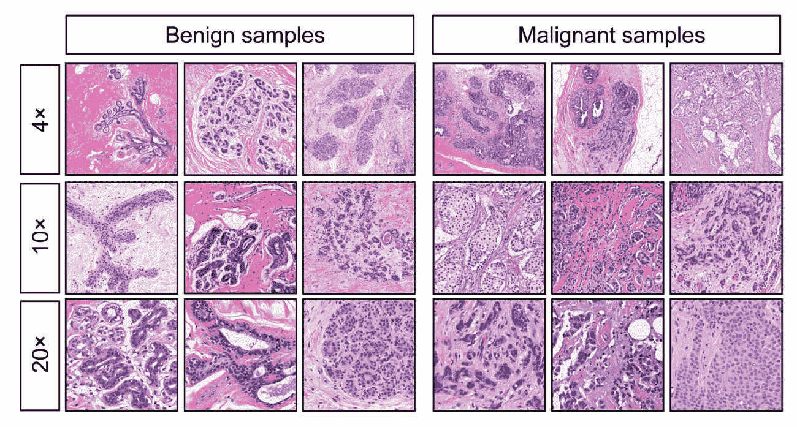

# 第五章：使用决策树进行医疗诊断

现在我们已经知道如何处理各种形状和形式的数据，无论是数值、分类、文本还是图像数据，现在是时候将我们新获得的知识付诸实践了。

在本章中，我们将学习如何构建一个可以进行医疗诊断的机器学习系统。我们可能不是医生，但我们在生活中某个时刻可能都去看过医生。通常，医生会尽可能多地获取有关患者病史和症状的信息，以便做出明智的诊断。我们将借助所谓的**决策树**来模拟医生的决策过程。我们还将涵盖基尼系数、信息增益和方差减少，以及过拟合和剪枝。

决策树是一个简单但强大的监督学习算法，类似于流程图；我们将在下一分钟内更多地讨论这一点。除了在医学领域，决策树还广泛应用于天文学（例如，从哈勃太空望远镜图像中过滤噪声或对星系团进行分类）、制造和生产（例如，波音公司用于发现制造过程中的缺陷）以及物体识别（例如，用于识别 3D 物体）等领域。

在本章中，我们特别想了解以下内容：

+   从数据中构建简单的决策树，并使用它们进行分类或回归

+   使用基尼系数、信息增益和方差减少来决定下一步要做的决策

+   剪枝决策树及其好处

但首先，让我们来谈谈决策树实际上是什么。

# 技术要求

您可以从以下链接中找到本章的代码：[`github.com/PacktPublishing/Machine-Learning-for-OpenCV-Second-Edition/tree/master/Chapter05`](https://github.com/PacktPublishing/Machine-Learning-for-OpenCV-Second-Edition/tree/master/Chapter05)。

下面是软件和硬件要求的总结：

+   您需要 OpenCV 版本 4.1.x（4.1.0 或 4.1.1 都可以正常工作）。

+   您需要 Python 版本 3.6（任何 3.x 版本的 Python 都可以）。

+   您需要 Anaconda Python 3 来安装 Python 和所需的模块。

+   您可以使用任何操作系统——macOS、Windows 和基于 Linux 的操作系统，以及这本书。我们建议您的系统至少有 4 GB 的 RAM。

+   您不需要 GPU 来运行本书提供的代码。

# 理解决策树

决策树是一个简单但强大的监督学习模型。正如其名所示，我们可以将其想象为一棵树，信息沿着不同的分支流动——从树干开始，一直延伸到单个叶子，在每个节点做出关于选择哪个分支的决定。

这基本上就是一个决策树！下面是一个简单的决策树示例：


决策树由关于数据（也称为**决策节点**）及其可能后果的一系列问题或测试的层次结构组成。

构建决策树的真正困难之一是如何从数据中提取合适的特征。为了使这一点更清楚，让我们用一个具体的例子来说明。假设我们有一个由单个电子邮件组成的数据集：

```py
In [1]: data = [
...       'I am Mohammed Abacha, the son of the late Nigerian Head of '
...       'State who died on the 8th of June 1998\. Since i have been '
...       'unsuccessful in locating the relatives for over 2 years now '
...       'I seek your consent to present you as the next of kin so '
...       'that the proceeds of this account valued at US$15.5 Million '
...       'Dollars can be paid to you. If you are capable and willing '
...       'to assist, contact me at once via email with following '
...       'details: 1\. Your full name, address, and telephone number. '
...       '2\. Your Bank Name, Address. 3.Your Bank Account Number and '
...       'Beneficiary Name - You must be the signatory.'
...     ]
```

这封电子邮件可以像我们在上一章中做的那样，使用 scikit-learn 的`CountVectorizer`进行向量化：

```py
In [2]: from sklearn.feature_extraction.text import CountVectorizer
... vec = CountVectorizer()
... X = vec.fit_transform(data)
```

从上一章，我们知道我们可以使用以下函数查看`X`中的特征名称：

```py
In [3]: function:vec.get_feature_names()[:5]
Out[3]: ['15', '1998', '8th', 'abacha', 'account']
```

为了清晰起见，我们只关注前五个词，这些词按字母顺序排序。然后，可以找到相应的出现次数如下：

```py
In [4]: X.toarray()[0, :5]
Out[4]: array([1, 1, 1, 1, 2], dtype=int64)
```

这告诉我们，五分之四的词在电子邮件中只出现了一次，但`account`这个词（在`Out[3]`中列出的最后一个词）实际上出现了两次。在上一章中，我们输入了`X.toarray()`来将稀疏数组`X`转换为人类可读的数组。结果是二维数组，其中行对应于数据样本，列对应于前一个命令中描述的特征名称。由于数据集中只有一个样本，我们只限于数组的第 0 行（即第一个数据样本）和数组的前五列（即前五个词）。

那么，我们如何检查这封电子邮件是否来自尼日利亚王子？

做这件事的一种方法就是看看电子邮件中是否同时包含`nigerian`和`prince`这两个词：

```py
In [5]: 'nigerian' in vec.get_feature_names()
Out[5]: True
In [6]: 'prince' in vec.get_feature_names()
Out[6]: False
```

令我们惊讶的是，我们发现`prince`这个词在电子邮件中并没有出现。

这是否意味着这条消息是合法的？

不，当然不是。电子邮件中没有使用“王子”，而是用了“国家元首”这样的词，有效地绕过了我们过于简单的垃圾邮件检测器。

同样，我们甚至不知道如何开始建模树中的第二个决策：*想要我给他汇款吗？* 文本中没有直接回答这个问题的特征。因此，这是一个特征工程问题，即以这种方式组合消息中实际出现的单词，以便我们能够回答这个问题。当然，一个好的迹象是寻找像`US$`和`money`这样的字符串，但这样我们仍然不知道这些词被提及的上下文。据我们所知，也许它们是句子的一部分：*别担心，我不想让你给我汇款。*

更糟糕的是，结果发现我们提问的顺序实际上可以影响最终结果。例如，如果我们先问最后一个问题：*我实际上认识一个尼日利亚王子吗？* 假设我们有一个尼日利亚王子作为叔叔，那么在电子邮件中找到“尼日利亚王子”这个词可能就不再可疑了。

如您所见，这个看似简单的例子很快就变得难以控制了。

幸运的是，决策树背后的理论框架帮助我们找到正确的决策规则以及下一步要解决的问题。

然而，为了理解这些概念，我们必须深入挖掘。

# 构建我们的第一个决策树

我想我们已经准备好了一个更复杂的例子。如之前所承诺的，现在让我们进入医疗领域。

让我们考虑一个例子，其中几位患者患了同一种疾病，比如一种罕见的厌食症。让我们进一步假设，直到今天，这种疾病的真正原因仍然未知，而我们所能获得的所有信息都是一些生理测量值。例如，我们可能可以访问以下信息：

+   患者的血压（`BP`）

+   患者的胆固醇水平（`cholesterol`）

+   患者的性别（`sex`）

+   患者的年龄（`age`）

+   患者的血钠浓度（`Na`）

+   患者的血钾浓度（`K`）

基于所有...

# 生成新数据

在进行下一步之前，让我们快速了解每个机器学习工程师都非常关键的一步——数据生成。我们知道所有机器学习和深度学习技术都需要大量的数据——简单来说：越大越好。但如果你没有足够的数据呢？好吧，你可能会得到一个不够准确的模型。如果你无法生成任何新数据，常用的技术是将大部分数据用于训练。这种方法的重大缺点是，你得到的模型没有泛化能力，或者说，遭受了过拟合。

解决前面问题的一个方案是生成新的数据，或者通常所说的合成数据。这里需要注意的是，合成数据应该具有与真实数据相似的特征。它们与真实数据越相似，对作为机器学习工程师的你来说就越好。这种技术被称为**数据增强**，其中我们使用各种技术，如旋转和镜像图像，来生成基于现有数据的新数据。

由于我们在这里处理的是一个假设案例，我们可以编写简单的 Python 代码来生成随机数据——因为我们这里没有固定的特征。在现实世界的案例中，你会使用数据增强来生成看起来真实的新数据样本。让我们看看我们如何处理我们的案例。

在这里，数据集实际上是一个字典列表，其中每个字典代表一个单独的数据点，包含一个患者的血液检查结果、年龄和性别，以及所开具的药物。因此，我们知道我们想要创建新的字典，也知道在这个字典中要使用的键。接下来要关注的是字典中值的类型。

我们从`年龄`开始，它是一个整数，然后是性别，它可以是`M`或`F`。类似地，对于其他值，我们可以推断数据类型，在某些情况下，运用常识，我们甚至可以推断出应该使用的值的范围。

非常重要的是要注意，常识和深度学习大多数时候并不兼容。这是因为你希望你的模型能够理解何时某个值是异常值。例如，我们知道一个人年龄为 130 岁是非常不可能的，但一个通用的模型应该理解这个值是异常值，不应该被考虑在内。这就是为什么你应该始终保留一小部分具有这种不合理值的数据。

让我们看看我们如何为我们的案例生成一些合成数据：

```py
import random

def generateBasorexiaData(num_entries):
    # We will save our new entries in this list 
    list_entries = []
    for entry_count in range(num_entries):
        new_entry = {}
        new_entry['age'] = random.randint(20,100)
        new_entry['sex'] = random.choice(['M','F'])
        new_entry['BP'] = random.choice(['low','high','normal'])
        new_entry['cholestrol'] = random.choice(['low','high','normal'])
        new_entry['Na'] = random.random()
        new_entry['K'] = random.random()
        new_entry['drug'] = random.choice(['A','B','C','D'])
        list_entries.append(new_entry)
    return list_entries
```

如果我们想生成五个新的条目，可以使用`entries = generateBasorexiaData (5)`调用前面的函数。

现在我们知道了如何生成数据，让我们看看我们可以用这些数据做什么。我们能弄清楚医生为什么开药`A`、`B`、`C`或`D`吗？我们能看到患者的血液值和医生所开药物之间的关系吗？

很可能，这个问题对你来说和对我来说一样难以回答。尽管数据集乍一看可能看起来是随机的，但实际上，我已经在患者血液值和所开药物之间建立了一些明确的关系。让我们看看决策树能否揭示这些隐藏的关系。

# 通过理解数据来理解任务

解决一个新的机器学习问题时的第一步总是什么？

你说得完全正确：对数据的感知。我们越了解数据，就越能理解我们试图解决的问题。在我们的未来努力中，这也有助于我们选择合适的机器学习算法。

首先要意识到的是，`drug`列实际上并不是像其他列那样的特征值。由于我们的目标是根据患者的血液值预测将被开处的药物，`drug`列实际上变成了目标标签。换句话说，我们机器学习算法的输入将是血液值、年龄和性别 ...

# 数据预处理

为了让我们的数据能够被决策树算法理解，我们需要将所有分类特征（`sex`、`BP`和`cholesterol`）转换为数值特征。最好的方法是什么？

正确：我们使用 scikit-learn 的`DictVectorizer`。就像我们在上一章中做的那样，我们将要转换的数据集输入到`fit_transform`方法中：

```py
In [10]: from sklearn.feature_extraction import DictVectorizer
...      vec = DictVectorizer(sparse=False)
...      data_pre = vec.fit_transform(data)
```

然后，`data_pre`包含预处理后的数据。如果我们想查看第一个数据点（即`data_pre`的第一行），我们将特征名称与相应的特征值进行匹配：

```py
In [12]: vec.get_feature_names()
Out[12]: ['BP=high', 'BP=low', 'BP=normal', 'K', 'Na', 'age',
...       'cholesterol=high', 'cholesterol=normal',
...       'sex=F', 'sex=M']
In [13]: data_pre[0]
Out[13]: array([ 1\. , 0\. , 0\. , 0.06, 0.66, 33\. , 1\. , 0\. ,
                 1\. , 0\. ])
```

从这里，我们可以看到三个分类变量——血压(`BP`)、胆固醇水平(`cholesterol`)和性别(`sex`)——已经使用独热编码进行编码。

为了确保我们的数据变量与 OpenCV 兼容，我们需要将所有内容转换为浮点值：

```py
In [14]: import numpy as np
...      data_pre = np.array(data_pre, dtype=np.float32)
...      target = np.array(target, dtype=np.float32)
```

然后，剩下的工作就是像我们在第三章中做的那样，将数据分为训练集和测试集。记住，我们总是希望保持训练集和测试集的分离。由于在这个例子中我们只有 20 个数据点可以工作，我们可能需要为测试保留超过 10%的数据。在这里，15-5 的分割似乎很合适。我们可以明确地命令`split`函数产生恰好五个测试样本：

```py
In [15]: import sklearn.model_selection as ms
...      X_train, X_test, y_train, y_test =
...      ms.train_test_split(data_pre, target, test_size=5,
...      random_state=42)
```

# 构建树形图

使用 OpenCV 构建决策树与第三章中提到的监督学习入门步骤非常相似。回想一下，所有的机器学习函数都位于 OpenCV 3.1 的`ml`模块中：

1.  我们可以使用以下代码创建一个空的决策树：

```py
In [16]: import cv2...      dtree = cv2.ml.dtree_create()
```

1.  要在训练数据上训练决策树，我们使用`train`方法。这就是为什么我们之前将数据转换为浮点数的原因——这样我们就可以在`train`方法中使用它：

```py
In [17]: dtree.train(X_train, cv2.ml.ROW_SAMPLE, y_train)
```

在这里，我们必须指定`X_train`中的数据样本是占据行（使用`cv2.ml.ROW_SAMPLE`）还是列（`cv2.ml.COL_SAMPLE`）。

1.  然后，我们可以预测...的标签。

# 可视化训练好的决策树

如果你刚开始使用 OpenCV 的决策树实现，并且不太关心底层的工作原理，那么它的实现已经足够好了。然而，在接下来的几节中，我们将转向 scikit-learn。它的实现允许我们自定义算法，使得调查树的内部工作原理变得容易得多。它的文档也更好。

在 scikit-learn 中，决策树可以用于分类和回归。它们位于`tree`模块中：

1.  让我们先从`sklearn`导入`tree`模块：

```py
In [21]: from sklearn import tree
```

1.  与 OpenCV 类似，我们接下来使用`DecisionTreeClassifier`构造函数创建一个空的决策树：

```py
In [22]: dtc = tree.DecisionTreeClassifier()
```

1.  然后，可以使用`fit`方法训练树：

```py
In [23]: dtc.fit(X_train, y_train)
Out[23]: DecisionTreeClassifier(class_weight=None, criterion='gini',
            max_depth=None, max_features=None, max_leaf_nodes=None,
            min_impurity_split=1e-07, min_samples_leaf=1,
            min_samples_split=2, min_weight_fraction_leaf=0.0,
            presort=False, random_state=None, splitter='best')
```

1.  然后，我们可以使用`score`方法在训练集和测试集上计算准确度得分：

```py
In [24]: dtc.score(X_train, y_train)
Out[24]: 1.0
In [25]: dtc.score(X_test, y_test)
Out[25]: 0.40000000000000002
```

现在，这里有个有趣的事情：如果你想了解树的外观，你可以使用 GraphViz 从树结构创建一个 PDF 文件（或任何其他支持的文件类型）。为了使这成为可能，你首先需要安装 GraphViz。不用担心，因为它已经包含在我们这本书开头创建的环境中。

1.  然后，回到 Python 中，你可以使用 scikit-learn 的`export_graphviz`导出器将树以 GraphViz 格式导出到一个文件，例如`tree.dot`：

```py
In [26]: with open("tree.dot", 'w') as f:
... tree.export_graphviz(clf, out_file=f)
```

1.  然后，回到命令行，你可以使用 GraphViz 将`tree.dot`转换为（例如）一个 PNG 文件：

```py
$ dot -Tpng tree.dot -o tree.png
```

或者，你也可以指定`-Tpdf`或任何其他支持的图像格式。前一个树的结果看起来像这样：


这一切意味着什么？让我们一步一步地分解这个图表。

# 探究决策树的内部工作原理

我们之前已经建立了一个决策树基本上是一个做出一系列数据决策的流程图。这个过程从根节点开始（这是最顶端的节点），根据某些决策规则将数据分成两组（仅适用于二叉树），然后重复这个过程，直到所有剩余的样本都具有相同的目标标签，此时我们就到达了一个叶节点。

在之前的垃圾邮件过滤器示例中，决策是通过提出真/假问题来做出的。例如，我们询问一封电子邮件是否包含某个特定的单词。如果包含，我们就沿着标记为 `true` 的边前进，并提出下一个问题。然而，这不仅仅适用于分类特征，...

# 评估特征的重要性

我还没有告诉你的事情是，你如何选择用于分割数据的特征。前面的根节点根据 *Na <= 0.72* 来分割数据，但谁告诉这棵树首先关注钠呢？此外，0.72 这个数字又是从哪里来的呢？

显然，某些特征可能比其他特征更重要。实际上，scikit-learn 提供了一个评估特征重要性的函数，该函数为每个特征提供一个介于 *0* 和 *1* 之间的数值，其中 *0* 表示在所有决策中**完全没有使用**，而 *1* 表示**完美预测目标**。特征重要性被归一化，以便它们的总和为 1：

```py
In [27]: dtc.feature_importances_
Out[27]: array([ 0\.        , 0\.   , 0\.        , 0.13554217, 0.29718876,
                 0.24096386, 0\.   , 0.32630522, 0\.        , 0\. ])
```

如果我们回想一下特征名称，就会变得清楚哪个特征似乎是最重要的。一个图表可能最有信息量：

```py
In [28]: plt.barh(range(10), dtc.feature_importances_, align='center',
...      tick_label=vec.get_feature_names())
```

这将导致以下条形图：


现在，很明显，最重要的特征是知道给患者服用哪种药物，实际上是否患者有正常的胆固醇水平。年龄、钠水平和钾水平也很重要。另一方面，性别和血压似乎没有任何区别。然而，这并不意味着性别或血压是无信息的。这只意味着这些特征没有被决策树选中，可能是因为另一个特征会导致相同的分割。

但是，等等。如果胆固醇水平如此重要，为什么它没有被选为树中的第一个特征（即根节点）？为什么你会选择首先根据钠水平进行分割？这就是我需要告诉你之前图中那个不祥的 `gini` 标签的地方。

特征重要性告诉我们哪些特征对分类很重要，但并不告诉我们它们指示的是哪个类标签。例如，我们只知道胆固醇水平很重要，但我们不知道它是如何导致开处不同药物的。实际上，特征和类别之间可能没有简单的关联。

# 理解决策规则

要构建完美的树，你希望在最有信息量的特征处分割树，从而得到最纯净的女儿节点。然而，这个简单的想法带来了一些实际挑战：

+   实际上并不清楚什么是最具信息量的。我们需要一个具体的值，一个评分函数，或者一个可以描述特征信息量的数学方程。

+   为了找到最佳的分割点，我们必须在每个决策节点搜索所有可能性。

幸运的是，决策树算法实际上为你做了这两步。scikit-learn 支持的两个最常用的标准如下：

+   `criterion='gini'`：基尼不纯度是误分类的度量，目的是... 

# 控制决策树的复杂性

如果你继续生长树直到所有叶子都是纯净的，你通常会得到一个过于复杂的树，难以解释。纯净叶子的存在意味着树在训练数据上 100%正确，就像我们之前展示的树一样。因此，该树在测试数据集上的表现可能非常差，就像我们之前展示的树一样。我们说树对训练数据过拟合了。

避免过拟合有两种常见的方法：

+   **预剪枝**：这是在早期停止树创建的过程。

+   **后剪枝**（或简称**剪枝**）：这是首先构建树，然后移除或合并只包含少量信息的节点的过程。

有几种方法可以预剪枝一棵树，所有这些都可以通过传递可选参数给`DecisionTreeClassifier`构造函数来实现：

+   通过`max_depth`参数限制树的最大深度

+   通过`max_leaf_nodes`限制最大叶节点数

+   通过`min_samples_split`要求节点中至少有足够多的点以继续分割

通常预剪枝足以控制过拟合。

在我们的玩具数据集上试一试！你能否提高测试集上的分数？当你开始调整早期参数时，树布局是如何变化的？

在更复杂的现实世界场景中，预剪枝不再足够用来控制过拟合。在这种情况下，我们希望将多个决策树组合成所谓的**随机森林**。我们将在第十章集成分类方法中讨论这一点。

# 使用决策树诊断乳腺癌

现在我们已经构建了我们的第一个决策树，是时候将我们的注意力转向一个真实的数据集：威斯康星乳腺癌数据集 ([`archive.ics.uci.edu/ml/datasets/Breast+Cancer+Wisconsin+(Diagnostic)`](https://archive.ics.uci.edu/ml/datasets/Breast+Cancer+Wisconsin+(Diagnostic)))。

这个数据集是医学影像研究的一个直接结果，并且现在被认为是经典的。这个数据集是从健康（良性）和癌变（恶性）组织的数字化图像中创建的。不幸的是，我无法找到原始研究中任何公有领域的示例，但图像看起来与以下截图相似：



研究的目的是对组织进行分类...

# 加载数据集

整个数据集是 scikit-learn 示例数据集的一部分。我们可以使用以下命令导入它：

1.  首先，让我们使用`load_breast_cancer`函数加载数据集：

```py
In [1]: from sklearn import datasets
...     data = datasets.load_breast_cancer()
```

1.  如前所述，所有数据都包含在一个 2D 特征矩阵`data.data`中，其中行表示数据样本，列是特征值：

```py
In [2]: data.data.shape
Out[2]: (569, 30)
```

1.  通过查看提供的特征名称，我们认出了一些我们之前提到过的：

```py
In [3]: data.feature_names
Out[3]: array(['mean radius', 'mean texture', 'mean perimeter',
               'mean area', 'mean smoothness', 'mean compactness',
               'mean concavity', 'mean concave points',
               'mean symmetry', 'mean fractal dimension',
               'radius error', 'texture error', 'perimeter error',
               'area error', 'smoothness error',
               'compactness error', 'concavity error',
               'concave points error', 'symmetry error',
               'fractal dimension error', 'worst radius',
               'worst texture', 'worst perimeter', 'worst area',
               'worst smoothness', 'worst compactness',
               'worst concavity', 'worst concave points',
               'worst symmetry', 'worst fractal dimension'], 
              dtype='<U23')
```

1.  由于这是一个二元分类任务，我们预计会找到恰好两个目标名称：

```py
In [4]: data.target_names
Out[4]: array(['malignant', 'benign'], dtype='<U9')
```

1.  让我们保留所有数据样本的 20%用于测试：

```py
In [5]: import sklearn.model_selection as ms
...     X_train, X_test, y_train, y_test =
...     ms.train_test_split(data_pre, target, test_size=0.2,
...     random_state=42)
```

1.  你当然可以选择不同的比例，但最常见的是使用 70-30、80-20 或 90-10。这取决于数据集的大小，但最终不应有太大的差异。将数据分割为 80-20 应产生以下集合大小：

```py
In [6]: X_train.shape, X_test.shape
Out[6]: ((455, 30), (114, 30))
```

# 构建决策树

如前所述，我们可以使用 scikit-learn 的`tree`模块创建一个决策树。现在，让我们不要指定任何可选参数：

1.  我们将首先创建一个决策树：

```py
In [5]: from sklearn import tree...     dtc = tree.DecisionTreeClassifier()
```

1.  你还记得如何训练决策树吗？我们将使用`fit`函数来完成：

```py
In [6]: dtc.fit(X_train, y_train)Out[6]: DecisionTreeClassifier(class_weight=None, criterion='gini',                               max_depth=None, max_features=None,                               max_leaf_nodes=None,                               min_impurity_split=1e-07,                               min_samples_leaf=1,                               min_samples_split=2,                               min_weight_fraction_leaf=0.0,                               presort=False, random_state=None,                               splitter='best')
```

1.  由于我们没有指定任何预剪枝参数，我们预计这...

# 使用决策树进行回归

尽管我们迄今为止一直专注于在分类任务中使用决策树，但你也可以将其用于回归。但你需要再次使用 scikit-learn，因为 OpenCV 不提供这种灵活性。因此，我们在这里将只简要回顾其功能：

1.  假设我们想使用决策树来拟合一个 sin 波。为了使事情更有趣，我们还将使用 NumPy 的随机数生成器对数据点添加一些噪声：

```py
In [1]: import numpy as np
...     rng = np.random.RandomState(42)
```

1.  然后，我们创建 100 个在 0 到 5 之间的随机间隔的*x*值，并计算相应的 sin 值：

```py
In [2]: X = np.sort(5 * rng.rand(100, 1), axis=0)
...     y = np.sin(X).ravel()
```

1.  然后，我们在`y`中的每个其他数据点添加噪声（使用`y[::2]`），并按`0.5`的比例缩放，这样我们不会引入太多的抖动：

```py
In [3]: y[::2] += 0.5 * (0.5 - rng.rand(50))
```

1.  然后，你可以创建一个像其他树一样的回归树。

一个小的不同之处在于，`gini`和`entropy`分割标准不适用于回归任务。相反，scikit-learn 提供了两种不同的分割标准：

+   +   **mse（也称为方差减少）**：此标准计算真实值和预测值之间的**平均平方误差**（**MSE**），并分割导致最小 MSE 的节点。

    +   **mae**：此标准计算真实值和预测值之间的**平均绝对误差**（**MAE**），并分割导致最小 MAE 的节点。

1.  使用 MSE 标准，我们将构建两个树。让我们首先构建一个深度为 2 的树：

```py
In [4]: from sklearn import tree
In [5]: regr1 = tree.DecisionTreeRegressor(max_depth=2,
...     random_state=42)
...     regr1.fit(X, y)
Out[5]: DecisionTreeRegressor(criterion='mse', max_depth=2,
                              max_features=None, max_leaf_nodes=None,
                              min_impurity_split=1e-07,
                              min_samples_leaf=1, min_samples_split=2,
                              min_weight_fraction_leaf=0.0,
                              presort=False, random_state=42,
                              splitter='best')
```

1.  接下来，我们将构建一个最大深度为 5 的决策树：

```py
In [6]: regr2 = tree.DecisionTreeRegressor(max_depth=5,
...     random_state=42)
...     regr2.fit(X, y)
Out[6]: DecisionTreeRegressor(criterion='mse', max_depth=5,
                              max_features=None, max_leaf_nodes=None,
                              min_impurity_split=1e-07,
                              min_samples_leaf=1, min_samples_split=2,
                              min_weight_fraction_leaf=0.0,
                              presort=False, random_state=42,
                              splitter='best')
```

然后，我们可以像第三章中的线性回归器一样使用决策树。

1.  为了这个目的，我们创建了一个测试集，其中*x*值在整个 0 到 5 的范围内密集采样：

```py
In [7]: X_test = np.arange(0.0, 5.0, 0.01)[:, np.newaxis]
```

1.  可以使用`predict`方法获得预测的*y*值：

```py
In [8]: y_1 = regr1.predict(X_test)
...     y_2 = regr2.predict(X_test)
```

1.  如果我们将所有这些放在一起绘制，我们可以看到决策树之间的差异：

```py
In [9]: import matplotlib.pyplot as plt
... %matplotlib inline
... plt.style.use('ggplot')

... plt.scatter(X, y, c='k', s=50, label='data')
... plt.plot(X_test, y_1, label="max_depth=2", linewidth=5)
... plt.plot(X_test, y_2, label="max_depth=5", linewidth=3)
... plt.xlabel("data")
... plt.ylabel("target")
... plt.legend()
Out[9]: <matplotlib.legend.Legend at 0x12d2ee345f8>
```

这将产生以下图表：


在这里，粗红色的线代表深度为 2 的回归树。你可以看到树是如何通过这些粗略的步骤来近似数据的。较细的蓝色线属于深度为 5 的回归树；增加的深度使得树能够进行更多更精细的近似。因此，这棵树可以更好地近似数据。然而，由于这种增加的力量，树也更易受到拟合噪声值的影响，尤其是在图表右侧的尖峰中可以明显看出。

# 摘要

在本章中，我们学习了所有关于决策树的知识以及如何将它们应用于分类和回归任务。我们简要讨论了数据生成、过拟合以及通过调整预剪枝和后剪枝设置来避免这种现象的方法。我们还学习了如何使用基尼不纯度和信息增益等指标来评估节点分裂的质量。最后，我们将决策树应用于医学数据以检测癌组织。我们将在本书的末尾回到决策树，届时我们将多个树组合成所谓的随机森林。但现在，让我们继续探讨新的主题。

在下一章中，我们将介绍机器学习世界中的另一个基本概念：支持向量...
