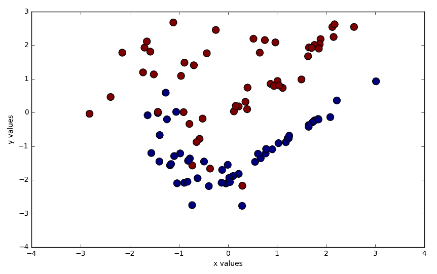
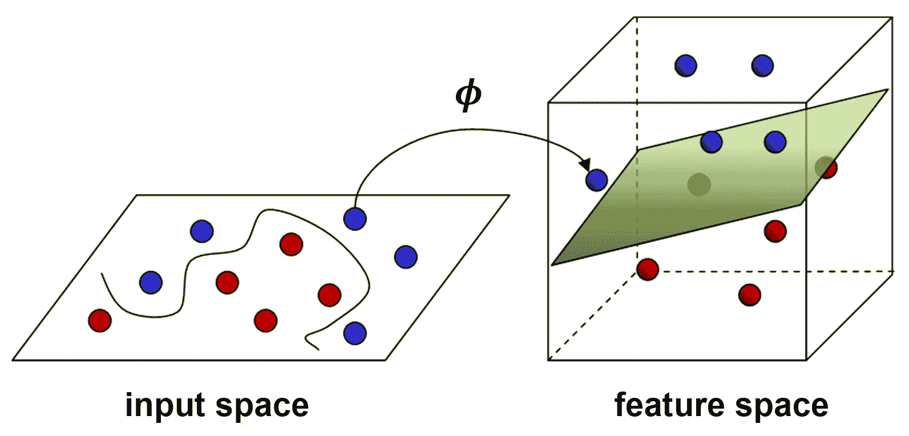
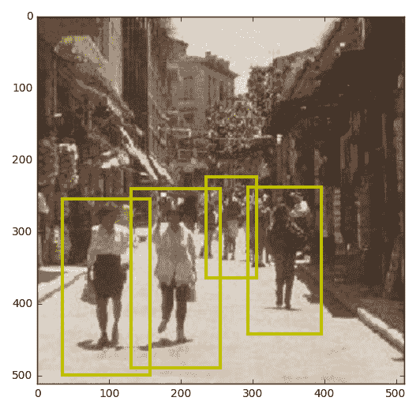
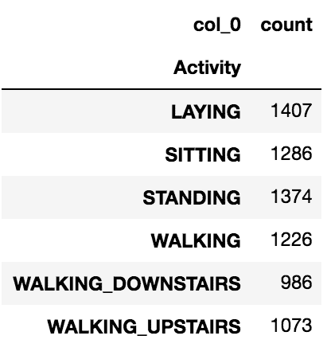

# 使用支持向量机检测行人

在上一章中，我们讨论了如何使用决策树进行分类和回归。在这一章中，我们想要将注意力转向机器学习世界中另一个已确立的监督学习器：**支持向量机（SVMs**）。在 1990 年代初引入后不久，SVMs 迅速在机器学习社区中流行起来，这主要归功于它们在早期手写数字分类中的成功。它们至今仍然相关，尤其是在应用领域，如计算机视觉。

本章的目标是将支持向量机（SVMs）应用于计算机视觉中一个流行的问题：行人检测。与识别任务（我们命名对象的类别）不同，检测任务的目标是判断特定对象（在我们的案例中，是行人）是否在图像中存在。你可能已经知道 OpenCV 可以在两到三行代码中完成这项任务。但是，如果我们那样做，我们将一无所获。所以，我们将从头开始构建整个流程！我们将获取一个真实世界的数据集，使用**方向梯度直方图（HOG**）进行特征提取，并将其应用于 SVM。

在本章中，我们将使用 Python 在 OpenCV 中实现 SVMs。我们将学习如何处理非线性决策边界并理解核技巧。到本章结束时，我们将学习如何在野外检测行人。

在此过程中，我们将涵盖以下主题：

+   使用 Python 在 OpenCV 中实现 SVMs

+   处理非线性决策边界

+   理解核技巧

+   在野外检测行人

激动吗？那么让我们开始吧！

# 技术要求

您可以从以下链接获取本章的代码：[`github.com/PacktPublishing/Machine-Learning-for-OpenCV-Second-Edition/tree/master/Chapter06`](https://github.com/PacktPublishing/Machine-Learning-for-OpenCV-Second-Edition/tree/master/Chapter06).

这里是软件和硬件要求的简要总结：

+   OpenCV 版本 4.1.x（4.1.0 或 4.1.1 都完全可以工作）。

+   Python 版本 3.6（任何 3.x 版本的 Python 都可以）。

+   安装 Python 和所需模块的 Anaconda Python 3。

+   您可以使用任何操作系统——macOS、Windows 和基于 Linux 的操作系统——使用这本书。我们建议您系统至少有 4GB RAM。

+   您不需要 GPU 来运行书中提供的代码。

# 理解线性 SVMs

为了理解 SVMs 是如何工作的，我们必须考虑决策边界。当我们使用早期章节中的线性分类器或决策树时，我们的目标始终是尽量减少分类错误。我们通过使用均方误差来评估准确性来实现这一点。SVM 试图实现低分类错误，但它只是隐式地这样做。SVM 的明确目标是最大化数据点之间的**间隔**。

# 学习最优决策边界

让我们来看一个简单的例子。考虑一些只有两个特征（*x*值和*y*值）和相应的目标标签（正（+）或负（-））的训练样本。由于标签是分类的，我们知道这是一个分类任务。此外，因为我们只有两个不同的类别（+和-），所以这是一个二分类任务。

在二分类任务中，决策边界是一条将训练集分割成两个子集的线，每个类别一个。一个**最优**的**决策****边界**将数据分割，使得一个类别的所有数据样本（比如+）位于决策边界左侧，而所有其他数据样本（比如-）位于其右侧。

SVM 更新其决策选择 ...

# 实现我们的第一个 SVM

但理论就到这里吧。让我们来写一些代码！

可能有一个好主意，放慢我们的步伐。对于我们的第一个 SVM，我们可能应该专注于一个简单的数据集，也许是一个二分类任务。

关于 scikit-learn 的`datasets`模块的一个酷技巧，我没有告诉你的是，你可以生成具有可控大小和复杂度的随机数据集。以下是一些值得注意的例子：

+   `datasets.make_classification([n_samples, ...])`: 这个函数生成一个随机的*n*类分类问题，其中我们可以指定样本数量、特征数量和目标标签数量。

+   `datasets.make_regression([n_samples, ...])`: 这个函数生成一个随机的回归问题。

+   `datasets.make_blobs([n_samples, n_features, ...])`: 这个函数生成一系列高斯云团，我们可以用它们来进行聚类。

这意味着我们可以使用`make_classification`为二分类任务构建一个自定义数据集。

# 生成数据集

就像我们现在可以睡梦中背诵一样，一个二分类问题恰好有两个不同的目标标签（`n_classes=2`）。为了简化，让我们只限制自己使用两个特征值（`n_features=2`；例如，一个*x*值和一个*y*值）。假设我们想要创建 100 个数据样本：

```py
In [1]: from sklearn import datasets...     X, y = datasets.make_classification(n_samples=100, n_features=2,...                                         n_redundant=0, n_classes=2,...                                         random_state=7816)
```

我们期望`X`有 100 行（数据样本）和 2 列（特征），而`y`向量应该只有一个列，包含所有目标标签：

```py
In [2]: X.shape, y.shapeOut[2]: ((100, 2), (100,))
```

# 可视化数据集

我们可以使用 Matplotlib 将这些数据点绘制在散点图上。在这里，我们的想法是将*x*值（在`X`的第一个列中找到，`X[:, 0]`）与*y*值（在`X`的第二个列中找到，`X[:, 1]`）进行绘图。一个巧妙的技巧是将目标标签作为颜色值传递（`c=y`）：

```py
In [3]: import matplotlib.pyplot as plt
...     %matplotlib inline
...     plt.scatter(X[:, 0], X[:, 1], c=y, s=100)
...     plt.xlabel('x values')
...     plt.ylabel('y values')
Out[3]: <matplotlib.text.Text at 0x24f7ffb00f0>
```

这将产生以下输出：



前面的输出显示了用于二分类问题的随机生成数据。你可以看到，大部分数据点的两个类别是明显分开的。然而，有几个区域（尤其是图表的左下角附近）两个类别的数据点交织在一起。这些区域将很难正确分类，正如我们将在下一秒看到的那样。

# 预处理数据集

下一步是将数据点划分为训练集和测试集，就像我们之前做的那样。但在我们这样做之前，我们必须按照以下方式准备数据：

+   `X`中的所有特征值必须是 32 位浮点数

+   目标标签必须是-1 或+1

我们可以通过以下代码实现这一点：

```py
In [4]: import numpy as np...     X = X.astype(np.float32)...     y = y * 2 - 1
```

现在，我们可以像在早期章节中做的那样，将数据传递给 scikit-learn 的`train_test_split`函数：

```py
In [5]: from sklearn import model_selection as ms...     X_train, X_test, y_train, y_test = ms.train_test_split(...         X, y, test_size=0.2, random_state=42...     )
```

在这里，我选择保留所有数据点的 20%作为测试集，但...

# 构建支持向量机

在 OpenCV 中，SVM 的构建、训练和评分与迄今为止我们遇到的所有其他学习算法完全相同，使用以下四个步骤：

1.  调用`create`方法来构建一个新的 SVM：

```py
In [6]: import cv2
...     svm = cv2.ml.SVM_create()
```

如以下命令所示，有几种不同的*modes*可以操作 SVM。目前，我们只关心之前讨论过的例子：一个试图用直线划分数据的 SVM。这可以通过`setKernel`方法指定：

```py
In [7]: svm.setKernel(cv2.ml.SVM_LINEAR)
```

1.  调用分类器的`train`方法以找到最佳决策边界：

```py
In [8]: svm.train(X_train, cv2.ml.ROW_SAMPLE, y_train)
      Out[8]: True
```

1.  调用分类器的`predict`方法来预测测试集中所有数据样本的目标标签：

```py
In [9]: _, y_pred = svm.predict(X_test)
```

1.  使用 scikit-learn 的`metrics`模块对分类器进行评分：

```py
In [10]: from sklearn import metrics
...      metrics.accuracy_score(y_test, y_pred)
Out[10]: 0.80000000000000004
```

恭喜，我们得到了 80%正确分类的测试样本！

当然，到目前为止，我们并不知道内部发生了什么。据我们所知，我们可能只是从网络搜索中获取了这些命令，并将它们输入到终端中，而实际上并不了解我们在做什么。但这不是我们想要成为的人。让系统工作是一回事，而理解它是另一回事。让我们来了解这一点！

# 可视化决策边界

在尝试理解我们的数据时是正确的，对于尝试理解我们的分类器也是正确的：可视化是理解系统的第一步。我们知道 SVM 以某种方式找到了一个决策边界，使我们能够正确分类 80%的测试样本。但我们如何找出这个决策边界实际上是什么样子呢？

为了做到这一点，我们将从 scikit-learn 背后的那些人那里借用一个技巧。想法是生成一个细密的*x*和*y*坐标网格，并通过 SVM 的`predict`方法运行它。这将使我们能够知道，对于每个*(x, y)*点，分类器会预测什么目标标签。

我们将在一个专门的函数中完成这项工作，我们称之为`plot_decision_boundary ...`

# 处理非线性决策边界

如果数据无法使用线性决策边界进行最佳划分，会怎样呢？在这种情况下，我们说数据是不可线性划分的*.*

处理不可线性划分的数据的基本想法是创建原始特征的非线性组合。这相当于说我们希望将我们的数据投影到一个更高维的空间（例如，从 2D 到 3D），在那里数据突然变得线性可分。

这个概念在以下图中得到了说明：



上述图示展示了如何在更高维空间中找到线性超平面。如果原始输入空间（左侧）中的数据不能线性分离，我们可以应用一个映射函数*ϕ(.)*，将数据从 2D 投影到 3D（或高维）空间。在这个更高维的空间中，我们可能会发现现在有一个线性决策边界（在 3D 中是一个平面），可以分离数据。

在一个**n**维空间中的线性决策边界被称为**超平面**。例如，在 6D 特征空间中的决策边界是一个 5D 超平面；在 3D 特征空间中，它是一个常规的 2D 平面；在 2D 空间中，它是一条直线。

然而，这种映射方法的一个问题是，在大维度中它不太实用，因为它在维度之间进行数学投影时增加了许多额外的项。这就是所谓的**核技巧**发挥作用的地方。

# 理解核技巧

当然，我们没有时间开发出真正理解核技巧所需的所有数学。一个更现实的章节标题可能是*承认存在所谓的核技巧并接受它有效*，但这会有些冗长。

这就是所谓的核技巧的精髓。

为了确定高维空间中决策超平面的斜率和方向，我们必须将所有特征值与适当的权重值相乘并将它们全部加起来。我们的特征空间维度越多，我们就要做更多的工作。

然而，比我们聪明的数学家早已意识到，支持向量机（SVM）没有必要在更高维空间中显式地工作...

# 了解我们的核

OpenCV 提供了一系列 SVM 核以供实验。其中一些最常用的包括以下内容：

+   `cv2.ml.SVM_LINEAR`：这是我们之前使用的核。它提供了原始特征空间（*x*和*y*值）中的线性决策边界。

+   `cv2.ml.SVM_POLY`：这个核提供了一个在原始特征空间中的多项式函数作为决策边界。为了使用这个核，我们还需要通过`svm.setCoef0`（通常设置为`0`）指定一个系数，并通过`svm.setDegree`指定多项式的次数。

+   `cv2.ml.SVM_RBF`：这个核实现了我们之前讨论过的那种高斯函数。

+   `cv2.ml.SVM_SIGMOID`：这个核实现了与我们在第三章中讨论逻辑回归时遇到的 sigmoid 函数类似的功能。

+   `cv2.ml.SVM_INTER`：这个核是 OpenCV 3 的新增功能。它根据类之间直方图的相似性来分离类。

# 实现非线性 SVM

为了测试我们刚才提到的某些 SVM 核，我们将回到之前提到的代码示例。我们想要重复在之前生成的数据集上构建和训练 SVM 的过程，但这次，我们想要使用一系列不同的核：

```py
In [13]: kernels = [cv2.ml.SVM_LINEAR, cv2.ml.SVM_INTER,...                 cv2.ml.SVM_SIGMOID, cv2.ml.SVM_RBF]
```

你还记得所有这些代表什么吗？

设置不同的 SVM 核相对简单。我们从`kernels`列表中取一个条目，并将其传递给 SVM 类的`setKernels`方法。就是这样。

重复事物的最懒惰的方法是使用像这里所示的`for`循环：

```py
In [14]: for idx, kernel in enumerate(kernels):
```

然后步骤如下：...

# 在野外检测行人

我们简要地讨论了检测和识别之间的区别。虽然识别关注的是对对象进行分类（例如，作为行人、汽车、自行车等），但检测基本上是在回答这样一个问题：这张图片中是否有行人存在？

大多数检测算法背后的核心思想是将图像分割成许多小块，然后对每个图像块进行分类，判断其是否包含行人。这正是我们将在本节中要做的。为了达到我们自己的行人检测算法，我们需要执行以下步骤：

1.  建立一个包含行人的图像数据库。这些将成为我们的正数据样本。

1.  建立一个不包含行人的图像数据库。这些将成为我们的负数据样本。

1.  在数据集上训练一个支持向量机（SVM）。

1.  将 SVM 应用于测试图像的每个可能的块，以判断整体图像是否包含行人。

# 获取数据集

为了本节的目的，我们将使用麻省理工学院人群数据集，我们可以自由地用于非商业目的。所以请确保在获得相应的软件许可之前，不要将其用于您开创性的自主初创公司。

然而，如果您遵循我们之前提供的安装说明并在 GitHub 上检查了代码，您已经拥有了数据集，并准备好了！文件可以在[`github.com/PacktPublishing/Machine-Learning-for-OpenCV-Second-Edition/blob/master/data/chapter6/pedestrians128x64.tar.gz`](https://github.com/PacktPublishing/Machine-Learning-for-OpenCV-Second-Edition/blob/master/data/chapter6/pedestrians128x64.tar.gz)找到。

通过参考以下步骤，您将学习如何在野外检测行人：

1.  由于我们打算从 Jupyter Notebook 中运行此代码，...

# 看一眼方向梯度直方图（HOG）

HOG 可能正是我们为了完成这个项目所需要的帮助。HOG 是一种图像特征描述符，就像我们在第四章中讨论的那样，*表示数据和工程特征*。它已经在计算机视觉的许多不同任务中得到了成功应用，但似乎在分类行人方面特别有效。

HOG 特征背后的基本思想是，图像中对象的局部形状和外观可以通过边缘方向的分布来描述。图像被分成小的连接区域，在这些区域内，编译了梯度方向（或边缘方向）的直方图。然后，通过连接不同的直方图来组装描述符。为了提高性能，局部直方图也可以进行对比度归一化，这有助于提高对光照和阴影变化的鲁棒性。

在 OpenCV 中，通过 `cv2.HOGDescriptor` 可以方便地访问 HOG 描述符，它接受一系列输入参数，例如检测窗口大小（要检测的对象的最小尺寸，48 x 96）、块大小（每个框的大小，16 x 16）、单元格大小（8 x 8）和单元格步长（从一个单元格移动到下一个单元格的像素数，8 x 8）。对于这些单元格中的每一个，HOG 描述符然后使用九个桶计算方向梯度直方图：

```py
In [7]: win_size = (48, 96)
...     block_size = (16, 16)
...     block_stride = (8, 8)
...     cell_size = (8, 8)
...     num_bins = 9
...     hog = cv2.HOGDescriptor(win_size, block_size, block_stride,
...                             cell_size, num_bins)
```

虽然这个函数调用看起来相当复杂，但实际上这些是 HOG 描述符实现的唯一值。最重要的参数是窗口大小（`win_size`）。

剩下的只是调用 `hog.compute` 对我们的数据样本进行操作。为此，我们通过从我们的数据目录中随机选择行人图像来构建正样本数据集（`X_pos`）。在下面的代码片段中，我们从超过 900 张图片中随机选择 400 张，并应用 HOG 描述符：

```py
In [8]: import numpy as np
...     import random
...     random.seed(42)
...     X_pos = []
...     for i in random.sample(range(900), 400):
...         filename = "%s/per%05d.ppm" % (extractdir, i)
...         img = cv2.imread(filename)
...         if img is None:
...             print('Could not find image %s' % filename)
...             continue
...         X_pos.append(hog.compute(img, (64, 64)))
```

我们也应该记住，OpenCV 希望特征矩阵包含 32 位浮点数，目标标签是 32 位整数。我们并不介意，因为转换为 NumPy 数组将允许我们轻松地调查我们创建的矩阵的大小：

```py
In [9]: X_pos = np.array(X_pos, dtype=np.float32)
...     y_pos = np.ones(X_pos.shape[0], dtype=np.int32)
...     X_pos.shape, y_pos.shape
Out[9]: ((399, 1980, 1), (399,))
```

看起来我们总共选择了 399 个训练样本，每个样本有 1,980 个特征值（这些是 HOG 特征值）。

# 生成负样本

然而，真正的挑战是找到非行人的完美示例。毕竟，想到行人的示例图像很容易。但行人的对立面是什么？

这实际上是在尝试解决新的机器学习问题时遇到的一个常见问题。研究实验室和公司都花费大量时间创建和注释新的数据集，以满足他们的特定目的。

如果你遇到了难题，让我给你一个提示，如何来处理这个问题。找到一个行人的相反的一个好的初步近似是组装一个数据集，其中的图像看起来像正类图像，但不包含行人。这些图像可能包含任何像汽车、自行车、街道、房屋等的东西...

# 实现 SVM

我们已经知道如何在 OpenCV 中构建 SVM，所以这里没有太多可看的。提前规划，我们将训练过程封装成一个函数，这样在未来重复该过程会更方便：

```py
In [15]: def train_svm(X_train, y_train):
...          svm = cv2.ml.SVM_create()
...          svm.train(X_train, cv2.ml.ROW_SAMPLE, y_train)
...          return svm
```

对于评分函数也可以这样做。在这里，我们传递一个特征矩阵，`X`和一个标签向量，`y`，但我们没有指定我们是在谈论训练集还是测试集。实际上，从函数的角度来看，数据样本属于哪个集合并不重要，只要它们有正确的格式：

```py
In [16]: def score_svm(svm, X, y):
...          from sklearn import metrics
...          _, y_pred = svm.predict(X)
...          return metrics.accuracy_score(y, y_pred)
```

然后，我们可以通过两个简短的功能调用来训练和评分 SVM：

```py
In [17]: svm = train_svm(X_train, y_train)
In [18]: score_svm(svm, X_train, y_train)
Out[18]: 1.0
In [19]: score_svm(svm, X_test, y_test)
Out[19]: 0.64615384615384619
```

多亏了 HOG 特征描述符，我们在训练集上没有犯错误。然而，我们的泛化性能相当糟糕（64.6%），这比训练性能（100%）低得多。这表明模型正在对数据进行过度拟合。它在训练集上的表现远好于测试集，这意味着模型已经退而求其次，只是记住训练样本，而不是试图将其抽象成一个有意义的决策规则。我们该如何提高模型性能？

# 对模型进行 bootstrapping

提高我们模型性能的一个有趣方法是使用**bootstrapping**。这个想法实际上被应用在第一篇关于使用 SVMs 结合 HOG 特征进行行人检测的论文中。所以，让我们向这些先驱者表示一点敬意，并尝试理解他们所做的事情。

他们的想法非常简单。在训练集上训练 SVM 后，他们对模型进行了评分，发现模型产生了一些误报。记住，误报意味着模型对一个实际上是负例（-）的样本预测了正例（+）。在我们的上下文中，这意味着 SVM 错误地认为一个图像包含行人。如果这种情况发生在数据集的某个特定图像中，这个例子...

# 在较大图像中检测行人

剩下的工作是将 SVM 分类过程与检测过程连接起来。要做到这一点，我们需要对图像中的每个可能的补丁重复我们的分类。这与我们之前可视化决策边界时所做的类似；我们创建了一个精细的网格，并对网格上的每个点进行了分类。同样的想法也适用于这里。我们将图像划分为补丁，并判断每个补丁是否包含行人。

通过遵循这些步骤，你将能够在图像中检测到行人：

1.  我们首先必须遍历图像中所有可能的补丁，如下所示，每次将我们的感兴趣区域移动一小段`stride`像素：

```py
In [23]: stride = 16
...      found = []
...      for ystart in np.arange(0, img_test.shape[0], stride):
...          for xstart in np.arange(0, img_test.shape[1], stride):
```

1.  我们要确保我们不会超出图像边界：

```py
...              if ystart + hroi > img_test.shape[0]:
...                  continue
...              if xstart + wroi > img_test.shape[1]:
...                  continue
```

1.  然后，我们裁剪出 ROI，对其进行预处理，并进行分类：

```py
...              roi = img_test[ystart:ystart + hroi,
...                             xstart:xstart + wroi, :]
...              feat = np.array([hog.compute(roi, (64, 64))])
...              _, ypred = svm.predict(feat)
```

1.  如果那个特定的补丁被分类为行人，我们就将其添加到成功列表中：

```py
...              if np.allclose(ypred, 1):
...                  found.append((ystart, xstart, hroi, wroi))
```

1.  因为行人不仅可能出现在各种位置，也可能出现在各种大小，我们可能需要重新缩放图像并重复整个过程。幸运的是，OpenCV 有一个方便的函数用于这种多尺度检测任务，即`detectMultiScale`函数。这有点像是一个技巧，但我们可以将所有 SVM 参数传递给`hog`对象：

```py
In [24]: rho, _, _ = svm.getDecisionFunction(0)
...      sv = svm.getSupportVectors()
...      hog.setSVMDetector(np.append(sv.ravel(), rho))
```

1.  然后，我们可以调用检测函数：

```py
In [25]: found = hog.detectMultiScale(img_test)
```

该函数将返回一个包含检测到行人的边界框列表。

这似乎只适用于线性 SVM 分类器。在这一点上，OpenCV 的文档在不同版本之间非常不一致，因此我不确定这个功能是从哪个版本开始或停止工作的。请小心！

1.  在实践中，当人们面对标准任务，如行人检测时，他们通常会依赖于 OpenCV 中内置的预扫描 SVM 分类器。这正是我在本章开头暗示的方法。通过加载`cv2.HOGDescriptor_getDaimlerPeopleDetector()`或`cv2.HOGDescriptor_getDefaultPeopleDetector()`，我们只需几行代码就可以开始：

```py
In [26]: hogdef = cv2.HOGDescriptor()
...      pdetect = cv2.HOGDescriptor_getDefaultPeopleDetector()
In [27]: hogdef.setSVMDetector(pdetect)
In [28]: found, _ = hogdef.detectMultiScale(img_test)
```

1.  使用 matplotlib 绘制测试图像非常简单，如下所示：

```py
In [29]: from matplotlib import patches
...      fig = plt.figure()
...      ax = fig.add_subplot(111)
...      ax.imshow(cv2.cvtColor(img_test, cv2.COLOR_BGR2RGB))
```

1.  接着，我们可以通过遍历`found`中的边界框来在图像中标记检测到的行人：

```py
...      for f in found:
...          ax.add_patch(patches.Rectangle((f[0], f[1]), f[2], f[3],
...                                         color='y', linewidth=3,
...                                         fill=False))
```

结果看起来像这样：



前面的截图显示了测试图像中检测到的行人。

# 进一步改进模型

虽然径向基函数核是一个很好的默认核，但它并不总是我们问题的最佳选择。了解哪种核最适合我们的数据的唯一真正方法是尝试所有核并比较模型间的分类性能。有策略的方法来执行这种所谓的**超参数调整**，我们将在第十一章选择合适的模型：超参数调整中详细讨论。

如果我们还不懂得如何正确地进行超参数调整怎么办？

嗯，我相信你记得数据理解的第一步，*可视化数据*。可视化数据可以帮助我们了解线性 SVM 是否足够强大以对数据进行分类，在这种情况下，将不会有……

# 使用 SVM 进行多分类

SVMs 本质上是二分类器。特别是，实践中最普遍的多分类方法一直是创建*|C|*个一对多分类器（通常称为**一对多**（**OVA**）分类），其中*|C|*是类的数量，并选择分类测试数据具有最高边界的类别。另一种方法是开发一组一对一分类器，并选择被最多分类器选择的类别。虽然这涉及到构建*|C|(|C| - 1)/2*个分类器，但由于每个分类器的训练数据集要小得多，因此训练分类器的时间可能会减少。

现在，让我们快速了解一下如何使用真实数据集应用 SVM 的多类分类。

为了本节的目的，我们将使用 UCI 智能手机人体活动识别数据集，我们可以免费用于非商业目的。所以请确保在获得相应的软件许可之前，不要将其用于您开创性的自主初创公司。

数据集可以从 Kaggle 网站获取，[`www.kaggle.com/uciml/human-activity-recognition-with-smartphones`](https://www.kaggle.com/uciml/human-activity-recognition-with-smartphones)。在那里你应该找到一个`下载`按钮，它会带你到一个名为[`www.kaggle.com/uciml/human-activity-recognition-with-smartphones/downloads/human-activity-recognition-with-smartphones.zip/1`](https://www.kaggle.com/uciml/human-activity-recognition-with-smartphones/downloads/human-activity-recognition-with-smartphones.zip/1)的文件。

然而，如果您遵循我们之前提供的安装说明并在 GitHub 上检查了代码，您已经拥有了数据集，并且已经准备好开始了！文件可以在`notebooks/data/multiclass`中找到。

# 关于数据

在 19-48 岁年龄组内选择了 30 名志愿者，并在他们身上进行了实验。每个人进行了六项活动，即`步行`、`上楼行走`、`下楼行走`、`坐着`、`站立`和`躺下`，这些活动是在腰间固定智能手机的帮助下完成的。主要捕获了以 50 Hz 恒定速率的三轴线性加速度和三轴角速度。为了标记数据，实验已被录像。数据集已被随机分为两组，其中 70%的志愿者用于生成训练数据，30%用于测试数据。

# 属性信息

对于数据集中的每个条目，以下信息提供：

+   来自加速度计的三轴加速度和身体的近似加速度

+   来自陀螺仪的三轴角速度

+   时间域和频率域变量，561 特征向量

+   活动的各种标签

+   被观察者的标识符

通过参考以下步骤，您将学习如何使用 SVM 构建多类分类：

1.  让我们快速导入实现 SVM 多类分类所需的所有必要库：

```py
In [1]: import numpy as np
...     import pandas as pd
...     import matplotlib.pyplot as plt 
...     %matplotlib inline
...     from sklearn.utils import shuffle
...     from sklearn.svm import SVC
...     from sklearn.model_selection import cross_val_score, GridSearchCV
```

1.  接下来，您将加载数据集。由于我们打算从`notebooks/`目录中的 Jupyter Notebook 运行此代码，因此数据目录的相对路径只是`data/`：

```py
In [2]: datadir = "data"
...     dataset = "multiclass"
...     train = shuffle(pd.read_csv("data/dataset/train.csv"))
...     test = shuffle(pd.read_csv("data/dataset/test.csv"))
```

1.  让我们检查训练和测试数据集中是否有任何缺失值；如果有，我们将简单地从数据集中删除它们：

```py
In [3]: train.isnull().values.any()
Out[3]: False
In [4]: test.isnull().values.any()
Out[4]: False 
```

1.  接下来，我们将找到数据集中类别的频率分布，这意味着我们将检查有多少样本属于六个类别中的每一个：

```py
In [5]: train_outcome = pd.crosstab(index=train["Activity"], # Make a crosstab
 columns="count") # Name the count column
... train_outcome
```

从下面的截图可以看出，`LAYING`类有最多的样本，但总体上，数据分布得相当均匀，没有明显的类别不平衡迹象：



1.  接下来，我们将从训练和测试数据集中分离出预测值（输入值）和结果值（类别标签）：

```py
In [6]: X_train = pd.DataFrame(train.drop(['Activity','subject'],axis=1))
...     Y_train_label = train.Activity.values.astype(object)
...     X_test = pd.DataFrame(test.drop(['Activity','subject'],axis=1)) 
...     Y_test_label = test.Activity.values.astype(object)
```

1.  由于 SVM 期望数值输入和标签，你现在需要将非数值标签转换为数值标签。但首先，你必须从`sklearn`库中导入一个`preprocessing`模块：

```py
In [7]: from sklearn import preprocessing
... encoder = preprocessing.LabelEncoder()
```

1.  现在，我们将训练和测试标签编码成数值：

```py
In [8]: encoder.fit(Y_train_label)
...     Y_train = encoder.transform(Y_train_label)
...     encoder.fit(Y_test_label)
...     Y_test = encoder.transform(Y_test_label) 
```

1.  接下来，我们将对训练和测试特征集进行缩放（归一化），为此，你需要从`sklearn`导入`StandardScaler`：

```py
In [9]: from sklearn.preprocessing import StandardScaler
...     scaler = StandardScaler()
...     X_train_scaled = scaler.fit_transform(X_train)
...     X_test_scaled = scaler.transform(X_test)
```

1.  一旦数据被缩放，标签格式正确，现在是我们拟合数据的时候了。但在那之前，我们将定义一个包含 SVM 在训练过程中将使用的不同参数设置的字典，这种技术称为`GridSearchCV`。参数网格将基于随机搜索的结果：

```py
In [10]: params_grid = [{'kernel': ['rbf'], 'gamma': [1e-3, 1e-4],
                     'C': [1, 10, 100, 1000]},
                    {'kernel': ['linear'], 'C': [1, 10, 100, 1000]}]
```

1.  最后，我们将使用前面提到的参数在数据上调用`GridSearchCV`以获得最佳的 SVM 拟合：

```py
In [11]: svm_model = GridSearchCV(SVC(), params_grid, cv=5)
...      svm_model.fit(X_train_scaled, Y_train)
```

1.  是时候检查 SVM 模型在数据上的训练效果了；简而言之，我们将找到准确率。不仅如此，我们还将检查哪个参数设置下的 SVM 表现最佳：

```py
In [12]: print('Best score for training data:', svm_model.best_score_,"\n") 
...      print('Best C:',svm_model.best_estimator_.C,"\n") 
...      print('Best Kernel:',svm_model.best_estimator_.kernel,"\n")
...      print('Best Gamma:',svm_model.best_estimator_.gamma,"\n")
Out[12]: Best score for training data: 0.986
...      Best C: 100
...      Best Kerne: rbf
...      Best Gamma: 0.001
```

哇！正如我们所见，在多类分类问题上，SVM 在训练数据上达到了 98.6%的准确率。但请稍等，直到我们找到测试数据的准确率。所以，让我们快速检查一下：

```py
In [13]: final_model = svm_model.best_estimator_
... print("Training set score for SVM: %f" % final_model.score(X_train_scaled , Y_train))
... print("Testing set score for SVM: %f" % final_model.score(X_test_scaled , Y_test ))
Out[13]: Training set score for SVM: 1.00
... Testing set score for SVM: 0.9586
```

哇！这不令人惊叹吗？我们能够在测试集上达到 95.86%的准确率；这就是 SVM 的力量。

# 摘要

在这一章中，我们学习了所有形式的 SVM。我们现在知道如何在二维空间中绘制决策边界，在高维空间中绘制超平面。我们学习了不同的 SVM 核，并探讨了如何在 OpenCV 中实现它们。

此外，我们还把新获得的知识应用到行人检测的实际例子中。为此，我们必须学习 HOG 特征描述符，以及如何收集适合这项任务的数据。我们使用 bootstrapping 来提高分类器的性能，并将分类器与 OpenCV 的多尺度检测机制相结合。

不仅这一章的内容很多，而且你已经读完了这本书的一半。恭喜你！

在下一章中，...
