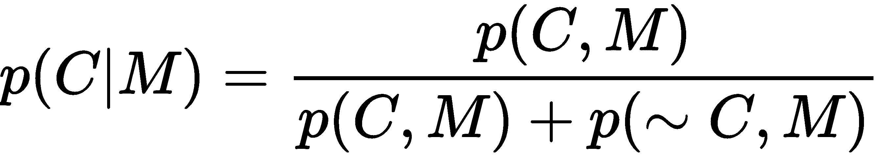
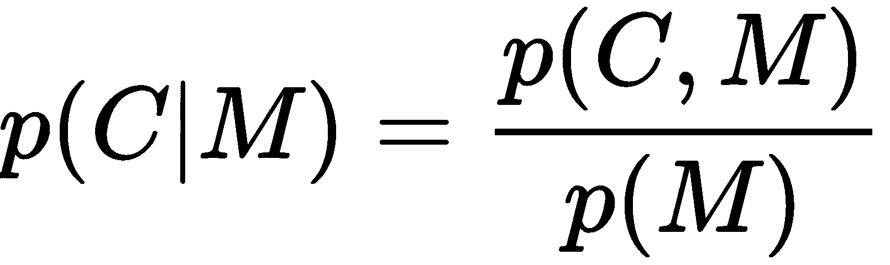
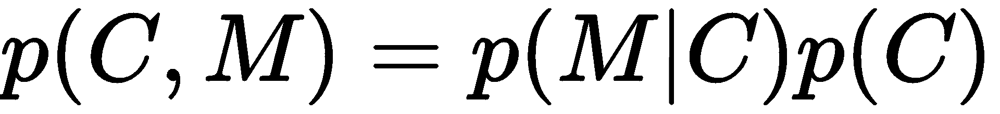
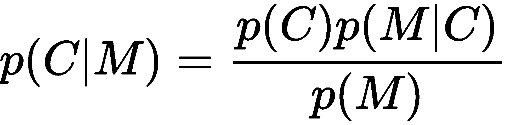
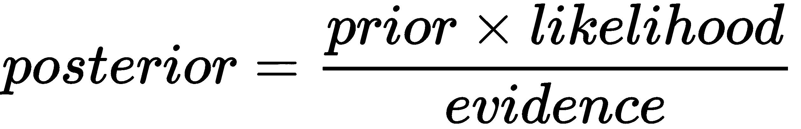
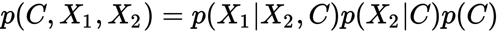
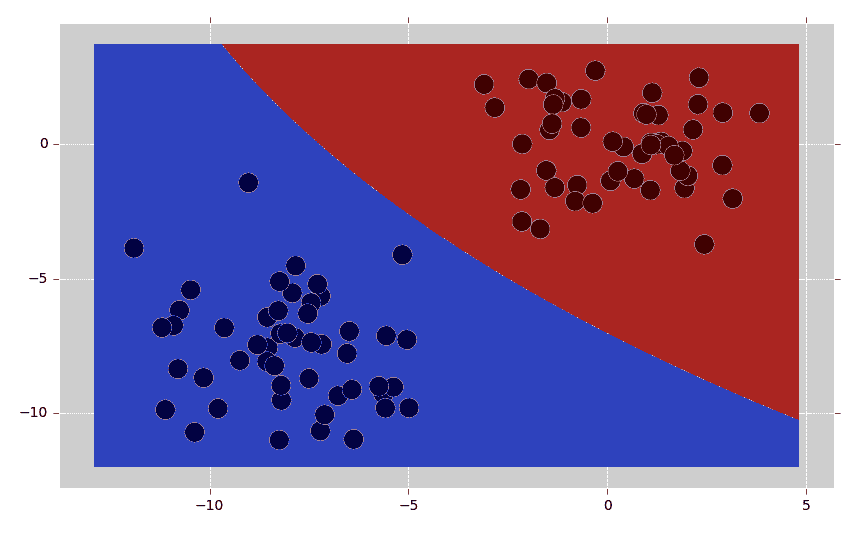
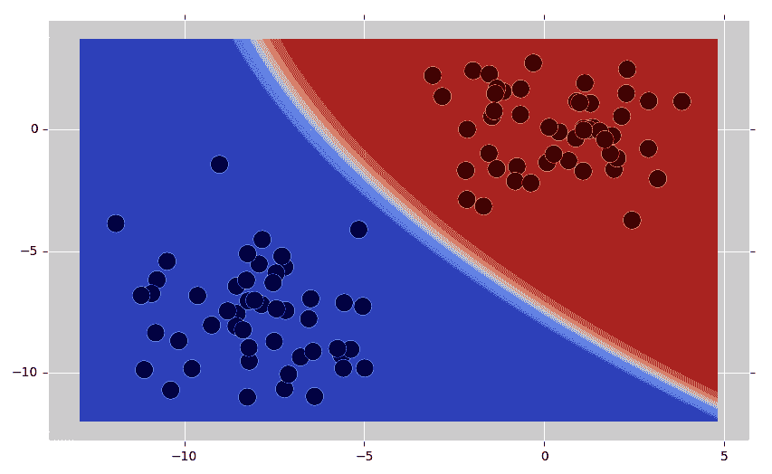

# 使用贝叶斯学习实现垃圾邮件过滤器

在我们深入探讨高级主题，例如聚类分析、深度学习和集成模型之前，让我们将注意力转向一个我们迄今为止尚未注意到的简单模型：朴素贝叶斯分类器。

朴素贝叶斯分类器的根源在于贝叶斯推理，以著名的统计学家和哲学家托马斯·贝叶斯（1701-1761）的名字命名。贝叶斯定理著名地描述了基于可能导致事件的条件先验知识的事件概率。我们可以使用贝叶斯定理构建一个统计模型，该模型不仅可以对数据进行分类，还可以为我们提供关于我们的分类是否正确的概率估计。在我们的情况下，我们可以使用贝叶斯推理以高置信度将电子邮件视为垃圾邮件，并确定在阳性筛查测试的情况下女性患有乳腺癌的概率。

我们现在在实现机器学习方法的机制方面已经积累了足够的经验，因此我们不应再害怕尝试并理解其背后的理论。不用担心，我们不会为此写一本书，但我们需要对理论有一些了解，以便欣赏模型的内部工作原理。之后，我相信您会发现朴素贝叶斯分类器易于实现，计算效率高，并且在相对较小的数据集上表现相当好。在本章中，我们将了解朴素贝叶斯分类器，然后实现我们的第一个贝叶斯分类器。然后，我们将使用朴素贝叶斯分类器对电子邮件进行分类。

在本章中，我们将涵盖以下主题：

+   理解朴素贝叶斯分类器

+   实现您的第一个贝叶斯分类器

+   使用朴素贝叶斯分类器对电子邮件进行分类

# 技术要求

您可以从以下链接获取本章的代码：[`github.com/PacktPublishing/Machine-Learning-for-OpenCV-Second-Edition/tree/master/Chapter07`](https://github.com/PacktPublishing/Machine-Learning-for-OpenCV-Second-Edition/tree/master/Chapter07)。

以下是软件和硬件要求的总结：

+   您需要 OpenCV 版本 4.1.x（4.1.0 或 4.1.1 都可以正常工作）。

+   您需要 Python 3.6 版本（任何 3.x 版本的 Python 都可以）。

+   您需要 Anaconda Python 3 来安装 Python 和所需的模块。

+   您可以使用任何操作系统——macOS、Windows 和基于 Linux 的操作系统——使用本书。我们建议您的系统至少有 4 GB 的 RAM。

+   您不需要 GPU 来运行本书提供的代码。

# 理解贝叶斯推理

尽管贝叶斯分类器相对容易实现，但它们背后的理论一开始可能相当反直觉，尤其是如果你对概率理论还不够熟悉的话。然而，贝叶斯分类器的美妙之处在于，它们比我们迄今为止遇到的所有分类器更能理解底层数据。例如，标准分类器，如*k*最近邻算法或决策树，可能能够告诉我们一个从未见过的数据点的目标标签。然而，这些算法没有概念去理解它们的预测是正确还是错误的可能性。我们称它们为判别模型。另一方面，贝叶斯模型理解了导致数据的底层概率分布。我们称它们为生成模型，因为它们不仅对现有数据点进行标记——它们还可以生成具有相同统计数据的新的数据点。

如果最后一段让你感到有些难以理解，你可能喜欢以下关于概率理论的简要介绍。它对于接下来的章节将非常重要。

# 通过概率理论进行短暂的小憩

为了欣赏贝叶斯定理，我们需要掌握以下技术术语：

+   **随机变量**：这是一个其值取决于偶然性的变量。一个很好的例子是抛硬币的行为，它可能显示正面或反面。如果一个随机变量只能取有限数量的值，我们称其为离散的（如抛硬币或掷骰子）；否则，我们称其为连续随机变量（如某一天的温度）。随机变量通常用大写字母表示。

+   **概率**：这是衡量一个事件发生可能性的度量。我们用*p(e)*表示事件*e*发生的概率，它必须是一个介于 0 和 1 之间的数（或者介于...

# 理解贝叶斯定理

在很多情况下，知道我们的分类器出错的可能性是非常有用的。例如，在第五章，*使用决策树进行医疗诊断*中，我们训练了一个决策树，根据一些医学测试来诊断患有乳腺癌的女性。你可以想象，在这种情况下，我们无论如何都想避免误诊；将健康女性误诊为乳腺癌（假阳性）不仅会让人心碎，还会导致不必要的、昂贵的医疗程序，而错过女性的乳腺癌（假阴性）可能会最终导致女性失去生命。

知道我们有贝叶斯模型可以依赖是件好事。让我们通过一个具体（并且相当著名）的例子来了解一下，来自[`yudkowsky.net/rational/bayes`](http://yudkowsky.net/rational/bayes)：

"40 岁参加常规筛查的 1%的女性患有乳腺癌。80%的乳腺癌女性会得到阳性乳腺钼靶检查结果。9.6%的没有乳腺癌的女性也会得到阳性乳腺钼靶检查结果。这个年龄组的女性在常规筛查中得到了阳性乳腺钼靶检查结果。她实际上患有乳腺癌的概率是多少？"

你认为答案是什么？

好吧，鉴于她的乳腺钼靶检查结果为阳性，你可能会认为她患有癌症的概率相当高（大约在 80%左右）。这位女性属于 9.6%的假阳性女性的可能性似乎要小得多，所以真正的概率可能在大约 70%到 80%之间。

我恐怕这不是正确的。

这里有一种思考这个问题的方法。为了简化，让我们假设我们正在观察一些具体的患者数量，比如说 10,000。在乳腺钼靶检查之前，这 10,000 名女性可以分为两组：

+   **X 组**：100 名患有乳腺癌的女性

+   **Y 组**：9,900 名没有乳腺癌的女性

到目前为止，一切顺利。如果我们把两组的人数加起来，我们得到总共 10,000 名患者，这证实了在数学上没有人丢失。在乳腺钼靶检查之后，我们可以将这 10,000 名女性分成四个组：

+   **第一组**：80 名患有乳腺癌且乳腺钼靶检查结果为阳性的女性

+   **第二组**：20 名患有乳腺癌且乳腺钼靶检查结果为阴性的女性

+   **第三组**：大约 950 名没有乳腺癌且乳腺钼靶检查结果为阳性的女性

+   **第四组**：大约 8,950 名没有乳腺癌且乳腺钼靶检查结果为阴性的女性

从前面的分析中，你可以看到所有四个组的总和是 10,000。**第一组**和**第二组**（患有乳腺癌）的总和对应于**组** **X**，而**第三组**和**第四组**（没有乳腺癌）的总和对应于**组** **Y**。

这可能在我们画出来时会更清晰：


在这个图表中，上半部分对应于**X 组**，下半部分对应于**Y 组**。类似地，左半部分对应于所有阳性乳腺钼靶检查的女性，右半部分对应于所有阴性乳腺钼靶检查的女性。

现在，更容易看出我们正在寻找的只与图表的左半部分有关。在所有阳性结果患者组中，癌症患者阳性结果的比率是组 1 在组 1 和组 3 中的比率：

*80 / (80 + 950) = 80 / 1,030 = 7.8%*

换句话说，如果你向 10,000 名患者提供乳腺钼靶检查，那么在 1,030 名阳性乳腺钼靶检查结果中，会有 80 名患者患有癌症。如果一位阳性乳腺钼靶检查患者询问她患乳腺癌的机会，医生应该给出的答案：在 13 名询问这个问题的患者中，大约有 1 名会患有癌症。

我们刚才计算的这个被称为**条件概率**：在（我们也可以说**给定**）乳腺摄影结果为阳性的情况下，一个女性患有乳腺癌的**信念程度**是多少？正如上一个子节中所述，我们用 *p(cancer|mammography)* 或 *p(C|M)* 来表示。再次使用大写字母是为了强调健康和乳腺摄影都可以有几种结果，这取决于几个潜在（可能未知）的原因。因此，它们是随机变量。

然后，我们可以用以下公式表示 *P(C|M)*：



在这里，*p(C, M)* 表示 *C* 和 *M* 都为真的概率（意味着一个女性既有癌症又有阳性乳腺摄影的概率）。这相当于前面提到的属于第 1 组的女性概率。

逗号（*，*）表示逻辑**与**，波浪号（*~*）表示逻辑**非**。因此，*p(~C, M)* 表示 *C* 不为真且 *M* 为真的概率（意味着一个女性没有癌症但有阳性乳腺摄影）。这相当于属于第 3 组的女性概率。因此，分母基本上是第 1 组（*p(C, M)*）和第 3 组（*p(~C, M)*）中女性的总和。

但是等等！这两个组合在一起简单地表示一个女性有阳性乳腺摄影的概率，*p(M)*。因此，我们可以简化前面的方程：



贝叶斯版本是对 *p(C, M)* 的重新解释。我们可以将 *p(C, M)* 表达如下：



现在有点复杂了。在这里，*p(C)* 只是女性患有癌症的概率（对应于前面提到的组 X）。考虑到一个女性患有癌症，她的乳腺摄影结果为阳性的概率是多少？从问题中我们知道是 80%。这是 *p(M|C)*，即在 *C* 的条件下 *M* 的概率。

将第一个方程中的 *p(C, M)* 用这个新公式替换，我们得到以下方程：



在贝叶斯世界中，这些术语都有它们特定的名称：

+   *p(C|M)* 被称为**后验**，这是我们总是想要计算的东西。在我们的例子中，这对应于在乳腺摄影结果为阳性时，一个女性患有乳腺癌的信念程度。

+   *p(C)* 被称为**先验**，因为它对应于我们对乳腺癌有多普遍的初始知识。我们也将这称为我们对 *C* 的初始信念程度。

+   *p(M|C)* 被称为**似然**。

+   *p(M)* 被称为**证据**。

因此，你可以再次重写方程，如下所示：



通常，人们只对那个分数的分子感兴趣，因为分母不依赖于 *C*，所以分母是常数，可以忽略不计。

# 理解朴素贝叶斯分类器

到目前为止，我们只讨论了一个证据。然而，在大多数实际场景中，我们必须在给定多个证据（例如随机变量 *X[1]* 和 *X[2]*）的情况下预测一个结果（例如随机变量 *Y*）。因此，我们通常需要计算 *p(Y|X[1], X[2], ..., X[n])*，而不是计算 *p(Y|X)*。不幸的是，这使得数学变得非常复杂。对于两个随机变量 *X[1]* 和 *X[2]*，联合概率可以这样计算：



丑陋的部分是术语 *p(X[1]|X[2], C)*，它表示 *X[1]* 的条件概率依赖于所有其他变量，包括 *C*。这甚至 ...

# 实现你的第一个贝叶斯分类器

但数学就到这里吧，让我们来做一些编码！

在上一章中，我们学习了如何使用 scikit-learn 生成多个高斯云团。你还记得是如何做到这一点的吗？

# 创建一个玩具数据集

我所指的是 scikit-learn 的 `datasets` 模块中的函数。让我们创建 100 个数据点，每个数据点属于两个可能类别中的一个，并将它们分组成两个高斯云团。为了使实验可重复，我们指定一个整数来选择 `random_state` 的种子。你可以选择你喜欢的任何数字。在这里，我选择了托马斯·贝叶斯出生的那一年（只是为了好玩）：

```py
In [1]: from sklearn import datasets...     X, y = datasets.make_blobs(100, 2, centers=2,        random_state=1701, cluster_std=2)
```

让我们使用我们忠实的朋友 Matplotlib 查看我们刚刚创建的数据集：

```py
In [2]: import matplotlib.pyplot as plt...     plt.style.use('ggplot')...     %matplotlib inlineIn [3]: plt.scatter(X[:, 0], X[:, ...
```

# 使用正态贝叶斯分类器对数据进行分类

我们将使用与早期章节中相同的程序来训练一个 **正态贝叶斯分类器**。等等，为什么不使用朴素贝叶斯分类器呢？好吧，结果是 OpenCV 并没有真正提供朴素贝叶斯分类器。相反，它提供了一个贝叶斯分类器，这个分类器并不一定期望特征是独立的，而是期望数据被聚类成高斯云团。这正是我们之前创建的数据集类型！

通过遵循这些步骤，你将学习如何使用正态贝叶斯分类器构建一个分类器：

1.  我们可以使用以下函数创建一个新的分类器：

```py
In [5]: import cv2
...     model_norm = cv2.ml.NormalBayesClassifier_create()
```

1.  然后，通过 `train` 方法进行训练：

```py
In [6]: model_norm.train(X_train, cv2.ml.ROW_SAMPLE, y_train)
Out[6]: True
```

1.  一旦分类器成功训练，它将返回 `True`。我们像以前成千上万次做的那样，进行预测和评分分类器：

```py
In [7]: _, y_pred = model_norm.predict(X_test)
In [8]: from sklearn import metrics
...     metrics.accuracy_score(y_test, y_pred)
Out[8]: 1.0
```

1.  更好——我们可以重用上一章中的绘图函数来检查决策边界！如果你还记得，想法是创建一个网格，它将包含所有数据点，然后对网格上的每个点进行分类。网格是通过具有相同名称的 NumPy 函数创建的：

```py
In [9]: def plot_decision_boundary(model, X_test, y_test):
...         # create a mesh to plot in
...         h = 0.02 # step size in mesh
...         x_min, x_max = X_test[:, 0].min() - 1, X_test[:, 0].max() +
            1
...         y_min, y_max = X_test[:, 1].min() - 1, X_test[:, 1].max() +
            1
...         xx, yy = np.meshgrid(np.arange(x_min, x_max, h),
...                              np.arange(y_min, y_max, h))
```

1.  `meshgrid` 函数将返回两个浮点矩阵，`xx` 和 `yy`，它们包含网格上每个坐标点的 *x* 和 *y* 坐标。我们可以使用 `ravel` 函数将这些矩阵展平成列向量，并将它们堆叠起来形成一个新矩阵，`X_hypo`：

```py
...         X_hypo = np.column_stack((xx.ravel().astype(np.float32),
...                                   yy.ravel().astype(np.float32)))
```

1.  `X_hypo` 现在包含 `X_hypo[:, 0]` 中的所有 *x* 值和 `X_hypo[:, 1]` 中的所有 *y* 值。这是 `predict` 函数可以理解的格式：

```py
...         ret = model.predict(X_hypo)
```

1.  然而，我们希望能够使用来自 OpenCV 和 scikit-learn 的模型。这两个之间的区别在于 OpenCV 返回多个变量（一个表示成功/失败的布尔标志和预测的目标标签），而 scikit-learn 只返回预测的目标标签。因此，我们可以检查 `ret` 输出是否是一个元组，如果是，我们知道我们正在处理 OpenCV。在这种情况下，我们存储元组的第二个元素（`ret[1]`）。否则，我们正在处理 scikit-learn，并且不需要索引到 `ret`：

```py
...         if isinstance(ret, tuple):
...             zz = ret[1]
...         else:
...             zz = ret
...         zz = zz.reshape(xx.shape)
```

1.  剩下的工作就是创建一个等高线图，其中 `zz` 表示网格上每个点的颜色。在此基础上，我们使用我们信任的散点图来绘制数据点：

```py
...         plt.contourf(xx, yy, zz, cmap=plt.cm.coolwarm, alpha=0.8)
...         plt.scatter(X_test[:, 0], X_test[:, 1], c=y_test, s=200)
```

1.  我们通过传递一个模型（`model_norm`）、一个特征矩阵（`X`）和一个目标标签向量（`y`）来调用该函数：

```py
In [10]: plot_decision_boundary(model_norm, X, y)
```

输出看起来像这样：



到目前为止，一切顺利。有趣的部分是，贝叶斯分类器还返回每个数据点被分类的概率：

```py
In [11]: ret, y_pred, y_proba = model_norm.predictProb(X_test)
```

该函数返回一个布尔标志（成功时为`True`，失败时为`False`），预测的目标标签（`y_pred`）和条件概率（`y_proba`）。在这里，`y_proba`是一个 *N x* 2 矩阵，它表示对于 *N* 个数据点中的每一个，它被分类为类别 0 或类别 1 的概率：

```py
In [12]: y_proba.round(2)
Out[12]: array([[ 0.15000001,  0.05      ],
                [ 0.08      ,  0\.        ],
                [ 0\.        ,  0.27000001],
                [ 0\.        ,  0.13      ],
                [ 0\.        ,  0\.        ],
                [ 0.18000001,  1.88      ],
                [ 0\.        ,  0\.        ],
                [ 0\.        ,  1.88      ],
                [ 0\.        ,  0\.        ],
                [ 0\.        ,  0\.        ]], dtype=float32)
```

这意味着，对于第一个数据点（顶部行），属于类别 0 的概率（即 *p(C[0]|X)*）是 0.15（或 15%）。同样，属于类别 1 的概率是 *p(C[1]|X)* = *0.05*。

一些行显示的值大于 1 的原因是 OpenCV 并不真正返回概率值。概率值总是在 0 和 1 之间，并且前面矩阵中的每一行都应该加起来等于 1。相反，报告的是 **似然性**，这基本上是条件概率方程的分子，*p(C)* *p(M|C)*。分母 *p*(*M*) 不需要计算。我们只需要知道 *0.15 > 0.05*（顶部行）。因此，数据点最有可能属于类别 0。

# 使用朴素贝叶斯分类器对数据进行分类

以下步骤将帮助您构建一个朴素贝叶斯分类器：

1.  我们可以通过向 scikit-learn 求助来将结果与真正的朴素贝叶斯分类器进行比较：

```py
In [13]: from sklearn import naive_bayes...      model_naive = naive_bayes.GaussianNB()
```

1.  通常，通过 `fit` 方法进行分类器的训练：

```py
In [14]: model_naive.fit(X_train, y_train)Out[14]: GaussianNB(priors=None)
```

1.  分类器的评分是内置的：

```py
In [15]: model_naive.score(X_test, y_test)Out[15]: 1.0
```

1.  再次获得完美分数！然而，与 OpenCV 相比，这个分类器的 `predict_proba` 方法返回的是真正的概率值，因为所有值都在 0 和 1 之间，并且所有行加起来等于 1：

```py
In [16]: yprob = model_naive.predict_proba(X_test) ...
```

# 可视化条件概率

通过参考以下步骤，您将能够可视化条件概率：

1.  为了做到这一点，我们将对前一个示例中的绘图函数进行轻微修改。我们首先在 (`x_min`，`x_max`) 和 (`y_min`，`y_max`) 之间创建一个网格图：

```py
In [18]: def plot_proba(model, X_test, y_test):
...          # create a mesh to plot in
...          h = 0.02 # step size in mesh
...          x_min, x_max = X_test[:, 0].min() - 1, X_test[:, 0].max() + 1
...          y_min, y_max = X_test[:, 1].min() - 1, X_test[:, 1].max() + 1
...          xx, yy = np.meshgrid(np.arange(x_min, x_max, h),
...                               np.arange(y_min, y_max, h))
```

1.  然后，我们将 `xx` 和 `yy` 展平，并将它们按列添加到特征矩阵 `X_hypo` 中：

```py

...          X_hypo = np.column_stack((xx.ravel().astype(np.float32),
...                                    yy.ravel().astype(np.float32)))
```

1.  如果我们想让这个函数同时与 OpenCV 和 scikit-learn 一起工作，我们需要为 `predictProb`（在 OpenCV 的情况下）和 `predict_proba`（在 scikit-learn 的情况下）实现一个开关。为此，我们检查 `model` 是否有一个名为 `predictProb` 的方法。如果该方法存在，我们可以调用它；否则，我们假设我们正在处理来自 scikit-learn 的模型：

```py
...          if hasattr(model, 'predictProb'):
...             _, _, y_proba = model.predictProb(X_hypo)
...          else:
...             y_proba = model.predict_proba(X_hypo)
```

1.  如同在 `In [16]` 中我们所看到的，`y_proba` 将是一个二维矩阵，对于每个数据点，它包含数据属于类别 0（在 `y_proba[:, 0]` 中）和类别 1（在 `y_proba[:, 1]` 中）的概率。将这些两个值转换为 contour 函数可以理解的颜色的简单方法就是简单地取这两个概率值的差：

```py
...          zz = y_proba[:, 1] - y_proba[:, 0]
...          zz = zz.reshape(xx.shape)
```

1.  最后一步是将 `X_test` 作为散点图绘制在彩色网格图之上：

```py
... plt.contourf(xx, yy, zz, cmap=plt.cm.coolwarm, alpha=0.8)
... plt.scatter(X_test[:, 0], X_test[:, 1], c=y_test, s=200)
```

1.  现在，我们已经准备好调用该函数：

```py
In [19]: plot_proba(model_naive, X, y)
```

结果看起来像这样：



上一张截图显示了朴素贝叶斯分类器的条件概率。

# 使用朴素贝叶斯分类器对电子邮件进行分类

本章的最终任务将是将我们新获得的知识应用到实际的垃圾邮件过滤器中！这个任务涉及使用朴素贝叶斯算法解决二元分类（垃圾邮件/ham）分类问题。

朴素贝叶斯分类器实际上是电子邮件过滤中一个非常流行的模型。它们的朴素性非常适合文本数据的分析，其中每个特征都是一个单词（或一个 **词袋**），并且不可能对每个单词与其他每个单词的依赖关系进行建模。

现在有大量好的电子邮件数据集，例如以下这些：

+   The Hewlett-Packard spam database: [`archive.ics.uci.edu/ml/machine-learning-databases/spambase`](https://archive.ics.uci.edu/ml/machine-learning-databases/spambase/)

+   Enrom-Spam 数据集：[`www.aueb.gr/users/ion/data/enron-spam ...`](http://www.aueb.gr/users/ion/data/enron-spam)

# 加载数据集

你可以参考以下步骤来加载数据集：

1.  如果你从 GitHub 下载了最新代码，你将在 `notebooks/data/chapter7` 目录下找到几个 `.zip` 文件。这些文件包含原始电子邮件数据（包含 To:、Cc: 和正文字段），这些数据要么被分类为垃圾邮件（带有 `SPAM = 1` 类别标签），要么不是（也称为 ham，`HAM = 0` 类别标签）。

1.  我们创建了一个名为 `sources` 的变量，它包含所有原始数据文件：

```py
In [1]: HAM = 0
...     SPAM = 1
...     datadir = 'data/chapter7'
...     sources = [
...        ('beck-s.tar.gz', HAM),
...        ('farmer-d.tar.gz', HAM),
...        ('kaminski-v.tar.gz', HAM),
...        ('kitchen-l.tar.gz', HAM),
...        ('lokay-m.tar.gz', HAM),
...        ('williams-w3.tar.gz', HAM),
...        ('BG.tar.gz', SPAM),
...        ('GP.tar.gz', SPAM),
...        ('SH.tar.gz', SPAM)
...     ]
```

1.  第一步是从子目录中提取这些文件。为此，我们可以使用我们在上一章中编写的 `extract_tar` 函数：

```py
In [2]: def extract_tar(datafile, extractdir):
...         try:
...             import tarfile
...         except ImportError:
...             raise ImportError("You do not have tarfile installed. "
...                               "Try unzipping the file outside of "
...                               "Python.")
...         tar = tarfile.open(datafile)
...         tar.extractall(path=extractdir)
...         tar.close()
...         print("%s successfully extracted to %s" % (datafile,
...                                                    extractdir))
```

1.  为了将函数应用于源中的所有数据文件，我们需要运行一个循环。`extract_tar`函数期望一个指向`.tar.gz`文件的路径——我们通过`datadir`和一个`sources`中的条目构建它——以及一个提取文件的目录（`datadir`）。这将把例如`data/chapter7/beck-s.tar.gz`中的所有电子邮件提取到`data/chapter7/beck-s/`子目录中：

```py
In [3]: for source, _ in sources:
...         datafile = '%s/%s' % (datadir, source)
...         extract_tar(datafile, datadir)
Out[3]: data/chapter7/beck-s.tar.gz successfully extracted to data/chapter7
        data/chapter7/farmer-d.tar.gz successfully extracted to
            data/chapter7
        data/chapter7/kaminski-v.tar.gz successfully extracted to
            data/chapter7
        data/chapter7/kitchen-l.tar.gz successfully extracted to
            data/chapter7
        data/chapter7/lokay-m.tar.gz successfully extracted to
            data/chapter7
        data/chapter7/williams-w3.tar.gz successfully extracted to
            data/chapter7
        data/chapter7/BG.tar.gz successfully extracted to data/chapter7
        data/chapter7/GP.tar.gz successfully extracted to data/chapter7
        data/chapter7/SH.tar.gz successfully extracted to data/chapter7
```

现在是有点棘手的部分。这些子目录中的每一个都包含许多其他目录，其中包含文本文件。因此，我们需要编写两个函数：

+   `read_single_file(filename)`：这是一个从名为`filename`的单个文件中提取相关内容的函数。

+   `read_files(path)`：这是一个从名为`path`的特定目录中的所有文件中提取相关内容的函数。

为了从单个文件中提取相关内容，我们需要了解每个文件的结构。我们知道的唯一事情是电子邮件的标题部分（From:, To:, 和 Cc:）和正文文本通过换行符`'\n'`分隔。因此，我们可以遍历文本文件中的每一行，只保留属于正文文本的行，这些行将被存储在变量`lines`中。我们还想保留一个布尔标志`past_header`，它最初被设置为`False`，但一旦我们通过了标题部分，它将被切换到`True`：

1.  我们首先初始化这两个变量：

```py
In [4]: import os
...     def read_single_file(filename):
...         past_header, lines = False, []
```

1.  然后，我们检查名为`filename`的文件是否存在。如果存在，我们开始逐行遍历它：

```py
...         if os.path.isfile(filename):
...             f = open(filename, encoding="latin-1")
...             for line in f:
```

你可能已经注意到了`encoding="latin-1"`部分。由于一些电子邮件不是 Unicode，这是尝试正确解码文件的一种尝试。

我们不想保留标题信息，因此我们持续循环，直到遇到`'\n'`字符，此时我们将`past_header`从`False`切换到`True`。

1.  在这一点上，以下`if-else`语句的第一个条件得到满足，我们将文本文件中剩余的所有行追加到`lines`变量中：

```py
...                 if past_header:
...                     lines.append(line)
...                 elif line == '\n':
...                     past_header = True
...             f.close()
```

1.  最后，我们将所有行连接成一个单独的字符串，由换行符分隔，并返回文件的完整路径和实际内容：

```py
...         content = '\n'.join(lines)
...         return filename, content
```

1.  第二个函数的任务将是遍历文件夹中的所有文件并对它们调用`read_single_file`：

```py
In [5]: def read_files(path):
...         for root, dirnames, filenames in os.walk(path):
...             for filename in filenames:
...                 filepath = os.path.join(root, filename)
...                 yield read_single_file(filepath)
```

这里，`yield`是一个与`return`类似的关键字。区别在于`yield`返回一个生成器而不是实际值，如果你预期要遍历大量项目，这是所希望的。

# 使用 pandas 构建数据矩阵

现在，是时候介绍另一个 Python Anaconda 预安装的必要数据科学工具了：**pandas**。pandas 建立在 NumPy 之上，并为 Python 中的数据结构提供了几个有用的工具和方法。就像我们通常使用别名`np`导入 NumPy 一样，通常使用别名`pd`导入 pandas：

```py
In [6]: import pandas as pd
```

pandas 提供了一个有用的数据结构，称为 DataFrame，它可以理解为 2D NumPy 数组的推广，如下所示：

```py
In [7]: pd.DataFrame({...         'model': [...             'Normal Bayes',...             'Multinomial Bayes',...             'Bernoulli Bayes'...         ],...         'class': ...             'cv2.ml.NormalBayesClassifier_create()',...             'sklearn.naive_bayes.MultinomialNB()',... 'sklearn.naive_bayes.BernoulliNB()' ...
```

# 数据预处理

Scikit-learn 在编码文本特征方面提供了几个选项，我们在[第四章，“表示数据和特征工程”中讨论了这些选项。如您所回忆的，编码文本数据的最简单方法之一是通过**词频**；对于每个短语，您计算其中每个单词出现的次数。在 scikit-learn 中，这可以通过使用`CountVectorizer`轻松完成：

```py
In [10]: from sklearn import feature_extraction
...      counts = feature_extraction.text.CountVectorizer()
...      X = counts.fit_transform(data['text'].values)
...      X.shape
Out[10]: (52076, 643270)
```

结果是一个巨大的矩阵，它告诉我们我们总共收集了 52,076 封电子邮件，这些电子邮件总共包含 643,270 个不同的单词。然而，scikit-learn 很聪明，它将数据保存为稀疏矩阵：

```py
In [11]: X
Out[11]: <52076x643270 sparse matrix of type '<class 'numpy.int64'>'
                 with 8607632 stored elements in Compressed Sparse Row 
                 format>
```

要构建目标标签向量（`y`），我们需要访问 pandas DataFrame 中的数据。这可以通过将 DataFrame 视为一个字典来完成，其中`values`属性将使我们能够访问底层的 NumPy 数组：

```py
In [12]: y = data['class'].values
```

# 训练普通贝叶斯分类器

从现在开始，事情（几乎）就像以前一样。我们可以使用 scikit-learn 将数据分为训练集和测试集（让我们保留所有数据点的 20%用于测试）：

```py
In [13]: from sklearn import model_selection as ms...      X_train, X_test, y_train, y_test = ms.train_test_split(...          X, y, test_size=0.2, random_state=42...      )
```

我们可以使用 OpenCV 实例化一个新的普通贝叶斯分类器：

```py
In [14]: import cv2...      model_norm = cv2.ml.NormalBayesClassifier_create()
```

然而，OpenCV 不知道稀疏矩阵（至少它的 Python 接口不知道）。如果我们像之前一样将`X_train`和`y_train`传递给`train`函数，OpenCV 会抱怨数据矩阵不是一个 NumPy 数组。 ... 

# 在完整数据集上训练

然而，如果您想对整个数据集进行分类，我们需要一个更复杂的方法。我们转向 scikit-learn 的朴素贝叶斯分类器，因为它理解如何处理稀疏矩阵。事实上，如果您没有注意，并将`X_train`像之前的每个 NumPy 数组一样对待，您可能甚至都没有注意到有任何不同：

```py
In [17]: from sklearn import naive_bayes
...      model_naive = naive_bayes.MultinomialNB()
...      model_naive.fit(X_train, y_train)
Out[17]: MultinomialNB(alpha=1.0, class_prior=None, fit_prior=True)
```

在这里，我们使用了来自`naive_bayes`模块的`MultinomialNB`，这是最适合处理分类数据（如词频）的朴素贝叶斯分类器版本。

分类器几乎立即训练完成，并返回训练集和测试集的分数：

```py
In [18]: model_naive.score(X_train, y_train)
Out[18]: 0.95086413826212191
In [19]: model_naive.score(X_test, y_test)
Out[19]: 0.94422043010752688
```

好了，这就是了：测试集上的准确率达到了 94.4%！对于没有做太多其他事情（除了使用默认值）来说，这已经相当不错了，不是吗？

然而，如果我们对自己的工作非常挑剔，并希望进一步提高结果，我们可以做几件事情。

# 使用 n-gram 来提高结果

其中一件事情是使用*n*-gram 计数而不是简单的词频。到目前为止，我们依赖于所谓的词袋模型：我们只是将电子邮件中的每个单词扔进一个袋子，并计算其出现的次数。然而，在真实的电子邮件中，单词出现的顺序可以携带大量信息！

这正是*n*-gram 计数试图传达的内容。你可以将*n*-gram 想象成一个由*n*个单词组成的短语。例如，短语*Statistics has its moments*包含了以下 1-gram：*Statistics*，*has*，*its*和*moments*。它还包含了以下 2-gram：*Statistics has*，*has its*和*its moments*。它还有两个 3-gram（*Statistics has its*和*has its moments*）以及仅有一个...
