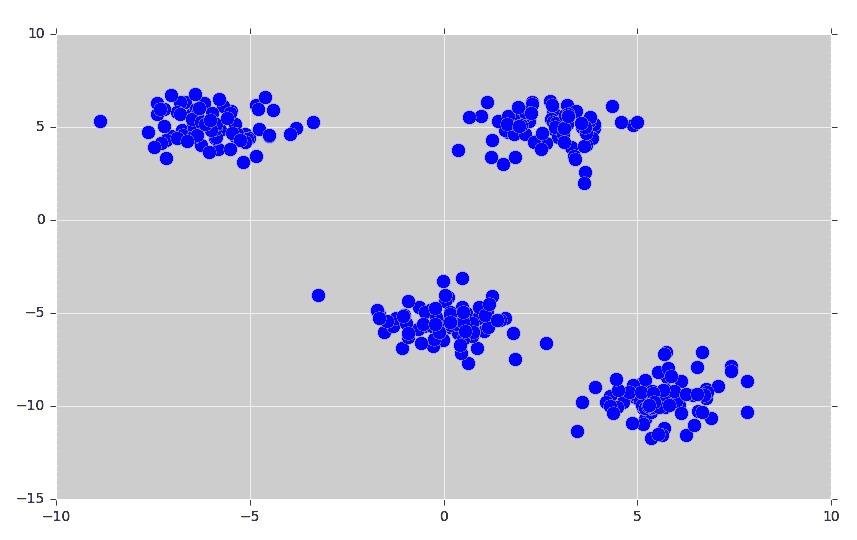
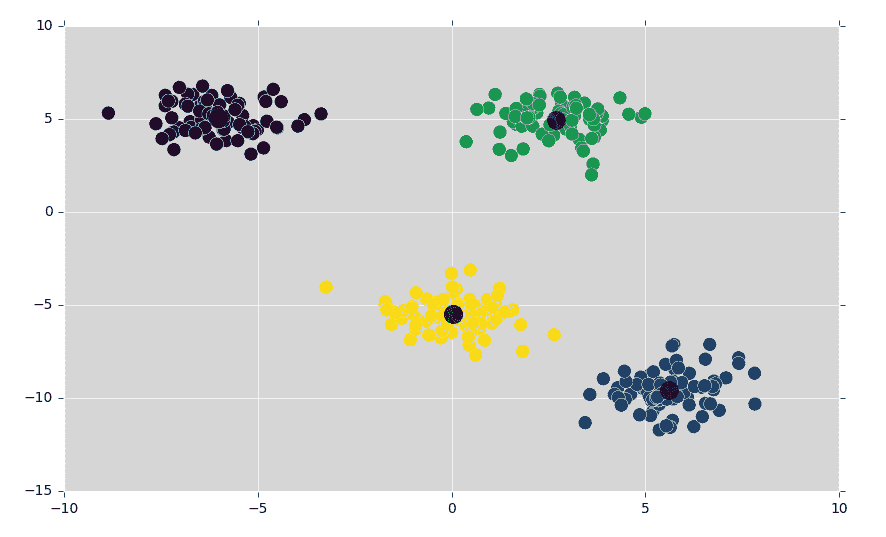
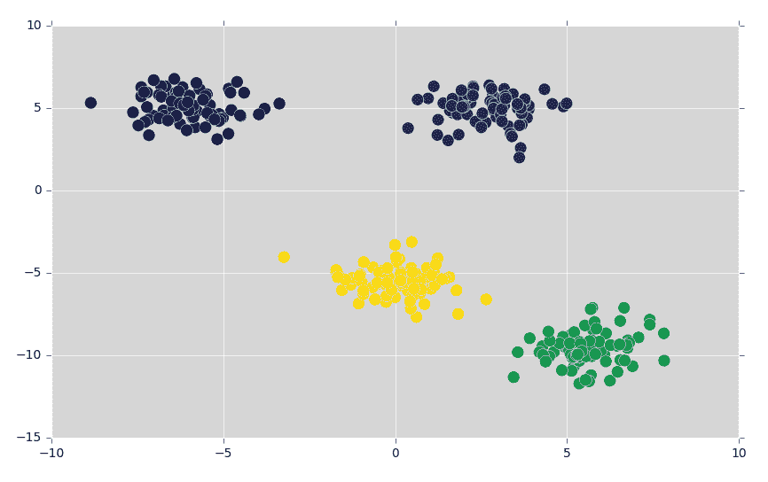
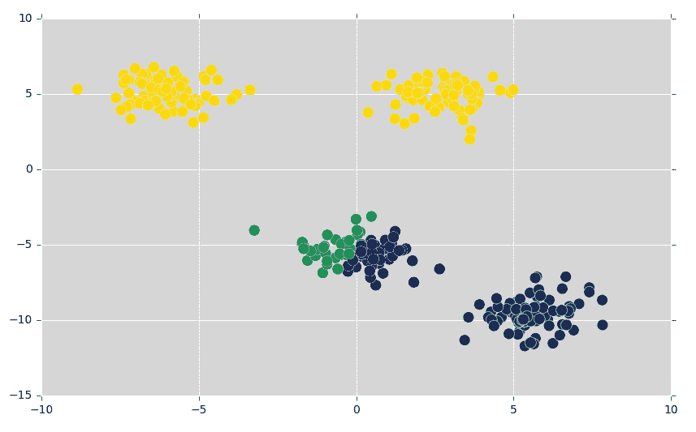
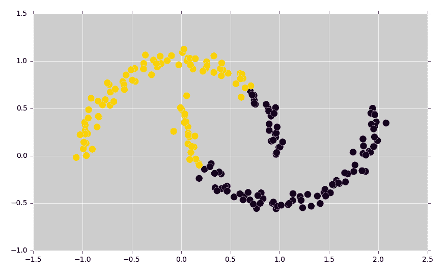
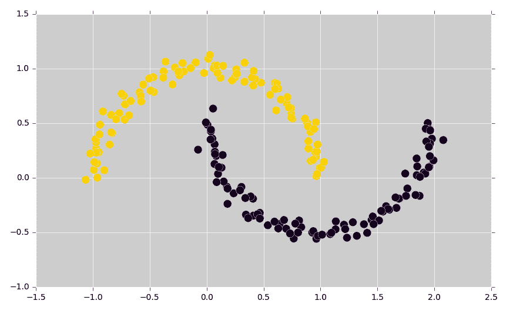
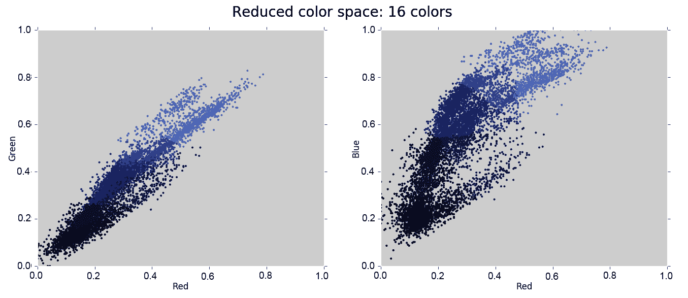
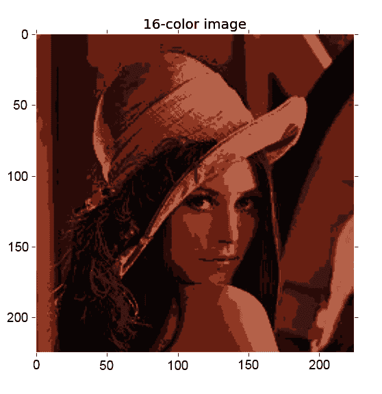
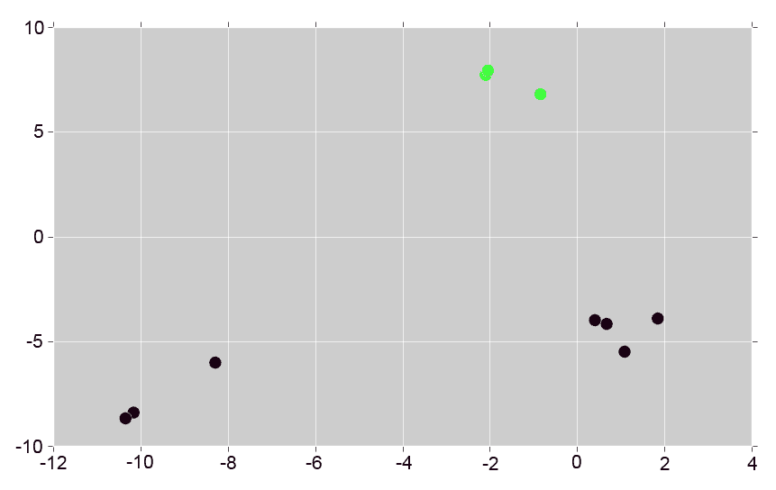

# 第八章：使用无监督学习发现隐藏结构

到目前为止，我们一直专注于监督学习问题，其中数据集中的每个数据点都有一个已知的标签或目标值。然而，当没有已知输出或没有教师来监督学习算法时，我们该怎么办？

这就是**无监督学习**的全部内容。在无监督学习中，学习过程仅体现在输入数据中，并要求从这些数据中提取知识，而不需要进一步的指令。我们已经讨论了无监督学习的一种形式——**降维**。另一个流行的领域是**聚类分析**，其目的是将数据划分为不同的相似项组。

聚类技术可能有用的一些问题包括文档分析、图像检索、查找垃圾邮件、识别虚假新闻、识别犯罪活动等等。

在本章中，我们希望了解如何使用不同的聚类算法从简单的未标记数据集中提取隐藏结构。这些隐藏结构具有许多好处，无论是用于特征提取、图像处理，还是作为监督学习任务的预处理步骤。作为一个具体的例子，我们将学习如何将聚类应用于图像，以将它们的颜色空间减少到 16 位。

更具体地说，我们将涵盖以下主题：

+   **k-means 聚类**和**期望最大化**，以及在 OpenCV 中实现这些算法

+   将聚类算法排列成层次树，以及由此带来的好处

+   使用无监督学习进行预处理、图像处理和分类

让我们开始吧！

# 使用 TF-IDF 来提高结果

它被称为**词频-逆文档频率**（**TF-IDF**），我们在第四章中遇到了它，*表示数据和工程特征*。如果你还记得，TF-IDF 的基本作用是通过对整个数据集中单词出现频率的度量来权衡单词计数。这种方法的一个有用副作用是 IDF 部分——单词的逆频率。这确保了像*和*、*the*和*but*这样的常用词在分类中只占很小的权重。

我们通过在现有的特征矩阵`X`上调用`fit_transform`来应用 TF-IDF：

```py
In [24]: tfidf = feature_extraction.text.TfidfTransformer()In [25]: X_new = tfidf.fit_transform(X)
```

不要忘记分割数据；另外，...

# 概述

在本章中，我们首次接触了概率论，了解了随机变量和条件概率，这使我们得以一瞥贝叶斯定理——朴素贝叶斯分类器的基石。我们讨论了离散随机变量和连续随机变量、似然性和概率、先验和证据、以及正态和朴素贝叶斯分类器之间的区别。

最后，如果我们不将理论知识应用于实际例子，那么我们的理论知识将毫无用处。我们获得了一组原始电子邮件数据集，对其进行了解析，并在其上训练了贝叶斯分类器，以使用各种特征提取方法将电子邮件分类为垃圾邮件或非垃圾邮件（非垃圾邮件）。

在下一章中，我们将转换方向，并讨论一次，如果我们必须处理未标记的数据时应该做什么。

# 技术要求

您可以从以下链接获取本章的代码：[`github.com/PacktPublishing/Machine-Learning-for-OpenCV-Second-Edition/tree/master/Chapter08`](https://github.com/PacktPublishing/Machine-Learning-for-OpenCV-Second-Edition/tree/master/Chapter08)。

以下是软件和硬件要求的总结：

+   您需要 OpenCV 版本 4.1.x（4.1.0 或 4.1.1 都可以正常工作）。

+   您需要 Python 版本 3.6（任何 3.x 版本的 Python 都可以）。

+   您需要 Anaconda Python 3 来安装 Python 和所需的模块。

+   您可以使用任何操作系统——macOS、Windows 和基于 Linux 的操作系统——以及本书。我们建议您的系统至少有 4 GB 的 RAM。

+   您不需要 GPU 来运行本书附带提供的代码。

# 理解无监督学习

无监督学习可能以多种形式出现，但其目标始终是将原始数据转换为更丰富、更有意义的表示，无论是使人类更容易理解，还是使机器学习算法更容易解析。

无监督学习的常见应用包括以下内容：

+   **降维**：这尝试将包含许多特征的高维数据表示压缩，以便可以用少量高度信息化的特征解释其主要特征。例如，当应用于波士顿地区的房价时，降维可能能够告诉我们，我们应该最关注的指标是房产税和该地区的犯罪率。

+   **因子分析**：这试图找到导致观察数据的隐藏原因或未观察到的成分。例如，当应用于 1970 年代电视节目《Scooby-Doo，Where Are You！》的所有剧集时，因子分析可能能够告诉我们（剧透警告！）节目中的每个鬼魂或怪物本质上都是某个不满的伯爵在镇上玩的一个复杂的恶作剧。

+   **聚类分析**：这试图将数据划分为不同的相似项目组。这是我们将在本章中关注的无监督学习类型。例如，当应用于 Netflix 上的所有电影时，聚类分析可能能够自动将它们按类型分组。

要使事情更复杂，这些分析必须在未标记的数据上执行，我们事先不知道正确的答案应该是什么。因此，无监督学习中的一个主要挑战是确定算法是否表现良好或学到了有用的东西。通常，评估无监督学习算法结果的方法是手动检查并确定结果是否有意义。

话虽如此，无监督学习可以非常有帮助，例如，作为预处理或特征提取步骤。你可以把无监督学习看作是一种**数据转换**——一种将数据从其原始表示转换为更信息丰富的形式的方法。学习新的表示可能会让我们对数据有更深的洞察，有时，它甚至可能提高监督学习算法的准确性。

# 理解 k-means 聚类

OpenCV 提供的核心聚类算法是 k-means 聚类，它从一个未标记的多维数据中搜索预定的 k 个簇（或组）。

它通过使用关于最佳聚类应该看起来像的两个简单假设来实现这一点：

+   每个簇的中心基本上是该簇所有点的平均值，也称为质心。

+   该簇中的每个数据点与其中心比与其他所有簇中心更近。

通过查看一个具体的例子，最容易理解该算法。

# 实现我们的第一个 k-means 示例

首先，让我们生成一个包含四个不同 blob 的 2D 数据集。为了强调这是一个无监督方法，我们将省略可视化中的标签：

1.  我们将继续使用`matplotlib`来完成所有的可视化目的：

```py
In [1]: import matplotlib.pyplot as plt
...     %matplotlib inline
...     plt.style.use('ggplot')
```

1.  按照前面章节的相同方法，我们将创建总共 300 个属于四个不同簇的 blob（`n_samples=300`）：

```py
In [2]: from sklearn.datasets.samples_generator import make_blobs
...     X, y_true = make_blobs(n_samples=300, centers=4,
...                            cluster_std=1.0, random_state=10)
...     plt.scatter(X[:, 0], X[:, 1], s=100);
```

这将生成以下图表：



上述图表显示了 300 个未标记点组成的示例数据集，这些点组织成四个不同的簇。即使没有将目标标签分配给数据，也可以通过肉眼轻松地挑选出这四个簇。k-means 算法也能做到这一点，而无需任何关于目标标签或潜在数据分布的信息。

1.  虽然 k-means 当然是一个统计模型，但在 OpenCV 中，它不是通过`ml`模块和常见的`train`和`predict` API 调用提供的。相反，它直接作为`cv2.kmeans`可用。要使用该模型，我们必须指定一些参数，例如终止准则和一些初始化标志。在这里，我们将告诉算法，当误差小于 1.0（`cv2.TERM_CRITERIA_EPS`）或执行了十个迭代时（`cv2.TERM_CRITERIA_MAX_ITER`）终止：

```py
In [3]: import cv2
...     criteria = (cv2.TERM_CRITERIA_EPS + cv2.TERM_CRITERIA_MAX_ITER,
...                 10, 1.0)
...     flags = cv2.KMEANS_RANDOM_CENTERS
```

1.  然后，我们可以将前面的数据矩阵（`X`）传递给`cv2.means`。我们还需要指定簇的数量（`4`）以及算法应该尝试的不同随机初始猜测的数量（`10`），如下面的代码片段所示：

```py
In [4]: import numpy as np
...     compactness, labels, centers = cv2.kmeans(X.astype(np.float32),
...                                               4, None, criteria,
...                                               10, flags)
```

返回三个不同的变量。

1.  第一个指标，`紧密度`，返回每个点到其对应簇中心的距离平方和。高紧密度分数表明所有点都靠近其簇中心，而低紧密度分数则表明不同的簇可能没有很好地分离：

```py
In [5]: compactness
Out[5]: 527.01581170992
```

1.  当然，这个数字强烈依赖于`X`中的实际值。如果点之间的距离一开始就很大，我们就不期望有一个任意小的紧密度分数。因此，将数据点着色到它们分配的簇标签上绘制会更具有信息量：

```py
In [6]: plt.scatter(X[:, 0], X[:, 1], c=labels, s=50, cmap='viridis')
...     plt.scatter(centers[:, 0], centers[:, 1], c='black', s=200,
...                 alpha=0.5);
```

1.  这会产生一个散点图，所有数据点根据它们所属的簇进行着色，相应的簇中心在每个簇的中心用较深的阴影表示：



上述图表显示了*k*-means 聚类对于*k=4*的结果。好消息是，k-means 算法（至少在这个简单的情况下）将点分配到簇中，与我们用肉眼做的工作非常相似。但算法是如何如此快速地找到这些不同簇的呢？毕竟，簇分配的可能组合数量是数据点数量的指数级！手动尝试所有可能的组合肯定需要很长时间。

幸运的是，不需要进行穷举搜索。相反，k-means 通常采用迭代算法，也称为**期望最大化**。

# 理解期望最大化

*k*-means 聚类是更一般算法的一个具体应用，该算法称为**期望最大化**。简而言之，算法的工作原理如下：

1.  从一些随机的簇中心开始。

1.  重复直到收敛：

    +   **期望步骤**：将所有数据点分配到它们最近的簇中心。

    +   **最大化步骤**：通过取簇中所有点的平均值来更新簇中心。

这里，期望步骤之所以称为期望步骤，是因为它涉及到更新我们对数据集中每个点所属簇的期望。最大化步骤之所以称为最大化步骤，是因为它涉及到最大化一个定义簇中心位置的适应度函数。在 k-means 的情况下，最大化...

# 实现我们的期望最大化解决方案

期望最大化算法足够简单，以至于我们可以自己编写代码来实现它。为此，我们将定义一个函数，`find_clusters(X, n_clusters, rseed=5)`，它接受一个数据矩阵（`X`）、我们想要发现的聚类数量（`n_clusters`）和一个随机种子（可选，`rseed`）。在接下来的内容中将会变得清晰，scikit-learn 的 `pairwise_distances_argmin` 函数将会非常有用：

```py
In [7]: from sklearn.metrics import pairwise_distances_argmin
...     def find_clusters(X, n_clusters, rseed=5):
```

我们可以在五个基本步骤中实现 *k*-means 的期望最大化：

1.  **初始化**：随机选择一个聚类中心数量，`n_clusters`。我们不仅仅选择任何随机数，而是选择实际的数据点作为聚类中心。我们通过沿其第一个轴对 `X` 进行排列，并选择这个随机排列中的前 `n_clusters` 个点来实现这一点：

```py
        ...         rng = np.random.RandomState(rseed)
        ...         i = rng.permutation(X.shape[0])[:n_clusters]
        ...         centers = X[i]
```

1.  **`while` 循环无限进行**：根据最近的聚类中心分配标签。在这里，scikit-learn 的 `pairwise_distance_argmin` 函数正好做了我们想要的事情。它计算 `X` 中每个数据点在 `centers` 中的最近聚类中心的索引：

```py
        ...         while True:
        ...         labels = pairwise_distances_argmin(X, centers)
```

1.  **找到新的聚类中心**：在这个步骤中，我们必须计算属于特定聚类（`X[labels == i]`）的所有数据点的算术平均值：

```py
        ...          new_centers = np.array([X[labels ==
                     i].mean(axis=0)
```

1.  **检查收敛性并在必要时中断** `while` **循环**：这是确保算法在任务完成后停止执行的最后一步。我们通过检查所有新的聚类中心是否等于旧的聚类中心来确定任务是否完成。如果是这样，我们退出循环；否则，我们继续循环：

```py
        ...             for i in range(n_clusters)])
        ...             if np.all(centers == new_centers):
        ...                break
        ...             centers = new_centers
```

1.  退出函数并返回结果：

```py
        ...             return centers, labels
```

我们可以将我们的函数应用于之前创建的数据矩阵，`X`。由于我们知道数据的样子，我们知道我们正在寻找四个聚类：

```py
In [8]: centers, labels = find_clusters(X, 4)
...     plt.scatter(X[:, 0], X[:, 1], c=labels, s=100, cmap='viridis');
```

这将生成以下图表。从以下图表中观察到的关键点是，在应用 *k*-means 聚类之前，所有数据点都被分类为相同的颜色；然而，在使用 *k*-means 聚类之后，每种颜色代表一个不同的聚类（相似的数据点被聚集成一个颜色）：



上述图表显示了我们的自制 *k*-means 使用期望最大化算法的结果。正如我们所看到的，我们的自制算法完成了任务！当然，这个特定的聚类示例相当简单，大多数现实生活中的 *k*-means 聚类实现将在幕后做更多的工作。但就目前而言，我们很满意。

# 了解期望最大化的局限性

尽管期望最大化非常简单，但在一系列场景中表现惊人。然而，我们必须意识到一些潜在的局限性：

+   期望最大化不能保证我们找到全局最优解。

+   我们必须事先知道所需聚类的数量。

+   算法的决策边界是线性的。

+   对于大数据集，算法运行缓慢。

让我们更详细地快速讨论这些潜在的注意事项。

# 第一个注意事项——无法保证找到全局最优解

尽管数学家已经证明期望最大化步骤在每一步都会提高结果，但仍然不能保证最终我们会找到全局最佳解。例如，如果我们在我们简单的例子中使用不同的随机种子（例如使用种子 `10` 而不是 `5`），我们突然得到非常差的结果：

```py
In [9]: centers, labels = find_clusters(X, 4, rseed=10)
...     plt.scatter(X[:, 0], X[:, 1], c=labels, s=100, cmap='viridis');
```

这将生成以下图：



前面的图显示了 *k*-means 未能找到全局最优解的例子。发生了什么？

简短的回答是，聚类中心的随机初始化是不幸的。它导致黄色聚类的中心在两个顶部云团之间迁移，实际上将它们合并成一个。结果，其他聚类因为突然需要将两个视觉上明显不同的云团分成三个聚类而感到困惑。

因此，算法通常会在多个初始状态下运行。实际上，OpenCV 默认就是这样做的（通过可选的 `attempts` 参数设置）。

# 第二个注意事项——我们必须事先选择聚类数量

另一个潜在的局限性是，*k*-means 无法从数据中学习聚类数量。相反，我们必须事先告诉它我们期望的聚类数量。你可以看到，对于你还不完全理解的真实世界复杂数据，这可能会带来问题。

从 *k*-means 的角度来看，没有错误或无意义的聚类数量。例如，如果我们要求算法在前一节生成的数据集中识别六个聚类，它将愉快地继续并找到最佳的六个聚类：

```py
In [10]: criteria = (cv2.TERM_CRITERIA_EPS + cv2.TERM_CRITERIA_MAX_ITER,...                  10, 1.0)...      flags = cv2.KMEANS_RANDOM_CENTERS... compactness, labels, centers ...
```

# 第三个注意事项——聚类边界是线性的

*k*-means 算法基于一个简单的假设，即点将比其他点更接近其自身的聚类中心。因此，*k*-means 总是假设聚类之间的边界是线性的，这意味着当聚类的几何形状比这更复杂时，它将失败。

通过生成一个稍微复杂一些的数据集，我们可以看到这个限制。我们不想从高斯云团生成数据点，而是想将数据组织成两个重叠的半圆。我们可以使用 scikit-learn 的 `make_moons` 来做到这一点。在这里，我们选择属于两个半圆的 200 个数据点，并结合一些高斯噪声：

```py
In [14]: from sklearn.datasets import make_moons
...      X, y = make_moons(200, noise=.05, random_state=12)
```

这一次，我们告诉 *k*-means 寻找两个聚类：

```py
In [15]: criteria = (cv2.TERM_CRITERIA_EPS +
...                  cv2.TERM_CRITERIA_MAX_ITER, 10, 1.0)
...      flags = cv2.KMEANS_RANDOM_CENTERS
...      compactness, labels, centers = cv2.kmeans(X.astype(np.float32),
...                                                2, None, criteria,
...                                                10, flags)
...      plt.scatter(X[:, 0], X[:, 1], c=labels, s=100, cmap='viridis');
```

生成的散点图看起来像这个图：



前面的图显示了 *k*-means 在非线性数据中找到线性边界的例子。从图中可以看出，*k*-means 未能识别出两个半圆，而是用看起来像对角线的直线（从左下角到右上角）分割了数据。

这种场景应该让你想起什么。当我们谈到第六章中的线性 SVM 时，我们遇到了相同的问题，第六章，*使用支持向量机检测行人.*那里的想法是使用核技巧将数据转换到更高维的特征空间。我们在这里能做同样的事情吗？

我们当然可以。有一种核化的*k*-means 形式，类似于 SVM 的核技巧，称为**谱聚类**。不幸的是，OpenCV 没有提供谱聚类的实现。幸运的是，scikit-learn 提供了：

```py
In [16]: from sklearn.cluster import SpectralClustering
```

该算法使用与其他所有统计模型相同的 API：我们在构造函数中设置可选参数，然后在数据上调用`fit_predict`。在这里，我们想使用最近邻图来计算数据的高维表示，然后使用*k*-means 分配标签：

```py
In [17]: model = SpectralClustering(n_clusters=2,
...                                 affinity='nearest_neighbors',
...                                 assign_labels='kmeans')
...      labels = model.fit_predict(X)
...      plt.scatter(X[:, 0], X[:, 1], c=labels, s=100, cmap='viridis');
```

谱聚类的输出看起来像这样：



我们看到谱聚类完成了工作。或者，我们也可以自己将数据转换成更合适的表示，然后应用 OpenCV 的线性*k*-means。所有这一切的教训是，也许，再次，特征工程挽救了这一天。

# 第四个注意事项——对于大量样本，k-means 很慢

*k*-means 的最后一个限制是它对于大数据集来说相对较慢。你可以想象很多算法可能会遇到这个问题。然而，*k*-means 受到的影响尤其严重：*k*-means 的每次迭代都必须访问数据集中的每个数据点，并将其与所有聚类中心进行比较。

你可能会想知道在每次迭代中访问所有数据点是否真的必要。例如，你可能只需使用数据的一个子集来在每一步更新聚类中心。确实，这正是被称为**基于批次的*k*-means**的算法背后的确切想法。不幸的是，这个算法尚未实现...

# 使用 k-means 压缩颜色空间

*k*-means 的一个有趣用例是图像颜色空间的压缩。例如，一个标准的**彩色图像**带有 24 位颜色深度，提供了总共 16,777,216 种颜色变化。然而，在大多数图像中，大量的颜色将不会被使用，并且图像中的许多像素将具有相似值。压缩后的图像可以以更快的速度通过互联网发送，在接收端，它可以被解压缩以恢复原始图像。因此，减少了存储和传输成本。然而，图像颜色空间压缩将是**有损的**，你可能在压缩后不会注意到图像中的细微细节。

或者，我们也可以使用**k**-means 来减少调色板。这里的想法是将聚类中心视为减少后的调色板。然后，**k**-means 将原始图像中的数百万种颜色组织成适当数量的颜色。

# 可视化真彩色调色板

通过执行以下步骤，您将能够可视化彩色图像的真实彩色调色板：

1.  让我们看看一张特定的图像：

```py
In [1]: import cv2...     import numpy as np...     lena = cv2.imread('data/lena.jpg', cv2.IMREAD_COLOR)
```

1.  到现在为止，我们知道如何在睡梦中启动 Matplotlib：

```py
In [2]: import matplotlib.pyplot as plt...     %matplotlib inline...     plt.style.use('ggplot')
```

1.  然而，这次，我们希望禁用`ggplot`选项通常在图像上显示的网格线：

```py
In [3]: plt.rc('axes', **{'grid': False})
```

1.  然后，我们可以使用以下命令可视化 Lena（别忘了将颜色通道的 BGR 顺序切换为 RGB）：

```py
In [4]: plt.imshow(cv2.cvtColor(lena, cv2.COLOR_BGR2RGB)) ...
```

# 使用 k-means 减少调色板

通过参考以下步骤，您将能够使用**k**-means 聚类将彩色图像投影到简化后的调色板：

1.  现在，让我们将 1600 万种颜色减少到仅仅 16 种，通过指示**k**-means 将所有 1600 万种颜色变化聚类到 16 个不同的聚类中。我们将使用之前提到的程序，但现在将 16 定义为聚类数：

```py
In [9]: criteria = (cv2.TERM_CRITERIA_EPS + cv2.TERM_CRITERIA_MAX_ITER,
...                 10, 1.0)
...     flags = cv2.KMEANS_RANDOM_CENTERS
...     img_data = img_data.astype(np.float32)
...     compactness, labels, centers = cv2.kmeans(img_data,
...                                               16, None, criteria,
...                                               10, flags)
```

1.  您简化后的调色板中的 16 种不同颜色对应于结果聚类。`centers`数组的输出显示所有颜色都有三个条目—`B`、`G`和`R`—其值介于 0 和 1 之间：

```py
In [10]: centers
Out[10]: array([[ 0.29973754,  0.31500012,  0.48251548],
                [ 0.27192295,  0.35615689,  0.64276862],
                [ 0.17865284,  0.20933454,  0.41286203],
                [ 0.39422086,  0.62827665,  0.94220853],
                [ 0.34117648,  0.58823532,  0.90196079],
                [ 0.42996961,  0.62061119,  0.91163337],
                [ 0.06039202,  0.07102439,  0.1840712 ],
                [ 0.5589878 ,  0.6313886 ,  0.83993536],
                [ 0.37320262,  0.54575169,  0.88888896],
                [ 0.35686275,  0.57385623,  0.88954246],
                [ 0.47058824,  0.48235294,  0.59215689],
                [ 0.34346411,  0.57483661,  0.88627452],
                [ 0.13815609,  0.12984112,  0.21053818],
                [ 0.3752504 ,  0.47029912,  0.75687987],
                [ 0.31909946,  0.54829341,  0.87378371],
                [ 0.40409693,  0.58062142,  0.8547557 ]], dtype=float32)
```

1.  `labels`向量包含与 16 个聚类`labels`对应的 16 种颜色。因此，所有标签为 0 的数据点将根据`centers`数组中的第 0 行着色；同样，所有标签为 1 的数据点将根据`centers`数组中的第 1 行着色，依此类推。因此，我们希望将`labels`用作`centers`数组中的索引—这些就是我们的新颜色：

```py
In [11]: new_colors = centers[labels].reshape((-1, 3))
```

1.  我们可以再次绘制数据，但这次，我们将使用`new_colors`相应地着色数据点：

```py
In [12]: plot_pixels(img_data, colors=new_colors, 
...      title="Reduce color space: 16 colors")   
```

结果是原始像素的重新着色，其中每个像素都被分配了其最近聚类中心的颜色：



1.  为了观察重新着色的影响，我们必须将`new_colors`作为一个图像来绘制。我们之前将图像展平以从图像到数据矩阵转换。现在要回到图像，我们需要进行逆操作，即根据 Lena 图像的形状重塑`new_colors`：

```py
In [13]: lena_recolored = new_colors.reshape(lena.shape)
```

1.  然后，我们可以像其他任何图像一样可视化重新着色的 Lena 图像：

```py
In [14]: plt.figure(figsize=(10, 6))
...      plt.imshow(cv2.cvtColor(lena_recolored, cv2.COLOR_BGR2RGB));
...      plt.title('16-color image')
```

结果看起来像这样：



真的很棒，对吧？

总体来说，前面的截图非常清晰可辨，尽管一些细节可能有所丢失。鉴于您将图像压缩了大约一百万倍，这相当了不起。

您可以为任何期望的颜色数重复此过程。

另一种减少图像调色板的方法是使用**双边滤波器**。结果图像通常看起来像原始图像的卡通版本。你可以在 M. Beyeler 的《OpenCV with Python Blueprints》，Packt Publishing 出版的书中找到一个例子。

*k*-means 的另一个潜在应用可能不是你预期的：将其用于图像分类。

# 使用 k-means 对手写数字进行分类

虽然最后一个应用是*k*-means 的一个相当有创意的使用，但我们还可以做得更好。我们之前在无监督学习的上下文中讨论了*k*-means，我们试图在数据中找到一些隐藏的结构。

然而，这个概念难道不适用于大多数分类任务吗？比如说，我们的任务是分类手写数字。难道大多数零看起来不相似，甚至完全相同吗？而且，所有的零难道不是在类别上与所有可能的“一”都不同吗？这不正是我们使用无监督学习试图发现的*隐藏结构*吗？这不意味着我们也可以使用聚类进行分类吗？

让我们一起来看看。在本节中，我们将尝试...

# 加载数据集

从前面的章节中，你可能还记得，scikit-learn 通过其`load_digits`实用函数提供了一系列手写数字。该数据集包含 1,797 个样本，每个样本有 64 个特征，其中每个特征代表一个*8 x 8*图像中一个像素的亮度：

```py
In [1]: from sklearn.datasets import load_digits
...     digits = load_digits()
...     digits.data.shape
Out[1]: (1797, 64)
```

# 运行 k-means

设置*k*-means 与之前的例子完全相同。我们告诉算法最多执行 10 次迭代，如果我们的聚类中心预测在距离`1.0`内没有改进，则停止过程：

```py
In [2]: import cv2...     criteria = (cv2.TERM_CRITERIA_EPS + cv2.TERM_CRITERIA_MAX_ITER,...                 10, 1.0)...     flags = cv2.KMEANS_RANDOM_CENTERS
```

然后，我们像之前一样对数据进行 k-means 处理。由于有 10 个不同的数字（0-9），我们告诉算法寻找 10 个不同的聚类：

```py
In [3]: import numpy as np...     digits.data = digits.data.astype(np.float32)...     compactness, clusters, centers = cv2.kmeans(digits.data, 10, None,...                                                 criteria, 10, flags)
```

我们就完成了！

与*N x 3*矩阵类似...

# 将聚类组织成层次树

*k*-means 的一个替代方法是**层次聚类**。层次聚类的一个优点是它允许我们将不同的聚类组织成层次结构（也称为**树状图**），这可以使结果更容易解释。另一个有用的优点是我们不需要事先指定聚类的数量。

# 理解层次聚类

层次聚类有两种方法：

+   在**聚合层次聚类**中，我们开始时假设每个数据点可能是一个单独的聚类，然后我们随后合并最近的两个聚类，直到只剩下一个聚类。

+   在**分裂层次聚类**中，情况正好相反；我们首先将所有数据点分配到同一个聚类，然后我们随后将聚类分割成更小的聚类，直到每个聚类只包含一个样本。

当然，如果我们希望的话，我们可以指定所需的聚类数量。在下面的屏幕截图中，我们要求算法找到总共三个聚类：

上一张截图显示了层次聚类的逐步示例：

# 实现层次聚类

尽管 OpenCV 没有提供层次聚类算法的实现，但它是一种应该无论如何都属于我们机器学习技能集的流行算法：

1.  我们首先生成 10 个随机数据点，就像上一张截图所示：

```py
In [1]: from sklearn.datasets import make_blobs
...     X, y = make_blobs(random_state=100, n_samples=10)
```

1.  使用熟悉的统计建模 API，我们导入`AgglomerativeClustering`算法并指定所需的聚类数量：

```py
In [2]: from sklearn import cluster
...     agg = cluster.AgglomerativeClustering(n_clusters=3)
```

1.  将模型拟合到数据，通常通过`fit_predict`方法进行：

```py
In [3]: labels = agg.fit_predict(X)
```

1.  我们可以生成一个散点图，其中每个数据点都根据预测的标签着色：

```py
In [4]: import matplotlib.pyplot as plt
... %matplotlib inline
... plt.style.use('ggplot')
... plt.scatter(X[:, 0], X[:, 1], c=labels, s=100)
```

得到的聚类结果等同于以下图示：



最后，在我们结束这一章之前，让我们看看如何比较聚类算法并选择适合你数据的正确聚类算法！

# 比较聚类算法

`sklearn`库中大约有十三个不同的聚类算法。拥有十三种不同的选择集，问题是：你应该使用哪些聚类算法？答案是你的数据。你有什么类型的数据以及你希望对其应用哪种聚类，这就是你选择算法的方式。话虽如此，对于你拥有的问题和数据，可能有许多可能的算法可能是有用的。`sklearn`中的每个十三类都是针对特定任务专门化的（例如，协同聚类和双聚类或聚类特征而不是数据点）。专注于文本聚类的算法将是聚类文本数据的正确选择。因此，如果 ...

# 摘要

在本章中，我们讨论了一些无监督学习算法，包括*k*-means、球形聚类和层次聚类。我们了解到*k*-means 只是更一般化的期望最大化算法的一个特定应用，并讨论了其潜在的局限性。此外，我们将*k*-means 应用于两个具体的应用，这些应用是减少图像调色板和对手写数字进行分类。

在下一章中，我们将回到监督学习的世界，并讨论一些目前最强大的机器学习算法：神经网络和深度学习。
