# 第九章：使用深度学习来分类手写数字

现在让我们回到监督学习，并讨论一组被称为**人工神经网络**的算法。神经网络早期的研究可以追溯到 20 世纪 40 年代，当时沃伦·麦克洛奇（Warren McCulloch）和沃尔特·皮茨（Walter Pitts）首次描述了大脑中生物神经细胞（或神经元）可能的工作方式。最近，在深度学习的热潮下，人工神经网络得到了复兴，这推动了诸如谷歌的 DeepMind 和 Facebook 的 DeepFace 算法等最先进的技术。

在本章中，我们想要了解一些简单的人工神经网络版本，例如麦克洛奇-皮茨神经元、感知器和多层感知器。一旦我们熟悉了基础知识，我们就可以准备实现一个更复杂的深度神经网络，用于从流行的**MNIST 数据库**（简称**混合国家标准与技术研究院数据库**）中分类手写数字。为此，我们将使用 Keras，这是一个高级神经网络库，也被研究人员和技术公司广泛使用。

在过程中，我们将解决以下问题：

+   在 OpenCV 中实现感知器和多层感知器

+   区分随机梯度下降和批量梯度下降，以及它们如何与反向传播相结合

+   确定神经网络的大小

+   使用 Keras 构建复杂的深度神经网络

激动吗？那么，让我们开始吧！

# 技术要求

您可以在此链接中找到本章的代码：[`github.com/PacktPublishing/Machine-Learning-for-OpenCV-Second-Edition/tree/master/Chapter09`](https://github.com/PacktPublishing/Machine-Learning-for-OpenCV-Second-Edition/tree/master/Chapter09)。

下面是软件和硬件要求的简要总结：

+   OpenCV 版本 4.1.x（4.1.0 或 4.1.1 都可以正常工作）。

+   Python 版本 3.6（任何 3.x 版本的 Python 都可以）。

+   安装 Python 和所需模块的 Anaconda Python 3。

+   您可以使用任何操作系统——macOS、Windows 或基于 Linux 的系统——使用本书。我们建议您的系统至少有 4 GB 的 RAM。

+   运行本书提供的代码不需要 GPU。

# 理解麦克洛奇-皮茨神经元

1943 年，沃伦·麦克洛奇（Warren McCulloch）和沃尔特·皮茨（Walter Pitts）发表了对神经元数学描述的文章，他们相信神经元在大脑中是这样运作的。神经元通过其树突树上的连接从其他神经元接收输入，这些输入在细胞体（或胞体）处综合产生输出。然后，通过一根长长的电线（或轴突）将输出传递给其他神经元，这根电线最终分支出来，在其他神经元的树突树上形成一个或多个连接（在轴突末端）。

下面的图中展示了示例神经元：

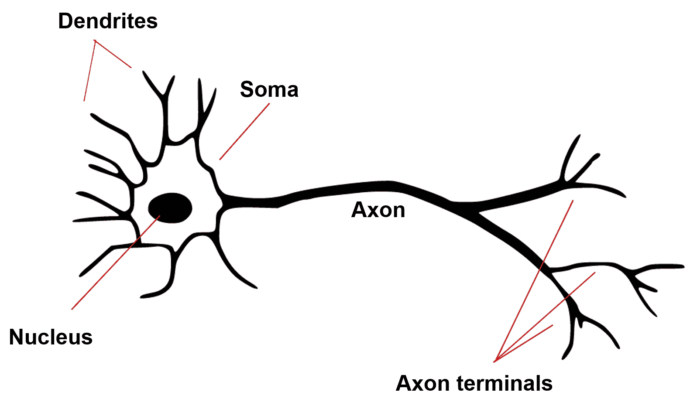

麦克洛奇和皮茨描述了这种神经元的内部工作原理，将其视为一个简单的逻辑门，它要么开启，要么关闭，这取决于它在其树突上的输入。具体来说，神经元会将其所有输入相加，如果总和超过某个阈值，就会产生一个输出信号，并通过轴突传递。

然而，今天我们知道，真实的神经元比这要复杂得多。生物神经元在数千个输入上执行复杂的非线性数学运算，并且可以根据上下文、重要性或输入信号的新颖性动态地改变其反应性。你可以将真实的神经元想象得像计算机一样复杂，将人脑想象得像互联网一样复杂。

让我们考虑一个简单的人工神经元，它恰好接收两个输入，*x[0]* 和 *x[1]*。人工神经元的任务是计算两个输入的总和（通常以加权总和的形式），如果这个总和超过某个阈值（通常是零），则该神经元将被认为是活跃的并输出一个一；否则，它将被认为是沉默的并输出一个负一（或零）。用更数学的话来说，这个麦克洛奇-皮茨神经元的输出 *y* 可以描述如下：

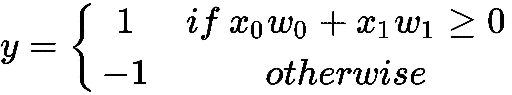

在前面的方程中，*w[0]* 和 *w[1]* 是权重系数，它们与 *x[0]* 和 *x[1]* 一起构成了加权总和。在教科书中，输出 *y* 要么是 *+1* 要么是 *-1* 的两种不同情况，通常会被一个激活函数 *ϕ* 所掩盖，该函数可以取两个不同的值：


在这里，我们引入一个新的变量 *z*（所谓的**网络输入**），它等同于加权总和：*z = w[0]x[0] + w[1]x[1]*。然后，加权总和与阈值 *θ* 进行比较，以确定 *ϕ* 的值，进而确定 *y* 的值。除此之外，这两个方程与前面的方程完全相同。

如果这些方程看起来很熟悉，你可能会想起我们在谈论线性分类器时提到的第一章，《机器学习的味道》。

你说得对，一个麦克洛奇-皮茨神经元本质上是一个线性的、二进制分类器！

你可以这样想：*x[0]* 和 *x[1]* 是输入特征，*w[0]* 和 *w[1]* 是需要学习的权重，分类是通过激活函数 *ϕ* 来执行的。如果我们能很好地学习权重，这通常需要借助合适的训练集，我们就能将数据分类为正样本或负样本。在这种情况下，*ϕ(z)=θ* 将充当决策边界。

帮助理解以下图表可能会使这一切更加清晰：

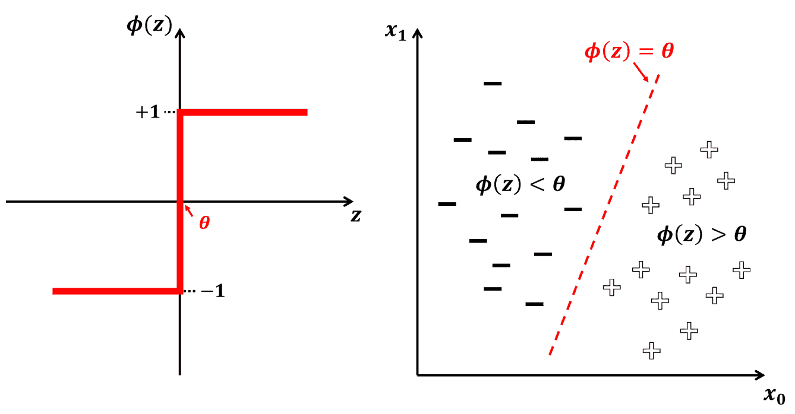

在左侧，你可以看到神经元的激活函数，*ϕ*，与 *z* 的关系图。记住，*z* 仅仅是两个输入 *x[0]* 和 *x[1]* 的加权总和。规则是，只要加权总和低于某个阈值，*θ*，神经元的输出为 -1；高于 *θ*，输出为 +1。

在右侧，你可以看到由 *ϕ(z)=θ* 表示的决策边界，它将数据分为两个区域，*ϕ(z)<θ*（其中所有数据点都被预测为负样本）和 *ϕ(z)>θ*（其中所有数据点都被预测为正样本）。

决策边界不需要是垂直或水平的，它可以像前面图示那样倾斜。但在单个 McCulloch-Pitts 神经元的情况下，决策边界始终是一条直线。

当然，魔法在于学习权重系数，*w[0]* 和 *w[1]*，使得决策边界正好位于所有正数据和所有负数据点之间。

要训练一个神经网络，我们通常需要三样东西：

+   **训练数据**：了解到我们需要一些数据样本来验证我们分类器的有效性，这并不令人惊讶。

+   **代价函数（也称为损失函数）**：代价函数提供了一个衡量当前权重系数好坏的指标。有各种各样的代价函数可供选择，我们将在本章末尾讨论。一个解决方案是计算误分类的数量。另一个解决方案是计算 **平方误差之和**。

+   **学习规则**：学习规则从数学上指定了如何从一次迭代更新权重系数到下一次迭代。这个学习规则通常取决于我们在训练数据上观察到的错误（由损失函数衡量）。 

这就是著名研究员弗兰克·罗森布拉特的工作所在。

# 理解感知器

在 20 世纪 50 年代，美国心理学家和人工智能研究员弗兰克·罗森布拉特发明了一个算法，该算法可以自动学习执行准确二元分类所需的最佳权重系数 *w[0]* 和 *w[1]*：感知器学习规则。

罗森布拉特原始的感知器算法可以总结如下：

1.  将权重初始化为零或一些小的随机数。

1.  对于每个训练样本，*s[i]*，执行以下步骤：

    1.  计算预测的目标值，*ŷ**[i].*

    1.  将 *ŷ**[i]* 与真实值，*y**[i]*，进行比较，并相应地更新权重：

        +   如果两者相同（预测正确），则跳过。

        +   如果两者不同（预测错误），则推动权重系数，*w[0]* 和

# 实现你的第一个感知器

感知器足够简单，可以从头开始实现。我们可以通过创建感知器对象来模拟典型的 OpenCV 或 scikit-learn 分类器的实现。这将允许我们初始化新的感知器对象，通过 `fit` 方法从数据中学习，并通过单独的 `predict` 方法进行预测。

当我们初始化一个新的感知器对象时，我们希望传递一个学习率（`lr`，或前一部分中的*η*）以及算法应该在多少次迭代后终止的次数（`n_iter`）：

```py
In [1]: import numpy as np
In [2]: class Perceptron(object):
...     def __init__(self, lr=0.01, n_iter=10):
...     self.lr = lr
...     self.n_iter = n_iter
... 
```

`fit`方法是大部分工作的地方。该方法应接受一些数据样本（`X`）及其相关的目标标签（`y`）。然后我们将创建一个权重数组（`self.weights`），每个特征一个，初始化为零。为了方便，我们将偏差项（`self.bias`）与权重向量分开，并将其也初始化为零。初始化偏差为零的一个原因是因为权重中的小随机数在网络中提供了不对称性破坏：

```py
...         def fit(self, X, y):
...             self.weights = np.zeros(X.shape[1])
...             self.bias = 0.0
```

`predict`方法应该接受多个数据样本（`X`），并为每个样本返回一个目标标签，即+1 或-1。为了执行这种分类，我们需要实现*ϕ(z)>θ*。这里我们将选择*θ = 0*，加权求和可以使用 NumPy 的点积来计算：

```py
...         def predict(self, X):
...             return np.where(np.dot(X, self.weights) + self.bias >= 0.0,
...                             1, -1)
```

然后，我们将计算数据集中每个数据样本（`xi`，`yi`）的Δ*w*项，并重复此步骤多次迭代（`self.n_iter`）。为此，我们需要将真实标签（`yi`）与预测标签（前面提到的`self.predict(xi)`）进行比较。产生的 delta 项将用于更新权重和偏差项：

```py
...             for _ in range(self.n_iter):
...                 for xi, yi in zip(X, y):
...                     delta = self.lr * (yi - self.predict(xi))
...                     self.weights += delta * xi
...                     self.bias += delta
```

就这样！

# 生成玩具数据集

在以下步骤中，你将学习如何创建和绘制一个玩具数据集：

1.  为了测试我们的感知器分类器，我们需要创建一些模拟数据。现在让我们保持简单，并生成 100 个数据样本（`n_samples`），属于两个 blob 之一（`centers`），再次依赖于 scikit-learn 的`make_blobs`函数：

```py
In [3]: from sklearn.datasets.samples_generator import make_blobs...     X, y = make_blobs(n_samples=100, centers=2,...                       cluster_std=2.2, random_state=42)
```

1.  需要注意的一件事是，我们的感知器分类器期望目标标签为+1 或-1，而`make_blobs`返回`0`和`1`。调整标签的一个简单方法是以下方程：

```py
In [4]: y = 2 * y - 1
```

1.  在下面的代码中，我们将...

# 将感知器拟合到数据

在以下步骤中，你将学习如何在给定的数据上拟合感知器算法：

1.  我们可以像使用 OpenCV 中遇到的其他分类器一样实例化我们的感知器对象：

```py
In [6]: p = Perceptron(lr=0.1, n_iter=10)
```

在这里，我们选择了一个学习率为 0.1，并告诉感知器在 10 次迭代后终止。这些值目前是相当任意选择的，尽管我们很快就会回到它们。

选择适当的学习率至关重要，但并不总是清楚最合适的选择是什么。学习率决定了我们以多快或多慢的速度向最优权重系数移动。如果学习率太大，我们可能会意外地跳过最优解。如果它太小，我们需要大量的迭代才能收敛到最佳值。

1.  一旦感知器设置完成，我们可以调用`fit`方法来优化权重系数：

```py
In [7]: p.fit(X, y)
```

1.  它是否有效？让我们看看学习到的权重值：

```py
In [8]: p.weights
Out[8]: array([ 2.20091094, -0.4798926 ])
```

1.  并且不要忘记查看偏差项：

```py
In [9]: p.bias
Out[9]: 0.20000000000000001
```

如果我们将这些值代入我们的*ϕ*方程中，就可以清楚地看到感知器学习到了形如*2.2 x[1] - 0.48 x[2] + 0.2 >= 0*的决策边界。

# 评估感知器分类器

在以下步骤中，你将对训练好的感知器在测试数据上进行评估：

1.  为了了解我们的感知器表现如何，我们可以在所有数据样本上计算准确率：

```py
In [10]: from sklearn.metrics import accuracy_score...      accuracy_score(p.predict(X), y)Out[10]: 1.0
```

完美得分！

1.  让我们通过将之前章节中的`plot_decision_boundary`函数调回来，来看看决策景观：

```py
In [10]: def plot_decision_boundary(classifier, X_test, y_test):...          # create a mesh to plot in...          h = 0.02 # step size in mesh...          x_min, x_max = X_test[:, 0].min() - 1, X_test[:, 0].max() + 1...          y_min, y_max = X_test[:, 1].min() - 1, X_test[:, 1].max() + 1... xx, yy = np.meshgrid(np.arange(x_min, ...
```

# 将感知器应用于非线性可分的数据

在以下步骤中，你将学习如何构建一个感知器来分离非线性数据：

1.  由于感知器是一个线性分类器，你可以想象它会在尝试对非线性可分的数据进行分类时遇到困难。我们可以通过增加我们玩具数据集中两个团块的扩散（`cluster_std`）来测试这一点，使得两个团块开始重叠：

```py
In [12]: X, y = make_blobs(n_samples=100, centers=2,
...      cluster_std=5.2, random_state=42)
...      y = 2 * y - 1
```

1.  我们可以使用 matplotlib 的`scatter`函数再次绘制数据集：

```py
In [13]: plt.scatter(X[:, 0], X[:, 1], s=100, c=y);
...      plt.xlabel('x1')
...      plt.ylabel('x2')
```

如以下截图所示，这些数据不再是线性可分的，因为没有一条直线可以完美地分离这两个团块：

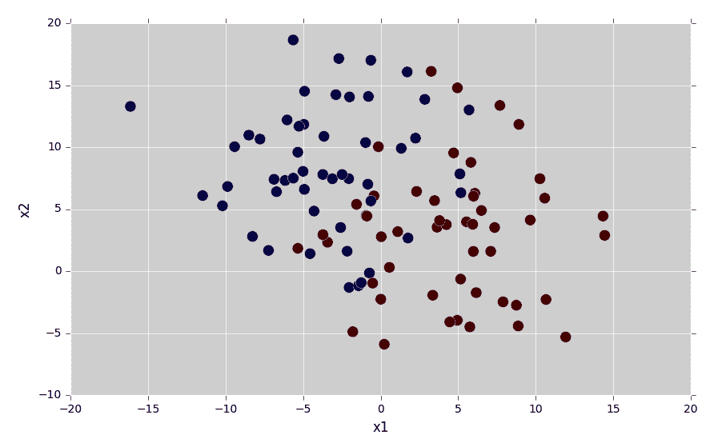

之前的截图展示了一个非线性可分的数据集的例子。那么，如果我们将感知器分类器应用于这个数据集，会发生什么呢？

1.  我们可以通过重复前面的步骤来找到这个问题的答案：

```py
In [14]: p = Perceptron(lr=0.1, n_iter=10)
...      p.fit(X, y)
```

1.  然后，我们找到了一个准确率为 81%的评分：

```py
In [15]: accuracy_score(p.predict(X), y)
Out[15]: 0.81000000000000005
```

1.  为了找出哪些数据点被错误分类，我们可以再次使用我们的辅助函数可视化决策景观：

```py
In [16]: plot_decision_boundary(p, X, y)
...      plt.xlabel('x1')
...      plt.ylabel('x2')
```

以下图表清楚地展示了感知器分类器的局限性。作为一个线性分类器，它试图使用一条直线来分离数据，但最终失败了。它失败的主要原因是因为数据本身不是线性可分的，尽管我们达到了 81%的准确率。然而，从以下图中可以看出，许多红色点位于蓝色区域，反之亦然。因此，与感知器不同，我们需要一个非线性算法，它可以创建的不是直线而是非线性（圆形）的决策边界：

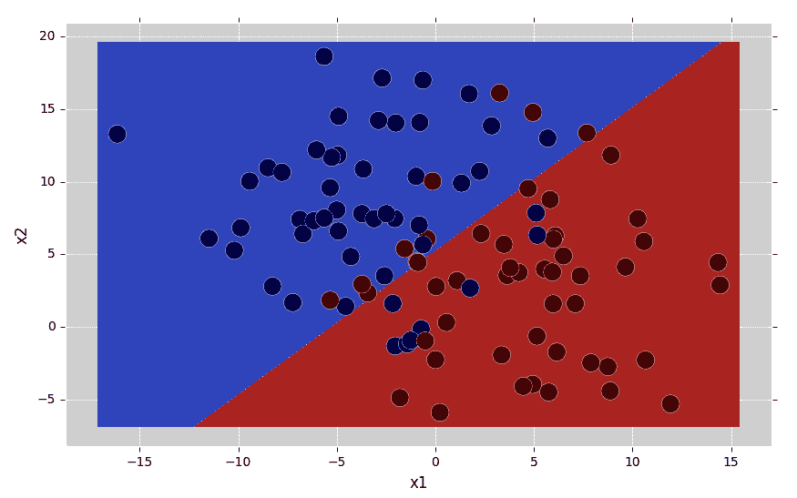

幸运的是，有方法可以使感知器更强大，并最终创建非线性决策边界。

# 理解多层感知器

为了创建非线性决策边界，我们可以将多个感知器组合成更大的网络。这也被称为**多层感知器**（**MLP**）。MLP 通常至少包含三个层，其中第一层为数据集的每个输入特征都有一个节点（或神经元），最后一层为每个类别标签都有一个节点。中间的层被称为**隐藏层**。

以下图表展示了这种前馈神经网络架构的示例：

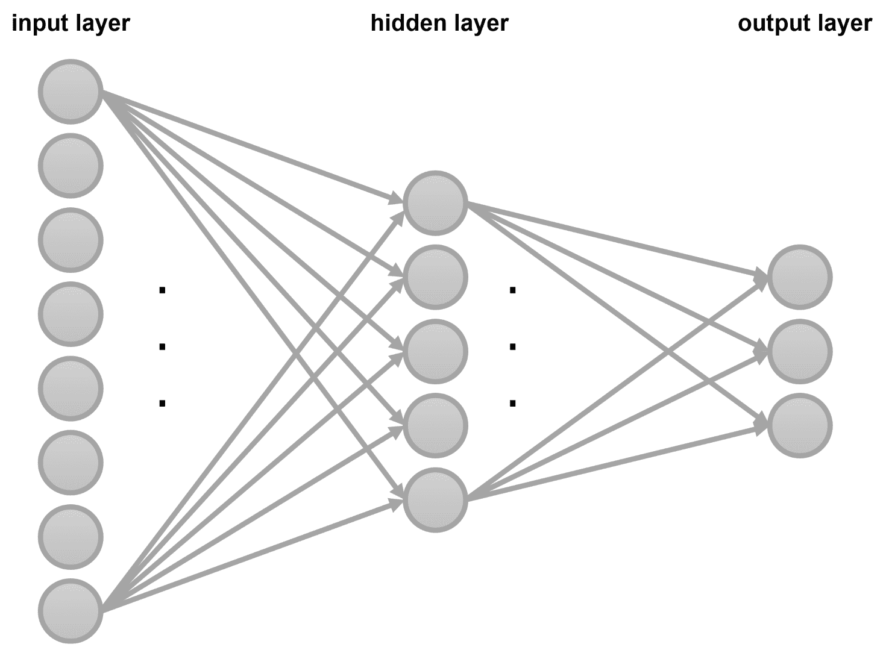

在这个网络中，每一个圆圈都是一个人工神经元（或者说，本质上是一个感知器），一个人工神经元的输出 ...

# 理解梯度下降

在本章前面讨论感知器时，我们确定了训练所需的三个基本要素：训练数据、代价函数和学习规则。虽然学习规则对单个感知器效果很好，但不幸的是，它并没有推广到多层感知器（MLPs），因此人们必须提出一个更通用的规则。

如果你考虑我们如何衡量分类器的成功，我们通常借助代价函数来衡量。一个典型的例子是网络的误分类数量或均方误差。这个函数（也称为**损失函数**）通常取决于我们试图调整的参数。在神经网络中，这些参数是权重系数。

假设一个简单的神经网络有一个可以调整的权重，*w*。然后我们可以将代价视为权重的函数：

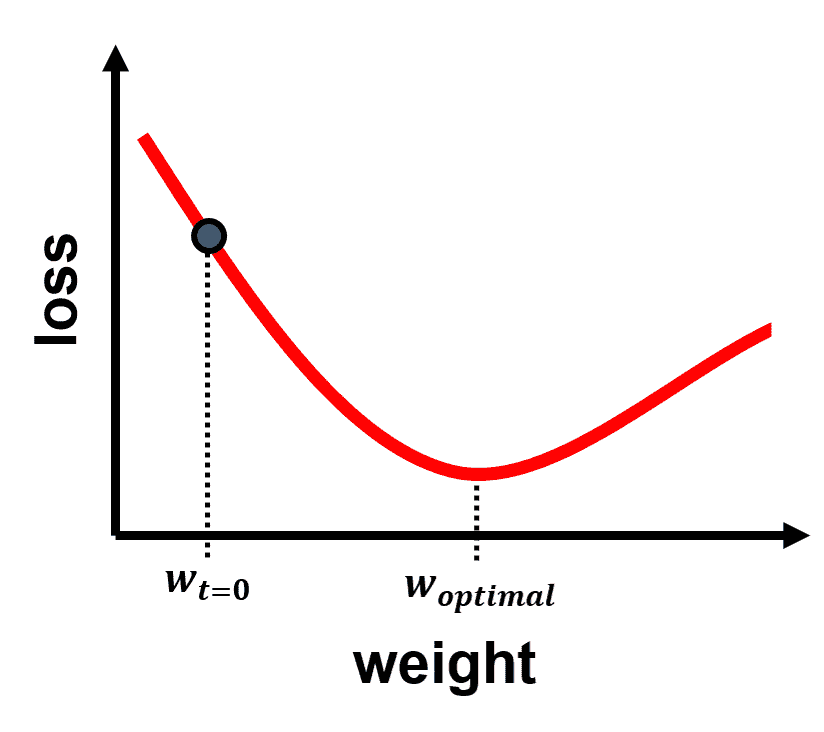

在训练开始时，在时间零，我们可能开始时位于这张图的左侧（*w[t=0]*）。但从图中我们知道，对于 *w* 来说，会有一个更好的值，即 *w[optimal]*，这将最小化代价函数。最小的代价意味着最低的错误，因此，通过学习达到 *w[optimal]* 应该是我们的最高目标。

这正是梯度下降所做的。你可以把梯度想象成一个指向山上的向量。在梯度下降中，我们试图沿着梯度的反方向行走，实际上是在下山，从山顶走到山谷：

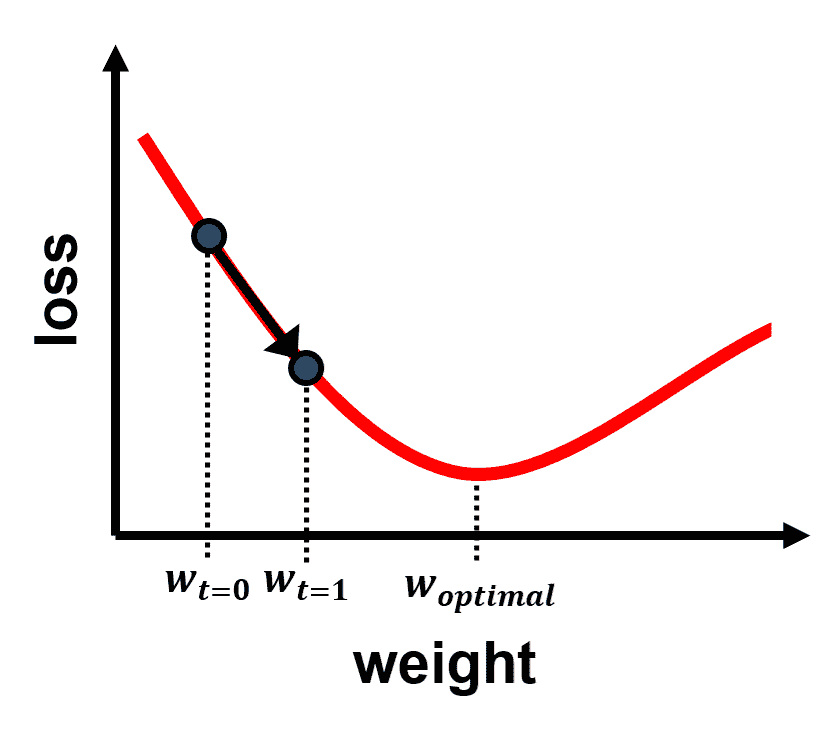

一旦到达山谷，梯度变为零，这就完成了训练。

有几种方法可以到达山谷——我们可以从左侧接近，或者我们可以从右侧接近。我们下降的起点由初始权重值决定。此外，我们必须小心不要迈出太大的步子，否则我们可能会错过山谷：

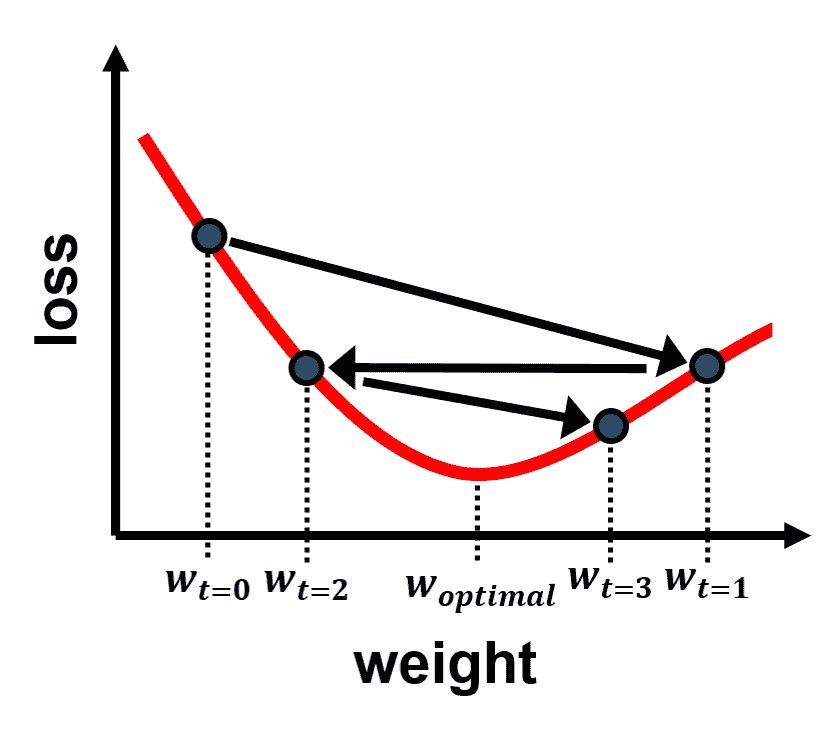

因此，在随机梯度下降（有时也称为迭代或在线梯度下降）中，目标是采取小步，但要尽可能频繁地采取这些步子。有效的步长由算法的学习率决定。

具体来说，我们会反复执行以下程序：

1.  向网络呈现少量训练样本（称为**批量大小**）。

1.  在这个小批量数据上，计算代价函数的梯度。

1.  通过在梯度的反方向上迈一小步，朝着山谷的方向更新权重系数。

1.  重复步骤 1-3，直到权重代价不再下降。这是我们已经到达山谷的迹象。

改进 SGD 的一些其他方法包括在 Keras 框架中使用学习率查找器，在 epoch 中减小步长（学习率），以及在前一个点中讨论的，使用批量大小（或小批量），这将更快地计算权重更新。

你能想到一个这个流程可能会失败的情况吗？

一个可以想到的场景是成本函数有多个山谷，其中一些比其他更深，如下面的图所示：

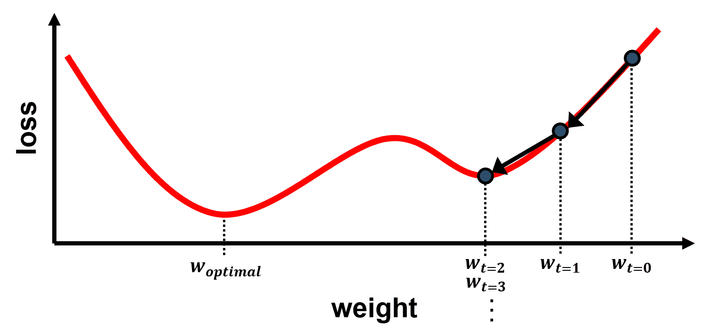

如果我们从左边开始，我们应该到达之前相同的山谷——没问题。但是，如果我们的起点在右边，我们可能会在途中遇到另一个山谷。梯度下降会直接把我们带到山谷，但它没有爬出来的方法。

这也被称为**陷入局部最小值**。研究人员已经想出不同的方法来尝试避免这个问题，其中之一就是在过程中添加噪声。

拼图中还缺一块。给定我们当前的权重系数，我们如何知道成本函数的斜率？

# 使用反向传播训练 MLP

这就是反向传播的作用，它是一种用于估计神经网络中成本函数梯度的算法。有些人可能会说，这基本上是链式法则的一个花哨的词，链式法则是计算依赖于多个变量的函数的偏导数的一种方法。尽管如此，它是一种帮助人工神经网络领域重生的方法，因此我们应该为此感到感激。

理解反向传播需要相当多的微积分知识，所以我只会在这里给你一个简要的介绍。

让我们提醒自己，成本函数及其梯度取决于真实输出(*y[i]*)和当前输出(*ŷ[i]*)之间的差异

# 在 OpenCV 中实现 MLP

在 OpenCV 中实现 MLP 使用我们之前至少见过一次的相同语法。为了了解 MLP 与单个感知器相比如何，我们将使用之前相同的玩具数据操作：

```py
In [1]: from sklearn.datasets.samples_generator import make_blobs
...     X_raw, y_raw = make_blobs(n_samples=100, centers=2,
...                               cluster_std=5.2, random_state=42)
```

# 数据预处理

然而，由于我们正在使用 OpenCV，这次我们想确保输入矩阵由 32 位浮点数组成，否则代码会出错：

```py
In [2]: import numpy as np... X = X_raw.astype(np.float32)
```

此外，我们需要回顾第四章，*表示数据和工程特征*，并记住如何表示分类变量。我们需要找到一种方法来表示目标标签，而不是整数，而是使用独热编码。实现这一点最简单的方法是使用 scikit-learn 的`preprocessing`模块：

```py
In [3]: from sklearn.preprocessing import OneHotEncoder...     enc = OneHotEncoder(sparse=False, dtype=np.float32)...     y = enc.fit_transform(y_raw.reshape(-1, 1))
```

# 在 OpenCV 中创建 MLP 分类器

在 OpenCV 中创建 MLP 的语法与所有其他分类器相同：

```py
In [4]: import cv2
...     mlp = cv2.ml.ANN_MLP_create()
```

然而，现在我们需要指定网络中要包含多少层以及每层有多少个神经元。我们通过一个整数列表来完成这项工作，该列表指定了每层的神经元数量。由于数据矩阵 `X` 有两个特征，第一层也应该有两个神经元（`n_input`）。由于输出有两个不同的值，最后一层也应该有两个神经元（`n_output`）。

在这两层之间，我们可以放置任意数量的隐藏层，每层包含任意数量的神经元。让我们选择一个包含任意数量 10 个神经元的单个隐藏层（`n_hidden`）：

```py
In [5]: n_input = 2
...     n_hidden = 10
...     n_output = 2
...     mlp.setLayerSizes(np.array([n_input, n_hidden, n_output]))
```

# 定制 MLP 分类器

在我们开始训练分类器之前，我们可以通过一系列可选设置来定制 MLP 分类器：

+   `mlp.setActivationFunction`: 这定义了网络中每个神经元要使用的激活函数。

+   `mlp.setTrainMethod`: 这定义了一个合适的训练方法。

+   `mlp.setTermCriteria`: 这设置了训练阶段的终止标准。

而我们的自制感知器分类器使用的是线性激活函数，OpenCV 提供了两个额外的选项：

+   `cv2.ml.ANN_MLP_IDENTITY`: 这是一个线性激活函数，*f(x) = x*。

+   `cv2.ml.ANN_MLP_SIGMOID_SYM`: 这是一个对称的 Sigmoid 函数（也称为双曲正切），*f(x) = β (1 - exp(-α x)) / (1 + exp(-α x))*. 而 ...

# 训练和测试 MLP 分类器

这部分很简单。训练 MLP 分类器与所有其他分类器相同：

```py
In [11]: mlp.train(X, cv2.ml.ROW_SAMPLE, y)
Out[11]: True
```

对于预测目标标签也是一样：

```py
In [12]: _, y_hat = mlp.predict(X)
```

测量准确率最简单的方法是使用 scikit-learn 的辅助函数：

```py
In [13]: from sklearn.metrics import accuracy_score
...      accuracy_score(y_hat.round(), y)
Out[13]: 0.88
```

看起来我们能够将性能从单个感知器的 81% 提高到由 10 个隐藏层神经元和 2 个输出神经元组成的 MLP 的 88%。为了看到发生了什么变化，我们可以再次查看决策边界：

```py
In [14]: def plot_decision_boundary(classifier, X_test, y_test):
... # create a mesh to plot in
... h = 0.02 # step size in mesh
... x_min, x_max = X_test[:, 0].min() - 1, X_test[:, 0].max() + 1
... y_min, y_max = X_test[:, 1].min() - 1, X_test[:, 1].max() + 1
... xx, yy = np.meshgrid(np.arange(x_min, x_max, h),
... np.arange(y_min, y_max, h))
... 
... X_hypo = np.c_[xx.ravel().astype(np.float32),
... yy.ravel().astype(np.float32)]
... _, zz = classifier.predict(X_hypo)
```

然而，这里有一个问题，那就是 `zz` 现在是一个 one-hot 编码的矩阵。为了将 one-hot 编码转换为对应于类别标签（零或一）的数字，我们可以使用 NumPy 的 `argmax` 函数：

```py
...          zz = np.argmax(zz, axis=1)
```

然后其余部分保持不变：

```py
...          zz = zz.reshape(xx.shape)
...          plt.contourf(xx, yy, zz, cmap=plt.cm.coolwarm, alpha=0.8)
...          plt.scatter(X_test[:, 0], X_test[:, 1], c=y_test, s=200)
```

然后，我们可以这样调用函数：

```py
In [15]: plot_decision_boundary(mlp, X, y_raw)
```

输出看起来是这样的：

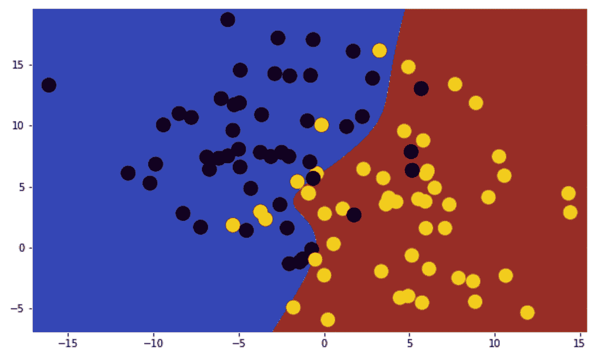

前面的输出显示了一个具有单个隐藏层的 MLP 的决策边界。

哇！决策边界不再是直线了。话虽如此，你获得了很大的性能提升，可能还期望有更大的性能提升。但没有人说过我们必须止步于此！

从这里开始，我们可以尝试至少两种不同的方法：

+   我们可以在隐藏层中添加更多的神经元。你可以通过在第六行将 `n_hidden` 替换为更大的值并再次运行代码来实现这一点。一般来说，你放入网络中的神经元越多，MLP 的能力就越强。

+   我们可以添加更多的隐藏层。结果证明，这正是神经网络真正获得其力量的地方。

因此，这就是我应该告诉你关于深度学习的地方。

# 了解深度学习

在深度学习还没有一个响亮的名字之前，它被称为人工神经网络。所以你已经对它了解很多了！

1986 年，当 David Rumelhart、Geoffrey Hinton 和 Ronald Williams 参与上述反向传播算法的（再）发现和普及时，对神经网络的研究兴趣再次被点燃。然而，直到最近，计算机才足够强大，能够在大型网络上实际执行反向传播算法，从而引发了深度学习研究的激增。

你可以在以下科学文章中找到有关深度学习的历史和起源的更多信息：王和拉吉（2017 年），*关于起源...*

# 了解 Keras

Keras 的核心数据结构是模型，它类似于 OpenCV 的分类器对象，但它只关注神经网络。最简单的模型类型是序列模型，它将神经网络的各个层线性堆叠起来，就像我们在 OpenCV 中对 MLP 所做的那样：

```py
In [1]: from keras.models import Sequential
...     model = Sequential()
Out[1]: Using TensorFlow backend.
```

然后，可以逐个将不同的层添加到模型中。在 Keras 中，层不仅包含神经元，还执行一个函数。一些核心层类型包括以下内容：

+   **密集层**：这是一个密集连接层。这正是我们在设计 MLP 时使用的：一个与前一层的每个神经元都连接的神经元层。

+   **激活**：此操作对输出应用激活函数。Keras 提供了一系列激活函数，包括 OpenCV 的恒等函数（`linear`）、双曲正切（`tanh`）、S 形压缩函数（`sigmoid`）、softmax 函数（`softmax`）等。

+   **重塑**：此操作将输出重塑为特定的形状。

还有其他层可以对它们的输入进行算术或几何运算：

+   **卷积层**：这些层允许你指定一个内核，与输入层进行卷积。这允许你执行诸如 Sobel 滤波器或应用 1D、2D 甚至 3D 的高斯核等操作。

+   **池化层**：这些层对其输入执行最大池化操作，其中输出神经元的活性由最活跃的输入神经元给出。

深度学习中流行的其他层如下：

+   **Dropout**：此层在每个更新时随机将一部分输入单元设置为 0。这是将噪声注入训练过程的一种方式，使其更加鲁棒。

+   **嵌入**：此层对分类数据进行编码，类似于 scikit-learn 的`preprocessing`模块中的某些函数。

+   **高斯噪声**：此层应用加性零均值高斯噪声。这是将噪声注入训练过程的一种方式，使其更加鲁棒。

可以使用具有两个输入和一个输出的密集层实现与前面类似的前馈感知器。保持与之前示例的一致性，我们将权重初始化为零，并使用双曲正切作为激活函数：

```py
In [2]: from keras.layers import Dense
...     model.add(Dense(1, activation='tanh', input_dim=2,
...                     kernel_initializer='zeros'))
```

最后，我们想要指定训练方法。Keras 提供了多种优化器，包括以下几种：

+   **随机梯度下降（SGD）**：这是我们之前讨论过的。

+   **均方根传播（RMSprop）**：这是一种为每个参数调整学习率的方法。

+   **自适应动量估计（Adam）**：这是对均方根传播的更新。

此外，Keras 还提供了一系列不同的损失函数：

+   **均方误差（mean_squared_error）**：这是我们之前讨论过的。

+   **Hinge 损失（hinge）**：这是一种最大间隔分类器，通常与 SVM 一起使用，如第六章[419719a8-3340-483a-86be-1d9b94f4a682.xhtml]中所述，*使用支持向量机检测行人*。

你可以看到有许多参数需要指定和许多方法可以选择。为了保持与我们之前提到的感知器实现的一致性，我们将选择 SGD 作为优化器，均方误差作为损失函数，准确率作为评分函数：

```py
In [3]: model.compile(optimizer='sgd',
...                   loss='mean_squared_error',
...                   metrics=['accuracy'])
```

为了比较 Keras 实现与我们的自制版本的性能，我们将分类器应用于相同的数据集：

```py
In [4]: from sklearn.datasets.samples_generator import make_blobs
...     X, y = make_blobs(n_samples=100, centers=2,
...     cluster_std=2.2, random_state=42)
```

最后，使用非常熟悉的语法将 Keras 模型拟合到数据中。在这里，我们还可以选择训练的迭代次数（`epochs`）、在计算误差梯度之前展示的样本数量（`batch_size`）、是否打乱数据集（`shuffle`）以及是否输出进度更新（`verbose`）：

```py
In [5]: model.fit(X, y, epochs=400, batch_size=100, shuffle=False,
...               verbose=0)
```

训练完成后，我们可以如下评估分类器：

```py
In [6]: model.evaluate(X, y)
Out[6]: 32/100 [========>.....................] - ETA: 0s
        [0.040941802412271501, 1.0]
```

在这里，第一个报告的值是均方误差，而第二个值表示准确率。这意味着最终的均方误差为 0.04，我们达到了 100% 的准确率。比我们自己的实现要好得多！

你可以在 [`keras.io`](http://keras.io) 上找到更多关于 Keras、源代码文档和许多教程的信息。

拥有这些工具在手，我们现在可以开始处理真实世界的数据集了！

# 手写数字分类

在上一节中，我们介绍了关于神经网络的大量理论，如果你对这个主题是新手，可能会觉得有点令人不知所措。在本节中，我们将使用著名的 MNIST 数据集，它包含 60,000 个手写数字样本及其标签。

我们将在这个数据集上训练两个不同的网络：

+   使用 OpenCV 的 MLP

+   使用 Keras 的深度神经网络

# 加载 MNIST 数据集

获取 MNIST 数据集最简单的方法是使用 Keras：

```py
In [1]: from keras.datasets import mnist
...     (X_train, y_train), (X_test, y_test) = mnist.load_data()
Out[1]: Using TensorFlow backend.
        Downloading data from
        https://s3.amazonaws.com/img-datasets/mnist.npz
```

这将从 Amazon Cloud 下载数据（根据您的网络连接速度可能需要一段时间）并自动将数据分为训练集和测试集。

MNIST 提供了自己的预定义的训练-测试分割。这样，比较不同分类器的性能更容易，因为它们将使用相同的数据进行训练和测试。

这些数据以我们已熟悉的格式出现：

```py
In [2]: X_train.shape, y_train.shape
Out[2]: ((60000, 28, 28), (60000,))
```

我们应该注意，标签是以零到九之间的整数形式出现的（对应于数字 0-9）：

```py
In [3]: import numpy as np
...     np.unique(y_train)
Out[3]: array([0, 1, 2, 3, 4, 5, 6, 7, 8, 9], dtype=uint8)
```

我们可以查看一些示例数字：

```py
In [4]: import matplotlib.pyplot as plt
...     %matplotlib inline
In [5]: for i in range(10):
...         plt.subplot(2, 5, i + 1)
...         plt.imshow(X_train[i, :, :], cmap='gray')
...         plt.axis('off')
```

这些数字看起来是这样的：

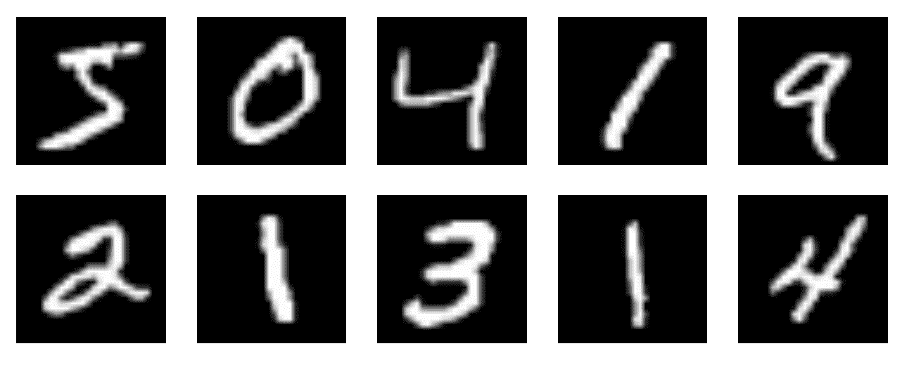

实际上，MNIST 数据集是 scikit-learn 之前提供的 NIST 数字数据集的后继者，我们之前使用过（`sklearn.datasets.load_digits`；参见第二章，*在 OpenCV 中处理数据*）。以下是一些显著的不同点：

+   MNIST 图像的尺寸显著大于 NIST 图像（28 x 28 像素），因此需要更加关注诸如扭曲和相同数字图像之间的个体差异等细微细节。

+   MNIST 数据集比 NIST 数据集大得多，提供了 60,000 个训练样本和 10,000 个测试样本（相比之下，NIST 总共有 5,620 个图像）。

# 预处理 MNIST 数据集

正如我们在第四章中学习的，*表示数据和工程特征*，我们可能希望应用以下预处理步骤：

+   **居中**：所有数字都应居中在图像中。例如，看看前面图表中所有数字 1 的示例图像，它们几乎都是垂直打击。如果图像未对齐，打击点可以位于图像的任何位置，这使得神经网络难以在训练样本中找到共性。幸运的是，MNIST 中的图像已经居中。

+   **缩放**：对数字进行缩放以使它们具有相同的大小也是一样的。这样，打击点、曲线和环的位置就很重要。 ...

# 使用 OpenCV 训练 MLP

我们可以使用以下方法在 OpenCV 中设置和训练一个 MLP：

1.  实例化一个新的 MLP 对象：

```py
In [9]: import cv2
...     mlp = cv2.ml.ANN_MLP_create()
```

1.  指定网络中每一层的尺寸。我们可以添加尽可能多的层，但我们需要确保第一层有与输入特征相同的神经元数量（在我们的例子中是`784`），并且最后一层有与类别标签相同的神经元数量（在我们的例子中是`10`），同时有两个隐藏层，每个隐藏层有`512`个节点：

```py
In [10]: mlp.setLayerSizes(np.array([784, 512, 512, 10]))
```

1.  指定激活函数。在这里，我们使用之前使用的 S 型激活函数：

```py
In [11]: mlp.setActivationFunction(cv2.ml.ANN_MLP_SIGMOID_SYM,
      ...                                2.5, 1.0)
```

1.  指定训练方法。在这里，我们使用之前描述的逆传播算法。我们还需要确保我们选择足够小的学习率。由于我们有大约 10⁵个训练样本，将学习率设置为最多 10^(-5)是一个好主意：

```py
In [12]: mlp.setTrainMethod(cv2.ml.ANN_MLP_BACKPROP)
...      mlp.setBackpropWeightScale(0.00001)
```

1.  指定终止条件。在这里，我们使用之前相同的条件：运行 10 次迭代 (`term_max_iter`) 或直到错误不再显著增加 (`term_eps`)：

```py
In [13]: term_mode = (cv2.TERM_CRITERIA_MAX_ITER + 
...                   cv2.TERM_CRITERIA_EPS)
...      term_max_iter = 10
...      term_eps = 0.01
...      mlp.setTermCriteria((term_mode, term_max_iter,
...                           term_eps))
```

1.  在训练集 (`X_train_pre`) 上训练网络：

```py
In [14]: mlp.train(X_train_pre, cv2.ml.ROW_SAMPLE, y_train_pre)
Out[14]: True
```

在调用 `mlp.train` 之前，请注意：这可能会根据您的计算机配置需要几个小时才能运行！为了比较，在我的笔记本电脑上只需要不到一个小时。我们现在处理的是一个包含 60,000 个样本的真实世界数据集：如果我们运行 100 个训练轮次，我们必须计算 600 万个梯度！所以请小心。

当训练完成后，我们可以在训练集上计算准确率分数，看看我们达到了什么程度：

```py
In [15]: _, y_hat_train = mlp.predict(X_train_pre)
In [16]: from sklearn.metrics import accuracy_score
...      accuracy_score(y_hat_train.round(), y_train_pre)
Out[16]: 0.92976666666666663
```

但是，当然，真正重要的是我们在未参与训练过程的保留测试数据上得到的准确率分数：

```py
In [17]: _, y_hat_test = mlp.predict(X_test_pre)
...      accuracy_score(y_hat_test.round(), y_test_pre)
Out[17]: 0.91690000000000005
```

如果问我，91.7% 的准确率绝对不错！你应该尝试的第一件事是更改前面 `In [10]` 中的层大小，看看测试分数如何变化。随着你向网络添加更多的神经元，你应该看到训练分数增加——希望随之而来的是测试分数的增加。然而，在单个层中有 *N* 个神经元与它们分布在几个层中是不同的！你能证实这个观察结果吗？

# 使用 Keras 训练深度神经网络

尽管我们使用前面的 MLP 取得了令人印象深刻的分数，但我们的结果并不符合最先进的结果。目前，最佳结果接近 99.8% 的准确率——优于人类表现！这就是为什么现在，将手写数字分类的任务在很大程度上被认为已经解决。

为了接近最先进的结果，我们需要使用最先进的技术。因此，我们回到了 Keras。

# 预处理 MNIST 数据集

在以下步骤中，你将学习在将数据馈送到神经网络之前预处理数据：

1.  为了确保每次运行实验时都能得到相同的结果，我们将为 NumPy 的随机数生成器选择一个随机种子。这样，从 MNIST 数据集的随机训练样本将始终以相同的顺序进行洗牌：

```py
In [1]: import numpy as np
...     np.random.seed(1337)
```

1.  Keras 提供了一个类似于 scikit-learn 的 `model_selection` 模块中的 `train_test_split` 的加载函数。它的语法可能看起来很熟悉：

```py
In [2]: from keras.datasets import mnist
...     (X_train, y_train), (X_test, y_test) = mnist.load_data()
```

与我们迄今为止遇到的其他数据集相比，MNIST 预定义了训练-测试分割。这使得数据集可以用作基准，因为不同算法报告的测试分数将始终适用于相同的测试样本。

1.  Keras 中的神经网络在处理特征矩阵时与标准的 OpenCV 和 scikit-learn 估计器略有不同。在 Keras 中，特征矩阵的行仍然对应于样本数量（以下代码中的 `X_train.shape[0]`），我们可以通过向特征矩阵添加更多维度来保留输入图像的二维性质：

```py
In [3]: img_rows, img_cols = 28, 28
...     X_train = X_train.reshape(X_train.shape[0], img_rows, img_cols, 1)
...     X_test = X_test.reshape(X_test.shape[0], img_rows, img_cols, 1)
...     input_shape = (img_rows, img_cols, 1)
```

1.  在这里，我们将特征矩阵重塑为具有`n_features` x 28 x 28 x 1 维度的四维矩阵。我们还需要确保我们在[0, 1]范围内的 32 位浮点数上操作，而不是[0, 255]范围内的无符号整数：

```py
...     X_train = X_train.astype('float32') / 255.0
...     X_test = X_test.astype('float32') / 255.0
```

1.  然后，我们可以像之前一样对训练标签进行 one-hot 编码。这将确保每个目标标签类别都可以分配到输出层中的一个神经元。我们可以使用 scikit-learn 的`preprocessing`来完成这个任务，但在这个情况下，使用 Keras 自己的实用函数更容易：

```py
In [4]: from keras.utils import np_utils
...     n_classes = 10
...     Y_train = np_utils.to_categorical(y_train, n_classes)
...     Y_test = np_utils.to_categorical(y_test, n_classes)
```

# 创建卷积神经网络

在以下步骤中，你将创建一个神经网络，并使用你之前预处理的数据进行训练：

1.  一旦我们预处理了数据，就是时候定义实际模型了。在这里，我们再次依赖`Sequential`模型来定义一个前馈神经网络：

```py
In [5]: from keras.model import Sequential... model = Sequential()
```

1.  然而，这次我们将更聪明地处理各个层。我们将围绕一个卷积层设计我们的神经网络，其中核是一个 3 x 3 像素的二维卷积：

```py
In [6]: from keras.layers import Convolution2D...     n_filters = 32...     kernel_size = (3, 3)...     model.add(Convolution2D(n_filters, kernel_size[0], kernel_size[1],... border_mode='valid', ...
```

# 模型摘要

你还可以可视化模型的摘要，它将列出所有层及其相应的维度和每个层所包含的权重数量。它还将提供有关网络中总参数数（权重和偏差）的信息：

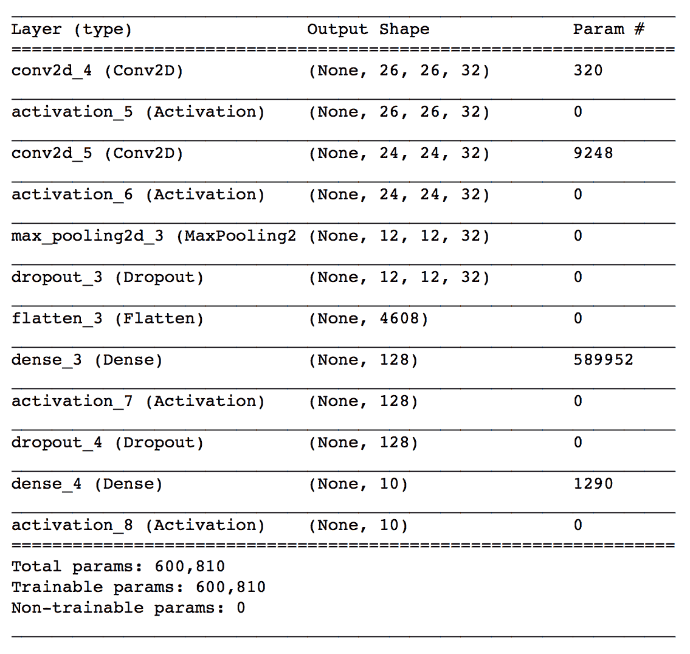

我们可以看到，总共有 600,810 个参数将接受训练，并且需要相当大的计算能力！请注意，我们如何计算每个层的参数数量超出了本书的范围。

# 模型拟合

我们像处理所有其他分类器一样拟合模型（注意，这可能需要一段时间）：

```py
In [12]: model.fit(X_train, Y_train, batch_size=128, nb_epoch=12,...                verbose=1, validation_data=(X_test, Y_test))
```

训练完成后，我们可以评估分类器：

```py
In [13]: model.evaluate(X_test, Y_test, verbose=0)Out[13]: 0.99
```

我们达到了 99%的准确率！这与我们之前实现的 MLP 分类器相去甚远。而且这只是做事情的一种方式。正如你所见，神经网络提供了大量的调整参数，而且并不清楚哪些参数将导致最佳性能。

# 摘要

在这一章中，我们为机器学习实践者的技能清单增加了很多。我们不仅涵盖了人工神经网络的基础，包括感知器和 MLP，我们还接触了一些高级深度学习软件。我们学习了如何从头开始构建一个简单的感知器，以及如何使用 Keras 构建最先进的网络。此外，我们还了解了神经网络的所有细节：激活函数、损失函数、层类型和训练方法。总的来说，这可能是迄今为止最密集的一章。

既然你已经了解了大多数基本的有监督学习算法，现在是时候讨论如何将不同的算法组合成一个更强大的算法了。因此，在下一章中，我们将讨论如何构建集成分类器。
