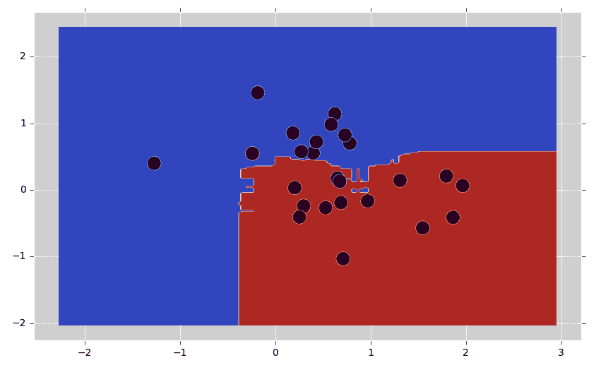
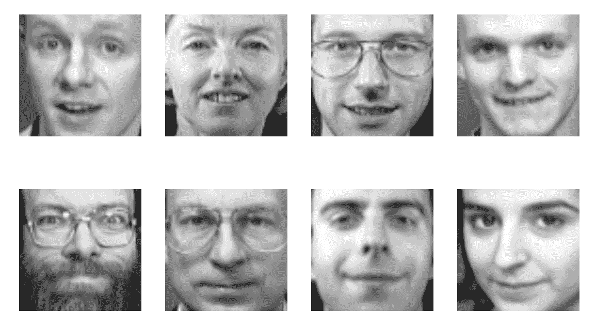

# 用于分类的集成方法

到目前为止，我们已经研究了多种有趣的机器学习算法，从经典的线性回归到更高级的技术如深度神经网络。在各个点上，我们指出了每种算法都有其自身的优点和缺点——并且我们注意到了如何发现和克服这些缺点。

然而，如果我们能够简单地堆叠一组平均分类器来形成一个更强大的**集成**分类器，那岂不是很好？

在本章中，我们将做这件事。集成方法是结合多个不同模型来解决共同问题的技术。它们在竞争性机器学习中已成为一种常见的做法——使...

# 技术要求

您可以从以下链接获取本章的代码：[`github.com/PacktPublishing/Machine-Learning-for-OpenCV-Second-Edition/tree/master/Chapter10`](https://github.com/PacktPublishing/Machine-Learning-for-OpenCV-Second-Edition/tree/master/Chapter10)。

这里是软件和硬件要求的一个简要总结：

+   OpenCV 版本 4.1.x（4.1.0 或 4.1.1 都完全可以）。

+   Python 版本 3.6（任何 Python 3.x 版本都行）。

+   Anaconda Python 3 用于安装 Python 和所需的模块。

+   您可以使用任何操作系统——macOS、Windows 或基于 Linux 的操作系统——使用这本书。我们建议您的系统至少有 4 GB RAM。

+   您不需要 GPU 来运行书中提供的代码。

# 理解集成方法

集成方法的目的是结合使用给定学习算法构建的几个单个估计器的预测，以解决一个共同的问题。通常，一个集成由两个主要组件组成：

+   一组模型

+   一组决策规则，用于控制这些模型的结果如何组合成一个单一输出。

集成方法背后的想法与“群体智慧”概念有很大关系。而不是单个专家的意见，我们考虑一群个人的集体意见。在机器学习的背景下，这些个人将是分类器或回归器。想法是，如果我们询问足够多的分类器，其中之一应该能够得到...

# 理解平均集成

平均方法在机器学习中有悠久的历史，通常应用于分子动力学和音频信号处理等领域。这样的集成通常被视为给定系统的精确复制品。

平均集成本质上是一组在相同数据集上训练的模型。然后，他们的结果以多种方式汇总。

一种常见的方法是创建多个模型配置，这些配置以不同的参数子集作为输入。采用这种方法的技巧被称为集合方法。

集成方法有很多不同的风味。然而，它们通常只在抽取训练集随机子集的方式上有所不同：

+   粘贴方法在不替换数据样本的情况下抽取样本的随机子集。

+   袋装方法在抽取样本时进行数据样本的替换。

+   随机子空间方法从特征中抽取随机子集，但训练所有数据样本。

+   随机补丁方法从样本和特征中抽取随机子集。

可以使用集成平均来减少模型性能的变异性。

在 scikit-learn 中，可以使用`BaggingClassifier`和`BaggingRegressor`元估计器来实现袋装方法。这些是元估计器，因为它们允许我们从任何其他基础估计器构建集成。

# 实现一个袋装分类器

例如，我们可以从一组 10 个*k*-NN 分类器中构建一个集成，如下所示：

```py
In [1]: from sklearn.ensemble import BaggingClassifier...     from sklearn.neighbors import KNeighborsClassifier...     bag_knn = BaggingClassifier(KNeighborsClassifier(),...                                 n_estimators=10)
```

`BaggingClassifier`类提供了一些选项来自定义集成：

+   `n_estimators`：如前述代码所示，这指定了集成中基础估计器的数量。

+   `max_samples`：这表示从数据集中抽取用于训练每个基础估计器的样本数量（或分数）。我们可以设置`bootstrap=True`以进行有替换的抽样（有效地实现袋装），或者我们可以设置`bootstrap=False`以实现...

# 实现一个袋装回归器

同样，我们可以使用`BaggingRegressor`类来形成回归器的集成。

例如，我们可以从第三章的波士顿数据集（Chapter 3，*监督学习的第一步*）中构建一个决策树集成来预测房价。

在以下步骤中，你将学习如何使用袋装回归器来形成回归器的集成：

1.  语法几乎与设置袋装分类器相同：

```py
In [7]: from sklearn.ensemble import BaggingRegressor
...     from sklearn.tree import DecisionTreeRegressor
...     bag_tree = BaggingRegressor(DecisionTreeRegressor(),
...                                 max_features=0.5, n_estimators=10, 
...                                 random_state=3)
```

1.  当然，我们需要像处理乳腺癌数据集那样加载数据集并进行分割：

```py
In [8]: from sklearn.datasets import load_boston
...     dataset = load_boston()
...     X = dataset.data
...     y = dataset.target
In [9]: from sklearn.model_selection import train_test_split
...     X_train, X_test, y_train, y_test = train_test_split(
...         X, y, random_state=3
...     )
```

1.  然后，我们可以在`X_train`上拟合袋装回归器，并在`X_test`上进行评分：

```py
In [10]: bag_tree.fit(X_train, y_train)
...      bag_tree.score(X_test, y_test)
Out[10]: 0.82704756225081688
```

在前一个例子中，我们发现性能提升了大约 5%，从单个决策树的 77.3%准确率提升到 82.7%准确率。

当然，我们不会仅仅止步于此。没有人说集成必须由 10 个单独的估计器组成，因此我们可以自由地探索不同大小的集成。除此之外，`max_samples`和`max_features`参数允许进行大量的定制。

袋装决策树的更复杂版本称为随机森林，我们将在本章后面讨论。

# 理解提升集成

构建集成的一种另一种方法是提升。提升模型使用多个单独的学习者在序列中迭代地提升集成的性能。

通常，在提升中使用的学习器相对简单。一个好的例子是只有一个节点的决策树——决策树桩。另一个例子可以是简单的线性回归模型。想法不是拥有最强的单个学习器，而是相反——我们希望个体是弱学习器，这样当我们考虑大量个体时，才能获得更好的性能。

在该过程的每次迭代中，训练集都会进行调整，以便下一个分类器应用于数据点，...

# 弱学习器

弱学习器是与实际分类仅略有相关性的分类器；它们可以比随机预测略好。相反，强学习器与正确分类有任意好的相关性。

这里的想法是，你不仅仅使用一个，而是一系列广泛的弱学习器，每个都比随机略好。许多弱学习器的实例可以通过提升、袋装等方法一起汇总，以创建一个强大的集成分类器。好处是，最终的分类器不会导致训练数据上的*过拟合*。

例如，AdaBoost 在具有不同加权训练数据的弱学习器上拟合一系列。它首先预测训练数据集，并给每个观察/样本相同的权重。如果第一个学习器预测错误，那么它会给预测错误的观察/样本更高的权重。由于这是一个迭代过程，它会继续添加学习器，直到模型数量或准确率达到限制。

# 实现提升分类器

例如，我们可以从一组 10 个决策树中构建一个提升分类器，如下所示：

```py
In [11]: from sklearn.ensemble import GradientBoostingClassifier...      boost_class = GradientBoostingClassifier(n_estimators=10,...                                               random_state=3)
```

这些分类器支持二进制和多类分类。

与`BaggingClassifier`类类似，`GradientBoostingClassifier`类提供了一些选项来自定义集成：

+   `n_estimators`：这表示集成中基估计器的数量。通常，估计器的数量越多，性能越好。

+   `loss`：这表示要优化的损失函数（或成本函数）。设置`loss='deviance'`实现逻辑回归...

# 实现提升回归器

实现提升回归器的语法与提升分类器相同：

```py
In [15]: from sklearn.ensemble import GradientBoostingRegressor
...      boost_reg = GradientBoostingRegressor(n_estimators=10,
...                                            random_state=3)
```

我们之前看到，单个决策树在波士顿数据集上可以达到 79.3%的准确率。由 10 个单独回归树组成的袋装决策树分类器达到了 82.7%的准确率。但是提升回归器是如何比较的呢？

让我们重新加载波士顿数据集，并将其分为训练集和测试集。我们想确保使用相同的`random_state`值，以便最终在相同的数据子集上进行训练和测试：

```py
In [16]: dataset = load_boston()
...      X = dataset.data
...      y = dataset.target
In [17]: X_train, X_test, y_train, y_test = train_test_split(
...          X, y, random_state=3
...     )
```

结果表明，提升决策树集成实际上比之前的代码表现更差：

```py
In [18]: boost_reg.fit(X_train, y_train)
...      boost_reg.score(X_test, y_test)
Out[18]: 0.71991199075668488
```

这个结果一开始可能会让人困惑。毕竟，我们使用的分类器比单棵决策树多 10 倍。为什么我们的数字会变差？

你可以看到这是一个专家分类器比一群弱学习器更聪明的良好例子。一个可能的解决方案是使集成更大。实际上，在提升集成中通常使用大约 100 个弱学习器：

```py
In [19]: boost_reg = GradientBoostingRegressor(n_estimators=100)
```

然后，当我们用波士顿数据集重新训练集成时，我们得到了 89.8%的测试分数：

```py
In [20]: boost_reg.fit(X_train, y_train)
...      boost_reg.score(X_test, y_test)
Out[20]: 0.89984081091774459
```

当你增加到`n_estimators=500`时会发生什么？我们可以通过调整可选参数做更多的事情。

如你所见，提升是一种强大的过程，它允许你通过结合大量相对简单的学习器来实现巨大的性能提升。

提升决策树的一个特定实现是 AdaBoost 算法，我们将在本章后面讨论。

# 理解堆叠集成

我们迄今为止所看到的所有集成方法都共享一个共同的设计理念：将多个个体分类器拟合到数据中，并借助一些简单的决策规则（如平均或提升）将它们的预测合并到一个最终预测中。

相反，堆叠集成通过层次结构构建集成。在这里，个体学习器被组织成多个层次，其中一层学习器的输出被用作下一层模型训练的数据。这样，就有可能成功融合数百种不同的模型。

不幸的是，详细讨论堆叠集成超出了本书的范围。

然而，这些模型可以非常强大，正如我们所看到的，...

# 将决策树组合成随机森林

带包裹的决策树的一个流行变体是所谓的随机森林。这些本质上是一系列决策树，其中每棵树都与其他树略有不同。与带包裹的决策树不同，随机森林中的每棵树都在略微不同的数据特征子集上训练。

虽然一棵无限深度的单树可能对预测数据做相对较好的工作，但它也容易过拟合。随机森林背后的想法是构建大量树，每棵树都在随机子集的数据样本和特征上训练。由于过程的随机性，森林中的每棵树将以略微不同的方式过拟合数据。然后可以通过平均单个树的预测来减少过拟合的影响。

# 理解决策树的不足

决策树经常遇到的过拟合数据集的影响，最好通过一个简单的例子来展示。

对于这个，我们将回到 scikit-learn 的 `datasets` 模块中的 `make_moons` 函数，我们在第八章，“使用无监督学习发现隐藏结构”中之前使用过，将数据组织成两个交替的半圆。在这里，我们选择生成 100 个属于两个半圆的数据样本，并结合一些标准差为 `0.25` 的高斯噪声：

```py
In [1]: from sklearn.datasets import make_moons...     X, y = make_moons(n_samples=100, noise=0.25,...                       random_state=100)
```

我们可以使用 matplotlib 和 `scatter` 可视化这些数据

# 实现我们的第一个随机森林

在 OpenCV 中，可以使用 `ml` 模块中的 `RTrees_create` 函数构建随机森林：

```py
In [7]: import cv2
...     rtree = cv2.ml.RTrees_create()
```

树对象提供了一些选项，其中最重要的是以下这些：

+   `setMaxDepth`: 这设置集成中每个树的最大可能深度。如果首先满足其他终止标准，实际获得的深度可能更小。

+   `setMinSampleCount`: 这设置一个节点可以包含的最小样本数，以便它可以被分割。

+   `setMaxCategories`: 这设置允许的最大类别数。将类别数设置为小于数据中实际类别数的小值会导致子集估计。

+   `setTermCriteria`: 这设置算法的终止标准。这也是你设置森林中树的数量的地方。

虽然我们可能希望有一个 `setNumTrees` 方法来设置森林中的树的数量（这可能是所有参数中最重要的一个，不是吗？），但我们实际上需要依赖于 `setTermCriteria` 方法。令人困惑的是，树的数量与 `cv2.TERM_CRITERA_MAX_ITER` 相混淆，这通常是为算法运行的迭代次数保留的，而不是用于集成中的估计器数量。

我们可以通过将整数 `n_trees` 传递给 `setTermCriteria` 方法来指定森林中的树的数量。这里，我们还想告诉算法，如果分数在连续迭代中没有至少增加 `eps`，则退出：

```py
In [8]: n_trees = 10
...     eps = 0.01
...     criteria = (cv2.TERM_CRITERIA_MAX_ITER + cv2.TERM_CRITERIA_EPS,
...                 n_trees, eps)
...     rtree.setTermCriteria(criteria)
```

然后，我们就可以使用前面代码中的数据来训练分类器了：

```py
In [9]: rtree.train(X_train.astype(np.float32), cv2.ml.ROW_SAMPLE,
                    y_train);
```

可以使用 `predict` 方法预测测试标签：

```py
In [10]: _, y_hat = rtree.predict(X_test.astype(np.float32))
```

使用 scikit-learn 的 `accuracy_score`，我们可以在测试集上评估模型：

```py
In [11]: from sklearn.metrics import accuracy_score
...      accuracy_score(y_test, y_hat)
Out[11]: 0.83999999999999997
```

训练后，我们可以将预测标签传递给 `plot_decision_boundary` 函数：

```py
In [12]: plot_decision_boundary(rtree, X_test, y_test)
```

这将生成以下图表：



前面的图像显示了随机森林分类器的决策景观。

# 使用 scikit-learn 实现随机森林

或者，我们可以使用 scikit-learn 实现随机森林：

```py
In [13]: from sklearn.ensemble import RandomForestClassifier...      forest = RandomForestClassifier(n_estimators=10, random_state=200)
```

这里，我们有多个选项来自定义集成：

+   `n_estimators`: 这指定森林中的树的数量。

+   `criterion`: 这指定了节点分割的标准。将 `criterion='gini'` 设置为 Gini 不纯度，而将 `criterion='entropy'` 设置为信息增益。

+   `max_features`: 这指定了在每个节点分裂时考虑的特征数量（或分数）。

+   `max_depth`: 这指定了每个树的最大深度。

+   `min_samples`: 这指定了最小数量 ...

# 实现极端随机树

随机森林已经很随意了。但如果我们想将随机性推向极致呢？

在极端随机树（请参阅`ExtraTreesClassifier`和`ExtraTreesRegressor`类）中，随机性比随机森林还要强。记得决策树通常为每个特征选择一个阈值，以使节点分裂的纯度最大化吗？另一方面，极端随机树则随机选择这些阈值。然后，使用这些随机生成的阈值中的最佳值作为分裂规则。

我们可以按照以下方式构建一个极端随机树：

```py
In [16]: from sklearn.ensemble import ExtraTreesClassifier
...      extra_tree = ExtraTreesClassifier(n_estimators=10, random_state=100)
```

为了说明单个决策树、随机森林和极端随机树之间的差异，让我们考虑一个简单的数据集，例如鸢尾花数据集：

```py
In [17]: from sklearn.datasets import load_iris
...      iris = load_iris()
...      X = iris.data[:, [0, 2]]
...      y = iris.target
In [18]: X_train, X_test, y_train, y_test = train_test_split(
...          X, y, random_state=100
...      )
```

然后，我们可以像之前一样拟合和评分树对象：

```py
In [19]: extra_tree.fit(X_train, y_train)
...      extra_tree.score(X_test, y_test)
Out[19]: 0.92105263157894735
```

为了进行比较，使用随机森林将产生相同的表现：

```py
In [20]: forest = RandomForestClassifier(n_estimators=10,
                                        random_state=100)
...      forest.fit(X_train, y_train)
...      forest.score(X_test, y_test)
Out[20]: 0.92105263157894735
```

实际上，对于单个树也是如此：

```py
In [21]: tree = DecisionTreeClassifier()
...      tree.fit(X_train, y_train)
...      tree.score(X_test, y_test)
Out[21]: 0.92105263157894735
```

那么，它们之间有什么区别呢？为了回答这个问题，我们必须看看决策边界。幸运的是，我们已经在前面章节中导入了我们的`plot_decision_boundary`辅助函数，所以我们只需要将不同的分类器对象传递给它。

我们将构建一个分类器列表，其中列表中的每个条目都是一个包含索引、分类器名称和分类器对象的元组：

```py
In [22]: classifiers = [
...          (1, 'decision tree', tree),
...          (2, 'random forest', forest),
...          (3, 'extremely randomized trees', extra_tree)
...      ]
```

然后，很容易将分类器列表传递给我们的辅助函数，以便每个分类器的决策景观都在其自己的子图中绘制：

```py
In [23]: for sp, name, model in classifiers:
...      plt.subplot(1, 3, sp)
...      plot_decision_boundary(model, X_test, y_test)
...      plt.title(name)
...      plt.axis('off')

```

结果看起来像这样：


现在三个分类器之间的差异变得更加清晰。我们看到单个树绘制了迄今为止最简单的决策边界，使用水平决策边界分割景观。随机森林能够更清楚地分离决策景观左下角的数据点云。然而，只有极端随机树能够从各个方向将数据点云推向景观的中心。

现在我们已经了解了树集成所有不同的变体，让我们转向一个真实世界的数据集。

# 使用随机森林进行人脸识别

我们还没有过多讨论的一个流行数据集是 Olivetti 人脸数据集。

Olivetti 人脸数据集是在 1990 年由 AT&T 实验室剑桥收集的。该数据集包含 40 个不同主题的人脸图像，这些图像在不同的时间和不同的光照条件下拍摄。此外，主题人物还改变了他们的面部表情（睁眼/闭眼，微笑/不微笑）和面部细节（戴眼镜/不戴眼镜）。

然后将图像量化为 256 个灰度级别，并存储为无符号 8 位整数。由于有 40 个不同的主题，数据集包含 40 个不同的目标标签。因此，识别面部构成了多类分类任务的例子。

# 加载数据集

就像许多其他经典数据集一样，Olivetti 人脸数据集可以使用 scikit-learn 加载：

```py
In [1]: from sklearn.datasets import fetch_olivetti_faces
...     dataset = fetch_olivetti_faces()
In [2]: X = dataset.data
...     y = dataset.target
```

尽管原始图像由 92 x 112 像素的图像组成，但通过 scikit-learn 提供的版本包含下采样到*64 x 64*像素的图像。

为了对数据集有一个大致的了解，我们可以绘制一些示例图像。让我们从数据集中随机选择八个索引：

```py
In [3]: import numpy as np
...     np.random.seed(21)
...     idx_rand = np.random.randint(len(X), size=8)
```

我们可以使用 matplotlib 绘制这些示例图像，但我们需要确保在绘图之前将列向量重塑为 64 x 64 像素的图像：

```py
In [4]: import matplotlib.pyplot as plt
...     %matplotlib inline
...     for p, i in enumerate(idx_rand):
...         plt.subplot(2, 4, p + 1)
... plt.imshow(X[i, :].reshape((64, 64)), cmap='gray')
...         plt.axis('off')
```

上述代码产生以下输出：



您可以看到所有面孔都是对着深色背景拍摄的，而且是肖像。从一张图像到另一张图像，面部表情变化很大，这使得这是一个有趣的分类问题。尝试不要对其中的一些发笑！

# 预处理数据集

在我们可以将数据集传递给分类器之前，我们需要按照第四章，*表示数据和工程特征*的最佳实践对其进行预处理。

具体来说，我们想要确保所有示例图像具有相同的平均灰度级别：

```py
In [5]: n_samples, n_features = X.shape[:2]...     X -= X.mean(axis=0)
```

我们对每个图像重复此过程，以确保每个数据点的特征值（即`X`中的一行）都围绕零中心：

```py
In [6]: X -= X.mean(axis=1).reshape(n_samples, -1)
```

可以使用以下代码可视化预处理后的数据：

```py
In [7]: for p, i in enumerate(idx_rand):...         plt.subplot(2, 4, p + 1)...         plt.imshow(X[i, :].reshape((64, 64)), cmap='gray')... plt.axis('off') ...
```

# 训练和测试随机森林

我们继续遵循我们的最佳实践，将数据分为训练集和测试集：

```py
In [8]: from sklearn.model_selection import train_test_split
...     X_train, X_test, y_train, y_test = train_test_split(
...         X, y, random_state=21
...     )
```

然后，我们就准备好将随机森林应用于数据：

```py
In [9]: import cv2
...     rtree = cv2.ml.RTrees_create()
```

在这里，我们想要创建一个包含 50 个决策树的集成：

```py
In [10]: n_trees = 50
...      eps = 0.01
...      criteria = (cv2.TERM_CRITERIA_MAX_ITER + cv2.TERM_CRITERIA_EPS,
...                  n_trees, eps)
...      rtree.setTermCriteria(criteria)
```

由于我们有大量的类别（即 40 个），我们想要确保随机森林能够相应地处理它们：

```py
In [10]: rtree.setMaxCategories(len(np.unique(y)))
```

我们可以尝试其他可选参数，例如在节点可以分裂之前所需的数据点数量：

```py
In [11]: rtree.setMinSampleCount(2)
```

然而，我们可能不想限制每棵树的深度。这又是一个我们最终必须实验的参数。但就目前而言，让我们将其设置为一个大的整数值，使深度实际上不受约束：

```py
In [12]: rtree.setMaxDepth(1000)
```

然后，我们可以将分类器拟合到训练数据：

```py
In [13]: rtree.train(X_train, cv2.ml.ROW_SAMPLE, y_train);
```

我们可以使用以下函数来检查树的最终深度：

```py
In [13]: rtree.getMaxDepth()
Out[13]: 25
```

这意味着尽管我们允许树达到深度 1,000，但最终只需要 25 层。

分类器的评估是通过首先预测标签（`y_hat`），然后将它们传递到`accuracy_score`函数来完成的：

```py
In [14]: _, y_hat = tree.predict(X_test)
In [15]: from sklearn.metrics import accuracy_score
...      accuracy_score(y_test, y_hat)
Out[15]: 0.87
```

我们发现准确率为 87%，这比使用单个决策树要好得多：

```py
In [16]: from sklearn.tree import DecisionTreeClassifier
...      tree = DecisionTreeClassifier(random_state=21, max_depth=25)
...      tree.fit(X_train, y_train)
...      tree.score(X_test, y_test)
Out[16]: 0.46999999999999997
```

还不错！我们可以玩玩可选参数，看看我们是否能得到更好的结果。其中最重要的一个似乎是森林中的树的数量。我们可以用由 1,000 棵树组成的森林而不是 50 棵树的森林重复实验：

```py
In [18]: num_trees = 1000
... eps = 0.01
... criteria = (cv2.TERM_CRITERIA_MAX_ITER + cv2.TERM_CRITERIA_EPS,
... num_trees, eps)
... rtree.setTermCriteria(criteria)
... rtree.train(X_train, cv2.ml.ROW_SAMPLE, y_train);
... _, y_hat = rtree.predict(X_test)
... accuracy_score(y_test, y_hat)
Out[18]: 0.94
```

使用这个配置，我们得到了 94%的准确率！

在这里，我们试图通过创造性的试错来提高我们模型的性能：我们改变了一些我们认为重要的参数，并观察性能的变化，直到我们找到一个满足我们期望的配置。我们将在第十一章选择合适的模型与超参数调整中学习更多用于提高模型性能的复杂技术。

决策树集成的一个有趣的应用案例是 AdaBoost。

# 实现 AdaBoost

当森林中的树是深度为 1 的树（也称为**决策树**）并且我们执行提升而不是袋装时，得到的算法称为**AdaBoost**。

AdaBoost 在每次迭代中通过执行以下操作调整数据集：

+   选择决策树

+   增加决策树错误标记的案例的权重，同时减少正确标记的案例的权重

这种迭代权重调整导致集成中的每个新分类器都会优先训练被错误标记的案例。因此，模型通过针对高权重的数据点进行调整。

最终，这些树桩被组合成一个最终的分类器。

# 在 OpenCV 中实现 AdaBoost

虽然 OpenCV 提供了 AdaBoost 的非常高效的实现，但它隐藏在 Haar 级联分类器之下。Haar 级联分类器是面部检测中一个非常流行的工具，我们可以通过 Lena 图像的例子来说明：

```py
In [1]: img_bgr = cv2.imread('data/lena.jpg', cv2.IMREAD_COLOR)
...     img_gray = cv2.cvtColor(img_bgr, cv2.COLOR_BGR2GRAY)
```

在加载彩色和灰度图像后，我们加载了一个预训练的 Haar 级联：

```py
In [2]: import cv2
...     filename = 'data/haarcascade_frontalface_default.xml'
...     face_cascade = cv2.CascadeClassifier(filename)
```

分类器将使用以下函数调用检测图像中存在的面部：

```py
In [3]: faces = face_cascade.detectMultiScale(img_gray, 1.1, 5)
```

注意，该算法仅在灰度图像上操作。这就是为什么我们保存了两张 Lena 的图片，一张可以应用分类器（`img_gray`），另一张可以绘制结果边界框（`img_bgr`）：

```py
In [4]: color = (255, 0, 0)
...     thickness = 2
...     for (x, y, w, h) in faces:
...         cv2.rectangle(img_bgr, (x, y), (x + w, y + h),
...                       color, thickness)
```

然后，我们可以使用以下代码绘制图像：

```py
In [5]: import matplotlib.pyplot as plt
...     %matplotlib inline
...     plt.imshow(cv2.cvtColor(img_bgr, cv2.COLOR_BGR2RGB));
```

这导致了以下输出，其中面部的位置由一个蓝色边界框指示：


显然，这个截图只包含一个面部。然而，前面的代码即使在可以检测到多个面部的图像上也能工作。试试看！

# 在 scikit-learn 中实现 AdaBoost

在 scikit-learn 中，AdaBoost 只是另一个集成估计器。我们可以创建一个由 50 个决策树组成的集成，如下所示：

```py
In [6]: from sklearn.ensemble import AdaBoostClassifier...     ada = AdaBoostClassifier(n_estimators=50,...                              random_state=456)
```

我们可以再次加载乳腺癌数据集，并将其分成 75-25：

```py
In [7]: from sklearn.datasets import load_breast_cancer...     cancer = load_breast_cancer()...     X = cancer.data...     y = cancer.targetIn [8]: from sklearn.model_selection import train_test_split...     X_train, X_test, y_train, y_test = train_test_split(...         X, y, random_state=456...     )
```

然后，使用熟悉的程序`fit`和`score` AdaBoost：

```py
In [9]: ada.fit(X_train, y_train)...     ada.score(X_test, y_test)
```

# 将不同的模型组合成一个投票分类器

到目前为止，我们已经看到了如何将同一分类器或回归器的不同实例组合成一个集成。在本章中，我们将把这个想法更进一步，将概念上不同的分类器组合成所谓的**投票分类器**。

投票分类器背后的想法是，集成中的单个学习器不一定需要是同一类型的。毕竟，无论单个分类器如何得出预测，最终我们都会应用一个决策规则，该规则整合了所有单个分类器的投票。这也被称为**投票方案**。

# 理解不同的投票方案

在投票分类器中，有两种不同的投票方案是常见的：

+   在**硬投票**（也称为**多数投票**）中，每个单独的分类器为某个类别投票，多数获胜。从统计学的角度来看，集成预测的目标标签是各个单独预测标签分布的众数。

+   在**软投票**中，每个单独的分类器提供一个概率值，表示特定数据点属于特定目标类别的可能性。预测结果根据分类器的重要性加权并求和。然后，加权概率总和最大的目标标签赢得投票。

例如，假设我们在集成中有三个不同的分类器执行...

# 实现投票分类器

让我们看看一个简单的投票分类器示例，它结合了三种不同的算法：

+   来自第三章，*监督学习的第一步*的逻辑回归分类器

+   来自第七章，*使用贝叶斯学习实现垃圾邮件过滤器*的高斯朴素贝叶斯分类器

+   来自本章的随机森林分类器

我们可以将这三个算法组合成一个投票分类器，并按照以下步骤将其应用于乳腺癌数据集：

1.  加载数据集，并将其分为训练集和测试集：

```py
In [1]: from sklearn.datasets import load_breast_cancer
...     cancer = load_breast_cancer()
...     X = cancer.data
...     y = cancer.target
In [2]: from sklearn.model_selection import train_test_split
...     X_train, X_test, y_train, y_test = train_test_split(X, y, random_state=13)
```

1.  实例化单个分类器：

```py
 In [3]: from sklearn.linear_model import LogisticRegression
...     model1 = LogisticRegression(random_state=13)
 In [4]: from sklearn.naive_bayes import GaussianNB
...     model2 = GaussianNB()
In [5]: from sklearn.ensemble import RandomForestClassifier
...     model3 = RandomForestClassifier(random_state=13)
```

1.  将单个分类器分配给投票集成。在这里，我们需要传递一个元组列表（`estimators`），其中每个元组都包含分类器的名称（表示每个分类器简短名称的字母字符串）和模型对象。投票方案可以是`voting='hard'`或`voting='soft'`。现在，我们将选择**`voting='hard'`**：

```py
In [6]: from sklearn.ensemble import VotingClassifier
...     vote = VotingClassifier(estimators=[('lr', model1),
...                                ('gnb', model2),('rfc', model3)],voting='hard')
```

1.  将集成拟合到训练数据，并在测试数据上评分：

```py
In [7]: vote.fit(X_train, y_train)
...     vote.score(X_test, y_test)
Out[7]: 0.95104895104895104
```

为了让我们相信 95.1%是一个非常好的准确率，我们可以将集成性能与每个单独分类器的理论性能进行比较。我们通过将单独的分类器拟合到数据上来做到这一点。然后，我们将看到逻辑回归模型本身达到了 94.4%的准确率：

```py
In [8]: model1.fit(X_train, y_train)
...     model1.score(X_test, y_test)
Out[8]: 0.94405594405594406
```

同样，朴素贝叶斯分类器达到了 93.0%的准确率：

```py
In [9]:  model2.fit(X_train, y_train)
...      model2.score(X_test, y_test)
Out[9]:  0.93006993006993011
```

最后但同样重要的是，随机森林分类器也达到了 94.4%的准确率：

```py
In [10]: model3.fit(X_train, y_train)
... model3.score(X_test, y_test)
Out[10]: 0.94405594405594406
```

总的来说，我们仅仅通过将三个无关的分类器组合成一个集成，就能够在性能上获得一个很好的百分比。每个分类器可能在训练集上犯不同的错误，但这没关系，因为平均来说，我们只需要三个分类器中有两个是正确的。

# 多数投票

在前面的章节中，我们讨论了集成方法。我们之前没有提到的是，如何通过集成技术准备的单个模型来汇总结果。用于此的概念被称为**多数投票**，这实际上就是投票。一个类别获得的投票越多，它成为最终类别的可能性就越高。想象一下，如果我们有在集成技术中准备的三种模型和 10 个可能的类别（可以将它们视为从 0 到 9 的数字）。每个模型会根据获得最高概率的类别来选择一个类别。最后，获得最多投票的类别将被选中。这就是多数投票的概念。在实践中，多数投票试图为*k-*NN 和朴素贝叶斯等算法带来好处。

# 摘要

在本章中，我们讨论了如何通过将它们组合成一个集成来提高各种分类器的性能。我们讨论了如何使用袋装法平均不同分类器的预测，以及如何使用提升法让不同的分类器纠正彼此的错误。我们花费了大量时间讨论了所有可能的将决策树组合起来的方法，无论是决策树桩（AdaBoost）、随机森林还是极端随机树。最后，我们学习了如何通过构建投票分类器来将不同类型的分类器在集成中结合起来。

在下一章中，我们将更深入地讨论如何通过深入模型选择和超参数调整的世界来比较不同分类器的结果。
