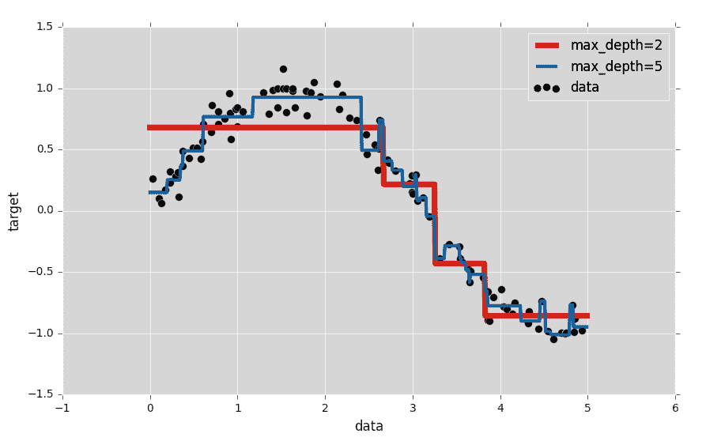
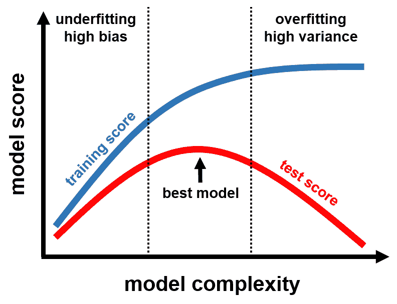
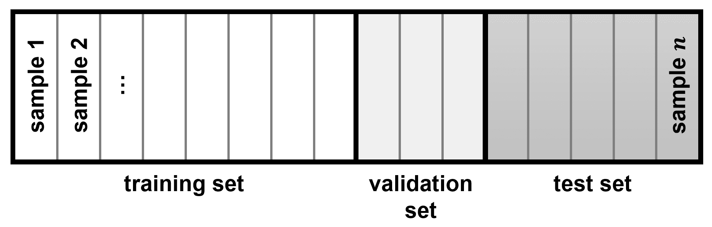
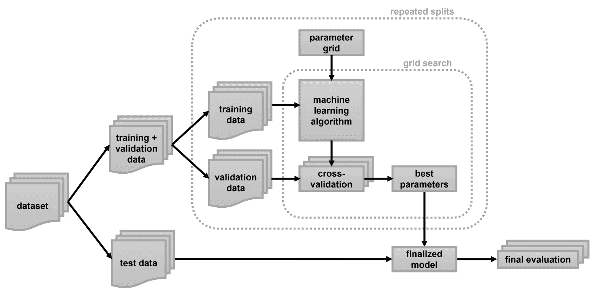

# 使用超参数调整选择合适的模型

现在我们已经探索了各种机器学习算法，我相信你已经意识到，大多数算法都提供了大量的设置选项。这些设置或调整旋钮，所谓的**超参数**，帮助我们控制算法的行为，以便在尝试最大化性能时进行控制。

例如，我们可能想要选择决策树的深度或分割标准，或者在神经网络中调整神经元的数量。找到模型的重要参数值是一个棘手但几乎所有模型和数据集都必需的任务。

在本章中，我们将更深入地探讨**模型评估**和**超参数调整**。假设我们有两个不同的模型 ...

# 技术要求

您可以从以下链接获取本章的代码：[`github.com/PacktPublishing/Machine-Learning-for-OpenCV-Second-Edition/tree/master/Chapter11`](https://github.com/PacktPublishing/Machine-Learning-for-OpenCV-Second-Edition/tree/master/Chapter11)。

这里是软件和硬件要求的一个总结：

+   您需要 OpenCV 版本 4.1.x（4.1.0 或 4.1.1 都完全可以）。

+   您需要 Python 版本 3.6（任何 3.x 版本的 Python 都行）。

+   您需要 Anaconda Python 3 来安装 Python 和所需的模块。

+   您可以使用任何操作系统——macOS、Windows 以及基于 Linux 的操作系统，与本书一起使用。我们建议您的系统至少有 4GB 的 RAM。

+   您不需要拥有 GPU 来运行本书附带提供的代码。

# 评估模型

模型评估策略形式多样。因此，在接下来的章节中，我们将重点介绍三种最常用的技术，用于比较模型之间的差异：

+   k 折交叉验证

+   自举

+   麦克尼马尔测试

原则上，模型评估很简单：在某个数据集上训练一个模型后，我们可以通过将模型预测与某些真实值进行比较来估计其有效性。我们很早就了解到应该将数据分为训练集和测试集，并且尽可能遵循这一指示。但为什么我们再次这样做呢？

# 错误评估模型的方法

我们从未在训练集上评估模型的原因是，原则上，如果我们向任何数据集投入足够强大的模型，任何数据集都可以被学习。

可以通过 Iris 数据集的快速演示来展示这一点，我们在第三章“监督学习的第一步”中详细讨论了它。在那里，目标是根据物理尺寸对鸢尾花物种进行分类。我们可以使用 scikit-learn 加载 Iris 数据集：

```py
In [1]: from sklearn.datasets import load_iris
...     iris = load_iris()
```

对于这个问题的一个天真方法是，将所有数据点存储在矩阵`X`中，所有类别标签存储在向量`y`中：

```py
In [2]: import numpy as np
...     X = iris.data.astype(np.float32)
...     y = iris.target
```

接下来，我们选择一个模型及其超参数。例如，让我们使用第三章中的算法，*监督学习的第一步*，它只提供了一个超参数：邻居的数量，*k*。当*k=1*时，我们得到一个非常简单的模型，它将未知点的标签分类为其最近邻所属的同一类别。

在以下步骤中，你将学习如何构建一个**k-最近邻**（**k-NN**）模型并计算其准确率：

1.  在 OpenCV 中，kNN 实例化如下：

```py
In [3]: import cv2
...     knn = cv2.ml.KNearest_create()
...     knn.setDefaultK(1)
```

1.  然后，我们训练模型并使用它来预测已知数据的标签：

```py
In [4]: knn.train(X, cv2.ml.ROW_SAMPLE, y)
...     _, y_hat = knn.predict(X)
```

1.  最后，我们计算正确标记点的比例：

```py
In [5]: from sklearn.metrics import accuracy_score
...     accuracy_score(y, y_hat)
Out[5]: 1.0
```

如我们所见，准确率分数是`1.0`，这表明我们的模型正确地标记了 100%的点。

如果一个模型在训练集上达到 100%的准确率，我们说该模型已经记住了数据。

但预期的准确率真的被测量了吗？我们是否提出了一个我们期望 100%正确率的模型？

如你所可能推测的，答案是否定的。这个例子表明，即使是简单的算法也能够记住现实世界的数据集。想象一下，对于深度神经网络来说，这项任务是多么容易！通常，模型具有的参数越多，它的能力就越强。我们很快就会回到这一点。

# 正确评估模型

可以通过使用所谓的测试集来更好地了解模型的表现，但你已经知道了这一点。当面对从训练过程中分离出来的数据时，我们可以检查模型是否已经学会了数据中的一些跨领域的依赖关系，或者它只是记住了训练集。

我们可以使用来自 scikit-learn 的`model_selection`模块中的熟悉函数`train_test_split`将数据分为训练集和测试集：

```py
In [6]: from sklearn.model_selection import train_test_split
```

但我们如何选择正确的训练-测试比例？是否存在这样一个正确的比例？或者这是模型的一个超参数？

这里存在两个相互竞争的考虑因素：

+   如果我们的 ...

# 选择最佳模型

当一个模型表现不佳时，通常不清楚如何使其变得更好。在这本书中，我提出了一条经验法则，例如，如何选择神经网络中的层数。更糟糕的是，答案往往是反直觉的！例如，向网络中添加另一个层可能会使结果变得更差，而添加更多的训练数据可能根本不会改变性能。

你可以理解为什么这些问题是机器学习最重要的方面之一。最终，确定哪些步骤会或不会提高我们的模型的能力，这是区分成功的机器学习实践者和其他人的关键。

让我们来看一个具体的例子。记得第五章，*使用决策树进行医疗诊断*，在那里我们使用了决策树进行回归任务？我们拟合了两个不同的树到正弦函数上——一个深度为 2，一个深度为 5。作为提醒，回归结果看起来是这样的：



应该很明显，这两种拟合都不是特别好。然而，两个决策树以两种不同的方式失败了！

深度为 2 的决策树（前一张截图中的粗线）试图通过数据拟合四条直线。因为数据本质上比几条直线更复杂，所以这个模型失败了。我们可以尽可能多地训练它，在尽可能多的训练样本上训练它——它永远无法很好地描述这个数据集。这样的模型被称为欠拟合数据。换句话说，模型没有足够的复杂性来解释数据中的所有特征。因此，这个模型具有很高的偏差。

另一个决策树（细线，深度 5）犯了一个不同的错误。这个模型有足够的灵活性，几乎完美地解释了数据中的细微结构。然而，在某些点上，模型似乎遵循了噪声的特定模式；我们添加到正弦函数中，而不是正弦函数本身。您可以在图表的右侧看到这一点，那里蓝色曲线（细线）会有很多波动。这样的模型被称为过度拟合数据。换句话说，模型过于复杂，最终解释了数据中的随机误差。因此，这个模型具有很高的方差。

简而言之——这是秘密配方：从根本上说，选择正确的模型归结为在偏差和方差之间找到一个甜蜜点。

模型的灵活性（也称为**模型复杂性**）主要是由其超参数决定的。这就是为什么调整它们如此重要的原因！

让我们回到 kNN 算法和鸢尾花数据集。如果我们对所有可能的*k*值重复拟合模型的程序，并计算训练和测试分数，我们预计结果将类似于以下内容：



上一张图片显示了模型分数作为模型复杂度的函数。如果我想让您从这一章记住一件事，那将是这张图。让我们来分析一下。

图表描述了模型得分（无论是训练分数还是测试分数）作为模型复杂度的函数。正如前面图表中提到的，神经网络的模型复杂度大致与网络中的神经元数量成正比。在 kNN 的情况下，逻辑相反——*k*的值越大，决策边界越平滑，因此复杂度越低。换句话说，*k=1*的 kNN 在前面图表中会完全位于最右侧，即训练分数完美。难怪我们在训练集上得到了 100%的准确率！

从前面图表中，我们可以得出结论，模型复杂度景观中有三个阶段：

+   非常低的模型复杂度（高偏差模型）会欠拟合训练数据。在这个阶段，无论我们训练多长时间，模型在训练集和测试集上的得分都很低。

+   复杂度非常高的模型（或高方差）会过度拟合训练数据，这表明模型可以很好地预测训练数据，但在未见过的数据上失败。在这个阶段，模型已经开始学习只出现在训练数据中的复杂细节或特殊性。由于这些特殊性不适用于未见过的数据，训练分数会越来越低。

+   对于某个中间值，测试分数达到最大。我们正在寻找的就是这个中间阶段，即测试分数达到最大值。这是偏差和方差权衡中的最佳点！

这意味着我们可以通过绘制模型复杂度景观图来找到当前任务的最佳算法。具体来说，我们可以使用以下指标来了解我们目前处于哪个阶段：

+   如果训练分数和测试分数都低于我们的预期，我们可能处于前面图表中最左侧的阶段，即模型欠拟合数据。在这种情况下，一个好的想法可能是增加模型复杂度并再次尝试。

+   如果训练分数远高于测试分数，我们可能处于前面图表中最右侧的阶段，即模型过度拟合数据。在这种情况下，一个好的想法可能是降低模型复杂度并再次尝试。

尽管这个程序在一般情况下是有效的，但还有更复杂的模型评估策略，这些策略比简单的训练-测试分割更全面，我们将在接下来的章节中讨论。

# 理解交叉验证

交叉验证是一种评估模型泛化性能的方法，通常比将数据集分为训练集和测试集的方法更稳定、更全面。

最常用的交叉验证版本是**k 折交叉验证**，其中*k*是用户指定的数字（通常是五或十）。在这里，数据集被分成*k*个大小大致相等的部分，称为**折**。对于一个包含*N*个数据点的数据集，每个折应该大约有*N / k*个样本。然后，在数据上训练一系列模型，使用*k - 1*个折进行训练，剩余的一个折进行测试。这个过程重复*k*次迭代，每次选择不同的折进行...

# 在 OpenCV 中手动实现交叉验证

在 OpenCV 中执行交叉验证的最简单方法是手动进行数据分割。

例如，要实现两折交叉验证，我们会执行以下程序：

1.  加载数据集：

```py
      In [1]: from sklearn.datasets import load_iris
      ...     import numpy as np
      ...     iris = load_iris()
      ...     X = iris.data.astype(np.float32)
      ...     y = iris.target
```

1.  将数据分成两个大小相等的部分：

```py
      In [2]: from sklearn.model_selection import model_selection
      ...     X_fold1, X_fold2, y_fold1, y_fold2 = train_test_split(
      ...         X, y, random_state=37, train_size=0.5
      ...     )
```

1.  实例化分类器：

```py
      In [3]: import cv2
      ...     knn = cv2.ml.KNearest_create()
      ...     knn.setDefaultK(1)
```

1.  在第一个折上训练分类器，然后预测第二个折的标签：

```py
      In [4]: knn.train(X_fold1, cv2.ml.ROW_SAMPLE, y_fold1)
      ...     _, y_hat_fold2 = knn.predict(X_fold2)
```

1.  在第二个折上训练分类器，然后预测第一个折的标签：

```py
      In [5]: knn.train(X_fold2, cv2.ml.ROW_SAMPLE, y_fold2)
      ...     _, y_hat_fold1 = knn.predict(X_fold1)
```

1.  计算两个折的准确度分数：

```py
      In [6]: from sklearn.metrics import accuracy_score
      ...     accuracy_score(y_fold1, y_hat_fold1)
      Out[6]: 0.92000000000000004
      In [7]: accuracy_score(y_fold2, y_hat_fold2)
      Out[7]: 0.88
```

这个过程将产生两个准确度分数，一个用于第一个折（92%的准确度）和一个用于第二个折（88%的准确度）。因此，我们的分类器在未见过的数据上平均实现了 90%的准确度。

# 使用 scikit-learn 进行 k 折交叉验证

在 scikit-learn 中，交叉验证可以分三步进行：

1.  加载数据集。由于我们之前已经做了这个操作，所以我们不需要再次进行。

1.  实例化分类器：

```py
      In [8]: from sklearn.neighbors import KNeighborsClassifier      ...     model = KNeighborsClassifier(n_neighbors=1)
```

1.  使用`cross_val_score`函数进行交叉验证。此函数接受一个模型、完整的数据集（`X`）、目标标签（`y`）以及表示折数（`cv`）的整数值。不需要手动分割数据——该函数会根据折数自动进行。交叉验证完成后，该函数返回测试分数：

```py
 In [9]: from sklearn.model_selection ...
```

# 实现留一法交叉验证

另一种流行的实现交叉验证的方法是选择与数据集中数据点数量相等的折数。换句话说，如果有*N*个数据点，我们将*k=N*。这意味着我们最终需要进行*N*次交叉验证迭代，但在每次迭代中，训练集将只包含一个数据点。这种过程的优点是我们可以使用除了一个数据点之外的所有数据点进行训练。因此，这种方法也被称为**留一法交叉验证**。

在 scikit-learn 中，此功能由`model_selection`模块中的`LeaveOneOut`方法提供：

```py
In [11]: from sklearn.model_selection import LeaveOneOut
```

此对象可以直接按以下方式传递给`cross_val_score`函数：

```py
In [12]: scores = cross_val_score(model, X, y, cv=LeaveOneOut())
```

由于每个测试集现在都包含一个数据点，我们预计评分器将返回 150 个值——对应于数据集中的每个数据点。我们得到的每个点可能是正确的或错误的。因此，我们预计`scores`将是一个包含`1`和`0`的列表，分别对应于正确的和错误的分类：

```py
In [13]: scores
Out[13]: array([ 1., 1., 1., 1., 1., 1., 1., 1., 1., 1., 1., 1., 1.,
                 1., 1., 1., 1., 1., 1., 1., 1., 1., 1., 1., 1., 1.,
                 1., 1., 1., 1., 1., 1., 1., 1., 1., 1., 1., 1., 1.,
                 1., 1., 1., 1., 1., 1., 1., 1., 1., 1., 1., 1., 1.,
                 1., 1., 1., 1., 1., 1., 1., 1., 1., 1., 1., 1., 1.,
                 1., 1., 1., 1., 1., 0., 1., 0., 1., 1., 1., 1., 1.,
                 1., 1., 1., 1., 1., 0., 1., 1., 1., 1., 1., 1., 1.,
                 1., 1., 1., 1., 1., 1., 1., 1., 1., 1., 1., 1., 1.,
                 1., 1., 0., 1., 1., 1., 1., 1., 1., 1., 1., 1., 1.,
                 1., 1., 0., 1., 1., 1., 1., 1., 1., 1., 1., 1., 1.,
                 1., 1., 1., 0., 1., 1., 1., 1., 1., 1., 1., 1., 1.,
                 1., 1., 1., 1., 1., 1., 1.])
```

如果我们想了解分类器的平均性能，我们仍然会计算分数的平均值和标准差：

```py
In [14]: scores.mean(), scores.std()
Out[14]: (0.95999999999999996, 0.19595917942265423)
```

我们可以看到这种评分方案返回的结果与五折交叉验证非常相似。

你可以在[`scikit-learn.org/stable/modules/cross_validation.html`](http://scikit-learn.org/stable/modules/cross_validation.html)了解更多关于其他有用的交叉验证过程。

# 使用自助法估计鲁棒性

与 k 折交叉验证的另一种方法是**自助法**。

与将数据分割成折不同，自助法通过从数据集中随机抽取样本来构建训练集。通常，自助法是通过替换抽取样本形成的。想象一下将所有数据点放入一个袋子，然后从袋子中随机抽取。抽取一个样本后，我们会将其放回袋子中。这允许某些样本在训练集中出现多次，这是交叉验证不允许的。

然后将分类器测试在所有不属于自助法的样本上（所谓的**袋外**示例），并重复进行大量次 ...

# 在 OpenCV 中手动实现自助法

自助法可以通过以下步骤实现：

1.  加载数据集。由于我们之前已经这样做过了，所以我们不需要再次进行。

1.  实例化分类器：

```py
      In [15]: knn = cv2.ml.KNearest_create()
      ...      knn.setDefaultK(1)
```

1.  从包含*N*个样本的数据集中，随机选择*N*个样本进行替换以形成自助法。这可以通过 NumPy 的`random`模块中的`choice`函数最简单地完成。我们告诉函数从`[0, len(X)-1]`范围内抽取`len(X)`个样本，并替换（`replace=True`）。然后函数返回一个索引列表，我们据此形成我们的自助法：

```py
      In [16]: idx_boot = np.random.choice(len(X), size=len(X),
      ...                                  replace=True)
      ...      X_boot = X[idx_boot, :]
      ...      y_boot = y[idx_boot]
```

1.  将所有未出现在自助法中的样本放入袋外集：

```py
      In [17]: idx_oob = np.array([x not in idx_boot
      ...      for x in np.arange(len(X))],dtype=np.bool)
      ...      X_oob = X[idx_oob, :]
      ...      y_oob = y[idx_oob]
```

1.  在自助法样本上训练分类器：

```py
      In [18]: knn.train(X_train, cv2.ml.ROW_SAMPLE, y_boot)
      Out[18]: True
```

1.  在袋外样本上测试分类器：

```py
      In [19]: _, y_hat = knn.predict(X_oob)
      ...      accuracy_score(y_oob, y_hat)
      Out[19]: 0.9285714285714286
```

1.  对特定次数的迭代重复*步骤 3-6*。

1.  自助法的迭代。重复这些步骤多达 10,000 次以获得 10,000 个准确度分数，然后平均这些分数以了解分类器的平均性能。

为了方便起见，我们可以从*步骤 3*-*6*构建一个函数，以便于运行`n_iter`次数的迭代过程。我们还传递一个模型（我们的 kNN 分类器，`model`）、特征矩阵（`X`）和包含所有类别标签的向量（`y`）：

```py
In [20]: def yield_bootstrap(model, X, y, n_iter=10000):
...          for _ in range(n_iter):
```

`for`循环内的步骤本质上是从前面提到的代码中的*步骤 3*-*6*。这涉及到在自助法上训练分类器并在袋外示例上测试它：

```py
...              # train the classifier on bootstrap
...              idx_boot = np.random.choice(len(X), size=len(X),
...                                          replace=True)
...              X_boot = X[idx_boot, :]
...              y_boot = y[idx_boot]
...              knn.train(X_boot, cv2.ml.ROW_SAMPLE, y_boot)
... 
...              # test classifier on out-of-bag examples
...              idx_oob = np.array([x not in idx_boot
...                                  for x in np.arange(len(X))],
...                                 dtype=np.bool)
...              X_oob = X[idx_oob, :]
...              y_oob = y[idx_oob]
...              _, y_hat = knn.predict(X_oob)
```

然后，我们需要返回准确率分数。你可能在这里期望一个`return`语句。然而，更优雅的方法是使用`yield`语句，这会自动将函数转换为生成器。这意味着我们不需要初始化一个空列表（`acc = []`），然后在每次迭代中追加新的准确率分数（`acc.append(accuracy_score(...))`）。记录工作会自动完成：

```py
...              yield accuracy_score(y_oob, y_hat)
```

为了确保我们得到相同的结果，让我们固定随机数生成器的种子：

```py
In [21]: np.random.seed(42)
```

现在，让我们通过将函数输出转换为列表来运行`n_iter=10`次的程序：

```py
In [22]: list(yield_bootstrap(knn, X, y, n_iter=10))
Out[22]: [0.98333333333333328,
          0.93650793650793651,
          0.92452830188679247,
          0.92307692307692313,
          0.94545454545454544,
          0.94736842105263153,
          0.98148148148148151,
          0.96078431372549022,
          0.93220338983050843,
          0.96610169491525422]
```

如你所见，对于这个小样本，我们得到的准确率分数在 92%到 98%之间。为了更可靠地估计模型性能，我们重复该程序 1,000 次，并计算结果的均值和标准差：

```py
In [23]: acc = list(yield_bootstrap(knn, X, y, n_iter=1000))
...      np.mean(acc), np.std(acc)
Out[23]: (0.95524155136419198, 0.022040380995646654)
```

你随时可以增加重复次数。但一旦`n_iter`足够大，该程序应该对采样过程的随机性具有鲁棒性。在这种情况下，我们预计随着我们将`n_iter`增加到例如 10,000 次迭代，分数值的分布不会发生更多变化：

```py
In [24]: acc = list(yield_bootstrap(knn, X, y, n_iter=10000))
...      np.mean(acc), np.std(acc)
Out[24]: (0.95501528733009422, 0.021778543317079499)
```

通常，使用自助法得到的分数会在**统计检验**中用来评估我们结果的**显著性**。让我们看看这是如何操作的。

# 评估我们结果的显著性

假设我们为我们的 kNN 分类器的两个版本实现了交叉验证程序。得到的测试分数是——模型 A 为 92.34%，模型 B 为 92.73%。我们如何知道哪个模型更好？

根据这里介绍的逻辑，我们可能会支持模型 B，因为它有更好的测试分数。但如果两个模型没有显著差异呢？这可能有两个潜在原因，这两个原因都是我们测试程序随机性的结果：

+   就我们所知，模型 B 可能只是运气好。也许我们在交叉验证程序中选择了非常低的 k 值。也许模型 B 最终得到了一个有益的训练-测试分割，使得模型在分类时没有问题...

# 实现 Student 的 t 检验

最著名的统计检验之一是**Student 的 t 检验**。你可能之前听说过它：它允许我们确定两组数据是否显著不同。这对威廉·西利·高斯来说非常重要，他是这项测试的发明者，他在 Guinness 酿酒厂工作，想知道两批黑啤的质量是否有所不同。

注意，“Student”在这里是大写的。尽管高斯因公司政策不允许发表他的测试，但他还是以笔名 Student 发表了。

在实践中，t 检验允许我们确定两个数据样本是否来自具有相同均值或**期望值**的潜在分布。

对于我们的目的来说，这意味着我们可以使用 t 检验来确定两个独立分类器的测试分数是否有相同的平均值。我们首先假设两组测试分数是相同的。我们称这个假设为*零假设*，因为这是我们想要消除的假设，也就是说，我们正在寻找证据来*拒绝*这个假设，因为我们想确保一个分类器比另一个分类器显著更好。

我们根据 t 检验返回的称为**p 值**的参数来接受或拒绝零假设。p 值介于`0`和`1`之间。p 值为`0.05`意味着零假设只在 100 次中有 5 次是正确的。因此，一个小的 p 值表明有强有力的证据可以安全地拒绝假设。通常，我们使用*p=0.05*作为拒绝零假设的截止值。

如果这听起来太复杂，可以这样想：当我们运行 t 检验来比较分类器的测试分数时，我们希望获得一个小的 p 值，因为这意味着两个分类器给出了显著不同的结果。

我们可以使用 SciPy 的`ttest_ind`函数从`stats`模块来实现 Student 的 t 检验：

```py
In [25]: from scipy.stats import ttest_ind
```

让我们从简单的例子开始。假设我们对两个分类器进行了五折交叉验证，并获得了以下分数：

```py
In [26]: scores_a = [1, 1, 1, 1, 1]
...      scores_b = [0, 0, 0, 0, 0]
```

这意味着模型 A 在所有五个折上都达到了 100%的准确率，而模型 B 则得到了 0%的准确率。在这种情况下，两个结果显然是显著不同的。如果我们对这个数据进行 t 检验，我们应该因此找到一个非常小的 p 值：

```py
In [27]: ttest_ind(scores_a, scores_b)
Out[27]: Ttest_indResult(statistic=inf, pvalue=0.0)
```

我们确实做到了！我们实际上得到了最小的可能的 p 值，*p=0.0*。

另一方面，如果两个分类器在除不同折之外的所有方面都得到了完全相同的数字，那会怎样？在这种情况下，我们预计这两个分类器将是等效的，这可以通过一个非常大的 p 值来表示：

```py
In [28]: scores_a = [0.9, 0.9, 0.9, 0.8, 0.8]
...      scores_b = [0.8, 0.8, 0.9, 0.9, 0.9]
...      ttest_ind(scores_a, scores_b)
Out[28]: Ttest_indResult(statistic=0.0, pvalue=1.0)
```

类似于上述情况，我们得到了最大的可能的 p 值，*p=1.0*。

为了看到更现实的情况，让我们回到之前例子中的 kNN 分类器。使用从十折交叉验证过程中获得的测试分数，我们可以使用以下程序比较两个不同的 kNN 分类器：

1.  获取模型 A 的一组测试分数。我们选择模型 A 作为之前提到的 kNN 分类器（*k=1*）：

```py
      In [29]: k1 = KNeighborsClassifier(n_neighbors=1)
      ...      scores_k1 = cross_val_score(k1, X, y, cv=10)
      ...      np.mean(scores_k1), np.std(scores_k1)
      Out[29]: (0.95999999999999996, 0.053333333333333323)
```

1.  获取模型 B 的一组测试分数。让我们选择模型 B 为一个 kNN 分类器，*k=3*：

```py
      In [30]: k3 = KNeighborsClassifier(n_neighbors=3)
      ...      scores_k3 = cross_val_score(k3, X, y, cv=10)
      ...      np.mean(scores_k3), np.std(scores_k3)
      Out[30]: (0.96666666666666656, 0.044721359549995787)
```

1.  对这两组分数应用 t 检验：

```py
      In [31]: ttest_ind(scores_k1, scores_k3)
      Out[31]: Ttest_indResult(statistic=-0.2873478855663425,
               pvalue=0.77712784875052965)
```

如您所见，这是一个很好的例子，两个分类器给出了不同的交叉验证分数（96.0%和 96.7%），结果却并不显著不同！因为我们得到了一个大的 p 值（*p=0.777*），我们预计这两个分类器中有 77 次是等效的。

# 实现 McNemar 的检验

一种更高级的统计技术是 **McNemar 的测试**。这种测试可以用于成对数据，以确定两个样本之间是否存在任何差异。正如在 t-test 的情况下，我们可以使用 McNemar 的测试来确定两个模型是否给出了显著不同的分类结果。

McNemar 的测试操作在数据点的对上。这意味着我们需要知道，对于两个分类器，它们如何对每个数据点进行分类。基于第一个分类器正确分类但第二个分类器错误分类的数据点数量以及反之亦然，我们可以确定两个分类器是否等效。

假设先前的模型 A 和模型 B 都应用于相同的五个数据点。而模型 ...

# 使用网格搜索调整超参数

用于超参数调整最常用的工具是 *网格搜索*，这基本上是一个术语，意思是我们将尝试所有可能的参数组合，使用 `for` 循环。

让我们看看在实践中是如何做到这一点的。

# 实现简单的网格搜索

回到我们的 kNN 分类器，我们发现我们只有一个超参数需要调整：*k*。通常，你会有更多的开放参数可以调整，但 kNN 算法足够简单，我们可以手动实现网格搜索。

在我们开始之前，我们需要将数据集分割成训练集和测试集，就像我们之前做的那样：

1.  在这里，我们选择 75-25 的分割：

```py
In [1]: from sklearn.datasets import load_iris...     import numpy as np...     iris = load_iris()...     X = iris.data.astype(np.float32)...     y = iris.targetIn [2]: X_train, X_test, y_train, y_test = train_test_split(...          X, y, random_state=37...      )
```

1.  然后，目标是遍历所有可能的 *k* 值。当我们这样做的时候，我们希望保持 ...

# 理解验证集的价值

按照我们分割数据为训练集和测试集的最佳实践，我们可能会告诉人们我们已经找到了一个在数据集上表现达到 97.4% 准确率的模型。然而，我们的结果可能并不一定推广到新数据。这个论点与本书前面提到的相同，当我们保证需要独立的评估数据集时，我们需要进行训练-测试分割。

然而，当我们上一节实现了网格搜索时，我们使用了测试集来评估网格搜索的结果并更新超参数，*k*。这意味着我们不能再使用测试集来评估最终数据！基于测试集准确率所做的任何模型选择都会导致测试集信息泄露到模型中。

解决这种数据的一种方法是将数据再次分割并引入所谓的 **验证集**。验证集与训练集和测试集不同，并且仅用于选择模型的最佳参数。在验证集上进行所有探索性分析和模型选择是一种良好的实践，并保留一个单独的测试集，该测试集仅用于最终评估。

换句话说，我们应该将数据分成三个不同的集合：

+   **训练集**，用于构建模型

+   **验证集**，用于选择模型的参数

+   **测试集**，用于评估最终模型的性能

以下图表展示了这种三方分割：



上述图表展示了如何将数据集分为训练集、验证集和测试集的示例。在实践中，三方分割通常分为两个步骤：

1.  将数据分成两部分：一部分包含训练集和验证集，另一部分包含测试集：

```py
      In [6]: X_trainval, X_test, y_trainval, y_test =
      ...        train_test_split(X, y, random_state=37)
      In [7]: X_trainval.shape
      Out[7]: (112, 4)
```

1.  再次将`X_trainval`分割成合适的训练集和验证集：

```py
      In [8]: X_train, X_valid, y_train, y_valid = train_test_split(
      ...         X_trainval, y_trainval, random_state=37
      ...     )
      In [9]: X_train.shape
      Out[9]: (84, 4)
```

然后，我们重复执行前面的手动网格搜索，但这次，我们将使用验证集来找到最佳的*k*（见代码高亮）：

```py
In [10]: best_acc = 0.0
...      best_k = 0
...      for k in range(1, 20):
...          knn = cv2.ml.KNearest_create()
...          knn.setDefaultK(k)
...          knn.train(X_train, cv2.ml.ROW_SAMPLE, y_train)
...          _, y_valid_hat = knn.predict(X_valid)
...          acc = accuracy_score(y_valid, y_valid_hat)
...          if acc >= best_acc:
...              best_acc = acc
...              best_k = k
...      best_acc, best_k
Out[10]: (1.0, 7)
```

我们现在发现，使用*k=7*（`best_k`）可以达到 100%的验证分数（`best_acc`）！然而，请记住，这个分数可能过于乐观。为了了解模型的实际性能，我们需要在测试集的保留数据上对其进行测试。

为了得到最终的模型，我们可以使用在网格搜索中找到的*k*值，并在训练集和验证集上重新训练模型。这样，我们在构建模型时尽可能多地使用了数据，同时仍然遵守了训练-测试分割原则。

这意味着我们应该在包含训练集和验证集的`X_trainval`上重新训练模型，并在测试集上对其进行评分：

```py
In [25]: knn = cv2.ml.KNearest_create()
...      knn.setDefaultK(best_k)
...      knn.train(X_trainval, cv2.ml.ROW_SAMPLE, y_trainval)
...      _, y_test_hat = knn.predict(X_test)
...      accuracy_score(y_test, y_test_hat), best_k
Out[25]: (0.94736842105263153, 7)
```

通过这个流程，我们在测试集上找到了令人印象深刻的 94.7%准确率。因为我们遵守了训练-测试分割原则，现在我们可以确信，这就是当分类器应用于新数据时我们可以期望的性能。虽然它没有验证阶段报告的 100%准确率高，但这仍然是一个非常不错的分数！

# 将网格搜索与交叉验证相结合

我们刚刚实施的网格搜索的一个潜在危险是，结果可能相对敏感于我们如何具体分割数据。毕竟，我们可能意外地选择了一个将大多数易于分类的数据点放在测试集中的分割，导致分数过于乐观。虽然一开始我们会很高兴，但一旦我们尝试在新的保留数据上使用该模型，我们会发现分类器的实际性能远低于预期。

相反，我们可以将网格搜索与交叉验证相结合。这样，数据会在网格搜索的每一步被多次分割成训练集和验证集，并在每个步骤上执行交叉验证来评估……

# 将网格搜索与嵌套交叉验证相结合

尽管带有交叉验证的网格搜索可以使得模型选择过程更加稳健，但你可能已经注意到我们仍然只进行了一次将数据集分为训练集和验证集的操作。因此，我们的结果可能仍然过于依赖于数据的精确训练-验证分割。

我们可以进一步将数据一次分为训练集和验证集，并使用多个分割进行交叉验证。这将导致所谓的**嵌套交叉验证**，其过程在下图中说明：



在嵌套交叉验证中，有一个外层循环遍历网格搜索框，反复将数据分为训练集和验证集。对于这些分割中的每一个，都会运行一次网格搜索，并返回一组最佳参数值。然后，对于每个外部分割，我们使用最佳设置得到一个测试分数。

在许多参数和大数据集上运行网格搜索可能会非常计算密集。在特定的交叉验证分割上的特定参数设置可以完全独立于其他参数设置和模型进行。因此，对于网格搜索和交叉验证，跨多个 CPU 核心或集群的并行化非常重要。

现在我们知道了如何找到模型的最佳参数，让我们更详细地看看我们可以用来评分模型的不同评估指标。

# 使用不同的评估指标评分模型

到目前为止，我们使用准确率（正确分类样本的分数）评估分类性能，使用 R²评估回归性能。然而，这些只是许多可能的总结监督模型在给定数据集上表现良好的方法之一。在实践中，这些评估指标可能不适合我们的应用，因此在选择模型和调整参数时选择正确的指标非常重要。

在选择指标时，我们应始终牢记机器学习应用的最终目标。在实践中，我们通常不仅对做出准确的预测感兴趣，而且希望将这些预测作为更大系统的一部分 ...

# 选择正确的分类指标

我们在第三章，“监督学习的第一步”中讨论了几个重要的评分函数。在分类的最基本指标中包括以下内容：

+   **准确率**：这计算测试集中被正确预测的数据点的数量，并将其作为测试集大小的分数返回（`sklearn.metrics.accuracy_score`）。这是分类器最基本的成绩函数，我们在整本书中广泛使用了它。

+   **精确率**：这描述了分类器不将正样本标记为负样本的能力（`sklearn.metrics.precision_score`）。

+   **召回率** **（或灵敏度）**：这描述了分类器检索所有正样本的能力（`sklearn.metrics.recall_score`）。

虽然精确度和召回率是重要的度量，但只看其中一个并不能给我们一个对整体情况的良好理解。总结这两个度量的一种方法被称为**f 分数**或**f 度量**（`sklearn.metrics.f1_score`），它计算精确度和召回率的调和平均值，即*2(精确度 x 召回率) / (精确度 + 召回率)*。

有时候我们需要做的不仅仅是最大化准确性。例如，如果我们在一个商业应用中使用机器学习，那么决策应该由业务目标驱动。这些目标之一可能保证至少 90%的召回率。那么挑战就变成了开发一个模型，它仍然具有合理的准确性，同时满足所有次要要求。设定这样的目标通常被称为**设定操作点**。

然而，在开发新系统时，往往不清楚操作点应该是什么。为了更好地理解问题，重要的是要调查所有可能的精确度和召回率的权衡，并一次性记录下来。这可以通过一个名为**精确度-召回率曲线**（`sklearn.metrics.precision_recall_curve`）的工具来实现。

分析分类器行为的另一个常用工具是**接收者操作特征**（**ROC**）曲线。

ROC 曲线考虑了给定分类器的所有可能阈值，类似于精确度-召回率曲线，但它显示的是*假阳性率*与*真阳性率*之间的关系，而不是报告精确度和召回率。

# 选择合适的回归度量

回归的评估可以像我们在分类中做的那样进行详细的评估。在第三章，*监督学习的第一步*中，我们也讨论了一些回归的基本度量：

+   **均方误差**：回归问题中最常用的误差度量是测量训练集中每个数据点的预测值和真实目标值之间的平方误差，并对所有数据点进行平均（`sklearn.metrics.mean_squared_error`）。

+   **解释方差**：一个更复杂的度量是测量模型可以解释测试数据变异或分散的程度（`sklearn.metrics.explained_variance_score`）。通常，解释方差的量是通过...来测量的。

# 将算法链接起来形成管道

我们迄今为止讨论的大多数机器学习问题至少包括一个预处理步骤和一个分类步骤。问题越复杂，这个*处理链*可能就越长。一个方便的方法是将多个处理步骤粘合在一起，甚至使用`Pipeline`类从 scikit-learn 中进行网格搜索。

# 在 scikit-learn 中实现管道

`Pipeline`类本身具有`fit`、`predict`和`score`方法，这些方法的行为与 scikit-learn 中的任何其他估算器完全一样。`Pipeline`类的最常见用法是将不同的预处理步骤与一个监督模型（如分类器）一起串联。

让我们回到第五章中的乳腺癌数据集，*使用决策树进行医疗诊断*。使用 scikit-learn，我们导入数据集并将其分为训练集和测试集：

```py
In [1]: from sklearn.datasets import load_breast_cancer...     import numpy as np...     cancer = load_breast_cancer()...     X = cancer.data.astype(np.float32)...     y = cancer.targetIn [2]: X_train, X_test, y_train, y_test = train_test_split(... X, y, random_state=37 ...
```

# 在网格搜索中使用管道

在网格搜索中使用管道的方式与使用任何其他估算器相同。

我们定义一个参数网格进行搜索，并从管道和参数网格中构建`GridSearchCV`。然而，在指定参数网格时，有一个细微的变化。我们需要指定每个参数属于管道的哪个步骤。我们想要调整的参数`C`和`gamma`都是`SVC`的参数。在前一节中，我们给这个步骤命名为`"svm"`。为管道定义参数网格的语法是，为每个参数指定步骤名称，然后是`__`（双下划线），然后是参数名称。

因此，我们将构建以下参数网格：

```py
In [8]: param_grid = {'svm__C': [0.001, 0.01, 0.1, 1, 10, 100],
...                   'svm__gamma': [0.001, 0.01, 0.1, 1, 10, 100]}
```

使用这个参数网格，我们可以像往常一样使用`GridSearchCV`：

```py
In [9]: grid = GridSearchCV(pipe, param_grid=param_grid, cv=10)
...     grid.fit(X_train, y_train);
```

网格搜索中的最佳分数存储在`best_score_`中：

```py
In [10]: grid.best_score_
Out[10]: 0.97652582159624413
```

同样，最佳参数存储在`best_params_`中：

```py
In [11]: grid.best_params_
Out[11]: {'svm__C': 1, 'svm__gamma': 1}
```

但请记住，交叉验证的分数可能过于乐观。为了了解分类器的真实性能，我们需要在测试集上对其进行评分：

```py
In [12]: grid.score(X_test, y_test)
Out[12]: 0.965034965034965
```

与我们之前做的网格搜索相比，现在，对于交叉验证的每个分割，`MinMaxScaler`仅使用训练分割进行重新拟合，并且测试分割的信息不会泄露到参数搜索中。

这使得构建一个将各种步骤串联起来的管道变得非常简单！你可以在管道中随意混合和匹配估算器，只需确保管道中的每个步骤都提供了一个`transform`方法（除了最后一个步骤）。这允许管道中的估算器生成数据的新表示，反过来，这个新表示可以用作下一个步骤的输入。

`Pipeline`类不仅限于预处理和分类，实际上可以连接任意数量的估算器。例如，我们可以构建一个包含特征提取、特征选择、缩放和分类的管道，总共有四个步骤。同样，最后一个步骤可以是回归或聚类而不是分类。

# 摘要

在本章中，我们试图通过讨论模型选择和超参数调整的最佳实践来补充我们现有的机器学习技能。你学习了如何使用网格搜索和交叉验证在 OpenCV 和 scikit-learn 中调整模型的超参数。我们还讨论了广泛的评估指标以及如何将算法链接到一个管道中。现在，你几乎准备好开始独立解决一些实际问题了。

在下一章中，你将接触到一项既令人兴奋又全新的主题，那就是 OpenVINO 工具包，它是 OpenCV 4.0 中的关键发布之一。
