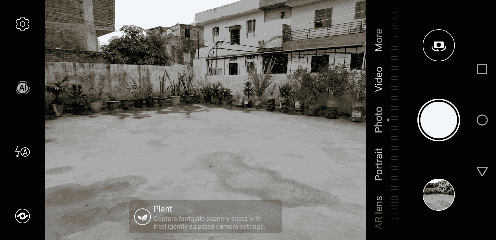
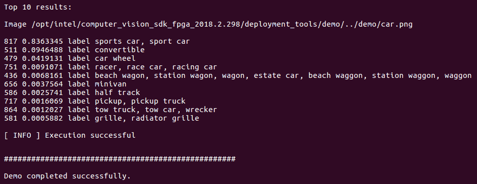
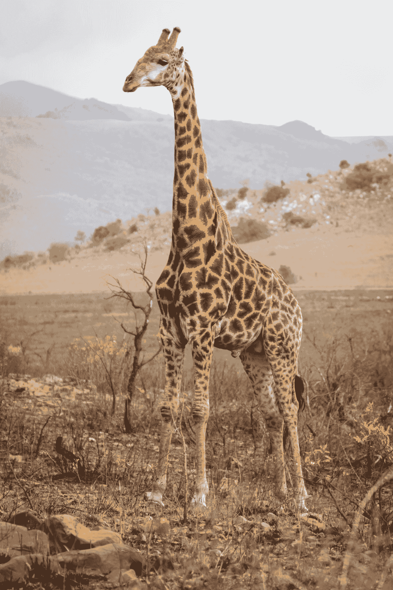

# 使用 OpenVINO 与 OpenCV

在第一章中，我们讨论了 OpenCV 4.0 版本中的各种新功能。值得注意的是，OpenVINO 工具包。值得注意的是，OpenVINO 工具包被嵌入式视觉联盟选为 2019 年开发者工具年度大奖。

在本章中，我们将专注于如何使用 OpenVINO 工具包与 OpenCV。我们将从安装 OpenVINO 工具包开始，然后进行交互式人脸检测演示。我们还将学习如何使用 OpenVINO 模型动物园与 OpenCV 以及 OpenVINO **推理引擎**（**IE**）与 OpenCV。在本章结束时，我们还将学习如何使用 OpenCV 和 OpenVINO IE 进行图像分类。

在本章中，我们将涵盖以下主题：

+   OpenVINO 工具包安装

+   交互式人脸检测演示

+   使用 OpenVINO 模型动物园与 OpenCV

+   使用 OpenVINO IE 与 OpenCV

+   使用 OpenVINO IE 进行 OpenCV 图像分类

# 技术要求

您可以在此链接中查看本章的代码：[`github.com/PacktPublishing/Machine-Learning-for-OpenCV-Second-Edition/tree/master/Chapter12`](https://github.com/PacktPublishing/Machine-Learning-for-OpenCV-Second-Edition/tree/master/Chapter12)。

这里是软件和硬件要求的总结：

+   您需要 OpenCV 版本 4.1.x（4.1.0 或 4.1.1 都可以正常工作）。

+   您需要 Python 3.6 版本（任何 3.x 版本的 Python 都可以）。

+   您需要 Anaconda Python 3 来安装 Python 和所需的模块。

+   您可以使用任何操作系统——macOS、Windows 和基于 Linux 的操作系统——使用这本书。我们建议您的系统至少有 4 GB 的 RAM。

+   您不需要 GPU 就可以运行本书提供的代码。

# OpenVINO 简介

**OpenVINO**（代表**Open Visual Inferencing and Neural Network Optimization**）。它旨在优化各种神经网络以加快推理阶段。推理，正如我们在前面的章节中讨论的，是使用训练好的神经网络生成未见输入数据的成果的过程。例如，如果一个网络被训练来分类狗或猫，那么如果我们提供 Tuffy（我们邻居的狗）的图像，它应该能够推断出该图像是狗的图像。

考虑到图像和视频在当今世界的普遍性，有很多深度神经网络被训练来执行各种操作，例如多标签分类和运动跟踪。世界上大多数推理都是在 CPU 上进行的，因为 GPU 非常昂贵，通常不适合个人 AI 工程师的预算。在这些情况下，OpenVINO 工具包提供的加速非常关键。

OpenVINO 工具包提供的加速包括两个步骤。第一步关注硬件规格；它使用随 OpenVINO 工具包一起提供的模型优化器以硬件无关的方式优化网络。下一步涉及使用 OpenVINO IE 的特定硬件加速。

OpenVINO 工具包是由英特尔开发的，英特尔以其优化的工具和硬件而闻名，专注于深度学习和人工智能。了解到 VPUs、GPU 和 FPGA 也由英特尔制造并不令人惊讶。

OpenVINO 还为 OpenCV 和 OpenVX 库提供了优化调用——这两个最著名的计算机视觉库。

# OpenVINO 工具包安装

在本节中，我们将使用英特尔官方说明来安装 OpenVINO 工具包：

1.  要开始，首先访问 OpenVINO 工具包下载页面（[`software.intel.com/en-us/openvino-toolkit/choose-download`](https://software.intel.com/en-us/openvino-toolkit/choose-download)），根据您的系统规格选择并下载安装程序。您必须首先注册工具包的副本。

1.  使用安装说明（[`docs.openvinotoolkit.org/latest/index.html`](https://docs.openvinotoolkit.org/latest/index.html)）在您的系统上安装 OpenVINO 工具包。

OpenVINO 工具包还将安装其自己的英特尔优化版本的 OpenCV。如果您已经在系统上安装了 OpenCV，安装程序将显示已安装了另一个版本的 OpenCV。最好是安装 ...

# OpenVINO 组件

OpenVINO 工具包包括以下主要组件：

+   **深度学习部署工具包**（**DLDT**）包括模型优化器、IE、预训练模型以及一些帮助您测量模型精度的工具。

+   有针对英特尔库（这些库也是经过优化的）编译的 OpenCV 优化版本。

+   有 OpenCL 库。

+   您将获得英特尔媒体 SDK 以加速视频处理。

+   也有针对 OpenVX 的优化版本。

# 交互式人脸检测演示

OpenVINO 工具包安装还提供了各种演示和示例应用程序。为了测试安装，让我们看看我们是否可以运行交互式人脸检测演示。

首先，我们将移动到 `deployment_tools/inference_engine` 文件夹中的 `samples` 目录。在这里，您可以找到各种演示应用程序，例如图像分类和推理管道。

交互式人脸检测演示接受视频作为输入，并执行人脸检测以及年龄、性别、头部姿态、情绪和面部特征点检测。根据您要执行的类型的人脸检测，您可以使用以下预训练模型列表中的一个模型：

+   您可以使用以下方式仅进行人脸检测

# 使用 OpenVINO 推理引擎与 OpenCV

在前面的章节中，我们讨论了如何运行交互式人脸检测演示。那很好，但仍然存在的问题是如何利用 OpenVINO 的力量与您现有的 OpenCV 代码相结合。请注意，在这里，我们强调的是在代码中尽可能少地修改的情况下利用 OpenVINO 的优势。这非常重要，因为 OpenVINO 并未出现在 OpenCV 的早期版本中，包括更常用的版本 3.4.3。作为一个优秀的开发者，你的任务是确保你的程序支持尽可能多的系统和库。

幸运的是，我们只需一行代码就可以开始使用 OpenVINO 推理引擎对 OpenCV 模型的推理代码进行操作，如下面的代码片段所示：

```py
cv::dnn::setPreferableBackend(DNN_BACKEND_INFERENCE_ENGINE); // C++
setPreferableBackend(cv2.dnn.DNN_BACKEND_INFERENCE_ENGINE) # Python
```

就这样！在一个完整的示例中，你将这样使用它：

```py
net = cv2.dnn.readNetFromCaffe(prototxt,model)
net.setPreferableBackend(cv2.dnn.DNN_BACKEND_INFERENCE_ENGINE)
```

在这里，你可以使用读取你的神经网络的任何其他方法。在这种情况下，我们是从 `.prototxt` 和 `.caffemodel` 文件中读取 Caffe 模型。

类似地，在 C++ 的情况下，我们可以这样使用它：

```py
Net net = readNetFromCaffe(prototxt, model);
net.setPreferableBackend(DNN_BACKEND_INFERENCE_ENGINE);
```

# 使用 OpenVINO 模型库与 OpenCV

在前面的章节中，我们简要讨论了 OpenVINO 模型库以及如何使用 OpenVINO IE 与 OpenCV。在本节中，我们将更深入地了解模型库及其提供的功能。

OpenVINO 模型库是一个包含优化后的预训练模型的集合，可以直接导入 OpenVINO 进行推理。这一功能的重要性在于，OpenVINO 加速的主要原因是它用于推理的优化模型文件。其底层推理原理与大多数深度学习推理工具包和语言（如 OpenCV）相同。OpenCV 的 `dnn` 模块通过将其作为所有推理任务的后端默认选项来使用 OpenVINO 的这一加速原理。...

# 使用 OpenVINO 推理引擎进行图像分类的 OpenCV

本章我们将讨论的最后一个主题是使用 OpenCV 和 OpenVINO 推理引擎进行图像分类。

在我们深入细节之前，让我们简要地看一下图像分类问题。图像分类，也称为**图像识别**，是深度学习任务集的一部分，可能是最常见的一种。在这个任务中，一组图像作为输入提供给模型，模型输出输入图像的类别或标签。

这类的一个常见例子是**猫狗分类问题**，其中模型在大量猫和狗的图像上训练，然后在测试阶段，模型预测输入图像是猫还是狗的图像。

虽然这看起来可能是一个非常简单的问题，但在工业应用中，图像分类具有很大的重要性。例如，如果你的相机声称拥有 AI 功能，这意味着它可以识别图像中的物体，并相应地更改图像设置——无论是自然风景的图像还是 Instagram 上值得分享的食物照片。以下图像显示了 AI 手机摄像头的输出：



考虑我之前拍摄的房屋屋顶的图像。请注意，当相机切换到 AI 模式时，它能够检测到我在拍摄植物，并自动更改设置以匹配。所有这一切都只因为图像分类。现在，考虑一下，作为计算机视觉工程师的你，正在尝试训练一个模型，该模型可以识别图像是植物、瀑布还是人类。

如果你的模型无法在几毫秒内推断出图像的类别或标签，你投入的所有训练模型的努力都将白费。没有用户愿意等待几秒钟，让相机检测物体并更改设置。

这使我们回到了 OpenVINO 推理引擎的重要性。OpenVINO 有一个自己的图像分类工具包版本，可以如下使用。

# 使用 OpenVINO 进行图像分类

让我们看看我们如何使用 OpenVINO 安装目录中现有的图像分类演示：

1.  首先，移动到你的 OpenVINO 安装目录中的`deployment_tools/demo`目录。

1.  接下来，让我们在目录中已经存在的示例图像上运行图像分类：

```py
./demo_squeezenet_download_convert_run.sh
```

这是我的结果：



让我们再运行另一个使用相同图像的演示，即推理管道演示，它很好地展示了 OpenVINO 推理引擎的速度：

```py
./demo_security_barrier_camera.sh
```

这是输出图像：

由于我们正在使用相同的图像在 ...

# 使用 OpenCV 和 OpenVINO 进行图像分类

让我们首先使用 OpenCV 创建一个图像分类推理代码。由于我们只关心推理，我们将使用一个预训练的模型：

1.  首先，让我们下载 Caffe 模型文件，`deploy.prototxt`和`bvlc_reference_caffenet.caffemodel`，这些可以从伯克利视觉的仓库中获得（[`github.com/BVLC/caffe/tree/master/models/bvlc_reference_caffenet`](https://github.com/BVLC/caffe/tree/master/models/bvlc_reference_caffenet)）。确保你在当前工作目录中下载这两个文件。我们还需要一个包含提到的类别标签的文本文件。你可以从[`github.com/torch/tutorials/blob/master/7_imagenet_classification/synset_words.txt`](https://github.com/torch/tutorials/blob/master/7_imagenet_classification/synset_words.txt)获取它。

1.  让我们再使用一张长颈鹿的样本图像进行图像分类：



接下来，让我们开始编写使用 OpenCV 和 OpenVINO 进行图像分类的代码：

1.  让我们从导入一些模块开始：

```py
import numpy as np
import cv2
```

1.  接下来，让我们指定模型文件：

```py
image = cv2.imread("animal-barbaric-brown-1319515.jpg")
labels_file = "synset_words.txt"
prototxt = "deploy.prototxt"
caffemodel = "bvlc_reference_caffenet.caffemodel"

```

1.  现在，让我们从标签文本文件中读取标签：

```py
rows = open(labels_file).read().strip().split("\n")
classes = [r[r.find(" ") + 1:].split(",")[0] for r in rows]
```

1.  让我们指定我们将用于推理的后端：

```py
net = cv2.dnn.readNetFromCaffe(prototxt,caffemodel)
net.setPreferableBackend(cv2.dnn.DNN_BACKEND_INFERENCE_ENGINE)
net.setPreferableTarget(cv2.dnn.DNN_TARGET_CPU)
```

1.  让我们在输入图像上执行一些基本的图像处理：

```py
blob = cv2.dnn.blobFromImage(image,1,(224,224),(104,117,123))
```

1.  最后，让我们将此图像传递给模型并获取输出：

```py
net.setInput(blob)
predictions = net.forward()
```

1.  让我们获取我们传递给模型的 giraffe 图像的前 10 个预测结果：

```py
indices = np.argsort(predictions[0])[::-1][:5]
```

1.  最后，让我们显示前 10 个预测结果：

```py
for index in indices:
 print("label: {}, prob.: {:.5}".format(classes[index], predictions[0][index]))
```

意想不到的是，这里是我们获得的结果：

```py
label: cheetah, prob.: 0.98357
label: leopard, prob.: 0.016108
label: snow leopard, prob.: 7.2455e-05
label: jaguar, prob.: 4.5286e-05
label: prairie chicken, prob.: 3.8205e-05
```

注意，我们的模型认为我们作为输入传递的 `giraffe` 图像实际上是一张 `cheetah` 图像。你认为这是为什么？那是因为 `giraffe` 并不在我们拥有的类别列表中。因此，模型找到了最接近的匹配项，这是由于在猎豹和长颈鹿上都有相似的彩色斑点。所以，下次你进行图像分类时，请确保类别确实存在于标签列表中。

我们还可以比较各种后端，以查看使用 OpenVINO 推理引擎作为后端获得的速度提升。以下是实现方法。我们只需要更改前面代码中的一行：

```py
net.setPreferableBackend(cv2.dnn.DNN_BACKEND_INFERENCE_ENGINE)
```

我们可以在以下后端之间进行选择：

+   `cv2.dnn.DNN_BACKEND_DEFAULT`：如果你已安装 OpenVINO 并将其用作默认后端。

+   `cv2.dnn.DNN_BACKEND_HALIDE`：这需要使用 Halide 构建 OpenCV。你可以在[`docs.opencv.org/4.1.0/de/d37/tutorial_dnn_halide.html`](https://docs.opencv.org/4.1.0/de/d37/tutorial_dnn_halide.html)找到有关此内容的详细文档。

+   `cv2.dnn.DNN_BACKEND_OPENCV`：这是在两个后端之间进行比较的最佳选择。

因此，你需要做的就是运行相同的代码，但将前面的代码行替换为以下内容：

```py
net.setPreferableBackend(cv2.dnn.DNN_BACKEND_OPENCV)
```

就这样！你现在可以使用 OpenVINO 的推理引擎作为后端进行速度比较了。

你不会在速度上看到太大的差异。为了获得明显的差异，使用 `for` 循环进行 100 次推理，然后将每个步骤所花费的总时间相加，最后除以 100 以获得平均值。

# 摘要

在本章中，我们简要介绍了 OpenVINO 工具包——它是什么，它用于什么，以及我们如何安装它。我们还探讨了如何运行工具包提供的演示和示例，以了解和见证 OpenVINO 的强大功能。最后，我们看到了如何通过仅添加一行指定用于模型推理的后端来在我们的现有 OpenCV 代码中利用这种功能。

你可能也注意到，我们在这章中没有涵盖太多动手实践的内容。这是因为 OpenVINO 更适合深度学习应用，而这本书的范围不包括这些内容。如果你是深度学习的爱好者，你绝对应该阅读英特尔提供的关于 OpenVINO 工具包的文档，并开始学习。 ...
