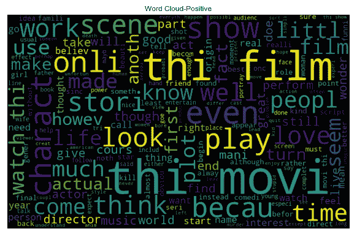

# 自然语言处理

世界变化有多快？好吧，技术和数据变化同样快。随着互联网和社交媒体的出现，我们对数据的整个看法已经改变。最初，大多数数据分析的范围围绕结构化数据。然而，由于互联网和社交媒体中涌入的大量非结构化数据，分析的范围已经扩大。每秒钟都在生成大量的文本数据、图像、声音和视频数据。它们包含大量需要商业综合的信息。自然语言处理是一种技术，通过它我们可以使机器理解文本或语音。尽管非结构化数据范围广泛，但本章的目的是让你接触文本分析。

结构化数据通常由关系数据库或电子表格中设置的固定观察值和固定列组成，而非结构化数据没有任何结构，不能在关系数据库中设置；相反，它需要一个 NoSQL 数据库，例如视频、文本等。

在本章中，你将了解以下主题：

+   文档-词矩阵

+   观察文本的不同方法

+   情感分析

+   主题建模

+   贝叶斯技术

# 文本语料库

文本语料库是由单个文档或一组文档形成的文本数据，可以来自任何语言，如英语、德语、印地语等。在当今世界，大部分文本数据来自社交媒体，如 Facebook、Twitter、博客网站和其他平台。移动应用程序现在也被列入此类来源。语料库的规模越大，即称为**语料库**，分析就越准确。

# 句子

语料库可以被分解成称为**句子**的单位。句子承载着语料库的意义和上下文，一旦我们将它们组合在一起。句子的形成是在词性的帮助下进行的。每个句子都由分隔符（如句号）与其他句子分开，我们可以利用它来进一步分解。这被称为**句子标记化**。

# 单词

单词是语料库中最小的单位，当我们按照词性顺序排列时，它们就形成了句子。当我们把句子分解成单词时，这被称为**词标记化**。

# 词袋

当我们有文本作为输入数据时，我们不能直接处理原始文本。因此，将文本输入数据转换为数字或数字向量，以便使其可用于多种算法，这是至关重要的。

词袋模型是将文本用于算法的一种方法。本质上，它是对文档中单词出现情况的表示。它与结构、顺序和位置无关；此模型只寻找单词作为特征的数量。

该模型背后的思维过程是：内容相似意味着文档相似。

在词袋模型中需要采取的不同步骤如下：

+   **构建语料库**：在这个步骤中，收集并合并文档以形成一个语料库。例如，这里使用了电视剧《老友记》中的著名歌曲作为语料库：

*我会为你守候

当雨开始倾盆而下

我会为你守候

就像我以前去过那里一样

我会为你守候*

让我们考虑这首歌的每一行作为一个单独的文档。

+   **词汇构建**：在这个步骤中，我们确定语料库中的独特单词，并创建它们的列表：

    +   我

    +   将

    +   be

    +   there

    +   for

    +   you

    +   when

    +   the

    +   rain

    +   starts

    +   to

    +   pour

    +   like

    +   have

    +   been

    +   before

+   **文档向量创建**：现在，是时候将每个文本文档转换为向量了。

做这件事的简单方法是通过布尔路由。这意味着原始文本将通过该文本在相应文档中的存在/不存在转换为文档向量。

例如，如果歌曲的第一行被转换成一个包含*I will be there for you*的文档，那么文档向量将如下所示：

|  | **文档向量** |
| --- | --- |
| I | 1 |
| will | 1 |
| be | 1 |
| there | 1 |
| for | 1 |
| you | 1 |
| when | 0 |
| the | 0 |
| rain | 0 |
| starts | 0 |
| to | 0 |
| pour | 0 |
| like | 0 |
| have | 0 |
| been | 0 |
| before | 0 |

文档中出现的所有单词都被标记为 1，其余的都被标记为 0。

因此，第一句话的文档向量是*[1,1,1,1,1,1,0,0,0,0,0,0,0,0,0,0]*。

类似地，第二句话的文档向量是*[0,0,0,0,0,0,1,1,1,1,1,1,0,0,0,0]*。

随着语料库的大小持续增加，文档向量中的零的数量也会增加。因此，这导致向量稀疏，成为一个稀疏向量。对于各种算法来说，计算稀疏向量变得非常具有挑战性。数据清洗是应对这一问题的方法之一，在一定程度上：

+   **文本清洗**：这包括将所有语料库转换为单个大小写（最好是小写）。必须从语料库中去除标点符号。可以采用词干提取，即找到文本的词根，这将能够减少语料库中的独特单词。此外，去除诸如“is”和“of”之类的停用词，可能有助于减轻稀疏性的痛苦。

+   **计数向量**：创建文档向量的另一种方法是利用文档中单词出现的频率。假设有一个由 N 个文档和 T 个标记（单词）组成的语料库。这些 T 个标记将形成我们的词典。因此，计数向量矩阵的维度将是 N X T。每一行都包含该文档中词典中单词的频率。

例如，假设我们有三个文档：

+   **N1**: 计数向量中包含计数

+   **N2**: 计数向量是否比布尔方式创建特征向量更好？

+   **N3**: 特征向量的创建非常重要

在移除`停用词`后，计数向量矩阵如下表所示：

|  | **count** | **vector** | **got** | **it** | **better** | **than** | **Boolean** | **way** | **creating** | **feature** | **creation** | **important** |
| --- | --- | --- | --- | --- | --- | --- | --- | --- | --- | --- | --- | --- |
| N1 | 2 | 1 | 1 | 1 | 0 | 0 | 0 | 0 | 0 | 0 | 0 | 0 |
| N2 | 1 | 2 | 0 | 0 | 1 | 1 | 1 | 1 | 1 | 1 | 0 | 0 |
| N3 | 0 | 1 | 0 | 0 | 0 | 0 | 0 | 0 | 0 | 1 | 1 | 1 |

现在，仔细看看矩阵维度；由于*N=3*和*T=12*，这使得这是一个 3 x 12 的矩阵。

我们将看看矩阵是如何形成的。对于文档*N1*，计数出现的次数是 2，向量出现的次数是 1，等等。将这些频率输入这些值。其他两个文档也完成了类似的过程。

然而，这有一个缺点。一个高频词可能会开始主导文档，甚至整个语料库，这会导致从特征中提取的信息有限。为了解决这个问题，引入了**词频逆文档频率**（**TF-IDF**）。

# TF-IDF

我们了解到计数向量化的局限性，即一个高频词可能会破坏整体效果。因此，我们的想法是对在大多数文档中频繁出现的词进行惩罚，给它们分配较低的权重，并增加在文档子集中出现的词的权重。这就是 TF-IDF 工作的原理。

TF-IDF 是衡量一个术语相对于文档和整个语料库（文档集合）重要性的度量：

*TF-IDF(term) = TF(term)* IDF(term)*

**词频**（**TF**）是单词在文档中出现的频率，相对于文档中所有单词的总数。例如，如果一个文档中有 1,000 个单词，我们需要找出该文档中出现了 50 次的单词*NLP*的*TF*，我们使用以下公式：

*TF(NLP)= 50/1000=0.05*

因此，我们可以得出以下结论：

*TF(term) = 术语在文档中出现的次数/文档中术语的总数*

在前面的例子中，包含三个文档*N1*、*N2*和*N3*，如果需要找到文档*N1*中术语*count*的*TF*，它将如下所示：

*TF(count) N1= 2/ (2+1+1+1) = 2/5 = 0.4*

它表示单词对文档的贡献。

然而，IDF 是衡量该词在整个语料库中重要性的指标：

*IDF("count") = log(总文档数/包含术语"count"的文档数)*

*IDF("count") = log(3/2)= 0.17*

现在，让我们计算术语*vector*的 IDF：

*IDF("vector")=log(3/3)= 0*

我们如何解释这个结果呢？它意味着如果一个词在所有文档中都出现过，那么它对这个特定文档来说并不相关。但是，如果一个词只出现在文档的子集中，这意味着它在存在的文档中具有一定的相关性。

让我们计算*计数*和*向量*的 TF-IDF，如下所示：

*文档 N1 的 TF-IDF 计数 = TF 计数 * IDF 计数 = 0.4 * 0.17 = 0.068*

*文档 N1 的 TF-IDF 向量 = TF 向量 * IDF 向量 = (1/5) * 0 = 0*

很明显，由于它给 N1 中的*计数*分配了更多的权重，所以它比*向量*更重要。权重值越高，术语越稀有。权重值越小，术语越常见。搜索引擎利用 TF-IDF 检索与查询相关的相关文档。

现在，我们将探讨如何在 Python 中执行计数向量和 TF-IDF 向量器：

# 执行计数向量器

执行`CountVectorizer`的步骤如下：

1.  导入所需的`CountVectorizer`库：

```py
from sklearn.feature_extraction.text import CountVectorizer
```

1.  创建一个文本列表：

```py
text = [" Machine translation automatically translate text from one human language to another text"]
```

1.  将文本列表分词并构建词汇表：

```py
vectorizer.fit(text)
```

你将得到以下输出：


1.  让我们看看创建的词汇表：

```py
print(vectorizer.vocabulary_)
```

我们得到以下输出：


1.  现在，我们必须按照以下方式对其进行编码：

```py
vector = vectorizer.transform(text)
```

1.  让我们总结一下向量的内容，并找出项矩阵：

```py
print(type(vector))
print(vector.toarray())
```

我们得到以下输出：


# 在 Python 中执行 TF-IDF

在 Python 中执行 TF-IDF 的步骤如下：

1.  按照以下方式导入库：

```py
from sklearn.feature_extraction.text import TfidfVectorizer
```

1.  让我们通过添加四个文档来创建语料库，如下所示：

```py
corpus = ['First document', 'Second document','Third document','First and second document' ]
```

1.  让我们设置向量器：

```py
vectorizer = TfidfVectorizer()
```

1.  我们按照以下方式从文本中提取特征：

```py
X = vectorizer.fit_transform(corpus)
print(vectorizer.get_feature_names())
print(X.shape)
```

输出如下：


1.  现在出现了文档-词矩阵；每个列表表示一个文档：

```py
X.toarray()
```

我们得到以下输出：


# 情感分析

情感分析是自然语言处理的应用领域之一。它在各个行业和领域中广泛应用，并且在行业中有着巨大的需求。每个组织都致力于关注客户及其需求。因此，为了理解声音和情感，客户成为首要目标，因为了解客户的脉搏可以带来收入。如今，客户通过 Twitter、Facebook 或博客表达他们的情感。需要做一些工作来提炼这些文本数据，使其可消费。让我们看看如何在 Python 中实现这一点。

在这里，电影观众的评论来自 IMDB。这些评论也分享在 GitHub 上。

我们将启动库，如下所示：

```py
import numpy as np
 import pandas as pd
 import seaborn as sns
 import matplotlib.pyplot as plt
 sns.set(color_codes=True)
 import os
 print(os.listdir())
```

我们将按照以下方式加载数据集：

```py
data= pd.read_csv("imdb_master.csv",encoding = "ISO-8859-1")
```

现在，让我们探索数据和其维度：

```py
print(data.head())
print(data.shape)
```

我们得到以下输出：


我们只需要两个变量，`review`和`label`，来构建模型。我们将保留数据中的这两个变量。已经创建了一个新的数据框，如下所示：

```py
Newdata= data[["review","label"]]
Newdata.shape
```


现在，这是我们需要检查`label`中有多少类别的步骤，因为我们只对保留正面和负面类别感兴趣：

```py
g= Newdata.groupby("label")
g.count()
```

输出如下：


现在，很明显有三个类别，我们将删除`unsup`，如下所示：

```py
sent=["neg","pos"]

Newdata = Newdata[Newdata.label.isin(sent)]
Newdata.head()
```

我们得到了以下输出：


我们的数据现在已经设置好了。然而，由于我们删除了一些行，我们将重置数据的索引，因为有时这会引起一些问题：

```py
print(len(Newdata))
Newdata=Newdata.reset_index(drop=True) Newdata.head()
```

输出如下：


我们已经完成了这个步骤。现在，我们将对`label`变量进行编码，以便使其可用于机器学习模型。我们必须使用`LabelEncode`来做到这一点，如下所示：

```py
from sklearn.preprocessing import LabelEncoder
 labelencoder = LabelEncoder()
 Newdata["label"] = labelencoder.fit_transform(Newdata["label"])
```

我们必须对数据的一部分进行清洗，以便使其干净和标准化，如下所示：

```py
Newdata["Clean_review"]= Newdata['review'].str.replace("[^a-zA-Z#]", " ")

Newdata.head()
```

输出如下：


这里，我们试图去除长度小于`3`的单词，因为大多数长度小于`3`的单词对意义的影响不大：

```py
Newdata['Clean_review'] = Newdata['Clean_review'].apply(lambda x: ' '.join([w for w in x.split() if len(w)>3]))
 Newdata.shape
```


数据的标记化现在可以进行，如下所示：

```py
tokenized_data = Newdata['Clean_review'].apply(lambda x: x.split())
 tokenized_data.shape
```


我们正在使用词干提取，以便去除相同单词的不同变体。例如，我们将查看 satisfying、satisfy 和 satisfied，如下所示：

```py
from nltk.stem.porter import *
 stemmer = PorterStemmer()
 tokenized_data = tokenized_data.apply(lambda x: [stemmer.stem(i) for i in x])
 tokenized_data.head()
```

输出如下：


在词干提取后，我们必须将数据重新连接起来，因为我们正在朝着生成文字云的方向前进：

```py
for i in range(len(tokenized_data)):
 tokenized_data[i] = ' '.join(tokenized_data[i])

tokenized_data.head()
```

我们得到了以下输出：


这里，我们将标记化的数据与旧的`Newdata`数据框合并：

```py
Newdata["Clean_review2"]= tokenized_data
 Newdata.head()
```

以下是对前面代码的输出：


已经生成了一个将所有单词组合在一起的文字云：

```py
all_words = ' '.join([str(text) for text in Newdata['Clean_review2']])
 from wordcloud import WordCloud
 wordcloud = WordCloud(width=800, height=500, random_state=21, max_font_size=110).generate(all_words)
 plt.figure(figsize=(10, 7))
 plt.imshow(wordcloud, interpolation="bilinear")
 plt.axis('off')
 plt.show()
```

输出如下：


现在，我们将分别对正面和负面情感制作文字云，如下所示：

+   对于`负面`情感，我们将使用以下方法：

```py
Negative =' '.join([text for text in Newdata['Clean_review2'][Newdata['label'] == 0]])
 wordcloud1= WordCloud(width=800, height=500, random_state=21, max_font_size=110).generate(Negative)
 plt.figure(figsize=(10, 7))
 plt.imshow(wordcloud1, interpolation="bilinear")
 plt.title("Word Cloud- Negative")
 plt.axis('off')
 plt.show()
```

以下输出显示了`负面`情感的文字云：


+   我们将使用以下内容用于`正面`情感：

```py
Positive=' '.join([text for text in Newdata['Clean_review2'][Newdata['label'] == 1]])
 wordcloud2 = WordCloud(width=800, height=500, random_state=21, max_font_size=110).generate(Positive)
 plt.figure(figsize=(10, 7))
 plt.imshow(wordcloud, interpolation="bilinear")
 plt.title("Word Cloud-Positive")
 plt.axis('off')
 plt.show()
```

以下输出显示了`正面`情感的文字云：



# 情感分类

我们将采用两种方法来进行情感分类（正面和负面），如下所示：

+   TF-IDF

+   计数向量化

让我们看看哪一个能给出更好的结果。

# TF-IDF 特征提取

以下代码将提供 TF-IDF 特征提取：

```py
from sklearn.feature_extraction.text import TfidfVectorizer
tfidf= TfidfVectorizer(max_df=0.9,min_df= 2, max_features=1000,
                        stop_words="english")
tfidfV = tfidf.fit_transform(Newdata['Clean_review2'])

tfidf.vocabulary_
```

我们将得到以下输出：


# 计数向量器单词袋特征提取

以下代码将展示单词袋的计数向量器：

```py
from sklearn.feature_extraction.text import CountVectorizer
 bow_vectorizer = CountVectorizer(max_df=0.90, min_df=2, max_features=1000, stop_words='english')
 # bag-of-words
 bow = bow_vectorizer.fit_transform(Newdata['Clean_review2'])
```

# 模型构建计数向量

为了构建计数向量，我们可以将数据分为训练集和测试集，如下所示：

```py
from sklearn.linear_model import LogisticRegression
 from sklearn.model_selection import train_test_split
 from sklearn.metrics import f1_score,accuracy_score
 # splitting data into training and validation set
 xtrain, xtest, ytrain, ytest = train_test_split(bow, Newdata['label'], random_state=42, test_size=0.3)
 lreg = LogisticRegression()
 lreg.fit(xtrain, ytrain) # training the model
 prediction = lreg.predict_proba(xtest) # predicting on the validation set
 prediction_int = prediction[:,1] >= 0.3 # if prediction is greater than or equal to 0.3 than 1 else 0
 prediction_int = prediction_int.astype(np.int)
 print("F1 Score-",f1_score(ytest, prediction_int))
 print("Accuracy-",accuracy_score(ytest,prediction_int))
```

我们将得到以下输出：


在这里，我们达到了 84%的准确率。让我们看看 TF-IDF 方法的表现如何：

```py
from sklearn.linear_model import LogisticRegression
 # splitting data into training and validation set
 xtraintf, xtesttf, ytraintf, ytesttf = train_test_split(tfidfV, Newdata['label'], random_state=42, test_size=0.3)
 lreg = LogisticRegression()
 lreg.fit(xtraintf, ytraintf) # training the model
 prediction = lreg.predict_proba(xtesttf) # predicting on the test set
 prediction_int = prediction[:,1] >= 0.3 # if prediction is greater than or equal to 0.3 than 1 else 0
 prediction_int = prediction_int.astype(np.int)
 print("F1 Score-",f1_score(ytest, prediction_int))
 print("Accuracy-",accuracy_score(ytest,prediction_int))
```

输出如下：


在这里，准确率达到了 83.8%（略低于计数向量器）。

这完成了情感分类模型的构建。

# 主题建模

模型是一种用于识别主题并推导出文本语料库所展现的隐藏模式的方法。主题建模类似于聚类，因为我们提供主题的数量作为超参数（类似于聚类中使用的超参数），这恰好是簇的数量（k-means）。通过这种方式，我们试图提取具有某些权重分配的主题数量或文本。

模型的应用领域包括文档聚类、降维、信息检索和特征选择。

实现这一目标有多种方法，如下所示：

+   **潜在狄利克雷分配**（**LDA**）：它基于概率图模型

+   **潜在语义分析**（**LSA**）：它基于线性代数（奇异值分解）

+   **非负矩阵分解**：它基于线性代数

我们将主要讨论 LDA，它被认为是所有中最受欢迎的。

LDA 是一种矩阵分解技术，它基于这样一个假设：文档是由多个主题组成的，而主题是由单词组成的。

在阅读了前面的章节之后，你应该知道任何语料库都可以表示为一个文档-词矩阵。以下矩阵显示了一个包含**M**个文档和**N**个单词的词汇量，形成一个**M x N**矩阵。这个矩阵中的所有单元格都有该特定文档中单词的频率：


这个**文档与词的 M x N 矩阵**通过 LDA 转换为两个矩阵：**文档与主题的 M x X 矩阵**和**主题与词的 X x N 矩阵**。

# LDA 架构

在 LDA 架构中，有 M 个文档，包含 N 个单词，这些单词通过被称为**LDA**的黑色条带进行处理。它提供了**X 个主题**和**单词簇**。每个主题都有来自主题的单词的 psi 分布。最后，它还提供了一个文档中主题的分布，用 phi 表示。

以下图表说明了 LDA：


关于**Alpha**和**Beta**超参数：alpha 代表文档-主题浓度，beta 代表主题-单词浓度。alpha 的值越高，我们从文档中得到的主题就越多。另一方面，beta 的值越高，一个主题中的单词就越多。这些可以根据领域知识进行调整。

LDA 遍历每篇文档中的每个单词，并为它分配和调整一个主题。基于两个概率的乘积，将一个新的主题*X*分配给它：*p1= (topic t/document d)*，这意味着分配给主题 t 的文档中单词的比例，以及*p2=(word w/topic t)*，这指的是分配给主题*t*的分配在整个文档中，其中与单词 w 相关联。

通过遍历次数，我们得到了一个良好的主题-单词和主题-文档的分布。

让我们看看它在 Python 中的执行方式：

1.  在这一步，我们正在加载`dataset = fetch_20newsgroups`，它来自`sklearn`：

```py
from sklearn.datasets import fetch_20newsgroups
 dataset = fetch_20newsgroups(shuffle=True, random_state=1, remove=('headers', 'footers', 'quotes'))
 documents = dataset.data
```

1.  在这一步，我们将清理数据集。为了做到这一点，需要`stopwords`和`WordNetLemmatizer`函数。因此，必须加载相关的库，如下所示：

```py
from nltk.corpus import stopwords
from nltk.stem.wordnet import WordNetLemmatizer
import string
```

1.  确保您已下载以下字典：

```py
import nltk
nltk.download("stopwords")
nltk.download("wordnet")
```

1.  这里，创建了一个`clean`函数，将单词转换为小写。移除`stopwords`并选择长度大于`3`的单词。它还使其无标点符号。最后，进行词形还原，如下所示：

```py
stop = set(stopwords.words('english'))
punc = set(string.punctuation)
lemma = WordNetLemmatizer()
def clean(doc):
     stopw_free = " ".join([i for i in doc.lower().split() if i not in stop and len(i)>3])
     punc_free = ''.join(ch for ch in stop_free if ch not in punc)
     lemmatized = " ".join(lemma.lemmatize(word) for word in punc_free.split())
     return lemmatized
 doc_clean = [clean(doc).split() for doc in documents]
```

1.  现在，我们必须在`gensim`库的帮助下创建文档-术语矩阵。这个库还将使我们能够执行 LDA：

```py
import gensim
from gensim import corpora
```

1.  在这里创建了一个基于词袋的文档-术语矩阵：

```py
corpus = corpora.Dictionary(doc_clean)
 doc_term_matrix = [corpus.doc2bow(doc) for doc in doc_clean]
```

1.  这里，正在使用 TF-IDF 帮助创建一个类似的矩阵：

```py
from gensim import models
tfidf = models.TfidfModel(doc_term_matrix)
corpus_tfidf = tfidf[doc_term_matrix]
```

1.  让我们使用 TF-IDF 矩阵设置模型。主题的数量已经给出为`10`：

```py
lda_model1 = gensim.models.LdaMulticore(corpus_tfidf, num_topics=10, id2word=corpus, passes=2, workers=2)
```

1.  让我们看看包含单词的主题：

```py
print(lda_model1.print_topics(num_topics=5, num_words=5))
```

输出如下：


1.  对于词袋模型，我们也将进行类似的练习；稍后，我们将进行比较：

```py
lda_model2 = gensim.models.LdaMulticore(doc_term_matrix, num_topics=10, id2word=corpus, passes=2, workers=2)

print(lda_model2.print_topics(num_topics=5, num_words=5))
```

我们得到了以下输出：


# 评估模型

对数困惑度是衡量 LDA 模型好坏的一个指标。困惑度值越低，模型越好：

```py
print("lda_model 1- Perplexity:-",lda_model.log_perplexity(corpus_tfidf))
print("lda_model 2- Perplexity:-",lda_model2.log_perplexity(doc_term_matrix))
```

对数困惑度的输出如下：


# 可视化 LDA

为了可视化数据，我们可以使用以下代码：

```py
import pyLDAvis
import pyLDAvis.gensim
import matplotlib.pyplot as plt
%matplotlib inline

pyLDAvis.enable_notebook()
visual1= pyLDAvis.gensim.prepare(lda_model, doc_term_matrix, corpus)
visual1
```

输出将如下：


我们可以在此启用笔记本，如下所示：

```py
pyLDAvis.enable_notebook()
 visual2= pyLDAvis.gensim.prepare(lda_model2, doc_term_matrix, corpus)
 visual2
```

输出如下：


让我们尝试解释这个。

在左侧，我们有主题，在右侧，我们有术语/单词：

+   圆圈的大小越大，主题出现的频率就越高。

+   相互重叠或彼此更接近的主题是相似的。

+   选择一个主题后，可以看到该主题的最具代表性的单词。这反映了单词的频率。可以通过使用滑块来调整每个属性的权重。

+   将鼠标悬停在主题上，将在右侧提供单词对该主题的贡献。点击单词后，我们将看到圆圈大小变化，这反映了该术语在该主题中的频率。

# 文本分类中的朴素贝叶斯技术

朴素贝叶斯是一种基于贝叶斯定理的监督分类算法。它是一个概率算法。但是，你可能想知道为什么它被称为**朴素**。这是因为该算法基于一个假设，即所有特征都是相互独立的。然而，我们意识到在现实世界中特征之间的独立性可能不存在。例如，如果我们试图检测一封电子邮件是否为垃圾邮件，我们只寻找与垃圾邮件相关的关键词，如彩票、奖项等。基于这些，我们从电子邮件中提取相关特征，并说如果给定与垃圾邮件相关的特征，该电子邮件将被分类为垃圾邮件。

# 贝叶斯定理

贝叶斯定理帮助我们找到给定一定条件下的后验概率：

*P(A|B)= P(B|A) * P(A)/P(B)*

*A* 和 *B* 可以被认为是目标变量和特征，分别。

在哪里，*P(A|B)*：后验概率，表示在事件 *B* 发生的情况下事件 *A* 的概率：

+   *P(B|A)*：在目标 *A* 给定的情况下，特征 *B* 的似然概率

+   *P(A)*：目标 *A* 的先验概率

+   *P(B)*：特征 *B* 的先验概率

# 朴素贝叶斯分类器是如何工作的

我们将通过查看泰坦尼克号的例子来理解所有这些。当泰坦尼克号沉没时，一些类别在获救方面比其他类别有优先权。我们有以下数据集（这是一个 Kaggle 数据集）：

| **人员类别** | **生存机会** |
| --- | --- |
| 女性 | 是 |
| 儿童 | 是 |
| 儿童 | 是 |
| 男性 | 否 |
| 女性 | 是 |
| 女性 | 是 |
| 男性 | 否 |
| 男性 | 是 |
| 儿童 | 是 |
| 女性 | 否 |
| 儿童 | 否 |
| 女性 | 否 |
| 男性 | 是 |
| 男性 | 否 |
| 女性 | 是 |

现在，让我们为前面的信息准备一个似然表：

|  |  | **生存机会** |  |  |  |  |
| --- | --- | --- | --- | --- | --- | --- |
|  |  | 否 | 是 | 总计 |  |  |
| 类别 | 儿童 | 1 | 3 | 4 | 4/15= | 0.27 |
| 男性 | 3 | 2 | 5 | 5/15= | 0.33 |  |
| 女性 | 2 | 4 | 6 | 6/15= | 0.40 |  |
|  | 总计 | 6 | 9 | 15 |  |  |
|  |  | 6/15 | 9/15 |  |  |  |
|  |  | 0.40 | 0.6 |  |  |  |

让我们找出哪个类别的人有最大的生存机会：

*儿童 - P(Yes|Kid)= P(Kid|Yes) * P(Yes)/P(Kid)*

*P(Kid|Yes) = 3/9= 0.3*

*P(Yes) = 9/15 =0.6*

*P(Kid)= 4/15 =0.27*

*P(Yes|kid) = 0.33 *0.6/0.27=0.73*

*女性 - P(Yes|Woman)= P(Woman|Yes) * P(Yes)/P(Woman)*

*P(Woman|Yes) = 4/9= 0.44*

*P(Yes) = 9/15 =0.6*

*P(Woman)= 6/15 =0.4*

*P(Yes|Woman) = 0.44 *0.6/0.4=0.66*

*人 - P(Yes|人) = P(人|Yes) * P(Yes)/P(人)*

*P(人|Yes) = 2/9= 0.22*

* P(Yes) = 9/15 =0.6*

* P(人)= 6/15 =0.33*

*P(Yes|人) = 0.22 *0.6/0.33=0.4*

因此，我们可以看到，孩子有最大的生存机会，而男人有最小的生存机会。

让我们借助朴素贝叶斯进行情感分类，看看结果是否更好或更差：

```py
from sklearn.naive_bayes import MultinomialNB
# splitting data into training and validation set
xtraintf, xtesttf, ytraintf, ytesttf = train_test_split(tfidfV, Newdata['label'], random_state=42, test_size=0.3)
NB= MultinomialNB()
NB.fit(xtraintf, ytraintf)
prediction = NB.predict_proba(xtesttf) # predicting on the test set
prediction_int = prediction[:,1] >= 0.3 # if prediction is greater than or equal to 0.3 than 1 else 0
prediction_int = prediction_int.astype(np.int)
print("F1 Score-",f1_score(ytest, prediction_int))
print("Accuracy-",accuracy_score(ytest,prediction_int))
```

输出如下：


在这里，我们可以看到我们之前的结果比朴素贝叶斯的结果要好。

# 摘要

在本章中，我们学习了语料库构建技术，这些技术包括句子和单词，其中包括词袋模型，以便使文本可用于算法。你还了解了 TF-IDF 以及一个术语相对于文档和整个语料库的重要性。我们讨论了情感分析，以及分类和 TF-IDF 特征提取。

你还介绍了主题建模和评估模型，包括可视化 LDA。我们涵盖了贝叶斯定理以及与朴素贝叶斯分类器一起工作。在下一章中，你将学习关于时序和序列模式发现的内容。
