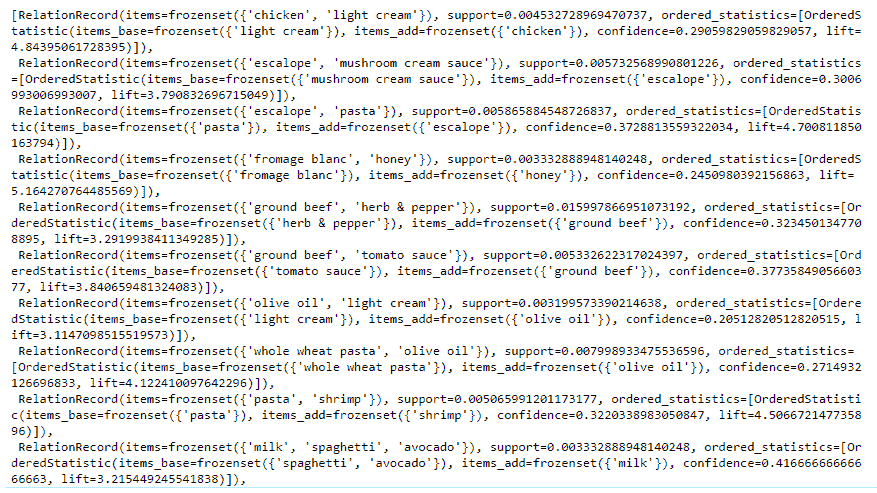
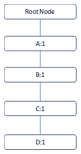
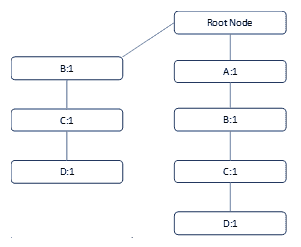
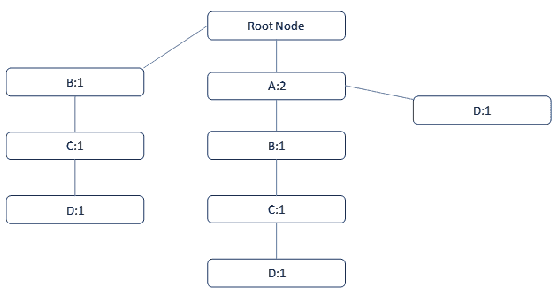
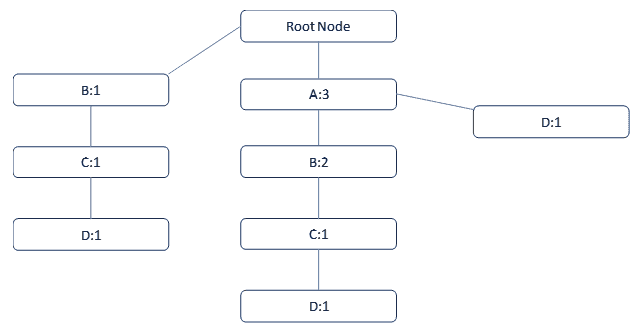
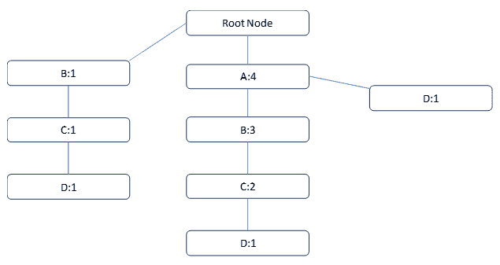
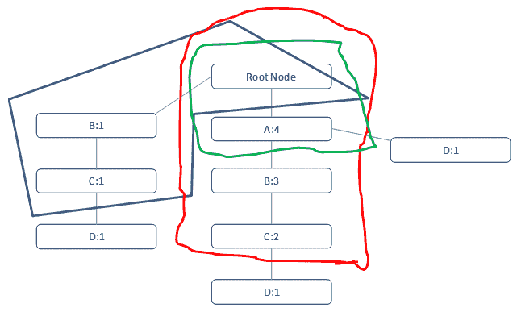
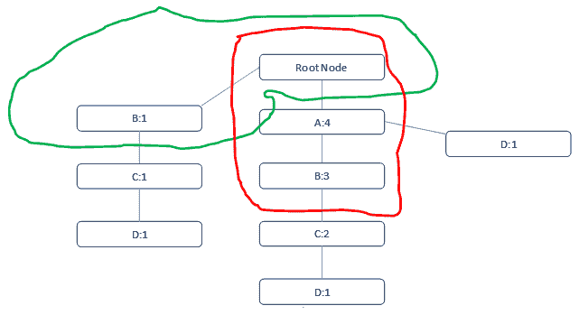
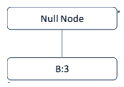
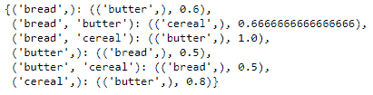

# 时间和顺序模式发现

我们中的许多人为了家庭需求去过像 Reliance 和 Walmart 这样的零售商店。假设我们计划从 Reliance Digital 购买一部 iPhoneX。我们通常会做的是访问商店的移动部门，搜索型号，然后选择产品并前往结账柜台。

但是，在当今世界，组织的目标是增加收入。这仅仅通过一次向客户推销一个产品就能实现吗？答案是明确的**不**。因此，组织开始挖掘与频繁购买项目相关的数据。他们试图找出不同项目之间的关联，以及可以一起销售的产品，这有助于正确的产品定位。通常，它会找出哪些产品是共同购买的，组织可以以类似的方式摆放产品。

这就是我们将在本章中讨论的内容。我们如何通过机器学习手段制定这样的规则？我们将在这里讨论多种技术。

在本章中，我们将涵盖以下主题：

+   关联规则

+   频繁模式增长

+   验证

# 关联规则

关联规则挖掘是一种技术，它关注于从数据库中观察频繁出现的模式和关联，如关系数据库和事务数据库。这些规则并没有说任何关于个人偏好的内容；相反，它们主要依赖于交易中的项目来推断某种关联。每个交易都有一个主键（唯一的 ID），称为，**交易 ID**。所有这些交易都被作为一个整体进行研究，并从中挖掘模式。

关联规则可以被视为一个**如果—那么**的关系。为了详细阐述这一点，我们必须制定一条规则：**如果**客户购买了一个项目**A**，**那么**在相同的交易 ID 下（与项目**A**一起），客户选择项目**B**的概率被找到。在这里，你需要理解这不是因果关系，而是一种共现模式，它浮出水面。

这些规则有两个要素：

+   **前件（如果）**：这是通常在项集或数据集中找到的项目/项目组

+   **后件（那么）**：这是一个与前件/前件组一起出现的项目

看看以下规则：

*{面包，牛奶} ⇒ {黄油}*

这条规则的第一个部分被称为**前件**，第二个部分（在箭头之后）是**后件**。它能够传达在交易中如果先选择了*面包*和*牛奶*，那么选择*黄油*的可能性。然而，给定前件，后件在项集中出现的百分比概率并不明确。

让我们看看一些有助于我们达到目标的指标：

1.  **支持度**：这是度量项目集在所有交易中的频率。例如，通过零售店如沃尔玛的交易数量，会出现两个项目集：项目集*A = {Milk}*)，项目集*B = {laptop}*)。鉴于支持度是项目集在所有交易中的频率，我们需要找出哪个项目集具有更高的支持度。我们知道项目集*A*将具有更高的支持度，因为*Milk*出现在日常杂货清单（以及交易）中的概率比*laptop*更高。让我们增加一个关联级别，并使用两个新的项目集进行研究：项目集*A= {milk, cornflakes}*)，项目集*B= {milk, USB Drive}*)。*milk*和*cornflakes*一起的购买频率将高于*milk and USB Drive*。这将使*A*的支持度指标更高。

让我们将这转化为数学表达式：

*支持度(A, B) = 包含 A 和 B 的交易/总交易数*

这里有一个例子：

+   +   总交易数是 10,000

    +   包含*A*和*B*的交易 = 500*

    +   那么，支持度*(A, B) = 500/10000= 0.05*

    +   5%的交易包含*A*和*B*一起

1.  **信心**：这表示当项目 2 已经被选中时，项目 1 被购买/选中的可能性。换句话说，它衡量的是在先导交易已经存在的情况下，后续交易发生的可能性。换句话说，如果*Bread*已经参与了该交易，那么它衡量的是交易中发生*Butter*的概率。很明显，这是在具有先导条件的情况下，后续事件发生的条件概率：

+   +   *信心(A ⇒ B) = 包含 A 和 B 的交易/包含 A 的交易*

    +   *信心可以转换为支持度*

    +   *信心(A ⇒ B) = 支持度(A, B)/支持度(A)*

这里有一个例子：

+   +   包含项目集*milk*的交易 = 50*

    +   包含项目集*cereal*的交易 = 30*

    +   包含*milk*和*cereal*的交易 = 10*

    +   总交易数 = 100

    +   *信心(milk ⇒ Cereal) = 10/(50 +10) = 0.167*

这意味着该事件发生的概率是 16.7%。

信心的一个缺点是它只考虑了项目 1 的流行程度，但没有考虑项目 2。如果项目 2 同样频繁，那么包含项目 1 的交易也包含项目 2 的可能性会更高。因此，这会导致结果被夸大。为了考虑两个构成项目的频率，我们使用一个称为**提升**的第三个度量。

1.  **提升度**：这是指在项目 *A* 已经被选中时，项目 *B* 被选中的可能性，同时关注项目 *B* 的频率。提升度大于 1 表示项目 *A* 和项目 *B* 之间有很强的关联，这意味着如果项目 *A* 已经在购物车中，那么项目 *B* 被选中的可能性很大。提升度小于 1 表示如果项目 *A* 已经存在，项目 *B* 被选中的可能性很小。如果提升度为零，则表示无法建立任何关联。

*Lift(A⇒B) = (包含 A 和 B 的事务数/(包含 A 的事务数))/包含 B 的事务数*

意味着：

*= Support(A, B)/(Support(A) * Support(B))*

*Lift(牛奶⇒麦片) = ( 10/(50+10))/0.4*

*= 0.416*

我们将在这里以更好的格式展示它。在知道牛奶已经在购物车中的情况下，购物车中有麦片的概率（称为**置信度**）= *10/(50+10) = 0.167*。

在不知道牛奶在购物车中的情况下，购物车中有麦片的概率为 *cart = (30+10)/100 = 0.4*.

这意味着知道牛奶已经在购物车中，将选择麦片的机会从 *0.4* 降低到 *0.167*。提升度为 *0.167/0.4= 0.416*，并且小于 *1*。因此，当牛奶已经在购物车中时，选择麦片的机会非常小。

# Apriori 算法

Apriori 是一种经典的算法，用于挖掘频繁项集以推导出各种关联规则。它将帮助以更好的方式设置零售店，从而有助于增加收入。

支持度测量的反单调性是 Apriori 围绕的核心概念之一。它假设以下内容：

+   一个频繁项集的所有子集都必须是频繁的

+   同样，对于任何不频繁的项集，它的所有超集也必须是不频繁的

让我们来看一个例子并解释它：

| **事务 ID** | **牛奶** | **黄油** | **麦片** | **面包** | **书籍** |
| --- | --- | --- | --- | --- | --- |
| t1 | 1 | 1 | 1 | 0 | 0 |
| t2 | 0 | 1 | 1 | 1 | 0 |
| t3 | 0 | 0 | 0 | 1 | 1 |
| t4 | 1 | 1 | 0 | 1 | 0 |
| t5 | 1 | 1 | 1 | 0 | 1 |
| t6 | 1 | 1 | 1 | 1 | 1 |

我们已经得到了事务 ID 和如牛奶、黄油、麦片、面包和书籍等项目。1 表示项目是事务的一部分，0 表示它不是。

+   我们为所有项目创建了一个频率表，包括支持（除以 6）：

| **项目** | **事务数量** | **支持度** |
| --- | --- | --- |
| 牛奶 | 4 | 67% |
| 黄油 | 5 | 83% |
| 麦片 | 4 | 67% |
| 面包 | 4 | 67% |
| 书籍 | 3 | 50% |

+   我们将设置一个支持度阈值为 60%，这将根据频率过滤项目，因为这些项目可以被视为此场景中的频繁项集：

| **项目** | **事务数量** |
| --- | --- |
| 牛奶 | 4 |
| 黄油 | 5 |
| 麦片 | 4 |
| 面包 | 4 |

+   同样，我们用这些项目形成组合数（每次两个、三个和四个），并找出频率：

| **项目** | **交易数量** |
| --- | --- |
| 牛奶，黄油 | 4 |
| 牛奶，谷物 | 3 |
| 牛奶，面包 | 2 |
| 黄油，面包 | 3 |
| 黄油，谷物 | 4 |
| 谷物，面包 | 2 |

现在，我们再次需要找出前面示例的支持度，并通过阈值进行过滤，即支持度为 60%

类似地，必须一次形成三个项目的组合（例如，牛奶、黄油和面包），并计算它们的支持度。最后，我们将通过阈值过滤它们。同样，需要通过每次四个项目的方式执行相同的过程。我们到目前为止所做的是**频繁项集生成**。

# 查找关联规则

为了找到关联规则，我们首先需要搜索所有支持度大于阈值支持度的规则。但是问题来了：我们如何找到这些规则？一种可能的方法是暴力搜索，这意味着列出所有可能的关联规则，并计算每个规则的支持度和置信度。然后，移除所有未通过置信度和支持度阈值的规则。

假设集合* I*中有*n*个元素，可能的关联规则总数为*3^n - 2^(n+1) + 1*。

如果*X*是一个包含*k*个元素的频繁项集，那么将存在*2^k - 2*个关联规则。

让我们看看如何在 Python 中执行关联规则：

```py
import numpy as np
import matplotlib.pyplot as plt
import pandas as pd

data = pd.read_csv('association_mining.csv', header = None)

transactions = []
for i in range(0, 7501):
 transactions.append([str(data.values[i,j]) for j in range(0, 20)])
```

如果我们要求一个项目在一天内出现三次，在七天时间内，支持度将是*3 x 7/7051*。*7051*是交易总数。我们最初将置信度设置为 20%：

```py
from apyori import apriori
rules = apriori(transactions, min_support = 0.003, min_confidence = 0.2, min_lift = 3, min_length = 2)

results = list(rules)
results
```

我们可以通过运行前面代码中的`results`命令来可视化输出：



# 频繁模式增长

**频繁模式增长**（**FP-growth**）是一种频繁项集生成技术（类似于 Apriori）。FP-Growth 构建一个紧凑的树结构，并使用该树进行频繁项集挖掘和生成规则。它比 Apriori 更快，并且可以处理大型数据集。

让我们通过 FP-Growth 的步骤来了解：

1.  **设置事务**：这一步按频率设置项目。但是，项目是垂直设置的，而不是水平设置。这意味着将输入从事务转换为项目：

| **t_id** | **项目** |
| --- | --- |
| 1 | (B, C, D, A) |
| 2 | (B, C, D) |
| 3 | (D, A) |
| 4 | (A, B) |
| 5 | (A, C, B) |

1.  **查找频率**：现在我们必须找出每个项目的单独频率：

| **项目** | **频率** |
| --- | --- |
| A | 4 |
| B | 4 |
| C | 3 |
| D | 3 |

让我们设置最小阈值或最小支持度为 50%：

+   +   最小支持度 = (5*50/100) = 2.5

    +   最小支持度的上限 = 2.5 ~ 3

1.  **按频率优先排序项目**：由于所有项目的频率都大于或等于最小支持度，所有项目都将包含在内。此外，根据它们的频率，将分配优先级或排名给项目：

| **项目** | **频率** | **排名** |
| --- | --- | --- |
| A | 4 | 1 |
| B | 4 | 2 |
| C | 3 | 3 |
| D | 3 | 4 |

项目的顺序是：A、B、C 和 D（按频率降序排列）

1.  **按优先级排序项目**：现在，项目的顺序将根据基于频率分配给各种项目的优先级来设置。目前，顺序是 A、B、C 和 D：

| **t_id** | **Items** | **Order by priority** |
| --- | --- | --- |
| 1 | (B, C, D, A) | (A, B, C, D) |
| 2 | (B, C, D) | (B, C, D) |
| 3 | (D, A) | (A, D) |
| 4 | (A, B) | (A, B) |
| 5 | (A, C, B) | (A, B, C) |

# 频繁模式树增长

我们将从以下行研究不同的频繁模式树的增长：

+   **第一行**: 每个 FP-树都以一个空节点作为根节点。让我们绘制树的第一个行及其频率：



+   **第二行**: 它包含 *{B,C,D}*。*A* 缺失，所以我们不能将其与前面的节点合并。因此，我们必须创建另一个节点，整体情况如下所示：



+   **第三行**: 它包含 *{A,D}*。*B* 和 *C* 缺失，但我们可以将其与前面的节点绑定。*A* 遇到重复，因此其频率将发生变化。现在变为 *2*：



+   **第四行**: 它包含 *{A,B}*。我们可以将其与前面的节点绑定，并将遍历应用于前面的节点。*A* 和 *B* 遇到重复，因此其频率将发生变化。分别变为 3 和 2：



+   **第五行**: 它包含 *{A,B,C}*。再次，它可以与前面的节点绑定，并且 A、B 和 C 出现重复，因此它们的频率将发生变化。分别变为 4、3 和 2：



# 验证

现在，让我们计算我们得到的最终树的频率，并将每个项目的频率与表格进行比较，以确保我们在表格中得到了正确的频率：

+   **A:4**

+   **B:4**

+   **C:3**

+   **D:3**

现在，我们将从底部到顶部进行。我们将找出 D 出现的分支：



我们可以看到有三个分支中出现了 D：

+   BC: 1

+   ABC: 1

+   A: 1

这些分支被称为 D 的条件模式基。当我们这样做时，有一些要点需要注意：

+   即使我们从底部向上遍历，我们也以从上到下的方式编写分支

+   D 不是其中的一部分

+   1 代表每个分支中 D 发生的频率

现在，D 的条件模式导致 A、B 和 C 的条件频率，分别是 2、2 和 2。所有这些都小于最小支持度（3）。因此，不能为它创建任何条件 FP-树。

现在，让我们对 C 进行操作。C 出现在以下分支中：



分支最终如下所示：

+   B:1

+   AB:2

这导致 A:2 和 B:3。因此，根据最小支持度，B 符合条件。现在条件树最终如下所示：



同样，对于不同的组合进行条件模式查找。因此，它建立了频繁项集数据集。

让我们看看如何在 Python 中实现。我们将使用一个名为`pyfpgrowth`的库。此外，我们将在下一节创建一个项集。

# 导入库

为了进行验证，我们将导入库并构建如所示的交易：

```py
import pyfpgrowth
```

我们构建我们的交易如下：

```py
transaction = [["bread", "butter", "cereal"],
 ["butter", "milk"],
 ["bread", "milk"],
 ["butter", "cereal", "milk"],
 ["egg", "bread"],
 ["egg", "butter"],
 ["cereal", "milk"],
 ["bread", "butter", "cereal", "egg"],
 ["cereal", "bread", "butter"]]
```

现在定义最小支持度以找到模式。`find_frequent_patterns()`，其中`transactions`是每次交易中购买的项目列表，`2`是设置的最小支持度阈值：

```py
patterns = pyfpgrowth.find_frequent_patterns(transaction, 2)
```

最后，我们必须定义置信度以获取规则。规则是基于模式生成的，`0.5`是置信度的最小阈值。然后，我们将规则存储在名为`rules`的数据框中。`rules`最初包含一个前件、一个后件和置信度值：

```py
rules = pyfpgrowth.generate_association_rules(patterns, 0.5)
print(rules)
```

我们得到以下输出：



这就是我们获取规则的方式。FP-growth 通常比 Apriori 有优势，因为它更快、更高效。

# 摘要

在本章中，我们学习了关联规则。我们还讨论了 Apriori 算法，该算法用于挖掘频繁项集以推导出各种关联规则。我们还了解了频繁模式增长（FP-growth），它与 Apriori 类似，以及频繁项集生成技术，它与 Apriori 算法类似。最后，我们看到了 FP-growth 如何比 Apriori 有优势，因为它更快、更高效，并通过一个例子来说明。

在下一章中，我们将学习概率图模型。我们将深入了解贝叶斯规则和贝叶斯网络。
