# 第九章：深度学习中的选讲主题

在第四章*“训练神经网络”中，我们探讨了什么是**人工神经网络**（ANN）以及这种模型是如何构建的。你可以认为深度神经网络是 ANN 的延伸版本；然而，它也有自己的一套挑战。

在本章中，我们将学习以下主题：

+   什么是深度神经网络？

+   如何初始化参数

+   对抗网络——生成对抗网络和贝叶斯生成对抗网络

+   深度高斯过程

+   霍 inton 的胶囊网络

# 深度神经网络

让我们回顾一下我们在第四章*“训练神经网络”中学习的内容。神经网络是机器模拟人脑，被视为一套旨在从数据中提取模式的算法。它有三个不同的层：

+   输入层

+   隐藏层

+   输出层

感官数值数据（以向量的形式）通过输入层，然后通过隐藏层生成它自己的感知和推理，以在输出层产生最终结果。

你能回忆起我们在第四章“训练神经网络”中学到的内容，关于人工神经网络（ANN）中的层数以及我们如何计算它们吗？当我们有如下图中所示的层时，你能计算出层数吗？记住，我们只计算隐藏层和输出层。所以，如果有人问你你的网络中有多少层，在回答时不要包括输入层：

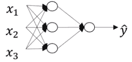

是的，没错——前面的架构中有两层。那么对于下面的网络呢？

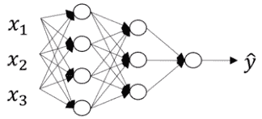

这个网络有三个层，包括两个隐藏层。随着层的增加，模型变得更深。

# 为什么我们需要深度学习模型？

深度学习模型是一个高度非线性的模型，具有多层和多个节点按顺序工作以解决业务问题。每一层都被分配了不同的任务。

例如，如果我们有一个面部检测问题，隐藏层 1 找出图像中存在的哪些边缘。层 2 找出边缘的组合，这些边缘开始呈现出眼睛、鼻子和其他部分的形状。层 3 使对象模型得以创建，从而形成人脸的形状。以下图表显示了不同的隐藏层：

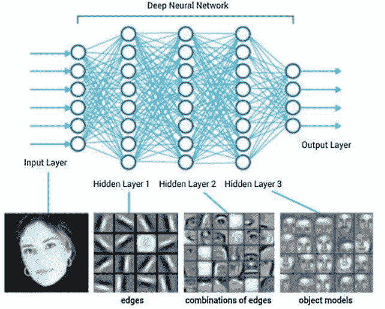

这里，我们得到了一个逻辑回归模型，也称为**单层神经网络**。有时，它也被称作最**浅层网络**。这里可以看到的第二个网络有一个两层网络。再次，它是一个浅层网络，但不如前一个浅。下一个架构有三个层，这使得事情更有趣。网络现在变深了。最后一个架构有一个六层架构，由五个隐藏层组成。层数变得更深了。

# 深度神经网络符号

符号的解释如下：

+   *l*：层数为 4

+   *n^([l])*：第 *l* 层的节点数

对于以下架构，这是如下所示：

+   *n ^([0])*：输入层的节点数，即 3

+   *n ^([1])*：5

+   *n ^([2])*：5

+   *n ^([3])*：3

+   *n ^([4])*：1

+   *a ^([l])*：第 *l* 层的激活值

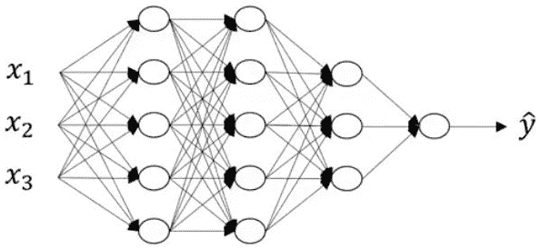

正如我们已知的，以下方程通过各层：

*z = w^TX + b*

因此，我们得到以下结果：

+   激活：*a = σ(z)*

+   *w^([l])*：第 *l* 层的权重

+   *b^([l])*：第 *l* 层的偏置

# 深度网络的正向传播

让我们看看这些方程是如何为第 1 层和第 2 层设置的。如果训练示例集 X 是前述网络中的 (*x1*, *x2*, *x3*)。

让我们看看方程是如何应用于第 1 层的：

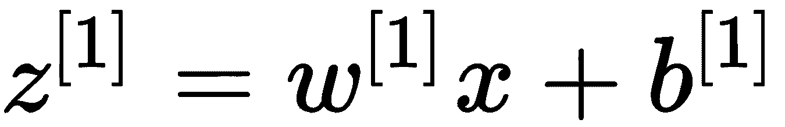

第 1 层的激活函数如下：

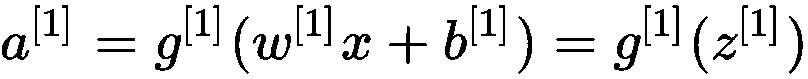

输入也可以表示如下：

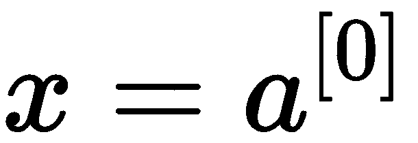

对于第 2 层，输入将是以下内容：

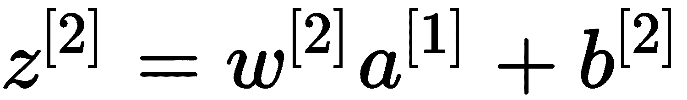

这里应用到的激活函数如下：

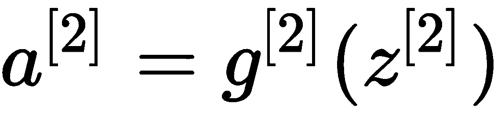

同样，对于第 3 层，应用的输入如下：

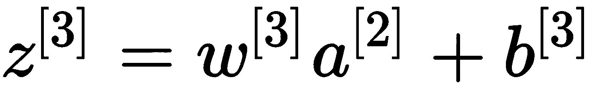

第 3 层的激活函数如下：

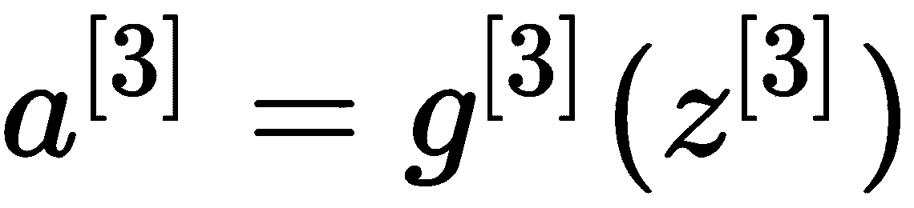

最后，这是最后一层的输入：

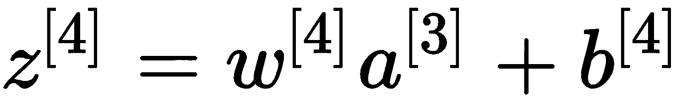

这是它的激活：

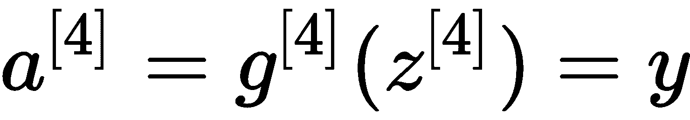

因此，广义正向传播方程如下：


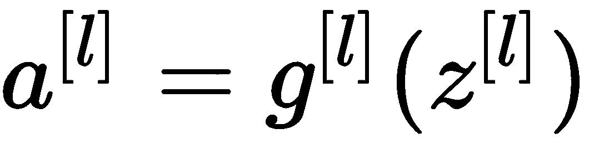

# 参数 W 和 b

让我们讨论以下架构。首先，让我们记下我们在上一节中学到的内容。看一下以下图表：

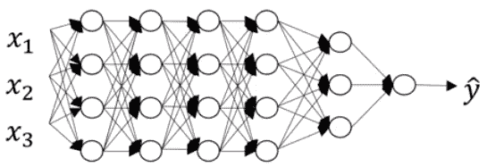

这里，我们可以看到以下内容：

+   *l*：层数：6

+   *n ^([l])*：第 *l* 层的节点数 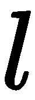

+   *n ^([0])*：输入层的节点数：3 ::

+   *n ^([1])*：第一层的节点数：4 ::

这个方程如下：

*n ^([2])= 4 :: n ^([3]) = 4 :: n ^([4]) = 4 :: n ^([5]) =3 :: n ^([6])= 1*

实现前向传播意味着隐藏层 1 可以通过以下方程表示：

…..(1)

你能确定 z、w 和 X 的前向传播维度吗？

让我们来讨论这个问题。*X*表示输入层向量或节点，我们知道有 3 个节点。我们能找出输入层的维度吗？嗯，是的，它是(*n^([0])*, 1)——或者你也可以说它是(3,1)。

对于第一隐藏层呢？由于第一隐藏层有三个节点，*z^([1])*的维度将是(*n^([1])*,1)。这意味着维度将是(4,1)。

*z^([1])*和 X 的维度已经被确定。通过观察前面的方程，很明显*z^([1])*和*w^([1])X*的维度必须相同（来自线性代数）。那么，你能推导出*w^([1])*的维度吗？我们知道，从线性代数的角度来看，矩阵 1 和矩阵 2 之间的乘法只有在矩阵 1 的列数等于矩阵 2 的行数时才可能。因此，*w^([1])*的列数必须等于矩阵 X 的行数。这将使得*w^([1])*的列数为 3。然而，正如我们已经讨论过的，*z^([1])*和*w^([1])X*的维度必须相同，因此前者的行数应该等于后者的行数。因此，*w^([1])*的行数将变为 4。好的，我们现在已经得到了*w^([1])*的维度，它是(4,3)。为了使这个结论更普遍，我们也可以说*w^([1])*的维度是(*n^([1]),*n^([0])*）。同样，*w^([2])*的维度将等于(*n^([2]),*n^([1])*）或者（当前层的节点数，前一层节点数）。这将使得*w^([2])*的维度为(4,4)。让我们来概括一下。让我们看看以下方程的维度：

*w^([1])= (n^([1]),n^([l-1]))*

那么，偏置*b^([1])*的维度是什么？你能利用线性代数并找出它吗？现在这对你来说应该像吃蛋糕一样简单。是的，你现在可能已经正确猜到了。它具有与*z^([1])*相同的维度。让我来解释这一点，为了大家的利益。根据方程，左侧的维度应该等于右侧的维度。此外，*w^([1])X + b^([1])*是两个矩阵的和，众所周知，只有当两个矩阵具有相同的维度时才能相加；也就是说，它们必须有相同的行数和列数。因此，*b^([1])*的维度将等于*w^([1])X*；反过来，它将等于*z^([1])*（它是(4,1)）。

在一般化的意义上，*b^([1])*的维度是( n^([1]), 1)*。

对于反向传播，情况如下：

+   *d**w^([l])*的维度= (n^([l]),n^([l-1]))*

+   *db**^([l])*的维度= (n^([l]), 1)*

# 前向和反向传播

让我通过一个例子向您展示正向传播和反向传播是如何工作的。

我们有一个具有两层（1 个隐藏层和 1 个输出层）的网络。每个层（包括输入层）都有两个节点。它还有偏置节点，如下面的图所示：

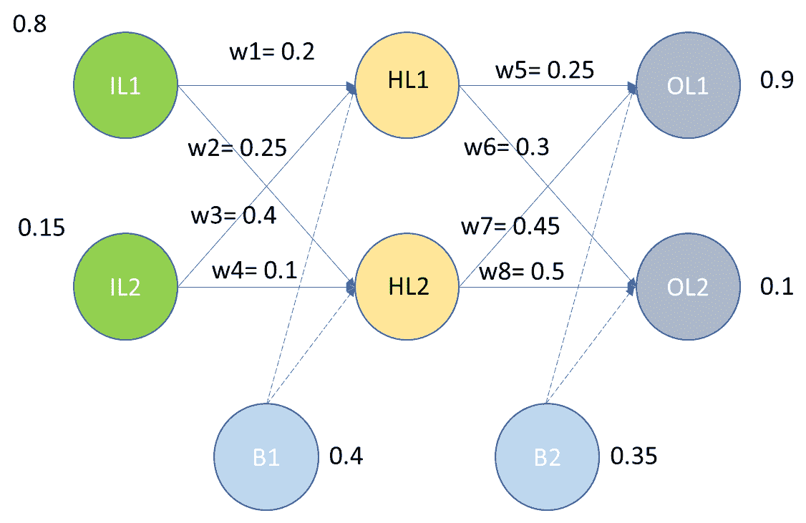

上图中使用的符号如下：

+   *IL*: 输入层

+   *HL*: 隐藏层

+   *OL*: 输出层

+   *w*: 权重

+   *B*: 偏置

我们已经得到了所有所需字段的值。让我们将这些值输入到网络中，看看它如何流动。这里使用的激活函数是 Sigmoid 函数。

传递给隐藏层第一个节点的输入如下：

*InputHL1 = w1*IL1 + w3*IL2 + B1*

*InputHL1= (0.2*0.8)+(0.4*0.15) + 0.4 =0.62*

传递给隐藏层第二个节点的输入如下：

*InputHL2 = w2*IL1 + w4*IL2 + B1*

*InputHL2 = (0.25*0.8) +(0.1*0.15) + 0.4 = 0.615*

为了找到输出，我们将使用我们的激活函数，如下所示：

*OutputHL1 = 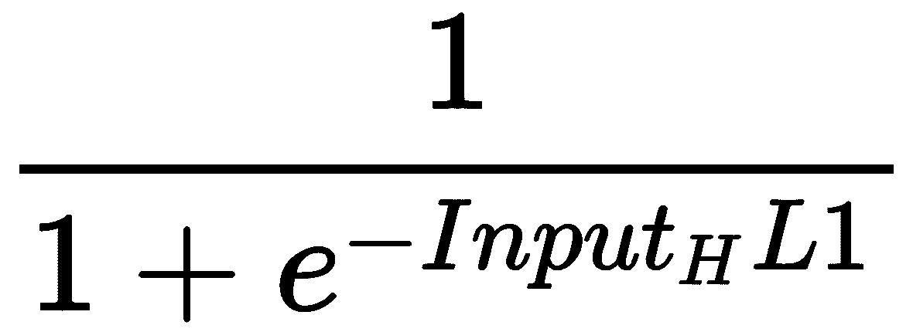  = 0.650219*

*OutputHL2 = 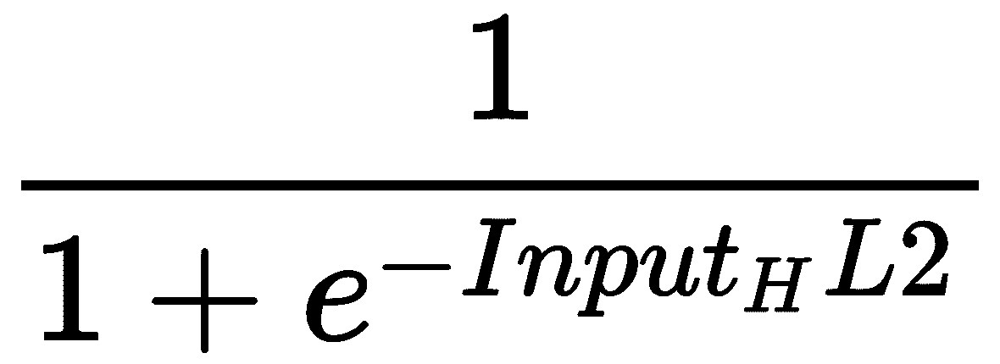= 0.649081*

现在，这些输出将作为输入传递到输出层。让我们计算输出层节点的输入值：

*InputOL1 = w5*Output_HL1 + w7*Output_HL2 + B2 = 0.804641*

*InputOL2= w6*Output_HL1 + w8*Output_HL2 + B2= 0.869606*

现在，让我们计算输出：

*Output[OL1] =  = 0.690966*

*Output[OL2] =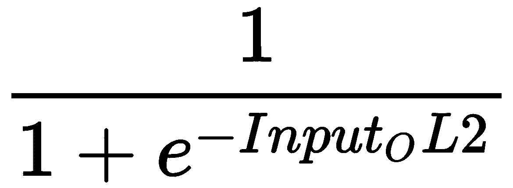 = 0.704664*

# 误差计算

我们现在可以使用平方误差函数计算每个输出神经元的误差，并将它们相加以得到总误差：

*Etotal = *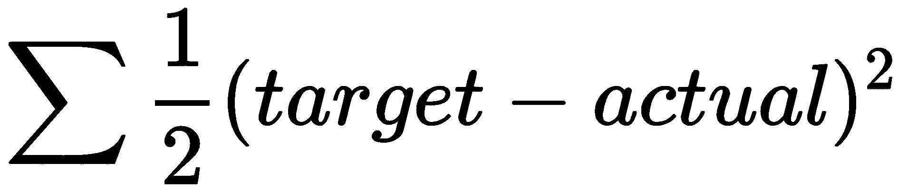

*EOL1 = 输出层第一个节点的误差 =*

*=0.021848*

*EOL2 = 输出层第二个节点的误差 =* 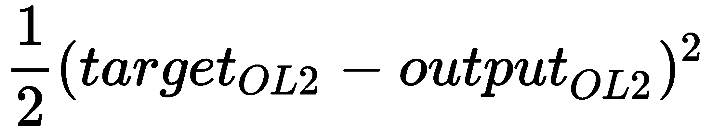

*=0.182809*

*Total Error = Etotal= EOL1 + EOL2 = 0.021848 + 0.182809 = 0.204657*

# 反向传播

反向传播的目的是更新网络中每个权重的值，以便它们使实际输出更接近目标输出，从而最小化每个输出神经元和整个网络的误差。

让我们先关注输出层。我们应该找出 w5 的变化对总误差的影响。

这将由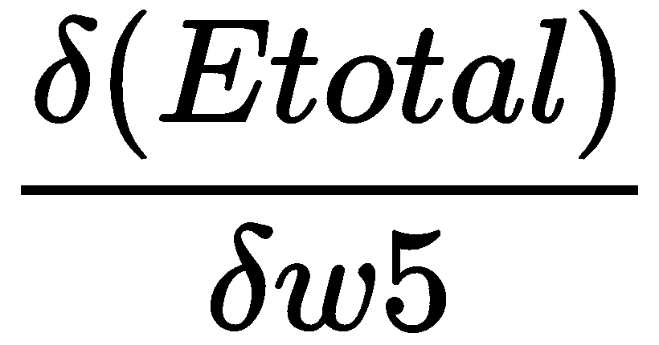决定。它是 Etotal 相对于 w5 的偏导数。

让我们应用链式法则：


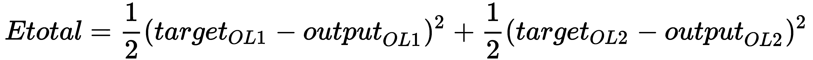

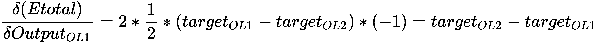

*= 0.690966 – 0.9 = -0.209034*

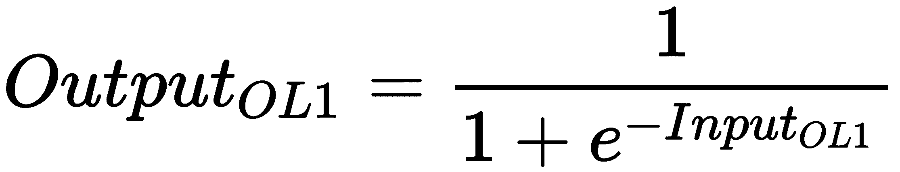

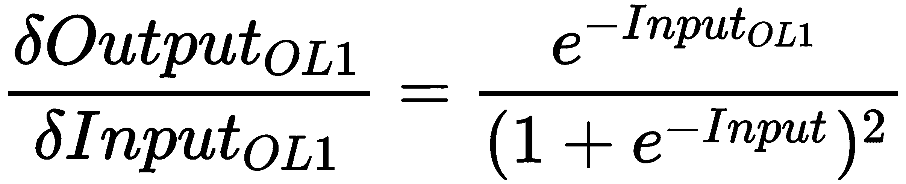

*= 0.213532*

*InputOL1 = w5*OutputHL1 + w7*OutputHL2 + B2*

*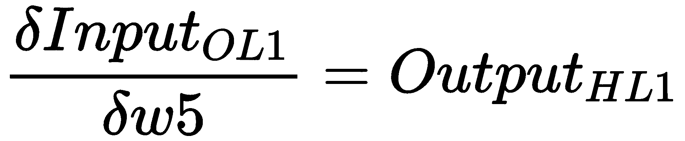= 0.650219*

现在，让我们回到旧方程：

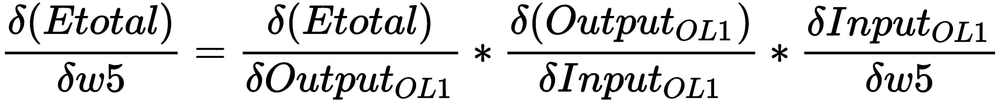

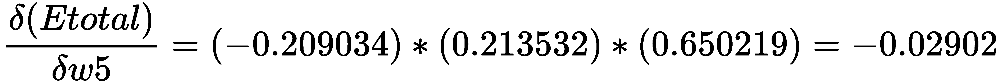

为了更新权重，我们将使用以下公式。我们已将学习率设置为 *α = 0.1*：

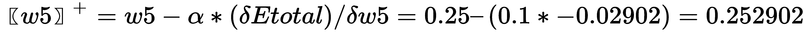

同样， 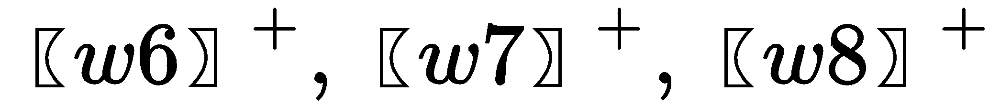 也应该被计算。方法保持不变。我们将留给你计算，因为它将帮助你更好地理解概念。

当涉及到隐藏层和计算时，方法仍然保持不变。然而，公式会有所变化。我会帮你弄清楚公式，但其余的计算必须由你自己完成。

我们在这里取 *w1*。

让我们在这里应用链式法则：

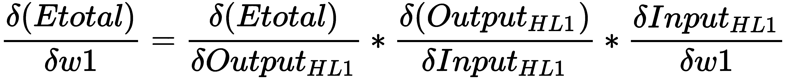

这个公式必须用于 *w2*、*w3* 和 *w4*。请确保你对 *E_total* 进行其他权重的偏导数，最后使用学习率公式来获取更新的权重。

# 前向传播方程

我们知道周围的方程。如果这个输入是 *a^([l-1])*，那么输出将是 *a^([l])*。然而，还有一个缓存部分，它就是 z*^([l])*，如下图中所示：


这里，这分解为 *w^([1])a^([l-1]) +b^([l])* （记住 *a^([0])* 等于 *X*）。

# 反向传播方程

执行反向传播需要以下方程：

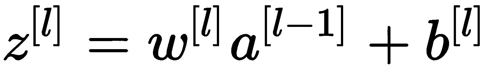

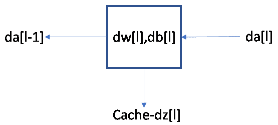

这些方程将给你一个关于幕后发生的事情的思路。在这里，添加了一个后缀，*d*，它表示在反向传播期间起作用的偏导数：

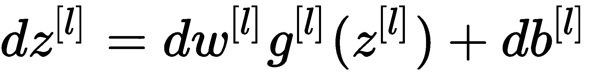

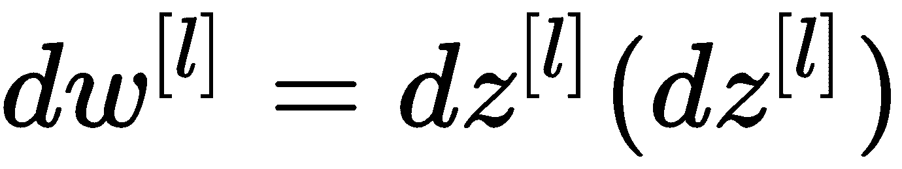

# 参数和超参数

当我们着手构建深度学习模型时，你需要知道如何同时监控参数和超参数。但我们到底理解得有多好呢？

当涉及到参数时，我们拥有权重和偏差。当我们开始训练网络时，首要步骤之一就是初始化参数。

# 偏置初始化

初始化偏置为零是一种常见做法，因为神经元的对称打破由随机权重的初始化来处理。

# 超参数

超参数是深度学习网络的基本构建块之一。它是决定网络最佳架构（例如，层数）的元素，也是确保网络如何训练的因素。

以下是深度学习网络的各个超参数：

+   **学习率**：这是负责确定网络训练速度的。慢速学习率确保平滑收敛，而快速学习率可能不会平滑收敛。

+   **周期**：周期数是在训练过程中网络消耗整个训练数据的次数。

+   **隐藏层数量**：这决定了模型的结构，有助于实现模型的最佳容量。

+   **节点数（神经元）**：应权衡使用的节点数。它决定了是否已经提取了所有必要的信息以产生所需输出。节点数将决定过拟合或欠拟合。因此，建议与正则化一起使用。

+   **Dropout**：Dropout 是一种正则化技术，通过避免过拟合来提高泛化能力。这在第四章《训练神经网络》中进行了详细讨论。Dropout 值可以在 0.2 到 0.5 之间。

+   **动量**：这决定了向收敛方向下一步的方向。在 0.6 到 0.9 之间，它处理振荡。

+   **批量大小**：这是输入到网络中的样本数，之后发生参数更新。通常，它取 32、64、128、256。

为了找到最佳的超参数数量，部署网格搜索或随机搜索是明智的。

# 用例 - 数字识别器

**修改后的国家标准与技术研究院**（**MNIST**）实际上是为计算机视觉的“hello world”准备的。考虑到它在 1999 年的发布，这个数据集已经作为基准分类算法的主要基础。

我们的目标是从包含数万张手写图像的数据集中正确识别数字。我们精心制作了一套教程风格的内核，涵盖了从回归到神经网络的所有内容：

```py
import numpy as np
import pandas as pd
import matplotlib.pyplot as plt
import matplotlib.image as mpimg
import seaborn as sns
%matplotlib inline
from sklearn.model_selection import train_test_split
import itertools
from keras.utils.np_utils import to_categorical # convert to one-hot-encoding
from keras.models import Sequential
from keras.layers import Dense, Dropout, Flatten, Conv2D, MaxPool2D
from keras.optimizers import SGD
from keras.preprocessing.image import ImageDataGenerator
sns.set(style='white', context='notebook', palette='deep')
np.random.seed(2)

# Load the data
train = pd.read_csv("train.csv")
test = pd.read_csv("test.csv")

Y_train = train["label"]
# Drop 'label' column
X_train = train.drop(labels = ["label"],axis = 1)

Y_train.value_counts()
```

前一段代码的输出如下：

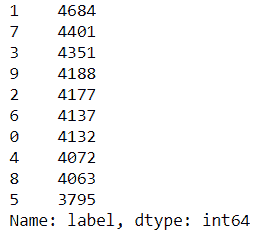

```py
X_train.isnull().any().describe()
```

这里，我们得到以下输出：

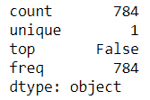

```py
test.isnull().any().describe()
```

这里，我们得到以下输出：

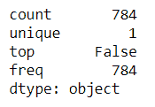

```py
X_train = X_train / 255.0
test = test / 255.0
```

通过将图像重塑为 3 维，我们得到以下结果：

```py
 Reshape image in 3 dimensions (height = 28px, width = 28px, canal = 1)
X_train = X_train.values.reshape(-1,28,28,1)
test = test.values.reshape(-1,28,28,1)

Encode labels to one hot vectors 
Y_train = to_categorical(Y_train, num_classes = 10)

# Split the dataset into train and the validation set 
X_train, X_val, Y_train, Y_val = train_test_split(X_train, Y_train, test_size = 0.1, random_state=2)
```

执行以下代码后，我们将能够看到编号的图表：

```py
pic = plt.imshow(X_train[9][:,:,0])
```

输出如下：

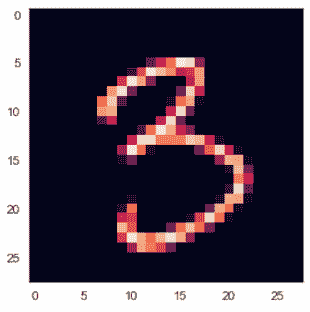

顺序模型现在如下：

```py
model = Sequential()
model.add(Conv2D(filters = 32, kernel_size = (5,5),padding = 'Same', activation ='relu', input_shape = (28,28,1)))
model.add(Conv2D(filters = 32, kernel_size = (5,5),padding = 'Same', activation ='relu'))
model.add(MaxPool2D(pool_size=(2,2)))
model.add(Dropout(0.25))
model.add(Conv2D(filters = 64, kernel_size = (3,3),padding = 'Same', activation ='relu'))
model.add(Conv2D(filters = 64, kernel_size = (3,3),padding = 'Same', activation ='relu'))
model.add(MaxPool2D(pool_size=(2,2), strides=(2,2)))
model.add(Dropout(0.25))
model.add(Flatten())
model.add(Dense(256, activation = "relu"))
model.add(Dropout(0.5))
model.add(Dense(10, activation = "softmax"))
```

当我们定义优化器时，我们得到以下输出：

```py
# Define the optimizer
optimizer = SGD(lr=0.01, momentum=0.0, decay=0.0)
```

当我们编译模型时，我们得到以下输出：

```py
# Compile the model
model.compile(optimizer = optimizer, loss = "categorical_crossentropy", metrics=["accuracy"])

epochs = 5
batch_size = 64
```

接下来，我们生成图像生成器：

```py
datagen = ImageDataGenerator(
 featurewise_center=False, # set input mean to 0 over the dataset
 samplewise_center=False, # set each sample mean to 0
 featurewise_std_normalization=False, # divide inputs by std of the dataset
 samplewise_std_normalization=False, # divide each input by its std
 zca_whitening=False, # apply ZCA whitening
 rotation_range=10, # randomly rotate images in the range (degrees, 0 to 180)
 zoom_range = 0.1, # Randomly zoom image 
 width_shift_range=0.1, # randomly shift images horizontally (fraction of total width)
 height_shift_range=0.1, # randomly shift images vertically (fraction of total height)
 horizontal_flip=False, # randomly flip images
 vertical_flip=False) # randomly flip images
datagen.fit(X_train)

history = model.fit_generator(datagen.flow(X_train,Y_train, batch_size=batch_size),
 epochs = epochs, validation_data = (X_val,Y_val),
 verbose = 2, steps_per_epoch=X_train.shape[0] // batch_size)
```

输出如下所示：

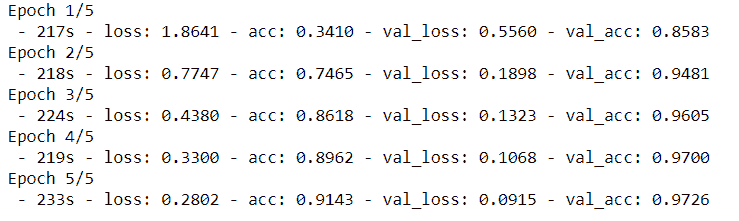

我们预测模型如下：

```py
results = model.predict(test)
# select with the maximum probability
results = np.argmax(results,axis = 1)
results = pd.Series(results,name="Label")
results
```

输出如下所示：

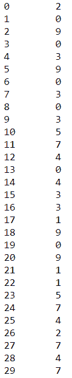

# 生成对抗网络

**生成对抗网络（GANs**）是另一种深度神经网络架构，是两个相互竞争和合作的网络的组合。它由 Ian Goodfellow 和 Yoshua Bengio 于 2014 年提出。

GANs 可以学习模仿任何数据分布，这理想情况下意味着 GANs 可以被训练来创建与现有领域中的任何类似的对象，例如图像、音乐、语音和散文。它可以创建任何从未存在过的物体的照片。从某种意义上说，它们是机器人艺术家，它们的输出令人印象深刻。

它属于无监督学习，其中两个网络在训练过程中各自学习其任务。其中一个网络被称为**生成器**，另一个被称为**判别器**。

为了使这更容易理解，我们可以将**生成对抗网络（GAN**）想象成一个伪造者（生成器）和警察（判别器）的案例。一开始，伪造者向警察展示假币。警察就像侦探一样，发现这些是假币（如果你想了解判别器是如何工作的，也可以把 D 想象成侦探）。警察将他的反馈传递给伪造者，解释为什么这些钱是假的。伪造者根据收到的反馈做一些调整，并基于这些反馈制作新的假币。警察说这些钱仍然是假的，并将他的新反馈与伪造者分享。然后，伪造者根据最新的反馈尝试制作新的假币。这个过程无限循环，直到警察被这些看起来真实的假币欺骗。当创建 GAN 模型时，生成器和判别器从零开始相互学习。它们似乎是对抗的，但实际上它们在互相帮助学习。这两个之间的反馈机制有助于模型变得更加鲁棒。

判别器是一个非常优秀的学习者，因为它能够从现实世界中学习任何东西。也就是说，如果你想让它学习关于猫和狗的图片，以及它被要求区分的 1,000 个不同类别，它将能够轻松做到，就像这样：

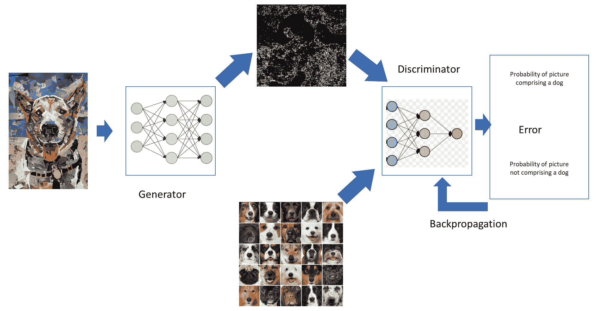

噪声进入生成器；然后，生成器的输出通过判别器，我们得到一个输出。同时，判别器正在对狗的图片进行训练。然而，在最开始，即使是狗的图片也可能被判别器错误地分类为非狗图片，并注意到这个错误。这个错误通过网络反向传播。

# 霍 inton 的胶囊网络

深度学习之父杰弗里·辛顿通过引入一个新的网络在深度学习领域引起了巨大的轰动。这个网络被称为**胶囊网络**（**CapsNet**）。还提出了一个训练这个网络的算法，称为**胶囊之间的动态路由**。辛顿首次在 2011 年的论文《转换自编码器》中提到了它。2017 年 11 月，辛顿和他的团队发表了一篇关于胶囊网络的完整论文。

# 胶囊网络和卷积神经网络

**卷积神经网络**（**CNN**）是深度学习领域的一个重要里程碑。它让每个人都感到兴奋，也是新研究的基础。但是，正如人们所说，*世界上没有什么是完美的*。我们心爱的 CNN 也不例外。

你能回忆起 CNN 是如何工作的吗？CNN 最重要的任务是执行卷积。这意味着一旦你将一张图片通过 CNN，卷积层就会从图像像素中提取出特征，如边缘和颜色梯度。其他层会将这些特征组合成一个更复杂的特征。而且，一旦密集层被保留，它就使得网络能够执行分类任务。以下图表显示了我们在工作的图像：

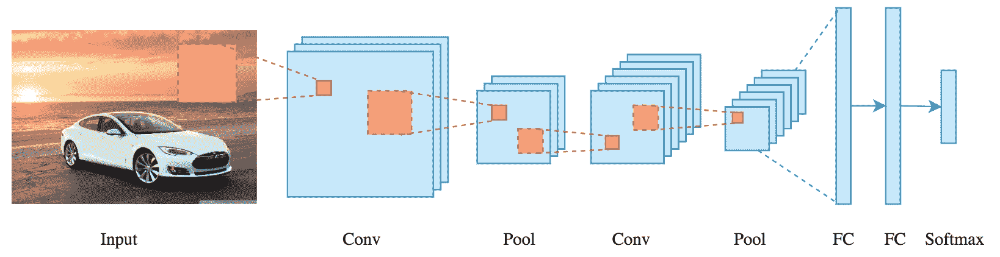

上述图表是一个基本的 CNN 网络，它被用来检测图像中的汽车。以下图表显示了同一辆车的完整图像和碎片化图像：

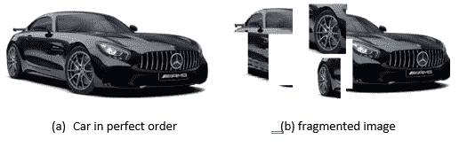

假设我们将这两张图片通过 CNN 网络（用于检测汽车）传递过去——网络对这两张图片的响应会是什么？你能思考一下并给出答案吗？为了帮助你，一辆车有几个组成部分，如车轮、挡风玻璃、引擎盖等，但人类眼睛认为当所有这些部分/组件按顺序排列时，它才是一辆车。然而，对于 CNN 来说，只有特征才是重要的。CNN 不考虑相对位置和方向关系。因此，这两张图片都将被网络分类为汽车，尽管这在人类眼中并非如此。

为了弥补这一点，CNN 包括最大池化，这有助于增加更高层神经元的视野，从而使得检测更高阶特征成为可能。最大池化使得 CNN 能够工作，但同时也发生了信息损失。这是 CNN 的一个大缺点。

# 摘要

在本章中，我们研究了深度神经网络以及为什么我们需要深度学习模型。我们还学习了前向和反向传播，以及参数和超参数。我们还讨论了 GANs、深度高斯过程、胶囊网络和 CNN。

在下一章中，我们将研究因果推断。
