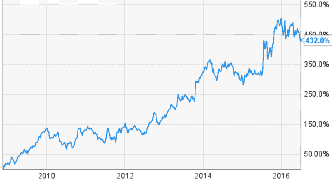
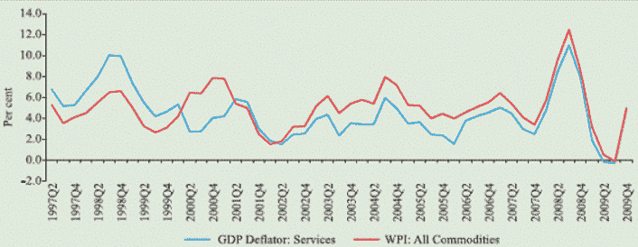
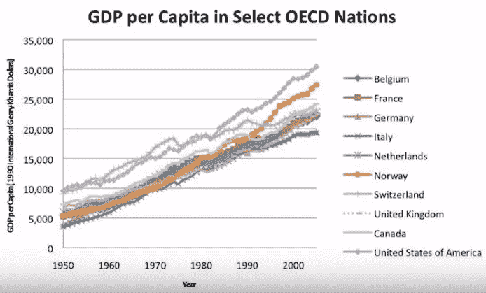
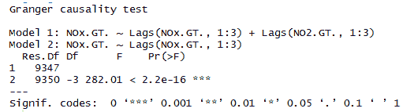
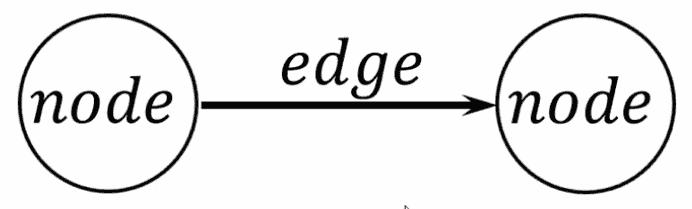
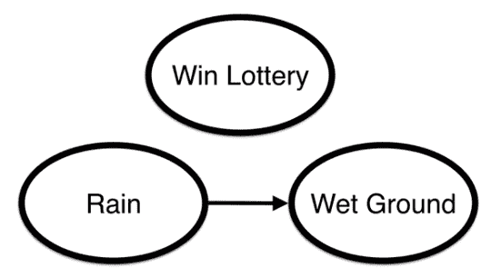
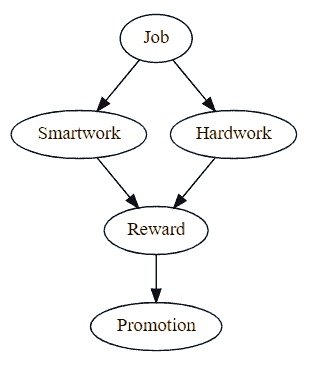
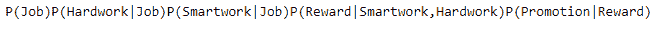
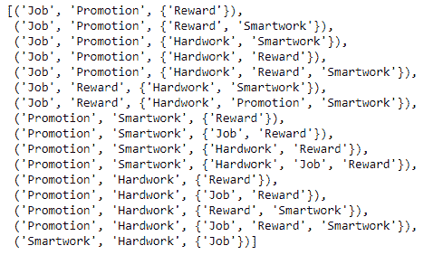
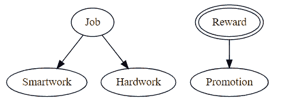

# 因果推断

在本章的最后，我们将学习以下主题：

+   时间序列中的格兰杰因果性（因果关系的计量经济学方法）

+   图形模型因果关系

# 格兰杰因果性

在时间序列中，我们通常使用单变量数据。也就是说，我们使用一个序列来预测其未来的值。比如说，我们正在研究谷歌的股价数据，并被要求预测股价的未来值。在这种情况下，我们需要谷歌股价的历史数据。基于这些数据，我们将做出预测。

然而，有时我们需要多个时间序列来进行预测。但为什么我们需要多个时间序列呢？有什么猜测吗？

下面的图表显示了谷歌的股价数据：



答案是我们需要理解和探索多个时间序列之间的关系，因为这可以提高我们的预测能力。例如，我们得到了**GDP 平减指数：服务业**和**WPI：所有商品**的相关时间序列，如下所示：



这两点似乎存在某种关系。当我们需要预测**GDP 平减指数：服务业**时，我们可以使用**WPI：所有商品**的时间序列数据作为输入。这被称为**格兰杰因果性**。

更恰当地说，格兰杰因果性是调查时间序列中两个变量之间因果关系的一种方法。这种方法是因果关系的概率描述。

尽管我们在这里讨论的是因果关系，但这并不完全相同。通常，因果关系与变量 1 是变量 2 的原因或反之亦然的情况相关联。然而，在格兰杰因果性中，我们并不测试真正的因果关系。基本的原因是要知道在时间序列中是否**某个变量先于另一个变量出现**。

你并不是在测试真正的因果关系。你想要了解的是否是某个变量在时间序列中是否先于另一个变量出现。也就是说，如果我们发现数据中存在格兰杰因果性，那么在真正的意义上，并不存在任何因果关系。

当计量经济学家说“原因”时，他们的意思是格兰杰-原因，尽管一个更合适的词可能是优先级。格兰杰因果性是由 2003 年诺贝尔经济学奖获得者，Clive Granger 教授提出的。

让我们再看一个例子。这里，我们有经合组织国家的每人 GDP。我们可以看到，经合组织国家的 GDP 数量在增长和模式上相似。我们可以假设这些国家由于相互依赖而相互负责各自的 GDP 增长。

下面的图表显示了经合组织国家的每人 GDP：



我们可以利用一个国家的序列来预测另一个国家。这种情况通常在金融时间序列中更为普遍。印度的股票市场，如 NSE/BSE 等，可能会影响 NYSE。因此，NYSE 指数可以用来预测 NSE 指数。

让我们在其中加入一点数学。假设有两个时间序列，*X(t)* 和 *Y(t)*。如果 *X(t)* 的过去值有助于预测 *Y(t)* 的未来值，那么可以说 *X(t)* 格兰杰引起 *Y(t)*。

因此，*Y(t)* 是 *Y(t)* 的滞后和 *X(t)* 的滞后的函数。它可以表示为如下：

*Y(t) = f(Yt-p, Xt-p)*

然而，这仅在以下情况下成立：

+   原因发生在结果之前。这意味着 *Y(t) = f(Xt-1)*，

+   原因对其效果的未来值有显著信息，例如：

*Y(t) = a1 Yt-1 + b1 Xt-1 + error*

*Xt-1* 在 *Y(t)* 上增加了一个额外的效果。效果的大小由 *b1* 决定。

假设我们有两个方程：

*Yt= a0+ a1* Yt-1*

*Yt= a0 + a1*Yt-1 + a2*Xt-1*

此处的零假设如下：

+   *H0: a2=0*: 这意味着没有其他序列对 *Yt* 的 *Xt-1* 产生影响

此处的备择假设如下：

+   *H1: a2≠ 0*: 这意味着存在其他序列对 *Xt-1* 对 *Yt* 的显著影响

我们运行 t 检验以确定其他序列 *Xt-1* 对 *Yt* 是否有显著影响。

如果拒绝零假设，我们可以说这是一个格兰杰因果关系的情况。

# F 检验

运行此测试的基本步骤如下：

1.  构建零假设及其备择假设。

1.  选择滞后项。这可以取决于你拥有的数据量。选择滞后 i 和 j 的一种方法是通过运行模型阶数测试。选择多个值并运行格兰杰测试，以查看不同滞后水平的结果是否相似。

1.  还要确定 f 值。两个方程可以用来找出对于所有滞后 *j*，*βj = 0* 是否成立。

# 局限性

这种方法的不同局限性如下：

+   格兰杰因果关系并非真正的因果关系

+   如果 *X(t)* 通过第三个变量 *Z(t)* 影响 *Y(t)*，那么很难找到格兰杰因果关系

# 用例

在这里，我们有一个名为`AirQualityUCI`的多元时间序列数据集。我们必须测试 NOx 是否对 NO2 有格兰杰因果关系。

由于我们没有 Python 中用于多元格兰杰因果关系的库，我们将使用 R 的`lmtest`包来完成这项工作。

加载`lmtest`库。如果库不存在，你需要按照以下方式安装它：

```py
install.packages("lmtest")
library(lmtest)
```

加载数据。然后，使用`grangertest`函数找出 NOx 和 NO2 之间是否存在任何显著关系：

```py
data= read.csv("AirQualityUCI.csv")
grangertest(NOx.GT. ~ NO2.GT., order = 3, data = data)
```

输出如下：



因此，f 检验变得显著，这意味着滞后 NO2 的系数对 NOx 有显著影响。

# 图形因果模型

该模型在第八章*，概率图模型*中进行了详细说明。我们也会在这里简要地探讨它。

贝叶斯网络是有向无环图（DAGs），其中节点代表感兴趣的变量（例如，设备的温度，患者的性别，物体的特征，事件的发生，等等）。变量之间的因果影响通过链接表示。影响强度可以通过与网络中父节点和子节点簇相关的条件概率来描绘。在以下图表中，我们可以看到具有节点和边的因果模型：



节点代表变量，边代表变量之间的条件关系。我们正在寻找的是完整的联合概率分布。在这里，正在讨论条件依赖性。雨导致地面变湿。然而，赢得彩票与其他变量无关。它具有条件独立性，如以下图表所示：



这里，条件独立性的概率如下：

*P(彩票，雨，湿地面)= P(彩票) P(雨) P(雨|湿地面)*

因此，我们可以这样说，贝叶斯网络通过将条件概率作为边来描述所有变量之间的概率分布。

让我们看看一个 Python 的例子：

1.  首先，我们需要加载库，`CausalGraphicalModel`，如下所示：

```py
from causalgraphicalmodels import CausalGraphicalModel
```

1.  让我们为以下条件设置模型：如果某人正在做`Job`，并且它由`Smartwork`和`Hardwork`供电，那么他/她将获得奖励，并最终获得晋升：

```py
Model = CausalGraphicalModel(
 nodes=["Job", "Smartwork", "Hardwork", "Reward", "Promotion"],
 edges=[
 ("Job", "Smartwork"), 
 ("Job", "Hardwork"), 
 ("Smartwork", "Reward"),
 ("Hardwork", "Reward"), 
 ("Reward", "Promotion")
 ]
)
Model.draw()
```

以下代码的输出如下：



1.  让我们获取分布：

```py
print(Model.get_distribution())

```

然后，我们将得到以下输出：



1.  让我们提取所有的条件独立性关系：

```py
Model.get_all_independence_relationships()
```



在这里，我们能够评估变量之间的条件独立性。

1.  让我们把`Reward`混合进来：

```py
Intervene = Model.do("Reward")
Intervene.draw()
```



# 摘要

在本章中，我们研究了格兰杰因果性，这是使用单一时间序列来预测其未来值，以及不同的图形因果模型。图形因果模型涵盖了两个例子，这将给我们一个关于图形因果模型的基本概念。
