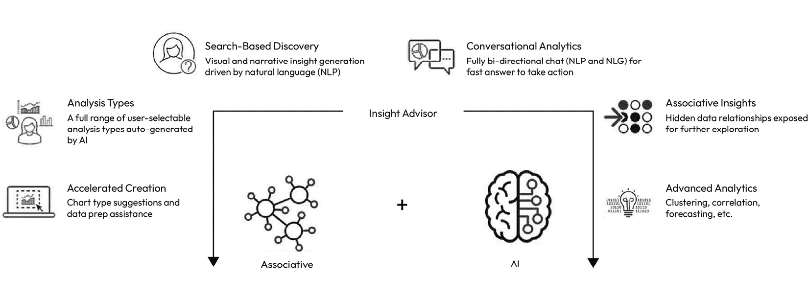
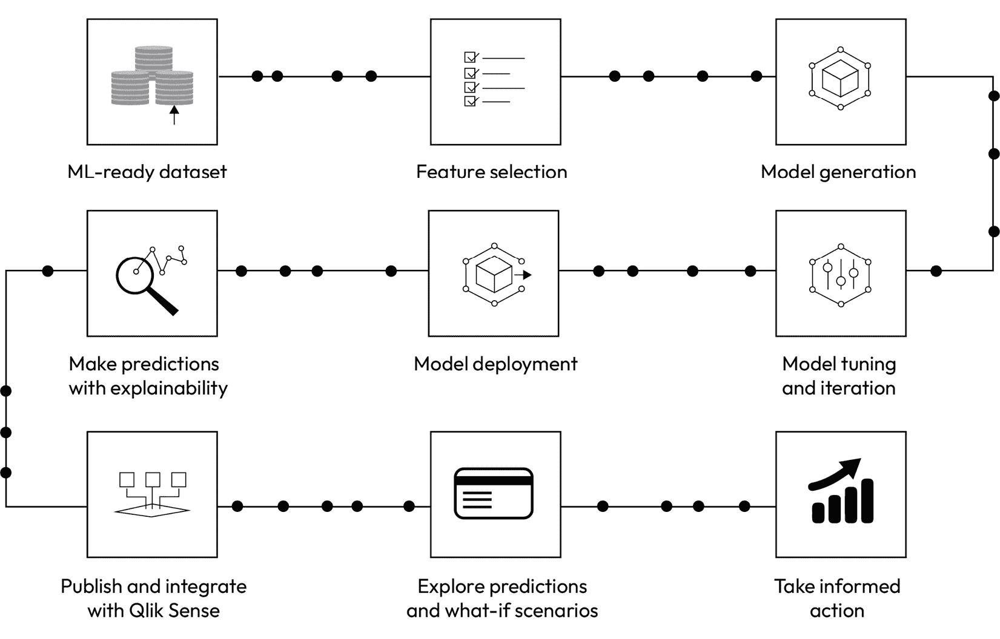
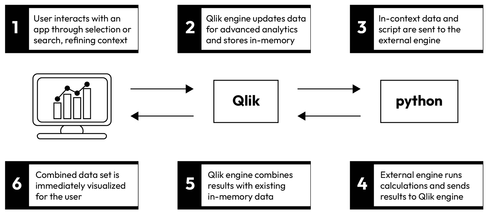
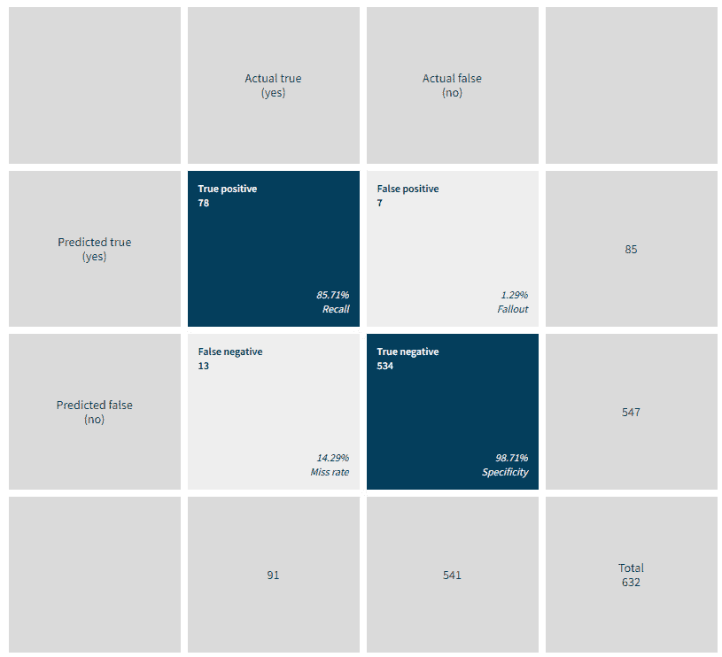
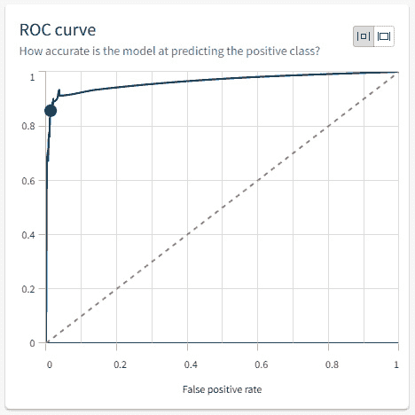
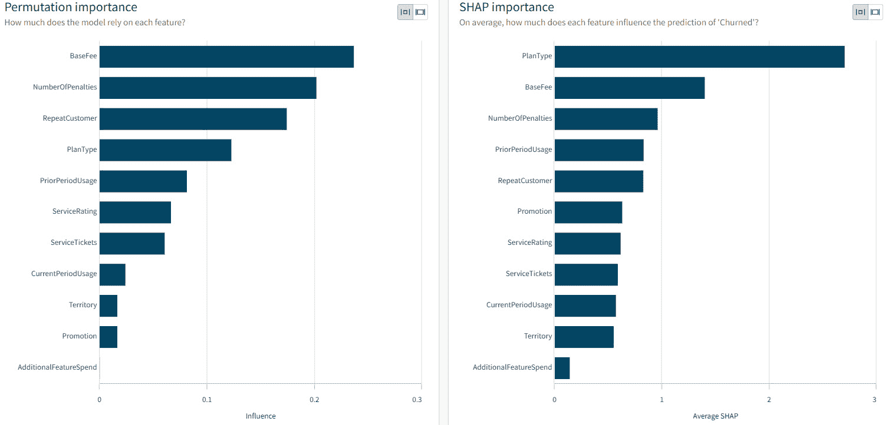

# 1

# 使用 Qlik 介绍机器学习

机器学习和人工智能是 21 世纪最强大的技术趋势之一。这些技术的使用正在迅速增长，因为对更快洞察和预测的需求已成为公司至关重要的因素。Qlik 是分析领域的领先供应商，并在机器学习和 AI 工具上进行了大量投资。

本章将介绍 Qlik 生态系统中的不同机器学习工具，并提供这些工具背后的统计模型和原理的基本信息。它还将涵盖正确样本大小和如何分析模型性能和可靠性的概念。

在本章中，我们将涵盖以下内容：

+   Qlik 工具和平台概述

+   机器学习的基本统计概念

+   正确样本大小和样本定义因素

+   如何评估模型性能和可靠性

# Qlik 工具介绍

Qlik Sense 是领先的数据分析和商业智能平台，包含许多与机器学习相关的数据分析和功能。在本章中，我们将更深入地了解 Qlik 平台的关键特性。

Qlik 平台上的机器学习和 AI 功能可以分为三个不同的组件：

+   Insight Advisor

+   Qlik AutoML

+   高级分析集成

## Insight Advisor

Qlik Insight Advisor 是 Qlik Sense 的一个功能，它使用自然语言处理（NLP）和机器学习来帮助用户更有效地探索和分析数据。它允许用户用自然语言提出关于他们数据的问题，并实时接收见解和建议。它还自动生成高级分析和可视化，并协助分析和数据准备。

Insight Advisor 结合了 Qlik 的关联引擎和增强智能引擎，支持广泛的应用场景，如下图所示：



图 1.1：Qlik Insight Advisor 和不同场景

你知道吗？

Qlik 关联引擎是驱动 Qlik 数据分析和商业智能平台的核心技术。它是一个强大的内存引擎，使用关联数据模型，使用户能够以比传统基于查询的工具更直观、更自然的方式探索数据。

与预定义的查询或数据模型不同，该引擎根据常见的字段或属性自动关联多个表和数据源中的数据，并使用一种专利的索引技术将所有数据存储在内存中，从而实现实时分析和探索甚至最大的数据集。这是一项强大且创新的技术，支撑着整个 Qlik 平台。

Insight Advisor 具有以下关键特性：

+   **高级洞察生成**：Insight Advisor 提供了一种揭示新和隐藏洞察的方法。它使用多种形式交付 AI 生成的分析。用户可以从全系列的分析类型中选择，这些类型是自动生成的。这些类型包括可视化、叙事洞察和整个仪表板。还支持高级分析，Insight Advisor 可以生成比较、排名、趋势、聚类、地理分析、时间序列预测等。

+   **基于搜索的视觉发现**：Insight Advisor 根据自然语言查询自动生成对用户最相关和最有影响力的可视化。它提供了一套用户可以编辑和微调后添加到仪表板上的图表。它是上下文感知的，并通过生成的可视化反映选择。它还建议探索的最重要数据关系。

+   **会话式分析**：Insight Advisor 中的会话式分析允许用户使用自然语言进行交互。Insight Advisor Chat 为整个 Qlik 平台提供完整的会话式分析体验。它理解用户意图，并为更深入的理解提供额外的见解。

+   **加速创建和数据准备**：加速创建和数据准备帮助用户使用传统的构建过程创建分析。它就数据中的关联和关系提供建议。它还提供图表建议，并为每个用例渲染最佳类型的可视化，这使得非技术用户能够充分利用分析数据。数据准备的一部分还涉及智能配置文件，它提供有关数据的描述性统计信息。

注意

在*第九章*中可以找到一个使用 Insight Advisor 的动手示例，其中你将获得一个最重要的功能在实际操作中的实用示例。

## Qlik AutoML

Qlik AutoML 是一个自动化的机器学习工具，它使 AI 生成的机器学习模型和预测分析对所有用户可用。它允许用户通过直观的、无代码的用户界面轻松生成机器学习模型、进行预测和规划决策。

AutoML 连接并分析数据，识别数据集中的关键驱动因素，并生成和优化模型。它允许用户创建未来预测并测试假设情景。结果以预测影响因素数据（Shapley 值）在记录级别返回，使用户能够理解预测的原因。这对于根据结果采取正确的行动至关重要。

预测数据可以发布到 Qlik Sense 进行进一步分析，并且可以使用高级分析集成将模型集成以进行实时探索性分析。

使用 AutoML 简单易行，不需要全面的数据科学技能。用户必须首先选择目标字段，然后 AutoML 将运行以下图所示的各个步骤：



图 1.2：AutoML 流程

模型建立和训练完成后，AutoML 允许用户对当前数据集进行预测。部署的模型既可以从 Qlik 工具中，也可以从其他分析工具中使用。AutoML 还提供了一个 REST API 来消费部署的模型。

注意

更多关于 AutoML 的信息，包括实践示例，可以在*第八章*中找到。

## 高级分析集成

**高级分析集成**是将高级分析和机器学习模型直接集成到 Qlik 数据分析平台的能力。这种集成使用户能够结合高级分析的力量与 Qlik 的数据探索和可视化能力，从而从数据中获得更深入的见解。

高级分析集成基于开放的 API，它提供了 Qlik 关联引擎与第三方数据科学工具之间的直接、引擎级别的集成。当用户与软件交互时，数据正在交换，计算也在实时进行。根据用户的选择和上下文，只有相关的数据从关联引擎传递到第三方工具。工作流程在以下图中解释：



图 1.3：高级分析集成数据流

高级分析集成可以与任何外部计算引擎一起使用，但为 Amazon SageMaker、Amazon Comprehend、Azure ML、Data Robot 以及使用 R 和 Python 制作的定制模型提供了原生连接。Qlik AutoML 也可以利用高级分析集成。

注意

更多信息，包括关于高级分析集成的实际示例，可以在*第七章*中找到。关于本地环境所需组件的安装在第*第五章*中描述。

# 使用 Qlik 解决方案的基本统计概念

现在我们已经介绍了 Qlik 工具，我们将探讨一些与它们一起使用的统计概念。统计原理在机器学习算法的开发中起着至关重要的作用。这些原理为分析和建模数据、进行预测以及随着时间的推移提高机器学习模型的准确性提供了数学框架。在本节中，我们将熟悉在构建机器学习解决方案时所需的一些关键概念。

## 数据类型

不同数据类型以不同的方式处理，每种类型都需要不同的技术。在典型的机器学习解决方案中，有两种主要的数据类型：分类和数值。

分类数据通常使用名称或标签来定义一个组或类别。分类数据集中的每个数据点只分配给一个类别，并且每个类别是互斥的。分类数据可以进一步分为名义数据和有序数据。名义数据是命名或标记类别的数据类别。有序数据是由具有排名、顺序或评分尺度的元素构成的。有序数据可以排序或计数，但不能测量。一些机器学习算法无法处理分类变量，除非将这些变量（编码）转换为数值。

数值数据可以分为可计数的离散数值数据。它使用自然数形成，例如，年龄、公司员工数量等。数值数据的另一种形式是连续数据。此类数据的例子可以是人的身高或学生的分数。需要注意的一种数据类型是日期时间信息。日期和时间通常在机器学习模型中很有用，但需要一些工作才能将它们转换为数值数据。

## 平均数、中位数和众数

平均数是通过将数据集中所有值的总和除以值的数量来计算的。简化的方程可以形成如下：

平均数 = 数据点总和 __________________ 数量数据点

以下是一个计算数据点集合平均数的简单示例：

*X = [**5,15,30,45,50**]*

*X*̅ *= (*5+15+30+45+50)/5*

*X*̅ *=* *29*

平均数对异常值敏感，这些异常值会显著影响其值。平均数通常写作 *X*̅*.*

**中位数**是排序数据集的中间值。使用前面示例中的数据集，我们的中位数是 30。中位数相对于平均数的主要优点是中位数受异常值的影响较小。如果存在异常值的高概率，最好使用中位数而不是平均数。如果我们数据集中的数据点数量是偶数，则中位数是两个中间点的平均值。

**众数**代表数据集中的最常见值。它主要用于需要理解聚类或，例如，编码的分类数据的情况。计算众数相当简单。首先，我们需要对所有值进行排序，并计算每个值在集合中出现的次数。出现次数最多的值就是众数。以下是一个简单示例：

*X = [**1,4,4,5,7,9**]*

众数 = 4，因为它出现了两次，而所有其他值只出现了一次。数据集也可以有多个众数（多众数数据集）。在这种情况下，两个或多个值以最高的频率出现。

## 方差

**方差** (*σ2*) 是一个描述数据集中数据变异程度或分布的统计量。它是数据集平均值与所有值平方差的平均值。

换句话说，方差衡量每个数据点与数据集平均值偏离的程度。低方差表示数据点紧密围绕平均值聚集，而高方差表示数据点从平均值向外更广泛地分散。

方差的公式如下：

σ² = Σ (xi − x̅)² / (n − 1)

其中 *σ²* 是数据集的方差，*n* 是集合中的数据点数量，*Σ* 是每个数据点（*xi*）与平均值（*x̅*）之间平方差的和。方差的平方根是标准差。

方差是统计学和机器学习中的一个重要概念，因为它被用于计算许多其他统计量，包括标准差和协方差。它也常用于评估模型性能和比较不同的数据集。

方差用于查看数据集中各个值之间的关系。其优点是方差将所有偏离平均值的差异视为相同，无论方向如何。

示例

我们有一支股票在第一年回报率为 15%，第二年回报率为 25%，第三年回报率为-10%。回报率的平均值是 10%。每年回报率与平均值的差异是 5%，15%，和-20%。将这些值平方后得到 0.25%，2.25%，和 4%。如果我们把这些值加起来，我们会得到 6.5%。当除以 2（3 个观察值-1）时，我们得到方差为 3.25%。

## 标准差

**标准差**是一种统计量，它量化了一组数据中的变异或分散程度。它衡量单个数据点与数据集平均值偏离的程度。

低标准差表示数据点接近平均值，而高标准差表示数据点从平均值向外更分散。

标准差的公式如下：

σ = √Σ (xi − x̅)² / (n − 1)

其中 *σ* 是标准差，*Σ* 是每个数据点（*xi*）与平均值（*x̅*）之间平方差的和，*n* 是数据点的数量。

示例

继续我们之前的例子，我们得到了我们股票的方差为 3.25%。对方差开平方得到标准差为 18%。

## 标准化

**标准化**或**Z 分数归一化**是将不同变量归一化到相同尺度的概念。这种方法允许比较不同类型变量之间的分数。Z 分数是平均值的标准差的分数表示。我们可以使用以下公式来计算 z 分数：

z = (x − x̅) / σ

在公式中，*x* 是观察值，*x̅* 是平均值，*σ* 是数据的标准差。

基本上，z 分数描述了特定数据点与平均值相差多少个标准差。如果一个数据点的 z 分数较高，这表明该数据点很可能是异常值。Z 分数标准化是数据科学中最受欢迎的特征缩放技术之一，并且是一个重要的预处理步骤。许多机器学习算法试图在数据中找到趋势并比较数据点的特征。如果特征处于不同的尺度上，这会成为一个问题，这就是为什么我们需要标准化。

注意

标准化数据集将具有 0 的平均值和 1 的标准差，但没有最大值和最小值的具体界限。

## 相关性

**相关性**是一个描述两个变量之间关系的统计量。它衡量一个变量的变化与另一个变量的变化相关联的程度。

存在两种类型的关联：正相关和负相关。正相关意味着两个变量向同一方向移动，而负相关意味着两个变量向相反方向移动。相关系数为 0 表示变量之间没有关系。

最常用的相关性度量是**皮尔逊相关系数**，其范围从-1 到 1。-1 的值表示完全负相关，0 的值表示没有相关性，1 的值表示完全正相关。

当变量的关系是线性的，并且两个变量都是定量和正态分布时，可以使用皮尔逊相关系数。数据集中不应存在异常值。

可以使用 R 中的`cor()`函数或 Python 中的`scipy.stats`或`NumPy`库来计算相关性。

## 概率

**概率**是机器学习中的一个基本概念，用于量化事件或结果的不确定性。概率的基本概念包括以下内容：

+   **随机变量**：其值由机会决定的变量。随机变量可以是离散的或连续的。

+   **概率分布**：描述随机变量不同值可能性的函数。常见的概率分布包括正态分布、二项分布和泊松分布。

+   **贝叶斯定理**：概率论中的一个基本定理，描述了条件概率之间的关系。贝叶斯定理被用于许多机器学习算法中，包括朴素贝叶斯分类器和贝叶斯网络。

+   **条件概率**：在另一个事件已经发生的情况下，一个事件发生的概率。条件概率被用于许多机器学习算法中，包括决策树和马尔可夫模型。

+   **期望值**：随机变量的平均值，按其概率分布加权。期望值被用于许多机器学习算法中，包括强化学习。

+   **最大似然估计**：一种基于观察数据估计概率分布参数的方法。最大似然估计被用于许多机器学习算法中，包括逻辑回归和隐马尔可夫模型。

**注意**

概率是一个广泛的概念，关于这个领域已经写了很多书。在这本书中，我们不会深入探讨细节，但了解这些术语在高级别上是很重要的。

我们现在已经调查了在 Qlik 工具中起关键作用的统计学的基本原则。接下来，我们将关注定义适当样本大小的概念。这是一个重要的步骤，因为我们并不总是能够用所有数据来训练我们的模型，我们希望我们的训练数据集尽可能地代表全部数据。

# 定义适当的样本大小和总体

定义适当的样本大小对于机器学习来说至关重要，以获得准确的结果。这也是一个常见问题，我们不知道需要多少训练数据。拥有正确的样本大小对于几个原因来说很重要：

+   **泛化**：机器学习模型是在数据样本上训练的，预期它们可以推广到新的、未见过的数据。如果样本大小太小，模型可能无法捕捉问题的全部复杂性，从而导致泛化性能差。

+   **过拟合**：当模型与训练数据拟合得太紧密时，就会发生过拟合，导致泛化性能差。当样本大小较小时，过拟合的可能性更大，因为模型有更少的例子可以学习，并且可能更可能拟合数据中的噪声。

+   **统计显著性**：在统计推断中，样本大小是确定结果统计显著性的一个重要因素。较大的样本大小提供了对模型参数的更可靠估计，并减少了由于随机变化导致的错误的可能性。

+   **资源效率**：机器学习模型的训练可能计算成本很高，尤其是在大型数据集上。拥有正确的样本大小可以通过减少训练模型所需的时间和计算资源来帮助优化计算资源的使用。

+   **决策**：机器学习模型常被用于做出具有现实世界后果的决策。拥有正确的样本大小确保模型可靠且可信，减少基于错误或不充分数据做出错误或偏见的决策的风险。

## 定义样本大小

样本大小取决于几个因素，包括问题的复杂性、数据的质量以及所使用的算法。"我需要多少训练数据？"是机器学习项目开始时常见的问题。不幸的是，这个问题没有正确答案，因为它取决于各种因素。然而，有一些指导原则。

通常，在定义样本时应该考虑以下因素：

+   **拥有代表性样本**：对于训练机器学习模型来说，拥有一个代表总体的样本是至关重要的。样本量应该足够大，以捕捉数据的变异性并确保模型不会偏向于总体的某个特定子集。

+   **避免过拟合**：过拟合发生在模型过于复杂且与训练数据拟合得太紧密时。为了避免过拟合，拥有足够的样本量以确保模型能够很好地泛化到新数据是非常重要的。

+   **考虑特征数量**：数据集中特征或变量的数量也会影响样本量。随着特征数量的增加，训练模型所需的样本量也会增加。

+   **使用功率分析**：功率分析是一种统计技术，用于确定检测显著效应所需的样本量。它可以用来确定机器学习模型达到一定准确度或预测能力所需的样本量。

+   **交叉验证**：交叉验证是一种用于评估机器学习模型性能的技术。它涉及将数据分为训练集和测试集，并使用测试集来评估模型的性能。样本量应该足够大，以确保测试集能够代表总体并提供模型性能的可靠估计。

有几种统计启发式方法可用于估计样本量。让我们更详细地看看其中的一些。

### 功率分析

**功率分析**是机器学习中的一个关键概念。功率分析主要用于确定统计测试是否有足够的概率发现效应，并估计在考虑显著性水平、效应大小和统计功率的情况下，实验所需的样本量。

在这个概念中，功率的定义是统计测试将拒绝一个错误的零假设（*H0*）或检测到效应的概率（取决于效应是否存在）。更大的样本量将导致更大的功率。功率分析的主要输出是估计适当的样本量。

要了解功率分析的基本原理，我们需要熟悉以下概念：

+   第一类错误（*α*）是在数据中错误地拒绝 *H0* 或零假设（假阳性）。

+   第二类错误（*β*）是未能拒绝一个错误的 *H0* 或换句话说，是错过数据中存在效应的概率（假阴性）。

+   功率是检测数据中存在效应的概率。

+   功率和第二类错误之间存在直接关系：

    功率 = 1 – β

    通常，*β* 应该不超过 20%，这给我们带来了最低批准的 80% 功率水平。

+   **显著性水平（α）**是你愿意承担的最大风险，即拒绝一个真实的零假设（H0）。这通常设置为 5%（p < 0.05）。

+   效应量是衡量数据集中现象强度的一个指标（独立于样本大小）。效应量通常是最难确定的。效应量的一个例子是男性和女性之间的身高差异。效应量越大，身高差异就越大。效应量通常在公式中用字母*d*表示。

现在我们已经定义了关键概念，让我们看看如何使用 R 和 Python 中的功率分析来计算一个简单实验的样本大小。在 R 中，我们将使用一个名为`pwr`的包，而在 Python 中，我们将使用`NumPy`和`statsmodels.stats.power`库。

假设我们想要创建一个客户行为的模型。我们想知道在我们的在线商店中，我们偏好的客户和其他客户支付的平均价格是否有差异。我们应该调查每个组中多少笔交易才能得到 80%的功率水平？

**R：**

```py
library(pwr)
ch <- cohen.ES(test = "t", size = "medium")
print(ch)
test <- pwr.t.test(d = 0.5, power = 0.80, sig.level = 0.05)
print(test)
```

模型将给出以下结果：

```py
     Two-sample t test power calculation
              n = 63.76561
              d = 0.5
      sig.level = 0.05
          power = 0.8
    alternative = two.sided
NOTE: n is number in *each* group
```

因此，我们需要每个组中有一个包含 64 笔交易的样本。

**Python：**

```py
import numpy as np
from statsmodels.stats.power import TTestIndPower
analysis = TTestIndPower()
sample_size = analysis.solve_power(effect_size = 0.5, alpha = 0.05, power = 0.8)
print(str(sample_size))
```

我们的 Python 代码将产生与之前 R 代码相同的结果，每个组中都有 64 笔交易。

注意

功率分析是一个广泛且复杂的话题，但了解基础知识很重要，因为它在许多机器学习工具中得到广泛应用。在本章中，我们只是触及了这个话题的表面。

### **抽样**

**抽样**是一种方法，使得我们可以根据来自总体（数据集）的子集（样本）的统计数据来获取关于总体的信息（而不必调查每个个体值）。如果数据集很大且无法进行全面分析，抽样特别有用。在这种情况下，识别和分析一个代表性的样本很重要。在某些情况下，一个小样本可能足以揭示最重要的信息，但通常，使用更大的样本可以增加代表整个数据集的可能性。

在进行抽样时，有一些方面需要考虑：

+   **样本目标**：你希望估计或预测的属性

+   **总体**：一个进行观测的领域

+   **选择标准**：一种确定单个值是否将被接受为样本一部分的方法

+   **样本大小**：将形成最终样本数据的观测值数量

抽样方法可以分为两大类：

**概率抽样**是一种技术，其中数据集中的每个元素都有同等的机会被选中。这些方法通常提供了创建真正代表总体的样本的最佳机会。概率抽样算法的例子包括*简单随机抽样*、*聚类抽样*、*系统抽样*和*分层随机抽样*。

**非概率采样**是一种所有元素并不同等适合被选中的方法。使用这些方法，样本非代表性的风险很大。非概率采样算法的例子包括*便利抽样*、*选择抽样*、*滚雪球抽样*和*配额抽样*。

当使用采样作为创建训练集的方法时，建议在 R 或 Python 中利用专门的采样库。这将自动化过程，并基于选定的算法和规范生成样本。在 R 中，我们可以使用标准的`sample`库，而在 Python 中有一个名为`random.sample`的包。以下是用这两种语言进行随机采样的简单示例：

**R:**

```py
dataset <- data.frame(id = 1:20, fact = letters[1:20])
set.seed(123)
sample <- dataset[sample(1:nrow(dataset), size=5), ]
```

样本框架的内容将如下所示：

```py
   id fact
15 15    o
19 19    s
14 14    n
3   3    c
10 10    j
```

Python:

```py
import random
random.seed(123)
dataset = [[1,'v'],[5,'b'],[7,'f'],[4,'h'],[0,'l']]
sample = random.sample(dataset, 3)
print(sample)
```

样本向量的结果将类似于以下内容：

```py
[[1, 'v'], [7, 'f'], [0, 'l']]
```

注意

互联网上有大量关于不同采样技术以及如何使用 R 和 Python 进行采样的材料。花些时间用简单的数据集练习这些技术。

### 采样误差

在所有采样方法中，错误是不可避免的。存在两种类型的采样误差：

+   **选择偏差**是由选择非随机值作为样本的一部分而引入的。在这种情况下，样本不能代表我们想要分析的数据库。

+   **采样误差**是在我们没有选择代表整个数据集总体样本时发生的一种统计误差。在这种情况下，预测或模型的结果将不会代表实际结果，这些结果被推广以涵盖整个数据集。

训练数据集总是会包含采样误差，因为它不能代表整个数据集。在二元分类的背景下，采样误差可以使用以下简化的公式进行计算：

样本误差 = 假阳性 + 假阴性   ____________________________________________     真阳性 + 假阳性 + 真阴性 + 假阴性

例如，如果我们有一个包含 45 个值的数据集，其中 12 个是错误值，我们将得到样本误差为 12/45 = 26.67%。

上述公式只能在二元分类的背景下使用。当从样本均值（_x_）估计总体均值（μ）时，标准误差的计算如下：

SE = σ √n

+   **SE (标准误差)**：标准误差是样本统计量变异或不确定性的度量。它量化了样本统计量预期会从真实总体参数中变化的程度。换句话说，它给你一个关于你的样本估计可靠性和精确性的概念。

+   **σ**（总体标准差）：这是你试图从中进行推断的整个总体的标准差。它表示总体数据的变异性或分布范围。在实践中，总体标准差通常是未知的，因此当处理样本数据时，你可能使用样本标准差（*s*）来估计它。

+   **n（样本大小）**：你样本中的观测值或数据点的数量。

### 示例

我们正在进行一项调查，以估计一个小镇居民的平均年龄（均值）。我们收集了 50 位居民的随机样本，并找到了以下统计数据：

+   样本均值（ _ x ）：35 年

+   样本标准差（*s*）：10 年（对总体标准差的估计）

+   样本大小（*n*）：50 位居民

    SE = 10 √ 50 = 1.42 years

因此，样本平均数标准误差大约为 1.42 年。这意味着，如果你从总体中多次随机抽取相同大小的样本并计算每个样本的平均值，你预期这些样本平均值将围绕 35 年变化，平均变化量为 1.42 年。

标准误差常用于构建置信区间。例如，你可能使用这个标准误差来计算城镇居民平均年龄的 95%置信区间，这将允许你估计真实人口平均年龄可能落在的 95%置信范围。

如我们所见，样本误差，通常被称为“抽样误差”，不是一个单一的公式。相反，它是一个反映在样本数据上进行的估计或测量中的变异性或不确定性的概念。抽样误差的具体公式取决于你正在估计的统计量或参数以及你的数据特征。在实践中，你会使用统计软件或工具来计算你感兴趣的特定参数或估计的标准误差。

## 机器学习中的训练数据和测试数据

如果我们不需要大量覆盖我们正在调查现象的历史数据来定义所需的数据量，那么上述定义样本大小的方法将工作得很好。在许多情况下，我们有一个大型数据集，并希望从历史数据中生成训练数据和测试数据集。训练数据集用于训练我们的机器学习模型，测试数据集用于验证我们模型的准确性。训练数据和测试数据集是机器学习中的关键概念。

我们可以利用功效分析和抽样来创建训练集和测试集，但有时如果我们的样本已经创建，就没有必要进行复杂分析。训练集是原始数据集的最大子集，将用于拟合机器学习模型。测试集是原始数据的另一个子集，并且始终独立于训练集。

测试数据应该组织良好，并包含模型在生产环境中可能遇到的各种场景的数据。通常，它是原始数据集的 20-25%。可以根据问题的要求或数据集的特征调整精确分割。

从原始数据集中生成训练集和测试集也可以使用 R 或 Python 完成。Qlik 函数可以在加载脚本中执行此操作。

现在我们已经研究了定义良好样本的一些概念，我们可以专注于用于分析模型性能和可靠性的概念。这些概念很重要，因为使用这些技术可以让我们进一步开发我们的模型，并确保它给出正确的结果。

# 分析模型性能和可靠性的概念

分析我们机器学习模型的性能和可靠性是一个重要的开发步骤，应该在将模型投入生产之前完成。根据您试图解决的特定任务和问题，您可以使用几个指标来分析机器学习模型的性能和可靠性。在本节中，我们将介绍一些这些技术，重点关注 Qlik 工具使用的技术。

## 回归模型评分

以下概念可用于评分和验证**回归模型**。回归模型预测结果为一个数值，表示模型对目标变量的最佳估计。我们将在*第二章*中了解更多关于回归模型的内容。

### R2（R-平方）

**R-平方**是一个统计量，表示回归模型中由自变量（或变量）解释的因变量变异性比例。换句话说，它衡量回归模型与数据的拟合优度。

R-平方的范围从 0 到 1，其中 0 表示模型无法解释因变量的任何变异性，而 1 表示模型完美地解释了因变量的所有变异性。

R 平方是衡量回归模型质量的重要指标。高 R 平方值表明模型很好地拟合了数据，并且自变量与因变量之间有很强的关系。低 R 平方值表明模型没有很好地拟合数据，并且自变量与因变量之间没有很强的关系。然而，需要注意的是，高 R 平方值并不一定意味着模型是最佳模型，因此在评估模型性能时，还应考虑其他因素，如过拟合。R 平方通常与其他指标一起使用，并且应在问题的背景下进行解释。R 平方的公式如下：

R² = 模型解释的方差   _______________________  总方差

R 平方有一些局限性。它不能用来检查预测是否有偏差，并且它不会告诉我们回归模型是否拟合良好。偏差是指预测中的系统性错误。要检查偏差，你应该分析残差（预测值和观察值之间的差异）或使用特定的偏差指标，如**平均绝对误差**（MAE）和**平均偏差偏差**（MBD）。R 平方主要解决模型方差，而不是偏差。

有时使用**调整后的 R 平方**会更好。调整后的 R 平方是回归分析中使用的标准 R 平方的修改版。当我们处理多个预测因子时，可以使用调整后的 R 平方来评估模型拟合度、控制过拟合、比较具有不同预测因子的模型，并帮助进行特征选择。它考虑了预测因子的数量，对不必要的复杂性进行惩罚。然而，它应该与其他评估指标和领域知识一起使用，以进行全面模型评估。

### 均方根误差（RMSE）、平均绝对误差（MAE）和均方误差（MSE）

**均方根误差**是预测值和实际值之间可以预期的平均差异。它是**残差**（预测误差）的标准差，告诉我们数据围绕“最佳拟合线”的集中程度。它是衡量模型在预测定量数据时误差的标准方法。RMSE 总是以与目标值相同的单位来衡量。

例如，如果我们有一个预测某个地区房屋价值的模型，并且得到一个 RMSE 为 20,000，这意味着平均而言，预测值与实际值相差 20,000 美元。

**平均绝对误差**定义为所有数据点中所有绝对预测误差的平均值。在 MAE 中，不同的误差没有加权，但分数随着误差的增加而线性增加。由于我们使用的是误差的绝对值，MAE 始终是正值。当误差对称分布且没有显著异常值时，MAE 非常有用。

**均方误差**是预测值和实际值之间平方平均差的平方。平方消除了负值并确保 MSE 始终为正值或 0。MSE 越小，我们的模型就越接近“最佳拟合线”。RMSE 可以使用 MSE 计算。RMSE 是 MSE 的平方根。

#### 实践中何时使用上述度量

MAE 对异常值具有鲁棒性，并提供了对平均误差幅度的直接解释。

MSE 对大误差的惩罚更重，适用于您想最小化异常值对误差度量影响的情况。

均方根误差（RMSE）与均方误差（MSE）类似，但提供了一个与目标变量相同单位的可解释误差度量。

在选择误差度量时，应与您特定的问题和目标保持一致。同时，考虑数据的性质和异常值对误差度量的影响也是一个好的实践。此外，您可以将这些度量与其他评估技术结合使用，以全面了解模型的性能。

## 多类分类评分和二类分类评分

以下概念可用于评分和验证多类和二类模型。二类分类模型将结果分为两个类别，通常表示为是或否。多类分类模型类似，但结果类别超过两个。我们将在*第二章*中了解更多关于这两种模型的信息。

### 召回率

召回率衡量的是正确分类的正面实例占总实际正面实例的百分比。换句话说，召回率代表了模型正确捕获所有正面实例的能力。

召回率的计算如下：

召回率 =  真正例  ______________________  (真正例 + 假阴性)

高召回率表明模型能够准确地捕获所有正面实例，并且假阴性率很低。另一方面，低召回率表明模型遗漏了许多正面实例，导致假阴性率很高。

### 精确度

精确度衡量的是正确分类的正面实例占总预测正面实例的百分比。换句话说，精确度代表了模型正确识别正面实例的能力。

精确度的计算如下：

精确度 =  真正例  _____________________  (真正例 + 假正例)

高精确度表明模型能够准确识别正例，并且错误分类为正例的实例率很低。另一方面，低精确度表明模型错误地将许多实例分类为正例，导致错误分类的实例率很高。

精确度在错误分类成本高或不受欢迎的情况下特别有用，例如在医学诊断或欺诈检测中。精确度应与其他指标如**召回率**和**F1 分数**结合使用，以获得模型表现的更全面视图。

### F1 分数

F1 分数定义为精确度和召回率的调和平均值，其范围从 0 到 1，值越高表示性能越好。F1 分数的公式如下：

F1 分数 = 2 * (精确度 * 召回率) / (精确度 + 召回率)

F1 分数同时考虑了精确度和召回率，使其在正负实例分布不均时评估模型的有用指标。高 F1 分数表明模型在精确度和召回率之间取得了良好的平衡，并能准确地对正负实例进行分类。

通常，数据集的不平衡程度越高，F1 分数可能越低。重要的是要认识到，在处理高度不平衡的数据集时，其中一个类别远多于另一个类别，F1 分数可能会受到影响。更不平衡的数据集可能导致 F1 分数降低。了解这种联系有助于在特定数据分布和问题域的背景下解释 F1 分数。如果 F1 值高，所有其他指标也会很高，如果 F1 值低，则需要进一步分析。

### 准确率

**准确率**衡量的是正确分类的实例占总实例数的百分比。换句话说，准确率代表了模型正确分类正负实例的能力。

准确率的计算方法如下：

准确率 = (真阳性 + 真阴性) / (真阳性 + 假阳性 + 真阴性 + 假阴性)

高准确率表明模型能够准确地对正负实例进行分类，并且错误分类的实例率很低。然而，在正负实例分布不均的情况下，准确率可能会产生误导。在这种情况下，其他指标如精确度、召回率和 F1 分数可能更能准确地反映模型的表现。

在类别不平衡的数据集中，准确率可能会误导，其中一类远远多于其他类。这是因为准确率不考虑类别分布，即使模型仅预测多数类别，准确率也可能很高。为了解决这个问题，使用诸如精确率、召回率、F1 分数、**AUC-ROC** 和 **AUC-PR** 等指标，这些指标通过关注正确识别少数类别（通常此类数据集中的目标类别）来提供对模型性能的更准确评估。

### 示例场景

假设我们正在开发一个机器学习模型来检测仅发生在 1% 的人口中的罕见疾病。我们收集了 10,000 份患者记录的数据集：

+   100 名患者患有罕见疾病（正类）

+   9,900 名患者没有疾病（负类）

现在，假设我们的模型预测所有 10,000 名患者都没有疾病。以下是发生的情况：

+   真阳性（正确预测出患有疾病的患者）：0

+   假阳性（错误预测出患有疾病的患者）：0

+   真阴性（正确预测出未患有疾病的患者）：9,900

+   假阴性（错误预测出未患有疾病的患者）：100

使用准确率作为我们的评估指标会产生以下结果：

准确率 = 真阳性 + 真阴性 ___________________ 总数 = 9900 _ 10000 = 99%

我们的模型似乎有令人印象深刻的 99% 准确率，这可能会导致误导性的结论，即它表现异常出色。然而，它完全未能检测到任何罕见疾病的病例（真阳性 = 0），这是问题的最关键方面。

在这个例子中，准确率并不能准确反映模型的表现，因为它没有考虑到严重的类别不平衡和正确识别少数类别（患有疾病的患者）的重要性。

### 混淆矩阵

混淆矩阵是用于评估分类模型性能的表格。它显示了模型对一组测试数据做出的真阳性、假阳性、真阴性和假阴性预测的数量。

混淆矩阵中的四个元素代表以下内容：

+   真阳性（TP）是实际为真值，且被正确预测为真

+   假阳性（FP）是实际为假值，但被错误地预测为真

+   假阴性（FN）是实际为真值，但被错误地预测为假

+   真阴性（TN）是实际为假值，且被正确预测为假

Qlik AutoML 在实验视图中呈现混淆矩阵作为一部分。在每个象限下的数字下方，您还可以看到召回率（TP）、漏报率（FP）、误报率（FN）和特异性（TN）的百分比值。

Qlik AutoML 的混淆矩阵示例可以在以下图中看到：



图 1.4：Qlik AutoML 中看到的混淆矩阵

通过分析混淆矩阵，我们可以计算各种性能指标，如准确率、精确率、召回率和 F1 分数，这有助于我们了解模型在测试数据上的表现。混淆矩阵还可以帮助我们识别模型预测中的任何模式或偏差，并据此调整模型。

### 马修斯相关系数 (MCC)

**马修斯相关系数**指标可以用来评估二元分类模型的表现，尤其是在处理不平衡数据时。

MCC 考虑了混淆矩阵的所有四个元素（真正例、假正例、真负例和假负例），以提供二元分类器预测质量的一个度量。它的值介于-1 和+1 之间，+1 表示完美的分类性能，0 表示随机分类，-1 表示预测值与实际值完全不一致。

MCC 的公式如下：

MCC =  (TP x TN − FP x FN)   ________________________________    √ _____________________________________    ((TP + FP) x (TP + FN) x (TN + FP) x (TN + FN))

MCC 在处理不平衡数据集时特别有用，其中正负实例的数量不相等。在这种情况下，它比准确率提供了更好的分类性能度量，因为准确率可能会偏向多数类。

### AUC 和 ROC 曲线

**ROC**（**接收者操作特征**）**曲线**是二元分类模型性能的图形表示，它使我们能够根据模型区分正负类的能力来评估和比较不同的模型。AUC 描述了曲线下的面积。

ROC 曲线（接受者操作特征曲线）显示了在各个分类阈值下**真正例率**（**TPR**）与**假正例率**（**FPR**）的关系。TPR 是真正例预测数与实际正例总数的比率，而 FPR 是假正例预测数与实际负例总数的比率。

通过改变分类阈值，我们可以获得不同的 TPR 和 FPR 对，并将它们绘制在 ROC 曲线上。ROC 曲线下的面积（AUC-ROC）被用作二元分类模型的性能指标，AUC-ROC 值越高，表示性能越好。

一个完美的分类器会有 1.0 的 AUC-ROC，这意味着它在所有可能的分类阈值下都有高 TPR 和低 FPR。一个随机分类器会有 0.5 的 AUC-ROC，这意味着它的 TPR 和 FPR 相等，其表现并不比随机更好。

ROC 曲线和 AUC-ROC 曲线对于评估和比较二元分类模型非常有用，尤其是在正负类不平衡或错误成本不同的情况下。

下图展示了在 Qlik AutoML 中看到的 ROC 曲线。该图显示了一个相当好的 ROC 曲线（曲线应该尽可能接近 1，因此它是好的）。虚线是 50:50 的随机机会。



图 1.5：Qlik AutoML 中良好模型的 ROC 曲线

### 阈值

在二元分类中，**阈值**是一个用于决定模型是否将实例分类为正类或负类的值。

当一个模型做出预测时，它会生成一个介于 0 和 1 之间的概率分数，该分数代表一个实例属于正类的可能性。如果分数高于某个特定的阈值值，则该实例被分类为正类，如果低于阈值，则被分类为负类。

阈值的选择可以显著影响分类模型的表现。如果阈值设置得太高，模型可能会错过许多正类实例，导致召回率低而精确度高。相反，如果阈值设置得太低，模型可能会将许多负类实例错误地分类为正类，导致召回率高而精确度低。

因此，为分类模型选择一个合适的阈值对于实现所需精度和召回率之间的平衡非常重要。最佳阈值取决于具体的应用和错误分类的成本。

Qlik AutoML 计算从 0 到 1 的数百个可能阈值值的精确度和召回率。选择实现最高 F1 分数的阈值。通过选择阈值，生成的预测对不平衡数据集更加稳健。

## 特征重要性

**特征重要性**是衡量模型中每个输入变量（特征）对输出变量（预测）贡献的度量。它是一种了解哪些特征对模型的预测影响最大，哪些特征可以忽略或删除而不会显著影响模型性能的方法。

特征重要性可以使用各种方法计算，具体取决于所使用的模型类型。计算特征重要性的常见方法包括以下几种：

+   **置换重要性**：这种方法涉及逐个随机打乱测试数据集中每个特征的值，并测量对模型性能的影响。当打乱时导致性能下降最大的特征被认为更重要。

+   **基于树的模型特征重要性**：在随机森林或梯度提升等基于决策树的模型中，特征重要性可以根据每个特征减少树的不纯度的程度来计算。减少不纯度最多的特征被认为更重要。

+   **系数大小**：在线性模型（如线性回归或逻辑回归）中，特征重要性可以根据分配给每个特征的系数的大小来计算。系数较大的特征被认为更重要。

特征重要性有助于理解输入变量与模型预测之间的关系，并可以指导特征选择和工程努力以提升模型性能。它还可以提供对潜在问题和所使用数据的洞察，并有助于识别潜在的偏差或数据质量问题。

在 Qlik AutoML 中，每个特征置换重要性以图形表示。这可以用来估计特征重要性。在 AutoML 中还可以看到另一种方法，即 SHAP 重要性值。下一节将介绍 SHAP 重要性值的原则。

### SHAP 值

**SHAP**（**SHapley Additive exPlanations**）**值**是一种通过为每个输入特征分配重要性分数来解释机器学习模型输出的技术。

SHAP 值基于博弈论和 Shapley 值的概念，它提供了一种在合作游戏中公平分配玩家价值的方法。在机器学习的背景下，游戏是预测任务，玩家是输入特征。SHAP 值表示每个特征对特定预测与输出变量期望值之间差异的贡献。

SHAP 值方法涉及通过评估所有可能的特征组合（包括和不包括感兴趣的特定特征）的模型输出，来计算每个特征的贡献。特征的贡献是两种情况下模型输出差异的平均值。

SHAP 值提供了比其他特征重要性度量更细致的理解，因为它们考虑了特征之间的交互作用以及它们之间的潜在相关性。

SHAP 值可以使用 SHAP 图进行可视化，该图显示了每个特征对特定预测模型输出的贡献。此图有助于理解每个特征的相对重要性以及它们如何影响模型的预测。

### SHAP 与置换重要性的区别

置换重要性和 SHAP 是衡量特征重要性的替代方法。两者之间的主要区别在于，置换重要性基于模型性能的下降。这是一种更简单、计算效率更高的计算特征重要性的方法，但可能无法准确反映复杂模型中特征的真实重要性。

SHAP 重要性基于特征归因的幅度。SHAP 值提供了对特征重要性的更细致的理解，但可能计算成本高昂，并且可能不适合非常大的数据集或复杂的模型。

排列重要性可用于以下方面：

+   理解哪些特征需要保留，哪些需要放弃

+   理解特征重要性对模型准确性的影响

+   理解是否存在数据泄露，即使用训练数据集以外的信息来创建或评估模型，导致过度乐观的性能估计或错误的预测

SHAP 重要性可用于以下方面：

+   理解哪些特征对预测结果影响最大

+   理解不同特征的值如何影响模型预测

+   理解数据集中最具影响力的行

我们可以在以下图中看到一个排列重要性和 SHAP 图的示例，如图 1.6 所示，如 Qlik AutoML 所示：



图 1.6：排列重要性和 SHAP 重要性图

注意

在本书后面的实践示例中，我们将利用排列重要性和 SHAP 重要性。

# 摘要

在本章中，我们首先介绍了 Qlik 工具的机器学习功能。我们发现了平台的关键特性以及如何利用不同的组件。理解关键组件很重要，因为我们将在本书后面的部分使用 Insight Advisor、AutoML 和高级分析集成。

我们还发现了统计学的一些关键概念。理解基础数学原理对于理解模型至关重要。我们对数学只是略作了解，但这应该足以让你熟悉术语。我们还触及了样本和样本大小这个重要话题。在创建模型时，我们需要用训练数据来训练它。确定合理的样本大小将帮助我们获得准确模型而不会浪费资源。

在本章末尾，我们熟悉了一些验证模型性能和可靠性的技术。这些概念非常重要，因为 Qlik 工具正在使用这些引入的方法来传达模型的指标。

在下一章中，我们将通过熟悉一些最常用的机器学习算法来增强我们的背景知识。这些算法将在本书的后续部分中使用。
