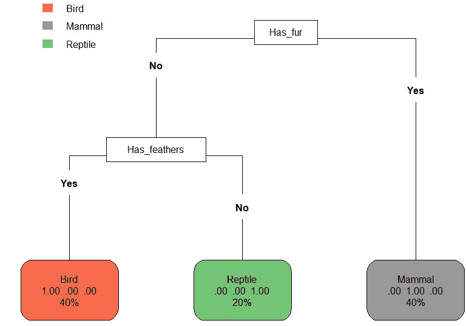
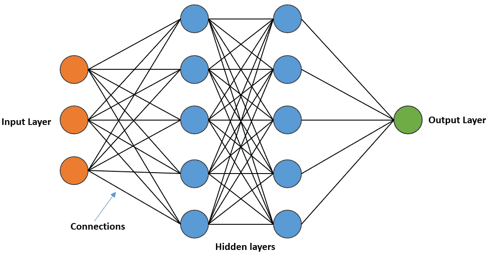

# 2

# 使用 Qlik 的机器学习算法和模型

机器学习算法已成为我们生活的重要组成部分，从在线广告的个性化到流媒体平台的推荐系统。这些算法负责根据数据做出智能决策，而不需要明确编程。

机器学习算法是指一组数学模型和技术，使软件能够从数据中学习模式和关系，从而使其能够做出预测和决策。这些算法可以广泛分为监督学习、无监督学习、半监督学习和强化学习算法。每种类型的算法都有其独特的特征和应用，适用于广泛的任务。

在本章中，我们将概述机器学习算法及其应用，重点关注 Qlik 工具中使用的算法。作为本章的一部分，你将学习以下内容：

+   理解回归模型及其使用方法

+   理解不同的聚类算法和决策树

+   理解提升算法的基础，特别是 Qlik AutoML 中使用的提升算法

+   理解神经网络和其他高级机器学习模型的基础

注意

在撰写本书时，Qlik AutoML 正在使用以下算法：

**二元和多类** **分类问题**：

CatBoost 分类，Elastic Net 回归，高斯朴素贝叶斯，Lasso 回归，LightGBM 分类，逻辑回归，随机森林分类，XGBoost 分类

**回归问题**：

CatBoost 回归，LightGBM 回归，线性回归，随机森林回归，SGD 回归，XGBoost 回归

其中一些算法将在接下来的章节中更详细地介绍。

# 回归模型

**回归模型**是一种监督式机器学习模型，用于根据一个或多个输入变量预测目标变量的连续数值。换句话说，回归模型用于估计输入变量和输出变量之间的关系。

机器学习中使用了各种类型的回归模型，其中一些包括以下内容：

+   **线性回归**：这是一种假设输入变量和输出变量之间存在线性关系的回归模型。

+   **多项式回归**：这是一种假设输入变量和输出变量之间存在多项式关系的回归模型。

+   **逻辑回归**：这是一种用于预测二元或分类结果的回归模型。它根据输入变量估计事件发生的概率。

+   **岭回归**：这是一种使用正则化来防止模型过拟合的线性回归模型。

+   **Lasso 回归**：这是另一种线性回归模型，它使用正则化来防止模型过拟合。当处理具有大量特征的数据库时，它特别有用。

在下一节中，我们将更详细地研究前面列表中的一些回归模型。

## 线性回归

线性回归用于建模因变量（也称为目标或响应变量）与一个或多个自变量（也称为解释或预测变量）之间的关系。线性回归的目标是找到最佳拟合线（或超平面），可以根据自变量的值预测因变量。换句话说，线性回归试图找到一个线性方程，将输入变量与输出变量联系起来。该方程采用以下形式：

Y = mX + b + e

其中 *Y* 是因变量，*X* 是自变量，*m* 是直线的斜率，*b* 是截距，*e* 代表模型的误差。线性回归的目标是找到最佳值 *m* 和 *b*，以最小化预测值与因变量实际值之间的差异。在简单线性回归中，我们有一个自变量，而在多元线性回归中，我们将有多个自变量。

### Example

我们想要研究学生学习小时数与他们的考试成绩之间的关系。我们从 10 名学生那里收集数据，记录他们学习的小时数和相应的考试成绩。数据如下所示：

| **学习小时数 (X)** | **考试成绩 (Y)** |
| --- | --- |
| 2 | 60 |
| 3 | 70 |
| 4 | 80 |
| 5 | 85 |
| 6 | 90 |
| 7 | 95 |
| 8 | 100 |
| 9 | 105 |
| 10 | 110 |
| 11 | 115 |

表 2.1：考试成绩数据

我们可以使用简单的线性回归模型来建模两个变量之间的关系，其中学习的小时数作为自变量（*X*）和考试成绩作为因变量（*Y*）。该模型采用以下形式：

Y = mX + b + e

其中 *b* 是截距（当 *X=0* 时 *Y* 的值）和 *m* 是斜率（*Y* 相对于 *X* 的变化率）。为了估计 *b* 和 *m* 的值，我们可以使用最小二乘法。求解回归方程，我们得到以下结果：

Y = 5 * X + 55 + e

这个方程告诉我们，平均而言，每多学习一个小时，学生可以在考试中期望多得 5 分。截距 55 告诉我们，如果一个学生没有学习任何小时数，他可以期望得到 55 分（这可能不太现实，但这只是从模型中进行的数学外推）。

我们可以使用这个模型根据学习的小时数来预测考试成绩。例如，如果一个学生学习了 7 个小时，我们可以估计他们的考试成绩如下：

Y = 5 * 7 + 55 + e = 90 + e

## 逻辑回归

逻辑回归是一种用于二元分类问题的统计方法，其中结果变量是分类的，并且只有两个可能的值，例如“是”或“否”，“通过”或“失败”，或“垃圾邮件”或“非垃圾邮件”。它是一种回归分析方法，通过估计二元结果的概率来模拟自变量和因变量之间的关系。

逻辑回归模型使用逻辑函数，也称为 Sigmoid 函数，来模拟输入变量和二元结果之间的关系。Sigmoid 函数将输入值转换为介于 0 和 1 之间的范围，这代表二元结果的概率。

逻辑回归模型可以使用最大似然估计方法来训练，以找到最大化给定模型观察数据的似然性的参数。然后，可以使用这些参数来预测新输入数据的二元结果的概率。

逻辑回归在医学诊断、信用评分和营销分析中得到广泛应用。它是一种流行的算法，因为它简单且可解释。

### 示例

假设我们想要根据客户的年龄和收入预测他们是否会购买产品。我们有一个包含 90 个客户的数据库，其中每一行代表一个客户，列代表他们的年龄、收入以及他们是否购买了产品（未购买为 0，购买为 1）。

我们可以使用逻辑回归来根据客户的年龄和收入建模他们购买产品的概率。逻辑回归模型可以表示为以下形式：

p(购买) =  1  ______________________________   (1 + exp(− (β0 + β1 * 年龄 + β2 * 收入)))

其中 β0、β1 和β2 是我们需要从数据中估计的模型参数。

我们可以使用最大似然估计来估计这些参数。一旦我们估计了参数，我们就可以使用该模型根据新客户的年龄和收入预测他们购买产品的概率。

例如，如果一个新客户年龄为 35 岁，收入为$50,000，我们可以使用该模型预测他们购买产品的概率如下：

p(购买) =  1  ____________________________   (1 + exp(− (β0 + β1 * 35 + β2 * 50000)))

然后，我们可以使用决策阈值，例如 0.5，来确定是否将客户分类为购买者或非购买者。请注意，阈值的选择可能会影响精确度和召回率之间的权衡。

我们可以使用 R 和 Python 以及相应的库来解决上述问题。让我们看看如何做到这一点。在以下示例中，我们将使用一个名为`customer_data.csv`的样本数据集。

这里是数据文件的概述：

| **年龄** | **收入** | **购买** |
| --- | --- | --- |
| 22 | 20000 | 0 |
| 35 | 80000 | 1 |
| 42 | 50000 | 0 |
| 27 | 30000 | 0 |
| 48 | 70000 | 1 |
| 38 | 60000 | 1 |
| 41 | 45000 | 0 |
| 29 | 35000 | 0 |
| 33 | 40000 | 1 |

表 2.2：客户数据

### 使用 R 的示例解决方案

以下代码从 CSV 文件中读取客户数据，构建一个逻辑回归模型来根据客户的年龄和收入预测其购买的概率，然后根据概率值预测新客户的概率并提供相应的预测信息：

```py
data <- read.csv('customer_data.csv')
model <- glm(purchased ~ age + income, data = data, family = binomial())
new_customer <- data.frame(age = 35, income = 50000)
prob_purchase <- predict(model, new_customer, type = "response")
if (prob_purchase >= 0.5) {
  print("The customer is predicted to purchase the product.")
} else {
  print("The customer is predicted not to purchase the product.")
}
```

### 使用 Python 的示例解决方案

此代码将客户数据从 CSV 文件读取到 pandas DataFrame 中，使用 scikit-learn 的`LogisticRegression`类构建逻辑回归模型来根据年龄和收入预测购买概率，然后根据概率值预测新客户的概率并提供相应的预测信息：

```py
import pandas as pd
data = pd.read_csv("customer_data.csv")
from sklearn.linear_model import LogisticRegression
model = LogisticRegression()
model.fit(data[['age', 'income']], data['purchased'])
new_customer = pd.DataFrame({'age': [35], 'income': [50000]})
prob_purchase = model.predict_proba(new_customer)[:, 1]
if prob_purchase >= 0.5:
    print("The customer is predicted to purchase the product.")
else:
    print("The customer is predicted not to purchase the product.")
```

示例将打印“**该客户被预测为购买产品**”，概率为 0.81。

## Lasso 回归

Lasso 回归或最小绝对收缩和选择算子（也称为 L1 正则化）是一种用于变量选择和正则化的线性回归方法。它是一种回归技术，在平方误差和中加入惩罚项，包括回归系数的绝对值。

Lasso 回归算法旨在最小化残差平方和，同时满足系数绝对值之和小于或等于一个常数的约束。这个约束导致一些系数被缩小到零，从而产生稀疏模型，而一些特征具有零系数，实际上将它们从模型中排除。

Lasso 回归在处理高维数据集时特别有用，其中特征（或预测因子）的数量远大于观测数。它还可以帮助克服线性回归模型中的过拟合问题，其中模型变得过于复杂，并且对训练数据拟合得很好，但无法很好地推广到新数据。

### 示例

我们有一个包含关于房屋及其销售价格的信息的数据集，包括诸如卧室数量、地块大小、房屋年龄和位置等特征。我们希望构建一个模型，可以根据这些特征预测房屋的销售价格。

构建此模型，我们可以使用 Lasso 回归。我们首先将数据集分为训练集和测试集。然后，我们使用训练集来拟合一个具有特定正则化参数（alpha）值的 Lasso 回归模型。我们可以通过交叉验证调整此参数，以找到在测试集上产生最低误差的最佳值。

一旦我们训练了我们的模型，我们就可以通过输入特征的值并计算相应的销售价格来使用它对新数据进行预测。Lasso 回归模型将自动选择最重要的特征进行预测，通过将不太重要的特征的系数缩小到零。

例如，假设我们的 Lasso 回归模型选择了卧室数量和位置作为预测销售价格的最重要特征，并将其他特征的系数缩小到零。我们可以利用这些信息来指导我们在购房或售房时的决策。

让我们看看一个示例解决方案如何在 R 和 Python 中工作。这两个示例都使用了加利福尼亚住房数据集，将数据分为训练集和测试集，拟合 Lasso 回归模型，在测试集上进行预测，并使用 RMSE 指标评估模型在测试集上的性能。

### R 示例解决方案

代码使用 Lasso 正则化（L1 惩罚）进行线性回归，根据住房数据集预测中值房价。数据集从特定 URL 加载，预处理后分为训练集和测试集。使用`glmnet`库构建模型，并计算**均方根误差**（**RMSE**）以评估模型性能：

```py
url <- "https://raw.githubusercontent.com/ageron/handson-ml2/master/datasets/housing/housing.csv"
housing <- read.csv(url)
housing <- na.omit(housing)
set.seed(123)
train_index <- sample(nrow(housing), nrow(housing) * 0.8)
train <- housing[train_index, ]
test <- housing[-train_index, ]
library(glmnet)
x <- model.matrix(median_house_value ~ ., train)[,-1]
y <- train$median_house_value
model <- cv.glmnet(x, y, alpha = 1)
x_test <- model.matrix(median_house_value ~ ., test)[,-1]
y_test <- test$median_house_value
predictions <- predict(model, newx = x_test)
rmse <- sqrt(mean((predictions - y_test)²))
print(paste0("RMSE: ", rmse))
```

### Python 示例解决方案

以下代码首先导入 pandas 库，并将其别名设置为`pd`以方便使用。接下来，它从特定 URL 托管的一个 CSV 文件中读取数据，并创建一个名为“housing”的 DataFrame 来存储数据集。为了有效地处理分类数据，代码对`ocean_proximity`列执行了一元编码，将其转换为多个二进制列。

数据的清洁性对于可靠的模型至关重要，因此脚本通过从 DataFrame 中删除包含 NaN 条目的任何行来处理缺失值。然后，使用 scikit-learn 的`train_test_split`函数将数据集分为训练集和测试集，其中 80%的数据用于训练，剩余的 20%用于测试。

现在是机器学习部分。脚本从 scikit-learn 中导入`LassoCV`类，这是一个具有 L1 正则化（Lasso）的线性回归模型。`LassoCV`通过交叉验证从预定义的值集中找到最优的正则化强度（alpha）。然后，使用“`fit`”方法在训练数据上训练模型。

训练完成后，模型接受测试。使用训练好的`LassoCV`模型在测试数据上做出预测，并使用 RMSE 指标评估模型的性能。RMSE 表示预测的`median_house_value`与测试数据中的实际目标值之间的偏差。较低的 RMSE 表示更好的预测准确性。

最后，脚本通过显示计算出的 RMSE 值来结束，这为`LassoCV`模型在预测未见数据中的`median_house_value`时的表现提供了洞察：

```py
import pandas as pd
url = "https://raw.githubusercontent.com/ageron/handson-ml2/master/datasets/housing/housing.csv"
housing = pd.read_csv(url)
housing = pd.get_dummies(housing, columns=['ocean_proximity'])
housing.dropna(inplace=True)
from sklearn.model_selection import train_test_split
X_train, X_test, y_train, y_test = train_test_split(housing.drop(columns=['median_house_value']), housing['median_house_value'], test_size=0.2, random_state=123)
from sklearn.linear_model import LassoCV
model = LassoCV(alphas=[0.001, 0.01, 0.1, 1], cv=5)
model.fit(X_train, y_train)
from sklearn.metrics import mean_squared_error
predictions = model.predict(X_test)
rmse = mean_squared_error(y_test, predictions, squared=False)
print(f"RMSE: {rmse}")
```

在 Python 示例中，我们必须在将数据分割成训练集和测试集之前对`ocean_proximity`特征进行 one-hot 编码，这将允许 Lasso 回归模型在模型中使用该特征。这两个模型都会给出预测并打印出大约 67,000 到 68,000 的 RMSE，具体取决于使用的库版本。

注意

在本节中，我们更详细地研究了 Lasso 回归（L1 正则化）。L2 正则化与 Ridge 回归一起使用。Lasso 和 Ridge 回归的主要区别在于它们应用的正则化类型、对特征选择的影响以及处理多重共线性。Lasso 倾向于产生具有特征选择的稀疏模型，而 Ridge 则保持所有特征，但系数较小，这使得它在存在多重共线性问题时或当你想控制系数幅度时更为合适。它们之间的选择取决于你的具体建模目标和数据性质。我们不会在本章中深入探讨 Ridge 回归的细节。

在本章中，我们研究了各种线性回归模型以及如何使用 R 和 Python 实现这些模型。线性回归模型是机器学习的重要组成部分，理解其原理是一项重要的技能。在下一节中，我们将更详细地研究聚类算法、决策树和随机森林。

# 聚类算法、决策树和随机森林

**聚类算法**用于无监督学习任务，这意味着它们用于在数据中寻找没有预定义标签或类别的模式。聚类算法的目标是将相似的数据点分组到簇中，同时将不相似的数据点分开。

聚类算法有几种类型，包括 K-means、层次聚类和基于密度的聚类。K-means 是一种流行的聚类算法，它通过将数据集划分为 K 个簇来工作，其中 K 是预定义的簇数。层次聚类是另一种聚类算法，它根据数据点之间的相似性创建簇的层次结构。基于密度的聚类算法，如 DBSCAN，将紧密聚集在高度密集区域的数据点分组在一起。

**决策树**，另一方面，用于监督学习任务，这意味着它们用于根据具有预定义标签或类别的输入数据进行预测或决策。决策树是一种树状结构，由节点和分支组成，其中每个节点代表一个特征或属性，每个分支代表基于该特征的决策。决策树的目标是创建一个模型，可以根据其特征准确预测新输入的标签或类别。

决策树有多种类型，包括 ID3、C4.5 和 CART。ID3 算法是一种流行的决策树算法，它通过选择具有最高信息增益的属性作为根节点，并通过在每个级别上选择最大化信息增益的属性递归地构建树。C4.5 算法是 ID3 的改进版本，可以处理连续和离散数据，而 CART 是另一种可以处理分类和回归任务的决策树算法。

**随机森林**通过结合多个决策树来创建一个更准确和鲁棒的模型。随机森林由大量决策树组成，每棵树都在数据的不同子集上训练，并使用可用的随机特征子集。这有助于减少过拟合并提高模型的泛化能力。

为每棵树使用的随机特征子集是从可用特征中随机选择的，每棵树选择一个新的子集。这确保了森林中的每棵树都是不同的，并提供了多样化的预测集。在训练过程中，森林中的每棵树都会生长到其最大深度，并通过聚合森林中所有树的预测来进行预测。

聚合过程可能因任务的不同而有所差异。对于分类任务，最常见的方法是使用多数投票法，其中最终预测是森林中预测最多的树的类别。对于回归任务，最常见的方法是使用森林中所有树的平均预测。

随机森林相对于单一决策树具有多个优势，包括提高准确性、减少过拟合以及对于数据中的噪声和异常值的鲁棒性。它们也相对容易使用，可以处理广泛的输入特征和数据类型。然而，它们的训练可能计算成本高昂，并且难以解释和可视化，尤其是在处理大量树的情况下。

在接下来的几节中，我们将更详细地探讨一些聚类和决策树算法。

## K-means 聚类

K-means 聚类是一种流行的算法，用于将一组数据点划分为 K 个聚类，其中 K 是一个预定义的数字。该算法通过迭代地将数据点分配到最近的聚类质心，并根据新的分配更新聚类质心来工作。

下面是 K-means 算法的简单步骤概述：

1.  从数据点中随机初始化 K 个质心。

1.  根据数据点和质心之间的欧几里得距离，将每个数据点分配到最近的质心。

1.  通过计算分配给每个聚类的所有数据点的平均值来更新每个聚类的质心。

1.  重复步骤 2 和 3，直到质心不再显著移动或达到最大迭代次数。

K-means 算法的目标是最小化每个数据点到其分配簇质心的平方距离之和，也称为“惯性”。该算法对初始随机选择质心可能很敏感，因此多次运行算法并选择具有最低惯性的解决方案通常是一个好主意。

K-means 是一种快速有效的聚类数据算法，但它也有一些局限性。它假设簇是球形且大小相等，并且对数据中的异常值和噪声很敏感。此外，确定最佳簇数 K 可能具有挑战性，可能需要一些领域知识或试错。

### 示例

鸢尾花数据集包含了 150 朵鸢尾花的四个特征（花瓣长度、花瓣宽度、萼片长度和萼片宽度）的测量值，其中每种鸢尾花（setosa、versicolor 和 virginica）各有 50 朵。我们可以使用 K-means 聚类方法根据它们的特征值将这些花朵分组到不同的簇中。

要做到这一点，我们首先选择我们想要聚类的特征，并通过缩放特征使其具有零均值和单位方差来预处理数据。缩放是为了确保特征具有相等的影响力。然后，我们将 K-means 算法应用于预处理后的数据，指定我们想要创建的簇数 K。在这种情况下，我们可能会选择 K=3，以对应三种鸢尾花物种。

然后，K-means 算法根据特征值将花朵划分为 K 个簇，每个簇由其质心（分配给簇的花朵的平均特征值）表示。我们可以检查这些簇及其质心，以深入了解鸢尾花数据集的结构。

例如，我们可能会发现一个簇包含花瓣和萼片尺寸较小的花朵，这可能对应于 setosa 物种。另一个簇可能包含花瓣尺寸较大而萼片尺寸中等的花朵，这可能对应于 versicolor 物种。第三个簇可能包含萼片和花瓣尺寸都较大的花朵，这可能对应于 virginica 物种。

通过使用 K-means 聚类方法根据特征值对鸢尾花进行分组，我们可以更深入地了解数据集的结构，并可能识别出数据中的模式和关系。让我们看看上述示例在 R 和 Python 中的样子。

### 使用 R 的示例

下面的 R 代码使用“iris”数据集，这是机器学习社区中一个流行的数据集。它对数据集的四个数值属性执行 K-means 聚类：`Sepal.Length`（花萼长度）、`Sepal.Width`（花萼宽度）、`Petal.Length`（花瓣长度）和`Petal.Width`（花瓣宽度）。代码设置了一个随机种子以确保可重复性，并使用三个聚类中心应用 K-means 算法。聚类完成后，代码显示每个数据点的聚类分配，指示每个观测值属于哪个聚类（用值 1、2 或 3 表示）。K-means 聚类旨在将相似数据点分组到聚类中，是无监督机器学习任务中的一种常见技术：

```py
data(iris)
iris_cluster <- iris[, c("Sepal.Length", "Sepal.Width", "Petal.Length", "Petal.Width")]
set.seed(123)
kmeans_results <- kmeans(iris_cluster, centers = 3)
kmeans_results$cluster
```

### Python 示例

下面的 Python 代码使用 scikit-learn 库在 Iris 数据集上执行 K-means 聚类。使用 scikit-learn 的`load_iris()`函数加载数据集，包含鸢尾花花瓣长度、花瓣宽度、花萼长度和花萼宽度的测量值，以及它们对应的物种标签。

脚本提取了四个特征列用于聚类，并将它们存储在`iris_cluster`变量中。然后，它从 scikit-learn 的`sklearn.cluster`模块导入`KMeans`类。

K-means 算法应用于特征数据(`iris_cluster`)，将聚类数量(`n_clusters`)设置为`3`。将`random_state`参数设置为`123`以确保结果的再现性。

聚类后，代码打印出 Iris 数据集中每个数据点的聚类分配。每个数据点被分配一个聚类标签（0、1 或 2），指示它根据 K-means 聚类属于哪个组：

```py
from sklearn.datasets import load_iris
iris = load_iris()
iris_cluster = iris.data[:, [0, 1, 2, 3]]
from sklearn.cluster import KMeans
kmeans_results = KMeans(n_clusters=3, random_state=123).fit(iris_cluster)
print(kmeans_results.labels_)
```

这两个代码示例都将打印出 Iris 数据集的聚类分配。结果看起来类似于以下：

```py
[1 1 1 1 1 1 1 1 1 1 1 1 1 1 1 1 1 1 1 1 1 1 1 1 1 1 1 1 1 1 1 1 1 1 1 1 1 1 1 1 1 1 1 1 1 1 1 1 1 1 2 2 0 2 2 2 2 2 2 2 2 2 2 2 2 2 2 2 2 2 2 2 2 2 2 2 2 0 2 2 2 2 2 2 2 2 2 2 2 2 2 2 2 2 2 2 2 2 2 2 0 2 0 0 0 0 2 0 0 0 0 0 0 2 2 0 0 0 0 2 0 2 0 2 0 0 2 2 0 0 0 0 0 2 0 0 0 0 2 0 0 0 2 0 0 0 2 0 0 2]
```

注意

这是一个简单的例子。在实践中，你可能会花更多的时间探索和可视化数据，调整聚类数量，并解释聚类算法的结果。

## ID3 决策树

**ID3**（**迭代二分器 3**）是构建决策树的一种流行算法。ID3 算法由 Ross Quinlan 于 1986 年开发，基于信息熵的概念。

决策树的目标是创建一个模型，可以用来根据其特征对新的实例进行预测或分类。决策树由一组节点和边组成，其中每个节点代表一个或多个输入变量的决策或测试，每条边代表该决策的可能结果。

ID3 算法通过递归地根据具有最高信息增益的输入变量对数据进行分区来工作。信息增益是数据在特定输入变量上分割后熵或纯度减少的度量。算法在每个步骤中选择最大化信息增益的输入变量，直到给定分区中的所有实例都属于同一类或满足停止条件。

ID3 算法具有几个优点，包括其处理具有分类变量的大数据集的简单性和效率。然而，它在处理连续变量和过拟合方面存在局限性，这些问题可以通过使用修改后的算法（如 C4.5 和 CART）来解决。

在下一个例子中，我们可以看到 ID3 在实际中的应用。

### 示例

在这个例子中，我们使用以下与动物相关的数据集：

| **动物** | **有毛？** | **有羽毛？** | **吃肉？** | **分类** |
| --- | --- | --- | --- | --- |
| 狗 | 是 | 否 | 是 | 哺乳动物 |
| 猫 | 是 | 否 | 是 | 哺乳动物 |
| 鹦鹉 | 否 | 是 | 否 | 鸟 |
| 鹰 | 否 | 是 | 是 | 鸟 |
| 蛇 | 否 | 否 | 是 | 爬行动物 |

表 2.3：动物特征数据

我们的目的是构建一个决策树，可以根据动物的特征对动物进行分类。

首先，让我们计算整个数据集的熵。熵衡量数据集的杂乱程度。所有类标签都相同的数据集熵为 0，而每个类中示例数量相等的数据集熵为 1。

计算熵的一般方程可以表示为以下方式：

E(S) = − ∑ i=1 n p i log 2p i

在这个方程中，*E(S)* 是集合 *S* 的熵，*n* 是 *S* 中的类别数，*pi* 是 *S* 中属于类别 *i* 的元素数量的比例。

在这个例子中，我们有 *n=3* 个类别：哺乳动物、鸟和爬行动物。每个类别中的动物数量如下：

+   哺乳动物：2（狗，猫）

+   鸟：2（鹦鹉，鹰）

+   爬行动物：1（蛇）

因此，概率如下：

+   p 哺乳动物 = 2 / 5 = 0.4

+   p 鸟 = 2 / 5 = 0.4

+   p 爬行动物 = 1 / 5 = 0.2

将这些值代入熵公式，我们得到以下结果：

E(S) = − (0.4log 20.4 + 0.4log 20.4 + 0.2log 20.2) ≈ 1.52193

因此，“分类”属性的熵大约为 1.52。

接下来，让我们计算“有毛？”属性的增益信息。信息增益是衡量数据集中给定属性或特征对数据分类不确定性减少的贡献程度的度量。在决策树中，信息增益用于在每个树的节点处选择用于分割数据的最佳属性。

信息增益公式如下：

IG(S, A) = E(S) −  ∑ v∈Values(A) |S v| _ |S| E(S v)

其中 *A* 是属性（在这种情况下，“有毛吗？”），*v* 是属性的可能的值，*Values(A)* 是属性的可能的值的集合，*|Sv|* 是数据集中具有属性 *A=v* 的动物的数量，*E(Sv)* 是具有属性 *A=v* 的动物的子集的熵。

我们可以根据动物是否有毛来分割数据。子集如下：

+   有毛：狗，猫

+   无毛：鹦鹉，鹰，蛇

每个子集中动物的比例如下：

+   |S Has fur| = 2

+   |S No fur| = 3

为了计算 E(S Has fur)，我们需要计算每个类别中有毛的动物的数量：

+   哺乳动物：2（狗，猫）

+   鸟：0

+   爬行动物：0

因此，概率如下：

+   p 哺乳动物 = 1

+   p 鸟 = 0

+   p 爬行动物 = 0

将这些值代入熵公式，我们得到以下结果：

E(S 有毛) = − 1log2(1) = 0

0 的熵意味着该集合被完美分类：在这种情况下，所有有毛发的动物都是哺乳动物。

要计算 E(S 无毛)，我们需要计算每个类别中没有毛发的动物数量：

+   哺乳动物：0

+   鸟：2（鹦鹉，鹰）

+   爬行动物：1（蛇）

因此，概率如下：

+   p 哺乳动物 = 0

+   p 鸟 = 2 / 3 ≈ 0.67

+   p 爬行动物 = 1 / 3 ≈ 0.33

将这些值代入熵公式，我们得到以下结果：

E(S 无毛) = − (0 + 0.67log2(0.67) + 0.33log2(0.33)) ≈ 0.9183

现在我们可以将这些值代入信息增益公式：

IG(S, 有毛？) = E(S) − ∑v∈Values(有毛？) |Sv| / |S| E(Sv)

= 1.52193 − (2 × 5 × 0 + 3 × 5 × 0.9183) ≈ 0.971

因此，对于“有毛？”属性获得的信息量大约为 0.971。

我们也可以通过使用相同的公式并根据动物是否有羽毛或是否吃肉来分割数据来计算“有羽毛？”和“吃肉？”属性获得的信息量。信息增益最高的属性将被选为在决策树根部分割数据。

“有羽毛？”的信息增益也是 0.971，而“吃肉？”是 0.322。在这种情况下，我们将选择“有毛？”作为我们的根节点。

让我们来看看使用 R 和 Python 的相同示例。这两个代码片段都将加载动物数据集，创建决策树模型，可视化它，并用新数据测试树。最后，我们可以看到新的动物被分类为“哺乳动物”。

最终的决策树看起来像下面这个图：



图 2.1：最终决策树（使用以下 R 代码打印）

下面是使用 R 的示例：

```py
data <- data.frame(
  Animal = c("Dog", "Cat", "Parrot", "Eagle", "Snake"),
  Has_fur = c("Yes", "Yes", "No", "No", "No"),
  Has_feathers = c("No", "No", "Yes", "Yes", "No"),
  Eats_meat = c("Yes", "Yes", "No", "Yes", "Yes"),
  Classification = c("Mammal", "Mammal", "Bird", "Bird", "Reptile")
)
library(rpart)
library(rpart.plot)
tree <- rpart(Classification ~ Has_fur + Has_feathers + Eats_meat, data = data, method = "class", control = rpart.control(minsplit = 1))
rpart.plot(tree, type=5)
new_data <- data.frame(
  Has_fur = "Yes",
  Has_feathers = "No",
  Eats_meat = "Yes"
)
predicted <- predict(tree, new_data, type = "class")
print(predicted)
```

Python 示例与前面的 R 示例类似，但在 Python 中，我们还需要使用 one-hot 编码将分类特征转换为数值：

```py
import pandas as pd
import numpy as np
from sklearn.tree import DecisionTreeClassifier, plot_tree
import matplotlib.pyplot as plt
data = pd.DataFrame({
    'Animal': ['Dog', 'Cat', 'Parrot', 'Eagle', 'Snake'],
    'Has_fur': ['Yes', 'Yes', 'No', 'No', 'No'],
    'Has_feathers': ['No', 'No', 'Yes', 'Yes', 'No'],
    'Eats_meat': ['Yes', 'Yes', 'No', 'Yes', 'Yes'],
    'Classification': ['Mammal', 'Mammal', 'Bird', 'Bird', 'Reptile']
})
data_encoded = pd.get_dummies(data[['Has_fur', 'Has_feathers', 'Eats_meat']])
clf = DecisionTreeClassifier(criterion='entropy', min_samples_split=2)
clf.fit(data_encoded, data['Classification'])
plt.figure(figsize=(8, 6))
plot_tree(clf, feature_names=data_encoded.columns, class_names=np.unique(data['Classification']), filled=True)
plt.show()
new_data = pd.DataFrame({
    'Has_fur_No': [0],
    'Has_fur_Yes': [1],
    'Has_feathers_No': [1],
    'Has_feathers_Yes': [0],
    'Eats_meat_No': [0],
    'Eats_meat_Yes': [1]
})
predicted = clf.predict(new_data)
print(predicted)
```

注意

这是一个使用 ID3 算法的决策树的简单示例。在现实世界的例子中，我们很可能有大量数据，因此最终树中会有很多节点和分支。

我们现在已经学习了聚类算法、决策树和随机森林是如何工作的。这些算法是机器学习的重要组成部分，常用于分类。在下一节中，我们将更深入地探讨提升算法和朴素贝叶斯。

# 提升算法和朴素贝叶斯

**提升**是一种机器学习技术，涉及创建一个弱学习者的集成以形成一个强学习者。提升算法背后的思想是迭代地在数据上训练模型，其中每个新的模型都试图纠正先前模型的错误。提升算法在监督学习任务中广泛使用，如分类和回归。

提升算法有几种关键类型：

+   **AdaBoost（自适应提升）**：AdaBoost 是最早且最受欢迎的提升算法之一。它首先在全部数据集上训练一个基分类器，然后依次在先前分类器出错的数据样本上训练额外的分类器。最终的预测是通过取所有分类器预测的加权总和来完成的。

+   **梯度提升**：梯度提升是另一种流行的提升算法，它通过迭代地向集成中添加新模型，每个新模型都训练以最小化先前模型的误差。梯度提升用于回归和分类问题，并在许多应用中显示出达到最先进的结果。

+   **XGBoost**：XGBoost（极端梯度提升）是梯度提升算法的一种流行且高度优化的实现。XGBoost 使用正则化目标函数和多种技术来减少过拟合并提高准确性。

提升算法因其能够通过减少偏差和方差来提高机器学习模型的准确性而闻名。

**朴素贝叶斯**是一种简单但有效的分类算法。它基于贝叶斯定理，该定理指出，在新的证据（在这种情况下，为新数据点的特征值）的背景下，假设（在这种情况下，为类别标签）的概率被更新。该算法假设特征之间相互独立，这就是为什么它被称为“朴素”。

在朴素贝叶斯中，计算数据点属于特定类别的概率是通过将该类别的先验概率与给定该类别的数据点的似然性相乘来完成的。然后，算法选择概率最高的类别作为该数据点的预测类别。

朴素贝叶斯算法有几种变体：

+   **高斯朴素贝叶斯**：当特征是连续的，并且假设为正态分布时使用。

+   **多项式朴素贝叶斯**：当特征是离散的，表示计数或频率时（例如在文本分类中）使用。

+   **伯努利朴素贝叶斯**：是多项式朴素贝叶斯的一种变体，当特征是二进制时（例如在垃圾邮件过滤中）使用。

朴素贝叶斯是一个简单且高效的算法，在具有稀疏特征的高维数据集上表现良好。它在自然语言处理、垃圾邮件过滤、情感分析和其他分类任务中得到广泛应用。然而，特征独立性假设在所有情况下可能并不成立，如果数据违反了这个假设，算法可能表现不佳。

在接下来的章节中，我们将更深入地研究一些提升和朴素贝叶斯算法。

## XGBoost

**XGBoost**（**极梯度提升**）是一个开源的机器学习库，旨在高效、灵活和可扩展。它是对梯度提升算法的实现，可用于分类和回归问题。

它基于梯度提升框架，并使用决策树的集成来进行预测。XGBoost 设计用于处理大规模和高维数据，并提供各种技术来防止过拟合，例如正则化和提前停止。

让我们看看使用 R 和 Python 的 XGBoost 的简单示例。在这些示例中，我们将使用本书早期章节中已经使用过的鸢尾花数据集。我们将数据分为训练集和测试集，然后训练我们的 XGBoost 模型来预测物种。最后，我们将使用测试数据测试模型并评估模型性能。

这里是使用 R 的示例：

```py
library(xgboost)
library(caret)
data(iris)
set.seed(123)
trainIndex <- createDataPartition(iris$Species, p = 0.8, list = FALSE)
train <- iris[trainIndex, ]
test <- iris[-trainIndex, ]
train$Species <- as.factor(train$Species)
test$Species <- as.factor(test$Species)
train$label <- as.integer(train$Species) - 1
test$label <- as.integer(test$Species) - 1
xgb_model <- xgboost(data = as.matrix(train[, 1:4]),
                     label = train$label,
                     nrounds = 10,
                     objective = "multi:softmax",
                     num_class = 3,
                     eval_metric = "mlogloss")
predictions <- predict(xgb_model, as.matrix(test[, 1:4]))
predictions <- factor(predictions, levels = 0:2, labels = levels(iris$Species))
confusionMatrix(predictions, test$Species)
```

这里是使用 Python 的示例：

```py
import xgboost as xgb
from sklearn.datasets import load_iris
from sklearn.model_selection import train_test_split
from sklearn.metrics import classification_report
iris = load_iris()
X_train, X_test, y_train, y_test = train_test_split(iris.data, iris.target, test_size=0.2, random_state=123)
xgb_model = xgb.XGBClassifier(objective="multi:softmax", 
      n_estimators=10, seed=123)
xgb_model.fit(X_train, y_train)
predictions = xgb_model.predict(X_test)
print(classification_report(y_test, predictions))
```

## 高斯朴素贝叶斯

高斯朴素贝叶斯（GNB）是朴素贝叶斯算法的一种变体，它假设输入变量服从高斯（正态）分布。在 GNB 中，每个输入变量的概率分布是使用训练数据分别对每个类别进行估计的。

在测试阶段，模型根据训练期间估计的高斯分布参数计算输入特征属于每个类的可能性。然后，模型应用贝叶斯定理来计算给定输入特征的每个类的后验概率。然后，将具有最高后验概率的类别分配给输入。

GNB 被称为“朴素”是因为它假设输入特征在给定类别标签的条件下是条件独立的。这个假设简化了模型并使得后验概率的计算变得可行。然而，这个假设在某些数据集中可能不成立，因此模型可能表现不佳。尽管如此，GNB 对于独立性假设成立的数据集来说可以是一个快速且准确的分类器。

让我们看看与 XGBoost 类似的分类问题，使用高斯朴素贝叶斯。以下是使用 R 和 Python 的示例代码。再次，我们使用鸢尾花数据集来分类不同的物种。

这里是使用 R 的示例：

```py
library(e1071)
data(iris)
set.seed(123)
trainIndex <- sample(nrow(iris), 0.7 * nrow(iris))
train <- iris[trainIndex, ]
test <- iris[-trainIndex, ]
model <- naiveBayes(Species ~ ., data = train)
predictions <- predict(model, test)
cfm <- table(predictions, test$Species)
print(cfm)
```

这里是使用 Python 的示例：

```py
from sklearn.datasets import load_iris
from sklearn.model_selection import train_test_split
from sklearn.naive_bayes import GaussianNB
from sklearn.metrics import classification_report
iris = load_iris()
X_train, X_test, y_train, y_test = train_test_split(iris.data, 
      iris.target, test_size=0.3, random_state=123)
model = GaussianNB()
model.fit(X_train, y_train)
predictions = model.predict(X_test)
print(classification_report(y_test, predictions))
```

现在我们已经熟悉了提升算法和朴素贝叶斯的概念。这些方法在 Qlik AutoML 中得到广泛应用，理解这些算法的概念是处理机器学习问题的一项基本技能。在下一节中，我们将更深入地探讨一些高级机器学习算法，包括神经网络、深度学习和自然语言模型。

# 神经网络、深度学习和自然语言模型

**神经网络**是一种受人类大脑结构和功能启发的机器学习算法。它们由多层相互连接的节点或人工神经元组成，这些节点处理和传输信息。

在神经网络中，输入数据被输入到第一层节点，这些节点对数据进行一系列数学变换并产生输出。第一层的输出随后被输入到第二层，该层应用另一组变换以产生另一个输出，依此类推，直到产生最终输出。

神经网络中节点的连接在学习过程中会调整权重，以优化网络做出准确预测或分类的能力。这通常是通过使用随机梯度下降等优化算法来实现的。以下图示展示了神经网络结构的示例：



图 2.2：神经网络的概要架构

神经网络已被用于解决广泛的机器学习问题，包括图像和语音识别、自然语言处理和预测建模。由于它们能够学习输入和输出数据之间的复杂非线性关系，它们在许多应用中已被证明是有效的。

**深度学习**涉及使用多层神经网络。它在包括计算机视觉、语音识别、自然语言处理和游戏在内的广泛应用中取得了显著的成功。一些值得注意的例子包括在图像识别任务中使用深度学习，例如在照片中识别物体，以及在自然语言处理任务中使用深度学习，例如语言翻译和情感分析。

深度学习的一个关键优势是它能够自动从数据中学习特征，而无需手动特征工程。这使得在具有许多特征的庞大数据集上训练模型成为可能，这在传统机器学习方法中可能是计算上具有挑战性，甚至是不可能的。

然而，由于参数数量庞大和过拟合的风险，训练深度神经网络也可能具有挑战性。为了解决这些挑战，研究人员已经开发出各种技术，包括正则化方法、dropout 和批量归一化，这些技术可以提高深度神经网络的表现力和稳定性。

**自然语言模型**是一种能够处理和理解人类语言的机器学习模型。这些模型在大量文本数据上训练，如书籍、文章和社交媒体帖子，并学会对自然语言输入生成连贯且语义上有意义的响应。

一种常见的自然语言模型是语言模型，它被训练来预测给定上下文中单词序列的概率。例如，一个语言模型可能被训练来预测在“我想要吃一些通常是圆形并覆盖着配料的东西”的上下文中，“披萨”这个词的概率。

另一种自然语言模型是文本生成模型，它可以用来生成自然语言文本，如新闻文章、故事和聊天机器人响应。这些模型可以被训练生成与特定风格或类型相似或甚至模仿特定作者写作风格的文本。

自然语言模型有广泛的应用，包括语言翻译、情感分析、聊天机器人和虚拟助手以及文本摘要。深度学习和自然语言处理领域的最新进展导致了像 GPT-3 这样的强大语言模型的发展，这些模型可以在广泛的主题上生成连贯且类似人类的文本。Qlik Insight Advisor 是集成了自然语言模型的产品之一。

# 摘要

在本章中，我们概述了不同的机器学习算法。我们发现了不同的算法如何被用来解决问题以及它们是如何工作的。我们通过熟悉一些最常见的回归算法开始本章，并获得了在 R 和 Python 中使用这些算法的知识。我们通过实际例子发现了如何利用聚类、决策树和随机森林。

在本章的后期部分，我们转向了更复杂的算法，并学习了不同的提升算法、神经网络以及其他高级模型是如何工作的。这些模型在 Qlik AutoML 中得到应用，了解每个模型的架构是很重要的。阅读完本章后，你现在对模型有了基本的了解，并准备好使用 Qlik 工具来利用这些模型。本书的后期部分我们将使用这些算法中的大部分。

在下一章中，我们将关注机器学习环境下的数据素养。数据素养是一个热门话题，同时也是机器学习领域中的一个重要概念。为了能够创建一个运行良好的模型并解释其结果，我们必须能够理解数据。这正是数据素养发挥作用的地方。
