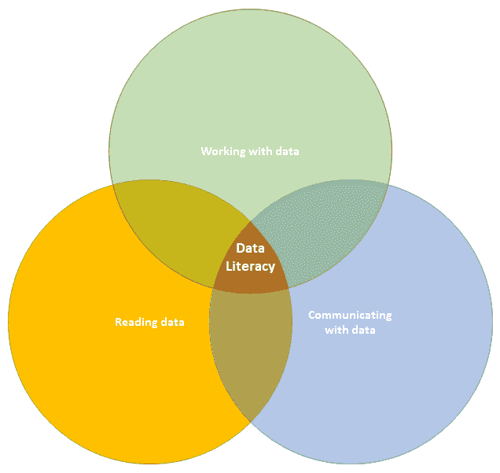
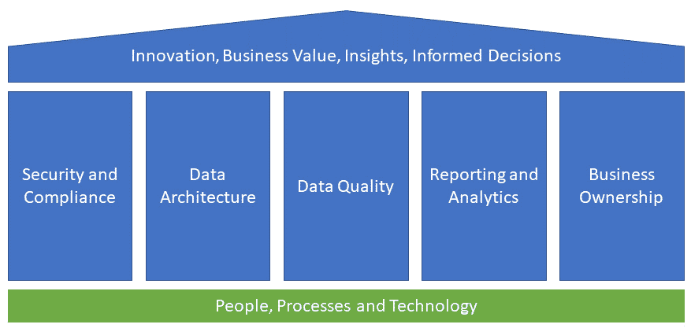

# 3

# 机器学习背景下的数据素养

随着我们进入人工智能和机器学习的时代，发展对数据素养的基础理解变得越来越重要。在本章中，我们将探讨数据素养的概念及其在机器学习世界中的关键作用。

数据素养指的是阅读、分析和理解数据的能力。随着我们日常生活中数据的快速增长，数据素养对个人、企业和组织都已成为一项关键技能。在机器学习的背景下，数据素养尤为重要，因为它构成了整个过程的基石。

机器学习模型的质量仅取决于它们训练所用的数据，数据素养在确保用于训练的数据高质量、相关且无偏见方面发挥着至关重要的作用。

在本章中，我们将探讨以下主要主题：

+   数据素养及其所需技能

+   明智的决策和做出明智决策的方法

+   数据战略以及如何在组织中高效利用数据

# 什么是数据素养？

如前所述，数据素养指的是阅读、分析和理解数据的能力。它包括一系列技能，包括阅读和解释数据可视化、理解统计概念以及将批判性思维应用于数据分析。在当今以数据驱动为主的世界中，数据素养变得越来越重要，因为个人和组织面临着日益增长的数据量，需要进行分析和解释以做出明智的决策。

在许多领域，如商业、医疗保健和政府，数据素养已成为一项关键技能，在机器学习领域也是如此，因为模型的质量仅取决于它们训练所用的数据。

数据素养不仅关乎技术技能，还包括批判性地评估数据、识别潜在偏见或局限性的能力。它涉及一种好奇心、怀疑态度，以及提问和寻求答案的意愿。最终，数据素养使个人和组织能够做出更明智的决策，推动有意义的变革。

数据素养中包含的一些关键技能如下：

+   **数据收集**：识别和从各种来源收集数据的能力，包括数据库、API、调查和其他来源

+   **数据清洗**：清理和预处理数据以确保其准确、一致，并处于可用于分析的可使用格式

+   **数据分析**：使用统计方法、数据可视化技术、机器学习和其他工具分析数据的能力

+   **数据可视化**：创建数据视觉表示以促进理解和沟通的能力

+   **有效沟通**：以清晰简洁的方式将数据分析的见解和发现传达给他人的能力

+   **伦理**：理解与数据工作相关的伦理影响，包括隐私、安全和偏见等问题

+   **技术技能**：熟练掌握用于数据分析的工具和技术，例如编程语言（例如 Python、R）、统计软件（例如 SAS、SPSS）和数据可视化工具（例如 Qlik）

+   **批判性思维**：批判性地评估数据，并识别潜在偏见、局限性和错误的能力

+   **领域知识**：了解数据被使用的领域或行业，以理解数据的背景及其潜在用途

因此，基本上，数据素养技能可以分为技术和非技术技能。接下来，我们将更详细地探讨一些最基本技能。我们将首先从非技术技能开始。

## 批判性思维

批判性思维是在处理数据时最重要的技能之一。在数据素养中，批判性思维指的是以系统客观的方式评估数据的能力，考虑潜在的偏见、局限性和错误。它包括质疑假设、分析证据，并对数据的质和可靠性做出明智的判断。它还涉及评估分析的限制，并认识到基于不完整或不充分的数据得出错误结论或过度概括的可能性。

批判性思维的一个方面是考虑数据被使用的更广泛背景。这包括理解分析的目标、预期受众以及发现的可能影响。在这个领域培养的技能将帮助你进行分析性思考，并得出可以导致洞察和行动的结论。在机器学习背景下，这项技能将帮助你理解如何提出适当的问题以及如何为你的分析创建合适的模型。

通常，有一些习惯可以用来培养批判性思维技能。首先，你应该质疑所有假设，不要把任何事情视为理所当然。这样，你可以开始培养一个能够给你带来新想法和观点的习惯。你也应该寻求多样性。这意味着简单地确保你与其他人讨论并听取他们的观点。这个习惯将使你更好地识别可能代表你自身观点的偏见。

最后，你在做决定时应该使用纯粹的逻辑。逐个步骤地推理以确保你理解你所做的一切背后的逻辑是一个好主意。例如，在规划机器学习部署时，逐个步骤地审查你的计划并与他人分享过程和结果总是一个好主意。

## 研究和领域知识

大多数时候，你可能已经从你所在的工作领域获得了全面的领域知识，但有时在某个特定主题上具备数据素养将需要研究和学习。例如，这可能包括交叉检查你从机器学习模型中获得的结果，或者简单地找到好的数据来源。

研究的另一个方面是它帮助你跟上该领域的最新发展和最佳实践。随着数据的快速增长和数据驱动决策的重要性日益增加，总有东西可以学习，跟上新技术、工具和方法的发展步伐非常重要。

其中还涉及一个道德方面。研究技能对于解决与数据处理相关的道德考虑至关重要，例如隐私问题、偏见以及数据的负 责使用。通过对这些主题进行研究，你可以确保你以道德和负责任的方式使用数据，并为道德指南和最佳实践的制定做出贡献。

研究远不止使用搜索引擎。它涉及找到好的来源并进行交叉参考。它还涉及在项目完成后，仔细得出结论并评估这些结论。一种高效的研究方法是缩小范围。你可以从一个广泛的方法开始，然后深入探讨一些主题。永远不要带着既定的结果开始研究，保持开放的心态。确保核实你的来源。

将研究与你从以往经验中已经获得的专业知识相结合是一项重要的技能。这种方法将使你能够提出相关的问题，识别关键变量，并以有意义的方式解释数据。结合研究、专业知识、有效沟通和技术技能可以帮助你在你的领域或行业中有效地处理数据和机器学习。

## 沟通

数据素养的个体技能很重要，但能够将数据和发现传达给其他人同样重要。有效的沟通使你能够以清晰、简洁和有意义的方 式传达数据分析的见解和发现。这不仅涉及以清晰易懂的方式呈现数据，还提供背景和解释，帮助观众理解数据的含义和潜在用途。

交流对于在观众中建立信任和信誉同样重要。通过以清晰透明的方式展示数据，你可以建立信任并增加观众使用数据来指导他们决策的可能性。不同的观众可能具有不同的技术知识水平，他们可能对数据的不同方面感兴趣。通过了解观众并调整信息以满足他们的需求，你可以提高沟通的有效性，并确保观众能够理解和利用数据及发现。在机器学习环境中，建立信任并提供关于每个解决方案的可能性和局限性的清晰沟通至关重要。

确保你的观众和同事与你站在同一立场上非常重要，尤其是如果他们参与创建机器学习模型或分析结果。误解可能导致严重的问题和商业影响。

为了提高沟通技巧，有一些策略可以专门应用于关于数据的沟通。首先，实践至关重要。你越练习关于数据的沟通，就会越感到舒适和自信。了解观众并理解他们的知识水平、目标和兴趣也很重要。使用简单语言、提供背景信息以及使用图表和图形等视觉元素可以使复杂数据更容易理解并更具吸引力。

讲故事可以帮助使数据更具吸引力和记忆性。同时，练习积极倾听并以深思熟虑和尊重的方式回应观众的反馈也很重要。从可信赖的同事、导师或顾问那里寻求反馈可以帮助你识别改进领域，并在一段时间内提高你的沟通技巧。

## 技术技能

技术技能是数据素养的基本方面，因为它们使个人能够有效地使用各种技术工具和平台来处理数据。技术技能包括广泛的能力，包括数据收集、清洗、分析、可视化、编程、数据库管理、数据建模、机器学习以及数据安全和隐私。

数据收集涉及从数据库、网站、API 和其他数据存储库等不同来源收集数据的能力。数据清洗和准备对于消除原始数据中的错误、不一致性和缺失值以及使其准备好分析至关重要。数据分析包括利用统计方法、机器学习算法和其他分析技术来识别数据中的模式、趋势和洞察。数据可视化是使用图表、图形和其他可视化手段创建数据视觉表示的过程，以使数据更容易理解和操作。

其他技术技能可能包括，例如，编程、数据库管理和数据建模。技术技能使个人能够更有效地处理数据，开发准确的预测和洞察，并以易于被听众理解的方式传达他们的发现。由于本书的大部分内容都与技术技能相关，因此我们在此章中不会深入探讨个别技能。 

下图总结了数据素养的关键技能：

图 3.1：数据素养的三个领域

在本节中，我们熟悉了数据素养的概念。接下来，我们将更深入地探讨知情决策以及如何使用数据素养技能来支持决策。

# 知情决策

知情决策是指利用数据做出有证据支持且基于对数据全面理解的决策的过程。它包括识别相关数据、使用适当的工具和技术进行分析，以及基于证据而非假设或直觉得出结论的能力。对于与数据工作的人员来说，知情决策是一项关键技能，因为它使他们能够利用数据推动更好的结果，并做出有证据支持的决策。

要做出知情决策，你必须清楚地了解手头的问题或问题，以及与之相关的数据。你必须能够识别适当的数据来源，评估数据的质量，并选择适当的分析技术来分析它。知情决策还要求你能够解释分析结果，并有效地向他人传达发现。

在决策可能产生重大后果的行业中，如医疗保健、金融和政府，知情决策尤为重要。例如，医疗保健专业人员可能使用数据做出关于患者护理和治疗的知情决策，而金融分析师可能使用数据做出投资决策。

知情决策不仅仅是使用数据来做出决策，还涉及使用数据来评估这些决策的有效性。这要求组织能够监控和衡量决策的结果，并利用这种反馈随着时间的推移改进决策过程。

最终，知情决策是将信息转化为行动并基于知识做出所有决策的能力。

组织中有许多基于信息的决策模型。我们在这里将要看到的一个模型结合了提出正确问题、以正确格式获取正确数据、批判性地分析和评估数据、应用你和其他人的领域知识（意识到潜在的偏见），以及将决策传达给所有相关利益相关者的需求。还有一个机制来监控和迭代流程，使其随着时间的推移变得更好。

让我们更仔细地看看这个过程。我们可以将其分为 12 个不同的步骤：

1.  **提问**：将你的业务问题转化为分析问题。为机器学习起草你的问题。你希望达到的目标结果是什么？

1.  **获取**：找到所有相关的数据。记住利用与你问题相关的内部和公共数据。

1.  确保你拥有所有必要的数据，并交叉检查其可靠性。确保数据格式正确。利用配置文件、缩放、标记、标准化和目录功能。确保你正确处理了敏感数据。

1.  **分析**：创建适当的分析和可视化来描述你的数据，包括关键绩效指标（KPIs）。

1.  **寻找模式和趋势**：尝试绘制关系并深入数据。开始思考你的原始问题。它是否可以解决，它是否仍然相关？

1.  **应用**：回顾你迄今为止所取得的成果，并开始将你的领域知识应用于结果。

1.  **挑战你的发现和数据**：寻找任何让你有理由质疑你早期发现的证据。

1.  **与你的团队和同事一起审查结果**：如果你独自工作，试着再次审视并找出可能的偏见。

1.  **开始利用机器学习**：运行多次模拟并构建多个模型。仔细测试所有解决方案并审查结果。用结果增强你早期的分析。

1.  **宣布**：将你的发现和结果传达给你的组织。确保向正确的受众展示。为不同的利益相关者使用不同级别的细节。

1.  **访问权限**：建立一个机制来审查你的工作。监控所做决策的效果。

1.  利用收集到的所有反馈，并迭代你的流程。尝试快速失败并立即修复问题。记录你的发现以及这些如何改变了原始流程。

为你和你所在的组织开发一个良好的流程可能需要时间和多次迭代，但最终将极大地造福个人和组织。当决策基于事实和数据时，它们更容易得到辩护，并且比仅基于部分信息或感觉的决策更有可能引导你走上正确的道路。

在更长的时间内，一个精细化的决策过程将导致风险降低、效率提高、资源分配更好、沟通改善和竞争优势。

在本节中，我们探讨了明智决策的方法以及如何在组织层面做出明智的决策。在下一节中，我们将转向更广阔的视角，重点关注数据战略。

# 数据战略

数据战略是任何组织整体战略的关键要素，因为它使组织能够利用数据来实现其目标。一个设计良好的数据战略会考虑组织的目标、挑战和可用资源，并概述收集、管理、分析和有效使用数据的步骤。

数据治理是数据战略的关键组成部分，它为组织内部的数据管理和使用建立了政策和程序。数据治理包括定义数据所有权、建立数据标准和确保遵守数据法规。通过明确理解数据治理，组织可以确保数据被道德和安全地使用，从而与利益相关者建立信任。

明确定义的数据架构是有效数据战略的另一个基石。数据架构涉及设计管理和存储数据的结构和系统。这包括定义数据模型、选择合适的数据库技术以及确保系统间的数据集成。通过建立强大的数据架构，组织可以确保数据可访问、准确和一致，从而提高决策和运营效率。

数据分析和机器学习可以被视为利用数据战略的核心技术。这涉及使用各种技术通过预测建模、机器学习和数据可视化平台从数据中提取洞察。通过使用数据分析来获得洞察，组织可以做出更明智的决策，识别新的机会，并改进业务流程。

在数据战略中，数据质量至关重要，因为它确保数据是准确、完整和一致的。这包括建立数据质量标准、执行数据验证和根据需要清洗数据。通过确保数据质量，组织可以信任他们用于决策的数据，从而降低出错的风险并提高运营效率。

安全和数据所有权是每个有效数据战略的关键组成部分。数据安全确保数据免受未经授权的访问和网络安全威胁。这包括实施数据安全政策、使用加密技术和建立访问控制。通过保护数据，组织可以防止数据泄露，从而保护其声誉并降低财务和法律处罚的风险。

对于所有数据资产明确所有权将使谁有权批准数据的使用以及更新或修改数据集变得透明。数据管理员或所有者还作为数据资产领域的专家，可以在组织内部成为数据相关问题的一个联系点。

当为一个组织制定数据策略时，有一些关键原则需要遵循。一个有效数据策略的基本内容包括理解关键组件并设计一个与组织的目标、挑战和可用资源相一致的计划。

一个有效数据策略的一些基本内容包括以下：

+   理解组织的目标：数据策略应与组织的整体目标和目标保持一致。这涉及到了解组织想要实现什么以及数据如何支持这些目标。

+   定义数据治理：数据治理对于确保数据得到道德和安全地管理和使用至关重要。这包括定义数据所有权、建立数据标准和确保遵守数据法规。

+   建立数据架构：一个设计良好的数据架构对于有效地管理和存储数据至关重要。这包括定义数据模型、选择合适的数据库技术，并确保系统间的数据集成。

+   使用数据分析：数据分析对于从数据中提取见解并做出明智的决策至关重要。这包括使用各种技术，如预测建模、机器学习和数据可视化。

+   确保数据质量：数据质量对于确保数据准确、完整和一致至关重要。这包括建立数据质量标准、执行数据验证和根据需要清理数据。

+   保护数据安全：数据安全对于保护数据免受未经授权的访问和网络安全威胁至关重要。这涉及到实施数据安全策略、使用加密技术，并建立访问控制。

+   监控和调整：数据策略应定期监控，以确保其与组织的目标保持一致并实现预期的效益。随着组织的目标、挑战或可用资源的变化，可能需要对其进行调整。

下图总结了数据策略的关键支柱：

图 3.2：数据策略的支柱

评估当前数据策略的成熟度是改进的良好起点。现有的数据策略应不断进行评估。为了评估一个组织的数据策略成熟度，有必要评估其与目标和目标的契合程度，以及其有效执行策略的能力。这包括定义与评估成熟度相关的关键标准，例如数据治理政策、数据架构、数据分析能力、数据质量指标和数据安全指南。

下一步是评估组织的当前数据策略与已确定的标准的契合度。这可能涉及审查现有文档、访谈利益相关者以及进行数据分析。基于此评估，应识别出需要解决以改进数据策略成熟度的任何差距或改进领域。

然后，可以根据评估和差距分析制定提高数据策略成熟度的路线图。此路线图应包括实施路线图所需的具体行动项目、时间表和资源。定期监控数据策略实施进度是必要的，并且随着组织目标或数据相关挑战的变化，可能需要调整路线图。

通过定期评估数据策略的成熟度，可以识别出改进领域并制定提高组织能力的路线图。

组织有许多成熟度模型。接下来，我们将简要了解一下一个将多种常见方法结合在一起的模式。

此模型使用四个步骤来描述组织的成熟度：

1.  组织刚开始实施数据策略。他们主要使用内部数据和临时分析。没有或只有简单的描述性分析。静态报告和电子表格是常见的工具。

1.  组织认识到数据策略的重要性。他们正在做出有洞察力的商业决策，并关注数据质量。分析可以包括诊断用例，通常有一个商业智能平台。

1.  组织使用的数据如前一步所述，但他们正在扩展用例并使用外部数据来补充内部数据。用例可以包括预测分析和机器学习。有一个正在实施的数据策略，决策主要基于一个信息化的决策模型。

1.  在组织的最高层，领导者和创新者在使用数据方面处于领先地位。他们紧跟最新趋势，并以创新的方式使用数据。他们正在开发机器学习模型，并利用规范性分析自动提出最佳行动方案。他们不断迭代当前的数据战略，并适应新的工作方式。角色和组织结构支持数据的全面使用。

制定数据战略并将组织从成熟度的第一级转变为数据创新者是一个长期项目，本书中不再进一步讨论。关于数据战略有很多材料，强烈建议在处理数据和利用机器学习时考虑更大的图景。

# 摘要

在本章中，我们首先了解了数据素养作为一个概念的含义。我们研究了成为数据素养的方法，并讨论了如何将这些方法应用到我们的工作中。能够阅读和利用数据是现代世界中的一个重要技能，因为周围的数据量不断增加。

我们发现了什么是基于信息的决策，并使用数据、分析和机器学习的过程来做出基于信息的决策。这个过程将成为我们在下一章开始转向实践时的指南。它将为我们提供指导方针，我们将使用这些指导方针来形成我们的机器学习问题，并在定义解决方案时考虑。

在本章末尾，我们简要讨论了数据战略和成熟度。数据战略是每个现代组织的重要方面，但也是一个广泛的话题。我们从数据的角度探讨了如何定义组织的成熟度，以及数据战略最重要的方面。

在下一章中，我们将开始关注使用机器学习解决问题的实际方法。我们将通过 Qlik 平台创建良好的机器学习解决方案所需的步骤。我们将涵盖如何定义问题和选择模型，如何准备数据，以及可视化最终结果时需要考虑的因素。
