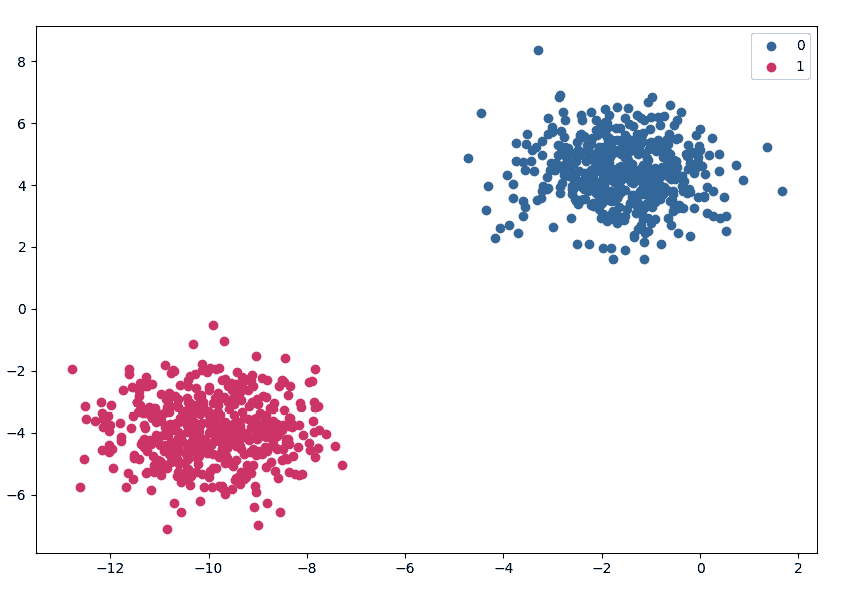
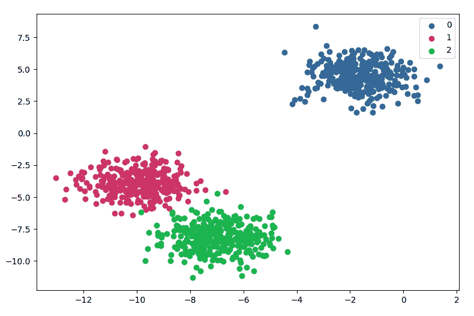
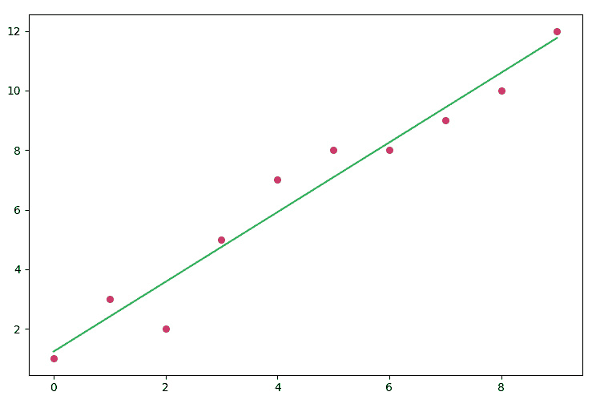
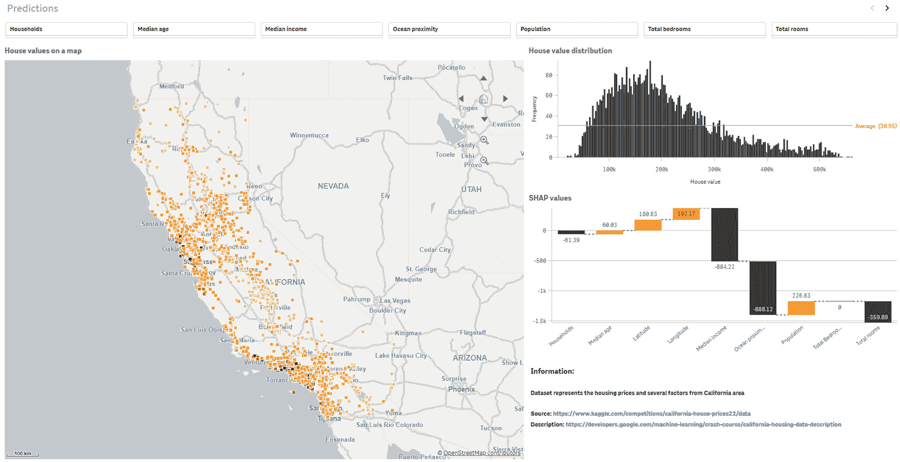

# 4

# 使用 Qlik 平台创建优秀的机器学习解决方案

本章概述了使用 Qlik 创建有效的机器学习解决方案所涉及的关键步骤。这些原则适用于所有机器学习工具和解决方案。

该过程从定义要解决的问题开始，并将其与组织的目标对齐。数据准备至关重要，Qlik 提供了强大的数据准备功能，用于收集、清理和转换数据，以确保其质量和相关性。

使用 Qlik 的功能进行数据探索和可视化对于理解数据模式并告知机器学习模型至关重要。模型选择至关重要，Qlik 为不同的用例提供了一系列算法。

一旦选择了模型，就需要使用相应的工具对其进行训练。使用适当的指标对模型进行评估有助于评估其性能并进行必要的改进。

在 Qlik 环境中部署模型涉及将其集成到应用程序或仪表板中，创建 API，或将其嵌入到 Web 应用程序中。对已部署模型的监控和维护确保其随着时间的推移保持准确性和相关性。解释和传达结果对于推动决策至关重要。Qlik 的可视化和报告功能能够有效地将洞察传达给利益相关者。

在本章中，您将学习以下内容：

+   如何定义机器学习问题并选择正确的模型来解决它

+   清洗和准备数据所需的步骤

+   如何准备和验证机器学习模型

+   如何有效地可视化和传达最终结果

# 定义机器学习问题

定义机器学习问题涉及识别可以使用机器学习技术解决的问题的具体业务挑战或分析目标。定义问题的过程可以分为几个关键步骤：

1.  **理解业务目标**：首先，要清楚地了解需要解决的总体业务目标或问题。这可能是提高客户保留率、优化定价策略、预测设备故障或识别潜在的欺诈案例等。

1.  **识别关键问题或挑战**：一旦定义了业务目标，就需要使用机器学习来识别需要解决的具体问题或挑战。这涉及到理解当前流程或系统中的关键痛点、限制或差距，这些可以通过机器学习来改进。

1.  **定义范围和边界**：明确定义机器学习问题的范围和边界。这包括确定特定的数据输入和输出、问题的时限以及数据可用性、资源或可行性方面的任何约束或限制。

1.  **制定问题陈述**：制定一个清晰、简洁的问题陈述，以具体和可衡量的方式描述业务挑战或目标。问题陈述应定义明确且可衡量，以便对机器学习解决方案的成功进行客观评估。

1.  **考虑数据需求**：分析机器学习问题的数据需求。确定相关的数据源、数据类型和数据质量要求。考虑数据的可用性、完整性和准确性，以及任何数据隐私或安全考虑。

1.  **定义评估指标**：定义将用于评估机器学习解决方案性能的评估指标。这些指标应与问题陈述和业务目标一致，并提供对解决方案成功程度的定量度量。

1.  **考虑可行性和影响**：评估机器学习解决方案的可行性和潜在影响。考虑实施解决方案的技术可行性、必要资源的可用性以及预期对业务目标或要解决的问题的影响。

通过遵循这些步骤，您可以有效地定义一个机器学习问题，并为构建成功的机器学习解决方案奠定基础。明确的问题定义对于指导整个机器学习过程至关重要，从数据准备到模型训练、评估和部署。

注意

Qlik 使用一个四步框架来帮助定义机器学习问题。该框架包括以下步骤：

1.  事件触发

例如：客户下单

1.  目标

例如：一年内再次下单（是 | 否）

1.  特征

例如：年龄、州、之前的订单数量、运输类型

1.  预测点

例如：订单后一个月

这里描述的框架是这个框架的扩展和更全面版本。这个框架可以在*第十章*中看到其应用。

如果我们打算使用 Qlik AutoML 来创建我们的模型，重要的是要记住以下场景是支持的：

+   **二分类**：这适用于可以用*是*或*否*回答的任何问题。例如：我的客户会流失吗？我的库存会耗尽吗？我的病人会取消他们的预约吗？

注意

理想情况下，我们希望尽可能将每个机器学习问题转化为二分类问题，因为在大多数情况下这将提供最佳的准确性。然而，在某些情况下，使用其他类型的算法可能会得到更好的结果。根据我们正在解决的问题选择正确的算法非常重要。

二分类问题可以用以下图表来描述：



图 4.1：二分类

+   **多类分类**：存在多个可能结果的问题。例如：*客户会购买什么产品？病人将被**转到哪个设施？*

    多类分类问题可以如图所示进行说明：



图 4.2：多类分类

+   **回归**：这涉及到对未来某个点的值进行预测。例如：*我们年末的销售额是多少？病人的预期等待时间是多长？*

    回归可以如图所示进行可视化：



图 4.3：回归

注意

其他用例可以通过高级分析集成和工具（包括 R、Python、AWS SageMaker 或 Azure ML Studio）来解决。我们将在下一章中介绍如何设置这些环境。

我们现在已经研究了形成机器学习问题的基本知识以及 Qlik AutoML 可以用来帮助我们解决哪些类型的问题。在下一节中，我们将探讨机器学习大多数任务所需的一些常见数据准备步骤。

# 数据清理和准备

数据准备是机器学习中的一个关键步骤，因为用于模型训练的数据的质量、相关性和适用性直接影响到最终机器学习模型的准确性、可靠性和有效性。

通用数据准备步骤包括以下内容：

+   **移除** **空值**

+   **移除** **不需要的列**

+   **编码（例如，我们在** *第二章*** 中的一些例子中使用的一热编码）**

+   **特征缩放**

+   **分割成测试集和** **训练集**

+   设置正确的数据类型

+   移除重复项

+   纠正数据错误

+   移除异常值

在前面的列表中，Qlik AutoML 自动处理的步骤以**粗体**显示。其余的步骤可以在 Qlik Sense 中完成。

让我们通过一些例子来更详细地看看这些步骤。

## 示例 1 – 一热编码

假设我们有以下数据集：

| **ID** | **类别** | **食肉动物** |
| --- | --- | --- |
| 1 | 哺乳动物 | 否 |
| 2 | 鸟类 | 否 |
| 3 | 哺乳动物 | 是 |
| 4 | 爬行动物 | 否 |
| 5 | 爬行动物 | 是 |

表 4.1：示例数据集

如果我们对前面的表进行一热编码，它将看起来像这样：

| **ID** | **哺乳动物** | **爬行动物** | **鸟类** | **食肉动物** |
| --- | --- | --- | --- | --- |
| 1 | 1 | 0 | 0 | 否 |
| 2 | 0 | 0 | 1 | 否 |
| 3 | 1 | 0 | 0 | 是 |
| 4 | 0 | 1 | 0 | 否 |
| 5 | 0 | 1 | 0 | 是 |

表 4.2：一热编码示例

下面是使用 Python 实现上述结果的示例代码：

```py
import pandas as pd
from sklearn.preprocessing import OneHotEncoder
data = {
    'ID': [1, 2, 3, 4, 5],
    'Category': ['Mammal', 'Bird', 'Mammal', 'Reptile', 'Reptile'],
    'Carnivore': ['No', 'No', 'Yes', 'No', 'Yes']
}
df = pd.DataFrame(data)
encoder = OneHotEncoder(sparse=False)
category_encoded = encoder.fit_transform(df[['Category']])
category_names = encoder.get_feature_names_out(['Category'])
df[category_names] = category_encoded
df.drop('Category', axis=1, inplace=True)
print(df)
```

在前面的例子中，我们使用了 scikit-learn 中的`OneHotEncoder`对`Category`列进行了一热编码。然后，将得到的一热编码值作为新列添加到 DataFrame 中，每个类别在其对应的列中以二进制值（1 或 0）表示。

## 示例 2 – 特征缩放

特征缩放在机器学习中非常重要，以确保所有特征或变量具有相似的尺度，因为它可以影响许多机器学习算法的性能和收敛性。最小-最大缩放是用于特征缩放常用的方法之一，其中值被缩放到特定的范围，通常在 0 到 1 之间。

假设我们有以下数据集：

| **ID** | **Age** | **Income** |
| --- | --- | --- |
| 1 | 25 | 50000 |
| 2 | 30 | 60000 |
| 3 | 35 | 70000 |
| 4 | 40 | 80000 |
| 5 | 45 | 90000 |

表 4.3：示例数据集

特征缩放后，我们将得到以下输出：

| **ID** | **Age** | **Income** |
| --- | --- | --- |
| 1 | 0.00 | 0.00 |
| 2 | 0.25 | 0.20 |
| 3 | 0.50 | 0.40 |
| 4 | 0.75 | 0.60 |
| 5 | 1.00 | 0.80 |

表 4.4：特征缩放后的示例数据集

下面是实现上述缩放的 Python 代码：

```py
import pandas as pd
from sklearn.preprocessing import MinMaxScaler
data = {
    'ID': [1, 2, 3, 4, 5],
    'Age': [25, 30, 35, 40, 45],
    'Income': [50000, 60000, 70000, 80000, 90000]
}
df = pd.DataFrame(data)
scaler = MinMaxScaler()
df[['Age', 'Income']] = scaler.fit_transform(df[['Age', 'Income']])
print(df)
```

在前面的例子中，使用 scikit-learn 的`MinMaxScaler`对 DataFrame 的`Age`和`Income`列进行特征缩放。通过调用所选列的`fit_transform`方法，根据每列中的最小值和最大值将值缩放到 0 到 1 之间。然后，更新原始 DataFrame 中的缩放值。

前面的例子中的功能由 Qlik AutoML 自动处理，但当你使用高级分析集成时，应考虑这些步骤。本章迄今为止审查的示例是用 Python 编写的，但也可以使用 Qlik 脚本或其他数据处理方法实现相同的功能。此外，null 编码、数据类型处理以及许多其他数据准备任务可以在 Qlik 中完成。我们将在*第六章*中更详细地探讨这些内容。

现在我们已经熟悉了常见的数据清洗和预处理步骤，让我们来检查模型准备和验证。这些方面对于建立对模型的信任和评估结果非常重要。

# 准备和验证模型

在*第一章*中，我们发现了模型验证和准备的一些概念。Qlik AutoML 自动处理模型选择并提供给我们全面的信息以支持验证。我们将在*第七章*和*第八章*中更详细地考虑模型选择和验证。在本节中，我们将通过总结 Qlik 中模型准备和验证的最重要步骤来为这些章节做准备。以下步骤是以 Qlik AutoML 的视角编写的。当使用高级分析集成时，根据所选技术（例如 R、Python、Azure ML Studio、AWS SageMaker 等）可能会有一些小的差异。

通用验证和准备步骤包括以下内容：

+   **数据准备**：首先，为机器学习准备你的数据。将你的数据加载到 Qlik Sense 中，对其进行清理和预处理，处理缺失值，并在必要时进行特征工程。Qlik AutoML 支持各种数据类型，包括数值、分类和文本数据。

+   **模型选择**：为你的问题选择合适的机器学习算法。Qlik AutoML 提供了广泛的算法，包括决策树、随机森林、梯度提升、支持向量机等。你可以选择多个算法同时进行评估，以比较模型。

+   **模型训练**：一旦你选择了算法，Qlik AutoML 会自动使用不同的超参数配置训练多个模型。这些模型使用交叉验证在你的数据的一部分上训练，这有助于评估它们的性能并选择表现最佳的模型。

+   **模型评估**：在模型训练完成后，Qlik AutoML 提供了全面的模型评估指标，如准确率、AUC 和 F1 分数，以评估每个模型的性能。你可以比较不同模型的性能，并选择在你数据上表现最佳的模型。

+   **模型部署**：一旦你选择了最佳模型，你可以在 Qlik Sense 应用中部署它。Qlik AutoML 生成必要的代码，以在你的应用中实现模型，这使得将模型集成到你的分析工作流程中变得容易。

+   **模型监控**：Qlik AutoML 允许你实时监控你部署的模型性能。你可以跟踪关键性能指标，并在模型性能随时间下降时采取必要的行动。

+   **模型验证**：最后，使用真实世界的数据验证你部署的模型性能非常重要。监控模型的预测结果，并将其与实际结果进行比较，以确保模型在真实世界环境中做出准确和可靠的预测。

在本节中，我们概述了模型准备和验证的方法。机器学习项目的最后一部分通常是最终结果的可视化。让我们在下一节中探讨这一般原则。

# 可视化最终结果

在可视化最终结果时，我们在机器学习解决方案创建的不同部分有几种选项需要考虑。我们将在*第九章*中深入探讨可视化技术和不同的图表类型。然而，以下是一些一般步骤供你考虑：

+   **加载数据**：将你的机器学习结果数据加载到 Qlik Sense 中，可以使用数据源或直接连接到 Qlik AutoML 或第三方机器学习平台。这些数据可以包括预测值、实际值、模型评估指标和其他相关信息。

+   **创建可视化**：使用 Qlik Sense 内置的可视化工具创建机器学习结果的视觉表示。您可以根据数据类型和想要传达的见解选择各种图表类型。规划一个干净且视觉上吸引人的用户界面是一个重要的步骤。

+   **自定义可视化**：自定义可视化的外观和属性，使其更具视觉吸引力并富有信息性。尽量选择最佳组件来增强机器学习结果的易读性和理解性。如有需要，可辅以书面说明。

+   **共享和协作**：使用 Qlik Sense 的共享和协作功能，将您的机器学习结果可视化与相关利益相关者（如团队成员、经理或客户）分享。您可以将可视化发布到 Qlik Sense 应用程序中，将它们嵌入到其他应用程序中，或以 PDF、图像或 HTML 等多种格式导出，以便轻松共享和传播。鼓励使用 Qlik Alerting、笔记、故事讲述和其他高级功能。

规划可视化并有效地传达结果是推动用户采用您的机器学习解决方案的重要部分。通过利用 Qlik Sense 的可视化能力，您可以有效地以视觉吸引力和互动的方式传达和展示您的机器学习结果，使用户能够根据机器学习模型的成果获得见解并做出明智的决策。

在下面的屏幕截图中，我们可以看到一个 Qlik Sense 仪表板的示例，它用于可视化 Qlik AutoML 模型的结果：



图 4.4：展示 Qlik AutoML 结果的示例仪表板

# 摘要

在本章中，我们开始逐步接近使用 Qlik 工具实现机器学习解决方案。我们发现了形成正确业务问题的必要性以及形成问题时应该考虑的方面。

我们发现了一些数据准备的一般步骤以及这些步骤应该如何处理。更详细的数据建模和转换技术将在*第六章*中介绍。我们还简要探讨了模型准备和验证的概念。

在本章末尾，我们讨论了演示的重要性以及使用 Qlik 可视化结果时应考虑的因素。这一主题将在*第九章*中更详细地讨论。

在下一章中，我们将了解如何为我们的机器学习解决方案准备环境。我们将安装 R 和 Python 的本地集成，了解如何利用 API 和高级分析集成与 Azure ML Studio 和 AWS SageMaker 交互，以及如何为 AutoML 设置 Qlik 租户。这些步骤对于使我们的环境准备好实际实施至关重要。

# 第二部分：使用 Qlik 的机器学习算法和模型

本节将涵盖使用 Qlik 工具创建机器学习项目的实际操作，并通过实例进行说明。本节从有效利用工具所需的设置过程开始。第六章涵盖了使用 Qlik Sense 进行数据预处理的必要技术，随后是监控模型和处理部署的最佳实践。在本节的最后，我们将通过具体示例介绍 Qlik AutoML 的功能。在本节的最后，我们将探讨可视化结果的重要方面。

本节包含以下章节：

+   *第五章**:* *设置环境*

+   *第六章**:* *使用 Qlik Sense 进行数据预处理和探索*

+   *第七章**:* *部署和监控机器学习模型*

+   *第八章**: 利用 Qlik AutoML*

+   *第九章**:* *机器学习解决方案的高级数据可视化技术*
