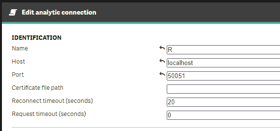

# 5

# 设置环境

在前面的章节中，我们发现了机器学习问题背后的某些理论和框架。在本章中，我们将转向实际实施。安装 Qlik 机器学习环境是利用 Qlik Sense 中机器学习力量的关键步骤。在本章中，我们将介绍安装和设置各种 Qlik 机器学习环境的过程。

到本章结束时，我们将对 Qlik 机器学习环境的安装和配置过程有一个扎实的理解，这将使我们能够利用 Qlik Sense 中的机器学习力量进行数据驱动决策。

作为本章的一部分，我们将学习以下内容：

+   R 和 Python 的高级分析集成

+   设置 Qlik AutoML

+   使用 REST 的云集成

# R 和 Python 的高级分析集成

高级分析集成是一个功能，它允许用户在 Qlik Sense 环境中执行高级数据分析与预测建模任务。通过高级分析集成，用户可以使用流行的统计分析与机器学习工具，例如 R 和 Python，来构建预测模型，执行数据挖掘任务，并从他们的数据中获得洞察。

通过高级分析连接从第三方系统获取的数据与由 Qlik 关联引擎处理的数据相结合。

高级分析集成的工作流程在下图中展示：


图 5.1：高级分析集成工作流程

接下来，我们将逐步查看 R 和 Python 集成的安装过程。

## 安装 R 的高级分析集成

在本节中，我们将安装 R 并在 Qlik Sense 客户端管理的环境中启用高级分析集成。让我们按照以下步骤进行：

1.  **先决条件**：您需要安装并正确授权的最新版本的客户端管理的 Qlik Sense（自 Qlik Sense 2018 年 2 月发布以来支持服务器端扩展）。您还应拥有适当的访问权限的用户账户，以便在 **Qlik 管理** **控制台**（**QMC**）中配置连接。

1.  首先，我们需要下载并安装 R 环境。它可以从 [`cloud.r-project.org/`](https://cloud.r-project.org/) 下载。

    R 的基本包就足够了。在撰写本文时，R-4.3.1 是最新版本，但您应使用最新版本。正确的二进制文件取决于您的操作系统。您可以在与客户端管理的 Qlik Sense 实例相同的服务器上安装 R，或者在一个单独的服务器上。在这个例子中，我们将把 R 安装在 Qlik Sense 的同一服务器上。您可以在安装程序中使用默认设置。

1.  接下来，我们需要在我们的 R 环境中安装 `Rserve` 包，以便通过 TCP/IP 将 R 功能扩展到应用程序。Rserve 使得远程调用 R 脚本成为可能，而 SSE 桥接器正是利用它作为通信流程的一部分。打开 Windows 命令行，导航到 R 环境目录的 `bin` 文件夹。你可能需要运行一个需要管理员权限的提升命令提示符。在我们的例子中，导航到正确目录的命令如下：

    ```py
    cd C:\Program Files\R\R-4.3.0\bin
    ```

    一旦你进入了正确的目录，通过输入 `R` 并按 *Enter* 键打开 R 环境。你应该会看到一个类似于以下截图所示的视图：


图 5.2：在命令行上运行的 R 环境

输入以下命令来安装 `Rserve` 包：

```py
Rserve is now installed on our environment. You can invoke it by typing the following commands:

```

library(Rserve)

Rserve 现在正在运行，并准备好接收命令：

```py
> Rserve: Ok, ready to answer queries.
```

1.  我们需要在 Rserve 和 Qlik Sense 之间建立一个桥接组件。Qlik 为 R 提供了一个开源的桥接组件插件版本，我们将在本例中使用它。也有可能开发自己的桥接器。从以下网址下载桥接器：[`github.com/qlik-oss/sse-r-plugin`](https://github.com/qlik-oss/sse-r-plugin)。

注意

插件是用 C# 编写的，默认情况下必须构建。在存储库的 `releases` 部分中有一个预构建的插件版本：[`github.com/qlik-oss/sse-r-plugin/releases/tag/v1.2.1`](https://github.com/qlik-oss/sse-r-plugin/releases/tag/v1.2.1)。

在本例中，我们将使用最新的预构建版本，因为编译 C# 源代码超出了本书的范围。《桥接》组件用于在 Qlik 高级分析连接器和第三方分析引擎之间提供接口。它基于 Google 远程过程调用。

一旦你构建了包或下载了预构建版本，打开一个新的命令行，导航到包含 `SSEtoRserve.exe` 的文件夹，并在命令行中启动它。以下视图应该会出现：


图 5.3：在命令行上运行的 SSEtoRserve

我们现在已经验证了桥接组件可以连接到 Rserve。在进入下一步之前，你应该现在关闭所有打开的命令行窗口！

注意

桥接组件可以在与 Qlik Sense 环境或 R 环境相同的服务器上运行，或者在不同的服务器上。通常建议将桥接器安装在 Qlik Sense 相同的服务器上。在本例中，我们将把所有组件都安装在同一个服务器上。

如果网桥组件和 R 环境（R environment）位于不同的服务器上，您必须配置网桥组件以连接到 Rserve 运行的正确 IP 地址和端口。为此，修改与 `SSEtoRserve.exe` 同目录下的 `SSEtoRserve.exe.config` 文件中的值。此文件中还有其他选项，包括证书设置等。

1.  接下来，我们将设置 R 和我们的 SSE 到 R 网桥作为服务运行。这将使我们能够始终拥有一个运行的环境，而无需手动从命令行重新启动服务。有多种工具可以将命令行脚本和程序作为服务运行。在此示例中，我们将使用一个名为 NSSM 的免费工具。NSSM 使安装和管理 Windows 服务变得更容易。让我们从以下链接下载 NSSM 开始：[`nssm.cc/download`](https://nssm.cc/download)。

    下载完 NSSM 后，从 `.zip` 包中提取文件，并使用命令行导航到提取文件夹中的 `win64` 文件夹（如果您使用的是 32 位环境，则为 `win32`）。确保您使用管理员权限运行命令行。

    我们将首先安装 Rserve 作为服务。要启动 NSSM，请输入以下命令：

    ```py
    Rserve.exe is located. An example of these settings is shown in the following screenshot:
    ```


图 5.4：NSSM Rserve 设置

点击 **安装服务**（**Install service**）按钮，您应该会收到一条消息，表明服务已成功安装。

要成功运行我们的 Rserve 服务，我们需要在环境变量中定义我们的 R 环境路径。为此，让我们首先打开环境变量窗口。可以通过启动 **控制面板**（**Control Panel**） -> **系统和安全**（**System and Security**） -> **系统**（**System**）并选择左侧的 **高级系统设置**（**Advanced system settings**）来找到它。将打开 **系统属性**（**System Properties**）窗口。点击窗口底部的 **环境变量**（**Environment Variables**）按钮。

选择 **路径** 并激活它。然后，点击 **编辑**（**Edit**）按钮。将打开 **编辑环境变量**（**Edit environment variable**）窗口。

在窗口右侧选择 **新建**（**New**），并输入包含您的 R 可执行文件的目录的正确路径。以下是一个示例路径（您应在此处使用您 R 安装的实际路径）：

```py
C:\Program Files\R\R-4.3.0\bin\x64
```

通过在 **变量名**（**Variable name**）字段中选择 `R_HOME` 环境变量并添加 R 环境根文件夹的路径到 **变量值**（**Variable value**）字段中来确认编辑。

下面的截图展示了示例：


图 5.5：系统变量示例

在所有三个窗口上点击 **确定**（**OK**），直到返回到 **控制面板**（**Control Panel**）。此时，系统变量已创建。

接下来，我们将安装网桥组件作为服务。首先，在之前步骤中使用的相同命令行窗口中输入以下命令：

```py
nssm install SSEtoRServe
```

应该会出现与之前步骤中看到的类似设置窗口。在这里，我们将设置路径指向我们桥接连接文件夹中的 `SSEtoRServe.exe` 文件。一个示例路径如下：

```py
C:\Users\qmi\Downloads\sse-r-plugin-1.2.1-qlik-oss\sse-r-plugin-1.2.1-qlik-oss\SSEtoRserve.exe
```

设置应该看起来与以下截图类似：


图 5.6：NSSM SSEtoRserve 设置

接下来，我们将 `RserveService` 设置为 `SSEtoRServe` 服务的依赖项。为此，按照以下方式打开 `RserveService`：


图 5.7：SSEtoRServe 依赖项配置

在按下 **安装服务** 按钮后，我们应该会收到成功安装的确认。

接下来，我们可以从 Windows 中打开 **服务** 视图并启动我们的 **SSEtoRserve** 服务。这也应该会启动 **RserveService**。在继续下一步之前，请验证这两个服务是否正在正确运行。

1.  下一步是在 QMC 中配置高级分析连接。打开 `R`2.  `localhost`3.  `50051`4.  `20`5.  `0`

以下截图显示了设置示例：



图 5.8：QMC 中的分析连接设置

1.  接下来，我们可以测试我们的连接是否正确工作。打开任何 Qlik Sense 应用程序或创建一个新的应用程序并添加一些虚拟数据。在应用程序中添加一个新的表单，并将 KPI 对象拖放到画布上。

    将以下公式插入 KPI 对象的表达式字段中：

    ```py
    R.ScriptEval('1+2')
    ```

    脚本的第一部分告诉引擎使用我们新创建的分析连接。您可以使用 QMC 中定义的名称来引用任何分析连接。在这种情况下，我们连接的名称是 `R`。第二部分是由我们的桥接插件提供的一个函数。总共提供了八个函数。我们将在 *第七章* 中更深入地探讨如何使用这些函数。在这个测试中，我们将向 R 环境发送一个简单的公式来求和两个数字。R 返回我们的计算总和，我们应该在 KPI 对象中看到它被显示：


图 5.9：R 中计算的 KPI 示例

我们现在已经验证了我们的环境正在正确工作。您可以在数据加载期间或实时利用加载脚本中的连接，就像我们在示例 KPI 中所做的那样。

备注

`SSEtoRserve` 组件将日志写入桥接根文件夹中的 `/logs` 文件夹。该日志是调试可能的问题和监控环境和模型性能的好地方。

备注

如果您想在 Qlik Sense 桌面实例上运行高级分析连接，可以将连接详细信息添加到位于 `Documents/Qlik/Sense` 下的 `Settings.ini` 文件中。要创建到 R 环境的连接，请添加以下行：

`SSEPlugin=R,localhost:50051`

记得在文件末尾添加一个空行，然后保存。现在，您的 Qlik Sense 桌面实例应该能够通过高级分析连接连接到 R。（注意，在启动 Qlik Sense 桌面之前，`SSEtoRserve` 桥接和 Rserve 必须在您的计算机上运行。）

安装与 Python 的高级分析集成

我们还可以利用高级分析连接使用 Python。在本节中，我们将按照以下步骤在客户端管理的 Qlik Sense 环境中安装具有高级分析集成的 Python。让我们这样做：

1.  **先决条件**：您需要安装最新版本的客户端管理的 Qlik Sense 并正确授权。您还应该有一个具有适当访问权限的用户账户，以便在 QMC 中配置连接。

1.  下载并安装 Python: [`www.python.org/downloads/`](https://www.python.org/downloads/).

    当安装程序启动时，选择 **将 python.exe 添加到 PATH** 并按 **安装现在**。

    安装程序的这一阶段可以在以下屏幕截图中看到：


图 5.10：Python 安装设置

1.  在成功安装 Python 之后，我们将向其中添加一些库。在这里，我们正在安装一些通过桥接组件进行通信所需的常见统计库。根据您的需求，您也可以安装额外的库。打开一个新的命令行窗口并输入以下命令：

    ```py
    python -m pip install --upgrade pip
    python -m pip install grpcio
    python -m pip install numpy
    python -m pip install nose
    python -m pip install google
    python -m pip install protobuf==3.20.*
    ```

    2. 对于本例，我们还将使用由 Qlik 创建的预定义桥接。从 [`github.com/qlik-oss/server-side-extension/releases/tag/v1.1.0`](https://github.com/qlik-oss/server-side-extension/releases/tag/v1.1.0) 下载它并将其提取到服务器上。

1.  接下来，我们将在 QMC 中配置我们的分析连接。打开 `Script`4. `localhost`5. `50051`6. `20`7. `0`

1.  接下来，我们将导入我们的示例应用程序。导航到包含已下载桥接文件的文件夹。从那里，导航到 `\examples\python\FullScriptSupport` 文件夹并查找名为 `SSE_Full_Script_Support.qvf` 的应用程序。将其导入到您的 Qlik Sense 环境中。

1.  打开命令行，导航到包含已下载桥接文件的文件夹。从那里，导航到 `\examples\python\FullScriptSupport` 文件夹。输入以下命令并按 *Enter*：

    ```py
    python ExtensionService_Script.py
    ```

    您应该在命令行窗口中看到以下行：

    ```py
    2023-04-23 13:29:19,950 — INFO — Logging enabled
    2023-04-23 13:29:19,966 — INFO - *** Running server in insecure mode on port: 50051 ***
    ```

    Python 环境现在正在运行，并准备好接收来自 Qlik 应用程序的命令。

注意

如果您在之前 R 示例相同的环境中安装此示例，您需要更改此 Python 示例的端口号。为此，您可以修改位于我们 *步骤 7* 中运行示例的同一文件夹中的 `ExtensionService_Script.py` 文件中的代码。端口号定义在第 *117* 行：

`parser.add_argument('—port', ` `nargs='?', default='50051')`

更改它，并在 **QMC** 的 **分析连接** 中进行相应的更改。

注意

您也可以使用前面描述的与 R 组件相同的方法来设置 Python 环境，以便作为服务运行。我们在这里不会详细说明这部分内容，但基本上，您可以使用 NSSM 安装 Python 作为服务，并将脚本作为参数传递。

1.  打开我们在 *步骤 6* 中导入的 `SSE_Full_Script_Support.qvf` 文件，以验证其功能。如果您打开应用程序的第一张工作表，您应该看到以下内容：


图 5.11：Python 连接工作

我们现在已成功在 Qlik 上安装了带有高级分析连接的 Python。

设置 Qlik AutoML

由于 Qlik AutoML 是一个 SaaS 解决方案，所需的设置很少。在本节中，我们将查看利用 AutoML 所需的必要步骤。我们将假设 Qlik Cloud 租户已经启动并运行。Qlik AutoML 的基本层包含在 Qlik Cloud 订阅许可证中。我们将在 *第八章* 中深入了解 Qlik AutoML 本身。为了为那一章做准备，需要以下步骤：

1.  导航到 Qlik Cloud 中的 **管理控制台** 并打开 **设置** 选项卡。

1.  在 **功能控制** 部分，确保已启用 **机器学习端点**，如下面的截图所示：


图 5.12：机器学习端点设置

1.  选择 `ML` `实验`。这将是我们完成 *第八章* 中所有工作的空间。

我们现在已设置并准备好了云环境。我们将现在探索我们可以与 Qlik Cloud 一起使用的各种集成。

通过 REST 进行云集成

市场上有许多第三方机器学习和人工智能平台。您可以从 Qlik Cloud 连接到这些平台中的大多数。在本节中，我们将简要介绍每个连接的不同选项和需求。在本章中，我们不会在第三方工具之上创建实际模型。

要开始使用第三方机器学习端点的连接，您必须从 Qlik Cloud 的 **管理控制台** 中启用它们。如果您从本章开始一直跟随，我们已经在上一节中完成了这一步骤。

对于最常用的机器学习工具，都有专门的连接器。在撰写本书时，连接器如下：

+   通用高级分析连接器

+   Amazon Comprehend 连接器

+   Amazon SageMaker 连接器

+   Azure ML 连接器

+   Azure OpenAI 连接器

+   Databricks MLflow 连接器

+   DataRobot 连接器

+   Qlik AutoML 连接器

+   Qlik GeoOperations 连接器

+   OpenAI 连接器

当你在 Qlik Cloud 中选择 **添加新** - **数据连接** 时，所有这些连接都可用。分析连接可以将数据发送到外部机器学习端点进行计算。该功能与我们在此章前面发现的 R 和 Python 连接类似。数据连接可以从加载脚本或 *实时* 从可视化表达式利用。我们将在 *第七章* 中更深入地探讨语法。

让我们更详细地看看这些连接器之一。

通用高级分析连接器

要使用通用连接器，必须有一个连接到的端点，并且此端点必须由 Qlik Cloud 环境公开访问。这些连接的参数如下：

+   **URL**: 部署模型的平台的宿主 URL。

+   **方法**: GET 或 POST。

+   `application/json`。

+   **HTTP 头部**: 每个请求中发送的自定义头部。

+   **查询参数**: 将附加到 URL 结尾的参数。

+   **授权方法**: 无、Bearer 令牌或 AWS Auth v4 签名。

+   **请求**: 请求的格式和内容。

+   **响应字段**: 是否加载所有字段。如果没有选择，可以指定要加载的字段。

+   **响应表**: 定义特定表字段。如果之前未选中参数，则使用此参数确定要加载的字段。

+   **关联**: 包含唯一标识符的字段。结果表将使用此信息与源表关联。这可以是包含唯一 ID 的任何字段。

+   **名称**: 连接名称。

创建连接后，它将出现在 **数据连接** 下的 **数据加载编辑器** 中。

Amazon SageMaker 连接器

Amazon SageMaker 是一个知名的机器学习平台。有一个专门的连接器用于从 Qlik Cloud 与 SageMaker 交互。要连接到 SageMaker 端点，它必须对 Qlik Cloud 公开可访问。此连接器的参数如下：

+   **端点名称**: 在 AWS 环境中端点使用的标识符。

+   **模型名称**: 在 AWS 中为部署的模型给出的名称。

+   **模型变体名称**: 如果部署了多模型端点，则此参数用于识别变体。对于简单端点，不应提供此参数。

+   **设置**: **区域** 指定服务的 AWS 区域，**使用 FIPS 端点** 指定是否需要符合 FIPS 的端点。

+   **认证**: 在此处，我们使用 AWS 控制台中找到的 AWS 访问密钥和秘密密钥。

+   **响应格式**: JSON 或文本数组。大多数模型使用 JSON。

+   **响应表**: **返回表名称** 识别模型返回的表，**表路径** 可以用于使用 JMES path 指定表。

+   **响应字段**: 是否加载所有字段。如果没有选择，可以使用 **表字段** 选择器指定要加载的字段。

+   **关联**: 包含唯一标识符的字段。结果表将使用此信息与源表关联。这可以是任何具有唯一 ID 的字段。

+   **名称**: 连接名称。

Azure ML 连接器

Azure ML 是另一个知名的机器学习平台。要连接到 Azure ML 端点，它必须对 Qlik Cloud 公开访问。此连接器的参数如下：

+   **格式**: Azure ML 或 Azure ML（旧版）。对于在 2022 年 1 月之前创建的模型，应使用旧版格式。

+   **端点名称**: 在 Azure 中用于端点的标识符。

+   **身份验证**: 从 Azure 门户获取的 Azure ML 端点密钥。

+   **请求**: **Web 服务输入名称**是模型期望的 JSON 对象名称。

+   **响应表**: 在这里，**返回表名称**标识模型返回的表，**表路径**可以用于使用 JMES 路径指定表。

+   **响应字段**: 是否加载所有字段。如果不选择此选项，您可以使用**表字段**选择器指定要加载的字段。

+   **关联**: 包含唯一标识符的字段。结果表将使用此信息与源表关联。这可以是任何具有唯一 ID 的字段。

+   **名称**: 连接名称。

Qlik AutoML 连接器

Qlik AutoML 是 Qlik Cloud 中的一个机器学习环境，并拥有其专用的连接。我们将在*第八章*中更详细地探讨 AutoML 及其使用方法。Qlik AutoML 连接器的参数如下：

+   **连接**: 已部署的机器学习模型名称。

+   **响应表**: **返回表名称**是模型返回的表。您还可以指定是否希望包括 SHAP 值、源数据集和任何错误。

+   **关联**: 包含唯一标识符的字段。结果表将使用此信息与源表关联。这可以是任何具有唯一 ID 的字段。

+   **名称**: 连接名称。

我们现在简要地查看了一些 Qlik Cloud 到第三方机器学习环境和 Qlik AutoML 所需的参数。我们将在本书的后续部分利用这些端点。

注意

分析连接包的一个有趣部分是 OpenAI 连接器和 Azure OpenAI 连接器。这些连接器将为生成式 AI 模型提供无缝集成。连接的原则与其他分析连接类似，但可能性无穷无尽。在本章中，我们不会深入探讨设置连接，但您可以在 Qlik 帮助网站上找到详细说明。

摘要

在本章中，我们开始转向使用 Qlik 实现机器学习模型的实际应用。为了为即将到来的章节做准备，我们安装了不同的环境。

首先，我们完成了 R 环境的安装以及从客户端管理的 Qlik Sense 实例中连接高级分析环境的步骤。我们介绍了如何以服务的形式运行组件，并创建了一个简单的示例应用程序来验证其功能。

我们还安装了 Python 环境，并使用高级分析集成将其连接到我们的 Qlik 环境。我们通过一个示例应用程序展示了该环境的功能。在本章的结尾，我们从本地环境迁移到了云端环境，并了解了如何使用 REST 创建到外部 AI 和机器学习平台的连接。我们还为 AutoML 环境进行了一些设置步骤，以便为接下来的章节做好准备。

在下一章中，我们将研究 Qlik Sense 的数据建模能力。我们将学习如何创建数据模型，如何清理数据，以及如何分析数据。我们将了解不同的技术和工具，以便能够为机器学习目的准备一个完美的数据集。在下一章开始实施和创建实际的机器学习模型时，我们将利用在这里学到的技能。

```py

```
