# 第六章：使用 Qlik Sense 预处理和探索数据

数据处理和探索是数据分析过程中的关键步骤。它们包括将原始数据转化为有意义的见解，识别模式，以及更深入地理解数据。Qlik Sense 是一款强大的数据分析工具，它允许用户轻松地处理和探索数据。凭借其数据清洗、转换和集成功能，Qlik Sense 使准备数据进行分析以及生成用于机器学习模型的良好数据集变得容易。

本章将介绍使用 Qlik Sense 进行数据预处理和探索。我们将涵盖以下主要主题：

+   使用数据管理器创建数据模型

+   使用 Qlik 脚本创建数据模型和修改数据

+   验证数据

+   利用数据溯源和数据目录

+   使用 Insight Advisor 探索数据和发现见解

# 使用数据管理器创建数据模型

一个好的数据模型非常重要，因为它构成了有效数据分析的基础。数据模型是数据集内结构和关系的表示，它定义了数据存储、访问和使用规则。

Qlik 的数据管理器是 Qlik Sense 平台的一部分，是一款数据准备和管理工具。它提供了一个用户友好的界面，用于设计和构建数据模型，以及从各种来源清洗、转换和集成数据。

Qlik 的数据管理器提供了一系列功能来支持数据准备和管理，包括以下内容：

+   **数据概览**：Qlik 的数据管理器提供了帮助用户理解数据的工具，包括数据概览功能，这些功能允许用户识别数据质量问题，例如缺失值、重复值和异常值。

+   **数据转换**：Qlik 的数据管理器提供了一系列用于清洗和转换数据的工具，包括去除重复项、填充缺失值以及转换数据类型的能力。它还提供了高级转换功能，如数据透视和数据归一化。

+   **数据集成**：Qlik 的数据管理器允许用户从各种来源集成数据，包括 Excel 电子表格、CSV 文件、数据库和基于云的服务。它提供了对流行数据源的内置连接器，以及为其他数据源创建自定义连接器的功能。

+   **数据建模**：Qlik 的数据管理器允许用户通过图形界面创建数据模型。它提供了定义表、字段以及表之间关系、添加计算字段以及构建复杂数据模型的工具。

接下来，我们将通过一个示例数据集来探讨数据管理器的这些功能。由于这超出了本书的范围，我们不会详细涵盖完整数据模型的创建。

备注

这些示例中使用的示例数据集可以在本书的 GitHub 仓库中找到。

## 数据管理器简介

让我们通过查看用户界面来开始熟悉数据管理器。作为准备步骤，我们在 Qlik 云租户中创建了一个新的分析应用程序，并上传了我们的样本数据集（`Sales Multi Table.xlsx`）。数据管理器视图将打开。该视图的一个示例可以在以下图中看到：

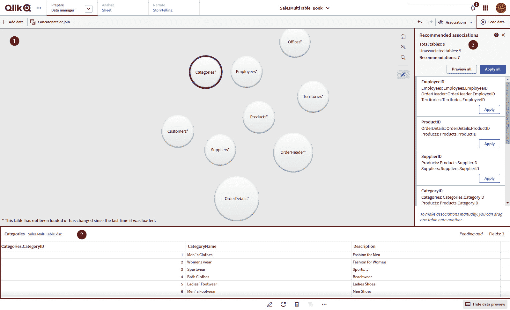

图 6.1：数据管理器视图

在此图中，我们将数据管理器分为三个不同的部分，我们将在下面介绍：

1.  **数据建模**：在这个空间中，您可以创建实际的数据模型。一个气泡代表数据实体，例如 Excel 表或数据库表。当在气泡上单击鼠标左键时，其他气泡的颜色将改变。这种颜色代表这两个实体之间如何相互关联。

1.  **数据预览**：如果您激活了一个数据实体或气泡，数据预览将显示有关实体的所有列和样本数据的快照。在数据建模视图中，活动实体以较深的边框突出显示。您可以从此视图进入数据编辑视图、刷新和删除数据实体。

1.  **关联**：数据管理器发现的实体之间的所有关联都可以在屏幕右侧看到。您可以使用此视图预览关联并批准这些关联。

接下来，我们将查看如何使用我们的样本数据集创建数据模型。我们将首先将一个名为**类别**的数据实体拖放到名为**产品**的数据实体上方。当我们开始拖动**类别**实体时，我们将看到一个类似于以下视图：

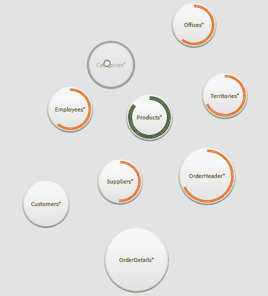

图 6.2：数据管理器 – 将表链接在一起

在这张图片中，我们可以看到**产品**实体在外边缘有一个绿色弧线，而其他几个实体有橙色弧线。弧线和颜色代表两个实体之间的匹配。由于**产品**实体是最匹配的，我们可以在**产品**上方放下我们的**类别**实体。我们现在已经将这两个数据实体链接在一起。实际的链接表在数据建模视图的底部可见。在以下图中已突出显示：

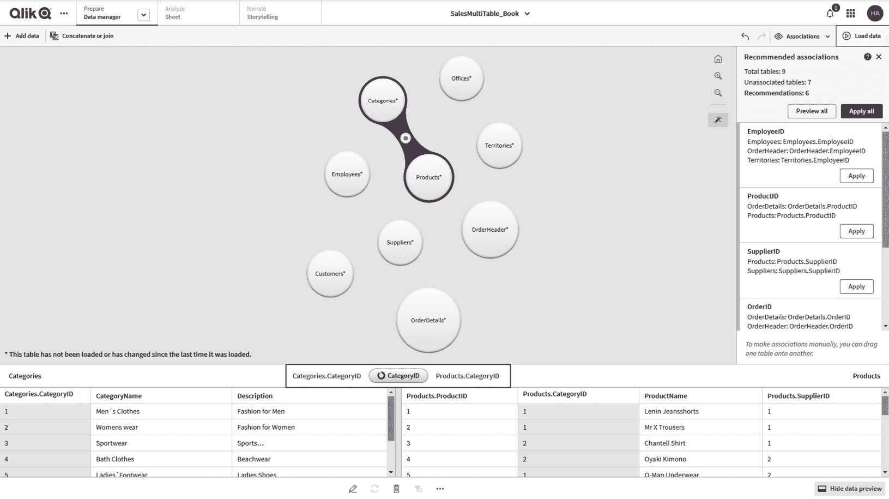

图 6.3：数据管理器 – 关联完成

如果你想编辑链接字段，可以通过按下高亮区域中间的按钮来完成。现在你可以继续构建数据模型的其余部分。这可以通过逐个进行或通过选择**应用全部**按钮来完成，该按钮位于**关联**视图的顶部部分，如图所示：

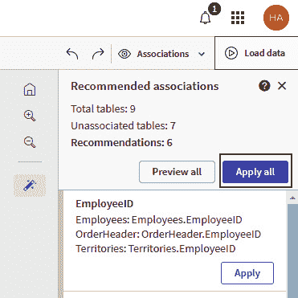

图 6.4：应用全部按钮

您应该看到准备好的数据模型。它应该看起来像以下图中的那样：

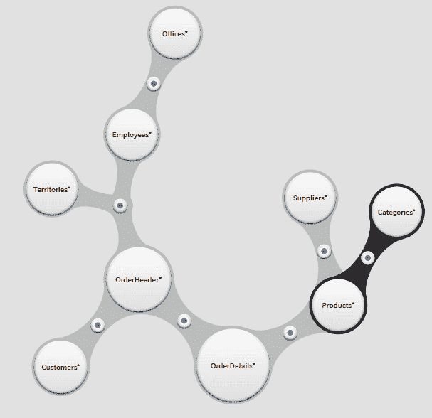

图 6.5：数据模型就绪

接下来，我们将更详细地查看数据管理器中的编辑功能。我们将首先选择**Employees**实体。我们应该在**数据****预览**部分看到**Employees**的内容。

要修改实体，我们将选择位于**数据预览**部分底部的笔形图标。**数据编辑**视图将打开，应该看起来像以下图所示：

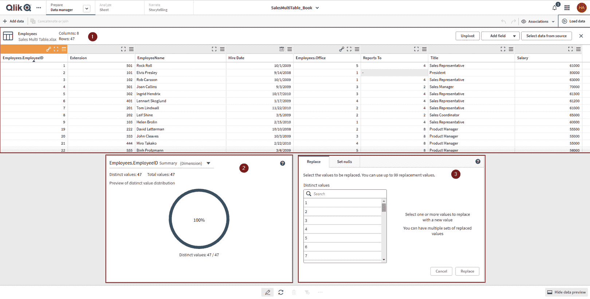

图 6.6：数据编辑视图

数据编辑视图分为以下部分：

1.  `datetime`字段，并将坐标分配给地理数据。

1.  **数据摘要**：数据摘要将显示数据的统计信息和分布。本节适用于验证和异常值检测。本节还将告诉您在特定列中有多少总值和唯一值。

1.  **数据编辑**：数据编辑部分将允许您使用图形工具对数据字段执行多个操作。这些操作包括空值替换、用其他值替换某些值、创建桶和分割数据。例如，空值替换是机器学习的重要预处理步骤。

接下来，我们将以**Employees**实体为例，更详细地查看一些部分。让我们选择**Salary**列，并在**摘要**部分将其类型更改为**度量**。你应该会看到以下图所示的内容：

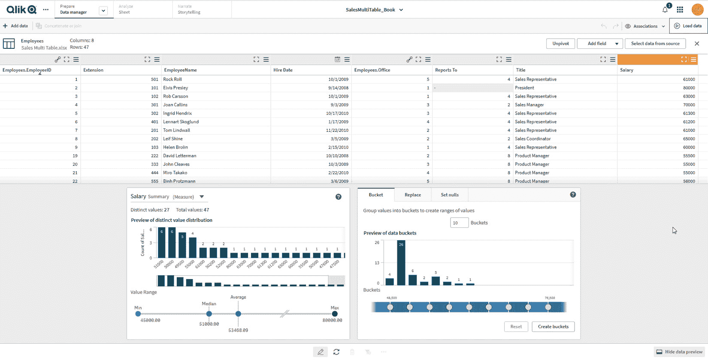

图 6.7：数据编辑视图中的活动薪资字段

我们可以看到，数据预览部分显示了最小值、中位数、平均值和最大值以及每个单独值的分布。数据编辑部分将为我们提供创建数据桶、替换某些值和将值设置为空字段等选项。

接下来，我们将激活**EmployeeName**字段。我们将看到以下视图，该视图将与我们之前看到的**Salary**字段的视图略有不同：

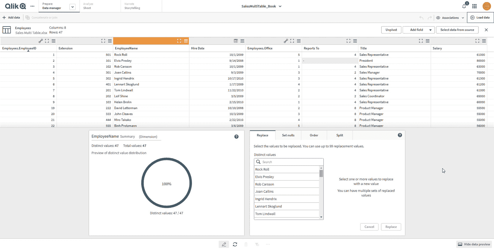

图 6.8：数据编辑视图中的活动 EmployeeName 字段

现在，我们可以在数据摘要部分看到不同的视图，该视图显示了唯一值和总值。我们也会在我们的数据编辑部分看到新的选项。例如，可以将字段分割为姓氏和名字，并且还可以设置顺序。由于**EmployeeName**是一个文本字段，因此我们不会看到与此字段相关的桶选项。

在右上角，我们可以看到**添加字段**按钮，在其下方，我们可以添加一个计算字段。如果我们选择该选项，将出现一个引导我们创建字段的向导。让我们为我们的**Employee**实体创建一个计算字段。如图所示，应该可以看到以下图：

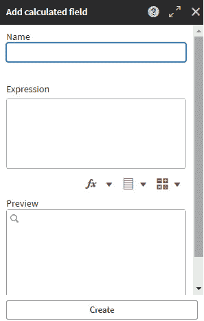

图 6.9：添加计算字段

在这种情况下，我们希望计算员工的月工资，保留两位小数。我们将字段命名为`MontlySalary`，并在**表达式**字段中给出以下表达式：

```py
Round((Salary/12),0.01)
```

**预览**部分将在我们输入计算时显示样本值。您可以使用**表达式**部分下的按钮访问字段、函数和运算符。准备好后，按**创建**按钮将计算字段添加到我们的数据实体中。

当您查看每个字段的标题部分时，您可以看到以下图中突出显示的图标：

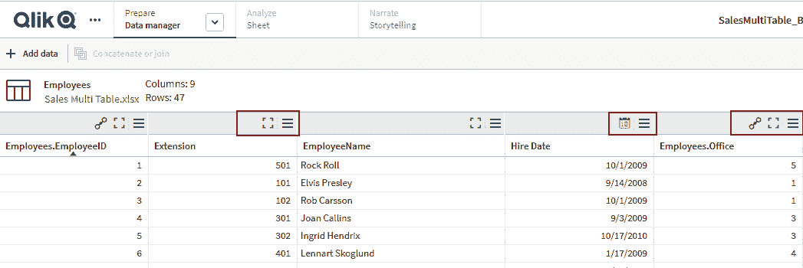

图 6.10：数据编辑视图中的标题

左侧的图标将提供更改每个字段数据类型的选项。数据管理器应自动识别大多数数据字段。例如，在前面的图像中，`Date`类型有一个小日历图标，而其他字段是通用类型。可用的字段类型有**通用**、**日期**、**时间戳**和**地理数据**。

具有关联的字段带有链形图标，如前图所示，位于`Employees.EmployeeID`字段和`Employees.Office`字段上方。您可以通过选择链形图标来编辑或断开关联。

最右侧的图标将提供修改字段的选项。下面，您可以找到重命名字段、将字段与其他表关联、编辑排序、隐藏字段以供分析以及查看详细信息的选项。

我们现在已经简要地浏览了数据管理器中的大多数功能。下一步是将数据加载到 Qlik 的引擎中。为此，我们可以选择位于右上角的**加载数据**按钮。数据加载将开始，之后我们可以继续到可视化部分。

在下一节中，我们将简要介绍 Qlik 脚本。我们将发现一些我们可以在我们的机器学习和数据可视化解决方案中利用的重要函数。

注意

数据管理器在后台生成 Qlik 脚本。一种开始研究脚本的好方法是使用数据管理器创建数据模型，然后切换到数据加载编辑器以查看生成的脚本。

注意

可以使用数据模型查看器来查看数据模型。数据模型查看器将表示表之间的关系，并给出每个表包含的数据样本。我们在这本书中不会深入介绍其用法。

# Qlik 脚本简介

Qlik 脚本是一种脚本语言，用于在 Qlik Sense 和 QlikView 中从各种来源加载数据和转换数据到 Qlik 的关联数据模型。它是一种强大且灵活的脚本语言，允许用户从数据库、电子表格和平面文件等各种来源提取、转换和加载数据，然后为分析准备这些数据。

Qlik 脚本在语法和结构上类似于 SQL，但它包括额外的功能和函数，使其更强大和灵活。使用 Qlik 脚本，用户可以执行复杂的数据转换、创建计算字段、生成变量并对数据进行筛选。脚本可以用来定义数据模型、指定数据源并从它们中加载数据，以及定义数据转换。我们在上一节中使用的数据管理器在后台生成 Qlik 脚本，并且可以使用脚本执行使用数据管理器所做的所有操作。

在使用 Qlik 脚本时，创建应用程序数据模型通常涉及以下过程：

1.  **连接到数据源**：首先，我们需要建立一个与数据源的连接。这可能是一个数据库、Excel 文件、CSV 文件或任何其他受支持的数据格式。本书中不会详细介绍创建数据连接。

1.  `LOAD` 关键字。

1.  `LOAD` 语句用于从数据源中提取数据到 Qlik。指定要加载的字段和源表或文件。在本例中，我们将从 `Sales Multi Table.xlsx` 加载 `Employees` 表和 `Office` 表。这些表将通过 `[Office]` 字段进行链接，因为在 Qlik 脚本中，具有相似名称的字段将形成一个链接。您可以使用 `as` 关键字修改名称。

    ```py
    [Employees]:
    LOAD
         [EmployeeID],
          [Extension],
          [EmployeeName],
          [Hire Date],
          [Office],
          [Reports To],
          [Title],
          [Year Salary] AS [Salary]
     FROM [lib://DataFiles/Sales Multi Table.xlsx]
    (ooxml, embedded labels, table is Employees);
    [Offices]:
    LOAD
          [Office],
          [SalesOffice],
         APPLYMAP( '__cityKey2GeoPoint', APPLYMAP( '__cityName2Key', LOWER([SalesOffice])), '-') AS [Offices.SalesOffice_GeoInfo]
     FROM [lib://DataFiles/Sales Multi Table.xlsx]
    (ooxml, embedded labels, table is Offices);
    ```

1.  **转换和清洗数据**：对加载的数据执行任何必要的转换或清洗操作。这可能包括重命名字段、更改数据类型、过滤行或连接表。Qlik 提供了各种函数和运算符来操作数据。我们将在下一节中更详细地探讨一些函数。

1.  **创建表关联**：Qlik 的关联数据模型允许您根据公共字段在表之间建立关系。您还可以在表之间创建连接，并在需要时连接数据。

1.  **保存和重新加载脚本**：完成脚本后，保存它并点击重新加载按钮。这将加载数据到 Qlik 应用程序并创建数据模型。

## Qlik 脚本中的重要函数

在本节中，我们将更详细地探讨 Qlik 脚本中的一些函数，这些函数在创建机器学习准备好的数据模型时非常有用：

+   `Date()`、`Year()`、`Month()`、`Day()` 和 `Quarter()`，用于从字段中提取和操作日期相关信息。

+   `Len()`、`Upper()`、`Lower()`、`Concatenate()`、`Left()`、`Right()`、`Mid()` 和 `SubField()`，用于字符串操作和格式化。

    这是一个使用 `Upper()` 函数的示例：

    ```py
    LOAD
        CustomerID,
        Upper(CustomerName) AS CustomerName
    FROM
        [Customers.csv];
    ```

+   用于执行计算和聚合的 `Sum()`、`Avg()`、`Min()`、`Max()`、`Count()`、`Round()`、`Ceil()`、`Floor()` 和 `Abs()` 函数。这些函数在准备数据用于机器学习时非常有用。

    这是一个使用 `Sum()` 函数的示例：

    ```py
    LOAD
        CustomerID,
        Sum(SalesAmount) AS TotalSales
    FROM
        [Sales.csv]
    GROUP BY
        CustomerID;
    ```

+   `AGGR` 函数用于根据用户定义的表达式动态聚合数据。它允许你在不同的粒度级别执行计算。

    这是一个示例：

    ```py
    Sales:
    LOAD
        Product,
        Category,
        Price,
        Quantity
    FROM
        [Sales.csv];
    CategorySales:
    LOAD
        Category,
        AGGR(Sum(Price * Quantity), Category) AS TotalSales
    RESIDENT
        Sales
    GROUP BY
        Category;
    ```

    在这个示例中，我们有一个销售交易数据集（`Sales`）。我们想要通过计算每个交易的金额和数量的乘积来计算每个类别的总销售额。

+   **IF-THEN-ELSE**：IF-THEN-ELSE 语句用于执行条件逻辑。它允许您创建条件表达式并根据条件执行不同的操作。

    这是一个示例：

    ```py
    Sales:
    LOAD
        Product,
        Category,
        Price,
        If(Category = 'Electronics', Price * 0.9, Price) AS DiscountedPrice
    FROM
        [Sales.csv];
    ```

    在这个示例中，如果`Category`字段等于`Electronics`，则`DiscountedPrice`字段将计算为原始价格的 90%（`Price * 0.9`）。否则，如果`Category`不是`Electronics`，则`DiscountedPrice`字段将与原始价格相同（`Price`）。

+   `FOR...NEXT`循环允许您执行指定次数的脚本代码块。通常在您事先知道迭代次数时使用。

+   `DO...WHILE`循环在条件为真时重复执行代码块。当您想要迭代直到满足特定条件时，它很有用。

+   `FOR EACH...NEXT`循环允许您遍历字段的唯一值或表达式。它为每个唯一值执行代码块。

+   `WHILE...WEND`循环在条件为真时重复执行代码块。当您想要迭代直到特定条件变为假时，它很有用。

+   其他可能在为机器学习建模数据时很有用的函数列在这里：

    +   `APPLYMAP`函数允许您通过引用外部映射表来执行映射操作。这在将分类值映射到数值代码或反之亦然时可能很有用，这在机器学习任务中通常是必需的。

    +   `RESIDENT`函数允许您对先前加载的表执行操作。这对于创建派生表或对现有数据进行转换很有用，这有助于为机器学习算法准备数据。

    +   `PIVOT`和`UNPIVOT`函数使您能够重塑数据，在宽格式和长格式之间进行转换。这种功能在机器学习工作流程中的特征工程和数据预处理中可能非常有价值。

    +   `CONCATENATE`函数允许您将具有相同结构的多个表合并为一个表。这在从不同来源汇总数据或合并数据集时可能很有用，这对于机器学习任务通常是必要的。

    +   `LOAD INLINE`语句允许您在脚本中定义内联数据。当您有小型数据集或需要为测试机器学习算法定义示例数据时，这很有用。

    +   `PRECEDING LOAD`功能使您能够在负载脚本中计算和存储派生字段。它允许您即时执行计算和转换，这在特征工程或创建机器学习模型的目标变量时可能是有益的。

    +   `APPLY`和`GROUP BY APPLY`函数允许您对数据组执行高级计算和转换。它们提供了一种在组内应用复杂表达式和聚合的方法，这对于创建特征或为机器学习算法生成汇总统计信息可能很有益。

    +   `QUALIFY`和`UNQUALIFY`函数用于指定字段限定符。当处理包含在 Qlik 脚本中具有特殊意义的字符的字段时，它们尤其有用，例如空格或特殊字符，这在机器学习任务的特征名称或标签中很常见。

注意

一个包含示例的完整 Qlik 脚本参考指南可在 Qlik 帮助网站上找到。

现在我们已经简要概述了 Qlik 脚本中一些最重要的功能。Qlik 脚本是一个强大的数据处理和创建数据模型工具。接下来，我们将更详细地探讨使用 Qlik Cloud 中的多个工具进行数据验证。

# 验证数据

在进入数据编辑和分析阶段之前，我们有多种选项可以使用 Qlik Cloud 验证和调查我们的数据。让我们首先使用数据目录。我们将在本章下一节更详细地探讨数据目录，但在这个部分，我们将介绍一些数据验证的功能。首先，我们将打开`Sales Multi table.xlsx`并移动到数据目录中的**字段**部分。让我们也选择**员工**标签。我们应该看到以下视图：

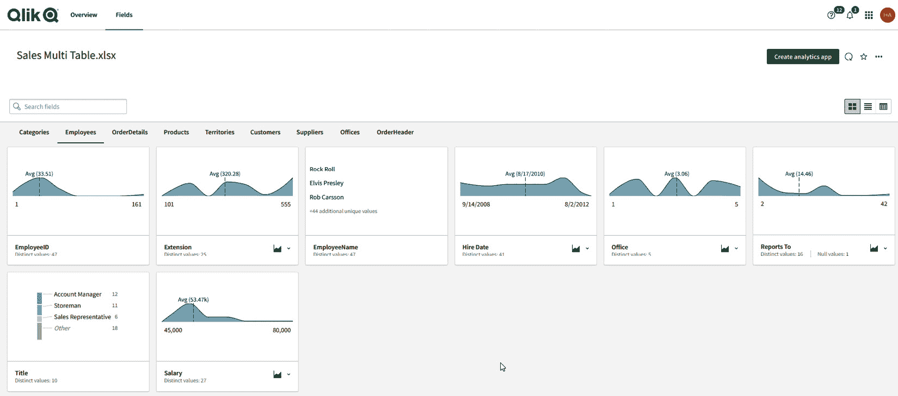

图 6.11：数据目录

在这里，我们可以看到**员工**实体中所有字段的**数据分布**。默认情况下，我们在目录中打开了**瓷砖视图**。以下图表示我们的**Salary**字段的瓷砖。让我们接下来更仔细地看看它：

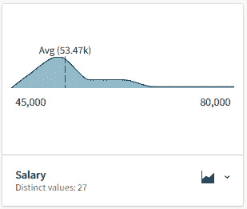

图 6.12：数据目录中的 Salary 字段

**Salary**瓷砖将显示**Salary**字段的最低值、平均值和最大值。它还将告诉我们不同值的数量。使用这些信息，我们已能识别可能的异常值并获得数据分布的初步了解。

接下来，我们将通过右上角的小图标（以下图中已突出显示）从**瓷砖视图**切换到**列表视图**。以下视图应该可见：

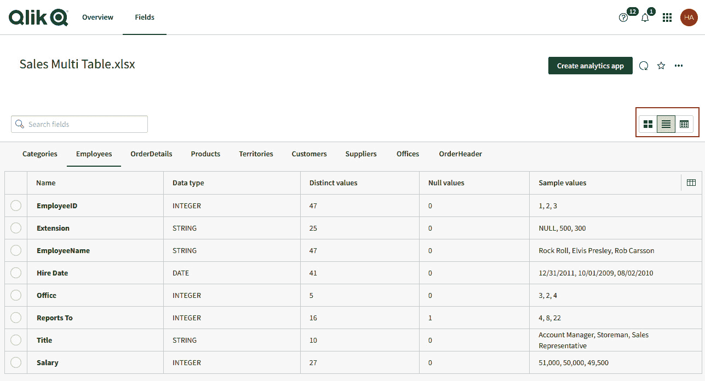

图 6.13：数据目录 – 列表视图

此视图将告诉我们每个字段的**数据类型**和不同值以及空值的数量，并为每个字段提供值样本。数据类型和空值数量在开始创建机器学习解决方案时特别有价值。

接下来，我们将继续使用数据管理器进行数据验证。在前一节中，我们已经介绍了一些数据管理器的功能。我们正在使用导入到数据管理器中的`Sales Multi Table.xlsx`文件，并且已经打开了**员工**实体进行编辑。如有需要，请参考本章早期关于数据管理器的部分。

接下来，我们将激活**员工姓名**字段。数据摘要部分应该如下所示：

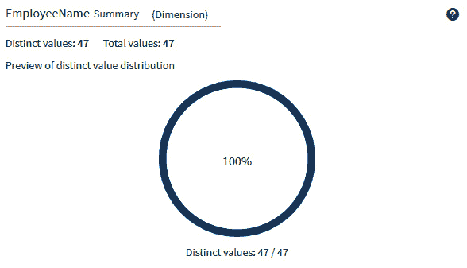

图 6.14：员工姓名字段摘要

在这里，我们可以看到这个字段被处理为一个维度，总共有 47 个值。所有值都是唯一的，我们可以看到分布情况。接下来，我们可以激活**雇佣日期**字段。以下摘要可见：

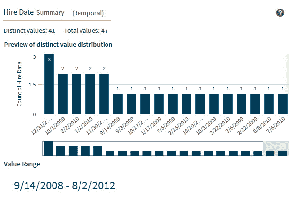

图 6.15：雇佣日期字段摘要

在这里，我们可以看到数据的分布以及总数和唯一值的数量。我们还可以看到数据的值范围。当调查数据并寻找潜在的异常值时，这些信息非常有用。接下来，我们可以选择**薪资**字段，应该会看到以下内容（可能需要将类型从维度更改为度量）：

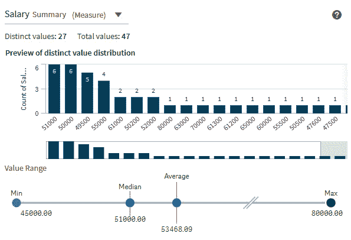

图 6.16：薪资字段摘要

**薪资**字段摘要将告诉我们分布情况、总数和唯一值的数量，以及最小值、中位数、平均值和最大值。这些信息将有助于我们进一步进行数据调查和验证。

验证数据的第三种方法是利用 Qlik 的分析对象，并在数据模型之上创建一个视图。我们将在本书的后续章节中介绍这一点。在本章的后面部分，我们将探讨洞察顾问及其如何用于数据分析。洞察顾问是数据验证的强大工具。

现在我们对数据验证有了概述，我们将探讨数据血缘和数据目录的可能性。这些工具将帮助我们更好地理解数据，并帮助我们可视化数据管道。

# 数据血缘和数据目录

在 Qlik Sense 中，数据血缘和数据目录是两个重要的功能，帮助用户更好地理解、管理和治理他们的数据。

**数据血缘**指的是数据从源头到目的地的路径，包括沿途发生的所有转换。在 Qlik Sense 中，数据血缘提供了数据在系统中如何转换的视觉表示。这有助于用户了解数据的来源和质量，以及识别数据流中的任何问题或瓶颈。有了数据血缘，用户可以追踪数据回其原始来源，识别任何数据依赖关系，并确保数据准确可靠。

**数据目录**指的是一个集中式存储库，其中包含描述组织数据资产元数据的元数据。在 Qlik Sense 中，数据目录提供了一种发现、理解和协作数据资产的方法。使用数据目录，用户可以搜索数据资产，查看元数据和血统信息，并与他人协作处理数据。数据目录还有助于确保数据得到适当的治理，通过提供数据定义、数据质量规则和其他重要元数据的单一来源。

数据血统和数据目录共同提供了一个组织数据资产的综合视图，从其起源到其使用，使用户能够更好地理解和治理他们的数据，并基于可靠的信息做出明智的决策。

让我们接下来更详细地查看这两个功能。

## 数据血统

数据血统功能可以在 Qlik Cloud 租户的应用选项下找到（应用图块右侧的三点）。以下图中显示了突出显示的**血统**选项：

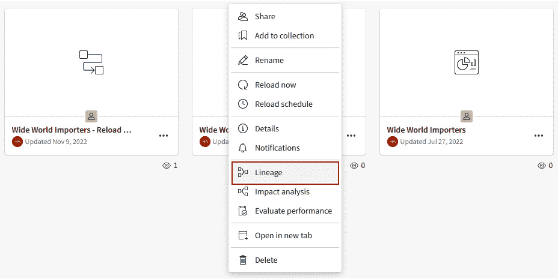

图 6.17：Qlik 的应用选项下的血统功能

选择**血统**后，将打开一个新视图，可视化所选应用程序的整个血统路径。以下图中可见该视图的一个示例：

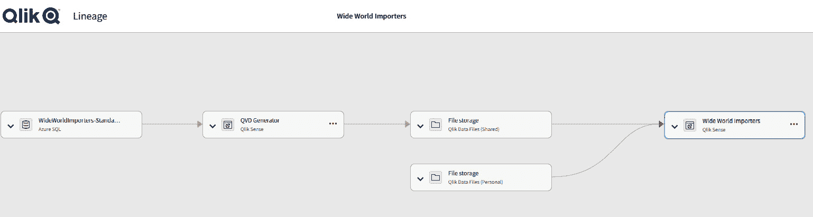

图 6.18：数据血统视图

血统视图将向我们展示数据是如何从源系统流入我们的端用户应用程序的。在这种情况下，我们的源系统是 Azure SQL 服务器，我们有一个名为**QVD Generator**的 Qlik 应用程序，它将生成 QVD 文件并将它们存储在 Qlik Cloud 中。然后，这些 QVD 文件和来自我们云环境中其他文件夹的文件被用作端用户应用程序（称为**Wide World Importers**）的基础数据。也有可能查看表级别的血统。以下图表示了我们端用户应用程序中找到的**国家**表的血统视图：

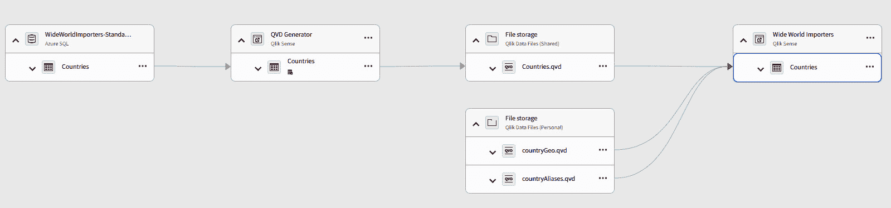

图 6.19：端用户应用程序中单个表的数据血统

从这个视图中，我们可以轻松验证哪些数据被组合到**国家**表中，以及这些数据是从哪里来的。

数据血统是调查数据来源和转换的强大工具，当处理数据时非常有用。它具有许多功能，我们在这里只介绍了最基本的使用案例。如果您想了解更多信息，Qlik Cloud 的帮助页面中有大量相关材料。

接下来，我们将更详细地探讨数据目录以及如何调查单个数据对象。

## 数据目录

我们在本章中已经发现了数据目录的一些数据验证功能。接下来，让我们更详细地看看数据目录的其他方面。我们将首先在 Qlik Cloud 中打开 `Sales Multi Table.xlsx` 文件。一旦您将文件上传到云端，您应该会看到以下图块：

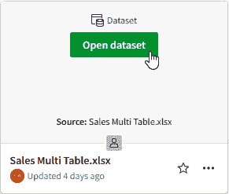

图 6.20：Sales Multi Table.xlsx 数据集图块

选择**打开数据集**，您将进入数据目录。您的视图应该如下所示：

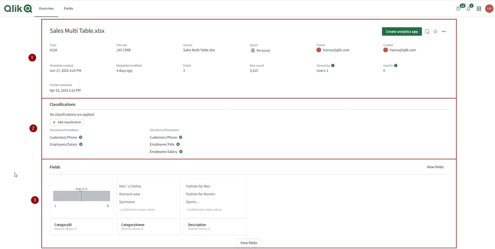

图 6.21：数据目录的首页

数据目录包含以下部分：

1.  **元数据**：这是关于文件的一般元数据。本节将说明数据上传的时间、使用位置以及所有者是谁。它还将提供关于数据集的流行度和数据结构的信息。

1.  **分类**：如果任何字段被分类为个人信息、敏感或其他标签，这些信息可以在此处看到。如果数据被分类，我们在使用时应极为小心。我们还可以使用本节在数据集级别设置分类。

1.  **字段**：本节将为我们提供字段和每个字段中的数据的概述。这在本章的数据验证部分已有更详细的介绍。

接下来，我们可以更仔细地查看分类。让我们转到**字段**选项卡并选择**员工**实体。在其下，我们可以选择**薪资**字段。我们应该看到以下内容：

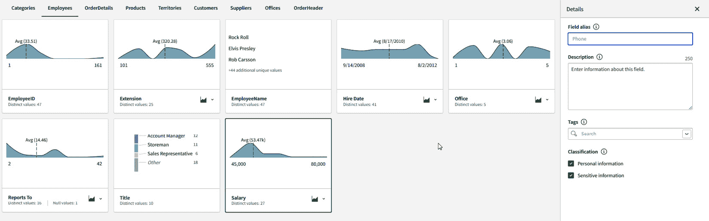

图 6.22：目录中的数据分类

在数据分类视图中，我们可以为每个字段提供别名并给出描述。我们还可以标记单个字段并说明它们是否包含个人信息或敏感信息。使用标签和描述来增强信息非常重要，因为您的组织中可能有许多人并不熟悉数据。提供这些信息还可以帮助我们创建机器学习解决方案，因为我们可以在提供额外信息的情况下更好地理解数据。

数据目录将帮助我们熟悉数据并构建良好的数据集集合。接下来，我们将更详细地探讨 Insight Advisor 以及它如何帮助我们熟悉数据并轻松创建可视化。

# 探索数据和发现洞察

Qlik Insight Advisor 是 Qlik Sense 中的一项功能，它使用自然语言处理和人工智能来帮助用户探索数据并发现洞察。通过使用 Qlik Insight Advisor，您可以利用自然语言处理和人工智能的力量来探索您的数据，提出问题，并发现有意义的洞察。

在*第一章*中，我们已经学习了洞察顾问的一些基础知识。在没有增强智能功能的情况下，我们也可以使用 Qlik 对象和可视化来探索数据和发现洞察。我们将在本书的后续部分更详细地探讨如何以这种方式创建可视化。在本节中，我们将了解洞察顾问将如何帮助我们从数据中获得有意义的洞察。

我们将首先使用`Sales Multi Table.xlsx`文件作为我们的源数据。我们已经在本章早期创建了一个数据模型，并将数据加载到一个关联引擎中。数据加载完成后，我们可以选择**转到工作表**并看到以下三个选项：

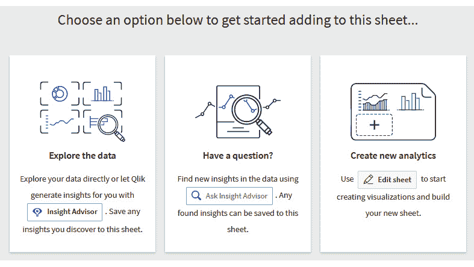

图 6.23：在新应用程序中查找数据选项

在这种情况下，我们将选择**探索数据**。这将启动洞察顾问，并应出现以下视图：

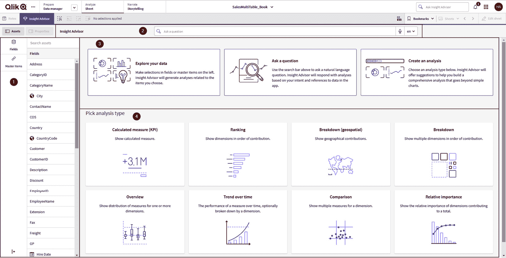

图 6.24：洞察顾问

在这个图中，我们可以看到四个不同的部分：

1.  **数据探索**：此部分包含我们源数据中的所有字段以及我们应用程序中（如果我们创建了这些）的所有主项目。

1.  **自然语言输入**：此输入字段允许我们从洞察顾问提出自然语言问题

1.  **选项**：本节将指导我们使用洞察顾问支持的不同分析类型

1.  **分析类型**：本节将为我们提供到不同分析类型的快捷方式

让我们从选择第一部分列表中的一个字段开始我们的数据探索。例如，我们可以选择名为**国家**的字段。以下视图将出现，为我们提供关于**国家**字段中数据的详细信息：

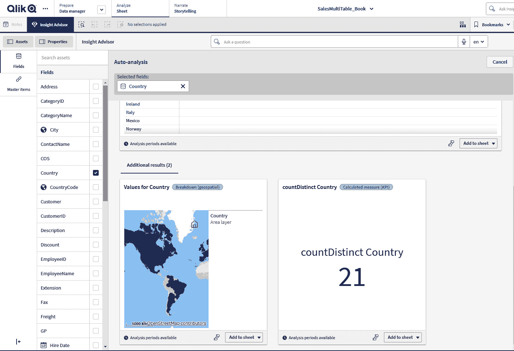

图 6.25：洞察顾问 – 字段信息

此视图将显示不同国家的数量作为关键绩效指标（KPI），一个按名称列出所有国家的表格，以及一个显示实际区域的地图。我们可以通过选择**取消**返回到上一个视图。

接下来，我们将研究引导分析类型。让我们首先从分析类型部分选择**排名**。我们应该看到以下内容：

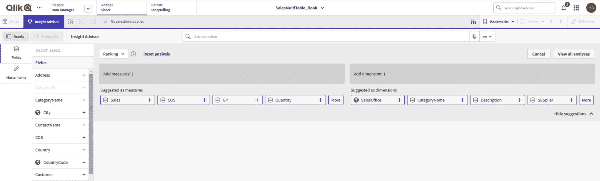

图 6.26：洞察顾问 – 排名

在这个视图中，我们可以选择用于排名图的度量值和维度。让我们选择**销售额**作为度量值，**销售办公室**作为维度。这将按销售额排名我们的销售办公室。我们可以看到，洞察顾问正在使用求和作为**销售额**字段的聚合器。在这种情况下这是正确的，但如果需要，可以修改。现在我们应该看到以下视图：

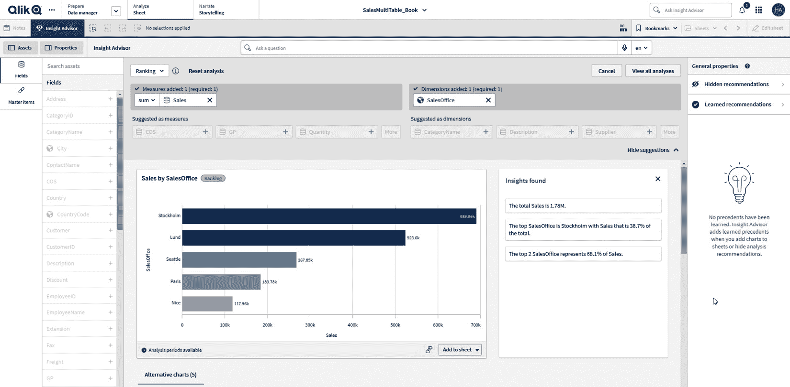

图 6.27：洞察顾问 – 排名结果

我们可以看到，洞察顾问为我们生成了一个表示每个销售办公室总销售额的柱状图。它还为我们提供了有关总销售额和表现最佳的销售办公室的一些额外信息。还有相同数据的其他表示形式。

我们可以将柱状图添加到我们的表格中进行进一步分析，但它已经告诉我们一些关于数据的重要事实。接下来，我们将调查一种更复杂的分析。通过选择**取消**并选择**创建分析**，我们可以返回到之前的视图。以下屏幕应显示所有可用的分析类型：

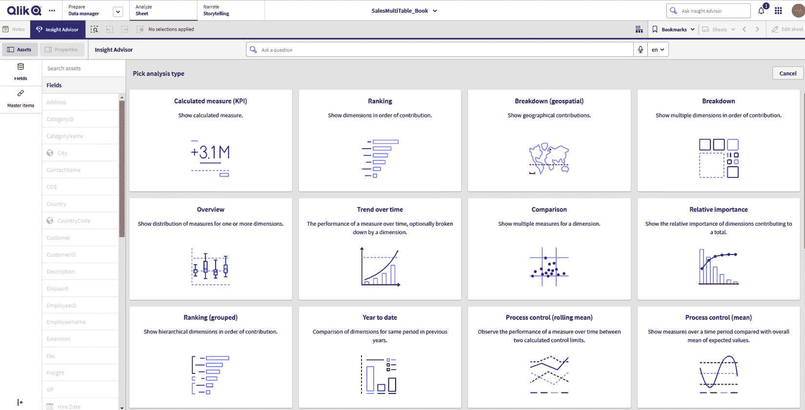

图 6.28：洞察顾问 – 分析类型

从这个分析类型列表中，我们将接下来调查聚类。从列表中选择**聚类（k-means）**。接下来，选择**销售额**的总和和**折扣**的平均值作为度量，以及**产品名称**作为维度。以下屏幕将出现：

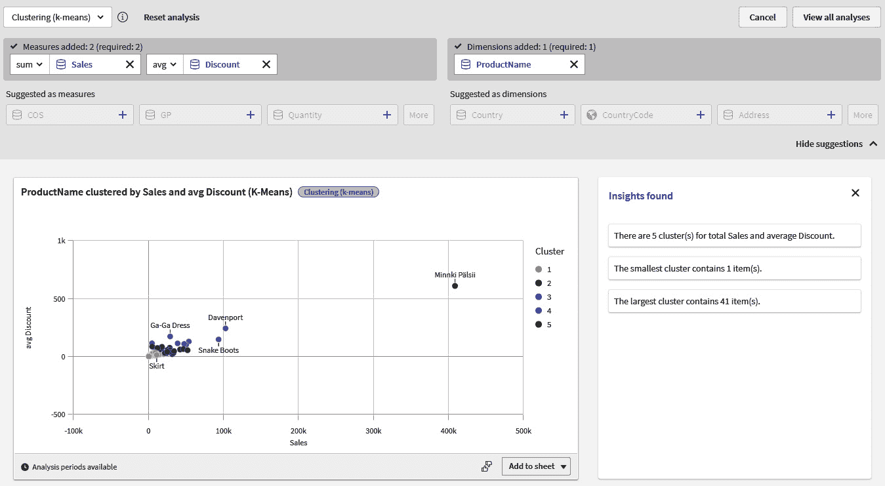

图 6.29：洞察顾问 – 聚类

如我们所见，根据总销售额和平均折扣，识别出了五组不同的产品。这将帮助我们更深入地调查我们的产品销售。我们还将从洞察顾问那里获得有关聚类的额外信息。支持许多不同类型的分析，许多在探索机器学习解决方案的数据时都很有益。强烈建议您查看所有分析类型的功能以及您可以获得的结果。

接下来，我们将探讨自然语言输入如何与洞察顾问一起工作。我们可以通过选择**取消**首先返回到基本视图。现在我们可以在屏幕顶部的字段中开始键入输入。键入以下查询：

```py
Give me total sales by CategoryName in each country
```

当我们键入查询时，我们可以看到洞察顾问将建议不同的字段。查询将返回以下视图：

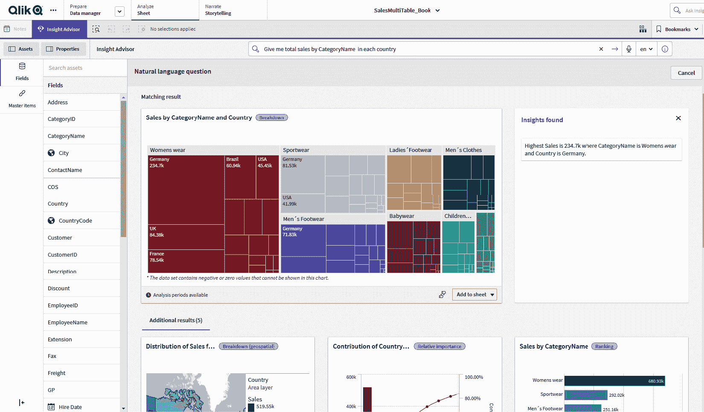

图 6.30：洞察顾问 – 自然语言查询结果

如我们所见，洞察顾问产生了各种图表。我们得到了一个表示按国家/地区和地图划分的每个产品类别销售的树状图，一个帕累托图和一个柱状图作为替代结果。我们还得到了一些书面形式的见解。

洞察顾问是一个强大的工具，可以探索数据和创建可视化。在本节中，我们简要介绍了它的基础知识。更多信息可以在 Qlik 的帮助页面中找到。学习使用它们的好方法是通过一些简单的数据集进行尝试。

# 摘要

在本章中，我们首先通过 Qlik 的数据管理器获得了一些实际操作经验，并学习了如何使用它创建数据模型。我们还学习了如何创建计算字段和调查数据。创建一个好的数据模型和修改数据以适合机器学习是成功的关键。

我们还发现了 Qlik 脚本的某些基础知识以及如何使用它来执行数据转换。我们发现了 Qlik 脚本的一些重要函数和特性。脚本是一种创建数据模型和操作数据的替代方法。它是一个强大的工具，也可以与数据管理器中创建的模型结合使用。

在本章的后续部分，我们学习了一些验证和调查数据的方法。我们熟悉了数据目录和数据血缘视图，并学会了如何在数据验证中利用它们。数据验证是任何机器学习或数据分析项目中的关键步骤，在创建解决方案之前理解数据非常重要。

本章的最后部分教我们如何使用洞察顾问进行数据发现。洞察顾问是一个强大的工具，用于使用增强智能进行分析，掌握它将帮助我们更快地熟悉数据。

在下一章中，我们将继续我们的动手实践之旅，学习如何在本地和云环境中部署和监控机器学习模型。这将为本书的最后几章打下良好的基础，在这些章节中，我们将实现一些更高级的模型。
