# 8

# 利用 Qlik AutoML

Qlik AutoML 利用人工智能和自动化的力量，让所有技能水平的用户都能构建和部署机器学习模型，而无需广泛的编码或数据科学背景。通过自动化重复性任务并提供智能推荐，Qlik AutoML 简化了整个机器学习工作流程，使其对更广泛的受众变得可访问。

在本章中，我们将深入探讨 Qlik AutoML 的世界，了解其功能、优势和实际应用。我们将全面概述支持 Qlik AutoML 自动化机器学习过程的底层概念和技术。此外，我们将指导您在 Qlik 生态系统中逐步实现 AutoML 模型，突出其与 Qlik Sense 分析平台的无缝集成。

在本章中，我们将涵盖以下主题：

+   Qlik AutoML 的功能

+   在云环境中使用 Qlik AutoML

+   使用 Qlik AutoML 创建和监控机器学习模型

+   将 Qlik AutoML 连接到本地环境

+   使用 Qlik AutoML 的最佳实践

# Qlik AutoML 的功能

Qlik AutoML 是 Qlik Sense 分析平台中的一个工具，它自动化了构建和部署机器学习模型的过程。它简化了机器学习工作流程，并允许用户创建预测模型，而无需深入了解数据科学或编程。Qlik AutoML 的一些关键特性包括以下内容：

+   **自动模型选择**：Qlik AutoML 根据数据和预测任务自动选择最佳的机器学习算法，从而节省用户手动探索和比较不同算法的时间。

+   **超参数调整**：Qlik AutoML 优化所选机器学习模型的超参数，以提高其性能和准确性。超参数调整有助于微调模型的行为，使其在预测方面更加有效。

+   **交叉验证**：Qlik AutoML 使用交叉验证技术来评估模型的性能。它将数据分成多个子集，并在不同的组合上训练和测试模型，从而提供更稳健的性能指标。

+   **模型评估**：Qlik AutoML 提供各种性能指标来评估模型，例如准确率、精确率、召回率和 F1 分数。这些指标帮助用户评估模型的预测能力，并选择最适合其用例的最佳性能模型。

+   **模型部署**：一旦模型构建并选定，Qlik AutoML 就可以在 Qlik Sense 环境中轻松部署。用户可以将预测模型无缝集成到现有的 Qlik 应用和仪表板中，以实现实时洞察和决策。

注意

一些功能（包括超参数优化和预测 API）将需要 Qlik AutoML 的付费级别。此外，部署数量、并发任务和数据集限制由许可证级别定义。具体的许可证级别限制应由 Qlik 销售部门核实。

Qlik AutoML 旨在使机器学习民主化，并赋予业务用户利用高级分析能力的能力，而无需广泛的技术专业知识。在*第四章*中，我们探讨了创建良好的机器学习解决方案的一般概念。

如您从那章中记得的，Qlik AutoML 可以解决三种类型的机器学习问题：

+   **二元分类**：任何可以用是或否回答的问题

+   **多类分类**：可能有多个结果选择的问题

+   **回归/数值型**：预测未来某个点的数值

Qlik AutoML 作为 Qlik Cloud 服务的一部分提供。在下一节中，我们将熟悉从我们的训练数据中获得部署、生产就绪模型的实际过程。

# 在云环境中使用 Qlik AutoML

使用 Qlik AutoML 部署机器学习模型时，有几个步骤。这些步骤在下图中展示：

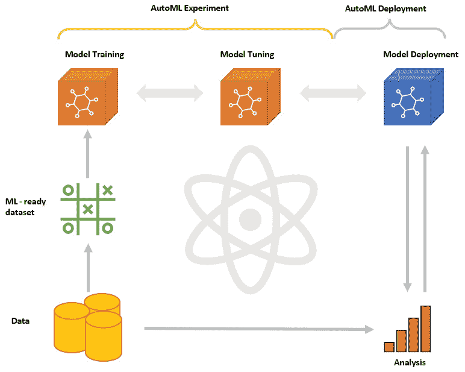

图 8.1：AutoML 工作流程

如您从我们前面的章节中记得的，每个机器学习项目的第一步是定义业务问题和问题，然后是数据清洗、准备和建模所需的步骤。通常，数据清洗和转换部分可以占用项目 80-90%的时间。

一旦我们有了机器学习准备好的数据集，我们将继续创建机器学习实验。

在自动化机器学习中，对特定数据集和目标的机器学习算法进行训练的过程是自动化的。当您创建一个实验并加载您的数据集时，系统会自动检查并准备数据以供机器学习使用。它为您提供了关于每一列的统计信息和洞察，有助于选择目标变量。一旦开始训练，多个算法分析数据，寻找模式。

在训练过程完成后，您可以使用分数和排名来评估生成的机器学习模型的性能。通过调整参数并重复训练，您可以生成多个模型版本。在仔细评估选项后，您可以选择在您的数据集上表现最佳的模型。一个实验可以有多个版本，每个版本使用一个或多个算法，一个实验可以导致多个机器学习部署。

简单来说，在实验阶段，我们将微调模型并尝试达到最佳可能的准确度。一旦我们对模型满意，我们就可以将其部署到生产环境中，并开始在我们的分析中使用它。我们将在下一节的动手示例中逐一介绍这些步骤。

# 使用 Qlik AutoML 创建和监控机器学习模型

在本节中，我们将使用 Qlik AutoML 创建一个实际实现。我们将利用本书中已经使用过的著名 Iris 数据集。Iris 数据集的数据准备部分已经完成，因此我们可以直接进入模型训练和实验部分。

注意

您可以在本书的 GitHub 仓库中找到本例中使用的数据集。

注意

只有拥有专业权限的用户才能创建实验。这是许可证级别的一个限制。

假设我们已将`iris`数据集上传到我们的云租户。现在，我们将开始定义一个业务问题。这个问题定义了我们希望从机器学习模型中实现的目标。

如我们所知，Iris 数据集包含了三种不同品种的 Iris 花的四个特征的测量值。这些特征如下：

+   **花瓣宽度**: 花瓣的宽度

+   **花瓣宽度**: 花瓣的宽度

+   **花瓣长度**: 花瓣的长度，这些是花内部五彩斑斓的叶状结构

+   **花瓣宽度**: 花瓣的宽度

数据集包含 150 个实例或样本，其中每种 Iris 品种（`setosa`、`versicolor`和`virginica`）各有 50 个样本。为了定义一个机器学习问题来预测 Iris 数据集中的物种，我们将将其构建为一个多类分类问题。以下是我们将在调查之前形成的样本问题：

给定花瓣长度、花瓣宽度、花瓣长度和花瓣宽度的测量值，我们能否准确地将 Iris 花的品种分类为 setosa、versicolor 或 virginica？

在这种情况下，机器学习任务涉及训练一个模型来学习输入特征（花瓣长度、花瓣宽度、花瓣长度和花瓣宽度）与相应的输出类别（`setosa`、`versicolor`和`virginica`）之间的模式和关系。目标是开发一个预测模型，能够根据它们的测量值，准确地将新的 Iris 花实例分类为三种品种之一。AutoML 将根据选定的目标和变量为我们选择表现最佳的模型。

我们将通过创建一个新的机器学习实验来开始实际的模型创建。为此，选择**+ 添加新** → **新 ML 实验**，如图下所示：

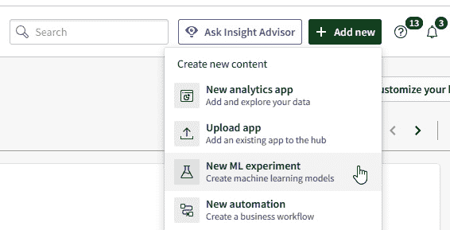

图 8.2：一个新的机器学习实验

将打开一个新窗口。为您的实验插入一个名称，并选择一个空间。在我的例子中，我将实验命名为`Iris exp`。选择**创建**以继续。

然后，您可以选择一个用于训练的数据集。选择我们之前上传到我们的租户的`iris.csv`。将打开一个预览窗口。在这个窗口中，我们将定义我们的目标字段。它还将给我们提供关于数据集的重要信息。您应该看到一个类似于以下预览窗口：

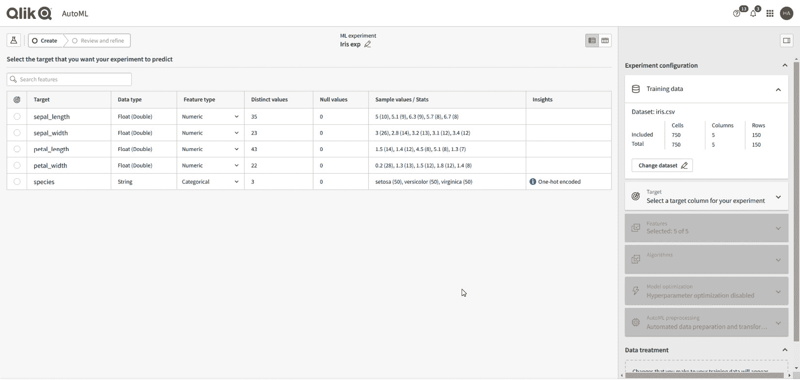

图 8.3：机器学习实验向导中的模式视图

您目前处于`species`字段的`String`和`Float (Double)`字段的`Float (Double)`。

所有列都已识别为`数值`或`分类`字段。如果需要，可以分别为每个字段进行更改。我们还可以从`洞察`列中看到，我们的“物种”特征已被自动进行独热编码。如果有任何与某些特征相关的警告，我们也可以看到。以下信息在`洞察`列中展示：

+   **常数**：该列的所有行都具有相同的值。该列不能用作目标或包含的特征。这是 Qlik AutoML 中预设的限制，以防止出现错误的结果。

+   **独热编码**：特征类型为分类，且该列有少于 14 个唯一值。

+   **影响编码**：特征类型为分类，且该列有 14 个或更多唯一值。

+   **高基数**：该列有太多唯一值，如果用作特征可能会对模型性能产生负面影响。该列不能用作目标。

+   `null`值。该列不能用作目标或包含的特征。

+   **代表性不足的类别**：该列有一个少于 10 行的类别。列不能用作目标，但可以作为特征包含在内。

在选择我们的目标字段之前，我们可以将我们的视图更改为**数据视图**。您可以从数据预览区域右上角进行此操作。您应该看到以下视图：

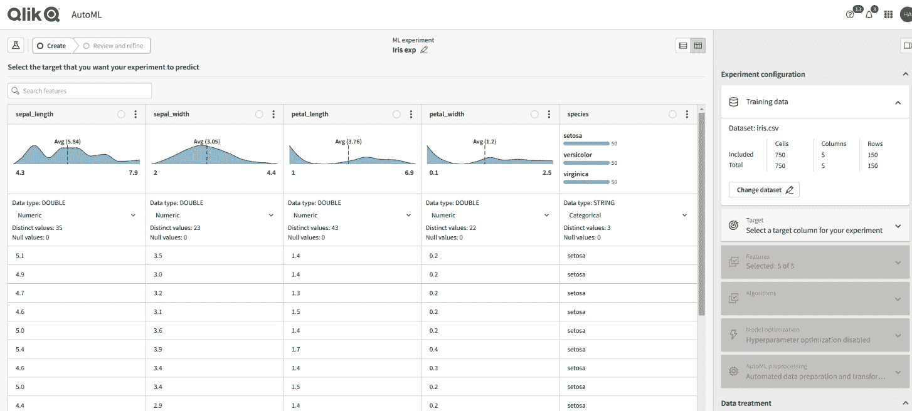

图 8.4：机器学习实验向导中的数据视图

在此视图中，我们可以更深入地研究数据内容。我们将看到表示每个数值字段中数据分布的迷你图表，以及分类字段中的分布。我们还将获得有关唯一和`null`值的信息。

现在让我们切换回模式视图，并将我们的`species`特征作为目标选择。为此，选择`species`，如以下截图所示：

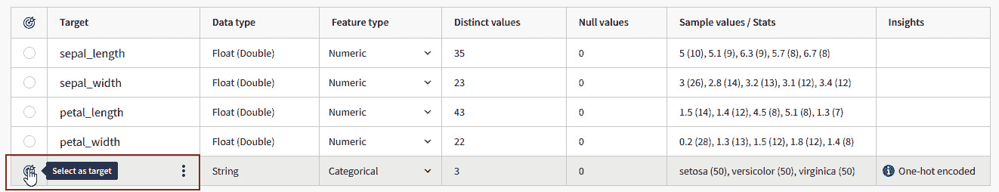

图 8.5：目标选择

所有其他特征都将自动包含在我们的实验中。在这种情况下，我们希望保留所有特征，但通常我们可能想要删除一些字段。在右侧，我们可以看到关于实验的摘要信息：

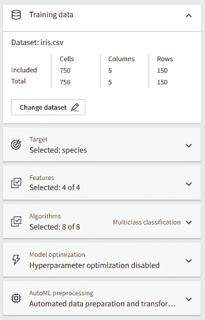

图 8.6：实验摘要

首先，我们得到训练数据的摘要。我们将看到数据集中的总单元格数、列数和行数，以及有多少被包含在实验中。在我们的案例中，所有数据都被包含在内，因为我们决定保留实验中的所有特征。

现在，我们可以看到一些关于我们的目标的信息。我们也可以在运行实验之前更改目标。在这种情况下，我们的目标是 `species`。下一节将给出所选特征的摘要。我们将选择数据集中的所有特征作为实验的一部分。

在算法部分，我们可以看到 AutoML 根据我们的目标字段将我们的模型识别为多类分类。如果我们想的话，我们可以决定排除实验中的一些算法。通常，建议保留所有包含的算法。

在模型优化部分，我们可以启用超参数优化并设置实验运行优化的最大时间。启用此选项时，超参数优化将创建一系列模型，通过系统地搜索算法超参数的最佳组合，以最大化模型性能。如果启用此选项，实验可能需要很长时间才能运行，但结果可能更准确。

最终，我们将得到 AutoML 将为我们处理的预处理步骤的提醒。具体如下：

1.  特征中至少有 50% 的值被填充的 `null` 值。根据每个特征的数据类型，AutoML 选择 `MEAN` 或 `OTHER` 填充。

1.  **编码分类特征**: AutoML 自动将你的分类特征转换为数值，以便算法能够有效地处理和从你的分类训练数据中学习。对于有 13 个或更少值的特征，AutoML 使用独热编码。对于有 14 个或更多值的特征，AutoML 使用影响编码。

1.  **特征缩放**: AutoML 使用特征缩放来规范化训练数据中独立变量的范围。AutoML 计算每一列的均值和标准差，然后计算每一行与均值的标准差数。

1.  **自动保留训练数据**: AutoML 从你的训练数据集中提取 20% 的数据用于最终模型评估。AutoML 在模型训练完成后才会保留这些数据，用于评估模型的性能。保留数据的优点是，在训练过程中模型不会看到这些数据（与交叉验证数据不同），因此非常适合验证模型性能。

1.  **五折交叉验证**：在应用之前的预处理步骤之后，AutoML 将剩余的训练数据随机排序成五个不同的组，称为“折”，用于交叉验证。AutoML 将每个折与使用其他四个折训练的模型进行测试。换句话说，每个训练模型都在模型从未见过的数据上进行了测试。

我们现在已经准备好了实验设置，可以通过选择 **运行实验** 来继续。实际的模型预处理和训练阶段将开始；完成需要一段时间。实验完成后，我们将看到 **模型指标** 屏幕，如下面的截图所示：

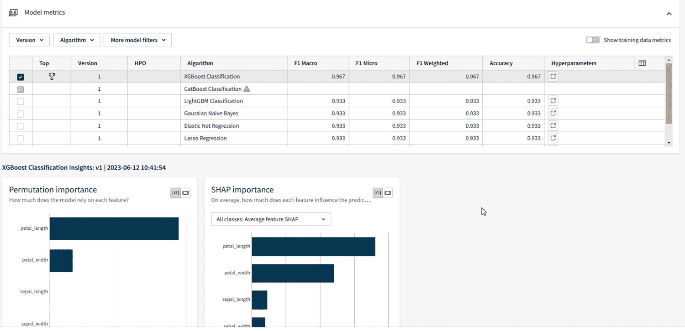

图 8.7：模型指标

我们可以看到，表现最好的模型是 XGBoost 分类算法，其 `F1 Macro` 得分为 `0.967`。我们还获得了关于 `F1 Micro`、`F1 Weighted` 和 `Accuracy` 得分的信息。我们在第一章中介绍了 F1 分数的含义。微、宏和加权 F1 分数之间的区别如下：

+   宏 F1 是每个类别的平均 F1 值，不进行加权（所有类别都同等对待）。

+   微 F1 是在整个混淆矩阵上计算的 F1 值。计算微 F1 分数等同于计算全局精确度或全局召回率。

+   加权 F1 对应于二分类 F1。它为每个类别计算，然后作为一个加权平均值组合，考虑每个类别的记录数量。

如您可能记得，准确度衡量模型平均上正确预测的频率。在我们的例子中，准确度得分为 0.967，这意味着我们的模型在 97% 的情况下是正确的。

在 `超参数` 下，我们还可以调查模型参数。对于我们的最佳模型，这些参数看起来如下：

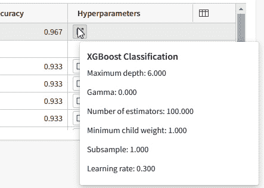

图 8.8：XGBoost 分类超参数

这些旨在为我们提供关于模型的更详细信息。参数是算法特定的。

现在，我们将更仔细地研究 **排列重要性** 和 **SHAP 重要性** 图表。我们在 *第一章* 中探讨了这两个图表的基本概念。以下图显示了图表的示例：

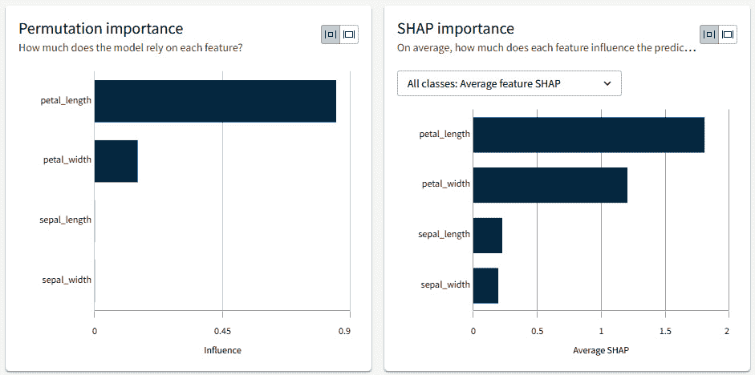

图 8.9：排列重要性和 SHAP 重要性的图表

如您可能记得，排列重要性是衡量一个特征对模型整体预测重要性的度量。基本上，它描述了如果移除模型从该特征学习的能力，模型会受到怎样的影响。AutoML 使用 scikit-learn 工具包来计算排列重要性。

SHAP 重要性是一种用于解释机器学习模型预测的方法。它提供了关于每个特征对特定实例或一组实例预测贡献的见解。基本上，它表示一个特征相对于该行中的其他特征以及数据集的平均结果对单个行预测的影响。SHAP 重要性在行级别进行衡量，AutoML 使用各种算法来计算 SHAP 重要性分数。

从前面的图表中，我们可以看到**花瓣长度**是我们预测中的一个重要特征，无论是从排列还是 SHAP 重要性来看。在多类问题中，我们还可以调查每个类的 SHAP 重要性。让我们通过类别来调查每个特征的 SHAP 值。使用 SHAP 图表上的下拉菜单更改图表类型，并选择**按类别特征 SHAP**。你应该会看到以下图表：

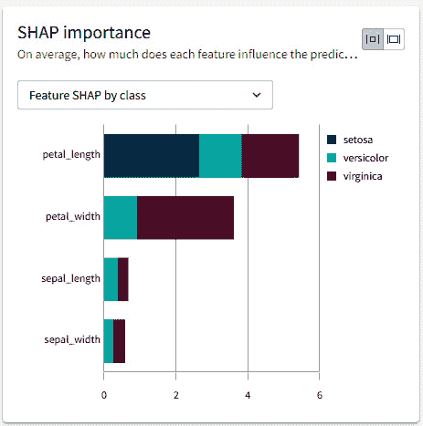

图 8.10：按类别 SHAP

从前面的图表中，我们可以看到**花瓣长度**可以用来区分**setosa**、**versicolor**和**virginica**。其他特征随后用于进一步确定物种。如果我们从下拉菜单更改图表类型，我们还可以看到每个特定类的 SHAP 重要性。

如果我们想更改我们的实验，我们可以选择**配置 v2**并修改其参数。在这种情况下，我们对我们的模型感到满意。要部署我们的模型，我们可以选择**部署**。如果我们对自动生成的模型不满意，我们可以为其提供一个名称并决定其所在的空间。AutoML 会在**描述**字段中自动填充有关模型的一些细节。确保**启用实时 API 访问**选项已启用，并选择**部署**。然后，从弹出窗口中选择**打开**，你应该会被重定向到我们新的机器学习模型。你应该会看到以下视图：

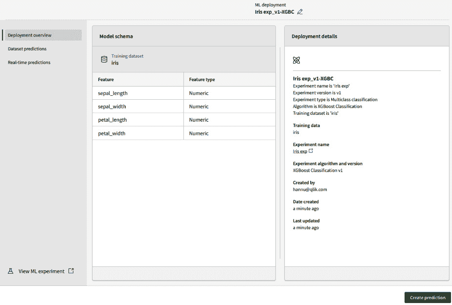

图 8.11：已部署的机器学习模型

在左侧，你可以看到一个已部署模型的架构图。这个架构图会告诉我们，当使用模型进行预测时，模型期望我们提供什么类型的数据。在右侧，我们可以看到我们模型的详细信息。其他两个标签页将提供关于手动运行预测和`REST`端点连接性的信息。仔细查看这些信息，完成后返回架构视图。

我们可以通过选择**创建预测**并上传模型所需的 CSV 或其他数据文件来直接使用我们的模型。这样，我们的结果将作为文件存储在 Qlik Cloud 中。还有可能安排预测并动态命名结果文件。然而，更稳健地利用我们新模型的方法是通过数据连接器使用它。让我们接下来更详细地看看这一点。

对于我们的应用程序，我们将使用另一个名为`iris_test.csv`的数据集。首先，将文件上传到 Qlik Cloud。创建一个新的 Qlik 应用程序，并将`iris_test`数据添加到其中。现在，我们将`id`字段添加到我们的测试数据中。为此，你可以使用以下代码：

```py
iris:
LOAD
RowNo() as id,
     sepal_length,
     sepal_width,
     petal_length,
     petal_width
FROM [lib://<PATH TO DATAFILE>/iris_test.csv]
(txt, utf8, embedded labels, delimiter is ',', msq);
```

注意

我们的`iris_test.csv`数据集是随机生成的，以模拟原始`iris`数据集的特征，并不代表实际数据。它应仅用于演示目的。

现在，我们将创建与我们的部署机器学习模型的连接。在数据连接下选择**创建新连接**，然后选择**Qlik AutoML**。将打开一个如下视图：

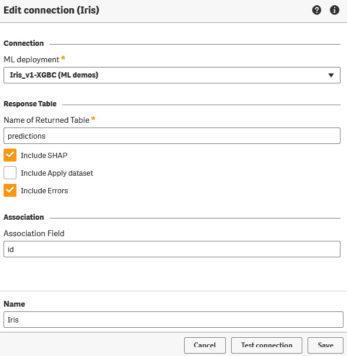

图 8.12：机器学习模型的连接数据

从`predictions`中选择我们的部署模型。选择**包含 SHAP**和**包含错误**，因为我们希望我们的结果表也包含这些列。SHAP 不是每个算法都可用，但选择它是良好的实践。如果不可用，它将不会出现在结果表中。在我们的情况下，这些值不可用。

在`id`。这是一个将生成的预测和我们的原始数据联系在一起的字段。我们在之前的数据中生成了`id`字段。为你的数据连接提供一个名称，然后点击**保存**。你应该在你的应用程序中看到一个新数据连接出现；让我们使用它。点击**选择数据**，如下截图所示：

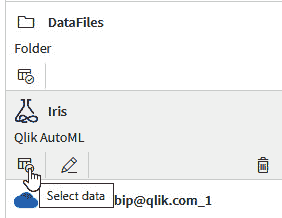

图 8.13：在 AutoML 连接中选择数据

将出现数据选择向导，如下截图所示：

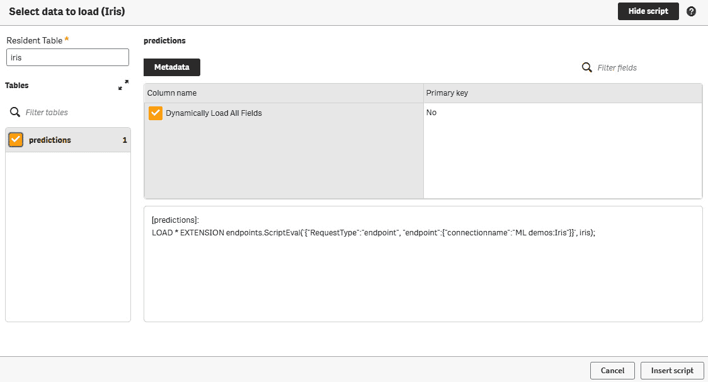

图 8.14：数据选择向导

在`iris`。这是我们原始数据集，我们将用它来获取预测。在**表**部分下选择`predictions`表。这是我们的结果表。没有预览可用，但你可以看到生成的脚本。选择**插入脚本**。我们现在可以看到我们的连接器生成了以下脚本：

```py
[predictions]:
LOAD * EXTENSION endpoints.ScriptEval('{"RequestType":"endpoint", "endpoint":{"connectionname":"ML demos:Iris"}}', iris);
```

基本上，我们的连接器使用 API 将`iris`表发送到我们的机器学习模型，并返回预测表。它以连接名称作为参数，并将我们的数据表（`iris`）作为输入。我们现在可以加载我们的应用程序并调查数据模型查看器。你应该看到一个如下所示的数据模型：

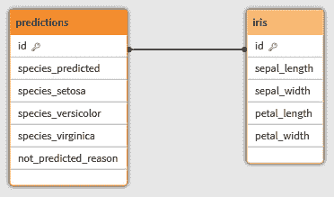

图 8.15：数据模型

如我们所见，我们的连接器返回了一个与我们的原始数据表通过`id`作为键连接的预测表。预测表包含实际预测、每行的可能错误消息以及每个鸢尾花物种的概率。

现在，我们将进一步调查我们的预测结果。创建一个新的工作表，并向其中添加以下元素：

+   一个过滤器面板，顶部包含所有我们的特征。

+   一个散点图，`Avg(petal_width)`在*y*轴上，`Avg(petal_length)`在*x*轴上，`Id`作为气泡。按维度着色，并选择`species_predicted`作为着色维度。

+   包含所有特征的表格。

+   一个柱状图，`Count(species_predicted)`作为柱高，`species_predicted`作为维度。

+   我们稍后将要配置的四个 KPI 对象。

+   四个变量输入，每个输入的左侧都有一个文本和图像容器。

您应该得到以下布局：

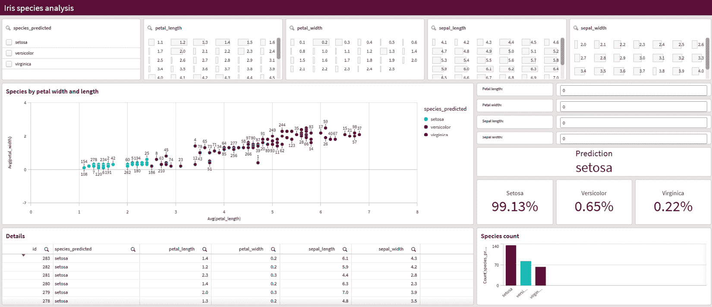

图 8.16：应用程序布局

注意

您可以在本书的 GitHub 仓库中找到完整的应用程序。

如您从结果中看到的那样，我们已经使用我们的模型成功预测了物种。如果我们查看散点图，似乎我们的模型给出了良好的结果，考虑到我们的数据是随机生成的。作为最后一步，我们将创建一个将利用我们模型 API 的模拟。

我们将首先创建以下变量：

```py
v_sepal_length
v_sepal_width
v_petal_length
v_petal_width
```

将每个变量的默认值设为`0`。由于我们已经创建了变量输入和标签，我们可以将变量分配到输入中，并将正确的标签输入到相应位置。最终您应该得到以下视图：

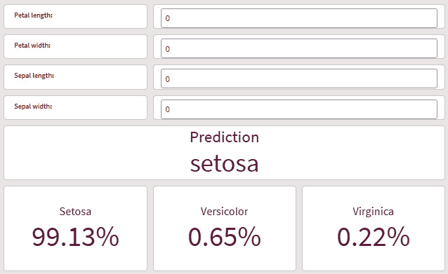

图 8.17：模拟视图

现在，我们将设置 KPI 对象。选择第一个 KPI，并将标签输入为`Prediction`。在**表达式**字段中输入以下公式：

```py
=endpoints.ScriptEvalExStr('NNNN','{"RequestType":"endpoint", "endpoint":{"connectionname":"ML demos:Iris","column":"species_predicted"}}',
v_petal_length as petal_length,
v_petal_width as petal_width,
v_sepal_length as sepal_length,
v_sepal_width as sepal_width
)
```

这种语法可能看起来很熟悉。我们在之前的 R 示例中使用了相同的原则。AutoML 连接器利用了高级分析集成语法。

通过高级分析集成，我们有两组脚本函数：

+   **ScriptEval**：在超立方体聚合后，指定列中的所有行都发送到连接器。期望的响应是单列。如果返回多个列，则将选择与输入行数相同的第一个列。返回列中的行必须与输入的顺序相同。

+   `ScriptAggr`使用多个维度调用。

对于前面提到的两个集合，有四种基于数据类型的函数：

+   `ScriptEval(Script, Field 1, [Field n])`: 输入字段和响应必须是数值。

+   `ScriptEvalStr(Script, Field 1, [Field n])`: 输入字段和响应必须是字符串。

+   `ScriptEvalEx(DataTypes, Script, Field 1, [Field n])`: 输入字段可以是字符串或数值，第一个参数是数据类型的字符串，响应必须是数值。

+   `ScriptEvalExStr(DataTypes, Script, Field 1, [Field n])`: 输入字段可以是字符串或数值，第一个参数是数据类型的字符串，响应必须是字符串。

在前面的示例中，我们使用了`ScriptEvalExStr`函数，并定义了输入字段的数据类型，因为它们是数值型的，但响应是字符串（数值字段为`'NNNN'`）。

注意到我们的脚本还包含了要使用的连接的详细信息：

```py
'{"RequestType":"endpoint", "endpoint":{"connectionname":"ML demos:Iris","column":"species_predicted"}}'.
```

连接名称指的是我们之前创建的数据连接器。我们还确定了要从模型中获取的列。在我们的例子中，它是`species_predicted`。选择正确的返回值很重要。如果您在数据加载期间也使用了模型，您可以看到所有可能的字段——例如，从数据管理器中。

在我们脚本的最后部分，我们将变量值作为输入传递给我们的模型。名称应与我们的模型模式名称匹配。这就是为什么我们将使用`as`运算符来重命名变量。

在配置 KPI 对象之后，你应该会看到`setosa`作为一个值出现。由于我们所有的变量都被定义为`0`，我们的模型将根据这些信息进行预测。

将以下配置添加到剩余的三个 KPI 对象中：

+   **标签**：Setosa

+   **脚本**：

    ```py
    =endpoints.ScriptEvalEx('NNNN','{"RequestType":"endpoint", "endpoint":{"connectionname":"ML demos:Iris","column":"species_setosa"}}',
    v_petal_length as petal_length,
    v_petal_width as petal_width,
    v_sepal_length as sepal_length,
    v_sepal_width as sepal_width
    )
    ```

+   **标签**：Versicolor

+   **脚本**：

    ```py
    =endpoints.ScriptEvalEx('NNNN','{"RequestType":"endpoint", "endpoint":{"connectionname":"ML demos:Iris","column":"species_versicolor"}}',
    v_petal_length as petal_length,
    v_petal_width as petal_width,
    v_sepal_length as sepal_length,
    v_sepal_width as sepal_width
    )
    ```

+   **标签**：Virginica

+   **脚本**：

    ```py
    =endpoints.ScriptEvalEx('NNNN','{"RequestType":"endpoint", "endpoint":{"connectionname":"ML demos:Iris","column":"species_virginica"}}',
    v_petal_length as petal_length,
    v_petal_width as petal_width,
    v_sepal_length as sepal_length,
    v_sepal_width as sepal_width
    )
    ```

如您可能已经注意到的，我们的脚本在所有 KPI 中几乎相同。我们通过改变模型返回列的值来定义输出。这样，我们将获得每个物种的概率。

尝试修改输入字段中的值，你应该会实时获得每个物种的预测和概率。

我们现在已经成功完成了应用程序，并学习了如何在云环境中使用 Qlik AutoML，同时使用加载时和实时集成。在下一节中，我们将探讨设置本地环境以与 Qlik AutoML 集成的过程。

# 将 Qlik AutoML 连接到本地环境

Qlik AutoML 是一个与云租户紧密集成的云工具。然而，可以利用本地环境的特性。需要注意的是，由于 Qlik AutoML 仍然在云环境中运行，所有数据也会传递到 Qlik Cloud 租户。如果数据不能离开本地环境，则此方法不适用。连接是加密和安全的，Qlik Cloud 拥有所有主要的安全认证。还需要注意的是，此方法将需要有效的 Qlik Cloud 许可证。

注意

关于 Qlik Cloud 安全和合规性的更多信息可在 Qlik 信任网站上找到：[`www.qlik.com/us/trust`](https://www.qlik.com/us/trust)

我们可以在以下图中看到将 AutoML 与本地环境集成的基本架构：

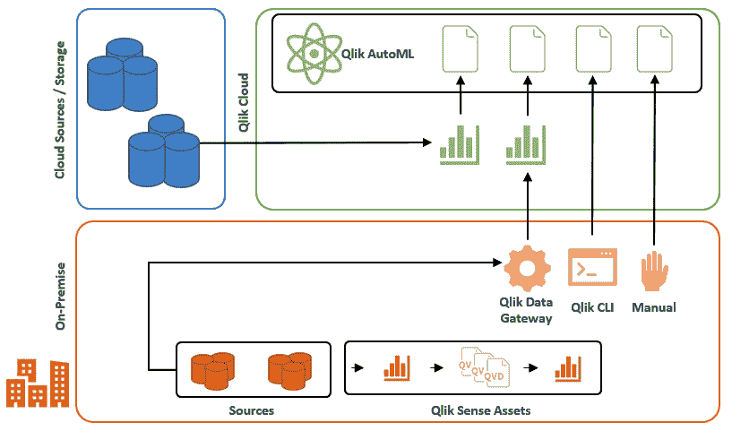

图 8.18：Qlik AutoML – 本地与 SaaS 集成

在前面的图中，我们的本地环境位于底部。在这个架构中，我们将在这个本地环境中处理大部分数据加载。在准备了一个机器学习准备好的数据集之后，我们可以利用 Qlik 数据网关、Qlik CLI 或手动上传到云租户。这些数据可以使用来自其他云源的数据进行补充。当我们的训练数据在云中时，训练机器学习模型将涉及上一节中相同的流程。还可以使用任务、应用程序自动化和 Qlik CLI 自动化整个流程。一旦模型训练完成，我们就可以直接从本地环境利用预测 API。

关于实现所述环境的特定细节在每个组织中都不同。前面的图可以作为粗略的参考，但具体的实现应针对每个案例进行规划。

本节的目标是提供一些关于在混合场景中使用 Qlik AutoML 的想法。在下一节中，我们将探讨一些使用 Qlik AutoML 的最佳实践。

# Qlik AutoML 的最佳实践

在使用 Qlik AutoML 时，有一些通用的指南和最佳实践。遵循这些实践和原则将使您更容易获得准确的结果并处理机器学习项目流程。一般原则包括以下内容：

+   **定义问题**：明确定义您使用 Qlik AutoML 尝试解决的问题。确定您想要预测的变量，并了解可用的数据。这是最重要的最佳实践之一。

+   **准备和清理数据**：确保您的数据适合分析。这可能涉及清理缺失值、处理异常值、转换变量、清理重复项，并确保数据格式良好。这通常是机器学习项目中耗时最长的部分。

+   **特征工程**：从原始数据中探索和创建有意义的特征。Qlik AutoML 可以自动化一些特征工程任务，但仍然重要的是要了解您的数据并将领域知识应用于生成相关特征。

+   **可解释性和可说明性**：理解和解释您模型的成果。Qlik AutoML 提供了解释生成的模型的工具，并了解不同特征对预测的贡献。

+   **验证和评估**：使用适当的评估指标来评估您模型的性能。Qlik AutoML 可以提供默认指标，但始终在可能的情况下交叉验证结果。

+   **监控和维护**：持续监控生产中模型的性能。当有新数据可用时，定期更新和重新训练模型。

+   **迭代过程**：机器学习是一个迭代过程，因此请准备好根据反馈和新见解对您的模型进行优化和改进。

Qlik AutoML 是一个强大的工具，可以以自动化的方式构建机器学习模型，并且它可以使最终用户更容易理解复杂的模型。在利用该工具时，并牢记之前描述的基本原则，组织可以从他们的数据中获得更多。记住，没有任何机器学习工具是一个可以解决世界上所有商业问题的魔法盒子。你准备的问题定义和训练数据越好，从模型中获得的结果就越准确。

# 摘要

在本章中，我们发现了 Qlik AutoML 的用法。我们首先学习了该工具将为用户带来什么以及它的关键特性是什么。我们使用著名的 Iris 数据集，用 Qlik AutoML 构建了我们第一个机器学习模型。在本节中，我们发现了如何运行实验并从实验中部署模型。我们还发现了如何在 Qlik 应用程序中利用模型，无论是在数据加载期间还是在实时中。我们从不同的指标中学习了我们的模型表现如何。

在本章的后半部分，我们快速浏览了本地环境。我们学习了如何在混合场景中利用 Qlik AutoML 以及如何在这些用例中设置我们的环境。我们还发现了与 Qlik AutoML 一起使用的最佳实践。

在下一章中，我们将深入探讨数据可视化。我们将发现可视化机器学习相关数据的技术，并调查一些较少使用的图形类型的使用。我们还将了解常见的图表和可视化，并发现一些可以帮助我们充分利用数据的设置和配置。
