# 第九章：适用于机器学习解决方案的高级数据可视化技术

在数据分析和机器学习快速发展的世界中，有效地可视化复杂信息的能力变得至关重要。随着组织努力从大量数据中提取有价值的见解，他们需要能够将原始数字转换为有意义的视觉表示的强大工具。

在本章中，我们深入探讨机器学习解决方案背景下的高级数据可视化技术。我们探讨 Qlik 的复杂视觉分析能力如何增强对机器学习模型及其输出的理解和解读。

本章将为您提供利用 Qlik 的视觉分析能力以获得更深入见解、做出明智决策并在机器学习和大数据时代推动可操作成果所需的知识和技能。

本章涵盖的主要主题如下：

+   可视化机器学习数据

+   Qlik 中的图表和可视化类型

# 可视化机器学习数据

在可视化机器学习数据时，应考虑几个重要方面，以确保有效沟通和解读洞察力。以下应考虑的事项（这些不是特定工具的）：

+   **理解数据**：深入了解您正在处理的数据。分析其结构、分布和关系，以识别关键变量和模式。这种理解将指导您选择适当的可视化技术。

+   **选择合适的可视化技术**：选择最能代表数据特征和关系的可视化技术。常见的技术包括散点图、折线图、柱状图、直方图、热图和网络图。选择能够有效传达您想要传达的信息的技术。在下一章中，我们将发现 Qlik 提供的不同可视化。

+   **简化并减少复杂性**：尽可能使可视化简单明了。避免杂乱和过多的细节，这可能会使观众困惑。突出最重要的见解，并使用颜色和注释等视觉线索来引导观众的注意力。

+   **使用适当的视觉编码**：利用视觉编码有效地表示数据的各种属性。利用位置、长度、角度、颜色、大小和形状来编码变量并传达有意义的信息。确保所选编码准确代表数据属性。

+   **考虑缩放和归一化**：如果数据具有广泛的值范围或不同的尺度，请考虑缩放或归一化数据以确保准确的可视化。如标准化或最小-最大缩放等缩放技术可以帮助将数据调整到可比较的范围内，以便进行适当的可视化。

+   **利用交互式可视化**：将交互性融入你的可视化中，使用户能够动态地探索数据。允许缩放、平移、过滤和选择感兴趣的数据点。交互式可视化增强了用户对数据的参与度和理解。使用 Qlik 工具时，交互性是内置的，因此无需额外步骤。

+   **提供背景和解释**：包括清晰的标签、标题和轴描述，以提供背景和指导解释。解释可视化数据的含义，并提供相关的背景信息。添加标题、图例或工具提示，以帮助观众理解视觉元素。

+   **考虑多个视图或多个可视化**：有时，通过多个视图或多个可视化来呈现数据可以提供更全面的理解。结合不同的技术，如叠加多个图表或使用小 multiples，以揭示数据的各个方面。在 Qlik Sense 中，考虑应用程序的结构以及如何利用工作表将数据划分为信息视图。

+   **测试和迭代**：通过不同的用户或利益相关者测试可视化，以收集反馈并提高其有效性。根据用户反馈迭代设计，并细化可视化以确保它们清晰、有洞察力，并达到预期的目标。

+   **针对观众调整可视化**：在设计可视化时，考虑观众的知识和专业知识。根据观众的理解调整可视化的细节、技术性和复杂性。根据需要提供解释和背景信息。

任何数据可视化的一个重要方面是有效使用颜色。在设计数据可视化的颜色方案时，应考虑以下方面：

+   **选择有目的的颜色调色板**：选择与可视化目的和上下文相符的颜色调色板。考虑使用定性颜色方案（为不同类别使用不同的颜色）、顺序颜色方案（有序数据的颜色渐变）或差异颜色方案（突出极端或差异）。您可以使用颜色选择器或在线颜色调色板生成器来找到和谐且视觉上令人愉悦的颜色组合。

+   **区分类别**：在表示不同的类别或组时，使用不同的颜色以确保清晰的区分。避免使用可能引起混淆或难以区分类别的相似色调。确保所选颜色在视觉上可区分，即使对于色觉缺陷者也是如此。

+   **使用颜色的一致性**：在整个可视化中保持颜色使用的一致性。在整个可视化中为同一类别或变量分配相同的颜色，以提供视觉连续性并帮助解释。一致性有助于用户在颜色和相应的数据元素之间建立心理联系。

+   **突出关键元素**：利用颜色来吸引对重要元素或特定感兴趣的数据点的注意。使用对比或鲜艳的颜色来强调。例如，可以突出异常值、最大值和最小值，或满足特定标准的数据点，使它们在视觉上更加突出。

+   **考虑颜色象征意义**：注意不同文化或环境中颜色所固有的象征意义。在不同的背景下，颜色可能有不同的含义或象征。考虑文化敏感性，并确保颜色选择不会无意中传达误导或不恰当的信息。

+   **保持可访问性**：确保所选颜色对广泛的用户都是可访问的，包括那些有色彩视觉缺陷的用户。避免仅依靠颜色来传达信息。使用图案、标签或纹理等替代视觉线索来补充或替换颜色区分。ColorBrewer 和可访问颜色调色板生成器等工具可以帮助创建符合可访问性指南的颜色调色板。

+   **平衡视觉层次**：使用颜色在可视化中建立视觉层次。使用颜色的不同色调或强度来表示不同的重要性或显著性水平。较浅的颜色可用于背景或不太重要的元素，而较深或较重的颜色可用于关键元素或主要焦点区域。

+   **限制颜色数量**：在单一的可视化中避免使用过多的颜色，因为这可能导致视觉混乱和困惑。根据所表示的类别或变量的数量，将调色板限制在可管理的不同颜色数量内。如有必要，考虑使用大小、形状或纹理等额外的视觉编码技术来补充颜色区分。

注意

Qlik 应用程序的颜色主题和渐变可以通过主题定义，或者直接放入应用程序中。如果有应该跨多个应用程序使用的通用颜色主题，建议创建一个自定义主题。

现在我们已经学习了一些关于数据可视化和颜色的基本原则，在下一节中，我们将更详细地探讨 Qlik Sense 提供的一些图表。

# Qlik 中的图表和可视化类型

在本节中，我们将更详细地探讨 Qlik 中的不同可视化类型。我们还将了解布局的一般设置。截至编写本章时，以下可视化类型得到支持（加粗的在本章中更详细地介绍）：

图表：

+   **条形图**

+   **箱线图**

+   **子弹图表**

+   组合图表

+   **分布图**

+   仪表盘

+   **直方图**

+   折线图

+   **地图**

+   饼图

+   **散点图**

+   树状图

+   **瀑布图**

基于文本的可视化：

+   过滤面板

+   关键绩效指标（KPIs）

+   交叉表

+   表格

+   文本和图像

仪表板对象：

+   按钮

+   容器

注意

在本章中，我们只介绍原生可视化。可视化包和仪表板包中也有可用的可视化，包括 Qlik 支持的扩展对象。还可以创建完全定制的可视化扩展或使用社区创建的扩展。然而，这些内容超出了本书的范围。

## 条形图

条形图是最常见的可视化类型之一。通常用于比较多个值。维度轴表示比较的类别项目，而度量轴显示每个项目的值。条形图在处理离散或分类数据时特别有用。在机器学习环境中，条形图通常用于特征分析、模型评估或类别分布等。在我们之前的鸢尾花数据集示例中，我们使用条形图来表示预测的鸢尾花物种的分布。此图表如下所示：

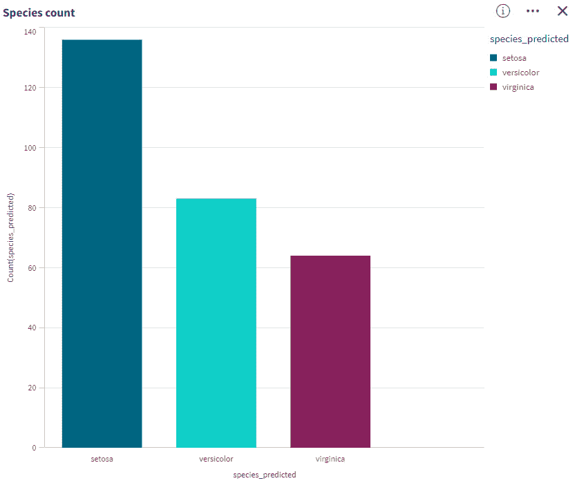

图 9.1：表示预测的鸢尾花物种计数的条形图示例

此示例表示一个简单的条形图。更复杂的表示包括分组或堆叠的条形图，可以同时表示多个类别。分组条形图适用于比较，而堆叠条形图可以用来可视化构成总体的子类别的相互关系。

例如，分组条形图可以用来并列比较不同年份的销售和预测，而堆叠条形图可以用来分析不同产品类别的销售。在这种情况下，条形图的总高度是总销售量。

## 箱线图

箱线图，也称为箱线图，是理解数值数据分布和统计属性的有价值可视化工具。箱线图适用于比较数值数据组的范围和分布，用箱和须表示。须代表高和低参考值。箱线图可以组织大量数据并有效地可视化异常值。箱线图在机器学习数据中的典型用途包括数据探索、特征比较和异常值检测。以下示例表示显示预测物种平均花瓣长度分布的箱线图：

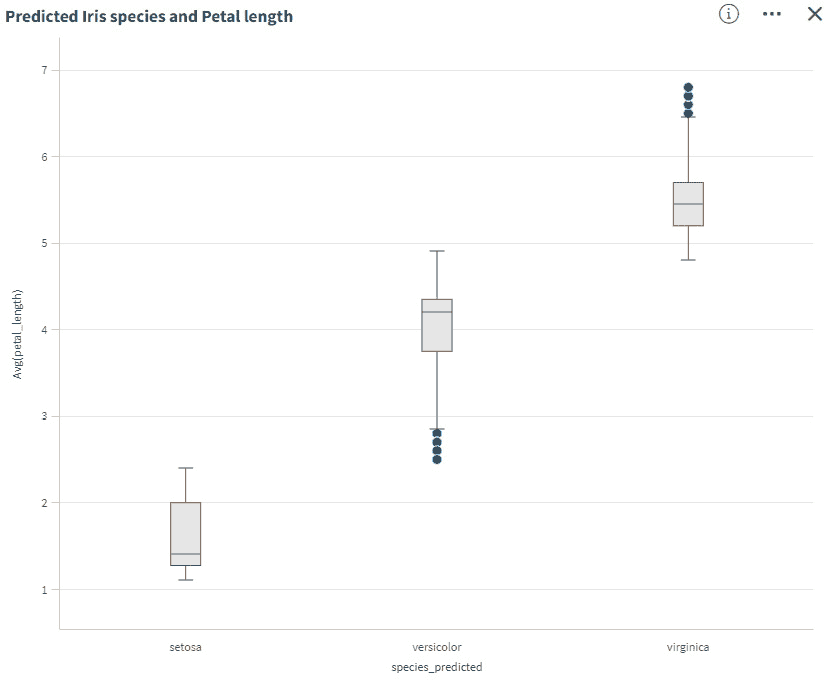

图 9.2：表示预测物种平均花瓣长度的箱线图示例

在 Qlik 中，您可以选择箱线图的预设，或者自己定义每个组件的公式。在前一个图中，我们可以看到一些异常值超出了触须，这些异常值由蓝色点表示。我们可以看到，versicolor 的花瓣长度箱和触须最长。这告诉我们，在我们模型中预测为 versicolor 的物种具有最大的花瓣长度分布。每个预测物种的平均花瓣长度在每个箱子中由一条水平线标记。

## 子弹图

子弹图是结合了柱状图和范围图特性的强大可视化工具。它们提供了紧凑且信息丰富的数据表示，因此对于比较实际值与目标值以及显示性能指标非常有用。子弹图使得比较和测量性能成为可能，并提供了丰富信息。这是一个根据目标比较性能的好图表。以下是一个子弹图的示例：

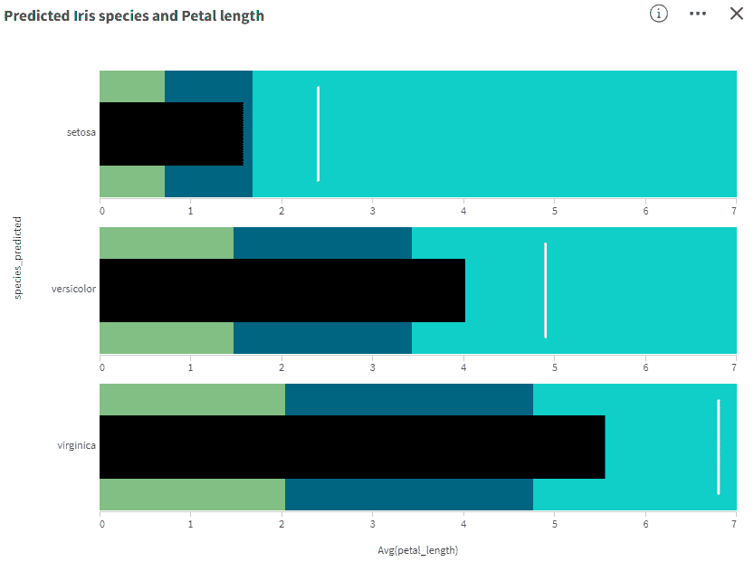

图 9.3：表示花瓣长度的子弹图示例

在这个例子中，我们将最大花瓣长度设置为目标，使用白色垂直线进行可视化。我们将颜色方案设置为表示目标 30%和 70%的标记，黑色条形图可视化了每个鸢尾物种的平均花瓣长度。

## 分布图

分布图，也称为密度图，是理解数据集中数值变量分布的有用可视化工具。它显示了数据在不同区间或箱中的概率密度。使用分布图，您可以直观地探索和理解机器学习数据的分布特性。它们提供了关于数值变量的形状、中心趋势和变异性的见解，有助于数据探索、特征工程和模型构建过程。分布图适用于比较数值数据组的范围和分布。以下是一个示例：

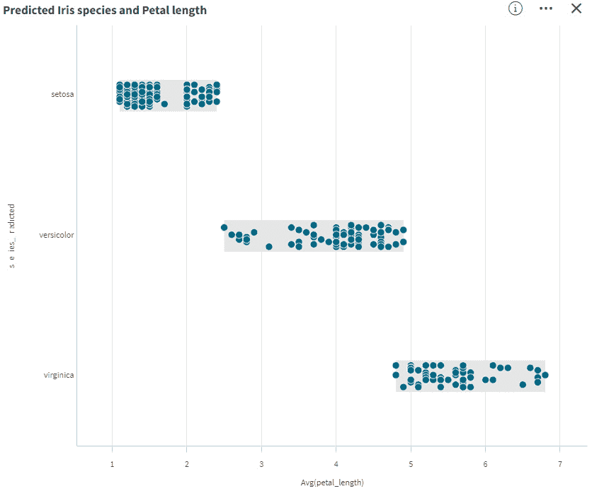

图 9.4：表示花瓣长度的分布图示例

在这个图中，我们可以看到花瓣长度的单个测量值用蓝色点标记，测量值的分布用灰色背景标记。我们可以轻松地看到数据的构建。在图中，单个测量值的气泡大小参数被调整为小于默认大小，以获得更清晰的图表。如果数据点很多，也可以启用抖动。这将使用不同的垂直位置将单个点分开。

## 直方图

直方图是一种常见的可视化技术，用于表示数值数据的分布。它们提供了对预定义区间或箱中值的频率或计数的洞察。它们适合于显示在区间或固定期间内数值数据的分布。数据被分成箱，每个条形代表每个箱中的频率。以下示例中，我们正在可视化加利福尼亚地区的房屋价值的频率和分布：

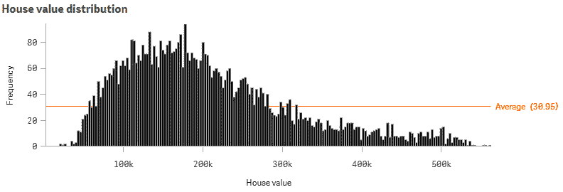

图 9.5：可视化房屋价值分布的直方图示例

在此示例中，我们可以看到直方图略微向左倾斜。这告诉我们，大多数房屋的价值在 10 万至 30 万美元之间，但仍有部分房屋价值高于这个范围。这些形成了右侧的长“尾巴”。我们还可以看到，平均而言，每个价格区间大约有 31 栋房屋。在 Qlik Sense 中，您可以修改柱子的数量和颜色等许多其他参数。在此示例中，柱子的数量已增加到 200，以获得更准确的结果。

## 地图

Qlik Sense 中的地图是一个非常灵活的可视化对象，可以用多种方式使用。地图可以包含多个图层，并在同一可视化中显示不同类型的信息。当数据基于地理时，利用地图的最佳和最自然的方式，但地图对象也可以用于在 SVG 图像等不同背景上可视化数据。Qlik Sense 中的地图支持多种坐标系，并且与 GeoAnalytics 连接器结合使用时，可以对数据进行进一步计算。以下示例展示了一个具有不同可视化的示例地图：

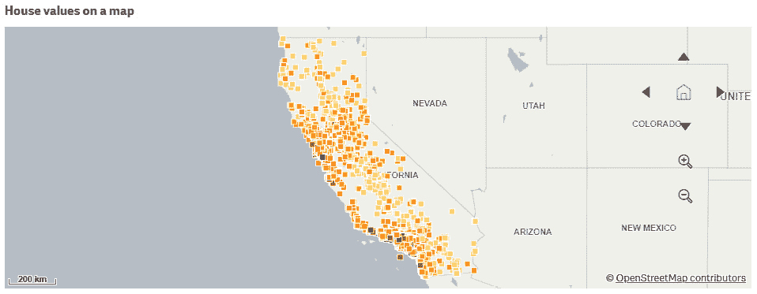

图 9.6：在具有渐变色彩方案的地图上绘制预测房屋价值示例

此示例在地图上可视化加利福尼亚州预测的房屋价值。每个点代表一栋房屋，颜色表示预测的价值。颜色越深，表示房屋越贵。热力图有助于在地图上可视化点的密度。在以下示例中，我们将单个房屋映射到热力图中：

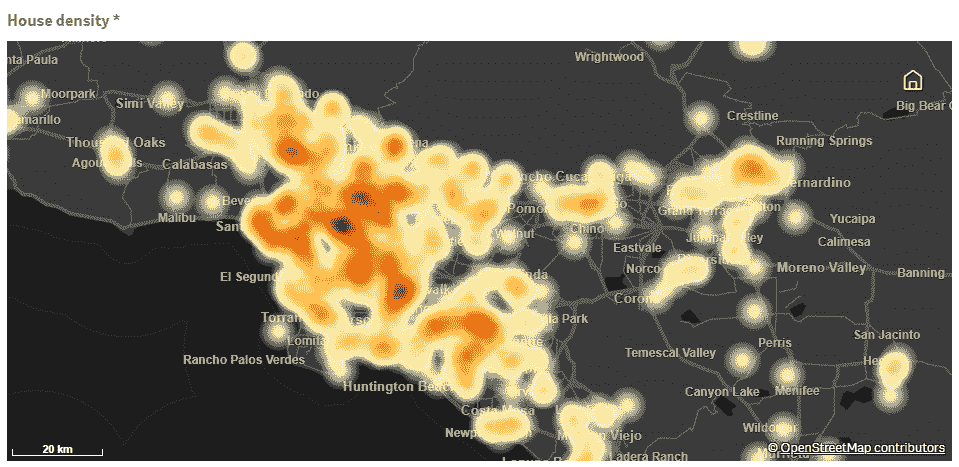

图 9.7：绘制单个房屋的热力图示例

热力图上的较暗区域表示该区域房屋的密集度更高。将不同图层组合到可视化中是一种非常强大的展示地理数据的方式。

在下一个示例中，我们可以看到位于挪威道路网络 300 公里驾驶范围内的特斯拉超级充电站。驾驶范围是通过 GeoAnalytics 连接器计算的，并在地图上可视化：

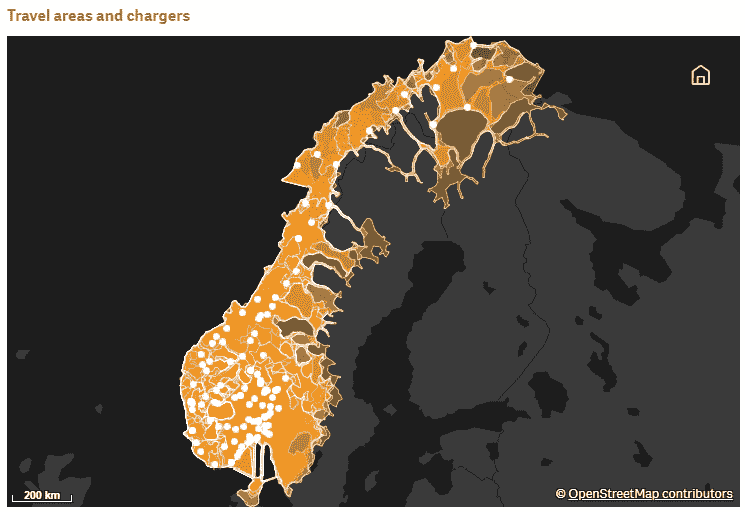

图 9.8：显示挪威每个特斯拉超级充电站 300 公里驾驶范围的地图示例

如前图所示，地图是强大的可视化对象，并且强烈推荐与地理数据一起使用。在许多机器学习解决方案中，我们可以将结果放置在地图上。

## 散点图

散点图是一种数据可视化类型，显示两个数值变量之间的关系。它使用二维平面上的点表示单个数据点，其中一个变量绘制在 x 轴上，另一个变量绘制在 y 轴上。散点图可用于帮助识别模式、相关性或异常值，并协助选择特征、识别重要变量以及理解数据的行为。散点图也适用于数据的交叉验证和机器学习模型的验证。以下图例展示了使用鸢尾花数据集的散点图示例：

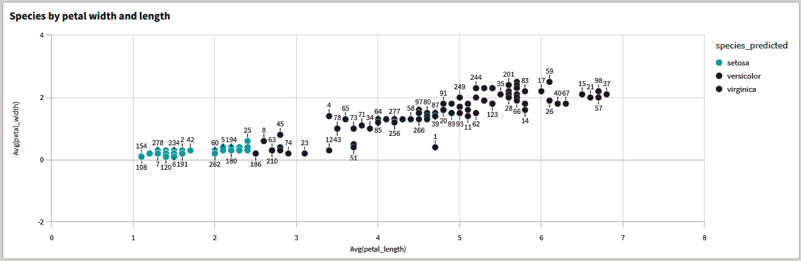

图 9.9：按花瓣宽度和长度绘制的鸢尾花物种散点图示例

在这个例子中，我们绘制了鸢尾花数据集的个体 ID，其中花瓣宽度在垂直轴上，花瓣长度在水平轴上。然后我们使用预测的物种作为颜色。这样我们可以在数据中看到清晰的模式。

如果数据点很多，散点图也是一种很好的可视化类型。如果数据点的数量超过最大值，它将自动切换到压缩视图。这个值可以在图表设置中调整。以下是一个压缩视图的示例：

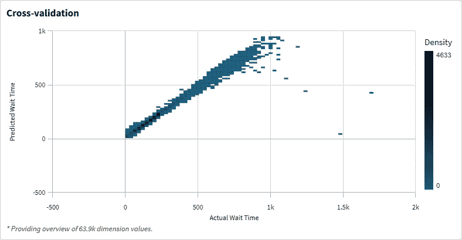

图 9.10：散点图—压缩视图

压缩示例可视化了急诊室单位预测等待时间与实际测量等待时间之间的交叉验证。关系应该是线性的，但由于我们看到了一些异常值，我们知道在这种情况下，我们实际的模型仍需要进行优化。示例图中的压缩视图显示了 64,000 个数据点。

## 水流图

水流图是各种因素如何影响最终值的视觉表示。它们有助于理解数据集中正负变化的累积效应。虽然水流图常用于财务分析，但它们也可以用于分析和解释机器学习数据。当可视化 Qlik AutoML 模型的 SHAP 值时，水流图非常有用，以了解单个特征如何影响预测值。以下示例表示了加利福尼亚住房数据集的 SHAP 值：

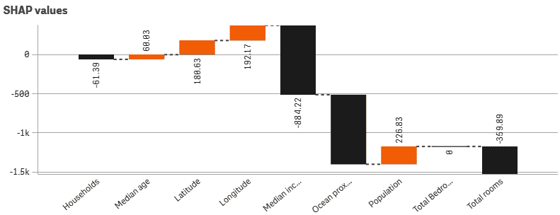

图 9.11：水流图示例—SHAP 值

在这个例子中，我们可以看到`中位数收入`和`海洋接近度`对预测值有重大影响。这些特征的总体影响是负面的，但如果我们调查最高预测价格，我们可以看到这个群体的影响是正面的。这将在以下图中描述：

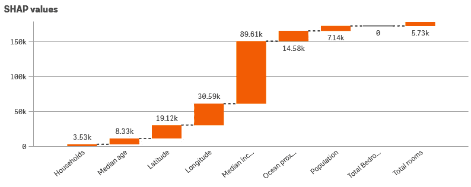

图 9.12：可视化并过滤了预测价格超过 300,000 美元的房屋的 SHAP 值

这样，我们可以研究不同变量如何影响预测和模型行为。瀑布图是处理这种情况的良好选择，因为它可以轻松地可视化各种因素如何贡献到一个最终值。

注意

我们将在下一章中通过使用加利福尼亚房价数据的全交互示例来介绍。

## 选择可视化类型

当涉及到数据可视化时，一个关键目标是有效地展示关系和模式，以便可以快速获得洞察。Qlik Sense 提供了一系列的视觉化和图表，以满足各种数据可视化需求。每个图表都有其独特的优势，以不同的方式表示数据，可以根据不同的分析目的进行定制。

在选择适合您数据的相关图表时，考虑您想要获得的特定洞察至关重要。了解您想要可视化的内容和您想要讲述的故事对于选择最合适的图表类型至关重要。不同的图表强调数据的不同方面，例如趋势、比较、分布或关系。

Qlik Sense 提供了广泛的可视化选项。每种图表类型都有独特的特性和功能，以满足特定的数据分析需求。例如，条形图适用于比较分类数据，而折线图适用于可视化随时间变化的趋势。散点图适用于展示两个变量之间的关系，而树状图可以有效地说明层次化的数据结构。

通过在 Qlik Sense 中仔细选择合适的图表类型，您可以利用每种可视化的优势，从数据中获得有意义的洞察。了解您的数据和您想要回答的问题将帮助您做出明智的决定，选择哪些图表来准确展示您的数据，并促进数据驱动的决策。

在上一节中，我们通过示例介绍了一些不常见的可视化类型，并学习了为什么这些图表适合可视化机器学习相关数据。我们没有涵盖所有图表，而且有很多选项可以调整所有可用的图表。熟悉不同选项的最佳方式是亲自尝试图表。在下一章中，我们将从头开始构建几个机器学习用例，并在构建过程中介绍一些图表设置。

# 摘要

可视化机器学习数据是数据分析过程中的关键步骤，它使你能够获得洞察力，识别模式，并有效地传达结果。在本章中，我们熟悉了不同的可视化方法和可视化机器学习数据的技术。在本章的开头，我们发现了创建良好可视化的常见原则，并熟悉了色彩的关键原则。

在本章的末尾，我们发现了 Qlik 提供的不同可视化类型，并学习了如何有效地使用一些图表类型。我们学习了最常用可视化的原则，以及如何在 Qlik 中微调这些可视化，同时考虑到机器学习的上下文。

在下一章中，我们将探讨机器学习解决方案的实际应用。我们将学习如何从头开始构建几个不同的机器学习模型和应用，并利用前几章所学的一切。

# 第三部分：案例研究和最佳实践

本节将涵盖不同的使用案例，并附带实际操作示例。使用案例是从零开始构建的，包括问题定义阶段。结果是利用机器学习的一个工作分析应用。本节将提供利用前几章所学技能的可能性。本节还涵盖了机器学习和人工智能的当前和未来趋势，并专注于大趋势的特点。

本节包含以下章节：

+   *第十章**:* *示例和案例研究*

+   *第十一章**:* *未来方向*
