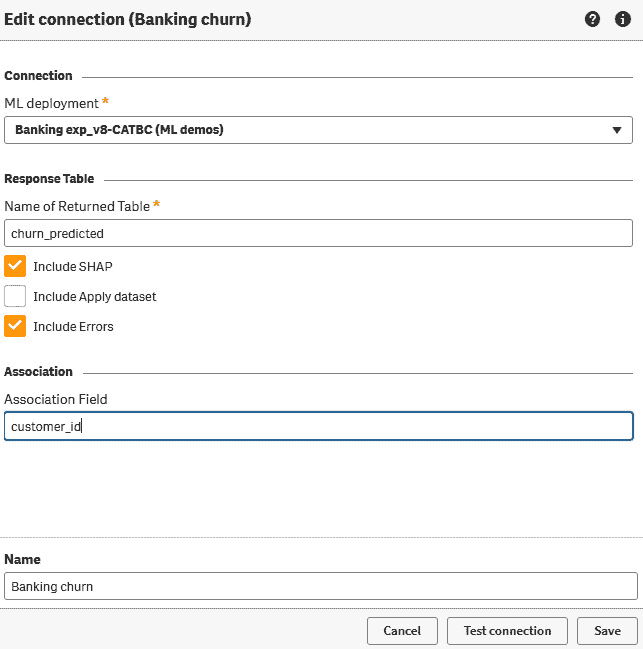

# 10

# 例子和案例研究

本章开始了一段探索机器学习领域的旅程，探讨了其实际应用和现实世界的例子，展示了其力量和潜力。在前几章中，我们已经学习了构建良好的机器学习解决方案所需的所有基本技能。在本章中，我们将利用所获得的所有知识，从头开始构建以下示例：

+   线性回归示例

+   客户流失示例

# 线性回归示例

在本例中，我们将创建一个线性回归模型来预测加利福尼亚地区房屋的价值。让我们首先熟悉数据集。我们将使用一个常见的加利福尼亚房屋价值数据集。这是一个关于美国加利福尼亚州各个地区住宅房地产数据的集合，常用于机器学习和数据分析任务中，基于各种特征预测房价。

我们将使用的数据集包含以下字段：

+   `medianIncome`: 特定区域家庭的中位数收入。

+   `housingMedianAge`: 该区域内房屋的中位数年龄。

+   `totalRooms`: 该区域内房屋的总房间数。

+   `totalBedrooms`: 该区域内房屋的总卧室数。

+   `population`: 该区域的总人口。

+   `households`: 该区域内家庭的总数（居住在家庭单元内的一群人）。

+   `latitude`: 房屋地理位置的纬度。

+   `longitude`: 房屋地理位置的经度。

+   `medianHouseValue`: 该区域内房屋的中位数价值。

+   `oceanProximity`: 海洋距离的类别描述

下面是数据的一个样本：


图 10.1：加利福尼亚住房数据集的样本数据

注意

示例数据集可以在本书的 GitHub 仓库中找到。其他数据集的一个好地方是，例如，[`www.kaggle.com/datasets`](https://www.kaggle.com/datasets)。

我们机器学习项目的第一步是定义我们想用我们的模型回答的问题。在这种情况下，我们使用的是一个相对简单的历史数据集，因此所使用的框架略有修改。让我们确定以下特征以开始：

+   **触发器**: 数据集中插入新的房屋数据

+   **目标**: 美元计价的房屋价值

+   **特征**: 纬度，经度，中位数年龄，总房间数，总卧室数，人口，家庭数，中位数收入，海洋接近度

+   **机器学习问题**: 预测加利福尼亚地区的房屋价值会是多少？

为了开始我们的实际工作，让我们首先将`housing_test.csv`和`housing_train.csv`上传到我们的 Qlik 云租户。这些文件可以在本书的 GitHub 仓库中找到。如您所见，数据集已经被分割成训练集和测试集。

在一个正常的机器学习项目中，我们需要注意对分类字段进行编码、处理空值、缩放等，但在这个案例中，Qlik AutoML 负责所有这些步骤。我们的下一个任务是创建一个新的机器学习实验（**添加新** 🡪 **新** **ML 实验**）。

给您的实验起一个名字，定义您想要使用的空间，然后按`housing_train.csv`，这是我们之前上传的。你应该会看到以下内容：


图 10.2：房价实验 – 目标选择

接下来，我们将选择我们的目标变量。我们还可以选择用于实验的特征。选择`median_house_value`作为目标，所有其他字段应自动选择以包含在我们的实验中。你应该会看到以下内容：


图 10.3：选定的目标和特征

在之前的图像中，我们还用红色方块标记了`total_bedrooms`的特征类型。Qlik 已经识别这个字段为字符串，并默认将其形成一个分类特征。将其更改为`total_bedrooms`，我们可以从右下角选择**运行实验**。过了一会儿，你应该会看到以下内容：


图 10.4：房价实验 – 第一次结果

当查看我们实验的第一个版本的 SHAP 图时，我们可以看到`median_income`字段与预测的房价有相当高的相关性。让我们尝试配置一个没有该字段的第二个版本的实验。

如下图中选择`median_income`：


图 10.5：特征重新配置

选择`total_rooms`是最决定性的特征，但我们的 R2 分数也有所下降。在这种情况下，我们将选择实验的第一个版本，因为它给了我们更好的准确度。您可以尝试配置多个版本并实验模型以获得更好的模型。

在屏幕顶部部分的列表中，向下滚动直到您看到第一次运行的最佳模型并选择它。您的屏幕应该如下所示：


图 10.6：部署所选模型。

从右下角选择**部署**。输入一个名称并定义您新部署的模型的空间。确保**启用实时 API 访问**被选中，然后按**部署**。我们的模型现在已部署并准备好使用。

正如我们在前面的章节中学到的，部署的模型本身提供了有关所需模式、部署的算法和实验的一些元数据的信息。您现在可以打开部署的模型并更详细地查看这些信息。

我们下一个任务是将预测结果放入最终的应用程序中，需要创建一个新的 Qlik 分析应用程序。

对于我们应用程序中的数据，我们将导入`housing_test.csv`。之后，我们将为我们在早期步骤中部署的 Qlik AutoML 模型创建一个新的数据连接。

在`Id`下创建一个新的 Qlik AutoML 连接。连接器设置应类似于以下内容：


图 10.7：连接器设置

测试连接并在之后保存它。接下来，我们将选择要加载的数据。在`housing_test.csv`中，选择`housing_predictions`以包含在内。你应该看到以下内容：


图 10.8：选择要加载的数据窗口。

选择**插入脚本**并将数据加载到应用程序中。你现在可以创建实际的仪表板了。

注意

如果你在创建应用程序时遇到问题，这本书的 GitHub 仓库中有示例应用程序供你参考。

我们将不会详细讲解仪表板创建部分，以便给你机会尝试不同的可视化选项。以下图像代表一个示例仪表板，它使用渐变色方案在地图上显示预测的房屋价值，使用直方图显示价格分布，以及使用瀑布图可视化 SHAP 值。利用前几章学到的技能，创建一个自己的仪表板来可视化数据。


图 10.9：房价 – 示例仪表板

如果你用不同的参数重新运行实验，可以创建多个仪表板并尝试交叉引用多个模型的数据。尝试调整不同的设置和图表类型，以找到有效的可视化方法。

现在我们已经实现了一个线性回归示例，是时候转向另一个稍微复杂一点的示例了。我们将研究客户流失示例。

# 客户流失示例

在我们的第二个示例中，我们将创建一个二进制模型来预测银行客户的客户流失。我们将使用包含以下字段的数据集：

+   `customer_id`：每个客户的唯一标识符。

+   `credit_score`：客户信用度的数值表示。

+   `country`：客户居住的国家。

+   `gender`：客户的性别。

+   `age`：客户的年龄。

+   `tenure`：客户与公司关系的持续时间。

+   `balance`：客户账户中的当前余额。

+   `products_number`：客户从公司购买的产品数量。

+   `credit_card`：一个二进制指示器，显示客户是否持有公司的信用卡。

+   `active_member`：一个二进制指示器，表示客户是否目前是公司的活跃成员。

+   `estimated_salary`：对客户工资的大致估计。

+   `churn`：一个二元指示器，显示客户是否已经流失（`1`）或未流失（`0`）。流失指的是与公司结束关系的客户。

这里是数据集的一个样本：


图 10.10：客户流失 - 样本数据

要开始我们的机器学习项目，我们首先将`Bank Customer Churn Prediction.csv`上传到 Qlik Cloud。这个数据文件可以在本书的 GitHub 仓库中找到。我们还必须分割数据集。Qlik AutoML 在实验阶段分割数据集，但我们将创建单独的训练集和测试集，以更好地理解模型的性能。为了分割数据集，我们将使用 70:30 的比例来分割训练和测试数据。

在 Qlik 中可以分割数据集。为此，我们首先创建一个新的分析应用程序，并将其命名为`Churn Data Prep`。然后，创建一个数据连接到包含之前上传的`Bank Customer Churn Prediction.csv`文件的目录。您可以使用以下代码进行分割：

```py
banking_churn_data:
LOAD
    RowNo() as row,
    customer_id,
    credit_score,
    country,
    gender,
    "age",
    tenure,
    balance,
    products_number,
    credit_card,
    active_member,
    estimated_salary,
    churn
FROM [lib://<connection>/Bank Customer Churn Prediction.csv]
(txt, codepage is 28599, embedded labels, delimiter is ',', msq);
banking_churn_train:
NoConcatenate Load *
Resident banking_churn_data
Where row <= (NoOfRows('banking_churn_data')*0.7);
banking_churn_test:
NoConcatenate Load *
Resident banking_churn_data
Where row > (NoOfRows('banking_churn_data')*0.7);
drop Fields row From banking_churn_train, banking_churn_test;
Store banking_churn_train into [lib:// <connection>/banking_churn_train.qvd] (qvd);
Store banking_churn_test into [lib:// <connection>/banking_churn_test.qvd] (qvd);
```

之前的代码使用文件数据连接读取`Bank Customer Churn.csv`，并为每一行添加一个行号。然后，使用这个行号创建了两个子集（训练集和测试集），并将它们存储在 QVD 文件中。在存储之前删除了`行号`字段，因为我们不需要在机器学习项目中使用它。因此，脚本生成的新的数据文件（`banking_churn_train.qvd`和`banking_churn_test.qvd`）存储在原始数据文件相同的目录下。

接下来，我们将开始调查数据以形成机器学习问题。数据探索可以在您分割数据的同一 Qlik 应用程序中进行。记住在继续进行可视化之前删除测试和训练表。以下图表示例了一个分析视图：


图 10.11：客户流失示例 - 初始分析

如果我们使用直方图来绘制这些值，我们可以看到`credit_score`和`age`遵循正态分布。如果我们查看余额，有很多零值，但其余数据是正态分布的。如果我们查看任期，只有少数客户有 1 年的任期，其中 95 个已经流失。这在定义我们的预测窗口时是重要信息。我们还可以看到数据中没有问题。您可以在熟悉数据时尝试不同的可视化。一个例子可以在本书的 GitHub 仓库中找到。

在调查数据后，我们可以使用以下框架来形成我们的机器学习问题：

+   **事件触发器**：当新客户订阅时

+   **目标**：当客户离开公司服务（流失）

    +   二元结果：是或否

    +   预测范围基于平均流失客户任期长度（大约五年）

+   `活跃会员`、`年龄`、`余额`、`国家`、`信用卡`、`信用评分`、`估计工资`、`性别`、`产品数量`和`任期`

+   **预测点**：订阅后一年

+   **机器学习问题**：作为客户活动一年后，客户在第一五年内会流失吗？

通过使用框架定义我们的模型，我们定义了在新客户签约后，我们将收集第一年的数据，然后预测客户在第一五年内是否会流失。在获得新数据（例如，在初始结果后的每六个月）后，我们可以在初始结果之后定期重新计算预测。由于我们在第一年内流失的客户数量很少，我们的数据积累窗口（事件触发和预测点之间的时间）并不太长。

现在让我们使用我们的训练数据集创建实际的机器学习实验。首先创建一个新的实验，并选择正确的数据集（`banking_churn_train.qvd`）。选择`流失`作为目标，并将除`customer_id`之外的所有其他字段作为特征。以下图表示第一个实验设置：


图 10.12：实验设置

我们可以看到，Qlik AutoML 识别了分类特征，并将自动将这些字段应用一热编码。你现在可以运行实验。第一次运行后，实验返回以下结果：


图 10.13：实验的第一批结果

如我们从混淆矩阵中可以看到，假阴性的比率相当大，我们的 ROC 曲线表明我们的模型表现不佳。从排列和 SHAP 重要性图中我们可以看到，`年龄`和`产品数量`与结果高度相关。让我们尝试再次运行，但不包括这些变量，看看我们是否会得到更准确的结果。选择`年龄`和`产品数量`，然后按**运行 v2**。你应该看到以下结果：


图 10.14：修改后的结果

如我们所见，模型的准确性下降，因此我们的更改没有带来好处。经过几次迭代后，我们将找到最佳的特征组合。之后，通过从设置中启用超参数优化并定义一个时间窗口，我们可以进一步微调模型。你可以尝试不同的组合并调查模型性能。完成后，配置新版本并选择以下字段：`年龄`、`产品数量`、`活跃会员`、`性别`、`余额`和`国家`。还要启用超参数优化并将窗口设置为一个小时。你应该看到以下结果：


图 10.15：优化实验的结果

我们可以看到，我们最终模型的准确率为 84.4%，F1 分数为 0.623。该模型并非表现最佳，但会给我们带来相对较好的结果。选择表现最佳的模型并按下**部署**。这将为我们创建一个机器学习部署。您可以打开已部署的模型。验证您是否看到了以下架构：


图 10.16：银行客户流失架构

我们现在可以创建一个新的分析应用程序并将`banking_churn_test.qvd`加载到其中作为数据表。您应该在脚本视图中这样做。我们还应该创建到我们新部署的模型的数据连接。要创建正确的数据连接，从连接列表中选择 Qlik AutoML 并从下拉菜单中选择模型。为返回的表命名并选择要包含的 SHAP 值和错误。在**关联字段**中输入`customer_id`。您的设置应类似于以下内容：



图 10.17：连接设置

接下来，将预测结果添加到脚本中。在**居民表**字段中输入`banking_churn_test`表的名称并选择结果集。选择**插入脚本**。您的代码应如下所示：

```py
banking_churn_test:
LOAD
    customer_id,
    credit_score,
    country,
    gender,
    "age",
    tenure,
    balance,
    products_number,
    credit_card,
    active_member,
    estimated_salary,
    churn
FROM [lib://ML demos:DataFiles/banking_churn_test.qvd]
(qvd);
[churn_predicted]:
LOAD * EXTENSION endpoints.ScriptEval('{"RequestType":"endpoint", "endpoint":{"connectionname":"ML demos:Banking churn"}}', banking_churn_test);
```

我们将在前面的代码中加载测试数据集，然后通过数据连接器调用模型端点。完成脚本后，选择**加载数据**。打开**数据模型查看器**并验证您是否可以看到两个表连接在一起。接下来，我们将专注于创建实际的应用程序。您应该尝试不同的可视化类型，并使用**服务器端扩展**（**SSE**）语法连接到模型。一个示例仪表板可能看起来如下：


图 10.18：客户流失分析示例

由于您应该对数据和可视化进行实验，因此本章不会涵盖每个可视化的创建。一个示例应用程序作为 GitHub 仓库中的材料提供。我们现在已经成功实现了两个不同用例的机器学习解决方案，并研究了如何形成要回答的机器学习问题。我们还学习了如何优化和微调模型。

# 摘要

在本章中，我们通过实现两个不同的用例来利用了前几章学到的技能。在我们的第一个例子中，我们研究了加利福尼亚州的房屋数据，并创建了一个基于房屋相关变量的模型来预测其价格。我们创建了一个应用程序来利用我们的模型，并学习了迭代以及如何解释实验结果。

在我们的第二个例子中，我们学习了如何构建客户流失模型，并利用它在多种方式下。我们还学习了如何从原始数据文件中创建不同的数据集，以及如何使用框架来构建机器学习问题。我们使用 Qlik Sense 的本地可视化来展示结果。

在我们接下来的最后一章中，我们将展望未来。我们将探讨当前机器学习和人工智能的趋势，并尝试预测这些趋势在未来可能如何演变。我们还将研究重大趋势，并熟悉重大趋势的特征。我们还将思考对可能出现的重大趋势的评估。理解重大趋势是能够在竞争中发展和进化的关键技能。
