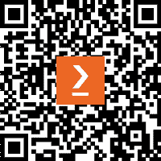

# 前言

机器学习，从本质上讲，描述的是将数据转化为可操作智能的算法。这一事实使得机器学习非常适合当今的大数据时代。没有机器学习，我们几乎无法理解现在围绕我们的海量信息流。

被称为 R 的跨平台、零成本的统计编程环境提供了一个理想的途径来开始应用机器学习。R 提供了强大且易于学习的工具，可以帮助你在自己的数据中找到洞察。

通过结合实际案例研究和理解这些算法如何工作的必要理论，本书提供了你开始机器学习并将其方法应用于自己项目的所有知识。

# 本书面向的对象

本书旨在面向应用领域的人士——如商业分析师、社会科学家等，他们可以访问数据并希望将其用于实际行动。也许你已经对机器学习有所了解，但从未使用过 R；或者，也许你对 R 有所了解，但对机器学习却是新手。也许你对两者都一无所知！无论如何，这本书将让你迅速上手。对基本数学和编程概念有一定的了解会有所帮助，但不需要任何先前的经验。你所需要的只是好奇心。

# 本书涵盖的内容

*第一章*，*介绍机器学习*，介绍了定义和区分机器学习者的术语和概念，以及将学习任务与适当的算法匹配的方法。

*第二章*，*管理和理解数据*，提供了一个机会，让你在 R 中动手处理数据。讨论了用于加载数据、探索和理解数据的基本数据结构和程序。

*第三章*，*懒惰学习 – 使用最近邻进行分类*，教你如何理解和应用一个简单但强大的机器学习算法到你的第一个真实世界任务：识别癌症的恶性样本。

*第四章*，*概率学习 – 使用朴素贝叶斯进行分类*，揭示了在尖端垃圾邮件过滤系统中使用的概率的基本概念。在构建自己的垃圾邮件过滤器过程中，你将学习文本挖掘的基础知识。

*第五章*，*分而治之 – 使用决策树和规则进行分类*，探讨了几个预测不仅准确，而且易于解释的学习算法。我们将将这些方法应用于需要透明度的重要任务中。

*第六章*，*预测数值数据 – 回归方法*，介绍了用于进行数值预测的机器学习算法。由于这些技术深深植根于统计学领域，你还将学习理解数值关系所需的基本指标。

*第七章*，*黑盒方法 – 神经网络和支持向量机*，涵盖了两个复杂但强大的机器学习算法。尽管数学可能看起来令人畏惧，但我们将通过简单术语说明其内部工作的示例。

*第八章*，*寻找模式 – 使用关联规则进行市场篮子分析*，揭示了众多零售商使用的推荐系统中使用的算法。如果你曾好奇零售商似乎比你更了解你的购买习惯，这一章将揭示他们的秘密。

*第九章*，*寻找数据组 – 使用 k-means 进行聚类*，致力于一种定位相关项目聚类的程序。我们将利用此算法来识别在线社区内的个人资料。

*第十章*，*评估模型性能*，提供了衡量机器学习项目成功和获得对未来数据学习者性能的可靠估计的信息。

*第十一章*，*在机器学习中取得成功*，描述了从教科书数据集过渡到现实世界机器学习问题时面临的常见陷阱，以及对抗这些问题的工具、策略和软技能。

*第十二章*，*高级数据准备*，介绍了“tidyverse”包集，这些包有助于整理大型数据集以提取有意义的信息，从而辅助机器学习过程。

*第十三章*，*挑战性数据 – 过多、过少、过于复杂*，考虑了解决在大量数据集中丢失有用信息时可能破坏机器学习项目的常见问题，就像在干草堆里找针一样。

*第十四章*，*打造更好的学习者*，揭示了机器学习竞赛排行榜上顶尖团队所采用的方法。如果你有竞争心，或者只是想充分利用你的数据，你需要将这些技巧添加到你的技能库中。

*第十五章*，*利用大数据*，探讨了机器学习的边界。从处理极大型数据集到使 R 运行更快，涵盖的主题将帮助你推动 R 所能实现的可能性的边界，甚至允许你利用像 Google 这样的大型组织开发的复杂工具，用于图像识别和理解文本数据。

# 你需要这本书的

本书中的示例在 Microsoft Windows、Mac OS X 和 Linux 上的 R 版本 4.2.2 上进行了测试，尽管它们可能适用于任何较新的 R 版本。R 可以在[`cran.r-project.org/`](https://cran.r-project.org/)免费下载。

RStudio 界面，在*第一章* *介绍机器学习*中详细描述，是 R 的一个高度推荐的附加组件，它极大地增强了用户体验。RStudio 开源版可以从 Posit 免费获得([`www.posit.co/`](https://www.posit.co/))，同时还有一个付费的 RStudio Pro 版，为商业组织提供优先支持和额外功能。

## 下载示例代码文件

书籍的代码包也托管在 GitHub 上，网址为[`github.com/PacktPublishing/Machine-Learning-with-R-Fourth-Edition`](https://github.com/PacktPublishing/Machine-Learning-with-R-Fourth-Edition)。我们还有其他来自我们丰富图书和视频目录的代码包，可在[`github.com/PacktPublishing/`](https://github.com/PacktPublishing/)找到。查看它们吧！

## 下载彩色图像

我们还提供了一个包含本书中使用的截图/图表彩色图像的 PDF 文件。您可以从这里下载：[`packt.link/TZ7os`](https://packt.link/TZ7os)。

## 使用的约定

文本中的代码：函数名称、文件名、文件扩展名和 R 包名称如下所示：“`class`包中的`knn()`函数提供了一个标准、经典的 k-NN 算法实现。”

R 用户输入和输出如下所示：

```py
> reg(y = launch$distress_ct, x = launch[2:4]) 
```

```py
 estimate
Intercept             3.527093383
temperature          -0.051385940
field_check_pressure  0.001757009
flight_num            0.014292843 
```

新术语和重要词汇以**粗体**显示。屏幕上看到的单词，例如在菜单或对话框中，在文本中如下所示：“在 RStudio 中，可以使用**文件**菜单创建新文件，选择**新建文件**，然后选择**R 笔记本**选项。”

对额外资源或背景信息的引用看起来是这样的。

有用的提示和重要的注意事项看起来是这样的。

# 联系我们

我们始终欢迎读者的反馈。

**一般反馈**: 请通过`feedback@packtpub.com`发送电子邮件，并在邮件主题中提及书籍的标题。如果你对这本书的任何方面有疑问，请通过`questions@packtpub.com`发送电子邮件给我们。

**勘误**: 尽管我们已经尽一切努力确保内容的准确性，但错误仍然可能发生。如果你在这本书中发现了错误，我们将不胜感激，如果你能向我们报告这一点。请访问[`www.packtpub.com/submit-errata`](http://www.packtpub.com/submit-errata)，选择你的书籍，点击勘误提交表单链接，并输入详细信息。

**盗版**: 如果你在互联网上以任何形式遇到我们作品的非法副本，如果你能提供位置地址或网站名称，我们将不胜感激。请通过`copyright@packtpub.com`与我们联系，并提供材料的链接。

**如果你有兴趣成为作者**: 如果你有一个你擅长的主题，并且你对撰写或为书籍做出贡献感兴趣，请访问[`authors.packtpub.com`](http://authors.packtpub.com)。

# 分享你的想法

一旦您阅读了《使用 R 进行机器学习 - 第四版》，我们非常乐意听到您的想法！请[点击此处直接转到此书的亚马逊评论页面](https://packt.link/r/1-801-07132-2)并分享您的反馈。

您的评论对我们和科技社区非常重要，并将帮助我们确保我们提供高质量的内容。

# 下载此书的免费 PDF 副本

感谢您购买此书！

您喜欢随时随地阅读，但无法携带您的印刷书籍到任何地方吗？您的电子书购买是否与您选择的设备不兼容？

别担心，现在购买每一本 Packt 书籍，您都可以免费获得该书的 DRM 免费 PDF 版本。

在任何地方、任何地点、任何设备上阅读。直接从您最喜欢的技术书籍中搜索、复制和粘贴代码到您的应用程序中。

优惠远不止于此，您还可以获得独家折扣、新闻通讯以及每天收件箱中的优质免费内容。

按照以下简单步骤获取这些好处：

1.  扫描二维码或访问以下链接



[`packt.link/free-ebook/978-1-80107-132-1`](https://packt.link/free-ebook/978-1-80107-132-1)

1.  提交您的购买证明

1.  就这样！我们将直接将您的免费 PDF 和其他优惠发送到您的电子邮件。
