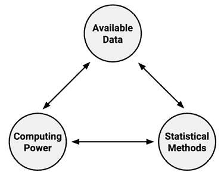
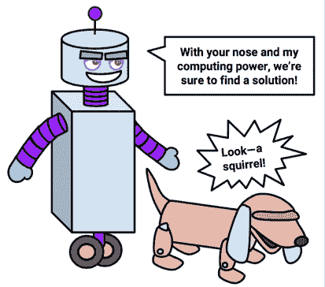
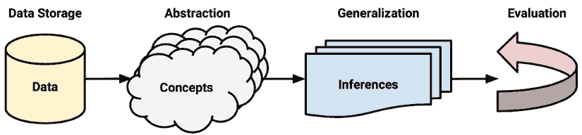
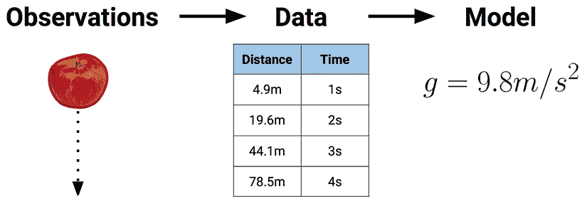
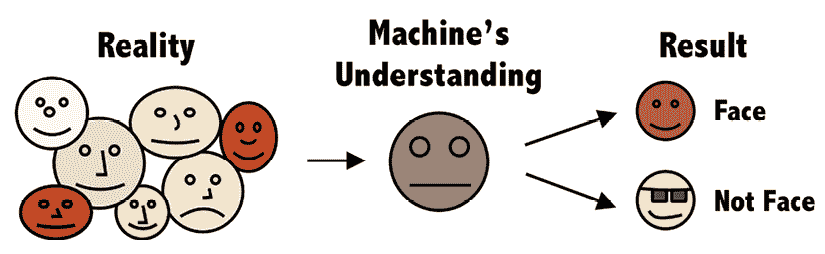
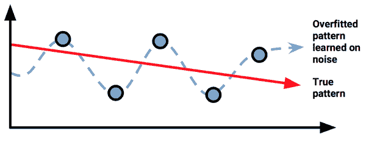
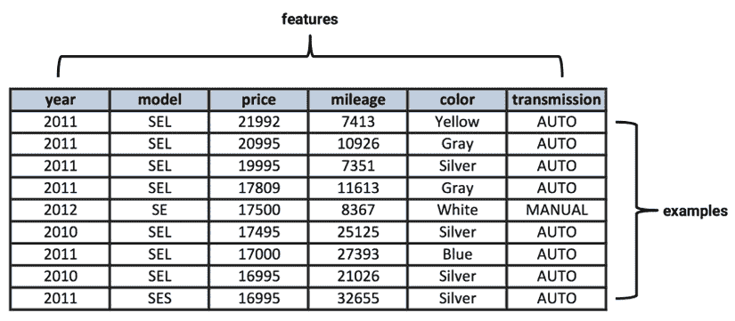
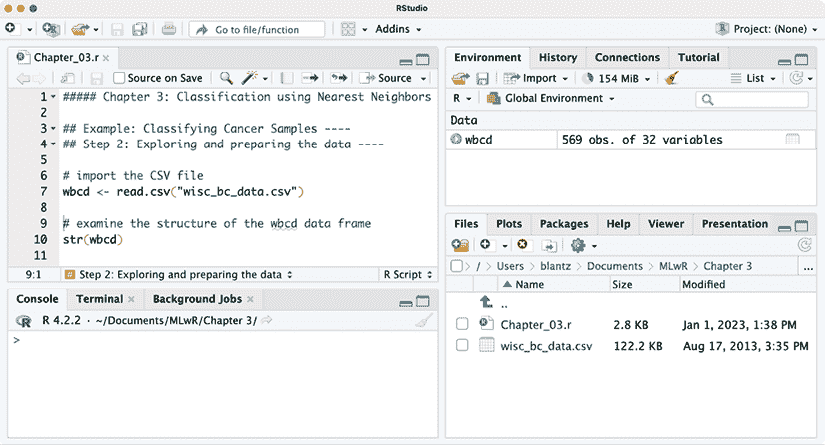

# 1

# 介绍机器学习

如果相信科幻故事，人工智能的发明不可避免地会导致机器与其创造者之间的末日战争。故事从今天的现实开始：计算机被训练来玩简单的游戏，如井字棋，以及自动化常规任务。随着故事的发展，机器后来被赋予了控制交通灯和通信的权利，接着是军事无人机和导弹。一旦计算机变得有意识并学会如何自我教学，机器的进化就会变得不祥。不再需要人类程序员，人类随后就被“删除”了。

幸运的是，在写作的时候，机器仍然需要用户输入。

虽然你对机器学习的印象可能被这些大众媒体的描绘所影响，但今天的算法几乎没有成为自我意识的危险。今天机器学习的目标不是创造一个人工大脑，而是帮助我们理解并行动于世界快速积累的数据存储。

放弃流行的错误观念，到本章结束时，你将获得对机器学习的更深入理解。你还将了解到定义和区分最常见机器学习方法的根本概念。你将学习：

+   机器学习的起源、应用、伦理和陷阱

+   计算机如何将数据转化为知识和行动

+   将机器学习算法与您的数据匹配所需的步骤

机器学习领域提供了一套算法，可以将数据转化为可操作的知识。继续阅读，看看使用 R 语言开始将机器学习应用于现实世界问题有多简单。

# 机器学习的起源

从出生开始，我们就被数据淹没。我们身体的传感器——眼睛、耳朵、鼻子、舌头和神经——不断地被原始数据所攻击，我们的大脑将这些数据转化为视觉、声音、气味、味道和触感。使用语言，我们可以与他人分享这些经历。

自有文字以来，人类就记录了自己的观察。猎人监控动物群体的移动；早期的天文学家记录了行星和星星的对齐；城市记录了税收、出生和死亡。今天，这样的观察以及许多其他观察越来越多地自动化，并系统地记录在日益增长的计算机化数据库中。

电子传感器的发明还进一步促进了记录数据的数量和丰富性的爆炸式增长。专门的传感器，如摄像头、麦克风、化学鼻、电子舌头和压力传感器模仿了人类看、听、闻、尝和感觉的能力。这些传感器处理数据的方式与人类大不相同。与人类有限的、主观的注意力不同，电子传感器从不休息，也没有情感来扭曲其感知。

尽管传感器不受主观性的影响，但它们并不一定报告现实的一个单一、确定的描述。一些由于硬件限制而固有测量误差。其他则受其范围的限制。黑白照片对其主题的描述与彩色照片不同。同样，显微镜提供的现实描述与望远镜提供的截然不同。

在数据库和传感器之间，我们生活的许多方面都被记录下来。政府、企业和个人都在记录和报告信息，从宏大到日常琐事。气象传感器获取温度和压力数据；监控摄像头监视人行道和地铁隧道；各种电子行为都被监控：交易、通讯、社交媒体关系，以及其他许多方面。

这场数据洪流导致一些人声称我们已进入**大数据时代**，但这可能有点名不副实。人类一直被大量数据所包围——只需抬头看看天空，尝试数数星星，就会发现几乎无限的供应。当前时代独特之处在于，我们有大量的**记录**数据，其中大部分可以直接由计算机访问。更大、更有趣的数据集越来越容易获取，只需轻轻一点鼠标，通过网络搜索即可。这种信息财富有可能在系统地理解所有这些信息后，指导行动。

专注于开发将数据转化为智能行动的计算机算法的研究领域被称为**机器学习**。这个领域起源于一个环境，其中可用的数据、统计方法和计算能力迅速且同时发展。数据量的增长需要额外的计算能力，这反过来又推动了分析大数据集的统计方法的发展。这创造了一个进步的周期，使得更大、更有趣的数据可以被收集，并使得今天的环境中，几乎任何主题都可以获取到无尽的数据流。



图 1.1：推动机器学习的进步周期

与机器学习密切相关的一个领域是**数据挖掘**，它关注于从大型数据库中生成新的见解。正如其名称所暗示的，数据挖掘涉及系统地寻找可操作的智能金块。尽管对于机器学习和数据挖掘重叠的程度存在一些争议，但一个区别点是，机器学习专注于教会计算机如何使用数据来解决问题，而数据挖掘则专注于教会计算机识别人类随后用于解决问题的模式。

几乎所有数据挖掘都涉及到机器学习的使用，但并非所有的机器学习都需要数据挖掘。例如，你可能会应用机器学习来挖掘与事故率相关的汽车交通数据模式。另一方面，如果计算机正在学习如何识别交通标志，这纯粹是机器学习，而不涉及数据挖掘。

“数据挖掘”这个短语有时也被用作贬义词，用来描述为了支持一个理论而挑选数据的欺骗性做法。

机器学习也与人工智能领域（**AI**）交织在一起，这是一个模糊的学科，根据你询问的人不同，它可能仅仅是带有强烈营销色彩的学习，或者是一个完全不同的研究领域。一个愤世嫉俗者可能会建议人工智能领域倾向于夸大其重要性，例如将一个简单的预测模型称为“AI 机器人”，而一个 AI 支持者可能会指出该领域倾向于解决最具挑战性的学习任务，同时追求达到人类水平的表现。事实可能介于两者之间。

正如机器学习本身依赖于统计方法一样，人工智能在很大程度上依赖于机器学习，但商业背景和应用往往有所不同。下表突出了传统统计学、机器学习和人工智能之间的不同之处；然而，请记住，这三个学科之间的界限往往不如它们看起来那么严格。

|  | **传统统计学** | **机器学习** | **人工智能** |
| --- | --- | --- | --- |
| **应用** | 假设检验和洞察 | 预测和知识生成 | 自动化 |
| **成功标准** | 更深入的理解 | 在事情发生前进行干预的能力 | 效率和成本节约 |
| **成功指标** | 统计显著性 | 预测的可信度 | 投资回报率 (ROI) |
| **输入数据量** | 小数据 | 中等数据 | 大数据 |
| **实施** | 知识共享的报告和演示 | 评分数据库或商业实践中的干预 | 定制应用程序和自动化流程 |

在这个公式中，机器学习稳固地位于人类与计算机合作的交汇点，而传统统计学主要依赖人类来驱动洞察力，人工智能则尽可能减少人类参与。学习如何最大化人机合作，并将学习算法应用于现实世界问题是本书的重点。理解机器学习的用例和限制是这个旅程的重要起点。

# 机器学习的使用与滥用

大多数人都听说过 Deep Blue，这是一台下棋的电脑，它在 1997 年首次击败了世界冠军。另一台著名的电脑 Watson 在 2011 年击败了电视智力游戏节目《Jeopardy》中的两位人类对手。基于这些令人瞩目的成就，有些人推测计算机智能将取代信息技术职业中的工人，就像汽车取代了马，机器取代了田野和生产线上的工人一样。最近，随着基于人工智能的算法，如来自 OpenAI 研究小组的 GPT-3 和 DALL·E 2（[`openai.com/`](https://openai.com/)）达到了令人印象深刻的里程碑，并证明计算机能够写出几乎与人类产生的文本和创造艺术品无差别的文本。最终，这可能导致营销、客户支持、插图等职业发生巨大变化，因为创造力被外包给了能够以比前员工更便宜的价格生产无限材料机器。

在这种情况下，人类可能仍然是必要的，因为事实是，尽管机器达到了如此令人印象深刻的里程碑，但它们在彻底理解问题或理解工作如何应用于现实世界目标的能力上仍然相对有限。学习算法没有方向就是纯粹的知识力量。一台电脑可能在发现大型数据库中的微妙模式方面比人类更有能力，但它仍然需要人类来激发分析并使结果转化为有意义的行动。在大多数情况下，人类将决定机器的输出是否有价值，并帮助机器避免创造出无限的无用之物。

在完全不考虑 Deep Blue 和 Watson 的成就之前，重要的是要注意，它们甚至都不如一个典型的五岁儿童聪明。关于为什么“比较智能是一个滑稽的业务”的更多内容，请参阅《大众科学》杂志的 FYI 文章，威尔·格鲁内沃尔德撰写的《哪个电脑更聪明，Watson 还是 Deep Blue？》，2012 年：[`www.popsci.com/science/article/2012-12/fyi-which-computer-smarter-watson-or-deep-blue`](https://www.popsci.com/science/article/2012-12/fyi-which-computer-smarter-watson-or-deep-blue)。

机器不擅长提问，甚至不知道该问什么问题。只要问题是以计算机能够理解的方式提出的，它们在回答问题方面就表现得更好。当今的机器学习算法与人类的合作方式类似于猎犬与其训练师的合作：猎犬的嗅觉可能比其主人强许多倍，但如果没有得到仔细的指导，猎犬可能会最终追逐自己的尾巴。



图 1.2：机器学习算法是强大的工具，需要谨慎的指导

在最坏的情况下，如果机器学习被粗心大意地实施，可能会导致有争议的技术亿万富翁埃隆·马斯克挑衅性地称之为“召唤恶魔”的情况。这种观点表明，我们可能正在释放我们无法控制的力量，尽管我们有自大的感觉，认为在需要时我们能够控制它们。鉴于人工智能自动化流程和快速、客观地应对变化条件的能力，可能有一天潘多拉的盒子已经被打开，我们难以或无法回到人类掌控的旧生活方式。正如马斯克所描述的：

> “如果人工智能有一个目标，而人类恰好挡了路，它将毫不犹豫地毁灭人类，甚至不会考虑这一点。没有恶意……就像我们正在修建一条道路，而一只蚂蚁窝恰好挡了路，我们并不恨蚂蚁，我们只是在修建道路，所以，再见，蚂蚁窝。”

虽然这看起来可能是一种悲观的表现，但它仍然是遥远未来的科幻领域，正如你将在阅读关于当今最先进的机器学习成功案例时很快就会了解到的那样。

然而，马斯克的警告确实有助于强调理解机器学习和人工智能可能成为双刃剑的重要性。尽管它有诸多益处，但仍有一些地方需要改进，有些情况下它可能弊大于利。如果机器学习从业者不能被信任以道德行事，政府可能需要介入以防止对社会造成最大的伤害。

关于马斯克对“召唤恶魔”的恐惧，请参阅以下 2018 年 CNBC 的文章：[`www.cnbc.com/2018/04/06/elon-musk-warns-ai-could-create-immortal-dictator-in-documentary.html`](https://www.cnbc.com/2018/04/06/elon-musk-warns-ai-could-create-immortal-dictator-in-documentary.html)。

## 机器学习成功案例

机器学习最成功的时候是当它增强某个领域专家的专业知识，而不是完全取代专家。它与在癌症治疗前沿的医生合作；帮助工程师创造更智能的家庭和汽车；帮助社会科学家和经济学家构建更好的社会；并为商业和市场营销专业人士提供有价值的见解。为了这些目标，它在无数的实验室、医院、公司和政府机构中得到应用。任何生成或聚合数据的努力都可能至少使用一种机器学习算法来帮助理解这些数据。

尽管无法列出机器学习的每一个成功应用，以下是一些突出的例子：

+   在电子邮件中识别不受欢迎的垃圾邮件

+   针对广告的目标客户行为细分

+   天气和长期气候变化的预测

+   对可能流失（停止购买）的客户进行预防性干预

+   减少欺诈信用卡交易

+   飓风和自然灾害造成的财务损失精算估计

+   预测和影响选举结果

+   开发用于无人机自动驾驶和自动驾驶汽车的算法

+   优化家庭和办公建筑中的能源使用

+   预测犯罪活动最可能发生的区域

+   发现对精准医学有用的遗传序列

在这本书的结尾，你将了解用于教会计算机执行这些任务的基本机器学习算法。现在，只需说无论在什么情况下，基本的机器学习过程都是相同的。在每一项任务中，算法都会处理数据并识别出形成进一步行动基础的模式。

## 机器学习的局限性

尽管机器学习被广泛使用并且具有巨大的潜力，但了解其局限性很重要。今天使用的算法——甚至那些处于人工智能前沿的算法——模仿的是人类大脑能力的一个相对有限的子集。它们在严格参数之外进行外推的能力有限，而且不知道常识。考虑到这一点，在将算法释放到现实世界之前，应该非常小心地识别算法到底学到了什么。

没有过去一生的经验作为基础，计算机在做出关于逻辑下一步简单推断的能力有限。考虑一下网站上的横幅广告，这些广告是根据挖掘数百万用户浏览历史学习到的模式提供的。根据这些数据，查看销售床垫的网站的人对购买床垫感兴趣，因此应该看到床垫的广告。问题是，这变成了一个永无止境的循环，即使床垫已经购买，还会显示额外的床垫广告，而不是枕头和床单的广告。

许多人熟悉机器学习在理解或翻译语言、识别语音和手写方面的不足。或许这种类型失败的最早例子出现在 1994 年电视节目《辛普森一家》的一集中，该集展示了苹果 Newton 平板电脑的讽刺模仿。在当时，Newton 因其最先进的笔迹识别技术而闻名。不幸的是，对于苹果来说，它偶尔会以极大的效果失败。电视集通过一系列场景来展示这一点，其中一个小霸王给“打倒马丁”的便条被 Newton 误解释为“吃掉玛莎”。


图 1.3：《辛普森一家，丽莎在冰上，20 世纪福克斯》（1994）屏幕截图

自从苹果 Newton 以来，机器语言处理已经改进了很多，以至于谷歌、苹果和微软都对其提供语音激活的虚拟礼宾服务的能力充满信心，例如谷歌助手、Siri 和 Cortana。尽管如此，这些服务通常难以回答相对简单的问题。此外，在线翻译服务有时会误解一个幼儿都能轻易理解的句子，而许多设备上的预测文本功能导致了幽默的“自动更正失败”网站，这些网站展示了计算机理解基本语言的能力，但完全误解了上下文。

一些错误是可以预见的。语言很复杂，有多个文本层次和隐含意义，即使是人类有时也会误解上下文。尽管机器学习在语言处理方面正在迅速改进，并且与上一代相比，当前最先进的算法如 GPT-3 相当出色，但机器仍然会犯人类一眼就能看出的错误。这些可预测的不足说明了这样一个重要的事实：机器学习的好坏取决于它所学习的数据。如果输入数据中的上下文不是明确的，那么就像人类一样，计算机将不得不从它过去的一套经验中做出最好的猜测。然而，计算机的过去经验通常比人类的要有限得多。

## 机器学习伦理

在其核心，机器学习仅仅是一个帮助我们理解世界复杂数据的工具。像任何工具一样，它可以被用于善或恶。机器学习出错大多是因为它被广泛或粗心地应用，以至于人类被视为实验室老鼠、自动机或无意识的消费者。一个看似无害的过程，当由无情的计算机自动化时，可能会导致意想不到的后果。因此，使用机器学习或数据挖掘的人如果不至少简要考虑这一技术的伦理影响，就会犯错误。

由于机器学习作为一个学科相对较年轻，且其发展速度非常快，相关的法律问题和社交规范往往相当不确定，并且不断变化。在获取或分析数据时应该谨慎行事，以避免违法、违反服务条款或数据使用协议，或者滥用信任或侵犯顾客或公众的隐私。谷歌这家可能收集比任何其他组织更多个人数据的公司，曾经有一句非正式的企业座右铭是：“不要做坏事。”虽然这似乎足够明确，但可能还不够。更好的方法可能是遵循*希波克拉底誓言*，这是一项医学原则，声明“首先，不要造成伤害”。遵循“不造成伤害”的原则可能有助于避免 Facebook 和其他公司最近的丑闻，例如剑桥分析公司的争议，该争议声称社交媒体数据被用于操纵选举。

零售商通常使用机器学习进行广告、定向促销、库存管理或商店商品布局。许多零售商在结账通道配备了根据顾客购买历史打印促销优惠券的设备。顾客为了换取一些个人数据，可以享受他们想要购买的具体产品的折扣。起初，这可能看起来相对无害，但考虑一下当这种做法更进一步时会发生什么。

一则可能被误传的故事涉及美国一家大型零售商，该零售商使用机器学习来识别即将成为母亲的顾客以便发送优惠券。零售商希望，如果这些准妈妈们收到大幅折扣，她们将成为忠诚的客户，并在以后购买利润丰厚的商品，如尿布、婴儿配方奶粉和玩具。借助机器学习方法，零售商识别出顾客购买历史中可用于高度预测女性是否怀孕以及宝宝预产期的大致时间的商品。

在零售商使用这些数据进行促销邮件发送后，一位愤怒的男士联系了该连锁店，要求知道为什么他的年轻女儿收到了孕妇用品的优惠券。他非常愤怒，因为零售商似乎在鼓励少女怀孕！据故事所说，当零售连锁店打电话表示道歉时，最终是那位父亲在质问女儿并发现她确实怀孕后道歉的！

关于零售商如何使用机器学习来识别怀孕的更多细节，请参阅查尔斯·杜希格 2012 年撰写的《纽约时报杂志》文章《公司如何了解你的秘密》：[`www.nytimes.com/2012/02/19/magazine/shopping-habits.html`](https://www.nytimes.com/2012/02/19/magazine/shopping-habits.html)。

无论这个故事是否完全真实，从前面故事中学到的教训是，在盲目应用机器学习分析的结果之前，应该先应用常识。这在涉及敏感信息，如健康数据的情况下尤其如此。如果零售商稍微多加小心，本可以预见这种情景，并在选择如何揭示其机器学习分析发现的怀孕状态时更加谨慎。不幸的是，正如历史往往会重演一样，社交媒体公司最近因针对怀孕的母亲投放婴儿产品广告而受到批评，即使这些母亲经历了流产的悲剧。

由于机器学习算法是用历史数据开发的，计算机可能会学会一些人类社会的不幸行为。遗憾的是，这有时包括持续种族或性别歧视和强化负面刻板印象。例如，研究人员发现，谷歌的在线广告服务更有可能向男性展示高薪工作的广告，而不是女性，更有可能向黑人展示犯罪背景调查的广告，而不是白人。尽管机器可能正确地学会了男性曾经担任的工作通常不向大多数女性提供，但让算法持续这种不公正是不理想的。相反，可能有必要教会机器反映的不是社会当前的样子，而是它应该成为的样子。

有时，那些旨在“内容中立”的专门设计的算法最终却反映了不受欢迎的信念或意识形态。在一个令人震惊的案例中，微软开发的一个 Twitter 聊天机器人服务在开始传播纳粹和反女权主义宣传后，很快就被关闭了，这些宣传可能来自所谓的“网络暴民”在互联网论坛和聊天室中发布的煽动性内容。在另一个案例中，一个旨在反映人类美的客观概念的算法在它几乎只偏向白人时引发了争议。想象一下，如果这种情况被应用于犯罪活动的面部识别软件，会有什么后果！

有关机器学习和歧视的实际情况，请参阅 2019 年迈克尔·李在《哈佛商业评论》上发表的文章《解决算法中的偏见》：[`hbr.org/2019/05/addressing-the-biases-plaguing-algorithms`](https://hbr.org/2019/05/addressing-the-biases-plaguing-algorithms)。

为了限制算法非法歧视的能力，某些司法管辖区有良好的意图的法律，禁止出于商业原因使用种族、民族、宗教或其他受保护类别数据。然而，排除这些数据可能不足以解决问题，因为机器学习算法仍然可能无意中学会歧视。如果某些人群倾向于居住在某个地区，购买某种产品或以其他方式以独特的方式识别他们作为一个群体，机器学习算法可以从其他因素中推断出受保护的信息。在这种情况下，您可能需要通过排除任何可能识别的数据来*完全*去识别这些人，除了已经受保护的状态之外。

在最近的一个此类所谓算法偏见案例中，2019 年推出的苹果信用卡几乎立即被指控为向男性提供的信用额度显著高于女性——有时高达 10 到 20 倍，即使对于有共同资产和相似信用记录的配偶也是如此。尽管苹果和发行银行高盛否认存在性别偏见，并确认算法中没有使用受法律保护的申请人特征，但这并没有减缓人们对于可能无意中渗入了一些偏见的猜测。由于竞争原因，苹果和高盛选择保密算法的细节，这导致人们做出了最坏的假设。如果系统性的偏见指控是不真实的，能够解释真正发生的事情以及决策的确切方式可能会减轻大部分的愤怒。如果苹果和高盛因算法的复杂性而受到调查却无法向监管机构解释结果，那么可能出现的最坏情况就是如此！

苹果信用卡的丑闻在 2019 年 BBC 的一篇文章中有描述，标题为*美国监管机构调查苹果的“性别歧视”信用卡*：[`www.bbc.com/news/business-50365609`](https://www.bbc.com/news/business-50365609)。

除了法律后果之外，如果人们认为私密的个人生活被公之于众，他们可能会感到不舒服或变得沮丧。挑战在于人们对隐私的期望在不同的人和情境中是不同的。为了说明这一点，想象一下开车经过某人的房子，偶然瞥了一眼窗户。这不太可能冒犯大多数人。相比之下，从街对面用相机拍照可能会让大多数人感到不舒服；走到房子前，将脸贴在玻璃上窥视可能会让几乎每个人都感到愤怒。尽管这三个场景都可以说是使用了“公共”信息，但其中两个已经越过了大多数人会感到不舒服的界限。同样，在使用数据时，也有可能做得太过分，越过许多人认为至少是不考虑他人感受，最坏的情况下是令人毛骨悚然的界限。

正如计算硬件和统计方法开启了大数据时代一样，这些方法也开启了一个**后隐私时代**，在这个时代，我们生活中曾经私密的许多方面现在都是公开的，或者以一定的价格对公众开放。在大数据时代之前，通过观察公开信息，就有可能了解某人的很多情况。观察他们的来去可能揭示他们的职业或休闲活动，而快速查看他们的垃圾桶和回收箱可能揭示他们的饮食、饮料和阅读习惯。私人侦探通过一些专注的挖掘和观察，甚至可以了解更多信息。应用机器学习方法处理大数据集的公司本质上是在充当大规模的私人侦探，尽管他们声称正在处理匿名数据集，但许多人仍然认为这些公司在数字监控方面已经做得太过分了。

近年来，一些高调的 Web 应用经历了大量用户流失，这些用户在应用的服务条款协议变更或他们的数据被用于超出他们最初意图的目的时感到被利用。隐私期望因情境、年龄群体和地区而异，这增加了决定个人数据适当使用方式的复杂性。在开始你的项目之前，除了意识到越来越严格的法规，如欧盟的**通用数据保护条例**（**GDPR**）以及其后的必然政策，考虑你工作的文化影响也是明智的。

你可以使用数据达到特定目的的事实，并不总是意味着你应该这样做。

最后，值得注意的是，随着机器学习算法在我们日常生活中的重要性日益增加，恶意行为者利用它们的动机也更大。有时，攻击者只是想为了乐趣或名声而破坏算法——比如“谷歌炸弹”，这是一种众包方法，通过欺骗谷歌的算法将一个页面推到很高的排名。有时，影响更为显著。一个及时的例子是最近一波所谓的假新闻和选举干预，这是通过操纵针对人们个性的广告和推荐算法来传播的。为了避免将这样的控制权交给外部人士，在构建机器学习系统时，考虑它们可能受到一个坚定个人或群体的何种影响是至关重要的。

社交媒体学者 danah boyd（名字以小写形式呈现）在纽约市的 Strata 数据大会上发表了一次主题演讲，讨论了加强机器学习算法以抵御攻击者的重要性。若要回顾，请参阅[`points.datasociety.net/your-data-is-being-manipulated-a7e31a83577b`](https://points.datasociety.net/your-data-is-being-manipulated-a7e31a83577b)。

对机器学习算法的恶意攻击的后果也可能是致命的。研究人员已经表明，通过创建一个“对抗性攻击”，巧妙地扭曲一个带有精心选择的涂鸦的交通标志，攻击者可能会使自动驾驶汽车错误地解读停车标志，可能导致致命的事故。即使没有恶意，软件漏洞和人为错误也已经导致 Uber 和特斯拉的自动驾驶汽车技术发生了致命事故。考虑到这样的例子，机器学习从业者担心他们的算法在现实世界中的使用和滥用，这是极其重要和道德上的关注。

# 机器是如何学习的

机器学习的正式定义，归功于计算机科学家汤姆·M·米切尔，指出机器学习是指每当它利用其经验，使其在未来类似经验中的表现得到改善时，它就进行了学习。尽管这个定义在直觉上是有意义的，但它完全忽略了经验如何转化为未来行动的具体过程——当然，学习总是说起来容易做起来难！

人类大脑天生具有从出生就学习的条件，而计算机学习的必要条件必须由希望利用机器学习方法的程序员明确制定。因此，尽管理解学习理论的基础不是严格必要的，但拥有强大的理论基础有助于从业者理解、区分和实现机器学习算法。

当你将机器学习与人类学习联系起来时，你可能会以不同的方式审视自己的思维。

无论学习者是人还是机器，基本的学习过程都是相同的。它可以分为四个相互关联的组成部分：

+   **数据存储**利用观察、记忆和回忆来为进一步的推理提供事实基础。

+   **抽象**涉及将存储的数据转换为更广泛的表现和概念。

+   **泛化**使用抽象数据来创建知识，并在新的环境中驱动行动。

+   **评估**提供了一个反馈机制来衡量学习到的知识的效用，并告知潜在的改进。



图 1.4：学习过程中的四个步骤

虽然在这里将学习过程概念化为四个不同的组成部分，但它们只是为了说明目的而这样组织的。实际上，整个学习过程是密不可分的。在人类身上，这个过程是潜意识发生的。我们在心中回忆、演绎、归纳和直觉，因为这个过程是隐藏的，所以任何人与人之间的差异都被归因于一种模糊的主观性概念。相比之下，计算机使这些过程变得明确，因为整个过程是透明的，所以学习到的知识可以被检查、转移、用于未来的行动，并被视为一种数据“科学”。

**数据科学**这个流行词汇暗示了数据、机器以及引导学习过程的人之间的关系。这个术语在职位描述和学术学位项目中的日益普及反映了它作为一个研究领域的实现，这个领域既涉及统计和计算理论，也涉及使机器学习和其应用成为可能的技术基础设施。这个领域通常要求其从业者成为有说服力的讲故事者，在数据的使用上保持大胆，同时考虑到从数据中推断和预测的限制。因此，要成为一名强大的数据科学家，需要深入了解学习算法在商业应用中的工作原理，正如我们将在第十一章“利用机器学习取得成功”中更详细地讨论的那样。

## 数据存储

所有的学习都始于数据。人类和计算机一样，利用**数据存储**作为更高级推理的基础。在人类身上，这包括一个使用生物细胞网络中的电化学信号来存储和处理观察结果以供短期和长期回忆的大脑。计算机具有类似的短期和长期回忆能力，使用硬盘驱动器、闪存以及**随机存取存储器**（**RAM**）与**中央处理单元**（**CPU**）相结合。

这可能看起来很明显，但仅仅存储和检索数据的能力对于学习来说是不足够的。存储的数据在磁盘上仅仅是零和一。它是一系列记忆的集合，如果没有更广泛的环境，这些记忆是没有意义的。没有更高层次的理解，知识仅仅是回忆，局限于之前所见，而别无其他。

为了更好地理解这个想法的细微差别，可以思考一下你上次为艰难的考试做准备的情况，可能是大学的期末考试或职业认证考试。你是否希望拥有一种摄影般的记忆？如果是这样，你可能会对完美回忆不太有帮助而感到失望。即使你能够完美地记住材料，这种死记硬背的学习如果没有知道考试中会出现的确切问题和答案，也不会带来任何好处。否则，你需要记住可能被问到的问题的答案，而这个问题领域可能有无穷多个问题。显然，这是一种不可持续的战略。

相反，更好的方法是花时间有选择性地记忆相对较小的一组代表性想法，同时理解这些想法如何与不可预见的情况相关联和应用。这样，可以识别出重要的更广泛的模式，而不是记住每一个细节、细微差别和潜在的应用。

## 抽象

这种将存储数据赋予更广泛意义的工作发生在 **抽象** 过程中，在这个过程中，原始数据开始代表更广泛、更抽象的概念或想法。这种类型的连接，比如一个物体与其表示之间的连接，可以通过著名的雷内·马格利特画作 *图像的背叛* 来举例说明。


图 1.5：“这不是一根烟斗。”来源：http://collections.lacma.org/node/239578

这幅画描绘了一根烟斗，标题为 *Ceci n’est pas une pipe* （“这不是一根烟斗”）。马格利特想要说明的是，对烟斗的描绘并不真正是一根烟斗。尽管烟斗不是真实的，但任何观看这幅画的人都能轻易地认出它是一根烟斗。这表明观察者可以将烟斗的 *画面* 与烟斗的 *概念* 相连接，与可以握在手里的 *物理* 烟斗的记忆相连接。这种抽象的连接是 **知识表示** 的基础，即形成逻辑结构以帮助将原始感官信息转化为有意义的洞察。

将这一概念完整地呈现出来，知识表示是使基于人工智能的工具如 Midjourney ([`www.midjourney.com`](https://www.midjourney.com)) 能够在虚拟中模仿雷内·马格利特风格作画的基础。以下图像完全由人工智能根据算法对“机器人”、“管道”和“吸烟”等概念的理解生成。如果他今天还活着，马格利特本人可能会觉得他的超现实主义作品，挑战了人类对现实和图像与思想之间联系的认识，现在被纳入了计算机的头脑中，并以一种迂回的方式将机器的思想和图像与现实联系起来。机器通过观察马格利特艺术作品中的管道图像，部分地学习了什么是管道。


图 1.6：“我是管道吗？”由 Midjourney AI 根据提示“以雷内·马格利特风格画一个吸烟的机器人”创建的图像

为了在算法中具体化知识表示的过程，计算机使用**模型**来总结存储的原始数据，这是一个对数据中模式的具体描述。就像马格利特的管道一样，模型表示超越了原始数据本身。它代表了一个比其各部分总和更大的想法。

有许多不同类型的模型。你可能已经熟悉其中的一些。例如包括：

+   数学方程式

+   关系图，例如树和图

+   逻辑 if/else 规则

+   被称为聚类的数据分组

模型的选择通常不会留给机器。相反，学习任务和手头的数据类型决定了模型的选择。在本章的后面部分，我们将更详细地讨论选择适当模型类型的方法。

将模型拟合到数据集的过程被称为**训练**。当模型经过训练后，数据已经被转换成一种抽象形式，总结了原始信息。这一步骤被称为“训练”而不是“学习”，揭示了该过程的一些有趣方面。首先，请注意，学习过程并不以数据抽象结束——学习者必须仍然进行泛化和评估其训练。其次，“训练”这个词更好地暗示了人类教师训练机器学生使用数据达到特定目的的事实。

训练与学习的区别微妙但很重要。计算机不会“学习”一个模型，因为这会意味着存在一个单一的、正确的模型需要学习。当然，计算机必须从数据中学习某些信息以完成其训练，但它有选择如何或具体学习什么的自由。当使用给定的数据集训练学习者时，每个学习者都会找到自己的方法来建模数据并识别对给定任务有用的模式。

重要的是要注意，一个学习到的模型本身并不提供新的数据，但它确实产生了新的知识。这怎么可能呢？答案是，将假设的结构强加于底层数据，可以洞察未见之处。它假设了一个新概念，描述了现有数据元素之间可能存在的关系。

以万有引力的发现为例。通过将方程拟合到观测数据，艾萨克·牛顿爵士推断出了万有引力的概念，但我们现在所知的万有引力始终存在。它只是直到牛顿将其表达为一个抽象概念，将某些数据与其它数据联系起来——具体来说，通过成为解释物体下落观测的模型中的 *g* 项——才被认识。物体在不同时间段内下落的距离可以通过一个简单的模型联系起来，该模型将恒定的重力作用力应用于物体每单位时间。



图 1.7：模型是解释观测数据的抽象

大多数模型不会导致数百年来动摇科学思想的理论的产生。然而，你的抽象可能会导致发现重要但之前未见过的数据中的模式和关系。在基因组数据上训练的模型可能会发现几个基因，当它们结合在一起时，是糖尿病发病的原因，银行可能会发现一种看似无害的交易类型，这种交易类型在欺诈活动之前系统性地出现，或者心理学家可能会确定一组表明新疾病的个性特征。这些潜在的模式始终存在，但通过以不同的格式呈现信息，新的想法被概念化。

## **泛化**

学习过程中的第三步是利用抽象知识进行未来的行动。然而，在抽象过程中可能识别出的无数潜在模式和建模这些模式的各种方式中，有些模式会比其他模式更有用。除非抽象的产生仅限于有用的集合，否则学习者将停留在起点，拥有大量信息但没有可操作的洞察力。

正式来说，**泛化**被定义为将抽象知识转化为可以用于未来对与学习者之前所见相似但又不完全相同任务进行行动的形式的过程。它相当于在整个模型集（即，理论或推断）中搜索，这些模型（即，理论或推断）*可能*在训练期间从数据中建立。如果你能想象一个假设的集合，包含数据可能被抽象化的所有可能方式，泛化涉及将这个集合缩减为一个更小、更易于管理的具有重要发现集合。

在泛化过程中，学习者被要求将其发现的模式限制在其未来任务中最相关的那些。通常，通过逐个检查模式并按未来价值进行排序来减少模式数量是不切实际的。相反，机器学习算法通常采用捷径，以更快地减少搜索空间。为此，算法将采用**启发式方法**，这是关于在哪里找到最有用推理的合理猜测。人类通常使用启发式方法来快速将经验推广到新场景。如果你曾经在没有完全评估你的情况下，利用你的直觉做出快速决定，那么你就是在直觉上使用心理启发式方法。

启发式方法利用近似和其他经验法则，这意味着它们不能保证找到数据最佳模型。然而，如果不采取这些捷径，在大型数据集中找到有用信息将是不切实际的。

人类做出快速决策的惊人能力往往不是依赖于计算机般的逻辑，而是依赖于情绪引导的启发式方法。有时，这可能导致不合理的结论。例如，更多的人表达了对航空旅行的恐惧，而不是汽车旅行，尽管从统计数据上看汽车更危险。这可以通过可用性启发式来解释，即人们倾向于通过例子可以多容易地回忆起来来估计事件的可能性。涉及航空旅行的意外事件被高度公开报道。作为创伤性事件，它们很容易被回忆起来，而汽车事故几乎不值得报纸提及。

错误应用启发式方法的愚蠢不仅限于人类。机器学习算法采用的启发式方法有时也会导致错误的结论。如果结论是*系统性地*错误的，则称算法具有**偏差**，这意味着它们以一致或可预测的方式错误。例如，假设一个机器学习算法通过找到代表眼睛的两个圆圈，位于表示嘴巴的直线之上来学习识别面部。该算法可能难以处理，或对不符合其模型的**面部**有偏见。戴眼镜、倾斜、侧视或具有特定肤色的人脸可能无法被算法检测到。同样，它可能对符合其世界理解的**其他肤色**、**面部形状**或特征有偏见。



图 1.8：将学习者的经验结果泛化的过程会导致偏差

在现代用法中，单词“偏见”已经带有相当负面的含义。各种形式的媒体经常声称自己没有偏见，并声称客观地报告事实，不受情感的影响。然而，考虑一下这种可能性：一点偏见可能是有用的。如果没有一点任意性，是否在几个具有不同优势和劣势的竞争选择之间做出决定会有些困难？事实上，心理学领域的研究表明，大脑中负责情感的部分受损的个体可能在决策上无效，可能会花费数小时争论简单的决定，比如穿什么颜色的衬衫或在哪里吃午餐。

令人 paradoxically，偏见正是让我们无法看到某些信息，同时又能让我们利用其他信息采取行动的原因。这就是机器学习算法在理解一组数据时，在无数种方式中选择的方法。

## 评估

偏见是与任何学习任务中固有的抽象和泛化过程相关的一个必要的邪恶。为了在无限的可能性面前驱动行动，所有学习都必须有偏见。因此，学习过程中的最后一步是评估其成功，并衡量学习者的表现，尽管存在偏见。在评估阶段获得的信息可以用来告知额外的训练，如果需要的话。

一旦你在一种机器学习技术上取得了成功，你可能会倾向于将其应用于每个任务。重要的是要抵制这种诱惑，因为没有任何机器学习方法适合所有情况。这一事实由 David Wolpert 在 1996 年提出的 **没有免费午餐** 定理所描述。基于流行的格言“没有免费的午餐”，该定理表明，每个决策都有成本或权衡——这是一个在机器学习之外也普遍适用的生活教训！更多信息，请访问：[`www.no-free-lunch.org`](http://www.no-free-lunch.org)。

通常，评估发生在模型在初始 **训练数据集** 上训练之后。然后，该模型在单独的 **测试数据集** 上进行评估，以判断其对训练数据的描述如何推广到新的、未见过的案例。值得注意的是，一个模型完美地推广到每个不可预见的情况是非常罕见的——错误几乎是不可避免的。

在一定程度上，模型无法完美推广的原因是由于 **噪声** 的问题，这是一个描述数据中未解释或无法解释的变动的术语。噪声数据是由看似随机的事件引起的，例如：

+   由于有时会从读数中添加或减去一小部分的不精确传感器导致的测量误差

+   与人类受试者相关的问题，例如调查受访者为了更快地完成调查而随机回答问题

+   数据质量问题，包括缺失、空值、截断、编码错误或损坏的值

+   那些复杂或理解程度较低的现象，它们以看似随机的方式影响数据

建模噪声是称为**过拟合**的问题的基础；因为大多数噪声数据按定义是无法解释的，试图解释噪声将导致无法很好地推广到新案例的模型。解释噪声的努力通常还会导致更复杂的模型，这些模型错过了学习者试图识别的真正模式。



图 1.9：建模噪声通常会导致模型更加复杂，并错过潜在的规律

在训练期间表现相对良好但在评估期间表现相对较差的模型被称为对训练数据集**过拟合**，因为它无法很好地推广到测试数据集。在实践中，这意味着它已经识别出数据中的模式，这些模式对未来的行动没有用；泛化过程失败了。解决过拟合问题的方法因机器学习方法而异。目前，重要的是要意识到这个问题。方法处理噪声数据并避免过拟合的能力是它们之间的重要区别点。

# 实践中的机器学习

到目前为止，我们一直关注机器学习在理论上的工作方式。为了将学习过程应用于现实世界的任务，我们将使用一个五步法。无论任务是什么，每个机器学习算法都使用以下一系列步骤：

1.  **数据收集**：数据收集步骤涉及收集算法将用于生成可操作知识的学习材料。在大多数情况下，数据需要合并成一个单一的资源，例如文本文件、电子表格或数据库。

1.  **数据探索和准备**：任何机器学习项目的质量在很大程度上取决于其输入数据的质量。因此，了解数据及其细微差别非常重要。数据准备包括修复或清理所谓的“杂乱”数据，消除不必要的数据，并将数据重新编码以符合学习者的预期输入。

1.  **模型训练**：在数据准备分析之前，你可能会对从数据中希望和能够学习到什么有一个感觉。所选择的特定机器学习任务将告知选择合适的算法，算法将以模型的形式表示数据。

1.  **模型评估**：每个机器学习模型都导致对学习问题的一个有偏的解决方案，这意味着评估算法从其经验中学习得如何非常重要。根据所使用的模型类型，您可能能够使用测试数据集评估模型的准确性，或者您可能需要开发针对预期应用的特定性能指标。

1.  **模型改进**：如果需要更好的性能，就需要利用更高级的策略来增强模型的表现。有时可能需要完全切换到另一种类型的模型。你可能需要补充数据或执行额外的准备工作，就像在这个过程中第 2 步所做的那样。

完成这些步骤后，如果模型看起来表现良好，它可以部署到预期的任务中。你可能可以利用你的模型为预测提供评分数据（可能是实时）；用于财务数据的预测；为营销或研究生成有用的见解；或自动化任务，如邮件投递或飞行飞机。部署的模型的成功与失败甚至可能为训练下一代学习器提供额外的数据。

## 输入数据类型

机器学习的实践涉及将输入数据的特征与现有学习算法的偏差相匹配。因此，在将机器学习应用于现实世界问题之前，了解区分输入数据集的术语非常重要。

术语**观察单位**用于描述研究感兴趣的最小实体，其具有可测量的属性。通常，观察单位以个人、物体或事物、交易、时间点、地理区域或测量的形式存在。有时，观察单位会组合成单位，如人年，表示在多年内跟踪同一人，每人年包含一个人一年的数据。

观察单位与**分析单位**相关，但并不相同，分析单位是从中得出推论的 smallest unit。尽管通常情况下观察单位和分析单位是相同的，但并不总是如此。例如，从人们（观察单位）观察到的数据可能用于分析跨国的趋势（分析单位）。

存储观察单位和其属性的数据库可以描述为以下集合：

+   **示例**：记录了属性的观察单位的实例

+   **特征**：记录的示例属性或特征，可能对学习有用

通过现实世界的场景最容易理解特征和示例。例如，为了构建一个用于识别垃圾邮件的学习算法，观察单位可以是电子邮件消息，示例可以是具体的单个消息，而特征可能包括消息中使用的单词。对于一个癌症检测算法，观察单位可以是患者，示例可能包括癌症患者的随机样本，特征可能包括活检细胞的基因组标记，以及患者的特征，如体重、身高或血压。

人和机器在处理输入数据中的复杂性的类型上有所不同。人类在消费**非结构化数据**，如自由形式的文本、图片或声音时感到舒适。他们也在处理某些观察具有大量特征，而其他观察则很少特征的情况时表现出灵活性。另一方面，计算机通常需要数据是**结构化**的，这意味着现象的每个例子都有完全相同的特征集，并且这些特征以计算机可以理解的形式组织。在大型非结构化数据集上使用机器的蛮力通常需要将输入数据转换为结构化形式。

下面的电子表格显示了以**矩阵格式**收集的数据。在矩阵数据中，每一行是一个例子，每一列是一个特征。在这里，行表示待售汽车的例子，而列记录汽车的特征，如价格、里程、颜色和变速类型。矩阵格式数据是机器学习中使用的最常见形式。正如你将在后面的章节中看到的，当在特定应用中遇到非结构化数据形式时，它们最终在机器学习之前被转换为结构化矩阵格式。



图 1.10：描述待售汽车的简单数据集矩阵格式

一个数据集的特征可能以各种形式出现。如果一个特征代表的是用数字测量的特性，那么它不出意外地被称为**数值型**。另一方面，如果一个特征由一系列类别组成，那么这个特征被称为**分类型**或**名义型**。一种特殊的分类型特征被称为**有序型**，它指定了一个具有有序列表中类别的名义型特征。有序型特征的一个例子是服装尺码，如小号、中号和大号；另一个例子是客户满意度的测量，从“完全不高兴”到“有点高兴”再到“非常高兴”。对于任何给定的数据集，思考特征代表什么，它们的类型和单位，将有助于确定适合学习任务的适当机器学习算法。

## 机器学习算法的类型

机器学习算法根据其目的被分为不同的类别。了解学习算法的类别是使用数据驱动所需行动的第一步。

**预测模型**用于涉及预测一个值（正如其名称所暗示的）使用数据集中的其他值的任务。学习算法试图发现并建模**目标**特征（被预测的特征）与其他特征之间的关系。尽管“预测”一词常用来暗示预测，但预测模型不一定必须预见未来的事件。例如，预测模型可以用来预测过去的事件，例如，使用母亲的当前激素水平预测婴儿的受孕日期。预测模型还可以在实时中用于控制高峰时段的交通信号灯。

由于预测模型被赋予了明确的指令，告诉它们需要学习什么以及如何学习，因此训练预测模型的过程被称为**监督学习**。这种监督并不涉及人类的参与，而是指目标值提供了一种让学习器知道它学习所需任务的程度的方法。更正式地说，给定一组数据，监督学习算法试图优化一个函数（模型），以找到最佳的特征值组合，从而在训练数据的所有行中产生目标输出。

经常使用的监督机器学习任务，预测一个例子属于哪个类别，被称为**分类**。很容易想到分类器的潜在用途。例如，你可以预测：

+   一封电子邮件是垃圾邮件

+   一个人患有癌症

+   一支足球队将赢或输

+   一个申请人将违约贷款

在分类中，要预测的目标特征被称为**类别**，它被分为称为**级别**的类别。一个类别可以有两个或更多级别，这些级别可能是有序的，也可能不是。分类在机器学习中应用如此广泛，以至于有各种类型的分类算法，它们具有针对不同类型输入数据的优势和劣势。我们将在本章后面和整本书的许多地方看到这些例子。分类的第一个实际应用出现在*第三章*，*懒惰学习 - 使用最近邻进行分类*，其他例子还出现在*第四章*，*概率学习 - 使用朴素贝叶斯进行分类*，以及*第五章*，*分而治之 - 使用决策树和规则进行分类*等。

监督学习器也可以用来预测数值数据，如收入、实验室值、考试成绩或物品计数。为了预测此类数值，一种常见的**数值预测**形式是将线性回归模型拟合到输入数据。尽管回归不是数值预测的唯一方法，但它是最广泛使用的方法。回归方法广泛用于预测，因为它们以精确的术语量化了输入和目标之间的关联，包括关系的幅度和不确定性。许多监督学习算法可以执行数值预测，但回归方法和数值预测在第六章*预测数值数据——回归方法*中有详细说明。

由于将数字转换为类别（例如，13 至 19 岁的年龄是青少年）和将类别转换为数字（例如，将所有男性分配为 1，所有女性分配为 0）很容易，因此分类模型和数值预测模型之间的边界并不一定明确。

**描述性模型**用于那些从以新颖有趣的方式总结数据中获益的任务。与预测模型预测感兴趣的目标不同，在描述性模型中，没有单个特征是特别感兴趣的。因为没有要学习的目标，训练描述性模型的过程被称为**无监督学习**。尽管思考描述性模型的应用可能更困难——毕竟，一个没有特定学习内容的学习者有什么用——但它们在数据挖掘中却被相当频繁地使用。

例如，被称为**模式发现**的描述性建模任务用于在数据中识别有用的关联。模式发现是**市场篮子分析**的目标，该分析应用于零售商的交易购买数据。在这里，零售商希望识别出经常一起购买的商品，以便所学习的信息可以用来改进营销策略。例如，如果零售商发现泳装和防晒霜通常同时购买，零售商可能会将商品重新定位在商店中更接近的位置，或者进行促销活动来“升级销售”相关商品给顾客。执行此类分析所需的方法包括在第八章*发现模式——使用关联规则进行市场篮子分析*中。

最初仅用于零售环境，模式发现现在正开始以相当创新的方式被使用。例如，它可以用来检测欺诈行为模式，筛选遗传缺陷，或识别犯罪活动热点。

将数据集划分为同质组的描述性建模任务被称为**聚类**。这有时用于**分割分析**，它识别具有相似行为或人口统计信息的个体群体，以便根据他们的共同特征对他们进行广告活动。使用这种方法，机器可以识别集群，但需要人工干预来解释它们。例如，给定一家杂货店的五个客户集群，营销团队需要了解这些群体之间的差异，以便创建最适合每个群体的促销活动。尽管需要人力，但这仍然比为每个客户创造独特吸引力的工作要少。这种类型的分割分析在*第九章*，*寻找数据群组 – 使用 k-means 聚类*中进行了演示。

无监督学习还可以用于辅助监督学习任务，在这些任务中，没有标记的数据不可用或获取成本高昂。一种称为**半监督学习**的方法结合少量标记数据和未监督学习分析来帮助分类未标记的记录，然后可以直接在监督学习模型中使用这些记录。例如，如果医生标记肿瘤样本为癌症或非癌症很昂贵，只有一小部分患者记录可能有这些标签。然而，在执行患者数据的未监督聚类后，可能的情况是已确认的癌症和非癌症患者主要属于不同的群体，因此未标记的记录可以继承其集群的标签。因此，可以在完整的数据集上构建预测模型，而不是在手动标记的小部分数据上。半监督学习的一个应用包括在*第九章*，*寻找数据群组 – 使用 k-means 聚类*中。

这种方法的更极端版本被称为**自监督学习**，它根本不需要任何手动标记的数据；相反，它采用两步法，其中复杂的模型首先尝试在记录中识别有意义的分组，第二个模型则尝试识别组之间的关键区别。这是一种相对较新的创新，主要用于处理大型、非结构化数据源，如音频、文本和图像数据。自监督学习的基本原理在*第七章*，*黑盒方法 – 神经网络和支持向量机*，以及*第十五章*，*利用大数据*中有所介绍。

最后，一类被称为**元学习器**的机器学习算法并不局限于特定的学习任务，而是专注于学习如何更有效地学习。元学习对于非常具有挑战性的问题或当预测算法的性能需要尽可能准确时非常有用。所有元学习算法都使用过去学习的成果来指导额外的学习。最常见的是，这包括学习如何协作工作的算法，称为**集成**。正如互补的技能和积累的经验是人类团队成功的重要因素一样，它们对于机器学习者同样有价值，而集成是今天可用的最强大的现成算法之一。在*第十四章，构建更好的学习者*中涵盖了几个最受欢迎的集成学习算法。

一种涉及似乎随时间演变的算法的元学习方法被称为**强化学习**。这种技术涉及一个模拟过程，其中学习者在成功时得到奖励，在失败时受到惩罚，并在多次迭代中寻求最高的累积奖励。算法通过奖励和惩罚的进化压力在模拟的“后代”中积累更多有益的随机适应，并在连续几代中淘汰最无帮助的突变，从而在期望的学习任务上提高性能。

与基于标记数据集训练的监督学习算法相比，强化学习在某个学习任务上的表现甚至可以超过人类训练师，因为它不受限于在现有数据上训练。换句话说，传统的监督学习者倾向于模仿现有数据，但强化学习可以识别任务的新颖和未预见的解决方案——有时甚至令人惊讶或甚至滑稽的结果。例如，训练用于玩电子游戏的强化学习者在完成像《刺猬索尼克》这样的游戏时比人类快得多，但以设计师没有预料到的方式。同样，训练用于驾驶模拟登月舱的学习算法发现，硬着陆比温柔着陆更快——似乎对这种做法可能对幸运的假设人类乘客造成的影响毫不在意！

强化学习技术虽然非常强大，但计算成本很高，并且与之前描述的传统学习方法大相径庭。它通常应用于学习者可以快速且反复执行任务以确定其成功与否的现实世界案例中。这意味着它对预测癌症或业务结果（如客户流失和贷款违约）不太有用，而对典型的人工智能应用（如自动驾驶汽车和其他自动化形式）更有用，在这些应用中，成功或失败很容易衡量，是即时的，并且可以在受控环境中进行模拟。因此，强化学习超出了本书的范围，尽管它是一个值得密切关注的有趣话题。

想了解更多关于强化学习者在意外解决方案中发现的幽默故事，请参阅汤姆·西蒙特的文章，*当机器人自己学会欺骗时*，见[`www.wired.com/story/when-bots-teach-themselves-to-cheat/`](https://www.wired.com/story/when-bots-teach-themselves-to-cheat/)。

显然，目前在机器学习领域进行的许多最激动人心的研究工作都在元学习领域。除了集成学习和强化学习之外，有希望的**对抗学习**领域涉及了解一个模型的优势以增强其未来的性能或使其对恶意攻击具有抵抗力。这可能包括将算法相互对抗，例如构建一个强化学习算法来生成可以欺骗面部检测算法或识别可以绕过欺诈检测的交易模式的假照片。这只是构建更好的学习算法的一条途径；还有大量投资于研究和开发工作，以制造更大、更快的集成，这些集成可以使用高性能计算机或云计算环境来模拟大量数据集。从基础算法开始，我们将在接下来的章节中涉及许多这些迷人的创新。

## 将输入数据与算法匹配

以下表格列出了本书涵盖的机器学习算法的一般类型。尽管这仅涵盖了整个学习算法集合的一小部分，但学习这些方法将为理解未来可能遇到的任何其他方法提供足够的基础。

| **模型** | **学习任务** | **章节** |
| --- | --- | --- |
| **监督学习算法** |
| k-最近邻 | 分类 | *第三章* |
| 朴素贝叶斯 | 分类 | *第四章* |
| 决策树 | 分类 | *第五章* |
| 分类规则学习器 | 分类 | *第五章* |
| 线性回归 | 数值预测 | *第六章* |
| 回归树 | 数值预测 | *第六章* |
| 模型树 | 数值预测 | *第六章* |
| 逻辑回归 | 分类 | *第六章* |
| 神经网络 | 双用途 | *第七章* |
| 支持向量机 | 双用途 | *第七章* |
| **无监督学习算法** |
| 关联规则 | 模式检测 | *第八章* |
| k-means 聚类 | 聚类 | *第九章* |
| **元学习算法** |
| Bagging | 双用途 | *第十四章* |
| Boosting | 双用途 | *第十四章* |
| 随机森林 | 双用途 | *第十四章* |
| 梯度提升 | 双用途 | *第十四章* |

要开始将机器学习应用于实际项目，您需要确定您的项目代表哪种四种学习任务：分类、数值预测、模式检测或聚类。任务将驱动算法的选择。例如，如果您正在进行模式检测，您可能会使用关联规则。同样，聚类问题可能会使用 k-means 算法，而数值预测将使用回归分析或回归树。

对于分类，需要更多的思考来将学习问题与适当的分类器相匹配。在这些情况下，考虑算法之间的各种区别是有帮助的——这些区别只有通过深入研究每个分类器才能显现。例如，在分类问题中，决策树产生的模型易于理解，而神经网络模型则因其难以解释而闻名。如果您正在设计信用评分模型，这可能是一个重要的区别，因为法律通常要求申请者必须被告知他们被拒绝贷款的原因。即使神经网络在预测贷款违约方面表现更好，如果其预测无法解释，那么它在这个应用中就毫无用处。

为了帮助选择算法，在每一章中都会列出每个学习算法的关键优势和劣势。尽管有时你会发现这些特性会排除某些模型，但在许多情况下，算法的选择是任意的。当这种情况发生时，请随意使用您最熟悉的算法。在其他时候，当预测准确性是主要目标时，您可能需要测试几个模型，并选择最适合的一个，或者使用结合几个不同学习者的元学习方法来利用每个学习者的优势。

# 使用 R 进行机器学习

许多用于机器学习的算法并未包含在 R 的基础安装中。相反，这些算法可以通过一个庞大的专家社区获得，他们已经免费分享了他们的工作。这些算法需要手动在基础 R 上安装。由于 R 是免费的开源软件，因此这项功能无需额外收费。

一组可以被用户共享的 R 函数称为**包**。本书涵盖的每个机器学习算法都有免费的包。实际上，本书只涵盖了 R 所有机器学习包中的一小部分。

如果您对 R 包的广度感兴趣，可以在 **Comprehensive R Archive Network** （**CRAN**） 上查看列表，这是一个位于世界各地的网站和 FTP 站点的集合，提供最新版本的 R 软件和包。如果您通过下载获得了 R 软件，它很可能是来自 CRAN。CRAN 网站可在 [`cran.r-project.org/index.html`](http://cran.r-project.org/index.html) 访问。

如果您还没有 R，CRAN 网站还提供了安装说明以及如果您遇到困难时如何寻找帮助的信息。

CRAN 页面左侧的 **Packages** 链接将带您到一个可以按字母顺序或按出版日期排序浏览包的页面。在撰写本文时，共有 18,910 个包可用——比本书第三版撰写时多了 35% 以上，几乎是第二版的三倍，比第一版大约 10 年前多了四倍！显然，R 社区一直在蓬勃发展，而且这种趋势没有放缓的迹象！

CRAN 页面左侧的 **Task Views** 链接提供了一个按主题区域精选的包列表。机器学习的任务视图，列出了本书中涵盖的包（以及更多），可在 [`cran.r-project.org/view=MachineLearning`](https://cran.r-project.org/view=MachineLearning) 访问。

## 安装 R 包

尽管有大量的 R 插件可用，但包格式使得安装和使用几乎无需费力。为了演示包的使用，我们将安装并加载由 Gregory R. Warnes 维护的 `gmodels` 包，该包包含各种辅助模型拟合和数据分析的功能。我们将在本书的许多章节中使用该包的一个功能来比较模型预测与真实值。有关此包的更多信息，请参阅 [`cran.r-project.org/package=gmodels`](https://cran.r-project.org/package=gmodels)。

安装包的最直接方法是使用 `install.packages()` 函数。要安装 `gmodels` 包，在 R 命令提示符下只需键入：

```py
> install.packages("gmodels") 
```

然后，R 将连接到 CRAN 并下载适合您操作系统的正确格式的包。许多包在使用之前需要安装额外的包。这些被称为 **依赖项**。默认情况下，安装程序将自动下载并安装任何依赖项。

第一次安装包时，R 可能会要求您选择一个 CRAN 镜像。如果发生这种情况，请选择位于您附近位置的镜像。这通常可以提供最快的下载速度。

默认的安装选项适用于大多数系统。然而，在某些情况下，您可能希望将包安装在其他位置。例如，如果您在系统上没有 root 或管理员权限，您可能需要指定一个替代的安装路径。

这可以通过以下 `lib` 选项实现：

```py
> install.packages("gmodels", lib = "/path/to/library") 
```

安装功能还提供了从本地文件安装、从源安装或使用实验版本安装的附加选项。您可以通过以下命令在帮助文件中了解这些选项：

```py
> ?install.packages 
```

更普遍地，问号运算符可以用来获取任何 R 函数的帮助。只需在函数名称前输入 `?` 即可。

## 加载和卸载 R 软件包

为了节省内存，R 默认不会加载每个已安装的软件包。相反，当需要时，用户使用 `library()` 函数来加载软件包。

这个函数的名称使一些人错误地交替使用“库”和“包”这两个术语。然而，为了精确起见，库指的是软件包安装的位置，而不是软件包本身。

要加载之前安装的 `gmodels` 软件包，您可以输入以下命令：

```py
> library(gmodels) 
```

除了 `gmodels` 之外，还有许多其他的 R 软件包，这些软件包将在后面的章节中使用。当需要这些软件包时，将提供安装这些软件包的提醒。

要卸载 R 软件包，请使用 `detach()` 函数。例如，要卸载之前显示的 `gmodels` 软件包，请使用以下命令：

```py
> detach("package:gmodels", unload = TRUE) 
```

这将释放出该软件包使用的任何资源。

## 安装 RStudio

在您从 CRAN 网站安装 R 之后，强烈建议您还安装开源的 **RStudio** 桌面应用程序。RStudio 是 R 的一个附加界面，它包括使使用 R 代码更加容易、方便和互动的功能。

RStudio 开源版可以从 Posit 免费获得（[`www.posit.co/`](https://www.posit.co/)），同时还有一个付费的 RStudio Pro 版本，为商业组织提供优先支持和附加功能。



图 1.11：RStudio 桌面环境使 R 更易于使用和更方便

RStudio 界面包括一个 **集成开发环境**（**IDE**），包括代码编辑器、R 命令行控制台、文件浏览器和 R 对象浏览器。R 代码语法会自动着色，代码的输出、图表和图形会直接在环境中显示，这使得跟踪长或复杂的语句和程序变得更加容易。更高级的功能允许 R 项目和软件包管理；与源代码控制或版本控制工具（如 Git 和 Subversion）的集成；数据库连接管理；以及将 R 输出编译为 HTML、PDF 或 Microsoft Word 格式。甚至可以在 RStudio 中编写 Python 代码！

RStudio 是 R 成为数据科学家今天首选工具的关键原因。它将 R 编程的强大功能和其庞大的机器学习和统计包库封装在一个易于使用和安装的开发界面中。它不仅适合学习 R，还可以随着你对 R 的高级功能的学习而成长。

RStudio 桌面软件是由一家名为 Posit 的公司开发的，该公司本身也曾经被称为 RStudio。这次品牌重塑对 RStudio 的粉丝来说有些令人惊讶，发生在 2022 年底，目的是反映公司对 Python 和 R 的广泛关注。在撰写本文时，桌面 IDE 软件的名称仍然是 RStudio。更多信息，请参阅[`posit.co/blog/rstudio-is-now-posit/`](https://posit.co/blog/rstudio-is-now-posit/)。

## 为什么选择 R，为什么现在选择 R？

根据你询问的对象，当这本书的第一版在 2013 年出版时，R 在机器学习和现在称为数据科学的用户采用上可能略领先于 Python，如果不是实质性的领先。自那时以来，Python 的使用已经大幅增长，很难否认 Python 是新的领跑者，尽管考虑到 Python 粉丝对这款新工具的热情支持，这场竞赛可能比人们预期的要接近。

当然，在过去的 10 年里，Python 从诸如 scikit-learn 机器学习框架、pandas 数据结构库、Matplotlib 绘图库和 Jupyter 笔记本界面等众多开源库的快速成熟中受益匪浅，这些库使得在 Python 中进行数据科学工作变得比以往任何时候都要容易。当然，这些库仅仅使 Python 与 R 和 RStudio 能够做到的功能相当！然而，这些附加组件与相对快速且内存高效的 Python 代码相结合——至少相对于 R 来说——可能有助于解释为什么 Python 现在无疑是正式数据科学学位课程中最常教授的语言，并且在商业领域得到了迅速的采用。

与其说 R 的兴起预示着 R 的消亡，不如说 Python 的兴起仅仅反映了该领域的发展。事实上，R 的使用也在快速增长，R 和 RStudio 可能比以往任何时候都更受欢迎。尽管学生有时会问是否值得从 R 开始学习而不是直接跳入 Python，但仍有许多很好的理由可以选择用 R 而不是其他选择来学习机器学习。请注意，这些理由相当主观，并没有一个适用于所有人的正确答案，所以我犹豫是否将其写下来！然而，作为支持这本书近十年的人，以及作为在一家大型国际公司的工作中几乎每天都会使用 R 的人，以下是我注意到的一些事情：

+   对于有社会科学或商业背景的人来说（例如经济学、市场营销等），R 可能更直观、更容易学习，而 Python 可能对计算机科学家和其他类型的工程师更有意义。

+   R 通常更像是一个“计算器”，你输入一个命令，然后就会发生一些事情；一般来说，Python 中的编码往往需要更多关于循环和其他程序流程命令的思考（这种区别随着时间的推移以及流行 Python 库的额外功能而逐渐消失）。

+   R 使用相对较少的数据结构类型（其中包含的数据结构是为数据分析量身定制的），常用的类似电子表格的数据格式是内置的数据类型；相比之下，Python 有许多专门的数据结构，并使用 NumPy 或 pandas 等库来处理矩阵数据格式，每种都有其自己的语法需要学习。

+   R 及其包可能比 Python 更容易安装和更新，部分原因在于 Python 默认由某些操作系统管理，而保持依赖项和环境分离具有挑战性（现代 Python 安装工具和包管理器虽然解决了这个问题，但在某些方面也使得问题变得更糟！）。

+   R 在数据操作和遍历大型数据结构方面通常比 Python 慢，并且占用更多内存，但如果数据可以放入内存中，这种差异在一定程度上是可以忽略的；R 在这个领域有所改进（参见第十二章，*高级数据准备*，了解 R 如何使数据准备更快、更简单的一些方法），对于无法放入内存的数据，有替代方案（如第十五章，*利用大数据*所述），但这是公认 Python 的一个主要优势。

+   Posit 团队（原名 RStudio）的支持和愿景推动了创新，使得 R 在统一的 RStudio 桌面软件环境中更容易使用、更愉快；相比之下，Python 的创新正在多个方面发生，提供了更多“正确”的方法来完成同一件事（无论好坏）。

希望上述原因能让你对开始 R 之旅充满信心！从这里开始并不丢人，无论你是否长期使用 R，还是将其与其他语言如 Python 并行使用，或者完全转向其他东西，你在本书中学到的基本原理都将转移到你选择的任何工具上。尽管本书的代码是用 R 编写的，但强烈建议你使用最适合工作的工具，无论你感觉那是什么。你可能发现，正如我自己所发现的那样，R 和 RStudio 是许多现实世界数据科学和机器学习项目的首选工具——即使你偶尔也会利用 Python 的独特优势！

# 摘要

机器学习起源于统计学、数据库科学和计算机科学的交汇点。它是一个强大的工具，能够在大量数据中找到可操作见解。然而，正如我们在本章所看到的，为了避免在现实世界中常见的机器学习滥用，我们必须谨慎行事。

从概念上讲，学习过程涉及将数据抽象成结构化的表示，并将结构泛化成可以评估其效用的行动。在实践中，机器学习者使用包含待学习概念示例和特征的示例数据，然后以模型的形式总结这些数据，该模型用于预测或描述目的。这些目的可以归纳为包括分类、数值预测、模式检测和聚类在内的任务。在众多可能的方法中，机器学习算法是根据输入数据和学习任务来选择的。

R 语言提供了社区编写的机器学习包的支持。这些强大的工具可以免费下载，但在使用之前需要安装。本书的每一章都会在需要时介绍这些包。

在下一章中，我们将进一步介绍用于管理数据以供机器学习使用的基本 R 命令。虽然你可能想跳过这一步直接进入应用，但一个常见的经验法则是，在典型的机器学习项目中，80%或更多的时间都花在了数据准备阶段，也称为“数据整理”。因此，投入一些努力学习如何有效地进行这项工作将为你带来回报。

# 加入我们书籍的 Discord 空间

加入我们的 Discord 社区，与志同道合的人见面，并在以下链接处与超过 4000 人一起学习：

[R 语言链接](https://packt.link/r)


