# 管理和理解数据

任何机器学习项目的关键早期组成部分都涉及管理和理解数据。尽管这可能不如构建和部署模型——你开始看到劳动成果的阶段——那么令人满意，但忽视这项重要的准备工作是不明智的。

任何学习算法都只有与其训练数据一样好，在很多情况下，这些数据是复杂的、混乱的，并且分布在多个来源和格式中。由于这种复杂性，机器学习项目中投入的大部分努力通常都花费在数据准备和探索上。

本章从三个方面探讨数据准备。第一部分讨论了 R 用于存储数据的基本数据结构。随着你创建和操作数据集，你将非常熟悉这些结构。第二部分是实用的，因为它涵盖了用于将数据输入和输出 R 的几个函数。在第三部分，通过探索一个真实世界的数据集，展示了理解数据的方法。

到本章结束时，你将了解：

+   如何使用 R 的基本数据结构来存储和操作值

+   将数据从常见源格式导入 R 的简单函数

+   理解和可视化复杂数据的典型方法

R 处理数据的方式将决定你必须如何处理数据，因此在直接进行数据准备之前了解 R 的数据结构是有帮助的。然而，如果你已经熟悉 R 编程，可以自由地跳到数据预处理的部分。

本书所有代码文件均可在[`github.com/PacktPublishing/Machine-Learning-with-R-Fourth-Edition`](https://github.com/PacktPublishing/Machine-Learning-with-R-Fourth-Edition)找到

# R 数据结构

编程语言中存在多种类型的数据结构，每种都有适合特定任务的优点和缺点。由于 R 是一种广泛用于统计数据分析的编程语言，因此它所利用的数据结构是针对这种类型的工作设计的。

在机器学习中，最频繁使用的 R 数据结构是向量、因子、列表、数组、矩阵和数据框。每个都是针对特定的数据管理任务定制的，这使得了解它们在你的 R 项目中如何交互变得很重要。在接下来的部分中，我们将回顾它们的相似之处和不同之处。

## 向量

R 的基本数据结构是 **向量**，它存储了一组有序的值，称为 **元素**。向量可以包含任意数量的元素。然而，向量的所有元素必须属于同一类型；例如，向量不能同时包含数字和文本。要确定向量 `v` 的类型，请使用 `typeof(v)` 命令。请注意，R 是一个 **区分大小写** 的语言，这意味着小写的 `v` 和大写的 `V` 可能代表两个不同的向量。这同样适用于 R 的内置函数和关键字，因此在输入 R 命令或表达式时，务必确保使用正确的首字母大小写。

在机器学习中，常用的几种向量类型包括：`integer`（没有小数的数字）、`double`（有小数的数字）、`character`（文本数据，也常称为“字符串”数据）和 `logical`（`TRUE` 或 `FALSE` 值）。某些 R 函数将 `integer` 和 `double` 向量都报告为 `numeric`，而其他函数则区分两者；通常，这种区别并不重要。在 R 中，逻辑值向量被广泛使用，但请注意，`TRUE` 和 `FALSE` 值必须全部大写。这与一些其他编程语言略有不同。

对于所有向量类型，也存在两个相关的特殊值：`NA`，表示一个 *缺失* 的值，以及 `NULL`，用于表示 *任何* 值的缺失。尽管这两个值看起来似乎是同义的，但它们实际上是略有不同的。`NA` 值是其他某物的占位符，因此其长度为 1，而 `NULL` 值确实是空的，其长度为 0。

手动输入大量数据是件麻烦事，但可以通过使用 `c()` 组合函数创建简单的向量。向量也可以使用箭头 `<-` 操作符来命名。这是 R 的赋值操作符，其用法与许多其他编程语言中的 `=` 赋值操作符类似。

R 也允许使用 `=` 操作符进行赋值，但根据普遍接受的编码风格指南，这被认为是一种较差的编码风格。

例如，让我们构建一个包含三个医疗患者数据的向量集。我们将创建一个名为 `subject_name` 的字符向量来存储三个患者的姓名，一个名为 `temperature` 的数值向量来存储每个患者的体温（华氏度），以及一个名为 `flu_status` 的逻辑向量来存储每个患者的诊断（如果他们患有流感则为 `TRUE`，否则为 `FALSE`）。如下面的代码所示，这三个向量是：

```py
> subject_name <- c("John Doe", "Jane Doe", "Steve Graves")
> temperature <- c(98.1, 98.6, 101.4)
> flu_status <- c(FALSE, FALSE, TRUE) 
```

存储在 R 向量中的值保留其顺序。因此，可以通过在集合中的位置来访问每个患者的数据，从 `1` 开始，然后在向量名称后面提供这个数字（即 `[` 和 `]` 方括号内）。例如，要获取 Jane Doe 患者的体温值，即第二个患者，只需简单地输入：

```py
> temperature[2] 
```

```py
[1] 98.6 
```

R 提供了各种方法从向量中提取数据。可以使用冒号运算符获取一系列值。例如，要获取第二位和第三位患者的体温，请输入以下内容：

```py
> temperature[2:3] 
```

```py
[1] 98.6 101.4 
```

可以通过指定负项目编号来排除项目。要排除第二位患者的体温数据，请输入以下内容：

```py
> temperature[-2] 
```

```py
[1]  98.1 101.4 
```

有时指定一个表示每个项目是否应包含的逻辑向量也是有用的。例如，要包含前两个体温读数但排除第三个，请输入以下内容：

```py
> temperature[c(TRUE, TRUE, FALSE)] 
```

```py
[1] 98.1 98.6 
```

通过意识到像`temperature > 100`这样的逻辑表达式的结果是逻辑向量，这种操作的的重要性变得更加清晰。这个表达式根据温度是否超过 100 华氏度返回`TRUE`或`FALSE`，这表明发烧。因此，以下命令将识别出发烧的患者：

```py
> fever <- temperature > 100
> subject_name[fever] 
```

```py
[1] "Steve Graves" 
```

逻辑表达式也可以移入括号内，这可以在一步中返回相同的结果：

```py
> subject_name[temperature > 100] 
```

```py
[1] "Steve Graves" 
```

如您将很快看到的，向量是许多其他 R 数据结构的基础，并且可以与编程表达式结合使用，以完成更复杂的数据选择和构建新特征的操作。因此，了解各种向量操作对于在 R 中处理数据至关重要。

## 因子

回想一下*第一章*，*介绍机器学习*，名义特征表示具有值类别的特征。虽然可以使用字符向量来存储名义数据，但 R 提供了一种专门为此任务的数据结构。

**因子**是一种特殊类型的向量，仅用于表示分类或有序数据。在我们构建的医疗数据集中，我们可能会使用因子来表示患者的生物性别，并记录两个类别：男性和女性。

为什么使用因子而不是字符向量？因子的一项优点是类别标签只存储一次。而不是存储`MALE`，`MALE`，`FEMALE`，计算机可能存储`1`，`1`，`2`，这可以减少存储值所需的内存。此外，许多机器学习算法以不同的方式处理名义和数值特征。将分类特征编码为因子允许 R 适当地处理分类特征。

因子不应用于存储值不真正属于类别的字符向量。如果一个向量存储了大部分唯一的值，如姓名或识别码，如社会保障号码，请将其保留为字符向量。

要从字符向量创建因子，只需应用`factor()`函数。例如：

```py
> gender <- factor(c("MALE", "FEMALE", "MALE"))
> gender 
```

```py
[1] MALE   FEMALE MALE
Levels: FEMALE MALE 
```

注意，当`gender`因子被显示时，R 打印了有关其级别的额外信息。级别包含因子可能采取的可能类别集合，在这种情况下，`MALE`或`FEMALE`。

当我们创建因素时，我们可以添加可能不在原始数据中出现的附加水平。例如，我们可以创建另一个血型因素，如下面的示例所示：

```py
> blood <- factor(c("O", "AB", "A"),
            levels = c("A", "B", "AB", "O"))
> blood 
```

```py
[1] O  AB A
Levels: A B AB O 
```

当我们定义`blood`因素时，我们使用`levels`参数指定了一个包含四种可能血型的附加向量。因此，尽管我们的数据中只包括 O 型、AB 型和 A 型血型，但所有四种血型都通过`blood`因素保留，正如输出所示。存储附加水平允许将来添加具有其他血型的患者。这也确保了，如果我们创建一个血型表，我们会知道存在 B 型血，尽管它在我们的初始数据中未被发现。

因素数据结构还允许我们包含有关名义特征类别顺序的信息，这为创建序数特征提供了一种方法。例如，假设我们有关于患者症状严重程度的数据，按严重程度递增的顺序编码，从轻微到中度，再到严重。我们通过提供因素的水平以所需的顺序，从最低到最高列出，并将`ordered`参数设置为`TRUE`来表示序数数据的存在，如下所示：

```py
> symptoms <- factor(c("SEVERE", "MILD", "MODERATE"),
               levels = c("MILD", "MODERATE", "SEVERE"),
               ordered = TRUE) 
```

结果的`症状`因素现在包括有关请求顺序的信息。与我们的先前因素不同，此因素的水平由`<`符号分隔，以表示从`MILD`到`SEVERE`的顺序存在：

```py
> symptoms 
```

```py
[1] SEVERE   MILD     MODERATE
Levels: MILD < MODERATE < SEVERE 
```

有序因素的便利之处在于逻辑测试按预期工作。例如，我们可以测试每位患者的症状是否比中度更严重：

```py
> symptoms > "MODERATE" 
```

```py
[1]  TRUE FALSE FALSE 
```

能够对序数数据进行建模的机器学习算法将期望有序因素，因此请确保按照相应的方式对您的数据进行编码。

## 列表

**列表**是一种数据结构，类似于向量，因为它用于存储有序元素集。然而，与向量要求所有元素必须是相同类型不同，列表允许收集不同的 R 数据类型。由于这种灵活性，列表常用于存储各种类型的输入和输出数据以及机器学习模型的配置参数集。

为了说明列表，考虑我们一直在构建的医疗患者数据集，其中三个患者的数据存储在六个向量中。如果我们想显示第一位患者的所有数据，我们需要输入五个 R 命令：

```py
> subject_name[1] 
```

```py
[1] "John Doe" 
```

```py
> temperature[1] 
```

```py
[1] 98.1 
```

```py
> flu_status[1] 
```

```py
[1] FALSE 
```

```py
> gender[1] 
```

```py
[1] MALE
Levels: FEMALE MALE 
```

```py
> blood[1] 
```

```py
[1] O
Levels: A B AB O 
```

```py
> symptoms[1] 
```

```py
[1] SEVERE
Levels: MILD < MODERATE < SEVERE 
```

如果我们预计将来再次检查患者的数据，而不是重新输入这些命令，列表允许我们将所有值组合成一个可以重复使用的对象。

与使用 `c()` 创建向量类似，列表是通过 `list()` 函数创建的，如下面的示例所示。一个值得注意的区别是，当构建列表时，序列中的每个组件都应该有一个名称。名称不是必需的，但允许以后通过名称而不是通过编号位置和一串方括号来访问值。要为第一个患者的值创建具有命名组件的列表，请输入以下内容：

```py
> subject1 <- list(fullname = subject_name[1],
                   temperature = temperature[1],
                   flu_status = flu_status[1],
                   gender = gender[1],
                   blood = blood[1],
                   symptoms = symptoms[1]) 
```

这位患者的数据现在收集在 `subject1` 列表中：

```py
> subject1 
```

```py
$fullname
[1] "John Doe"
$temperature
[1] 98.1
$flu_status
[1] FALSE
$gender
[1] MALE
Levels: FEMALE MALE
$blood
[1] O
Levels: A B AB O
$symptoms
[1] SEVERE
Levels: MILD < MODERATE < SEVERE 
```

注意，值被标记为我们之前命令中指定的名称。由于列表像向量一样保留顺序，其组件可以通过数字位置访问，如下面所示的 `temperature` 值：

```py
> subject1[2] 
```

```py
$temperature
[1] 98.1 
```

在列表对象上使用向量风格运算符的结果是另一个列表对象，它是原始列表的子集。例如，前面的代码返回了一个只有一个 `temperature` 组件的列表。要返回单个列表项的 *原生* 数据类型，请在选择列表组件时使用双括号 (`[[` 和 `]]`)。例如，以下命令返回了一个长度为 1 的数值向量：

```py
> subject1[[2]] 
```

```py
[1] 98.1 
```

为了清晰起见，通常最好通过名称访问列表组件，方法是将 `$` 和组件名称附加到列表名称上，如下所示：

```py
> subject1$temperature 
```

```py
[1] 98.1 
```

与双括号表示法类似，这返回了列表组件的 *原生* 数据类型（在这种情况下，长度为 1 的数值向量）。

通过名称访问值也确保了即使列表元素的顺序后来发生变化，也能检索到正确的项目。

通过指定名称向量，可以获取多个列表项。以下返回 `subject1` 列表的子集，仅包含 `temperature` 和 `flu_status` 组件：

```py
> subject1[c("temperature", "flu_status")] 
```

```py
$temperature
[1] 98.1
$flu_status
[1] FALSE 
```

整个数据集可以使用列表和列表的列表来构建。例如，你可能考虑创建一个名为 `subject2` 和 `subject3` 的列表，并将这些列表组合成一个名为 `pt_data` 的列表对象。然而，以这种方式构建数据集是如此常见，以至于 R 提供了一种专门的数据结构来专门处理这项任务。

## 数据框

到目前为止，对于机器学习来说，最重要的 R 数据结构是 **数据框**，它类似于电子表格或数据库的结构，因为它既有行又有列的数据。在 R 的术语中，数据框可以理解为向量的列表或因子，每个都具有相同数量的值。因为数据框实际上是向量类型对象的列表，它结合了向量和列表的方面。

让我们为我们的患者数据集创建一个数据框。使用我们之前创建的患者数据向量，`data.frame()` 函数将它们组合成一个数据框：

```py
> pt_data <- data.frame(subject_name, temperature, 
                        flu_status, gender, blood, symptoms) 
```

当显示 `pt_data` 数据框时，我们看到其结构与之前我们处理过的数据结构相当不同：

```py
> pt_data 
```

```py
 subject_name temperature flu_status gender blood symptoms
1     John Doe        98.1      FALSE   MALE     O   SEVERE
2     Jane Doe        98.6      FALSE FEMALE    AB     MILD
3 Steve Graves       101.4       TRUE   MALE     A MODERATE 
```

与一维向量、因子和列表相比，数据框有两个维度，并以表格格式显示。我们的数据框为每位患者有一行，为每位患者的测量值向量有一列。在机器学习的术语中，数据框的行是示例，列是特征或属性。

要提取整个数据列（向量），我们可以利用数据框实际上是一个向量列表的事实。像列表一样，提取单个元素的最直接方法是通过其名称引用。例如，要获取`subject_name`向量，输入以下内容：

```py
> pt_data$subject_name 
```

```py
[1] "John Doe"     "Jane Doe"     "Steve Graves" 
```

像列表一样，名称向量可以用来从数据框中提取多个列：

```py
> pt_data[c("temperature", "flu_status")] 
```

```py
 temperature flu_status
1        98.1      FALSE
2        98.6      FALSE
3       101.4       TRUE 
```

当我们按名称请求数据框列时，结果是包含指定列的所有行的数据框。命令`pt_data[2:3]`也将提取`temperature`和`flu_status`列。然而，通过名称引用的列会产生清晰且易于维护的 R 代码，如果数据框稍后重新排序，代码也不会出错。

要从数据框中提取特定值，可以使用与访问向量值相同的方法。然而，有一个重要的区别——因为数据框是二维的，必须指定所需的行和列。首先指定行，然后是逗号，然后是类似这样的列格式：`[行, 列]`。与向量一样，行和列都是从一开始计数的。

例如，要提取患者数据框的第一行和第二列的值，使用以下命令：

```py
> pt_data[1, 2] 
```

```py
[1] 98.1 
```

如果你需要多于一行或一列的数据，请指定表示所需行和列的向量。以下语句将从第一行和第三行以及第二行和第四列中提取数据：

```py
> pt_data[c(1, 3), c(2, 4)] 
```

```py
 temperature gender
1        98.1   MALE
3       101.4   MALE 
```

要引用每一行或每一列，只需将行或列部分留空。例如，要提取第一列的所有行：

```py
> pt_data[, 1] 
```

```py
[1] "John Doe"     "Jane Doe"     "Steve Graves" 
```

要提取第一行的所有列：

```py
> pt_data[1, ] 
```

```py
 subject_name temperature flu_status gender blood symptoms
1     John Doe        98.1      FALSE   MALE     O   SEVERE 
```

要提取所有内容：

```py
> pt_data[ , ] 
```

```py
 subject_name temperature flu_status gender blood symptoms
1     John Doe        98.1      FALSE   MALE     O   SEVERE
2     Jane Doe        98.6      FALSE FEMALE    AB     MILD
3 Steve Graves       101.4       TRUE   MALE     A MODERATE 
```

当然，通过名称访问列比通过位置访问列更好，并且可以使用负号排除数据行或列。因此，命令的输出：

```py
> pt_data[c(1, 3), c("temperature", "gender")] 
```

```py
 temperature gender
1        98.1   MALE
3       101.4   MALE 
```

等价于：

```py
> pt_data[-2, c(-1, -3, -5, -6)] 
```

```py
 temperature gender
1        98.1   MALE
3       101.4   MALE 
```

我们经常需要在数据框中创建新的列——例如，可能作为现有列的函数。例如，我们可能需要将患者数据框中的华氏温度读数转换为摄氏度。为此，我们只需使用赋值运算符将转换计算的结果分配给新的列名，如下所示：

```py
> pt_data$temp_c <- (pt_data$temperature - 32) * (5 / 9) 
```

为了确认计算是否成功，让我们将基于摄氏度的`temp_c`新列与之前的华氏温度`temperature`列进行比较：

```py
> pt_data[c("temperature", "temp_c")] 
```

```py
 temperature   temp_c
1        98.1 36.72222
2        98.6 37.00000
3       101.4 38.55556 
```

将这些并排放置，我们可以确认计算已经正确完成。

由于这些类型的操作对于我们在接下来的章节中将要做的许多工作至关重要，因此熟悉数据框非常重要。你可以尝试使用患者数据集练习类似的操作，或者更好的是，使用你自己的项目中的数据——在本章后面将描述将你的数据文件加载到 R 中的函数。

## 矩阵和数组

除了数据框之外，R 还提供了其他以表格形式存储值的结构。**矩阵**是一种表示二维数据表的二维数据结构。与向量一样，R 矩阵只能包含一种类型的数据，尽管它们通常用于数学运算，因此通常只存储数字。

要创建一个矩阵，只需向`matrix()`函数提供一个数据向量，以及一个指定行数（`nrow`）或列数（`ncol`）的参数。例如，要创建一个 2x2 矩阵存储数字一到四，我们可以使用`nrow`参数请求数据被分成两行：

```py
> m <- matrix(c(1, 2, 3, 4), nrow = 2)
> m 
```

```py
 [,1] [,2]
[1,]    1    3
[2,]    2    4 
```

这与使用`ncol = 2`产生的矩阵等效：

```py
> m <- matrix(c(1, 2, 3, 4), ncol = 2)
> m 
```

```py
 [,1] [,2]
[1,]    1    3
[2,]    2    4 
```

你会注意到 R 首先加载矩阵的第一列，然后加载第二列。这被称为**列主序**，它是 R 加载矩阵的默认方法。

要覆盖此默认设置并按行加载矩阵，在创建矩阵时设置参数`byrow = TRUE`。

为了进一步说明这一点，让我们看看如果我们向矩阵中添加更多值会发生什么。有六个值时，请求两行会创建一个三列的矩阵：

```py
> m <- matrix(c(1, 2, 3, 4, 5, 6), nrow = 2)
> m 
```

```py
 [,1] [,2] [,3]
[1,]    1    3    5
[2,]    2    4    6 
```

请求两列会创建一个三行的矩阵：

```py
> m <- matrix(c(1, 2, 3, 4, 5, 6), ncol = 2)
> m 
```

```py
 [,1] [,2]
[1,]    1    4
[2,]    2    5
[3,]    3    6 
```

与数据框一样，矩阵中的值可以使用`[行, 列]`表示法提取。例如，`m[1, 1]`将返回值`1`，而`m[3, 2]`将从`m`矩阵中提取`6`。此外，还可以请求整个行或列：

```py
> m[1, ] 
```

```py
[1] 1 4 
```

```py
> m[, 1] 
```

```py
[1] 1 2 3 
```

与矩阵结构密切相关的是**数组**，它是一个多维数据表。矩阵有行和列的值，而数组有行、列和一或多个额外的值层。尽管我们将在后面的章节中偶尔使用矩阵，但在这个书的范围内使用数组是不必要的。

# 使用 R 管理数据

在处理大规模数据集时面临的挑战之一涉及从各种来源收集、准备和管理工作数据。尽管我们将在后面的章节中通过实际机器学习任务深入探讨数据准备、数据清洗和数据管理，但本节突出了将数据输入和输出 R 的基本功能。

## 保存、加载和删除 R 数据结构

当你花费了大量时间将数据框调整到所需的形式后，每次重启 R 会话时，你不需要重新创建你的工作。

为了将数据结构保存到可以稍后重新加载或传输到另一个系统的文件中，可以使用`save()`函数将一个或多个 R 数据结构写入由`file`参数指定的位置。R 数据文件具有`.RData`或`.rda`扩展名。

假设您有三个名为`x`、`y`和`z`的对象，您希望将它们保存到永久文件中。这些可能是向量、因子、列表、数据框或任何其他 R 对象。要将它们保存到名为`mydata.RData`的文件中，请使用以下命令：

```py
> save(x, y, z, file = "mydata.RData") 
```

`load()`命令可以重新创建已保存到`.RData`文件中的任何数据结构。要加载前面代码中创建的`mydata.RData`文件，只需键入以下内容：

```py
> load("mydata.RData") 
```

这将在您的 R 环境中重新创建`x`、`y`和`z`数据结构。

在加载时要小心！使用`load()`命令导入的文件中存储的所有数据结构都将添加到您的工作空间中，即使它们覆盖了您正在工作的其他内容。

或者，可以使用`saveRDS()`函数将单个 R 对象保存到文件中。尽管它与`save()`函数非常相似，但一个关键的区别是相应的`loadRDS()`函数允许以与原始对象不同的名称加载对象。因此，在跨项目传输 R 对象时，`saveRDS()`可能更安全使用，因为它减少了意外覆盖 R 环境中现有对象的风险。

`saveRDS()`函数对于保存机器学习模型对象特别有帮助。因为一些机器学习算法需要很长时间来训练模型，将模型保存到`.rds`文件中可以帮助避免在项目恢复时进行长时间的重训练过程。例如，要将名为`my_model`的模型对象保存到名为`my_model.rds`的文件中，请使用以下语法：

```py
> saveRDS(my_model, file = "my_model.rds") 
```

要加载模型，请使用`readRDS()`函数，并将结果分配给一个对象名，如下所示：

```py
> my_model <- readRDS("my_model.rds") 
```

在您使用 R 会话工作一段时间后，您可能已经积累了未使用的数据结构。在 RStudio 中，这些对象在界面的**环境**选项卡中可见，但也可以使用列表函数`ls()`以编程方式访问这些对象，该函数返回当前内存中所有数据结构的向量。

例如，如果您一直跟随本章中的代码，`ls()`函数将返回以下内容：

```py
> ls() 
```

```py
 [1] "blood"        "fever"        "flu_status"   "gender"      
 [5] "m"            "pt_data"      "subject_name" "subject1"    
 [9] "symptoms"     "temperature" 
```

R 在退出会话时会自动从内存中清除所有数据结构，但对于大型对象，您可能希望更早地释放内存。移除函数`rm()`可用于此目的。例如，要消除`m`和`subject1`对象，只需键入以下内容：

```py
> rm(m, subject1) 
```

`rm()`函数也可以接受一个字符向量作为对象名来删除。这与`ls()`函数一起使用，可以清除整个 R 会话：

```py
> rm(list = ls()) 
```

在执行前面的代码时要非常小心，因为您的对象被删除之前不会收到提示！

如果你需要急忙结束你的 R 会话，`save.image()` 命令会将你的整个会话写入一个简单地称为 `.RData` 的文件。默认情况下，当你退出 R 或 RStudio 时，你会被询问是否要创建此文件。R 将在下次启动 R 时查找此文件，如果它存在，你的会话将像你离开时一样被重新创建。

## 从 CSV 文件导入和保存数据集

公共数据集通常存储在文本文件中。文本文件几乎可以在任何计算机或操作系统上读取，这使得该格式几乎通用。它们还可以从 Microsoft Excel 等程序导出和导入，提供了一种快速简单的方式来处理电子表格数据。

**表格**（类似于“表格”）数据文件以矩阵形式结构化，这样每一行文本反映一个示例，每个示例都有相同数量的特征。每一行上的特征值由一个预定义的符号分隔，这个符号称为**分隔符**。通常，表格数据文件的第一行列出数据列的名称。这被称为**标题行**。

可能最常用的表格文本文件格式是**逗号分隔值**（CSV）文件，正如其名所示，使用逗号作为分隔符。CSV 文件可以导入和导出到许多常见应用程序。表示之前构建的医学数据集的 CSV 文件可以存储如下：

```py
subject_name,temperature,flu_status,gender,blood_type
John Doe,98.1,FALSE,MALE,O
Jane Doe,98.6,FALSE,FEMALE,AB
Steve Graves,101.4,TRUE,MALE,A 
```

给定一个名为 `pt_data.csv` 的患者数据文件，该文件位于 R 的工作目录中，可以使用以下 `read.csv()` 函数将其加载到 R 中：

```py
> pt_data <- read.csv("pt_data.csv") 
```

这将读取 CSV 文件到一个名为 `pt_data` 的数据框中。如果你的数据集位于 R 的工作目录之外，可以在调用 `read.csv()` 函数时使用 CSV 文件的完整路径（例如，`"/path/to/mydata.csv"`）。

默认情况下，R 假设 CSV 文件包含一个标题行，列出数据集中特征的名称。如果一个 CSV 文件没有标题，可以在以下命令中指定选项 `header = FALSE`，R 将按顺序给列分配通用的特征名称，如 `V1`、`V2` 等：

```py
> pt_data <- read.csv("pt_data.csv", header = FALSE) 
```

作为一条重要的历史注释，在 R 4.0 之前的版本中，`read.csv()` 函数自动将所有字符类型列转换为因子，这是由于默认设置为 `TRUE` 的 `stringsAsFactors` 参数。这个特性有时很有帮助，尤其是在 R 的早期年份中使用的较小和较简单的数据集中。然而，随着数据集变得更大和更复杂，这个特性开始造成的问题比解决的问题还多。现在，从版本 4.0 开始，R 默认将 `stringsAsFactors` 设置为 `FALSE`。如果你确定 CSV 文件中的每个字符列确实是一个因子，你可以使用以下语法将它们转换：

```py
> pt_data <- read.csv("pt_data.csv", stringsAsFactors = TRUE) 
```

在本书中，当处理所有字符列都是真正因子的数据集时，我们会偶尔设置 `stringsAsFactors = TRUE`。

从 R 中获取结果数据几乎和获取数据一样重要！要将数据框保存到 CSV 文件中，请使用 `write.csv()` 函数。对于名为 `pt_data` 的数据框，只需输入：

```py
> write.csv(pt_data, file = "pt_data.csv", row.names = FALSE) 
```

这将在 R 的工作文件夹中写入一个名为 `pt_data.csv` 的 CSV 文件。`row.names` 参数覆盖了 R 的默认设置，即在 CSV 文件中输出行名。通常，这种输出是不必要的，并且只会增加结果文件的大小。

对于读取文件的更复杂控制，请注意，`read.csv()` 是 `read.table()` 函数的一个特例，它可以读取多种不同形式的表格数据。这包括其他分隔符格式，如**制表符分隔值**（**TSV**）和竖线（`|`）分隔的文件。有关 `read.table()` 函数族的更详细信息，请使用 `?read.table` 命令在 R 帮助页面中查找。

## 使用 RStudio 导入常见数据集格式

对于更复杂的导入场景，RStudio 桌面软件提供了一个简单的界面，它将引导您编写 R 代码，以便将数据加载到您的项目中。尽管加载像 CSV 这样的纯文本数据格式一直相对容易，但导入其他常见分析数据格式（如 Microsoft Excel（`.xls` 和 `.xlsx`）、SAS（`.sas7bdat` 和 `.xpt`）、SPSS（`.sav` 和 `.por`）和 Stata（`.dta`）曾经是一个繁琐且耗时的过程，需要了解多个 R 包中的特定技巧和工具。现在，该功能可通过 RStudio 界面右上角的**导入数据集**命令获得，如图 *2.1* 所示：

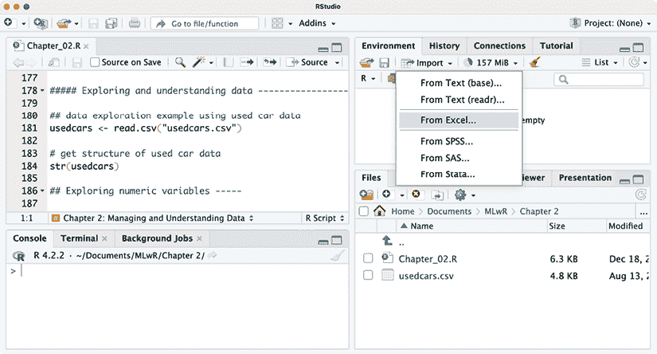

图 2.1：RStudio 的“导入数据集”功能提供了从各种常见格式加载数据的选项

根据选择的数据格式，您可能需要安装 R 包以实现所需的功能。在幕后，这些包将转换数据格式，以便在 R 中使用。然后，您将看到一个对话框，允许您选择数据导入过程选项，并实时预览数据在 R 中的外观，随着这些更改的进行。

以下屏幕截图说明了使用 `readxl` 包（[`readxl.tidyverse.org`](https://readxl.tidyverse.org)）导入使用过的汽车数据集的 Microsoft Excel 版本的过程，但该过程对于任何数据集格式都是类似的：

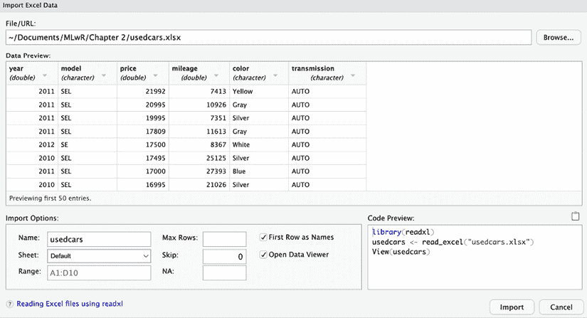

图 2.2：数据导入对话框提供了一个“代码预览”，可以复制并粘贴到您的 R 代码文件中

此对话框右下角的**代码预览**提供了使用指定选项执行导入的 R 代码。选择**导入**按钮将立即执行代码；然而，更好的做法是将代码复制并粘贴到您的 R 源代码文件中，这样您就可以在未来会话中重新导入数据集。

RStudio 使用的`read_excel()`函数将 Excel 数据加载到一个称为“tibble”的 R 对象中，而不是数据框。这些差异如此微妙，您可能甚至都没有注意到！然而，tibbles 是 R 的一个重要创新，它使我们可以以新的方式处理数据框。tibble 及其功能将在第十二章，*高级数据准备*中讨论。

RStudio 界面使以各种格式处理数据变得比以往任何时候都容易，但还有更高级的功能用于处理大型数据集。特别是，如果您有存储在 Microsoft SQL、MySQL、PostgreSQL 和其他数据库平台中的数据，您可以使用 R 连接到这些数据库，将数据拉入 R，甚至利用数据库硬件本身在将结果带入 R 之前执行大数据计算。第十五章，*利用大数据*介绍了这些技术，并提供了使用 RStudio 连接到常用数据库的说明。

# 探索和理解数据

在收集数据并将其加载到 R 数据结构之后，机器学习过程中的下一步是详细检查数据。在这一步中，您将开始探索数据的特征和示例，并意识到使您的数据独特的独特之处。您对数据的理解越好，您将能够更好地将机器学习模型与您的学习问题相匹配。

通过示例学习数据探索的过程是最好的方法。在本节中，我们将探索`usedcars.csv`数据集，该数据集包含有关 2012 年在美国一个流行的网站上广告出售的二手车的实际数据。

`usedcars.csv`数据集可在本书的 Packt Publishing 支持页面上下载。如果您正在跟随示例进行操作，请确保此文件已下载并保存到您的 R 工作目录中。

由于数据集以 CSV 格式存储，我们可以使用`read.csv()`函数将数据加载到 R 数据框中：

```py
> usedcars <- read.csv("usedcars.csv") 
```

使用`usedcars`数据框，我们现在将扮演一个数据科学家的角色，他的任务是理解二手车数据。尽管数据探索是一个流动的过程，但可以将其想象为一种调查，其中回答有关数据的问题。具体问题可能因项目而异，但问题的类型始终相似。

您应该能够将这项调查的基本步骤适应到您喜欢的任何数据集中，无论大小。


图 2.3：“定价算法是否经过测试？”（由 Midjourney AI 根据提示“可爱卡通机器人购买二手车”创建的图像）

## 探索数据结构

在调查新数据集时，首先要问的问题应该是关于数据集的组织方式。如果你很幸运，你的来源将提供一个 **数据字典**，这是一个描述数据集特征的文档。在我们的案例中，二手车数据没有附带这份文档，因此我们需要自己创建。

`str()` 函数提供了一种显示 R 对象结构的方法，例如数据框、向量或列表。它可以用来创建我们的数据字典的基本轮廓：

```py
> str(usedcars) 
```

```py
'data.frame':	150 obs. of  6 variables:
 $ year        : int  2011 2011 2011 2011 ...
 $ model       : chr  "SEL" "SEL" "SEL" "SEL" ...
 $ price       : int  21992 20995 19995 17809 ...
 $ mileage     : int  7413 10926 7351 11613 ...
 $ color       : chr  "Yellow" "Gray" "Silver" "Gray" ...
 $ transmission: chr  "AUTO" "AUTO" "AUTO" "AUTO" ... 
```

对于这样一个简单的命令，我们了解到了关于数据集的大量信息。`150 obs` 的语句告诉我们数据包括 150 **观测值**，这仅仅是另一种说法，即数据集包含 150 行或示例。观测值的数量通常简单地缩写为 *n*。

由于我们知道数据描述的是二手车，我们现在可以假设我们有 n = 150 辆待售汽车的示例。

`6 variables` 语句指的是数据中记录的六个特征。术语 **变量** 是从统计学领域借用的，简单地说，它是一个可以取各种值的数学对象——就像你在代数方程中求解的 *x* 和 *y* 变量。这些特征或变量按名称单独列出。查看名为 `color` 的特征所在的行，我们注意到一些额外的细节：

```py
$ color       : chr  "Yellow" "Gray" "Silver" "Gray" ... 
```

在变量的名称之后，`chr` 标签告诉我们该特征是字符类型。在这个数据集中，有三个变量是字符类型，而另外三个被标记为 `int`，这代表整数类型。尽管 `usedcars` 数据集只包含字符和整数特征，但在使用非整数数据时，你也可能会遇到 `num` 或数值类型。任何因素都会被列为 `factor` 类型。在每个变量的类型之后，R 会展示一系列的前几个特征值。`"Yellow" "Gray" "Silver" "Gray"` 是 `color` 特征的前四个值。

将一些领域知识应用到特征名称和值上，使我们能够对特征所代表的内容做出一些假设。`year` 可能指的是车辆制造的年份，或者它可能指定了广告发布的年份。我们将在稍后更详细地调查这个特征，因为四个示例值 (`2011 2011 2011 2011`) 可以用来支持这两种可能性。`model`、`price`、`mileage`、`color` 和 `transmission` 很可能指的是待售汽车的特性。

虽然我们的数据看起来已经被赋予了有意义的名称，但这并不总是如此。有时数据集具有无意义的名称或代码，如`V1`。在这些情况下，可能需要进行额外的调查来确定一个特征代表什么。即使有有帮助的特征名称，也要始终对提供的标签持怀疑态度。让我们进一步调查。

## 探索数值特征

要调查二手车数据中的数值特征，我们将使用一组常见的测量值来描述值，这些值被称为**摘要统计量**。`summary()`函数显示了一些常见的摘要统计量。让我们看看单个特征，`year`：

```py
> summary(usedcars$year) 
```

```py
 Min. 1st Qu.  Median    Mean  3rd Qu.   Max.
   2000    2008    2009    2009    2010    2012 
```

忽略值的含义，我们看到`2000`、`2008`和`2009`这样的数字，这让我们相信`year`表示的是制造年份，而不是广告发布的年份，因为我们知道车辆列表是在 2012 年获得的。

通过提供一列列名向量，我们也可以使用`summary()`函数同时获取多个数值列的摘要统计信息：

```py
> summary(usedcars[c("price", "mileage")]) 
```

```py
 price          mileage      
 Min.   : 3800   Min.   :  4867  
 1st Qu.:10995   1st Qu.: 27200  
 Median :13592   Median : 36385  
 Mean   :12962   Mean   : 44261  
 3rd Qu.:14904   3rd Qu.: 55124  
 Max.   :21992   Max.   :151479 
```

`summary()`函数提供的六个摘要统计量是简单而强大的工具，用于调查数据。它们可以分为两类：中心趋势的度量以及离散趋势的度量。

### 测量集中趋势——平均值和中位数

**集中趋势**的度量是一类用于识别数据集中位于中间位置的值的统计方法。你很可能已经熟悉一个常见的中心度量：平均值。在常规用法中，当某事物被认为是平均值时，它位于刻度两端的中间位置。一个平均的学生可能的成绩位于其同学的中等水平。一个平均的体重既不特别轻也不特别重。一般来说，一个平均的项目是典型的，并且与其组中的其他项目不太相似。你可以将其视为一个典范，其他所有项目都是根据这个典范来评判的。

在统计学中，平均值也被称为**均值**，它是一个定义为所有值之和除以值数量的度量。例如，要计算三个收入为$36,000、$44,000 和$56,000 的人的平均收入，我们可以输入：

```py
> (36000 + 44000 + 56000) / 3 
```

```py
[1] 45333.33 
```

R 还提供了一个`mean()`函数，用于计算数字向量的平均值：

```py
> mean(c(36000, 44000, 56000)) 
```

```py
[1] 45333.33 
```

这个群体的人均收入约为$45,333。从概念上讲，这可以想象为如果总收入平均分配给每个人，每个人将拥有的收入。

回想一下，前面的`summary()`输出列出了`price`和`mileage`的平均值。这些值表明，在这个数据集中，典型的二手车标价为 12,962 美元，里程表读数为 44,261 英里。这告诉我们关于我们数据什么信息？我们可以注意到，由于平均价格相对较低，我们可能会预期数据集中包含经济型汽车。当然，数据也可能包括里程数高的新款豪华车，但相对较低的均值里程数统计信息并不提供支持这一假设的证据。另一方面，它也不提供忽略这种可能性的证据。在我们进一步检查数据时，我们需要记住这一点。

尽管平均值是衡量数据集中心位置引用最多的统计量，但它并不总是最合适的。另一个常用的中心趋势度量是**中位数**，它是有序值列表中点值。与平均值一样，R 提供了一个`median()`函数，我们可以将其应用于以下示例中的工资数据：

```py
> median(c(36000, 44000, 56000)) 
```

```py
[1] 44000 
```

因此，因为中间值是`44000`，中位数收入是$44,000。

如果一个数据集有偶数个值，就没有中间值。在这种情况下，中位数通常被计算为有序列表中中心两个值的平均值。例如，值 1, 2, 3 和 4 的中位数是 2.5。

初看之下，中位数和平均值似乎是两个非常相似的度量。当然，平均值为 45,333 美元，中位数为 44,000 美元，两者并不相差很远。为什么有两个中心趋势的度量？原因与平均值和中位数对范围两端值的影响不同有关。特别是，平均值对**异常值**非常敏感，即相对于大多数数据而言，异常值异常地高或低。关于异常值的更细致的分析将在第十一章*用机器学习取得成功*中介绍，但就现在而言，我们可以将它们视为相对于中位数而言，倾向于将平均值推向更高或更低的极端值，因为中位数对异常值不太敏感。

再次回想一下用于二手车数据集的`summary()`输出中报告的中位数值。尽管价格的平均值和中位数相似（相差大约五个百分点），但平均值和中位数之间的差异却大得多。对于里程数，平均值为 44,261，比中位数 36,385 高出超过 20%。由于平均值比中位数对极端值更敏感，平均值远高于中位数的事实可能会让我们怀疑数据集中存在一些与其他车辆相比里程数极高的二手车。为了进一步调查这个问题，我们需要在我们的分析中添加额外的摘要统计信息。

### 测量离散程度——四分位数和五数摘要

均值和中位数提供了快速总结值的方法，但这些中心度量告诉我们很少关于测量中是否存在多样性的信息。为了测量多样性，我们需要采用另一种类型的摘要统计，这种统计关注数据的 **离散度**，即值是如何紧密或松散地分布的。了解离散度可以让我们对数据的最高和最低值有一个概念，以及大多数值是否与均值和中位数相似或不同。

**五数摘要** 是一组五个统计量，大致描述了特征值的离散度。所有五个统计量都包含在 `summary()` 函数的输出中。按顺序写出，它们是：

1.  最小值 (`Min.`)

1.  第一四分位数，或 Q1 (`1st Qu.`)

1.  中位数，或 Q2 (`Median`)

1.  第三四分位数，或 Q3 (`3rd Qu.`)

1.  最大值 (`Max.`)

如您所预期，最小值和最大值是最极端的特征值，分别表示最小和最大的值。R 提供了 `min()` 和 `max()` 函数来计算向量的这些值。

最小值和最大值之间的范围称为范围。在 R 中，`range()` 函数返回最小值和最大值：

```py
> range(usedcars$price) 
```

```py
[1]  3800 21992 
```

将 `range()` 与差分函数 `diff()` 结合使用，可以让你用一行代码计算范围统计量：

```py
> diff(range(usedcars$price)) 
```

```py
[1] 18192 
```

数据集的四分之一值低于第一四分位数（Q1），另一四分之一高于第三四分位数（Q3）。与中位数一样，中位数是数据值的中间点，四分位数将数据集分为四个部分，每个部分包含 25% 的值。

四分位数是称为 **分位数** 的一种统计的特殊情况，分位数是将数据分成等量部分的数字。除了四分位数外，常用的分位数还包括 **三分位数**（三部分）、**五分位数**（五部分）、**十分位数**（十部分）和 **百分位数**（一百部分）。百分位数常用于描述值的排名；例如，一个测试分数排名在 99 分位数的学生表现优于或等于其他 99% 的测试者。

数据中间的 50%，位于第一四分位数和第三四分位数之间，特别引人注目，因为它是一个简单的离散度度量。Q1 和 Q3 之间的差异被称为 **四分位距** (**IQR**)，可以使用 `IQR()` 函数来计算：

```py
> IQR(usedcars$price) 
```

```py
[1] 3909.5 
```

我们也可以通过从 `usedcars$price` 向量的 `summary()` 输出中手动计算这个值，即 `14904 – 10995 = 3909`。我们计算结果与 `IQR()` 输出之间的微小差异是由于 R 自动四舍五入 `summary()` 输出的原因。

`quantile()` 函数提供了一种灵活的工具，用于识别一组值的分位数。默认情况下，`quantile()` 返回五个数字的摘要。将函数应用于 `usedcars$price` 向量会产生与之前相同的摘要统计量：

```py
> quantile(usedcars$price) 
```

```py
 0%     25%     50%     75%    100%
 3800.0 10995.0 13591.5 14904.5 21992.0 
```

在计算分位数时，处理没有单一中间值的值集中存在许多处理成对的方法。`quantile()` 函数允许您通过指定 `type` 参数来在九种不同的断键算法中选择。如果您的项目需要精确定义的分位数，那么使用 `?quantile` 命令阅读函数文档是很重要的。

通过为表示截断点的向量提供一个额外的 `probs` 参数，我们可以获得任意分位数，例如第 1 百分位和第 99 百分位：

```py
> quantile(usedcars$price, probs = c(0.01, 0.99)) 
```

```py
 1%      99%
 5428.69 20505.00 
```

序列函数 `seq()` 生成等间距值的向量。这使得获取其他数据切片变得容易，例如以下命令中显示的五分位数（五组）：

```py
> quantile(usedcars$price, seq(from = 0, to = 1, by = 0.20)) 
```

```py
 0%     20%     40%     60%     80%    100%
 3800.0 10759.4 12993.8 13992.0 14999.0 21992.0 
```

在了解了五数摘要之后，我们可以重新审视二手车 `summary()` 输出。对于 `price`，最小值是 $3,800，最大值是 $21,992。有趣的是，最小值和 Q1 之间的差异大约是 $7,000，Q3 和最大值之间的差异也是 $7,000；然而，从 Q1 到中位数再到 Q3 的差异大约是 $2,000。这表明值的前 25% 和后 25% 的分布比中间 50% 的值分布得更广，而中间 50% 的值似乎更紧密地围绕中心分布。我们还在 `mileage` 中看到了类似的趋势。正如你将在本章后面学到的那样，这种分布模式足够常见，以至于它被称为数据的“正态”分布。

`mileage` 的分布也表现出另一个有趣的特性——Q3 和最大值之间的差异远大于最小值和 Q1 之间的差异。换句话说，较大的值分布得更广，而较小的值分布得更窄。这一发现有助于解释为什么平均值远大于中位数。因为平均值对极端值敏感，所以它被拉得更高，而中位数则保持在相对相同的位置。这是一个重要的特性，当数据以视觉形式呈现时，这一特性变得更加明显。

### 可视化数值特征——箱线图

可视化数值特征可以帮助诊断可能对机器学习模型性能产生负面影响的数据问题。五数摘要的常见可视化是 **箱线图**，也称为 **箱线和须图**。箱线图以一种格式显示数值变量的中心和分布，使您可以快速获得其范围和偏斜或与其他特征进行比较的感觉。

让我们看看二手车价格和里程数据的箱线图。为了获取数值向量的箱线图，我们将使用 `boxplot()` 函数。我们还将指定一对额外的参数，`main` 和 `ylab`，分别用于添加图表标题和标记 *y* 轴（垂直轴）。创建 `price` 和 `mileage` 箱线图的命令如下：

```py
> boxplot(usedcars$price, main = "Boxplot of Used Car Prices",
          ylab = "Price ($)")
> boxplot(usedcars$mileage, main = "Boxplot of Used Car Mileage",
          ylab = "Odometer (mi.)") 
```

R 将生成以下图表：

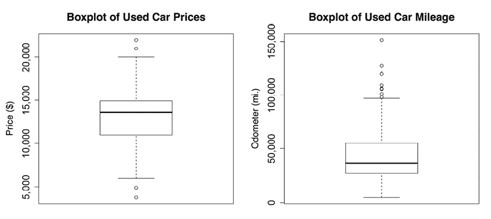

图 2.4：二手车价格和里程数据的箱线图

箱线图使用水平线和点来表示五数摘要。当从底部到顶部读取图表时，图中中间的箱体形成的水平线代表 Q1、Q2（中位数）和 Q3。中位数用深色线表示，与`价格`的垂直轴上的 13,592 对齐，以及`里程`的垂直轴上的 36,385 英里。

在简单的箱线图中，例如前面图中的那些，箱宽是任意的，并不说明数据的任何特征。对于更复杂的分析，可以使用箱子的形状和大小来促进跨多个组的数据比较。要了解更多关于这些功能的信息，请通过输入`?boxplot`命令来检查 R 的`boxplot()`文档中的`notch`和`varwidth`选项。

最小值和最大值可以通过延伸到箱体下方和上方的触须来表示；然而，一个广泛使用的惯例只允许触须延伸到 Q1 以下或 Q3 以上的 1.5 倍 IQR。任何超出此阈值的值都被认为是异常值，并用圆圈或点表示。例如，回想一下`价格`的 IQR 是 3,909，Q1 是 10,995，Q3 是 14,904。因此，任何小于 10995 - 1.5 * 3909 = 5131.5 或大于 14904 + 1.5 * 3909 = 20767.5 的值都是异常值。

`价格`箱线图显示在高低两端都有两个异常值。在`里程`箱线图中，低端没有异常值，因此底部触须延伸到最小值 4,867。在高端，我们看到超过 10 万英里标记的几个异常值。这些异常值是我们之前发现的原因，即平均值远大于中位数。

### 可视化数值特征 – 直方图

**直方图**是另一种可视化数值特征分布的方法。它就像箱线图一样，将特征值分成预定义的若干部分或**箱**，这些箱作为值的容器。然而，它们的相似之处到此为止。箱线图创建四个包含相同数量值但范围不同的部分，而直方图使用相同范围的更多部分，并允许箱包含不同数量的值。

我们可以使用`hist()`函数为二手车`价格`和`里程`数据创建直方图。就像我们使用箱线图一样，我们将使用`main`参数为图形指定标题，并使用`xlab`参数标记*x*轴。创建直方图的命令如下：

```py
> hist(usedcars$price, main = "Histogram of Used Car Prices",
       xlab = "Price ($)")
> hist(usedcars$mileage, main = "Histogram of Used Car Mileage",
       xlab = "Odometer (mi.)") 
```

这产生了以下图表：

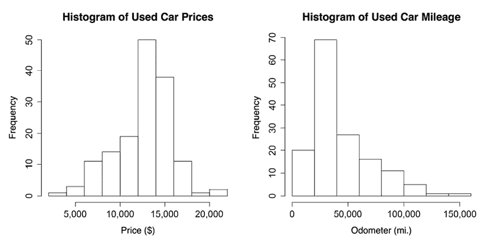

图 2.5：二手车价格和里程数据的直方图

直方图由一系列高度表示计数的条形组成，这些条形表示落在每个等宽柱子中的值的数量，或**频率**。在水平轴上标注的垂直线分隔条形，表示落在柱子中的值的范围起点和终点。

你可能已经注意到前面的直方图有不同的柱子数量。这是因为`hist()`函数试图识别特征范围的理想柱子数量。如果你想覆盖这个默认值，请使用`breaks`参数。提供整数，如`breaks = 10`，将创建恰好 10 个等宽的柱子，而提供向量，如`c(5000, 10000, 15000, 20000)`，将创建在指定值处断开的柱子。

在`price`直方图中，每个 10 个条形跨越$2,000 的间隔，从$2,000 开始，到$22,000 结束。图中中心的最高条形覆盖了$12,000 到$14,000 的范围，频率为 50。由于我们知道我们的数据包括 150 辆车，我们知道三分之一的车辆定价在$12,000 到$14,000 之间。近 90 辆车——超过一半——定价在$12,000 到$16,000 之间。

`mileage`直方图包括八个条形，代表 20,000 英里一个柱子的区间，从 0 开始，到 160,000 英里结束。与`price`直方图不同，最高的条形不在数据的中心，而是在图的左侧。这个柱子包含 70 辆车，其里程表读数在 20,000 到 40,000 英里之间。

你可能还会注意到两个直方图的形状略有不同。似乎二手车价格在中间两侧均匀分布，而汽车里程数则进一步向右延伸。

这种特性被称为**偏斜**，或更具体地说，是右偏斜，因为高端（右侧）的值比低端（左侧）的值分布得更广。如图所示，偏斜数据的直方图在一边看起来被拉伸：


图 2.6：使用理想化直方图可视化的三种偏斜模式

快速诊断我们数据中的这种模式是直方图作为数据探索工具的优势之一。当我们开始检查数值数据的其他分布模式时，这一点将变得更加重要。

### 理解数值数据 - 均匀和正态分布

直方图、箱线图以及描述中心位置和分布范围的统计方法，提供了检查特征值分布的方式。一个变量的**分布**描述了值落在各种范围内的可能性。

如果所有值发生的可能性相同——比如说，在一个记录公平六面骰子投掷值的数据库中——那么这种分布被称为均匀分布。均匀分布很容易通过直方图来检测，因为柱子的高度大约相同。直方图可能看起来像以下图示：

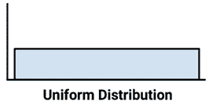

图 2.7：用理想化直方图可视化的均匀分布

重要的是要注意，并非所有随机事件都是均匀的。例如，掷一个加重的六面骰子会导致某些数字比其他数字出现得更频繁。虽然每次掷骰子都会得到一个随机选择的数字，但它们并不等可能。

二手车的 `价格` 和 `里程` 数据也显然不是均匀的，因为一些值似乎比其他值更有可能发生。实际上，在 `价格` 直方图中，似乎随着值远离中心柱的两侧，其发生的可能性会降低，这导致数据呈钟形分布。这种特征在现实世界数据中如此普遍，以至于它是所谓**正态分布**的标志。正态分布的典型钟形曲线如下图所示：

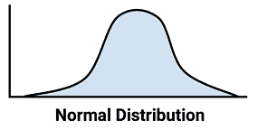

图 2.8：用理想化直方图可视化的正态分布

尽管存在许多非正态分布类型，但许多现实世界现象生成可以由正态分布描述的数据。因此，正态分布的性质已经被详细研究。

### 测量扩散——方差和标准差

分布使我们能够使用较少的参数来描述大量值。描述许多类型现实世界数据的正态分布可以用两个参数来定义：中心和扩散。正态分布的中心由其平均值定义，这是我们之前使用的。扩散由一个称为**标准差**的统计量来衡量。

要计算标准差，我们首先必须获得**方差**，它被定义为每个值与平均值之间平方差的平均值。在数学符号中，集合 *x* 中 *n* 个值的方差由以下公式定义：

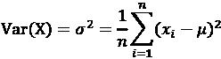

在这个公式中，希腊字母 *mu*（写作 **）表示值的平均值，方差本身由希腊字母 *sigma* 的平方（写作 *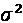*）表示。

标准差是方差的平方根，用 sigma（写作 **）表示，如下公式所示：

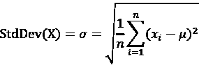

在 R 中，`var()`和`sd()`函数可以避免我们手动计算方差和标准差。例如，计算`price`和`mileage`向量的方差和标准差，我们发现：

```py
> var(usedcars$price) 
```

```py
[1] 9749892 
```

```py
> sd(usedcars$price) 
```

```py
[1] 3122.482 
```

```py
> var(usedcars$mileage) 
```

```py
[1] 728033954 
```

```py
> sd(usedcars$mileage) 
```

```py
[1] 26982.1 
```

在解释方差时，较大的数字表示数据在平均值周围分布得更广。标准差表示平均来说，每个值与平均值相差多少。

如果你使用前面图表中的公式手动计算这些统计量，你将得到与内置 R 函数略有不同的结果。这是因为前面的公式使用的是总体方差（除以*n*），而 R 使用的是样本方差（除以*n - 1*）。除了非常小的数据集外，这种区别很小。

标准差可以用来快速估计给定值在假设它来自正态分布的情况下有多极端。**68-95-99.7 规则**指出，在正态分布中，68%的值在平均值的一个标准差范围内，而 95%和 99.7%的值分别在两个和三个标准差范围内。这在下图中得到说明：

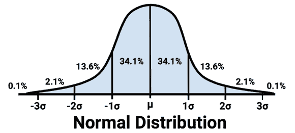

图 2.9：在正态分布平均值的一个、两个和三个标准差范围内的值的百分比

将此信息应用于二手车数据，我们知道`price`的平均值和标准差分别为$12,962 和$3,122。因此，假设价格呈正态分布，我们数据中大约 68%的汽车广告价格在$12,962 - $3,122 = $9,840 和$12,962 + $3,122 = $16,804 之间。

虽然严格来说，68-95-99.7 规则仅适用于正态分布，但其基本原理适用于几乎任何数据；距离平均值超过三个标准差的数据值往往是非常罕见的事件。

## 探索分类特征

如果你记得，二手车数据集包含三个分类特征：`model`、`color`和`transmission`。此外，尽管`year`被存储为数值向量，但每个年份可以想象成适用于多辆车的类别。因此，我们可能将其视为分类数据。

与数值数据不同，分类数据通常使用表格而不是汇总统计来检查。展示单个分类特征的表格被称为**单向表**。`table()`函数可以用于为二手车数据生成单向表：

```py
> table(usedcars$year) 
```

```py
2000 2001 2002 2003 2004 2005 2006 2007 2008 2009 2010 2011 2012
   3    1    1    1    3    2    6   11   14   42   49   16    1 
```

```py
> table(usedcars$model) 
```

```py
 SE SEL SES
78  23  49 
```

```py
> table(usedcars$color) 
```

```py
 Black   Blue   Gold   Gray  Green    Red Silver  White Yellow
    35     17      1     16      5     25     32     16      3 
```

`table()`函数的输出列出了名义变量的类别以及每个类别中值的数量。由于我们知道数据集中有 150 辆二手车，我们可以确定大约三分之一的汽车是在 2010 年制造的，因为 49/150 = 0.327。

R 也可以直接通过在由 `table()` 函数生成的表格上使用 `prop.table()` 命令来计算表格比例：

```py
> model_table <- table(usedcars$model)
> prop.table(model_table) 
```

```py
 SE       SEL       SES
0.5200000 0.1533333 0.3266667 
```

`prop.table()` 的结果可以与其他 R 函数结合使用以转换输出。假设我们希望以百分比形式显示结果，并且保留一位小数。我们可以通过将比例乘以 100 来实现这一点，然后使用 `round()` 函数并指定 `digits = 1`，如下面的示例所示：

```py
> color_table <- table(usedcars$color)
> color_pct <- prop.table(color_table) * 100
> round(color_pct, digits = 1) 
```

```py
Black   Blue   Gold   Gray  Green    Red Silver  White Yellow
 23.3   11.3    0.7   10.7    3.3   16.7   21.3   10.7    2.0 
```

虽然这包括与默认 `prop.table()` 输出相同的信息，但这些更改使其更容易阅读。结果显示，黑色是最常见的颜色，占所有广告汽车的近四分之一（23.3%）。银色紧随其后，占 21.3%，红色位居第三，占 16.7%。

### 测量中心趋势——众数

在统计学术语中，一个特征的**众数**是出现次数最多的值。像均值和中位数一样，众数是中心趋势的另一种度量。它通常用于分类数据，因为均值和中位数在名义变量中未定义。

例如，在二手车数据中，`year` 的众数是 2010 年，而 `model` 和 `color` 变量的众数分别是 `SE` 和 `Black`。一个变量可能有多个众数；只有一个众数的变量是**单峰**的，而有两个众数的变量是**双峰**的。具有多个众数的数据更一般地被称为**多峰**。

虽然你可能怀疑可以使用 `mode()` 函数，但 R 使用它来获取变量的类型（如数值、列表等），而不是统计众数。相反，为了找到统计众数，只需查看具有最大值的类别的 `table()` 输出即可。

众数或众数在定性意义上被用来理解重要值。尽管如此，过分强调众数是危险的，因为最常出现的值不一定是多数。例如，尽管黑色是最常见的汽车颜色，但它只占所有广告汽车的约四分之一。

最好将众数与其他类别联系起来思考。是否存在一个类别支配所有其他类别，或者有几个？以这种方式思考众数可能会通过提出关于什么使某些值比其他值更常见的问题来帮助生成可检验的假设。例如，如果黑色和银色是常用的汽车颜色，我们可能会认为数据代表豪华汽车，这些汽车倾向于以更保守的颜色出售。或者，这些颜色可能表明经济型汽车，这些汽车的颜色选择较少。我们将保持这些问题在继续检查这些数据时。

将模式视为常见值，这使我们能够将统计模式的概念应用于数值数据。严格来说，对于连续变量来说，不太可能有模式，因为两个值不太可能重复。然而，如果我们把模式看作是直方图上的最高柱状，我们就可以讨论像`price`和`mileage`这样的变量的模式。在探索数值数据时考虑模式可能会有所帮助，尤其是检查数据是否是多模态的。

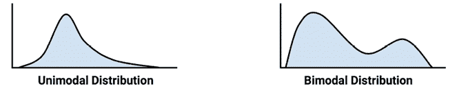

图 2.10：具有一个和两个模式的数值数据的假设分布

## 探索特征之间的关系

到目前为止，我们一次只检查一个变量，只计算**单变量**统计。在我们的调查中，我们提出了之前无法回答的问题：

+   `price`和`mileage`数据是否意味着我们只检查经济型汽车，还是有高里程的豪华汽车？

+   `model`和`color`之间的关系是否提供了我们正在检查的汽车类型的见解？

这些类型的问题可以通过查看**双变量**关系来解决，它考虑了两个变量之间的关系。多于两个变量的关系称为**多变量**关系。让我们从双变量情况开始。

### 可视化关系 - 散点图

**散点图**是一种可视化数值特征之间双变量关系的图表。它是一个二维图形，其中在坐标平面上绘制点，使用一个特征的值提供水平*x*坐标，使用另一个特征的值提供垂直*y*坐标。点的放置模式揭示了两个特征之间的潜在关联。

要回答我们关于`price`和`mileage`之间关系的问题，我们将检查散点图。我们将使用`plot()`函数，以及之前使用的`main`、`xlab`和`ylab`参数来标记图表。

要使用`plot()`，我们需要指定包含用于在图上定位点的值的`x`和`y`向量。尽管使用哪种变量提供*x*和*y*坐标的结论都会相同，但惯例规定*y*变量是假定依赖于另一个的变量（因此被称为**因变量**）。由于卖家无法修改汽车的里程表读数，因此里程不太可能依赖于汽车的价格。相反，我们的假设是汽车的价格取决于里程表读数。因此，我们将选择`price`作为因变量*y*。

创建我们的散点图的完整命令是：

```py
> plot(x = usedcars$mileage, y = usedcars$price,
       main = "Scatterplot of Price vs. Mileage",
       xlab = "Used Car Odometer (mi.)",
       ylab = "Used Car Price ($)") 
```

这产生了以下散点图：

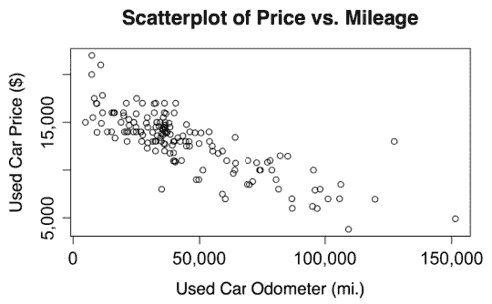

图 2.11：二手车价格与里程的关系

使用散点图，我们注意到二手车价格和里程表读数之间存在明显的关系。要读取图表，检查*y*轴变量的值如何随着*x*轴值的增加而变化。在这种情况下，随着里程的增加，汽车价格往往较低。如果你曾经卖过或买过二手车，这并不是一个深刻的见解。

可能更有趣的发现是，很少有汽车同时具有高价格和高里程，除了一个大约 125,000 英里和 14,000 美元的孤立异常值。这种点的缺失为支持结论提供了证据，即我们的数据集不太可能包含任何高里程豪华车。数据中所有最昂贵的汽车，尤其是那些超过 17,500 美元的汽车，似乎里程非常低，这意味着我们可能正在查看一种新售价约为 20,000 美元的单一类型的汽车。

我们观察到的汽车价格和里程之间的关系被称为负关联，因为它形成了一条向下倾斜的点的模式。正关联似乎会形成一条向上倾斜的线。一条平坦的线或看似随机的点分布是两个变量完全不相关的证据。两个变量之间线性关联的强度由一个称为**相关性**的统计量来衡量。相关性在*第六章*，*预测数值数据 - 回归方法*中详细讨论，该章节涵盖了建模线性关系的方法。

请记住，并非所有的关联都形成直线。有时点会形成 U 形或 V 形，而有时模式似乎随着*x*或*y*变量值的增加而变得更弱或更强。这样的模式表明两个变量之间的关系不是线性的，因此相关性将是一个衡量它们关联的糟糕指标。

### 检查关系 - 双向交叉表

要检查两个名义变量之间的关系，可以使用**双向交叉表**（也称为**交叉表**或**列联表**）。交叉表就像散点图一样，它允许你检查一个变量的值如何随着另一个变量的值而变化。其格式是一个表格，其中行是一个变量的水平，而列是另一个变量的水平。表格中每个单元格的计数表示落入行和列组合中的值的数量。

为了回答我们之前关于 `model` 和 `color` 之间是否存在关系的疑问，我们将检查一个交叉表。在 R 中有几个函数可以生成双向表，包括我们之前用于单变量表的 `table()` 函数。Gregory R. Warnes 的 `gmodels` 包中的 `CrossTable()` 函数可能是最用户友好的，因为它在一个表格中展示了行、列和边缘百分比，从而节省了我们自己计算这些百分比的时间。如果你还没有按照前一章中的说明安装 `gmodels` 包，请使用以下命令：

```py
> install.packages("gmodels") 
```

包安装完成后，输入 `library(gmodels)` 来加载包。虽然你只需要安装一次包，但在你计划使用 `CrossTable()` 函数的每个 R 会话中，你都需要使用 `library()` 命令来加载包。

在继续我们的分析之前，让我们通过减少 `color` 变量的级别数量来简化我们的项目。这个变量有九个级别，但我们实际上并不需要这么多细节。我们真正感兴趣的是汽车的颜色是否保守。为此，我们将九种颜色分为两组——第一组将包括保守色彩黑色、灰色、银色和白色；第二组将包括蓝色、金色、绿色、红色和黄色。我们将创建一个逻辑向量，以指示汽车的颜色是否根据我们的定义是保守的。以下代码返回 `TRUE` 如果汽车是四种保守颜色之一，否则返回 `FALSE`：

```py
> usedcars$conservative <-
    usedcars$color %in% c("Black", "Gray", "Silver", "White") 
```

你可能注意到了这里有一个新的命令。`%in%` 操作符为操作符左侧向量中的每个值返回 `TRUE` 或 `FALSE`，表示该值是否在操作符右侧的向量中。简单来说，你可以将这一行翻译为“二手车颜色是否在黑色、灰色、银色和白色的集合中？”

检查我们新创建变量的 `table()` 输出，我们看到大约三分之二的汽车具有保守色彩，而三分之一不具有：

```py
> table(usedcars$conservative) 
```

```py
FALSE  TRUE
   51    99 
```

现在，让我们通过交叉表来查看不同车型中保守色彩汽车的比例如何变化。由于我们假设车型决定了色彩的选择，因此我们将保守色彩指标视为因变量（`y`）。因此，`CrossTable()` 命令如下：

```py
> CrossTable(x = usedcars$model, y = usedcars$conservative) 
```

这将产生以下表格：

```py
 Cell Contents                                           
|-------------------------|
|                       N |
| Chi-square-contribution |
|           N / Row Total |
|           N / Col Total |
|         N / Table Total |
|-------------------------|
Total Observations in Table:  150
                       | usedcars$conservative                 
       usedcars$model  |   FALSE  |       TRUE  |  Row Total  |
-----------------------|----------|-------------|-------------|
                    SE |       27 |          51 |          78 |
                       |    0.009 |       0.004 |             |
                       |    0.346 |       0.654 |       0.520 |
                       |    0.529 |       0.515 |             |
                       |    0.180 |       0.340 |             |
-----------------------|----------|-------------|-------------|
                   SEL |        7 |          16 |          23 |
                       |    0.086 |       0.044 |             |
                       |    0.304 |       0.696 |       0.153 |
                       |    0.137 |       0.612 |             |
                       |    0.047 |       0.107 |             |
-----------------------|----------|-------------|-------------|
                   SES |       17 |          32 |          49 |
                       |    0.007 |       0.004 |             |
                       |    0.347 |       0.653 |       0.327 |
                       |    0.333 |       0.323 |             |
                       |    0.113 |       0.213 |             |
-----------------------|----------|-------------|-------------|
          Column Total |       51 |          99 |         150 |
                       |    0.340 |       0.660 |             |
-----------------------|----------|-------------|-------------| 
```

`CrossTable()` 的输出充满了数字，但顶部的图例（标记为 `Cell Contents`）说明了如何解释每个值。表格的行表示三种二手车车型：`SE`、`SEL` 和 `SES`（以及一个表示所有车型总体的额外行）。列表示汽车的颜色是否保守（以及一个表示两种颜色类型的总列）。

每个单元格中的第一个值表示具有该车型和颜色组合的汽车数量。比例表示每个单元格对卡方统计量的贡献，行总计，列总计以及表格的总计。

我们最感兴趣的是每个模型的保守型汽车的比例。行比例告诉我们，`SE`型汽车中有 65.4%（即 0.654）是保守色调，相比之下，`SEL`型汽车中有 70%（即 0.696），而`SES`型汽车中有 65.3%（即 0.653）。这些差异相对较小，这表明在每种车型中选择颜色类型上没有实质性的差异。

卡方值指的是单元格对两个变量之间独立性的**皮尔逊卡方检验**的贡献。尽管对这个测试背后的统计学的完整讨论非常技术性，但这个测试衡量的是表格中单元格计数差异仅由偶然性引起的可能性，这有助于我们证实我们的假设，即组间差异并不显著。通过将表格中六个单元格的贡献相加，我们得到*0.009 + 0.004 + 0.086 + 0.044 + 0.007 + 0.004 = 0.154*。这是卡方检验统计量。

要计算在假设变量之间没有关联的假设下观察到这个统计量的概率，我们将检验统计量传递给`pchisq()`函数，如下所示：

```py
> pchisq(0.154, df = 2, lower.tail = FALSE) 
```

```py
[1] 0.9258899 
```

`df`参数指的是自由度，这是与表格中行和列的数量相关的统计测试的一个组成部分；再次忽略它的含义，它可以计算为(*行数 - 1*) * (*列数 - 1*)，对于 2x2 表格是 1，对于这里使用的 3x2 表格是 2。设置`lower.tail = FALSE`请求大约 0.926 的右尾概率，这可以直观地理解为仅由于偶然性获得至少 0.154 或更大测试统计量的概率。

如果卡方检验的概率非常低——可能低于十、五或甚至一百分之一——它提供了强有力的证据表明两个变量是相关的，因为表格中观察到的关联不太可能仅由偶然性引起。在我们的案例中，概率更接近 100%而不是 10%，因此我们不太可能观察到在这个数据集中`车型`和`颜色`之间的关联。

而不是手动计算，你还可以通过在调用`CrossTable()`函数时添加一个额外的参数来指定`chisq = TRUE`来获得卡方检验的结果。例如：

```py
> CrossTable(x = usedcars$model, y = usedcars$conservative,
               chisq = TRUE) 
```

```py
Pearson's Chi-squared test 
------------------------------------------------------------
Chi² =  0.1539564     d.f. =  2     p =  0.92591 
```

注意，除了由于四舍五入产生的微小差异外，这会产生与手工计算相同的卡方检验统计量和概率。

在这里进行的卡方检验是许多可以使用传统统计学进行的正式假设检验类型之一。如果你曾经听说过“统计显著”这个短语，这意味着像卡方（或许多其他）这样的统计检验已经执行，并且达到了“显著”的水平——通常是一个小于五 percent 的概率。尽管假设检验超出了这本书的范围，但它将在 *第六章*，*预测数值数据 – 回归方法* 中再次简要介绍。

# 摘要

在本章中，我们学习了在 R 中管理数据的基础知识。我们首先深入研究了用于存储各种类型数据的结构。R 的基本数据结构是向量，它可以扩展和组合成更复杂的数据类型，如列表和数据框。数据框是 R 的一种数据结构，对应于具有特征和示例的数据集的概念。R 提供了用于读取和写入数据框到类似电子表格的表格数据文件的函数。

我们随后探索了一个包含二手车价格的现实世界数据集。我们使用中心性和离散性的常用汇总统计量来检查数值变量，并使用散点图可视化价格和里程表读数之间的关系。接下来，我们使用表格来检查名义变量。在检查二手车数据时，我们遵循了一个可以用于理解任何数据集的探索性过程。这些技能将贯穿本书的其他项目。

现在我们已经花了一些时间了解使用 R 进行数据管理的基础知识，你就可以开始使用机器学习来解决现实世界的问题了。在下一章中，我们将使用最近邻方法来处理我们的第一个分类任务。你可能会惊讶地发现，只需几行 R 代码，机器就能在具有挑战性的医疗诊断任务上实现类似人类的性能。

# 加入我们书籍的 Discord 空间

加入我们的 Discord 社区，与志同道合的人见面，并与其他 4000 多人一起学习：

[`packt.link/r`](https://packt.link/r)


