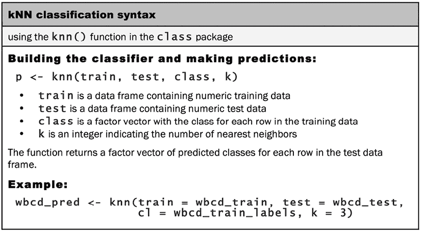

# 懒惰学习 – 使用最近邻进行分类

一种好奇的餐饮体验在全球各地城市中出现。顾客在完全黑暗的餐厅中被服务员服务，服务员通过记忆中的路线移动，仅使用他们的触觉和听觉。这些场所的吸引力在于相信剥夺自己的视觉将增强味觉和嗅觉，食物将以新的方式被体验。每一口都提供了一种惊奇感，同时发现了厨师准备的风味。

你能想象一位食客是如何体验未见过的食物的吗？第一口咬下去，感官会感到震惊。主要的味道是什么？食物是咸的还是甜的？它尝起来像他们以前吃过的东西吗？我个人认为这个过程可以用一个稍微修改过的谚语来描述——如果它闻起来像鸭子，尝起来也像鸭子，那么你很可能在吃鸭子。

这说明了可以用于机器学习的一个想法——就像另一个涉及家禽的格言——物以类聚。换句话说，相似的事物往往具有相似的性质。机器学习使用这个原则通过将其放置在与相似或“最近”邻居相同的类别中来对数据进行分类。本章致力于使用这种方法进行分类的分类器。你将学习：

+   定义最近邻分类器的关键概念以及为什么它们被认为是“懒惰”的学习者

+   测量两个例子之间相似度的方法

+   如何应用一个流行的最近邻分类器，称为 k-NN

如果所有关于食物的谈话让你感到饥饿，我们的第一个任务将是通过将其应用于解决一个长期存在的烹饪辩论，来理解 k-NN 方法。

# 理解最近邻分类

用一句话来说，**最近邻**分类器通过其将未标记的例子分类为相似标记例子类别的特性来定义。这与章节引言中描述的餐饮体验类似，其中一个人通过比较之前遇到的食物来识别新食物。在最近邻分类中，计算机应用了一种类似人类的能力，回忆过去的经验，对当前情况做出结论。尽管这个想法很简单，但最近邻方法非常强大。它们已被成功用于：

+   计算机视觉应用，包括静态图像和视频中的光学字符识别和面部识别

+   推荐系统预测一个人是否会喜欢一部电影或一首歌

+   识别遗传数据中的模式以检测特定的蛋白质或疾病

通常，最近邻分类器非常适合于特征与目标类别之间存在众多、复杂或难以理解的关系的分类任务，而相似类别类型的项往往相当同质。另一种说法可能是，如果一个概念难以定义，但你一看到就知道，那么最近邻可能适用。另一方面，如果数据有噪声，因此组间没有明显的区分，最近邻算法可能难以识别类别边界。

## k-NN 算法

分类中的最近邻方法以**k-最近邻算法**（**k-NN**）为例。尽管这可能是最简单的机器学习算法之一，但它仍然被广泛使用。该算法的优点和缺点如下：

| **优点** | **缺点** |
| --- | --- |

|

+   简单而有效

+   对底层数据分布不做假设

+   训练阶段快速

|

+   不产生模型，限制了理解特征与类别之间关系的能力

+   需要选择合适的**k**

+   分类阶段较慢

+   名义特征和缺失数据需要额外处理

|

k-NN 算法的名字来源于它使用关于示例的**k**个最近邻的信息来对未标记的示例进行分类。字母**k**是一个变量，意味着可以使用任意数量的最近邻。选择**k**之后，算法需要一个由已分类的示例组成的训练数据集，这些示例被一个名义变量标记。然后，对于测试数据集中的每个未标记记录，k-NN 识别出训练数据中与相似度“最近”的**k**个记录。未标记的测试实例被分配给代表**k**个最近邻中大多数的类别。

为了说明这个过程，让我们回顾一下引言中描述的盲品体验。假设在品尝神秘餐点之前，我们创建了一个数据集，记录了我们之前品尝的一组成分的印象。为了简化问题，我们只对每个成分的两个特征进行了评分。第一个是从 1 到 10 的脆度度量，第二个是从 1 到 10 的甜度评分。然后，我们将每个成分标记为三种食物类型之一：水果、蔬菜或蛋白质，忽略其他食物如谷物和脂肪。

这样一个数据集的前几行可能结构如下：

| **成分** | **甜度** | **脆度** | **食物类型** |
| --- | --- | --- | --- |
| 苹果 | 10 | 9 | 水果 |
| 火腿 | 1 | 4 | 蛋白质 |
| 香蕉 | 10 | 1 | 水果 |
| 胡萝卜 | 7 | 10 | 蔬菜 |
| 芹菜 | 3 | 10 | 蔬菜 |

k-NN 算法将特征视为多维**特征空间**中的坐标，这是一个包含所有可能的特征值组合的空间。因为成分数据集只包括两个特征，所以其特征空间是二维的。我们可以在散点图上绘制二维数据，其中*x*轴表示成分的甜度，而*y*轴表示脆度。在味道数据集中添加更多成分后，散点图可能看起来像这样：


图 3.1：所选食品的脆度与甜度散点图

您注意到一个模式吗？相似类型的食品往往紧密地聚集在一起。如图*3.2*所示，蔬菜往往脆而不甜；水果往往甜且要么脆要么不脆；蛋白质往往既不脆也不甜：


图 3.2：被相似分类的食品往往具有相似的特征

假设我们在构建了这个数据集之后，决定用它来解决一个古老的疑问：番茄是水果还是蔬菜？我们可以使用最近邻方法来确定哪个类别更合适，如图*3.3*所示：


图 3.3：番茄的最近邻提供了关于它是水果还是蔬菜的见解

### 使用距离测量相似性

定位番茄的最近邻需要一个**距离函数**，这是一个衡量两个实例之间相似性的公式。

有许多种计算距离的方法。距离函数的选择可能会对模型的性能产生重大影响，尽管除了直接在期望的学习任务上比较它们之外，很难知道应该使用哪种。传统上，k-NN 算法使用**欧几里得距离**，这是如果可以使用尺子连接两个点时测量的距离。欧几里得距离是“如鸟飞”测量的，这暗示了最短的直接路线。这在上一个图中通过连接番茄及其邻居的虚线说明了。

另一种常见的距离度量是**曼哈顿距离**，它基于行人通过走城市街区所走的路径。如果您想了解更多关于其他距离度量的信息，可以使用 R 的`?dist`命令查看距离函数的文档。

欧几里得距离由以下公式指定，其中*p*和*q*是要比较的例子，每个例子都有*n*个特征。术语*p*¹指的是例子*p*的第一个特征值，而*q*¹指的是例子*q*的第一个特征值：


距离公式涉及比较每个示例特征的值。例如，为了计算番茄（甜度=6，脆度=4）和绿豆（甜度=3，脆度=7）之间的距离，我们可以使用以下公式：


同样地，我们可以计算番茄与其几个最近邻居之间的距离，如下所示：

| **成分** | **甜度** | **脆度** | **食物类型** | **到番茄的距离** |
| --- | --- | --- | --- | --- |
| 葡萄 | 8 | 5 | 水果 | sqrt((6 - 8)² + (4 - 5)²) = 2.2 |
| 绿豆 | 3 | 7 | 蔬菜 | sqrt((6 - 3)² + (4 - 7)²) = 4.2 |
| 坚果 | 3 | 6 | 蛋白质 | sqrt((6 - 3)² + (4 - 6)²) = 3.6 |
| 橙子 | 7 | 3 | 水果 | sqrt((6 - 7)² + (4 - 3)²) = 1.4 |

为了将番茄分类为蔬菜、蛋白质或水果，我们首先将番茄分配给其单个最近邻居的食物类型。这被称为 1-NN 分类，因为*k = 1*。橙子是番茄的单个最近邻居，距离为 1.4。因为橙子是水果，所以 1-NN 算法会将番茄分类为水果。

如果我们使用*k = 3*的 k-NN 算法，它将在三个最近邻居中进行投票：橙子、葡萄和坚果。现在，因为在这三个邻居中，多数类别是水果（有三个投票中的两个），所以番茄再次被分类为水果。

### 选择合适的 k 值

如何决定 k-NN 算法中使用的邻居数量决定了模型将如何泛化到未来的数据。在过拟合和欠拟合训练数据之间的平衡是一个被称为**偏差-方差权衡**的问题。选择较大的*k*值可以减少由噪声数据引起的方差的影响，但可能会使学习器产生偏差，从而有忽略小但重要模式的风险。

假设我们采取极端立场，将一个非常大的*k*值设定为与训练数据中观察到的总数一样大。由于每个训练实例都代表最终投票，最常见的类别总是拥有大多数投票者。因此，模型将始终预测多数类别，无论最近的邻居是什么。

在相反的极端情况下，使用单个最近邻居允许噪声数据和异常值过度影响示例的分类。例如，假设一些训练示例被意外地错误标记。任何恰好与错误标记的邻居最近的未标记示例将被预测为具有错误的类别，即使其他九个附近的邻居会投票不同。

显然，最佳的*k*值介于这两个极端之间。

*图 3.4* 展示了更一般的情况，说明了决策边界（由虚线表示）如何受到较大或较小的 *k* 值的影响。较小的值允许更复杂的决策边界，更仔细地拟合训练数据。问题是，我们不知道直线边界还是曲线边界更好地代表了要学习的真实概念。


图 3.4：较大的 *k* 相比较小的 *k* 具有更高的偏差和更低的方差

在实践中，*k* 的选择取决于要学习概念的程度和训练数据中的记录数量。一种常见的方法是从 *k* 等于训练示例数量的平方根开始。在之前开发的食品分类器中，我们可能会将 *k = 4*，因为训练数据中有 15 种示例成分，15 的平方根是 3.87。

然而，这样的规则并不总是导致最佳的 *k*。一种替代方法是测试多种 *k* 值在各种测试数据集上的表现，并选择提供最佳分类性能的那个。尽管如此，除非数据非常嘈杂，否则大量训练数据集可以使 *k* 的选择不那么重要。这是因为即使是微妙的概念也会有一个足够大的示例池来作为最近邻进行投票。

对于这个问题的一个不太常见但仍然有趣的解决方案是选择一个较大的 *k*，并使用加权投票过程，其中较近的邻居的投票被认为比较远的邻居的投票更有权威性。一些 k-NN 实现提供了这个选项。

### 准备数据以用于 k-NN

在应用 k-NN 算法之前，特征通常会被转换到标准范围内。这一步骤的合理性在于距离公式高度依赖于特征的测量方式。特别是，如果某些特征的范围值比其他特征大得多，距离测量将强烈地受较大范围的特征所支配。在食品品尝的例子中，这不是问题，因为甜味和脆性都是在 1 到 10 的尺度上测量的。

然而，假设我们向数据集添加了一个额外的特征来表示食物的辣度，这是使用斯科维尔尺度测量的。如果你不熟悉这个指标，它是一种标准化的辣度衡量，范围从零（一点也不辣）到超过一百万（对于最热的辣椒）。由于辣味和非辣味食物之间的差异可能超过一百万，而甜味和非甜味或脆性和非脆性食物之间的差异最多为 10，因此这种尺度差异使得辣度对距离函数的影响远大于其他两个因素。如果不调整我们的数据，我们可能会发现我们的距离度量只能区分食物的辣度；脆性和甜味的影响会被辣度的贡献所淹没。

解决方案是通过缩小或扩大特征的范围来重新缩放特征，使得每个特征对距离公式的贡献相对相等。例如，如果甜度和脆度都是用 1 到 10 的尺度来衡量的，我们也希望辣度也是用 1 到 10 的尺度来衡量。有几种常见的方法可以实现这种缩放。

k-NN 特征缩放的传统方法是**最小-最大归一化**。这个过程将特征转换为一个值，使其落在 0 到 1 之间的范围内。归一化特征的公式如下：


要转换特征*X*的每个值，公式从最小*X*值中减去，然后除以*X*的范围。得到的归一化特征值可以解释为表示原始值在原始最小值和最大值之间的范围内，从 0%到 100%的距离。

另一种常见的转换方法被称为**z 分数标准化**。以下公式从特征*X*的均值中减去，然后将结果除以*X*的标准差：


该公式基于*第二章*中介绍的**正态分布**的性质，根据特征值相对于均值的多少个标准差进行重新缩放。得到的值称为**z 分数**。z 分数落在负数和正数的无界范围内。与归一化值不同，它们没有预定义的最小值和最大值。

在 k-NN 训练数据集上使用的相同缩放方法也必须应用于算法随后将进行分类的测试示例。这可能导致最小-最大归一化出现棘手的情况，因为未来的案例的最小值或最大值可能超出训练数据中观察到的值范围。如果你事先知道理论上的最小值或最大值，你可以使用这些常数而不是观察到的最小值和最大值。或者，你可以假设未来的示例来自与训练示例具有相同均值和标准差的分布，使用 z 分数标准化。 

欧几里得距离公式对于名义数据是未定义的。因此，为了计算名义特征之间的距离，我们需要将它们转换为数值格式。一个典型的解决方案是使用**虚拟编码**，其中 1 表示一个类别，0 表示另一个。例如，男性或非男性性别变量的虚拟编码可以构建如下：


注意，二元（二进制）性别变量的虚拟编码会产生一个名为 male 的单个新特征。不需要为非男性构建单独的特征。由于两者互斥，知道其中一个就足够了。

这在更广泛的意义上也是正确的。一个*n*-类别的名义特征可以通过为特征的*n - 1*个级别创建二进制指示变量来进行虚拟编码。例如，对于一个三分类的温度变量（例如，热、中等或冷）的虚拟编码可以设置为*(3 - 1) = 2*个特征，如下所示：


知道热和中等都是 0，就足以知道温度是冷的，因此，对于冷类别不需要第三个二进制特征。然而，一个广泛使用的虚拟编码的近亲，称为**独热编码**，为特征的*n*个级别创建二进制特征，而不是像虚拟编码那样*n - 1*。它被称为“独热”，因为只有一个属性被编码为 1，其他都被设置为 0。

在实践中，这两种方法几乎没有任何区别，机器学习的成果也不会受到编码选择的影响。尽管如此，独热编码可能会给线性模型带来问题，例如在第六章中描述的*预测数值数据 - 回归方法*，因此独热编码在统计学家或像经济学这样高度依赖此类模型的领域中通常被避免。另一方面，独热编码在机器学习领域已经变得普遍，并且通常与虚拟编码同义，仅仅是因为这种选择对模型拟合几乎没有影响；然而，在独热编码中，模型本身可能更容易理解，因为所有分类特征的级别都被明确指定。这本书只使用虚拟编码，因为它可以通用，但你可能在其他地方遇到独热编码。

虚拟编码和独热编码的一个方便之处在于，虚拟编码的特征之间的距离总是 1 或 0，因此，这些值与 min-max 归一化的数值数据处于相同的尺度上。不需要额外的转换。

如果一个名义特征是序数的（有人可以为温度提出这样的论点），虚拟编码的一个替代方案是对类别进行编号并应用归一化。例如，冷、暖和热可以编号为 1、2 和 3，这归一化到 0、0.5 和 1。这种方法的注意事项是，它应该只在类别之间的步骤相等时使用。例如，尽管贫困、中产阶级和富裕的收入类别是有序的，但贫困和中产阶级之间的差异可能不同于中产阶级和富裕之间的差异。由于组之间的步骤不相等，虚拟编码是一个更安全的方法。

## 为什么 k-NN 算法是懒惰的？

基于最近邻方法的分类算法被认为是**懒惰学习**算法，因为从技术角度来说，没有发生抽象化。抽象化和泛化过程完全被跳过，这违反了在*第一章*，“介绍机器学习”中提出的学习的定义。

在严格的学习定义下，懒惰学习器实际上并没有学习任何东西。相反，它只是逐字逐句地存储训练数据。这使得训练阶段，实际上并没有进行任何训练，可以非常快速地进行。当然，缺点是预测过程通常相对较慢。由于高度依赖于训练实例而不是抽象化的模型，懒惰学习也被称为**基于实例的学习**或**死记硬背学习**。

由于基于实例的学习者不构建模型，这种方法被称为**非参数**学习方法的类别——关于数据没有学习任何参数。由于没有生成关于潜在数据的理论，非参数方法限制了我们对分类器如何使用数据的理解，尽管它仍然可以做出有用的预测。非参数学习允许学习者找到自然模式，而不是试图将数据拟合到预先设定的和可能存在偏差的函数形式。


图 3.5：机器学习算法有不同的偏差，可能会得出不同的结论！

虽然 k-NN 分类器可能被认为是懒惰的，但它们仍然非常强大。正如你很快就会看到的，最近邻学习的简单原理可以用来自动化癌症筛查的过程。

# 示例 - 使用 k-NN 算法诊断乳腺癌

定期乳腺癌筛查可以在疾病引起明显症状之前对其进行诊断和治疗。早期检测的过程涉及检查乳腺组织中的异常肿块或团块。如果发现肿块，则进行细针穿刺活检，使用空心针从肿块中提取一小部分细胞。然后，临床医生在显微镜下检查这些细胞，以确定肿块是否可能是恶性的或良性的。

如果机器学习能够自动化识别癌细胞，将对医疗系统带来相当大的好处。自动化的流程可能会提高检测过程的效率，让医生有更多时间用于治疗疾病而不是诊断。自动筛查系统也可能通过消除过程中固有的主观性人类因素，提供更高的检测准确性。

让我们通过将 k-NN 算法应用于来自有异常乳腺肿块女性的活检细胞测量值，来调查机器学习在检测癌症方面的效用。

## 第 1 步 - 收集数据

我们将利用来自 UCI 机器学习仓库的威斯康星乳腺癌（诊断）数据集，网址为`http://archive.ics.uci.edu/ml`。这些数据由威斯康星大学的研究人员捐赠，包括来自乳腺肿块细针吸取的数字化图像的测量值。这些值代表数字图像中存在的细胞核的特征。

想要了解更多关于这个数据集的信息，请参阅 *《通过线性规划进行乳腺癌诊断和预后，Mangasarian OL，Street WN，Wolberg WH，运筹学，1995，第 43 卷，第 570-577 页》*。

乳腺癌数据包括 569 个癌症活检示例，每个示例有 32 个特征。其中一个特征是识别号，另一个是癌症诊断，其余 30 个是数值型实验室测量值。诊断用“M”表示恶性，用“B”表示良性。

这 30 个数值测量值包括 10 个不同特征的平均值、标准误差和最差（即最大）值，例如数字化细胞核的半径、纹理、面积、平滑度和紧密度。根据特征名称，该数据集似乎测量细胞核的形状和大小，但除非你是肿瘤学家，否则你不太可能知道这些特征中的每一个如何与良性或恶性肿块相关。不需要这样的专业知识，因为计算机将在机器学习过程中发现重要的模式。

## 第 2 步 – 探索和准备数据

通过探索数据，我们可能能够揭示特征与癌症状态之间的关系。在这样做的时候，我们将为使用 k-NN 学习方法准备数据。

如果你打算跟随操作，请从 GitHub 仓库下载代码和`wisc_bc_data.csv`文件，并将它们保存到你的 R 工作目录中。对于这本书，数据集与其原始形式略有不同。特别是，添加了一个标题行，并且数据行的顺序是随机排列的。

我们将像前几章所做的那样，首先导入 CSV 数据文件，将威斯康星乳腺癌数据保存到`wbcd`数据框中：

```py
> wbcd <- read.csv("wisc_bc_data.csv") 
```

使用命令`str(wbcd)`，我们可以确认数据结构为 569 个示例和 32 个特征，正如我们所预期的。输出的一些前几行如下：

```py
> str(wbcd) 
```

```py
'data.frame':	569 obs. of  32 variables:
 $ id               : int  87139402 8910251 905520 ...
 $ diagnosis        : chr  "B" "B" "B" "B" ...
 $ radius_mean      : num  12.3 10.6 11 11.3 15.2 ...
 $ texture_mean     : num  12.4 18.9 16.8 13.4 13.2 ...
 $ perimeter_mean   : num  78.8 69.3 70.9 73 97.7 ...
 $ area_mean        : num  464 346 373 385 712 ... 
```

第一个特征是一个名为`id`的整数变量。由于这只是一个为数据中的每个患者提供的唯一标识符（ID），它不提供有用的信息，因此我们需要将其排除在模型之外。

无论使用哪种机器学习方法，ID 变量都应该始终排除。忽略这一点可能导致错误的结果，因为 ID 可以用来正确预测每个示例。因此，包含 ID 列的模型几乎肯定会过度拟合，并且对未来数据的泛化能力较差。

让我们从我们的数据框中删除`id`特征。由于它位于第一列，我们可以通过复制不带第 1 列的`wbcd`数据框来排除它：

```py
> wbcd <- wbcd[-1] 
```

下一个特征`diagnosis`特别有趣，因为它是我们希望预测的目标结果。这个特征表示示例是否来自良性或恶性的肿块。`table()`输出表明有 357 个肿块是良性的，而 212 个是恶性的：

```py
> table(wbcd$diagnosis) 
```

```py
 B   M 
357 212 
```

许多 R 机器学习分类器需要将目标特征编码为因子，因此我们需要重新编码`diagnosis`列。我们也将利用这个机会，使用`labels`参数给`"B"`和`"M"`值赋予更具有信息量的标签：

```py
> wbcd$diagnosis <- factor(wbcd$diagnosis, levels = c("B", "M"),
                           labels = c("Benign", "Malignant")) 
```

当我们查看`prop.table()`的输出时，现在我们看到值已经被标记为`良性`和`恶性`，分别占总体质量的 62.7%和 37.3%：

```py
> round(prop.table(table(wbcd$diagnosis)) * 100, digits = 1) 
```

```py
 Benign Malignant 
     62.7      37.3 
```

剩下的 30 个特征都是数值型，并且如预期的那样，由 10 个特性的三种不同测量组成。为了说明目的，我们只将更仔细地查看这三个特征：

```py
> summary(wbcd[c("radius_mean", "area_mean", "smoothness_mean")]) 
```

```py
 radius_mean       area_mean      smoothness_mean  
 Min.   : 6.981   Min.   : 143.5   Min.   :0.05263  
 1st Qu.:11.700   1st Qu.: 420.3   1st Qu.:0.08637  
 Median :13.370   Median : 551.1   Median :0.09587  
 Mean   :14.127   Mean   : 654.9   Mean   :0.09636  
 3rd Qu.:15.780   3rd Qu.: 782.7   3rd Qu.:0.10530  
 Max.   :28.110   Max.   :2501.0   Max.   :0.16340 
```

看着这三个并排，你注意到值有什么问题吗？回想一下，k-NN 的距离计算高度依赖于输入特征的测量尺度。由于平滑度范围从 0.05 到 0.16，而面积范围从 143.5 到 2501.0，面积在距离计算中的影响将远大于平滑度。这可能会给我们的分类器带来潜在问题，所以让我们应用归一化来重新缩放特征到标准值范围内。

### 转换 – 归一化数值数据

为了归一化这些特征，我们需要在 R 中创建一个`normalize()`函数。这个函数接受一个数值值向量`x`，并对`x`中的每个值，减去`x`的最小值，然后除以`x`值的范围。最后，返回结果向量。该函数的代码如下：

```py
> normalize <- function(x) {
      return ((x - min(x)) / (max(x) - min(x)))
} 
```

执行前面的代码后，`normalize()`函数在 R 中可供使用。让我们在几个向量上测试这个函数：

```py
> normalize(c(1, 2, 3, 4, 5)) 
```

```py
[1] 0.00 0.25 0.50 0.75 1.00 
```

```py
> normalize(c(10, 20, 30, 40, 50)) 
```

```py
[1] 0.00 0.25 0.50 0.75 1.00 
```

函数看起来工作正常。尽管第二个向量中的值是第一个向量的 10 倍，但在归一化后，它们是相同的。

现在，我们可以将`normalize()`函数应用于我们的数据框中的数值特征。我们不会单独归一化 30 个数值变量中的每一个，而是将使用 R 的一个函数来自动化这个过程。

`lapply()`函数接受一个列表，并将指定的函数应用于每个列表元素。由于数据框是等长向量的列表，我们可以使用`lapply()`将`normalize()`应用于数据框中的每个特征。最后一步是使用`as.data.frame()`函数将`lapply()`返回的列表转换为数据框。整个过程如下所示：

```py
> wbcd_n <- as.data.frame(lapply(wbcd[2:31], normalize)) 
```

用简单的话说，这个命令将`normalize()`函数应用于`wbcd`数据框的第 2 至 31 列，将结果列表转换为数据框，并将其命名为`wbcd_n`。这里使用`_n`后缀作为提醒，说明`wbcd`中的值已经被归一化。

为了确认转换是否正确应用，让我们看一下一个变量的摘要统计信息：

```py
> summary(wbcd_n$area_mean) 
```

```py
Min.    1st Qu. Median  Mean    3rd Qu. Max.
0.0000  0.1174  0.1729  0.2169  0.2711  1.0000 
```

如预期的那样，`area_mean` 变量，最初的范围是 143.5 到 2501.0，现在范围是 0 到 1。

为了简化本例的数据准备，对整个数据集（包括后来将成为测试集的行）应用了最小-最大归一化。从某种意义上说，这违反了我们模拟未知未来数据的假设，因为在实践中，在模型训练时通常不知道真正的最小值和最大值，未来的值可能会超出之前观察到的范围。可能更好的方法是在训练数据中仅使用观察到的最小值和最大值来归一化测试集，甚至可能将任何未来的值限制在先前的最小值或最大值水平。尽管如此，无论是将归一化应用于训练集和测试集一起还是分开，都不太可能对模型的性能产生显著影响，并且在这里也没有这样做。

### 数据准备 – 创建训练集和测试集

尽管所有 569 个活检都被标记为良性或恶性，但预测我们已经知道的事情并不很有趣。此外，我们在训练过程中获得的任何性能指标可能具有误导性，因为我们不知道数据过度拟合的程度以及学习者对新案例的泛化能力有多好。因此，一个更有趣的问题是我们的学习者在未见数据集上的表现如何。如果我们能够访问一个实验室，我们可以将我们的学习者应用于从下一个 100 个未知癌症状态的肿瘤中获得的测量值，并查看机器学习者的预测与使用传统方法获得的诊断相比有多好。

在没有此类数据的情况下，我们可以通过将我们的数据分成两部分来模拟这种场景：一个用于构建 k-NN 模型的训练集和一个用于估计模型预测准确性的测试集。我们将使用前 469 条记录作为训练集，剩余的 100 条记录来模拟新患者。

使用第二章中介绍的 *数据管理和理解* 数据提取方法，我们将 `wbcd_n` 数据框拆分为 `wbcd_train` 和 `wbcd_test`：

```py
> wbcd_train <- wbcd_n[1:469, ]
> wbcd_test <- wbcd_n[470:569, ] 
```

如果之前的命令令人困惑，请记住数据是通过使用 `[行, 列]` 语法从数据框中提取的。行或列值为空表示应包含所有行或列。因此，第一行代码请求第 1 行到第 469 行的所有列，第二行请求第 470 行到第 569 行的 100 行和所有列。

在构建训练集和测试集时，每个数据集必须是完整数据集的代表性子集。`wbcd`记录已经被随机排序，因此我们可以简单地提取 100 个连续记录来创建一个代表性的测试集。如果数据是按时间顺序或按相似值分组排序的，这就不合适了。在这些情况下，需要使用随机抽样方法。随机抽样将在*第五章*，*分而治之 – 使用决策树和规则进行分类*中讨论。

当我们构建归一化的训练集和测试集时，我们排除了目标变量`diagnosis`。为了训练 k-NN 模型，我们需要将这些类别标签存储在因子向量中，并在训练集和测试集之间分割：

```py
> wbcd_train_labels <- wbcd[1:469, 1]
> wbcd_test_labels <- wbcd[470:569, 1] 
```

此代码从`wbcd`数据框的第一列中的`diagnosis`因子创建向量`wbcd_train_labels`和`wbcd_test_labels`。我们将在训练和评估分类器的下一步中使用这些向量。

## 第 3 步 – 在数据上训练模型

配备了我们的训练数据和标签向量，我们现在可以准备好对测试记录进行分类。对于 k-NN 算法，训练阶段不涉及模型构建；训练所谓的“懒惰”学习器（如 k-NN）的过程只是将输入数据以结构化格式存储。

为了对测试实例进行分类，我们将使用`class`包中的 k-NN 实现，该包提供了一组基本的 R 分类函数。如果此包尚未安装到您的系统上，您可以通过键入以下命令进行安装：

```py
> install.packages("class") 
```

要在任何会话中加载包以使用函数，只需输入`library(class)`命令。

`class`包中的`knn()`函数提供了 kNN 算法的标准、传统实现。对于测试数据中的每个实例，该函数将使用欧几里得距离识别最近的*k*个邻居，其中*k*是一个用户指定的数字。通过在最近的*k*个邻居中进行“投票”，对测试实例进行分类——具体来说，这涉及到将大多数邻居的类别分配给测试实例。平票将通过随机方式打破。

其他 R 包中还有几个其他 k-NN 函数，它们提供了更复杂或更高效的实现。如果您在使用`knn()`时遇到限制，请在 CRAN 网站上搜索 k-NN：[`cran.r-project.org`](https://cran.r-project.org)。

使用`knn()`函数进行训练和分类是通过单个命令完成的，该命令需要四个参数，如下表所示：



图 3.6：kNN 分类语法

现在我们几乎已经拥有了应用 k-NN 算法到这些数据所需的一切。我们已经将数据分为训练集和测试集，每个集都有相同的数值特征。训练数据的标签存储在一个单独的因子向量中。唯一剩下的参数是`k`，它指定了投票中要包含的邻居数量。

由于我们的训练数据包括 469 个实例，我们可能会尝试`k = 21`，这是一个大约等于 469 平方根的奇数。在双类别结果中，使用奇数消除了最终出现平局投票的可能性。

现在我们可以使用`knn()`函数对测试数据进行分类：

```py
> wbcd_test_pred <- knn(train = wbcd_train, test = wbcd_test,
                        cl = wbcd_train_labels, k = 21) 
```

`knn()`函数返回一个因子向量，其中包含`wbcd_test`数据集中每个示例的预测标签。我们已经将这些预测分配给了`wbcd_test_pred`。

## 第 4 步 – 评估模型性能

流程的下一步是评估`wbcd_test_pred`向量中的预测类别与`wbcd_test_labels`向量中的实际值匹配得有多好。为此，我们可以使用`gmodels`包中的`CrossTable()`函数，该函数在*第二章*，*管理和理解数据*中介绍。如果您还没有这样做，请使用`install.packages("gmodels")`命令安装此包。

使用`library(gmodels)`命令加载包后，我们可以创建一个交叉表，表示预测标签和实际标签向量之间的协议。指定`prop.chisq = FALSE`将排除输出中的不必要卡方值：

```py
> CrossTable(x = wbcd_test_labels, y = wbcd_test_pred,
             prop.chisq = FALSE) 
```

生成的表格看起来像这样：

```py
 | wbcd_test_pred                        
      Wbcd_test_labels |  Benign  |  Malignant  |  Row Total  |
-----------------------|----------|-------------|-------------|
                Benign |       61 |           0 |          61 |
                       |    1.000 |       0.000 |       0.610 |
                       |    0.968 |       0.000 |             |
                       |    0.610 |       0.000 |             |
-----------------------|----------|-------------|-------------|
             Malignant |        2 |          37 |          39 |
                       |    0.051 |       0.949 |       0.390 |
                       |    0.032 |       1.000 |             |
                       |    0.020 |       0.370 |             |
-----------------------|----------|-------------|-------------|
          Column Total |       63 |          37 |         100 |
                       |    0.630 |       0.370 |             |
-----------------------|----------|-------------|-------------| 
```

表格中的单元格百分比表示落入四个类别的值的比例。左上角的单元格表示**真阴性**结果。这 100 个值中的 61 个是肿块良性且 k-NN 算法正确识别为良性病例。右下角的单元格表示**真阳性**结果，其中分类器和临床确定的标签都认为肿块是恶性的。总共 100 个预测中有 37 个是真正的阳性。

在另一对角线上的单元格包含着 k-NN 预测与真实标签不一致的示例计数。左下角的两个示例是**假阴性**结果；在这种情况下，预测值是良性的，但实际上肿瘤是恶性的。这种方向的错误可能极其昂贵，因为它们可能导致患者相信他们是癌症-free，但实际上疾病可能仍在扩散。

如果有的话，右上角的单元格将包含**假阳性**结果。这些值发生在模型将一个良性肿块分类为恶性的情况下。尽管这种错误比假阴性结果危险更小，但它们也应该被避免，因为它们可能导致医疗保健系统或患者的额外财务负担或压力，因为可能提供不必要的测试或治疗。

如果我们愿意，我们可以通过将每个样本分类为恶性来消除所有假阴性。显然，这不是一个现实的策略。然而，这说明了预测涉及在假阳性率和假阴性率之间取得平衡的事实。在*第十章*，*评估模型性能*中，你将学习到评估预测准确性的方法，这些方法可以用来优化性能，并考虑到每种类型错误的成本。

在 100 个样本中，共有 2 个样本被 k-NN 方法错误分类，即 2%。虽然 98%的准确率对于几行 R 代码来说似乎很令人印象深刻，但我们可能尝试对模型进行另一轮迭代，看看是否可以提高性能并减少错误分类的样本数量，尤其是因为这些错误是危险的假阴性。

## 第 5 步 – 提高模型性能

我们将尝试对之前的分类器进行两种简单的变化。首先，我们将采用一种替代方法来缩放我们的数值特征。其次，我们将尝试几个不同的*k*值。

### 转换 – z 分数标准化

虽然归一化通常用于 k-NN 分类，但 z 分数标准化可能是在癌症数据集中缩放特征的更合适方式。

由于 z 分数标准化的值没有预定义的最小值和最大值，极端值不会被压缩到中心。即使没有医学培训，一个人也可能怀疑恶性肿瘤可能导致极端的异常值，因为肿瘤不受控制地生长。考虑到这一点，允许在距离计算中更重视异常值可能是合理的。让我们看看 z 分数标准化是否可以提高我们的预测准确性。

要标准化一个向量，我们可以使用 R 的内置`scale()`函数，该函数默认使用 z 分数标准化来缩放值。`scale()`函数可以直接应用于数据框，因此不需要使用`lapply()`函数。要创建`wbcd`数据的 z 分数标准化版本，我们可以使用以下命令：

```py
> wbcd_z <- as.data.frame(scale(wbcd[-1])) 
```

这将重新缩放所有特征，除了第一列的`diagnosis`，并将结果存储为`wbcd_z`数据框。`_z`后缀是一个提醒，表示这些值已经进行了 z 分数转换。

为了确认转换是否正确应用，我们可以查看摘要统计信息：

```py
> summary(wbcd_z$area_mean) 
```

```py
Min.     1st Qu.  Median   Mean    3rd Qu. Max.
-1.4530  -0.6666  -0.2949  0.0000  0.3632  5.2460 
```

z 分数标准化的变量的平均值应该始终为零，范围应该相当紧凑。z 分数小于-3 或大于 3 表示一个极其罕见的价值。考虑到这些标准，检查摘要统计信息，转换似乎已经生效。

如我们之前所做的那样，我们需要将 z 分数转换后的数据分为训练集和测试集，并使用`knn()`函数对测试实例进行分类。然后我们将使用`CrossTable()`比较预测标签和实际标签：

```py
> wbcd_train <- wbcd_z[1:469, ]
> wbcd_test <- wbcd_z[470:569, ]
> wbcd_train_labels <- wbcd[1:469, 1]
> wbcd_test_labels <- wbcd[470:569, 1]
> wbcd_test_pred <- knn(train = wbcd_train, test = wbcd_test,
                        cl = wbcd_train_labels, k = 21)
> CrossTable(x = wbcd_test_labels, y = wbcd_test_pred,
             prop.chisq = FALSE) 
```

不幸的是，在下面的表格中，我们新转换的结果显示准确性略有下降。使用我们之前正确分类 98 个百分比的相同实例，我们现在只正确分类了 95 个百分比。更糟糕的是，我们在分类危险的反例方面也没有做得更好。

```py
 | wbcd_test_pred                        
      Wbcd_test_labels |  Benign  |  Malignant  |  Row Total  |
-----------------------|----------|-------------|-------------|
                Benign |       61 |           0 |          61 |
                       |    1.000 |       0.000 |       0.610 |
                       |    0.924 |       0.000 |             |
                       |    0.610 |       0.000 |             |
-----------------------|----------|-------------|-------------|
             Malignant |        5 |          34 |          39 |
                       |    0.128 |       0.872 |       0.390 |
                       |    0.076 |       1.000 |             |
                       |    0.050 |       0.340 |             |
-----------------------|----------|-------------|-------------|
          Column Total |       66 |          34 |         100 |
                       |    0.660 |       0.340 |             |
-----------------------|----------|-------------|-------------| 
```

### 测试 k 的不同值

我们可能可以通过检查其在各种*k*值上的性能来优化 k-NN 模型的性能。使用归一化的训练和测试数据集，需要使用几种不同的*k*值对相同的 100 条记录进行分类。鉴于我们只测试了六个*k*值，这些迭代可以通过复制粘贴我们之前的`knn()`和`CrossTable()`函数来最简单地执行。然而，也可以编写一个`for`循环，为名为`k_values`的向量中的每个值运行这两个函数，如下面的代码所示：

```py
> k_values <- c(1, 5, 11, 15, 21, 27)
> for (k_val in k_values) {
    wbcd_test_pred <- knn(train = wbcd_train,
                          test = wbcd_test,
                          cl = wbcd_train_labels,
                          k = k_val)
    CrossTable(x = wbcd_test_labels,
               y = wbcd_test_pred,
               prop.chisq = FALSE)
  } 
```

`for`循环几乎可以读作一个简单的句子：对于`k_values`向量中命名的每个`k_val`值，运行`knn()`函数，同时将参数`k`设置为当前的`k_val`，然后为结果预测生成`CrossTable()`。

在第七章*黑盒方法 - 神经网络和支持向量机*中描述了一种更复杂的方法，使用 R 的`apply()`函数之一进行循环，以测试成本参数的各种值并绘制结果。

对于每个迭代，显示了假阴性、假阳性和总体错误率：

| **k 值** | **假阴性** | **假阳性** | **错误率** |
| --- | --- | --- | --- |
| 1 | 1 | 3 | 4 百分比 |
| 5 | 2 | 0 | 2 百分比 |
| 11 | 3 | 0 | 3 百分比 |
| 15 | 3 | 0 | 3 百分比 |
| 21 | 2 | 0 | 2 百分比 |
| 27 | 4 | 0 | 4 百分比 |

虽然分类器从未完美，但 1-NN 方法能够通过增加假阳性来避免一些假阴性。然而，重要的是要记住，将我们的方法过于紧密地定制到测试数据上是不明智的；毕竟，一组不同的 100 份患者记录可能与我们用来衡量我们性能的记录有所不同。

如果你需要确保学习者能够推广到未来的数据，你可能会随机创建几组 100 名患者的集合，并反复重新测试结果。这些方法将在第十章*评估模型性能*中进一步讨论，以仔细评估机器学习模型的性能。

# 摘要

在本章中，我们学习了使用 k-NN 进行分类。与许多分类算法不同，k-最近邻算法不做任何学习——至少不是根据机器学习的正式定义。相反，它只是逐字存储训练数据。然后使用距离函数将未标记的测试示例与训练集中最相似的记录相匹配，并将未标记的示例分配给其最近的邻居的标签。

尽管 k-NN 是一个非常简单的算法，但它可以处理极其复杂的任务，例如癌变组织的识别。在几行简单的 R 代码中，我们能够在使用真实世界数据的例子中，98% 的时间正确地识别出组织是恶性还是良性。尽管这个教学数据集是为了简化建模过程而设计的，但这个练习展示了学习算法能够像人类一样做出准确预测的能力。

在下一章中，我们将探讨一种使用概率来估计观察值落入某些类别可能性的分类方法。比较这种方法与 k-NN 的不同之处将非常有趣。稍后，在第九章 *寻找数据组 - 使用 k-means 进行聚类* 中，我们将了解 k-NN 的一个近亲，它使用距离度量来完成一个完全不同的学习任务。

# 加入我们书籍的 Discord 空间

在以下链接加入我们的 Discord 社区，与志同道合的人交流，并与其他 4000 多人一起学习：

[`packt.link/r`](https://packt.link/r)


