# 第四章：概率学习 - 使用朴素贝叶斯进行分类

当气象学家提供天气预报时，降水通常用“70%降雨可能性”这样的短语来描述。这类预报被称为降水概率报告。你有没有考虑过它们是如何计算的？这是一个令人困惑的问题，因为在现实中，要么下雨，要么不下雨，这是绝对确定的。

天气估计基于概率方法，这些方法涉及描述不确定性。它们使用过去事件的数据来预测未来事件。在天气的情况下，降雨的可能性描述了在相似大气条件下发生降水的先前天数所占的比例。70%的降雨可能性意味着在 10 个过去类似条件下，有 7 个地方发生了降水。

本章介绍了朴素贝叶斯算法，它使用概率的方式与天气预报非常相似。在研究这种方法时，你将了解：

+   概率的基本原理

+   使用 R 分析文本数据所需的专业方法和数据结构

+   如何使用朴素贝叶斯构建**短信服务**（**SMS**）垃圾信息过滤器

如果你之前上过统计学课程，本章的一些材料可能对你来说是复习。即便如此，刷新你对概率的了解可能也有帮助。你会发现这些原则是朴素贝叶斯获得这样一个奇怪名称的基础。

# 理解朴素贝叶斯

理解朴素贝叶斯算法所需的基本统计思想已经存在了几个世纪。这项技术源于 18 世纪数学家托马斯·贝叶斯的工作，他开发了描述事件概率及其在额外信息的基础上如何修订的基础原则。这些原则构成了现在被称为**贝叶斯方法**的基础。

我们将在稍后更详细地介绍这些方法。现在，只需说一个概率是一个介于零和一之间的数字（或从 0 到 100%）即可，它捕捉了在现有证据的基础上事件发生的可能性。概率越低，事件发生的可能性越小。零概率表示事件肯定不会发生，而一概率表示事件将以绝对确定性发生。生活中最有趣的事件往往具有不确定的概率；估计它们发生的可能性有助于我们通过揭示最可能的结果来做出更好的决策。

基于贝叶斯方法的分类器利用训练数据根据特征值提供的证据计算每个结果的概率。当分类器后来应用于未标记的数据时，它使用这些计算出的概率来预测新示例最可能的类别。这是一个简单的想法，但结果是一个可以与更复杂算法相媲美的方法。事实上，贝叶斯分类器已被用于：

+   文本分类，如垃圾邮件（垃圾邮件过滤）

+   计算机网络中的入侵或异常检测

+   根据一组观察到的症状诊断医疗状况

通常，贝叶斯分类器最适合应用于需要同时考虑多个属性信息以估计结果整体概率的问题。虽然许多机器学习算法忽略了具有较弱影响特征，但贝叶斯方法利用所有可用证据微妙地改变预测。这意味着即使大部分特征的影响相对较小，但在贝叶斯模型中它们的综合影响可能相当大。

## 贝叶斯方法的基本概念

在深入研究朴素贝叶斯算法之前，花些时间定义贝叶斯方法中使用的概念是值得的。用一句话总结，贝叶斯概率理论根植于这样一个观点：估计一个 **事件** 或潜在结果的似然性应该基于多个 **试验** 或事件发生机会的证据。

下表展示了几个现实世界结果的事件和试验：

| **事件** | **试验** |
| --- | --- |
| 正面朝上 | 抛硬币 |
| 雨天 | 单日（或另一个时间段） |
| 消息是垃圾邮件 | 一封 incoming 电子邮件 |
| 候选人成为总统 | 总统选举 |
| 死亡率 | 医院病人 |
| 中奖 | 一张彩票 |

贝叶斯方法提供了从观察数据中估计这些事件概率的见解。为了了解这一点，我们需要形式化我们对概率的理解。

### 理解概率

通过将事件发生的试验次数除以总试验次数来估计事件的概率。例如，如果今天有类似条件的 10 天中有 3 天下雨，那么今天下雨的概率可以估计为 *3 / 10 = 0.30* 或 30%。同样，如果 50 封之前的电子邮件中有 10 封是垃圾邮件，那么任何新收到的邮件是垃圾邮件的概率可以估计为 *10 / 50 = 0.20* 或 20%。

为了表示这些概率，我们使用形式为 *P(A)* 的符号，它表示事件 *A* 的概率。例如，*P(rain) = 0.30* 表示有 30% 的降雨概率，或 *P(spam) = 0.20* 描述一个新收到的消息有 20% 的概率是垃圾邮件。

由于试验总是导致某些结果发生，因此试验所有可能结果的概率总和必须始终为 1。因此，如果试验恰好有两个结果且这些结果不能同时发生，那么知道任意一个结果发生的概率就可以揭示另一个结果发生的概率。这种情况适用于许多结果，例如硬币的正反面，或垃圾邮件与合法电子邮件（也称为“ham”），使用这个原理，知道*P(spam) = 0.20*可以让我们计算出*P(ham) = 1 – 0.20 = 0.80*。这仅适用于垃圾邮件和 ham 是**互斥且穷尽的事件**，这意味着它们不能同时发生，并且是唯一的可能结果。

单个事件不能同时发生和未发生。这意味着事件总是与其**补集**互斥且穷尽，或者包含所有其他结果的补集，其中感兴趣的事件未发生。事件*A*的补集通常表示为*A*^c 或*A’*。

此外，可以使用简写符号*P(A*^c*)*或*P(¬A)*来表示事件*A*不发生的概率。例如，符号*P(¬spam) = 0.80*表示消息不是垃圾邮件的概率为 80%。

为了说明事件及其补集，想象一个二维空间，该空间被划分为每个事件的概率，通常是有帮助的。在以下图中，矩形代表电子邮件消息的可能结果。圆圈代表消息是垃圾邮件的 20%概率。剩余的 80%代表补集*P(¬spam)*，或不是垃圾邮件的消息：

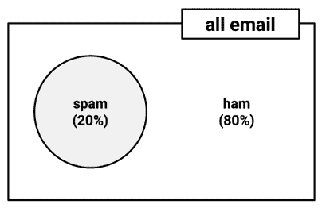

图 4.1：所有电子邮件的概率空间可以表示为垃圾邮件和正常邮件的分区

### 理解联合概率

通常，我们在同一试验中会对几个非互斥事件进行监控。如果某些事件与感兴趣的事件同时发生，我们可能能够利用它们进行预测。例如，考虑一个基于电子邮件消息包含单词*Viagra*的结果的第二个事件。更新此第二个事件的先前列表可能如下所示：

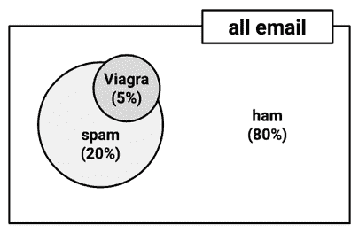

图 4.2：非互斥事件表示为重叠的分区

注意在图中，Viagra 圆圈与图中的垃圾邮件和 ham 区域重叠，并且垃圾邮件圆圈包括 Viagra 圆圈未覆盖的区域。这表明并非所有垃圾邮件都包含 Viagra 这个词，并且一些包含 Viagra 的消息是 ham。然而，由于这个词在垃圾邮件之外出现得非常少，它在新的传入消息中的出现将是该消息是垃圾邮件的强烈证据。

为了更仔细地观察这两个圆之间的重叠，我们将使用一种称为**维恩图**的可视化方法。这种图最早在 19 世纪末由数学家约翰·文恩使用，它使用圆来表示项目集合的重叠。与大多数维恩图一样，图中圆的大小和重叠程度没有意义。相反，它被用作提醒，将概率分配给所有事件组合。垃圾邮件和 Viagra 的维恩图可能如下所示：

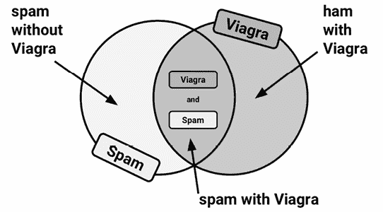

图 4.3：一个维恩图展示了垃圾邮件和 Viagra 事件的交集

我们知道所有消息中有 20%是垃圾邮件（左边的圆），所有消息中有 5%包含*Viagra*这个词（右边的圆）。我们希望量化这两个比例之间的重叠程度。换句话说，我们希望估计*P(spam)*和*P(Viagra)*同时发生的概率，这可以写成*P(spam  Viagra)*。**符号表示两个事件的交集；*A  B*的表示法指的是*A*和*B*同时发生的事件。

计算*P(spam  Viagra)*取决于两个事件的**联合概率**，即一个事件的概率如何与另一个事件的概率相关。如果两个事件完全无关，它们被称为**独立事件**。这并不是说独立事件不能同时发生；事件独立性仅仅意味着知道一个事件的结局不会提供任何关于另一个事件结局的信息。例如，抛硬币得到正面结果的结局与某一天是雨天还是晴天无关。

如果所有事件都是独立的，那么通过观察另一个事件来预测一个事件将是不可能的。换句话说，**相关事件**是预测建模的基础。就像云的存在预示着雨天一样，*Viagra*这个词的出现预示着垃圾邮件。


图 4.4：机器学习如何识别有用模式需要相关事件

计算相关事件的概率比独立事件要复杂一些。如果*P(spam)*和*P(Viagra)*是独立的，我们可以轻松地计算出*P(spam  Viagra)*，即两个事件同时发生的概率。因为所有消息中有 20%是垃圾邮件，所有邮件中有 5%包含*Viagra*这个词，我们可以假设所有包含*Viagra*这个词的消息中有 1%是垃圾邮件。这是因为*0.05 * 0.20 = 0.01*。更普遍地，对于独立事件*A*和*B*，两个事件同时发生的概率可以计算为*P(A  B) = P(A) * P(B)*。

话虽如此，我们知道*P(spam)*和*P(Viagra)*很可能高度相关，这意味着这个计算是不正确的。为了得到一个更合理的估计，我们需要使用这两个事件之间关系的更谨慎的公式，这个公式基于更先进的贝叶斯方法。

### 使用贝叶斯定理计算条件概率

可以使用**贝叶斯定理**来描述相关事件之间的关系，它提供了一种思考如何根据另一个事件提供的证据来修订一个事件概率估计的方法。一种公式如下：

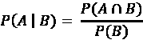

符号*P(A|B)*读作事件*B*发生的情况下事件*A*的概率。这被称为**条件概率**，因为*A*的概率依赖于（即条件于）事件*B*的发生。

贝叶斯定理表明，*P(A|B)*的最佳估计是在所有发生事件*B*的试验中，事件*A*发生的试验比例。这意味着如果每次观察到*B*时*A*和*B*经常一起发生，事件*A*的概率就会更高。请注意，这个公式调整了*P(A  B)*以反映*B*发生的概率。如果*B*非常罕见，*P(B)*和*P(A  B)*将始终很小；然而，如果*A*几乎总是与*B*一起发生，尽管*B*很罕见，*P(A|B)*仍然会很高。

根据定义，*P(A  B) = P(A|B) * P(B)*，这是一个可以通过对先前公式应用一点代数轻松推导出的事实。利用*P(A  B) = P(B  A)*的知识重新排列这个公式，我们得出结论，*P(A  B) = P(B|A) * P(A)*，我们可以在贝叶斯定理的以下公式中使用它：

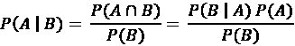

事实上，这是基于我们将它应用于机器学习时将变得清晰的原因的传统贝叶斯定理公式。首先，为了更好地理解贝叶斯定理在实际中的工作原理，让我们回顾一下我们的假设性垃圾邮件过滤器。

在不知道收到的邮件内容的情况下，对其是否为垃圾邮件的最佳估计将是*P(spam)*，即任何先前邮件是垃圾邮件的概率。这个估计被称为**先验概率**。我们之前发现这个概率是 20%。

假设你通过更仔细地查看先前收到的邮件集并检查“Viagra”一词出现的频率获得了额外的证据。单词*Viagra*在先前垃圾邮件中被使用的概率，或*P(Viagra|spam)*，被称为**似然性**。*Viagra*在任何邮件中出现的概率，或*P(Viagra)*，被称为**边缘似然性**。

通过将贝叶斯定理应用于这一证据，我们可以计算一个**后验概率**，该概率衡量一条消息是垃圾邮件的可能性。如果后验概率大于 50%，则该消息更有可能是垃圾邮件而不是正常邮件，可能需要过滤。以下公式显示了贝叶斯定理是如何应用于先前电子邮件消息提供的证据的：

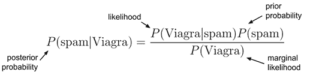

图 4.5：贝叶斯定理作用于先前收到的电子邮件

要计算贝叶斯定理的组成部分，构建一个**频率表**（如下表中左侧所示）记录*Viagra*在垃圾邮件和正常邮件中出现的次数是有帮助的。就像一个双向交叉表一样，表的其中一个维度表示类别变量（垃圾邮件或正常邮件）的水平，而另一个维度表示特征（Viagra：是或否）的水平。然后，单元格表示具有指定类别值和特征值的实例数量。

然后，可以使用频率表来构建一个**似然表**，如下表中右侧所示。似然表的行表示在电子邮件是垃圾邮件或正常邮件的情况下，对于*Viagra*（是/否）的条件概率。

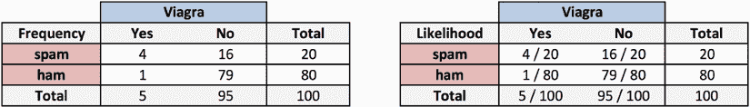

图 4.6：频率和似然表是计算垃圾邮件后验概率的基础

似然表显示*P(Viagra=Yes|spam) = 4 / 20 = 0.20*，这表明如果一条消息是垃圾邮件，那么包含术语*Viagra*的概率是 20%。此外，由于*P(A  B) = P(B|A) * P(A)*，我们可以计算*P(spam  Viagra)*为*P(Viagra|spam) * P(spam) = (4 / 20) * (20 / 100) = 0.04*。同样的结果可以在频率表中找到，该表指出 100 条消息中有 4 条是垃圾邮件并包含术语*Viagra*。无论如何，这比我们之前在错误假设独立性下计算的*P(A  B) = P(A) * P(B)*的估计值 0.01 高出四倍。这当然说明了贝叶斯定理在估计联合概率中的重要性。

要计算后验概率，*P(spam|Viagra)*，我们只需取*P(Viagra|spam) * P(spam) / P(Viagra)*，或者*(4 / 20) * (20 / 100) / (5 / 100) = 0.80*。因此，如果一条消息包含单词*Viagra*，那么这条消息是垃圾邮件的概率是 80%。鉴于这一发现，任何包含此术语的消息可能应该被过滤。

这正是商业垃圾邮件过滤器的工作方式，尽管在计算频率和似然表时，它们会同时考虑更多的单词。在下一节中，我们将看到如何将这种方法适应涉及额外特征的情况。

## 简单贝叶斯算法

**朴素贝叶斯**算法定义了一种简单的方法，将贝叶斯定理应用于分类问题。尽管它不是唯一利用贝叶斯方法的机器学习方法，但它是最常见的。由于它在文本分类中的成功，朴素贝叶斯变得非常流行，一度成为事实上的标准。该算法的优点和缺点如下：

| **优点** | **缺点** |
| --- | --- |

|

+   简单、快速且非常有效

+   在有噪声和缺失数据以及大量特征的情况下表现良好

+   需要相对较少的训练示例

+   容易获得预测的估计概率

|

+   依赖于一个经常是错误的假设，即特征同等重要且相互独立

+   不适用于具有许多数值特征的集合

+   估计的概率不如预测的类别可靠

|

朴素贝叶斯算法之所以被称为“朴素”，是因为它对数据做出了一些所谓的“朴素”假设。特别是，朴素贝叶斯假设数据集中的所有特征都是**同等重要且相互独立**的。在大多数实际应用中，这些假设很少是真实的。

例如，当尝试通过监控电子邮件消息来识别垃圾邮件时，几乎可以肯定的是，某些特征将比其他特征更重要。例如，电子邮件发送者可能是比消息文本更重要的垃圾邮件指示器。此外，消息正文中的单词并不是相互独立的，因为某些单词的出现是其他单词也很可能出现的很好指示。包含“Viagra”一词的消息很可能也包含“prescription”或“drugs”一词。

然而，在大多数情况下，即使这些假设被违反，朴素贝叶斯仍然表现出惊人的性能。即使在特征之间存在强依赖性的情况下，也是如此。由于该算法在各种条件下的灵活性和准确性，尤其是在较小的训练数据集上，朴素贝叶斯经常是分类学习任务的合理基线候选者。

尽管朴素贝叶斯存在错误的假设，但它为何表现良好的确切原因一直是许多猜测的对象。一种解释是，只要预测准确，获得概率的精确估计并不重要。例如，如果一个垃圾邮件过滤器正确地识别出垃圾邮件，那么预测垃圾邮件的概率是 51%还是 99%又有什么关系呢？关于这个话题的一个讨论，请参阅*《在零一损失下简单贝叶斯分类器的最优性》，作者：Domingos, P. 和 Pazzani, M.，机器学习，1997 年，第 29 卷，第 103-130 页*。

### 使用朴素贝叶斯进行分类

让我们通过添加一些额外的监控术语来扩展我们的垃圾邮件过滤器，除了术语*Viagra*之外，还包括*money*、*groceries*和*unsubscribe*。朴素贝叶斯学习器通过构建这四个词（标记为*W*¹、*W*²、*W*³和*W*⁴）出现的可能性表来训练，如下图中 100 封电子邮件所示：

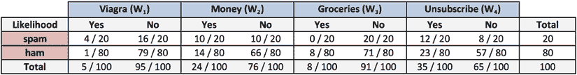

图 4.7：扩展的表格增加了垃圾邮件和正常邮件中额外术语的可能性

当收到新消息时，我们需要计算后验概率，以确定它们更有可能是垃圾邮件还是正常邮件，给定在消息文本中找到这些词的可能性。例如，假设一条消息包含术语*Viagra*和*unsubscribe*，但不包含*money*或*groceries*。

使用贝叶斯定理，我们可以将问题定义为以下公式。这计算了在*Viagra = 是*、*Money = 否*、*Groceries = 否*和*Unsubscribe = 是*的条件下，一条消息是垃圾邮件的概率：

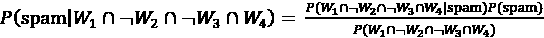

由于两个原因，这个公式在计算上很难解决。首先，随着附加特征的添加，需要大量的内存来存储所有可能交点事件的概率。想象一下四个词事件 Venn 图的复杂性，更不用说数百个或更多。其次，许多这些潜在的交点在过去的资料中从未被观察到，这会导致联合概率为零，并导致后面会变得明显的问题。

如果我们利用朴素贝叶斯对事件之间独立性的朴素假设，计算将变得更加合理。具体来说，它假设**类条件独立性**，这意味着只要事件基于相同的类值，它们就是独立的。条件独立性假设允许我们使用独立事件的概率规则，该规则指出 *P(A  B) = P(A) * P(B)*。这通过允许我们乘以单个条件概率而不是计算复杂的条件联合概率来简化分子。

最后，因为分母不依赖于目标类（垃圾邮件或正常邮件），它被视为一个常数，暂时可以忽略。这意味着垃圾邮件的条件概率可以表示为：

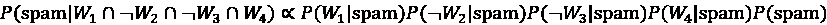

并且可以表示消息是正常邮件的概率为：

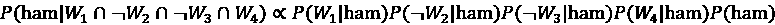

注意，等号已被比例符号（类似于侧向的、开口的“8”）替换，以表明分母已被省略。

使用可能性表中的值，我们可以开始填写这些方程中的数字。然后，垃圾邮件的整体可能性如下：

*(4 / 20) * (10 / 20) * (20 / 20) * (12 / 20) * (20 / 100) = 0.012*

而正常邮件的可能性是：

*(1 / 80) * (66 / 80) * (71 / 80) * (23 / 80) * (80 / 100) = 0.002*

因为*0.012 / 0.002 = 6*，我们可以说这条消息有 6 倍的可能性是垃圾邮件，而不是 ham。然而，为了将这些数字转换为概率，我们需要最后一步重新引入之前排除的除数。本质上，我们必须通过除以所有可能结果的总似然值来重新缩放每个结果的似然值。

这样，垃圾邮件的概率等于消息是垃圾邮件的可能性除以消息是垃圾邮件或 ham 的可能性：

*0.012 / (0.012 + 0.002) = 0.857*

同样，ham 的概率等于消息是 ham 的可能性除以消息是垃圾邮件或 ham 的可能性：

*0.002 / (0.012 + 0.002) = 0.143*

根据这条消息中找到的单词模式，我们预计这条消息有 85.7%的概率是垃圾邮件，有 14.3%的概率是 ham。因为这些是互斥且穷尽的概率事件，所以它们的概率总和为 1。

在前一个例子中使用的朴素贝叶斯分类算法可以用以下公式总结。给定特征[F][1]到[F][n]提供的证据，对于类别*C*的*L*级概率等于每个证据在类别级条件下的概率乘积，类别级的先验概率，以及一个缩放因子*1 / Z*，它将似然值转换为概率。这被公式化为：

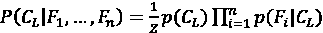

尽管这个方程看起来令人畏惧，但正如垃圾邮件过滤示例所示，这一系列步骤相当简单。首先构建一个频率表，然后使用这个表构建一个似然表，并使用朴素假设的独立性乘出条件概率。最后，除以总似然值，将每个类别的似然值转换为概率。尝试手动计算几次后，这将成为第二本能。

### 拉普拉斯估计器

在我们使用朴素贝叶斯解决更复杂的问题之前，有一些细微之处需要考虑。假设我们收到了另一条消息，这次包含所有四个术语：*Viagra*，*groceries*，*money*，和*unsubscribe*。使用之前的方法，我们可以计算垃圾邮件的可能性为：

*(4 / 20) * (10 / 20) * (0 / 20) * (12 / 20) * (20 / 100) = 0*

并且 ham 的似然值为：

*(1 / 80) * (14 / 80) * (8 / 80) * (23 / 80) * (80 / 100) = 0.00005*

因此，垃圾邮件的概率为：

*0 / (0 + 0.00005) = 0*

并且 ham 的概率为：

*0.00005 / (0 + 0.00005) = 1*

这些结果表明，该消息有 0%的概率是垃圾邮件，有 100%的概率是正常邮件。这个预测有道理吗？可能没有。消息中包含了一些通常与垃圾邮件相关的词汇，包括*伟哥*，这在合法消息中很少使用。因此，该消息被错误分类的可能性非常大。

如果一个事件在类的某个或多个级别上从未发生，那么由此产生的似然值将是零。例如，术语*杂货*以前从未出现在垃圾邮件中。因此，*P(groceries|spam) = 0%*。

现在，由于朴素贝叶斯公式中的概率是链式相乘的，这个零值导致垃圾邮件的后验概率为零，使得单词*杂货*能够有效地抵消并推翻所有其他证据。即使电子邮件在其他方面几乎肯定会被认为是垃圾邮件，垃圾邮件中缺少单词*杂货*也会始终否决其他证据，导致垃圾邮件的概率为零。

解决这个问题的方法涉及使用一种称为**拉普拉斯估计器**的东西，该估计器是以法国数学家皮埃尔-西蒙·拉普拉斯的名字命名的。拉普拉斯估计器将一个小数加到频率表中的每个计数上，这确保了每个特征在每种类别中都有非零发生的概率。通常，拉普拉斯估计器设置为 1，这确保每个类别-特征组合至少在数据中出现一次。

拉普拉斯估计器可以设置为任何值，并且不一定需要对每个特征都相同。如果你是一个虔诚的贝叶斯主义者，你可以使用拉普拉斯估计器来反映一个特征与类别相关的假设先验概率。在实践中，给定足够大的训练数据集，这通常是过度的。因此，值 1 几乎总是被使用。

让我们看看这如何影响我们对这条消息的预测。使用拉普拉斯值为 1，我们在似然函数的每个分子上加上 1。然后，我们需要在每个条件概率的分母上加上 4，以补偿分子上增加的 4 个额外值。因此，垃圾邮件的可能性是：

*(5 / 24) * (11 / 24) * (1 / 24) * (13 / 24) * (20 / 100) = 0.0004*

正常邮件的可能性是：

*(2 / 84) * (15 / 84) * (9 / 84) * (24 / 84) * (80 / 100) = 0.0001*

通过计算*0.0004 / (0.0004 + 0.0001)*，我们发现垃圾邮件的概率是 80%，因此正常邮件的概率大约是 20%。这个结果比仅用术语*杂货*确定结果时计算的*P(spam) = 0*更合理。

尽管拉普拉斯估计量被添加到了似然函数的分子和分母中，但它并没有被添加到先验概率中——即 20/100 和 80/100 的值。这是因为，根据数据中观察到的结果，我们对于垃圾邮件和正常邮件的整体概率的最佳估计仍然是 20%和 80%。

### 使用数值特征与简单贝叶斯

简单贝叶斯使用频率表来学习数据，这意味着每个特征必须是分类的，以便创建由类和特征值组成的矩阵的组合。由于数值特征没有值类别，因此前面的算法不能直接处理数值数据。然而，有几种方法可以解决这个问题。

一个简单而有效的方法是将数值特征**离散化**，这仅仅意味着将数字放入称为**分组**的类别中。因此，离散化有时也被称为**分组**。这种方法在有大量训练数据时效果最佳。

有几种不同的方法可以对数值特征进行离散化。可能最常见的方法是探索数据中的自然类别或分布中的**切割点**。例如，假设你向垃圾邮件数据集中添加了一个特征，记录了邮件发送的白天或夜晚时间，从午夜过后的 0 到 24 小时。使用直方图表示，时间数据可能看起来像以下图表：

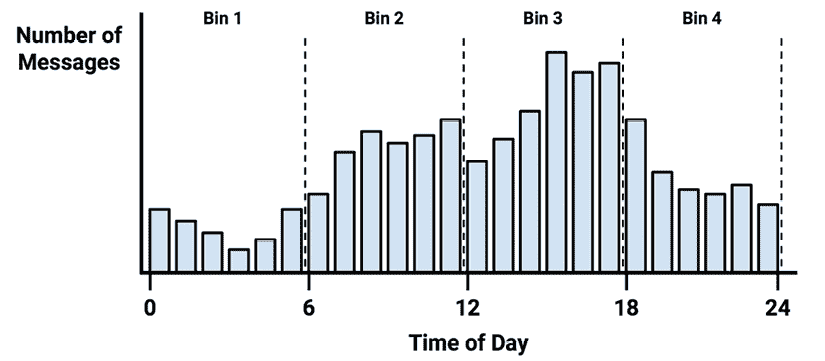

图 4.8：可视化接收电子邮件时间分布的直方图

在清晨时分，消息频率较低。在办公时间活动增加，而在晚上逐渐减少。这形成了四个自然的活动分组，如图中虚线所示。这些表示可以将数值数据划分为不同级别以创建新的分类特征的地方，然后可以使用简单贝叶斯。

四个分组的选取是基于数据的自然分布以及对于一整天中垃圾邮件比例可能变化的直觉。我们可能预期垃圾邮件发送者会在深夜活动，或者他们可能在白天人们检查邮件时活动。尽管如此，为了捕捉这些趋势，我们同样可以使用三个或十二个分组。

如果没有明显的切割点，一个选项是使用在*第二章*中介绍的量数对特征进行离散化。你可以用三分位数将数据分为三个分组，用四分位数分为四个分组，或者用五分位数分为五个分组。

需要注意的是，将数值特征离散化总是会导致信息量的减少，因为特征的原有粒度被减少到更少的类别。重要的是要找到平衡点。分类太少可能导致重要趋势被掩盖。分类太多可能导致朴素贝叶斯频率表中的计数很小，这可能会增加算法对噪声数据的敏感性。

# 示例 – 使用朴素贝叶斯算法过滤手机垃圾邮件

随着全球手机使用的增长，不道德的营销人员开辟了一条新的电子垃圾邮件途径。这些广告商利用短信文本消息针对潜在消费者发送不受欢迎的广告，即短信垃圾邮件。这种垃圾邮件很麻烦，因为与电子邮件垃圾邮件不同，短信消息由于手机无处不在，特别具有破坏性。开发一个能够过滤短信垃圾邮件的分类算法将为手机服务提供商提供一个有用的工具。

由于朴素贝叶斯分类器在电子邮件垃圾邮件过滤中已被成功应用，因此它似乎也可以应用于短信垃圾邮件。然而，相对于电子邮件垃圾邮件，短信垃圾邮件对自动过滤器提出了额外的挑战。短信消息通常限制在 160 个字符以内，这减少了用于识别消息是否为垃圾信息的文本量。这种限制，加上小型手机键盘，导致许多人采用一种短信缩写语，这进一步模糊了合法消息和垃圾邮件之间的界限。让我们看看简单的朴素贝叶斯分类器如何应对这些挑战。

## 第 1 步 – 收集数据

为了开发朴素贝叶斯分类器，我们将使用从[`www.dt.fee.unicamp.br/~tiago/smsspamcollection/`](https://www.dt.fee.unicamp.br/~tiago/smsspamcollection/)的短信垃圾邮件收集中改编的数据。

要了解更多关于短信垃圾邮件收集如何发展的信息，请参阅*关于新的短信垃圾邮件收集的有效性，Gómez, J. M.，Almeida, T. A.，和 Yamakami, A.，2012 年第 11 届 IEEE 国际机器学习与应用会议论文集*。

此数据集包括短信文本，以及一个标签，表示消息是否不受欢迎。垃圾消息被标记为垃圾邮件，而合法消息被标记为 ham。以下表格显示了垃圾邮件和 ham 的一些示例：

| **样本短信垃圾信息** | **样本短信垃圾邮件** |
| --- | --- |

|

+   更好。周五我补上了，昨天吃得像猪一样。现在感觉有点糟糕。但至少不是那种让人难以忍受的疼痛。

+   如果他开始寻找，几天内就能找到工作。他有很大的潜力和才能。

+   我又找到一份工作了！是在医院做数据分析之类的，周一开始！不确定我的论文什么时候能完成。

|

+   恭喜你，你获得了 500 元的 CD 代金券或 125 元的礼品保证，并且免费参加每周一次的抽奖活动，发送短信 MUSIC 到 87066。

+   12 月特惠！你的手机使用 11 个月以上了吗？你有权免费升级到最新的彩色摄像头手机！免费拨打 08002986906 至移动更新公司。

+   情人节特别优惠！在我们的问答比赛中赢得 1000 英镑，并带你的伴侣去一次终身难忘的旅行！现在发送 GO 到 83600。每条信息 150 便士。

|

观察前面的消息，你是否注意到垃圾邮件的任何显著特征？一个值得注意的特征是，三个垃圾邮件中有两个使用了单词*免费*，而这个词并没有出现在任何正常邮件中。另一方面，两条正常邮件提到了具体的星期几，而垃圾邮件中则没有。

我们的朴素贝叶斯分类器将利用单词频率中的这些模式来确定短信消息似乎更适合垃圾邮件还是正常邮件。虽然不能排除单词*免费*出现在垃圾邮件之外的情况，但合法的消息更有可能提供额外的单词来提供上下文。

例如，一条正常邮件可能会问：“你星期天有空吗？”而一条垃圾邮件可能会使用短语“免费铃声”。分类器将根据消息中所有单词提供的证据计算垃圾邮件和正常邮件的概率。

## 第 2 步 - 探索和准备数据

构建我们的分类器第一步涉及对原始数据进行处理以进行分析。文本数据准备起来具有挑战性，因为需要将单词和句子转换成计算机可以理解的形式。我们将把我们的短信数据转换成一种称为**词袋**的表示形式，它提供了一种二元特征，表示每个单词是否出现在给定的示例中，同时忽略单词顺序或单词出现的上下文。尽管这是一种相对简单的表示形式，但正如我们很快将展示的，它对于许多分类任务来说已经足够好了。

这里使用的数据集已经从原始数据集稍作修改，以便更容易在 R 中使用。如果你打算跟随示例，请从 Packt 网站下载`sms_spam.csv`文件并将其保存到你的 R 工作目录中。

我们将首先导入 CSV 数据并将其保存到数据框中：

```py
> sms_raw <- read.csv("sms_spam.csv") 
```

使用`str()`函数，我们可以看到`sms_raw`数据框包括 5559 条总短信消息，具有两个特征：`type`和`text`。短信类型已被编码为 ham 或 spam。`text`元素存储完整的原始短信消息文本：

```py
> str(sms_raw) 
```

```py
'data.frame':    5559 obs. of  2 variables:
 $ type: chr  "ham" "ham" "ham" "spam" ...
 $ text: chr  "Hope you are having a good week. Just checking in"
"K..give back my thanks." "Am also doing in cbe only. But have to
pay." "complimentary 4 STAR Ibiza Holiday or £10,000 cash needs your
URGENT collection. 09066364349 NOW from Landline not to lose out"|
__truncated__ ... 
```

`type`元素目前是一个字符向量。由于这是一个分类变量，最好将其转换为因子，如下面的代码所示：

```py
> sms_raw$type <- factor(sms_raw$type) 
```

使用`str()`和`table()`函数检查，我们发现`type`现在已被适当地重新编码为因子。此外，我们还可以看到在我们的数据中，有 747 条（大约 13%）短信消息被标记为`spam`，其余的则被标记为`ham`：

```py
> str(sms_raw$type) 
```

```py
 Factor w/ 2 levels "ham","spam": 1 1 1 2 2 1 1 1 2 1 ... 
```

```py
> table(sms_raw$type) 
```

```py
 ham spam
4812 747 
```

目前，我们将保持短信文本不变。您将在下一节中了解到，处理原始短信需要使用一套专门为处理文本数据设计的强大工具。

### 数据准备——清洗和标准化文本数据

短信消息是由单词、空格、数字和标点符号组成的文本字符串。处理这种复杂的数据类型需要大量的思考和努力。需要考虑如何删除数字和标点；处理无趣的词，例如*和*、*但*和*或*；以及将句子分解成单个单词。幸运的是，这种功能已经由 R 社区的成员在一个名为`tm`的文本挖掘包中提供。

`tm`包最初是由维也纳经济和商业大学的 Ingo Feinerer 作为学位论文项目创建的。要了解更多信息，请参阅*《R 中的文本挖掘基础设施》，作者：Feinerer, I.，Hornik, K.和 Meyer, D.，统计软件杂志，2008 年，第 25 卷，第 1-54 页*。

可以通过`install.packages("tm")`命令安装`tm`包，并通过`library(tm)`命令加载。即使您已经安装了它，重新安装也可能值得，以确保您的版本是最新的，因为`tm`包仍在积极开发中。这偶尔会导致其功能发生变化。

本章使用`tm`版本 0.7-11 进行了测试，截至 2023 年 5 月，这是当前版本。如果您看到输出有差异或代码无法工作，您可能使用的是不同版本。本书的 Packt 支持页面以及其 GitHub 仓库将发布针对未来`tm`包版本的解决方案，如果发现重大变化。

处理文本数据的第一个步骤是创建一个**语料库**，它是一组文本文档的集合。文档可以是短或长的，从单个新闻文章、书籍的页面、网页页面，甚至整本书。在我们的情况下，语料库将是一组短信。

要创建一个语料库，我们将使用`tm`包中的`VCorpus()`函数，它指的是一个易失性语料库——这里的“易失性”意味着它存储在内存中，而不是存储在磁盘上（使用`PCorpus()`函数来访问存储在数据库中的永久性语料库）。此函数要求我们指定语料库文档的来源，这可能是计算机的文件系统、数据库、网络或其他地方。

由于我们已经在 R 中加载了短信文本，我们将使用`VectorSource()`读取器函数从现有的`sms_raw$text`向量创建一个源对象，然后可以将其如下提供给`VCorpus()`：

```py
> sms_corpus <- VCorpus(VectorSource(sms_raw$text)) 
```

生成的语料库对象以`sms_corpus`命名保存。

通过指定可选的`readerControl`参数，`VCorpus()`函数可以用于从 PDF 和 Microsoft Word 文件等来源导入文本。要了解更多信息，请使用`vignette("tm")`命令检查`tm`包的*数据导入*部分。

通过打印语料库，我们看到它包含训练数据中 5,559 条短信消息的文档：

```py
> print(sms_corpus) 
```

```py
<<VCorpus>>
Metadata:  corpus specific: 0, document level (indexed): 0
Content:  documents: 5559 
```

现在，因为`tm`语料库本质上是一个复杂列表，我们可以使用列表操作来选择语料库中的文档。`inspect()`函数显示了结果的摘要。例如，以下命令将查看语料库中第一条和第二条短信消息的摘要：

```py
> inspect(sms_corpus[1:2]) 
```

```py
<<VCorpus>>
Metadata:  corpus specific: 0, document level (indexed): 0
Content:  documents: 2
[[1]]
<<PlainTextDocument>>
Metadata:  7
Content:  chars: 49
[[2]]
<<PlainTextDocument>>
Metadata:  7
Content:  chars: 23 
```

要查看实际的消息文本，必须对所需的消息应用`as.character()`函数。要查看一条消息，请在单个列表元素上使用`as.character()`函数，注意需要使用双括号表示法：

```py
> as.character(sms_corpus[[1]]) 
```

```py
[1] "Hope you are having a good week. Just checking in" 
```

要查看多个文档，我们需要将`as.character()`应用于`sms_corpus`对象中的多个项。为此，我们将使用`lapply()`函数，它是 R 数据结构中应用程序的一个函数家族的一部分。这些函数，包括`apply()`和`sapply()`等，是 R 语言的关键习惯用法之一。经验丰富的 R 程序员使用这些函数的方式类似于在其他编程语言中使用`for`或`while`循环，因为它们会产生更易读（有时更高效）的代码。将`as.character()`应用于语料库元素子集的`lapply()`函数如下：

```py
> lapply(sms_corpus[1:2], as.character) 
```

```py
$'1'
[1] "Hope you are having a good week. Just checking in"
$'2'
[1] "K..give back my thanks." 
```

如前所述，语料库包含 5,559 条文本消息的原始文本。为了进行我们的分析，我们需要将这些消息划分为单个单词。首先，我们需要清理文本以标准化单词并删除会干扰结果的标点符号。例如，我们希望字符串*Hello!*、*HELLO*和*hello*都被计为同一单词的实例。

`tm_map()`函数提供了一个将转换（也称为映射）应用于`tm`语料库的方法。我们将使用此函数通过一系列转换清理我们的语料库，并将结果保存在一个名为`corpus_clean`的新对象中。

我们的第一步转换将标准化消息以仅使用小写字母。为此，R 提供了一个`tolower()`函数，该函数返回文本字符串的小写版本。为了将此函数应用于语料库，我们需要使用`tm`包装函数`content_transformer()`将`tolower()`视为一个转换函数，该函数可以用于访问语料库。完整的命令如下：

```py
> sms_corpus_clean <- tm_map(sms_corpus,
    content_transformer(tolower)) 
```

为了检查命令是否按预期工作，让我们检查原始语料库中的第一条消息并将其与转换语料库中的相同消息进行比较：

```py
> as.character(sms_corpus[[1]]) 
```

```py
[1] "Hope you are having a good week. Just checking in" 
```

```py
> as.character(sms_corpus_clean[[1]]) 
```

```py
[1] "hope you are having a good week. just checking in" 
```

如预期的那样，清理后的语料库中的大写字母已被替换为小写版本。

`content_transformer()` 函数可用于应用更复杂的文本处理和清理过程，例如 `grep` 模式匹配和替换。只需编写一个自定义函数，并在应用 `tm_map()` 函数之前将其包装起来。

让我们继续清理过程，通过从短信中移除数字。尽管一些数字可能提供有用信息，但大多数数字可能仅对个别发送者独特，因此不会在所有消息中提供有用的模式。考虑到这一点，我们将从语料库中移除所有数字，如下所示：

```py
> sms_corpus_clean <- tm_map(sms_corpus_clean, removeNumbers) 
```

注意，前面的代码没有使用 `content_transformer()` 函数。这是因为 `removeNumbers()` 与 `tm` 包一起提供，还包括其他不需要包装的映射函数。要查看其他内置转换，请简单地输入 `getTransformations()`。

我们接下来的任务是移除短信中的填充词，如 *to*、*and*、*but* 和 *or*。这些术语被称为 **停用词**，通常在文本挖掘之前被移除。这是因为尽管它们出现频率很高，但它们对我们模型的有用信息不多，因为它们不太可能区分垃圾邮件和正常邮件。

我们不会自己定义停用词列表，而是使用 `tm` 包提供的 `stopwords()` 函数。此函数允许我们访问来自各种语言的停用词集合。默认情况下，使用的是常见的英语停用词。要在 R 命令提示符中查看默认列表，请输入 `stopwords()`。要查看其他语言和选项，请输入 `?stopwords` 以获取文档页面。

即使在单一语言中，也没有一个单一的、确定的停用词列表。例如，`tm` 中的默认英语列表包含大约 174 个单词，而另一个选项包含 571 个单词。你甚至可以指定自己的停用词列表。无论你选择哪个列表，都要记住这个转换的目标，即消除无用数据，同时尽可能保留有用信息。

仅定义停用词本身不是一种转换。我们需要的是一种方法来移除任何出现在停用词列表中的单词。解决方案在于 `tm` 包中包含的 `removeWords()` 函数。像之前一样，我们将使用 `tm_map()` 函数应用此映射到数据上，将 `stopwords()` 函数作为参数提供，以指示我们想要移除的单词。完整的命令如下：

```py
> sms_corpus_clean <- tm_map(sms_corpus_clean,
    removeWords, stopwords()) 
```

由于 `stopwords()` 仅返回一个停用词向量，如果我们选择这样做，我们可以用我们自己的单词移除向量替换此函数调用。这样，我们可以根据喜好扩展或减少停用词列表，或者完全移除不同的单词集。

继续我们的清理过程，我们还可以使用内置的 `removePunctuation()` 转换从文本消息中消除任何标点符号：

```py
> sms_corpus_clean <- tm_map(sms_corpus_clean, removePunctuation) 
```

`removePunctuation()` 转换会完全从文本中移除标点符号，这可能会导致意想不到的后果。例如，考虑以下应用方式会发生什么：

```py
> removePunctuation("hello...world") 
```

```py
[1] "helloworld" 
```

如所示，省略号后面的空白缺失导致单词 *hello* 和 *world* 被合并为一个单词。虽然这目前不是一个重大问题，但值得注意。

为了绕过 `removePunctuation()` 的默认行为，可以创建一个自定义函数来替换而不是移除标点符号：

```py
> replacePunctuation <- function(x) {
    gsub("[[:punct:]]+", " ", x)
  } 
```

这使用 R 的 `gsub()` 函数将 `x` 中的任何标点符号替换为一个空格。然后可以使用 `tm_map()` 与其他转换一样使用 `replacePunctuation()` 函数。这里 `gsub()` 命令的奇怪语法是由于使用了 **正则表达式**，它指定了一个匹配文本字符的模式。正则表达式在 *第十二章*，*高级数据准备* 中有更详细的介绍。

文本数据的另一个常见标准化涉及通过称为 **词干提取** 的过程将单词还原到其根形式。词干提取过程将像 *learned*、*learning* 和 *learns* 这样的单词去除后缀，以便将它们转换为基本形式，*learn*。这允许机器学习算法将相关术语视为单一概念，而不是尝试为每个变体学习一个模式。

`tm` 包通过集成 `SnowballC` 包提供词干提取功能。在撰写本文时，`SnowballC` 并未默认与 `tm` 一起安装，因此如果您尚未安装，请使用 `install.packages("SnowballC")` 进行安装。

`SnowballC` 包由 Milan Bouchet-Valat 维护，并为基于 C 的 `libstemmer` 库提供 R 接口，该库本身基于 M. F. Porter 的“Snowball”词干提取算法，这是一种广泛使用的开源词干提取方法。有关更多详细信息，请参阅 [`snowballstem.org`](http://snowballstem.org)。

`SnowballC` 包提供了一个 `wordStem()` 函数，对于一个字符向量，它会返回其根形式的相同术语向量。例如，该函数正确地处理了之前描述的单词 *learn* 的变体：

```py
> library(SnowballC)
> wordStem(c("learn", "learned", "learning", "learns")) 
```

```py
[1] "learn"   "learn"   "learn"   "learn" 
```

要将 `wordStem()` 函数应用于整个文本文档集合，`tm` 包包括一个 `stemDocument()` 转换。我们使用 `tm_map()` 函数以与之前相同的方式应用此转换：

```py
> sms_corpus_clean <- tm_map(sms_corpus_clean, stemDocument) 
```

如果在应用 `stemDocument()` 转换时收到错误消息，请确认您已安装 `SnowballC` 包。

在移除数字、停用词和标点符号后，然后也进行词干提取，文本消息就只剩下之前分隔现在缺失部分的空白空间。因此，我们文本清理过程的最后一步是使用内置的 `stripWhitespace()` 转换来移除额外的空白：

```py
> sms_corpus_clean <- tm_map(sms_corpus_clean, stripWhitespace) 
```

下表显示了在清洗过程前后，短信语料库中的前三条消息。消息已被限制为最有趣的单词，并且已经移除了标点和大小写：

| **清洗前的短信消息** | **清洗后的短信消息** |
| --- | --- |
| `> as.character(sms_corpus[1:3])``[[1]] Hope you are having a good``week. Just checking in``[[2]] K..give back my thanks.``[[3]] Am also doing in cbe only.``But have to pay.` | `> as.character(sms_corpus_clean[1:3])``[[1]] hope good week just check``[[2]] kgive back thank``[[3]] also cbe pay` |

### 数据准备 – 将文本文档分割成单词

现在数据已经被处理成我们所期望的样子，最后一步是通过一个叫做**分词**的过程将消息分割成单个术语。术语是文本字符串的单个元素；在这种情况下，术语是单词。

如你所想，`tm`包提供了对 SMS 消息语料库进行分词的功能。`DocumentTermMatrix()`函数接受一个语料库并创建一个称为**文档-术语矩阵**（**DTM**）的数据结构，其中行表示文档（短信消息），列表示术语（单词）。

`tm`包还提供了一个**术语-文档矩阵**（**TDM**）的数据结构，它实际上是一个转置的文档-术语矩阵（**DTM**），其中行是术语，列是文档。为什么需要两者？有时，使用其中一个更方便。例如，如果文档数量很少，而单词列表很大，那么使用 TDM 可能是有意义的，因为通常显示多行比显示多列更容易。话虽如此，机器学习算法通常需要 DTM，因为列是特征，行是示例。

矩阵中的每个单元格存储一个数字，表示列中单词在行中文档中出现的次数。以下图仅显示了 SMS 语料库 DTM 的一小部分，因为完整的矩阵有 5,559 行和超过 7,000 列：

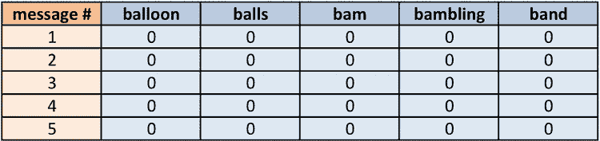

图 4.9：SMS 消息的 DTM 主要由零填充

表格中每个单元格为零的事实意味着列顶部的单词列表中的任何一个单词都没有出现在语料库的前五条消息中。这突出了为什么这种数据结构被称为**稀疏矩阵**的原因；矩阵中的绝大多数单元格都是零。用现实世界的术语来说，尽管每条消息必须至少包含一个单词，但任何单个单词出现在给定消息中的概率很小。

从*tm*语料库创建 DTM 稀疏矩阵只需要一个命令：

```py
> sms_dtm <- DocumentTermMatrix(sms_corpus_clean) 
```

这将创建一个`sms_dtm`对象，它使用默认设置包含分词后的语料库，这些设置应用了最小的额外处理。默认设置是合适的，因为我们已经手动准备了语料库。

另一方面，如果我们还没有执行预处理，我们可以通过提供一个`control`参数选项的列表来覆盖默认设置。例如，要从原始、未经处理的短信语料库直接创建 DTM，我们可以使用以下命令：

```py
> sms_dtm2 <- DocumentTermMatrix(sms_corpus, control = list(
    tolower = TRUE,
    removeNumbers = TRUE,
    stopwords = TRUE,
    removePunctuation = TRUE,
    stemming = TRUE
)) 
```

这将按照之前相同的顺序对 SMS 语料库进行相同的预处理步骤。然而，将`sms_dtm`与`sms_dtm2`比较，我们发现矩阵中的术语数量略有差异：

```py
> sms_dtm 
```

```py
<<DocumentTermMatrix (documents: 5559, terms: 6559)>>
Non-/sparse entries: 42147/36419334
Sparsity           : 100%
Maximal term length: 40
Weighting          : term frequency (tf) 
```

```py
> sms_dtm2 
```

```py
<<DocumentTermMatrix (documents: 5559, terms: 6961)>>
Non-/sparse entries: 43221/38652978
Sparsity           : 100%
Maximal term length: 40
Weighting          : term frequency (tf) 
```

这种差异的原因与预处理步骤顺序的微小差异有关。`DocumentTermMatrix()`函数在将文本字符串分割成单词之后，才对其应用清理函数。因此，它使用了一个稍微不同的停用词去除函数。因此，某些单词在清理之前分割的方式与清理后不同。

要强制两个先前的 DTM（文档-词矩阵）相同，我们可以用我们自己的使用原始替换函数的函数覆盖默认的停用词函数。只需将`stopwords = TRUE`替换为以下内容：

```py
stopwords = function(x) { removeWords(x, stopwords()) } 
```

本章的代码文件包括创建一个相同的 DTM 所需的完整步骤，只需一个函数调用即可。

这些差异提出了清理文本数据的一个重要原则：操作的顺序很重要。考虑到这一点，思考过程早期步骤如何影响后续步骤非常重要。这里提供的顺序在许多情况下都会有效，但当过程更细致地针对特定数据集和用例定制时，可能需要重新思考。例如，如果你希望从矩阵中排除某些术语，考虑是否在词干提取之前或之后搜索它们。还要考虑移除标点符号（以及标点符号是否被替换为空白空间）如何影响这些步骤。

### 数据准备 – 创建训练和测试数据集

在我们的数据准备好分析后，我们现在需要将数据分为训练和测试数据集，以便在构建垃圾邮件分类器之后，它可以在之前未见过的数据上评估。然而，尽管我们需要保持分类器对测试数据集的内容不知情，但在数据清理和加工之后进行分割很重要。我们需要确保训练和测试数据集上发生的准备步骤完全相同。

我们将数据分为两部分：75%用于训练，25%用于测试。由于短信消息是随机排序的，我们可以简单地取前 4,169 条用于训练，剩下的 1,390 条用于测试。幸运的是，DTM 对象非常类似于数据框，可以使用标准的`[行，列]`操作进行分割。由于我们的 DTM 将短信消息存储为行，将单词存储为列，我们必须为每个请求特定的行范围和所有列：

```py
> sms_dtm_train <- sms_dtm[1:4169, ]
> sms_dtm_test  <- sms_dtm[4170:5559, ] 
```

为了方便起见，保存一对向量，其中包含训练和测试矩阵中每行的标签也是有帮助的。这些标签没有存储在 DTM 中，因此我们需要从原始 `sms_raw` 数据框中提取它们：

```py
> sms_train_labels <- sms_raw[1:4169, ]$type
> sms_test_labels  <- sms_raw[4170:5559, ]$type 
```

为了确认这些子集代表完整的短信数据集，让我们比较训练和测试数据框中垃圾邮件的比例：

```py
> prop.table(table(sms_train_labels)) 
```

```py
 ham      spam
0.8647158 0.1352842 
```

```py
> prop.table(table(sms_test_labels)) 
```

```py
 ham      spam
0.8683453 0.1316547 
```

训练数据和测试数据中大约有 13%的垃圾邮件。这表明垃圾邮件在这两个数据集中是平均分配的。

### 可视化文本数据 – 单词云

**单词云**是一种以视觉方式表示文本数据中单词出现频率的方法。云由围绕图形随机散布的单词组成。在文本中出现频率更高的单词以较大的字体显示，而较少出现的术语则以较小的字体显示。这种类型的图表作为观察社交媒体网站上趋势话题的一种方式而越来越受欢迎。

`wordcloud` 包提供了一个简单的 R 函数来创建此类图表。我们将使用它来可视化短信中的单词。比较垃圾邮件和正常邮件的云图将帮助我们判断我们的朴素贝叶斯垃圾邮件过滤器是否可能成功。如果您还没有这样做，请在 R 命令行中输入 `install.packages("wordcloud")` 和 `library(wordcloud)` 来安装和加载此包。

`wordcloud` 包是由 Ian Fellows 编写的。有关此包的更多信息，请访问他的博客[`blog.fellstat.com/?cat=11`](http://blog.fellstat.com/?cat=11)。

可以直接使用以下语法从 *tm* 语料库对象创建单词云：

```py
> wordcloud(sms_corpus_clean, min.freq = 50, random.order = FALSE) 
```

这将根据我们准备好的短信语料库创建单词云。由于我们指定了 `random.order = FALSE`，云将按非随机顺序排列，高频词将放置在中心附近。如果我们不指定 `random.order`，则默认随机排列。

`min.freq` 参数指定单词在语料库中必须出现的次数，才能在云中显示。由于频率为 50 大约是语料库的 1%，这意味着一个单词必须至少出现在 1%的短信中才能包含在云中。

您可能会收到一条警告消息，指出 R 无法将所有单词拟合到图中。如果是这样，请尝试增加 `min.freq` 以减少云中的单词数量。使用 `scale` 参数减小字体大小也可能有所帮助。

生成的单词云应类似于以下示例：


图 4.10：展示所有短信中出现的单词的单词云

一个可能更有趣的可视化是将垃圾邮件和正常短信的云进行比较。由于我们没有为垃圾邮件和正常短信构建单独的语料库，这是注意 `wordcloud()` 函数的一个非常有用的特性的合适时机。给定一个原始文本字符串向量，它将在显示云之前自动应用常见的文本准备过程。

让我们使用 R 的 `subset()` 函数通过短信类型对 `sms_raw` 数据进行子集化。首先，我们将创建一个 `type` 为 `spam` 的子集：

```py
> spam <- subset(sms_raw, type == "spam") 
```

接下来，我们将对 `ham` 子集做同样的事情：

```py
> ham <- subset(sms_raw, type == "ham") 
```

注意双等号的使用。像许多编程语言一样，R 使用 `==` 来测试相等性。如果你不小心使用了单个等号，你最终会得到一个比你预期的更大的子集！

现在我们有两个数据框，`spam` 和 `ham`，每个数据框都有一个包含短信原始文本字符串的 `text` 特征。创建词云就像以前一样简单。这次，我们将使用 `max.words` 参数来查看每个集合中最常见的 40 个单词。`scale` 参数调整云中单词的最大和最小字体大小。你可以根据需要更改这些参数。以下代码展示了这一点：

```py
> wordcloud(spam$text, max.words = 40, scale = c(3, 0.5))
> wordcloud(ham$text, max.words = 40, scale = c(3, 0.5)) 
```

注意，当运行此代码时，R 会提供警告信息，指出“转换丢弃文档”。这些警告与 `wordcloud()` 在接收到原始文本数据而不是术语矩阵时默认执行的 `removePunctuation()` 和 `removeWords()` 程序有关。基本上，有一些消息被排除在结果之外，因为在清理后没有剩余的消息文本。例如，带有文本 *:)* 表示笑脸表情的垃圾邮件消息在清理后被从集合中移除。这对词云没有问题，可以忽略这些警告。

生成的词云应该看起来与下面的类似。你有没有一种预感，哪一个是垃圾邮件云，哪一个是正常短信云？


图 4.11：并排显示的词云，描绘了垃圾邮件和正常短信消息

如你所猜，垃圾邮件云在左边。垃圾邮件包括诸如 *call*、*free*、*mobile*、*claim* 和 *stop* 等单词；这些术语根本不会出现在垃圾邮件云中。相反，垃圾邮件使用诸如 *can*、*sorry*、*love* 和 *time* 等单词。这些明显的差异表明，我们的朴素贝叶斯模型将有一些强有力的关键词来区分这两类。

### 数据准备 – 为频繁单词创建指示特征

数据准备过程的最后一步是将稀疏矩阵转换成可以用于训练 Naive Bayes 分类器的数据结构。目前，稀疏矩阵包括超过 6,500 个特征；这是每个至少出现在一条短信中的单词的特征。不太可能所有这些都有助于分类。为了减少特征数量，我们将删除在不到 5 条消息或训练数据中不到约 0.1% 的记录中出现的任何单词。

寻找频繁单词需要使用 `tm` 包中的 `findFreqTerms()` 函数。此函数接受一个 DTM 并返回一个包含至少出现最小次数的单词的字符向量。例如，以下命令显示在 `sms_dtm_train` 矩阵中至少出现五次的单词：

```py
> findFreqTerms(sms_dtm_train, 5) 
```

函数的结果是一个字符向量，所以让我们将我们的频繁单词保存起来以备后用：

```py
> sms_freq_words <- findFreqTerms(sms_dtm_train, 5) 
```

查看向量的内容显示，至少在 5 条短信中出现的术语有 1,139 个：

```py
> str(sms_freq_words) 
```

```py
 chr [1:1137] "£wk" "abiola" "abl" "abt" "accept" "access" "account" "across" "act" "activ" ... 
```

现在我们需要过滤我们的 DTM，只包含频繁单词向量中出现的术语。像之前一样，我们将使用数据框风格的 `[row, col]` 操作来请求 DTM 的特定部分，注意 DTM 的列名是基于 DTM 包含的单词。我们可以利用这个事实来限制 DTM 到特定的单词。由于我们想要所有行，但只有 `sms_freq_words` 向量中单词表示的列，我们的命令如下：

```py
> sms_dtm_freq_train <- sms_dtm_train[ , sms_freq_words]
> sms_dtm_freq_test <- sms_dtm_test[ , sms_freq_words] 
```

训练和测试数据集现在包括 1,137 个特征，这些特征对应于至少在 5 条消息中出现的单词。

Naive Bayes 分类器通常在具有分类特征的数据上训练。这带来一个问题，因为稀疏矩阵中的单元格是数值型的，并衡量一个单词在消息中出现的次数。我们需要将其转换为表示是否出现的分类变量，是或否。 

以下定义了一个 `convert_counts()` 函数，用于将计数转换为 `Yes` 或 `No` 字符串：

```py
> convert_counts <- function(x) {
    x <- ifelse(x > 0, "Yes", "No")
} 
```

到目前为止，前面函数的一些部分应该看起来很熟悉。第一行定义了函数。语句 `ifelse(x > 0, "Yes", "No")` 将 `x` 中的值进行转换，如果值大于 `0`，则将其替换为 `"Yes"`；否则，将其替换为一个 `"No"` 字符串。最后，返回新转换的向量 `x`。

现在我们需要将 `convert_counts()` 应用到稀疏矩阵的每一列。你可能能够猜到执行此操作的 R 函数的名称。该函数简单地称为 `apply()`，其用法与之前使用的 `lapply()` 类似。

`apply()`函数允许对矩阵中的每一行或每一列使用一个函数。它使用`MARGIN`参数来指定是行还是列。在这里，我们将使用`MARGIN = 2`，因为我们感兴趣的是列（`MARGIN = 1`用于行）。转换训练和测试矩阵的命令如下：

```py
> sms_train <- apply(sms_dtm_freq_train, MARGIN = 2,
    convert_counts)
> sms_test  <- apply(sms_dtm_freq_test, MARGIN = 2,
    convert_counts) 
```

结果将是两个字符类型的矩阵，每个矩阵的单元格都表示列中单词是否在任何时刻出现在行中代表的邮件中，是“是”还是“否”。

## 第 3 步 – 在数据上训练模型

现在我们已经将原始短信消息转换成了可以由统计模型表示的格式，是时候应用朴素贝叶斯算法了。该算法将使用单词的存在或不存在来估计给定短信消息是垃圾邮件的概率。

我们将使用的朴素贝叶斯实现是在`naivebayes`包中。这个包由 Michal Majka 维护，是一个现代且高效的 R 实现。如果您还没有这样做，请确保在继续之前使用`install.packages("naivebayes")`和`library(naivebayes)`命令安装并加载该包。

许多机器学习方法在多个 R 包中实现，朴素贝叶斯也不例外。另一个选项是`e1071`包中的`naiveBayes()`，这在本书的旧版本中使用过，但在使用上几乎与`naive_bayes()`相同。本版使用的`naivebayes`包提供了更好的性能和更高级的功能，详情请访问其网站：[`majkamichal.github.io/naivebayes/`](https://majkamichal.github.io/naivebayes/)。

与我们在上一章中用于分类的 k-NN 算法不同，朴素贝叶斯学习器的训练和使用分类发生在不同的阶段。尽管如此，如以下表格所示，这些步骤相当直接：

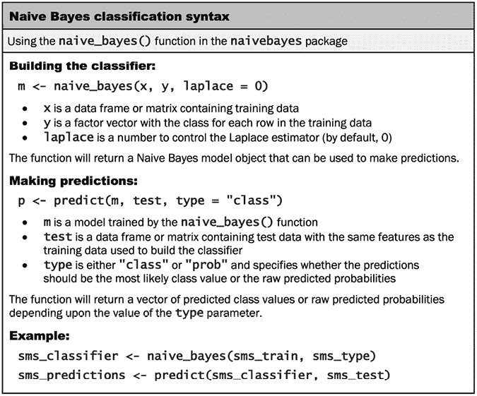

图 4.12：朴素贝叶斯分类语法

使用`sms_train`矩阵，以下命令训练了一个`naive_bayes`分类器对象，可以用来进行预测：

```py
> sms_classifier <- naiveBayes(sms_train, sms_train_labels) 
```

执行前面的命令后，您可能会注意到以下输出：

```py
There were 50 or more warnings (use warnings() to see the first 50) 
```

目前这没有什么好担心的；输入`warnings()`命令可以揭示这个问题的原因：

```py
> warnings() 
```

```py
Warning messages:
1: naive_bayes(): Feature £wk – zero probabilities are present. Consider Laplace smoothing.
2: naive_bayes(): Feature 60 biola – zero probabilities are present. Consider Laplace smoothing.
3: naive_bayes(): Feature abl – zero probabilities are present. Consider Laplace smoothing.
4: naive_bayes(): Feature abt – zero probabilities are present. Consider Laplace smoothing.
5: naive_bayes(): Feature accept – zero probabilities are present. Consider Laplace smoothing. 
```

这些警告是由那些在零垃圾邮件或零正常邮件中出现的单词引起的，由于它们关联的零概率，它们在分类过程中具有否决权。例如，因为单词*接受*仅在训练数据中的正常邮件中出现，这并不意味着每个包含这个单词的未来邮件都应该自动被分类为正常邮件。

使用前面描述的拉普拉斯估计器可以轻松解决这个问题，但到目前为止，我们将使用`laplace = 0`来评估这个模型，这是模型的默认设置。

## 第 4 步 – 评估模型性能

为了评估 SMS 分类器，我们需要在测试数据中未见过的新消息上测试其预测结果。回想一下，未见过的新消息特征存储在一个名为 `sms_test` 的矩阵中，而类别标签（垃圾邮件或正常邮件）存储在一个名为 `sms_test_labels` 的向量中。我们训练的分类器已被命名为 `sms_classifier`。我们将使用这个分类器来生成预测，然后比较预测值和真实值。

使用 `predict()` 函数进行预测。我们将这些预测存储在一个名为 `sms_test_pred` 的向量中。我们只需向这个函数提供我们分类器和测试数据集的名称，如下所示：

```py
> sms_test_pred <- predict(sms_classifier, sms_test) 
```

为了将预测值与真实值进行比较，我们将使用 `gmodels` 包中的 `CrossTable()` 函数，我们在前面的章节中使用过它。这次，我们将添加一些额外的参数来消除不必要的单元格比例，并使用 `dnn` 参数（维度名称）来重新标记行和列，如下面的代码所示：

```py
> library(gmodels)
> CrossTable(sms_test_pred, sms_test_labels,
    prop.chisq = FALSE, prop.c = FALSE, prop.r = FALSE,
    dnn = c('predicted', 'actual')) 
```

这产生了以下表格：

```py
Total Observations in Table:  1390 

             | actual 
   predicted |       ham |      spam | Row Total |
-------------|-----------|-----------|-----------|
         ham |      1201 |        30 |      1231 |
             |     0.864 |     0.022 |           |
-------------|-----------|-----------|-----------|
        spam |         6 |       153 |       159 |
             |     0.004 |     0.110 |           |
-------------|-----------|-----------|-----------|
Column Total |      1207 |       183 |      1390 |
-------------|-----------|-----------|-----------| 
```

观察表格，我们可以看到总共只有 *6 + 30 = 36* 条 1,390 条短信被错误分类（2.6%）。在这些错误中，有 6 条在 1,207 条正常邮件中被错误地识别为垃圾邮件，以及 30 条在 183 条垃圾邮件中被错误地标记为正常邮件。考虑到我们在项目上投入的少量努力，这种性能水平似乎相当令人印象深刻。这个案例研究说明了为什么朴素贝叶斯在文本分类中如此经常被使用：直接使用，它表现出令人惊讶的良好性能。

另一方面，被错误分类为垃圾邮件的六条合法消息可能会对我们过滤算法的部署造成重大问题，因为过滤器可能会使一个人错过一条重要的短信。我们应该尝试看看我们是否可以稍微调整模型以获得更好的性能。

## 第 5 步 – 提高模型性能

你可能还记得，我们在训练模型时没有为拉普拉斯估计器设置值；事实上，很难错过 R 警告我们超过 50 个特征概率为零的信息！为了解决这个问题，我们将像以前一样构建一个朴素贝叶斯模型，但这次将 `laplace = 1` 设置：

```py
> sms_classifier2 <- naiveBayes(sms_train, sms_train_labels,
    laplace = 1) 
```

接下来，我们将像以前一样进行预测：

```py
> sms_test_pred2 <- predict(sms_classifier2, sms_test) 
```

最后，我们将使用交叉表比较预测类别与实际分类：

```py
> CrossTable(sms_test_pred2, sms_test_labels,
    prop.chisq = FALSE, prop.c = FALSE, prop.r = FALSE,
    dnn = c('predicted', 'actual')) 
```

这产生了以下表格：

```py
Total Observations in Table:  1390 
             | actual 
   predicted |       ham |      spam | Row Total |
-------------|-----------|-----------|-----------|
         ham |      1202 |        28 |      1230 |
             |     0.865 |     0.020 |           |
-------------|-----------|-----------|-----------|
        spam |         5 |       155 |       160 |
             |     0.004 |     0.112 |           |
-------------|-----------|-----------|-----------|
Column Total |      1207 |       183 |      1390 |
-------------|-----------|-----------|-----------| 
```

通过设置`laplace = 1`添加拉普拉斯估计器，将误报（将正常邮件错误分类为垃圾邮件）的数量从 6 减少到 5，将漏报（将垃圾邮件错误分类为正常邮件）的数量从 30 减少到 28。尽管这似乎是一个微小的变化，但考虑到模型的准确率已经相当令人印象深刻，这是一个重大的改进。在进一步调整模型之前，我们需要谨慎，因为在过滤垃圾邮件时，保持过于激进和过于被动之间的平衡是很重要的。用户更希望少量垃圾邮件能够通过过滤器，而不是另一种情况，即正常邮件被过度过滤。

# 摘要

在本章中，我们学习了使用天真贝叶斯进行分类。该算法构建用于估计新示例属于各种类别的概率表。这些概率是通过称为贝叶斯定理的公式计算的，该公式指定了依赖事件之间的关系。尽管贝叶斯定理在计算上可能很昂贵，但一个简化的版本，即所谓的“天真”假设关于特征的独立性，能够处理更大的数据集。

天真贝叶斯分类器常用于文本分类。为了说明其有效性，我们在涉及垃圾短信的分类任务中使用了天真贝叶斯。准备文本数据进行分析需要使用专门的 R 包进行文本处理和可视化。最终，该模型能够正确地将 97%以上的短信分类为垃圾邮件或正常邮件。

在下一章中，我们将探讨两种更多的机器学习方法。每种方法通过将数据划分为相似值组来进行分类。正如你很快会发现的那样，这些方法本身非常有用。然而，展望未来，这些基本算法也成为了当今一些最强大的机器学习方法的重要基础，这些方法将在第十四章“构建更好的学习者”中介绍。

# 加入我们书籍的 Discord 空间

加入我们的 Discord 社区，与志同道合的人相聚，并和超过 4000 人一起学习：

[`packt.link/r`](https://packt.link/r)


