# 分而治之 - 使用决策树和规则进行分类

在决定是否接受工作邀请时，许多人首先列出利弊清单，然后使用简单的规则消除选项。例如，他们可能会决定，“如果我必须通勤超过一小时，我会不开心，”或者“如果我收入低于 5 万美元，我就无法养家糊口。”通过这种方式，预测个人未来职业幸福感的复杂决策可以简化为一系列简单决策。

本章介绍了决策树和规则学习器——两种机器学习方法，它们也能从简单选择集合中做出复杂决策。这些方法以逻辑结构的形式呈现其知识，无需统计知识即可理解。这一特性使得这些模型在商业策略和流程改进方面特别有用。

到本章结束时，你将学到：

+   树和规则如何“贪婪”地将数据分割成有趣的片段

+   最常见的决策树和分类规则学习器，包括 C5.0、1R 和 RIPPER 算法

+   如何使用这些算法执行现实世界的分类任务，例如识别有风险的银行贷款和有毒蘑菇

我们将首先检查决策树，然后看看分类规则。然后，我们将通过预览后续章节来总结我们所学的知识，这些章节讨论了使用树和规则作为更高级机器学习技术基础的方法。

# 理解决策树

决策树学习器是强大的分类器，它们利用**树结构**来模拟特征与潜在结果之间的关系。如图所示，这种结构之所以得名，是因为它反映了真实树木的生长方式，从底部宽大的树干开始，随着向上生长，逐渐分裂成越来越窄的树枝。同样地，决策树分类器使用分支决策的结构来引导示例进入最终的预测类别值。

为了更好地理解这在实践中是如何工作的，让我们考虑以下树，它预测是否应该接受工作邀请。一个正在考虑的工作邀请从**根节点**开始，然后通过**决策节点**，这些节点需要根据工作的属性做出选择。这些选择将数据分割成表示决策潜在结果的**分支**。在这里，它们被描绘为是或否的结果，但在其他情况下，可能存在超过两种可能性。

如果可以做出最终决策，树将终止在**叶节点**（也称为**终端节点**），这些节点表示一系列决策的结果所采取的行动。在预测模型的情况下，叶节点提供了给定树中的事件序列的预期结果。

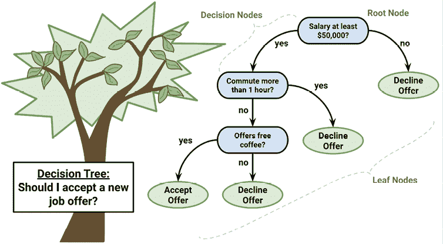

图 5.1：一个表示确定是否接受新工作邀请过程的决策树

决策树算法的一个巨大优势是，类似于流程图的树结构不仅用于机器的内部使用。在模型创建之后，许多决策树算法会将结果结构以人类可读的格式输出。这为理解模型如何以及为什么在特定任务中表现良好或不好提供了洞察。这也使得决策树特别适合于需要出于法律原因使分类机制透明或需要与他人共享结果以告知未来业务实践的应用。考虑到这一点，一些潜在用途包括以下内容：

+   需要明确记录并消除偏见的信用评分模型，其中导致申请人被拒绝的标准需要被清楚地记录

+   市场研究客户行为，如满意度或流失，这些将与管理层或广告机构共享

+   基于实验室测量、症状或疾病进展率的医疗状况诊断

尽管前面的应用说明了树在告知决策过程的价值，但这并不意味着它们的效用到此为止。实际上，决策树是单一最广泛使用的机器学习技术之一，可以应用于几乎任何类型的数据——通常具有出色的即插即用性能。

话虽如此，尽管它们的适用性很广，但值得注意的是，在某些情况下，树可能不是理想的选择。这包括数据具有许多名义特征和多个级别或大量数值特征的任务。这些情况可能导致非常多的决策和过于复杂的树。它们还可能加剧决策树过度拟合数据的倾向，尽管正如我们很快就会看到的，通过调整一些简单的参数，甚至这种弱点也可以克服。

## 分而治之

决策树是使用一种称为**递归划分**的启发式方法构建的。这种方法也通常被称为**分而治之**，因为它将数据分割成子集，然后这些子集被反复分割成更小的子集，如此类推，直到算法确定子集中的数据足够同质，或者满足另一个停止标准。

要了解如何分割数据集可以创建决策树，想象一个根节点，它将成长为一棵成熟的树。最初，根节点代表整个数据集，因为还没有发生分割。在这里，决策树算法必须选择一个特征进行分割；理想情况下，它选择对目标类最具有预测性的特征。

然后将示例根据该特征的独特值进行分组，并形成第一组树分支。

沿着每个分支向下工作，算法继续分割和征服数据，每次选择最佳候选特征来创建另一个决策节点，直到达到停止标准。如果以下条件之一成立，分割和征服可能会在节点处停止：

+   节点上的所有（或几乎所有）示例都属于同一类别

+   没有剩余的特征来区分示例

+   树已经增长到预定义的大小限制

为了说明树构建过程，让我们考虑一个简单的例子。想象一下，你为一家好莱坞工作室工作，你的角色是决定工作室是否应该继续制作由有潜力的新作者提出的剧本。度假回来后，你的桌子堆满了提案。没有时间逐个阅读每个提案，你决定开发一个决策树算法来预测潜在电影是否会落入以下三个类别之一：*评论家成功*、*主流热门*或*票房失败*。

为了创建决策树模型而获取数据，你转向电影制片厂的档案来检查导致公司最近 30 部发行作品成功或失败的因素。你很快注意到电影的预估拍摄预算、主演角色的 A 名单明星数量以及电影的成功程度之间存在关联。对这个发现感到兴奋，你制作了一个散点图来展示这种模式：

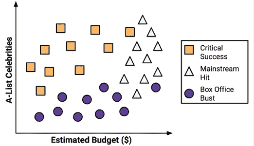

图 5.2：散点图展示了电影预算与名人数量之间的关系

使用分割和征服策略，你可以从这个数据中构建一个简单的决策树。首先，为了创建树的根节点，你分割了表示名人数量的特征，将电影分为有显著数量的 A 名单明星和无显著数量的 A 名单明星的组：

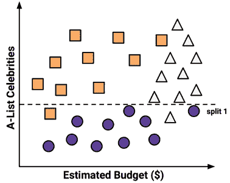

图 5.3：决策树的第一次分割将数据分为高名人数量和低名人数量电影

接下来，在拥有更多名人的电影组中，你在有高预算和无高预算的电影之间进行另一个分割：

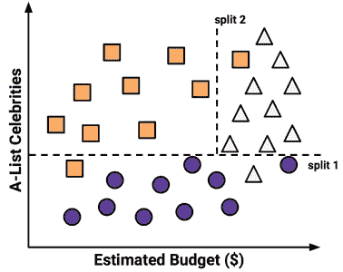

图 5.4：决策树的第二次分割进一步将高名人数量电影分为低预算和高预算两类

到目前为止，你已经将数据分为三个组。图的最左上角组完全由获得评论家赞誉的电影组成。这个组的特点是名人数量多而预算相对较低。在右上角，几乎所有电影都是票房大赢家，预算高且名人众多。最后一个组，虽然星光不足，但预算从小到大不等，包含了失败的作品。

如果需要，你可以通过在预算和名人数量越来越具体的范围内分割数据来继续细分和征服数据，直到当前所有错误分类的值都正确分类在其自己的小分区中。然而，以这种方式过度拟合决策树是不明智的。尽管算法可以无限分割数据，但过于具体的决策并不总是能更广泛地推广。因此，你选择在这里停止算法，因为每个组中超过 80%的例子都来自单个类别。这是决策树模型的停止标准。

你可能已经注意到，对角线可能更干净地分割了数据。这是决策树知识表示的一个局限性，它使用**轴平行分割**。每个分割只考虑一个特征的事实阻止了决策树形成更复杂的决策边界。例如，可以通过一个询问“名人的数量是否大于估计的预算？”的决策来创建一条对角线。如果是这样，那么“它将是一个关键的成功。”

预测电影未来成功的模型可以用一个简单的树来表示，如下面的图所示。树中的每一步都显示了落入每个类别的示例比例，这显示了随着分支接近叶子，数据如何变得更加同质化。为了评估一个新电影剧本，沿着每个决策分支前进，直到预测出剧本的成功或失败。使用这种方法，你将能够快速识别剧本库中最有希望的选项，并回到更重要的工作，例如撰写奥斯卡颁奖典礼的获奖感言！

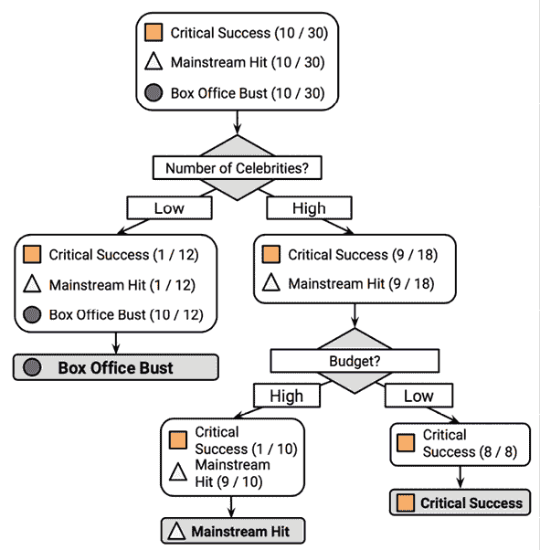

图 5.5：基于历史电影数据的决策树可以预测未来电影的性能

由于现实世界的数据包含超过两个特征，决策树很快就会比这复杂得多，具有更多的节点、分支和叶子。在下一节中，你将了解一个流行的自动构建决策树模型的算法。

## C5.0 决策树算法

决策树有多种实现方式，但其中最著名的一种是 C5.0 算法。该算法由计算机科学家 J. Ross Quinlan 开发，是他先前算法 C4.5 的改进版本，而 C4.5 本身又是他**迭代二分器 3**（**ID3**）算法的改进。尽管 Quinlan 将 C5.0 推广给商业客户（详情请见[`www.rulequest.com/`](http://www.rulequest.com/)），但该算法的单线程版本源代码已被公开，因此被整合到 R 等程序中。

为了进一步混淆问题，一个流行的基于 Java 的开源 C4.5 替代品，名为**J48**，包含在 R 的`RWeka`包中（在本章后面介绍）。由于 C5.0、C4.5 和 J48 之间的差异很小，本章中的原则适用于这三种方法中的任何一种，并且算法应被视为同义的。

C5.0 算法已成为生成决策树的行业标准，因为它可以直接解决大多数类型的问题。与其他高级机器学习模型相比，例如在第七章中描述的*黑盒方法 - 神经网络和支持向量机*，C5.0 构建的决策树通常表现几乎一样好，但更容易理解和部署。此外，如以下表格所示，该算法的缺点相对较小，并且可以很大程度上避免。

| **优点** | **缺点** |
| --- | --- |

|

+   一种通用的分类器，在许多类型的问题上表现良好

+   高度自动化的学习过程，可以处理数值或名义特征，以及缺失数据

+   排除不重要的特征

+   可用于小型和大型数据集

+   生成的模型可以在没有数学背景的情况下进行解释（对于相对较小的树）

+   比其他复杂模型更高效

|

+   决策树模型往往偏向于具有大量级别的特征的分割

+   容易过拟合或欠拟合模型

+   由于依赖于轴平行分割，可能难以模拟某些关系

+   训练数据的小幅变化可能导致决策逻辑发生大幅变化

+   大型树可能难以解释，它们做出的决策可能看起来不符合直觉

|

为了保持简单，我们之前的决策树示例忽略了机器如何采用分而治之策略涉及的数学。让我们更详细地探讨这一点，以检查这种启发式方法在实际中的工作方式。

### 选择最佳分割点

决策树将面临的第一挑战是确定要分割哪个特征。在前面的例子中，我们寻找一种分割数据的方法，使得结果分区主要包含单个类别的示例。

一个示例子集只包含单个类别的程度被称为**纯度**，而只由单个类别组成的任何子集都称为**纯集**。

有各种纯度度量可以用来识别最佳的决策树分割候选者。C5.0 使用**熵**，这是从信息理论中借用的一个概念，它量化了类别值集合中的随机性或无序性。具有高熵的集合非常多样化，并且关于可能也属于该集合的其他项目提供的信息很少，因为没有明显的共同点。决策树希望找到可以减少熵的分割点，从而最终增加组内的同质性。

通常，熵以 **比特** 为单位测量。如果只有两个可能的类别，熵值可以从 0 到 1 变化。对于 *n* 个类别，熵的范围从 0 到 *log*2。在每种情况下，最小值表示样本完全同质，而最大值表示数据尽可能多样化，并且没有组有哪怕是很小的多数。

在数学概念中，熵被定义为：

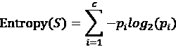

在这个公式中，对于给定数据段 (*S*)，术语 *c* 指的是类别级别数，而 *p*[i] 指的是落在第 *i* 个类别级别中的值的比例。

例如，假设我们有一个包含两个类别的数据分区：红色（60%）和白色（40%）。我们可以计算熵如下：

```py
> -0.60 * log2(0.60) - 0.40 * log2(0.40) 
```

```py
[1] 0.9709506 
```

我们可以可视化所有可能的二分类排列的熵。如果我们知道一个类别的示例比例是 *x*，那么另一个类别的比例是 *(1 – x)*。然后，使用 `curve()` 函数，我们可以绘制所有可能的 *x* 值的熵：

```py
> curve(-x * log2(x) - (1 - x) * log2(1 - x),
        col = "red", xlab = "x", ylab = "Entropy", lwd = 4) 
```

这导致了以下图表：

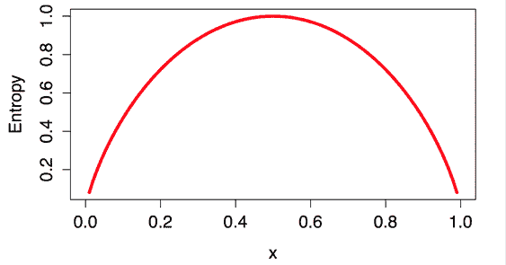

图 5.6：在二分类结果中，随着一个类别的比例变化，总熵

如 *x = 0.50* 处的峰值所示，50-50 的分裂会产生最大熵。当一个类别越来越多地主导另一个类别时，熵减少到零。

要使用熵来确定最优的分裂特征，算法会计算在每种可能的特征上分裂所导致的同质性的变化，这种度量称为 **信息增益**。特征 *F* 的信息增益是分裂前段 (*S*[1]) 的熵与分裂后的分区 (*S*[2]) 的熵之间的差值：

InfoGain(*F*) = Entropy(S[1]) – Entropy(S[2])

一个复杂的问题是，在分裂之后，数据被分成多个分区。因此，计算 *Entropy(S*[2]*)* 的函数需要考虑分裂后所有分区的总熵。它是通过根据所有记录落在该分区中的比例来加权每个分区的熵来做到这一点的。这可以用以下公式表示：

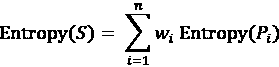

简而言之，分裂产生的总熵是每个 *n* 个分区的熵的总和，每个分区的熵都按落在该分区中的示例比例 (*w*[i]) 加权。

信息增益越高，特征在分裂该特征后创建同质组的性能就越好。如果信息增益为零，则在该特征上分裂不会减少熵。另一方面，最大信息增益等于分裂前的熵。这表明分裂后的熵为零，这意味着分裂产生了完全同质的组。

之前的公式假设名义特征，但决策树在分割数值特征时也使用信息增益。为此，一种常见的做法是测试各种分割，将值分为大于或小于阈值的组。这把数值特征简化为两个级别的分类特征，从而允许像往常一样计算信息增益。产生最大信息增益的数值切割点被选为分割点。

虽然 C5.0 使用了信息增益，但它不是构建决策树时可以使用的唯一分割标准。其他常用的标准包括**基尼指数**、**卡方统计量**和**增益率**。关于这些（以及许多其他）标准的综述，请参阅*Mingers, J, Machine Learning, 1989, Vol. 3, pp. 319-342*。

### 剪枝决策树

如前所述，决策树可以无限增长，选择分割特征并将数据分成越来越小的分区，直到每个示例都被完美分类或算法耗尽可用于分割的特征。然而，如果树长得过于庞大，它所做的许多决策将过于具体，模型将过度拟合训练数据。剪枝决策树的过程涉及减小其大小，以便更好地泛化到未见数据。

解决这个问题的方法之一是在树达到一定数量的决策或决策节点只包含少量示例时停止树的生长。这被称为**早期停止**或**预剪枝**决策树。由于树避免了做无谓的工作，这是一种吸引人的策略。然而，这种方法的一个缺点是，无法知道树是否会错过它如果长得更大可能会学习到的微妙但重要的模式。

另一种称为**后剪枝**的方法涉及有意生长一个过大的树，并剪枝叶节点以将树的大小减小到更合适的水平。这通常比预剪枝更有效，因为在不首先生长树的情况下很难确定决策树的最佳深度。在稍后剪枝树允许算法确信所有重要的数据结构都已发现。

剪枝操作的实现细节非常技术性，超出了本书的范围。关于一些可用方法的比较，请参阅*Esposito, F, Malerba, D, Semeraro, G, IEEE Transactions on Pattern Analysis and Machine Intelligence, 1997, Vol. 19, pp. 476-491*。

C5.0 算法的一个优点是它在剪枝方面有明确的观点——它使用合理的默认值自动处理许多决策。其整体策略是在剪枝后对树进行修剪。它首先生长出一个大的树，该树过度拟合了训练数据。随后，移除对分类错误影响较小的节点和分支。在某些情况下，整个分支会被移动到树的更高位置或被更简单的决策所取代。这些移除分支的过程分别被称为**子树提升**和**子树替换**。

在过度拟合和欠拟合之间取得正确的平衡有点像一门艺术，但如果模型准确性至关重要，那么花些时间尝试不同的剪枝选项以查看是否可以提高测试数据集的性能可能是值得的。正如你很快就会看到的，C5.0 算法的一个优点是它非常容易调整训练选项。

# 示例 – 使用 C5.0 决策树识别风险银行贷款

2007-2008 年的全球金融危机突出了银行实践中透明度和严谨性的重要性。由于信贷的可用性有限，银行收紧了其贷款系统，并转向机器学习以更准确地识别风险贷款。

由于决策树具有高准确性和用普通语言制定统计模型的能力，因此在银行业中得到广泛应用。由于许多国家的政府仔细监控贷款实践的公平性，因此高管必须能够解释为什么某个申请人被拒绝贷款而另一个被批准。这些信息对希望确定其信用评级为何不满意的客户也很有用。

自动化信用评分模型可能用于信用卡邮寄和即时在线批准流程。在本节中，我们将使用 C5.0 决策树开发一个简单的信用批准模型。我们还将看到如何调整模型结果以最小化导致财务损失的错误。

## 第 1 步 – 收集数据

我们信用模型的动力在于识别与贷款违约高风险相关的因素。为此，我们必须获取关于过去银行贷款的数据以及当时在信用申请时可能可用的贷款申请人信息。

具有这些特征的数据集由汉堡大学的 Hans Hofmann 捐赠给 UCI 机器学习仓库 ([`archive.ics.uci.edu/ml`](http://archive.ics.uci.edu/ml))。该数据集包含来自德国一家信用机构的贷款信息。

本章中展示的数据集已经对原始数据进行了轻微修改，以消除一些预处理步骤。为了跟随示例，请从本章的 Packt Publishing GitHub 仓库下载 `credit.csv` 文件，并将其保存到您的 R 工作目录中。

信用数据集包括 1,000 个贷款示例，以及一组表示贷款和贷款申请人特征的数值和名义特征。一个类别变量表示贷款是否违约。让我们看看我们是否能识别出任何预测这种结果的模式。

## 第 2 步 – 探索和准备数据

如我们之前所做的那样，我们将使用`read.csv()`函数导入数据。现在，因为字符数据完全是分类的，我们可以将`stringsAsFactors = TRUE`设置为自动将所有字符类型列转换为结果数据框中的因子：

```py
> credit <- read.csv("credit.csv", stringsAsFactors = TRUE) 
```

我们可以通过检查`str()`函数输出的前几行来检查结果对象：

```py
> str(credit) 
```

```py
'data.frame':1000 obs. of  17 variables:
 $ checking_balance : Factor w/ 4 levels "< 0 DM","> 200 DM",..
 $ months_loan_duration: int  6 48 12 42 24 36 24 36 12 30 ...
 $ credit_history : Factor w/ 5 levels "critical","good",..
 $ purpose : Factor w/ 6 levels "business","car",..
 $ amount : int  1169 5951 2096 7882 4870 9055 2835 6948 ... 
```

我们看到预期的 1,000 个观测值和 17 个特征，这些特征是因子和整型数据类型的组合。

让我们看看几个似乎可以预测违约的贷款特征的`table()`输出。申请人的检查和储蓄账户余额被记录为分类变量：

```py
> table(credit$checking_balance) 
```

```py
 < 0 DM   > 200 DM 1 - 200 DM    unknown
       274         63        269        394 
```

```py
> table(credit$savings_balance) 
```

```py
 < 100 DM > 1000 DM  100 - 500 DM 500 - 1000 DM   unknown
          603        48           103            63       183 
```

检查和储蓄账户余额可能是贷款违约状态的重要预测指标。请注意，由于贷款数据来自德国，这些值使用的是**德国马克**（**DM**），这是欧元采用之前德国使用的货币。

一些贷款的特征是数值型的，例如其期限和请求的信贷金额：

```py
> summary(credit$months_loan_duration) 
```

```py
 Min. 1st Qu.  Median    Mean 3rd Qu.    Max. 
    4.0    12.0    18.0    20.9    24.0    72.0 
```

```py
> summary(credit$amount) 
```

```py
 Min. 1st Qu.  Median    Mean 3rd Qu.    Max. 
    250    1366    2320    3271    3972   18424 
```

贷款金额从 250 DM 到 18,420 DM 不等，期限为 4 到 72 个月。它们的中间值为 2,320 DM，中间期限为 18 个月。

`default`向量表示贷款申请人是否能够满足约定的还款条款，或者他们是否违约。在这个数据集中，总共有 30%的贷款违约：

```py
> table(credit$default) 
```

```py
no yes
700 300 
```

对于银行来说，高违约率是不可取的，因为这意味着银行不太可能完全收回其投资。如果我们成功，我们的模型将识别出高违约风险的申请人，使银行能够在发放资金之前拒绝信贷申请。

### 数据准备 – 创建随机训练和测试数据集

如我们在前面的章节中所做的那样，我们将把我们的数据分成两部分：一个用于构建决策树的训练数据集和一个用于评估其在新数据上性能的测试数据集。我们将使用 90%的数据进行训练，10%的数据进行测试，这将为我们提供 100 条记录来模拟新申请人。在这里使用 90-10 的分割而不是更常见的 75-25 分割，是因为信用数据集相对较小；鉴于预测贷款违约是一个具有挑战性的学习任务，我们需要尽可能多的训练数据，同时还要保留足够的测试样本。

在第十章“评估模型性能”中介绍了用于训练和评估相对较小数据集的更复杂方法。

由于前几章使用的数据是随机排序的，我们只需通过取记录的第一个子集用于训练，剩余的子集用于测试，就可以将数据集分为两部分。相比之下，信用数据集并不是随机排序的，这使得先前的做法不明智。假设银行是按照贷款金额对数据进行排序的，最大的贷款位于文件末尾。如果我们用前 90%的数据用于训练，剩下的 10%用于测试，那么我们将在只有小额贷款上训练模型，并在大额贷款上测试模型。显然，这可能会出现问题。

我们将通过在信用数据的**随机样本**上训练模型来解决此问题。随机样本简单来说就是一个随机选择记录子集的过程。在 R 中，`sample()`函数用于执行随机抽样。然而，在付诸实践之前，一个常见的做法是设置一个**种子**值，这会导致随机化过程遵循一个可以后来复制的序列。这似乎违背了生成随机数的初衷，但这样做有很好的理由。通过`set.seed()`函数提供种子值可以确保，如果分析在未来重复进行，将获得相同的结果。

你可能会想知道一个所谓的随机过程如何被播种以产生相同的结果。这是因为计算机使用一种称为**伪随机数生成器**的数学函数来创建看似非常随机的随机数序列，但实际上，如果知道序列中的前一个值，它们是非常可预测的。在实践中，现代伪随机数序列几乎与真正的随机序列无法区分，但它们的好处是计算机可以快速轻松地生成它们。

以下命令使用带有种子值的`sample()`。请注意，`set.seed()`函数使用任意值`9829`。省略此种子值将导致您的训练和测试分割与本章其余部分所示的不同。以下命令从 1 到 1,000 的整数序列中随机选择 900 个值：

```py
> set.seed(9829)
> train_sample <- sample(1000, 900) 
```

如预期的那样，生成的`train_sample`对象是一个包含 900 个随机整数的向量：

```py
> str(train_sample) 
```

```py
int [1:900] 653 866 119 152 6 617 250 343 367 138 ... 
```

通过使用这个向量从信用数据中选择行，我们可以将其分为我们想要的 90%训练数据和 10%测试数据集。回想一下，在测试记录的选择中使用的否定运算符（`-`字符）告诉 R 选择不在指定行中的记录；换句话说，测试数据只包括不在训练样本中的行：

```py
> credit_train <- credit[train_sample, ]
> credit_test  <- credit[-train_sample, ] 
```

如果随机化做得正确，我们应在每个数据集中大约有 30%的贷款出现违约：

```py
> prop.table(table(credit_train$default)) 
```

```py
 no       yes 
0.7055556 0.2944444 
```

```py
> prop.table(table(credit_test$default)) 
```

```py
 no  yes 
0.65 0.35 
```

训练集和测试集在贷款违约的分布上大致相似，因此我们现在可以构建我们的决策树。如果比例差异很大，我们可能会决定重新采样数据集，或者尝试更复杂的采样方法，例如在第十章“评估模型性能”中介绍的方法。

如果您的结果不完全匹配，请确保在创建`train_sample`向量之前立即运行了`set.seed(9829)`命令。请注意，R 的默认随机数生成器在 R 版本 3.6.0 中发生了变化，如果在此代码在早期版本上运行，则结果将不同。这也意味着这里的结果与本书先前版本中的结果略有不同。

## 第 3 步 – 在数据上训练模型

我们将使用`C50`包中的 C5.0 算法来训练我们的决策树模型。如果您尚未安装，请使用`install.packages("C50")`安装该包，并使用`library(C50)`将其加载到 R 会话中。

以下语法框列出了在构建决策树时使用的一些最常见参数。与之前使用的机器学习方法相比，C5.0 算法提供了许多更多的方式来定制模型以适应特定的学习问题。

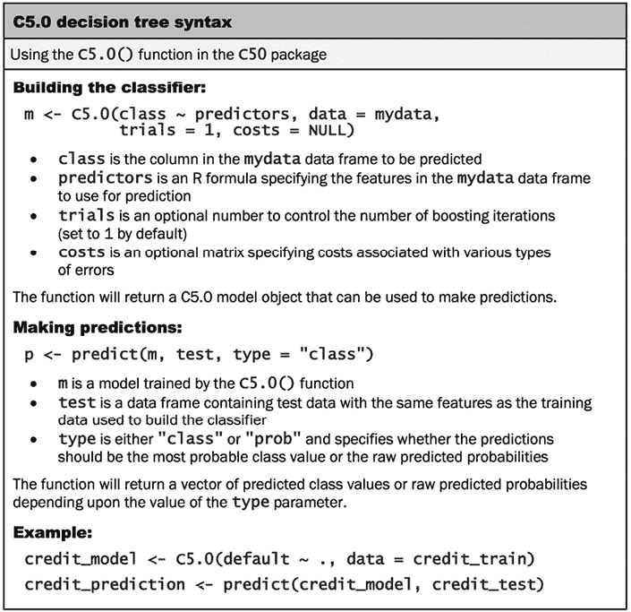

图 5.7：C5.0 决策树语法

`C5.0()`函数使用一种称为**R 公式接口**的新语法来指定要训练的模型。公式语法使用`~`运算符（称为波浪号）来表示目标变量与其预测变量之间的关系。要学习的类别变量放在波浪号的左侧，预测特征写在右侧，由`+`运算符分隔。

如果您想建模目标`y`与预测变量`x1`和`x2`之间的关系，您将公式写成`y ~ x1 + x2`。要包含模型中的所有变量，使用点字符。例如，`y ~ .`指定了`y`与数据集中所有其他特征之间的关系。

R 公式接口在许多 R 函数中使用，并提供了一些强大的功能来描述预测变量之间的关系。我们将在后面的章节中探讨一些这些功能。然而，如果您急于预览，请随时使用`?formula`命令阅读文档。

对于信用审批模型的第一次迭代，我们将使用默认的 C5.0 设置，如下面的代码所示。目标类别命名为`default`，所以我们将其放在波浪号`~`的左侧，后面跟着一个点表示`credit_train`数据框中的所有其他列都将用作预测变量：

```py
> credit_model <- C5.0(default ~ ., data = credit_train) 
```

`credit_model`对象现在包含一个 C5.0 决策树。我们可以通过输入其名称来查看一些关于树的基本数据：

```py
> credit_model 
```

```py
Call:
C5.0.formula(formula = default ~ ., data = credit_train)
Classification Tree
Number of samples: 900 
Number of predictors: 16 
Tree size: 67 
Non-standard options: attempt to group attributes 
```

输出显示了关于树的一些简单事实，包括生成它的函数调用、用于构建树的特性数量（标记为`predictors`）和示例（标记为`samples`）。还包括树的大小为`67`，这表明树有 67 个决策深度——比我们迄今为止考虑的示例树大得多！

要查看树的决策，我们可以在模型上调用`summary()`函数：

```py
> summary(credit_model) 
```

这会导致以下输出，其中已截断以仅显示前几行：

```py
> summary(credit_model) 
```

```py
Call:
C5.0.formula(formula = default ~ ., data = credit_train)
C5.0 [Release 2.07 GPL Edition]
-------------------------------
Class specified by attribute `outcome'
Read 900 cases (17 attributes) from undefined.data
Decision tree:
checking_balance in {> 200 DM,unknown}: no (415/55)
checking_balance in {< 0 DM,1 - 200 DM}:
:...credit_history in {perfect,very good}: yes (59/16)
    credit_history in {critical,good,poor}:
    :...months_loan_duration > 27:
        :...dependents > 1:
        :   :...age <= 45: no (12/2)
        :   :   age > 45: yes (2) 
```

上述输出显示了决策树的一些最初分支。前三行可以用普通语言表示为：

1.  如果支票账户余额未知或超过 200 DM，则将其分类为“不太可能违约”

1.  否则，如果支票账户余额小于零 DM 或介于 1 到 200 DM 之间...

1.  …如果信用记录是完美或非常好的，则将其分类为“可能违约”

括号中的数字表示满足该决策标准的示例数量和被该决策错误分类的示例数量。例如，在第一行中，`415/55`表示，在达到决策的 415 个示例中，有 55 个被错误地分类为“不太可能违约”。换句话说，415 个申请人中有 55 人实际上违约了，尽管模型预测他们不会违约。

有时候，一棵树会导致一些逻辑上不太合理的决策。例如，为什么信用记录完美或非常好的申请人可能会违约，而那些支票账户余额未知的人却不太可能违约？这样的矛盾规则有时会出现。它们可能反映了数据中的真实模式，或者可能是统计异常。在两种情况下，调查这些奇怪的决策以查看树的逻辑是否适合商业用途都是非常重要的。

在树之后，`summary(credit_model)`输出显示了一个混淆矩阵，它是一个交叉表，指示模型在训练数据中的错误分类记录：

```py
Evaluation on training data (900 cases):
        Decision Tree   
      ----------------  
      Size      Errors  
        66  118(13.1%)   <<
       (a)   (b)    <-classified as
      ----  ----
       604    31    (a): class no
        87   178    (b): class yes 
```

`Errors`标题显示，该模型正确分类了 900 个训练实例中的 878 个，错误率为 13.1%。共有 31 个实际值为`no`的实例被错误地分类为`yes`（假阳性），而 87 个值为`yes`的实例被错误地分类为`no`（假阴性）。鉴于决策树倾向于过度拟合训练数据，这里报告的错误率，即基于训练数据性能的错误率，可能过于乐观。因此，将决策树应用于未见过的测试数据集尤为重要，我们将在稍后进行。

输出还包括一个标记为`Attribute usage`的部分，它提供了关于决策树模型中使用的重要预测因子的一般感觉。以下是一些输出内容的前几行：

```py
Attribute usage:
    100.00%       checking_balance
    53.89%        credit_history
    47.33%        months_loan_duration
    26.11%        purpose
    24.33%        savings_balance
    18.22%        job
    12.56%        dependents
    12.11%        age 
```

决策树输出中的**属性使用**统计信息指的是在训练数据中使用列出的特征进行最终预测的行百分比。例如，100%的行需要`checking_balance`特征，因为检查账户余额在树的第一个分裂点被使用。第二个分裂使用`credit_history`，但 46.11%的行已经根据检查账户余额被分类为非违约。这留下了只有 53.89%的行需要考虑申请人的信用历史。在这个列表的底部，只有 12.11%的例子需要申请人的年龄来做出预测，这表明申请人的年龄不如他们的检查账户余额或信用历史重要。

这条信息，连同树结构本身，提供了对模型工作方式的洞察。这两者都易于理解，即使没有统计学背景也是如此。当然，即使模型易于理解，如果它不能做出准确的预测，那么它也是无用的，因此我们现在将对其进行更正式的性能评估。

C5.0 决策树模型可以使用`plot()`函数进行可视化，该函数依赖于`partykit`包中的功能。不幸的是，这仅适用于相对较小的决策树。例如，我们可以通过输入`plot(credit_model)`来可视化我们的决策树，但除非你有非常大的显示屏，否则由于树中节点和分裂的数量很大，生成的图表可能会显得杂乱无章。

## 第 4 步 – 评估模型性能

要将我们的决策树应用于测试数据集，我们使用`predict()`函数，如下面的代码行所示：

```py
> credit_pred <- predict(credit_model, credit_test) 
```

这创建了一个预测类值的向量，我们可以使用`gmodels`包中的`CrossTable()`函数将其与实际类值进行比较。将`prop.c`和`prop.r`参数设置为`FALSE`将从表中删除列和行百分比。剩余的百分比（`prop.t`）表示单元格中记录数占总记录数的比例：

```py
> library(gmodels)
> CrossTable(credit_test$default, credit_pred,
             prop.chisq = FALSE, prop.c = FALSE, prop.r = FALSE,
             dnn = c('actual default', 'predicted default')) 
```

这导致了以下表格：

```py
 | predicted default 
actual default |        no |       yes | Row Total |
---------------|-----------|-----------|-----------|
            no |        56 |         9 |        65 |
               |     0.560 |     0.090 |           |
---------------|-----------|-----------|-----------|
           yes |        24 |        11 |        35 |
               |     0.240 |     0.110 |           |
---------------|-----------|-----------|-----------|
  Column Total |        80 |        20 |       100 |
---------------|-----------|-----------|-----------| 
```

在测试集的 100 个贷款申请中，我们的模型正确预测了 56 个没有违约，11 个违约，从而实现了 67%的准确率和 33%的错误率。这比它在训练数据上的表现略差，但考虑到模型在未见数据上的表现通常更差，这是可以预料的。此外，请注意，该模型在测试数据中只正确预测了 35 个实际贷款违约中的 11 个，即 31%。不幸的是，这种类型的错误可能是一个代价非常高的错误，因为银行在每次违约中都会损失金钱。让我们看看我们是否可以通过更多的努力来提高结果。

## 第 5 步 – 提高模型性能

我们模型的错误率可能太高，无法将其部署到实时信用评分应用中。事实上，如果模型对每个测试案例都预测“无违约”，那么它将有 65%的时间是正确的——这个结果几乎与我们的模型一样，但需要付出多得多的努力！仅使用 900 个训练示例来预测贷款违约似乎是一个具有挑战性的问题。

更糟糕的是，我们的模型在识别那些违约的申请人方面表现特别差。幸运的是，有几个简单的方法可以调整 C5.0 算法，这可能会帮助提高模型的整体性能，以及对于更昂贵的错误类型的性能。

### 提升决策树的准确性

C5.0 算法在 C4.5 算法的基础上进行改进的一种方式是通过添加**自适应提升法**。这是一个构建许多决策树的过程，这些树对每个示例的最佳类别进行投票。

提升法的想法主要基于 Rob Schapire 和 Yoav Freund 的研究。有关更多信息，请尝试在网络上搜索他们的出版物或他们的教科书 *Boosting: Foundations and Algorithms, Cambridge, MA, The MIT Press, 2012*。

由于提升法可以更普遍地应用于任何机器学习算法，它将在本书的 *第十四章*，*构建更好的学习者* 中更详细地介绍。现在，只需说提升法基于这样的观点：通过结合几个表现不佳的学习者，可以创建一个比任何单个学习者都强大的团队。每个模型都有其独特的一组优势和劣势，可能在某些问题上表现更好或更差。因此，使用具有互补优势和劣势的几个学习者的组合可以显著提高分类器的准确性。

`C5.0()` 函数使得将提升法添加到我们的决策树变得简单。我们只需添加一个额外的 `trials` 参数，表示在提升团队中使用的独立决策树的数量。`trials` 参数设置了一个上限；如果算法认识到额外的试验似乎没有提高准确性，它将停止添加树。我们将从 10 次试验开始，这个数字已经成为事实上的标准，因为研究表明这可以减少测试数据上的错误率大约 25%。

除了新的参数之外，命令与之前相似：

```py
> credit_boost10 <- C5.0(default ~ ., data = credit_train,
                         trials = 10) 
```

在检查生成的模型时，我们可以看到输出现在指示了提升法的添加：

```py
> credit_boost10 
```

```py
Number of boosting iterations: 10 
Average tree size: 57.3 
```

新的输出显示，在 10 次迭代中，我们的树大小缩小了。如果您愿意，可以在命令提示符中键入`summary(credit_boost10)`来查看所有 10 棵树。请注意，其中一些树，包括为第一次试验构建的树，包含一个或多个子树，如下面的输出摘录中所示，其中一个子树被标记为 `[S1]`：

```py
dependents > 1: yes (8.8/0.8)
dependents <= 1:
:...years_at_residence <= 1: no (13.4/1.6)
    years_at_residence > 1:
:...age <= 23: yes (11.9/1.6)
    age > 23: [S1] 
```

注意到那条说如果 `age > 23`，结果将是 `[S1]` 的行。为了确定这意味着什么，我们必须将 `[S1]` 与输出中稍低位置的对应子树匹配，在那里我们看到最终的决策需要几个额外的步骤：

```py
SubTree [S1]
employment_duration in {< 1 year,> 7 years,4 - 7 years,
:                       unemployed}: no (27.7/6.3)
employment_duration = 1 - 4 years:
:...months_loan_duration > 30: yes (7.2)
    months_loan_duration <= 30:
    :...other_credit = bank: yes (2.4)
        other_credit in {none,store}: no (16.6/5.6) 
```

这样的子树是后剪枝选项（如子树提升和子树替换）的结果，如本章前面提到的。

树的 `summary()` 输出还显示了该树在训练数据上的性能：

```py
> summary(credit_boost10) 
```

```py
 (a)   (b)    <-classified as
      ----  ----
       633     2    (a): class no
        17   248    (b): class yes 
```

分类器在 900 个训练示例上犯了 19 个错误，错误率为 2.1%。这比我们之前提升前的 13.1% 训练错误率有了相当大的改进！然而，我们还需要看看测试数据上是否会有类似的改进。让我们看一下：

```py
> credit_boost_pred10 <- predict(credit_boost10, credit_test)
> CrossTable(credit_test$default, credit_boost_pred10,
             prop.chisq = FALSE, prop.c = FALSE, prop.r = FALSE,
             dnn = c('actual default', 'predicted default')) 
```

结果表格如下：

```py
 | predicted default 
actual default |        no |       yes | Row Total |
---------------|-----------|-----------|-----------|
            no |        58 |         7 |        65 |
               |     0.580 |     0.070 |           |
---------------|-----------|-----------|-----------|
           yes |        19 |        16 |        35 |
               |     0.190 |     0.160 |           |
---------------|-----------|-----------|-----------|
  Column Total |        77 |        23 |       100 |
---------------|-----------|-----------|-----------| 
```

在这里，我们将提升前的总错误率从 33% 降低到提升模型中的 26%。这可能看起来改进不大，但它离我们预期的 25% 减少并不太远。话虽如此，如果提升可以这么容易地添加，为什么不将其默认应用于每个决策树呢？原因有两个。首先，如果构建一个决策树需要大量的计算时间，构建多个树可能在计算上不切实际。其次，如果训练数据非常嘈杂，那么提升可能根本不会带来改进。尽管如此，如果需要更高的准确性，尝试提升是值得的。

另一方面，模型在识别真实违约方面仍然表现不佳，正确预测的只有 46%（35 个中的 16 个），而简单模型中的正确率是 31%（35 个中的 11 个）。让我们再调查一个选项，看看我们是否可以减少这些代价高昂的错误。

### 一些错误比其他错误代价更高

给一个可能违约的申请人贷款可能是一个代价高昂的错误。减少错误阴性的一个解决方案可能是拒绝更多的边缘申请人，假设银行从风险贷款中获得的利息远远低于如果钱全部不还所造成的巨大损失。

C5.0 算法允许我们为不同类型的错误分配惩罚，以阻止树犯更多代价高昂的错误。这些惩罚在 **成本矩阵** 中指定，该矩阵指定每个错误相对于任何其他错误的代价高多少倍。

要开始构建成本矩阵，我们需要首先指定维度。由于预测值和实际值都可以取两个值，`是` 或 `否`，我们需要使用两个值组成的两个向量的列表来描述一个 2x2 的矩阵。同时，我们还将命名矩阵维度，以避免以后混淆：

```py
> matrix_dimensions <- list(c("no", "yes"), c("no", "yes"))
> names(matrix_dimensions) <- c("predicted", "actual") 
```

检查新对象显示我们的维度已经设置正确：

```py
> matrix_dimensions 
```

```py
$predicted
[1] "no"  "yes"
$actual
[1] "no"  "yes" 
```

接下来，我们需要通过提供四个值来填充矩阵，以分配各种类型错误的惩罚。由于 R 是从上到下逐列填充矩阵，因此我们需要按照特定顺序提供这些值：

1.  预测为“否”，实际为“否”

1.  预测为“是”，实际为“否”

1.  预测为“否”，实际为“是”

1.  预测为“是”，实际为“是”

假设我们认为贷款违约的成本是银行错过机会的四倍。那么我们的惩罚值可以这样定义：

```py
> error_cost <- matrix(c(0, 1, 4, 0), nrow = 2,
                  dimnames = matrix_dimensions) 
```

这就产生了以下矩阵：

```py
> error_cost 
```

```py
 actual
predicted no yes
      no   0   4
      yes  1   0 
```

如此矩阵定义，当算法正确地将“否”或“是”分类时，没有分配成本，但假阴性有 4 的成本，而假阳性有 1 的成本。为了了解这如何影响分类，让我们使用`C5.0()`函数的`costs`参数将其应用于我们的决策树。我们还将使用之前相同的步骤：

```py
> credit_cost <- C5.0(default ~ ., data = credit_train,
                        costs = error_cost)
> credit_cost_pred <- predict(credit_cost, credit_test)
> CrossTable(credit_test$default, credit_cost_pred,
             prop.chisq = FALSE, prop.c = FALSE, prop.r = FALSE,
             dnn = c('actual default', 'predicted default')) 
```

这产生了以下混淆矩阵：

```py
 | predicted default 
actual default |        no |       yes | Row Total |
---------------|-----------|-----------|-----------|
            no |        34 |        31 |        65 |
               |     0.340 |     0.310 |           |
---------------|-----------|-----------|-----------|
           yes |         5 |        30 |        35 |
               |     0.050 |     0.300 |           |
---------------|-----------|-----------|-----------|
  Column Total |        39 |        61 |       100 |
---------------|-----------|-----------|-----------| 
```

与我们的提升模型相比，这个版本总体上犯的错误更多：这里的错误率为 36%，而在提升模型中为 26%。然而，错误类型非常不同。在先前的模型中，只有 31%和 46%的违约被正确分类，而在本模型中，*30/35=86%*的实际违约被正确预测为违约。这种权衡在减少假阴性错误的同时增加了假阳性错误，如果我们的成本估计准确，这可能是可以接受的。

# 理解分类规则

分类规则以逻辑 if-else 语句的形式表示知识，为未标记的示例分配一个类别。它们由**前件**和**后件**指定，形成一个陈述，即“如果*这个*发生，那么*那个*就会发生。”前件包括某些特征值的组合，而后件指定如果规则的条件得到满足，则分配的类别值。一个简单的规则可能声明，“如果计算机正在发出点击声，那么它即将失败。”

规则学习者是决策树学习者的紧密相关的兄弟，通常用于类似类型的任务。像决策树一样，它们可以用于生成未来行动知识的应用，例如：

+   识别导致机械设备硬件故障的条件

+   描述人群群体的关键特征以进行客户细分

+   寻找导致股票市场价格大幅下跌或上涨的条件

规则学习者在与决策树相比有一些明显的差异。与必须通过一系列分支决策的树不同，规则是类似于独立事实陈述的命题。此外，由于以下将要讨论的原因，规则学习者的结果可能比基于相同数据的决策树更简单、更直接、更容易理解。

你可能已经意识到决策树的分支几乎与规则学习算法的 if-else 语句相同，实际上，规则可以从树中生成。那么，为什么还要有一个单独的规则学习算法组呢？继续阅读以发现区分两种方法的细微差别。

规则学习器通常应用于特征主要是或完全是名义性的问题。它们在识别罕见事件方面做得很好，即使罕见事件只发生在特征值之间非常具体的交互中。

## 分而治之

规则学习分类算法利用一种称为**分而治之**的启发式方法。这个过程包括识别一个覆盖训练数据中子集的规则，然后从这个分区中分离出剩余的数据。随着规则的添加，更多的数据子集被分离，直到整个数据集都被覆盖，没有更多的例子剩下。尽管分而治之在很多方面与之前提到的分而治之启发式方法相似，但它以微妙的方式有所不同，很快就会变得清楚。

想象分而治之的规则学习过程的一种方式是通过创建越来越具体的规则来深入数据。假设你被要求创建规则来识别动物是否是哺乳动物。你可以将所有动物集合表示为一个大的空间，如下面的图表所示：

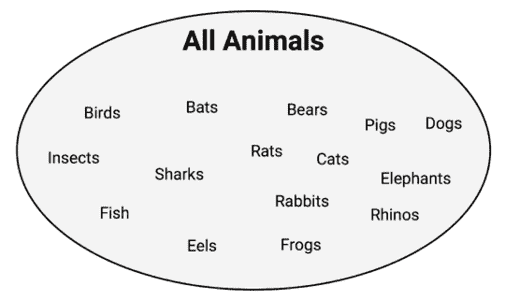

图 5.8：一个规则学习算法可能有助于将动物分为哺乳动物和非哺乳动物组

规则学习器首先使用可用的特征来寻找同质群体。例如，使用一个表示物种是否通过陆地、海洋或空中旅行的特征，第一条规则可能建议任何陆生动物都是哺乳动物：

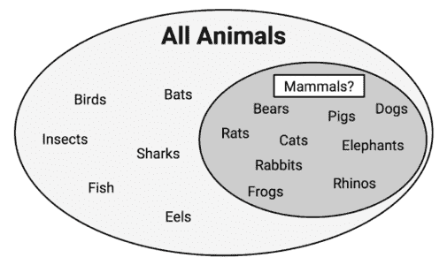

图 5.9：一个潜在的规则将陆地上旅行的动物视为哺乳动物

你注意到这个规则有任何问题吗？如果你是一个动物爱好者，你可能已经意识到青蛙是两栖动物，而不是哺乳动物。因此，我们的规则需要更加具体。让我们进一步深入，建议哺乳动物必须在陆地上行走并且有尾巴：

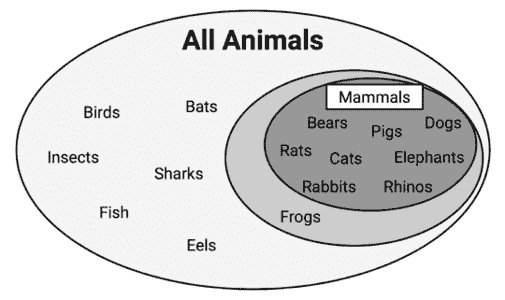

图 5.10：一个更具体的规则表明，在陆地上行走并且有尾巴的动物是哺乳动物

如前图所示，新规则导致了一组完全由哺乳动物组成的动物子集。因此，哺乳动物的子集可以与其他数据分开，青蛙被返回到剩余动物池中——无意中开玩笑！

可以定义一个额外的规则来区分蝙蝠，这是唯一剩下的哺乳动物。一个可能区分蝙蝠和其他动物的特征是毛皮的存在。使用围绕这个特征构建的规则，我们正确地识别了所有动物：

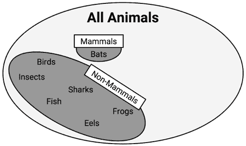

图 5.11：一条规则表明有毛皮的动物完美地分类了剩余的动物

在这一点上，由于所有训练实例都已分类，规则学习过程将停止。我们总共学习了三条规则：

+   在陆地上行走并带有尾巴的动物是哺乳动物

+   如果动物没有毛皮，它就不是哺乳动物

+   否则，该动物是哺乳动物

之前的例子说明了规则如何逐渐消耗越来越大的数据段，最终对所有实例进行分类。由于规则似乎覆盖了数据的一部分，因此分离和征服算法也被称为**覆盖算法**，而由此产生的规则被称为覆盖规则。在下一节中，我们将通过检查一个简单的规则学习算法来了解覆盖规则在实际中的应用。然后我们将检查一个更复杂的规则学习器，并将这两个算法应用于一个现实世界的问题。

## 1R 算法

假设一个电视游戏节目有一个动物隐藏在大型帘子后面。你被要求猜测它是否是哺乳动物，如果猜对了，你将赢得一大笔现金奖金。你没有得到任何关于动物特征的线索，但你知道世界上非常少的动物是哺乳动物。因此，你猜测“非哺乳动物”。你认为你赢得的机会有多大？

当然，选择这个选项最大化了你赢得奖金的机会，因为在假设动物是随机选择的情况下，这是最可能的结果。显然，这个游戏节目有点荒谬，但它展示了最简单的分类器，**ZeroR**，这是一个不考虑任何特征的规则学习器，实际上它没有学习任何规则（因此得名）。对于每个未标记的例子，无论其特征值如何，它都预测最常见的类别。这个算法在现实世界中的实用性非常有限，除了它为比较其他更复杂的规则学习器提供了一个简单的基线。

**1R 算法**（也称为**One Rule**或**OneR**），通过选择一条规则来改进 ZeroR。尽管这可能看起来过于简单，但它往往比你预期的表现要好。正如实证研究所证明的，这个算法的准确性可以接近许多现实世界任务中更复杂算法的准确性。

想要深入了解 1R 令人惊讶的性能，请参阅*非常简单的分类规则在大多数常用数据集上表现良好，Holte, RC, 机器学习，1993，第 11 卷，第 63-91 页*。

1R 算法的优缺点如下表所示：

| **优点** | **缺点** |
| --- | --- |

|

+   生成一个单一、易于理解、人类可读的规则

+   通常表现惊人地好

+   可以作为更复杂算法的基准

|

+   只使用单个特征

+   可能过于简单化

|

该算法的工作方式很简单。对于每个特征，1R 将数据划分为具有相似特征值的组。然后，对于每个段，算法预测多数类别。基于每个特征的规则错误率被计算，选择错误最少的规则作为单一规则。

以下表格显示了这对于我们之前查看的动物数据是如何工作的：

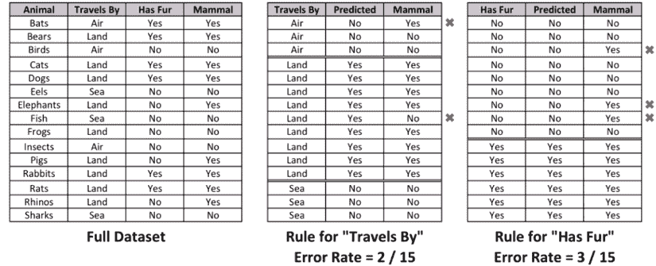

图 5.12：1R 算法选择具有最低误分类率的单一规则

对于*通过*特征，数据集被划分为三个组：*空中*、*陆地*和*海洋*。*空中*和*海洋*组的动物被预测为非哺乳动物，而*陆地*组的动物被预测为哺乳动物。这导致了两个错误：蝙蝠和青蛙。

*有毛皮*特征将动物分为两组。有毛皮的动物被预测为哺乳动物，而无毛皮的动物则不是。共有三个错误：猪、大象和犀牛。由于*通过*特征导致的错误较少，1R 算法会返回以下结果：

+   如果动物通过空中旅行，它就不是哺乳动物

+   如果动物通过陆地旅行，它就是哺乳动物

+   如果动物通过海洋旅行，它就不是哺乳动物

算法在这里停止，因为它找到了最重要的单一规则。

显然，这种规则学习算法可能对于某些任务来说过于基础。您希望医疗诊断系统只考虑单一症状，或者自动驾驶系统只基于单一因素来停止或加速您的汽车吗？对于这些类型的任务，一个更复杂的规则学习者可能更有用。我们将在下一节中了解一个。

## RIPPER 算法

早期的规则学习算法存在几个问题。首先，它们以速度慢而闻名，这使得它们对于日益增多的大型数据集无效。其次，它们通常在噪声数据上容易不准确。

1994 年，Johannes Furnkranz 和 Gerhard Widmer 提出了解决这些问题的第一步。他们的**增量减少错误剪枝**（**IREP**）**算法**结合了预剪枝和后剪枝方法，这些方法可以生成非常复杂的规则，并在从完整数据集中分离实例之前对其进行剪枝。尽管这种策略有助于规则学习者的性能，但决策树通常仍然表现更好。

关于 IREP 的更多信息，请参阅 *Incremental Reduced Error Pruning, Furnkranz, J and Widmer, G, Proceedings of the 11th International Conference on Machine Learning, 1994, pp. 70-77*.

1995 年，威廉·W·科恩引入了**重复增量剪枝以产生误差减少**（**RIPPER**）算法，该算法在 IREP 的基础上进行了改进，以生成与决策树性能匹配或超过性能的规则，这使得规则学习者在 1995 年又迈出了新的一步。

关于 RIPPER 的更多详细信息，请参阅*Cohen, WW，第 12 届国际机器学习会议论文集，1995 年，第 115-123 页*《快速有效的规则归纳》。

如下表概述，RIPPER 的优点和缺点通常与决策树相当。主要好处是它们可能导致一个略微更节俭的模型。

| **优点** | **缺点** |
| --- | --- |

|

+   生成易于理解、人类可读的规则

+   在大型和噪声数据集上效率高

+   通常，产生的模型比可比较的决策树更简单

|

+   可能会导致看似违反常识或专家知识的规则

+   不适合处理数值数据

+   可能不如更复杂的模型表现得好

|

RIPPER 算法是从几个规则学习算法的迭代中演变而来的，它是一系列用于规则学习的有效启发式方法的拼凑。由于其复杂性，对实现细节的讨论超出了本书的范围。然而，可以将其大致理解为三个步骤的过程：

1.  生长

1.  剪枝

1.  优化

生长阶段使用分离和征服技术贪婪地向规则添加条件，直到它完美地分类数据子集或耗尽用于分割的属性。像决策树一样，使用信息增益标准来识别下一个分割属性。当增加规则的具体性不再减少熵时，规则立即被剪枝。第一步和第二步重复进行，直到达到停止标准，此时使用各种启发式方法对整个规则集进行优化。

与 1R 算法相比，RIPPER 算法可以创建更复杂的规则，因为它可以考虑多个特征。这意味着它可以创建具有多个前件的规则，例如“如果一个动物会飞并且有毛皮，那么它是一种哺乳动物。”这提高了算法建模复杂数据的能力，但就像决策树一样，这也意味着规则可能很快变得难以理解。

分类规则学习者的进化并没有随着 RIPPER 而停止。新的规则学习算法正在迅速提出。文献综述显示，有 IREP++、SLIPPER、TRIPPER 等许多其他算法。

## 决策树中的规则

分类规则也可以直接从决策树中获得。从叶节点开始，沿着分支回溯到根节点，你可以得到一系列决策。这些决策可以组合成一条规则。以下图显示了如何从预测电影成功的决策树构建规则：

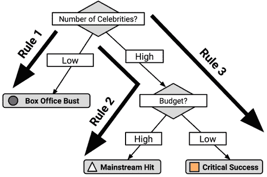

图 5.13：可以通过从根节点到每个叶节点的路径生成规则

沿着从根节点到每个叶节点的路径，规则如下：

1.  如果名人数量少，那么这部电影将是一个 *票房炸弹*

1.  如果名人数量多且预算高，那么这部电影将是一个 *主流热门*

1.  如果名人数量多且预算低，那么这部电影将是一个 *成功的关键*

在下一节中将要解释的原因是，使用决策树生成规则的缺点是生成的规则通常比规则学习算法学习的规则更复杂。决策树使用的划分和征服策略与规则学习器的结果偏差不同。另一方面，有时从树中生成规则在计算上更有效。

在 `C50` 包中，使用 `C5.0()` 函数生成模型时，如果您在训练模型时指定 `rules = TRUE`，则会使用分类规则。

## 什么使得树和规则是贪婪的？

决策树和规则学习器被称为 **贪婪学习器**，因为它们基于先到先得的原则使用数据。决策树使用的划分和征服启发式方法以及规则学习器使用的单独和征服启发式方法都试图一次划分一个部分，首先找到最同质的划分，然后是下一个最好的，以此类推，直到所有示例都被分类。

贪婪方法的缺点是贪婪算法不能保证为特定数据集生成最优、最准确或最少数量的规则。通过早期获取低垂的果实，贪婪学习器可能会迅速找到一个适用于数据子集的准确规则；然而，在这样做的同时，学习器可能会错过开发一个更细致的规则集的机会，该规则集在整个数据集上具有更好的整体准确性。然而，如果不使用贪婪方法进行规则学习，对于除了最小的数据集之外的所有数据集，规则学习可能从计算上不可行。


图 5.14：决策树和分类规则学习器都是贪婪算法

虽然树和规则都采用贪婪学习启发式方法，但它们构建规则的方式存在细微差别。也许最好的区分方式是注意，一旦在特征上进行了划分和征服的分割，分割创建的分区可能不会被重新征服，而只会进一步细分。这样，树就永久性地受限于其过去的决策历史。相比之下，一旦单独和征服找到一个规则，任何未覆盖到该规则所有条件的示例可能会被重新征服。

为了说明这种对比，考虑我们之前构建规则学习器来确定动物是否是哺乳动物的情况。规则学习器确定了三条完美分类示例动物的规则：

1.  在陆地上行走并且有尾巴的动物是哺乳动物（熊、猫、狗、大象、猪、兔子、老鼠和犀牛）

1.  如果动物没有皮毛，它就不是哺乳动物（鸟类、鳗鱼、鱼类、青蛙、昆虫和鲨鱼）

1.  否则，动物是哺乳动物（蝙蝠）

相比之下，基于相同数据的决策树可能提出了四条规则来实现相同的完美分类：

1.  如果动物在陆地上行走并且有尾巴，那么它是哺乳动物（熊、猫、狗、大象、猪、兔子、老鼠和犀牛）

1.  如果动物在陆地上行走但没有尾巴，那么它不是哺乳动物（青蛙）

1.  如果动物不在陆地上行走并且有皮毛，那么它就是哺乳动物（蝙蝠）

1.  如果动物不在陆地上行走并且没有皮毛，那么它不是哺乳动物（鸟类、昆虫、鲨鱼、鱼类和鳗鱼）

这两种方法的不同结果与青蛙在“在陆地上行走”决策后发生的情况有关。规则学习器允许青蛙被“没有皮毛”的决策重新征服，而决策树不能修改现有的分区，因此必须将青蛙放入它自己的规则中。

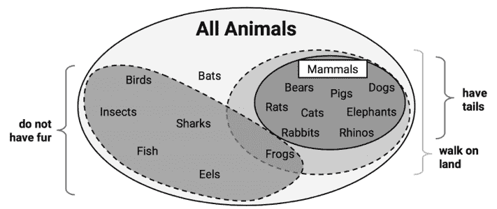

图 5.15：青蛙的处理区分了分而治之与分离和征服启发式方法。后者允许青蛙被后来的规则重新征服。

一方面，因为规则学习器可以重新审视那些被视为但最终未作为先前规则一部分的案件，规则学习器通常比决策树生成的规则更简洁。另一方面，这种数据重用意味着规则学习器的计算成本可能比决策树高一些。

# 示例 - 使用规则学习器识别有毒蘑菇

每年，许多人因食用有毒野生蘑菇而生病，甚至有些人因此死亡。由于许多蘑菇在外观上非常相似，有时即使是经验丰富的蘑菇采集者也会中毒。

与识别有毒植物，如毒橡树或毒常春藤不同，没有像“三叶草，让它去吧”这样的明确规则来识别野生蘑菇是有毒的还是可食用的。

事情变得更加复杂，许多传统规则，例如“有毒蘑菇颜色鲜艳”，提供了危险或误导性的信息。如果能够有简单、明确和一致的规则来识别有毒蘑菇，它们就能拯救采集者的生命。

规则学习算法的一个优点是它们生成的规则易于理解，这使得它们似乎非常适合这个分类任务。然而，这些规则的有效性将取决于它们的准确性。

## 第 1 步 – 收集数据

为了识别区分有毒蘑菇的规则，我们将使用卡内基梅隆大学的杰夫·施利默（Jeff Schlimmer）提供的蘑菇数据集。原始数据集可以从 UCI 机器学习仓库免费获取（[`archive.ics.uci.edu/ml`](http://archive.ics.uci.edu/ml)）。

该数据集包括来自 23 种有菌盖蘑菇的 8,124 个蘑菇样本的信息，这些蘑菇在《奥杜邦北美蘑菇野外指南》（1981 年）中列出。在野外指南中，每种蘑菇物种都被标识为“肯定可食用”、“肯定有毒”或“可能有毒，不建议食用”。为了本数据集的目的，后者组被合并到“肯定有毒”组中，形成两个类别：有毒和非有毒。UCI 网站上可用的数据字典描述了蘑菇样本的 22 个特征，包括如菌盖形状、菌盖颜色、气味、菌褶大小和颜色、菌柄形状和栖息地等特征。

本章使用蘑菇数据的略微修改版本。如果你打算跟随示例进行操作，请从本章的 Packt Publishing GitHub 仓库下载`mushrooms.csv`文件，并将其保存到你的 R 工作目录中。

## 第 2 步 – 探索和准备数据

我们首先使用`read.csv()`函数导入分析所需的数据。由于所有 22 个特征和目标类别都是名义的，我们将`stringsAsFactors = TRUE`设置为利用自动因子转换的优势：

```py
> mushrooms <- read.csv("mushrooms.csv", stringsAsFactors = TRUE) 
```

`str(mushrooms)`命令的输出指出，数据包含 8,124 个观测值和 23 个变量，正如数据字典所描述的那样。虽然大多数`str()`输出并不引人注目，但有一个特征值得提及。你注意到以下行中的`veil_type`变量有什么特别之处吗？

```py
$ veil_type : Factor w/ 1 level "partial": 1 1 1 1 1 1 ... 
```

如果你认为一个因子只有一个级别很奇怪，你是正确的。数据字典列出了该特征的两个级别：`partial`和`universal`；然而，我们数据中的所有示例都被分类为`partial`。很可能这个数据元素被错误地编码了。无论如何，由于菌幕类型在样本之间没有变化，它不会为预测提供任何有用的信息。我们将使用以下命令从分析中删除这个变量：

```py
> mushrooms$veil_type <- NULL 
```

通过将`NULL`赋值给`veil_type`向量，R 将消除蘑菇数据框中的该特征。

在深入探讨之前，我们应该快速查看我们数据集中蘑菇`类型`变量的分布情况：

```py
> table(mushrooms$type) 
```

```py
 edible poisonous
     4208      3916 
```

大约 52%的蘑菇样本是可食用的，而 48%是有毒的。

对于这个实验，我们将蘑菇数据中的 8,214 个样本视为所有可能野生蘑菇的完整集合。这是一个重要的假设，因为它意味着我们不需要为测试目的从训练数据中保留一些样本。我们不是试图开发覆盖未预见蘑菇类型的规则；我们只是试图找到准确描述已知蘑菇类型完整集合的规则。因此，我们可以在相同的数据上构建和测试模型。

## 第 3 步 – 在数据上训练模型

如果我们在这个数据上训练一个假设的 ZeroR 分类器，它会预测什么？由于 ZeroR 忽略了所有特征，只是简单地预测目标的众数，用简单的话说，它的规则会声明“所有蘑菇都是可食用的”。显然，这不是一个非常有用的分类器，因为它会让蘑菇采集者在近一半的蘑菇样本中生病或死亡！我们的规则需要比这个基准做得更好，才能提供可以发布的安全建议。同时，我们需要简单易记的规则。

由于简单的规则仍然可能是有用的，让我们看看一个非常简单的规则学习者在蘑菇数据上的表现。为此，我们将应用 1R 分类器，它将识别对目标类别最有预测性的单个特征，并使用这个特征来构建规则。

我们将使用阿沙芬堡应用科学大学霍格·冯·约恩-迪德里希（Holger von Jouanne-Diedrich）在`OneR`包中找到的 1R 实现。这是一个相对较新的包，它使用原生 R 代码实现了 1R，以提高速度和易用性。如果您还没有这个包，可以使用`install.packages("OneR")`命令进行安装，并通过输入`library(OneR)`来加载。

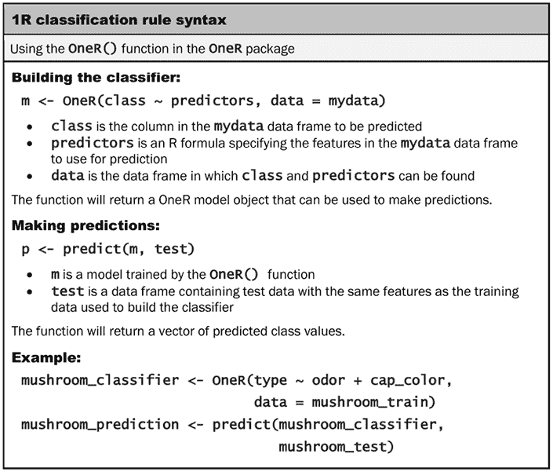

图 5.16：1R 分类规则语法

与 C5.0 一样，`OneR()`函数使用 R 公式语法来指定要训练的模型。使用`type ~ .`公式与`OneR()`一起允许我们的第一个规则学习者在预测蘑菇类型时考虑蘑菇数据中的所有可能特征：

```py
> mushroom_1R <- OneR(type ~ ., data = mushrooms) 
```

要检查它创建的规则，我们可以输入分类器对象的名称：

```py
> mushroom_1R 
```

```py
Call:
OneR.formula(formula = type ~ ., data = mushrooms)
Rules:
If odor = almond   then type = edible
If odor = anise    then type = edible
If odor = creosote then type = poisonous
If odor = fishy    then type = poisonous
If odor = foul     then type = poisonous
If odor = musty    then type = poisonous
If odor = none     then type = edible
If odor = pungent  then type = poisonous
If odor = spicy    then type = poisonous
Accuracy:
8004 of 8124 instances classified correctly (98.52%) 
```

检查输出，我们看到`odor`特征被用于规则生成。`odor`的类别，如`almond`、`anise`等，指定了蘑菇是否可能为`edible`或`poisonous`的规则。例如，如果蘑菇闻起来有`fishy`、`foul`、`musty`、`pungent`、`spicy`或像`creosote`，那么蘑菇很可能是有毒的。另一方面，有更愉快气味的蘑菇，如`almond`和`anise`，以及完全没有气味的蘑菇，被预测为`edible`。对于蘑菇采集野外指南的目的，这些规则可以总结为一条简单的经验法则：“如果蘑菇闻起来令人不快，那么它很可能是有毒的。”

## 第 4 步 – 评估模型性能

输出的最后一行指出，规则正确预测了 8,124 个蘑菇样本中的 8,004 个的可食用性，即近 99%。然而，任何不够完美的预测都存在风险，如果模型将有毒蘑菇错误地分类为可食用，可能会导致中毒。

为了确定是否发生了这种情况，让我们检查预测值与实际值之间的混淆矩阵。这需要我们首先生成 1R 模型的预测，然后将预测与实际值进行比较：

```py
> mushroom_1R_pred <- predict(mushroom_1R, mushrooms)
> table(actual = mushrooms$type, predicted = mushroom_1R_pred) 
```

```py
 predicted
actual      edible poisonous
  edible      4208         0
  poisonous    120      3796 
```

在这里，我们可以看到我们的规则出错的地方。表格的列表示预测的蘑菇可食用性，而表格的行将 4,208 个实际可食用的蘑菇和 3,916 个实际有毒的蘑菇分开。查看表格，我们可以看到尽管 1R 分类器没有将任何可食用的蘑菇分类为有毒，但它将 120 个有毒蘑菇错误地分类为可食用，这造成了极其危险的错误！

考虑到学习器只利用了一个特征，它表现得相当不错；如果你在寻找蘑菇时避免不愉快的气味，你几乎总是能避免去医院。然而，当涉及到生命安全时，即使是接近完美也不够，更不用说当读者生病时，指南出版商可能不会对诉讼的前景感到高兴。让我们看看我们能否添加一些更多的规则，并开发出一个更好的分类器。

## 第 5 步 - 提高模型性能

对于一个更复杂的规则学习器，我们将使用`JRip()`，这是基于 Java 实现的 RIPPER 算法。`JRip()`函数包含在`RWeka`包中，它通过 Ian H. Witten 和 Eibe Frank 开发的基于 Java 的 Weka 软件应用，为 R 提供了访问这些机器学习算法的途径。

Weka 是一个流行的开源和功能齐全的图形应用程序，用于执行数据挖掘和机器学习任务——这类工具中最早的之一。有关 Weka 的更多信息，请参阅[`www.cs.waikato.ac.nz/~ml/weka/`](http://www.cs.waikato.ac.nz/~ml/weka/)。

`RWeka`包依赖于`rJava`包，而`rJava`包本身要求在主机计算机上安装**Java 开发工具包**（**JDK**）才能安装。这可以从`https://www.java.com/`下载，并使用针对您平台的特定说明进行安装。安装 Java 后，使用`install.packages("RWeka")`命令安装`RWeka`及其依赖项，然后使用`library(RWeka)`命令加载`RWeka`包。

Java 是一套无需付费的编程工具，它允许开发和使用跨平台应用程序，如 Weka。尽管它曾经被许多计算机默认包含，但这已经不再是这样了。不幸的是，它可能很难安装，尤其是在苹果电脑上。如果你遇到麻烦，确保你有最新的 Java 版本。此外，在 Microsoft Windows 上，你可能需要正确设置你的环境变量，如 `JAVA_HOME`，并检查你的 `PATH` 设置（在网上搜索详细信息）。在 macOS 或 Linux 电脑上，你也可以尝试从终端窗口执行 `R CMD javareconf`，然后使用 R 命令 `install.packages("rJava", type = "source")` 从源安装 R 包 `rJava`。如果所有其他方法都失败了，你可以尝试一个免费的 Posit Cloud 账户 ([`posit.cloud/`](https://posit.cloud/))，它提供了一个已经安装了 Java 的 RStudio 环境。

在安装了 `rJava` 和 `RWeka` 之后，训练 `JRip()` 模型的过程与训练 `OneR()` 模型的过程非常相似，如下面的语法框所示。这是 R 公式接口的一个令人愉悦的好处：语法在算法之间是一致的，这使得比较各种模型变得简单。

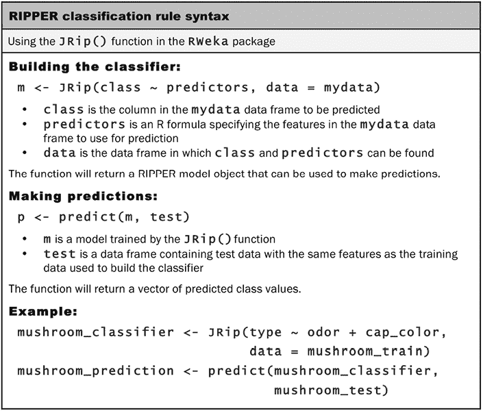

图 5.17：RIPPER 分类规则语法

让我们像训练 `OneR()` 一样训练 `JRip()` 规则学习器，允许它在所有可用特征中找到规则：

```py
> mushroom_JRip <- JRip(type ~ ., data = mushrooms) 
```

要检查规则，请输入分类器的名称：

```py
> mushroom_JRip 
```

```py
JRIP rules:
===========
(odor = foul) => type=poisonous (2160.0/0.0)
(gill_size = narrow) and (gill_color = buff)
  => type=poisonous (1152.0/0.0)
(gill_size = narrow) and (odor = pungent)
  => type=poisonous (256.0/0.0)
(odor = creosote) => type=poisonous (192.0/0.0)
(spore_print_color = green) => type=poisonous (72.0/0.0)
(stalk_surface_below_ring = scaly)
  and (stalk_surface_above_ring = silky)
    => type=poisonous (68.0/0.0)
(habitat = leaves) and (gill_attachment = free)
  and (population = clustered)
  => type=poisonous (16.0/0.0)
=> type=edible (4208.0/0.0)
Number of Rules : 8 
```

`JRip()` 分类器从蘑菇数据中学习了总共八条规则。

读取这些规则的一个简单方法是将它们视为一系列的 if-else 语句，类似于编程逻辑。前三个规则可以表示为：

+   如果气味难闻，那么蘑菇类型是有毒的

+   如果菌盖大小狭窄且菌盖颜色为米色，那么蘑菇类型是有毒的

+   如果菌盖大小狭窄且气味刺鼻，那么蘑菇类型是有毒的

最后，第八条规则意味着任何前七条规则未涵盖的蘑菇样本都是可食用的。按照我们的编程逻辑，这可以读作：

+   否则，蘑菇是可食用的

每条规则旁边的数字表示该规则覆盖的实例数量和误分类实例的数量。值得注意的是，使用这八条规则没有误分类的蘑菇样本。因此，最后一条规则覆盖的实例数量正好等于数据中可食用蘑菇的数量（N = 4,208）。

下图提供了一个如何将规则应用于蘑菇数据的粗略说明。如果你想象这个大椭圆形包含所有蘑菇种类，规则学习器会识别出将同质段与较大群体区分开来的特征，或特征集。首先，算法发现了一群独特的有毒蘑菇，它们以其恶臭而闻名。接下来，它发现了更小、更具体的有毒蘑菇群体。通过为每种有毒蘑菇识别覆盖规则，所有剩余的蘑菇都是可食用的。

感谢大自然母亲，每种蘑菇的独特性足够让分类器达到 100% 的准确性。

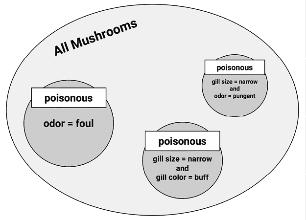

图 5.18：一个复杂的规则学习算法识别了规则，完美地覆盖了所有类型的有毒蘑菇

# 摘要

本章介绍了两种使用所谓“贪婪”算法根据特征值对数据进行划分的分类方法。决策树使用分而治之的策略来创建类似流程图的结构，而规则学习器则分离并征服数据以识别逻辑的 if-else 规则。这两种方法产生的模型可以在没有统计背景的情况下进行解释。

一种流行且高度可配置的决策树算法是 C5.0。我们使用 C5.0 算法创建了一棵树，用于预测贷款申请人是否会违约。通过使用提升和成本敏感的错误选项，我们提高了准确性，并避免了可能给银行带来更多金钱损失的风险贷款。

我们还使用了两个规则学习器，1R 和 RIPPER，来开发识别有毒蘑菇的规则。1R 算法使用单个特征实现了 99% 的准确性，用于识别可能致命的蘑菇样本。另一方面，由更复杂的 RIPPER 算法生成的八条规则正确地识别了每种蘑菇的可食用性。

这仅仅触及了如何使用树和规则的一角。下一章，*第六章*，*预测数值数据 – 回归方法*，描述了被称为回归树和模型树的技巧，这些技巧使用决策树进行数值预测而不是分类。在第八章，*寻找模式 – 使用关联规则进行市场篮子分析*中，我们将看到关联规则——分类规则的近亲——如何被用来识别交易数据中的物品组。最后，在第十四章，*构建更好的学习者*中，我们将发现如何通过将决策树组合在一个称为随机森林的模型中来提高决策树的表现，此外还有其他依赖于决策树的先进建模技术。

# 加入我们书籍的 Discord 空间

加入我们的 Discord 社区，与志同道合的人相聚，并和超过 4000 人在以下链接处一起学习：

[`packt.link/r`](https://packt.link/r)


